# 65：CS 182 讲座 21 - 第 2 部分 - 元学习 🧠

在本节课中，我们将要学习元学习的两种主要方法：非参数元学习和基于梯度的元学习。我们将探讨它们的基本原理、核心公式以及各自的优缺点。

---

## 概述 📋

元学习的目标是让模型学会如何学习。在讲座的这一部分，我们将深入探讨两种实现元学习的具体方法。首先，我们将介绍非参数元学习方法，它通过比较特征空间中的嵌入来进行分类。接着，我们将转向基于梯度的元学习方法，它通过优化模型使其能够通过少量梯度步骤快速适应新任务。

---

## 非参数元学习方法 🔍

上一节我们介绍了元学习的基本概念，本节中我们来看看非参数元学习方法。这类方法的核心思想是学习一个特征嵌入函数，使得在新任务上通过简单的最近邻比较就能获得良好的分类效果。

### 基本思想

非参数元学习方法的基本流程如下：我们进行少样本训练。这里可以将其视为一个一次性训练集，例如有五个图像，每个对应不同的标签。通常每个类别可能有多个示例，但这里我们假设每个类别只有一个示例。

每个图像都有一个标签，例如 L1, L2, L3, L4, L5。我们不知道这些标签的具体含义，它们只是整数，在不同的任务中代表不同的东西。

然后我们有一个测试图像，其标签未知。我们需要弄清楚训练图像中哪一个与测试图像具有相同的标签。这是我们在适应过程中要解决的基本问题。

我们将使用一个神经网络来描述这些图像中的每一个。该网络将每个图像嵌入到一个特征空间中。我们称这个网络为 **φ**。我们还将嵌入测试图像。稍后，我们会讨论如何将测试图像嵌入到与训练图像不同的特征空间中。在训练图像中，我们实际上会切换到使用 **f** 和 **g**，其中 **f** 嵌入测试图像，**g** 嵌入训练图像。但目前，我们可以假设它们都在同一个空间里，我们称这个空间为特征空间。

接下来，我们要做的是比较 **φ(x_test)** 与每个训练图像的嵌入 **φ(x_train)**。直观上，我们要做的是找到最近的嵌入。在这个特征空间里，我们的测试图像嵌入最接近哪个训练图像的嵌入？当然，仅从像素层面进行最近邻查询可能没有意义，但我们可以元学习一个特征空间，使得这种比较变得有意义。

假设我们发现 **φ(x_3)** 是 **φ(x_test)** 的最近邻。那么我们分配标签的方式就是采用最接近图像的标签，在这个例子中就是 x_3 的标签。

### 为什么这能起作用？

为什么在这个特征空间中的最近邻比较实际上能给出正确答案？一般来说，如果特征空间是任意的，这不一定是一个有效的分类器。那么为什么最近邻在这样的方法中能有正确的类别呢？因为这就是元训练试图做到的。

所有这些工作的关键是能够元训练嵌入函数 **φ**，使得在元训练集的任务上，这种特定的最近邻查询能产生正确答案。那么希望它在你的元测试任务中也能产生正确答案。这是这种少样本元学习的基本思想。你需要确保你的元训练过程与元测试时要做的事情一致。如果在元测试时你将执行最近邻查询，那么只要你训练的网络 **φ** 在执行最近邻查询时是准确的，那么你在元测试时的最近邻查询就会给你正确的答案。

这意味着元训练过程可以这样形式化。这正是我之前的等式，只是之前我有 **φ = f_θ**，现在我只是把它代入优化中，使其成为一个无约束问题。

所以 **θ*** 表示嵌入函数的参数，它最小化损失。损失由 **f_θ** 应用于对应的训练集 **D_train** 得到，尽管我们将使用一种“软”最近邻方法。

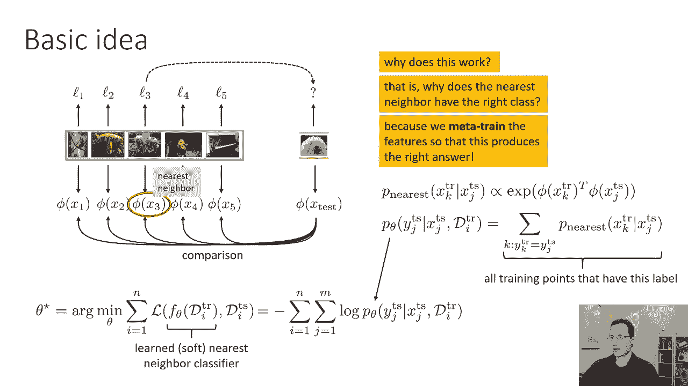

### 损失函数公式化

如果我们使用负对数似然损失（这是我们通常用于分类的损失），这可以重写为所有任务损失之和的负数。

以下是损失函数的公式：

```
L(θ) = - Σ_{i=1}^{N} Σ_{j=1}^{M} log p_θ(y_j^{test} | x_j^{test}, D_train^{i})
```

其中：
*   `N` 是元训练任务的数量。
*   `M` 是每个任务中测试点的数量。
*   `p_θ(y_j^{test} | x_j^{test}, D_train^{i})` 是在给定测试图像 `x_j^{test}` 和整个训练集 `D_train^{i}` 的条件下，测试标签 `y_j^{test}` 的概率。

你最大化每个测试点标签的对数概率，给定每个测试点的图像以及该任务的整个训练集。你把所有测试点和所有任务加起来，并实际定义这个对数概率。

### 定义概率 `p`

我们要定义这个概率量 `p_nearest`，即训练点 `x_k^{train}` 是测试点 `x_j^{test}` 最近邻的概率。

`p_nearest` 将与 `exp(φ(x_k^{train})^T · φ(x_j^{test}))` 成正比。它不一定是转置点积，也可以是欧几里得距离或余弦距离。关键是它是 `φ(x_k^{train})` 和 `φ(x_j^{test})` 相似度的度量。

因此，特征表示最接近 `x_j^{test}` 特征表示的训练点 `x_k^{train}` 将具有最大的点积，因此指数内的值最大。因为这是训练点的分布，我们通过除以所有训练点的指数之和来将其归一化。

所以你可以把它看作是应用于 `φ(x_k^{train})^T · φ(x_j^{test})` 的 softmax 函数。如果这些点积非常大，那么 softmax 最终会接近硬最大值，这意味着在最近的邻居上会有一个权重为 1，其他一切都为零。但对于较小的值，它将被平滑处理。

### 分配标签概率

现在，你可以考虑为特定标签 `y` 定义概率 `p(y_j^{test} = y)`，作为所有标记为 `y` 的训练点是最近邻的概率之和。

换句话说，如果你想知道标签是 `L` 的概率是多少，我们总结所有以 `L` 为标签的训练点，把它们成为最近邻的概率加起来。所以，如果标签为 `L` 的点（例如第三个点）最有可能是最近的邻居，这意味着它的标签是正确标签的概率也是最高的。

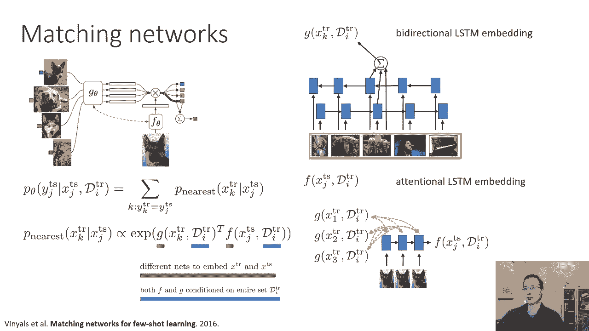

另一种思考方式是，对于每个标签，你求和所有带有该标签的点是最近邻的概率。然后，具有最高概率和的标签，就是你将分配给该测试点的标签。

### 简单回顾

我们要计算 `p_nearest`，即每个训练点是我们测试点最近邻的概率。然后，我们会说，标签的概率是每个标签为 `y` 的训练点是最近邻的概率之和。所以，在我们的软极限变成硬极限的情况下，那么它的标签也最有可能是正确的标签之一。

现在，我们为 `log p_θ(y_j^{test} | x_j^{test}, D_train)` 设计了一个公式，这给出了我们的训练目标。因为这里的一切都是可微的（我们用的是软最近邻），我们可以通过它反向传播梯度。我们实际上可以优化所有这些关于我们的嵌入函数 **φ** 的参数 **θ**。

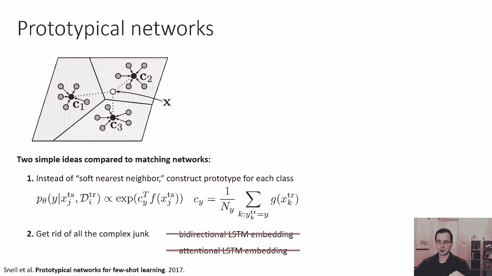

所以，参数 **θ** 唯一影响的就是嵌入。这是非参数元学习的一个非常简单的公式。现在，实践中使用的实际方法通常更复杂一点。这是我们能设计的最简单的基本版本。

---

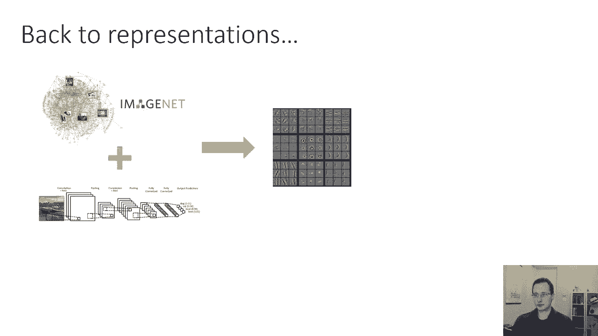

## 实际方法：匹配网络 🤝

现在我们将讨论一些基于这个想法的实际方法。我们要讨论的第一个是为少样本学习设计的匹配网络。

匹配网络与我在这张幻灯片上的基本原型非常相似，但是经过几个修改，这些修改与如何计算 `p_nearest` 概率有关。

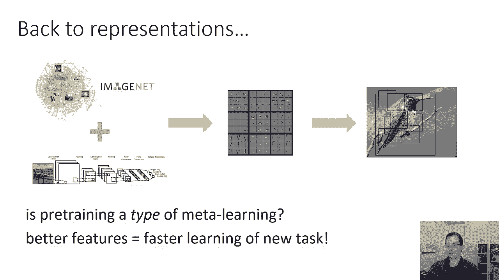

以下是匹配网络的两个关键修改：

1.  **不同的嵌入函数**：在匹配网络中，不是使用一个函数 **φ** 来计算 `φ(x_k^{train})^T · φ(x_j^{test})`，而是使用两个不同的函数 **g** 和 **f**。所以，不是一个函数 **φ**，而是有两个函数 **g** 和 **f**，这两个函数都是元训练的。因此，我们用不同的网络来嵌入 `x_train` 和 `x_test`：**g** 嵌入 `x_train`，**f** 嵌入 `x_test`。
2.  **条件化嵌入**：匹配网络的另一个区别是 **g** 和 **f** 都是有条件的。它们不仅以 `x_train` 和 `x_test` 为条件，还以整个训练集为条件。这样做的原因是因为你可能想做类似于消歧的过程。你可能想知道你表示左边狗的方式可能会改变，取决于所有其他图像是狗还是其他动物。所以，如果整个训练集只是狗的照片（你在试图把不同品种的狗分类），编码将指示品种的属性，而不是指示是否是狗的属性。但是，如果你在嵌入一只狗的图像，而其他训练图像是猫、长颈鹿和河马，那么你可以选择对区分不同种类动物有用的特征，而不是不同品种的狗。所以这就是为什么 **g** 和 **f** 都依赖于整个训练集。

这需要我们为 **g** 和 **f** 选择一个架构，该架构可以嵌入相应的 `x_train_k` 和 `x_test_j`，同时也考虑到整个训练集。

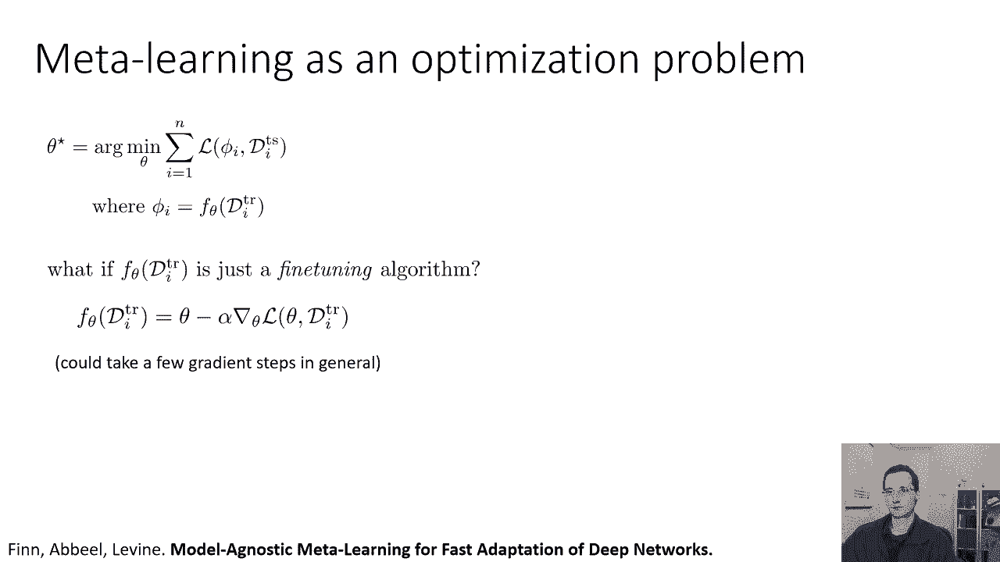

论文中对 **g** 所做的特别选择是使用双向 LSTM。它的工作原理如下：你拿着你的训练集，运行一个前向 LSTM（按某种顺序），你还有另一个 LSTM，你向后运行。然后，**g** 的输出由前向 LSTM 的隐藏状态、后向 LSTM 的隐藏状态以及嵌入的图像本身相加形成。因为前向和后向的 LSTM 包含了关于所有其他点的信息，所以你的嵌入可以是上下文相关的。

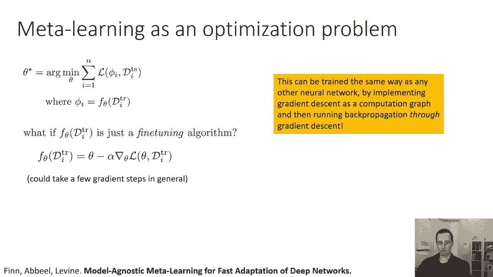

对于 **f** 函数，原则上可以以同样的方式工作，但在这篇论文中，他们为它选择了一种不同的、更复杂的表示（注意力 LSTM）。高层的想法是，他们做的事情基本上和标准的非参数公式一样，但做了两个修改：分别使用不同的函数 **g** 和 **f** 嵌入训练点和测试点，并且每个嵌入函数本身也取决于整个训练集。这是最早的论文之一，真正证明了这种非参数公式可以非常有效。

---

## 实际方法：原型网络 ⭐

大多数人实际上并不使用匹配网络。一种更广泛使用的方法是所谓的原型网络。这实际上简化了公式。

原型网络可以被视为匹配网络，只需两个简单的修改：

1.  **为每个类构建原型**：原型网络不做软最近邻比较。他们所做的是为每个类构建一个原型向量。这个想法是，`p(y | x_test)` 现在由原型向量 **c** 上的 softmax 给出。所以你仍然用嵌入函数 **f** 嵌入 `x_test`，但不是用它的点积与每个 `g(x_train_k)`，而是用它的点积与 **c_y**，其中 **c_y** 只是所有属于类别 `y` 的 `x_train_k` 嵌入的平均值。因此，原型网络将嵌入所有训练点，将它们的嵌入按类别平均在一起，然后点积这些平均值。你可以把它看作是一个逻辑回归分类器，其中分类器权重是通过将训练点的嵌入平均在一起产生的。
2.  **简化架构**：在原型网络中，第二个修改是摆脱所有复杂的架构（如双向 LSTM 或注意力机制）。**g** 和 **f** 分别只依赖于 `x_train` 和 `x_test`。它们不再以整个训练集为条件。这使得方法简单了许多。所以 `f(x_test)` 是一个嵌入，`g(x_train)` 也是一个嵌入，就是这样。

这种方法实际上在许多方面更简单，并且被广泛使用。

---

## 基于梯度的元学习方法 📈

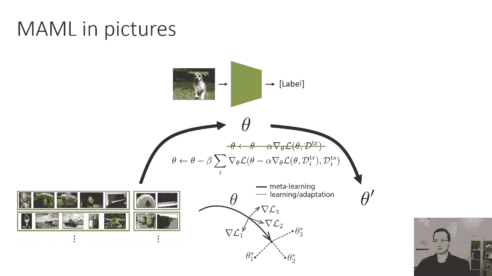

这节课的下一部分是关于基于梯度的元学习方法。这些方法一开始看起来是在非常不同的原则上运作的，但我们会看到最后，在很多方面，它们其实有很多相似之处。

### 动机：从预训练到元学习

建立基于梯度的元学习的动机，让我们回到我们已经学到的东西。如果你拿一个像 ImageNet 这样非常大的数据集，你在上面训练一个大的神经网络（比如 ResNet），你可以微调该网络以解决其他任务。所以你基本上可以提取网络中的特征，你可以用较少数量的数据点进行微调，以解决一些较小的任务，例如细粒度分类。

我们可以问的问题是：预训练实际上只是一种元学习吗？它似乎有一个非常相似的公式。你要用一个非常大的、多样的先验数据集得到一些东西，然后你可以用它来更有效地解决新任务。预训练为你提供更好的特征，使人们能够更有效地学习新任务。

基于梯度的元学习的想法是基本上利用这个配方，但是修改预训练阶段，以便它显式地优化以更好地进行微调。

### 将元学习框定为优化问题

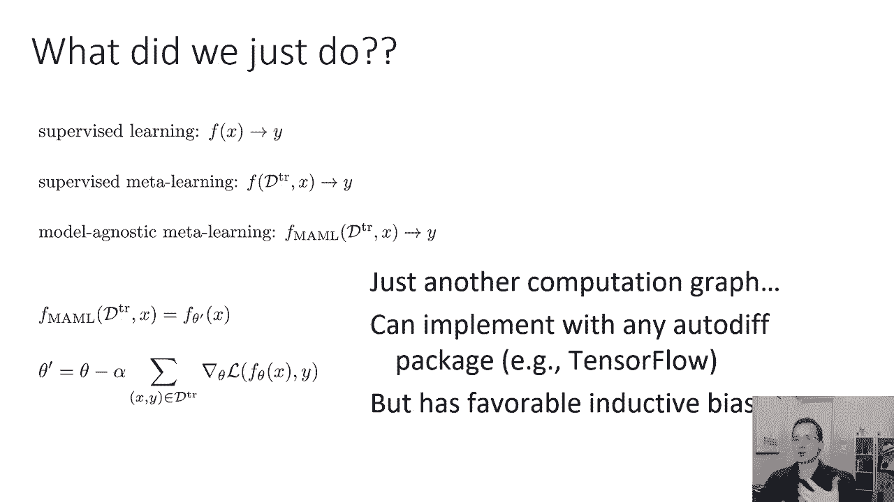

下面是我们如何将元学习框定为一个优化问题。这是我们在第一部分中对元学习的抽象看法。`f_θ(D_train)` 只是一个微调算法。在 `f_θ(D_train)` 之前，它是一个类似于 RNN 的东西，在训练集中读取。如果我们真的让 `f_θ(D_train)` 像一个梯度下降步骤，那么 `f_θ(D_train)` 就是神经网络的参数 **θ** 减去学习率 **α** 乘以在训练集 `D_train` 上损失的梯度 `∇_θ L(θ, D_train)`。一般情况下，它可以是多个梯度步骤。只要是固定数量的梯度步骤，这就是一个可以展开的函数，你可以评估它。它只是一个定义良好的函数，就像 RNN 是一个定义良好的函数一样，梯度下降也是一个定义良好的函数。

至关重要的是，这可以像任何其他神经网络一样训练，通过将梯度下降实现为 PyTorch 或 TensorFlow 中的计算图，然后通过梯度下降反向传播。因此，元训练过程涉及优化 **θ**，使得在 **θ** 上应用这些梯度步骤后得到的参数向量 **θ'**，在测试集 `D_test` 上表现良好。

### 模型不可知元学习（MAML）图解

也许用图片来说明这一点会有所帮助。这种方法叫做模型不可知元学习（MAML）。它是这样工作的：

假设你有你的神经网络，它有参数 **θ**。它只是一个普通的神经网络。它接收一个图像并输出一个标签。如果要在单个任务上训练此网络，每一个训练步骤都将是在训练集损失上的一个梯度下降步骤。

在元学习中，我们要做的是：我们实际上会训练网络，以便在每个任务上都有一个梯度步骤，从而最小化该任务的测试损失。所以现在，每一个元训练步骤都会执行以下更新：

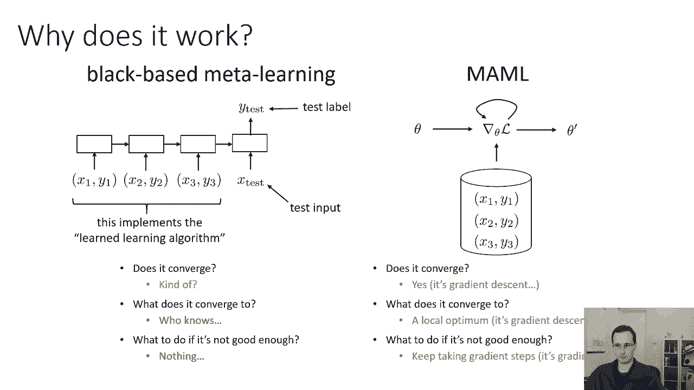

```
θ <- θ - β * Σ_i ∇_θ L(θ'_i, D_test^i)
```

其中：
*   `β` 是元学习率。
*   `θ'_i = θ - α * ∇_θ L(θ, D_train^i)` 是在任务 `i` 的训练集上经过一个梯度步骤后得到的参数。
*   `L(θ'_i, D_test^i)` 是在任务 `i` 的测试集上，使用更新后的参数 `θ'_i` 计算的损失。

我们试图最小化的是所有任务上这些更新后参数的测试损失之和。另一种思考方式是，我们试图找到一个初始参数向量 **θ**，我们可以从中通过微调（少量梯度步骤）尽可能好地完成我们元训练集中的每一个可能的任务。

在高层次上，它所做的是元训练模型，使其能够非常好地进行微调。从某种意义上说，你刚刚微调的相应任务的测试损失应该很低。

### MAML 与其他方法的联系

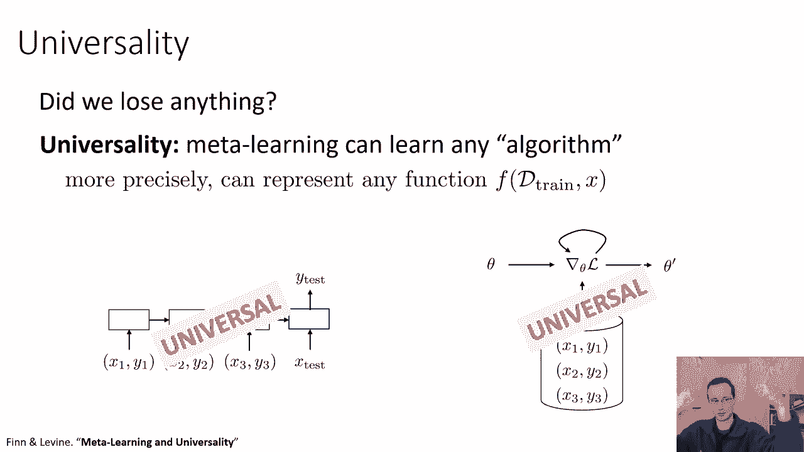

我们刚才所做的基于有意义的微调直觉，但这是如何映射到我们所学到的所有其他元学习方法的呢？

让我们回到基础：
*   **监督学习**：学习一个从 `x` 映射到 `y` 的函数 `f`。
*   **监督元学习**：学习一个从 `(D_train, x)` 映射到 `y` 的函数 `f`。

模型不可知元学习只是这个函数的一个特殊选择。这是一个选择，其中 `f_MAML(D_train, x)` 由 `f_θ'(x)` 给出，其中 `θ'` 是通过在 `D_train` 上取梯度步来获得的。但这只是一个函数。它有梯度下降的事实，对于元学习的目的来说，实际上并不那么重要。它只是一个函数，这意味着您可以用 PyTorch 或 TensorFlow 对其进行编码，你可以把它看作是另一个计算图。你的自动微分包（如 PyTorch 或 TensorFlow）实际上可以通过这个梯度下降过程反向传播。唯一的细节是，它将涉及通过神经网络计算二阶导数。

### 归纳偏差与优势

现在你可能会问，如果它只是另一个计算图，为什么要这样做？嗯，事实证明，这种方法有一个非常有利的归纳偏差。归纳偏差意味着这种设计非常适合解决学习问题。

为什么很好？因为它在做梯度下降。当你真正想适应的任务与你元训练的任务不完全相同时，这很重要。这个想法是，如果你看到一个与你以前看到的任务相似的任务，这当然工作得很好，但是如果你看到有点不同的任务，这仍然有效。

如果我们回想一下黑盒元学习方法，我们可以说，这些算法中的哪一部分实现了学习算法？学习算法只是向前运行 RNN。所以运行大概在里面的某个地方，它权重内的神经网络，是对如何适应新任务的理解。因此，习得的学习算法只是对应于向前运行你的 RNN。但如果我们要说这是一个习得的学习算法，我们可以开始问关于它是否收敛得很好的问题。因为你把你的 RNN 向前运行，你得到了答案，它会聚到什么程度？我们不知道，因为这将是 RNN 的结果。

与基于梯度的方法相比，它仍然是一个计算图，只是一个不同的、其中有梯度运算符的图。我们可以问同样的问题：它是否收敛？它确实收敛，因为它是梯度下降。它会聚到什么程度？它汇聚到你的新任务训练误差的局部最优点，因为它是梯度下降。如果结果不够好，你可以继续走更多的梯度步骤，因为这只是梯度下降。事实上，MAML 允许你在适应新任务时采取比元训练中更多的梯度步骤，这通常可以得到更好的解决方案。

### 通用性

现在我们可以问另一个关于通用性的问题。你的元学习算法能学习任何算法吗？也许适应这个特定的任务需要一些非常复杂的数学运算，你的元学习算法真的能学习复杂的数学运算吗？更准确地说，这类似于说，它能表示 `(D_train, x)` 的任何函数吗？

黑盒元学习方法是通用的（如果你有超大的 RNN，原理上它们可以表示任何函数）。但模型不可知元学习（MAML）或基于梯度的元学习实际上是通用的吗？因为它受到约束，必须使用梯度下降来适应新的任务。但事实证明，黑盒元学习法和梯度下降法都是通用的。这是一个有点令人惊讶的事实，但这其实是真的。本质上，这相当于说，如果你元训练一个深网的初始参数，你实际上可以“设计”那个深网，使得梯度下降更新做任何你想做的事。你的神经网络有很多层，这些图层会影响其他图层的梯度，从而可以实现复杂的更新行为。

---

## 总结与比较 🏁

本节课中我们一起学习了三类元学习方法：

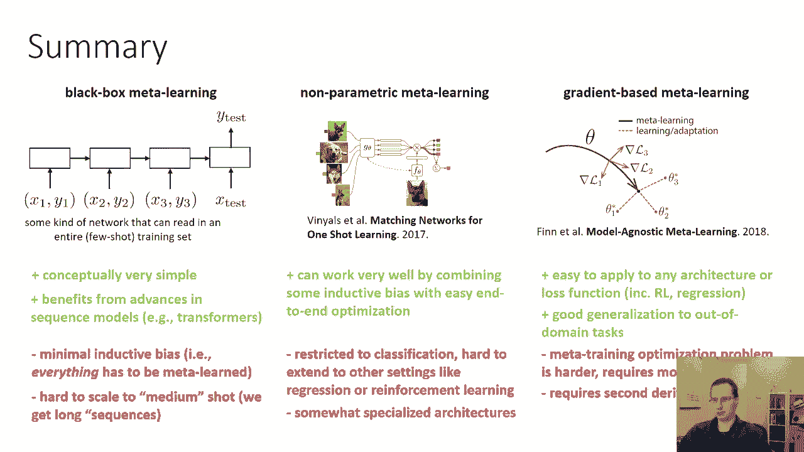

1.  **黑盒元学习方法**：在训练集中使用某种序列模型（如 RNN、Transformer）进行读取。
2.  **非参数元学习方法**：以某种方式嵌入所有训练点，并做一些软最近邻的变体来将它们匹配到测试点（如匹配网络、原型