# 66：CS 182 讲座 21 第 3 部分 - 元强化学习 🧠🤖

在本节课中，我们将要学习如何将元学习的概念应用于强化学习任务，即元强化学习。我们将通过类比的方式，从一般元学习过渡到元强化学习，并介绍其核心思想、两种主要实现方法（黑盒方法与基于梯度的方法）以及实际应用示例。

## 概述

元强化学习旨在让智能体学会如何学习。具体来说，它通过在多个相关任务（即多个马尔可夫决策过程，MDP）上进行训练，使得智能体在面对新任务时，能够利用少量交互经验快速适应，从而显著减少深度强化学习通常所需的巨大样本量。

## 从一般元学习到元强化学习

上一节我们介绍了元学习的一般形式。本节中我们来看看如何将其框架迁移到强化学习领域。

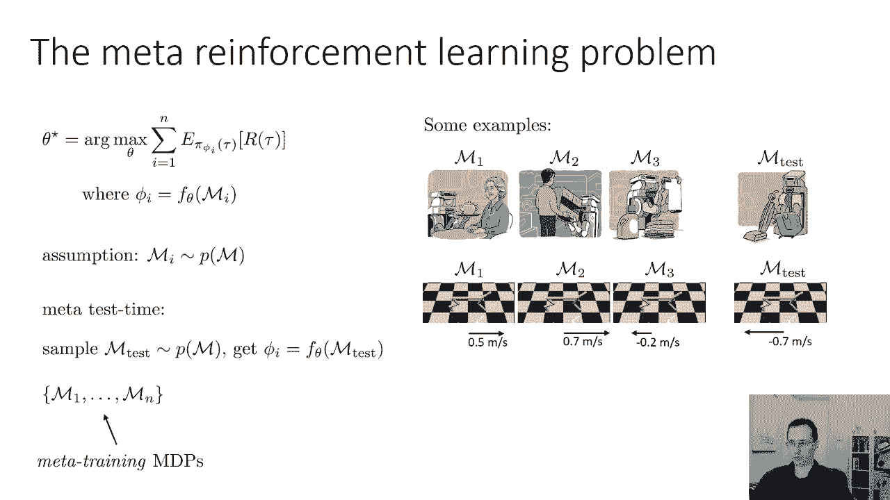

一般元学习可以表述为：寻找一个学习函数 `f_θ`，该函数应用于训练集 `D_train` 后，能在测试集上最小化损失。其目标可写为：
`θ* = argmin_θ L(φ, D_test)`，其中 `φ = f_θ(D_train)`。

在强化学习中，最优策略参数 `θ*` 是通过最大化期望累积奖励获得的：
`θ* = argmax_θ E_τ~π_θ [R(τ)]`。
我们可以将其视为一个函数 `F_RL` 应用于一个 MDP `M` 的结果。

元强化学习则定义如下：我们要找到一组元参数 `θ`，使其在多个元训练 MDP `{M_i}` 上的期望性能之和最大。对于每个 MDP `M_i`，我们最大化策略 `π_φ` 的期望奖励，其中适应后的参数 `φ` 是通过将学习算法 `f_θ` 应用于 `M_i` 得到的。形式化表示为：
`θ* = argmax_θ Σ_i E_τ~π_φ_i [R(τ)]`，其中 `φ_i = f_θ(M_i)`。

元训练假设所有 MDP 来自同一个分布 `p(M)`。元测试时的新 MDP 也来自该分布，这保证了任务间的结构相似性，使得元学习到的经验能够泛化。

## 黑盒元强化学习 🎯

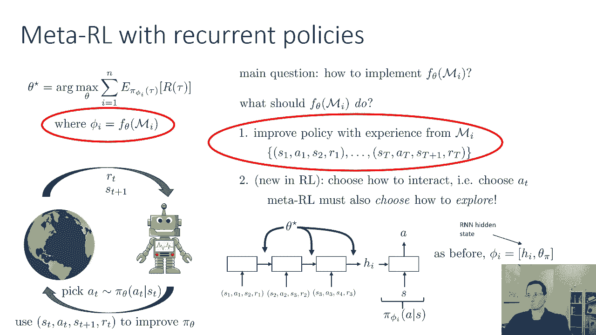

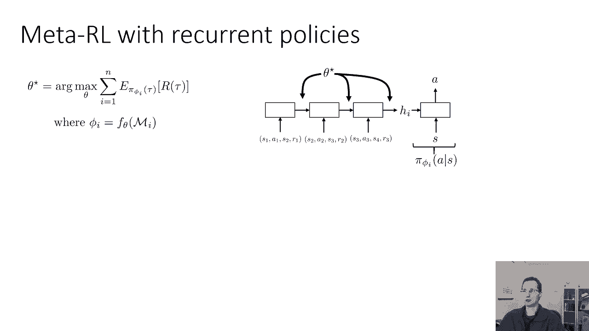

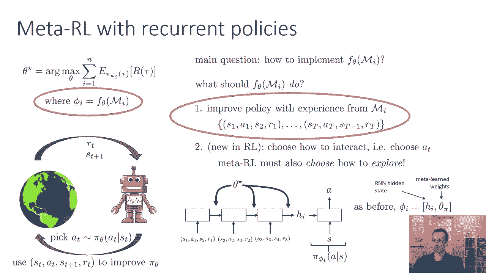

黑盒方法是元强化学习中最直观的一类。其主要挑战在于如何设计函数 `f_θ` 来处理 MDP。`f_θ` 需要完成两件事：
1.  利用与 MDP 交互产生的数据来改进策略。
2.  决定如何与环境交互以收集数据，即需要学会探索。

以下是实现黑盒元强化学习的一种典型方式：

我们使用一个循环神经网络作为策略网络。RNN 在每个时间步读取智能体与环境交互产生的转移数据 `(s_t, a_t, r_t, s_{t+1})`，并更新其隐藏状态 `h_t`。该隐藏状态与当前状态 `s_t` 一起用于预测下一个动作 `a_t`。关键点在于，**RNN 的隐藏状态在多个训练回合之间不会被重置**。这使得 RNN 能够记住跨回合的经验（例如奖励的位置），从而学会探索并快速适应新任务。

训练这个 RNN 策略本身就是一个强化学习过程，只不过目标是在一个很长的“元回合”（包含多个任务回合）中最大化累积奖励。通过这种方式，元强化学习问题被简化为一个更高层的标准强化学习问题。

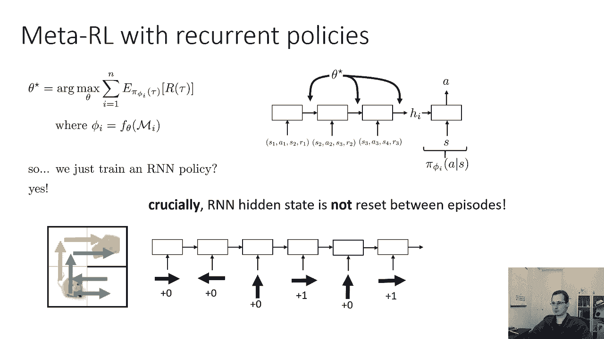

以下是一些应用示例：
*   **简单迷宫导航**：智能体（如老鼠）需要找到奶酪。不同 MDP 对应奶酪在不同位置。RNN 策略通过几轮探索记住奖励位置，后续回合便能直接前往。
*   **记忆控制与导航任务**：早期研究（如2015年的“Memory-based Control”）和近期工作（如“RL^2”）都展示了RNN策略在迷宫等任务中通过记忆实现快速适应的能力。

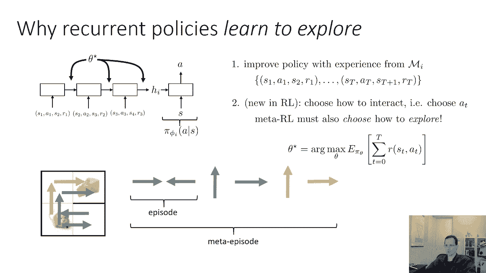

一个有效的架构变体是：将所有观察到的转移 `(s, a, r, s')` 独立编码为嵌入向量，然后将这些嵌入相加或聚合，作为策略的输入。这类似于原型网络的思想，通常效果很好。

## 基于梯度的元强化学习 📈

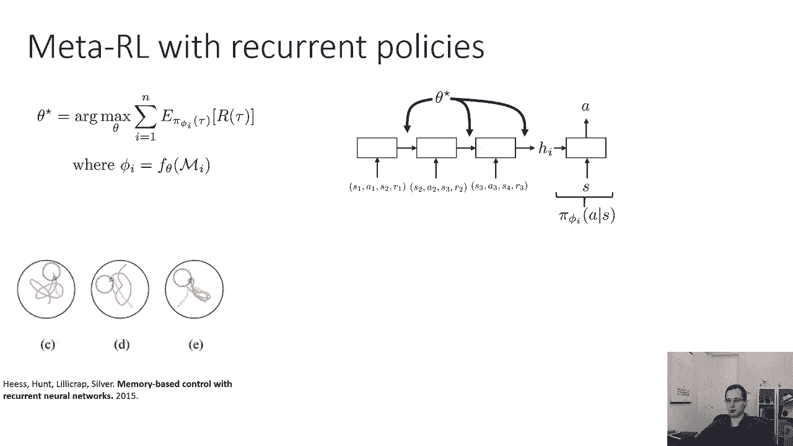

基于梯度的元强化学习（如MAML的RL版本）与监督学习中的工作原理基本相同。

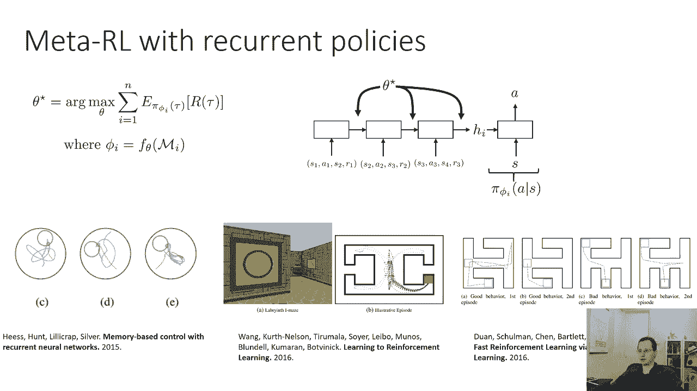

在常规强化学习中，我们收集一个任务（如向前跑）的多个回合数据，然后使用策略梯度等方法更新策略参数。

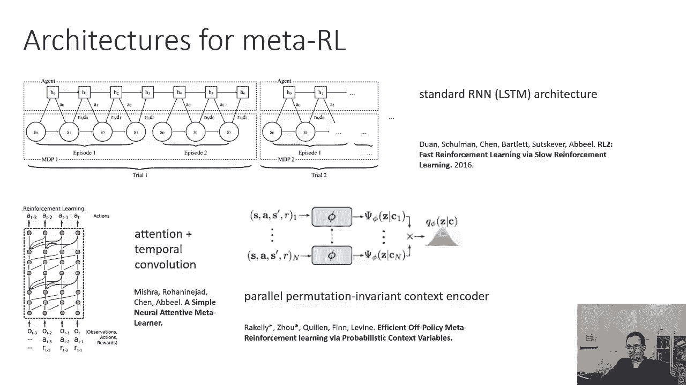

在基于梯度的元强化学习中，我们在多个不同任务（如向不同方向跑）上收集数据。元训练的目标是找到一组初始参数 `θ`，使得对每个任务 `M_i` 执行一步策略梯度更新（适应步）后，在新参数 `φ_i` 下该任务的性能提升最大。其优化目标与监督MAML类似，但损失函数换成了负期望奖励（即我们希望奖励最大化）。

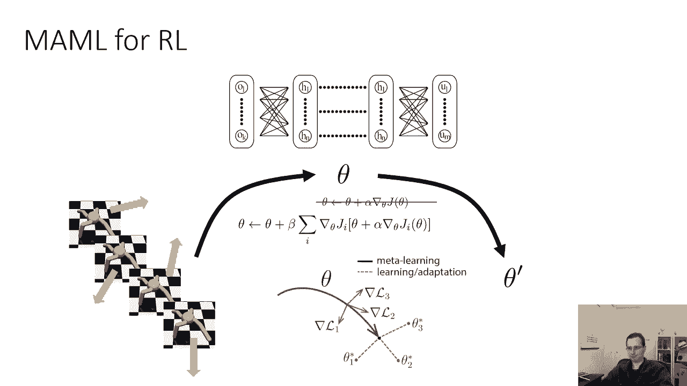

计算上，这涉及策略梯度的二阶导数，需要更复杂的微积分，但核心理念完全一致。

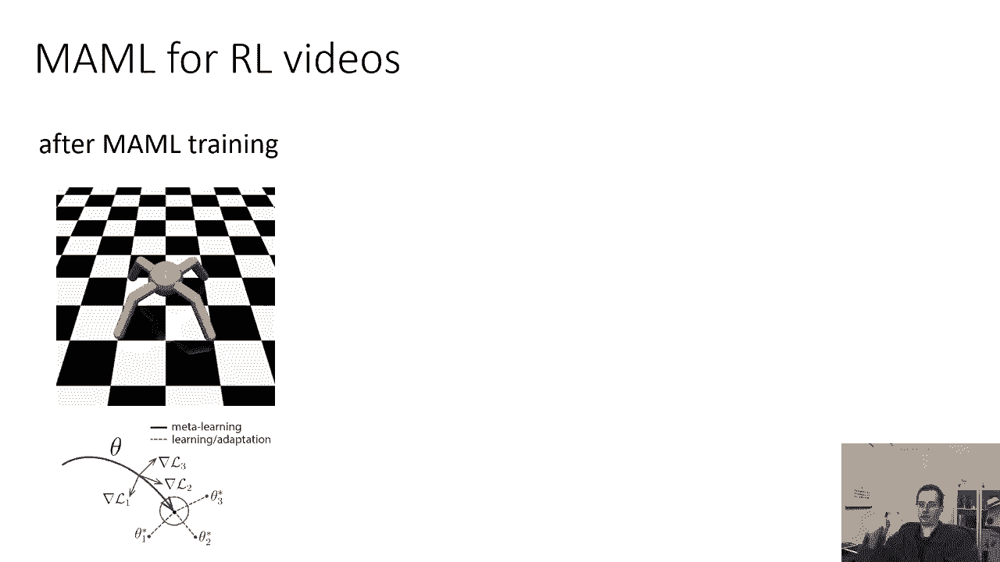

**实践示例**：对一个四足机器人进行元训练，任务集是向不同方向奔跑。元训练后，面对一个新方向任务，机器人先用初始参数 `θ` 运行（产生一些探索性行为），然后根据收集到的数据计算一个策略梯度步来更新参数。通常，仅需一次梯度更新，机器人就能学会朝正确的方向奔跑。

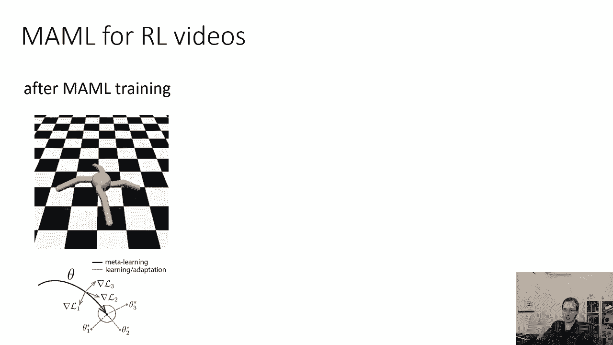

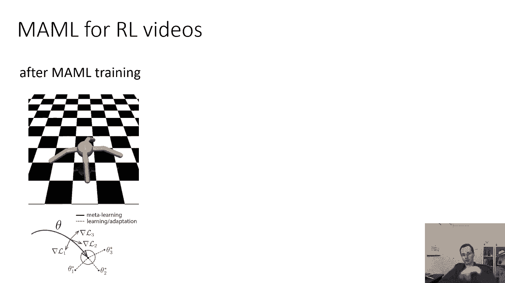

## 总结

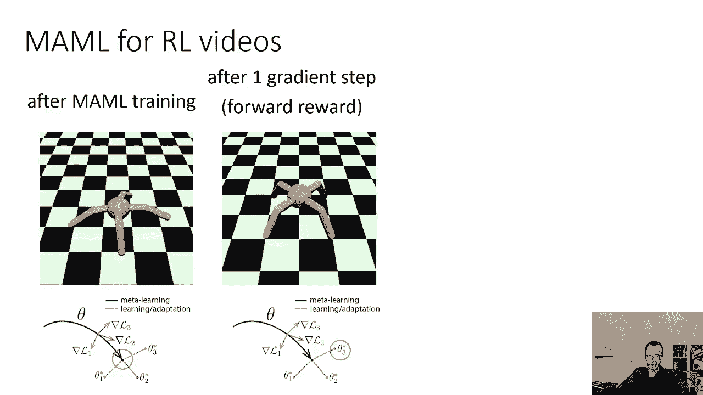

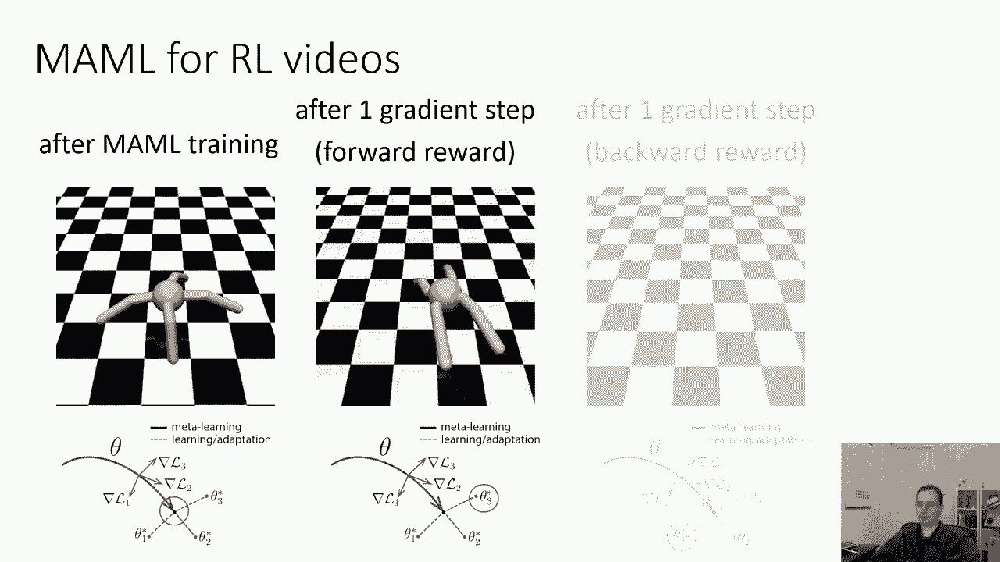

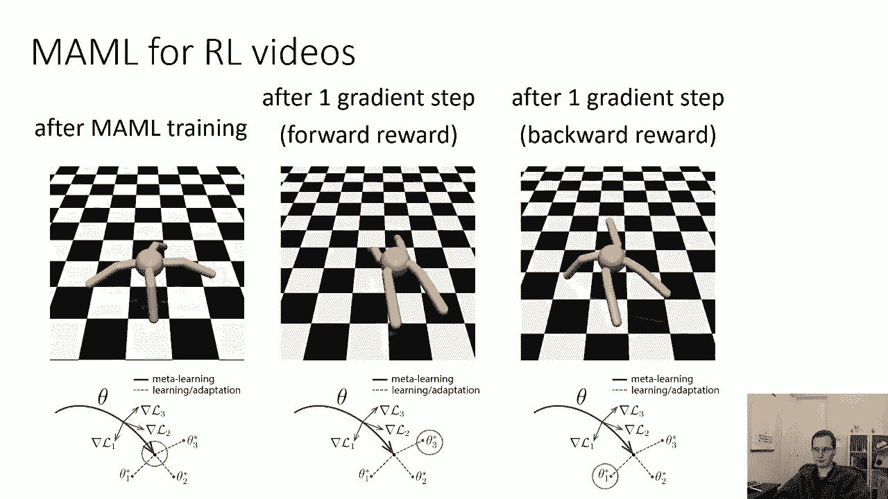

本节课中我们一起学习了元强化学习。我们首先通过类比一般元学习，定义了元强化学习的问题框架。接着，我们探讨了两种主要方法：
1.  **黑盒方法**：使用RNN等序列模型，通过在回合间保留隐藏状态来记忆和快速适应，同时自动学习探索策略。
2.  **基于梯度的方法**：将MAML等框架直接应用于RL，通过优化初始参数使得策略在一步梯度更新后能在新任务上快速提升性能。

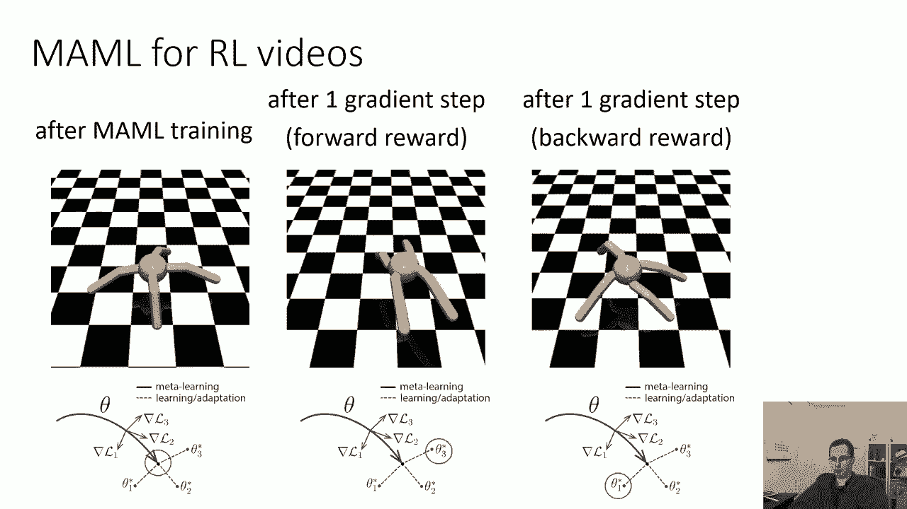

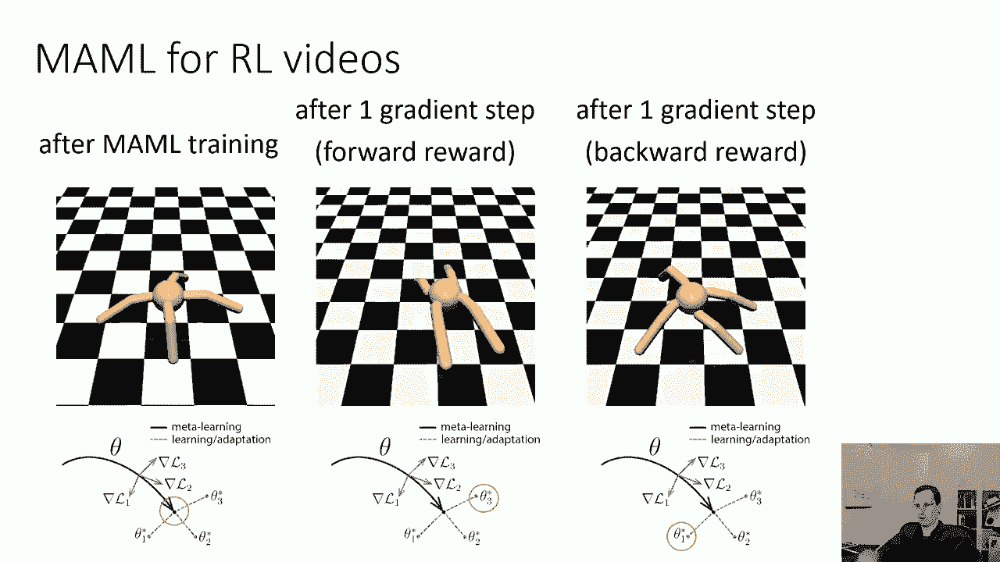

元强化学习的核心优势在于，它能将深度强化学习在适应新任务时所需的巨量交互，减少到仅需几次交互，尽管元训练过程本身可能仍然需要大量数据。这使得它在机器人控制、快速适应新环境等场景中具有巨大潜力。