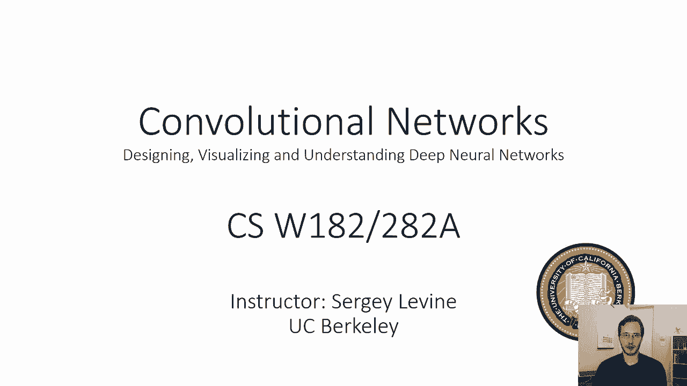
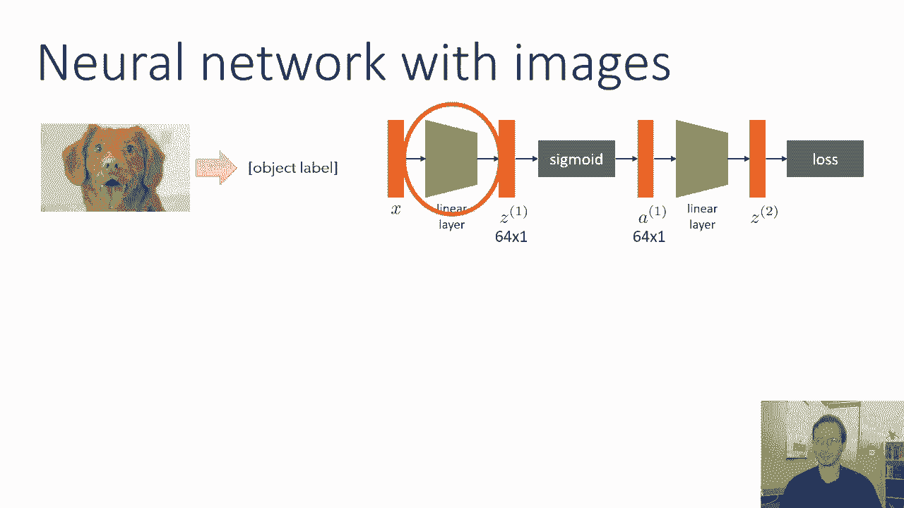
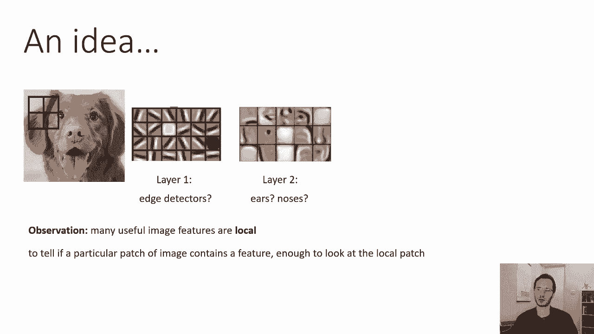
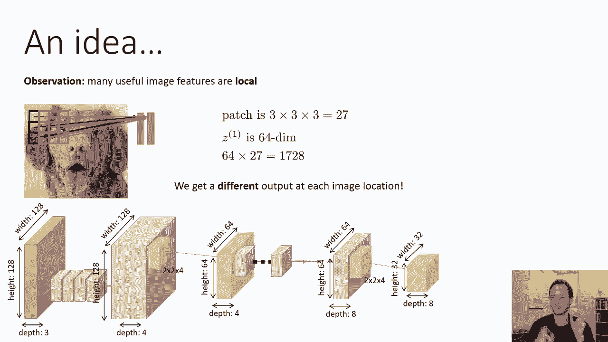
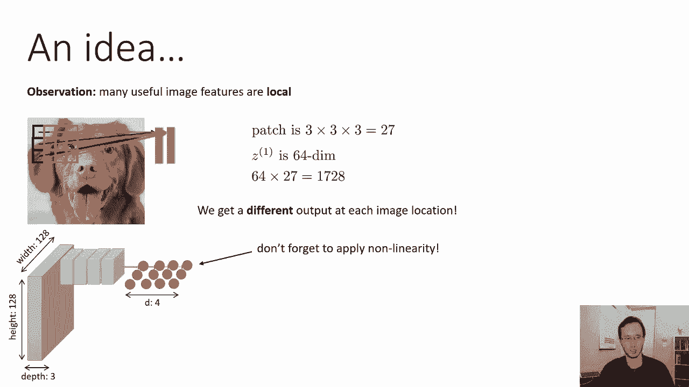
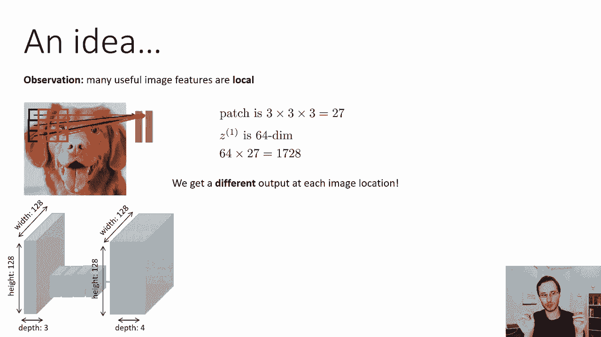
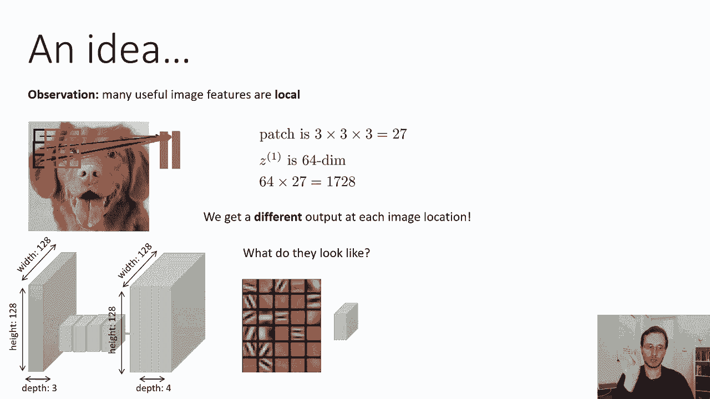
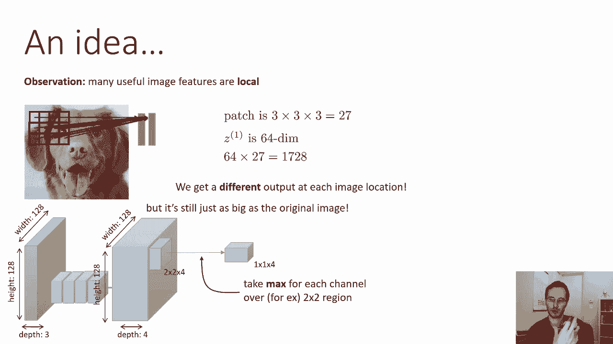
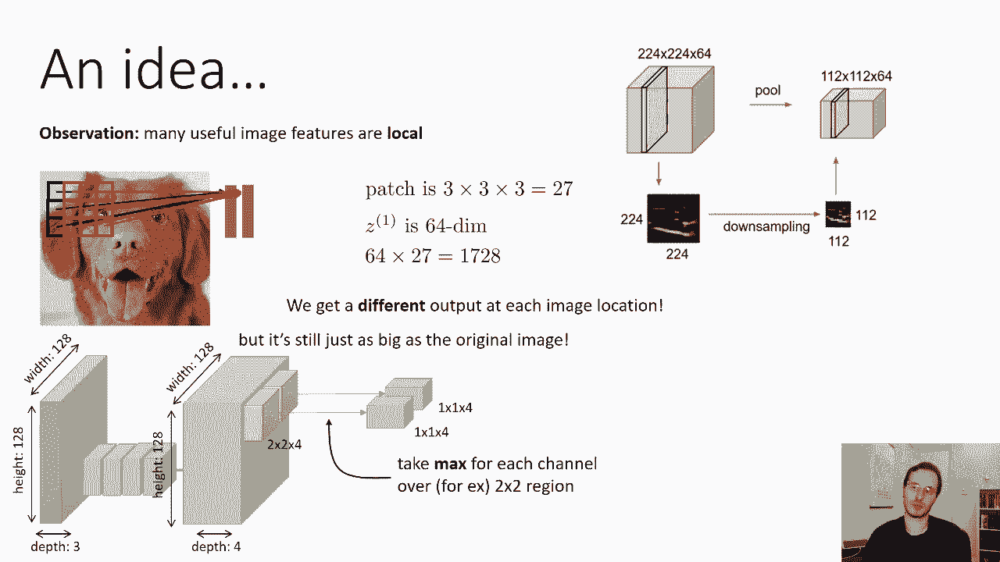

# 【双语字幕】伯克利CS 182《深度学习：深度神经网络设计、可视化与理解》课程(2021) by Sergey Levine - P17：CS 182- Lecture 6- Part 1- Convolutional Networks - 爱可可-爱生活 - BV1PK4y1U751

今天我们将讨论如何建立神经网络，可以处理图像的。

这些被称为卷积神经网络，所以在这节课的开始，一个鼓舞人心的例子，我用了，这很有动力，因为它是，你知道很吸引人的是，如果你有这么可爱的小狗，你想分类，不管是小狗还是猫的照片，或者河马或者长颈鹿。

你也许可以训练一个神经网络来解决这个任务，原则上，这应该很管用，但是如果我们尝试应用我们开发的神经网络，在上一节课中，这将是相当艰难的，所以让我们谈谈这个，这种网络中的第一个线性层，这是一个线性层。

读取图像并产生第一个激活向量。

这个线性层中的权数，将等于第一个隐藏层中的激活数，Z一次，整个图像中的数值数，所以对于图像中的每个像素，对于每一个颜色通道，我们必须有一些权重等于输出的数量，Z中的元素数，所以这意味着如果我们的图像是。

让我们说，一二，八乘一，二八乘三，那不是一个很大的图像，所以它是一百二十八像素，增加一百二十八像素，通过三个颜色通道，红色，绿色和蓝色，也就是四个，四千，四万九千，一百五十二个数字。

我们的第一个隐藏层有64个维度，它实际上是一个相当小的隐藏层，就像你在问，模型将图像的所有内容总结成64个数字，它很小，即使这样，第一个权重向量中的参数总数也将是64倍，四万九千，一百五十二。

超过三百万，这只是这个小六十四的第一层，尺寸隐层，在实践中，你可能想要比64更多的，所以这一层会很大，我们真的需要一种更好的方法来处理图像，事实上，这还有更大的问题，不仅仅是参数的原始数量。

还有一个问题是，如果这张小狗的照片向左或向右移动，哪怕是一个像素，在网络上看起来完全不同，所以我们真的想做得更好。

所以我有个主意，我们关心的许多视觉特征在某种意义上是本地的，所以如果我们想用我们的直觉来思考，我们会认出这是一张小狗的照片。

也许我们先提取边缘，然后也许我们会提取一些局部区域，像耳朵和鼻子，这些是人的耳朵和鼻子，但是小狗的耳朵和鼻子，我想是，你知道的，在类似的原则上工作，这些属性的有趣之处在于它们都是局部特征，因此。

以确定在特定位置是否有边缘，你只需要看附近的像素，确定是否有鼻子，你也只需要看附近的像素，现在，鼻子比边缘大，所以要找一个鼻子，也许你需要看更大的像素区域，但他们仍然是本地的，我们实际上知道，呃，在。

呃，你从神经科学实验中知道，在哺乳动物中，大脑、猴子、猫和人类，视觉处理是局部的，像这样，本地有特征探测器，空间相干特征，当然啦，并非所有的视觉检测都是局部的，有一些全球性的方面，比如，比如说。

如果你想弄清楚，呃，如果你知道谁将在一场足球比赛中获胜，也许你需要看看球在哪里，其他球员在哪里，他们相距很远，所有这些，除了低级的视觉处理，往往是相当本地的，所以我们可以利用这个观察来设计一种神经网络。

他们可以通过首先进行本地操作来逃脱更少的参数，然后只执行全局操作，当信息量减少到更容易管理的时候，所以这里的想法是判断一个特定的图像补丁是否包含一个特征。

只看局部补丁就足够了，这就是我们要努力做的，所以许多使用图像特征是本地的，让我们试着建立一个网络，一次只查看一个像素区域，并且不必连接输出中的每个点，输入中的每一个像素。

也许一个小网络可以查看图像的每一个补丁，所以如果它像一个边缘的小探测器，也许它可以看看这个补丁这个补丁这个补丁，它实际上可以是每个补丁的相同网络，因为你识别图像边缘的方式不会改变，取决于你看的地方。

所以说，水平边的存在可以用相同的函数计算，在这片图像中，就像它对这批图像一样，所以让我们假设补丁是三乘三，它有三个颜色通道，这意味着它有两个七个数字，假设我们要为此计算64个特征，就像以前一样。

我们现在有六十四个，六十四次，二十七只是一千，七百二十八，所以我们从300多万个参数到不到2000个参数，那真是太好了，然而，现在我们为每个图像位置得到不同的输出，所以我们有一个小网络。

这个小小的三乘三补丁网络，但会为每个位置产生不同的输出，事情是这样的，假设这个立方体代表我们的图像，所以它的高度是一二八宽，一二，八又一深度，意思是三个颜色通道的数量，我们要把我们的小三乘三网络。

我们要把它应用到每一个补丁上，在图像中每三乘三的补丁，所以我们的小线性层有三个高度，宽度为三，深度为三，这产生了一个特征，所以这是我们的迷你层，也叫过滤器，现在我们有64个输出，所以我们需要一个小盒子。

每一个输出都有一个三乘三乘三的小东西，其中有六十四个，所以我们需要一堆这样的东西，但在这里我画了四个，这就产生了一个小的长度向量，输入图像中的每个位置四个，所以这是四个深度。

我们要把它滑过图像中的每个位置，并为每三乘三的补丁计算一个不同深度的四个向量，记住这些补丁是重叠的，所以我们不只是把图像分成三块，我们实际上把它滑动一个像素，所以每三乘三的补丁，在每一个像素上滑动。

这样我们生产的输出数量，你有这些四维向量，在这种情况下，六十四，我们有64个特点，这张照片里有四个，尺寸大约是一二八乘一，二八，在那之后，你对它们中的每一个都应用非线性。

就像你在常规神经网络中所做的那样。

所以现在我们，我们已经，我们已经通过了这个小，在图像上每三乘三的补丁上进行三乘三的过滤，我们又拿了一个盒子，它的深度是4宽和高度也是1 2 8，有一种有趣的东西，这发生在图像的角落和边缘，我们以后再谈。

所以现在，这么说吧，它仍然是一二八乘一二八，但如果你现在想知道，当你在边缘的拐角处应用这个小过滤器时会发生什么，别担心，我们稍后再讨论这个问题，好的，所以现在我们把我们的形象。

我们的一二八乘一二乘三的图像变成了一个，二十八乘一二八乘四或六十四，如果你有64个特征，我就是画不出来六十四个盒子，呃，激活权地图，所以现在几乎就像一个图像，每个像素都不再是真正的像素了。

它实际上是一个特征的小向量。

他们看起来像什么，下面是一些过滤器的示例，所以这些是小盒子，你可以想象把这些过滤器中的每一个都传递到图像上，以及相应的过滤器，激活将是该特性存在的程度，所以如果未来是一个水平的边缘。

你会在有水平边缘的地方得到明亮的颜色。

和黑暗的地方，他们没有，现在这里有点问题，我们实际上并没有把事情做得更小，所以我们减少了参数的数量，但我们的激活仍然是这些巨大的地图，分辨率与原始图像相同，以及潜在的更多深度。

因为我们可能想要比原始图像中的颜色通道更多的特征，所以我们可以做的是我们现在可以缩小这个东西的大小，我们将采取每两个两个补丁，它可以是任何其他数字，但现在让我们两个两个地，那个补丁有四个深度。

我们要做的是，我们会变成一个一个四个的补丁，我们要做的是在每两个区域，对于每个频道，我们将采取最大的激活，所以我们将为该区域的每个通道取一个最大值。

我们将为每个地区这样做，现在这些区域实际上将不重叠，所以在这里我们将图像分成两部分，所以这些不是重叠的补丁，这基本上是向下采样，它正在拍摄激活的图像，向下采样到一个更小的激活映射中。

所以这里有一张小照片，在这种情况下是一张二二四乘二二四乘六十四的地图，所以小黑白图像显示了其中一个过滤器的响应，基本上这张二二四乘二二二四地图的特点之一，当我们做最大池的时候。

我们基本上取每个2乘2区域中最亮的像素，为什么我们直觉上做得很好，如果此映射中的激活表示该特性存在的程度，我们问得好是有道理的，让我们评估一下那个区域的特征，通过最大激活，所以说。

如果你想知道图像左上角是否有水平边缘，你只需看看左上角的几个激活，看看它们中是否有水平边缘，这就是最大池基本上设置的，它基本上，呃，计算该特性是否存在于该修补程序中，或将相应的数字写入结果位置。

所以这就是为什么我们经常使用最大池。

在这个最大池操作之后，我们得到另一个更小的地图，所以这里的蓝色表示卷积操作，它将这个过滤器传递到图像中的每个位置，黄色表示汇集后的汇集操作，深度保持不变，因为我们独立地汇集了每一个功能。

但是高度和宽度现在小了一个因素，等于池区域的大小，所以这里的池区域是两个，所以我们从一二八到六十四，如果池区域是四个，我们会从1-2-8变成3-2，所以这被称为最大池，现在我们已经描述了如何进行卷积。

然后是最大池，别忘了，在卷积之后，你必须应用一个非线性，这不在这里的图片中，但总是在卷积之后，你会有一个像射线一样的非线性，它只是没有画出这幅画，但请记住它就在那里，然后在汇集之后。

您可以执行另一个卷积，所以也许我们有，呃，我们要计算的八个特征，所以我们有一个三乘三乘八的小过滤器，我们把它传递到池激活图中的每个位置，我们又得到了64乘64现在是8，然后也许我们再做一轮汇集，有一种。

应该是2乘2乘8，这就给了我们一个三二乘三二乘八的混合激活，好的，这基本上是卷积神经网络的体系结构，卷积，其次是非线性池，另一个卷积，另一个非线性，另一个池，过滤器的大小可以改变，所以他们不必三三两两。

他们可能是三个，他们，它们可能是五乘五或七乘七，使用奇数通常很方便。虽然，池的大小可以改变，可能是两个两个，可能是四乘四。

过滤器的数量可以改变，让我们看一个实际的卷积的例子，呃，神经网络，这是Lynette网络，用于手写数字识别，需要三个，二乘三两个手写字符作为输入，然后它有第一个卷积层，那个卷积层有六个通道，六大特点。

所以它有六个特点，地图的大小是两个，八乘二八，为什么比三个小，二乘三二，嗯，它实际上与那些边缘有关，我们稍后会讨论这个问题，然后有一个东西被标记为子采样，这只是汇集的同义词，这是一个二乘二的池子。

所以这两个，八乘二八乘十四的地图，在这里标记为2，然后有另一轮卷积，下一轮的卷积有十六个特征，这给了我们一个C3，这是一张有16个，深度十六，地图又是十乘十，由于这些边缘效应，它们比十四乘十四小。

我们以后再讨论，然后是另一轮的汇集，10乘10变成了5乘5，所以现在你在一个五乘五的区域里有16个特征，所以这是两个，五乘十六激活，这实际上足够小，现在你可以把它们压扁成一个大矢量。

然后把它们放在一个标准的，全连通线性层，就像我们上次学到的，记住这些卷曲中的每一个，它们之后又有一个非线性和激活函数，这在这些画中往往没有画出来，但是如果有人只是写卷积，没有非线性，实际上有。

他们只是没有把它画在画上，所以在每一个卷积之后，会有一个像乙状结肠或Relu这样的非线性，总是总是总是，它是，有卷积实际上是闻所未闻的，后面没有非线性的，好的。

