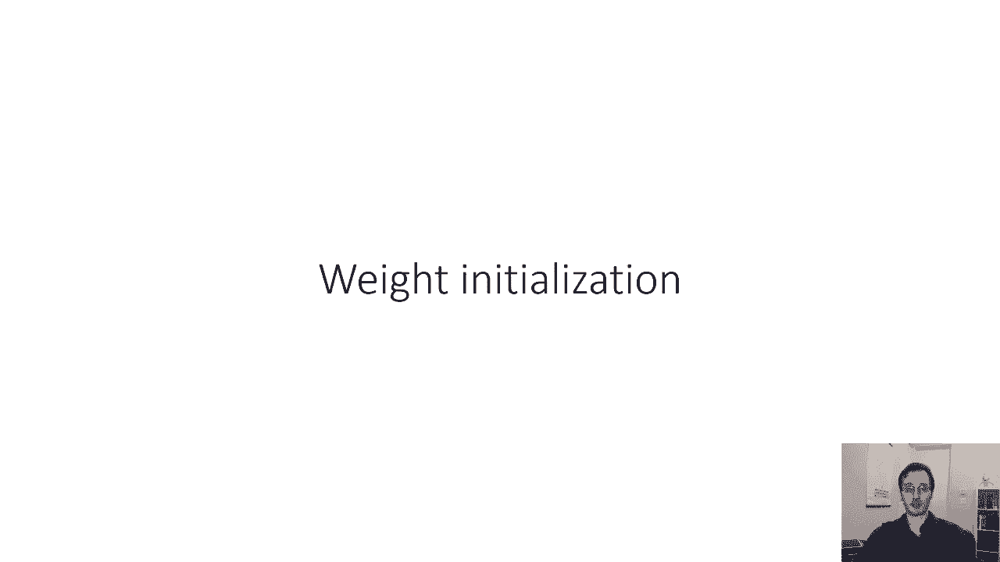
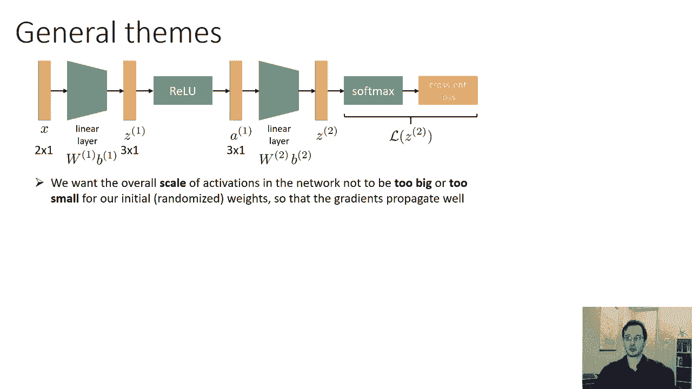
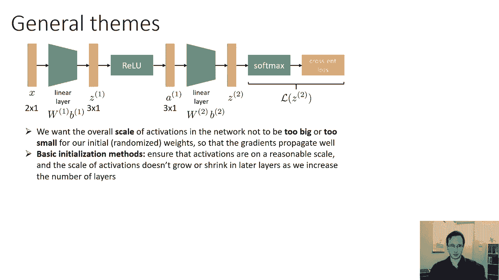
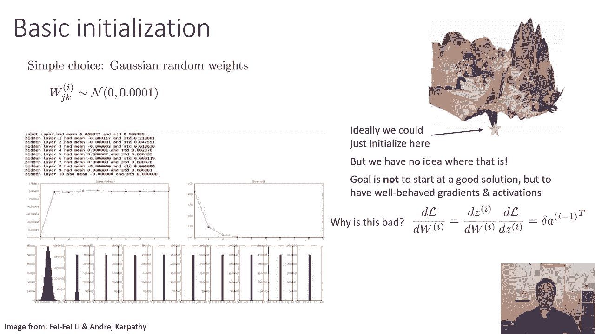
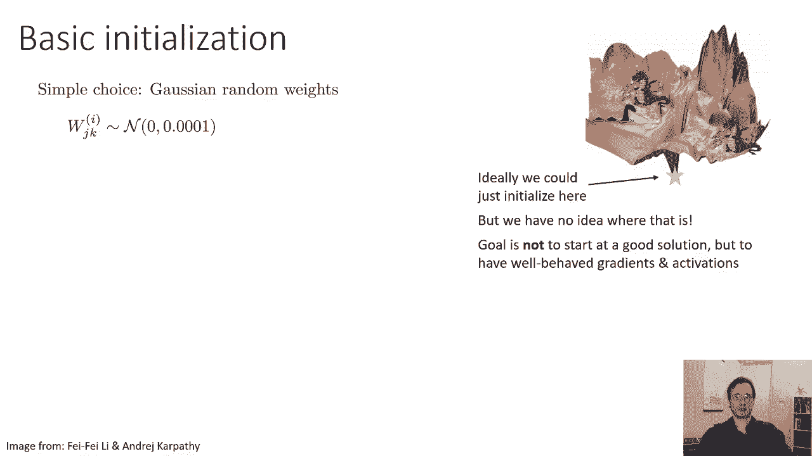
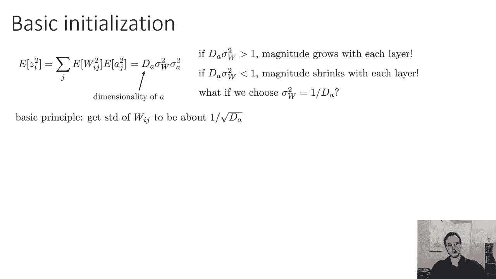
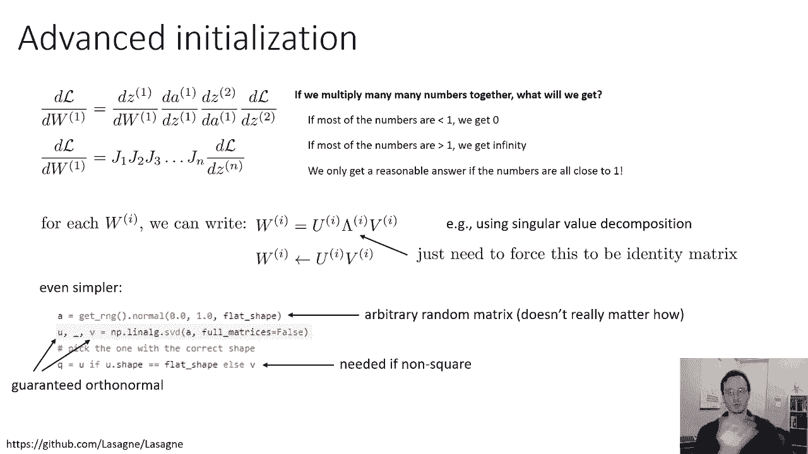
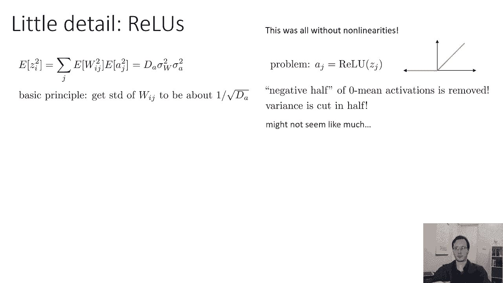
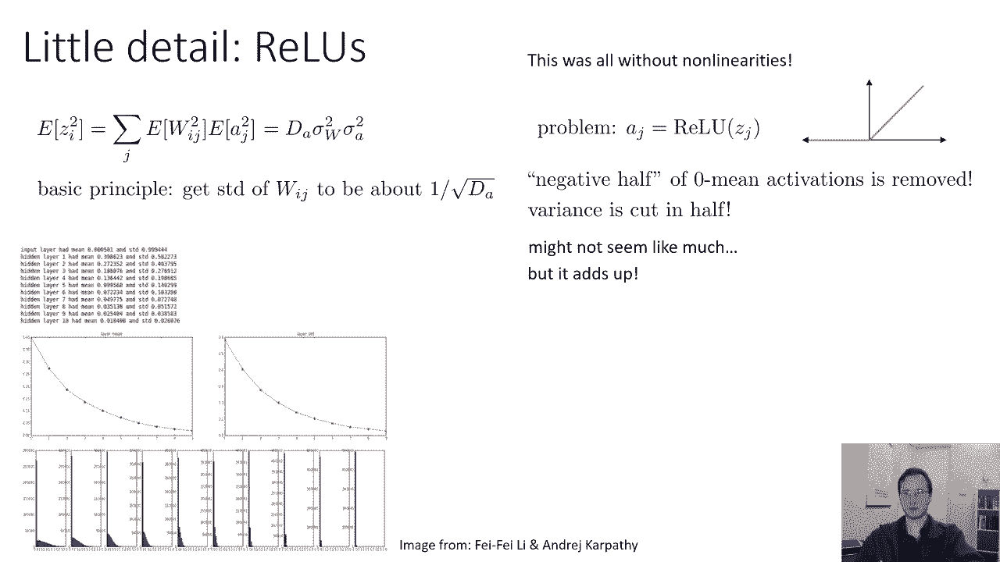

# P21：CS 182- Lecture 7- Part 2- Initialization, Batch Normalization - 爱可可-爱生活 - BV1PK4y1U751

在今天讲座的下一部分，我们将讨论权重初始化，现在，主题，在我们关于权重初始化的讨论中，将与主题非常相似，当我们谈到正常化时，在选择初始化方案时，我们要做的主要事情是，就是确保网络中的梯度看起来合理。

通过确保激活在大致相同的规模上。

所以我们想要网络中激活的整体规模，不要变得太大或太小，因为我们增加了层数，所以我们将讨论一些基本的初始化方法，它们将确保激活在合理的规模上，激活的规模至关重要的是不会增长或缩小，随着我们层数的增加。

我们的网络变得更深，然后我们将讨论一些更高级的初始化方法，这些更先进的方法试图，更明确地说明网络梯度的行为有多好，推理的方式，将非常类似于我们在上一节课中对剩余网络的讨论，只是提醒一下。

我们可以写出损失对重量的导数，在某一层，作为许多雅各布人的产物，特别是雅克比人在这一层和损失之间的所有功能，现在，在这一点上，我们真的不太在乎，关于那些雅各比人是什么，我们可以说有一堆矩阵。

所以j 1到j，我们把它们都乘在一起，正如我们在上一节课中讨论的那样，如果我们把许多，许多数字加在一起，如果这些数字往往小于1，那么他们的产品就接近于零，如果它们往往大于一个。

那么他们的产品就会走向无限，但如果他们都是关于一个，然后我们得到一个解决方案，现在大约是一个，那是标量值，对于矩阵，这意味着它们的特征值接近1，因此，我们将讨论的更高级的方法基本上将尝试初始化网络。

所以这些雅可比的特征值接近1，但首先我们将讨论基本的初始化方法，这些只是试图保持激活的规模大致相同。

在所有的层次上，这其实已经足够好了，在大多数情况下。

如果我们有一个精灵，基本上可以给我们任何我们想要的初始化，我们只会要求精灵初始化这个权利，就在全局最优，这是你所能希望的最好的事情，但我们当然不知道全球最优在哪里，我们没有这样的妖怪。

所以在没有这一点的情况下，我们不会试图初始化我们的权重，这样他们就接近一个好的解决方案，我们将尝试初始化它们，以便在初始化时，神经网络的导数质量很高，这意味着它们实际上指向一个最佳方向，基本上。

因为这会让一开始就很难，现在，一个非常简单的选择，这种选择适用于非常小的网络，但随着网络的扩大，这很快变得不切实际，就是将权重初始化为，呃，一些小的随机数，比如说，我们可以选择均值为零的正态分布。

和零点的标准差，零，零，零，一个或某事对，您不想将权重初始化为零，因为这样梯度就都为零了，但是如果你把它初始化为一个小的随机数，对于小的网络，那真的管用，问题是，随着你的关系网变得更深，呃。

这很快就会给你不好的答案，想象一下你的第一次，呃，你的输入大致在1的尺度上，对呀，你把它们乘以一堆重量，标准差为零点，你会得到一堆数量级为零的数字，零点零点一，然后你得到一些非线性。

非线性可能会使它们保持在相同的规模，然后你进入下一层，现在它将把它们乘以零点零点一，大概，所以你最终得到的是零点零点，零零零一，以此类推，所以你的激活量会呈指数级下降，这个实验显示了一个十层的初始化。

呃，网络，蓝色的图显示了，在纵轴和横轴上，这个图层，所以这不是一个学习曲线，这实际上是每个点对应于每一层激活的平均值，所以你可以在零层看到，平均值远不是零，因为输入可能是，你知道，在这里。

他们往往是消极的，但平均值很快就归零了，那很好，我们真的不担心这个，但是红色曲线是一个更大的问题，红色曲线，y轴是该层激活的标准差，横轴是层数，你可以看到输入的标准差在第二点左右，一个左右。

然后当我们往上走的时候，标准差只是坦克，它就像石头一样下降到接近零，和底部的地块，每个图对应于，激活日期，所以你可以看到第一层有一个健康的直方图，具有多种不同的激活值，但当你喜欢的时候，你知道的。

第四层，五个，六，七，八，九和十，激活几乎没有变化，基本上激活都变成了零，现在，我们为什么要关心这个，为什么这不好，嗯，这很糟糕，因为如果你回想一下其中一个线性层的导数公式，这将是三角洲时代。

那层的激活转置，所以如果激活为零，那么梯度为零，如果梯度为零，那你就没有任何进展，我们了解到了这一点，当我们谈到优化器时，我们了解了在我们优化的景观中什么样的地理特征，这与它是什么地理特征相对应，嗯。

这是一个高原，事实上，这是一个非常糟糕的平台，所以我们非常希望避免以这种方式初始化我们的网络，因为当我们这样做的时候，我们基本上是在最糟糕的地方初始化我们的网络，我们可以把它放在一个非常大的高原中间。

下面是我们如何考虑设计一个更好的初始化方案，假设我们将在某个线性层上初始化权重，网络中的任何线性层都是如此，我们就叫它W吧，我们将初始化，以便W I，j，权重矩阵中的第Ij项根据，高斯分布，均值为零。

方差为sigma w的平方，所以说，我们要弄清楚的是，我们应该把sigma w设置为什么，我们不必使用高斯初始化，但这往往很简单，所以说，这实际上足以让我们制定出一个相当不错的初始化方案。

所以我们可以做一些比高斯更华丽的东西，高斯证明足够好，只要你适当地选择它的方差，偏见，呃将初始化为零，事实证明没关系，所以我们可以问的一个问题是给定一个sigma w的值，在这个线性层之后。

我们得到的值的大致大小是多少，Z的大小大致是多少，下面是Z中每个项的公式，所以第i项和z z i是由一个和给出的，在w i j乘以a j加b的a/j中的所有条目上，我是对的。

所以这只是其中一个线性层的公式，没有矩阵表示法，只是为了让事情变得简单，我说过偏差将被初始化为零左右，所以这个术语基本上无关紧要，让我们假设前一层的激活是它们自己，大致高斯，平均值约为零。

方差为sigma a，这是一个合理的选择，事实上，如果我们把x标准化，那么我们可以粗略地说X将是一个，将从零开始，平均单位方差高斯，我是说，不一定要像，x实际上不必是高斯的，但它的平均值为零，方差为一。

这没关系，所以这是一个明智的，如果发生了什么的粗略模型，所以我们可以问的问题是，呃，你知道的，这里的一切都是零，粗略地表示，这些Z的大小会是多少，嗯，如果均值都为零。

那么Z的大小基本上是它们方差的平方根，对呀，当我们问的时候，基本上我们在问什么，z的大小是多少，他们的标准差会是多少，所以我这里的公式是方差，标准差只是它的平方根，如果我们写出z的方差，因为z是零。

意味着这只是z的平方的期望值，你取这个和，你把它平方，你取它的期望值，然后你会得到和的每一个项的平方，然后你会得到一堆这些交叉项，但是交叉项会抵消，因为均值都是零，所以只有二次项保持如此。

如果一切都是零平均值，那么z的方差就是，w i j方差a的所有维数，乘以J的方差，我们知道，j的方差是sigma w的平方，J的方差是sigma的平方，我们把这些东西加在一起，所以总和就是da。

也就是乘以sigma w平方的维数，乘以西格玛a平方，对呀，因为我们对j求和，一堆呃，西格玛w平方，乘以西格玛平方，我们总结得很好，我们在总结事情，这意味着z中每个项的方差大致为d，西格玛w平方。

西格玛a平方，好的，现在我们走上了这条赛道，因为，我们担心，我们对权重的初始化选择要么增加，或降低激活的幅度，如果前一层有方差为sigma a平方的激活，下一层会有达西格玛W平方的激活。

乘以西格玛a平方，那么我们知道如果d a sigma w的平方大于1，震级会随着每一层的增加而增加，如果他们少于一个，然后每一层都会收缩，所以如果我们想让激活的程度一层接一层地保持不变。

我们需要以某种方式确保da乘以sigma w平方大约是1，所以我们可以做的一件事是，我们可以选择sigma w平方为1而不是da，或相当，选择权重的标准差为da的平方根上的1。

所以这是基本的原则是，我们只需要标准差，在传入向量维数的平方根上为1。

这有时被称为Xavier初始化，它实际上效果很好，所以这是一个类似于我们以前的情节，现在在哪里，而不是将所有权重初始化为小随机数，我们初始化它们，标准差为输入维数平方根的1，你可以看到这里的标准差。

红色的图随着图层的上升而减少，但要快得多，不知何故，我们还没有完全稳定它，我们仍然看到激活量下降，即使看起来我们做的一切都是对的，但它下降得少得多，对于一个，对于一个，中等深度的网络，这实际上会很好。

它实际上在实践中得到了非常广泛的应用，作为这里的一个问题，呃，为什么标准差还在下降，花点时间想想为什么这种情况还会发生。

所以我们漏掉了一个小细节，我们忘记了非线性，我们把这个线性层，我们要，然后对Z应用一些非线性函数，非线性函数会改变它们的大小，一个非常常用的非线性函数是整流线性单元，更深的网络几乎总是使用铁轨。

因为它们比乙状结肠表现得好得多，问题是Relu会清零我们的许多激活，事实上，如果我们的激活真的是正态分布的，他们通常不是，但如果他们是，他们真的没有，意味着RAU平均会清零多少激活，嗯，你会期望。

如果数字正态分布为零，意思是，那么其中大约一半会是负的，如果其中一半是负的，这意味着我们大约一半的激活将被移除，它们将被设置为零，这将减少我们的差异，如果你有，呃，你知道，呃，西格玛z。

然后你把一半的数字清零，你清零的那些数字，它们的方差都是零，所以现在你有一堆方差为零的数字，一堆具有原始方差的其他数字，所以它们的总体方差会更低，如果我能切成两半，这可能看起来不多，但它确实加起来了。

所以嗯，情节是这样的，这是为了更深的网络，这是对标准差的显示，你可以看到呃的直方图，底部的重量在零时确实会被窥视，远不如微小的数字快，但它仍然在零点达到顶峰，所以我们可以这样解决它。

认识到大约一半的数字被归零，我们可以简单地把方差放大两倍，或者等效地将标准差平方根大两倍，所以这意味着不是将它设置为da的平方根上的1，我们把它设置为da的二分之一的平方根上的1。

这实际上是在Resnet论文中提出的，虽然一半的因子可能看起来不多，当你有150层或更多的时候，它真的加起来了，所以对于这些残留的网络来说，最终确实产生了相当大的影响，所以这里是和之前基本相同的情节。

除了现在有了这个一半的因素，现在你可以看到，标准差基本上保持在同一范围内，所以你可以看到顶部的打印输出，他们从82点出发，他们在84点结束，它们基本上保持着它们的规模，所以只要你把那一半放进去。

其实会很好的。

现在一个更小的细节偏差，在我们说我们将把所有这些偏置向量初始化为零之前，但又一次，铁轨给它带来了一点问题，因为如果我们把偏见初始化在零左右，然后呃，我们平均有一半的部队会死。

尤其是当人们不使用这一半因素的时候，实际上，将偏差初始化为一些小的正常数是很常见的，就像零点一，因为死亡单位，拥有，呃，在那里RAU迫使他们归零，也有零梯度，所以你可以把一半放进去，这将防止激活量下降。

那些归零的渐变可能是个问题，有些人认为这阻碍了网络的正常训练，所以另一种选择是避免有太多这些负面的事情，只要在偏差上加上一个小的正常数，这也是一个很好的主意，我不认为两者同时使用是常见的，感觉就像。

他们可能不会很好地合作，因为如果你加上偏见，那么你就不会有一半的东西被清零，但是使用小的正偏差是很常见的。

所以这是一种基本的初始化，对于你要训练的大多数网络来说，机会是，尤其是如果他们是前馈，一种卷积或完全连接的网络，xavier初始化可能是一个不错的选择，嗯，有一件事我想讨论，部分原因是它有时效果很好。

部分原因是我认为它帮助我们理解网络初始化是怎么回事，就是，呃，一些更高级的基于正交矩阵的初始化技术，就像我之前提到的，损失的导数，关于重量，在某一层是由很多很多矩阵的乘积给出的。

特别是在这一层和损失之间的所有雅可比矩阵，所以不用担心这些矩阵是什么，我们可以把它写成j到j的大乘积，记住，如果你把很多东西相乘在一起，如果所有这些东西都少于一个，乘积大约为零，如果大于一。

它将是无限的，所以你只能得到一个合理的答案，如果所有这些雅各布人都接近一个，矩阵接近1意味着什么，嗯，这意味着它的特征值接近1，现在让我们再深入一点，对于任何矩阵的每一个雅各比。

你可以把它写成三个矩阵u乘以lambda乘以v的乘积，比如说，利用奇异值分解，其中u和v是保持尺度的变换，它们基本上是正交基，这意味着矩阵u和矩阵v，当你把一个矢量乘以它不会改变那个矢量的长度。

它会以各种方式旋转它，是对角线的，lambda的对角线项是j的特征值，对于非平方矩阵，你现在还可以这么做，谈论特征值在那里没有多大意义，但它们被称为奇异值，嗯，所以粗略地说。

lambda捕获了这个矩阵所做的所有重新标度，U和V捕捉所有的旋转，所以你可以从视觉上想象这个，如果您的初始激活是一个向量，看起来像这样，然后你旋转它，不让它变长或变短。

lambda在不旋转的情况下缩放它的尺寸，所以你可以把lambda看作是在每个维度上应用不同的尺度，然后V再旋转一次，所以u和v不会使矢量变长或变短，他们只是旋转它，所以如果我们能去掉这个lambda。

如果我们基本上能强迫它在每个维度上有一个尺度，那就足够了，以确保雅各布的这一大产品不会产生巨大的，或者微小的数字，现在我们当然不直接设置雅各比，当我们初始化权重时，我们选择的是权重矩阵，但请记住。

线性层的雅可比，就是它的权重矩阵的转置，所以如果我们想让这些雅各布人的特征值在1左右，我们要做的是把我们的权重矩阵，对它们执行奇异值分解，然后以某种方式迫使lambda成为一个矩阵。

用对角线上的1作为单位矩阵，所以我们可以强迫lambda是单位矩阵，那么我们的w的特征值就为1，这意味着我们的特征值为，对于相应的雅各人，一切都会好起来的，我们可以做到这一点的一个方法是。

我们可以进行一些任意的初始化，对其进行奇异值分解，强制对角线为恒等，然后现在把它重新组合起来，当然，强迫对角线是同一性只是意味着放弃，所以你可以基本上运行奇异值分解，得到uλ和v，然后把它重新组合起来。

但省略lambda，所以拉出u lambda v，然后把最后的矩阵构造为u乘以z，实际上有一个更简单的方法来做这件事，这实际上是一个正交初始化的实际实现中的一些代码，所以在第一行。

它只是构造了某种随机矩阵，你如何构建它并不重要，所以在这种情况下，它只是构造一个矩阵，其中每个条目都是正态分布的，均值为零，方差仅为1，方差是多少并不重要，因为我们之后会重新安排整件事，无论如何。

然后它运行呃，svd，奇异值分解和奇异值分解返回三个矩阵，u，lambda和v，其中u和v保证是正交的，和lambda是对角线，这里甚至没有使用lambda，因为我们要把它扔进垃圾桶，然后呃。

它们在最后一行所做的不是将u和v相乘，回到一起，他们只是从两个中选择一个，特别是，形状合适的那个，因为如果呃，你想要一个不是正方形的矩阵，那么u和v实际上会有不同的维度。

并取决于输入维度还是输出维度更大，这实际上会改变，U或V是否有权，正确的维度，所以你只要选择尺寸合适的，它们都是正交的，所以它们都很好用，所以这是获得正交初始化的一种方法，这将保持，嗯。

雅各布人表现得很好，现在我这有点复杂，它也不能解释Relu的所有这些东西，所以如果你想解释这一点，你也必须以某种方式纠正这一点，但这是一种，在某些方面，一个更有原则的选择。

让你的Jacobians表现良好。

所以这部分我想讨论的最后一个话题，和这个东西有点无关，但我没有别的地方可以放，但它也与渐变有关，呃，最后的措施，当一切都出错时会发生什么，所以我们希望如果我们正确地初始化所有东西，我们使用批处理规范。

我们使我们的输入正常化，等等，我们会得到一些合理的行为，比如，比如说，如果我们从这里开始，我们将采取最陡峭的下降方向，然后也许我们会反弹，呃等等，最终我们会到达秋天，对呀，以下是实际可能发生的事情。

你初始化你走最陡的下降方向，一切都很好，你认为你取得了很好的进步，然后砰的一声，你会得到一些怪物渐变，这完全扰乱了你的网络，扰乱了权重矩阵，因为它让你远离了以前的地方，现在你。

它可能在一个大高原或其他地方，呃，很难取得进展的地区，基本上，您的整个优化器都是为它完成的，你不会再有进步了，为什么这会很好地发生，因为深度学习，对呀，所以啊，你知道吗。

我们正在用一个非常复杂的函数类运行一个随机优化，也许有一个大的数据集，这个数据集本身可能很混乱，所以有很多事情发生，随机的事情发生，也许我们在错误的地方迈出了太大的一步，所以也许我们在失落景观的一部分。

在那里有非常尖锐的梯度指向不同的方向，我们只是迈出了太大的一步，把我们弹射到了错误的地方，也许有些东西被一个小数除了，可能是批处理标准或软最大值，在某处有一个被一些小量除法的地方。

导致了一个非常大的数量，或者我们只是真的真的很不走运，也许我们只是在我们的迷你批次中得到了最糟糕的数据点组合，这导致了一个病态的巨大梯度，这种事情就这样发生了，当它发生的时候，你可能会看到，比如说。

你的损失突然变得很大，去找南，走向无限，然后你就完蛋了，通常你会得到一个积极的反馈循环，因为可能一开始你会得到一个比正常情况下更大的梯度，但实际上不是无限的，也许它比正常的大一千倍。

但是在你用那个渐变走了一步之后，现在你的处境更糟了，现在你又有了一个比平时大一百万倍的成绩，嗯，然后你会结束一个下溢或溢出，或者得到一个男人，所以如果你看到这种情况发生，也许问题是这样的。

所以有一个非常简单的解决方案可以在很大程度上缓解这些问题，尽管您想确保这不是由于bug，如果你真的得到了AM，但如果不是因为bug，梯度裁剪往往可以是一个合理的，呃，修补这个问题的创可贴。

基本上有两种方法可以剪辑渐变，一种方法是你可以剪辑渐变中的每一个条目，所以它不大于某个常数c，也不小于负c，你可以做的另一件事是你可以剪掉渐变的范数，所以这只是剪裁每一个维度或保持方向的区别，剪断长度。

2。这两种疡都很合理，这是一种偏好的问题，你用哪一个，然后唯一真正的，呃，你必须做出的选择，另外那是什么夹两个，为C选择什么现在有时你对你的问题有一些直觉，你可以手动选择C，但如果你不这样做。

你能做的就是，你可以进行几个时代的训练，假设它在那些时代不爆炸，所以进行几个时期的健康训练，看看健康的梯度幅度本质上是什么样子的，呃，你知道吗，加起来平均，你的渐变。

绘制它们的大小或绘制每个维度的平均长度，看看这些数字是什么样子，然后相应地选择c，你可以选择它可能是两倍的价值或类似的东西，所以这可能是一个相当不错的选择C的方法，记住你不是想用C做一些真正聪明的事情。

这确实是万不得已的措施，当某件事真的爆炸时，然后你把它夹一点，如果你遵循所有其他规则，比如使用，你知道吗，批，正常化之类的东西，你不应该得到这些怪物渐变太多，除非你有bug，所以启发式地选择c是可以的。

