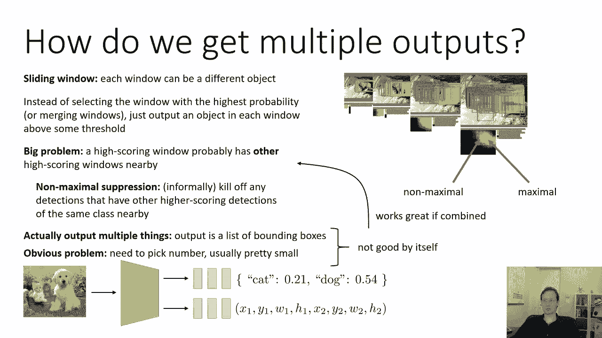
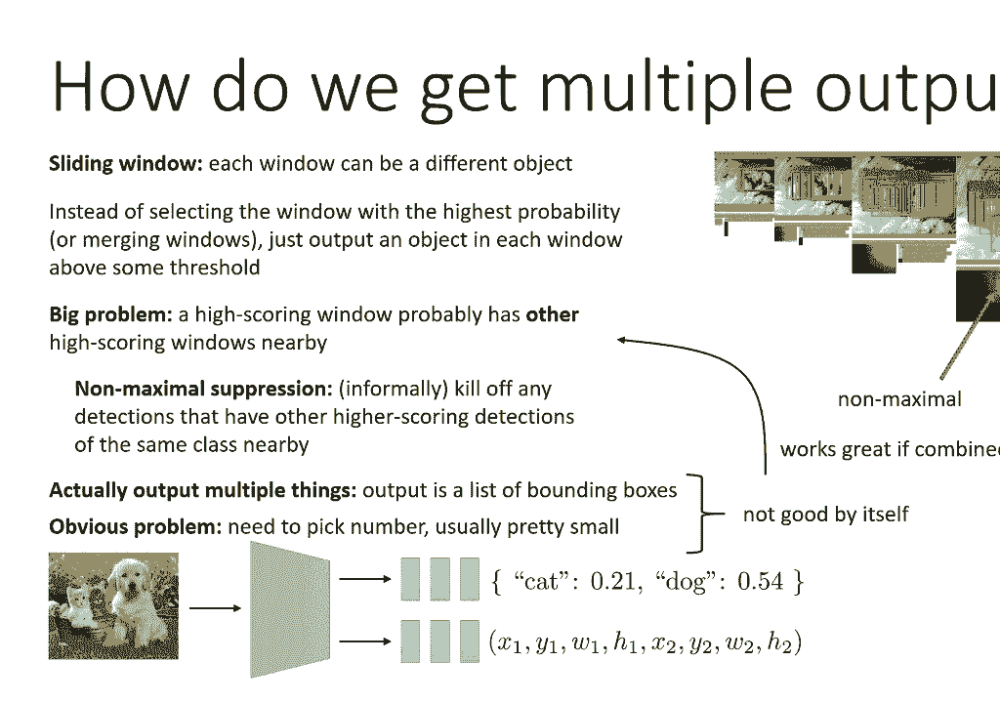
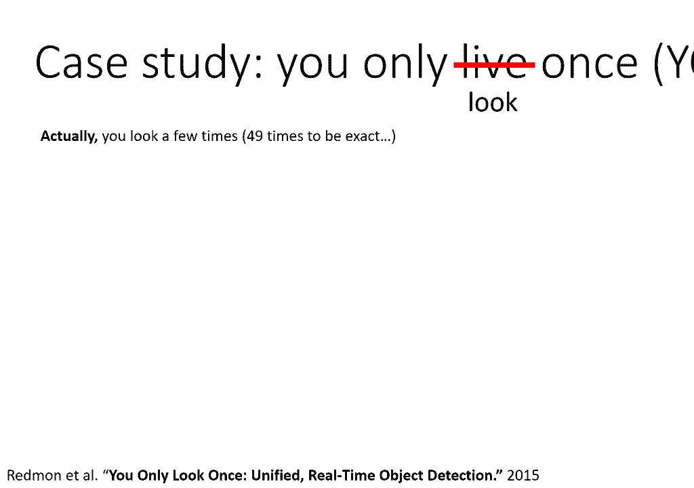
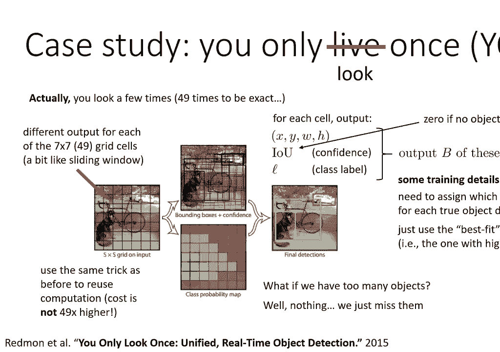
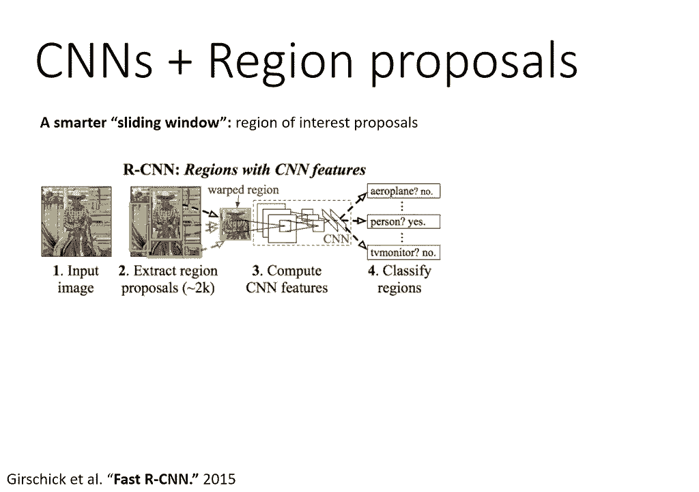
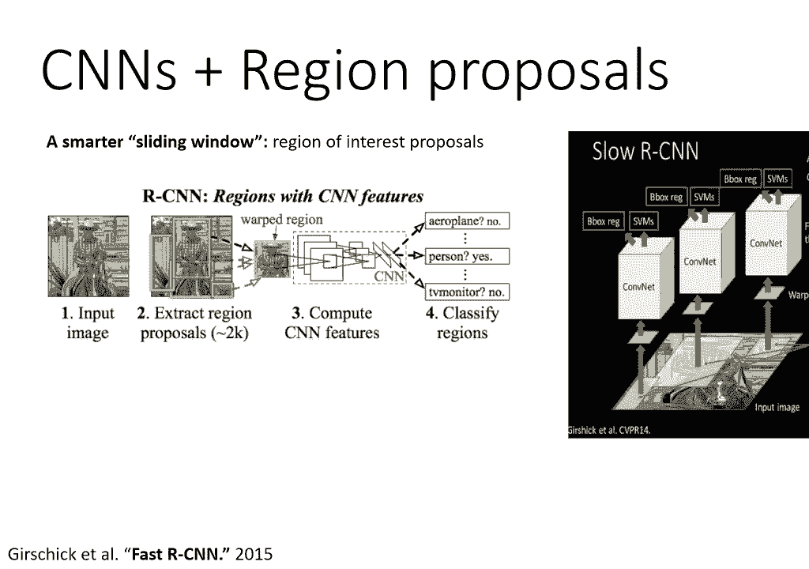

# 【双语字幕】伯克利CS 182《深度学习：深度神经网络设计、可视化与理解》课程(2021) by Sergey Levine - P25：CS 182- Lecture 8- Part 3- Computer Vision - 爱可可-爱生活 - BV1PK4y1U751

接下来我们来谈谈对象检测，所以在设置问题之前，我们在图像中有一个物体，我们必须输出一个类和一个边界框，现在如果我们在图像中有多个对象怎么办，我们必须为每个输出一个单独的类和边界框，现在我们有了一个图像。

我们有第一个对象的类，和x x i 1 y i 1，w i 1和h i 1作为包围盒，对于第一个对象，和a类c i 2 x i 2 y i 2 w i 2，第二个物体的h i 2。

对于图像中可能有n个不同的对象，以此类推，每个图像的对象数量可能不同，好的，所以马上，呃，我们可能会有一个问题，我们需要我们的模型输出可变数量的东西，所以我们可以想象就像以前有一个网络接收图像一样。

并输出一个类别和一个边界框，但是我们如何在多个边界框中输出多个类别，尤其是当数字是可变的，这似乎有点棘手，所有的权利，嗯，我们可以观察到的一件事是如果我们使用滑动窗口方法。

每个窗口实际上可以是不同的对象，所以就像上一节一样，我们看到了如何在图像的每个位置输出分类，而不是选择概率最高的窗口或合并窗口，我们可以在每个窗口中输出一个对象，其中某类的概率高于某个阈值。

所以如果你有一个窗口，你认为，好的，就像，你知道，百分之三十的猫，百分之三十的狗，百分之三十的松鼠，等好，也许这些课程都不够高，所以你不把任何东西，但如果你有一个窗户，它像80%的猫，那你就养了一只猫。

好的，那是，这实际上是一个非常明智的想法，我现在就告诉你，这不是大多数性能良好的方法实际工作的方式，但这是一个合理的想法，然而它本身就有一个大问题，问题是高分窗口可能是，到其他高分窗口。

所以如果你在这里输出熊的高概率，你把它移到一个像素上，你可能也会输出一只熊的高概率，所以如果你只是门槛，然后输出边界框，如果概率高于某个阈值，你会有很多，许多这些重叠的边界框，就像你在这张照片中看到的。

所以我们可以用来缓解的一种方法，这就是所谓的非最大抑制，非正式，非最大抑制意味着你杀死了任何检测，如果你附近有其他得分更高的检测，所以即使你在这个位置熊的概率是98%。

如果你旁边有另一个窗户有百分之九十九，然后你让他们领先，自己不输出分数，所以这个位置，比如说，有很高的概率，但它不是最大值，因为概率较高的邻居，而这一个在现实中可能是最大的，非最大抑制比这更复杂一点。

因为你也不想让高频变化把你搞砸，我不打算详细讨论非最大抑制在实践中是如何工作的，因为这不是一种真正的深度学习，它实际上更多的是一个核心的计算机视觉的东西，但如果你想真正实现它，我建议看看非最大抑制。

这样就能得到细节，现在，另一种与滑动窗口非常不同的方法，就是有一个输出多种东西的模型，实际上，让你的模型输出一个边界框列表，所以您输出的不仅仅是一个分类，不仅仅是一个边界框，也许你输出两三个。

你挑一个固定的数字，然后你声明它是一个真正的边界盒，如果相应类的概率足够高，否则你说它不在那里，现在就像对象定位一样，这两种观点本身都是合理的，但实际上并不那么有效。

所以输出多个东西的明显问题是你需要选择一些数字，通常你会选择一个相当小的数字，因为你知道，用大量的输出来训练你的模型有点困难，所以这本身就不好，滑动窗本身也不是很好，因为你真的得把窗户弄对。

但就像本地化一样，如果这两个想法结合在一起，效果很好。

所以这里有一个结合这两种想法的方法的案例研究，是一个叫Yolo的模特，你只看一次，这个名字有点误导人，你其实看了好几次，四，准确地说是九次，但他们这样称呼它的原因是，与以前的方法相比。

以前的方法涉及更复杂和多阶段的管道，所以你可以想到Yolo，作为对象检测的overfeed版本，你把输入的图像分成，呃，变成单元格网格，在特定的论文中，他们实际上是用七乘七的网格。

所以上面写着S by S在这里，但现在实际上是七乘七，至关重要的是，你是，你不是说每个细胞，你将只看单元格中的像素，你真的看着图像的其余部分，但是每个单元格都要输出一组不同的边界框。

所以七乘七的网格单元中的每一个都有不同的输出，有点像滑动窗，但并不完全是因为他们实际实施的方式是，你不能只看单元格内的像素，他们也可以做多尺度的事情，比如过度喂食，但他们发现这种更简单的方法效果更好。

然后对于每个细胞，对于这四个九个单元格中的每一个，它们输出一个边界框位置x，y，w和h，他们输出一个信心分数，你可以粗略地把它看作是指示一个物体是否存在，正式，信心得分，对借据的估计。

重聚与现实对象的交集，它们输出类标签，他们没有，他们不只输出其中一个，对于每个细胞，它们实际上输出单独的边界框，iOS，和类标签，执行中的作用，他们用b等于2。

所以你基本上可以把每个网格单元看作是两个边界框，每个人都有档次和信心，这张图说明了在左边你有你的输入，你把它分成七乘七的网格，对于网格中的每个单元格，您输出一个类概率，它显示在底部，输出一个边界框。

如顶部所示，然后呃，如果没有对象，置信度为零，如果你期望看到一个物体，它会更大，然后决定输出哪些边界框的方式，你基本上是他们基于信心的门槛，所以您只输出置信度边界框，你可以用和以前一样的技巧。

用这个卷积重用计算，所以成本实际上不是四个，高出九倍，现在，一些细节，呃让这个真正起作用，当然啦，如果你想知道所有的细节，我强烈建议阅读这份报纸，这是一个非常容易接近的，清楚书写的纸张。

你需要在训练中分配，哪个输出负责每个真对象，所以当你得到你的训练数据，你只有一个图像和一个类和边界框的列表，它们不会告诉你在哪个细胞中的哪个边界框，所以在训练的每一步。

您必须为图像中的每个边界框分配责任，到其中一个单元格，他们在报纸上做的方式是，他们只是使用目前最适合的细胞，所以每个细胞都做出一些预测，然后他们把责任分配给当前最接近含义的细胞。

那个盒子里有最高借条的那个，所以这是非常合理的，然后每一个不对任何真正的边界盒负责的细胞，只是被告知预测置信度为零，所以这是一个相当简单的方法，你可以认为这是过度喂养的基本食谱，到一个对象检测器中。

它实际上可以输出多个边界框，在细节上有一些不同，就像你现在表现出的自信，你有这些七乘七的单元格，而不是真正的滑动窗口，现在这个东西可以输出多少对象是有限制的，因为你只有四个九个细胞。

每个单元格只能输出两个对象，所以如果图像中有超过98个物体，发生了什么没什么，你只是错过了那些物体，但这没关系，因为谁需要超过98个对象呢，所以在实践中，这东西实际上工作得相当好。

这取决于您查看的方法的哪个版本。

并不总是表现最好的，但它往往很好，至少从历史上看，往往在目标检测上得到很好的性能，但要复杂一点，但值得商榷，这是一类叫做r cnn的方法，即具有区域建议的卷积神经网络，我在这里要描述的是更高级的版本。

有时被称为快速我们的CNN，嗯，所以基本的想法是你想要一个更智能的滑动窗口，你不想只考虑所有的补丁，现在在计算机视觉文献中有很多方法被开发出来，在深度学习之前，深度学习本质上不专注于检测物体。

但我只是建议给定的补丁是否可能包含一个对象，这些有时被称为目标建议或感兴趣区域建议，我们的CNN基本上把这些作为一个积木，所以我们CNN的基本版本实际上使用了一些现有的。

从图像中提取区域的现成计算机视觉方法，然后通过卷积神经网络分类器将每个区域馈送，很像一个滑动的窗户。

所以你基本上可以把它想象成一个智能滑动窗口，现在他们还预测了一个边界盒坐标，就像过脚一样，也像上课一样，这很好，稍微调整一下区域，但现在基本上有了同样的想法，这当然是非常昂贵的，我不建议实际上这样做。

它实际上是一种奇怪的设计，它是在2014年很早就发展起来的，基本上在计算机视觉社区真正知道如何很好地处理深度学习之前，嗯，这些天我们实际上不会这样做，所以一个更好的方法是使用我们已经学到的东西。

当我们谈到在不同的位置共享卷积特征时，当我们谈论过度喂养时，因此，实际上不是通过卷积网络独立地运行每个区域，你可以做的是你可以有一个卷积网络。

处理整个图像，并生成卷积响应图，然后你可以把你感兴趣的地区的建议，你可以不把它们投射到图像中，而是投射到卷积图中，所以你的CON Conv层产生一个响应图，你可以把它想象成一个图像，但它包含了。

然后你把你感兴趣的区域，把它放进去，呃，卷积反应图，然后你把那个区域内的所有特征，你把它们拉在一起，在他们的情况下，他们使用最大池，然后你得到一个描述该区域的向量，你把它输入到一些完全连接的层中。

这些完全连接的层将产生一个类和一个边界盒，现在至关重要的是，你可以首尾相接地训练这整件事，你实际上可以后退，传播类标签和真正的边界框位置，进了这个被汇集的修道院，它实际上会训练这些骗子来产生。

当最大值根据区域汇集时，产生正确的类和边界框，这就是快速r cnn背后的基本思想，这实际上是一个非常实用的方法，你可以相当有效地使用，所以在很多方面，这与我们现在才在《过度喂养》中看到的想法相似。

而不是与这些滑动窗口相对应的作物，它们实际上对应于这些感兴趣的区域建议。

嗯，您可以采用相同的卷积响应图，在你能预测的每一个位置，呃，是否有以该位置为中心的物体，它的空间延伸是什么，这现在很像即将到来的过度喂食，在其中，您为每个窗口做出不同的类和边界框预测。

除了这里他们不用这个，实际预测具有特定类的对象的边界框，他们只是用它来预测一个物体是否存在，然后对于在场的人，这些被汇集并馈送到随后的完全连接的层中，所以这和我们之前看到的设计很相似。

用过量饲料和YOLO，但这只是做对象提议的部分，当然，你获取训练数据的方式，你拿着有对象的数据，你弃课，只要把这个边框，然后对于卷积图中的每个位置，你有一个小脑袋，试图预测是否有任何物体存在。

如果是这样，它的边界盒是什么，然后对于那些信心很高的，物体存在的高概率，然后将这些区域用作裁剪出最大池的区域，并将其传递到网络的语义组件中，它试图预测哪个类实际上存在于那里，如果有。

所以我们的CNN有点复杂，因为这些区域，嗯陪审团，我想还没有，这种方法是否比Yolo这样更简单的方法更好或更差，这种倾向于来来回回，取决于你知道，哪个队改进了他们的方法，更多，在过去的几年里。

他们一直并驾齐驱，它稍微复杂一点，但有人可能会争辩说，明确地列出这些区域可能会让它工作得更好一点，在某些情况下，我个人的喜好，我认为更简单的方法更好，所以我认为像Yolo这样更直接的方法，从长远来看。

可能会更有效，但我不是一个真正的计算机视觉研究员，所以如果你想了解更多关于这个的信息，我会鼓励你，阅读文献，了解这些方法的相对性能，看看基准，你知道跨越基准，通常，RCN方法的性能会更好一点。

然后自己决定，哪种方法更适合你，所以如果你想了解更多关于这个的信息，一些建议的阅读，这是黄纸，你只看一次，嗯，所以这里，这个想法基本上只是回归到每个细胞中不同的边界框，还有一些后续。

所以最初的论文发表于2015年，而且已经改进了很多次，所以有Yolo版本三，版本四，版本五等等，显著提高了性能，用一些技术，我们的CNN有三篇论文是核心，我们的CNN接近原始的R cnn论文。

快点我们的CNN，快点我们的CNN，更现代的不同之处在于它们重用激活，就像过度喂食一样，他们在学习感兴趣的区域建议方面有一些改进，他们自己，还有一些其他的方法，比如说，呃，这是Leit的一篇经典论文。

全称为SSD单发多盒探测器，这是一种，在某些方面，它实际上比Yolo更简单，嗯设计实际上看起来很像感兴趣的区域建议和更快我们的CNN，但实际上输出语义类别，所以这很酷。

所以我认为从这些文件开始可能是最好的方法，如果您想了解有关对象检测的更多信息。

