# 【双语字幕】伯克利CS 182《深度学习：深度神经网络设计、可视化与理解》课程(2021) by Sergey Levine - P26：CS 182- Lecture 8- Part 4- Computer Vision - 爱可可-爱生活 - BV1PK4y1U751

今天这堂课我们要讨论的最后一个话题，是语义分割，到目前为止，我们已经讨论了输出类别的方法，标签，和边框。

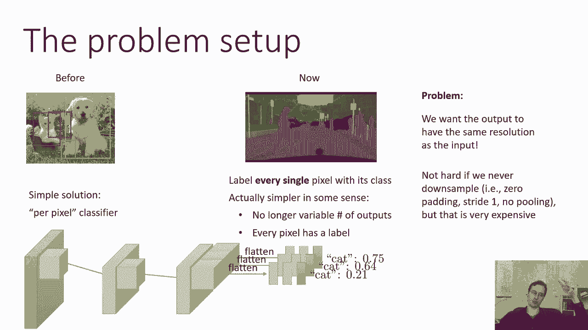

现在我们要讨论的方法实际上是试图标记每一个像素，如果你想准确地知道物体的位置，这可能会很有帮助，它们的空间特征是什么，在某些方面，它实际上更简单一点，因为，不像现在的物体检测。

您实际上不再有可变数量的输出，因为每个像素都有单独的输出，每个像素都保证有标签，所以在某种意义上，语义分割可以简单一点，因为您不必担心对象存在或不存在，或者有多少之类的东西，但它更复杂一点。

因为你现在的输出要大得多，您的输出与原始图像的分辨率相同，所以一个非常简单的，思考语义分割的概念起点，就是把它看作是一个按像素分类的分类器，所以你可以想象用一个完整的卷积神经网络分类器。

并将其集中在图像中的每个像素，用零填充之类的东西来计算角，这或多或少就是语义分割方法试图做的，但要做到这一点有一些技术挑战，在我们有这个观点之前，当我们谈到在每个位置有一个不同的分类器时。

但这仍然适用于位置数量为，你知道的，小于图像中的像素数，你利用一种传统的神经网络架构，这降低了每一个卷积层的分辨率，但现在的问题是我们希望输出具有与输入相同的分辨率，我们真的希望每个像素都有一个类。

不仅仅是每一个滑动窗口位置，如果我们不减少样品，这并不难做到，所以如果我们总是有零填充，大步，一个没有池，然后呢，我们所有的卷积响应图都将与原始图像具有相同的分辨率，然后在最后。

我们将为图像中的每个位置输出一个类标签，你绝对可以做到这一点，这在计算上非常昂贵，因为你有这些巨大的卷积反应图，你将需要相当多的层，因为你想要一个广泛的上下文，所以你要么，你有巨大的过滤器或很多层。

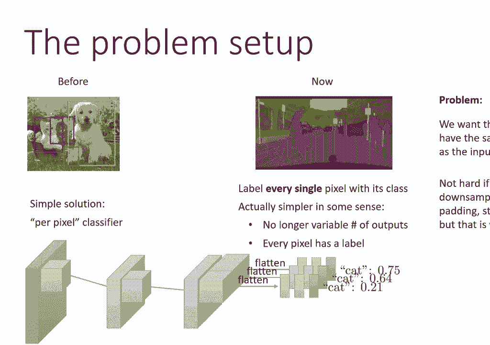

这两种都非常昂贵。

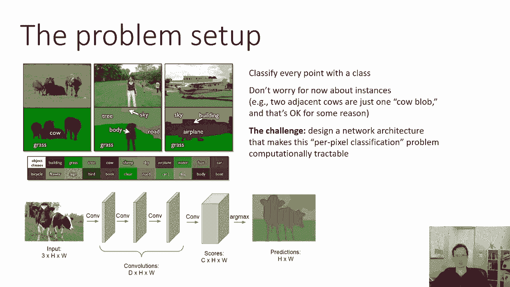

的，我们在语义分割中面临的问题，我们想给每个像素分配一个语义类，现在不要担心实例，所以我们有两头相邻的牛，它只是一个牛团，那就是，我猜。

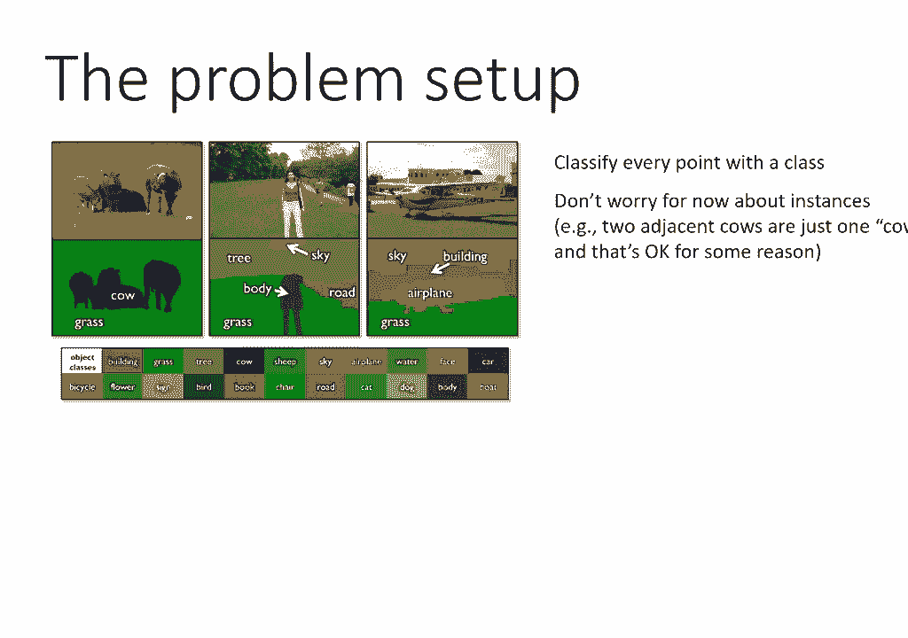

好的，因为某种原因，计算机视觉的人似乎并不担心这一点，嗯，一个非常简单的方法，就是使用多层卷积来保持分辨率，如果我们能实现这一点，如果这在计算上是可处理的，我们可能会这么做，顺便说一句，在某些情况下。

它可能会起作用，有一些方法可以进行实例级分割，这些方法更加细致入微，但基本问题陈述并不关心这一点，所以说，我们将要关心的大部分，在实际中实现这类语义分割方法的方法是，如何避免维护这些巨大的卷积响应图。

同时仍然有深度网络可以有意义地分类每个像素。

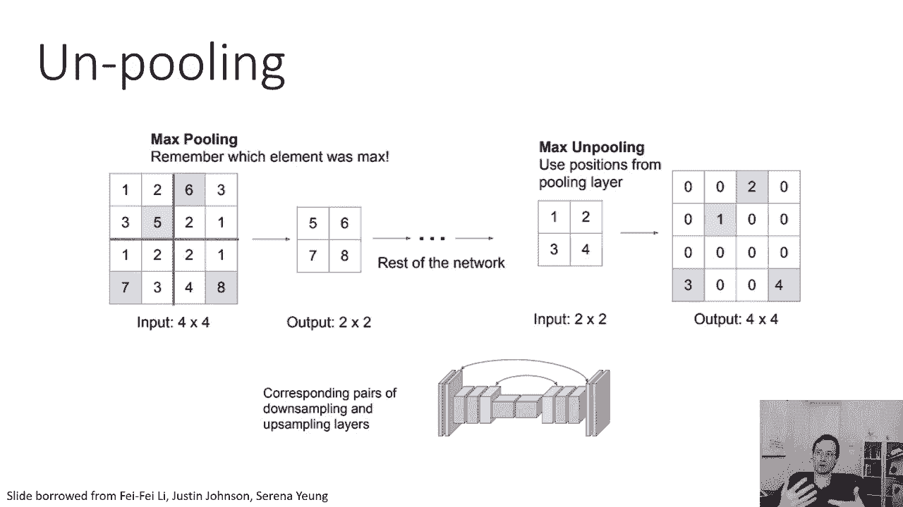

所以挑战是设计一个网络架构，这使得每个像素的分类问题在计算上变得容易处理好了，所以我们能想象的，在概念上，我们将有一个卷积堆栈，很像我们以前的那些，当我们谈论分类时，像vgg或者resnet之类的。

这会降低分辨率，一旦我们降低了分辨率，然后我们需要再次提高分辨率，所以首先我们降低分辨率，就像一个普通的大陆一样，然后我们在中间得到一些低分辨率但高深度的处理，基本上集成了整个图像，所以中间的那个。

网络知道图像中的所有东西在哪里，但是分辨率太低，无法为每个像素输出标签，然后我们需要向上采样恢复到图像的全部分辨率，然后在上面我们可以为每个像素输出一个标签，所有的权利，所以从概念上来说。

这里的一切都很简单，问题是我们如何进行向上采样，所以我们学习了卷积，它要么保持分辨率，要么降低分辨率，现在我们需要了解，是某种不卷积或向上采样操作，它的分辨率较低，分辨率较高。

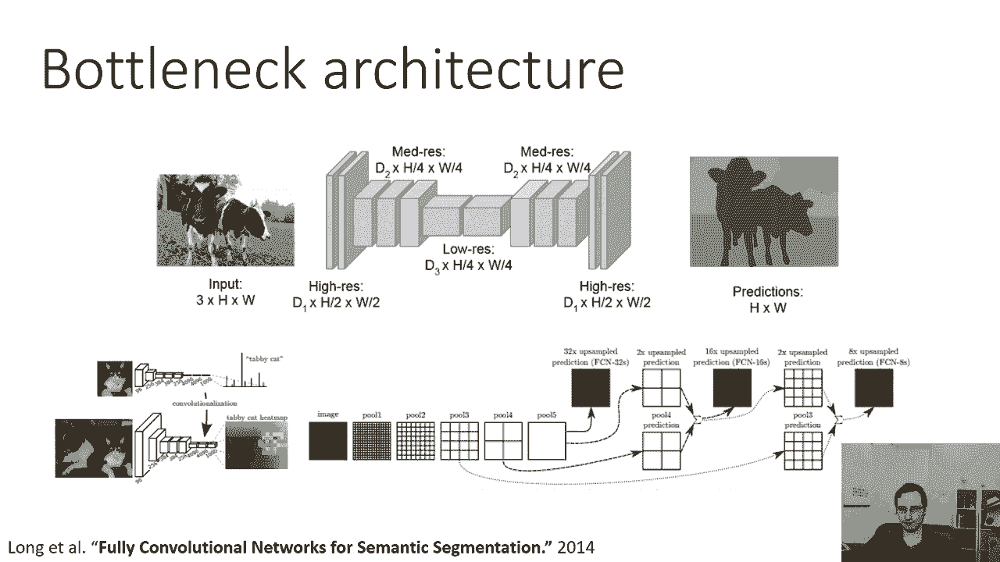

好的，所以我们可以称之为采样或转置卷积，它有时也被称为反褶积，从技术上讲，这个术语有点不正确，因为反褶积在信号处理中确实有非常精确的含义，和这个不一样，所以最好称之为采样或转置卷积。

所以让我们先谈谈这是如何工作的，让我再描述一次，正则卷积如何降低分辨率，所以如果你有一个正常的卷积，用两步的步幅，所以这将映射，呃，如果我们不做填充，在这个例子中，五乘五的图像变成了二乘二的图像。

所以你把这个过滤器变成左上角，这里的输入是hf乘wf，过滤器次数的高度和宽度，输入通道数，输出是一个接一个的，输出通道数，所以整个过滤器是一个厨师由WF由C由C，然后你拿一个补丁，s两步。

所以你把两个像素，取右上角的补丁，这就变成了右上角的像素，转置卷积基本上与此相反，你可以考虑的一个方法是，这是一个步幅很小的卷积，所以这个步幅是两步，这意味着你要超过两个像素，如果你有一个大步，呃。

二分之一，然后你想把半个像素，呃，现在你真的可以这么做，你实际上可以插值这些像素，你可以做的另一种方法，也很简单的就是，您可以简单地在多个位置输出值，从数学上来说，这些几乎是一样的。

这里有一个二乘二的输入和一个五乘五的输出，所以你可以做的一个方法是，你可以有你的投入，一个接一个，你的输出是h f乘w f乘c out，过滤器现在又，它是一个四维张量，那是c/n/h/w/c/out。

所以它对三乘三的每个位置都有一个值，让我们说，输出补丁，补丁中的每一个通道和输入中的每一个通道，它将相应的通道输入乘以某个数字，并写入该位置，它仍然是一个线性的方法，你可能会遇到的一个小陷阱是那口井。

这个位置的过滤器会输出这个三乘三的区域，这个位置的过滤器会输出这个三乘三的区域，但它们在中间重叠，所以中间有两组值，你在那里用什么好，一个非常简单的选择是将它们平均。

所以更大的响应图中的每个位置都会得到多个，来自不同过滤器的不同值，它得到的所有值平均在一起，例如，中间的那个像素实际上会从相当多的人那里得到预测，从四个独立的过滤器，所以它们加起来是平均的。

这不是转置卷积的唯一方法，还有其他方法，你可以迈出这一步，等于概念的一半在较小的响应图中做线性插值，这是一个合理的选择，我也是，这就是你如何通过转置来提高分辨率，卷积运算，但还有另一个问题。

那就是我们最初的网络也有池，所以汇集是我们降低分辨率的另一种方式，这意味着如果我们想在之后增加样本。

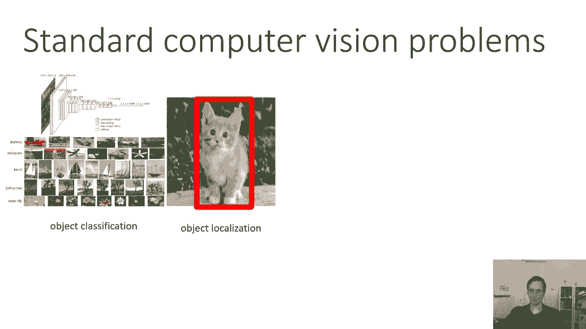

我们必须以某种方式撤销池，这样你就可以，您实际上可以进行一个解池操作，有许多不同的方法可以做到这一点，一个简单的方法是复制值，所以如果你有一个二乘二的输入，你想把它变成一个四乘四的输入。

你只要把左上角两个两个地铺，你把右上角两个两个地铺，但你可以使用的另一个技巧，它实际上工作得很好，而且有点聪明，是每次执行池操作时，您保存哪个索引，实际上有最大值，所以在这个例子中。

在分辨率降低阶段的池期间，在左上角的二乘二区域，那五个价值最大，所以我们保存索引，那五个人的位置，所以当我们稍后执行解池时，我们将该值写入相应的索引中，所以在那个二乘二的区域，右下角有最大值。

所以当我们稍后解池时，右下角是要得到值的，其他一切都将为零，好的，看看这张照片思考一下这个操作，如果你不完全清楚，每次你泳池，保存值最大的索引，然后后来在网络上，当你有相应的向上采样时，你拿那个索引。

并且将低分辨率映射中的值保存到相应的索引中，在高分辨率地图中，现在这个，当然啦，要求您的网络是对称的，这意味着每次你在另一边有一个池子，当你回去的时候，您必须有相应的解池，一般来说。

这些网络不一定是对称的，如果他们只是用这些转置卷积，但是如果您使用池和解池，然后你必须对称，我猜，这没关系，对称是可以的，好的，所以现在你基本上可以在向上取样阶段，您可以用这些转置卷积替换卷积。

您可以用这些解池操作替换池。

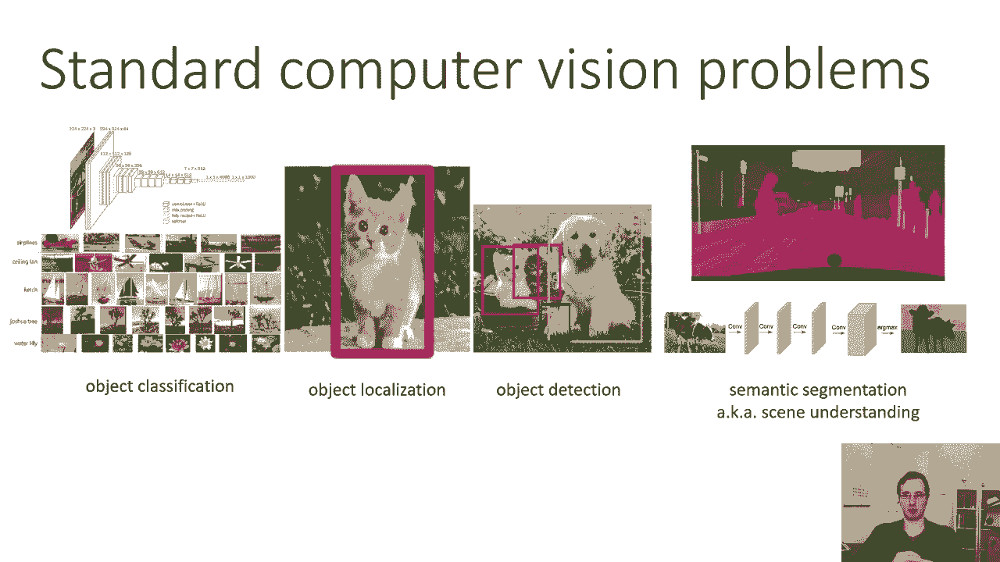

所以一种非常简单的架构，这是一种瓶颈架构，您通常使用传统的卷积网络，如VGG或Resnet，作为第一部分，获取图像并将其置于瓶颈中的部分，然后你会把它翻过来，产生转置卷积，并解池以使其恢复到原始分辨率。

这是论文中使用的基本设计，称为完全卷积网络，用于长语义分割，一点都不，所以他们说明的方式是，他们说，嗯，让我们以一些标准的现有网络为例，比如VGG，例如。

你可以把这个原始网络想象成产生一个低分辨率分类器，然后你把所有的池图层都取下来，把它们变成解池层，把你所有的卷曲，把它们变成这些转置卷积，所以他们在这里所说的采样是转置卷积。

然后他们把这个和池中的索引结合起来。

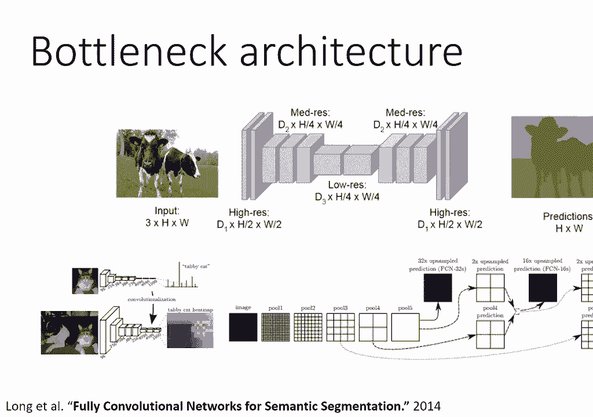

现在，您可能会想到这种方法的一个问题是，也许一些空间信息实际上丢失了，我是说，池层用于丢失空间信息，如果之后有一些解池和转置卷积，他们会让你的决心恢复的，但他们可能无法恢复精细的空间细节。

所以这里的一个想法是，也许你可以把多种分辨率结合起来，样品备份，也许你可以把低分辨率的东西，对它进行采样，并将其与以前通过跳过连接获得的更高分辨率地图结合起来，跳过连接很像剩余连接。

这就是一个叫做单元的设计背后的想法，基本单元设计已应用于许多不同的领域，包括语义分割，而且像甘斯这样的生成模型也很受欢迎，我们以后再谈这个，这是一个潜在的单元设计的图表，实际的体系结构。

你可以把它想象成和VGG很相似，但是有跳过连接，所以你可以看到有两个卷积层，呃，在开始的时候，所以在左上角，然后是一个下降两倍的采样，然后再增加两个卷积层，然后再向下采样两倍，以此类推。

然后当我们开始取样时，我们实际上要做的是向上取样前一层，然后我们取原始修道院中分辨率相同的层，我们连接它的激活，所以基本上在每一个向上的采样层，激活由两半组成，前一个较低分辨率层的向上采样并连接到它。

具有该分辨率的原始层，这是由这些灰色箭头指示的，所以灰色箭头基本上就是把你之前的激活，在这个分辨率下，把它们放在你当前的向上采样层上，这是由白框指示的，所以你可以看到每次我们取样，我们有一点蓝色的部分。

这是在池和转置卷积上得到的，然后我们有白色的部分，这只是我们在输入中对该决议的先前激活，只要把它连接到那个，这就是为什么当我们下样品时，你可以看到我们有64 1 2 2 2 5 6 5 12。

当我们开始取样时，现在，我们第一次有样品，我们总是有两倍的过滤器数量，所以当我们取样到呃的分辨率时，一零四在那里，你可以看到有一个，有一块蓝色的和一块白色的，频道总数是五个，十二，那是因为二百五十。

其中六个来自之前的高分辨率地图，另外两个五六从上面来，取样前五个二乘五二图，所以嗯，这基本上是一个有点复杂的画面，但这是一个非常简单的想法，它只是复制你之前对该分辨率的激活，到当前向上采样阶段。

这可以更好地保存更高分辨率的细节，因为虽然这些更高分辨率的地图可能没有语义上的意义，它们可能会编码有用的高频细节，如边缘和边界的位置，这样当您实际输出分段时，你会让它与牛的实际边缘完美地对齐。

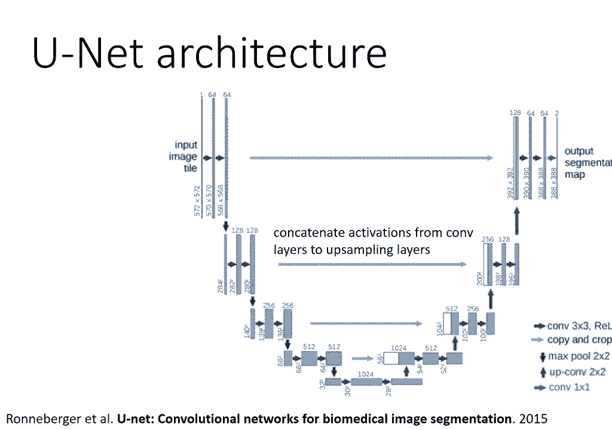

好的，所以总结一下，在这一点上，我们讨论了四个标准的计算机视觉问题，对象分类。

我们在上一节课中讨论过，对象定位，其中有一个对象和一个边界框。

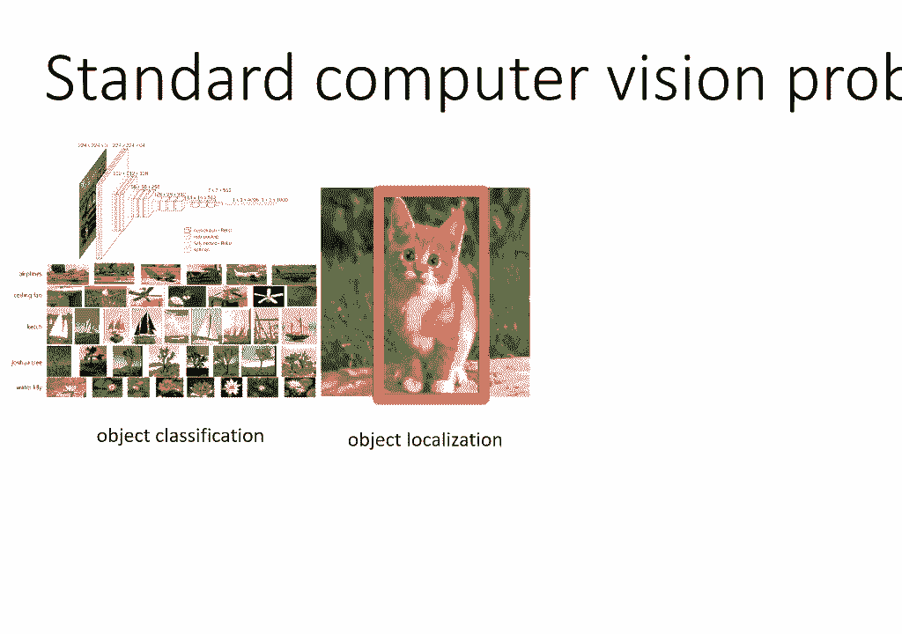

对象检测，其中有许多对象和许多边界框，现在是语义分割，其中您实际上需要每个像素输出一个标签，你可以看到这些有很多共同的主题，呃，呃，像这样的话题，比如说，你可以分享的概念，大家可以看到。

我们使用滑动窗口的方式有很多相似之处，在对象定位中，目标检测，以及我们如何用语义分割进行每像素分类，但也有一些区别，比如，比如说，回归到边界框的需要，诸如此类的事情好吧。

所以希望这能给你一点计算机视觉的背景知识，尤其是如果你想做这样的事情，呃，在你的最后一个项目中，嗯，希望这能给你一些东西，如果你想了解更多，我强烈建议阅读一些参考的论文。

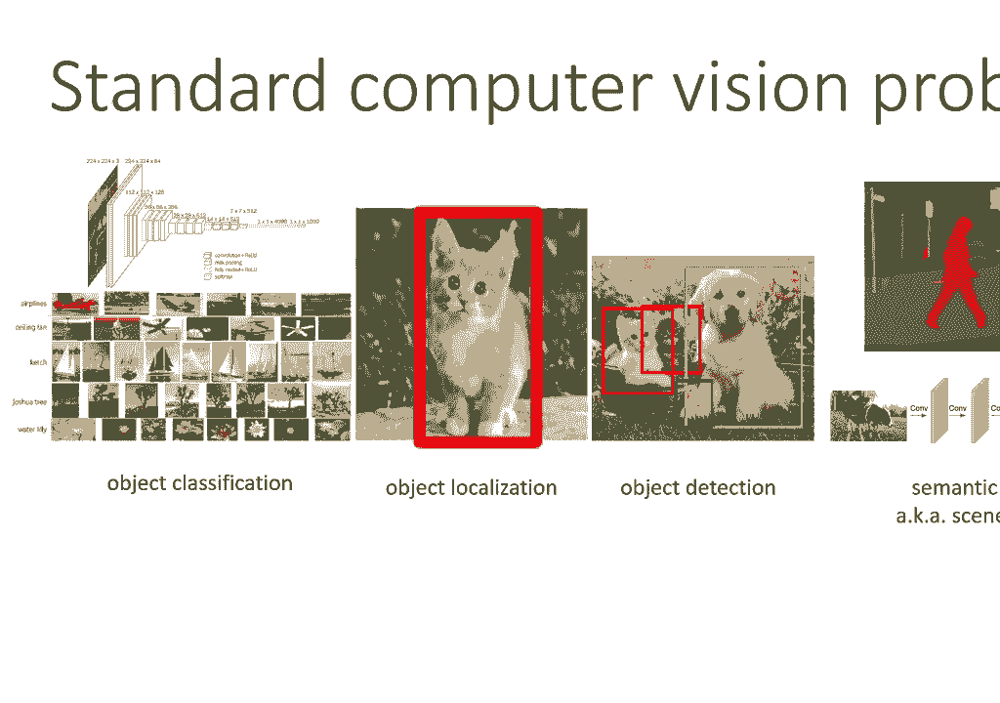