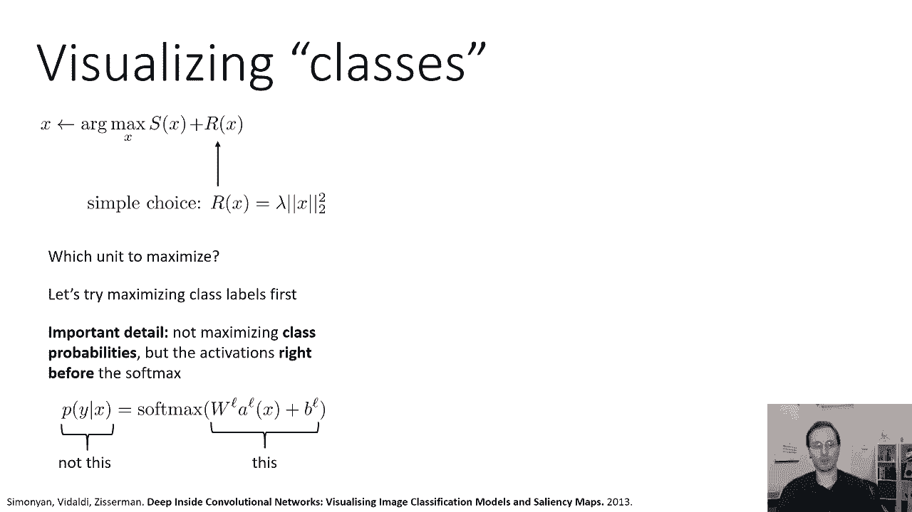
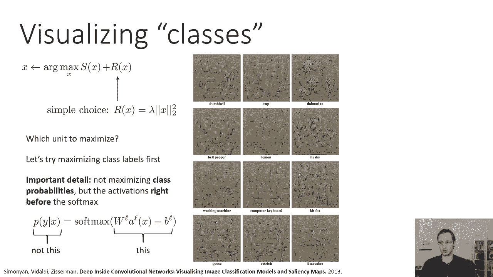
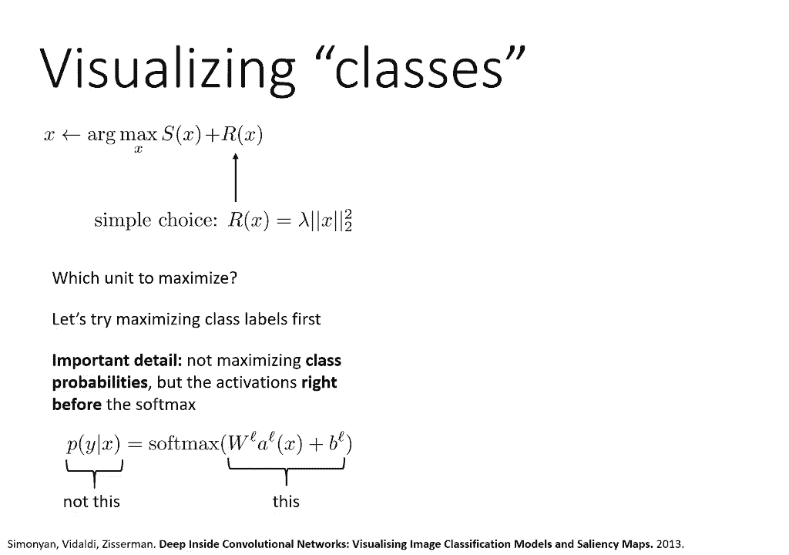
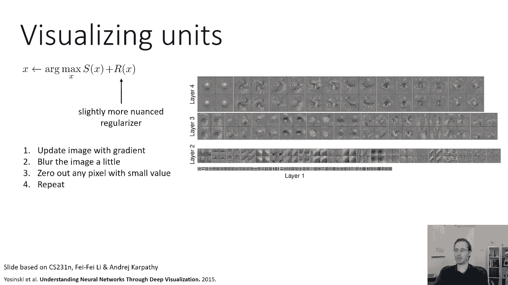

# P28：CS 182- Lecture 9- Part 2- Visualization and Style Transfer - 爱可可-爱生活 - BV1PK4y1U751

所有的权利，在下一节中，让我们更多地讨论如何可视化特性，甚至可能是带有反向传播的整个类，所以我们要讨论的下一个想法是超越，只是想把渐变形象化，导数，如果我们试着优化图像呢，呃。

完全从零开始最大限度地激活一个特定的单位，所以在我们试图找到激活一个单元的图像补丁之前，然后找出这些补丁中的哪些像素实际上负责激活，现在我们要试着生成整个补丁，甚至可能是完全来自网络的整个图像。

所以在我们想计算哪个像素会影响一个特定的单元之前，对于给定的图像，现在我们要做的是，我们要计算一个特定单位的导数，相对于图像，然后我们实际上会修改图像来激活那个单元，这是非常好的。

因为我们实际上不需要任何特定的图像来开始，它可以生成一个完全随机的图像，就像随机噪声一样，然后以这种方式迭代修改以优化它，以便它最大限度地激活一个特定的单元，这可能更好，因为它提供了一些废话。

对一个单位正在做的事情进行更公正的调查，这不是找到一个激活你的现有图像，它实际上是关于产生一个全新的，现在不幸的是，如果我们只是天真地使用这个程序，它可能不会很好地工作，好的。

那么这个很好地解决了什么优化问题呢，这是试图找到x，也就是激活的arg最大值，激活是x的函数，所以我们可以把m和p写成x的函数，更一般地，我们可以把这想象成找到一个x，它使x的一些客观s最大化。

其中x的s可以指单位或类标签的任何组合，如，比如说，我们可能希望在图像的所有位置最大化特定过滤器的激活，或者我们想要，我们可能想最大化一个特定类的概率，试图找到什么是网络，被认为是该类别的原型图像。

所以这本身不太好用的原因，是它有点太容易产生真正疯狂的图像，如果你只是天真地这样做，所以回想一下这张猫神经衍生物的图片，如果我们想优化一个图像，更好地发射这个单元，你可以看到这个单位有一个正导数。

当我们把猫的眼睛弄得更蓝的时候，所以如果我们把蓝色频道设置为十亿或其他非常，非常强烈地激活那个单位，它会像一只超级猫一样创造出巨大的，无限明亮的蓝眼睛，单位会对此印象深刻，会说好，这肯定是只猫。

但我们不想那样，我们不想要疯狂的图像，我们想以某种方式限制这个过程，这样产生的图像就像一种可感知的图像，所以我们需要某种调节器来防止疯狂的图像产生，对这些可视化技术的大量研究。

实际上处理了不同的方法来规则化图像，以防止这些非常疯狂的解决方案，一个非常简单的选择，往往有效，一种好的方法是简单地正则化像素激活的平方之和，本质上是我们之前看到的平方范数正则化器，这很有道理。

因为如果我们有可能产生一只拥有无限光明的超级猫，无限蓝眼睛，嗯，这将有一个非常大的标准，这个规整者会对此非常不满意，所以这个正则化器会阻止这个解决方案，还有一些其他的解决方案，它不会阻止。

但总的来说，它实际上是一个明智的规则化器，好的，所以如果我们加上这个正则化器，然后我们优化，嗯，我们可能需要问一下哪个单元，我们是否应该最大化x的s应该是什么，让我们从选择x中的s作为类标签开始。

所以这将更容易理解，说得很好，这是我们得到的简历，但我们也会在一秒钟内做Conv Six的事情，但现在让我们从类标签开始，所以这就像问网络，嗯，你认为是什么，是最大值是最大化火烈鸟标签的图像，例如。

使其工作的一个重要细节是不是最大化类概率，您实际上希望在SoftMax之前最大化激活，所以这意味着最后一层，你在末端有一些线性层，它将进入一个软最大值，你想把这个部分最大化，不是这个部分。

原因是在软马克斯，除以所有其他类的激活，如果你最大化，假设你的班级是火烈鸟，校车和河马，你想要最大限度的火烈鸟形象，相反，你会得到的是最小的图像，校车和河马对吧。

因为你可以通过让它更像火烈鸟来增加火烈鸟的可能性，或者让它少坐公共汽车或河马湖，因为概率是归一化的，所以实际上，如果你最大化概率，你可能会得到一些非常疯狂的东西，你可能会得到一个疯狂的图像。

那不太可能是河马或公共汽车，因此更有可能是火烈鸟，但是如果你在软最大值之前最大化东西，然后呢，你实际上会对最相似的东西进行适当的优化。

那个特定的阶级，这些是这篇论文的一些结果，叫做卷积网络的深处，图像分类模型和显著性图的可视化，你知道的，当然啦，这些图像不太逼真，因为它们不是从任何真实的照片开始的，他们从一些基本的噪音开始。

然后用这个正则化器运行这个梯度下降过程，生成在网络中最大限度地激活该类的映像，但是如果你仔细观察这些照片，你可以看到有一些明智的事情在发生，所以在左上角你有一个哑铃，绝对不像哑铃。

但它看起来确实像两个庞然大物的许多副本，中间夹着某种棍子，如果你看杯顶中间，绝对不像杯子，但它有那些，这种轮廓，看起来有点像这些老式茶杯，斑点狗绝对不像斑点狗，但里面肯定有一些斑点，如此清晰。

这个模型要找的东西，当它试图将某物归类为斑点狗时，就是它有没有斑点，如果你看电脑键盘第三行第二列，那里有一些矩形网格看起来有点像按钮，基特狐狸，第三列第三排肯定有狐狸年的形状。

左下角的鹅也明显有一些鹅的轮廓，但又一次，很明显不仅仅是一只鹅，这可能会让我们对这些网络寻找的东西有一点了解，例如，它暗示如果图片中有一只鹅，你要把那只鹅繁殖二十倍，会更像鹅，所以鹅越多越好。

越鹅越像鹅，也让它有一点，很明显这个网络不太关心形状的特定轮廓，就网络而言，斑点狗真的是一个斑点，这不是它有没有耳朵或眼睛的问题，它真的是关于质地的，好的，所以说，这可以让我们了解网络可能擅长什么。

它可能不太擅长的是什么。

以下是Zynski的另一篇论文中的一些可视化，这叫做通过深度可视化来理解神经网络，这是一个相似的原则，但它使用了一个更细致入微的规则化器，所以他们使用的正则化器有点难表达为一个函数，但程序如下。

使用渐变更新图像，然后你实际上模糊了图像一点点，直觉上，它的作用是，它防止优化器产生真正疯狂的，基本上愚弄分类器的高频细节，所以模糊会让它有点，它倾向于强调低频的重要性，因此使它产生更连贯的形状。

这可以防止微小的噪音扰乱网络，然后你重复这个过程，所以用渐变模糊更新，将真正小的激活降至零并重复。

这是他们为特定课程提出的，这些可视化现在开始看起来更容易解释，所以你可以看到上面的火烈鸟，左，图像实际上有看起来像火烈鸟的东西的轮廓，所以对于火烈鸟来说，至少这个特定的网络确实寻找特定的形状，心兽。

不管第一行第三列是什么，你可以从这个中猜到，那是一种长着鹿角的动物，因为虽然这些照片中有很多复杂的形状，一个反复出现的主题似乎是这种长着大鹿角的鹿一样的头，所以不管心兽是什么，我不知道那是什么。

但我猜它是某种长着鹿角的动物，嗯台球桌，肯定有桌子，喜欢它和旅行车的味道，如果你仔细看，你几乎可以看到一些窗户，偶尔也会有一两个轮子，好的，所以一些明智的事情正在发生，并利用这一切。

应用同样的方法也分析哪些补丁，最大限度地激活特定层，所以在这里他们选了一个班，然后他们在该类的特定层最大化激活，你可以看到在海盗船的第八层，比如说，它往往有一个更全面的，一个实际上。

你实际上可以看出有一些带桅杆的帆船，而在第七层，它看到了一些更精细的细节，似乎类似于温莎领带，你可以看到一些看起来有点，就像第八层的领子和领带，而对于第七层来说，形状更抽象一点，当我们进入较低的层。

事情变得，你知道，明显较小，因为这些层的感受野更小，也更抽象一点，当你下到第四层的时候，它实际上是在看基本的几何基元，像圆圈和旋转的东西而不是整个物体，如果你现在进入第二层或第一层。

