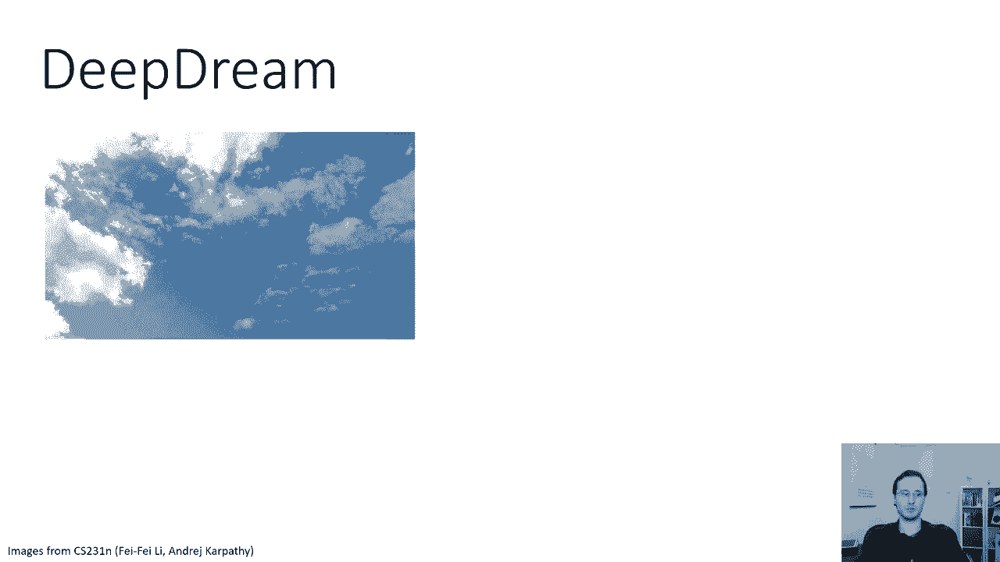
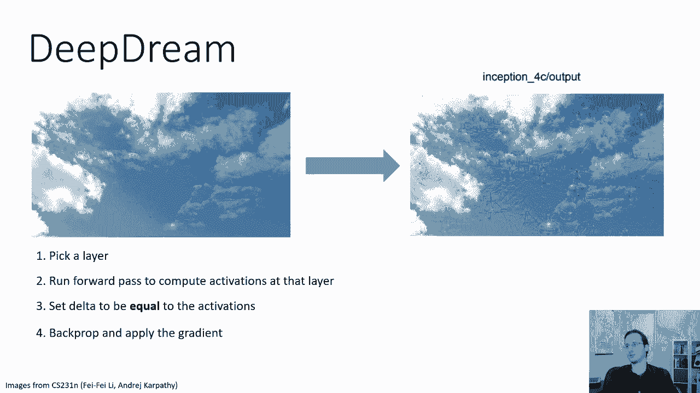
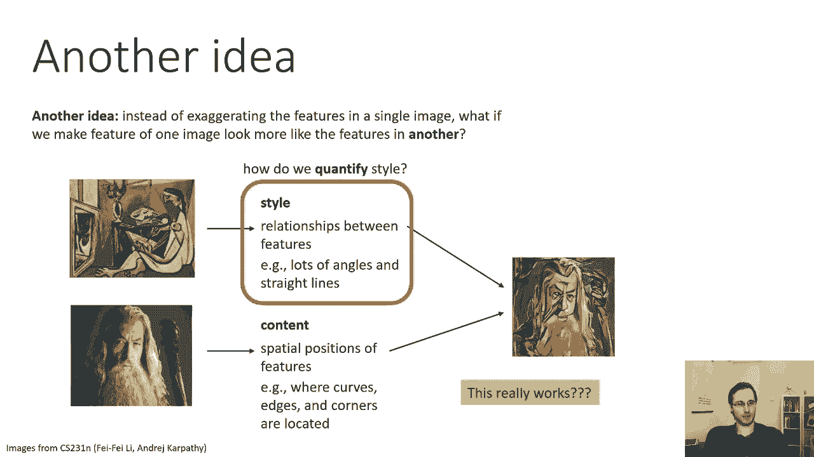
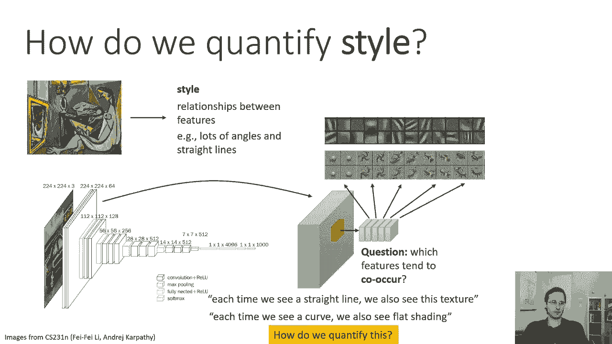
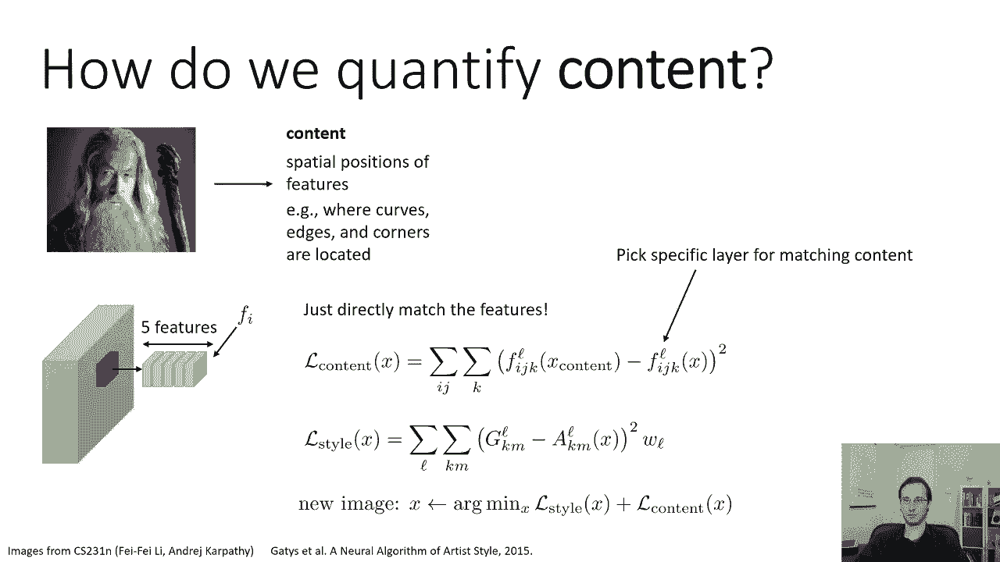
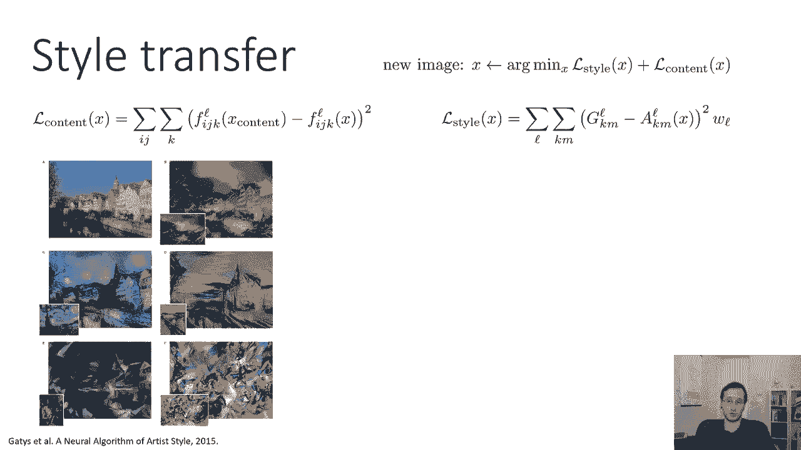

# P29：CS 182- Lecture 9- Part 3- Visualization and Style Transfer - 爱可可-爱生活 - BV1PK4y1U751

所有的权利，所以在今天讲座的最后一部分，我们要稍微换档，而不是谈论可视化过滤器，我们将讨论使用一些类似的技术来修改图像，所以在我们想问这个问题之前，给定一张特定的图片，五层的十七频道是什么。

在这张照片中看着，或者一般情况下，什么是17频道和5层，对…有反应，而现在我们要提出一个稍微不同的问题，我们要说，给了这张照片，如果它是一幅莫奈的画，它会是什么样子，好的。

现在你可能会说这些是完全不同的东西，为什么这甚至在同一张幻灯片上，直觉是莫奈的画有特殊的特征分布，这些特征的分布反映在修道院中单位的激活上，所以我们可以以某种方式将这些分布传输到其他图像上。

也许我们可以把一个像照片一样的图像，变成一个看起来像莫奈画的图像，通过夸大它激活的程度，在莫奈绘画中也被激活的特征，所以我们用来优化图像的技术，关于我们将要使用的类和特性的激活。

修改图像使其与其他图像相似。

我要讲的第一个技巧，沿着这些路线做一些事情是一种叫做深梦的技术，直觉上，你可以想象深梦所做的是在云中寻找图案，如果你曾经在阴天出去过，你抬头看天空，你看到云飘过，你可能会说嗯，那边的云。

也许它看起来有点像狗，那边的云像一条鱼，让我们看看我们是否能得到一个内容来做，基本上，我们要问我们的大陆是否在图像中看到了什么，然后夸大那个特征，让它看到更多，所以也许我们的大陆会看到这张照片，会说好。

我真的不知道是什么，这与我见过的任何课程都不一致，但看起来有点像狗，我的狗概率比我的其他概率高一点，那么我可以修改图像吗，为了增加这种可能性，来增加这种激活，狗在哪里，评论能告诉你它在哪里吗。

所以回想起这张猫的照片，眼睛在这里，你可以想象让眼睛更蓝，会让这只猫更像，但是，让我们应用它，到一个没有容易识别类的图像。

就像这张云的照片，嗯，这是深树会做的，程序基本上是这样的，在你的大陆上挑一层，运行向前传递以计算该层的激活，将后道具的增量设置为等于该层的激活，然后向后撑起，应用渐变。

所以本质上它是说在那一层激活的任何单元，更多激活它们，这是一种有趣的程序，但结果实际上相当惊人，所以如果我们仔细观察右边的图像，你知道吗，从远处看，只是看起来左边的云是一样的，但如果你近距离观察。

你开始看到一些物体在云中弹出，所以这里是那些放大的物体，你可以看到你知道，可能有些看起来有点像河豚，或者是蜗牛，所以它试图从本质上产生幻觉，它已经在那些云中看到了一点，基本上更强调它们。

这样它们就更明显了，所以实现这一点的过程实际上非常，非常简单，这是一些代码，这是安德烈的幻灯片，阿帕蒂和，代码基本上在做什么，是不是，呃，首先将目标设定为，图层的激活。

所以这就是用红色突出显示的部分所说的，就是向前跑，通行证，找出激活，并将损失的导数设置为这些激活，因此，这与将目标设置为激活的总和是相同的，然后当它实际应用渐变步长时，它要做的是。

它会对图像施加一点抖动，这就是用蓝色突出显示的部分，然后它会向前传球，计算主观，设置delta为激活的，然后向后传球，所以这只是反向传播，然后它会将渐变应用到图像上，有一点点正常化，呃。

只是为了避免由于整体规模而产生的任何问题，它将把它应用到图像上，然后它会产生更多的，所以直觉上抖动在做什么，只是防止这个优化器对特定的像素做疯狂的事情，它的作用与以前x的r相同。

它本质上是一个规范者来促进这一点，看起来像一个自然的图像，如果你不用这种抖音，会发生的是你基本上会得到一个疯狂的图像，像素得到微小而荒谬的修改，基本上愚弄了网络，让它最大限度地激活了这个垃圾的一些类。

它所做的是稍微改变图像，应用梯度，然后把它移回来，所以这是一个非常简单的程序，它基本上在做我们以前做的同样的事情，现在只有x的s是基本上在那一点上的平方激活，因为平方激活的导数就是激活本身。

所以这里有一些图像实际上是由深梦产生的，当然，这从特定的图片开始，然后修改这些图片，你可以猜到这些照片是什么所以在右上角，右下角是梵高的《星夜》，这是一张羊在田里的照片。

但网络显然对这些图像做了一些相当大的修改，比如说，你可以看到左边的图像，实际上插了一些眼睛，相当多的眼睛一开始就不在那里，在右下角的绵羊图像中，它做了一些有点疯狂的事情，比如给羊增加很多腿。

因为我猜羊的一些底部看起来有点像动物，所以它在里面放了更多的动物，它还把羊的鼻子变成了狗的鼻子，以适应星夜，它似乎投入了大量的挥舞，进入画面，所以它做得有点疯狂，所以幻觉的东西，你可以自己玩。

如果你现在转到幻灯片上的URL，你可以在这一点上问，就像这有什么好处好吧，主要是娱乐，主要是一点点艺术许可，你可以从大陆上得到一些疯狂的图像，但你实际上可以重新利用其中的一些想法，做一些更多的事情，呃。

可能有用，更务实一点，所以这里有另一个密切相关的想法，而不是夸大单个图像中的特征，如果我们让一个图像的特征看起来更像另一个图像的特征呢，比如说，如果我们拿一幅画，我们以某种方式提取它的风格。

通过观察那幅画中特征的统计数据，也许这种风格是由特征之间的关系来代表的，比如哪些特征倾向于紧密地出现在一起，可能有很多角度和很多直线，但不是很多曲线的东西对吧，这可能是图片的一个风格方面。

然后我们再拍一张像照片一样的照片，我们把它的内容拉出来，也许内容更多的是通过特征在空间中的特定位置来反映的，事物在图片中的位置，比如说，曲线在哪里，这个角，或者边缘，或者曲线。

如果你把这种由风格表示的关系和由内容表示的空间位置结合起来，也许你会得到照片的修改版本，反映了画中的风格，所以说，也许，你会得到一幅甘道夫的现代绘画风格的画，这真的很好用吗，令人惊讶的是，是呀。

谈谈如何让它发挥作用，我们要讨论的最重要的事情是如何量化风格，事实证明，实际上有一个相当简单的方法来做到这一点。

呃，就大陆激活而言，所以让我们假设我们有这幅画，我们通过像VGG这样的卷积网络运行它，我们看PPG中的一个特定层，我们实际上要看许多不同的层，但让我们从一层开始，那层的不同滤镜反映了特定的视觉模式。

较低级别的过滤器可能会反映简单的模式，如边缘，更高级别的过滤器可能反映更复杂的模式，像旋转的东西曲线直线和角度，等等，当我们试图量化风格时，我们将尝试丢弃空间信息。

我们不太关心特定的曲线和角度发生在哪里，我们更关心哪些发生了，以及它们之间的关系，所以我们能做的就是，我们可以在一个特定的位置拔出所有不同的过滤器，每一个过滤器，假设他们有五个人，它们会对应不同的模式。

也许其中一个对应于圆圈，另一个对应于这些螺旋的东西，以此类推，一般来说我们有，这里可能有64或256个过滤器，我有五个，只是为了更容易画，然后我们要问这个问题，哪些特征倾向于同时出现，比如说。

我们能在一个特定的地方用这种特殊的风格说些什么吗，如果你看到一个圆形的东西，你也可能会看到一些旋转的东西，所以这是一种接近漩涡的圆圈风格，所以每次我们看到一条直线，我们也看到了这个特殊的质地。

或者每次我们看到一条曲线，我们总是得到平坦的阴影，或者每次我们看到一个漩涡，我们也看到四分之一，好的，这些都是文体属性，与它们在图像中的位置无关，那么我们能量化这种关系吗。

我们可以量化它的方法之一是通过建立特征协方差，对于两个特性k和m，所以这里的特性是两个不同滤镜K和M的滤镜，在某一层，你可以计算他们产品的期望值，期望被接管到图像中的不同位置，所以这是一个单一的图像。

为了一幅画，检查激活地图中的每个位置，总的来说，职位加起来平均，这两个特征的乘积，如果这些特征倾向于一起出现，如果它们很少同时出现，那么它们的产品就会非常大，这意味着如果其中一个非零，另一个通常为零。

那么他们的产品就会很小，它们将接近于零，因此，同时出现的特性将有大的产品，不同时出现的功能将有非常小的产品，你可以建立一个叫做克矩阵的矩阵，其中矩阵中的入口km只是滤波器k的协方差，过滤掉，事实证明。

这个克矩阵是量化风格的一个非常有效的方法，在图片中，现在你得到每一层的一个矩阵，矩阵的维数就是通道数的维数，所以这是一个接一个的渠道，它与激活映射的分辨率无关，因为记住你在所有的x上平均，Y职位，因此。

这抛弃了所有的空间信息，并保留了共同出现的特征概念，就像每次有一条直线，你也可以看到这个质感，如果有直线的特征和纹理的特征，如果它们同时出现，你会期望它们的产品很大，如果它们很少一起发生，就很小。

所以如果特征有这个协方差，然后我们就有了，在某种意义上正确的风格，这似乎令人惊讶，但它实际上是有效的，如果你对选择哪些层有点小心，这个克矩阵将为源图像计算，对于表示样式的图像。

然后我们要通过优化两个目标来构建一个新的图像，风格目标和内容目标，所以这个风格目标将基于这个克矩阵，假设GL是L层的源图像图矩阵，x的l是新图像在l层的基础矩阵，它是x的函数，因为当你改变图像时。

你改变相应的克矩阵，那我们就可以把损失记下来，所有层的样式损失，然后对该层的所有对特征进行求和，这只是以g为单位的L的条目之间的平方差，和x的l中的a项，每一层都由一个重量WL加权。

这个重量必须小心选择因为，你必须优先考虑对所需风格的相对贡献，不同抽象层次的，记得吗，记得当我们在不同的层上可视化过滤器时，你可以看到更高层的过滤器往往更整体，它们倾向于反射完整的物体。

而低层滤波器对应于更多的几何细节，所以说，取决于您是否要转移样式，以更高阶的方式挑选出看起来相似的物体，或者以低阶的方式通过挑选出类似的更精细的几何细节，这应该会影响你如何选择你的体重，当然还有。

在实践中，适当地选择这些重量是有一点艺术性的，但如果你选择得当，然后你可以得到x的l样式，实际量化图像风格x之间的相似程度，以及用来形成原始克矩阵的图像的风格，好的，所以现在要实例化这个。

我们必须为内容和内容设计一个目标，在某些方面应该是相反的，它应该主要关注于保持空间位置比如这些特征所在的位置，而不是看特征之间的关系，所以说，原来，量化内容的一个非常简单的方法是只匹配内容图像中的特征。

所以呃，如果f i j k是L层ij位置滤波器k的值，然后你可以对所有位置和所有过滤器和，取这些激活之间的平方差，现在请注意关于l内容的一些与l样式非常不同的事情，l内容用于特定层，它不是所有层的东西。

所以在这里你会选择一个你认为可以反映内容的层，同样，这种选择实际上是相当微妙的，然后保存位置信息，因此，您实际上将ij位置的功能与内容图像匹配，同一位置的特征，所以你希望位置对齐。

而第一种风格你想要相反的，你想把位置扔掉，所以将此与风格损失进行比较，风格损失没有IJ在里面，一点都没有，ij已经总结出来了，当我们计算源图像和目标图像的克矩阵时，然后用L反向传播就形成了完整的图像。

风格和内容，所以这基本上是程序，这是我们可以用来拍摄两张图像的程序，一种代表风格，一个表示内容，我们将克矩阵与样式图像的大矩阵匹配，我们匹配特定位置的功能激活，到它们在内容图像中的相应激活。

所以让我们看看这是干什么的，这实际上是相当了不起的，呃，你可以用这种方法得到的保真度。

所以在顶部，我有基本方程，只是想提醒你，这是Eddies的论文，被称为艺术风格的神经算法，他们要拍左上角的照片，呃，这种运河边的城市景观，然后他们会拿不同的画，他们正在拍的画被展示出来，左下角的小插图。

更大的图景显示了发生的事情，如果你把照片中的内容和画中的风格，你可以看到它实际上做了一些非常了不起的事情，例如图像C中的星夜图片，它实际上会形成那些小漩涡，甚至在原始照片中都不存在，但总的来说。

它保留了建筑物的一般几何形状，运河边等等，有趣的是，它甚至风格化了运河中房屋的倒影，对于屏幕，第二排，第二栏，i，它实际上引入了一些额外的细节，所以背景中更远的建筑。

我应该用原画中这种漩涡状的天景来代替，但在右边，建筑还在那里，所以它变成了绘画的一种融合，和原始照片，运河，比如说，似乎被拆除了，取而代之的是一座桥，因为桥在原画中是如此突出的特征。

几何细节不一定要保留，所以在呃的情况下，底部有更多的抽象画，许多几何细节实际上被消除了，那是因为那些画的风格，就是没有保留太多细节，所以这种简单的量化风格的方法是非常了不起的。

根据修道院的克矩阵特征实际上产生了一些有意义的结果。

你可以自己玩这个，那个呃，有一个叫D part io的网站，它允许您将样式应用于照片，这些是一些真实的照片，以不同的方式风格化，这是安德里亚带来的幻灯片，所以总结一下，我们讨论了如何将。

什么不同的过滤器和公寓使用他们的梯度，我们可以进一步使用这些渐变来优化特性，实际上最大限度地强调，那些，呃，那些过滤器，当我们优化图像以最大限度地强调这些特征时，我们可以把它变成生成新图片的算法。

并生成具有，你知道吗，一些艺术属性。