# 【双语字幕】伯克利CS 182《深度学习：深度神经网络设计、可视化与理解》课程(2021) by Sergey Levine - P30：CS 182- Lecture 10- Part 1- Recurrent Neural Networks - 爱可可-爱生活 - BV1PK4y1U751

欢迎收看今天的第十节课，我们将开始讨论递归神经网络，然后它将过渡到一个关于序列模型和自然语言处理冒险的单元，这将跨越接下来的几周，所以我想在这节课开始的问题是，如果我们有一个可变大小的输入，到目前为止。

我们讨论了有一个输入的情况，就像一个图像，它们可能由许多像素组成，但它仍然是一个固定的尺寸，单输入，然后我们有一个输出，比如，比如说，该图像中对象的语义类的分类标签，像一只猫。

现在让我们假设我们有一些序列输入，这些序列可以是可变长度的，例如，他们可能是，呃，英语句子，所以也许第一个序列有四个元素，x一x一，x一二x一三和x一四，第二个可能有三个元素，第三个可能有五个元素。

所以这可能涉及，比如说，短语的情感分类问题，这是一个非常常见的NLP问题，我们必须解决这样的问题，例如，如果你在网上有评论，你有亚马逊书评的文本，你想猜一下，这是正面还是负面的评论。

也就是所谓的情绪分类，从声音中识别音素，所以你有一系列的声音，你想弄清楚这对应于哪个音素，这样你就可以做语音到文本，或者你有一个视频，你想分类视频中发生的活动，这是人们打篮球的视频吗，还是赛车录像？

所以你可能会有视频帧序列，在所有这些情况下，对于不同的示例，输入的数量实际上是变化的，所以你需要一个不仅能容纳多个输入的网络，而且还有多个不同数量的输入，现在你可以采取一种非常简单和天真的方法。

你基本上可以说嗯，我的最大序列长度是五个，所以我要做的是，我要把我所有的序列，如果他们短于五个，我只是替换呃，剩下的输入，缺少默认值的，像零一样，所以我会把它们归零，现在我所有的输入都是相同的大小。

我可以把它们输入我选择的神经网络，不管是完全连接的网络还是卷积网络，这其实不是一个可怕的想法，对于短序列，这实际上可以很好地工作，不幸的是，它不能很好地缩放到非常长的序列中，随着序列变得很长，本质上。

发生的事情是，为了填充到最长序列的长度，你最终会有非常大的输入，然后不清楚如何处理它们，所以我们可以用的另一个想法，这构成了递归神经网络的基础而是考虑它，有点滑稽的设计，但后来会证明是非常合乎逻辑的。

每个图层都有一个单独的输入，假设我们有四个层，我们有一个长度为四的序列，然后我们将发送x 1 1作为第一层的输入，x 1 2输入到第二层，x 1 3输入到第三层，和x 1 4作为第四层的输入。

如果我们有一个长度为3的序列，那我们现在就只有三层了，当然你们中的一些人可能会问，你能有一个层数可变的网络吗，所以我们很快就会讨论这个问题，但基本的想法是，在每一层我们都有一个输入。

因此层数将等于输入数，这似乎是一个奇怪的选择，但你很快就会看到，这个选择实际上很有意义，所以在每一层，我们现在有两个输入，除了第一层，所以大多数层我们有两个输入，前一层和新输入x的激活。

所以如果我们考虑层um x和层l，那么我们可以做的是我们可以构造这个向量，我们称之为l减1的小节，也就是上一层的激活，a l减1，和那一步的输入，我们称之为x i l或x i t。

然后我们对它进行常规的线性操作，所以我们有一个权重矩阵WL和一个偏置向量BL，我们要乘一个酒吧艾尔玛，减去1乘以w l再加上bl，这就给出了那个层的zl矢量，然后像往常一样，我们应用我们的非线性。

比如一个relu来获得一个好的，所以这很像我们之前看到的标准线性层，唯一的区别就是，而不是只将线性层应用于前一层激活-1，现在您将新输入连接到以前的层激活，然后通过线性操作，然后非线性，好的。

到目前为止，一切似乎，你知道的，相当直截了当，我要说这种特殊的设计实际上并不很好地在实践中工作，我们将在第二部分讨论，为什么会这样，但是现在当我们讨论标准RNN时，这基本上是我们要建立的设计。

所以我们每层有一个输入，在每一层，我们连接以前的层激活和新的输入，通过线性操作，然后应用一个非线性，好的，所以显而易见的问题是，丢失的图层会发生什么，对呀，因为如果你有一个长度为5的序列。

然后你会有五层，如果你有一个长度为3的序列，然后你有三层。

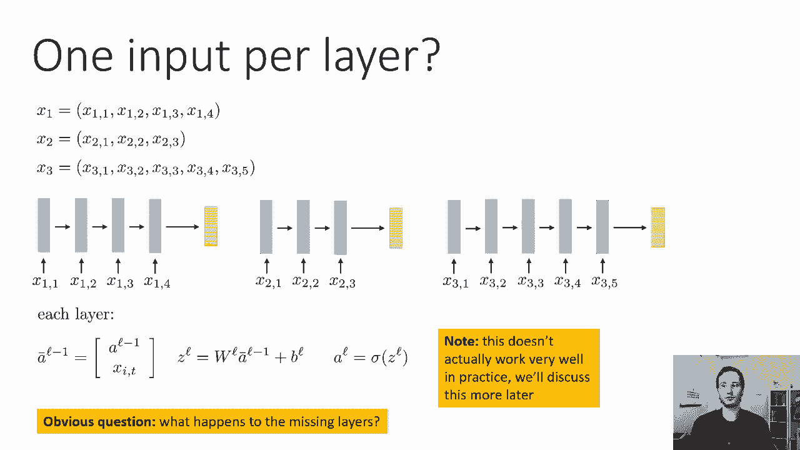

那么这些缺失的层到底是怎么回事，嗯，这里有一个有趣的把戏，我们将使用，这可能看起来有点奇怪，但它实际上会很好地工作，如果我们有一个更短的序列，我们要做的是，我们将假设在第一次输入之前层的激活。

基本上不存在的图层都是零，事实上，不管序列的长度如何，我们都要这样做，所以即使是最长的序列，我们仍然会有一个虚拟的前一层，那里的激活都是零，所以在每一层，我们将执行幻灯片右侧所示的操作，在第一层。

我们将把输入连接到一个由零组成的大向量上，所以现在我们实际上可以实例化这个东西，我们可以对每一步都有不同的权重向量，在序列的第一次输入之前的步骤中的激活将为零，然后之前的任何事情都无关紧要。

所以只要我们有至少同样多的权重矩阵，因为我们有最大可能的输入，我们可以把这个设计，这比总是零填充最大值更有效，呃，最大长度，因为每一层都比我们需要的第一层要小得多，如果我们把整个最大长度序列。

所以每一层的输入大小都很小，它只是序列中一步的大小，可以是一个单词或一个字符，此外，计算这个要高效得多，因为对于较短的字符串，对于较短的序列，你必须评估更少的层，所以你只需要评估大量的层。

如果你真的有一个巨大的序列，所以序列越短，我们要评估的层就越少，这个设计的一个大问题，到目前为止，我已经讨论过了，我们在每一层都有一个不同的权重矩阵，特别是很长的序列最终会需要很多权重矩阵。

这些权重矩阵不会被训练得那么多，因为最后几层将为所有序列训练，而第一层只使用过，对于最长的序列可能很少训练，所以这是一个问题，我们需要解决这个问题，权重矩阵的总数随最大序列长度的增加而增加。

最初的几个权重矩阵可能很少被训练，所以我们需要把这个设计变成一个完整的，成熟的递归神经网络是共享权重矩阵，所以这意味着所有这些层的WL实际上都是一样的，现在，你如何评估这个网络的一切实际上并没有改变。

因为那个，所以这只会影响训练，训练期间，我们只需要迫使矩阵WL对所有层都是相同的，在测试时，这实际上是非常简单的，在测试时间一切都完全一样，我们只需初始化这个，这个虚拟的，呃，第一层到零。

然后我们在滑梯的右侧进行操作，但是在训练的时候，我们需要确保对于所有i和j，wi等于w j，同样，对于所有i和j，bl i等于b j，所以所有这些层的重量和偏差都是一样的，那将是非常好的，因为现在。

即使是很长的序列，他们可能需要在早期层的重量，我们只在很长的序列中看到，但这些重量和后面几层使用的重量是一样的，所以他们已经训练得很好了，事实上，如果我们强迫权重矩阵在每一层都完全相同。

我们实际上可以有我们想要的多少层，事实上，我们可以在测试时间有更多的层，我们在训练时，因为重量都是一样的，所以我们可以创造更多的副本，让整个事情变得像，或者只要我们想，这就是我们递归神经网络的基本设计。

基本的设计是你有一个非常深的网络，其深度等于序列的长度，每一层都有不同的输入，所以每一层基本上都将前一层的激活与输入连接起来，在那个时候的步骤，通过线性层，然后一个非线性，然后进入下一层。

作为来自虚拟上一层的输入，第一层获得一个零，权重矩阵在所有层共享，这意味着我们不需要大量的权重矩阵，等于最长序列的长度，我们只有一个权重矩阵，现在，当然，在这个基本的RNN设计上有许多变体。

我们将在讲座的后面部分讨论其中的许多变体，但这是基本的设计，所以花点时间考虑一下这个设计，确保你真的很清楚，呃，为什么要这样做，如果你对某事不确定，你可以考虑在这个视频下面的评论中问一个问题。

或者在课堂上询问，所以整个设计被称为递归神经网络，我们可以，当然啦，也称它为可变深度网络，所以反复出现这个词，反映了序列有时有时间解释的事实，因此，序列中的不同步骤可以被视为不同的时间步骤。

然后一个递归神经网络可以看作是一个时间过程，但我们也可以称之为可变深度网络，层数随输入数的变化而变化，参数数实际上没有变化，因为所有的层都共享参数，好的，现在作为一个旁白。

对递归神经网络有一种不同的思考方式，这是你经常看到的呈现方式，如教科书或其他课程，所以我们刚刚学到的是我们学会了观察神经网络，作为一种递归神经网络，因为这些可变深度的网络，你在课本上或课堂上经常看到的。

是一个递归神经网络会这样画，在那一层上有一个有趣的小圆形箭头，这个有趣的循环错误所代表的是这一层也得到了它自己以前的值，作为输入，现在，上一次，呃，带有一定的时间内涵，所以说上一次，序列中的前一步。

这是观察模型的等效方式，完全一样的型号，所以你可以把每一层都想象成，上一层作为输入和序列中的当前值，然后所有的层都是一样的，同样的重量，但你可以等价地把它看作是一个时间过程，只有一层的地方。

在时间的每一步，它获得以前的值作为输入，以及新的XT，这些是完全一样的，所以你可能会看到的常见的副歌是有人可能会说好，递归神经网络沿时间维扩展标准神经网络，这就是那个小圆形箭头所代表的。

或者这种句子的其他变体，我想这是真的，依我看，这对真正理解rns是如何工作的有些帮助，这让它们看起来比实际更神秘，所以说，如果这种时间过程视图对您更有意义，那你一定要跟着你的直觉走，我觉得，其实。

可变深度图实际上有助于解释，递归神经网络做得更好，所以对我来说，考虑递归神经网络更有意义，不一定是一个时间过程，但就像一个普通的神经网络，碰巧在每一层都得到额外的输入，层都共享相同的参数。

所以RNN只是跨多层共享权重的神经网络，在每一层接受输入，并且有可变数量的层，虽然其中一些决定可能看起来有点奇怪，事实证明，它们实际上真的很方便，如果您有可变大小的输入。

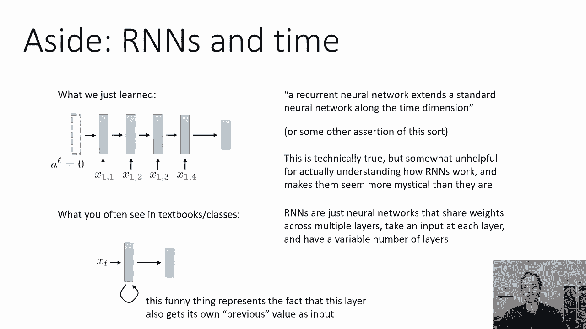

所以现在最大的问题是我们如何训练这个东西，在RNN培训时，我们必须处理许多问题，我们将一个一个地讨论这些问题，希望能很好地理解这一点，所以简短的版本是，我们将使用反向传播。

我们必须通过几种方式修改反向传播，使它真正为我们的递归神经网络工作，这些修改，它们实际上是标准反向传播算法的一种推广，所以我之前在课堂上提出的标准反向传播算法真的写出来了。

以一种使其适用于传统前馈神经网络的方式，像Tensorflow和PI torch实际上是这个基本设计的推广，这也适用于更复杂的网络，如RNNS，所以第一个问题是参数，这些W和。

B W矩阵和B向量不是特定层所独有的，它们实际上是由多层共享的，所以当我们返回传播时，呃，基本设计是一样的，我们向前传球，计算每一步的所有a和z，所以我们得到了一个1，一个2，一个3，一个4。

z 1和z 2是3和以前一样，然后是后传，我们也以同样的方式进行，我们将delta初始化为最终损失的导数，相对于最后一层或输出，然后每一层，对于每一个relu和每一个线性层，我们计算关于它的参数的导数。

和关于其输入的导数，就是上一层，所有的工作方式都是一样的，问题是现在所有这些层的参数都是相同的，这意味着第四层的θf，与第三层的θf相同，所以如果我们像这张幻灯片上描述的那样运行这个算法。

想象一下会发生什么，所以在这个长度的四个序列中，我们把delta作为损失的导数，相对于第四层的输出，然后在第四层，我们要计算损失对w的导数。和关于b，然后我们会计算新的增量，然后我们会回到第三层。

在第三层，我们将用W的梯度覆盖梯度，和B在第三层，所以照字面意思，l层的梯度，负1实际上会覆盖层L的渐变，我们不想那样，因为我们要损失对w的导数，和损失的衍生物b，来解释W和B对每一层的影响。

不仅仅是第一层，结果是非常，解决这个问题非常简单，事实上，大多数图书馆都没有这个问题，因为他们这样做有点不同，你要做的就是，而不是将导数dl dθf设置为df，dθf乘以delta，你只需要加上df。

dθf乘以delta到导数的值，所以在反向传播的开始，初始化所有渐变，你所有的导数都为零，然后在反向传播的每一步，您将新的df dθ乘以delta添加到旧的，这将在所有层积累这些梯度。

这实际上是允许反向传播所需的唯一更改，像这样处理共享重量，只要将新的dfdθ乘以delta添加到旧的，呃，渐变并清零所有的渐变，当然是在步骤之间，所以你必须把渐变归零，在反向传播开始时。

那么这实际上就会做你想要的事情，所以梯度下降的每一步，从清零所有的渐变开始，然后返回传播，为每一层添加DF，dθf乘以delta到导数的当前值，所以在最后一层，dl dθf等于零，所以当你加上，乘以Δ。

这与将其设置为该值相同，但在前一层，它是非零的，所以你实际上给它增加了一个新的价值，如果他使用这个程序，普通的神经网络会很好地工作，因为在那里你永远不会添加任何东西超过一次，所有的导数都是零。

它们在一层中被使用一次，所以他们把一些东西加到零，而不是只是重写它是完全一样的，好的，所以你基本上在向后传递的过程中积累了这些梯度，在每一层，您添加了额外的贡献，从该层到导数的梯度对w的贡献。

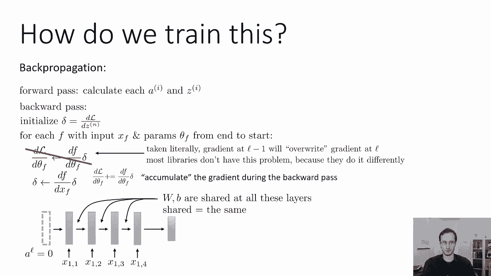

和对b的导数，好的，稍微靠边一点，只是为了解释这背后的数学，让我们考虑一个更简单的例子，假设你有一个x的函数f，它等于x的g，x的逗号h，所以g有两个输入，x本身和x的h，这和RNS有什么关系。

想象一下，这是一个有两个步骤的RNN，x的f是整个rnn，g是第二步，H是第一步，所以第一步取决于一些东西和参数x，第二步取决于第一步的输出和相同的参数x，所以如果我们能计算出关于x的导数。

这个小函数会给我们直觉，我们需要弄清楚如何计算RNN中的导数，那么这与w在rnn井中的角色如何相似呢，如果你只是，呃，假装x是w，其他的都是，在所有其他输入中被省略，这正是RNN使用两个步骤的工作方式。

所以让我们计算x的f对x的导数，现在x的f等于一个有两个输入的函数g，这两个输入都依赖于x，所以当你遇到这种情况时，根据微积分的规则，导数只是两项之和，通过第一输入的导数加上通过第二输入的导数。

所以我们得到DG DX，那是g对第一个参数的导数，x对第二个参数的导数，也就是dh dx乘以dg d d h，所以我们使用链式法则，因为我们有第二个函数h，这是通过链式法则计算的第二个参数的导数。

所以从这个，您可以看到，如果您有相同的变量通过多个参数进入一个函数，你想对这个变量求导，然后你只需把通过每个参数的导数求和在一起，这就是为什么我们最终将每一层的所有渐变相加，所以说。

这就是如何修改反向传播来处理这种类型的RNN，具有可变长度输入。

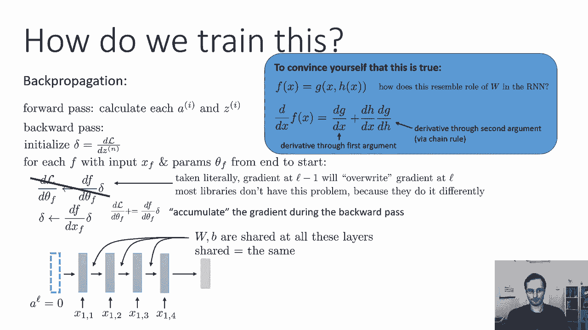

现在我们还要处理另一个问题，如果我们有可变大小的输出呢，因此，一些示例可能会为图像生成文本标题，有一些生成文本的图像示例，所以这里有一个单一的输入，即图像，而是一个可变长度的输出，即文本。

当你预测未来的视频帧序列时也是如此，所以底部的动画显示了，完成视频的附加视频帧，用黄色突出显示的帧实际上是假帧，由RNA生成，也可能产生音频序列等等，所以在我们每一层都有输入之前。

现在我们将在每一层都有一个输出，所以我们要有一个这样的建筑，一些输入进去，然后我们将在每一层产生不同的输出y帽，输出的数量可能因特定数据点而异。

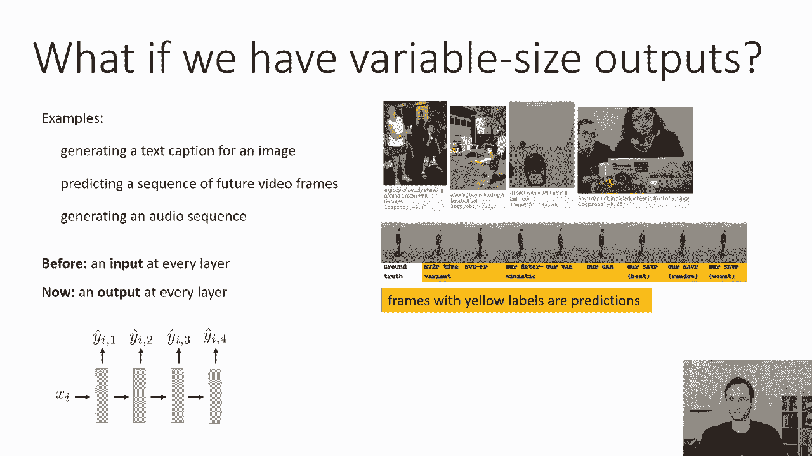

所以让我们来谈谈这个设计，一个立即出现的问题是每一个输出都有自己的损失，所以我们希望每一步的输出都是正确的，这意味着在每一步我们都有一个单独的损失函数，所以每一步都像之前一样，我们将执行我们的线性操作。

如果我们在每个时间步长都有输入，然后我们就用和之前一样的方法，在这个简化的版本中，我只是说我们一开始只有一个输入，所以我们只有一个规则的标准线性层，然后呃，我们应用非线性来得到该层的激活，就像以前一样。

现在你的帽子在那一层，l将是应用于，那是某种读出功能，它有时被称为解码器，它可能会非常，非常简单，f可以只是一个线性层，后面跟着一个软最大值，所以如果你只是想要更具体的东西，如果这有点太抽象了。

把f想象成一个线性层，后面跟着一个软最大值，但它可能是任何东西，你知道的，五个完全连接的层，然后是一个软最大值，可能是一些卷积层，你想要什么都可以，但就目前而言，这么说吧，它是一个线性层。

后面跟着一个软最大值，所以这有时被称为解码器，再次，就像线性层的参数一样，现在我们每顶帽子都要赔钱，比如说，也许我们在每一步都有交叉熵损失，所以我们有一个基本的事实，在每一步，我们都有我们预测的y。

我们将使用交叉熵损失，如果y代表，分类变量，所以我们的总损失只是每一步损失的总和，因此，特定输出序列的总损失，就是当时损失步数的总和，所以这是一个非常简单的方法来合并损失，记住，损失总是要按标量估值的。

所以我们必须把所有这些不同的损失变成一个数字，为了做到这一点，我们只是把它们加起来。

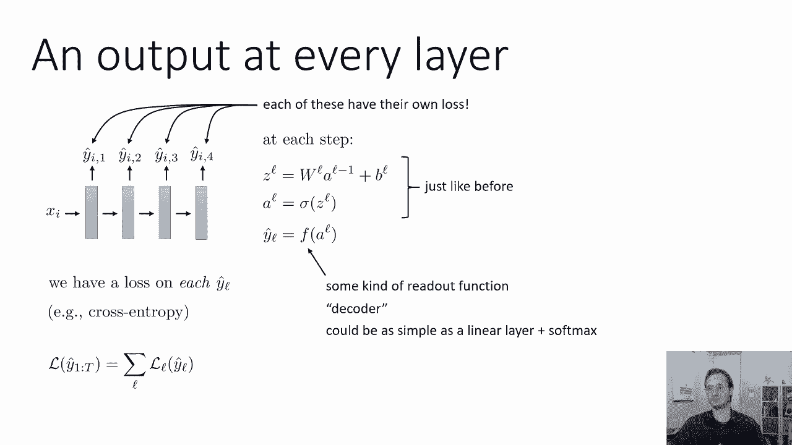

现在我们的问题是，在这一点上，如何使用反向传播并不完全明显，因为当我们以前了解到反向传播时，我们总是处于一种情况，你的神经网络是一个链，你总是从下一层得到你的三角洲，然后向后传播到上一层。

现在我们所处的情况是，神经网络实际上有分支，所以每一步，我们会有一个三角洲从那一步的损失中进来，我们会有另一个信号从下一步进来，我们需要产生一个三角形，回到前一步，如何做到这一点并不完全明显。

所以我们没有学会如何做到这一点，当我们谈到反向传播时，对于那些去上课的人来说，我确实在课堂上经历了这个广义版本，但讲座里没有，所以我们要做的是，我们要画这个过程的计算图。

所以我上面的图片并不是一个真正的计算图，这只是神经网络的图表，完整的计算图如下所示，你有x你的输入，然后进入线性层，让我们称之为第一个进入非线性的线性层，就像一个Relu，从那里我们有了第一个读出功能。

f一，可能只是一个线性层，然后是软麦克斯，这在第一次就造成了损失，第一步，现在第一个非线性西格玛一，它也进入了第二个线性层，所以西格玛一产生一个值，它就会产生一个，同样，一个1被两个下游函数使用。

如果一个和呃，林二，林二进入西格玛二，这就是，第二个非线性，然后进入F2，第二次损失，然后三个，以此类推，以此类推，所以说，然后把损失加起来，所以所有不同时间步长的损失都加在一起。

这就是最终产生最终损失价值的原因，所以要记住，当我们画这样的计算图时，圆表示函数，它们不代表变量，所以变量是函数之间的箭头，圆是函数，所以这些圆圈中的每一个都是一个数学运算，它有输入和输出。

它的工作是计算输出的导数，关于其投入的意见，所以让我们呃，现在描述一下我们之前学过的规则反向传播算法，而是基于这种计算图形图像，所以与其看伪代码，我们要看图节点，所以如果我们放大图中的每个节点。

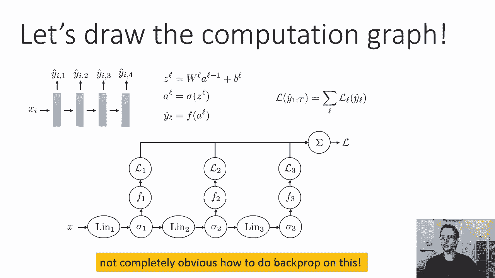

反向传播，也叫反向模式自动差分，在每一层中执行以下操作，所以我们可以把每一层看作一个函数f，它以x f为输入，并产生输出y f，我们总是在最后一个函数开始反向传播，其中初始delta只是一个。

我们的功能是这样的，那是图中的一个节点，它是一个圆，它接受输入x f并产生alpha y，例如，函数可以是relu函数，在这种情况下x f只是zl，y f是一个，它可能是一个线性层，在这种情况下。

x f是负一，y f是z，不管是什么，它有一个输入x f和一个输出y f，它也有一些参数θf和在反向传播过程中，在向后传球的时候，这个节点从下一层得到一个增量，在我调用这些增量之前，现在我要说明的是。

这是Δy，因为进入那个节点的增量，在反向传播期间表示损失的导数，相对于这一层的输出，所以它是dl d f，这就是为什么我要叫它δy f，这种区别很重要，因为反向传播循环将在这一层计算一个新的增量。

新的Delta将是导数，相对于该层的输入，所以首先它会计算损失的导数，根据参数的规格，用链式法则乘以左边的Δy f，由df dθf，然后它会计算新的增量，它现在是损失相对于这一层输入的导数。

所以我叫它delta x f，这是dl dx f，它是通过对这个函数的输出求导而形成的，相对于它的输入所以df dx f，乘以Δy f，所以这只是一种图形方法来绘制我们以前的算法。

所以之前的算法只是一个循环，从最后一层开始，向后进行，在每一层中从最后一直到开始，它会计算这些delta y fs，用它们来计算delta x f，也用它们来计算dl dθf。

这只是我们以前的常规反向传播算法，现在我们要稍微概括一下，我们必须处理的问题，当我们有这些输出数量可变的RNN时，现在我们有一些节点，它们的输出y f变成多个，下游节点，所以我们看到的一些节点。

比如西格玛节点，它进入F一，它也一分为二，所以那个节点上的y f进入两个不同的地方，这意味着在反向传播过程中，会有一个三角洲从其中一个输出中进来，另一个三角洲来自另一个输出。

所以我们可以调用第一个delta y f，第二个是两个的一个三角形y，我们所做的就是把它们加在一起，所以当，当一个节点的输出被多个下游节点使用时，你所要做的就是把这些三角形加在一起。

然后你只需将它们插入完全相同的算法，你把它们加在一起的原因和，我们积累关于参数的梯度的方式，就是把它加在一起，所以对换图中有多个后代的每个节点的非常简单的规则，简单地把来自所有后代的增量向量加起来。

所以如果我们有这样的计算图，这是我们在上一张幻灯片上看到的，我们总是从损失中开始，三角洲只是一个，然后我们往回走，我们有西格玛和，当时所有损失的总和，我们计算它的delta xf，现在和的导数只是1。

所以Δx f只是，然后它被传递到所有对此做出贡献的节点，一二三，你可以想象它们都将被并行处理，在现实中会计算拓扑顺序，但这并不重要，所以任何一种合理的递归算法都会做到这一点，所以我们计算在l 1。

一二一三，为每一个计算相应的增量x f，然后我们在f 1处计算相应的delta x f，f2和f3，现在如果我们看看他们的每一个祖先，西格玛一号和西格玛二号，西格玛三号实际上还没有准备好评估。

西格玛一号和西格玛二号，因为西格玛一和西格玛二，还没有收到他们所有后代的三角洲，但是西格玛三号已经准备好了，因为西格玛3有F3的三角洲，没有其他三角洲，然后我们计算△x f和sigma 3。

并向后繁殖成林三，现在我们有f2和f3的三角洲，所以我们可以计算西格玛二，然后我们可以计算两个，然后我们有f1和f2的增量，所以我们可以在sigma 1处计算三角洲，然后林一，然后我们就这样做了。

我们只是往回走，把所有的箭头反转，和，每次我们有三角洲，为节点上的所有传出箭头计算，然后我们就可以计算那个节点的增量了，当我们有多个进入的三角洲，我们只是把它们加在一起，就是这样，和，当然啦。

如果有多个东西进入一个节点，然后你只需计算对每一个输入的导数。

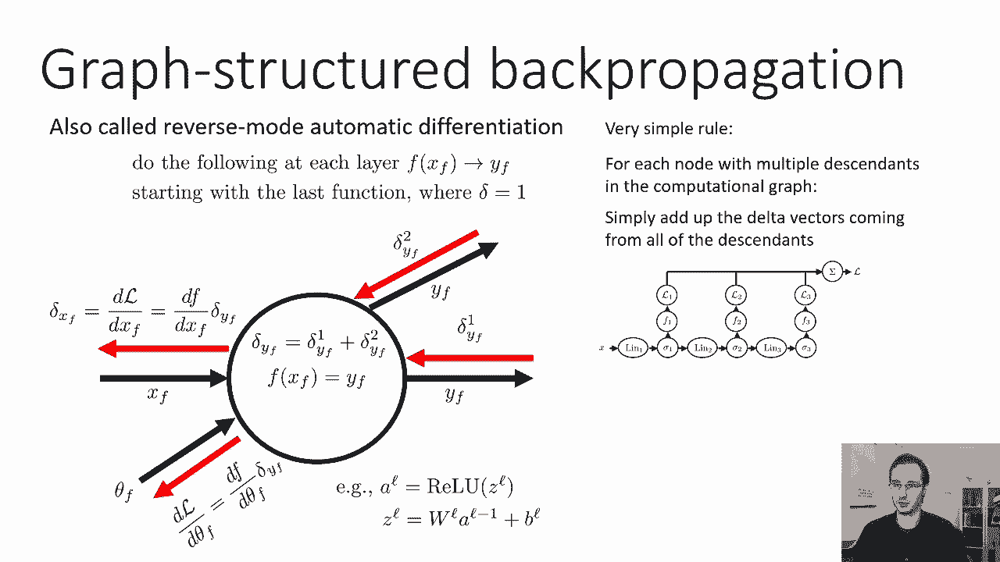

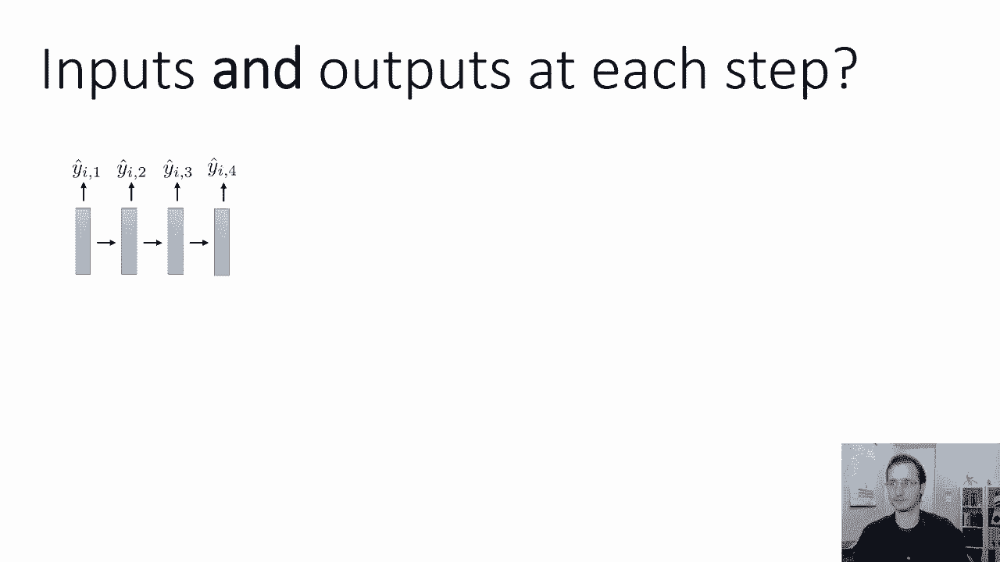

所以这是我们之前学过的反向传播算法的推广，这有时也被称为反向模式自动差分。

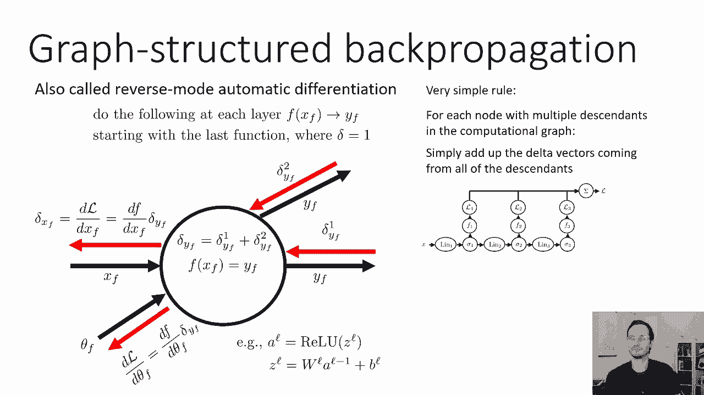

现在，我想总结的最后一种基本的RNN概念，在每一步都有多个输入和多个输出的情况，这实际上是RNN最常见的设计之一，我们得到这个的方法就是把我们之前看到的两个概念放在一起，所以每一步。

我们将上一层的激活与新输入连接起来，应用我们的线性层和我们的非线性，就像以前一样，当我们谈到多个输入时，就像在多输出部分一样，我们有一些读出功能，它可以只是一个线性层和一个软最大值。

在那一步产生输出Y帽，因此，这方面的例子可以包括生成，为图像生成文本标题，现在你可能会说，等一下，你已经告诉我们了这其实有点微妙，为什么事实上，图像的一般文本标题是一个多输入多输出问题。

我们稍后会讨论这个问题，将某些文本翻译成具有多个输入和多个输出的不同语言，其实有比这张幻灯片上的设计更好的方法，我们以后再谈。

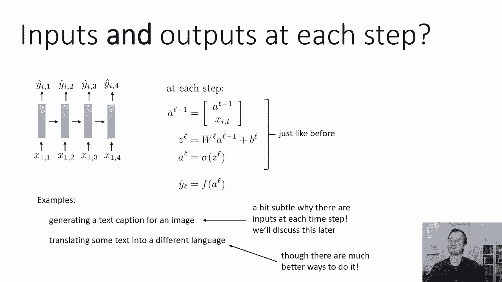