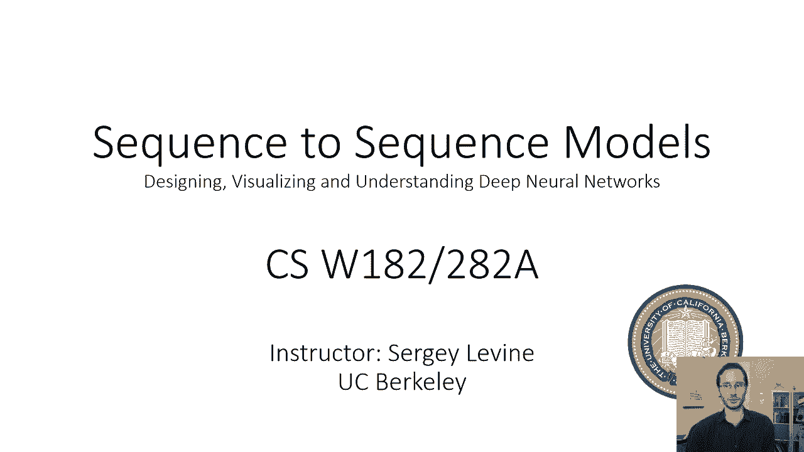
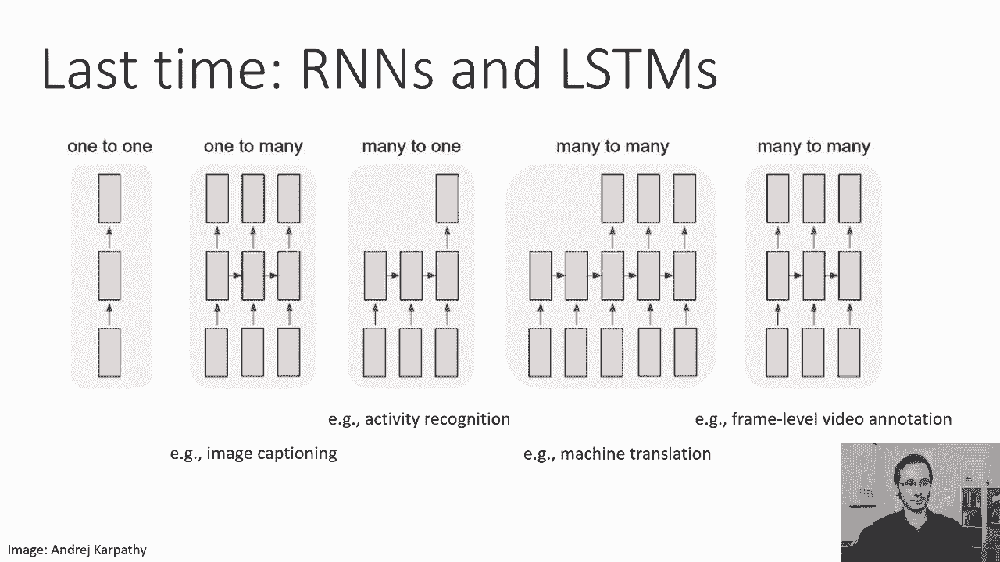
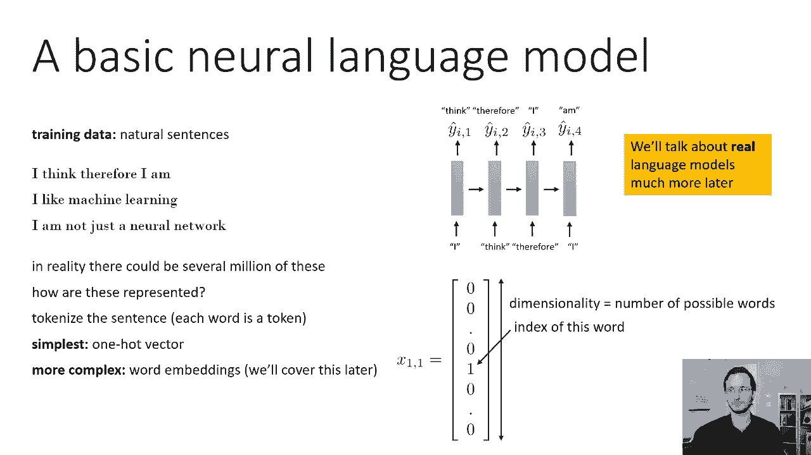
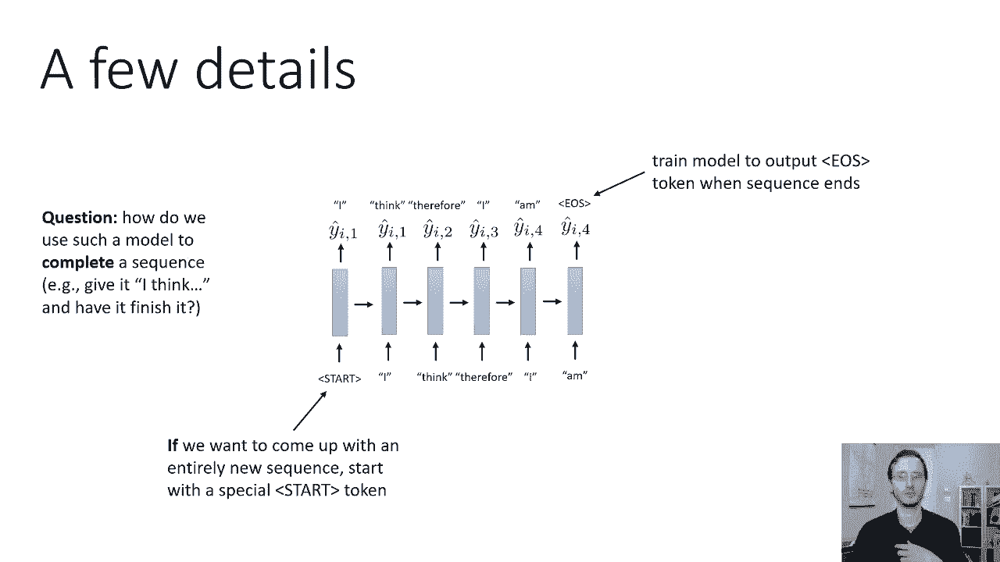
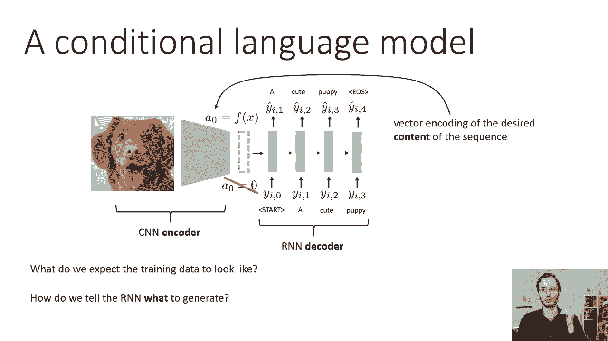
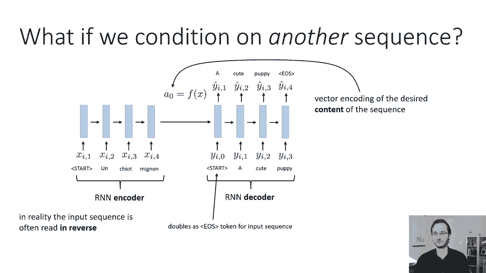
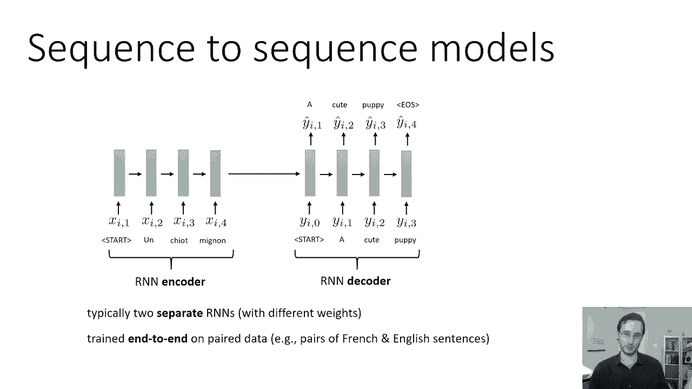
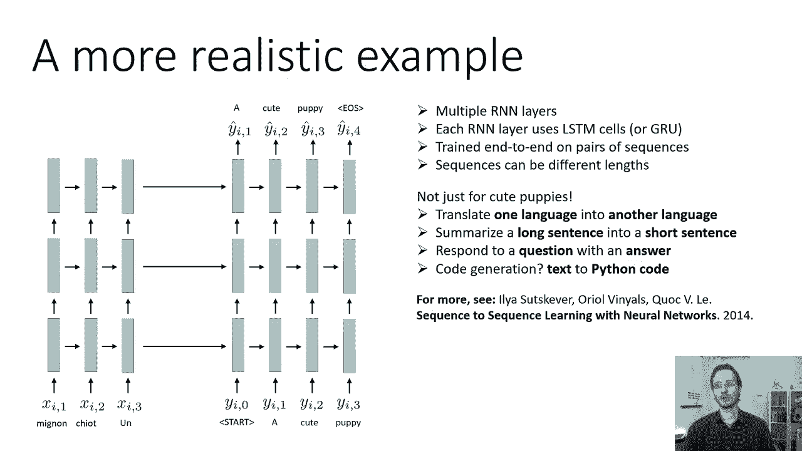

# 【双语字幕】伯克利CS 182《深度学习：深度神经网络设计、可视化与理解》课程(2021) by Sergey Levine - P33：CS 182- Lecture 11- Part 1- Sequence to Sequence - 爱可可-爱生活 - BV1PK4y1U751

欢迎来到今天的第十一讲，我们将讨论如何使用递归神经网络，我们上次学过的，实际上解决了一些有趣的问题，然后呃，今天讲座的结合将是，我们如何训练和利用序列到序列模型。

这是我们当前神经网络模型中非常强大的一类，可以将一个序列转换为另一个序列，比如说，一种语言文本，用另一种语言检测，表示问题的文本，以及表示它的测试文本，答案。

等等，所以上一次，当我们谈到RNNS时，快结束的时候，我们看到了递归神经网络是如何非常灵活的，它们可用于解决各种不同类型的序列处理问题，例如获取一些单个输入并将其转化为序列，例如用于图像字幕。

其中输入是图像，输出是表示文本描述的序列，他们可以把一个序列变成一个输出，比如说，活动识别，在那里你可以拍摄一系列视频帧并产生一个标签，表示视频中描绘的活动，他们可以把序列变成其他序列。

例如在机器翻译中，然后呃，他们可以一步一步地把序列变成其他序列，例如用于帧级视频注释，当然还有，输出序列的RNNS的应用，它们通常还输入完整的序列来处理序列之间的相关性，呃，代币。

正如我们在上一节课结束时看到的，所以在今天的讲座中，我们将主要关注这些很多很多的转导问题，特别是序列到序列模型。

但在我们这样做之前，让我们首先讨论如何建立一个基本的神经语言模型，好的，那么什么是语言模型呢，语言模型是为表示文本的序列分配概率的模型，和，语言模型对于我们将要讨论的许多内容都是一个非常重要的概念。

因为它们不仅可以分配概率，但它们也经常产生，下面是一个例子，从呃，从上次生成短语的神经网络模型，为此的训练数据将是大量自然语言句子的集合，所以这里我只展示了三个，当然啦，在现实中。

真实的语言模型可能会在数百万个这样的模型上训练，他们是如何表现得很好的，这里有几个选择，我们会更深入地讨论，在下一次讲座中，现在有两节课，但一个非常简单的选择是标记每个句子。

这意味着每个单词都变成了一个单独的时间步长，然后以某种方式对这个词进行编码，编码这个词的一个非常简单的方法是所谓的一个热向量，所以一个热向量只是一个长度向量，等于可能的字数，字典里的词数。

向量中的每个元素都为零，与单词索引相对应的元素除外，设置为1，所以这意味着在句子中，我觉得，所以我有五个字，所以会有五个时间步，在这些时间步中的每一个都将由一个非常大的向量表示，可能有数千英尺长。

到处都是零，除了代表单词的单个位置，有更复杂的方法来表示单词，一种更复杂的方法是使用所谓的单词嵌入，它是一个连续的向量，单词的有价值表示，旨在反映它们的语义相似性，这样意思相似的词就会靠得更近。

就它们的欧几里得距离而言，有一些方法可以实际构建这些单词嵌入，我们将讨论，呃，很有可能，下周，但就目前而言，这么说吧，文字是一个热门载体，这意味着我们的自然语言训练数据只是由这些热向量的序列组成。

这是一个非常简单的语言模型视图，我们以后会更多地讨论真正的语言模型，但就目前而言，我只想介绍RNN语言模型的基本思想，因为我们要在此基础上再接再厉，开发序列到序列模型。

我们必须处理好的几个细节，到目前为止我们看到，其实，一种关于句子的RN火车的卡通视图，让这一切真正发挥作用，我们需要一些小细节，我们需要的一个细节是我们需要理解当模型输出一个句子时，例如。

我们如何使用这样的模型来输出一个完整的句子，呃，比如说，如果你给它，我和你想用，我觉得，所以我是，你怎么知道你应该停在，I’我喜欢，也许我不是最后一句话，也许它会说，我觉得，所以我是河马。

那也是一个有效的句子，所以我们要做的是，我们要加一个特殊的令牌，我们将在培训日期中包括培训中的这个令牌，在我们所有句子的末尾，也就是序列令牌的结尾，有时也被称为句末标记，所以这是一个特殊的词。

它将出现在字典的末尾，它并不代表任何实际的单词，它只是代表了模型已经完成的事实，训练数据中的每个序列都将以这个令牌结束，因此，模型将了解到，当它完成一个句子时，它应该在最后一步。

输出这个句子结束或序列结束标记，它会在最后一步这样做，好的，这将帮助我们理解当模型用一个句子完成时，现在，我们面临的另一个问题是，我们是否希望这样的模型生成一个句子，你需要以某种方式把它踢开。

所以第二步，它将使用第一时间步长的输出作为输入，这就是我们在上一节课结束时所学到的，但是我们在第一步用什么，你知道的，我们可以给它一个完全随机的词，这是合理的。

但并不是所有的单词都有同样的可能性开始一个句子，所以我们可以做的一件事实际上是有效的，我们可以简单地计算频率，每个句子从随机的单词样本开始，然后把它作为第一个步骤输入模型，这实际上是一个合理的解决方案。

稍微优雅一点的解决方案，它不需要我们有一个特殊的组件是，就像我们引入句末标记一样，我们可以引入一个句子的开始标记，所以我们可以在第一个时间步长之前添加一个额外的时间步长，其中输入是一个特殊的开始令牌。

然后模型将在训练数据中的哪里进行训练，每个句子都以开始令牌开始，模型会，然后呢，它应该输出一个随机的单词，概率与其实际开始一个句子的概率成正比，所以如果我们想出一个全新的序列，从一个特殊的开始令牌开始。

让模型生成这个，这里有一个小测验，只是为了呃，让你们所有人测试一下你们对发生了什么的理解，现在我们已经了解了这些开始标记和句子结束标记，我们知道如何让RNN生成完全随机的句子。

如果我们想让一个rn完成一个句子呢，如果你想问RNN怎么办，这里有一个以，因此我想，我想让你完成它，我想让你用一句随意但合理的句子来结束它，比如，比如说，我可以说我认为因此我真的很聪明。

或者我可以说我思故我在，或者我可以说我认为，因此，我是一位著名哲学家的名言，对呀，这些都是有效的英语句子，它们可能很好地代表了训练数据中的内容，那么我们能让网络以各种方式完成这些句子吗，总是以…开始。

我觉得，我们该怎么做，作为一个暗示，这样做根本不需要改变培训程序，模型的训练方式与我们在上一节课中讨论的完全相同，所以让一个语言模型来完成一个句子实际上是相当简单的，你还在喂代币，一次一个。

所以你开始喂食，你让它做一个预测，但你没有从预测中取样，相反，你只需要直接输入下一个单词，你的条件是我，然后你让它做一些预测，但你忽略了它，然后你为下一步的时间，如果你不认为。

然后我们会对第三步做出一些预测，然后你实际上从中取样并将其输入到第四步的输入中，等等等等，所以你所要做的，为了让你的一代有一个特定的开始片段，你只要强迫最初的几个输入与那个片段一致，不管网络输出什么。

就是这样，这是让rnn完成一个句子的一个非常简单的方法，因此，如果您从一个开始令牌开始，以一个EOS令牌结束，你可以让它生成完全随机的句子，而不需要任何条件，除了开始，或者你可以让它完成很长的句子。

只要在最后放几个字，作为一个小，呃，在家做的一种思想练习，你甚至可以考虑如何，你可以得到一个神经网络语言模型来填补句子中缺失的单词，所以也许我想要的是我想要的是，我已经开始了，我想空白，我是。

我想填补那个缺失的单词，我能找一个语言模型来做这件事吗，如果是这样答案其实有点微妙，嗯和嗯，实际上在今天的讲座结束时，你应该有足够的信息来猜测答案。

我们可以在课堂上谈论它，但回到主要话题，到目前为止，我们讨论了无条件语言模型，现在我将讨论如何建立条件语言模型，这里是这些条件语言模型，文本是模型的输出，这就是为什么我改用Y来表示它。

你要把这个模型建立在一些输入上，它会告诉它你想生成什么文本，比如说，您可以想象一个用于图像字幕的条件语言模型，在那里嗯，你让模型，比如说一张照片，对呀，所以你展示一张照片。

模型的工作是生成描述图片中内容的文本，所以我们可以做到这一点的方法是，我们可以在条件反射信息中读取某种编码器模型，例如，在小狗的照片中读到，这是一张照片，所以我们会用，例如卷积网络。

但这个卷积网络不会产生标签，它实际上会产生表示R初始状态的向量，所以在我们用一个很大的零向量开始rnn之前，对呀，这是我们上次学过的RNN，现在，我们实际上要设置RNN的初始状态。

是由我们的卷积网络输出的东西，这整件事将首尾相接地训练，所以卷积网络，和RNN一起接受训练，以产生正确的文本，所以这方面的培训程序是，呃，与我们在第十课中看到的rnns非常相似。

现在的主要区别是它本质上是一个修道院，末端有一个RNN订书钉，修道院的工作是输出RNN的初始状态，所以在某种意义上，RNN的这个初始状态，是对图片中正在发生的事情的一种表示。

所以它需要包含RNN生成正确句子所需的所有信息，RN在内部理解什么是有效的句子和无效的句子，但是这个向量需要包含你需要弄清楚的所有信息，这里哪个有效句子合适，如此直观，你可以把这个想成零，作为某种。

你知道矢量表示有一只可爱的小狗，然后RN的工作是将这种想法转化为有效的英语文本，所以再总结一下，因为了解这是如何工作的是非常重要的，这是一个由几个卷积层组成的大神经网络，然后可能是一些完全连接的层。

最后一个完全连接的层进入RNN，你可以想象卷积网络和随后的完全连接层，产生一个零，RNN的初始隐藏状态，所以如果RNN只是一个香草RNN，那么这就是一个向量，如果是LSTM。

那么这基本上是细胞的初始状态和初始h，所以我们把RNN部分称为RNN解码器，因为它的工作是解码E中包含的思想，零到英文文本，我们称卷积部分为CNN，或者一般是神经网络编码器，因为它的工作是将输入。

在这种情况下，并将其编码为零，零是这个向量，初始，呃，rnn，图片中发生了什么，它基本上代表了RNN需要知道的关于输入的一切，为了产生权利，现在只是为了检查你对这里发生的事情的理解，快速突击测验。

我们希望训练数据是什么样子的，所以如果我们想训练这个东西首尾相连为图片生成文本，我们需要我们的训练数据是什么样的，我们的训练数据显然会包含图片，它会有标签，这些标签不再是，呃，你知道的，职类。

它们实际上是文本，所以它只是图片和英语句子的元组，我们如何告诉RNN需要生成什么，呃，这是由进入向量零的东西决定的，所以基本上RNN内部知道英语是如何工作的，但它需要正确的信息包含在零。

为了知道实际制作哪种英语。

现在我们不必以照片为条件，我们实际上可以把我们的语言模型限制在任何东西上，所以我们甚至可以把它放在另一个序列上，所以与其有一张照片和一个修道院，你可以有一个编码器，这是另一个RNN。

假设你想把法语翻译成英语，嗯，你可以有一个用法语文本阅读的RNN，并为另一个生成英文文本的rnn生成初始隐藏状态激活，所以第一个用法语读取的rnn产生一个零，第二个rnn取一个零并生成英文文本。

你可以用这个，例如训练一个把法语翻译成英语的模型，所以现在不是CNN编码器，你有一个RNN编码器，这是一个零的东西，这是一种，有点虚拟，所以从某种意义上说，你可以把这看作是一个大的RNN对吗。

法语句子的最后一步发生了什么，直接到英语句子的第一步，所以其实，你甚至可以这样训练它，你可以拿一个巨大的RNN，他的工作是读一个法语句子，然后读一个英语句子，在英语句子的每一步。

它应该产生那个英语句子的下一个单词，这将是将法语翻译成英语的有效模式，在实践中，更常见的是有两个独立的RNN，意思是说，法语部分和英语部分的重量实际上是不同的，但是法国部分的时间步之间的重量都是一样的。

英语部分不同时间步之间的权重都是一样的，但这两种语言之间是不同的，但你不必这样做，你可以只有一个巨大的RNN，这在技术上是正确的，虽然训练可能会有点难，如果你把这看作是一个巨大的RNN，然后呢。

英语句子的开始标记，实际上也是法语句子的结尾符号，所以本质上看到那个令牌实际上并不重要，它是一个星星和结束，它的工作原理是一样的，启动该令牌，看到那个令牌会告诉他们网络现在，是时候开始用法语停止阅读了。

开始生成英语，现在有一些细节可以得到这个，去做人们有时会做的一个小细节，虽然并不总是实际读取输入序列中的反向右，而不是从句子的开头开始，然后回到开始，你实际上是从句子的末尾开始的，然后往回走。

你不必这样做，但这是一个常见的选择，作为一个小小的思考练习，这对以后很重要，你为什么认为那是，为什么倒着读法语句子会更好，然后产生英语句子，前锋，嗯，原因是，这可能更好，就是，英语句子的开头。

可能更多地与法语句子的开头有关，比法语句子的结尾，所以通过反转输入句子，第一部分排在最后，这使得它最接近输出句子的第一部分，所以本质上依赖关系要短一点，现在你可以争辩说，也许那不好。

因为句子末尾的长度更长，但在实践中，这有时会更好一点，虽然并不总是，这不是唯一的方法，这个长期依赖的概念将在讲座结束时再次提出，当我们谈论注意力的时候。

所以正如我提到的，我们倾向于对输入和输出使用不同的RNN，所以编码器和解码器实际上有不同的重量，编码器基本上为解码器产生初始隐藏状态激活，顺便说一句，当我说一个隐藏的状态，那只是激活的另一个词。

所以通常它们是两个不同重量的独立RN，但他们仍然首尾相接地训练，所以你的训练数据现在将由配对的句子组成，基本上是元组，其中有一个法语句子及其相应的英文翻译，你会用同样的方式训练它。

就像你训练上一节课中的所有RNN一样。

好的，嗯，这里有一个序列到序列模型的更现实的示例，所以这里我做了一些修改，我倒着读输入的句子，我还加了多层，所以这类设计使用LSTM细胞是非常常见的，并将多个LSTM单元格堆叠在一起。

这有时被称为堆叠的RNN或堆叠的LSTM，您将为此使用的层数，您将堆叠的数字通常比您将使用的数字低一点，为了一个很大的信心，所以大陆可能有几十个甚至数百个LCMS层，通常会在两到四个的范围内，也许五个。

嗯，后来，我们将讨论另一种叫做变压器的模型，它往往要深得多，但LSTMS往往是，你知道的，两到四层深，这部分是因为他们使用了十个h h非线性，不太容易踩到，部分原因也是。

LSTM的顺序性大大增加了它的代表性，所以它有深度，两者都是，呃，你知道的，在这里垂直和水平，所以不需要叠太多的层，两到四个往往很好，所以我们有多个RNN层，每个rnn层通常使用一个lstm单元。

或者LSTM的某种变体，像格鲁细胞，它是在成对的序列上首尾相连地训练的，序列可以是不同的长度，输入和输出可以是不同的长度，也可以跨元组，当然它们可以是不同的长度，这种序列到序列的模型非常灵活。

它们可以用来做各种各样不同的事情，不仅仅是给可爱的小狗的照片贴标签，或者翻译关于小狗的句子，它们可以用来，当然啦，把一种语言翻译成另一种语言，它们也可以用来把长句总结成短句，所以说，例如。

输入可以是一个长句，输出可以是一个短句，它们可以用来用答案来回答问题，所以在这种情况下，输入将是问题，输出将是答案的文本，它们甚至可以用于一些异国情调的应用，例如，输入可以是一段代码的文本描述。

输出可以是实现该描述的Python代码，一般来说，任何你可以表述为序列对的东西，让我们说，少于一百，呃，长度标记，你可以建立一个序列来寻找模型，序列到序列模型，尝试这样做。

如果您想阅读更多关于序列到序列模型的信息，我推荐Elias的这篇论文，苏扎里奥，用神经网络进行序列到序列学习，虽然有许多后续扩展到这个基本食谱，以许多不同的方式，所以这是基本的，呃，寻求模式。

然后剩下的讲座。

