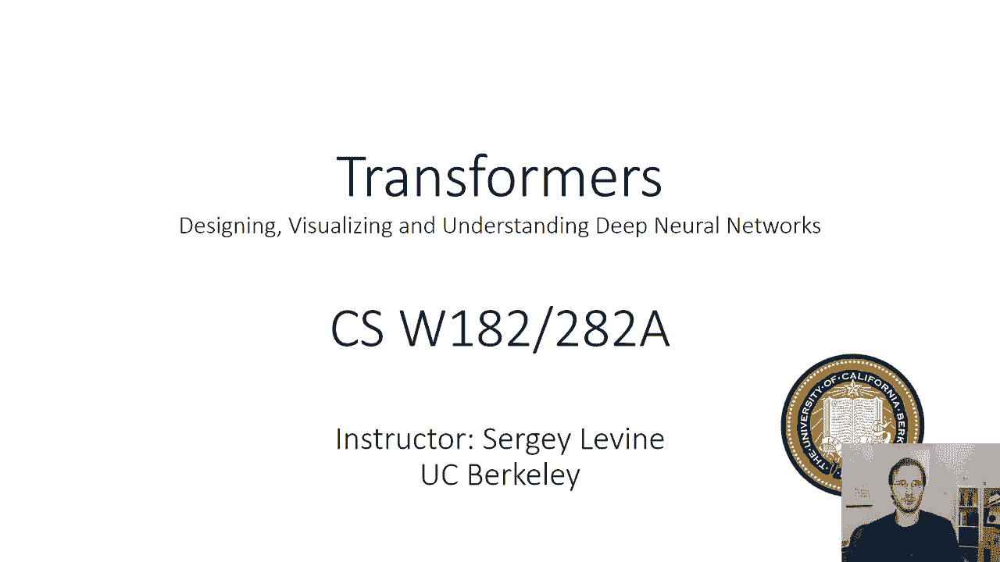
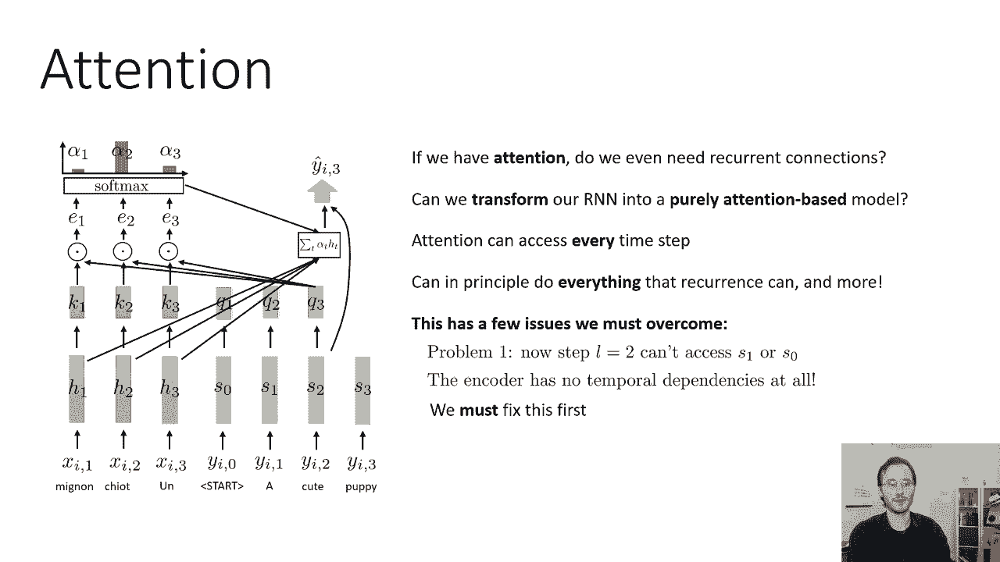

# 【双语字幕】伯克利CS 182《深度学习：深度神经网络设计、可视化与理解》课程(2021) by Sergey Levine - P36：CS 182- Lecture 12- Part 1- Transformers - 爱可可-爱生活 - BV1PK4y1U751

就在上一节课结束的时候，我们讨论了如何建立序列到序列的模型，并通过使用注意力机制来提高他们处理长期依赖的能力，和注意机制本质上，输入序列中的每一点和解码过程的每一步，在今天的讲座中。

我们将讨论处理序列的另一类模型，不使用循环连接的，而是完全依靠注意力，我们将建立一类叫做变形金刚的模型。

所以我们可以从注意力开始，实际上我们所需要的，我们能完全使用注意连接而没有任何显式的重复吗，所以呃，只是简单地回顾一下上次的注意力，当你，当您有一个序列到序列模型时，当您为绿色显示的部分编码序列时。

您还在用K-1表示的每一步输出一个键，k二和k三，当你解码每一步用蓝色显示的部分时，您在以前的RNN隐藏状态中，您还输出一个查询，呃，比如说，q二，我们的Q3，然后在这一步计算查询之间的点积。

以及编码步骤中的所有键，把这些点积通过软最大值，得到输入的每一步的概率，按这些概率加权，这基本上索引到编码器的隐藏状态，对于最接近的时间步长，谁的键与当前查询最匹配，和，有效，这提供了一种快捷连接。

以便在编码过程中从前面的步骤携带信息，进入解码的当前步骤，它可以以各种方式改进您的模型，所以让我们从这个问题开始，如果你有十分，你甚至需要重复连接吗。

因为原则上注意力可以从输入字符串中获取任何你想要的信息，所以说，也许，而不是依赖递归来捕获关于输入字符串的信息，你能完全依靠注意力来捕捉这些信息吗，或者换句话说。

你能把一个RNN转换成一个纯粹基于注意力的模型吗，所以在这里你会注意到每一步，所以你需要能够索引输入的每一步，但是您还需要索引到输出的每一个前一步，这样您就可以处理结构预测问题。

所以你可以看到你之前预测的单词，原则上，如果你这样做，你可以做复发能做的一切，甚至更多，但有几个重要的警告，这就是我们今天要讲的内容，所以为了摆脱像这样反复出现的连接，完全依靠注意力。

有几个问题我们必须克服，首先，如果我们只是天真地使用同样的有意机制来做到这一点，呃，在步骤l等于2的幻灯片上显示，我们将无法访问s 1和s 0，这样我们就可以进入H，氢二和氢三。

我们可以访问编码器的隐藏状态，但这种注意力机制并没有给我们任何方法，访问解码器以前的状态，这使得我们无法理解解码器在前面的步骤中产生了什么，ms所以编码器现在完全没有时间依赖关系。

在这个幼稚的版本中编码器的每一步，完全独立于其他每一步，我们当然不想那样，因为单词之间确实有很强的依赖性，所以我们得先把这个修好，然后我们会看到实际上还有一些其他的问题出现，但幸运的是。

所有这些实际上都可以先修复。

让我们，呃，描述自我注意的基本版本，所以对于这个基本版本，我不打算区分输入序列和输出序列，我只有一个序列，我想要一个纯粹的注意力模型，基本上一起处理这个序列的所有步骤，然后我们会在讲座快结束时看到。

我们如何回到一个又一个序列，呃世界以后，所以现在，我们只有一个序列，后来，我们会一个接一个地回来，就目前而言，你可以把这看作是语言建模的一部分，所以只有解码器，不用担心编码器。

我们将把序列的所有时间步长，我们将对每一步进行编码，所以这是一种小的前馈模型，这不是一个反复出现的模型，因为年龄之间没有联系，但我们仍然有体重分担。

所以h{\displaystyle h}是x{\displaystyle x}的函数，h 2是x 2的函数，h3是x3的函数，在每种情况下都是相同的功能，例如，如果它是一些非线性应用于线性层。

那么我们在线性层中的每一个时间步长都可能有相同的权重，但时间步长实际上并没有在彼此之间交流，总的来说还好，我们可以用任何非线性函数，这是一个典型的学习函数，我们将为每一个时间步长产生一个值。

所以这就像我们看到的注意力的高级版本，在上一节课结束时，其中v t是h t的某个函数v，所以在我们之前，通常HT的VT等于HT，在注意力的基本版本中，现在我们要用线性变换。

所以我们要说ht的v是某个矩阵w，v适用于ht，每一步都是相同的矩阵w v，所以该值是隐状态的线性变换，比如说，它可能是一个A函数，它可能掩盖了ht的某些值，也许把HT中与值相关的部分，丢弃其余的。

或者它以某种更复杂的方式改变了它们，WV将被学习，我们很快就会看到为什么有一个学习价值是很重要的，我们还将在每个时间步长输出一个键，所以到目前为止，这看起来就像编码器，经典关注的一部分。

所以关键也是ht的一些函数，为了简单起见，我们会说它也是一个线性函数，所以kt等于w k乘以h t，然后这是不同的部分，每次步都会输出一个查询，所以它就像编码器和解码器在一起，所以每一步都输出一个值。

一个键和一个查询，和查询，当然也是HT的函数，现在我们说它也是一个线性函数，所以q t就是w q，好的，到目前为止还不错，我们有钥匙，值和查询，它们都是HT的线性函数，好的。

然后我们就像以前那样全神贯注地做，除了现在编码器和解码器之间没有区别，所以基本上每一步都可以索引到每一个其他步骤，包括它自己，所以我们将计算每QT和每KT之间的点乘积，这些会给我们的注意力得分。

一个一个，一二，一三，一二一，一二二，二三还有，三一三二三三，所以如果我们有三个时间步，我们有九个，然后我们会做和以前完全一样的事情，我们会给他们每个人一个软马克斯，所以我们会得到这些阿尔法值。

我们在键上正常化，所以每走一步，我们就在T的右边正常化，所以我们想为每个时间步长得到一个单独的软最大向量，因此对应于每个查询，我们得到每个查询，我们得到一个α，α1 2和α1 3。

所以这些加起来是T上的1，他们不会，它们在，当然啦，然后我们做和我们做的完全一样的事情，在我们取每一步的值之前，我们按阿尔法称重在第一步给我们的注意力，所以如果你有阿尔法一号，阿尔法一二和阿尔法一三。

你把你的注意力计算为α1乘以v 1，α1 2乘以v 2，α1 3 V 3，把它们都加起来，给你一个1，这给了你第一步时的注意力输出，以同样的方式，你把时间第二步的注意力输出计算为阿尔法二。

1乘以v 1加α2乘以v 2加α2，把它们加起来，这给了你第二步的注意力，在每一个时间步长产生一个注意向量，所以我们从每一个时间步长的输入开始，我们每一步都得到一个h，然后我们有自我注意的过程。

它结合了来自不同时间步长的信息，并产生不同的输出，一个1，每一步都有一个二和一个三，所以你可以把这看作是一种层，它基本上是一个集成跨时间步长信息的层，所以我们可以用这样的自我关注层建立一个完整的网络。

所以在这个网络中，我们会在每一个时间步骤中接受我们的输入，得到相应的h，并对每个h进行一些变换，我们有一个键，查询和值，我们把这些传递到这个自我注意层，它是某种层，在每一个时间步骤都产生激活。

然后我们可以重复这个过程，我们可以有一把钥匙，使用一组不同的uh计算的查询和值，w，K W Q和W V矩阵传递到另一个自注意层，我们可以重复这个过程，这种自我关注的每一步都越来越多地处理序列。

通过这种方式，我们可以转换一种类型的输入序列，也许用法语说一句话，变成不同类型的序列，就像一个英语句子，好的，所以我们继续处理，直到我们处理得足够多，然后在最后你必须以某种方式把它解码成一个答案。

我们以后会更多地讨论这个问题，好的，这就是自我关注的基本思想，这个基本思想，我们将用它来建立一类新的序列到序列模型，现在，将其转化为可行模型的实际过程需要许多额外的步骤。

所以说，自我注意的基本概念可以用来开发一种非常强大的序列模型，叫做变压器，但要让这一切真正发挥作用，我们需要开发一些额外的组件，解决自我注意力的一些基本限制，这实际上会占用我们今天讲座的大部分时间。

所以以下是我们需要处理的事情，第一个是所谓的位置编码，位置编码解决了自我关注的问题，也就是自我关注，不像复发，在时间上没有任何接近的概念，所以所有这些X的X一，x2和x3，完全平行地处理。

而不考虑他们的顺序，如果我们改变了他们的订单，自我注意层会产生完全相同的答案，所以它是完全序不变的，当处理像自然语言这样的数据时，这可能是一个大问题，单词的顺序实际上很重要。

所以我们需要以某种方式解决这个问题，第二，我们将开发一种叫做多头注意力的东西，在每一层，我们不仅仅有一个值、查询和键，但我们实际上可以有多个，这样我们就可以做更复杂的操作。

您几乎可以粗略地想到键值查询元组，就像修道院里的过滤器一样，在实践中，你永远不会用每层一个过滤器来建造一个大陆，用同样的方式，你不想建立一个纯粹的自我关注模型，每层只有一个注意力头。

所以我们将讨论如何建立多个，头部注意，允许在每一层查询多个位置，然后我们将讨论如何在自我注意模型中添加适当的非线性，这其实很重要，因为到目前为止，我们讨论过的自我注意机制实际上是完全线性的。

这意味着下一个自我注意层的激活完全是线性的，在上一个激活中，除了那些重量，所以请记住，A是alpha l t逗号所有位置的和，v t，所以在VTS中实际上是线性的，它的值是线性的，值也是线性的。

H的函数，阿尔法是非线性的，但这些值是线性的，这实际上是相当有限的，当谈到自我注意力层的表达能力时，然后最后，我们将讨论一个非常重要的细节，叫做蒙面解码或蒙面注意力，这正在解决的问题。

注意力机制不区分过去和未来，所以当它一步一步地进行时，RNN，它看着过去，但它不看未来，这使得使用RNN来解码成为可能，这意味着你生成了一个单词，然后以那个词为条件生成下一个词。

然后以那个词为条件生成下一个词，不清楚如何用自己的注意力做到这一点，因为自我注意力看着所有的时间步骤，过去的时间步长和未来的时间步长，计算当前时间的注意力，这有时是件好事，但当你试图利用自我注意力时。

这可能是一件非常糟糕的事情，对于语言模型进行解码，我们将讨论如何解决这个问题。

