# 【双语字幕】伯克利CS 182《深度学习：深度神经网络设计、可视化与理解》课程(2021) by Sergey Levine - P37：CS 182- Lecture 12- Part 2- Transformers - 爱可可-爱生活 - BV1PK4y1U751

让我们把我们需要处理的每一件事都说一遍，为了把这个基本的自我注意机制变成一个实用的序列模型。

所以我们从位置编码开始。

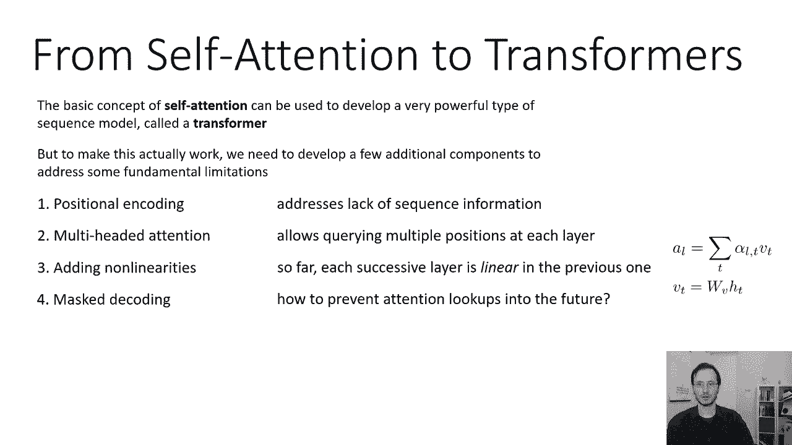

所以这是最基本的问题，当我们看到某个句子时，我们所看到的涉及到该句子中的两个单词，以及这些词出现的顺序，所以我们可能会看到，比如说，他用圆周率打我的句子，天真的自我关注看到的只是一袋文字。

所以自我注意中的所有操作都是置换不变的，这意味着如果你把单词置换，你会得到完全相同的注意力向量，只是以同样的方式排列，这与循环模型非常不同，因为递归模型一次看一个单词，它记得以前见过的字。

因此它实际上可以记住它们的顺序，所以一个递归模型理解hit这个词跟在这个词后面，他只是个自我关注的典范，至少天真地，正如我们在这里讨论过的，我不明白这一点，所以到自我注意模型。

这些词的所有排列看起来都是一样的，其中一些排列是荒谬的，其中一些意思是一样的，其中一些实际上可能意味着不同的东西，大多数替代订单都是胡说八道，但有些实际上改变了句子的意思，所以你真的需要跟踪代币的顺序。

为了正确处理序列，因此，一般来说，单词在句子中的位置承载着重要的信息，在使用我们的自我注意模型时我们非常想保留这些信息，所以我们在这一部分要探索的想法，就是在开头添加一些信息，那是一些。

在开始时向表示提供一些信息，在整个系统的底部，指示标记在句子中的位置，所以我们要向x xt添加一些东西，这将允许自我注意机制的其余部分知道它在哪里，相对于其他x，所以总的来说。

位置编码只是意味着这第一个，ht是x，t和t的函数，所以到目前为止，我们一直说ht是x t的函数，比如说，ht可以通过应用非线性层和类似relu的东西来获得，对XT的非线性，现在我们要稍微改变一下。

使它成为XT的一些函数，以及时间步长T，这将保持序列中令牌的顺序，并允许自我关注利用这一点。

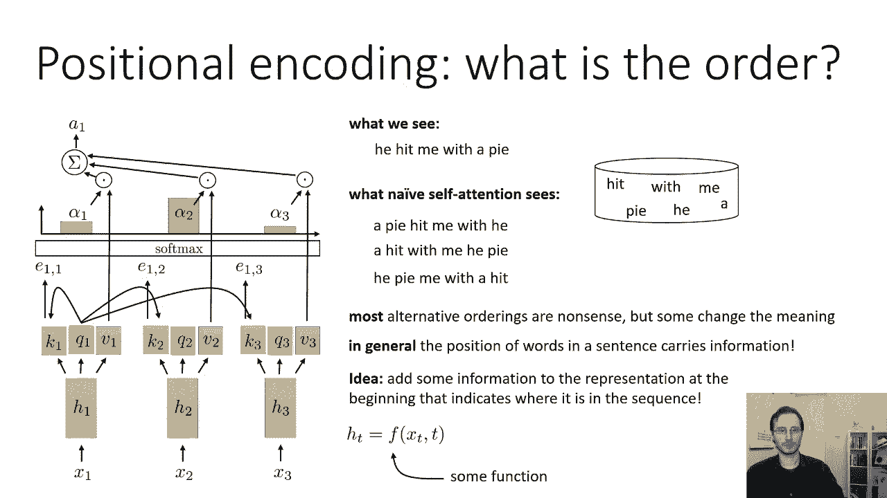

所以这些通常被称为位置编码，开发位置编码的一种非常简单的方法，就是把t附加到x上，然后用同样的方法做所有的事情，所以如果你有一个新类型的输入，而不是做x t作为输入，您使用xt bar。

它只是与t连接的xt，原则上所有的位置信息都在里面，原则上，自我注意机制现在可以意识到单词的顺序，因为它自己知道它们在序列中的索引是什么，虽然不是一个真正的好主意，因为在我们关心的大多数应用中。

绝对位置往往不如相对位置重要，比如说，如果我在做一些自然语言处理，我有两句话，我每天都遛狗，我遛狗，现在，单词i和walk的索引，我和狗这两个词不一样，在这两句话里，他们之间没有任何关系。

但相对位置是一样的，所以我的狗在我散步后就出现了这是最重要的部分，例如，如果，有人问我一个问题，你每天都走什么，嗯，你看下面的事情，我走路，你不看3号和4号位置的东西，关于我的狗，重要的是它在哪里。

相对于句子中的其他单词，不是它在句子中的绝对索引是多少，所以这些相对的位置真的很重要，所以我们可以想出一个位置编码，更多地关注相对位置，比绝对位置，这就是我们要努力做的，所以我们想用一种方式来表示位置。

具有相似相对位置的标记具有相似的位置编码，我们可以做到这一点的一种方法是用一种频域表示，所以不附加实际的时间步长，我们将增加时间步长的频率，所以这是一个混乱的方程，但这实际上是在原纸上使用的。

拟议的变压器，他们，它们的位置编码实际上是相同长度的向量，作为x t的嵌入，所以向量的长度是d，这就是维度，向量中的每个条目都是应用于时间步长的正弦或余弦，t除以某个频率，所以频率会去，在这种情况下。

任意的选择，但它是一万的力量，两倍以上的东西，d，所以这意味着第一个条目是一万的正弦，t的正弦除以一万的次方2/d，然后你得到一万的四次方d，然后你得到1万到d的6次方，以此类推，以此类推。

直到你得到一万到d/d的幂，这只是一个，所以早期的条目有很高的频率，因为它不被向量末尾的一些小数除以，它们的频率很低，它不是被一万这样的大数除以的，所以最高的频率是一万。

这意味着你会期望这个向量的底部基本上振荡，在负一和一之间，每一万个代币，在中间的某个地方，它会在负和一之间振荡，每一千个代币，每一百个代币，每十个代币，等等，在这里，我想大概是5点12分，在这种情况下。

当然下面的d是，你可能选择的数字越低，所以不是一万，如果d是，它只会上升到16，也许你想用一百个，比如说，因为你真的希望早期的条目有很高的频率，频率基本上在一两个数量级。

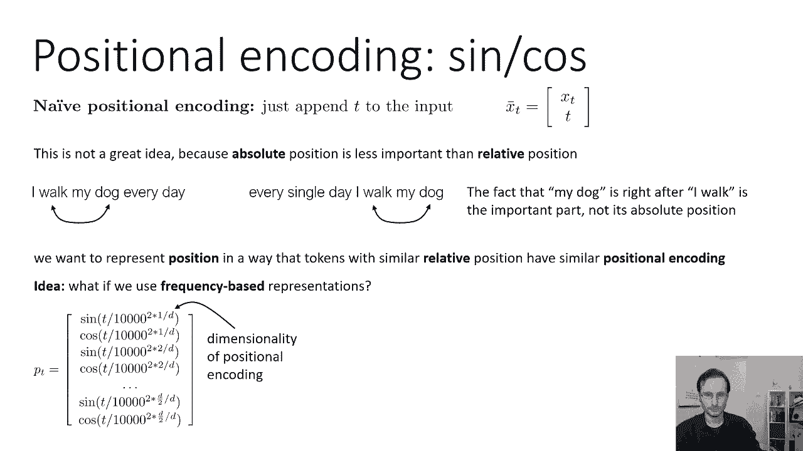

所以如果你真的画一张这些位置编码的图，这就是他们的样子，所以这里的每一行都是这个位置的不同维度编码向量，正弦余弦，正弦余弦，这就是为什么它看起来像条纹，因为正弦和余弦振荡。

然后水平的每个点是序列中的索引，所以第一列是t等于1，第二列是t等于二，第三列st t等于三，等等，等等，所以这种频域编码实际上很好地获得相对位置，因为前几行基本上是奇数指示器，所以第一排。

也许它的频率大约是1，它基本上会告诉你这个奇数词，或偶数字，第二个，呃，指示器会大致告诉你它是像前两个还是后两个，对呀，所以你会期望走路这个词，狗这个词的位置编码值大致相同，在某处，就像第三个或第四个。

也可能是第五和第六个条目，所以这其实很好，呃，我们可以从这些编码中获得更好的相对位置感，它们只是维度更高，但没关系，因为你知道，尺寸便宜，所以在接近尾声的时候，当我们进入像这样的低频时。

不管是句子的前半部分还是后半部分，所以这实际上是位置编码的一个非常流行的选择，你知道这可能会让人觉得有点临时。

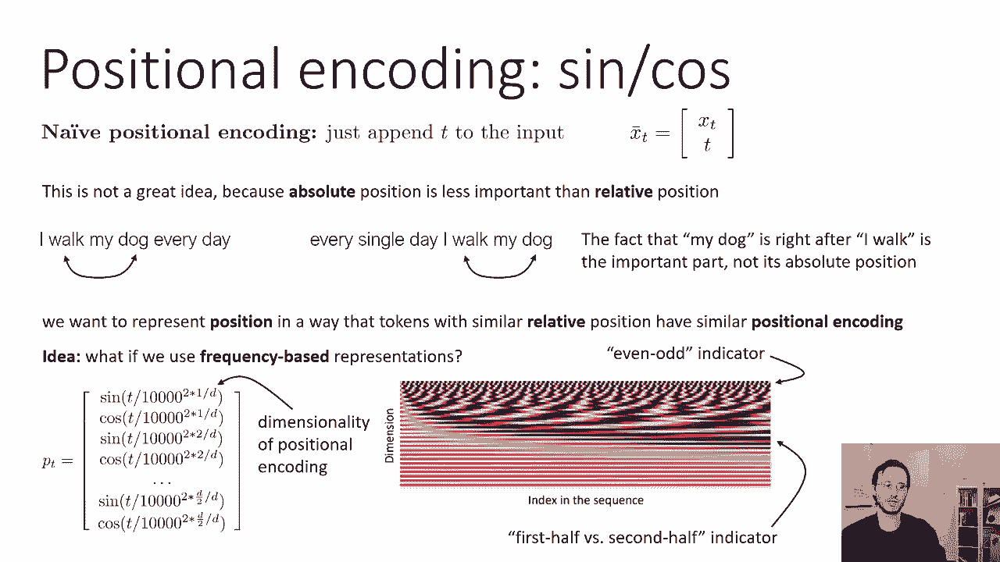

但它实际上工作得很好，我们可以有更复杂的位置编码。

所以我们实际上可以学习我们的位置编码，所以如果你看看这个，呃，呃，图片，你知道的，它基本上代表了一个矩阵，其中行数等于维数d，列数等于序列的最大长度，我们实际上可以了解整个矩阵。

我们基本上可以使矩阵中的条目成为我们模型的可学习参数。

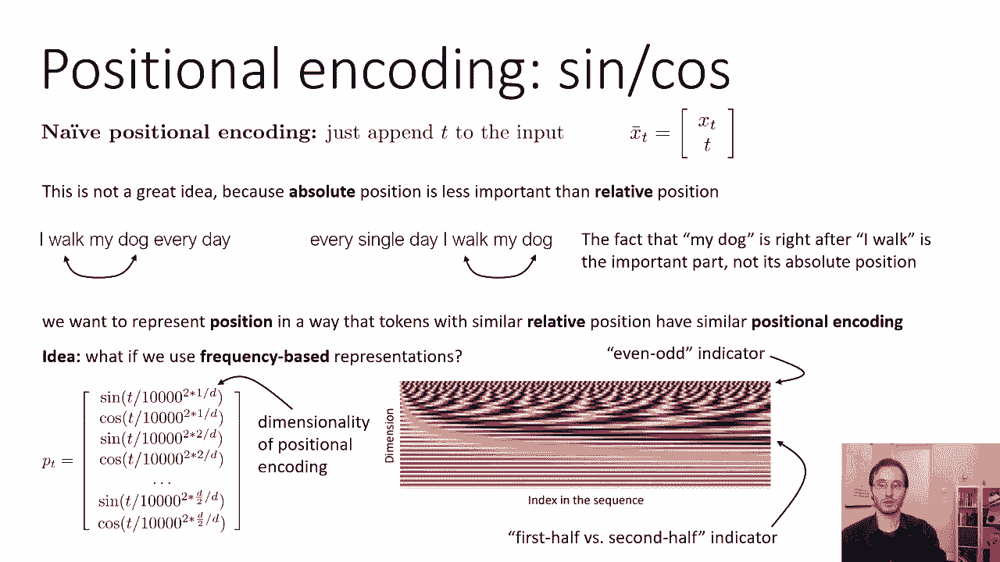

所以在每个位置我们都有一个x，这对每个输入序列都是不同的，在每个位置，我们也有一个p，这对每个序列都是一样的，但它学会了，所以每一步都是不同的p，但是一个序列的p-1和另一个序列的p-1完全相同。

所以这只是一种博学的，呃常数，本质上很像一种偏见，但取决于时间，所以在不同的时间步数是不同的，学习位置编码也往往工作得很好，你需要学好多少价值观，整个位置编码矩阵只是一个从p到p的列表，t，它有d行。

其中d是我们想要的位置编码的维数，列数为大写T，这是我们要处理的最长序列的长度，这样做的好处是更灵活，也许更优化，在某种意义上比正弦余弦编码，因为我们最终确实学会了最有效的位置编码，对于我们的序列模型。

缺点是它有点复杂，您需要手动选择最大序列长度，所以如果训练时最长的序列是100步，你实际上不会有第101步的位置编码，这意味着你永远不能推广到更长的序列，所以这可能有点不幸。

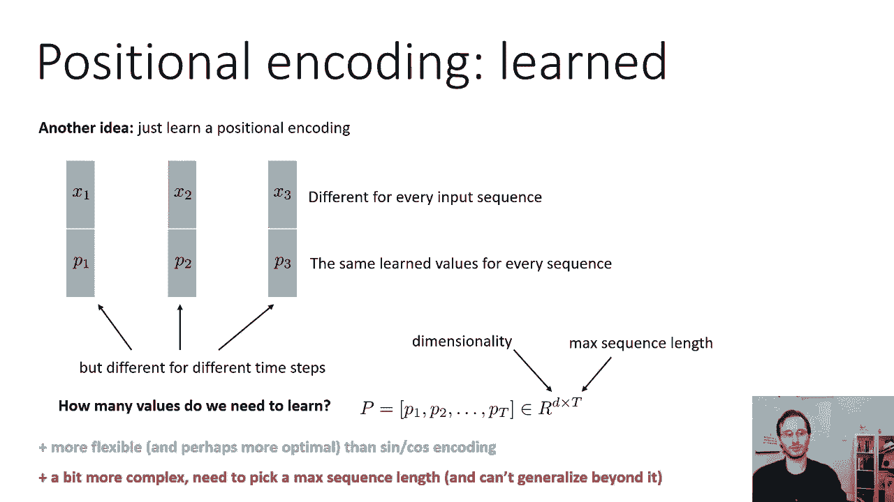

嗯，我们如何将这些位置编码很好地纳入我们的自我注意模型，在每一个时间步骤，我们将有我们的输入XT和我们的位置编码PT，不管是正弦余弦的东西，还是学习的东西，或者其他任何东西。

你知道它只是它只是一些矢量BT，所以一个简单天真的选择可能是连接，所以不只是喂XT，我们以x巴t为食，它与p t相连，更多的时候，变压器模型会做一些不同的事情，这有点临时的，但它往往工作得很好。

也就是说，他们首先嵌入输入，所以它们有某种嵌入功能，它可能只是一个线性层，后面跟着一个非线性层，然后他们将位置编码添加到嵌入中，所以呃，那个呃，编码只是x t加bt的嵌入，那是一种武断的选择。

你可以把PT和XD结合起来，以任何其他方式，你可以把它们和两个非线性层结合起来，但这个简单的加法实际上效果很好，所以嵌入是一些学习的函数，像一个完全连接的层，有一些线性层和非线性层。

然后你只要把BT加进去，这成为你第一个隐藏的状态。

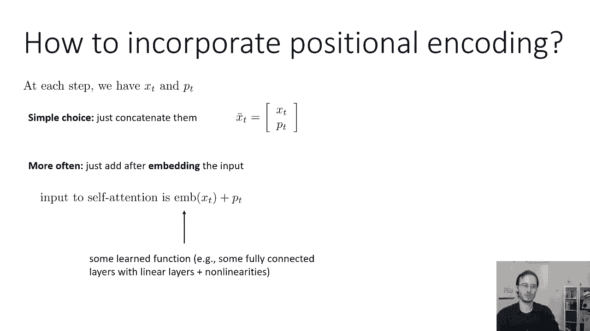

这是位置编码，这就是我们基本上解决单词袋问题的方法，让自己的注意力真正意识到单词之间的相对位置，下一个，让我们来谈谈多头注意力。

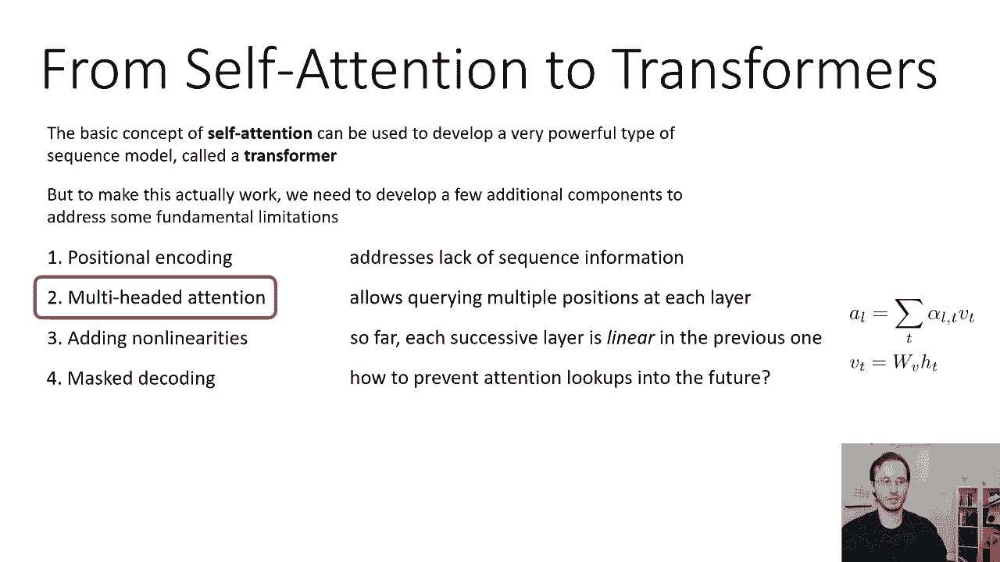

所以既然我们现在完全依靠注意力，允许自我可能真的很可取，注意机制，以纳入来自一个以上时间步骤的信息，例如，也许在第二个位置，你真的想得到句子的主语和动词，以某种方式将两者结合起来。

所以也许你希望你的注意力机制来吸引主题，另外，你需要一个不同的注意机制来获取动词，这样你就可以把它们放在一起了，所以你可以做到这一点的方法是，你可以有一把钥匙，每一步的查询和值，天真地。

你会把它们结合起来以获得关注，呃，但是因为软麦克斯，这真的主要关注一个时间戳，所以如果主语和动词在不同的时间点，他们一直都是，你不可能两个都得到，你就能得到其中一个，然后当你把它们组合在一起的时候。

很难具体说明你想要两种不同的东西，因此，您不能真正编码到您的密钥或查询中，我想要一个，或者我想要那个，主语或动词，所以你不能两者兼得，你会主要专注于一件事，所以你不能把两个时间点的信息拉到一个时间步中。

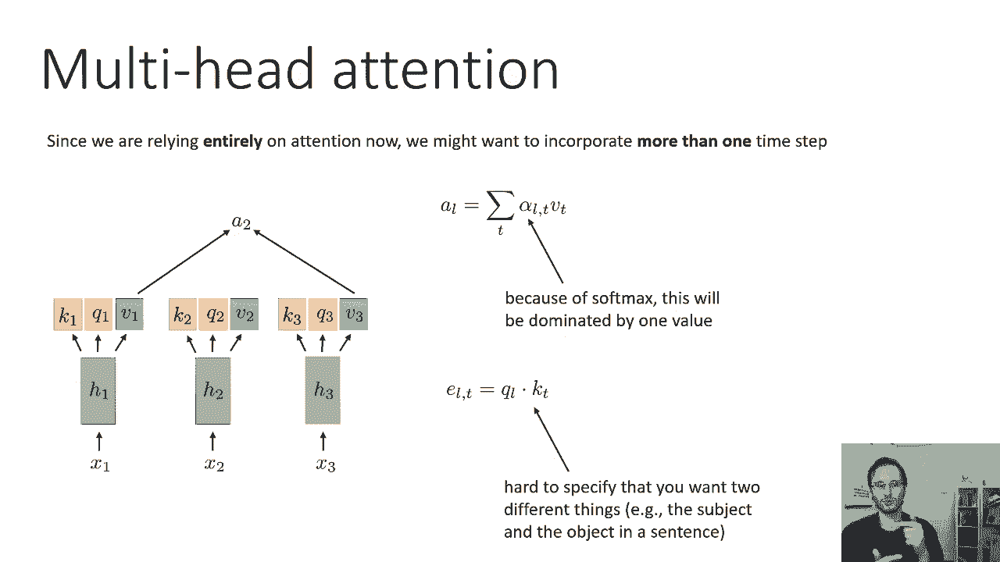

所以我们可以这样解决这个问题，我们要做的是，而不是输出一个键查询值元组，我们实际上会输出多个，所以不同颜色的轮廓代表不同的头部会有绿色的注意，蓝色的注意和红色的注意。

绿色注意力将通过使用查询产生注意力向量，绿色查询将其与绿键匹配，然后使用点积得到绿色值，所以也许这里的绿色代表了类似的主题，然后我们对蓝色做同样的事情，我们将使用蓝色查询与蓝色键匹配，获取蓝色值。

也许这就引出了动词，然后我们对红色注意力做同样的事情，我们将把红色查询和红色键结合起来，得到红色值，也许这注意到了第三类信息，所以你完全独立地计算每个注意力头的重量，所以现在你的注意力评分有三个下标。

它是e l逗号t逗号i，L是你计算注意力挑逗的位置，你试图从中得到值的位置，我是头，您对每个i都有完全独立的查询和键，然后你对每一个i单独做Softmax，你完全单独地计算每个i的注意向量，然后在最后。

通过简单地将这些连接在一起，就形成了完整的注意力向量，所以你在第二个位置，你有一个二一，一个二，二和一二三，所以三个不同的头，所以完全的注意力向量2是由这些不同的注意力头堆叠而成的。

所以现在也许其中一个头拔出了动词，另一个把话题拉了出来，另一个拉出来，也许是一些形容词，你把它们组合在一起，然后在下一层做出下一个决定通过使用这些组合信息，这可能会更强大，就像你永远不会建造修道院一样。

每个conv层只有一个过滤器，每个自我关注层有多个头部来建立自我关注是一个非常好的主意，通常在八头左右的地方似乎对大模特很有效，一个头比一个过滤器在一个大陆上强大得多，因为每个头仍然是多维的。

所以每一个注意力向量，一个二，一个二一，一个二，二加二，三个，实际上是多个数字，例如，在经典的变压器模型中，全注意力向量五的维度，十二，它分成八个独立的头，所以你休息五分钟，十二除以八。

这是每个头的大小。

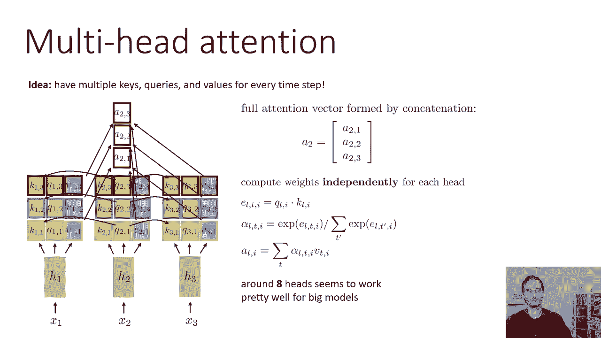

所以现在是多头注意力，让我们来谈谈如何让自我注意力更非线性。

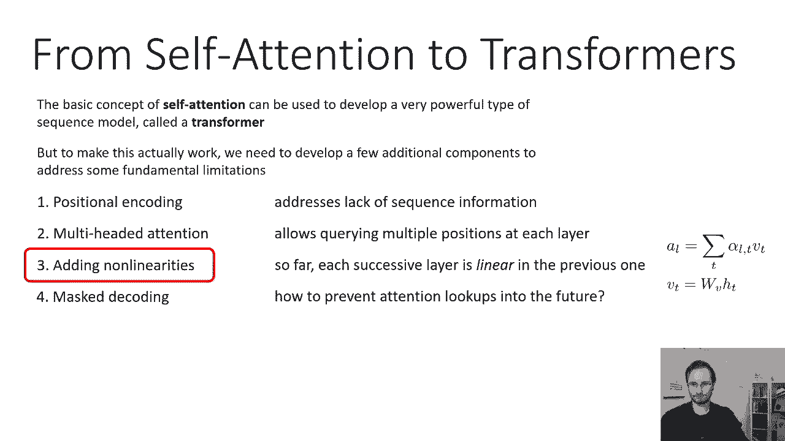

到目前为止，自我注意实际上是完全线性的，记住我们的钥匙，我们的查询和我们的值是HT的线性函数，它们是不同的线性函数，所以我们有一个不同的矩阵w k，w，q和w v，在每个自我注意层上都有不同的矩阵。

所以第一个自我注意层有一组权重，第二个自我注意层有一组不同的权重，我们的体重，呃，为了引起注意，我们的阿尔法是通过应用软最大值来计算的，这是一个非线性操作，但我们的实际注意力是通过值的线性组合获得的。

由那些软最大分数加权，所以注意力在V中是线性的，右边的V是线性的，所以你可以等价地把你的注意力写成阿尔法所有时间步长的总和，w v乘以h t，因为你有分配属性，你可以把矩阵推到和之外。

得到w v乘以αl t乘以h t的和，所以在这里你可以看到它是线性的，除了注意力的重量，所以我们对注意哪个时间步长做出非线性选择，但我们对那个时间步长的年龄进行线性变换，这意味着h不被非线性变换。

所以我们有一个非线性变换，将线性变换应用于非线性权重，所以每一个自我注意层都是前一层的线性变换，具有非线性权重，这不是很有表现力，这实际上不是一个强大的操作，如此直观，自我关注真正擅长的是。

它擅长从其他时间点获取信息，但它不太擅长对这些信息进行一些复杂的处理，所以也许你想拉主语和动词，然后你想要一些手术，比如，说好，如果主语是人，动词是这样的，然后我们输出一个东西，如果主体是无生命的物体。

然后我们输出一个不同的东西对吧，所以那种手术很难做，如果一切都是线性的，所以我们真正想做的是，以某种方式在这个过程中插入非线性，一个非常简单的方法是简单地交替自我注意力。

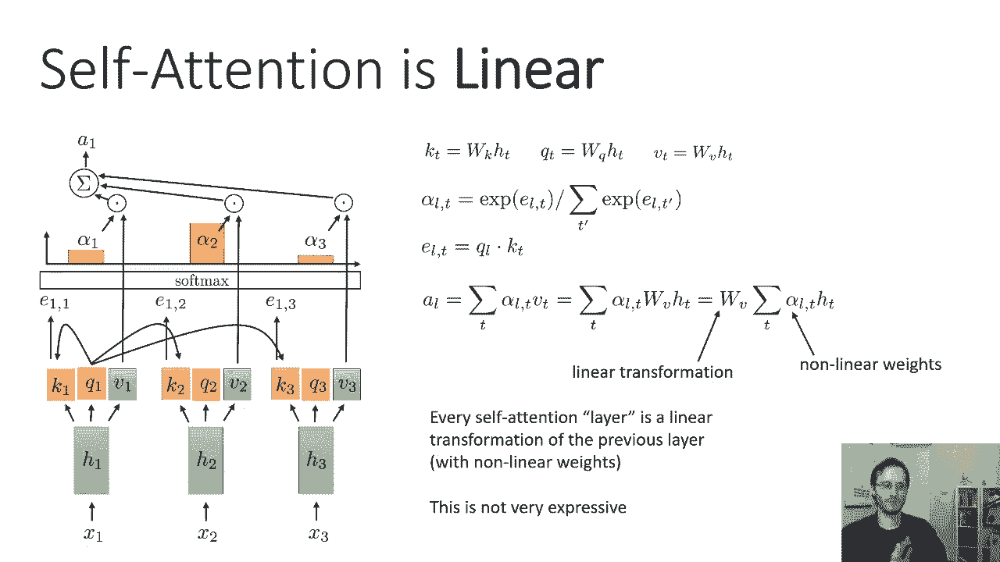

带有某种非线性层，所以我们要用自我注意力来计算一个，一个二和一个三，所以每一步都有一个T，然后我们将在每个时间步长独立地应用一些非线性运算，获取下一层隐藏状态，所以我们从隐藏的状态开始，第一层有一个。

我们将在第一层引起注意，然后我们计算第二层的隐藏状态，两个，所以这可能是一些学习过的非线性函数，比如，比如说，后跟非线性的线性层，它将在每一个时间步长上独立应用，它在每一个时间步长都是相同的函数。

但独立应用，所以你可以把自我关注看作是在时间步长之间交换信息，这个位置的作用是处理信息，所以这种自我关注就像记忆的提取，然后这个东西是实际的计算，然后我们再做一次内存提取，另一个计算。

然后另一个内存获取，所以它只是一个神经网络应用在每个自我注意层后的每个位置，有时被称为位置明智的前馈网络，因此，我们将很快描述一些具体的常用选择，但就目前而言，这只是某种习得的非。

在每个时间步长独立应用的线性函数，然后你改变了自我注意力的非线性函数，自我注意非线性函数，这是一种不同的细胞电位，每次都有不同的非线性函数。

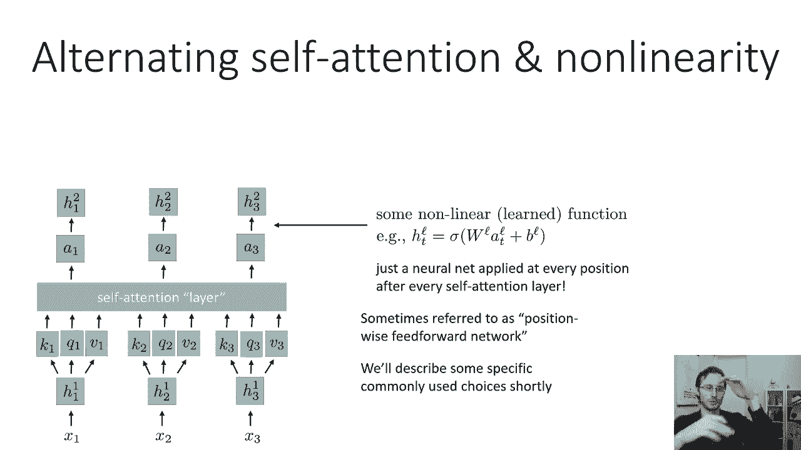

到目前为止，我们已经弄清楚了位置编码，我们想出了如何让注意力多头，我们知道了如何插入这些交替的非线性函数，让我们的自我注意模型实际执行一些复杂的计算，现在。

我们还需要做最后一件事才能让它真正适用于实际序列，就是弄清楚如何用它来解码或一般地生成。

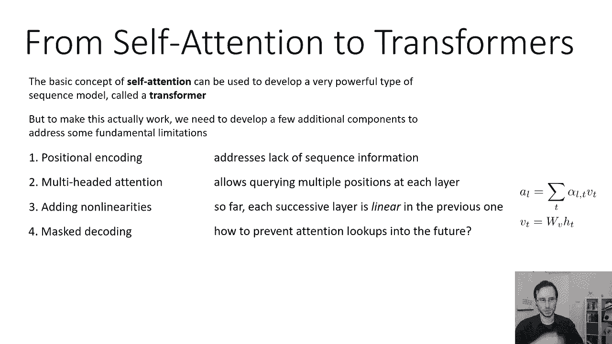

所以自我关注的问题是它不能区分过去和未来，所以再一次，所以注意力，呃，查找可以从序列中的前几个步骤中查找信息，他们还可以从序列中的未来步骤中查找信息，这可能会有点问题。

因为你知道如果你用它来处理给定的输入序列，就像法语中的一句话，这样他们以后就可以用英语造一个句子，完全没问题，没问题，但是如果您在生成过程中使用它，在解码过程中，你想做的是你想有第一步。

仅使用第一步的信息来生成第一步的输出，然后您希望将该输出用作第二步的输入，然后可以处理这些信息，包括第一步的信息，产生第二步的输出，然后你想把这个传递到第三步到第三步，那么第三步需要能够向上看第二步。

和第一步正确，并产生第三步的输出，一个粗糙的自我注意语言模型实际上可以看到未来，因为没有什么能阻止这些注意力查找，呃，实际上呃，不考虑未来的时间步骤，所以在现实中，当然。

我们有许多交替的自我注意层和位置明智的前馈网络，但现在我们只分析一个，所以如果我们在解码，呃，也许我们有一个自我注意层，然后是位置非线性，然后在第一步我们解码y two y two帽子。

那是我们对你们俩的猜测，然后我们会设置呃，作为第二步的实际输入，然后从那里解码，设置Y三个，是第三步y三的实际输入，但是当我们执行第一步的计算时，它的注意力机制实际上可以窥视第二和第三个时间步骤。

但我们这里有个大问题，因为自我关注是第一步，可以看看第二步和第三步的价值，但是这些值是基于步骤二和步骤三的输入，在解码过程中，第二步和第三步的输入，基于步骤一和步骤二的产出，所以在测试的时候，解码时。

步骤二和步骤三的输入将取决于输出步骤一，但是第一步的输出取决于第一步的注意力，这取决于第二步和第三步的输入，所以这是一个循环依赖关系，这意味着我们不能用这个来解码一个令牌，在某个时候。

我们不能用这个来生成一个完整的句子，对呀，因为在第一步产生输出需要知道第二步和第三步的输入，但是这些输入是由第一步的输出决定的。

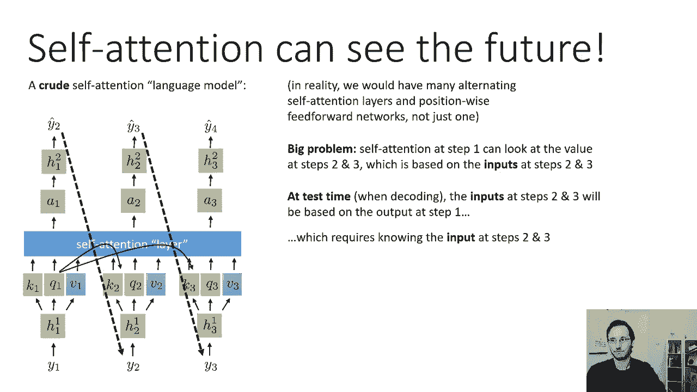

所以有一个非常简单的修复，我们可以用来消除这个问题，这就是所谓的蒙面注意力，基本上，你必须让自己的注意力进入过去，你必须，你知道的，如果你在第二步，你可以在第一步和第二步，但你不允许，呃。

对未来的自我关注，所以在第二步，你不允许看时间第三步，所以有一个简单的解决办法，就是基本上从数学上删除这些连接到未来，你做的方式，那是在你的注意力得分之前，e l逗号t是ql乘以kt对。

所以如果你想弄清楚当时的值有多合适，步骤T是传递到另一个时间步骤L，它只是q l乘以kt，但是如果QL，如果查询来自比键kt更早的步骤，你想不允许，一个简单的方法就是改变计算注意力分数的规则。

如果l大于或等于t，意思是钥匙在同一时间或更早的一步出现，和以前一样用KT点缀的QL，但如果晚一点，这意味着如果键出现的时间晚于查询，您将出勤率分数设置为负无穷大，这意味着当你把它放入软最大值时。

e到负无穷大为零，所以未来的时间步长总是有零的权重，它永远不会被使用，这将防止这个问题，现在你实际上可以使用自我注意力模型来解码，因为现在时间步骤1将只在前面的步骤中进行自我注意力查找。

永远不要进入以后的步骤，现在，当然啦，在现实中，在实际代码中处理这些无穷大可能会变得非常烦人，就像你不想处理无限，呃，在您的代码中，所以一个非常简单的方法，实际上就是把E的指数，l，逗号t。

对每一个小于t的l为零，您可以在SoftMax计算中这样做，所以这基本上将使阿尔法在任何展望未来的时候都清零。

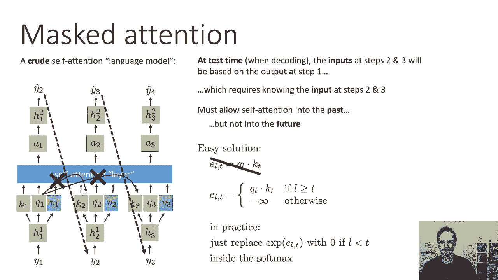

总结一下我们讨论过的这些不同的实现选择，我们可以实现一个完全基于自我注意的实用序列模型，如果你把我在这部分演讲中描述的这四个修改结合起来，这东西真的会起作用，你必须用非线性位置交替自我注意层。

明智的前馈网络得到非线性变换，您必须在输入或输入嵌入上使用位置编码，使模型知道令牌相对于彼此的相对位置，在序列中，你必须使用多头注意力，这样你就可以在每个自我注意层上整合来自多个不同时间步骤的信息。

最后，如果您想使用模型解码以生成，你必须利用大众的注意力，这样您就不会在将来执行这些查找，所以在讲座的下一部分，我们将看看如何使用这些基本的构建块，实际构造序列的一个版本，只使用自我注意力来序列模型。

我们将利用大众的注意力来解码器，和编码器的定期自我关注。

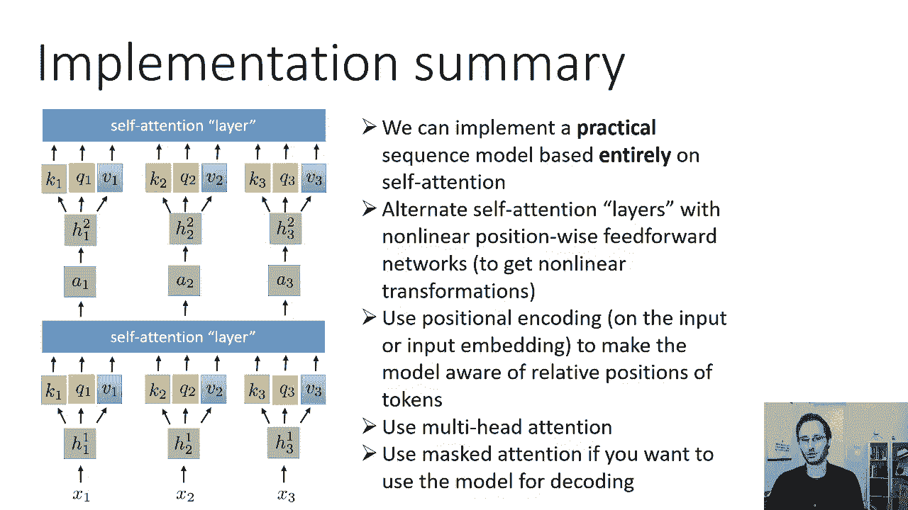