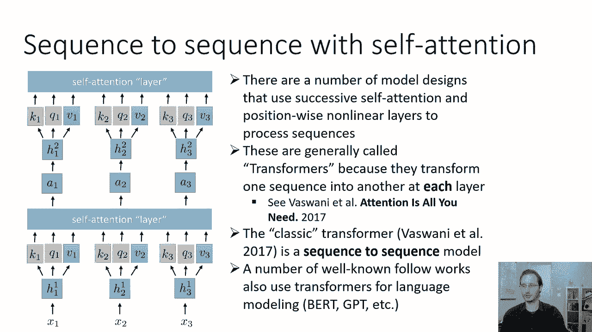
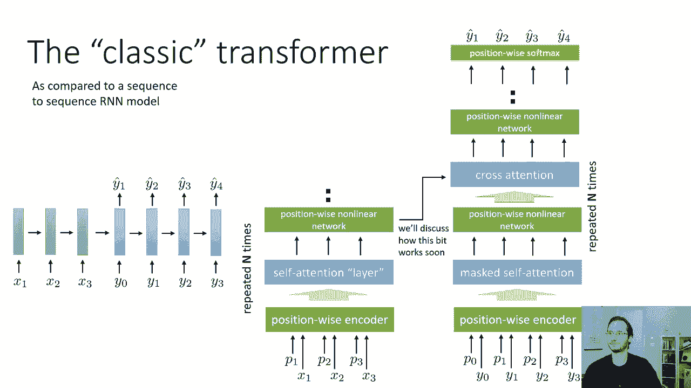
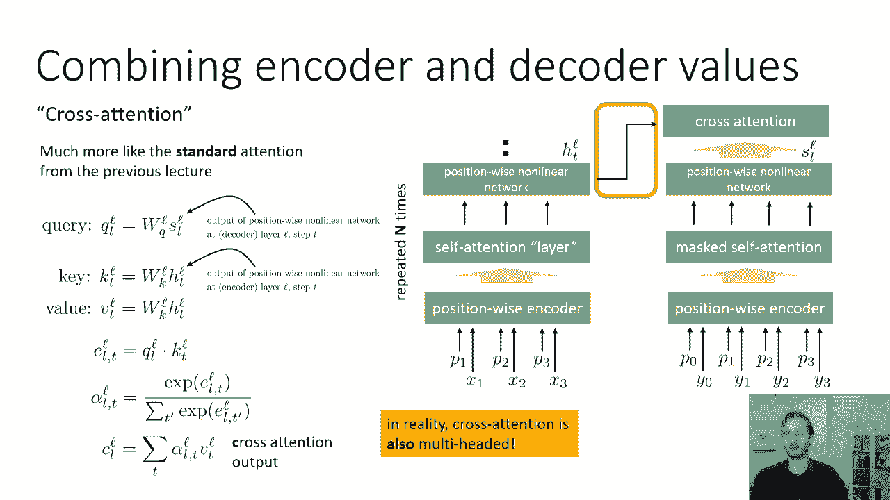
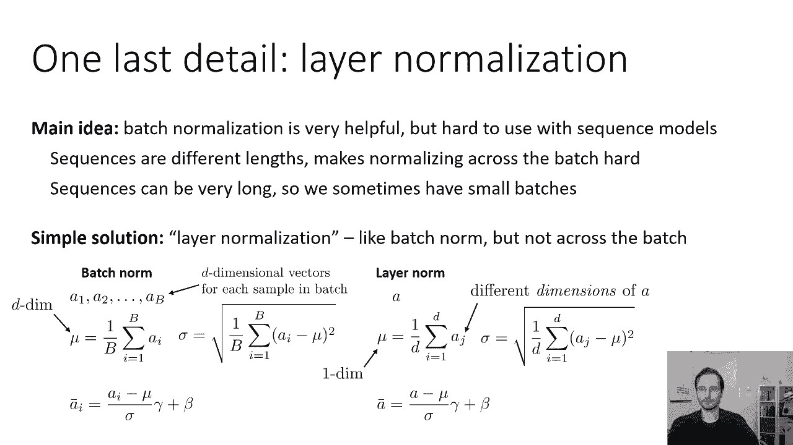
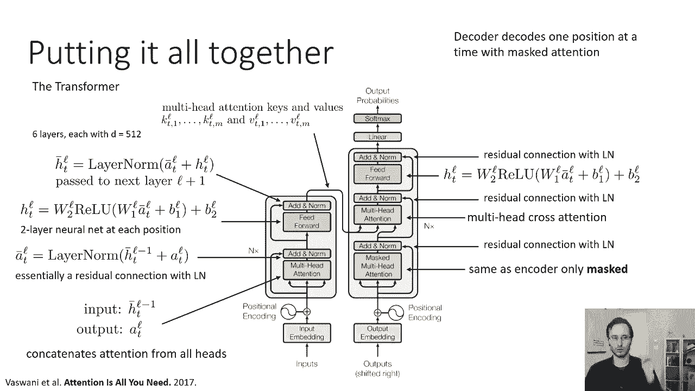
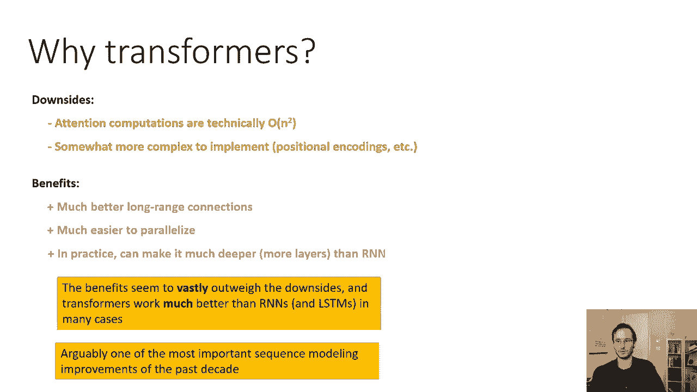
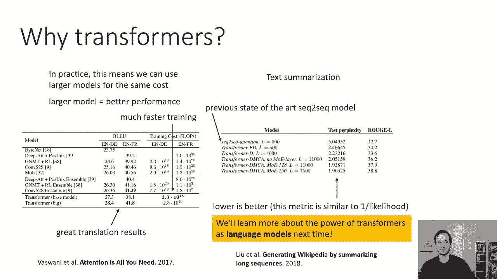

# P38：CS 182- Lecture 12- Part 3- Transformers - 爱可可-爱生活 - BV1PK4y1U751

在今天讲座的最后一部分，我们将把我们到目前为止所学到的部分结合起来。

经历经典的变压器模型，所以让我们来谈谈我们如何用自我注意力来做一个接一个的序列，有许多模型设计使用连续的自我注意和位置，处理序列的明智和非线性，这些通常被称为变压器。

因为它们利用这些自我注意机制在每一层将一个序列转换成另一个序列，所以对于经典的变形金刚你可以看看瓦斯瓦尼的这个更大的变形金刚，引起注意是你现在所需要的人们使用变形金刚的其他方式，除了本文描述的。

包括用于构建非常强大的语言模型，我们下次会讨论的，但是经典的变压器，瓦斯瓦尼描述的那个，实际上是一个序列到序列模型，许多著名的后续作品也使用转换器进行语言建模。

这将在以后讨论，在这张幻灯片上，我要做的是，我将用一个并排的比较来勾勒出经典的变压器模型，到序列到序列RNN模型，就像我们以前见过的，所以序列到序列RNN模型有一个RNN编码器，然后是一个RNN解码器。

这些通常可以有多层，这里我只画了一层，把这个做成变压器，我们基本上会更换编码器和解码器，具有连续的自我注意层，与位置方向非线性变换交替，所以编码器会得到一系列X，具有相应的位置编码，P一。

在每个位置的p2和p3，我们将对这些进行编码，然后我们会把它传递到一个自我注意层，所以在每个位置，我们将计算一些h，t，one，因为它是第一层，这些会产生钥匙，值和查询。

它们实际上会产生八个键值和多头注意力查询，然后我们会做一个多头自我注意，在这一点上没有掩蔽，然后我们将把这个多头注意力的输出，并将其传递到位置方向的非线性网络中，基本上在每个位置。

我们将对注意向量应用一些非线性函数，获取下一层的隐藏状态，这将是h2，重复n次，所以我们有N个这样的方块，自我注意，位置方向非线性，自我注意，位置非线性，这就是编码器，所以编码器将有n个这样的字母。

然后在解码器里，我们还将有一个输出的位置嵌入，呃，步骤及其相应的位置编码，我们将使用，这里的蒙面注意，所以即使看起来我们输入了所有的时间步长，在现实中，y 1实际上来自于时间步骤0的输出，所以没关系。

我们现在要蒙面自我关注了，这意味着早期的时间步骤不能研究后来的步骤，只变成早期的，那么我们就有了一个位置非线性网络，然后我们实际上会有一种叫做交叉注意力的东西，我们只是要利用所有这些隐藏的向量。

由编码器产生，交叉注意很像我们在上一节课中描述的经典注意，因此，不是自我关注，而是以同样的顺序观察其他时间步骤，交叉注意力将查看编码器中的时间步长，所以它实际上会引用编码器的相应层，所以解码器的第一层。

在编码器中引用第一层，解码器中的第二层交叉注意，编码器中的第二层引用，然后我们将很快详细讨论这是如何工作的，然后交叉注意之后，我们有另一个位置非线性网络，所以每个解码器层实际上有两个有意的步骤。

它有一个质量，自我注意，非线性函数，交叉注意，另一个非线性函数，然后进入下一个街区，这些块也重复N次，所以说，解码器块的内容是编码器的两倍，块，然后在像这样的N个街区之后的最后。

然后我们在每个位置应用软最大值并读出输出，所以当我们用解码器解码时，我们仍然一步一步地做，因为我们利用了大众的注意力，然后我们就像在RNN，我们输入一顶帽子作为输入，Y一个在下一个时间点。

我们能够做到这一点是因为我们利用了大众的注意力。

好的，所以让我们来谈谈这个交叉注意力机制，有点微妙，所以我们要用一个，不上标，L表示编码器中L层的隐藏状态，和SL上标脚本L表示解码器中的状态，就像我们现在对RNN所做的那样。

这些状态是由位置非线性网络产生的，而不是通过一个循环网络，所以交叉注意力很像标准注意力，从上一节课开始，我们有一个查询，我们通过将一些矩阵WL Q应用于状态来计算，所以国家。

下面是解码器层的位置非线性网络的输出，l步l，这是两种不同的l脚本l和普通l um，关键是呃是在编码器中构造的，所以KTL是通过对隐态应用一些线性变换W KL得到的，htl。

应用线性函数w v l得到v tl值，对不起，有一种类型的应该是WVL乘以H TL，所以htl，这是编码器层位置方向非线性网络的输出，我走了这么远，这与我们之前看到的寻求模型的标准注意力完全相同。

然后我们计算每个T和L之间的注意力得分，现在TS来自编码器，L来自编码器，从解码器，我们应用SoftMax，然后我们计算我们的交叉注意力c l，就像用alpha lts加权的btls的线性组合一样。

这是我们的交叉注意力输出，好的，这和我们以前经常寻求关注完全一样，现在在现实中，交叉注意力也是多头的，实际上在经典的变压器模型中，它的头部数量与自我注意力相同，所以我们会有八个头交叉注意，好的。

所以这是交叉注意力，现在，还有一个小细节我们需要先讨论一下，我们可以给出完整的真实变压器模型。

有一点点，呃，不同于其他所有的，但了解全面实施是很重要的，这就是所谓的层规范化，这与注意力模型没有什么特别的关系，但事实证明这对变压器很重要，因为变压器很难使用常规批量生产标准。

所以这里的主要思想是批处理规范化非常有帮助，但由于几个原因，很难将其用于序列模型，序列长度不同，这使得跨批处理的规范化有点困难，序列可能很长，所以我们有时会有非常小的批次，这使得批量规范不太有效。

所以我们可以使用的一个简单的解决方案是替换批处理规范化，用一种叫做层规范化的东西，层归一化就像批处理范数，但它跨越了一层中的不同激活，而不是一批不同的样品，一般来说，至少从我的经验来看。

层归一化比批归一化差一点，对于模型的类型，批处理规范可以像大置信度一样有效地使用，但在某些情况下，批处理规范很难使用，在这种情况下，层归一化总比没有强，所以我将描述层规范化与批处理规范的对比，首先。

让我总结一下我们已经了解到的标准批处理规范，在标准批号中，在每一层你都有一堆激活向量，每个输入一个，所以你有资本B，批处理中的不同图像或不同或其他输入，对于某个层中的每一个，你计算一个不同的激活向量。

所以每一个1-2-3到b都是d维向量，其中d是该层的维数，然后批处理范数计算均值和标准差，在那一批中的所有点上，在该批处理中的所有输入上，苏木和西格玛，这里是d维向量，所以这些都是每个元素的操作。

如果你的激活有D维，mu和sigma也有d维，然后当你用批处理规范转换它们时，一切都是每个元素，所以对于每个样本的每个元素样本激活，你减去mu的相应元素，除以sigma的相应元素，乘以相应的伽马元素。

也就是学习量表，并添加相应的beta元素，所以这里的下标i索引了批处理中的不同点，不同的数据点和所有操作都是每维的，层规范有点不同，所以层规范将是一个更传统的层，它不使用任何跨批次的信息。

它只是使用单个数据点内的信息，而不是计算批处理中不同向量的平均值，它实际上计算一个数字，通过平均每个维度的激活来获得单个一维量，所以这里的下标j实际上索引了，有一个小类型，但应该是j等于1到d的和。

而不是i，你现在把它除以d，所以看起来是一样的方程，但它实际上在做一些非常不同的事情，它平均到那个向量上的激活，它是一维的，标准差是用同样的方法计算的，再求和，有一种类型的j等于1到d的aj减去mu。

这里有一个标量值，sigma是标量值，然后就像你转换激活之前一样，减去μ除以sigma，然后元素乘以向量，伽马和元素方向加一个向量，所以伽马和贝塔仍然是每个元素，呃，但是mu和sigma现在是标量。

所以现在这不需要跨批处理共享任何信息，这意味着在序列中使用这个非常简单。

所以现在我们实际上有了所有的碎片，我们需要把所有这些放在一起，并实际导出全变压器模型，所以你在这张幻灯片上看到的图表，我们将详细介绍，实际上来自介绍变压器的论文，叫做注意力就是你所需要的，然后呃。

本文提出的是利用连续的自注意和位置方向的非线性函数，实际实现序列到序列模型，它们适用于机器翻译，所以我们首先把我们的输入序列分开，在输入序列中嵌入每个令牌，并将相应的位置编码添加到该嵌入中。

然后我们有了第一个多头自我注意层，所以输入是h bar t l减去1，你很快就会看到，为什么我叫这个H酒吧，零只是输入嵌入加上位置编码h bar t，一个将是第一个块的输出。

所以我们很快就会看到这意味着什么，和自我注意层的输出，我们将称之为下标，上标l，所以它只是一个有多个头的自我注意层，他们用八个头，他们使用五个维度，十二个H和一个，所以你连接了所有头部的注意力。

以获得每个位置的ATL，然后你有一个叫做添加范数的东西，这是什么，你可以，你基本上可以把它看作是一个剩余的连接，然后是层规范，所以一个酒吧，tl是通过将层范数应用于h形来得到的，减1加atl。

所以你把输入带到自我注意上，然后你加上自我注意力的输出，然后你把层范数应用到整个事情上，所以这本质上是一个与层的剩余连接，如果你认为你的功能是自我关注，呃，那么atl基本上是ht l的f减去1。

然后你做θl减去1加上θl减去1的f，这只是一个剩余的连接，然后你在整个东西上涂一层，他们这么做的原因是他们基本上希望这里的每一层都是一个修改，他们想获得井的好处，从剩余连接获得的行为渐变。

然后你有一个位置方向非线性非线性函数，他们使用的特定位置非线性函数由一个线性层组成，然后是一个relu，然后另一个线性层，所以它们是w l乘以a bar t l加b l，这是第一个线性层。

然后他们对其应用Relu，然后乘以w2l再加上另一个偏d 2l，所以它是线性的，这给了他们htl和htl，你可以把它看作是预层规范隐藏状态，所以这基本上只是一个两层神经网络在每个位置。

然后他们有另一个添加一个规范，所以他们呃，这又是一个残余的连接，所以你拿一个t酒吧l，这只是这个位置的输入非线性，然后添加htl，它是位置方向非线性的输出，然后你对整个事情应用一个层规范。

现在它被传递到下一层，到下一个方块，我加一个，所以他们有N个这样的块，所以每个块都是多头的自我关注，添加规范位置，明智非线性，添加规范，把它传给下一个方块，自我关注多头，添加规范位置，明智非线性。

添加规范，把它传给下一个方块，他们用，呃，我相信，呃，六六块，每一个都有五十二的维度，所以所有的H和A，在序列的每个位置都有512个条目，我相信他们用八个头来吸引自己的注意力，好的，这就是现在的编码器。

一旦你一直向前运行编码器，您将计算出其中的六个块，在每个街区，你都会有一个不同的h bar tl，就是这些h bar tls，实际上会传递给解码器，所以为了把它传递给解码器。

他们实际上计算多头注意力键和值，所以kt 1 l到kt m l和vt 1 l到vtml，对于不同的头，相信头数是八个，他们在这六层中的每一层都这样做，所以这些，k和v，真的是解码器要用的东西。

他们来自HT酒吧L，好的，这就是现在的编码，编码器的乘积，运行编码器的结果是这些键和值，这就是我们想从他们身上得到的，现在，我们来谈谈解码器，解码器有相同的位置编码业务，然后解码器的每一个块。

你知道对于每个编码器块，有相应的解码器块，所以有六个街区，但是方块要复杂一点，所以它有一个多头的自我关注，就像编码器一样，只是现在多头的自我关注被掩盖了，所以在解码器的每一个时间步长中。

它只查看过去的时间步长，和，这是因为解码器将被用来实际生成一个序列，然后它有相同的原子范数，所以与空气的残余连接更多，然后它有第二个注意力，也就是这种交叉注意力，因此。

交叉注意力根据自我注意力的输出产生查询，这些查询用于从编码器中查找键和值，然后它必须添加一个规范，所以这其实很重要，因为添加一个规范实际上会将交叉注意力和自我注意力的结果加在一起。

这样你就有了这两条信息，然后你有一个位置非线性函数，它使用相同的架构，但编码器的重量不同，然后你有另一个不正常的，因此与层范数的剩余连接，然后你把它们传递到下一个街区，然后在最后一个街区的尽头。

第六块在每个位置都有一个线性层，然后是软麦克斯，它实际上输出该位置令牌上的概率分布，所以解码器一次解码一个位置，注意力集中，所以你对整个输入序列进行编码，然后你开始解码，您首先从第一个令牌开始。

就像一个开始什么的，现在注意力集中，没有做任何有趣的事情，但是交叉注意力是，然后你有所有这些交替的层，然后你可以在第一个位置产生输出，然后你把它作为输入输入到第二个位置，然后整个过程重复。

所以解码是一个位置一个位置地完成的，就像在RNN里一样，只使用这些注意机制，好的，这就是全变压器模型的总结，是序列到序列模型，用交替的自我关注，和前馈网络，它们之间有一个规范，用于编码器，然后自我关注。

交叉注意。

解码器前馈，所有的权利，他们有什么了不起的，他们确实有一些利弊，变压器的一些缺点是，从技术上讲，计算是n的平方，这可能有点问题，因为对rnns来说一切都是n的，而现在我们突然有了n的平方。

但这并不像看起来那么大的问题，因为即使注意力计算是平方的，大部分计算时间实际上并没有花在执行这些点积上，它实际上花在了网络的所有其他部分，所以它是n的平方，但乘数相对较小，然后是n，有一个很大的乘数。

所以在实践中，在计算成本方面，通常变压器实际上比rnns便宜得多，因为即使它们是二次的，它是系数很小的二次型，相比之下，或者换句话说，有一个系数很小的二次部分，还有一个系数相似或略小的线性部分。

它们的实现也更加复杂，并涉及各种看似奇怪的决定，如位置编码，这可能会让他们有点棘手，可能需要一个，你知道的，一个相当大的超参数调整，以使变压器训练良好，它们确实有许多非常重要的好处，首先。

他们有更好的远程连接，所以基本上输出中的每个位置都连接到其他输出位置，和每一个其他输入位置，带有长度为1的跳转，他们更容易瘫痪，所以在瘫痪的硬件上计算实现一个转换器，比如Gpus。

让他们每走一步都跑得更快，当我们一次处理一个变压器时，编码器是完全平行的，解码器要求一次一步计算，但你知道这还不算太糟，并在实践中，你可以把变压器做得比堆叠的RNN深一点，所以对于堆叠的RNN来说。

可能有三层，你知道的，人们用在变压器上的最大值，六六个街区是很典型的，每个块实际上有多层，在实践中，变压器的好处似乎远远大于缺点，变压器比rnns和ldms工作得更好，在许多实际的序列到序列处理中。

可以说，变压器体系结构是过去十年中最重要的序列建模改进之一，因此，它极大地提高了神经网络模型在NLP中的性能。

好的，那么变压器的一些结果是什么，嗯，这些是翻译的结果，英语对德语，英语对法语，在原来的拉斯瓦内，你只需要一张纸，好的，所以让我解释一下如何解析这个表，在底部，你有两个变压器型号。

一个小模型和一个大模型，然后所有其他的方法都是各种各样的，处理序列的卷积和递归模型，用各种各样的其他技巧，比如合奏等等，前两列显示了所谓的蓝色分数，这是衡量翻译性能的一种方法，第一列是英语转德语。

第二列是英语到法语，第三列和第四列显示训练所需的浮点操作的数量，这些模型，对于变压器，数字是一样的，为英语确定英语法语，然后呃，你知道的，要注意的是指数，所以它是某物的十倍，重要的是那个指数。

你可以看到在这里列出的所有模型中，就计算成本而言，变压器实际上是最便宜的，所以他们的训练实际上更快尽管事实上他们最终表现得更好，所以在实践中，它们更快的事实意味着我们可以以同样的成本使用更大的型号。

更大的模型通常会产生更好的性能，事实上，变压器更好地扩大规模，所以它们可以更大有两个原因，它们的可伸缩性更强，训练速度更快，当然还有，他们最终得到了很好的翻译结果比以前所有的模型都好，就英语而言。

以相当大的优势领先于德语，同样值得注意的是，他们比较的一些模型就像集成模型，而他们甚至懒得合奏，变压器，这里有一个非常不同的应用程序，这是文本摘要，这么长的文件进来了，更短的文档出来了。

这里表现的衡量标准是困惑，它们是一个序列对一个序列的比较，注意模型，这是以前的艺术状态，为了这个困惑，你可以想到，呃，基本上是1的可能性，所以越低越好，它基本上对应于模型捕捉到的程度，序列上的概率分布。

所以基本上它分配两个真序列的概率，除了可能性大一点，所以数字越低越好，你可以看到在困惑方面有很大的收获，对于所有变压器型号，与有注意的序列对序列RNN模型的比较。

所以变压器最终在这种序列到序列风格的应用中工作得更好，下次我们还将了解变形金刚作为语言模型的力量，所以虽然变压器对序列到序列建模有很大的影响，它们对语言建模产生了更大的影响，作为一种进行表征学习的方法。

