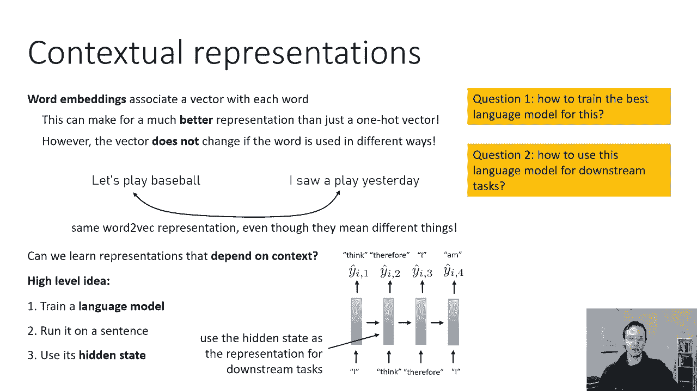
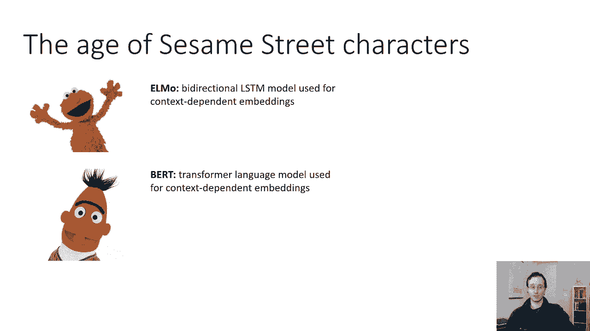
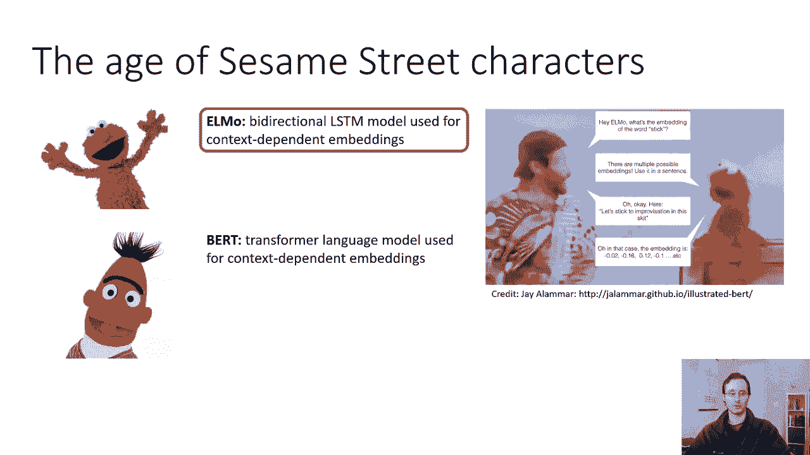
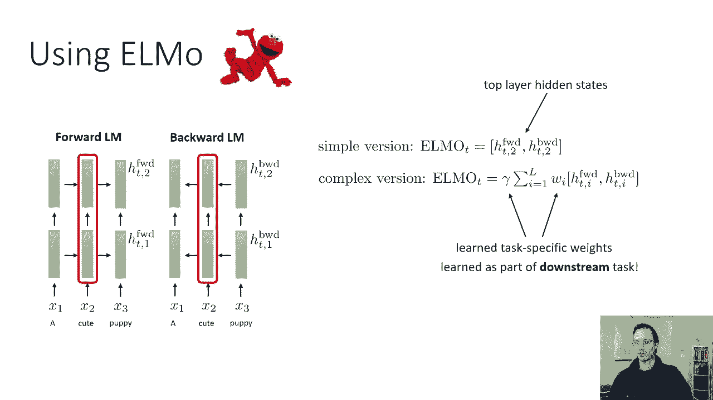
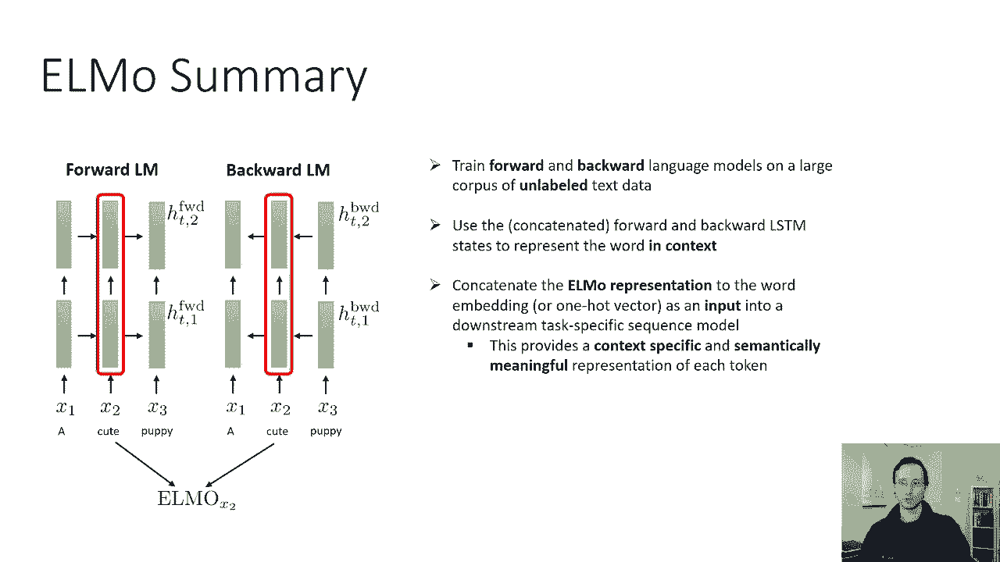
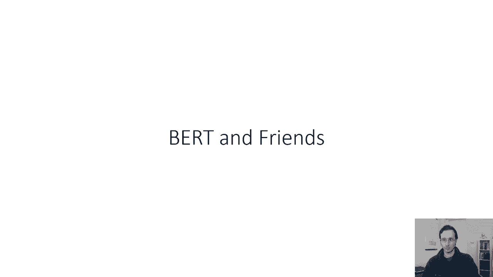

# 【双语字幕】伯克利CS 182《深度学习：深度神经网络设计、可视化与理解》课程(2021) by Sergey Levine - P40：CS 182- Lecture 13- Part 2- NLP - 爱可可-爱生活 - BV1PK4y1U751

下一个，让我们来谈谈预先训练的语言模型，所以这些将位于光谱的另一端，在学习表征方面，在这里，我们的目标是获得上下文表示，参见单词嵌入，将向量与字典中的每个单词关联，这可以比一个热向量更好地表示。

但是如果这个词以不同的方式使用，向量不会改变，所以作为一个例子，你有两句话，我们去打棒球吧，我昨天看了一场比赛，是同一个词，从技术上来说，文字游戏，它有两种截然不同的用法，事实上，在一种情况下。

它是动词，在另一种情况下是名词，但是给这个赋予相同表示的词，尽管这些词有非常非常不同的含义，所以你能学习一种依赖于上下文的表示吗，这里的高级思想将是训练一个语言模型。

所以我们了解到的这些模型中的一个预测了下一个单词，鉴于到目前为止看到的词，然后在特定的句子上运行这个语言模型，就像在句子上，我们去打棒球吧，然后使用该模型的隐藏状态作为表示。

所以这背后的直觉是模型的隐藏状态，在那个时候，步骤应该代表单词在句子中所扮演的角色，特别是，它将是一个足以预测下一个单词的表示，所以呃，它对它也有这种接近性，所以它基本上携带了打破未来单词所需的信息。

就像VEC嵌入这个词一样，但现在这个表示依赖于句子中的其他单词，至少在前面的话上，所以我们必须解决两个问题才能真正实现这一点，问题一如何为此训练最佳的语言模型，问题二如何将这个语言模型用于下游任务。

所以高水平的直觉是幻灯片中描述的，但你如何做到这一点的细节实际上很重要，有几个不同的非常重要的选择要做。

这些选择将由芝麻街的角色做出，所以你们中那些不是呃，来自美国，也许呃，你不熟悉芝麻街，就像孩子们表演的那样，涉及到这些木偶般的角色，他们显然很擅长NLP，所以我们要学习两个芝麻街角色，埃尔莫和伯特。

elmo是双向lstm模型的首字母缩写，然后提供上下文敏感的表示是一个巨大的变形金刚。

不像单词到bec，elmo和bert都可以提供更细致入微的单词表示，这是一篇非常好的文章中的一幅小漫画，描述了伯特和埃尔莫，所以如果你说好的话，你可以说好，这个词的嵌入是什么。

棍子和文字到VEC只会给你一个矢量，但艾尔莫会说好，有多个嵌入，你得把它用在一个句子里，然后你说，好的，不如这样吧，让我们在这个短剧中坚持即兴创作，现在看到那句话，elmo会生成这个词的向量表示。

它在这句话中的使用是特定的，经纪人也会做同样的事情，但是，所以我们先谈谈埃尔莫，但我的目的是说，这些天几乎普遍，用于实际NLP应用的模型将是方差的，在伯克模型上，伯特和朋友们，我想他们有很多朋友。

但是呃，伯特的基本版本，或者大版本的伯特是我们将在这节课中讨论的，伯特的各种朋友本质上是更有效或更大的变体，但基于同样的原则，但首先我们要谈谈埃尔莫，因为Elmo稍微简单一点，友好一点。

并允许我们讨论使用语言模型来获取上下文的基本原理，词在句子中的依赖嵌入。

在做显而易见的事情，埃尔莫是，呃，是一个语言模型，一种RNN语言模型，很像这些LSTM模型，我们以前谈过，它将根据句子中的单词预测下一个单词，但是这种基本方法有一点问题，意思是一个词在句子中的表示。

比如，让我们说可爱这个词，这个句子中的第二个单词只取决于前面的单词，但它不会受到将来的话的影响，你真的不想那样，因为如果你把句子作为输入，你想要一个词的表示，考虑到这个词在整个句子中的使用。

这可能不能从密码中推断出来，记住，对于VEC来说，我们实际上使用了在中心词之前的上下文词和在中心词之后的上下文词，而这里的lstm只使用以前出现的上下文单词，我们有很多方法可以解决这个问题，我们可以。

比如说，使用真正的双向LSTM，就像我之前报道的那个，但Elmo实际上做了一些更简单的事情，我们基本上只训练两个独立的LSTMS，其中之一是未来的语言模型，就像我们讨论过的那个。

另一个是一个向后的语言模型，向后语言模型的工作方式完全相同，所以你可以把它看作是颠倒所有的联系，或者你可以把它看作是颠倒句子，所以你有一个训练正常句子的模型，另一个和另一个模型与它分开。

它是在向后句子上训练的，现在你可能希望如果你把这两个模型的隐藏状态放在一起，它将包含前向信息和向后信息，因此，前向和后向语言模型都被训练为正则语言模型，只要有最大的可能性。

前向模型预测下一个单词给定到目前为止看到的单词，向后模型预测给定的前一个单词，呃，句子的其余部分，我们可以为它们的隐藏状态命名，所以我们会这么说，它们都是多层堆叠的lstms。

时间步长t的正向模型表示在第一层有一个正向模型，在第二层向前两个，向后的第一层有一个向后的，第二层高清向后两个，一起，这些隐藏的状态形成了这个词的表示，从概念上来说，与文字没有太大的不同。

因为这些表征基本上被训练成足以预测附近的单词，但因词而异，因为这些表示现在依赖于句子中的其他单词，前面的要靠前面的话，落后的取决于将来的话，那么我们怎样才能很好地使用Elmo呢，有很多，呃。

ELMO论文中规定的方法，在这种情况下，第二层，并简单地连接当时步骤的前向和后向表示，简单的版本实际上效果很好，他们选择顶层是因为，直觉上，顶层最接近于预测下一个词，对呀，因为你预测了下一个词。

或者前面的单词用线性变换的软最大值，在顶层的顶部有一个SoftMax，所以它包含了你做出预测所需的足够统计数据，但你实际上可以得到一个稍微好一点的表示，如果你把所有层的隐藏状态组合在一起。

现在经典的L模型实际上只有两层，所以也许这有点傻，把第一个和第二个都拿走，但这确实有所不同，他们把它们组合在一起的方式实际上是把它们平均在一起，所以它们仍然向前和向后连接。

然后他们用学习的体重在各层上平均，学习整体体重，在整件事上伽马，他们实际上建议做的是把隐藏的状态，呃，Elmo模型列车在大量数据上的背景和前向隐藏状态，但随后将W和gamma作为下游任务的学习参数。

所以如果你的下游任务是翻译，比如说，下游模型实际上可以通过反向传播来决定，不管是要顶层还是底层，它想给他们施加什么重量，这是一个小细节，我不认为这对理解Elmo有那么重要，所以如果你只是想要高级版本。

想想简单的版本，但为了完整性，我想解释更复杂的版本，因为这实际上是在实践中更常用的。

无论您使用哪种方法，不管是简单的还是复杂的，在一个特定的句子中，你会得到一个单词的elmo表示，所以如果你把这句话用于下游应用，当你在那个词里喂食的时候，您将使用其现有的表示形式。

比如一个单词到VEC表示或一个热门表示，你会把它的Elmo表示连接到它，至关重要的是，你需要把整个句子通过埃尔莫，首先得到那个表示，然后你可以用它，在这张幻灯片上，这只是一个例子。

实际的ELMO纸不在机器翻译上测试，这有一个微妙的原因，它将用于机器翻译，你需要一个英语和法语的语言模型，你可以得到，只是有点烦人，但是Elmo论文确实在许多其他应用上进行了测试，包括问答，文本蕴涵。

语义角色标记，共同参考决议，命名实体提取，和情绪分析，语言模型有助于解决所有这些问题，事实上，语言模型帮助完成大量的nlp任务，基本上任何涉及理解自然语言的事情，有可能在一个巨大的。

未标记的数据语料库将有助于，特别是如果下游监督任务的训练数据有限，所以埃尔莫的总结，你训练，前向语言模型，和一个在大型未标记文本数据语料库上的向后语言模型，越大越好，前向和后向模型是相互独立训练的。

您使用向前和向后串联的，LSTM声明在该句子中其他单词的上下文中表示该单词，然后将Elmo表示串联到单词嵌入，或者一个热向量作为下游任务的输入，特定序列模型。

这提供了每个令牌的上下文特定和语义上有意义的表示，这似乎比VEC的工作要麻烦得多，因为现在您需要实际存储整个语言模型，并在测试时运行它以获得这些嵌入，但效果真的很好。

与上下文无关的单词到VEC的表示相比，这很有帮助。

但更有效的是其他芝麻街角色。

