# 【双语字幕】伯克利CS 182《深度学习：深度神经网络设计、可视化与理解》课程(2021) by Sergey Levine - P41：CS 182- Lecture 13- Part 3- NLP - 爱可可-爱生活 - BV1PK4y1U751

在今天讲座的最后一部分，我们要谈谈伯特，伯特是当今最常用的语言模型，nlp任务，尽管人们经常会使用更大的bert变体。

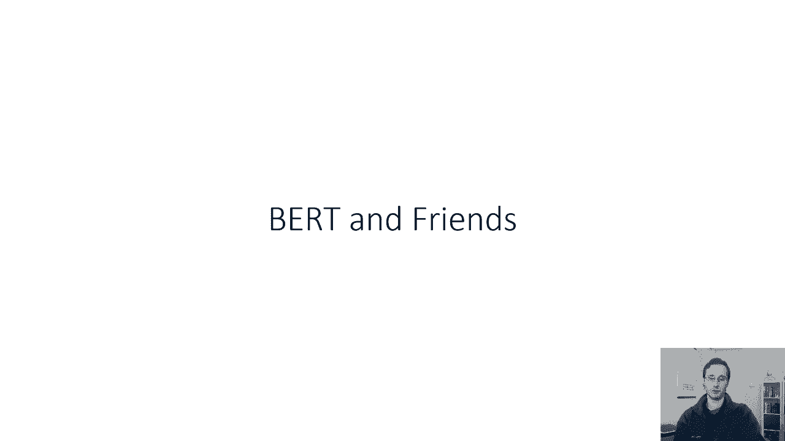

更强大，或者实际上更有效率和更便宜，所以让我们来谈谈伯特·伯特基本上处于一个非常高的水平，使用与ELMO相同的原理，但是不是使用两个LSTM模型，它使用一个变压器模型。

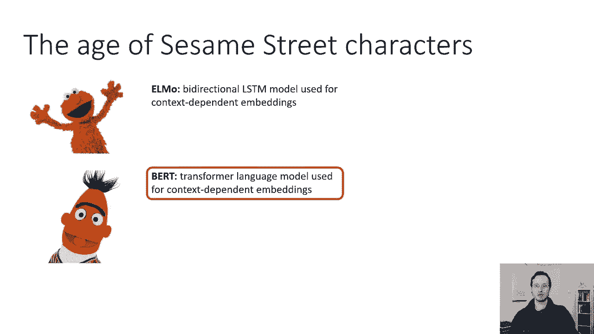

所以说，如果我们想，只是天真地用变压器代替以前的LSTM，你知道我们可以说好，好的，LSTM以前是作为语言模型训练的，这意味着你预测下一个将要出现的单词，所以现在你可以把一个变压器训练成一个语言模型。

在我们看到变压器被用作序列到序列模型之前，但请记住，在一个序列到一个序列的模型中，编码器按顺序读取，解码器本质上是一个条件语言模型，所以经典变压器的解码器已经是一个条件语言模型。

所以我们要做的就是得到一个无条件的语言模型，只要用同样的解码器，但去掉条件作用的条件，嗯，是交叉注意力，所以如果我们去掉常规变压器解码器上的交叉注意，这现在是一个基本的语言模型。

所以我们把句子中的所有标记和它们的位置编码，我们通过蒙面的自我关注来传递他们，在解码器里，我们掩盖了自我关注，这就防止了未来的代币影响过去，然后嗯，然后我们有一个位置非线性，这是一个重复N次的块。

我们不再有交叉注意力了，所以我们需要大众的关注，因为我们把转换的解码器部分，然后我们有一个位置y softmax来预测下一个单词，所以这将是最直接和明显的方法来带走埃尔莫，用变压器代替LSTM。

只要用普通变压器的解码部分，现在这个模型有一个方向，就像LSTM向前跑一样，这个模型向前运行是因为掩盖的自我关注，埃尔莫是双向的，这个东西不是，虽然如果你想，你可以像埃尔莫一样，你可以训练两个变压器。

一个前进一个后退，原则上，这将是最直接的模拟，就像变压器元件一样，但是有没有更好的方法来做到这一点，所以我们可以做变压器元件，我们可以有一个正向变压器和一个反向变压器。

但我们能不能简单地摘下面具和自我关注，有一个变形金刚的自我注意力已经携带了向前和向后的信息，所以看起来如果我们摘下面具，我们会得到一个双向模型，而不必经历训练两个不同模型的麻烦，这能行吗？

这可能会出什么问题，所以花点时间想想这个，如果要训练一个语言模型，因此，语言模型将句子中的标记作为输入，它在每个时间步长的输出是下一个令牌，所以这意味着完整的输出序列只是移位1的输入序列。

所以如果我们这样做，我们摘下面具和自我关注，所以我们有充分的自我关注，就像变压器的编码器一样，会出什么问题。

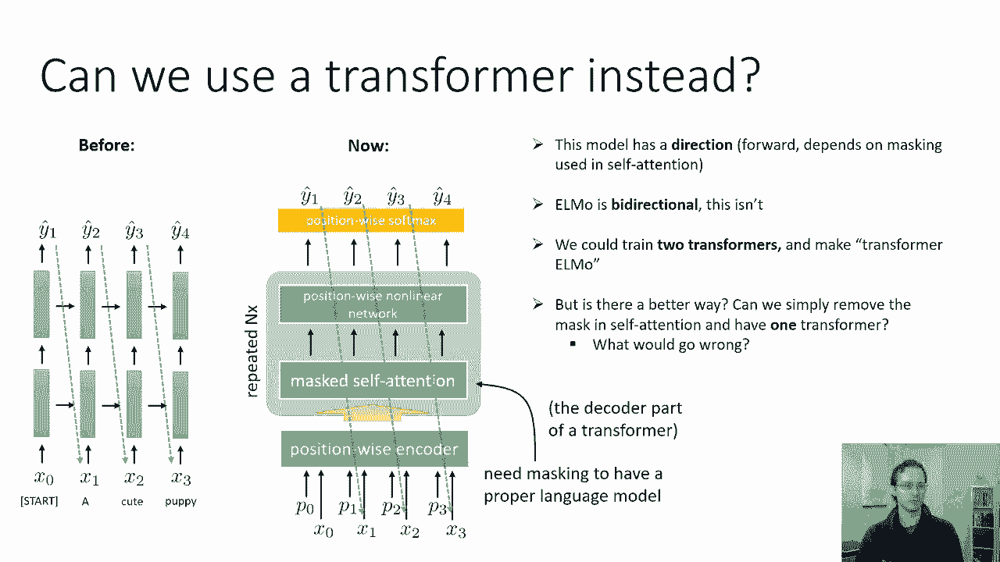

为什么这不能成为一个好的语言模型，如果我们要这么做，如果我们去掉自我的伪装，注意的是，第一步的输出实际上与当时的输入相同，第二步，所以这意味着这里的变压器不必做很多工作。

它所要做的就是学会查找下一个单词，复制它并输出，而不理解它的含义，就像你知道，如果我用外语给你一个句子，他们不识字，我让你对它进行一些改造，如果这种转变只是把一切都改变一个词。

你可以用一个词来改变所有的东西，而根本没有真正理解这个句子，除了最后一个字，你必须弄清楚的最后一个词，但如果你有很长的句子，最后一个词的作用微乎其微。

消除自我注意力的遮蔽不是一个好主意因为任务变得太容易了，变压器学习如何移动东西太微不足道了，不知道它们的意思，得到正确答案是很容易的，因为自我注意力可以在T时间获得正确的答案，从时间t的输入，加一个。

伯特所做的是稍微修改训练程序以避免这个问题，好的，所以我们甚至不会把移动的事情做对，所以第一步时的输出实际上与当时的输入完全相同，第一步，但我们将对输入进行一点修改，使变压器的任务变得更加困难。

我们要做的是，我们将随机屏蔽输入令牌，所以对于输入中的每一个令牌，有15%的概率，我们将用一些没有意义的特殊令牌代替那个令牌，我们就叫它面具令牌吧，所以所有的质量令牌都是相同的，你知道的。

也许它们只是有一个零零零的向量，对于输入中的每一个令牌，以15%的概率，它被掩码令牌所取代，但输出保持不变，它本质上迫使变压器解决什么样的填空任务，所以在上面没有必要再转移了，没有掩蔽。

所以这个转换需要解决的问题的一个例子，它得到一个输入，我面具，所以我面具，它必须预测哪些单词进入这些插槽，正确的输出是，我觉得，所以我是，直觉是，如果变压器能解决这个问题，如果它能学会填上蒙面的话。

它必须真正了解单词的含义，这种直觉与文字的直觉大同小异，如果你能从上下文中预测一个词，然后你就可以学到一些关于意义的东西，当然，这里就像埃尔莫一样，这个词是特定于那个句子的。

所以主要的想法是需要预测缺失的单词，迫使模型努力学习一个好的表示，不需要蒙面的自我关注，所以这是一个双向模型，但它不需要训练两个独立的模型，所以这使得它是按方向。

另一种思考伯特的方式是伯特本质上是编码器，变压器的一部分，15%的输入被掩码取代，并且损失了预测未屏蔽的输入。

所以我在上一张幻灯片上使用变压器的天真方法是。

基本上解码器，变压器的一部分，而这里我们有编码器，变压器的一部分，所以没有没有掩蔽，只是有规律的自我关注。

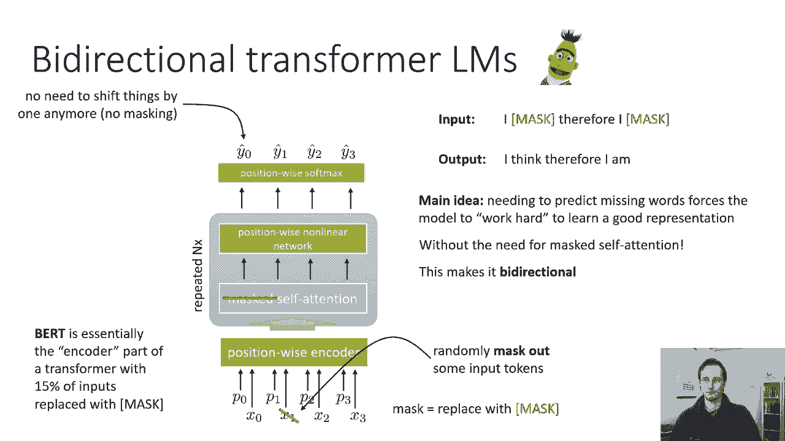

现在真正训练伯特，需要做一些小的改变，事实证明，这让事情变得更好，所以我们有我们的掩码语言模型，我之前描述过，所以在这里你重建每个时间步骤的所有令牌，但输入不包含，并不总是包含完整的令牌。

它们有时会被面具取代，所以你基本上必须预测实际的令牌来代替掩码，依赖词级表示，但我们也，呃，在成对句子上训练伯特，所以我们有大量的文本语料库，你知道维基百科或报纸上的一堆短信什么的，我们取成对的句子。

我们总是用两个句子钉在一起来训练它，第一句以CLS令牌开始，为什么两句话，嗯，这是因为我们想要解决的许多任务都涉及成对的句子，问答，段落和摘要，机器翻译又用英语和法语，但这其实不是一个很好的选择。

所以这就是为什么我们想要两个句子，我们要用这两句话做的是，你知道我们要在他们身上训练，但我们在第一个令牌处也会有一个特殊的输出，所以第一个输入是CLS令牌，输出，会做出预测，我马上告诉你预测是什么。

但首先让我告诉你输入句子是如何转换的，所以对于每一对输入句子，我们将随机用掩码替换15%的代币，它是为每个令牌独立完成的，它也会随机交换两个句子的顺序，所以如果在如果在真实的文本句子中。

呃A跟在B句后面，一半的时间实际上会在b a中进食，一半的时间会吃B，然后第一个输出，第一个令牌的输出实际上是一个二进制分类器，我们将被训练预测第一句话是否紧随第二句话，反之亦然，所以有点。

这是一个特殊的职位，所有其他职位，我们将预测这个词，呃那个位置应该是什么词，但是对于第一个位置，它将是这个二进制分类器来预测真假，取决于A跟在B后面还是反之亦然，我们为什么这么做的直觉是因为。

我们希望第一个位置表示句子级别的表示，因此，对于需要令牌级别表示的任务，我们将使用每个位置的特征，但对于需要句子级别表示的任务，我们实际上是用这个第一个位置，所以基本上鸟在做两份工作，小鸟很努力。

伯特必须以某种语义上有意义的方式来表示单词，它还必须以某种语义上有意义的方式来表示句子，由于必须解决这个排列问题。

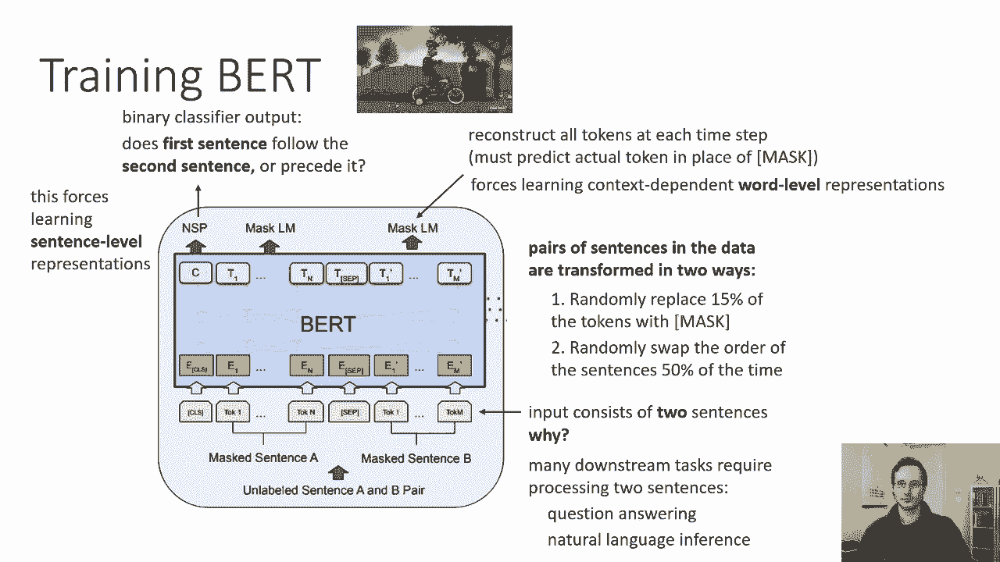

所以这实际上为我们提供了使用bert的不同方法，我们可以使用伯特的方法之一是如果你的任务是分类任务，你可以简单地拿第一个位置，把，您将其替换为所需的分类器，所以你在一个大的未标记文本语料库上训练伯特。

成为一个好的语言模型和好的句子顺序预测器，然后你拿那个模型在第一个位置上加上新的损失，这是您想解决的任何问题的分类损失，相似蕴涵分类，语义等价物，语义对等是指语义对等，给定两个句子是一样的。

它们的意思是一样的，情感分类等，所以如果这些问题是你用一个或两个句子作为输入，并且生成一个类标签作为输出，然后你可以用第一个位置，所以你只在第一个输出上加上交叉熵损失。

然后在这个新任务中从头到尾微调整个模型，所以微调只是意味着在新的任务上训练它更多，所以如果你的问题是文本分类问题，相似蕴涵分类，语义对等，情感分类，等训练伯特通常作为语言模型。

这是一个a b b a预测器，然后取得到的模型，消除所有其他损失，不再丢失语言模型，然后继续在你的任务中训练整件事。

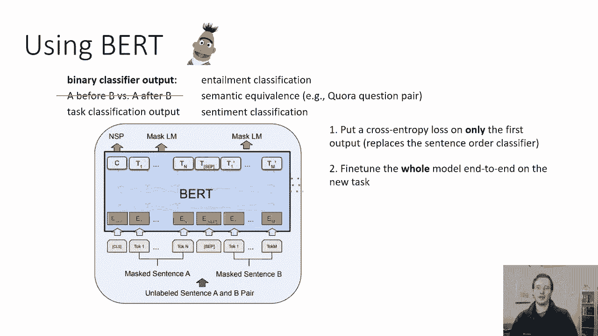

所以无论你有一个句子对分类任务还是一个句子分类任务，像这样的任务有很多，这就是你会做的，这些是分类任务，现在，您还可以将bert用于需要每个位置输出某些内容的任务，例如，问答任务组版本。

有一点需要突出段落的哪一部分包含答案，所以你在一个问题中读到它，然后你读到一段，在输出端，你应该说出那个问题的答案在段落的什么地方，然后将开始和结束作为输出标记输出，你这样做的方式完全相同的方式分类。

只要用你想要的损失代替那些头寸的损失，然后对整个事情进行微调，基本上继续训练整件事，单句标记，所以这里是一个命名实体识别，目标是为了每一个令牌，输出该令牌的类，它对应于哪种类型的实体，就像一个人的名字。

地点或其他类别，所以它本质上是每个位置的标签，同样的交易，只需将语言模型的损失替换为您在每个位置上想要的损失。

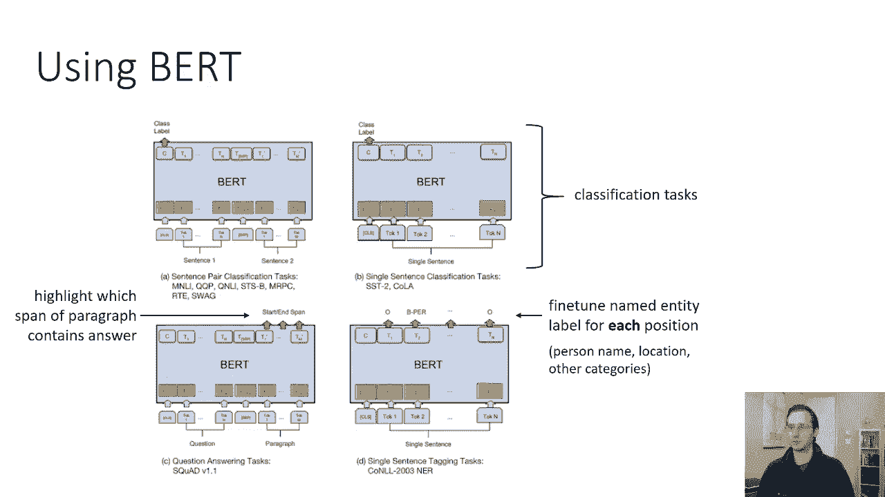

然后对整个事情进行微调，现在你也可以像使用埃尔莫一样使用伯特，所以你可以从伯特那里提取特征，你这样做的方式是，你只需从变压器中取出每个位置的隐藏状态，现在伯特是一个非常大的变压器模型。

实际上有十二个这样的块，所以使用哪一层是一个复杂的问题，就像一个L，就像一个简单的埃尔莫，或者你可以构造一个线性组合，基本上是所有层的加权和，人们实际上已经尝试了各种组合，这些组合中的许多都工作得很好。

所以这里有命名的实体识别任务，在右手边你有一个F 1分，这本质上是模型的表现，使用表示越高越好，你可以看到如果你用第一层，那不是很好，如果你用最后一层，那就好多了，如果你把所有的层相加，那就好一点了。

但是如果你出于某种原因使用倒数第二层，那实际上更好，如果你问你是否把最后四个隐藏层相加，那就更好了，但是如果你把最后四个隐藏的层连接起来，这实际上给出了最好的结果，那么这口井的教训是什么呢？

可能的教训是，连接网络的上层似乎产生了良好的表示，但总的来说，这些信托中的许多是。

现在你是否使用一只微调的鸟，或者你是否从中提取表示，从这部分课程中吸取的重要教训之一，通常鸟类工作得很好，所以在这里你可以看到许多不同的任务从胶水基准，所以这是一个基准。

它展示了一系列不同的自然语言理解任务，我相信所有这些实际上都是分类任务，但我不能完全肯定，你可以在这里看到的是两个伯特模型，伯特·巴斯和伯特·拉格表演得非常非常好，所以在第二排你可以看到埃尔莫在第三排。

GPT基本上是一个前向语言模型，用变压器，伯特在所有这些方面都做得更好，所以伯特底座有十二层，大伯特有两个四层，当我说层，我真的是说整个街区，自注意与位置非线性网络，所以在所有这些任务中。

这些都是非常大的改进，从那以后就没有结束，bert几乎应用于每一个nlp任务，你可以想象，并经常在性能上产生巨大的差异，所以前，在大型文本语料库上训练这个双向转换器，当您从Bird微调时。

对下游任务的性能有很大的影响，甚至当你只是使用其中的表示时。

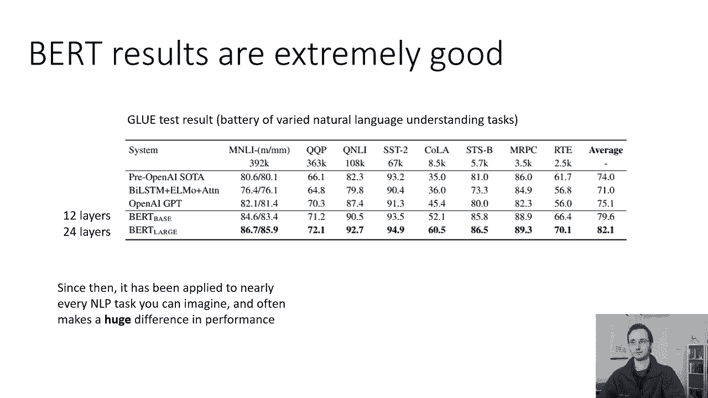

好的，现在，呃，只是作为旁白，我想提到的是，人们成功地使用了呃，变正向型变压器模型，所以这基本上就像解码器，一个方向前进，变压器模型--它们可以作为很好的语言模型，它们可以用来获得好的功能。

虽然不如伯特，但他们确实有一个很大的优势，你能猜到那个优势是什么吗，所以正向模型而不是像伯特这样的双向模型的最大优势，和伯特在一起是不可能的，因为伯特学会了填补空白。

它不会学会一次生成一个令牌来完成整个句子，但是一个向前的大规模拘留模型实际上也可以产生，所以伯特对一代人来说不是很好，但是像GPT这样的正向模型，gpt，顺便说一句，它基本上只是变压器的解码器。

没有交叉注意，有更多的层，所以这没什么新鲜事，就好像它就是变形金刚，但没有编码器，也没有交叉注意，所以这类正向变换模型的经典例子是GBT，gpt 2和gpt 3，他们什么都不做，特别新颖。

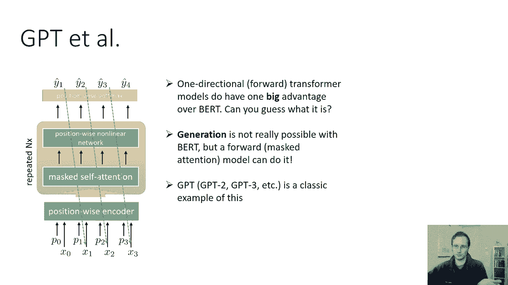

他们只是，它们只是有更多的层，基本上，但它们实际上可以生成非常好的文本，所以这是一个例子，我，我在几节课前展示了为完成提示而生成的文本，因此输入被提供给模型，然后要求模型输出下一个令牌，输入是。

你知道的，一个人旋转的东西，他们在一个令人震惊的发现中写道，科学家发现一群独角兽生活在一个以前未被探索过的偏远山谷里，在安第斯山脉，更令研究人员惊讶的是独角兽能说一口流利的英语，那是一个人写的。

但模型是输出其余的单词，所以模型然后输出，科学家们给这个种群命名，在他们独特的角奥维德的独角兽之后，这四只有角的银白色独角兽以前不为科学所知，现在在将近两个世纪后，引发这一奇怪现象的谜团终于解开了。

所以这些话是模型产生的，有趣的是，我们不会指望，像RNN或LSTM模型，它表现出长期的结构，所以它发现，例如，一所合适的大学将是拉巴斯大学，可能是因为它看着，呃，输入右的短语安第斯山脉。

所以有一些长期的联系，变压器使这变得非常容易，因为自我注意机制，我可以很容易地看到前面的单词，就像你可以很容易地看到后面的单词一样。

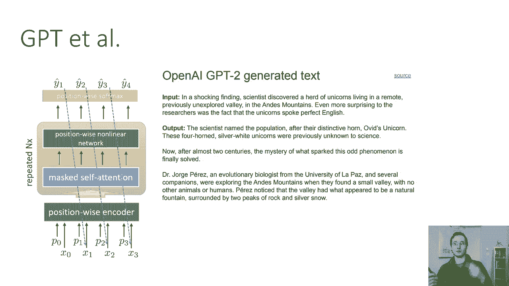

所以我讨论的语言模型的总结，bert是双向变压器，所以伯特的训练方式与其他语言模型不同，它实际上是用大量的代币训练的，然后必须填补这些空白，其他的都是更传统的语言模型，它们被训练来预测下一个令牌。

给定前面的令牌，所以GBT是一个单向变压器，埃尔莫只是训练两个完全不同的模型，一个预测向前，一个预测向后，伯克，产生了非常棒的表示，对广泛的，nlp任务，但它可以生成文本，GBT可以生成文本。

但据我所知，它的表现，对于下游任务来说不太好，埃尔莫创作的作品，它通常在很大程度上被伯特取代，我们在这节课中讨论它的主要原因是，只是因为它为使用pre的概念提供了一个更好的介绍，NLP中训练的语言模型。

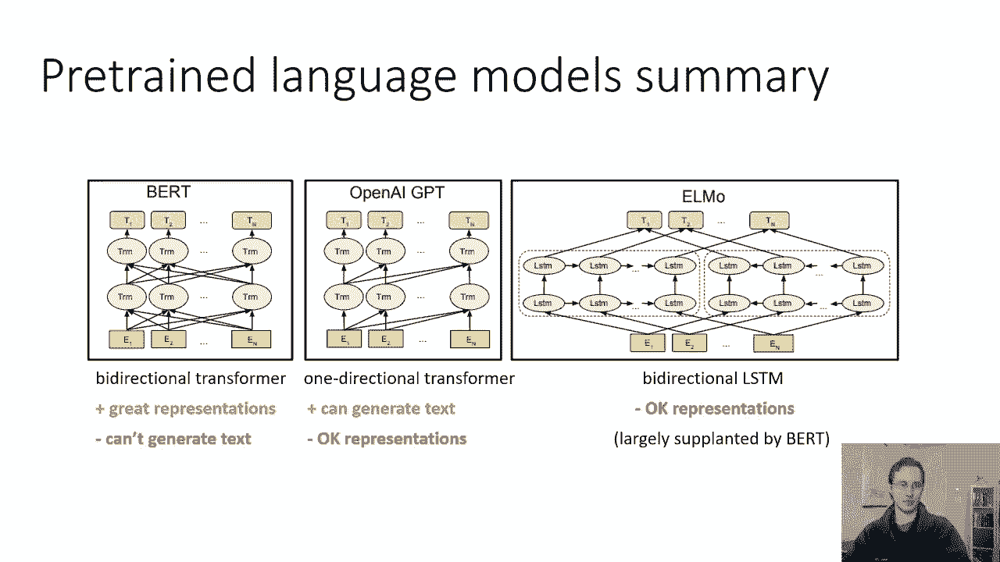

所以外卖，呃，我想告诉你们的是，语言模型可以在很大的范围内训练，和未标记的文本数据集，就像所有维基百科一样，往往是成百上千万的句子，这些模型中的内部学习表示依赖于上下文，一个词的意思由整个句子决定。

他们甚至可以给我们整个句子的表示，就像bert的第一个输出令牌，它们可以用来提取表示，替换标准单词嵌入，或者直接微调下游任务，这意味着我们修改了整个语言模型中的所有权重。

而不仅仅是使用预先训练的模型隐藏状态，这些东西对现代NLP非常重要，因为它们工作得非常好，所以机会是，如果你想在LP任务中获得最先进的结果，您可能会使用语言模型来获得您的初始表示。

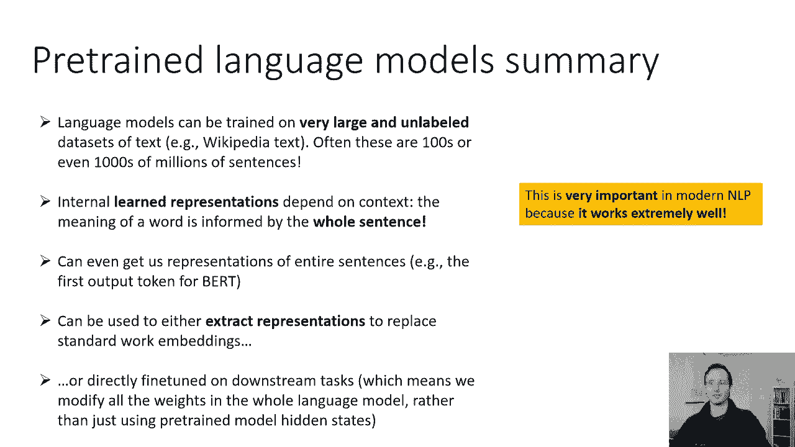