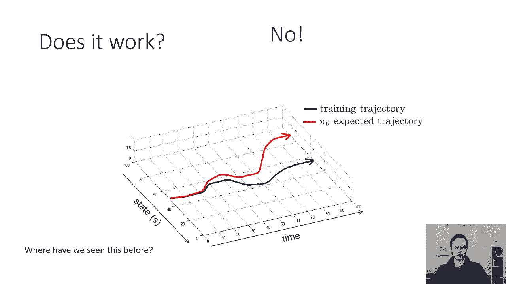
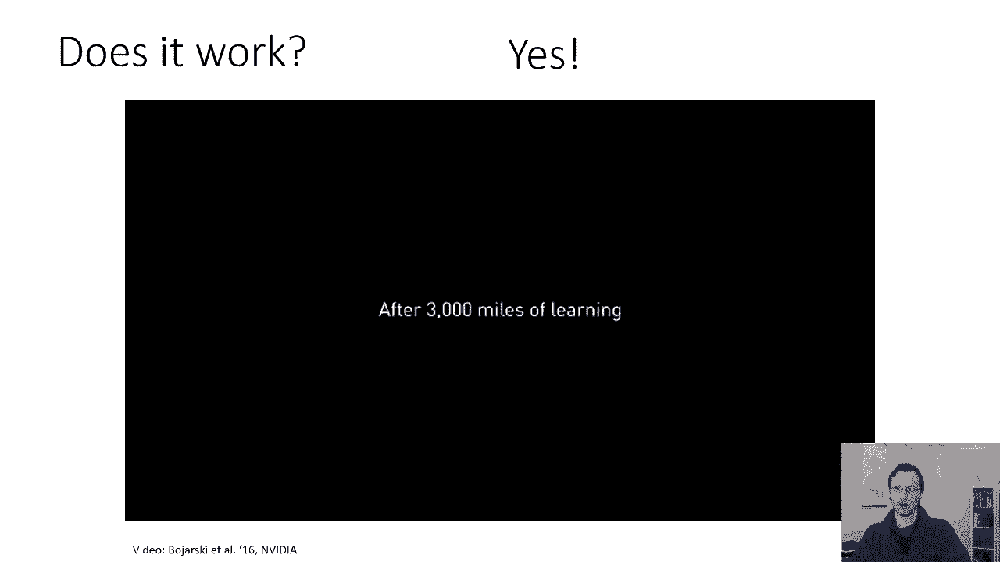
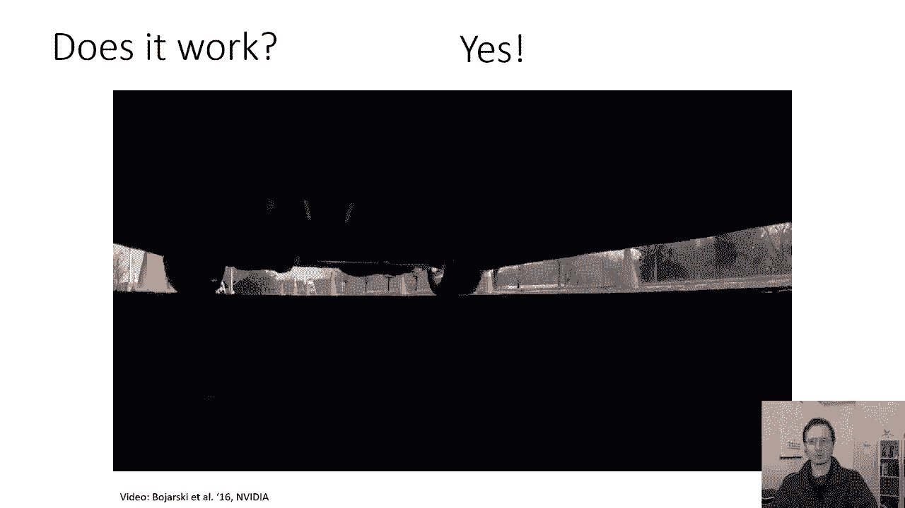
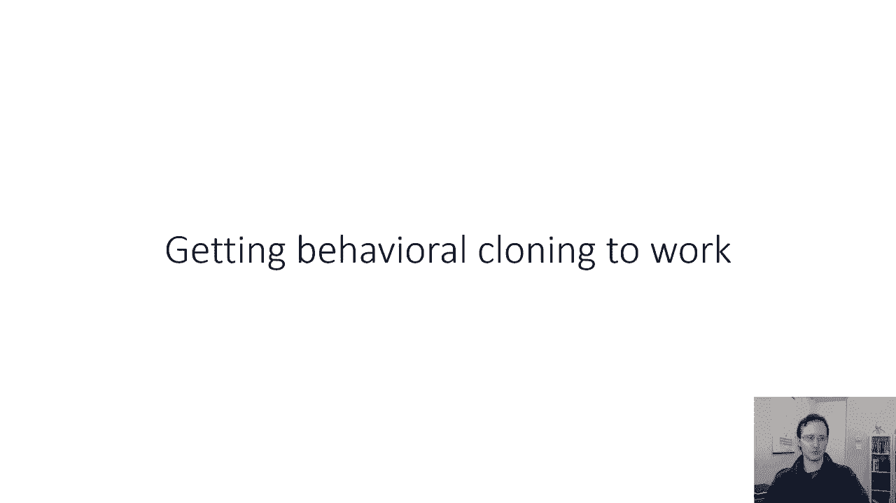

# 【双语字幕】伯克利CS 182《深度学习：深度神经网络设计、可视化与理解》课程(2021) by Sergey Levine - P42：CS 182- Lecture 14- Part 1- Imitation Learning - 爱可可-爱生活 - BV1PK4y1U751

欢迎来到今天的课程一八十二的第十四课，我们将开始一个以学习为基础的控制的三堂课单元，它将涵盖强化学习和模仿学习，到目前为止，我们学到的所有深度学习方法都集中在学习预测。

这可能意味着从图片中预测图像中物体的类别，预测将一段文本翻译成不同的语言，甚至可以根据语音来预测单词，这些本质上都是预测问题，然而，当我们在现实世界中部署机器学习系统时，我们经常有兴趣用它们来做决定。

当我们进入决策领域时，我们真的在处理控制问题，其中一些控制问题是，你知道的，我们可能会直觉地想到的，比如控制机器人或自动驾驶汽车，其中一些更微妙，比如，比如说，为大型电子商务公司做决策的机器学习系统。

如何储存仓库，当我们从解决预测问题开始时，会出现许多挑战，解决控制问题，所以说，比如说，在预测中，我们几乎总是假设我们的数据是独立和同分布的，我们在课程一开始就讨论了这个假设。

当我们谈到公式化损失函数时，IID假设，独立人士，同分布假设，声明数据集中的数据点按照相同的分布分布，在这种情况下，对于每个数据点，x的p乘以y的p，每个数据点进一步独立于其他数据点。

这意味着为数据点1输出的标签，不会影响数据点2的图像，所以如果你把第一只豹子错误地归类为老虎，这并不意味着第二张图片现在会以任何方式改变，这似乎是对我们预测问题的一个明显的陈述，但在控制中。

情况并非如此，所以在控制中，比如说，如果你在多风的山路上开车，也许在这里做出错误的选择也许是可以的，因为你还有时间恢复，但如果你在这里做了错误的选择，就会酿成大祸，此外。

你在第一个职位上所做的选择可能会把你引向第二个职位，如果你犯了一个错误，但如果你不犯错误，它可能会把你引向其他地方，您的输入不是相互独立的，第一步的输出会影响第二步的输入，这很重要，因为，呃。

预测中的iid假设允许我们专注于获得最高的，整个数据集的平均精度，而非，我们控制的iID设置意味着我们必须考虑不同的目标，我们在解决预测问题时通常会做的另一个假设，我们知道地面真相标签，例如。

我们可能会得到一张照片，那张照片被贴上了小狗的标签，我们模型的任务是学习预测标签，小狗在控制中，我们可能会被赋予更抽象的目标，比如说，我们的学习系统可能会被告知，开车去杂货店。

但是开车去杂货店不是系统应该输出的，它不应该输出短语，开车去杂货店，它应该输出汽车的转向命令，这实际上会导致它开车去杂货店，所以你可以说好，建议的是，您的方法需要弄清楚这一点，所以你的目标更抽象。

所以总而言之，具有IDID分布式数据的预测问题，其中每个数据点都是独立的，控制问题，每个决策都可以改变未来的输入，它们在预测方面不是独立的，我们有地面，真相监督和控制监督可能是高水平的。

以预测中的高水平目标的形式，目标是在控制中预测正确的标签，目标是完成任务，在下一节课和接下来的两节课中，我们将建立一个解决所有这些问题的强化学习系统，但现在我们要一个一个地对付他们，所以在今天的课程中。

我们想谈谈高水平的目标，我们会假设我们有地面真相监督，只专注于决策，但稍后我们会放松这些假设，我只想说这些问题不是，它们不只是以我们传统上认为的控制的方式出现，就像开车一样，在许多情况下。

ml系统的实际部署也有同样的反馈问题，即使这些系统实际上是为图像输出标签，例如，你可以想象训练一个模型来预测交通拥堵，所以它收集了一些关于汽车行驶位置的信息并预测，交通会不会拥堵，呃。

在接下来的一个小时内，但是你用谷歌地图之类的东西来部署这个模型，让人们真正用它开车，这会影响他们的驾驶模式，所以现在你的系统的决定实际上影响了我们接下来看到的，现在你实际上是在控制设置中。

而不是在预测设置中，你可能，进一步认为，这个系统的目标可能不再是做出准确的交通预测，但实际上可能是故意影响交通，以减少拥堵，提高人们到达目的地的速度，这么多现实世界的部署。

甚至预测系统的部署实际上都是控制设置，所以即使你不关心机器人或自动驾驶汽车，我想这些讲座实际上会很有用，因为当我们在现实世界中部署预测系统时，我们面临着许多相同的问题，遇到这种反馈，好的。

所以让我们深入探讨一下讲座的技术内容，我将从一些术语开始，让我们从一个我们都希望熟悉的图像模型开始，分类器，接收图像并输出类的修道院，我会逐渐把它变成一个控制的模型，所以我要做的第一件事是。

我将重命名事物，而不是调用输入，x，我要把它叫做O O来观察，为什么我叫它O而不是X，当我们谈论控制时，我们会有更多的变量浮动，所以使用更清晰的术语是有帮助的，所以我把图像称为O。

我将调用输出a进行操作，它以前叫Y，但现在我们称之为，我将把我的模型叫做给定o的πθ，它过去被称为y的pθ给定x，我为什么叫它圆周率井，因为这是政策，策略表示观察o映射到操作a的方式。

我想政策这个词是以圆周率开头的，好吧有道理，至少如果你说希腊语，而且，我们要在a和o上加一个下标，我们要在上面加上下标，强调它们发生在特定的时间点，所以在第一步，你观察一个，你根据圆周率选择一个动作。

给某人的，这个动作会影响到两个人，所以如果你在第一步没有正确识别老虎，然后第二步，也许你有一个老虎的形象，离你很近，也许你的行为不是阶级标签，但它们是实际的事情，你可能会这样做，你知道吗。

也许当你看到老虎的时候，有一个正确的反应，如果你没有正确的反应，下一个观察对你就不那么有利了，你的动作也可以是连续的，就像你看到老虎就知道该跑哪条路一样，在这种情况下。

也许你可以输出正态分布动作的均值和方差，所以OT代表对时间的观察，t a t表示给定ot时的动作t piθa t是策略，现在政策只是一个模型，它可能是一个大陆，就像我们之前的内容一样，所以到目前为止。

我们实际上还没有改变任何关于学习的事情，我们刚刚重新命名了这些东西，但现在我们将开始介绍一些新的东西，我们要介绍的是一种状态，我将把这个州称为圣，有时我们的政策将取决于观察，有时这取决于状态。

我们称之为完全观察，让我们把这个打开一点，什么是状态，什么是观察，如果你看到猎豹追逐瞪羚的照片，图片包含像素，你的观察是，但潜在的是，有一些真正的物理系统，真实的物理系统有某种状态，猎豹有一个位置。

瞪羚的位置，他们有动力，他们有他们的身体姿势等等，所以有一些潜在的变量，也许你不知道，你没有得到这些变量，但它们实际上描述了世界的结构，这就是状态，所以国家，这可能是猎豹和瞪羚的位置和速度。

这就是状态和观察之间的区别，这种区别可能非常重要，比如说，如果有辆车开在猎豹前面，你再也看不到猎豹了，观察改变了，观察不再包含sheh，但猎豹之州还在，猎豹仍然存在。

下面是我们如何使它在数学上更正式一点，但顺便说一句，这种区别在以后会非常重要，对于今天我们谈论的方法，我们来谈谈模仿学习的方法，其实没那么重要，但我现在想描述一下，因为以后会很重要，所以从数学上来说。

状态和观察相互作用的方式，可以通过贝叶斯网可视化，你们中的许多人可能在CS One中学到了贝叶斯网，88贝叶斯网基本上描述了变量之间的关系，特别是它们的条件独立性，如果你，如果你没看过贝叶斯网，别担心。

我会解释的，因此状态和观察按以下方式区分，一个状态满足所谓的马尔可夫性质，这意味着状态的三个有条件地独立于状态，It’只有一个，如果你知道，It’两点，这是另一种说法，即在特定时间的状态。

总结您需要了解的关于系统的一切，所以如果你知道当前的状态，知道以前的状态不会帮助你预测未来的状态，状态完整，它包含了你需要知道的一切，这是有道理的，对呀，因为如果你知道猎豹和瞪羚的位置和它们的速度。

然后你就可以预测它下一个会在哪里，如果你不知道猎豹的位置，那么了解以前的位置可能会有所帮助，可能会给你更多的信息，或者如果你不知道猎豹目前的速度，知道它之前的位置和现在的位置可能会帮助你猜测速度。

所以只是位置不会是马尔科夫式的，但如果你在这种情况下有速度的位置，也许是观察，不服从马尔可夫性质，这意味着如果我知道当前的观察，也知道以前的观察可能会帮助我预测未来，例如，如果你让那辆车开在猎豹前面。

你目前的观察可能不足以弄清楚猎豹在哪里，但你之前的观察可能会给你更多的信息，所以状态总结了你需要知道的一切，如果您有当前状态，您不需要以前的状态，观察现在总体上没有，理想情况下。

我们希望有基于观察的政策，基于相机图像等，这就是我们今天要做的，但稍后我们将讨论一些非常，在大多数方面都很好的算法，但这实际上需要你有一个状态而不是观察，当这种情况发生时，我告诉你，但在今天的讲座中。

所有的方法都将被描述为完全适合观察，他们不需要知道状态，然而，状态和观察之间的区别通常是控制强化学习中的一个非常基本的概念，好的，记谱法的一点旁白，所以你知道，在这门课上。

我们可能有许多来自不同学术背景的人，你们中的一些人可能以前见过状态和动作，比如说，如果你在CS 188中学到了强化学习，一些东西可能来自更多的控制背景，所以状态和动作的术语，符号是na。

理查德·贝尔曼在20世纪50年代真正普及了，但您可能也看到过一个符号，其中x用于表示状态，并用于表示动作，它们的意思完全一样，所以s是英语中state这个词的第一个字母，A是行动的第一个词。

x是代数中通常用来表示未知数的字母，u是俄语中表示控制的第一个词，所以x和u符号在控件文献中更常用，的，s，符号在强化中更常用，学习与动态编程文献，但它们的意思完全一样，所以有了这一点，模仿。

这是我们将要讨论的第一种基于学习的控制方法，而且非常，非常简单，很简单，呃，以其最基本的形式，它对应于使用我们已经学过的监督学习工具，像大陆这样的东西来解决控制问题，作为我们的运行示例，自从逃离老虎。

不是我们日常生活中必须做的事情，我们要用一个不同的任务，驾驶汽车的任务，所以你的观察将由汽车摄像头的图像组成，你的行动将包括你是向左转还是向右转，我们将考虑一个非常简单的案例。

在那里我们实际上得到了地面真相监督的数据，我们以后会讨论我们没有基本真相监督的情况，但就目前而言，让我们假设，那个乐于助人的人类司机花了很多时间开车，并收集由他们车辆相机的观察结果组成的数据集。

以及他们发布的实际驾驶命令，他们是如何转动方向盘的，然后我们将使用这些训练数据来训练一个修道院，它在图像中读取，执行情况和产出，就像我们训练大陆一样，物体和图像的类别，完全相同的想法。

这有时被称为行为克隆的基本配方非常，非常简单，什么不简单，就是理解这种方法何时以及如何实际用于解决控制问题，所以我们首先要问的是它在理论上有效吗，理论上，答案是明确的，否，这就是为什么，假设这个，呃。

我要介绍，首先是直观的解释，但接下来我会谈谈更多的数学和统计原因，为什么答案是否定的，假设这条黑色曲线代表了一条穿越时间的轨迹，出现在您的培训数据中，所以在这个例子中，只是为了可视化的目的。

你可以想象你的状态是一维的，只是个数字，曲线表示状态随时间的变化，所以你可以把它看作是一个图表，假设你的动作是状态下的小位移，所以基本上下一个状态只是前一个状态，加上动作，在现实中，当然你会有很多轨迹。

不仅仅是一个，在现实中，你可能有成千上万甚至数百万，但假设你训练了你的策略，你训练得非常非常好，从状态预测动作，现在即使是一个非常好的政策也会犯一些错误，它们可能是非常小的错误，但它会犯一些小错误。

所以也许当你运行你的策略时，它所走的轨迹，偏离训练数据中看到的轨迹一点点，当它稍微偏离一点的时候，然后馈入策略的状态，下一次，步骤将与它习惯看到的状态有点不同，对呀，因为它犯了一个错误。

它得到了一些不典型的东西，你习惯了呆在左边的车道上，也许你习惯在英国开车，你犯了一个小错误，你稍微转向了错误的车道，现在，当你看到的东西和你以前看到的东西有点不同，只是更有可能。

你会犯一个稍微大一点的错误，当这种情况发生时，你看到的下一个状态，会比你以前见过的其他州有一点不同，你犯了一个稍微大一点的错误，这些错误实际上会加剧，理论上，它们实际上会在你的轨迹长度上成倍增加。

所以这是非常，非常糟糕，我们在哪里见过这种复合问题，在我们回到这个问题之前，参见此复合错误问题，当你犯错时，这个问题，你看到的东西与你在训练中看到的任何东西都不同。

我们实际上在之前的一次演讲中看到了这个问题，在一个非常不同的背景下，所以花点时间想想，猜一下我们在哪里看到的，然后在讲座的后续部分，我去讲课，重温一下，你可以检查你猜对了没有。

但现在让我们谈谈一些实际问题，所以理论说不，这真是个坏消息，因为这是一个非常简单的食谱，如果它起作用了就真的很好了，如果我们无视理论呢。

如果我们只是尝试一下，事实证明，如果我们无论如何都要尝试一下，它真的可以工作，你知道的，这是一段来自英伟达研究公司2016年的视频，用模仿学习开车，它做了一些非常糟糕的事情，就像你知道它有点偏离了道路。

所以你可能会说，哦好吧，也许这不起作用，但他们收集了很多数据，更多的数据。

在这种情况下，三千英里的附加数据，然后用同样的食谱，它现在做了一些合理的事情，当然他们的视频是，你知道这有点像广告，我想在现实中它并不那么好用，但它似乎仍然做了一些非常合理的事情。

所以对于一些不应该起作用的东西，理论上，它实际上似乎在实践中工作得很好，所以说。

我们将讨论如何真正让这些东西工作。