# P46：CS 182- Lecture 15- Part 2- Policy Gradients - 爱可可-爱生活 - BV1PK4y1U751

在今天讲座的下一部分，我们将介绍我们的第一个强化学习算法，这被称为策略梯度，现在会有相当多的代数和微积分，在讲座的这一部分，这将会是，你知道的，有点玛菲，可能这将是课程中最数学的部分，数学不是。

没那么复杂，但有很多，所以如果你不清楚其中的一些，你知道的，You’你可以考虑把这部分的课再看一遍，帮我补习一下数学，一些经常有助于解决它的事情，靠我靠我自己，在一张纸上，在了解到它之后。

所以对这部分课程要有耐心，有相当多的数学，数学并不难，呃总体来说，但它可能有点密，你可能需要一点时间才能完全理解它。

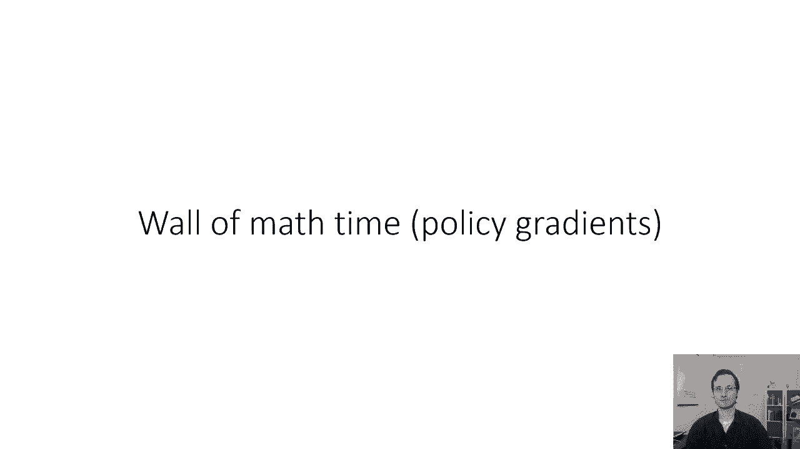

这就是我们在第一部分看到的强化学习目标，你想在所有时间内最大化奖励总和的期望值，在当前MDP诱导的轨迹分布下的期望。

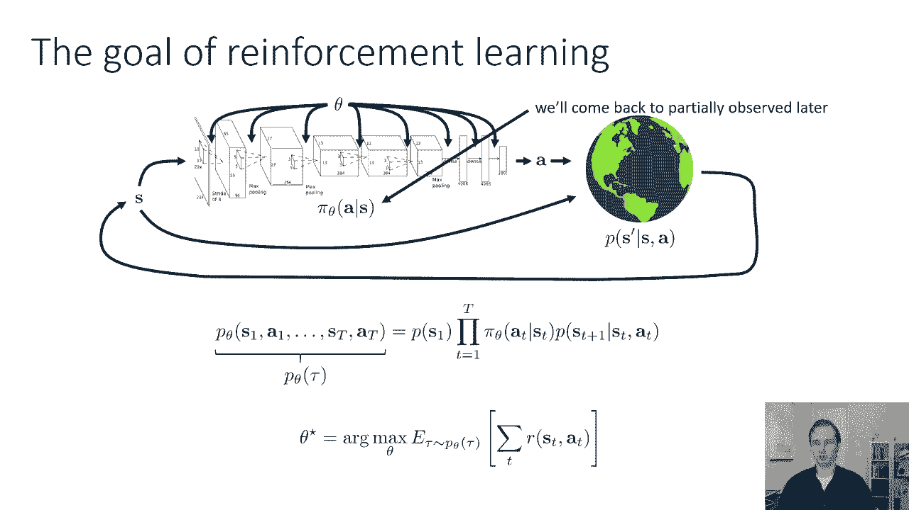

你的保单，所以让我们从热身开始，我们如何评估目标，所以我们不要担心实际优化这个目标，尽管这是我们最终要做的，我们先问一下，我们如何评估目标，所以如果我给你一个政策，我给你一个神经网络。

你如何估计它的预期回报，你不能列举所有可能的轨迹并对其求和，因为它们有指数级的数量，可能的轨迹数量在时间范围内呈指数级增加，但是你可以构造一个无偏估计器，你可以自己猜怎么做，继续讲座看答案。

所以答案是构造一个无偏估计器，为了方便起见，我们称这个量为θ的j，你所要做的就是生成样本，我们将运行策略n次，从tau的pθ生成n个样本轨迹，我们将沿着每一个轨迹总结奖励。

然后我们将它们在轨迹上平均起来，这是对这个期望值的无偏估计，所以如果你有某个函数在某个分布下的期望值，这总是正确的，您可以从该分布中取样，然后将这些样本上的函数值平均在一起，并且它是期望值的无偏估计器。

所以从轨迹分布中取样实际上意味着在现实世界中运行策略，所以当你在现实世界中运行策略时，你的假设，您的mdp假设是，该过程的工作方式如下，从s 1的p采样初始状态。

然后从s t的p加上给定的s d a t的一个中采样每个连续的状态，所以这些样本完全来自P theta tau的分布，如果你按照圆周率采取行动，因此，您将多次运行该策略，计算每项试验的预期奖励。

然后把它们平均在一起，所以我们将要学习的第一个强化学习算法背后的想法，也就是策略梯度，我们可以使用相同的样本明智估计器，通过一些修改来计算这个期望值的导数，如果我们计算导数。

然后我们可以用我们最喜欢的渐变，基于优化算法的期望回报最大化，所以这基本上是政策的梯度下降，除了现在，因为我们正在最大化目标，它实际上是梯度上升而不是下降，因为我们想让奖励变大，不小。

你总是可以翻转标志，让它下降，这是一回事，好的，所以我们需要的是渐变，所以现在，我们将通过一个聪明的数学技巧来工作，我们可以使用，计算期望值相对于分布的梯度，我们正在计算期望值。

我要用tau的r作为速记，表示奖励的总和，这样符号就不会太杂乱了，顺便说一句，幻灯片上有一点符号混乱，θ的p和θ的π是完全一样的，这意味着我只是不小心用错了符号，但它们的意思是一样的。

所以你可以把期望写成积分或和，如果你有离散的状态和动作，但这里我假设连续的，所以我把它写成积分，所以tau的r在tau的πθ下的期望值只是积分。

在所有的τ{\displaystyle\tau}上πθτ{\displaystyle\pi}乘以r{\displaystyle r}，现在，我要计算这个东西的梯度，关于θ，现在梯度算子是线性算子。

所以它实际上与积分符号交换，这意味着积分的梯度就是梯度的积分，我们还没到那一步，虽然，因为计算πθτ{\displaystyle\pi\theta\tau}的研究生θ{\displaystyle\theta}并不容易。

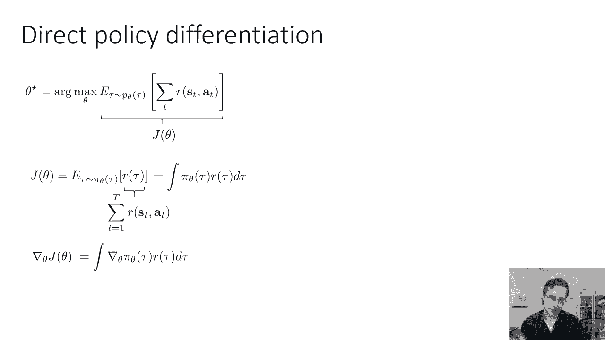

所以这里有一个方便的身份，我们可以使用，如果你有πθτ{\displaystyle\pi\theta}乘以logπθτ{\displaystyle\pi\theta}的梯度，可以应用对数导数的标准公式。

就变成了皮西塔陶，格拉德πθτ除以πθτ，因为呃，如果取x的对数f对x的导数，那只是x的1/f，所以那是很好的地方，它是x的1/f乘以df dx，所以这就是你得到这个公式的地方。

但现在你会注意到分母中的πθtau，实际上与另一个piθtau取消，这就给你留下了Gradθpiθtau，我们要做的是，我们将反向应用这个恒等式，所以这告诉我们皮西塔陶，梯度对数πθτ等于梯度πθτ。

我们必须在积分中刻度πθτ{\displaystyle\pi\theta\tau}，所以我们实际上要用左手代替它，这种方便身份的一面。

这就得到了πθτ{\displaystyle\pi\theta\tau}的积分，梯度对数πθτ{\displaystyle\pi\theta\tau}乘以rτ{\displaystyle r\tau}现在我们为什么要做好这件事。

我们这样做的原因是因为现在我们又有了一个量的积分，乘以皮西塔陶，这是piθtau下的期望值，这很重要，因为我们知道如何估计期望值，所以计算一些任意积分。

就像格拉德θπθtau乘以r tau的积分是很难的，计算期望值，或者至少用样本来近似它是非常容易的，所以我们真的希望在piθtau下有一个期望值，这就是我们以前得到的，如果我们想评估政策有多好。

我们会从pi theta tau中取样，现在把奖励平均在一起，如果我们要计算梯度，我们可以从pi theta tau中取样，并一起平均，梯度对数圆周率乘以r ta。

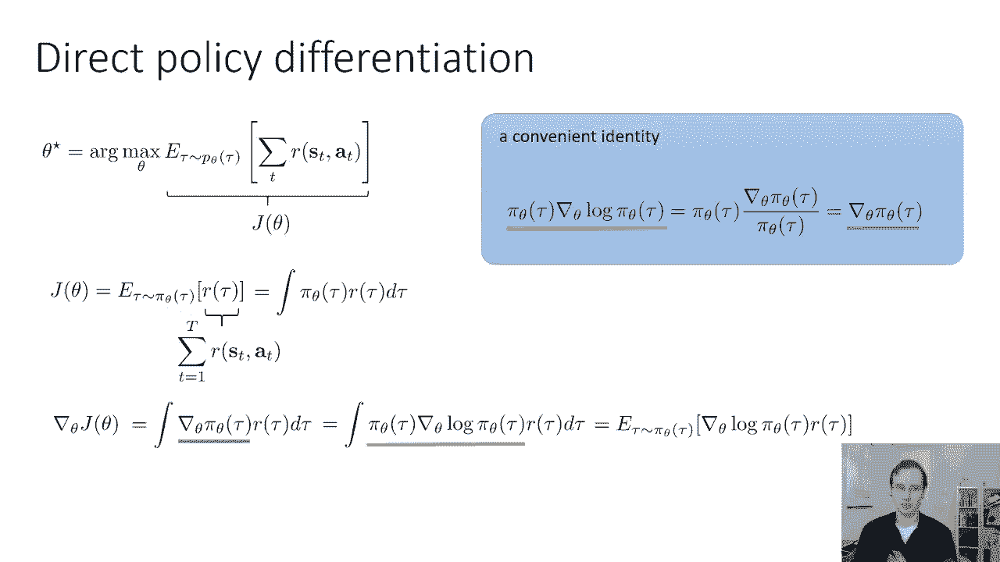

我们还没完呢，虽然，因为我们实际上不知道如何计算梯度θ，log piθtau，所以让我们来研究一下如何做到这一点，下面是πθτ的方程，记住tau只是一系列的状态和动作，这只是一堆不同概率项的乘积。

我们要取它的对数，所以如果我们把两边的对数，logπθτ等于s的1加和的所有时间的p的对数，对数πθ的步数加上跃迁概率的对数，记住当你取乘积的对数时，你得到一个对数和，所以这一部分现在等于。

我们对θ求导，这是圆木，我们对θ求导，但请记住，当你对一个和求导时，这和求导的和是一样的，因为导数是线性算子，你在这里可以看到，和里面唯一依赖于θ的项，是对数πθ，初始状态概率和跃迁概率不依赖于θ。

这是非常非常重要的，因为这些术语不是我们知道的术语，我们知道给定圣，因为那是我们的神经网络，但我们不知道其中的一个或一个，加一给定s d a t，那些是由宇宙由自然决定的。

所以它们对θ的导数为零是很好的，因为这意味着我们不需要知道它们是什么，因为不管，不管它们是什么，因为它们不依赖于θ，它们的导数总是为零，这意味着我们可以简化政策梯度的公式，变成我们可以计算的东西。

我们只剩下，是给定st项的对数piθa t之和，这意味着完整的策略梯度是tau的πθ下的期望值，所有时间的总和，给定s t次的梯度对数πθa t的步数，所有时间的总和，奖励的步骤。

所有这些量都是我们可以计算的量，从pi theta tau抽取的样本。

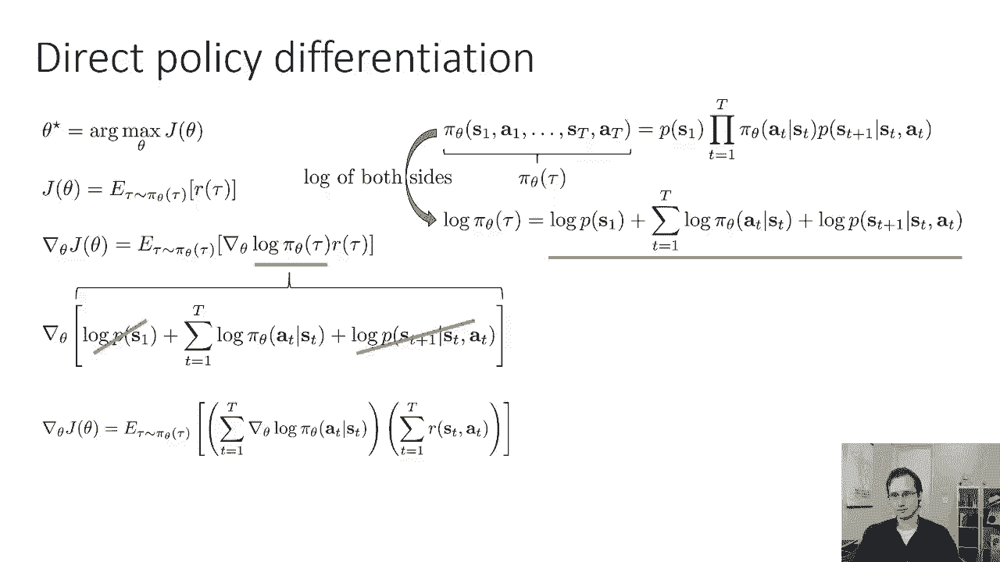

因此，如果要计算策略梯度，你所要做的就是从pi theta tau生成一些样本，你可以通过在世界上运行你的政策来获得，对于这些样本中的每一个，计算梯度对数pi a t。

给定每一步的s t和s d a t的r，把它们加在一起，这是用样本估计的策略梯度的公式，所有这些项都可以计算，所以这是一个，这是一个你可以在计算机中实现的公式，你可以通过在世界上运行政策来采样新的轨迹。

然后一旦你计算了这个梯度，你只要做梯度上升，这基本上只是梯度下降与相反的标志，用加号代替减号。

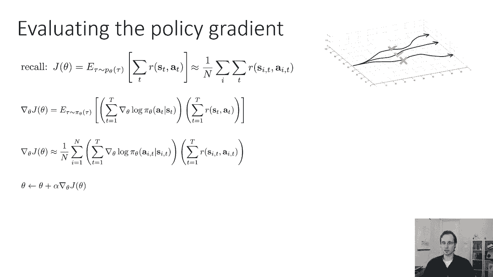

所以这种强化学习的方法是一种，你知道吗，这是一个非常经典的算法，有时被称为增强它，基本上由三个步骤组成，通过运行策略生成示例，总结你所有样品的奖励，所以基本上估计回报，你可以把它当成一个模型。

这是一个非常非常天真的模型，只是所有奖励的总和，然后通过应用梯度来改进策略，这叫做增强算法，有时候，所以经典的威廉姆斯1992年的论文称之为加强，只是呃，三步，通过运行策略对轨迹进行采样。

使用这些样本评估梯度，然后进行一个渐变上升步，所以这是强化或策略梯度，有时也称为似然比策略梯度，所以这是基本的想法。

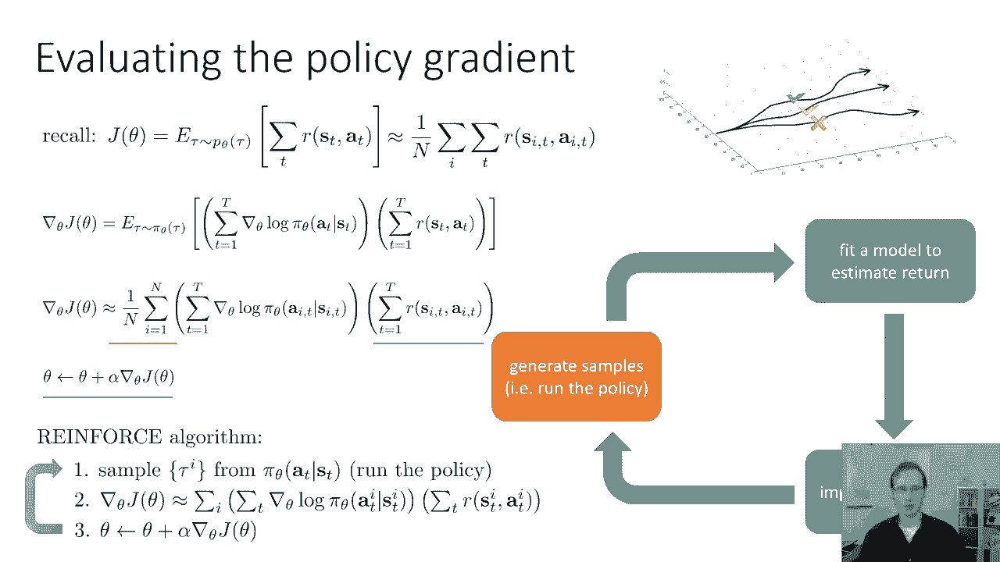

但是呃，让我们更多地解开这个方法。

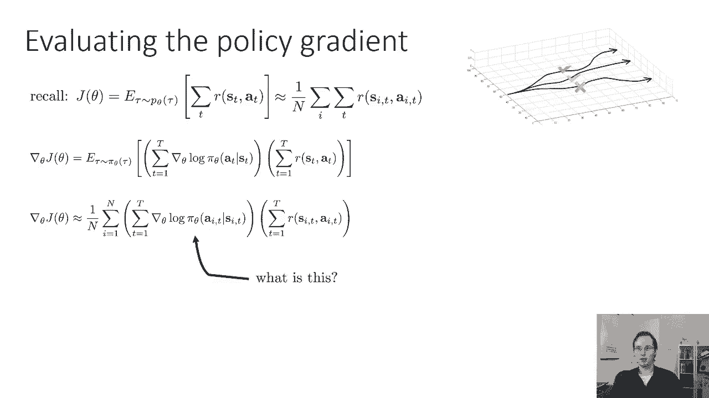

所以首先，研究生圆周率是什么，圆周率是你的神经网络给出的分布，所以如果你有离散的动作，给定s的pi只是软最大值的结果，所以你可以计算这些渐变，在神经网络中使用反向传播。

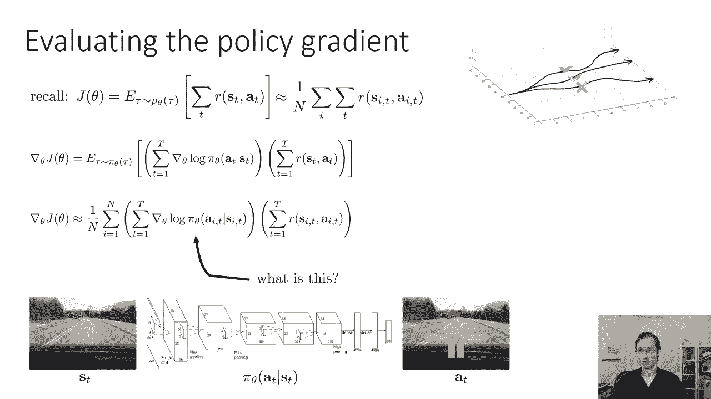

这其实很简单，事实上，这个梯度表面上与最大似然梯度非常相似，我们实际上用数学上的监督学习来训练的，这个洞察不是特别深，但实现明智，这其实很重要，因为它表明我们可以实现策略梯度，以一种没有太大不同的方式。

从我们如何实现有规律的监督反向传播，所以如果你有监督学习，就像我们在模仿学习之前一样，那么你就有最大的可能性，这就是政策梯度，这是最大似然梯度，如果你把这些并排看，大家可以看到。

唯一的区别是政策梯度乘以奖励，而最大似然梯度不是，同样，这不是数学上的，一个非常深刻的观察，因为这些东西是，你知道的，这两个梯度在数学上做了完全不同的事情，但实现明智，这是一个非常有用的观察。

因为它表明我们可以实现策略梯度，对最大似然梯度进行相对较小的修改，我们要做的就是将我们的梯度乘以总奖励，沿着那个轨迹。

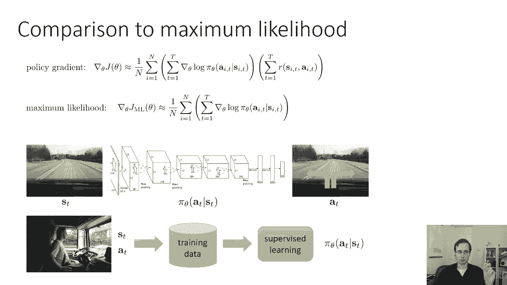

我们一会儿再回到这一点，让我们首先构建更多关于策略梯度算法的直觉，所以你们知道你们中那些遵循数学的人，希望能理解为什么，这是强化学习目标梯度的正确表达式，但可能有点不透明，你可能会问，好的，嗯。

我们做了很多代数，我们得到了一个方程，它实际上是做什么的为什么像，背后的直觉是什么，为什么这个算法是个好主意，为什么这个算法会增加我们的预期奖励，实际上，政策梯度方法确实有一个相当自然的解释。

所以为了避免所有的括号，让我们把事情简化一点，我们就这样写吧，我们有tau i的piθ和tau i的r，所以这只是隐藏了这些里面的总和，这个tau符号，让我们用最大似然把它并排比较一下。

最大似然增加了轨道上所有动作的概率，增加沿着积极奖励轨迹采取行动的可能性，并降低负奖励轨迹的概率，所以如果你运行你的策略，你的一些轨迹真的很好，有一个巨大的回报，你的一些轨迹真的很糟糕。

它们有非常负面的回报，政策梯度会做的是，它会试图使沿着轨迹的行动获得更大的回报，它将试图计算沿着轨迹运动的概率，低奖励小，这应该会改善你的政策，因为你让好的东西更有可能，坏事的可能性更小。

所以好东西更有可能，坏事变得不太可能，这本质上是试错学习的数学形式化，所以即使它是一个基于梯度的算法，它在实践中的实际作用是，它只是让好的事情更有可能，坏的事情更不可能，与我们的直觉一致是正确的策略。

如果你想通过试错来学习。

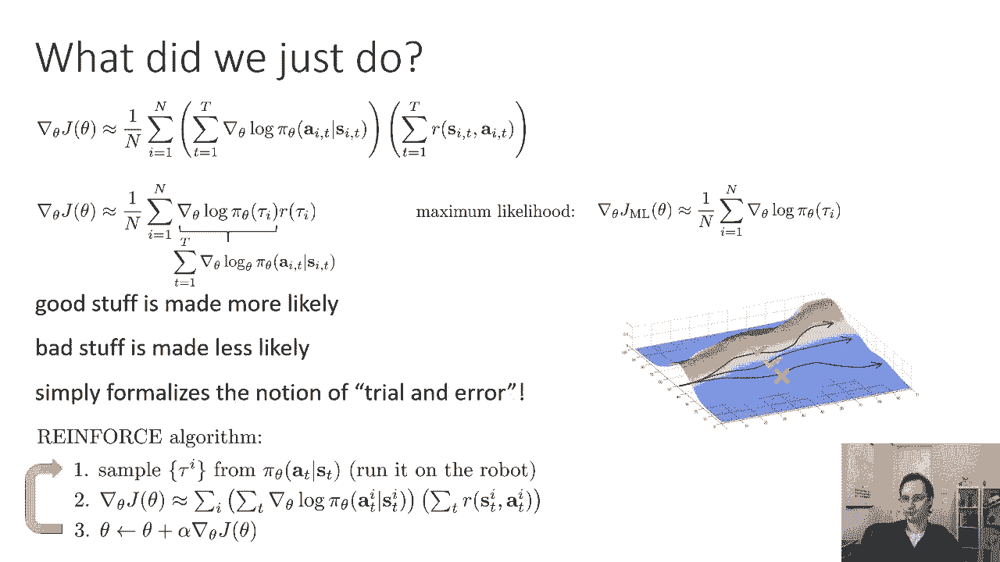

好的，让我简要地谈谈策略梯度如何处理部分可观测性，所以我在讲座开始时提到，在第一部分，我们将暂时搁置部分可观测性，策略梯度是少数几个不关心的强化学习算法之一，无论你有部分可观察性还是完全可观察性。

策略梯度的许多变体，如actor，批评家的方法确实在乎，但是常规的香草策略梯度是少数几个不关心的算法之一，也就是说你，如果你有一个部分观察到的问题，您可以将这些观察插入到您的策略中，算法不需要改变。

这是因为马尔可夫性质实际上并没有被策略梯度算法使用，正如我到目前为止所描述的那样，还有其他关于策略梯度的变体，我们将在后面了解，像演员，使用马尔可夫性质的批评家，在处理部分可观测性时必须非常小心。

但是我们到目前为止讨论过的常规政策梯度，不使用马尔可夫属性，这意味着它不在乎你的状态是否是马尔可夫的，这意味着如果你有观察到，只要把它们插进去，什么都不需要改变。

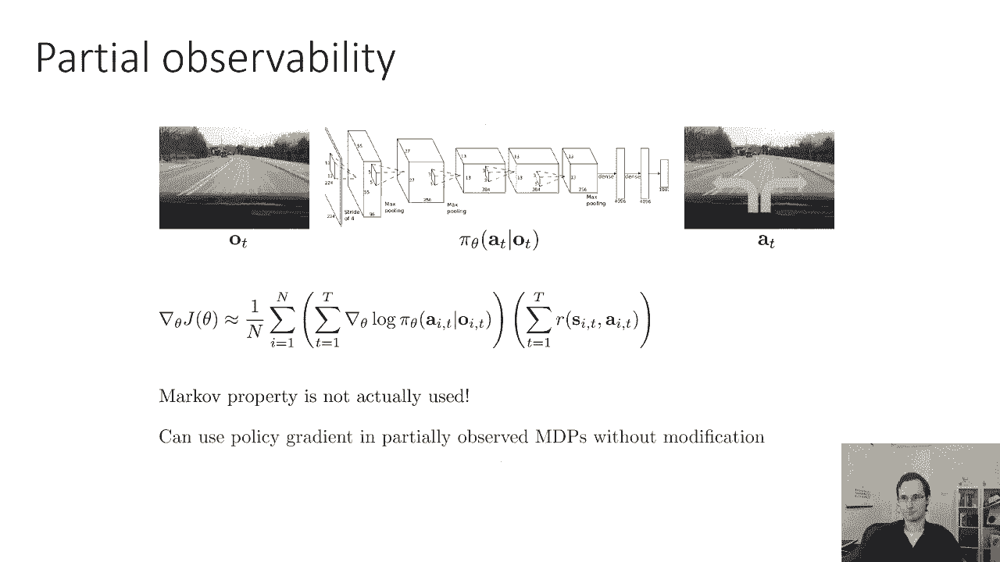