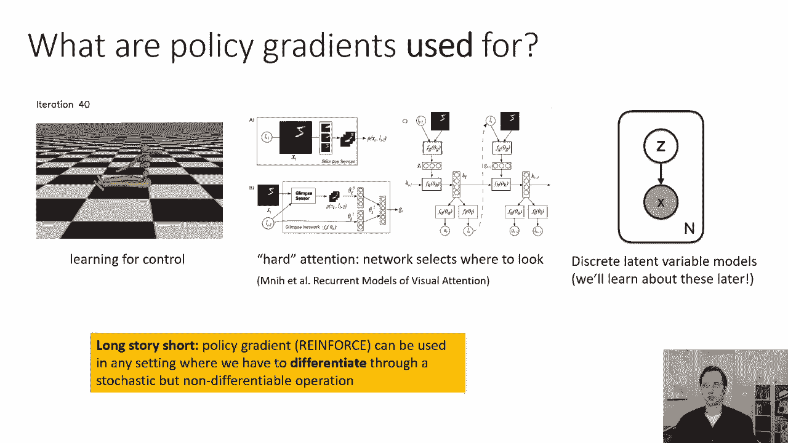
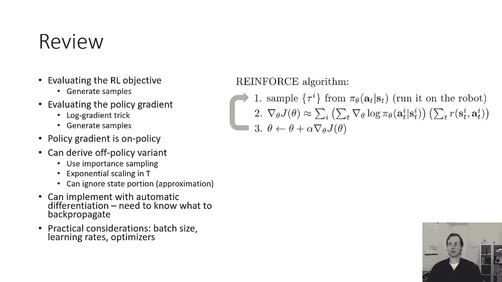
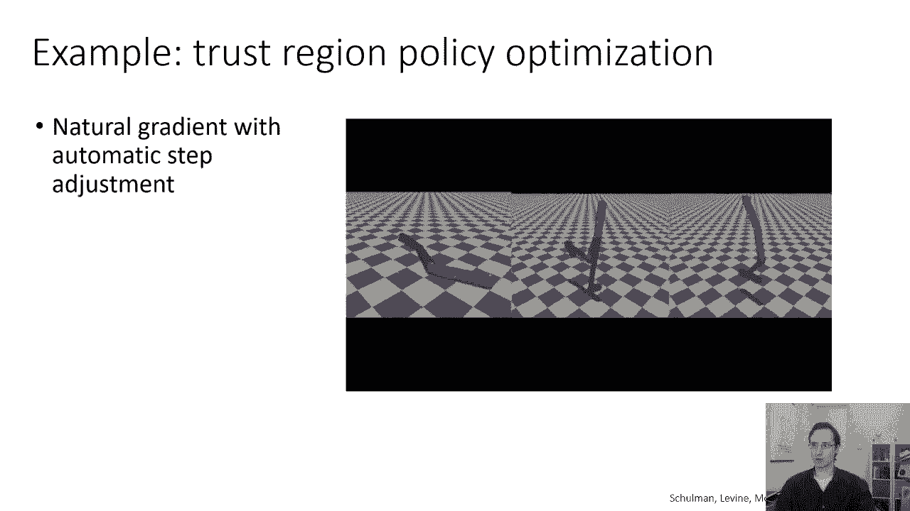
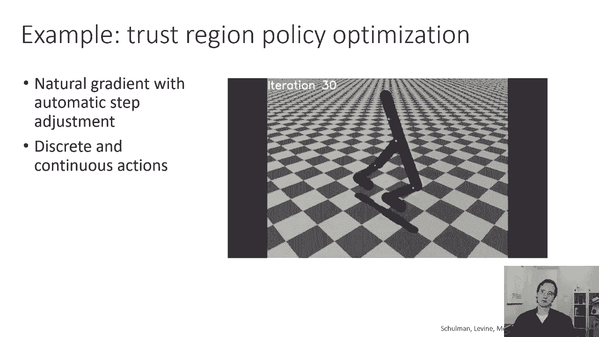
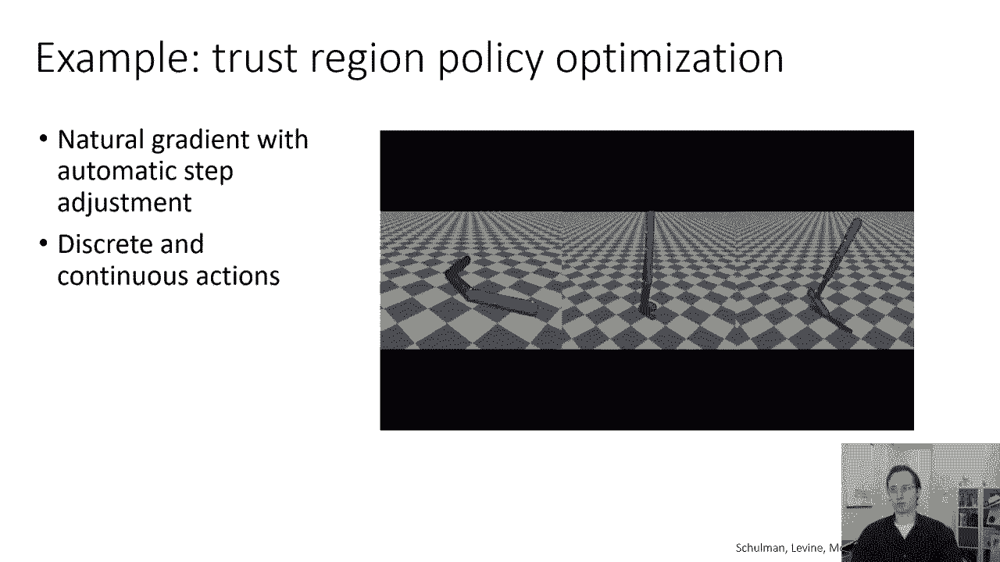
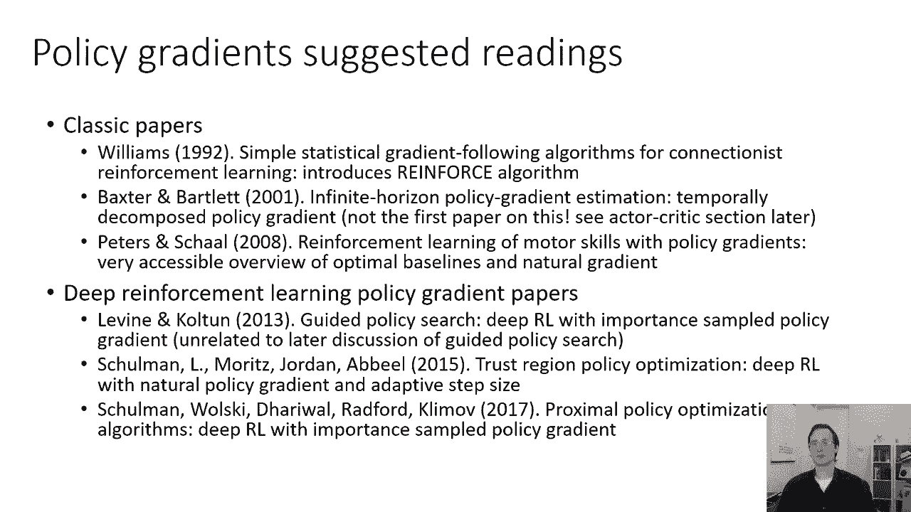

# 【双语字幕】伯克利CS 182《深度学习：深度神经网络设计、可视化与理解》课程(2021) by Sergey Levine - P47：CS 182- Lecture 15- Part 3- Policy Gradients - 爱可可-爱生活 - BV1PK4y1U751

在今天讲座的最后一部分，我们将讨论一些实际需要的细节，使策略梯度实际发挥作用，所以我们到目前为止讨论过的策略梯度方法是数学上的，相当简单，相当优雅，不幸的是，如果你试图完全按照我描述的方式实现它。

这可能行不通，以便有许多额外的细节，你知道的，似乎更次要，但事实证明，它们对政策梯度在实践中发挥作用至关重要，所以我们要做的第一件事是，我们将稍微改进策略梯度估计器，我们到目前为止讨论的估计器的问题。

它没有利用任何关于问题时间结构的知识，请注意，我们取的是日志的梯度之和，所有动作的概率，乘以所有奖励的总和，这实际上并不能解释，未来的行为不能影响过去的奖励，基本上，这个梯度公式是正确的。

对于动作上分布的任何因式分解，并指出它只是概率分布的一般梯度估计器，这实际上并不特定于顺序决策，我们就可以，但是构建一个更好的估计器，顺序决策有一点更具体。

通过注意到未来的行为不能影响过去的奖励这一事实，我们要做的事情背后的直觉是，我们将避免在未来的行动中增加未来时间的行动，在过去的时间里一步一步地奖励，这是正确的原因是更多的涉及，所以我要做的是。

我只想描述一下方法，你知道，在这一部分的最后我会给你一份推荐信，为了一篇解释为什么这是正确的论文，但我不会在这里证明它是正确的，所以你可以把这种方法看作是利用因果关系，不是寻找因果解释意义上的因果关系。

但更像是更明显的因果关系概念，过去导致未来，但未来不能导致过去，所以基本上时间点在一个方向上的箭头，黄金时段的保单，当t小于t素数时，不能影响时间t的奖励，关于我们宇宙如何运作的事实，这总是真的。

所以如果我们重写标准策略梯度，所以我们还没有改变任何东西，我们只是用不同的方式重写，通过在毕业生日志馅饼的总和中分配奖励的总和，我们得到了你可以在这里看到的方程，所以我们没有改变什么。

我们只是用分配性质把奖励的总和放进去，梯度对数圆周率的和，所以我们有一个从t等于1到大写t的外和，每走一步，我们就乘以梯度对数圆周率，a t由t素数上的另一个和给出，从1到R d的大写T。

这是完全相同的方程，我只是应用了乘法的分配律，但这让它变得更加明显，为什么这个估计量不使用因果关系，因为，时间t处动作概率的梯度乘以和，包括过去的奖励，但是改变时间t处动作的概率不是。

永远不会改变过去的回报，所以我们能做的就是，我们实际上可以避免把过去的奖励加起来，并将内部求和从t改为大写t，所以我们基本上从当前时间步到最后的所有奖励，但不包括过去的所有奖励。

结果这个估计量也是正确的，它实际上更好，因为即使在预期中，对于有限数量的样本，这些过去奖励的影响总是积分为零，我们可能会得到一点抽样误差，这些过去的奖励实际上可能会影响我们的梯度，即使他们不应该。

它只是在这里取样，这基本上是噪音，因为我们有有限数量的样本，所以通过归零，基本上是利用我们的知识，它们必须积分到零，在期待中，我们得到了一个噪音较小的估计，正式，我们说估计量的方差较小。

这意味着如果你生成，你知道许多不同的样本组，并用这些不同的组估计梯度，如果你放弃过去的奖励，你的估计会比保留它们更接近，所以这是对策略梯度的一个非常简单的修改，总是更好，从来没有让事情变得更糟。

所以你一定要这么做，然后呃，这个，把这笔钱解释为去的奖励，从现在到最后你将得到的总奖励，在周三的下一节课中实际上是非常重要的，当我们谈论值函数时，所以取圆木渐变的一般主题，动作的概率。

乘以我们得到的总奖励，从现在到时间的尽头会一次又一次地出现，当我们讨论强化学习方法时，我们就叫它Q帽子我逗号T，所以对于样本i乘以步骤t的奖励是t质数的和，从小到大，我们用符号Q作为速记来表示这个量。

所以我们也可以这样写，这是一个简单的技巧，你可以用策略梯度，它总是让事情变得更好，这是一个非常好的主意，尤其是如果你的轨迹很长，还有一个非常重要的技巧也总是有帮助的，但它有点不那么明显，它被称为基线。

所以在政策梯度将试错正式化之前，我们就有了这种直觉，了解到使用策略梯度将使良好的轨迹更有可能，不良轨迹的可能性较小，在好事变得更有可能之前，我们有了这个动画，坏事变得不太可能，这里面有一点谎言。

我有点误导你了，这是我们希望发生的，但并不总是保证会发生，我在这张幻灯片上的估计量，想象所有的奖励都很大，正数，所以最好的轨迹可能是一百万零，最坏的轨迹是一百万零一个。

现在所有动作的权重实际上都是很大的正数，这意味着我们实际上不会得到这个，我们不会有最好的轨迹变得更好，最糟糕的轨迹越来越不可能，我们实际上会得到的是所有的轨迹变得更有可能，这不是我们想要的。

我们不只是想让所有的轨迹更有可能，如果奖励是积极的，如果轨迹比平均水平好，我们想让它们更有可能，如果他们比平均水平差，我们想降低他们的可能性，所以直觉上，我们要做的是，我们想把我们的奖励减去平均奖励。

因为，如果我们改变梯度估计量，将梯度对数pi乘以r，减去R的平均值，那我们就吃这个，我们会，我们将拥有比平均水平更好的一切，变得更有可能，一切比平均水平更糟糕的事情变得不太可能，我们就可以这么做吗。

就像那看起来完全是任意编造的修改，我们有一个美丽的公式，在那里我们得到梯度对数π乘以r，现在我们任意地把它改成r-b，其中B是平均奖励，这是允许的吗，嗯，令人惊讶的是，这个估计值仍然是正确的。

而且好多了，同样正确，其实没什么不好，它更好，我们可以证明，证明是B的期望值为零，这是统计学中的一个常见技巧，如果你有一些基于样本的估计器，你可以减去期望值为零的东西。

然后当你从样本明智的估计中减去它时，你得到的方差更小，不同样本组之间的变异性较小，因为你减去了你知道为零的东西，但对于有限数量的样本，它可能不是零，所以我们要证明，在期望值中减去b没有区别。

以证明这一点，我们要证明梯度θ对数π的期望值，θτ*b为零，对，因为我在顶部的估计器，您可以在差值内分发梯度日志PI，得到梯度对数π乘以r减去梯度对数π乘以b，如果梯度对数π乘以b的期望值为零。

然后你可以在不改变期望值的情况下减去任何B，试图证明梯度对数π乘以b的期望值实际上为零，所以我们将遵循与我们使用的食谱相似的食谱，当我们导出策略梯度时，首先，我们把这个期望值写成圆周率所有轨迹的积分。

tau乘以梯度对数圆周率乘以b，这只是期望值的定义，然后我们将应用我们以前的方便身份，但我们会反过来应用它，所以在我们用它把梯度圆周率变成圆周率乘以梯度对数圆周率之前，现在我们要走另一条路，把圆周率。

梯度对数圆周率到梯度圆周率，请记住，梯度算子与积分算子交换，因为梯度算子是线性算子，这等于b乘以πθτ积分的梯度θ，因为我们可以把积分中的b去掉，我们可以把梯度算子从积分中去掉，现在诀窍是这样的。

πθτ{\displaystyle\pi\theta\tau}上的积分是1，因为πθtau是一个分布，在整个域上集成发行版时，你会得到一个概率分布的要求之一，所以这意味着你有b倍的梯度相对于1的θ。

当然，一个人不依赖于θ，所以梯度是零，b乘以零就是零，所以我们刚刚得到了一个证明，表明梯度日志的期望值，π乘以b为零，这意味着你可以减去任何你想要的B，也不会改变期望值，它就会，但是。

更改从有限数量的样本中得到的估计，减去平均奖励将减少该估计量的方差，这意味着对于相同数量的样本，您将得到更准确的政策梯度估计，所以不仅可以减去B，事实上，它会给你一个更准确的策略梯度。

减去基线在期望中是无偏的，这意味着它不会改变期望值，但会给你一个更准确的估计，我会注意到这是一个附带说明，平均奖励不是你能使用的最佳基线，如果您想了解最佳基线，我在我的研究生课程中实际上涵盖了这一点。

但这在数学上有点奇怪，因为在实践中，我们通常只使用预期奖励，但是围绕基线和强化学习有很多更深层次的理论，您可以在，比如说，研究生强化学习课程，所以总结一下我到目前为止讨论的内容。

可以改进策略梯度的两种方法，一种是只从当前时间步到结束的一些奖励，不包括过去的奖励，并使用基线减去平均奖励，这两个变化将使策略分级从一个永远不起作用的算法，到一个算法，所以有了基线和因果关系的小技巧。

你实际上可以得到一个政策评级，可以用来解决真正的强化学习问题，还有很多其他的方法可以改进它，但这两个简单的改进给了你巨大的里程数，基本上没有他们，它从来不起作用，现在对策略分级的一些考虑。

这些都是一些限制，我们将在以后的课程中讨论，关于保单分级需要注意的一点是，这是所谓的，关于策略强化学习算法，这意味着你必须通过在现实世界中实际运行你的策略来收集额外的样本，每次修改策略参数时，请记住。

渐变是piθtau下的期望值，那会带来麻烦，这意味着每次你需要计算梯度，你需要从皮西塔陶取样，所以在强化学习算法的每一步，你必须生成新的样本，扔掉旧的样本，这实际上让我们有点失望。

因为当我们了解到迷你批的时候，sgd，我们学会了你如何，嗯，你知道的，基本上保持从相同的数据集中抽样额外的批次，但现在你不能再那样做了，您必须通过在现实世界中实际运行策略来对每一批进行采样。

所以你总是扔掉所有的旧数据收集新数据，你不能跳过那一步，那取样的一步，如果你跳过它，它不会起作用的，所以这是个问题，因为神经网络只随每一个梯度步变化一点点，你通常需要采取大量的渐变步骤来训练，因此。

就样本数量而言，政策学习可能极其低效，因为你需要与世界互动，每次你走渐变步，现在有办法缓解这种情况，这些我就不细说了，但我确实想简单地描述一下他们，因为它们构成了实用政策梯度方法的一个非常重要的基础。

这就是如何使用来自其他策略的样本来估计策略梯度，使用重要抽样，那么如果您想估计策略梯度呢，但你没有tau的piθ的样本，相反，你有一些其他政策的样本，比如tau的圆周率条，也许那是你的老政策。

你能做的就是，你可以用重要的样品，重要抽样基本上是估计某个函数期望值的一种方法，在分配下，只给出来自不同分布的样本，假设我想估计x的f的期望值，在x的分布p下，等于x的p乘以x的f的积分。

i总是可以代替1，1等于x的q除以x的q，所以基本上取一些量乘以一并不能改变这个量，所以我可以把x的p乘以x的f乘以1，1等于x的q除以x的q，现在我可以稍微重新排列那个分数。

所以它实际上是x的q乘以x的p除以x的q，我只是这是同样的精确方程，把分母移过来，这很明显是q x下的期望值，因为每当你看到某个分布时间的积分，在这个分布下的期望值，所以这正好等于x的q下的期望值。

x的p/x的q乘以x的f，这意味着如果你有x的q的样本，你想估计p x下的期望值，你只需要把你的样本乘以x的p除以x的q，这被称为重要性权重，它之所以被称为重要的方式。

是因为样本在x的p下更有可能在x的q下更不可能，被认为更重要，所以我们可以应用这个精确的想法来估计tau的πθ下的期望，只使用tau的圆周率条样本，因此，如果您想为策略返回编写一个重要的抽样估计器。

只要把重要性的权重放进去，正好是右边的等式，我只是代替了p piθ，代替q pi和f，这就是你的重要体重，现在概率，呃，在这在这重要的，我们是由我们之前看到的方程给出的，这个关于初始状态概率的大乘积。

动作概率和跃迁概率，所以如果你写出完整的比例，你得到这两个巨大乘积的比例，但这些巨大产品的酷之处在于，大多数项同时出现在分数的顶部和底部，这意味着它们抵消了，初始状态概率抵消，跃迁概率抵消。

这真的很重要，因为再一次，我们不知道初始状态概率是多少，我们不知道过渡概率是多少，所以说，我们可以完全表达我们的重要性这一事实，就行动概率而言，这是我们唯一知道的非常重要的事情。

因为这意味着我们可以计算出我们的重要权重，所以我们的重要性权重只是给出了，作为动作概率乘积的比值，在旧保单下做新保单除以产品。

我们就可以，当然啦，这样导出策略梯度，我也是，这里有一个方法我们可以做到这一点，我们可以说，我们能估计一些新参数的值吗，这是上一行的方程，如果你有皮西塔的样本，现在你想估计一些新参数的θ质数的j。

这是tau的π下的期望值，那是现在的旧政策，所以θ是θ，θ不是我们正在优化的东西，Theta是旧政策，它是π的tau的πθ下的期望值。

θ{\displaystyle\theta}除以πθ{\displaystyle\pi}乘以r{\displaystyle r}，这是一个你可以任意优化的对象，在不产生新sa的情况下。

所以这是唯一依赖于θ质数的位，如果你想计算它的梯度，当然啦，唯一依赖于θ质数的是分子，你可以用这个方便的公式，从之前方便的恒等式到取格拉德θ素数，分子中的πθ质数，成为πθ质数，乘以梯度对数πθ质数。

然后如果你把πθ质数放在分子中，从分子中取出梯度对数圆周率，然后你得到这个方程，而且这很方便，这只是我们以前的政策梯度，只是现在每个样本都用πθ质数或πθ加权，预期是在旧的政策下进行的，并进一步。

如果θ等于θ质数，所以如果你只是局部估计梯度，如果你，如果你知道刚刚从Theta取样，那么重要的方式抵消了，这样你就恢复了策略梯度的规则，非常方便，但如果我们不想恢复政策梯度。

我们实际上想要一个非策略算法，如果我们想在不产生新样本的情况下进行多个梯度步骤，那么你就有了这个重要的点，重要的重量是，就像你以前回忆的那样，现在只是实际概率的乘积之比，不幸的是。

这是一个非常糟糕的估计器，所以这里，我把所有的乘积和总和等都写出来给你看，你可以像以前一样应用因果关系，所以你可以通过在重要性上分配产品来应用这一点，和内的权重超过对数圆周率和你。

你可以把那个产品分成两半，你一直都有产品，直到T，T之后所有时间步长的乘积，这是同样的精确方程，但这表明，每一步，基本上是那个产品的一个部分解释了到达那个时间步长，另一块解释了之后发生的事情。

未来的行动不影响当前的体重，你实际上可以删除未来奖励上的重要性权重，这是不平等的，这不再是平等了，如果你删除它，但它仍然是一个有效的渐变，原因有点技术性，我们没有时间在课堂上讨论，但这是非常可取的。

因为去掉那些额外的重要重量，结果不必把这么多数字相乘在一起，所以这是一件很好的事情，不幸的是，你不能及时摆脱重要的重量，第一步直到T，这实际上是一个大问题，因为你是按照t概率的顺序乘以一起的。

这意味着这些重要性权重很快就会为零或无穷大，所以基本上每一个，分子和分母，这些产品中的每一个要么归零，要么井，它们实际上归零膨胀得很快，所以当你把它们的比例，你基本上有零或无穷大，如果T足够大。

另一种说法，这是重要性权重变得指数级快退化，这实际上是一个大问题，所以以下是我们可以做的来缓解，我们可以用不同的方式来写目标，我们可以采取常规的策略梯度，而不是把它写成对轨迹的期望。

我们可以把它写成一个，国家行动边际，所以基本上你可以在每个时间步骤中采样状态和动作，只要他们从轨迹分布的边缘取样，那是一个正确的估计量，然后你可以计算出这些边线上的重要性权重。

所以πθ=s a除以πθ=s a，当然还有，您可以将其分解为动作依赖项中的状态依赖项，所以πθs乘以πθa给定s，这就是术语，这才是问题所在，您可以访问给定的S，你没有权限访问S的圆周率。

所以你可以做的是，你可以启发式地忽略这部分，从字面上删除说那部分重量等于1，这不再正确，它不再是无偏见的，但是如果θ和θ质数非常接近，事实证明，这样做的误差基本上是有界的。

如果你的新策略πθ{\displaystyle\pi\theta}是接近πθ{\displaystyle\pi\theta}的质数，你可以忽略这部分重量，你的政策梯度只会有一点点错误。

这实际上现在导致了一个实用的算法，我们可以实际使用，所以我们生成了一些样本，然后我们只在一个时间步内按重要性权重对这些样本进行加权，但我们不会优化得太远，如果我们走得太远，那么我们的渐变就会变得不正确。

所以说，这是一种在策略梯度中使用重要抽样的实用方法，在现实中，现在这部分有点高级，我们不会为了重要的保单样本而测试你，在考试上评分，因此，您应该确保您了解常规策略梯度，然后在一种随意的层面上有一些想法。

您可以使用重要的采样来使其脱离策略，但我们不会为此测试你的数学，但请记住，在实践中，简化是非常常用的，它通常是实用的关键成分，重要抽样政策评级方法，好的，现在，为了更实用的东西。

这是你实际上可能会使用的东西，嗯，我们如何使用自动微分实际计算策略梯度，所以我提到，在策略梯度看起来很像最大似然梯度之前，加上这些奖励作为一个乘法术语，所以你不想单独计算梯度日志圆周率，然后乘以奖励。

您想使用反向传播，所以为了使用反向传播，我们基本上要建立一个计算图，它的梯度是策略梯度，我们要做的是，即注意到最大似然梯度的相似性，所以对于最大似然，我们形成一个目标，即平均对数概率。

然后我们运行反向传播，我们得到平均对数概率的梯度，所以对于策略梯度，我们要实现一种伪损失，我们将实施伪损失，也就是动作的平均对数概率乘以Q帽，我们的反向传播算法要去哪里，假设Q帽不依赖于θ。

现在在现实中Q HAT确实依赖于θ，但这种依赖通过环境动力学，所以这不是我们计算图的一部分，但是如果我们设置这种伪损失，在你知道的地方，对数PI可以添加交叉熵或平方误差，如果你有连续的动作，你想要高斯。

然后反向传播将自动为您计算策略梯度，所以这里是张量流风格的伪代码，这在Pytorch中也是一个非常相似的概念，我这里的伪是张量流样式，但希望这很清楚，只有几行代码，所以我们假设我们有两个张量。

维数为样本数次数的作用张量，按动作维数计算的时间步数，我们将有一个状态张量，我们假设它的维数是样本数，按状态维数计算的时间戳数，逻辑将是在你的神经网络中运行向前传递的结果。

所以登录基本上是你的网络预测的日志概率，然后如果我们实现最大可能性，我们会有负的可能性，由应用于logits的交叉熵损失给出，地面真相标签是实际采取的行动，所以这是，如果你想要最大似然，这就是你会做的。

然后你会平均，呃，在所有的样本上，这是减少需求操作，把它的梯度，利用反向传播，如果您想将此转换为策略梯度，你要做的就是，你必须用Q HAT值来衡量这些负可能性，所以你有一个额外的张量，叫做Q值。

它的维数是样本数，时间步数乘以一，你只要沿着第一个轴逐点相乘，负可能性，用Q帽子加权所有这些负面可能性，然后剩下的都是一模一样的，所以第三行，加权负似然等于，负似然乘以q值。

这是对标准最大似然码的唯一修改，去得到它，计算策略梯度，所以本质上第三行，红色的实现了这个伪损失和伪损失的梯度，如果你假设Q帽不依赖于θ，你的哪个，你的自动区分软件会假设，即使这不是真的。

这会让你得到保单，所以它其实非常，非常简单天真地实现，虽然，实施政策分级的许多工作涉及到，用基线和类似的东西正确地计算这些Q值，这样你就得到了正确的结果，关于实践中策略梯度的几点评论，请记住。

保单分级有很高的方差，这意味着如果您想使用示例估计保单费率，您通常需要更多的样本，然后在正常的监督学习小批处理中使用，所以这和监督学习是不一样的，尽管它看起来很像监督学习，你需要更多的样品。

你的渐变基本上会很吵，考虑使用更大的批次，出于同样的原因，调整学习速度变得更加困难，像atom这样的自适应步长规则对策略梯度变得更加重要，什么是政策梯度实际用于井，策略渐变也可以在一系列设置中使用。

其中您需要通过不可微操作计算导数，比如说，这篇论文叫做视觉注意的递归模型，使用一个小的瞥见窗口来确定要查看图像的哪一部分，最大限度地提高精确度，裁剪出一瞥是一个不可微的操作，所以他们实际上使用策略梯度。

即使他们没有直接解决控制问题，所以在深度学习中有很多地方我们使用策略梯度或强化，不是因为我们想控制，而是因为我们想通过一个通常不可微的操作来区分，您还可以在离散潜在变量模型中使用增强策略梯度。

所以这些模型中有随机变量它们是离散的而不是连续的，并通过它们来区分，很明显，你不能计算关于离散变量的导数，但你可以让这个变量随机化，然后计算其分布的第二个参数的导数，使用策略梯度。

所以如果这看起来有点先进，别担心那个，现在，我们将在春假后更多地讨论这些潜在变量模型，说来话长，短，策略梯度或增强可在任何设置中使用，我们必须通过随机但不可微的操作来区分。

所以简单回顾一下，我们讨论了保单分级对保单的影响，我们讨论了如何通过生成样本来评估RL目标，我们讨论了如何评估策略梯度，使用对数渐变技巧和使用示例，我们讨论了如何推导出策略梯度的非策略变体。

使用重要的抽样，但不幸的是，它在T中有指数级的缩放，如果我们忽略状态部分，这是一个近似值，然后我们实际上得到了一个容易处理的，呃，重要采样算法，我们讨论了如何使用自动微分来实现策略梯度。

你只需要把它设置好，这样你就知道该反向传播什么，我们谈了一些实际的考虑，这是基本的强化算法，再一次，这是从这节课中学到的最重要的东西，但也要记住所有这些技巧，基线，等，这些对完成这项工作都很重要。

下面是一个策略梯度的示例，这是来自信任区域政策优化的论文，所以在这里，策略梯度被用来学习广泛的不同行为。

奔跑，游泳，散步，等，它使用了一个更高级的版本，基于一种叫做自然渐变的东西。

这节课我们就不讲了。

但它将在研究生水平的强化学习课程中涵盖，如果您确实想了解更多关于策略分级的信息，这也不是测试中的内容，但如果你对此感到兴奋，你想了解更多，这里有几篇经典论文，这是实际引入政策梯度的论文。

这就是介绍因果关系技巧的论文，这篇论文是一篇很好的综述，还解释了更现代论文的基线和最佳基线，实际上将深度学习与政策梯度结合在一起，使用经典的重要抽样估计器的引导策略搜索，信任区域策略优化，近端策略优化。

