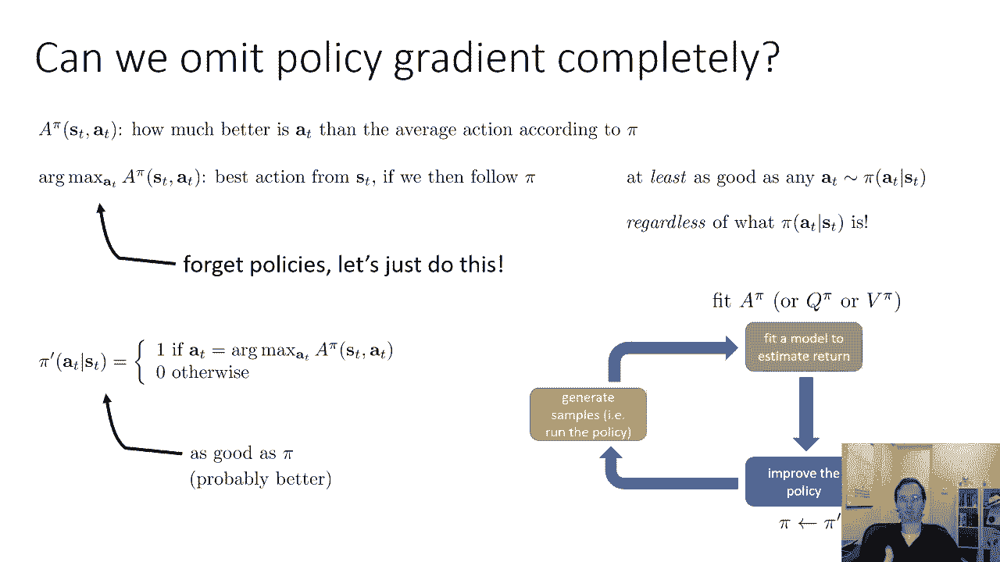
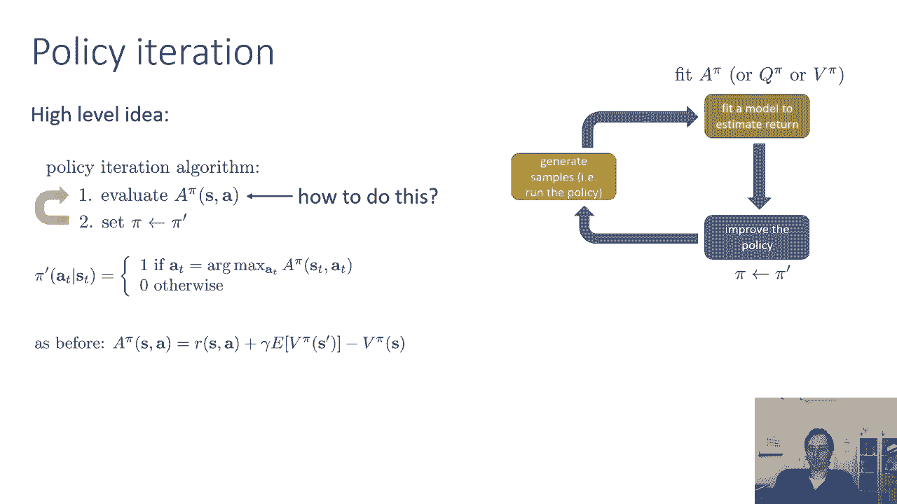
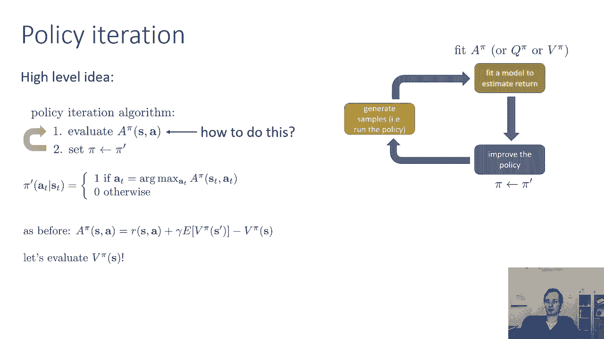
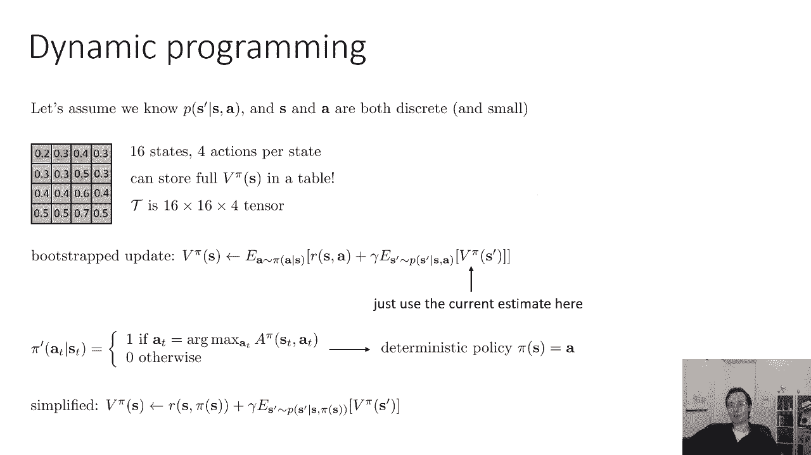
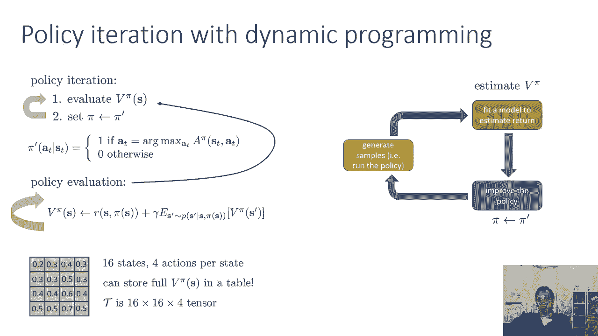
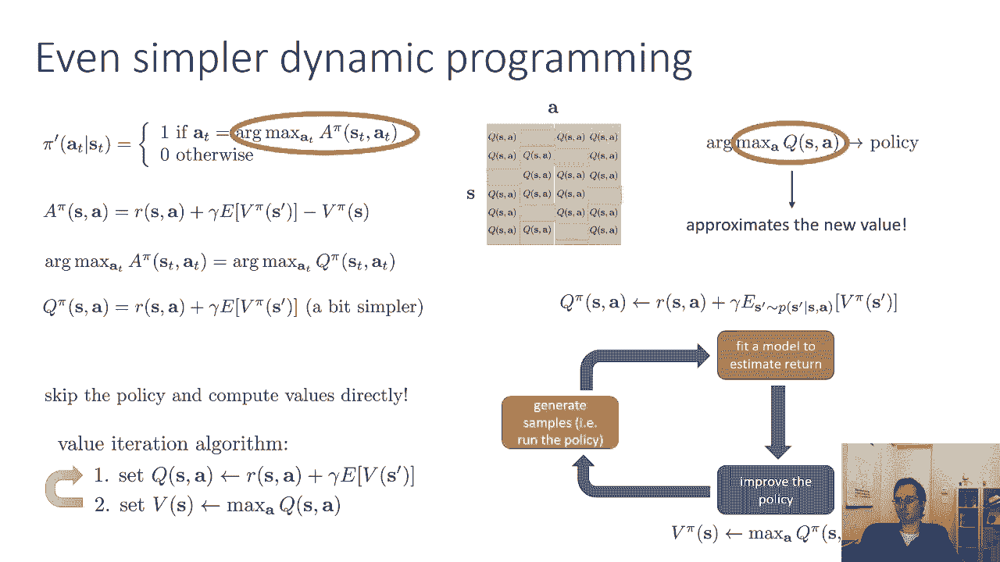
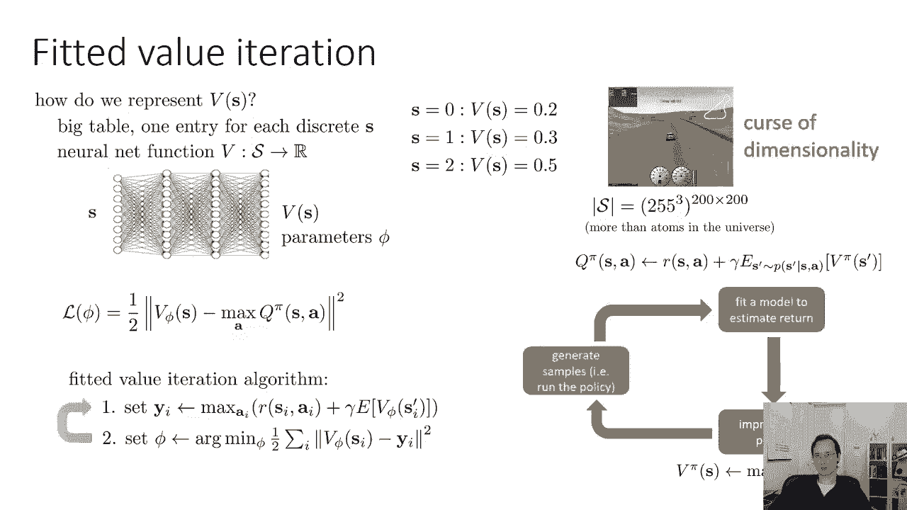
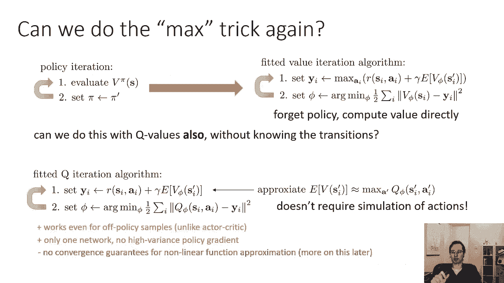
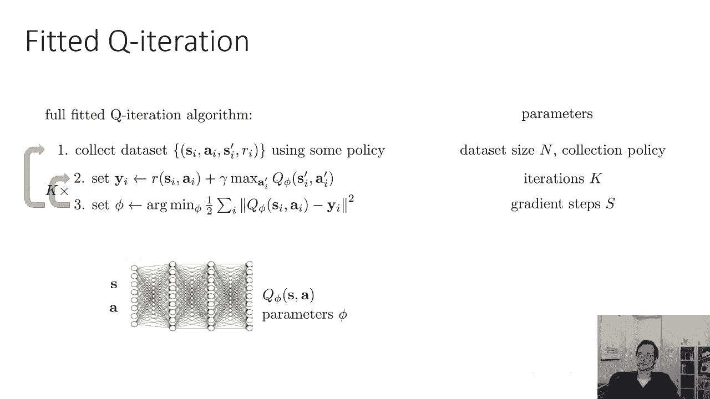

# 【双语字幕】伯克利CS 182《深度学习：深度神经网络设计、可视化与理解》课程(2021) by Sergey Levine - P49：CS 182- Lecture 16- Part 2- Actor-Critic & Q-Learning - 爱可可-爱生活 - BV1PK4y1U751

在今天演讲的下一部分中，我已经报道了演员评论家，呃，我们实际上将进一步建立在值函数和q函数的思想上，开发根本不需要演员的算法，最终达到所谓的Q学习方法，所以我们要问的问题是，我们能完全省略保单分级吗。

我们能完全用值函数来进行强化学习吗，所以记住我们的优势，a pi s a告诉我们一个动作a比一般动作好多少，根据圆周率，相对于A的优势的arg max是ST的最佳动作。

如果我们真的找到使圆周率最大化的动作，这是我们能采取的最好行动，如果我们之后跟着圆周率，所以如果我在这之后告诉你，我们将被迫只使用圆周率，你现在到底拿什么，嗯，最好的行动是最大的优势。

因为这实际上是导致最大总回报的行动，如果你之后被迫跟随圆周率，这意味着这实际上至少会和当前政策中的任何行动一样好，这意味着您可以安全地采取这个arg max操作，它不会比政策从现行政策中采取的行动更糟。

事实上，很可能会更好，所以看着这个，你可以说好，为什么要为政策梯度而烦恼呢，为什么不直接选择行动，利用优势的arg max，也许你甚至不需要单独的保单，所以忘了政策吧，我们就这么做吧。

让我们隐式地定义一个策略，就优势函数而言，我们将策略定义为操作上的分布，为动作分配概率1，如果它是以前策略优势的最大值，否则为零，我们会用这个来选择动作，所以我们有离散的动作，你可以列举所有的动作。

评估它们的所有优点，拿最好的一个，这实际上是有效的，这实际上会给你带来比以前策略更好的操作，不管以前的政策是什么，这意味着你甚至不需要神经网络来表示策略，不再，你可以直接用优势函数。

所以这个新的脉冲会和圆周率一样好，可能更好，所以现在我们基本上对食谱做了一点修改，我们仍然要在那里生成样本，我们仍然要拟合我们的值函数，而不是通过采取政策梯度步骤来改进政策，我们将简单地改进策略。

用这个贪婪的R max替换我们的策略，所以我们实际上不会有一个单独的网络。

我们将使用r max选择我们的操作，这是策略迭代算法的基础，高层的想法是你评估你当前政策的优势功能，比如说，通过计算值函数，做r加下一个v减去电流v，然后将新策略设置为Argmax策略，然后你重复。

所以最大的问题是如何计算圆周率，你可以用我们之前讨论过的演员评论家的方法，所以和以前一样，你希望圆周率是r加伽马倍。

下一个V减去当前的V，所以让我们计算s的vπ。

现在我们可以用样品，我们可以用，蒙特卡洛回来了，就在现在，我想暂停一下，讨论动态编程，我要倒回去一点，讨论一个特殊的情况，我们如何在我们知道转移概率的情况下拟合v pi，然后我们走回模型自由箱。

在那里我们不知道过渡概率，实际上恢复了一个非常优雅的算法。

所以首先，让我们假设你知道，给定s a，s和a都是小而离散的，这意味着你可以对所有可能的状态求和，在所有可能的行动中，你不能这么做，但它确实有助于在可以的设置下导出优雅的算法。

然后将它们推广到示例明智的设置，而您不能，所以说，比如说，您可能会想象您的状态表示这个网格中的单元格，这有时被称为网格世界，所以你有十六种可能的状态，你的行动就是前进的方向，往右，往左，往上走，下去。

所以你有十六个动作，每个状态有四个动作，现在，在本例中，您可以将s的全值函数v pi存储在表中，有十六个州，这意味着值函数完全由16个数字决定，本质上是与网格中的每个单元格相关联的数字。

你的转换概率是16乘16乘4张量，十六个州中的每一个州基本上都有不同的概率，给定16个先前状态中的每一个和4个先前动作中的每一个，所以现在您可以表示对值函数的更新，作为对你的奖励政策中的行为的期望值。

加上伽马乘以下一个时间步长的期望值，就像以前一样，我们可以用当前值函数代替V，圆周率在右手边，请记住，因为我们的策略PI将是这个Argmax策略，我们可以把这个arg max代入上面的方程。

所以它是圆周率下的期望值，但圆周率将是arg max，所以这是一个确定性的政策，s的π等于a，所以你可以在那里代替π，这是一个期望值，但只有一个动作的概率是1，所以你只要把它插进去。

现在我们有r of s逗号pi of s，加上S素数上的期望值，按s素数的p分配给定s逗号的pi，所以这是对value函数的引导更新。

您可以在政策安排中使用这一点，您可以使用此引导更新来评估V PI，然后将新策略设置为Arc Max策略，政策评价，这只是那一步，一个只是重复应用这个备份，直到您的值函数收敛，这叫做价值迭代。

有一个更简单的动态编程过程，在那里我们可以利用，事实上，策略PI不仅仅是任何确定性策略，这实际上是Argmax策略，我们实际上可以把Arg Max本身替换到备份中。

我们这样做的方法是首先注意优势就是回报，加上下一个值减去当前值，现在s的v pi的当前值不会改变r max，因为它不依赖于，所以说，这意味着优势函数的arg max等于arg，Q函数的最大值。

也就是r加上下一个v，所以你可以把事情简化一点，你可以在动态编程的案例中想到Q，在表格中，就像一个表，每个可能的动作中的每个可能状态都有不同的数字，和arg，max只选择表中Q值最大的每一行中的条目。

基本上是与具有最大Q值的状态的操作相对应的条目，R max给你脉搏，但是Q值本身实际上给了你，所以不是拿ArG最大值，你可以拿最大值，你可以把数字条目放在里面，桌子上的单元格。

这将给出相应的Arc max策略的实际值，因此，如果您可以跳过实际显式构造Argmax策略，直接从Q函数中取它的值，这是经典的值迭代算法，其中计算Q值作为奖励，加上下一个值。

然后将这些值更新为所有条目的最大值，对于该列，对于Q函数表的那一行，所以你略过了中间人，您实际上不需要显式地构造策略，你只需直接计算备份，在第一步中给你Q函数，然后在该表的每一行中找到最大条目。

这就给了你价值，当然，你可以把它折叠成一个步骤，因为s的v等于max除以rsa的a加上γ，所以政策改进步骤是你最大限度地。

求值步骤是计算Q函数的地方，现在让我们回到神经网络领域，让我们来谈谈实际上使用神经网络而不是表格，你怎么把s的v表示得很好，如果您表示为一个大表，每个状态都有一个条目，这是有效的，如果您的状态空间很小。

但想象一下你的状态就像图像一样，对吧，所以也许你有200乘200的图像，每个像素都可以有205个值，有三个颜色通道这意味着可能的状态数是两到五个，五的三次幂，200乘以200次方。

那是更多的原子和更多的状态，宇宙中有原子，所以你永远不能创建一个桌子史诗，这被称为维度诅咒，当你的任务变得更高维时，它变得完全不切实际，储存所有这些，所有状态的所有值，所以你想要一个神经网络。

你想要一个将状态映射到值的神经网络，它有一些参数phi，就像以前一样，但我们可以使用与值迭代相同的思想，在那里我们计算这些q值，而不是简单地将所有状态的值设置为Q值，我们将做同样的均方误差回归。

所以我们用Q的最大值，A作为我们的目标值，并使用均方误差回归回归到它们，就像我们在第一部分，因此拟合值迭代算法计算目标值，作为RSA加γ的最大值，呃，v s素数期望值，然后回归其中的一些目标值。

就像我们在演员评论部分，现在我们几乎得到了一个算法，我们可以实际使用，除了还有一个大问题，大问题是在最大值，不幸的是，没有办法准确地计算这个最大值，在不知道转移概率的情况下。

所以这是这个，这就是问题所在，你需要知道不同行动的结果，你需要知道什么不同的S素数，不同的行动会导致找到最大的一个，所以让我们试着解决这个问题，让我们回到策略迭代，在策略迭代中，我们将计算q pi。

并将pi设置为pi素数，其中pi素数是arg max策略，记住a的r max和q的r max是一样的，所以这里我把它写成q的r max，政策评估包括反复应用行李员，让我们不要这样做，让我们注意。

我们只需要q函数，而不需要value函数，并对Q值而不是值执行铃声和备份，所以它就像Q值迭代而不是值迭代，同样的事情，我们只是不采取行动，我们取S的π，我们只是采取一些其他的行动，a。

你可以用样品来适应这个，就像在你取取值和r的样本之前，加上下一个Q的期望值，你只需要用你得到的一个样本，并作为拟合Q的靶标。

我们实际上仍然没有，事实证明，我们仍然不需要政策迭代，我们可以再次使用最大技巧，只是这次是在线索上，用值迭代，我们从计算vπ到x，然后显式地估计PI素数以将目标设置为最大值，也就是圆周率素数下的值。

然后倒退到那个，所以我们摆脱了保单，严格计算了价值，我们可以用q值做到这一点，也是，我们实际上不需要在第一步中达到最大值，因为我们只需要计算Q值目标，Q值目标以动作为条件，所以我们不需要选择动作。

但是当我们计算y，我们取奖励加上伽马乘以下一个值的期望值，这个值是我们最大的，所以我们将接受旧保单的价值，而不是旧保单的价值，但实际上ARC MAX政策的新政策。

arg max策略的值正好是q函数的最大值，所以我们将替换目标值中的v，作为我们旧估计的一个素数上的最大值q phi s素数a素数，所以我们将计算目标值。

当前奖励加伽马乘以Q s素数A素数下一个动作的最大值，然后回到这些目标上找到新的Q函数，这不需要模拟任何动作，因为现在我们只是在q函数中插入不同的操作，Q函数是一个神经网络。

所以我们可以在里面插入我们想要的尽可能多的动作并观察它们的结果，事实上，这甚至适用于非保单样本，你实际上不需要来自最新政策的样本来做到这一点，不像演员评论家，因为Q函数是以动作为条件的，你只有一个网络。

所以没有复杂的政策梯度，你所要做的就是估计Q函数，不幸的是，该算法失去了一定的收敛性保证，我们将没有机会在这门课上谈论，但我，但这是这是这，这些理论问题将在研究生水平的强化学习课程中讨论，所以说。

只要记住，Q学习算法理论上比策略梯度原则性差得多，当你使用函数逼近时，在实践中，这意味着我们有，我们必须更加努力地调整算法来获得它。

实际上工作得很好，好的，但这里是完全拟合的Q迭代算法，我将在左边描述算法，在右边，我会描述它的参数，所以第一步是收集状态的数据集，操作和下一个状态和奖励使用一些策略，所以你可能会推出。

在这里我们必须选择每次收集多少样本，第二步通过获取奖励来计算这些样本的目标值，加伽马倍，在下一个状态下计算的q phi在下一个动作上的最大值，下一个动作。

第三步通过实际拟合这些目标值来解决均方误差回归问题，你穿的是什么，是一个神经网络，它在行动中处于一种状态，并输出一个实值到q值，它有一些参数，你必须选择在安装时采取的渐变步数。

您必须选择更新目标值的次数，并在收集更多数据之前进行改装，迭代次数，所以这是一个基本的拟合Q迭代算法，它可以作为实践的起点，我们可以在实践中使用的深度Q学习算法，我们还没到那一步，但这是基本的脚手架。

