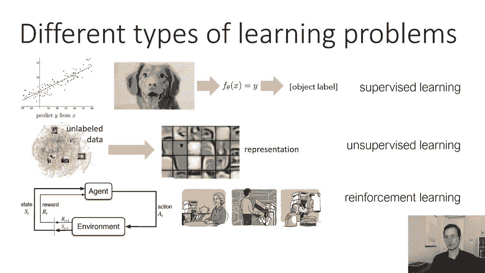
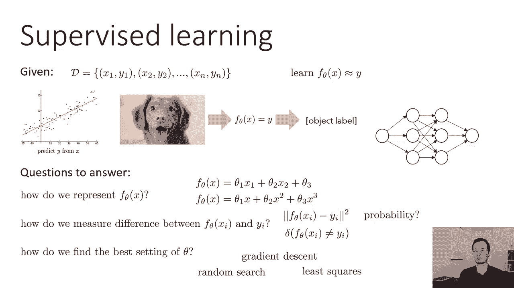
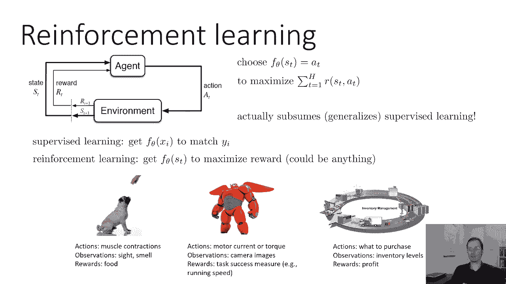
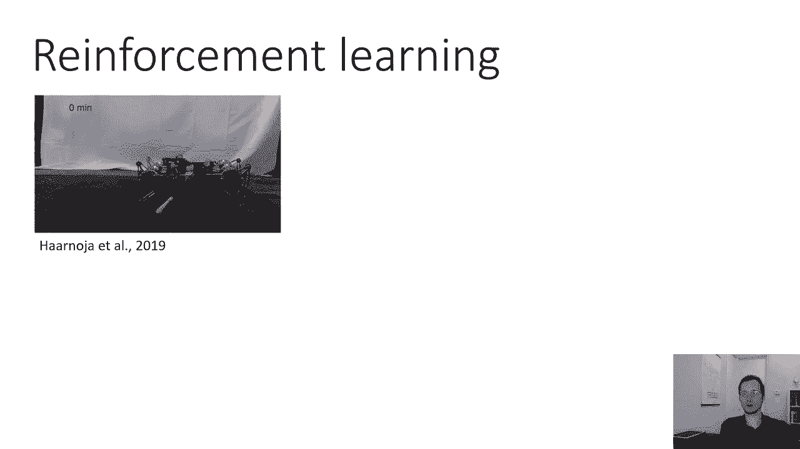
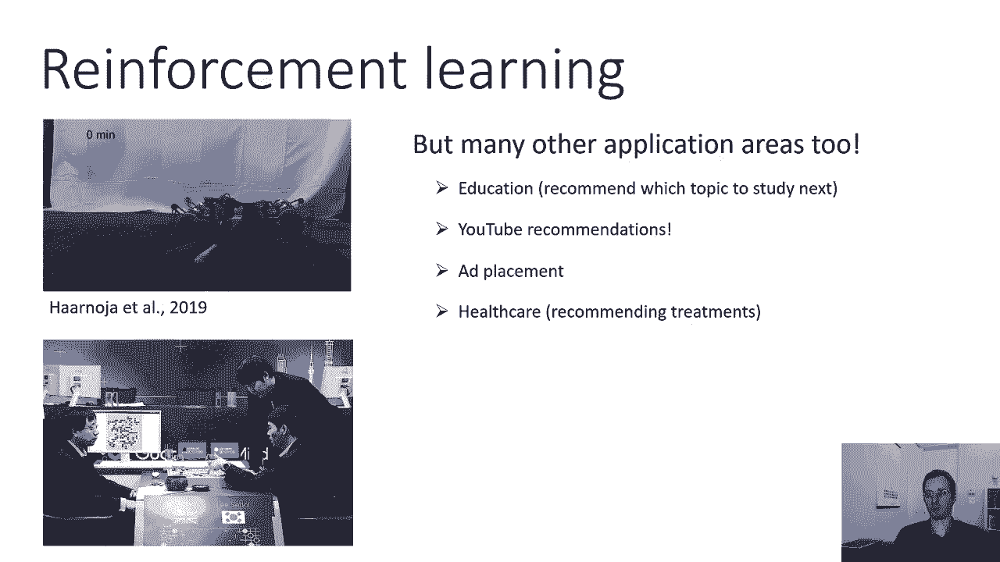
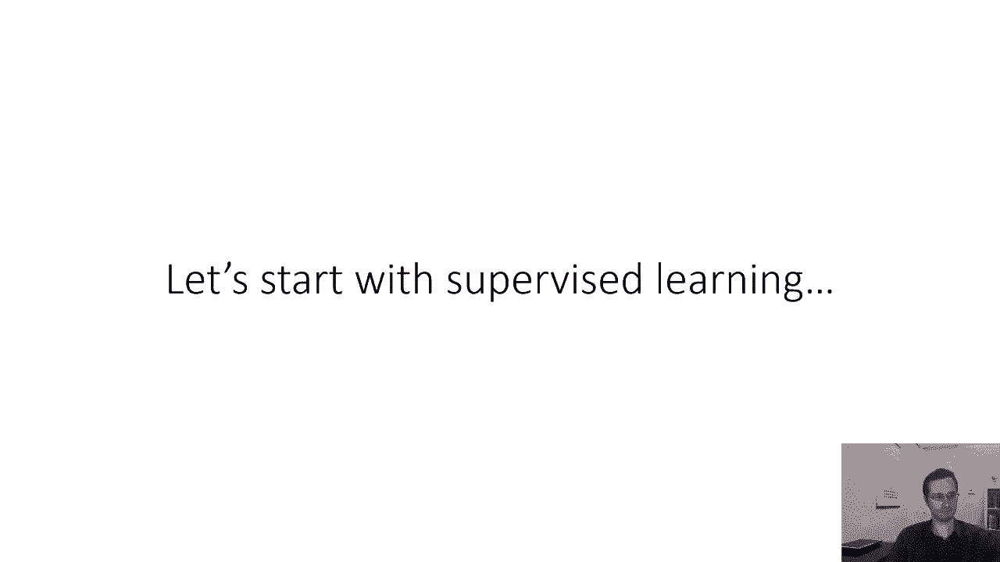

# P4：CS 182- Lecture 2, Part 1- Machine Learning Basics - 爱可可-爱生活 - BV1PK4y1U751

所有的权利，呃，欢迎来到CS一课的第二课，在今天的讲座中，我们将复习机器学习中的一些基本概念，在以后的讲座中，这将与深度学习联系起来，所以让我们从第一个问题开始，我们如何制定学习问题，在机器学习中。

有许多不同的问题设置可以解决，接下来我们将讨论一个规范分类，虽然肯定有其他分类，所以也许最常研究的机器学习问题是预测问题，给定一些输入x预测一些输出y，比如说，如果你在解一个经典的线性回归问题。

你有X对应于水平轴上的位置，和y对应于垂直轴上的位置，然后这个问题可以用线性回归来解决，但同样的问题表述也适用于更复杂、更高维的输入，就像我们在上一节课中讨论的图像分类示例。

其中要预测图像中存在的对象的标签，从图像本身，所以说，也许你想要一个图像分类器来确定一张图片是否包含一只狗，一只猫，或者河马，所以你的标签是狗，希奥塔姆斯之后的猫，输入x是一个像素数组。

这些都是监督学习问题，它们被称为监督学习，因为他们在训练期间被贴上地面真相标签监督，但这并不是唯一存在的学习问题，你可以想象一种不同的学习问题，一开始可能有点抽象，但我们很快就会把它弄得更具体。

从未标记的数据开始，这意味着你没有x和y的元组，你只有X，你可能有网上的照片，您希望以某种方式分析这些输入，或者对数据进行某种分类或聚类，基本上弄清楚X本身的一些东西，这可能对下游学习预测有用。

这被称为无监督学习，如果这现在看起来有点抽象，别担心，我们很快就会更详细地讨论这件事，然后是第三类，至少在规范分类中，是我们想学习与环境交互的策略的地方，所以在监督学习中，我们的目标是从x中预测y。

我们的目标是实际控制一个必须采取顺序行动的代理，所以这个代理将输出一个操作，它将从环境中观察这一行动的后果，以及一个奖励信号，告诉它是做得好还是差，你可以想象，例如。

这是一个正在学习如何执行一些任务的机器人，也可能这是一个广告放置代理，它试图学习放置什么样的广告，获得最大的货币回报，这被称为强化学习，这被称为强化学习，因为在这种情况下，代理从奖励信号中学习。

从正负强化，而不是直接从地面真相监督，就像在监督学习案例中一样，所以我们稍后再谈这个。

所以让我们，呃，更精确地定义监督学习，我们将假设在训练过程中，我们得到了一个数据集，我将用一个脚本来表示，d，这有时也被称为训练集，数据集由x和y的元组组成，其中y是对应于x的真实标签。

所以如果我们想真正解决图像分类问题，我们会收集一些狗的照片，猫，长颈鹿和河马，然后我们可能会有人类，仔细检查每一张照片，并给它们贴上真正的标签，这将是我们的训练数据。

我们将用它来学习如何对新图片进行分类，所以监督学习的目标是学习x的函数fθ，记住这里的θ表示参数，所以实际上是学过的θ，这个函数fθ应该近似等于真标签y，所以再一次，这可能是线性回归设置。

或者更复杂的事情，比如确定照片中物体的类别，现在有许多问题我们必须回答，实际实例化一种监督学习方法，我们必须选择如何表示x的fθ，所以记住在机器学习中，这个fθ只是一个程序。

它是一个读取x并输出y的猜测的程序，所以我们必须选择它将是什么样的程序，参数θ将如何进入程序，它可能是像线性方程这样简单的东西，就会是这样，比如说，对于线性回归，可能是某种多项式回归函数。

也可能是更复杂的事情，就像神经网络，这就是我们在本课程中将要学习的，我们必须选择某种方法来测量x和y的fθ之间的差，所以这里的问题是我们要选择θ，使得x的fθ尽可能接近y，我们需要选择一个相似的概念。

亲密的概念，因为最初x的fθ会输出与y非常不同的值，但我们不知何故需要改进θ，我们需要一些方法来评估一个θ是否比另一个更好，当他们两个都可能犯很多错误的时候，所以在连续设置中。

这可能是x和y的fθ之差的平方，可能是零一损失，这是一个基本上是1的数字，如果x的f等于y且为零，否则，嗯，可能是涉及概率的更复杂的东西，这就是我们在今天后面的课上要讲的内容。

然后我们必须找出如何找到θ的最佳设置，我们实际上发现我们需要设计一个算法来修改theta，得到x的fθ，对于训练集中的XY元组，尽可能接近Y，这叫做优化算法，有很多选择，比如随机搜索，梯度，血统。

最小二乘，等等，我们将在今天的课上再次讨论一个特定的选择。

这就是监督学习，让我们来谈谈无监督学习，所以无监督学习一开始可能看起来有点抽象，我们是说我们要把未标记的数据，我们将制作一个有点奇怪的代表，比如监督学习中的表现是什么，一切都很清楚地定义了。

你只想在这里拍摄图像并输出正确的标签，它似乎没有明确的定义，那么这意味着什么，我们可以制定无监督学习问题的一种方法是，作为生成建模的一个问题，你可能以前见过生成建模的例子，也许你没听过这个词，但例如。

你可以想象一个模特，构建人脸图片的生成性对抗网络或gan，你可能在媒体上看到过这个，一些很酷的，非常逼真的人的脸，实际上并不存在，神经网络可以想象出一张脸，他们也可以梦想，呃，动物之类的东西。

所以这些都是生成模型的输出，它们不是真实的图像，这是一个神经网络，刚刚构建了一个图像，这个神经网络是在未标记的数据上训练的，因为如果你只是想学习如何构造图像，你不需要任何标签或类别。

你现在只需要很多图像，当然这些图像都有一些共同的结构，它们不仅仅是随机噪声模式，所以所有的狗的照片都有狗，但是生成模型不需要标签，它会产生类似于它被训练的图像的图像，更正式的说法。

提供给模型的图像来自一些潜在的分布，所以有一种，你可以把它看作是所有可能的人脸的连续空间，你为训练提供的照片来自连续的人脸，他们是从那一套取样的，然后模型应该重建集合，可能会产生它看不到的脸。

但那仍然是逼真的面孔，生成模型需要获取数据的表示以解决生成问题，所以在模型内部的某个地方有一些表示，这些表示是对人脸的部分进行建模的，像鼻子一样，眼睛，发色，等等，和，事实上，相当多的工作都在看。

提取这些变化因素，并将其用于各种下游应用，所以生成模型的例子，甘斯，Vapixel，r和m，等等，我们将在后面的课程中学习其中的许多内容，无监督学习的另一个很大的领域，尤其是今天。

就是有时被称为自监督表示学习的东西，如此自我，监督表征学习的目的不是直接生成图片、声音或句子，相反，它的目标是在没有直接生成的情况下获得表征，这方面的一个重要例子是语言建模。

你们中的一些人可能听说过伯特语言模型，或者gpt两个两个或gbt三个语言模型，GT2和GT3模型实际上是生成模型，但是伯特，这是在工业nlp应用中应用最广泛的模型，不是生成模型。

所以它确实解决了一种预测问题，它解决的特殊问题是它实际上需要一个句子，删除一些单词，然后试图预测这些词是什么，但这项任务本身实际上并不有用，任务只是迫使模型获得有意义的表示，因此。

模型获得的是语言的内部表示，有用的，然后用于下游应用，包括机器翻译和情感分析，同样的原理在计算机视觉中得到了相当多的研究，比如说，这个想法是你拍一张照片，你从照片上裁出两个补丁。

所以也许你有一张猫的照片，你剪了一只耳朵和一个鼻子，然后你要求模型预测，这两个斑块是如何相对定位的，所以如果你展示一张猫脸和猫耳朵的照片，你知道那是呃，猫的右耳，所以如果猫咪面对的是。

你会在脸的上面和左边，但是做出正确的预测需要你理解一些关于图像结构的东西，猫长什么样，所以不是任务本身有用，这个任务迫使模型在下面，获取图像的有意义的表示，然后可以用来解决其他下游任务。

所以如果这一切看起来有点抽象或者有点呃，奇特，没关系，无监督学习肯定不如监督学习简单，但我们将在以后的课程中更多地讨论它。

最后让我谈谈强化学习，所以强化学习有一个更复杂的公式，因为强化学习不是从图像中预测标签，这是关于以某种方式行事，它是关于存在于时间过程中的代理，他们必须在这个时间过程中采取行动。

并在更长时间内观察这些行动的后果，所以在强化学习中智能体的目标不仅仅是采取最好的行动，现在，而是采取从长远来看导致最佳结果的行动，所以现在你的函数处于所谓的状态，所以我要用，这里是S而不是X。

但同样的原理，它是一种输入，但该输入现在有一个下标，它并不表示这是一个特定的时间点，在每一个时间点上，它都会有不同的输入，然后它向上产生输出，我在这里呼吁采取行动，强化学习的目标是选择那些动作。

这将带来你能想象到的最大回报，例如，正在下棋的特工，国际象棋有很多招式，但只有当你赢了或输了比赛时，奖励才会到来，有趣的是，强化学习实际上包含或推广了常规监督学习，您可以将监督学习制定为强化学习的特例。

如果你得到了正确的标签，奖励就会很大，如果你得到了正确的标签，奖励就会很小，呃，错误的方式，只有一个时间步，现在，实际上解决那个问题比解决原来的问题更难，监督学习问题，因为在最初的监督学习问题中。

您将了解培训集中的标签，必须尝试不同的标签来试错并找出哪一个是正确的，所以本质上，强化学习方法原则上可以解决监督学习问题，但如果你真的有监督，这通常是一条更难走的路，在强化学习中。

你得到st的fθ来最大化奖励，可能是任何东西，奖励可能不是匹配特定的Y I，可能是，比如说，赢得这盘棋，而且不止，获胜的方法不止一种，你可以想出一些例子来说明如何制定特定的问题设置，作为强化学习问题。

比如说，呃，如果你在训练一只狗，狗正在解决一些看起来像强化学习的问题，它的动作是肌肉的运动，它的观察是它的感官，现在的景点等等，它的回报也许是你给它的款待。

你可以想象一个机器人学习执行一些任务比如尽可能快地奔跑，所以它的动作是对机器人马达的马达命令，及其意见，也许我们的相机图像或它的任何传感器，也许它的回报是任务成功的某种程度，就像它跑得尽可能快。

但你也可以想象其他类型的问题，比如，例如，你可以想象物流问题，为E选择仓库库存水平的问题，这里的商业公司，您的操作可能对应于要购买的库存，你的观察可能与仓库里货物的水平相对应。

你的奖励可能与公司的利润相对应，这也是一种完全有效的强化学习。

这实际上是我在研究中所做的，所以我有很多这些东西的视频，这是一个用强化学习学习走路的机器人，当然视频也加快了，这是大约两个小时的过程，但你可以看到它开始了，不知道怎么走。

然后从经验中逐渐领悟，你们中的一些人可能听说过Alphago，这是一个强化学习系统，学会了下围棋，虽然它不是通过和其他人类比赛来学习的，它实际上是通过在模拟中播放尽可能多的自身副本来学习的。

因为要掌握围棋需要玩很多游戏，但也有许多其他应用，除了机器人和游戏，有强化学习和教育的应用，建议学生下一步应该学习哪些主题，提出建议，比如说，YouTube，添加放置健康，向病人推荐治疗方法。

任何可以被表述为顺序决策问题的东西。

在我们没有地面的地方。

