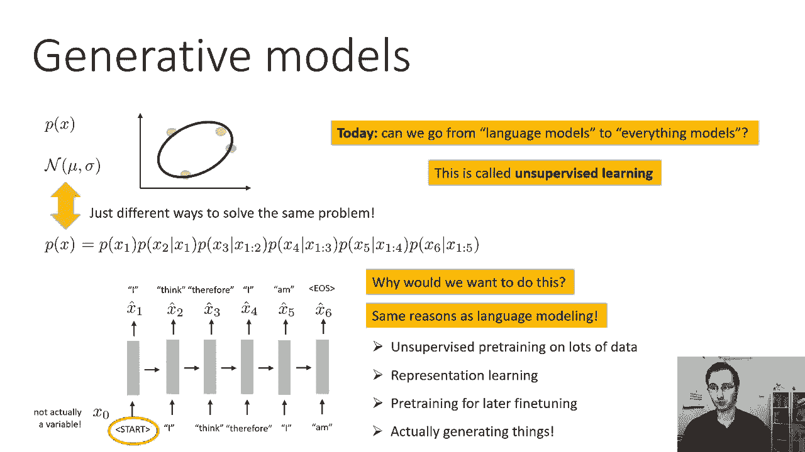
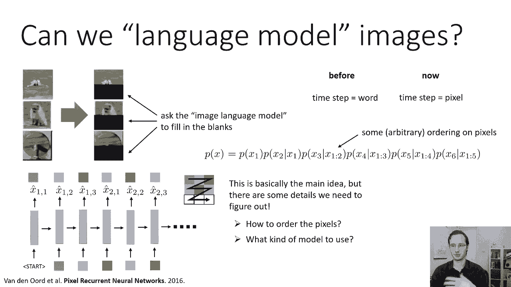
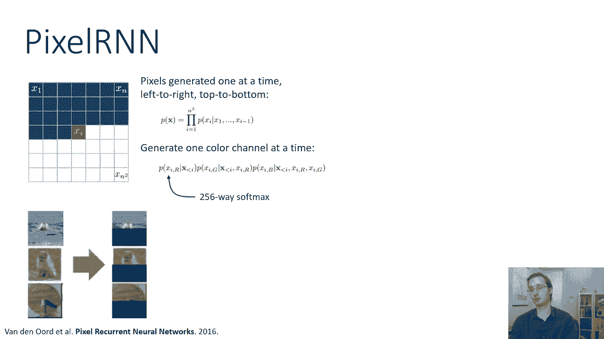
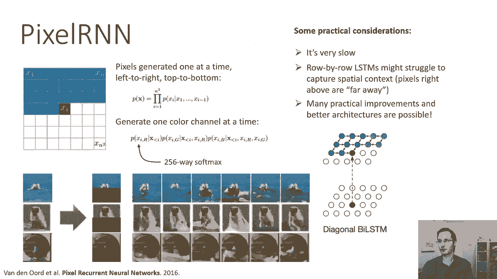
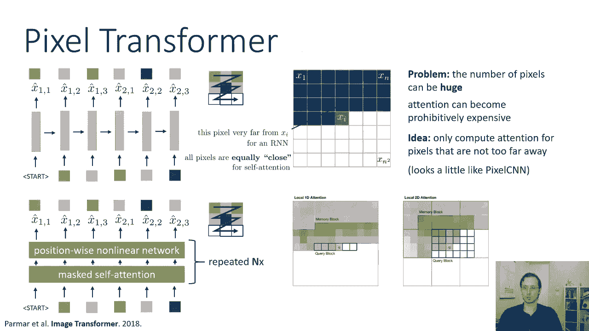
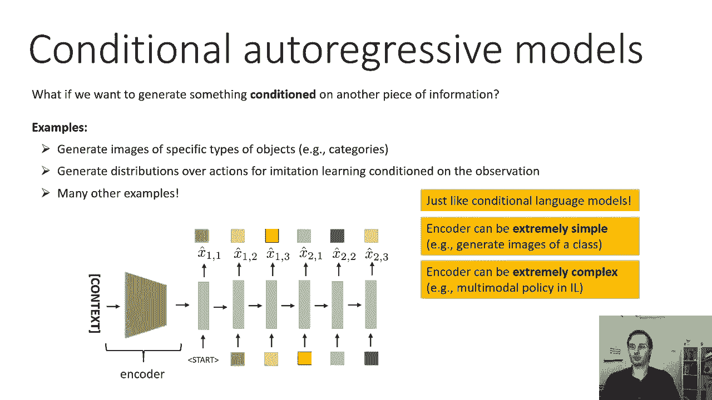
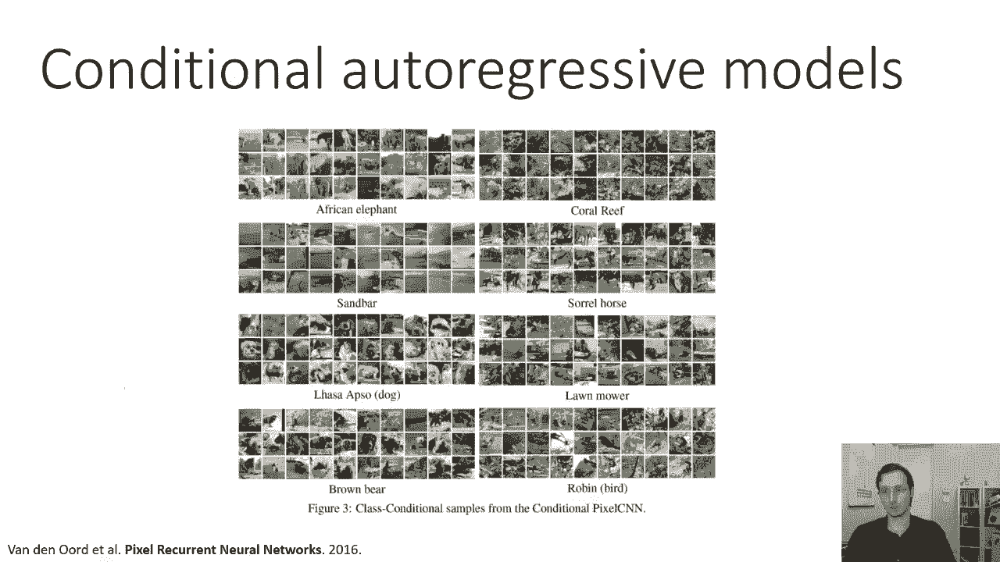
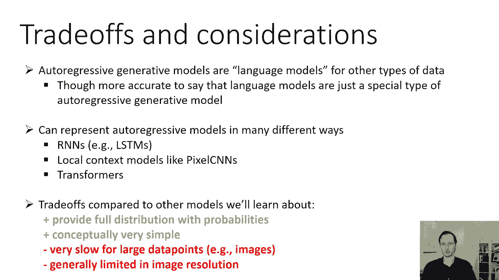

# P51：CS 182- Lecture 17- Part 1- Generative Models - 爱可可-爱生活 - BV1PK4y1U751

欢迎来到CS第十七课，今天我们将讨论生成建模，到目前为止，在这门课程中，我们已经讨论了监督学习，休息之前，我们还讨论了强化学习，从今天开始，我们将讨论无监督学习，但在我们这样做之前。

我们需要讨论一下概率模型，我们在本课程中学习的几乎所有模型，和其他机器学习课程本质上是概率模型，你可以想象，最简单的概率模型之一是，学习随机变量x上分布的模型，例如，如果你有一个二维的点集合。

你估计这些点的平均值和协方差，你真正做的是，你在学习这些点的多元正态概率模型，有时我们把它画成这样的椭圆，其中椭圆的轮廓表示平均值的一个或两个标准差，对呀，这样你就可以想象平均值在椭圆的中心。

一个或两个标准差是线所在的地方，在这种情况下，它可能是两个标准差，我们也可以有条件概率模型，这些就是我们在这门课里花了很多时间学习的，到目前为止，这些模型表示给定x的y的分布p，当然。

像线性回归这样的东西就属于这一类，其中y表示点的垂直位置，x表示水平位置，但深度神经网络分类器也属于Y表示标签的类别，x表示图像，到目前为止，在这门课程中，我们主要讨论了学习形式y给定x的条件模型。

今天我们要学习x的p，现在，我们为什么要这么做，很清楚为什么我们想要一个图像分类器，为什么我们要学习图像或其他类型输入的分布，我们很快就会回到这一点，问题是我们已经看到了一些生成模型。

我们只是没有这样描述他们，所以概率模型或生成模型的简单教科书图片，这是x的p吗，顺便说一句，为什么它调用生成模型，嗯，它被称为生成模型，因为它可以生成x，你不能从给定x模型的y的p生成x。

所以线性回归模型不能帮助你生成x坐标，但是如果你有一个二维随机变量上的多元正态分布，您可以生成新的，从x的p中采样相同分布的二维随机变量，假设我们有一个多元法向右，我们已经了解到的那种生成模型。

与这个多元正态有很大的不同，但它从根本上解决了同样的问题，这就是语言模型，所以语言模型也表示x的p，其中x是单词序列，它们只是解决同一个问题的不同方法，现在。

语言模型对x的p的表示与多元正态分布非常不同，但它在解决同样的问题，从某种意义上说，它也代表了在这种情况下句子上的概率分布，表示概率分布意味着它可以为该空间中的每个点分配概率。

语言模型的空间是句子的空间，对于每一个可能的句子，语言模型可以分配一个概率，在这种情况下，它通过使用概率链式法则来做到这一点，对如果你还记得，链式法则，说任何联合分布都可以分解为条件分布的乘积。

所以如果我们说x的p，x的p一个x零逗号x一个逗号x两个逗号x三个，等等等等等等，逗号x 6，你可以用概率链式法则来写，作为x的p 0乘以x的p 1给定x，0乘以p的x 2给定x 0到1次。

x 3的p给定x 0到2次，4的p给定x零到三次，x 5的p给定x 0到4次，给定x是0到5，现在你们这些仔细听的人，会注意到，我说的和这张幻灯片上的有点不一致。我说你从p的x 0开始，但在幻灯片上。

方程实际上是从x 1的p开始的，给定x 0，所以这可能看起来有点不对劲，但它不是x零，嗯，语言模型的x零，是我们一开始输入的第一个令牌，第一个令牌总是相同的，它总是开始令牌，所以它实际上不是随机变量。

我们知道开始令牌是什么，这不是随机的，总是一样的，所以这意味着在现实中，您可以在这些条件中的每一个中省略对x零的依赖，因为x零不是变量，它只是一个常数，这意味着你可以等价地这样写，而现在，更明显的是。

语言模型实际上是在学习x上的联合分布，它不是条件分布，它不以x零为条件，因为x零不是变量，它真的是一个完整的关节，它是一个概率模型，它是一个生成模型，就像上面的多元正态分布一样，是一个生成模型。

只是语言模型代表了一个复杂得多的分布，在一个复杂得多的物体上，但它满足概率生成模型的所有要求，它可以为你给它的每一个句子分配一个概率，你可以用它来取样句子，您实际上可以输入开始令牌。

在第一个单词上获得软最大值分布，从它的样品，把它作为第二个词输入，等等，你实际上可以从这个分布中生成自然语言句子，所以它是一个成熟的概率生成模型，我们为什么要做好这件事。

我们已经了解了我们可能需要语言模型的几个原因，例如，您可以在没有任何标签的大量数据上训练语言模型，所以你可以下载所有的维基百科并训练一个语言模型，你可以用它来获取非常适合下游的表示，在这种情况下。

自然语言任务，这就是我们在谈论埃尔莫和伯特时学到的，您可以预先训练它，以便以后进行微调，就像我们讨论伯特的时候所说的，和，当然啦，你可以用它来生成东西，所以如果你真的想完成一些句子或生成假句子。

您可以使用语言模型，所以今天讨论的主题不是如何建模语言，我们已经谈过了，主题是我们如何从语言建模到一切建模，我们能不能用我们用来构建这些语言模型的相同思想，建立其他类型物体的模型，如图像或声音。

这叫做无监督学习，这叫做无监督学习，因为提供给模型的训练数据没有用任何标签标记，不需要监督，它只需要未标记的数据，就像语言模型可以用来获取表示一样，或者以后可以微调到其他任务的模型。

或者为了额外产生的东西，我们建立在其他类型数据上的生成模型，喜欢图像，声音等等也可以用来表示，可用于预训练的学习，用于以后的微调，它们可以用来生成东西，就像语言模型一样。

图像和其他类型数据上的生成模型不需要监督。

这就是为什么我们称之为无监督学习，好的，所以我们可以语言模型图像，所以呃，让我们说呃，我们会得到一些，一些真实的图像，我们将用它们来训练，呃，然后我们会得到一些新的测试图像，假设我们以前没见过这些图像。

你可能想做的一项特殊任务是完成这些图像，我们也可以生成全新的，但也许我们能想到的特殊任务是完成一幅图像，所以也许中间有这只狗的真实照片，底部被切掉，你想让你的模型完成底部的部分。

所以如果你能在图像上训练一个图像语言模型，你可以让它填空，就像语言模型可以完成一个句子一样，所以在模型的每一步之前都是一个词，现在每一步都是一个像素，所以我们将尝试在像素上训练一个语言模型。

所以就像以前一样，我们将应用概率链式法则来分解分布，x的p乘以x的p，x 2的p给定x 1乘以x 3的p给定x 1到2，等等，等等，等等，其中下标表示我们正在查看的像素，所以x是像素数组。

x 1是第一个像素，x2是第二个像素，x3是第三个像素，等等，等等，等等，现在我们必须在像素上选择一个顺序来做到这一点，所以我们将选择一些相当任意的顺序，我们一会儿再讨论，但是模型的工作方式。

一种非常简单的RNN模型将与语言模型完全相同，所以我们有某种开始令牌，我们把它放在，然后不是产生一个词，我们产生的是一个像素，我们离散一组像素，你知道的，颜色实际上是离散的。

每个颜色通道的值在零到二五五之间，所以只有256个可能的值，所以我们在可能的颜色值上有一个很大的软最大值，我们一次生产一个，所以在第一步，RNN安装在开始令牌中，它在第一个像素的颜色上产生一个软最大值。

然后就像在测试时的语言模型中一样，生成的采样颜色在第二个时间步骤作为输入输入，它生成第二个像素的颜色，然后这个过程现在重复，当然每张图像中都有很多像素，所以这将是一个相当长的序列，我们必须选择订单。

所以在这种情况下，我选择的特定顺序是扫描线顺序，所以你首先通过第一行像素，x一x一x二x一三，那么如果这是一个三乘三的图像，然后你去x 2 1 x 2 x 2 x 2 3。

然后你去x 3 1 x 3 2 x 3 3，所以这是一个特殊的顺序，2。您可以任意挑选，这是呃，呃，你知道的，没有一个，很棒的选择，但选择有一定局部性的点菜是很好的，所以扫描线排序很好。

因为至少水平附近的像素是顺序的，虽然在垂直方向上不是，所以这基本上是Pixel RNN背后的主要思想，或像素CNN，但我们还需要弄清楚一些细节才能把它变成一个完整的，成熟的生成模型。

首先我们要决定如何排列像素，不幸的是，没有一个完美的答案，所以我们只是挑一些东西，我们得决定用什么样的模型，所以当我们谈论语言建模时，我们了解了RNNS，ldms，多层LSTM，双向LSTM变压器。

当然还有，其中许多选择也可供我们选择，当我们在像素上建立这些模型时，等等。

好的，所以训练这些的主要原则，这些被称为自动回归生成模型，我们把x分成它的维度，x 1到xm，所以x可能是一个图像，而x 1，x2和x3可能是图像中不同的像素，第二步，我们现在将这些维度离散为k个值。

在某些情况下，如，比如说，当我们生成图像时，图像像素自然离散成，比如说，二百五十六个值，因为像素只能呈现256种不同的颜色，然后第三步我们在所有像素上表示完整的关节，或者在x的所有维度上。

任何X可能通过链，这就是我们以前看到的等式，所以当我们像这样使用链式法则时，每个维度都依赖于以前的所有维度，对所有以前维度的依赖由RNN捕获，或者被一个带着伪装的自我注意的变压器，然后这个。

每个维度上的实际分布只是一个软最大值，超过它所能承受的k个可能值，然后第四步，使用您最喜欢的序列模型来实际建模，这个PX可能是一个RNN和LSTM，堆叠的lstm，双向LSTM，伪装自我注意的变压器。

你想要什么都可以，现在假设你训练这东西，如何使用自动回归生成模型，你可以从自动回归生成模型中取样，这样你就可以使用祖传采样，所以你先取样x 1，然后你取样x2给定x1。

然后你采样x 3给定x 1到2以此类推，这与从语言模型生成句子的方式完全相同，所以我们已经学会了怎么做，这其实很简单，如果你想刷新一下，回到春假前的寻访讲座，在那里我们解释取样过程，你可以用它来完成。

所以如果图像的一部分或任何数据类型是已知的，你想完成剩下的，您可以输入已知的值，所以你不会对已知的值进行采样，你只要在里面喂食，他们在里面的已知值，然后对剩下的进行取样，这也是完全合法的做法，事实上。

如果你想品尝，如果你想随机取样，那就一目了然了，如果你想找到最有可能的完成，然后你可以使用波束搜索就像我们用波束搜索机器翻译一样，当然，你可以用它们来表示，又在这里。

这个想法和像埃尔莫或伯特这样的东西是一样的，所以这两个都是序列模型，用于表示学习，我们也可以使用序列模型来进行图像的表示学习，在那里我们将采取类似RNN的隐藏状态，作为用于下游任务的像素的表示。

所以让我们走过，呃，这一类中的一种流行型号，这是特定于图像的自动回归生成建模，这被称为像素RNN，如果您想了解更多关于像素RNN的信息，我在这张幻灯片的底部有一篇论文的引文，所以像素RNN中的想法。

我们要生成像素，一次一个，从左到右，按扫描线顺序从上到下，所以整个图像的概率是由乘积在所有像素上给出的，如果是图像的n，有n个平方的可能像素，每个像素都依赖于它的前辈，定义为所有正在进行的扫描线。

以及当前像素左侧的所有前面的像素，在当前扫描线中，现在每个像素由三个颜色通道组成，所以我们还必须一次生成一个颜色通道，所以实际上每个像素都有一个小网络，你知道的，给出前面所有像素的红色。

然后给出前面所有像素的绿色，这个像素自己的红色，然后生成给定所有前面像素的蓝色，这个像素是红色和绿色，如果你愿意，你也可以把它当成三个独立的像素，但他们是特例，稍微长一点。

它们的阶回归模型的三种二维空间，然后每个彩色通道都是256路的软最大值，所以每个颜色通道的亮度可以有256个可能的值，这是在三个两位颜色中有多少可能的像素亮度，用这个模型。

一旦你训练好了，你可以给它，例如，图像的上半部分，它可以完成下半部分不同的随机实现，这些是像素RNN生成的实际样本，当它呈现这些图像的上半部分时，你可以看到完成度是不同的，因为它们是随机取样的。

但他们也相当明智，例如，那张狗的照片是用不同的狗一样的下半部分完成的，可能它不知道狗有多大，所以说，有时狗很小，有时狗很大，因为它不确定一个人的样子，游泳也是以各种方式完成的，有时一个人在游泳。

有时他们实际上是在乘独木舟或皮划艇，好的，因此，它对这张图像进行了有意义的可能完成的采样，像素rna的一些实际考虑，还是挺慢的，对，因为虽然基本配方与语言模型相同，如果他们，嗯，你知道的。

假设图像是三个二乘三个二像素，这意味着图像中有大约1000个像素，所以这就像是一个千言万语的句子，每个像素本身有三个颜色通道，这样就增加到三千了，这是相当多的。

所以无论是训练像素ARN还是从中取样都是相当昂贵的，在计算上，即使是非常小的图像，如三个，两个，三个，两个图像，逐行生成图像，像这样可能无法捕捉到图像中存在的一些空间上下文，因为位于扫描线正上方的像素。

在RNN排序中被认为是遥远的，因为在三二三二图像中的空间相干性，三步远，所以国际扶轮努力回忆发生了什么，我们在实践中可以使用各种各样的技巧，使用像素RNS缓解此问题，也有很多实际的改进，和更好的架构。

可以进一步改善像素RN，所以呃，像素RNN论文中描述的一个示例是一种，就是他们所说的对角线胆汁STM，对角线双向LSTM，其中，当前像素实际上按扫描线顺序接收来自其前身的输入。

但它也有来自其上方扫描线的连接，这很容易做到，因为您可以从以前的任何隐藏状态短路连接，对呀，所以你不必按顺序去，你可以，你基本上可以从上面的隐藏状态创建一个快捷连接，即使有很多很多的时间步骤。

所以我不打算详细说明，LSTM的对角线，如果你想了解更多关于它的细节，我鼓励你看看报纸。

在Pixel RNN中也描述了一个想法，是一个叫做像素CNN的简化模型，我想描述这个简化的模型，两者都是因为它更有效率，因为它说明了一些可能的简化，我们可以对这些类型的自动回归模型。

所以像素CNN的想法是让这个生成过程更快，通过不在所有像素上构建完整的RN，但是仅仅使用卷积来确定像素的值，基于它的邻居，我还应该提到，这个想法与构建RNN并不相互排斥，你实际上可以把它们组合在一起。

但让我来解释一下Pixel CNN的想法，所以在我们建立RNN之前，这将读取上面所有的像素，和当前像素的左边，现在我们要做的是，我们要说好吗，这个像素的值，我们将以256种方式产生这种。

softmax只依赖于此像素的本地邻域，这很像修道院的工作方式，除了我们的问题是我们没有生成整个社区，如果我们要生成这些像素，按扫描线顺序一次一个，当前像素上方的像素，左边的像素已经生成。

但是下面的像素和右边的像素还没有生成，然而，所以我们要做的是，我们实际上将有一个屏蔽卷积神经网络，这将读取像素的值，但它对下面的所有东西的重量都是零，然后往右边，所以这个，所以这个修道院产生的价值。

就要，仅依赖于当前像素左侧和上方的像素，它不会在当前像素中读取，因为它在产生它，它不会读到下面或右边的任何东西，当前像素被掩蔽，下面和右边的是最大的掩蔽，因为它们还没有生成。

这意味着在相应的卷积滤波器中，他们的体重被迫为零，但是上面和左边的像素是红色的，你有一个卷积网络，步幅是一个没有，没有填充物，或者更确切地说，零填充，这样就不会降低图像的分辨率。

它实际上会在最后产生一个286路的软马克斯，所以你可以把它看作是一个完全卷积的网络，这不会降低分辨率，这将为这个像素生成一个值，而且会很快，我们能瘫痪这个过程吗，答案其实是肯定的。

所以瘫痪图像中所有像素的RNN是，当然啦，不可能，因为RNN需要一次读取一个像素，但修道院实际上可以瘫痪，至少在训练期间是这样，因为在训练期间，你有所有可用的像素，所以你可以在危险中训练他们。

只要你强迫掩蔽保持不变，所以你必须强制过滤器的权重为零，以及下面或右边像素的所有东西，然后你可以很快地进行瘫痪训练，呃，就像训练常规组件一样，当你想生成一个新的图像时，你能在生成过程中瘫痪这个过程吗。

花点时间想想这个问题，所以答案是否定的，你不能用一个像素来麻痹一代，因为并行生成它们的像素意味着您将，你知道的，必须在图像中间生成一个像素，和左上角同时，但是中间的像素，它需要读取上面和左边的像素。

来计算它的价值，而这些还没有产生，所以生成仍然需要一次一个像素地发生，就像在像素RNN中一样，但训练可以完全并行，但这也是为什么像素，cnn并不像看起来那么严格，因为一开始看起来像素CNN是个坏主意。

因为中间像素的值只取决于一个小邻域，但要记住的是，当地社区的像素本身，取决于他们附近的值，例如，我用箭头突出显示的这个像素，因为像素将一次生成一个，它们实际上现在会以这种方式保持一致，当然啦，在现实中。

我们可以用多层卷积做像素CNN，和更大的感受野，所以如果你有，让我们说，五乘五的卷曲，你有多层，也许你有五层或十层，你有一个小三，二乘三二像，感受野可能包括几乎整个图像。

所以我在幻灯片上的图片有点欺骗性，在现实中，像素的接收场，CNN的每一个点都不仅仅是一个小小的三乘三的社区，它甚至可能和整个图像一样大，但即使不是像素，因为它们会影响附近的其他像素。

所以尽管这看起来像是一个有点限制性的体系结构，它实际上相当强大，在训练中速度要快得多，现在我们也可以建立其他类型的模型，与我们在本课程的语言建模部分中讨论的方法相同，不仅仅是RNNS，我们可以，比如说。

构建像素变压器，所以我们可以从一个像素接一个像素的LSTM，或者堆叠LSTM来有一个蒙面的自己，注意和位置方向重复n次的非线性网络，就像在变压器解码中一样。

所以我们可以使用变压器解码器风格的架构来建立图像模型，所以如果你想了解更多关于这个的信息，查看帕尔马尔的论文，名为《从2018年开始的图像变换》，现在，当我们谈到像素时。

图像转换器确实有一些非常好的特性，变压器实际上并不强加特定的顺序，事实上，这就是为什么我们需要像位置编码这样的东西，因为没有位置编码，它甚至不知道像素在哪里，这意味着即使我们必须选择一个顺序来生成像素。

所有的像素在某种意义上都是相等的，如果我们使用RNN和扫描线订单，但所有像素都同样接近自我注意力，所以自我注意力可以很容易地索引到像素中，因为它可以索引到它上方的像素，或者就那件事而言。

左上角的一个像素，所以自我关注是一个很好的选择，因为即使我们仍然要选择一代人的订单，排序并不影响，它是将信息从一个像素传递到另一个像素，因为有了自我关注，他们都一样接近，然而，这个食谱有一个问题。

就是像素数可以很大，注意力可能会变得昂贵得令人望而却步，在这种情况下，请记住，注意力模型的运行时间是O，平方如果地平线是h所以如果你有h的时间步长，那么它的成本是h的平方，一般用于计算短序列的自我注意。

我们其实不担心这个，因为那个H的成本，平方注意计算相对低于运行所有位置的成本，明智的非线性网络之类的东西，所以基本上是在大O的意义上，它是二次的，但它前面有一个小系数，这意味着对于序列长度的小值。

二次部分并不困扰你，但当然，如果序列足够长，最终它变得有问题，最终，二次项总是压倒任何线性项，所以实际用于图像转换器的想法，使这在计算上可行，只计算不太远的像素的注意力，所以这里的直觉类似于像素CNN。

像素的本地上下文比非常远的像素更重要，改造过的口罩，自我注意，在哪里，掩码防止模型查看尚未生成的像素，但它也防止它看到太远的像素，所以有两种呃，使用的地点，一个是本地的一个D注意左边。

另一个是右边的局部二D注意，所以在一个D注意，它只查看当前左边的像素，一个，在当前扫描线中，和两个D注意，它看着左边和上面的一个街区，但不是一直回到左上角，所以这让它看起来更像像素CNN。

而是通过自我关注和更大的图像。

这对于较小的图像非常重要，可能没有那么重要，现在，我们可以看看我们可以从像素RNN中获得的世代，与变压器相比，所以左边的图像通过从像素RNN采样来显示世代，在接受CFR10培训后。

右边的图像显示了像素变压器的样本，在C部分第十部分上训练时从图像变压器，你可以看到变压器似乎生成了看起来像，你知道的，更像现实的东西，他们仍然不完美，但它们看起来更像汽车和鸟之类的东西。

而像素RNN图像，你知道的，如果你有点，如果你站在离放映很远的地方，你眯着眼睛，他们，你知道它们看起来有点像照片，但不是很可怕，嗯，现在，关于这些类型的模型，我想提到的另一件事是，条件自回归模型。

条件回归模型，那么如果我们想生成以另一条信息为条件的东西呢，就像我们可以训练条件语言模型一样，我们可以训练条件自回归模型，比如说，我们可以训练生成特定类型物体的图像，例如，你可以有一个模型。

不只是生成随机的像素图像，但你可以告诉生成一只鸟，生成汽车，产生蒸汽火车，你可以有一个条件的自动回归模型来模仿学习，它在模仿学习的动作上生成分布，以观察为条件，对呀，这是条件自回归模型的另一个例子。

我在模仿学习课上提到过，当然还有许多其他的例子，食谱非常类似于条件语言模型，所以你有一些你正在适应的东西，我们称之为上下文，这可以像对象标签一样简单，或者像模仿学习中的状态或观察一样复杂。

上下文是使用某种编码器网络处理的，这可能只是一个前馈模型，a conv网，也可能是另一个RNN，这是用来开始汽车的第一步，回归生成模型，这就像条件语言模型一样，编码器可能非常简单，如果，比如说。

您正在生成一个类的图像，所以上下文只是一个热向量，表示要生成哪个类，或者可能很复杂，比如说，如果你有一个多模态策略和模仿学习，编码器实际上表示策略，和RNN。

在动作空间的不同维度上实际上可能是一个相当小的RNN，它只是生成单个维度。

下面是一些条件自回归模型的示例图像，在本例中，这是一个以对象类为条件的模型，然后呃，你知道的，这里的课程是非洲的，大象，珊瑚，暗礁，割草机，等等，您可以看到，对于每个对象类。

它生成的图片可能更让人想起那个类，这些图像看起来也比纯粹的无条件像素好得多，我之前有几张幻灯片的rnn示例。

好的，因此，自动回归生成模型的一些权衡和考虑，自回归生成模型基本上就像语言模型，但对于其他类型的数据，虽然，更准确地说，语言模型只是一种特殊类型的汽车，回归生成模型，所以汽车的概念。

回归生成模型实际上比语言模型更一般，您可以用许多不同的方式表示自动回归模型，您可以使用rnn或lstms表示它们，您可以使用本地上下文模型，如像素cnns，训练起来更便宜，也更简单。

或者你可以使用更复杂的自我注意模型，比如变形金刚，这些模型有一些有趣的权衡，与我们稍后将讨论的其他模型相比，我意识到这有点奇怪，因为我还没有描述其他型号，但只是作为预览，以下是我们会发现的权衡。

总的来说，这些汽车激进的生成模型的一个真正的好处是，它们提供了具有概率的完整分布，所以他们真的会给每个可能的x分配一个概率，这些概率很容易得到，其他一些人就不是这样了，更复杂的生成模型。

我们将在周三讨论，它们在概念上非常简单，如果您理解语言模型，你很可能会理解自动回归生成模型，我们将讨论的其他一些类型的模型更加复杂，缺点是，对于大X来说，它们可能非常慢，比如说，高分辨率图像。

他们训练得极其缓慢，它们生成的速度非常慢，而正因为如此，通常你需要一个有限的图像分辨率，所以当我们谈到生成对抗网络或甘斯时，下周我们可能会讨论生成，你知道，高清分辨率十二十四乘十二十四。

而对于这些像素RN，你知道，三二乘三二，或者六十四乘六十四，大概是最大的，你可以得到这样。

