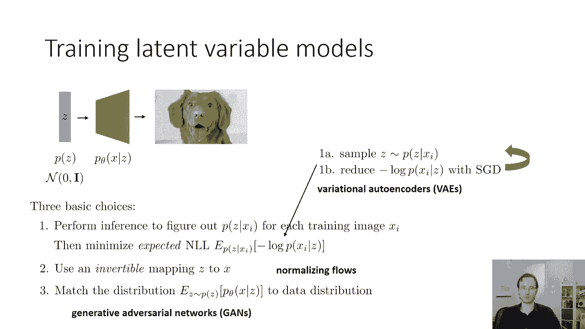
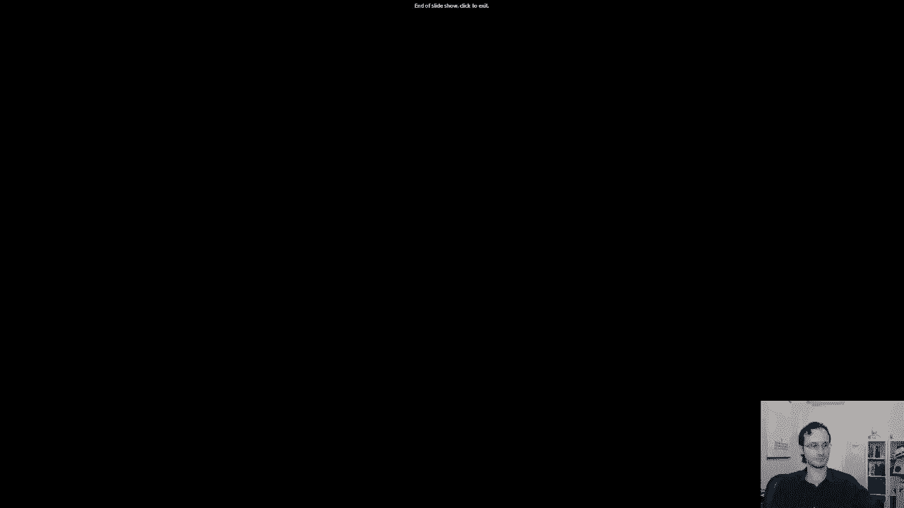

# 【双语字幕】伯克利CS 182《深度学习：深度神经网络设计、可视化与理解》课程(2021) by Sergey Levine - P53：CS 182- Lecture 17- Part 3- Generative Models - 爱可可-爱生活 - BV1PK4y1U751

在今天讲座的最后一部分，我将讨论一些关于自动编码器的最后细节，然后我将开始讨论潜在变量模型，这将持续到周三，首先我想告诉你们的是，这真的有点历史，呃，那种总结是，呃，在深度学习的早期。

自动编码器是如何实际使用的，这种技术被称为分层预训练，实际上是激发现代深度学习研究的原因之一，二十六岁左右，它今天没有那么广泛地使用，但我认为了解这件事很重要，因为在某些地区。

这些想法确实一次又一次地出现，所以主要是，这将是一种为您自己的理解，它可能不是你要用的东西，如果你真的想训练深度模型，但很高兴知道，所以早期广泛使用的自动编码器之一，他们是的原因。

你知道在深度学习的研究中如此重要，就是为了这个东西，称为分层预训练，分层预训练本质上是我们如何训练非常深的神经网络，而不必在它的所有层进行反向传播，这个想法是下面从一些输入开始，像一个图像。

并在该图像上训练一个小型自动编码器，使用像去噪或稀疏这样的东西，所以这个自动编码器可能有三四个，或者你知道，也许我们说两到四层，不是很深，它将学习一些隐藏的表示，用这个蓝色矩形表示。

然后我们要训练这个自动编码器，我们将对训练集中的所有图像进行编码，并得到它们相应的隐藏状态，用蓝色矩形表示，然后我们将在这些蓝色隐藏状态上训练另一个自动编码器。

所以绿色编码器只是使用蓝色隐藏状态作为输入和输出，它根本不看原始图像，它还有一个隐藏的状态，绿色隐藏状态，这个绿色编码器也比较浅，大概两到四层，然后我们将训练另一个自动编码器。

它使用绿色隐藏状态作为输入和输出，现在它得到了另一个，比如说紫色隐藏状态，这个想法是，如果我们每次训练一个自动编码器，我们使表示更加抽象，稍微解开一点，可能会有点损耗。

然后这些自动编码器的所有编码器的组合，将把原始图像编码成更抽象的表示形式，所以当我们想用这些模型来解决一些下游任务时，实际上会组成所有这些的编码器，呃，自动编码器，蓝色的那个，绿色的和紫色的。

尽管它们中的每一个都很小，只是几层把它们组合在一起就给了我们一个非常深的网络，然后我们对网络进行端到端的微调，以实际执行我们想要的任务，比如对图像进行分类，在深度学习的早期，这个配方非常有效。

因为我们可以用它来训练比我们所能训练的更深的网络，端到端反向传播，所以有一段时间大约有两万六千二十九，这是训练深度网络的主要方法之一，但之后发生的事情是，我们在训练深度神经网络方面做得更好了，首尾相连。

比如Relus批处理规范化和更好的超参数调优，我们真的要对此负责，一旦我们能首尾相接地训练这些网络，然后我们就不再需要层前训练了，训练所有这些自动编码器的好处相对要小得多，为了初始化我们非常深的网络。

相反，我们可以简单地用类似Xavier初始化的东西来初始化它们，然后使用像整流线性单元这样的东西，它有更多的好，行为梯度批处理归一化，这进一步提高了我们的渐变，和像Adam这样的好优化器，你知道的。

多花一点时间调优超参数，实际上让事情运转得一样好，如果不是更好的话，当整个网络端到端地训练时，然后用分层预训练初始化时，所以很高兴知道，今天用的不多，但是。

这就是为什么你会看到自动编码器弹出这么多的部分原因，在深度学习文献中，当然还有，相应地，自动编码器变得不那么重要了，一旦人们想出了如何进行端到端培训，因为他们不需要再推迟明智的预训练了，所以呃。

今天自动编码器在哪里，嗯，它们现在使用得不那么广泛了，因为有更好的选择，所以对于表征学习来说，比如变分自动编码器，实际上是概率生成模型，我们将在周三学习和对比学习，那些是那些被取代的。

更传统的自动编码器，甘斯，Vaes和自动回归模型往往在生成时做得更好，你可以从它们中提取图像，而你不能从去噪自动编码器中取样，或者稀疏的自动编码器，对于快速而肮脏的表示学习来说，它仍然是一个可行的选择。

速度很快，可以工作，好的，你知道的，计算训练，去噪自动编码器是数量级的，比训练像素RNN之类的东西更快，所以如果你真的需要一个代理，真的很快，这是一个不错的选择，它不是很可扩展，有更好的替代方案。

如果你愿意花更多的时间来实现事情，自动编码器的一个大问题，我在讲座的前一部分描述的那些，从自动编码器采样或生成是非常困难的吗，限制了它的用途，对呀，所以你可以对图像进行编码，获取隐藏状态然后解码。

但是从零开始生成图像是非常困难的，变分自动编码器实际上解决了这个问题，这是当今应用最广泛的自动编码器，所以下次我们会更多地讨论这个问题，但在今天的讲座中，我们在这一部分实际上会有什么，在这一部分中。

第三部分是对潜在变量模型的一般介绍，这将奠定基础，我们将在周三介绍变分自动编码器，所以我们今天实际上不会描述变分自动编码器训练，我们将讨论基本思想，它们背后的基本概念，这样我们就可以描述周三的训练过程。

所以要理解这些模型的基础，我们需要谈谈潜在变量建模，到目前为止，当我们谈论概率模型时，比如x的p或y的p，给定x，唯一的随机变量是x和y，我们有隐藏的状态，我们有隐藏的变量，比如RNN的状态。

但它们不是随机变量，x有确定性的结果，如果你上了机器学习班，比如，比如说，CS一八十九，你可能已经学过潜在变量模型，但我在这里重述一下基本思想，假设你在做密度估计，就像x的p，你的数据是这样的。

现在颜色不是给你的，所以就你而言，它只是一个点的集合，碰巧在三个团块中，这里的颜色只是为了你的可视化，现在，人们很容易认为，这种数据的好模型，不会是一个多元正态分布，但实际上是三多元正态分布。

它看起来很像一个混合模型，就像高斯人的混合体，高斯混合实际上是一个潜在变量模型，因为当我们把这样的数据集表示为高斯的混合体时，我们说除了一个点的二维坐标，还有一个我们没有观察到的变量。

它决定了柯里特在哪个，这个变量是绝对的，在这种情况下，它可以具有三个值，有三种可能的团块，所以这个未被观察到的潜在变量，隐藏变量z是一个分类变量，有三个值表示红色，洋红色和绿色丛。

取决于我们在这些团块中的哪一个，我们会有一个不同的多元正态分布，所以有一个额外的随机变量，但我们不观察它，这意味着我们必须把它边缘化，所以这意味着x的p等于和，在此分类变量的所有可能值上。

给定z乘以c的p，x的p的所有三个值，所以这是一个潜在变量模型，它通过引入另一个变量z来解释数据的分布，在数据集中没有观察到的，但仍然存在于生成过程中，所以在这种情况下，它是混合元素。

同样的思想也可以应用于条件模型，所以如果你有一个给定x的y的模型p，你可以说实际上有潜在的，你有一个关于这些组的分布，想象一下模仿学习绕着树的例子，你向左或向右绕着树走，也许潜在变量z决定了你的选择。

你向左还是向右，两个可能的值，取决于这个选择，你会有不同的动作，但这些行动也将取决于你的观察，当然还有，当我们谈到模仿学习时，我们已经讨论过这种类型的模型，当我们讨论如何有一个输出高斯混合的策略时。

但让我们更一般地讨论潜在变量模型，这将导致一个非常强大的潜在变量模型，比高斯的混合物强大得多，假设x的分布p非常复杂，也许它没有，它不是仅仅由三个团块组成的简单的东西，这是一个非常复杂的可怕的分布。

我们不能用高斯来表示它，我们不能用三个高斯来表示它，只是一些复杂的函数，让我们在另一个变量z上引入另一个分布，这很简单，所以我们说z的p是很简单的，它只是一个零平均单位方差，正态分布。

一个非常简单的分布，然后我们将建立我们的生成模型，作为从Z到X的映射，概率映射，所以它会说x的p给定z是高斯的，平均值是Z的某个神经网络函数，方差也是Z的神经网络函数。

所以这意味着x的p是由一个积分给出的，在所有可能的值上，给定z乘以z dz的p，它是积分而不是和的原因是因为现在z是连续的，所以我用这种方式构建这个模型，我为什么要这么做。

我这样做的原因是因为x的p非常，非常复杂，学习非常复杂的分布是困难的，很难代表他们，训练他们很困难，我在这里想做的是，我试图把x的p表示为两个非常简单的分布的复合，其中一个分布是z的p，它是高斯分布。

它甚至不学习，它只是一个固定的分布，另一个是给定z的x的p，现在x的p给定z是一个简单分布，它是高斯的，但是它的参数，均值和方差是C的非常复杂的函数，它们是由神经网络给出的。

所以我所做的是选择表示x中的p，通过这种方式，我已经将大部分复杂性卸载到映射中，从z到x的均值和方差，所以现在实际的分布非常简单，分布都是高斯分布，但当然，x的均值和方差，高斯是Z的一个复杂函数。

通过把我在x上的复分布表示为这两个相对简单的分布的组成，我让解决这个建模问题变得容易多了，所以我有一个简单的z分布和一个简单的x分布，但是x上的分布是z的一个复杂函数，不过没关系。

因为这个函数是确定性的，从z到mu的映射和从z到sigma的映射，这些只是确定性函数，我们知道如何表示确定性函数，我们用神经网络来做到这一点，所以这可能看起来有点抽象。

但是这个基本原理对于理解潜在变量模型是非常重要的，我们将学习各种不同的潜在变量模型，就像AES和甘斯，但它们基本上都是基于这个原理，在一个非常抽象的潜在变量z上有一个简单的分布。

在复杂变量x上有一个简单的条件分布，x可能类似于图像，但是从Z到X的映射，z到x的均值和方差，或者x的分布参数是什么，这是由神经网络表示的，这可能很复杂，但这是确定性的，如果这看起来还有点抽象，别担心。

在接下来的几张幻灯片中，我将更多地讨论这个问题，好的，我们如何训练潜在变量模型，我不打算在这里给你一个完整的食谱，我来教你一些挑战，完整的食谱将在周三，所以我们要有一些模型，我们称之为x的pθ。

就像在我们有Y的p theta之前，给定x，现在我们有x的pθ，我们有一个X的数据集，这里的下标现在可以知道不同的数据点，所以它不像在呃，语言建模，这些是不同的词，现在这里的每个x都是一个完整的图像。

所以x 1是一个图像，x 2是一个不同的图像，等等，我们以最大的可能性训练，我们总是以最大似然训练概率模型，所以我们要训练它相对于θ最大化，日志数据集的总和，x的pθ，但请记住你的每一个X。

你的每一个x的p都是所有z右的积分，所以x的p等于所有z的积分，x的p给定z乘以p，z乘以直流的p，所以如果你在日志中用这个定义代替x的p，然后你就得到了这个目标，不幸的是，这个目标是完全无法实现的。

因为你不能把所有可能的都整合起来，Z是对的，没有，这个积分没有闭形式解，所以当我们训练潜在变量模型时，我们需要用一些更容易管理的东西，我们在实践中实际使用的是所谓的期望对数似然，嗯。

我们将了解更多关于数学原因的知识，周三使用预期对数似然，但今天我主要想提出一点直觉，因此，预期对数似然的表达式如下所示，而不是使用x的log p，我们做的是，我们基本上猜测每个图像的Z是什么。

Z是我们的猜测，所以不要试图把z积分出来，我们实际上要猜测Z应该是什么，然后我们将最大化z和x的概率，我们猜测Z应该是什么的方法是，通过估计给定x的z的p，给定Z的概率是多少。

给定我们在内核下看到的图像，所以这被称为期望对数似然，这很有道理，你本质上是说你的数据集没有Z，所以让我们猜Z把它们填满，然后这样训练模型，所以直觉是，给定你的x，你猜到最有可能的z，假装它是正确的。

但是Z有很多可能的值，那么最大的问题是，事实上，训练这些潜在变量模型的主要问题是，这叫做概率推理，解决这个概率推理问题的方法有很多，我们将讨论一个特定的，周三非常常用的选择叫做变分推理。

但我们今天不谈这个，所以今天，我将把我对训练的讨论限制在这个声明上，为了训练一个潜在变量模型，有很多不同的选择，但一旦你能做到，逗号z，所以说，呃，推理过程基本上是什么，是为了一个特定的X。

对于其中的某一点，分布在，呃，x以上，Z上的对应分布是什么，好的，所以这有点抽象，这是一般的潜在变量模型，但让我们特别谈谈深度学习中的潜在变量模型，我将展示一个不那么抽象的，对这些事情的更机械的看法。

那么深度学习中的潜在变量模型是什么样子的，有一个变量z，z是一个向量，就像我们有一个向量h，现在我们有一个向量z，它扮演着同样的角色，只是一封不同的信，它有z的先验分布p。

现在这个先验分布通常被设置为非常简单的东西，因为Z的意思不是固定的，Z的意思完全由你的模型决定，所以你实际上不需要学习或设计z的p，你可以选择一些简单的，像一个零，平均，然后你有一个解码器。

就像在自动编码器中一样，解码器将向量z映射到x上的分布，这是一个神经网络，所以基本上一个Z进去，然后在x上得到一个分布，其中x可能对应于，让我们说，图像，使用生成模型的工作原理是这样的。

首先你从z的p中采样z，这听起来很花哨，但它真正的意思是生成一个随机数向量，z的p是a是零均值单位方差高斯，所以你只需生成一个向量，也许Z有，你知道64维，你生成64个正态分布数，基本上就像，就像。

它就像一个随机数发生器，只是随机数的来源，第二步，从给定z的x的p中提取样本x，这意味着你取Z，你通过你的网络运行它，这个网络在x上产生了一些分布，所以把随机数矢量变成图像，现在x上的分布可能很简单。

可能是软麦克斯之类的，也可能是高斯，所以一个潜在的变量，生成模型通常只是一个将随机数转化为有效样本的模型，这真的是全部，对于前面幻灯片上所有花哨的数学来说都是如此，机械地。

这就是它看起来像生成向量随机数，调用Z运行到你的神经网络，获取图像，请不要告诉任何人，我说过这句话，稍微破坏了一点神秘感，但仅此而已，和Vaes，甘斯，等，他们只是做这件事的不同方式。

所以这样的模型有很多种，Vaes，甘斯，使流动正常化，等，最重要的是，它们在训练这些东西的方式上是不同的，在表示上有一些微小的差异，我也是，但这是基本思想，所以今天我们要讨论如何表示和使用这个。

而下次我们将讨论如何训练这个，有不同的训练方法，取决于你是想要Vies还是甘斯或其他东西，那么我们如何表示潜在变量模型，简单的一个是如何表示z的p，那真的很容易，只要生成高斯随机数，这里没什么可学的。

没有什么花哨的，在给定z的情况下，你如何表示pθx，这部分稍微复杂一点，一个是说你的像素是连续值的，假设你的像素是实数，那么你通常会做的是，你可以把它表示为一个具有对角协方差的多元正态分布。

这就意味着每个像素都有一个平均值，每个像素都必须有一个方差，每个像素的均值和方差都可以，一般是z的函数，所以它们可能是神经网络的输出，平均值是神经网络函数，方差可选地是神经网络函数，对呀。

所以你的解码器然后为每个像素输出一个mu和一个sigma，我们通常会简化这一点，我们将使sigma成为一个常数，所以我们不会有神经网络输出，sigma sigma可以独立于z学习。

或者甚至可以手动选择像一个固定的东西，在这种情况下，你只得到一个平均平方误差损失，好的，所以这变得非常简单，对于这些型号来说，这实际上是一个相当常见的选择，另一个选择是说你的像素是离散值的。

在这种情况下，你可以做一些非常类似于我们为Pixel RNN做的事情，或像素CNN，只不过不是每个像素都依赖于其他像素，现在像素可以独立了，两个四向六向软最大值，因为它们都依赖于z。

所以基本上Z把像素耦合在一起，但是z上的条件，像素都可以是独立的，这实际上很有效，但是有点慢，还有其他选择，我们在这节课中没有讨论，如果你想要离散分布，而不必有一个巨大的256路Softmax。

如果你想了解这些，查找离散逻辑或二元交叉熵之类的东西，所以他们基本上是，但更难描述表示这些分布的方法，离散Logistic对于性能最好的模型尤其常见，我们应该使用什么架构，呃，给定z。

我们知道它会输出什么，将在每个像素上输出软最大值或平均值，也许每个像素的方差，但是架构应该是什么，一个简单的选择就是用一个大的，全连接网络，基本上是一堆线性层加上值，这是一个非常常见的选择。

在这类模型的早期，它也适用于像MSIST这样的微小图像，或对于非图像数据，但是如果你，如果你有呃，更复杂或更大的图像，更好的选择是使用转置卷积，所以如果你回想一下我们关于计算机视觉的讲座。

当我们谈到这些转置卷积架构时，用于全卷积图像分割，语义分割，你可以想象，基本上就是用建筑的右手边来转动矢量，将Z向量转换成整个图像，所以你把这些向量，你把它们穿过一个完全连接的层。

把它们变成低维的低分辨率卷积图，然后你用转置，卷积，和拆分来提高分辨率，直到它达到你想要的最终图像的全部分辨率，这实际上是更复杂的人的常见选择，这类生成模型，训练潜在变量模型。

我们将在星期三进一步讨论这个问题，但基本上有三种基本类型的选择，然后最小化期望的负对数似然，这就是我之前提到的，给定c和sg，唯一困难的部分是，这就是我们周三要讨论的，这就是变分自动编码器的作用。

另一个选择是学习从z到x的可逆映射，所以你可以使用一种特殊的神经网络将Z映射到X，它的逆可以很容易地从神经网络本身恢复，这是一个被称为规范化流的模型使用的，我们也将在周三了解这一点，然后呢。

第三个选择是不要费心为每个单独的x得到z，而是为了匹配分布本身，所以基本上在随机样本中采样一个z，给定z，并试图将这些样本在群体水平上与训练数据进行匹配，这就是生成对抗网络或GAN所做的。

