# 【双语字幕】伯克利CS 182《深度学习：深度神经网络设计、可视化与理解》课程(2021) by Sergey Levine - P54：CS 182- Lecture 18- Part 1- Latent Variable Models - 爱可可-爱生活 - BV1PK4y1U751

欢迎收看第一讲第十八课，在今天的讲座中，我们将从星期一开始继续讨论生成模型，具体谈谈潜在变量模型，我们将讨论变分自动编码器和另一种潜在变量模型。

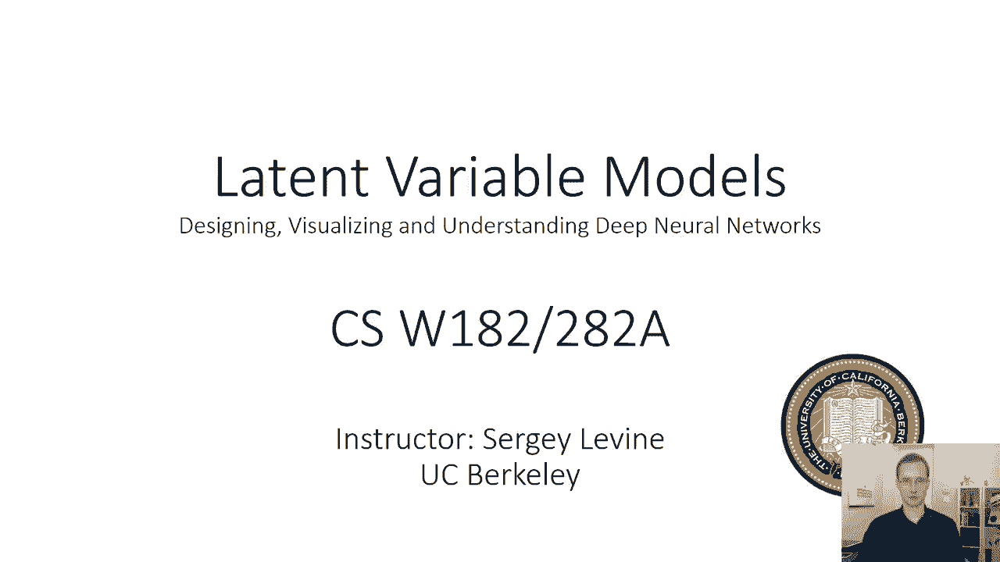

称为规范化流，所以让我们简单地回顾一下上次，本课程所讨论的是表示x的某些复概率分布p的模型，潜在变量上更简单的概率分布，我们将用Z表示，这可能是一个单峰高斯，给定z，它是条件高斯的。

所以这可能意味着给定z的x的p是高斯的，用Z的某个复神经网络函数给出的平均值，C的某些复杂神经网络函数给出的方差和方差，所以我们的想法是，我们已经取代了表示一些非常复杂的分布的需要，x的p。

需要表示两个简单得多的分布，它就像高斯函数一样固定，比如说，x的p给定z，这是一个简单的分布，就像高斯分布一样，但其中均值和方差是C的非常复杂的确定性函数，所以不必表示x的一个非常复杂的分布p。

现在我们有两个简单的分布和一个复杂的确定性函数，这是可取的原因，当然是我们知道如何训练确定性函数，我们使用神经网络来做到这一点，这意味着x的p是由积分给出的，在所有可能的值上，给定z乘以z的p。

我们现在需要把z积分出来得到x的p，当然啦，在现实中，当我们处理潜在变量模型时，我们将非常努力地避免计算这个积分，如果我们想取样Z或者对不起，如果你想取样X，那其实很容易，我们要做的就是先取样z。

然后我们从给定z的x中取样，积分变得有问题的地方是当我们想训练这个模型时，因为我们会以最大的可能性训练，这需要以某种方式估计x的p，但是积分是由两个简单分布的乘积组成的，z的p，我们称之为先验。

x的p给定z。

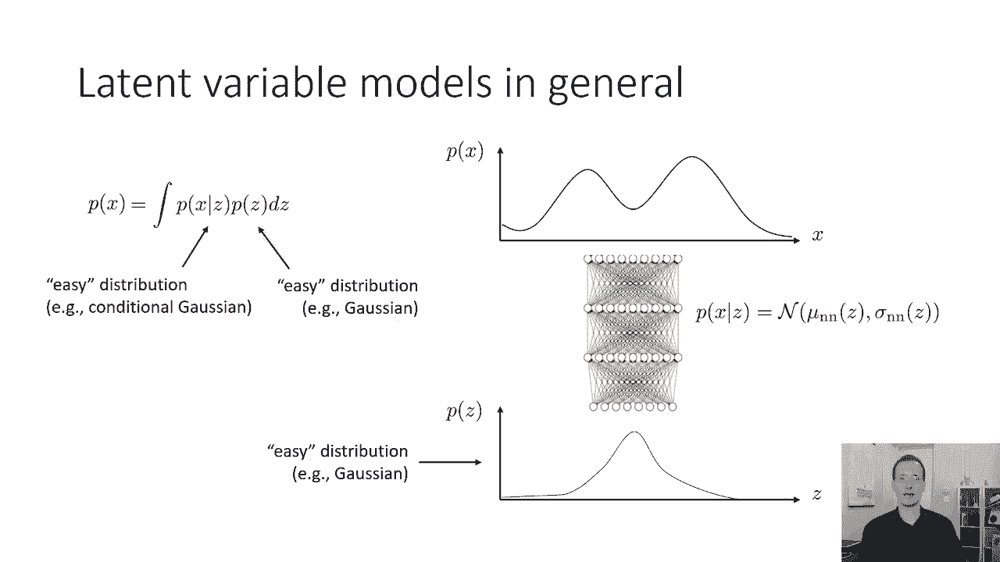

这是我们学习的模型，那么我们如何估计训练的对数似然，而不是求这个积分，我们要尝试使用的是期望对数似然，我将再次在这里启发式地给出预期的对数似然，我们将在今天稍后的讲座中看到的，为什么。

期望对数似然实际上是训练这类模型的一种原则性方法，所以预期对数似然背后的直觉是，而不是计算整个积分，我们要做的是，我们将把由x组成的数据，我们基本上会编造Z，我们认为可能会和那些X在一起。

所以我们真正想要的是一个数据集，由x和z组成的，但我们当然不知道Z是什么，所以我们来猜猜Z可能是什么，假装我们的猜测是正确的，然后最大化x和z的联合概率，因为当我们有联合概率时。

那么我们就不需要计算整个积分，所以我们要猜测的方式，z是在z的p下取一个期望值，我们现在猜到，这就是直觉，当然啦，但我们可以猜测差异的概率，所以我们要做的就是，所有这些可能性的平均值。

这就是期望值的作用，当然还有，在现实中，然后最大化x的相应对数概率，i和z，所以说，直觉是，假装它是正确的，但是z有很多可能的值，所以这个计划的最大挑战是，所以我们基本上把计算这个棘手的积分的问题。

以某种方式估计的问题，这叫做概率推理，它之所以被称为推理，是因为我们在推理，Z与特定的X，i哪个潜在变量与特定图像相关联，让我们说，所以我们的生成模型把我们从Z带到X，推理过程需要把我们从x带回到z。

当然还有，对应于给定图像x的Z上的分布可能相当复杂，所以说，你可以想象Z代表了图像中变化的潜在因素，就像你知道的，有狗吗，它有鼻子吗，它有两只耳朵吗，确实有两只眼睛，我们对所有这些事情都有很多不确定性。

因为我们可能看不到图像中的一切，所以我们可能在z上有一些非常复杂的分布，给定一个x，所以推理通常是一个非常困难的问题，但我们今天要讨论的是如何进行近似推理，从那以后。

我们实际上将推导出一种易于处理的方法来训练这些复杂的。

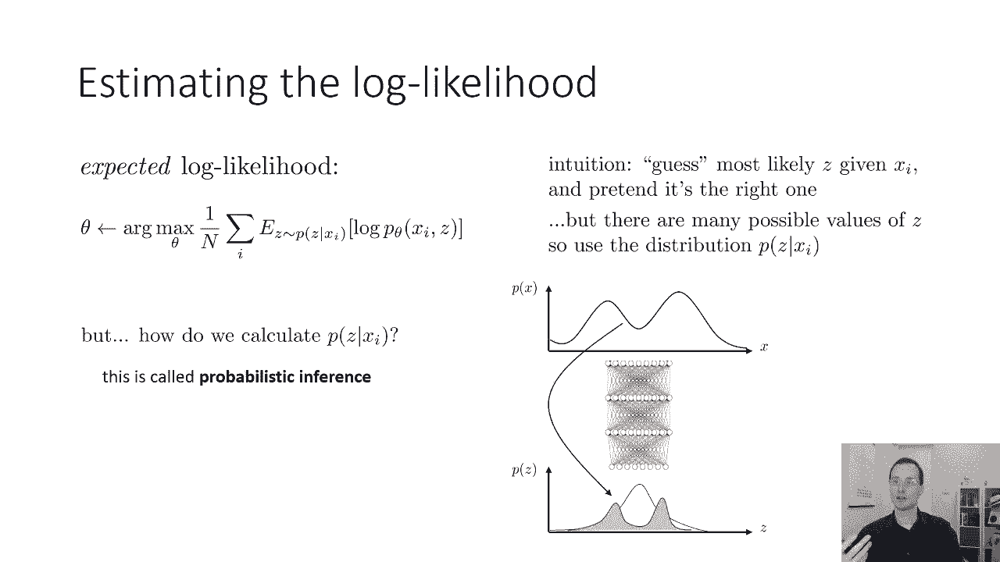

神经网络潜在变量模型，所以我们要做的事情背后的基本想法，称为变分近似，在今天讲座的第一部分，我将大致复习一下变分推理，不是专门针对深度学习的，然后我将在第二部分讨论摊余变分推理，它引入了神经网络。

使其更加实用，好的，所以这部分将在数学上有所涉及，所以请原谅我，如果它的某些部分不清楚，你知道的，一定要来上课，来部门了解细节，好的，所以这里是基本的想法，我们将用一些简单得多的分布来近似它。

那就容易多了，比如说，i，这将是一个不同的平均值和每个图像的不同方差，因此，对于我们数据集中的每个数据点，我们有一个不同的近似分布，q i，z，我们要试着得到近似的分布，这可能是一些非常复杂的事情。

所以这是一个近似值，也许是一个相当粗糙的近似值，值得注意的事实是，对于Qi Z的任何选择，但它小于或等于它，我们可以最大化这个下限量，所以如果你有一个特定的函数，你想最大化。

你有另一个函数总是小于或等于，如果你把下面的函数向上推，最终它会推高你的客观价值，所以这就是为什么它真的很有趣，所以我们可以这样做，它使用了以前难以解决的积分，是p的z的所有值的积分的对数。

给定z乘以z的p，现在我们可以将对数内的量乘以1，q是z除以，q等于z等于1，我们什么都没变，我们只是在这里插入这一小部分，我们知道它等于一个，所以我们可以把它放进去，现在我们稍微重新安排一下条款。

因为你看到了，我们有一个量乘以q，i，z的积分，这意味着我们也可以把它写成期望值，在Q I Z下，我们没有改变周围的任何东西，我们只是稍微重新安排一下条款，所以在期望里面是所有的条款。

除了以前在分子里的QIZ，所以我们只剩下pxi给定z乘以，然后分母中的qi z，好的，所以你刚刚把这个积分重写为期望。

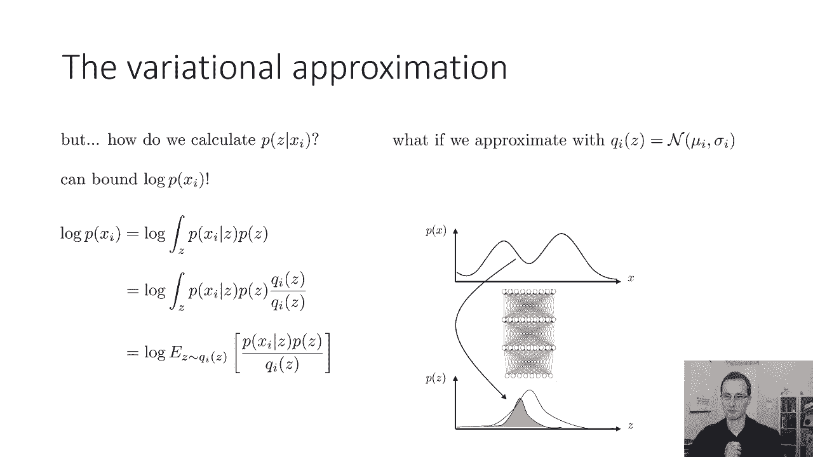

现在我们要应用一个数学恒等式。

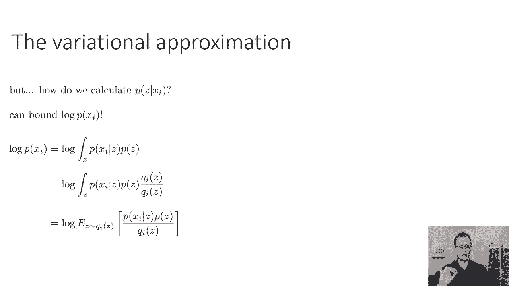

这是变分近似的核心，这是呃，延森不等式，下面的任何凹函数，任何凹函数，下凹函数的期望值，如果这对你来说没有意义，别担心，你需要知道的唯一真正重要的事情，延森的不等式是，如果你有期望值的对数。

这个量总是大于或等于对数的期望值，所以如果你把对数推到期望值里面，它的下界是期望值的对数，现在ance不等式一般可以应用于任何凹函数，其中的对数恰好更多，或者如果它是凸函数，那么不等式就反过来了。

所以说，如果我们把Jensen不等式应用到推导的最后一行，在左边，这意味着q下期望值的对数，i，z，大于或等于q下的期望值，i，z，那个分数的对数，好的，所以我们只要把对数推到期望值内，一次又一次。

但小于或等于，如果我们把这里的最后一行最大化，它总是小于或等于，所以当我们把它向上推的时候，那个，最后一行的表达式在实践中更容易估计，并将允许我们构建一个可行的学习算法，所以现在，我们会做一点代数。

把最后一条线变成我们可以用梯度下降来优化的东西，所以首先，我们将应用非常有用的恒等式，上面写着，那个，乘积的对数等于对数之和，乘以p除以q i，等于给定z的p x i的对数，加上z的p的对数。

减去z的q i的对数，我特别提出了期望，所以对积极的条款有一个期望，和另一个对负面条件的期望，我总是可以通过预期的线性来做到这一点，这是因为最后一个术语实际上在信息论中有一个非常特殊的含义。

在这里看最后一个学期，对数在z的q i下的期望，z的q i是q i的负熵，熵是一个非常特殊的量信息理论，我稍后会讲到，但是你知道，所有这些讨论的结论是，最大化我在最后拥有的这个数量，这里有一个小细节。

那就是我们需要知道这个界限有多紧，我们稍后会讨论这个问题。

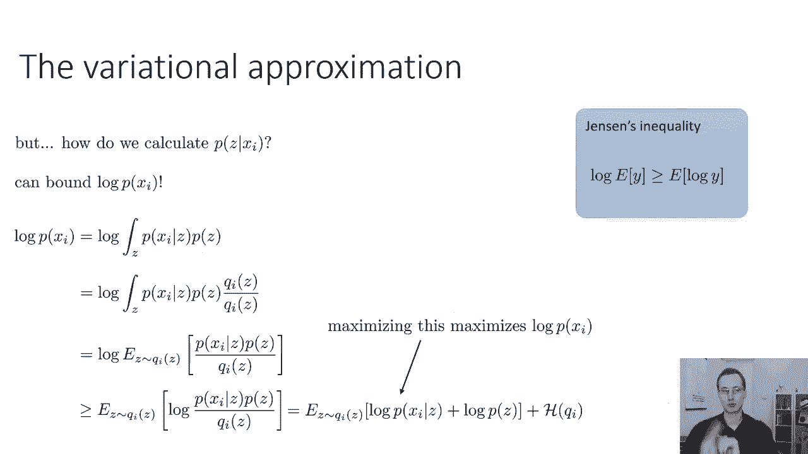

但首先，呃，让我们先简短地谈谈信息论，让我们来谈谈微分熵。

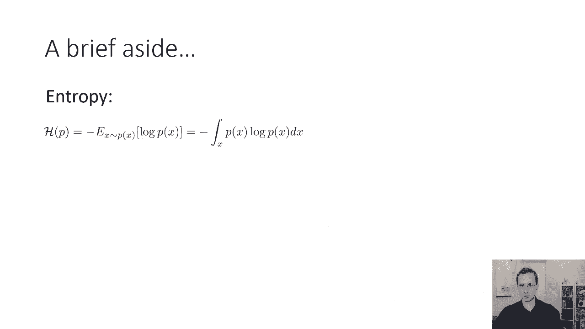

所以我之前提到过这个数量，让我倒带一秒钟，这个数量就在右下角，这只是q i的负熵，所以它是一个，前面有一个负号，这意味着当我们拿底片的时候，负熵，那只是。

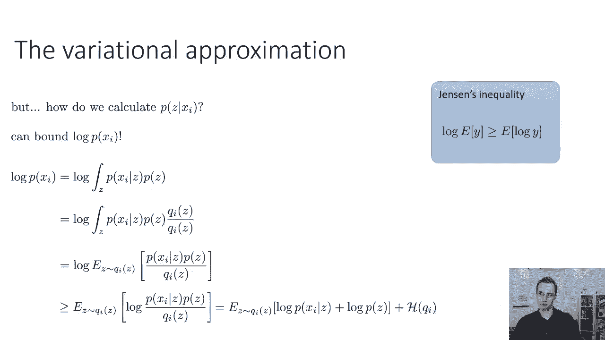

什么是熵井，如果你在维基百科里查熵，你会看到这个表情，某个分布的熵p正好是负期望值，在对数x的p下，x的p，好的，这可能看起来有点神秘，嗯，这是一个Bernoulli随机变量的熵，写为其参数的函数。

对呀，所以伯努利随机变量是硬币正面向上的概率，呃，其中的参数是硬币对头部的重量，如果硬币永远不会出现正面，意味着概率为零，或者硬币总是正面朝上，意思是概率是1，那么熵为零，所以如果事件是确定性的。

熵为零，如果事件是完全随机的，这意味着这个点有零点，出现正面的五种概率，然后熵最大化，所以直观上熵代表了一个分布的随机性，所以说，如果所有结果的可能性相等，那么你的熵是最高的，而如果一个结果是有保证的。

那么你的熵是最低的，所以对熵的一种直觉，随机变量有多随机，另一个直觉是熵量化，一个分布在其自身下的期望对数概率有多大，所以说，比如说，如果有两个这样的发行版，这些现在是连续值分布。

我们可以问哪一个熵更高，上面的还是下面的花一点时间想想这个问题，猜一下顶部是不是有更高的熵，还是底部有更高的熵，因为熵量化了随机变量的随机性，上面的一个有更高的熵，因为有更多的可能值。

这意味着这些值的概率必须更低，因为分布总是积分到一个，下面的有下面的，事实上，在极限中，当山峰变得非常，非常紧，熵会降到零，如果只有一个事件是可能的，也就是最小熵。

这样我们就可以要求我们在上一张幻灯片末尾看到的表达式，我们期望这个表达式做什么，我们在q i上最大化熵，我们要把这个量做大，然后我们也最大化这些对数概率的期望值，第一个学期将鼓励发现一个价值。

把大量的概率质量放在z值上，呃，给z的p x i乘以z的p只是x的p i逗号z，所以我们可以画出z在x轴上的位置，y轴上的概率，如果我们有第一个学期，我们基本上只是有一个分布Q I。

在最大的点上有很大的概率质量，但因为我们也试图最大化q i的熵，我们将努力使它尽可能广泛，所以这意味着我们将捕获p下概率最大的点，但我们也会使得到的分布Q尽可能宽，这样它就能覆盖尽可能多的概率质量。

并具有最高的熵。

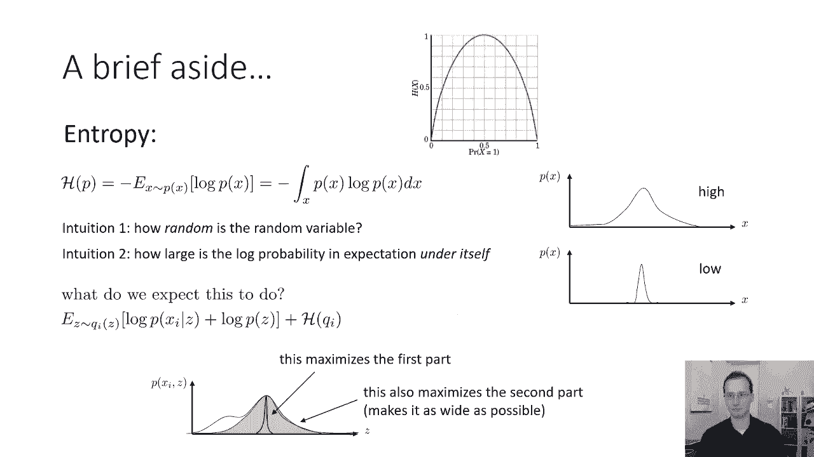

信息论中我们应该讨论的另一个概念是kl散度，KL再次发散，如果你在维基百科或教科书上查过，你会得到一个有点神秘的方程，两个分布之间的kl散度，q和p，由日志第一次分布下的期望值给出，两个分布的比值。

或者另一种写法是，如果您使用该属性，比率的对数只是对数的差值，它是对数q的q下的期望值，减去log p在q下的期望值，也可以写成log p的q下的负期望值，减去q的熵。

KL散度可以被认为是两个分布有多不同的度量，因为如果Q和P完全相同，那么它们的kl散度实际上为零，很容易检查，因为如果它是对数q的q下的期望值，减去log p在q下的期望值。

如果log q和log p相同，那么这两个就会抵消，得到零，只要Q和P变得更不一样，然后它们的kl散度增加，羽衣甘蓝的分歧保证总是积极的，它的另一个直觉是，一个分布在另一个负熵下的期望对数概率有多小。

负熵部分很重要，为什么好，因为如果你没有，然后你就会发现，那么使这个数量最小化的队列就会找到p的峰值，但因为你也在最大化熵，你想捕捉尽可能多的p，和，当然啦，最小的KL散度是如果两个分布完全匹配。

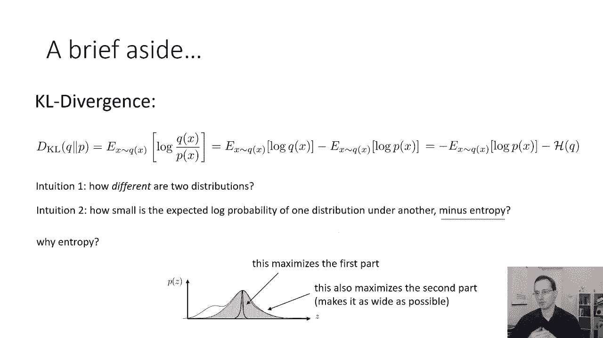

所以我们之前用Jensen不等式导出的表达式，实际上是一个kl散度，我们称之为证据下限，有时用l表示，它是两个分布的函数，p是我们正在学习的分布，和q i，这是我们对后验的近似值。

那么是什么让Z的q i有好的意义呢，嗯，什么是好的，那是个很重要的问题，一个好的Z气是一个使这个束缚尽可能紧的气，这基本上使这个表达式的右手边尽可能接近，向左手边，右手边总是小于或等于。

但是如果我们选择z的q i，对什么是好Q的直觉，z的i是z的qi应该精确地近似z的p，我会告诉你为什么这是真的，那么在什么意义上，它们的kl散度应该很低，我们可以证明这一点，我们首先要证明这一点。

让我们使用上一张幻灯片中KL发散度的定义，所以q之间的kl散度，x的i，z的i，逗号z除以p x i，所以如果我们把它换成，那么我们的kl散度是在z的q i下的期望值，除以p of x i逗号z。

一次又一次，使用乘积的对数的乘积的属性，是对数之和，我们可以用一种有点复杂的方式把它写出来，作为三个期望项，z的q i下的负期望，那么在z的q i下的对数q i的z的期望值，它将识别为熵。

然后是log p x i在z的q i下的期望值，我把它分成三个术语的原因是，因为期望值内的量，它根本不依赖于z，第二项是z的q i的熵，第一项只是我们在证据中看到的下界的负值，所以稍微重新安排一下术语。

呃，我们可以用熵来代替第二项，因为期望值内的东西不依赖于z，我们可以认识到前两个术语加在一起只是证据的反面，下限，现在我们有了一个非常有趣的财产，z的x的q i与后部的kl散度，我向你道歉。

有一点错别字，应该是dk，l，q，i，of，z，p，of，x，i，那是个小错别字，这个kl散度等于负证据下界，加上证据下限好吧，所以如果我在两边加Li，我得到这个方程，kl散度总是正的。

所以这是另一种推导Li下界的方法，但是这个推导提供了更多的信息，因为它告诉我们使用该绑定会产生多少错误，基本上，羽衣甘蓝在Q之间的分歧越小，这是非常非常重要的，这意味着最大化证据。

下界l将在px i上推，和，z的q i和z的p之间的羽衣甘蓝散度越小，离我们的目标越近，所以如果羽衣甘蓝很大，然后你就可以最大化你想要的一切，但你不会改变你的目标，但如果KL燃烧很小。

那么最大化下限的唯一方法就是，这意味着如果我们选择用z的q i，我们想选择一个最小化kl散度到p的z，也就是说我们要Q中的Q。

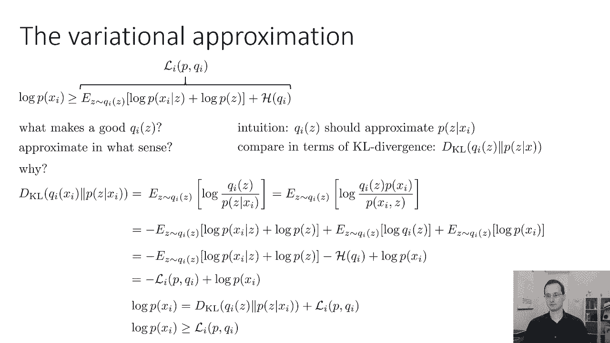

这就是我们得到的，我们得到了我们的下界，我们知道羽衣甘蓝的分歧越小，下界越紧，下界总是有效的界，我们知道Q之间的kl散度，这意味着最大化p逗号的下界Li，减小kl散度。

所以如果我们想知道如何训练我们的模型，我们可以通过最大化关于模型P的证据下界来训练我们的模型，如果我们想得到最好的气，我们也最大化了同样的证据关于气的下界，因为在q i之间的kl散度中唯一的项。

证据中存在的所有术语都是下界吗，那太好了，这告诉我们，如果我们只是最大化相同的目标，p逗号的i，q，i，关于p和q i，那么我们将最大化我们的实际客观值log p，因为最大化l i。

p逗号q i相对于q i会使绑定更紧，相对于p的最大值会向上推，这可以给我们一种训练潜在变量模型的简便方法。

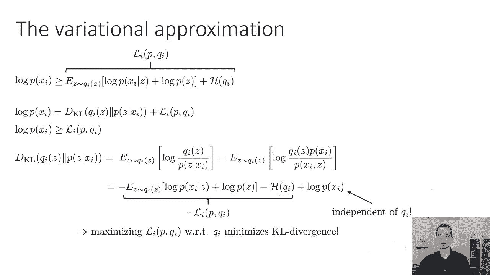

我们怎么用这个，但我们当然不能完全这样做，所以我们要做的是，我们将使证据最大化，或者在我们的迷你批次中，所以这里X眼可能是图像，比如说，我们要计算证据下限的梯度，关于我们模型的参数。

所以我们这样做的方法是，我们首先从c的q i中取样a z，因为我们有一个期望值，然后我们近似我们的梯度，它是期望值的梯度作为梯度，呃，对于我们的模型，现在注意z的p没有任何参数。

z的p就像一个零均值单位方差高斯，这必须在Z的Qi下进行期望评估，所以我们从q i中采样z，然后计算梯度，那是一个单一的样本，梯度的估计，我们也可以使用多个样本，如果你喜欢，然后你采取一个渐变下降步骤。

呃在西塔上，然后你也必须更新你的气，以最大化L I P，逗号q i，有很多种方法可以做到这一点，我们很快就会讨论如何做到这一点，但在我们谈论它之前，当然，我们必须为q i选择一个表示。

所以让我们从一些简单的事情开始，这么说吧，气是Z上的高斯分布，具有均值mu i和方差sigma，所以对于我们数据集中的每一张图像，我们有一个不同的UI和西格玛I，我们将跟踪，几乎就像。

我们正试图注释数据集中的每一张图像，在相应的Z值上有均值和方差，我们可以更新Q的一种方式，i和sigma，i只是通过计算证据下界的梯度，关于这些数量，我们稍后会讨论如何计算这些渐变。

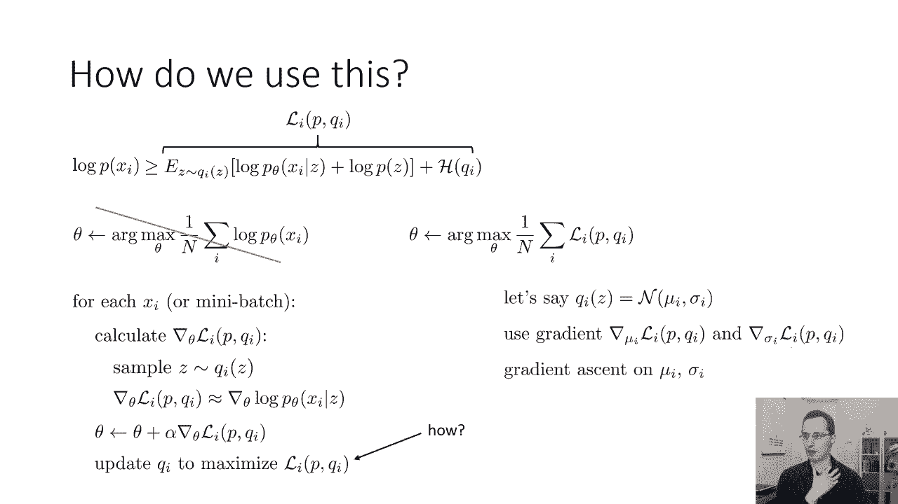

然后就做渐变阿辛诺，但这种方法有一个相当大的问题，这是一个可行的算法经典的变分推理方法确实使用了这种方法，但是我们需要为数据集中的每个数据点提供一个单独的均值和方差，我们总共有多少参数。

如果我们把这个做好，θ中的参数数，加上以mu和sigma倍为单位的参数数，我们数据集中的数据点数，如果你有很少的数据量，这没什么大不了的，但如果你有数百万分，在mu和sigma中的参数数量可能是巨大的。

这可能会让这很难学，现在，记住，我们的直觉是，所以如果我们不想有这么多参数，我们可以做的不是为每个x学习一个单独的mu和sigma，我单独，而是学习第二个神经网络，预测特定图像的mu和sigma。

所以我们实际上要学习第二个神经网络Q，我们实际上将训练第二个网络，使其接近给定x的z的p，i，所以我们有一个网络，从z到pθx给定z，另一个网络从x回到q phi z给定x，这将是变分自动编码器的基础。

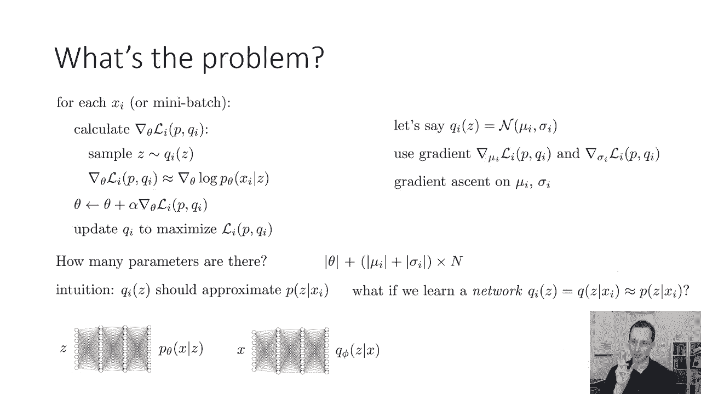

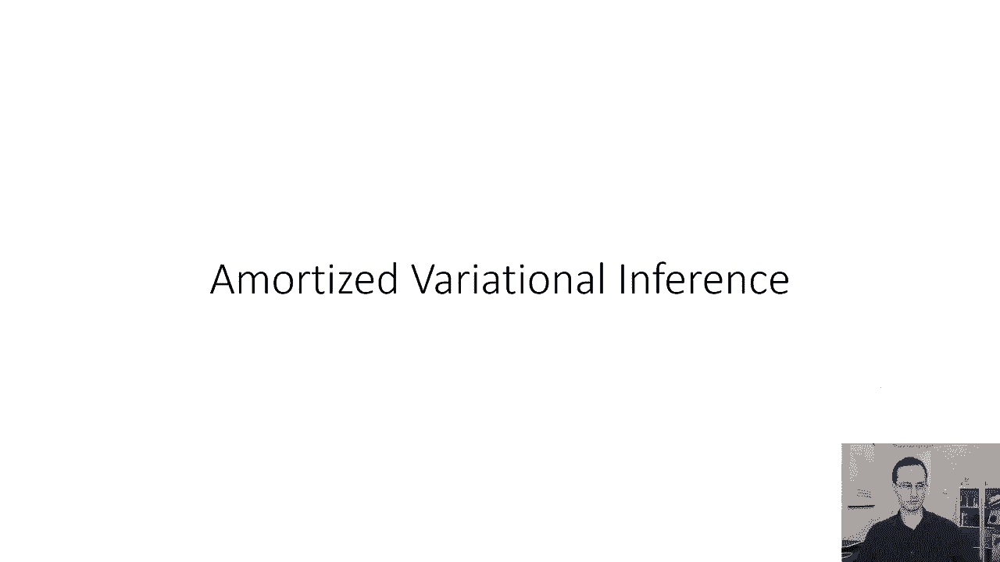