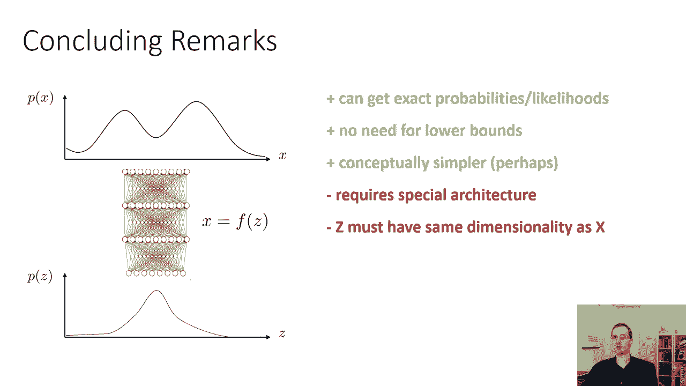
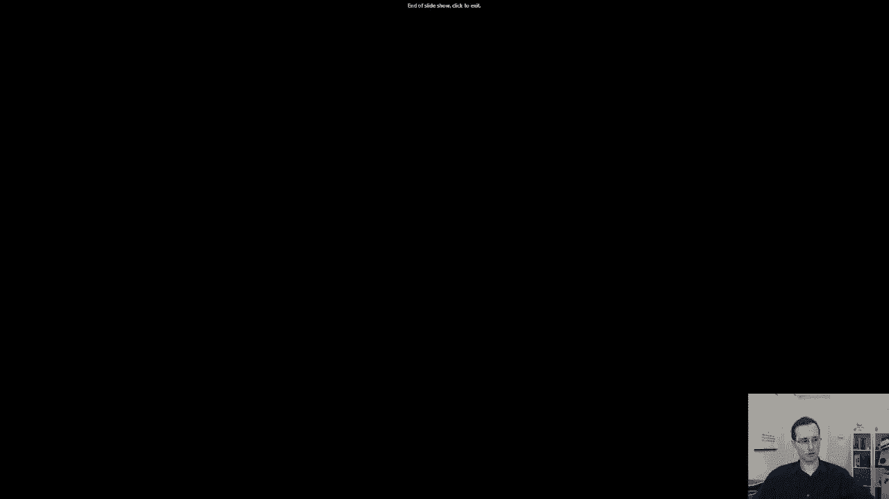

# 【双语字幕】伯克利CS 182《深度学习：深度神经网络设计、可视化与理解》课程(2021) by Sergey Levine - P57：CS 182- Lecture 18- Part 4- Latent Variable Models - 爱可可-爱生活 - BV1PK4y1U751

在今天讲座的最后一部分，我们将讨论一种不同的模型，在结构上有点类似于变分自动编码器，但训练起来要简单得多，所以这个想法是这样的，而不是让解码器表示x上的分布，给定z，我们实际上会有一个确定性解码器。

我们会有一个直接把Z变成X的解码器，不是x上的分布，但实际上只有一个X，这可能看起来是一个微妙的、非常小的变化，但它实际上对最终的模型有非常深远的影响，为什么这么重要，因为现在。

如果我们想计算x的p或x的log p来训练，我们可以用变量的变化公式，所以变量变化公式说，如果x是z的确定函数，那么x的p等于z的p，乘以df-dc行列式的逆，这个公式看起来有点武断。

其中z由x的f逆给出，这个公式看起来有点武断，但直觉上，它的意思是，以确定性的方式得到x，然后得到x上的密度，你所要做的就是修改z上的密度，体积随f的变化，所以有相当多的微分几何，在幕后解释这个公式。

我很不幸，在这节课中，我们没有时间详细讨论这个问题，所以你得相信我的话，这是这个密度的表达式，但对为什么这可能是真的一点直觉是，如果你把z想象成，让我们说，零到一区间上的均匀分布，x是零到二的积分。

这意味着从z到x，你需要把你的价值观提高两倍，这意味着密度下降了两倍，所以如果你把你所有的价值观翻倍，那么当你反转得到一半时，df dz就是2，所以这里的直觉是f本质上是体积的扩张或收缩。

你必须解释这种膨胀或收缩，这就是决定性术语所解释的，这就是它背后的数学，但出于实际目的，这个公式告诉我们的是，我们可以计算雅可比df dz的行列式，我们可以计算x的逆f逆，然后我们可以实现这种模型。

具有映射z stac的确定性函数，你这样做，这真的很有趣，因为如果我们能以某种方式学习从z到x的可逆映射，这可以使这个确定的易于计算，我们可以建立这种模型，不用担心所有变分推理的东西。

模型实际上可以简单得多，在概念上，至少没有更多的下限，我们可以得到确切的概率和可能性，而不仅仅是概率的界限，所以让我们把这个打开一点，这类模型有时被称为规范化流模型，我们的训练目标是最大可能。

最大化数据集中所有x的对数概率，其中我们使用上一张幻灯片上变量更改公式中的表达式，用x写p而不是用z写p，现在z的p仍然是一些很简单的分布，比如，比如说，零平均单位方差高斯。

这意味着如果我们把这个公式替换到训练目标中，例如，零平均单位方差高斯，它是负的原因是因为你需要行列式的逆，所以当你拿着日志的时候，就变成了负号，我们要做的是，我们要为神经网络选择一个特殊的结构。

它代表F，这使得f是逆的，行列式很容易计算，然后我们可以用变分下限跳过所有这些复杂性，因此，规范化流模型由多层可逆变换组成，所以为了实现这些类型的模型，我们所需要做的就是，想出如何制作一个可逆层。

然后组成许多这些可逆的层，形成一个深度网络，所以我在这节课的这一部分要讨论的是，我们怎么做一个可逆层，组成多个可逆层非常容易，所以它们组成的行列式只是它们行列式的乘积，这意味着日志。

它是它们的对数行列式的和，所以我们的Z函数f将是一个多层神经网络，我们可以把这些层称为f1f2f3f4，如果我们有四层，比如说，我们只需要每一层都是可逆的，所以如果每一层都是可逆的，整个事情是可逆的。

通常，如果我们能使函数可逆，可逆函数也有非常方便的行列式，但并不总是，但他们经常会，所以困难的部分基本上是制造一个可逆的，一旦我们做了一个可逆的，我们通常可以看到行列式是什么，这是一件相当简单的事情。

和整个模型的对数行列式，只是层的对数行列式之和，所以我们的目标是设计一个可逆层，然后组成许多这些可逆层，得到一个完全可逆的神经网络，我们可以用它来表示f，所以有很多不同的方法来设计可逆层。

我将从最简单的一种开始，称为非线性相关分量估计，但请记住，在深度学习文献中有许多不同的选择，我只介绍一些更简单的选择，但如果你对这个问题有兴趣，你知道，关于正常化流动，还有很多可以说的。

我在这节课里有时间讨论，所以这里有一种简单的可逆层，通常，神经网络中的一层是一些映射，我只想说这是从z到x的映射，某种特殊的转变，重要的是，这里我要描述一层的情况，但在现实中，我们当然会有许多这样的层。

所以我们了解到的一个正常的层可能是x，是由一个轨道给出的，你申请了W Z加B，这是一个规则的仿射或线性层，然后是一个relu非线性，但是我们不能用这个，因为它是不可逆的。

因为Relu会清零所有我们无法恢复的负面部分，所以你可以从Z到X，但你不能从X回到Z，所以这不是可逆的，所以我有个主意，如果我们强迫层的一部分保留所有的信息。

这样我们就可以恢复任何被非线性部分改变的东西，这是我们能做的，让我们把z分成两部分，我们会说第一部分就像Z中的第一个D项，所以z，1，z，2，等等，穿过z，z，d，所以我们取Z中的第一个d数。

这是第一部分，第二部分是z d加1到n对，那只是Z的其余部分，X也会有两个锅，第一部分就直接复制，所以x 1到d等于z 1到d，完全没变，然后我们也会把第一部分，我们还会把它通过一些神经网络。

也许那个神经网络就像上面的那个，它只是一个rau乘以w乘以z 1到d加b，所以某种非线性函数，然后我们会把它添加到第二部分，所以x d加1到n等于，z d加上1到n加上这个非线性部分，gθ。

所以gθ就是那个神经网络，它很像一个残存的单位，除了我们把它分成两半，我们有前半部分只是复制，在后半部分，有这个非线性的成分添加到它，所以gθ在这里不一定是可逆的，它可以像栏杆一样，或者类似的东西。

应用于矩阵乘法的relu，好的，所以a的gθ可能只是生的，a加b某种非线性运算，所以我的主张是这是可逆的，所以这里有一个问题要问你，如果你有X，如果是这样，你能恢复Z吗，那么这一层是可逆的。

这意味着您可以组成多个这样的层来形成一个规范化的流模型，如果你觉得能胜任这项任务，你现在可以暂停上课，试着自己解决，如何反转这一层，为了反转这一层，你所要做的就是找出给定的x，如何恢复创建x的z。

所以你们现在可以暂停上课，试着自己解决，一旦你做到了，大家可以继续看，我会解释怎么做，所以这是倒退的过程，我们有x，我们需要计算出z，所以第一步从z到d，你知道z13d等于x1到d，所以恢复很容易。

第二步恢复z的gθ1到d恢复神经网络，一旦你恢复了，那么你可以通过取x的第二部分来恢复z的第二部分，减去神经网络，这就是你如何计算这一层的逆，所以诀窍是，我们需要的诀窍是，第一部分无损保存。

非线性分量只取决于第一部分，这意味着你可以恢复减去的非线性分量，这就是你如何计算这一层的逆，它是一个可逆的层，好的，现在，雅各比人呢，这个df dz的行列式是什么。

我们需要它来很好地计算我们的归一化流目标，x和z都有这两部分，前半段和后半段，所以如果我们想把df dz写成矩阵，你知道那个矩阵有四个块，左上角块是x前半部分的导数，关于z的前半部分。

右上角块是x前半部分的导数，关于Z的后半部分，左下角块是x的后半部分的导数，关于z的前半部分，右下角块是x的后半部分的导数，关于Z的后半部分，那么左上角的块是什么，x的前半部分的导数是多少。

关于c的前半部分，x 1到d正好等于z，1至D，这意味着导数只是恒等式，它只是一条对角线，它只是一个矩阵，在对角线上有一个，其他的都不容易，x的导数是多少，关于z的1到d加上1到n，我只想先说。

右下角的导数是多少，z x d加上1到n相对于z d加上1到n，嗯，那也只是身份对吧，因为x d加上1到n等于z d加上1到n，加上一些不依赖于，所以导数恒等式，右上角的方块是零。

因为x的前半部分不依赖于z的后半部分，左下角的块是复杂的东西，因为这是通过非线性神经网络的部分，如果你要计算这个矩阵的行列式，现在，你们中那些记得行列式公式的人。

可能在这一点上意识到行列式不受左下角块的影响，因为右上角的方块是零，所以像这样的矩阵的行列式，这是一个下三角矩阵，行列式由对角线项决定，对角线都是一个，所以既然雅各比人是这样的。

行列式只是一个非常方便的行列式，所以由于这些可逆层的这种特殊形式，决定因素总是一个，这意味着目标中的术语对训练模型没有任何影响，所以这很简单，也很方便，不幸的是，从代表性上来说，这有点限制。

因为我们不能改变尺度，行列式总是1意味着这种网络只将这些转换为x，但它从不重新缩放它们，所以训练非常复杂的分布是非常困难的，用这种方式，这是一个非常方便的建筑，但它不是一个很有表现力的。

所以在实践中我们看到的是如果我们把这种可逆层，我们把其中的一些层堆叠起来，用它们来训练生成模型，我们可以很好地建模简单的数据集，像无尽的数字，所以左边的数字看起来像真实的数字。

我们可以用简单的人脸图像做得很好，所以他们看起来有点像脸，但是当我们开始观察更复杂的图像时，它往往会分解，所以SVHN数据集，左边显示的实际上也是一组数字，但有通过拍摄门牌号拍摄的彩色数字。

你可以看到模型已经开始挣扎，如果我们在C远十上训练，它有各种不同的现实物体的图像，我们得到的图像质量很低，所以模型是相当有限的，我们可以对这个模型稍作修改。这使得它更有表现力，这就是所谓的真正的MVP。

MVP代表非保持体积的变换，所以这是真正的NDP的想法，我们要像以前一样把z和x分成两部分，第一部分和之前一样会被复制，但现在我们将有两个神经网络，我们将有一个缩放网络和一个偏置网络，所以我们要下半场。

我们实际上会把它乘以第一个神经网络，然后我们将从第二个神经网络中添加项，所以x的后半部分由z的后半部分乘以给出，指数，第一个神经网络的输出加上第二个，指数变换的原因是为了使它为正，你也。

光用RAI是不够的，因为你真的不想让任何零潜入其中，因为如果你把z的后半部分乘以零，信息丢失了，所以你真的需要总是乘以大于零的数字，这就是为什么你需要指数变换，这只是一个元素明智的产品。

所以这也是一个可逆的操作，你推导的方式，逆非常类似于，在你恢复Z的前半部分之前，只要用它等于x的前半部分，一旦你恢复了，你就可以恢复gθ和hθ，然后你可以解出Z的后半部分，只要取x的后半部分。

减去g再除以指数h，这就是为什么，不允许那些乘法项归零是非常重要的，因为这样你就会得到0的除法，当然这是不允许的，所以这仍然是可逆的，但现在雅各布有了一种更有趣的形式，左上角的方块，微小的实体。

但是右下角的块现在是这些指数值的对角线，这意味着现在的行列式更有趣，行列式不是一个，它实际上是那些对角线项的乘积，确定的法律是它们的总和，所以这明显更有表现力，代价是增加了第二个非线性组件。

这可以生成更高质量的图像，下面是由真实MVP模型生成的示例，所以它们在更多样化和复杂的数据集上看起来更真实，所以关于流量正常化的一些结束语，流量正常化的一大优势是。

你可以从他们那里得到确切的概率或可能性，你实际上可以计算x的p，这是用变分自动编码器做不到的，变分编码器会给你一个关于x的p的界，但它不会给你x的确切概率p，而规范化流将，你不需要任何下限。

它在概念上有点简单，但它也有几个主要的缺点，首先，它需要一个特殊的架构，所以你不能只用普通的图层，你必须使用这些特殊的可逆层，第二个，也许是更微妙的一点是，由于每一层都是可逆的。

每一层的维度都要保持不变，对于高分辨率的图像来说，这可能是一个非常大的问题，如果你的图像中有一百万像素，那么你需要Z中的一百万个维度，而变分自动编码器可以有一个潜在的代码，比图像低得多的维度。

