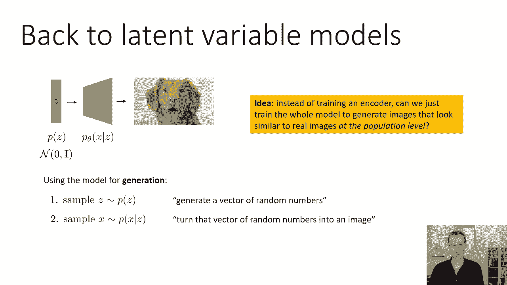
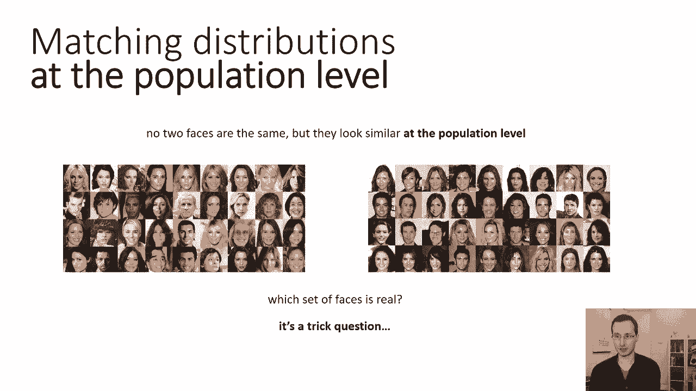
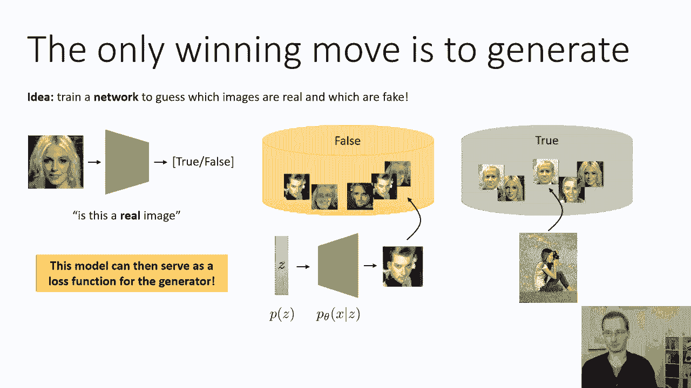
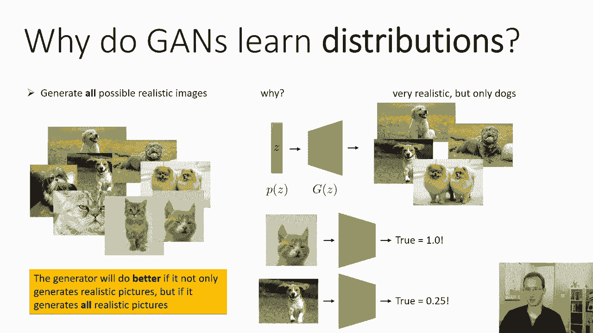
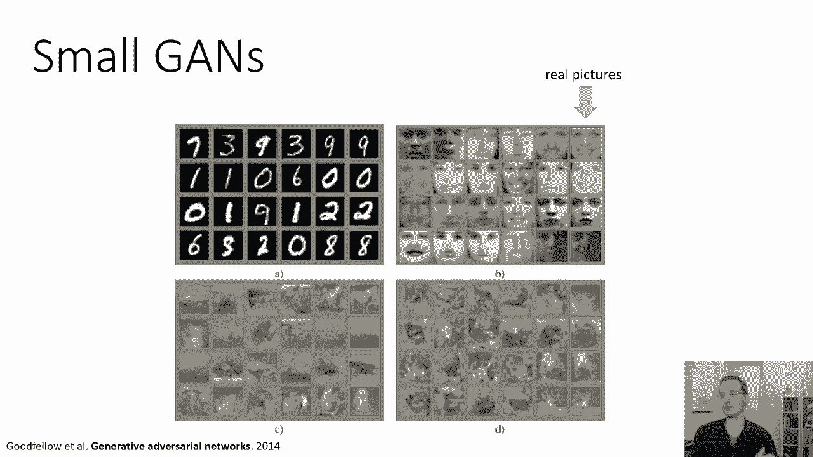
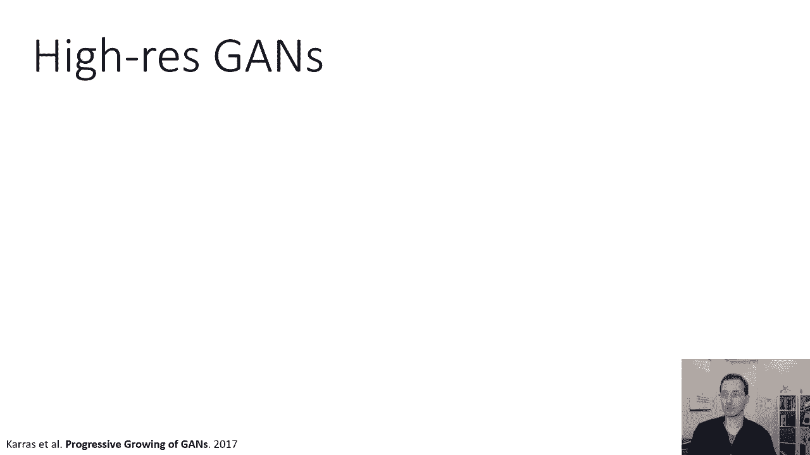
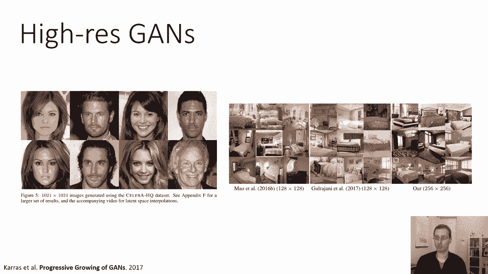
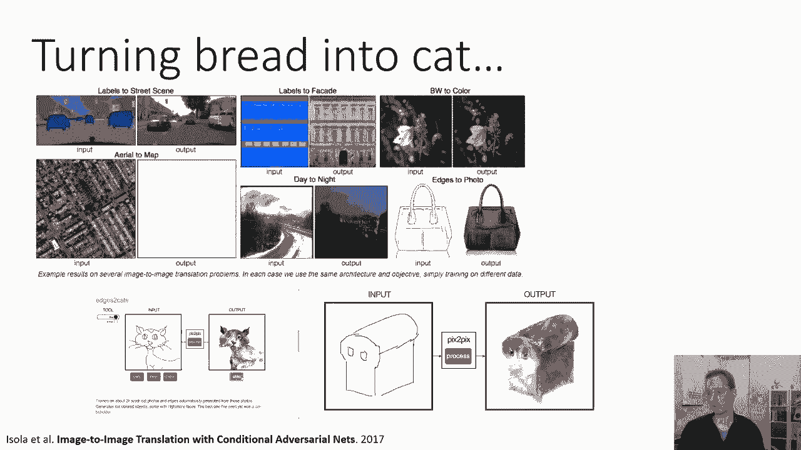
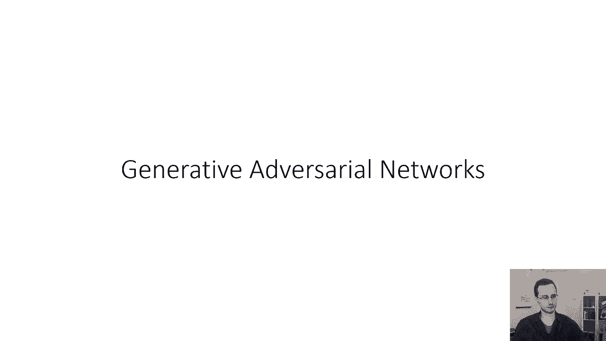

# 【双语字幕】伯克利CS 182《深度学习：深度神经网络设计、可视化与理解》课程(2021) by Sergey Levine - P58：CS 182- Lecture 19- Part 1- GANs - 爱可可-爱生活 - BV1PK4y1U751

欢迎今天来听一八十二节第十九课，我们将讨论最后一类生成模型，我们将在这门叫做生成对抗网络的课程中讨论，所以让我们呃，简单地回到潜在变量模型，在潜在变量模型中，你有一个潜在的变量z，你知道的。

潜在变量只是说随机数向量的一种花哨的方式，这些随机数是从某个分布中取样的，你选择z的p，例如，你可能会说潜在变量有二百五六个维度，每一个都将从均值为零方差为一的正态分布中采样，所以这不是什么聪明的东西。

我们只是随机选择一些分布，然后我们将有一个神经网络，表示x上的分布，给定z，或者从x到z的确定性映射，就像我们在规范化流中看到的那样，所以它基本上取这些随机向量z，将它们本质上视为随机数生成器。

并利用它们产生相应的图像，这个想法是，这种模型可以捕捉图像上的分布，就像，例如，将Z视为随机数的所有可能的狗，表示你想要哪只狗，好的，并使用这种模型进行生成，只需要从已知的p的z分布中采样z。

这基本上是一种花哨的说法，让我们生成一堆随机数，然后根据给定z的神经网络p对图像进行采样，或者如果你有一个确定性的转换，然后将确定性神经网络应用于Z，所以把随机数矢量变成图像。

所以我们在今天的课上要探讨的想法是，而不是像我们训练Vees那样训练编码器，就可以，我们只是训练整个模型生成看起来与真实图像相似的图像，在人口一级，因此，与其试图猜测每一个真实图像对应的Z是什么。

不如尝试猜测每一个真实图像对应的Z是什么，然后用它来监督我们的网络，如果我们只是生成一堆随机的图像，然后试图改变我们的网络，使这些随机图像在种群水平上类似于，呃。

在我们的训练集中给我们的真实感图像的数量。

好的，所以这可能看起来有点抽象，也许用一个例子会更容易看到，假设我有两组脸，好的，左边的布景和右边的布景，它们都是面孔的集合，脸也不是配对的，并不是左边的每一张脸，右边有一些对应的脸。

它们只是表面上的两种不同分布，没有两张脸是一样的，但它们在种群水平上看起来有点相似，所以如果我把这些人脸的分布，假设一个分布有五个样本，另一个分布有五个样本，也许你无法分辨这些来自哪个发行版。

在这种情况下，我们会说这两种分布在种群水平上是相似的，但如果这些不同，如果我从一个中挑五个，从另一个中挑五个，给大家看一下，你马上就能分辨出哪一个来自哪一个，那么它们在种群水平上就不相似了。

这就是我们如何尝试匹配分布，我们不必弄清楚任何特定图像的潜在变量实际上是什么，现在，当然啦，在这里我也可以问你，你能猜出哪一组面孔是真的吗，我要告诉你，这些面孔中的一些实际上是。

实际上是由潜在变量模型生成的，你认为我们是哪一个，哪套是真的，嗯，这其实是个骗人的问题，所以这里的两组脸实际上都是假的，没有一张是真的照片，它们都来自一个生成模型，事实上，甚至不是一个特别好的。

所以这些在种群水平上匹配分布的模型可以得到非常好的。

比这好得多，我们是这样安排的，我们要设一个游戏，唯一移动的，唯一获胜的方法是生成逼真的图像，所以这个想法是训练一个网络，它会猜测哪些图像是真的哪些是假的，所以这本质上是一个分类器。

就像我们在计算机视觉中学到的分类器一样，它是一个分类器，查看图像，然后输出二进制标签，真假，所以在现实中，这个分类器将输出一个概率--一个介于零到一之间的数字，这将是这个图像是真实图像的概率，现在。

为了训练这样一个网络，你所需要的只是一个标签训练集，一组带有真实标签的图像，和一组带有假标签的图像，我们在哪里可以买到这些，我们需要真实的图像，我们需要假图像，好吧，假图像，呃。

这些可以来自我们的生成模型，所以也许一开始我们的生成模型不是很好，它只是随机初始化的，这会给我们一堆假图像，关于一堆看起来可怕的图像，看起来不像真的照片，我们将拍摄这些图像，我们要给他们贴上假的标签。

然后我们的真实形象，当然啦，将来自我们的训练集，所以这些是一些人在世界上拍摄的真实照片，这些我们将收集在我们的训练集里，并给它们贴上真实的标签，所以现在我们有了训练所需的一切，这个分类器。

那要看一张照片，并输出它是真实图片的概率，这个模型可以作为发电机的损失函数，我们能做的就是把我们的发电机，我们把Z变成轴的模型，它的损失函数可以是产生的图像的真实感分数，由这个分类器产生的。

这就是这种方法背后的基本直觉，我们将通过训练来学习损失函数，假图像和真图像，然后我们会把这个作为损失，对我们的生成器来说是一个负面的损失，因为它生成的图像更真实，根据这个分类器。

所以我们有两个网络，我们有一个分类器，我们称之为鉴别器，因为它试图区分图像是真的还是假的，然后我们有发电机，为了简单起见，只是一个确定性函数，就像在正常化流，它将把一个向量随机数z映射到图像上。

所以没有呃，x给定z，这只是一个确定性映射，你也可以让它是一个随机映射，但使用确定性映射会简单一点，不像这里的正常化流，它不一定是可逆的，尺寸不一定要匹配，所以就像解码器一样，而不是输出发行版。

它只输出一个图像，所以这里有一个潜在的算法，这不是最终的算法，但这就是我们要如何工作到最终的算法，首先得到一个真实的数据集，一个真实图像的数据集，我们将称之为DT，我们从哪里得到这个真实的数据集，嗯。

这就是提供给我们的东西，那是我们的训练数据，基本上它只是一个真实照片的集合，得到一个发电机gθ，所以Z将参数化我们的生成器，我们从哪里弄到发电机井，你想去哪里就去哪里。

您可以使用Xavier初始化随机初始化它，所以它不一定是一个好的发电机，第三步生成假数据集，通常，您将生成一个与真实数据大小相同的假数据集，我们就叫它df，所以从先前的Z中取样。

然后通过将这些z通过g得到相应的x，这给了你一个假图像的数据集，如果你的发电机很糟糕，这些假图像可能看起来很可怕，训练你的鉴别力，它只是一个分类器，它试图预测图像是来自真实的数据集还是虚假的数据集。

所以你通过获取所有的dt图像和标签为true来构建你的训练集，以及所有标签为false的DF图像，只是运行监督学习来训练这个鉴别器，我们将使用x的符号d phi，表示x为真的概率。

根据我们的参数phi的鉴别器，然后呢，我们将利用这个判别器构造某种用于训练的损失函数，g of z，我们可以使用的损失函数的一个选择是x的负对数d，所以x的d是x为真的概率。

x的log d是它为真的对数概率，既然我们把损失降到最低，我们在它前面放一个负号，所以我们最小化它是真实的负对数概率，这就像最大化它是真实的对数概率，所以这个食谱基本上差不多管用。

但它有几个主要问题需要我们解决，在我们构建一个真正可行的方法之前，所以我必须解决的一个问题是，我们从哪里得到这个初始发电机，然后我们用哪个损失函数，以及如何，如果我们只做一次第五步。

基本上如果我们只做第一步，二三四五，最大的问题是在第五步，g的z很容易骗过d的x，所以如果x的d被训练成来自一个非常糟糕的发生器的假图像，那么第五步中的新发电机只需要比旧的更好，但可能还是不太现实。

所以仅仅这样做是不够的，我们稍微改进一下这个食谱让它很好地工作，所以我们实际上是这样做的，我们得到了真实的数据集，然后我们用随机初始化得到生成器，然后我们将有一个迭代过程，我们要在那里取样我们的假图像。

然后我们只用一个渐变步更新我们的鉴别器，所以我们实际上不会训练鉴别器收敛，我们只需要一个渐变的步骤，所以这会给我们一个稍微好一点的鉴别器，然后我们也将更新我们的生成器，只为一个梯度步骤。

然后我们会生成新的假图像，所以不只是在前面生成所有的假图像，训练你的鉴别器收敛，你实际上会在更新鉴别器之间交替，以更好地，区分真假，然后更新生成器以生成更逼真的图像，所以这将是一种游戏。

鉴别器会一直试图跟上生成器，发电机会一直试图愚弄它，因为他们有这种竞争过程，呃，然后呢，发电机赢得游戏的唯一方法，就是制作出真正与真实图像难以区分的图像，在现实中，我们可以构建各种不同的损失。

都是基于鉴别器概率，但他们都有点不同，所以我以后再谈，他们，但他们都有基本相同的想法，至于用鉴别器作为现实主义配乐，所以这个基本的食谱被称为生成对抗网络或gan，它是生成的，因为它生成图像。

它是对抗性的，因为判别器和生成器在竞争，它是一个网络，因为，通常，您使用，当然啦，神经网络，我们将讨论实际实现GAN的实用性，在讲座的下一部分，但就目前而言，我想给你更多的直觉。

为什么这个基本想法真的有效，为什么甘斯实际上学习分布，意思是为什么，为什么生成器实际上使用这些随机数来产生不仅仅是一张逼真的图像，但实际上是各种逼真的图像，那么G的Z想做什么，理想情况下。

g of z最满意的是，如果它能以某种方式说服鉴别器输出，所有生成的图像为零点五，你知道你不会得到歧视，告诉你你的图像比真实的更真实，就像你知道现实总是会有所有真正的标签，所以你永远不会比真实更真实。

所以你最多只能得到百分之五十的分数，这意味着鉴别者真的诚实，不能告诉辨别者，真的认为你的图像有50%的可能性是假的，百分之五十的可能性是真的，所以这是发电机所能希望的最好结果。

它基本上可以希望说服完全无知的歧视者，它最多只能猜五五开，那么发电机是如何做到这一点的呢，为了真正让判别器猜出五五开，你必须生成看起来逼真的图像，很明显，因为如果你的图像中有一些非常表明是假的东西。

然后鉴别器就会发现，它会更有信心你的图像是假的，你得到的概率小于零点五，更微妙的一点是，为了在所有生成的图像上得到零点五，你不只需要生成看起来逼真的图像，你实际上需要生成所有可能的逼真图像。

这就是甘斯匹配分布的原因，所以让我解释一下第二点，为什么生成器真的需要生成所有可能的真实感图像，而不仅仅是一两个，我会在下一张幻灯片上描述，但你可能想做的是，你可能想在这里暂停讲座，花点时间自己想想。

为什么要说服鉴别器输出零点五，生成器总是需要生成所有可能的逼真图像，所以让我们谈谈这个，假设我们有一个数据集，里面有猫和狗的照片，假设一半的照片是猫一半是狗，和，让我们说。

我们的生成器非常擅长生成非常逼真的图像，但它只产生狗，所以它没有覆盖整个分布，但它已经想出了如何让像素看起来很好，好的，嗯，想象一下鉴别器在这种情况下会做什么，如果我们拍一张猫的照片。

然后把它传给鉴别器，歧视者会说，嗯，我的训练集有大约一半的真实图像，呃，里面有猫，但没有一个虚假的图像包含猫，假图像只包含狗，所以如果我养了一只猫，我可以肯定这来自一组真实的图像，因为一组假图像。

生成器产生的都是不含猫的，所以我要说为真的概率，因为这张照片实际上指出了一点，好的，但你可以说好，但至少狗会骗它，对呀，我们就会知道，因为如果你给一只狗拍照，你把它传给鉴别器，歧视者会说，啊，好的。

真实的影像，其中一半是狗，而对于虚假的图像，他们都是狗，所以如果你给我看一只狗，它实际上更有可能来自假图像，因为更多的实际上是狗，事实上，这是来自真实数据集的特殊概率是四分之一，不是一半。

因为在真实的图像中，我们家一半的猫，我们一半的狗，在假图像中，都是狗，这个生成器正在生成狗的真实感照片，完全骗不了鉴定者，在猫的形象和狗的形象上，这就是为什么为了让发电机赢得，这个对歧视者的游戏。

它不仅要生成逼真的图像，但是所有的真实感图像，这就是我们想从无监督学习中得到的，我们真的想捕捉整个分布，所以如果发生器不仅生成逼真的图片，它会做得更好，但如果它生成所有逼真的图片，好吧，现在全面披露。

在这一点上，我应该提到甘斯的一个特殊问题，我在这节课里不会讲太多，但这是你会学到的东西，如果你，你知道，多读一点文学作品，在现实中，在实际的实例化中，甘斯经常会遇到所谓的模式崩溃问题。

模式崩溃问题基本上是一种过拟合，当这种情况发生时，他们实际上没有捕捉到整个，所以他们可能只抓狗而不是狗和猫，这是一个次优解，在这种情况下，鉴别器不会输出五五开，它实际上会发现你有点失败。

只是有时由于优化甘斯的困难，或由于过度安装问题，您可能实际上与分布不匹配，但如果你正确地优化了游戏，一切都做得正确，然后你应该匹配分布，嗯。

好的，所以呃，让我们看看甘斯的一些例子，呃，在文学中，这些是原始论文中的图像，它介绍了一个生成的对抗网络，伊恩·古德费罗在2014年，适当地称为足够生成的对抗网络。

黄色高亮显示的图像是来自MNIST人脸数据集的真实图像，我想底部是10法郎，虽然我不能完全肯定，没有用黄色圈出的图像是由GAN生成的，和，大家可以看到，这个简单的甘，能够很好地生成手写数字。

所以左上角的手写数字，看起来很像逼真的手写数字，脸看起来很不错，它们有点模糊，到位，不像真实的脸那样详细或清晰，但还是很不错的，但在下排更逼真的图片上，你知道，这是一种照片，如果你眯着眼睛看一点。

如果你站得很远，它们看起来有点像真实的照片，但不是很喜欢，所以它们还是很乱。

但这是在2014年，所以这是七年前的事了，从那以后，甘斯实际上已经走了很长的路，包括，例如，能产生非常高分辨率的算法。

甘斯，这不是训练数据，这些是由，基于与2014甘相同的原则，进行了一些架构改进，使GAN工作得更好，这些图像是十个，两个，四乘二，四乘十，二十四小时决议，所以这些是高清分辨率的图像。

如果我没有告诉你这些是假的图像，你就不会，你就看不出来了，所以这些是，这些都不是真人，事实上，如果你真的通过训练集，这是名人总部数据集，你找不到像这样的人，你会在人口水平上发现长相相似的人。

但这些不是特定的个体，这些实际上是生成的假图片，这里有另一个例子，这实际上是在比较三种不同的方法，所以最右边的是这个逐渐生长的甘斯，二千零一七，中间和左边是以前的一些方法。

这是在卧室照片的数据集上训练的，你可以看到一些旧的方法，你知道他们仍然生产看起来像卧室的卧室，但如果你仔细斜视，你有时会注意到一些结构缺陷，比如，比如说，不完全直的床，或者一个稍微弯曲的窗口。

所以局部的细节和纹理看起来都是正确的，但有些全球结构有点混乱，但是最近的那些，最右边的，真的看起来像真正的卧室，几乎完全在几个地方，你可能会注意到视角有点扭曲，但大多数情况下，它看起来与照片难以区分。

这里有一些最近更戏剧性的例子，这是一篇名为大规模GAN训练的论文，介绍了一种叫做大甘的模式，顾名思义，大N很大，它生成的图片看起来与真实图片难以区分，在非常多样化的课堂上。

所以你之前看到的进步甘斯仍然是一些狭窄的领域，所以生成人脸的甘只在人脸上训练。

生成卧室的甘只在卧室上训练，这个GAN是在一个非常多样化的数据集上训练的，包含了各种各样不同的图像，包括它也被训练来生成特定的类，我稍后会讨论如何做到这一点，它生成的图片在许多情况下确实看起来。

与真实的难以区分，当然啦，数据集的广度有时确实会导致一点混乱，比如说，如果你看左下角的房子，你知道从远处看，它可能看起来像一个真正的房子，但近距离看，你可以看到结构上，有点不对劲，就像你知道的。

有些窗户并不是窗户应该在的地方，诸如此类的东西，当然，有时会有一点，你知道的，错误的概括，就像，比如说，右下角的网球狗，你知道它看起来确实像一张真实的照片，也许这就像是某种现代艺术展览。

但它并不真正代表网球或狗，因为网球和狗不是容易融合在一起的东西，像这样，值得注意的是，从视觉上看，这些真的看起来非常，非常逼真的图像，你也可以用甘斯来做一些非常有趣的条件生成。

我们实际上会有一个来自菲律宾奥拉的客座讲座，几周后，他将在那里更详细地讨论这个问题，但这来自菲利帕·奥拉的一篇名为《图像》的论文，基于条件对抗网的图像翻译，甘斯用于将图像从一个域转换到另一个域，比如说。

你可以拿一个天线，一张航拍照片，并将其转化为地图，你可以翻译一张夜间道路的照片，并将其转化为白天等效的道路，和一个特别有趣的工具，你可以玩，你可以在猫身上查到这个。

你可以再次训练在线条画和猫的照片之间进行翻译，然后你可以画一个面包形状的轮廓得到一只面包形状的猫，它至少会在局部看。

