# 【双语字幕】伯克利CS 182《深度学习：深度神经网络设计、可视化与理解》课程(2021) by Sergey Levine - P5：CS 182- Lecture 2, Part 2- Machine Learning Basics - 爱可可-爱生活 - BV1PK4y1U751

让我们来谈谈监督学习，所以这实际上是今天讲座的主要主题，监督学习是最常用的机器学习形式之一，尤其是如果你在工业中寻找实际的应用，因此，工业上使用的绝大多数机器学习都是在监督下进行的，学习。

我之前说过的公式是给你一套训练，它由x和y的元组组成，你的目标是学习x的函数fθ，非常接近真实的Y，你可以把它表述为一个简单的线性回归问题，一直到像分类对象和图像这样复杂的事情。

它包括从地面真相数据训练的所有预测和识别模型，这是一个每年数十亿美元的行业，所以呃，通过部署监督学习系统，已经赚了数十亿美元，通常用来自人类的地面真相数据标记，监督学习的基本原理非常简单。

我们今天将学习这些原则，但当然有很多细节需要设置，呃，有效工作的监督学习方法，并将在随后的多次讲座中涵盖。

所以左栏中的一些监督学习问题的例子，我将列出我们的预测，在右边的一栏，我将列出我们的预测，根据图像预测物体的类别，那是一个监督学习问题，多想几个监督学习的问题，可以暂停一下，或者如果你在课堂上看这个。

您可以在聊天中键入，有哪些监督学习问题的潜在例子，你可能有兴趣解决，为了制定一个，你必须说出你将要预测的，根据你对那件事的预测，这里有更多的例子，你可以根据英语中的一个句子来预测法语中的一个句子。

这也是一个监督学习问题，你得到英语句子和法语句子的数据，你现在可以根据X光图像预测疾病的存在，当然啦，如果这种疾病真的可以用X光图像来诊断，你可能会得到一个有效的系统，如果不能用X光图像诊断疾病。

你仍然可以训练你的模型，但它可能做得不太好，你可以预测一个短语的文本，基于音频话语，这是一个语音到文本系统，语音识别系统，一般来说，我们可以根据一些输入x来预测一些量y。

所以这里的重点是有很多很多非常不同的问题，从nlp到语音识别再到医学，这些都可以被框定为监督学习问题，只要你能把它表述为有一个x和一个y，你的工作是从x中预测y，你可以获得地面真相标签训练数据。

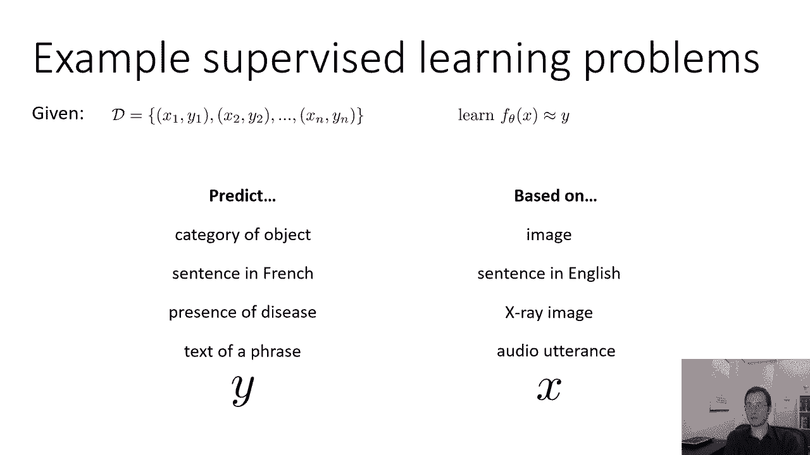

你可以把它表述为一个监督学习问题，现在预测通常是非常困难的，这是一个手写的数字，我告诉你，这是一个数字，零和九，所以0 1 2 3 4 5 6 7 8和9，是哪个数字好吧，如果你看这个数字。

你可能有一个五，这是一个相当草率的五，可能是三，我想这个数字可能是9，可能是别的什么，可能是3哪个是这个花点时间想想那个数字是什么，你可能会认为这是一个四，你可能会认为这是一个九，如果你真的很聪明。

你可能会说，嗯，我不知道数字是多少，可能是4或9，你知道如果我把我的电话号码写在一张纸上给你，你想打电话给我，我写了这个数字，您可以先键入，4的电话号码，看我接不接，如果没有，你可以用9输入。

看看我的回答对不对，所以在现实中，如果你真的看到这个数字，你实际用它做什么可能会受到你的不确定性的影响，这里有另一个例子，一个零，它可能像一个向后的六什么的，或者八分，要得到正确的答案是相当困难的。

如果你被迫承诺一个单一的标签，如果我们想象在标签上预测概率呢，所以如果我们看这个看起来像五个的东西，我们说好，百分之一是零，就像我说的，绝对不是零，这不是一个，不是二，嗯，好吧，这可能是一个三。

也可能是零%三，我不知道，绝对可能是5分，也许百分之九十，也许我们很确定这不是，那是五，这可能是一个很小的机会，这是一个非常草率的六个，也许有百分之二的可能性是一个非常奇怪的八，好的好的。

所以也许那个有一个更清晰的案例，下一个可能是一个非常丑陋的零，就像有人的笔滑倒了，然后他们把一个弯曲的，所以可能有4%的机会是零，绝对不是一个，绝对不是2，绝对不是三分，可能是四个。

它可能会像一个非常丑陋的四个，嗯，可能是6，也许它真的很丑，就像一个很大的下循环，可能会是一个非常尴尬的8，但可能是九对，所以很可能是9，但也可能是其他一些事情，下一个可能是丑陋的零，呃可能是一个三。

可能是5，它看起来有点像5，可能是6，左边只缺一个环，所以如果我们有概率，我们可以更好地表达我们认为真正发生的事情，我们可能会捕捉到这样一个事实，即这四个可能是一个四，它很有可能也是9分。

我们只是不确定，输出概率给了我们更多的灵活性来实际表达，我们认为图像中真正发生的事情，这种不确定性可能对以后的决策有用。

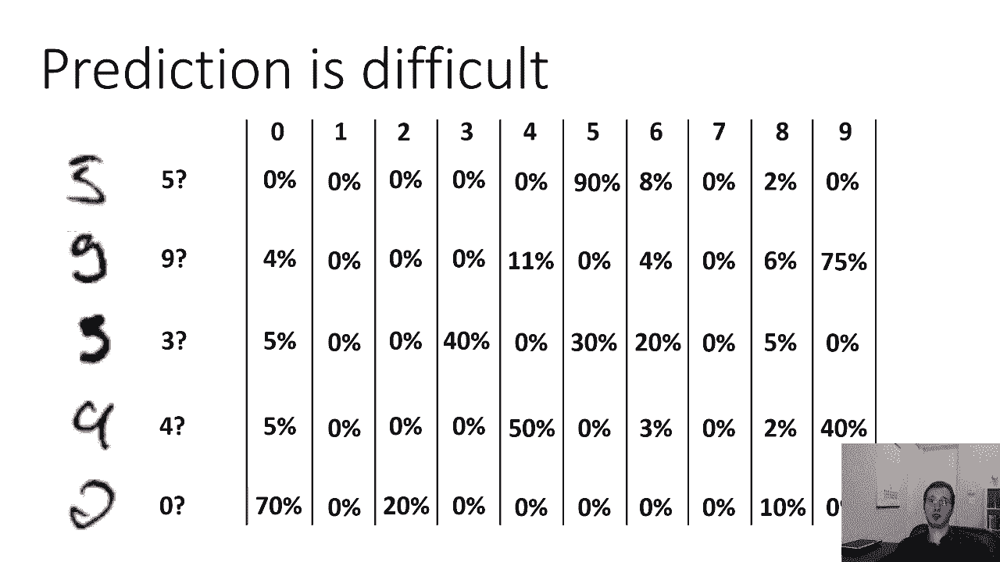

所以预测概率通常比预测离散标签更有意义，我们以后会看到它实际上也更容易学，如果我们预测概率而不是离散的标签，因为平滑，直觉上，我们不能改变一个离散的标签一点点，就像我们不能修改我们的θ值一样。

看看标签是否变得更正确，这有点像要么全有要么全无，如果你被迫帮助狗或猫，你，如果你稍微改变一下你的θ，呃，标签可能不会改变它，然后你改变了很多，它可能会翻转，但这种巨大的变化可能很难找到。

但我们不能改变一点点概率，这使得寻找最优θ的问题变得更容易，因为你可以稍微改变它们，看看概率是否朝着更接近你想要的方向变化，所以给了一套训练，而不是学习一个将x映射到y的函数，现在我们要学习一个函数。

它将x映射到y上的分布，我将把它表示为p，给定x的y的下标θ，所以它实际上是y上的概率分布，以x为条件，这是一个条件分布，所以现在我们要把我们的投入，也许我们的狗的照片。

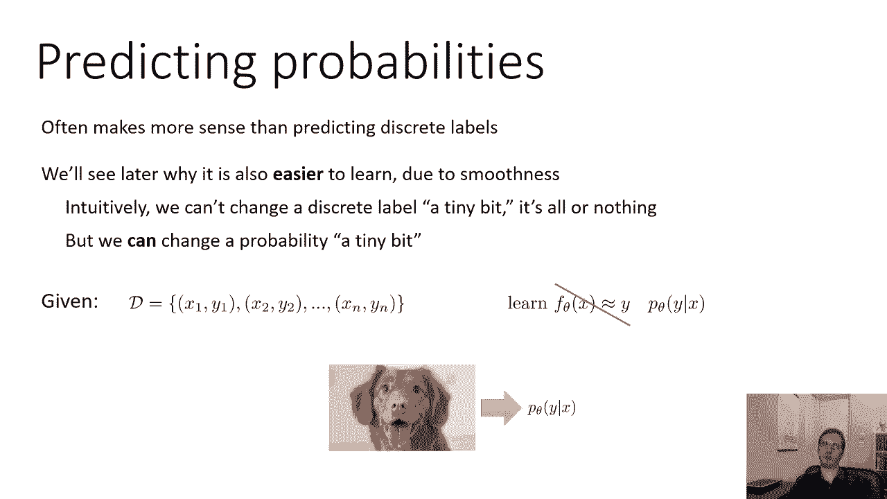

并在其相应的标签上输出发行版，y，让我们复习一下条件概率，所以我们有两个随机变量，我们有随机变量x，它表示输入，可能是图像，比如说，为什么x是随机变量，嗯，x是随机变量，因为我们不知道我们会得到什么x。

所以说，世界上有一些真正的潜在过程会产生不同的x，我们可能会得到不同的，y是表示输出的随机变量，我们可以写出x和y的联合概率，现在我们从概率论中知道，x的p，逗号y可以分解。

用概率链式法则作为x的p乘以y的p给定x，这只是从概率链式法则得出的，然后呃，你也可以重写这个方程，把两边除以x的p，得到条件概率的定义，给定x，y的p等于x逗号的p除以x的p。

所以如果你真的知道x的p和x逗号y的p，你可以恢复你的条件概率，事实上，有一些方法可以做到这一点，但在今天的讲座中，我们将采取不同的方法，对呀，谈谈直接学习给定x的y的p的方法。

我稍后会重新讨论这个区别，但为了让你知道术语，直接学习给定x的y的p的方法被称为判别法，他们被称为歧视性的学习方法，因为他们的目标只是区分不同的Y，学习x中p的方法，逗号，y，被称为生成方法。

它们被称为生成性，因为这种方法可以，原则上，生成x，但是如果你能学会x逗号y的p，你可以从条件概率的定义中恢复给定x的y的p，如果这种区别对你来说不完全有意义，别担心，就目前而言。

我们以后会更详细地讨论，但在今天的讲座中。

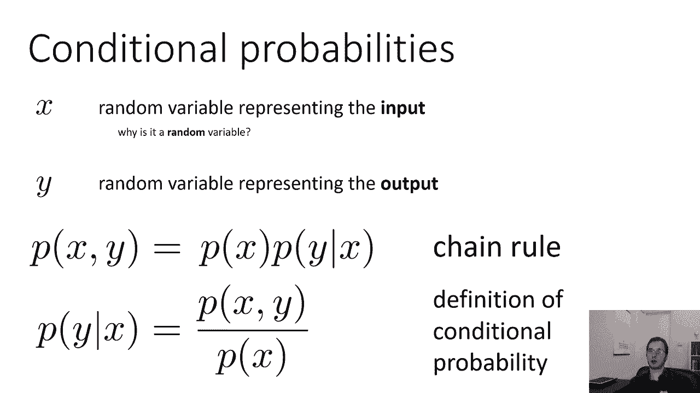

我们将重点学习给定x的y的p，好的，我们要问的第一个问题是如何表示y的p，给定x，在机器学习中记住，我们只有一个将输入映射到输出的计算机程序，除了不输出对象标签，现在我们输出对象概率，因此。

与其输出一个分类标签，我们将输出一堆数字，对应于每一种可能的概率，我们首先要选择的是如何表示这个计算机程序，那个计算机程序是什么，我们将要学习的程序中的参数是什么，你，所以我们要拍一些照片。

我们将输出这个数字表，代表每个类的概率，所以如果我们有十个可能的标签，我们的程序需要输出十个数字，这些数字必须是正的，他们必须解成一个才能是有效的概率，所以我们不能选择任何只输出十个数字的计算机程序。

我们必须以某种方式让它们是积极的，求和为一，所以这是我们要处理的第一个挑战。

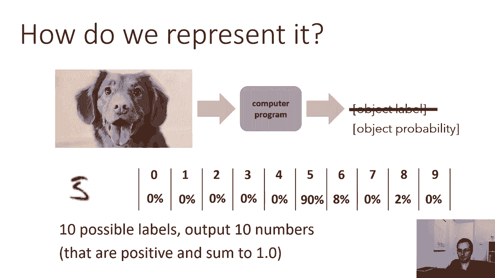

所以在我有一个非常基本的程序的例子之前，如果x在某行下面，并且需要实现这个线下函数，然后输出一个类，否则我会把一个不同的类，但我们需要输出概率，那么这个怎么样，我们要说y的p等于狗，给定x是x转置θ狗。

好的，你实际上不想把图像中的像素，并在它们上有一个线性函数，但你知道，让我们只是不担心，就目前而言，假设那是一只很低维度的狗，对呀，好的，这似乎是一个明智的选择，你会得到一个号码。

然后y的p等于cat给定x是x转置θcat，所以这定义了一个有效的程序，程序接受x并输出两个数字，一个代表p的y等于狗，一个代表p的y等于猫，它的参数由theta dog和theta的串联定义。

这是否输出有效的概率分布，花点时间想想，所以一个有效的概率分布由正数组成，正数加起来为1，这个程序的问题是一般来说，p=y，狗加p等于不能和为一，除非Theta是非常选择的，非常，仔细地。

所以我们违反了这个约束，这些数字是正的，和为一，所以这是我们的第一个问题，好的，所以我们稍微改变一下，而不是让X转置θ狗，等于f狗或等于狗的p，我们必须等于某个函数f狗，所以我们在程序中有一些中间函数。

子程序，如果你叫f dog，f dog就输出x转置θdog，就像，就像我们有这个线下函数，我们有一个F狗函数，然后给定x的y的p由其他函数给出的概率，我要称之为软麦克斯，另一个函数是f狗和f数。

它将迫使这些数字都是正的，求和为1，所以这也是一个有效的程序，它只是一个由F狗和F猫组成的软max组成的程序，所以你接受你的输入，你在穿过那条狗，你在通过F猫，然后你把这些输出，你把它们运行到软最大值。

这就得到了给定x的y的p，和f dog和f cat在这里定义为这些线性函数，我还没有定义SoftMax，但是SoftMax的工作将是把这些实值数字，狗和F猫生产，以某种方式迫使他们变得积极和简单。

如果我们能做到这一点，那么我们就有了一个有效的程序来产生对象概率，一个带有参数的有效函数，我们可以学习，嗯，现在，原则上，软麦克斯，我在这里所说的SoftMax实际上可以是任何函数，如果是一个就好了。

一一二通功能，但它可以是任何接受这些输入和输出的函数，正和为一的概率，现在我说的原因是，一对一和对二是因为你可能不想要这样的函数，把一只狗和一只猫扔进垃圾堆，它输出一个逗号零。

或者像一个逗号零这样的东西，和为一，这两个都是积极的，但它忽略了你所学函数的输出，所以你不只是想要任何功能，你不会真的用你放进去的东西，想要一个发挥作用的人，会这么做，如果如果如果你不确定。

如果你不记得你真正的分析，一对一蒙蒂，对你来说毫无意义，别担心这个，我就，我很快就会解释的，但也许一个更基本的问题是，为什么几乎任何函数都可以像这样工作，我们想要点特别的东西吗？我们不想要正确的概率吗。

为什么我们可以使用任何使它们为正的函数，和为一，花点时间想想这个，你也可以写下你的答案，这可能会帮助你把这个具体，为什么这会是任何函数，为什么不，为什么这不是一个非常特殊的功能。

你在机器学习中对功能的选择并不一定意味着产生正确的答案，你通过选择正确的参数来产生正确的答案，函数只需要足够通用，所以存在一个代表正确答案的θ的选择，所以只要这个函数不丢失太多信息。

你可能会选择theta狗和theta猫，这样它就会输出正确的答案，你不必对那个选择那么小心，因为你要选择θ。

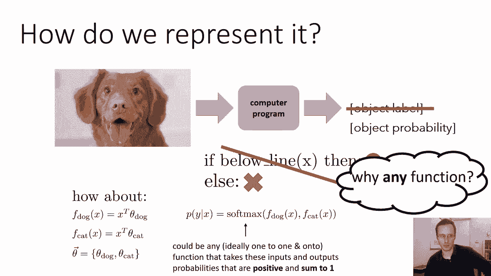

最大化正确和方差，所以呃，但是让我们来谈谈一个我们实际上可以使用的特定函数，所以我在上一张幻灯片上说的重点是，这并不重要，有很多选择，但是让我们来谈谈我们想在实践中使用的一个特别好的选择。

所以我们要做两件事，我们必须让他们积极，我们现在要把它们求和为一，给定某个数z，你怎么能让这个数字为正，有很多事情你可以做对，你可以说好，z平方，z平方总是正的，不管z是什么，z的绝对值总是正的。

你可以取0到z之间的最大值，这也是正的，你也可以扩展阴影Z，这也是正的，这些都是使数字为正的有效方法，它们实际上都可以工作，指数函数特别方便，因为它是一比一，二对二。

这基本上意味着它将整个实数线映射到整个，这意味着在某种意义上，这是把任何数字变成任何正数的限制最少的方法，因为每个实数都会映射到一个唯一的正数，并且存在一个实值数，它将产生任何期望的正数。

如果通过指数函数，指数函数并不是唯一具有这种性质的函数，当然啦，但这是一个事实，它是一对一和对二，呃，非常方便，一比一意味着从输入停止的映射是唯一的，因此没有两个输入映射到相同的输出。

ON意味着它映射到整个范围，在这种情况下，整个正数范围，所以它将整个实数线映射到整个正实数集，你不需要这个属性，只是有点方便，因为这样你就不会浪费你的一大块数字线，所以不要想太多。

这些中的任何一个都会起作用，他们有不同的权衡，但没那么关键，但是指数的特别方便，既然他们都没事，指数的是我们要用的，接下来就是，我们需要这些数字和为一，所以如果我们通过指数来使所有的数字都为正。

我们怎么做，然后求和为一，如果你有两个数字，z 1和z 2，你可以让它们和为一，把它们变成z 1除以z 1加z 2，然后z 2除以d 1加z 2，这叫做正常化，所以归一化意味着你把每个数字除以它们的和。

如果你在，由此产生的新数字将不得不总体上稳定下来，如果给你N个数字，然后取z，i，z，1除以和，从i等于1到z i的n，这被称为正常化，有了这两个观察，我们现在可以定义softmax函数。

SoftMax函数获取其所有输入，它使它们指数化，然后除以它们的和，现在是狗猫的例子，它是两个输入的函数，产生两个输出，所以我在这里写的是第一个输出，狗输出右，所以有一个狗的输入和一个猫的输入。

狗输出和猫输出，所以狗的输出是F狗的指数，除以f狗的指数，加上f数的指数，什么是软最大猫，左撇子，嗯，这就是F猫的指数，除以f狗的指数加指数f猫，所以指数使它为正，除法使之和为一，这没什么神奇的。

这不是唯一的办法，还有其他方法可以得到数字，积极等等，只要你得到的数字是正的和为1，仅此而已，你真的需要能够输出概率，但是SoftMax是一个特别常见的选择。

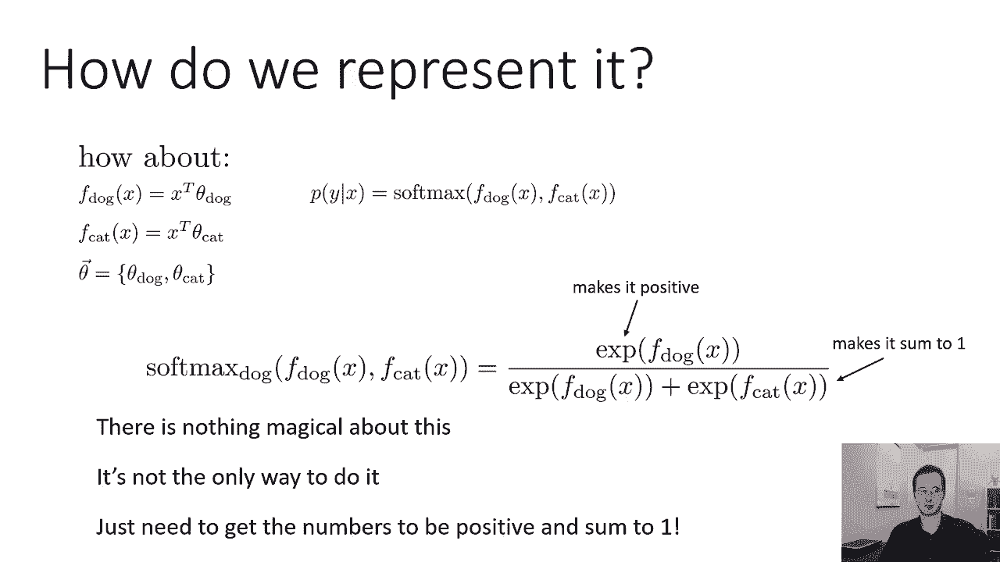

一般来说，呃，你可能有N个标签，所以不仅仅是猫和狗，但是一些标签，比如这些数字的十个标签，给定x，y的p是一个有n个元素的向量，每个可能的标签都有一个元素，你有一些功能。

x的fθ是一个有n个输出的向量值函数，这些产出可能不是积极的，它们可能不等于一，所以SoftMax给你贴上了ith标签，所以y的p等于，i给定x是softmax函数中的第i项。

所以softmax函数接收一个向量并输出一个向量，输出向量的第i项是第ith的指数，x的f除以和的输出，在x的指数输出f的所有维上，所以这是SoftMax函数，它唯一的工作就是使数字为正，使它们和为一。

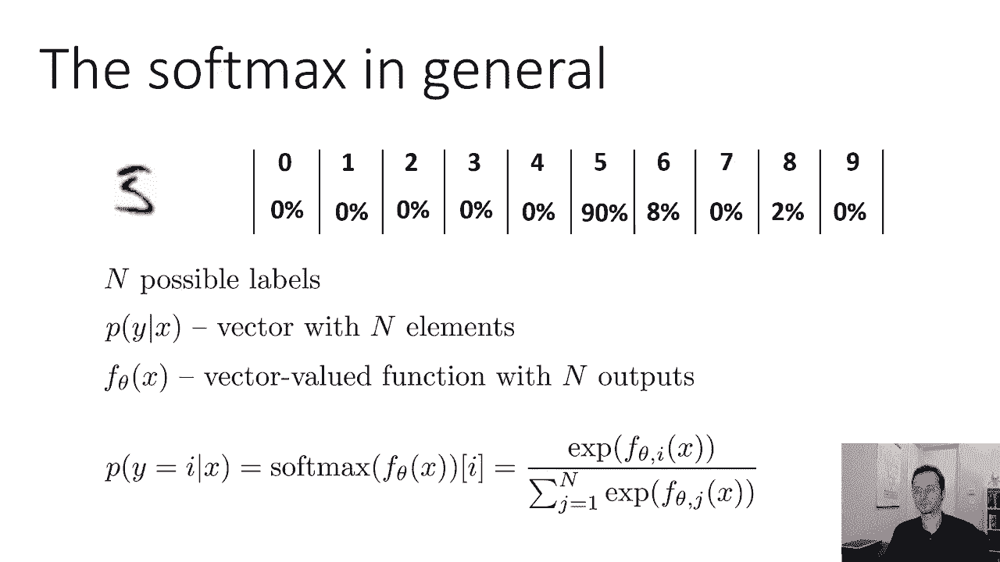

所以这里有一些SoftMax动作的插图，假设你有两节课，红色和蓝色，学习到的θ值。

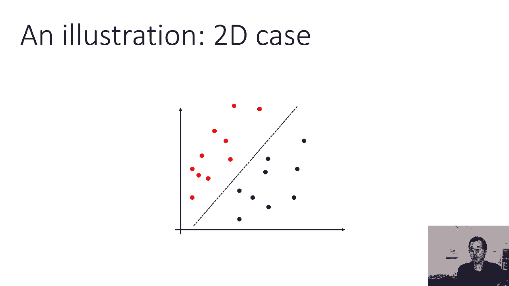

它们基本上在空间中定义了一条线，任何高于这条线的东西都有更大的概率是红色的，这条线以下的任何东西都有更大的概率是蓝色的，这就是你将要得到的效果，如果你用这些线性映射做一个软最大值。

这条线本身实际上是概率相等的点，对应于特定标签的θ和x之间的内积变大，那个标签的概率变大了，如果内积等于另一个标签的内积。

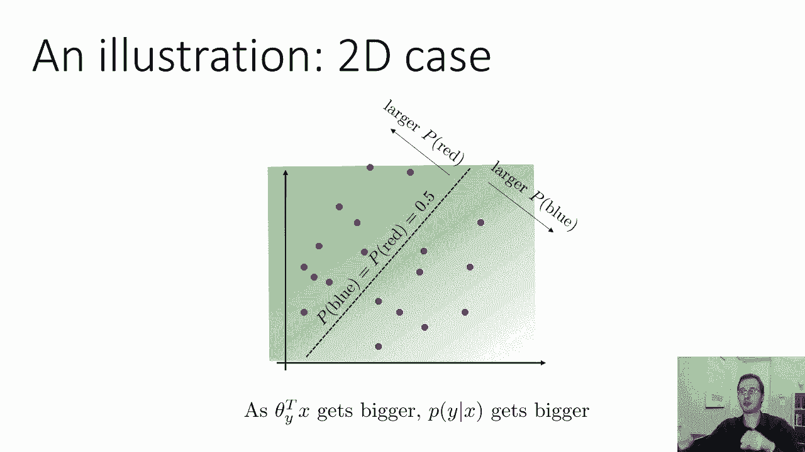

那么概率是五五开，这在One D的情况下可能更容易看到，因为在一个D案例中，我实际上可以绘制软最大值，软最大值在y轴上的输出，所以你又在红色和蓝色之间分类了，但它们是一维点，所以在右边这里，很明显。

正确的答案是红色，这边左边，很明显正确答案是蓝色，在中间，也许你有点不确定，如此直观，如果你想象一下红色超重的概率，想想那个情节会是什么样子，你会期望它在蓝色区域很低，在红色区域的高处，差不多五五开。

在中间那个不确定的区域，所以这是决策边界，这基本上是你跨过50比50门槛的点，Softmax会是这样的，所以这是，你知道吗，软麦克斯，记住苹果的两个数字，两个可能性，我正在绘制其中一个。

我在策划红色的P，还有一个蓝色的P，但是因为只有两个班，蓝色的p是红色的一减p，所以这就是为什么我只画红色的P，你可以看到它在决定边界处超过了50，它饱和到右边的一个，它在左边饱和到零。

所以蓝色区域几乎为零，几乎一个在红色区域，介于两者之间，所以这又是两个类的软最大方程，红色和蓝色，当我们远离边界时，红色的概率呈指数级增加。

然后归一化器将事情求和为1，现在，作为简短的旁白，为什么我们称之为软最大值，嗯，让我们想一想，如果我们把我们的Theta，我们要把它们乘以一个大数字，所以也许这是我们最初的决策边界。

对于θ红和θ蓝的特定选择，现在我们要把它们都乘以五，如果我们把它们都乘以五，我们得到的曲线形状是一样的，但它向右增加得更快，它在左边减少得更快，它在同一个地方穿过了五十的边界，只是越来越锋利了。

越来越陡了，如果我们乘以一百，那么得到的softmax实际上看起来几乎像一个step函数，本质上是因为指数函数增长得如此之快，随着它的投入增加，然后对于任何蓝色的点积大于红色的点积的地方。

膨胀会迫使它几乎归零，和任何红色的点积较大的地方，它会强迫去几乎到一个，中间会有一个非常剧烈的变化，有趣的是，这很像一个最大值，对呀，你只是给最大的标签分配了一个很高的概率，呃，最大θ转置x的点积。

所以这就是为什么它被称为软麦克斯，如果进入它的数字非常大，它的行为就像一个最大值，但随着这些数字变小，它就变软了，它在概率空间中有一个更温和的斜率，但是对于非常大的θ值。

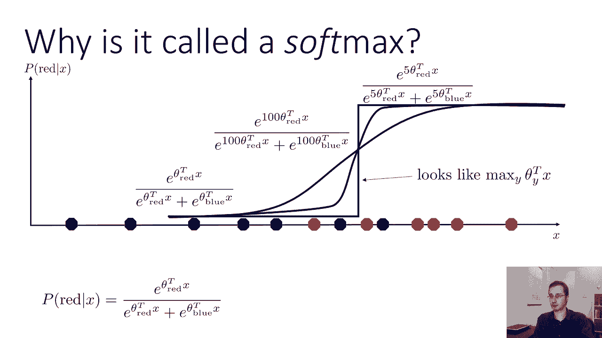