# 【双语字幕】伯克利CS 182《深度学习：深度神经网络设计、可视化与理解》课程(2021) by Sergey Levine - P60：CS 182- Lecture 19- Part 3- GANs - 爱可可-爱生活 - BV1PK4y1U751

在今天讲座的最后一部分，我们将讨论一些现代的训练方法，甘斯，这往往比我之前描述的经典简单的甘工作得更好，那么首先甘斯有什么问题，如果你只是实施GAN训练，我在讲座第二部分中描述的方式。

你可能会发现最简单的问题，它需要大量的超参数调整才能正常工作，为什么对于甘斯来说，这是一个特别困难的场景，也许可以说明这个问题，下面是，假设x是一维的，这样我现在就可以把它们画在幻灯片上了。

假设这些蓝色圆圈代表真实数据，当然在现实中你可能有成千上万甚至数百万的数据点，而这里我只有五个，但现在只是为了可视化，假设这些橙色圆圈代表当前生成器生成的样本，所以你可以想象p数据是一个分布。

看起来像这样，和PG发电机的分布现在看起来是这样的，如果我用这个P数据训练我的鉴别器，这个PG我的鉴别器，基本上，真实的概率可能是这样的，它将完美地接近真实数据的零点，它将完美地零点零接近生成的数据。

它在中间的某个地方会有一些决策边界，离任何一种分布都很远，所以现在请记住，生成器完全通过使用梯度来学习，通过鉴别器，那么生成器梯度实际上在生成的数据附近是什么，嗯，鉴别器在所有这些点上均匀地输出零。

所以记住这是双人游戏的表达式，第二部分是生成器的目标，所有这些值，所有这些log 1减去ds在生成的数据附近基本相同，因为鉴别器在这一点上已经完全饱和，它输出了完美的精确度。

对所有的训练数据都是完美的一个零，对于所有生成的数据完全为零，你知道你需要，嗯可能调整了一点，以确保你不会得到南，但基本上它将是一个对数，这不是很有效。

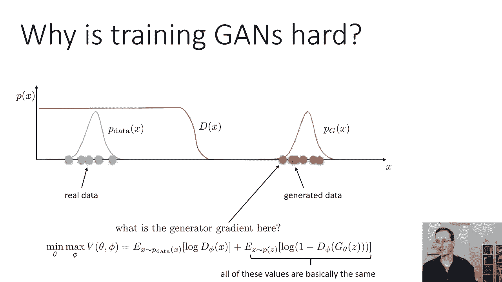

那么我们怎样才能让这变得更好，我们怎样才能确保，即使发生器与鉴别器相比非常糟糕，当生成的数据离p数据很远时，鉴别器仍然给我们一个有意义的梯度信号，我们可以做的一件事是我们可以以某种方式改变我们的鉴别器。

也许我们可以以某种方式改变辨别者的训练方式，因此，即使它可以完美地将P数据从PG中分类，仍然鼓励在这些分布之间产生一个更平滑的斜坡，给发电机一些梯度信号，引导它向P数据，我们可以做的另一件事是。

我们基本上可以稍微改变一下分布，也许我们可以以某种方式修改P数据和PG，所以重叠的比较多，然后辨别者就不会那么震惊了，然后我们会看到一个更强的梯度信号，所以这两个都是可行的想法。

我们可以用一些实际的方法来实例化这种直觉。

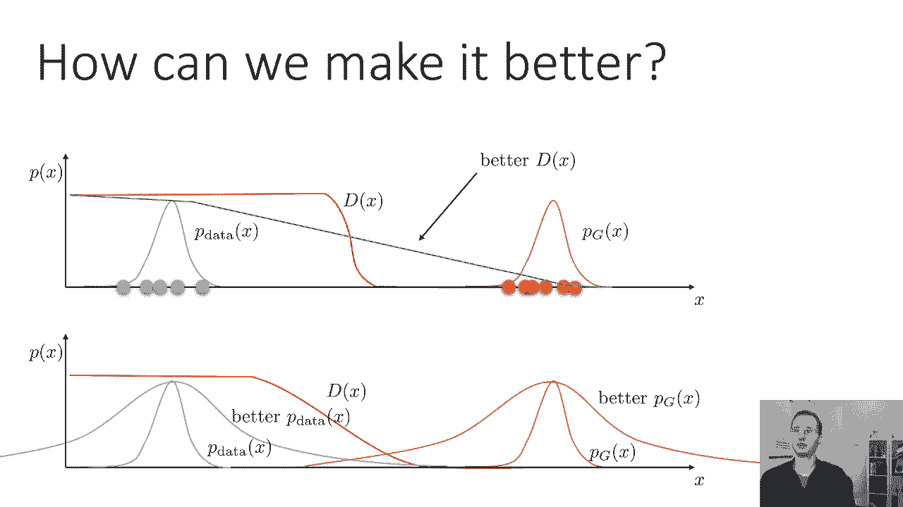

一些改进的甘恩技术，很好地意识到，没有特别的顺序，最小二乘，扫描或扫描是修改GAN鉴别器的一种方法，输出一个实值数，而不是零到一之间的概率，并训练鉴别器，使其产生更平滑的斜坡，所以这是最好的选择。

乡巴佬斯坦，甘，或者瓦根，是将鉴别器修改为Lipschitz连续的一种方法，这也鼓励它在p数据和pg数据之间有更干净的斜率，梯度惩罚是提高Ostegam的一种方法，因此判别器被限制为连续的，就更难了。

所以它试图做与W开始时相同的事情，但更有效，和，谱范数是一种真正约束判别器的方法，连续的，所以基本上如果你再听到福斯特·斯坦的事，梯度惩罚或谱范数，他们都在试图用稍微不同的方式做同样的事情。

然后一个稍微不同的方法来改善甘训练是一种叫做实例噪声的东西。

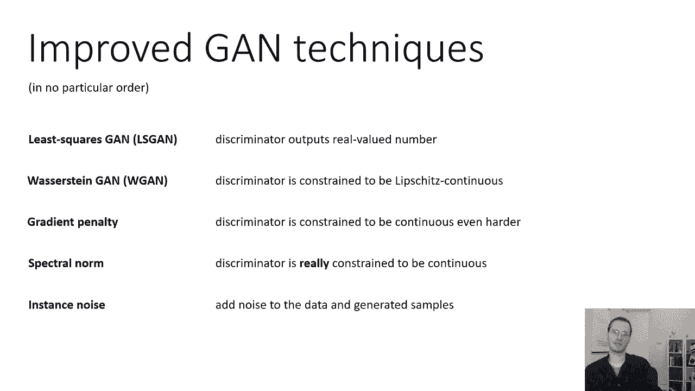

基本上就是做幻灯片底部的事情，它试图通过增加大量噪声来改变分布，到to p数据和生成的示例。

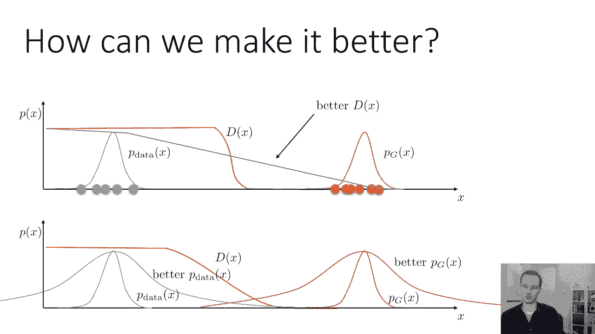

希望让它们的分布有更多的重叠。

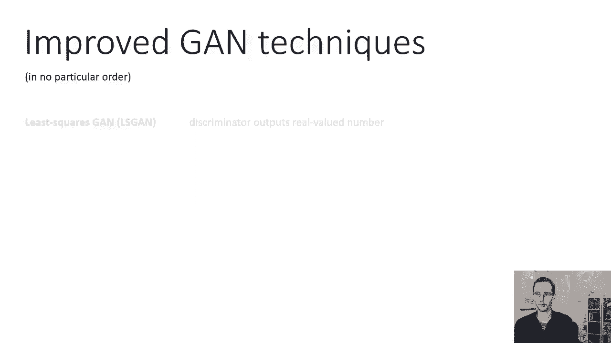

所以这是实例噪声，如果您想了解这些不同技术之间的一些比较，至少在理论上是这样，你可以看看这篇论文，叫做甘斯的哪些训练方法实际上是收敛的，分析了甘斯的基本收敛，左上角的标准甘斯非常，在收敛方面非常糟糕。

所以在许多简单的情况下他们可能找不到平衡，但许多改进的GAN技术可以找到平衡，或者至少接近它如果你想要一种技术，实际使用，我的建议是用梯度惩罚或光谱定律，这些都是今天很好的选择。

梯度惩罚实现起来更简单一点，谱范数可以更有效一点，但实现起来有点难，它们基本上都是基于老板的时间，所以在今天的讲座中，我将主要关注瓦瑟斯坦·加姆，然后简要地说明我们的梯度惩罚和谱范数工作，但请记住。

像最小二乘这样的事情，噪声也是可行的选择，欢迎你在文献中查找它们，以了解更多关于它们的信息。

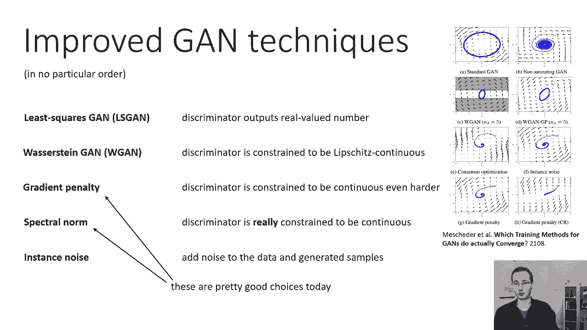

但现在我将再次专注于描述Poststein，高层直觉是延森香农散度，经典甘所使用的没有任何方法来解释距离，基本上，如果你有这种情况，你可以说这两个分布相距甚远，或者你可以有这个场景，然后说好。

这两个分布非常接近，就阿南德·香农分歧而言，这两种情况差不多，因为在这两种情况下，分布之间的重叠可以忽略不计。

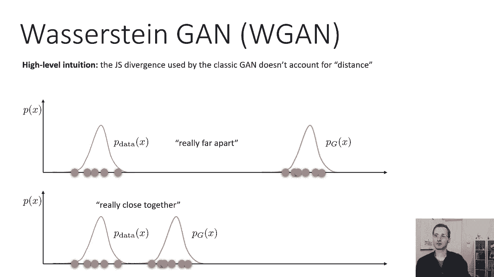

所以散度和kl散度，和大多数其他纯粹使用，在这两种情况下，概率几乎相同，尽管很明显底部的要好得多，高层，我解释了为什么在游戏中很难获得有意义的渐变，当发电机很糟糕的时候，因为。

一个好的渐变应该告诉你改善上面情况的方法，是走向下面的情况，但是如果你的散度度量认为这两个分布几乎相同，那么，当然它不会有太大的梯度，在数学上这是真的原因是，如果你看延森香农散度的形式，甘目标的形式。

你会看到基本上，它是用一个分布下的对数概率表示的，在另一种分布下的预期，其中pg不为零，PG近于零，因为所有的XP数据都不是零，那么这些表达式就不会给你任何有意义的渐变，这样。

基本上解释了为什么顶部的情况被认为与底部的情况非常相似，就末端和香农多样性而言，尽管在底部的情况下，这些分布非常接近，所以我们能做的是纠正这个问题，有了再次训练的方法。

用不同的散度度量来更好地捕捉两个分布的距离。

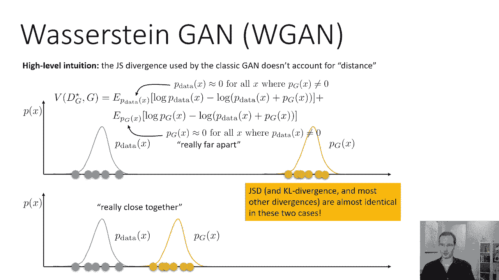

下面是你如何考虑一个更好的指标，考虑欧几里得空间中所有概率比特之间的距离，所以想象一下这些分布，基本上是成堆的材料，成堆的泥土，你要走多远才能把泥土从一堆搬到另一堆，这有时被称为最优运输问题。

或地球搬运工距离，你要走多远才能把一个发行版运送到另一个发行版，所以如果你想象一下这个，这条蓝色曲线实际上就像一堆物理材料，这个橙色的曲线是你想让材料去的地方，想象一下你必须拿起每一块蓝色的材料。

把它搬到橙色的堆里，你要走多远才能做到这一点，所以你可以把这个拿过来，把这个拿过去，把这个拿过来，等权利，每次你去那里，你回去再拿一些，所以你要走的总距离，这两个分布相距多远，现在，当然啦，在现实中。

这些小材料是无限小的，你要无限多次旅行，但如果你把，如果你，你知道吗，取这个连续的东西，把它离散化，取极限，当离散化为零时，这将给你对距离测量的正确直觉，所以如果他们真的靠得很近。

即使它们的重叠仍然为零，你必须走更少的路来携带每一点分配，从一堆到另一堆，所以这被称为地球移动距离或巴斯塔尔时间距离。

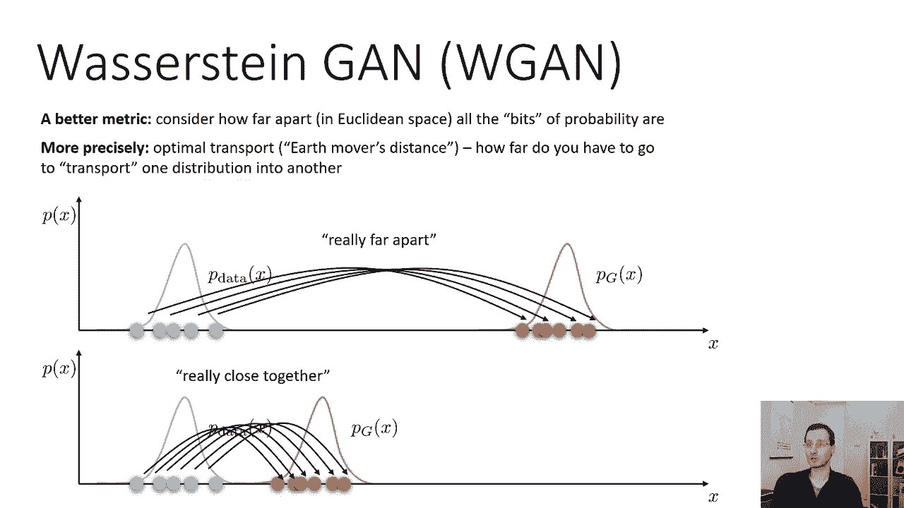

正式定义巴斯特·斯坦距离有点涉及，我会尽我所能给你这个正式定义的直觉，但如果你不完全清楚，别太担心，你其实不需要明白这一点，为了再次实现克星的时间，但你知道，获得对此的直觉可能会有所帮助。

所以Buster的时间距离可以写成w p数据逗号pg，并正式定义，y与x之间距离的期望值，其中y和x根据联合分布γ的最优选择进行分布，所以你找到最小化这个期望值的最佳伽马。

什么是伽马井伽马是x和y上的分布，其中关于x的边距是p数据，相对于y的边距是pg，直觉是x和y之间的相关性，y表示应运输哪个x，其中y，所以对我来说，试图理解这一点的最好方法是视觉，如果你想象一个图。

其中一个x是x，另一个是Y，你可以把p数据看作是y轴上的分布，pg是x轴上的分布，然后伽马是一个联合分布，描述了y轴上的哪个点，到x轴上的哪个点，所以你会注意到这里。

PG的左侧部分与伽马下P数据的底部部分相关，这意味着这个部分会放在这里，然后这个部分会在这里，这一块会放在这里，这一块会放在这里，以此类推，所以为了评估巴斯特的时间，距离或推土机的距离。

你会发现伽马使这些距离的期望值最小化，使每个y的x和y之间的差异最小化，到那个特定的X，所以直觉上，寻找gamma就像找到移动p数据中所有点的最佳计划。

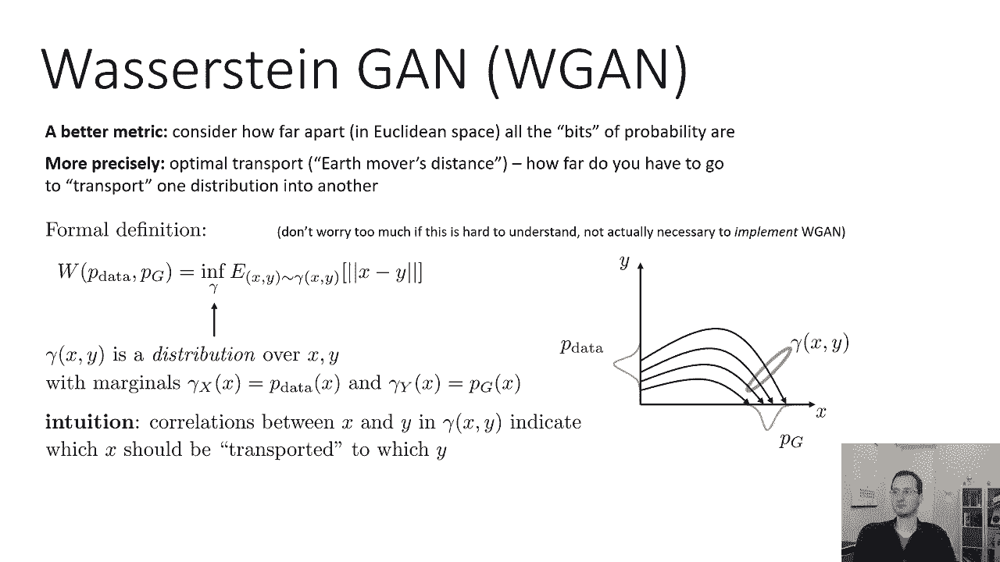

实际上像这样直接学习伽马是非常，非常硬，因为P数据未知，伽玛x y本身可能是一些非常非常复杂的分布，所以有一个非常酷的定理，我们可以根据Kantara使用，鲁宾斯坦对偶性。

这为我们提供了一个更容易处理的方法来解决巴斯特斯坦，距离，我要陈述这个结果，我不打算证明，呃，但声明是瓦瑟斯坦距离，上面的表达式，也等于所有可能函数的上确界，f的p数据下的期望值的f。

减去f的p g下的期望值，我们不会在这里证明这一点，但这一点的证明使用了二元性的工具，类似于你可能学到的，当你研究一类凸优化中的拉格朗日对偶时，所以你知道，我不知道，我不想在这里讨论这个。

因为我认为这门课的预科，不一定会提供必要的工具来做到这一点，非常非常粗糙的直觉，基本上f会，呃，它将来自你得到的同一个地方，基本上是拉格朗日乘数，这是一种高层次的直觉，所以你对伽马有一个限制。

即伽马的边缘与PD匹配，p数据和pg，你基本上要把它的对偶，所以我不打算证明，但你现在可以相信我的话，这是真的，这个表达巴斯特·斯坦距离的真正吸引人的地方是，它表达了PG和P数据下预期的差异。

就像一个普通的甘人，对呀，正则GAN是p数据下log d的期望值，然后在pg下对数1减去d的期望值，现在我们有了p数据下x的f的期望值，和pg下x的负f的期望值，所以这真的很酷。

这开始看起来更像是一场游戏，好了，现在，你们中的一些人可能已经注意到了，我没有提到任何关于，至高无上已经接管了这个有趣的表达，说规范，f的l小于或等于1，那是你应该重新做这件事的简写。

一个利普希茨的函数，一个利普希茨意味着，x的f和y的f之间的差应小于，或等于x与y之差，所以它基本上是利普希茨连续的，常数为1，这相当于说函数是有界斜率，所以永远不要太陡，为什么好，因为如果f太陡。

那么它可以在p数据下任意最大化x的f，并任意最小化，pg以下，这个坡度限制基本上是一种对你能行驶多快的速度限制，当您将一个发行版的部分传送到另一个发行版时，所以如果我们回到地球搬运工的类比。

把坡度限制在1就等于说你的限速是1，你从一个点到另一个点的速度有多快，当然，很容易把它概括为，如果你是两个利普希茨，意味着x的m减去y的f小于3，等于2乘以x减去y或一般的卡利普希茨，也很好。

然后你的解决方案将是公共汽车或斯坦因距离乘以K，所以如果你不是一个利普希茨而是两个利普希茨，那么最高的解将是w p数据pg乘以2，所以重点不是它是一个利普希茨，斜坡是有界的，斜坡是有界的。

意味着从一个配送站到另一个配送站的速度是有限制的，这使得这些距离实际上是有意义的，如果你没有速度限制，如果你能旅行，如果你基本上可以瞬间传送，那么你就不会得到一个有意义的数量，所以你需要某种速度限制。

速度限制是多少实际上并不重要，只要是，好的，那么我们如何执行速度限制，我们如何强制f的斜率应该以某个常量井为界。

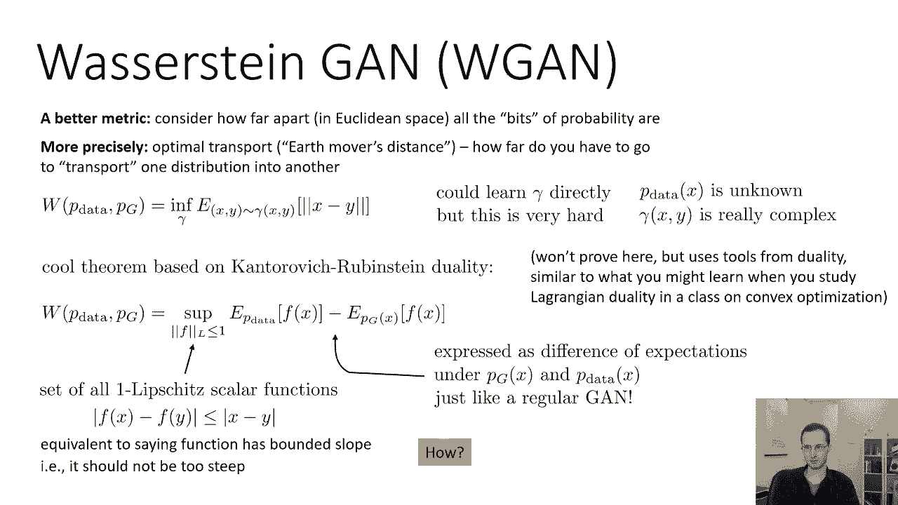

这基本上是实例化W GAM的困难部分，所以我有个主意，这不一定是最好的主意，但如果F是一个具有瑞利激活的神经网络，这是一个想法，如果你只是绑定权重矩阵w的权重，例如，如果你只有一层网络。

你基本上有一个线性层，然后是一个relu非线性，所以如果x的fθ等于w 1 x加b的比，这不是一个很好的架构，但只是作为一个例子，您在W中的所有条目都在，让我们说，负零点零一和正零点零一。

那么你的斜率可以大于零点零1乘以d，也就是，好的，这是一个非常简单的例子，如果你有一个两层神经网络，所以它是w 1 x的2倍，你的参数是w 1，b一，w 2和b 2。

然后可以将两个权重矩阵中的所有条目约束为负，在负数之间，零点零一和零点零一，然后你的斜率也将是有界的，当然比以前大了很多，因为你实际上是把这些w相乘在一起，嗯，但它仍然受一个常数的限制。

所以这并不能保证它是一个利普希茨，除非你非常小心地选择界限，但它确实保证了它是一些常数的利普希茨，这意味着斜坡将是有界的，这意味着你会得到一些瓦瑟斯坦距离的倍数。

所以它确实保证了某个有限k的k Lipschitz。

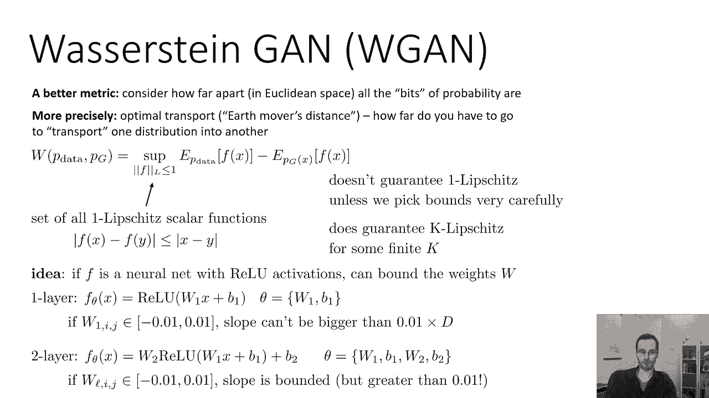

这就是你们所有人，你需要，现在警告，这是从最初的阿斯特斯坦甘纸，我要直接读给你听，是那篇论文中一个过于诚实的段落，减重显然很可怕，呃，作为强制椭圆约束的一种方法，如果裁剪参数较大。

那么任何方法都可能需要很长时间才能达到极限，从而使批评家更难训练，直到最优，如果剪裁很小，这很容易导致渐变消失，当层数较大或不使用批处理规范化时，就像在RN，我们用简单的变体进行了实验。

就像把重量投射到一个稍微不同的球体上，我们坚持用重量夹，由于它的简单性和已经很好的性能，然而，我们确实留下了强制Lipschitz约束的话题，在神经网络环境中的进一步研究。

我们积极鼓励有兴趣的研究人员改进这种方法，事实上，如今，我们会认为这种重量裁剪方法大多已经过时了。

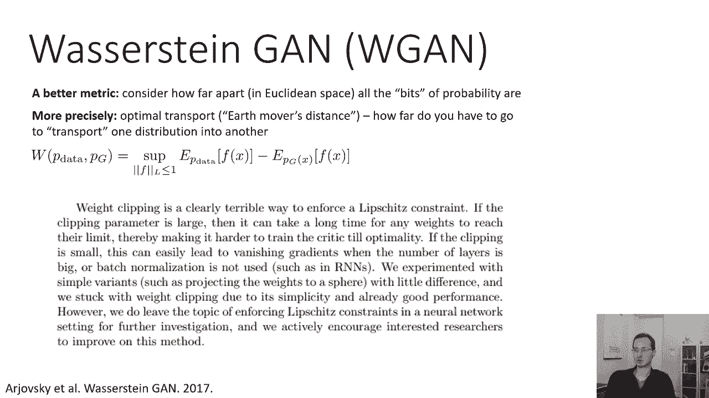

有更好的方法来做到这一点，但是如果我们想通过这个更广阔的斯坦甘程序，它是这样工作的，我们会像以前一样有发电机，我们现在会有一个歧视者，而不是输出图像是真实的概率，它实际上只是输出一个实数。

那个实数是不受约束的，所以你只要，你知道的，一堆带有Relus的线性层，比如说，最后没有乙状结肠，所以一个例子，一个非常简单的鉴别器的架构将只是一个两层神经网络，真的在第一层之后，第二层之后什么都没有。

所以你不再输出概率了，只是输出实数，鉴别器将使用权重裁剪，事情是这样的，随机梯度算法的每一次迭代，您将更新鉴别器fθ，使用x的f的f的p数据下期望值的梯度，减去p/z下的期望值。

有一个小类型应该是f的一个g的z，所以这就像普通甘中的更新一样，仅使用W GAN目标，但是你会把Theta里面的所有权重矩阵都剪掉，在f的参数内，在某个常数之间，所以在负c和c之间，这将确保判别器是K。

有限k的Lipschitz，然后更新生成器，使f的期望值最大化，和g of z，这就是整个训练过程，变化是判别器进入客观的方式，然后这个裁剪的步骤，如果我们真的把它想象成一种简单的，呃，一个D的例子。

我们得到的鉴别器曲线实际上看起来要好得多，这是W gan论文中的一个例子，基本上和我以前的例子一样，所以蓝色的东西显示了真实的样本，绿色的东西显示假的生成样本，红色曲线是一个常规的鉴别器。

你可以看到传统的鉴别器基本上给出了一个点的概率，零到所有真实的东西，零点指出所有的假东西，当你得到f时，青色曲线没有梯度，这实际上是否定的，所以这将是，呃，这个数量将被发电机最小化。

你可以看到它的坡度要好得多，所以如果你想象发电机在改变，绿色的东西沿着青色线的斜坡往下走，所以这就是损失，它会直接向蓝色的东西移动，但如果它沿着红线的斜率，没有斜坡，我们无处可去，所以W甘会给你更好的。

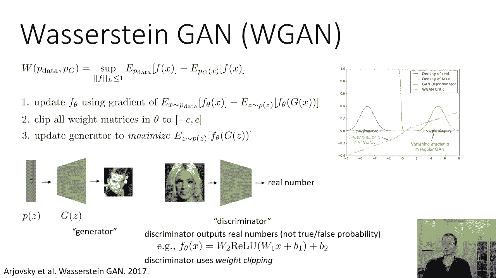

行为举止，判别器梯度，现在重量削减显然是一种可怕的方式来执行椭圆，约束，不是我的话，他们的话，那么我们如何才能更好地进行判别规则化呢，让我们的鉴别器更有效地成为Lipschitz。

所以一个非常简单和非常有效的方法叫做梯度惩罚，如果我们一开始的，我们想把判别井的斜率，为什么我们不直接写一个斜率的表达式，把它添加到我们的目标中，所以1李普希茨意味着x的f减去y的f。

它的绝对值小于或等于x减去y，这和说坡度应该以1为界是一样的，如果我们实际计算斜率，实际计算关于f的x的梯度，x的θ，然后只需添加一个附加术语，所以这里的一切都和原来的W游戏一样。

除了在P数据的期望值内，也就是lambda，乘以梯度对x的范数减去1的平方，所以它只是在说，求梯度关于x的范数，接近一个，然后你选择lambda，这就是你有多想要，那是你的正则化参数。

你会得到斜率的范数接近1，在原始的WGN GP论文中，他们只在p数据下应用这一点，虽然我想你也可以在PG下做，所以基本上使评分的标准接近1，这就像是在说，使你的坡度接近1，非常简单的方法，往往效果很好。

一种更复杂的方法，也很有效，我将在这里描述，对于完备性的一种称为谱，光谱数也不是一个更有原则的方法，看到梯度处罚的麻烦，这实际上不是一个约束，只是一个惩罚，所以你真的需要一个Lipschitz约束。

但这只是给你一个惩罚，所以它在实践中效果很好。

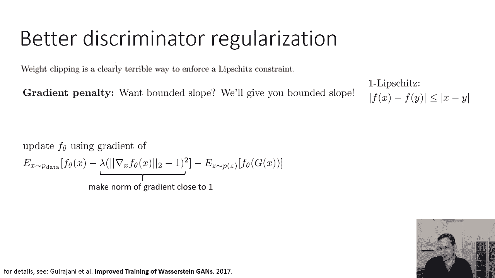

但这不是最有原则的事情，如果您真的想约束，以下是你能做的，你可以把利普希茨常数，根据网络中每个权重矩阵的奇异值，这个表情，这个利普希茨范数，一种规范，但假设这表示Lipschitz常数。

如果你的函数f是多个函数的组合，就像F，你知道x中的一个，那么f二，然后f3和f1，F2和F3是这样的层，比如说，f 1是线性层，f二是Relu，f3是另一个线性层，利普希茨常数可以写成。

可以写出由三个函数组成的组合的利普希茨常数，小于，或者等于每个函数的利普希茨常数的乘积，说服自己为什么这是真的，想象一下这些是线性函数对吧，所以如果你只是把一堆线性函数组合在一起。

它们成分的斜率只是它们斜率的产物，和一般情况下，即使对于非线性函数，它们组成的最大斜率以它们的斜率的乘积为界，所以我们要做的就是，为了保证Lipschitz常数是有界的。

就是约束我们网络中每一层的利普希茨常数，现在，假设我们的网络由线性层和Grau组成，因为基本上，同样的逻辑也适用于线性层的Convas，所以我只讨论线性层和非常松散的层，射线叶的最大斜率为1。

所以你不用担心一个很松的，所以真正的利普希茨常数是1，线性层怎么样，线性层的最大斜率，wx加b是w的谱范数，W的谱范数定义为W比值的最大值，w/h的范数的h，其中h是某个不为零的向量。

这是同样的方式说它是，它是所有h向量的w h的最大范数，在那里，幻灯片上有一种类型应该是正常的，h小于或等于1，所以对于范数小于或等于1的所有HS，那是有道理的，基本上，如果你取一个长度为1的向量。

你通过矩阵变换，矢量能这样多久，如果你能在矩阵中插入一个长度为1的向量，你得到的是一个长度为2的向量，这意味着你的斜率可能是2，这是W的最大奇异值，如果w是平方，将是W的最大特征值。

所以如果你能限制w的奇异值，那你就会，呃，为该层绑定Lipschitz常数，因为整个函数的利普希茨常数是，产品受产品的约束，这将约束整个事情，所以你要做的就是确保每一步，网络中每个权重矩阵的谱范数小于。

或等于1，你能做的就是计算光谱范数，基本计算西格玛w，然后在每一层用力WL，我是被西格玛的西格玛分割的老西格玛，基本上把每个权重矩阵除以它的谱模型，这将确保每一个线性层都有一个Lipschitz常数。

最多一个，这意味着整个函数的利普希茨常数最多只有1，实现这一点所需的唯一技巧是如何计算WL的sigma，有效地，这在报纸上有描述，所以说，如果你不是真的，想计算网络中每个矩阵的奇异值分解。

每一个梯度台阶，有一个更有效的方法来做这件事，正如论文中所描述的那样。

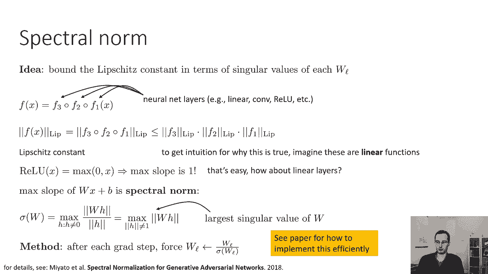

好的，所以GAN训练的总结GAN训练真的很难，因为鉴别器可以提供非常差的梯度，尤其是如果网络是，如果分布相距很远，各种技巧可以让这变得更加实用，比如说，你可以有像lgw n w n这样光滑的实值鉴别器。

GPS与光谱范数，或者您可以执行实例规范，这些把戏背后的理论相当复杂，但实际上这些方法实现起来非常简单，其中一些像WGN GP，只相当于在歧视者的损失中增加一个额外的条款，如果你用这些技巧。

由此产生的甘斯更容易训练，所以在实用性方面，基本上，呃，没有这些技巧的甘斯需要大量的调谐，对于任何不是这方面专家的人来说都很难使用，但一旦你有了这些技巧，他们可以很容易地训练，呃，不像大陆那么容易。

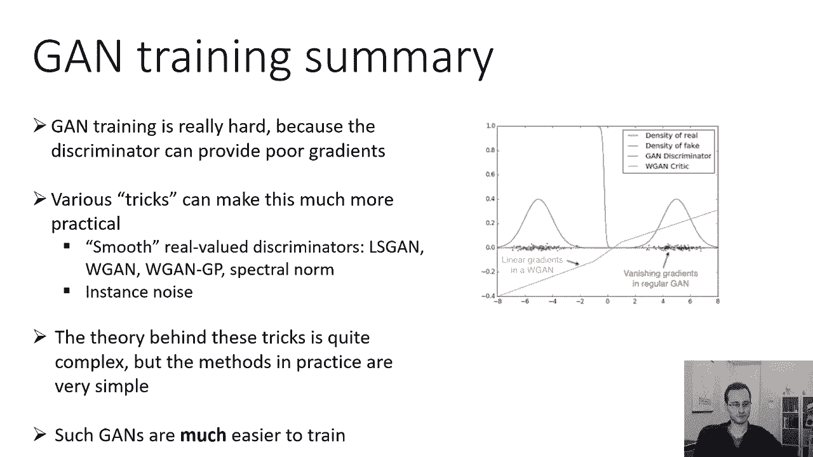