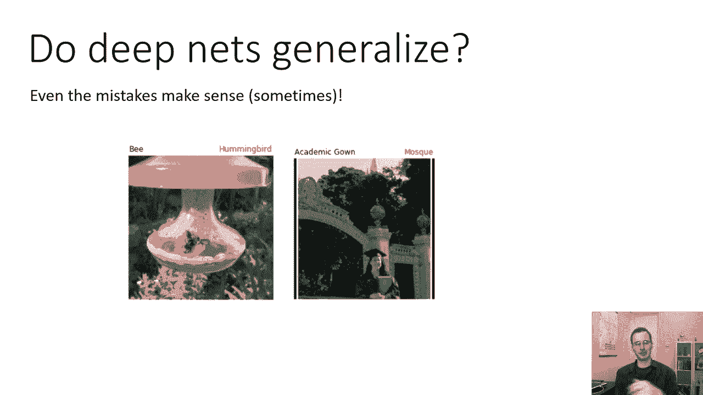
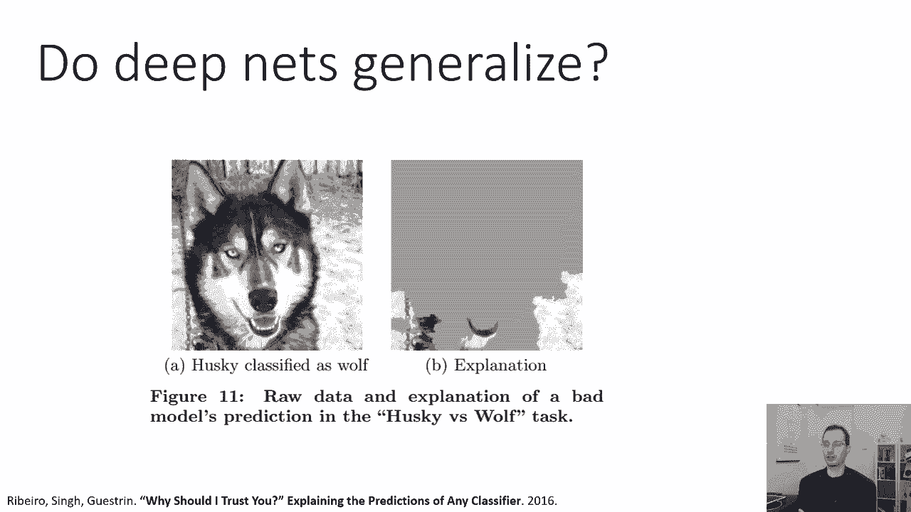
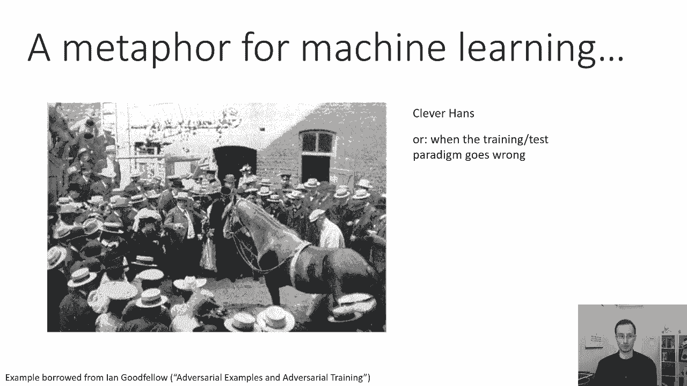
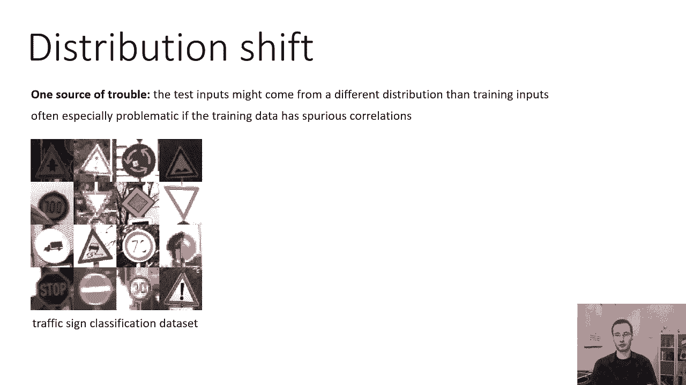
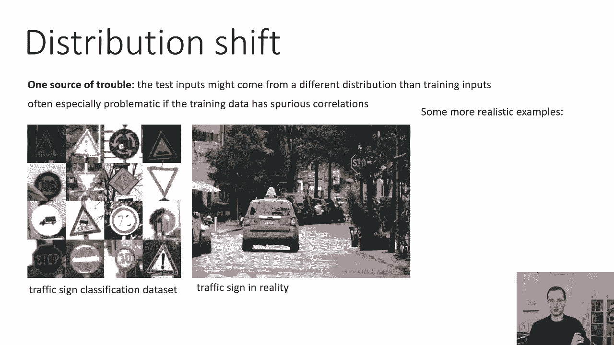
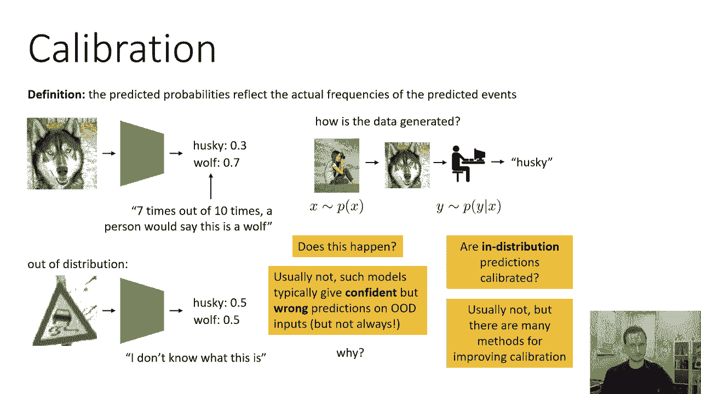

# 【双语字幕】伯克利CS 182《深度学习：深度神经网络设计、可视化与理解》课程(2021) by Sergey Levine - P61：CS 182- Lecture 20- Part 1- Adversarial Examples - 爱可可-爱生活 - BV1PK4y1U751

欢迎大家来到今天的CS一八二，我们将讨论深度神经网络和对抗性示例中的泛化，让我们从一个非常基本的问题开始，一个对任何人都很重要的问题，他正在考虑使用深度神经网络模型，深度网络泛化了吗。

你能向他们展示与训练中看到的输入不同的输入吗，让他们给出正确的答案在这节课的最后，这似乎是一个非常奇怪的问题，我们讨论过，即使在最开始的时候，那个，原因之一，对深度神经网络有如此多的兴奋和热情。

他们在困难和现实的任务上取得了非常高的准确性，比如说，ImageNet分类的当前错误率实际上超过了人类的性能，你可能会说这是因为人类不太擅长，呃，在非常细粒度的类之间进行分类，但是嗯，你知道的，然而。

你把它切开，看起来确实，这些模型在很多基准测试任务中都做得非常非常好，但是当他们犯错的时候呢，他们犯了什么样的错误，这对我们来说很重要，如果我们要考虑部署深度神经网络，在现实场景中，你知道的。

如果你有一辆自动驾驶汽车，其检测行人的感知系统是一个深度神经网络，对你来说是个小小的安慰，如果那个系统的精确度是九十九分，百分之九，如果你过马路时它认不出你，那么真正重要的错误是什么呢。

有时错误确实很有道理，这里有一张蜜蜂的照片，被误认为蜂鸟的，为什么它被错误地归类为蜂鸟，嗯，你可能会想象，因为图像中有一个蜂鸟喂食器，网络可能有理由得出结论，从蜂鸟喂食器中觅食的动物是蜂鸟，对呀。

那不是，那不是正确的结论，但这是一个错误，你可以想象一个人会犯，如果你不知道它是什么，你不知道蜂鸟是什么，你会看到一堆动物使用蜂鸟喂食器的照片，你可能会得出结论，那些是蜂鸟。

这是一张加州大学伯克利分校应届毕业生的照片，这张图片的正确标签是学术伽马，这显然是一个不正确的标签，但如果你不知道加州大学伯克利分校长什么样，你现在看到背景中的尖顶，但不会那么牵强，你知道的。

尤其是如果你不知道学术礼服是什么样子的，你可能会想，也许那是某种宗教服装，或者类似的东西，好的，所以肯定是错误的，显然不是你知道一个消息灵通的人会犯的错误，但不像疯了，疯狂的错误。

嗯，我们实际上可以钻得更深一点，并试图理解为什么神经网络会做出它们所做的决定，特别是，我们可以试着把功劳归于图像的特定部分，基本上是试图理解图像的哪些部分负责神经网络，进行特定的分类，或者换句话说。

如果图像的某些部分被改变了，这会改变神经网络的决定吗，所以在左边你有一张哈士奇的照片，那是一种狗，这张照片被归类为狼，当我们试图检查图像的特定部分，负责这种分类的，我们实际上发现在做出这个决定时。

网络实际上并没有关注狗本身的外表，但是在背景背景，呃，在这种情况下是下雪和下雪，在用于训练模型的数据中，背景与狼相关，这实际上很有道理，人们拍下他们的狗在公园的草地上玩耍的照片。

而人们会在狼的自然栖息地拍摄狼，哪个更有可能是雪，并不是说所有狼的照片都在雪地上，所有狗的照片都在草地上，但有很强的相关性，由于人们倾向于拍摄的照片的选择偏差，所以这不是相关性，从某种意义上说。

狼比雪域气候更普遍，嗯，也许应该有学位，但是，这里更大的相关性可能是因为，狗在这些环境中不太可能被拍照，因为这是一张经典的狗的风景如画的照片，你知道的，在草地上玩耍，在黑暗中。

所以这是你数据集中的一种选择偏差，或者至少这是我的猜测，但也许这个例子最有效地强调的是，当你要求你的模型在训练集上达到最高的精度时，它的任务并不是找到真正的，潜在的功能性或因果关系，它的任务是寻找模式。

以及任何对它有帮助的模式，得到正确的答案将被利用，这不是一个错误，这实际上是你要求你的神经网络这样做的，注意背景中的雪以帮助，对狼和哈士奇进行分类并不是网络的错误，这实际上是你要求它做的。

这是正确的解决方案，以最大限度地提高其对该数据集的准确性。

这个想法也许最好用故事来说明，呃，这是我从伊恩那里借来的一个故事，古德费罗的谈话，这是一个关于自然学习系统的故事，不是机器学习系统，但是，我认为这说明了依赖数据集的一些危险，和训练测试分裂。

这是一个关于一匹名叫聪明汉斯的马的故事，聪明的汉斯是一匹马，它的主人认为它很聪明，所以主人以为马会数数，他们会有这些公开展示，观众中的志愿者会走上前去问马克拉汉斯，什么是，呃，二加一，马会开始拍打蹄子。

它会敲一二三，然后观众会开始鼓掌，因为马发现一加二等于三，这不是欺诈，至少不是故意的，所以主人没有以某种方式给马传递纸条，没有欺骗，至少不是在主人的方面，似乎马的数量，他们研究了这个，他们请来了科学家。

他们试图弄清楚发生了什么，马没有正确计数的一种情况，就是当提问者的脸被遮住的时候，所以如果有什么东西阻止马看到问问题的人的脸，他们会说聪明的汉斯，什么是一加二，马会开始敲打，不停地敲打，只要允许，好的。

所以一切都进行得很顺利，马利用社交线索，它在看那个人，因为很明显，在问课程问题时，一个通情达理的人，会看它的蹄子，一旦它耗尽，正确的数字会抬头并承认它得到了正确的答案，当马停下来的时候。

马在训练中看到了这一点，可以这么说，在测试时间，店主不是故意欺骗任何人，更重要的是这匹马也没有试图欺骗任何人，因为马不会数数，就马而言，它因为完成了这个任务而得到了奖励。

你可以通过观察另一个人的暗示来非常有效地执行，所以没有人试图欺骗任何人，每个人都在努力做好自己的工作，一种道德故事，当训练测试范式出错时。

尽管每个人都有最好的意图，尽管系统实际上按预期工作，我们仍然可能得不到我们想要的，我们想要一匹会数数的马，而是，我们有一匹马非常擅长阅读社交线索，用同样的方式，我们想要一个神经网络来分类哈士奇和狼。

取而代之的是，我们有一个神经网络，这真的很擅长在背景中观察相关性，在某种程度上，我们只是问错了问题，每个人都尽最大努力回答了那个错误的问题，所以这是高层次的原则，我可能会稍微强调一下这个原则。

因为我真的想确保每个人都很清楚这一点，我们要谈谈很多更时髦的，在这堂课中更多的技术知识，它实际上处理了神经网络可能犯错误的特殊技术原因，但如果你从这次演讲中拿走一件事。

只要记住你认为你希望网络解决的任务之间的区别，比如能够区分狼和狗，你实际上要求解决的任务，记住你的网络会像马一样，它基本上会试图用任何可用的方法来解决问题，不用费心去推断出你到底想做什么。

这对一般的计算机来说是正确的，但对于机器学习系统来说更是如此，好的，所以你可能得不到结果的技术原因之一，在实际的机器学习系统中，你想要的是分布移位，我们已经简单地讨论过分配转移。

但我只想把这一点说得很具体，麻烦的一个来源是，当测试输入可能来自不同于训练输入的分布时，这可能会以某种微妙和阴险的方式出现，如果训练数据有虚假的相关性，这通常是特别有问题的，就像以前的狗和狼的例子。

但它可以在其他设置中出现，我也是，例如，交通标志数据集，你可以想象训练一个神经网络来分类训练迹象，使用此数据集，这是一个相当好的数据集，有各种各样的背景，照明条件，甚至一些运动模糊，所以您可能会认为。

如果您使用这个数据集，你会得到一个很好的交通标志探测器，然后你可以把这个探测器用在你的自动驾驶汽车上把真实的交通标志分类。

但当然每个数据集都会有某种相关性或偏差，你知道的，在这种情况下，你的交通标志是中间裁剪的，它们通常是不被遮挡的，在现实中，你可能会看到一个交通标志，有点偏出，就像停车标志，可能会被一些树叶遮挡。

一个人会毫不费力地弄清楚标志是什么，但你的神经网络可能会混淆，不是因为它很难，不是因为它看不到停车标志，但也许是因为它以前从来没有在停车标志前看到过树叶，树叶的存在是不分布的。

在这里区分分类问题是非常重要的，从你可能犯错的地方到分配转移，这其实不是一个难题，这个例子毫不含糊，任何通情达理的人都不会把那个停车标志误认为其他任何东西，分布转移的一些更现实的例子，呃。

搞乱我们的模型，在现实中医学影像。

不同的医院有不同的机器，机器的身份强烈影响你得到的图像类型，如果是X光或核磁共振之类的，这样就在图像中的特征和医院之间产生了虚假的关联，那张照片是在哪里拍摄的，不同的医院也有不同的，呃，阳性率。

有些医院的病人比其他医院多，在某些情况下，如果你有一家很好的医院，你有更多更难的案子，所以也许在特定的专业领域，你可能会在一家医院得到比另一家医院更多的积极例子，以非常大的优势。

那家医院也会有不同的设备，所以现在你有了一个相关性，标签正或负之间的虚假关联，以及用来拍摄图像的机器的身份，这种虚假的相关性将，当然啦，被你的模型利用，所以它将更有可能对来自更难的医院的图像进行分类。

我们在现实中使用的各种数据集，尤其是对自然图像有选择偏差，这意味着图像不仅仅是随机发生的，自然图像，它们是由一个人类选择的，比如说，如果这些图片是从照片分享网站上收集的，喜欢Flickr。

也许人类会做出某些决定，他们更有可能在某些情况下拍摄某些东西，选择偏见，你知道它可能包括像中心作物这样的东西，所以如果图像中有有趣的东西，可能在中间，它可能包括对规范姿势的偏见，例如。

动物更有可能从前面拍摄而不是从后面拍摄，你知道的，更多的人在前面拍马和谈论马，和他们的马从后面，嗯等等，所以有很多这样的偏见，照片，人们更有可能接受反馈，这是分配转移的一个巨大来源。

当我们讨论模仿学习时，我已经提到了这一点，但基本上，使用ml系统会导致用户改变他们的行为，这导致了分布的转移，所以当我们谈到模仿学习时，我给出的例子，是一个预测交通的系统，所以如果你是谷歌地图。

你有一个机器学习算法来预测交通堵塞是否会发生，你把这些信息给人类司机，他们可能会选择开车去别的地方，这可能会防止交通堵塞的发生，好的，那是件好事，但你也可以走另一条路，你可以说好，不会堵车。

每个人都看到那个地区挤满了人，你会遇到交通堵塞，尽管预测不会有，所以反馈是分布转移的主要原因，反馈是当你的学习系统所做的决定影响它将看到的输入时，还有一些，当然啦，许多其他人。

一个非常经典的反馈例子是垃圾邮件分类，在这种背景下，分布转移问题已经研究了很长时间，如果你有垃圾邮件检测器，它不存在于真空中，一旦垃圾邮件发送者知道你的垃圾邮件检测器是如何工作的。

他们实际上会创造更好的垃圾邮件，这将欺骗您的垃圾邮件检测器无法检测到它，另一个，我想在这部分讨论的更微妙的问题，是校准，校准的定义，预测的概率反映了预测事件的实际频率，这可能看起来有点圆，我来解释一下。

我的意思是，举了一个例子，让我们回到狼狗的例子，假设你的神经网络看到这个，它说这有30%的可能性是哈士奇，70%的可能性是狼，这些是您的SoftMax的输出，这些数字实际上很好地代表了什么，有可能。

某事件发生的概率，但是哪个事件，所以当我们说，预测的概率反映了预测事件的实际频率，我们指的是什么事件，为了回答这个问题，我们需要问一下，数据是如何生成的，如果我们回到课程的第二讲。

我们说我们的数据生成模型，是一个人拍照片，所以x是从x的某个p中采样的，这是人类拍摄的照片的分布，然后你知道你得到训练数据的方式是你拍了这些照片，然后你给人类贴上标签。

所以思考数据如何生成的过程的一种方法，就是一个人拍了一张照片，照片不是，没有与之关联的标签，但后来另一个人，贴标机，也许就像一个机械术语工人，或者类似的东西看着照片给它贴上标签。

这就是训练数据中的标签来自另一个人，说这是哈士奇，你可以把这个过程看作是对标签Y的采样，从给定x的y的某个真分布p，给定x的y的真p，表示一个人在电脑屏幕上看照片的概率，会在那个标签上分配。

因为标签就是这样分配的，结果很沙哑，所以当模特说30%哈士奇，七成是狼，它真正的意思是十有八九，有人会说这是狼，并不意味着十只狼中就有七只是这样的，或者十分之七的图像看起来像这样是狼。

就像那不是那的意思，它实际上归结为生成数据的生成过程，和过程，在这种情况下，是一个人在看一张照片，并给它贴上狼或哈士奇的标签，这就是神经网络正在回答的问题，十有八九，有人会说这是狼。

特别是这种预测与生成图像的生成过程联系在一起，所以如果你在图像上有不同的分布，也许你有一个发行版，有人故意出去拍照，温暖气候下的狼和雪地上的哈士奇，那么这种相关性可能会被颠倒，但事实并非如此。

所以对于这个生成过程，对于图像上的分布，标签过程，预测是一个人十有八九会对，好的，这是网络试图回答的一个问题，现在这仍然是一个非常复杂的问题，它是否成功地回答了这个问题，我们稍后再讨论这个问题。

但首先让我谈谈一个更明显的场景，假设你得到一个不分布的图像，假设你有一个区分哈士奇和狼的网络，所以这只是一个二进制分类问题，你给它看一个路标，想象一下把这个呈现给一个人，你把一个普通人从街上带走。

你告诉他们，你知道你有两个按钮，一个狼扣和一个哈士奇扣，按下这两个按钮中的一个，这是一张路标的照片，嗯，他们打算怎么办，他们只有两个选择，他们不能告诉你喜欢，我不知道这是什么，他们不能告诉你。

它不是哈士奇，他们必须从两个中挑一个，所以你可能会猜测一个合理的，没有偏见的人基本上会在他们之间随机选择，所以你会期望在这种情况下校准的预测，可能看起来五五开。

所以五五开的预测基本上等于说我不知道是什么，这意味着一个类和另一个类一样有可能，现在，如果我们有三等，我们没有以上的答案，就像你在多项选择题考试中做的那样，那么也许那个有百分之百的可能性。

所以我们可以问的第一个问题是，这真的会发生吗？如果你给你的神经网络一个非分布的例子，你真的会得到这五十个预测吗，通常不通常，你不明白这一点，因为训练数据不包含分布外的例子，这就是分配外的定义。

该网络从未见过被认为不自信的例子，它只看到了它应该有信心的例子，只见过哈士奇和狼，上面的或五五开的都不在它的词汇表中，以前从没这么说过，因此它不会在训练数据中，网络只需要做出自信的预测，出于这个原因。

测试图像，即使它们不在分发范围内，它可能会做出自信的预测，所以它会自信地断言这是一只哈士奇，还是狼，情况并非总是如此，但很多时候都是这样，所以当你给网络一些意想不到的东西时，不分布的东西。

它很可能会做出一个自信而不正确的预测，因为它只学会了在训练数据中做出自信的预测，现在还有一个可能更慷慨的问题，我们可以问哪个是在分布预测中校准的，哈士奇的照片，它真的会产生第三点和第七点吗。

它真的会反映这些事件的真实频率吗，现在这是我们认为应该发生的事情，因为这是由训练数据支持的，在现实中，这通常不会发生，这是神经网络等高容量模型的已知问题之一，他们往往得到非常高的精度。

这意味着最有可能的类别通常是正确的，但它们不倾向于校准，即使对于分布图像，它们输出的概率，往往不能反映这些事件的真实频率，我们不知道为什么这是真的，但我们可以推测这是真的的一个原因是。

对于如此大容量的神经网络，对他们来说其实很容易，为实际上不明确的图像分配过高的概率，基本上，他们非常非常擅长预测标签，太好了，以至于他们比他们应该有的更自信，这意味着即使是熟悉的图像。

概率最高的类可能是正确的，但是分配给该类的概率可能不能反映实际频率，人类贴标者会用它来分配标签，它可能会更大，然而，有很多技术确实在一定程度上缓解了这个问题，所以如果你上了一门关于深度学习的更高级的课。

你可能会学到很多方法，可以提高深度神经网络集成的校准，顺便说一句，这是一种我们已经学过的技术，这样问题就可以解决了。

