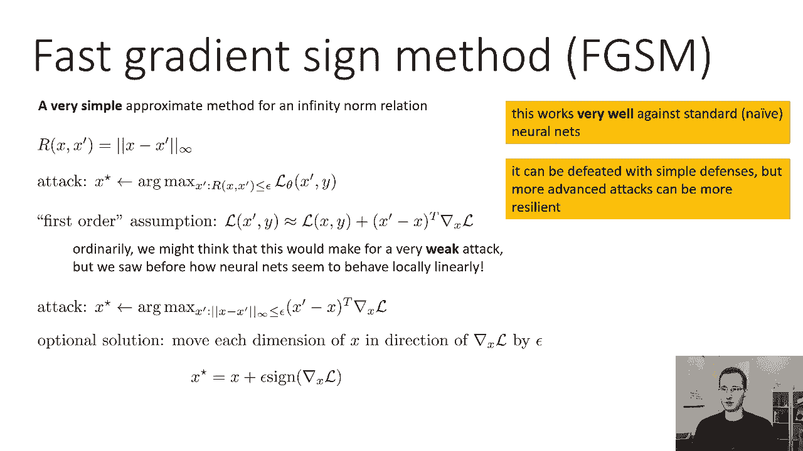
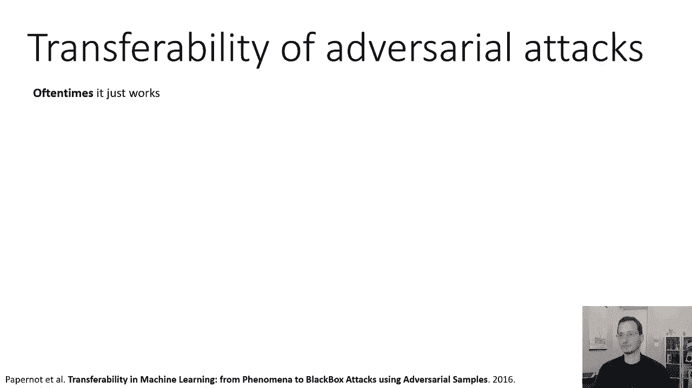
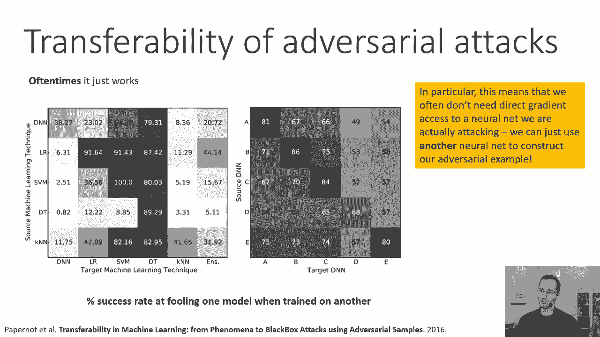
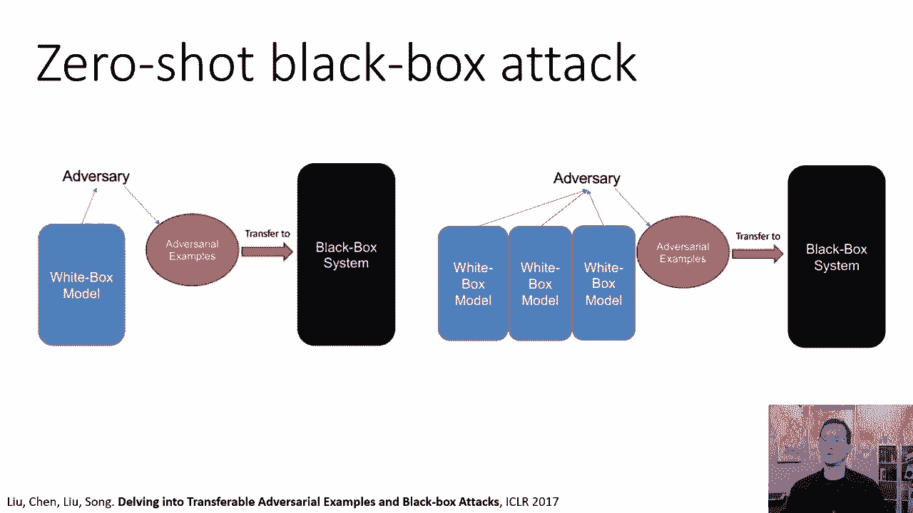
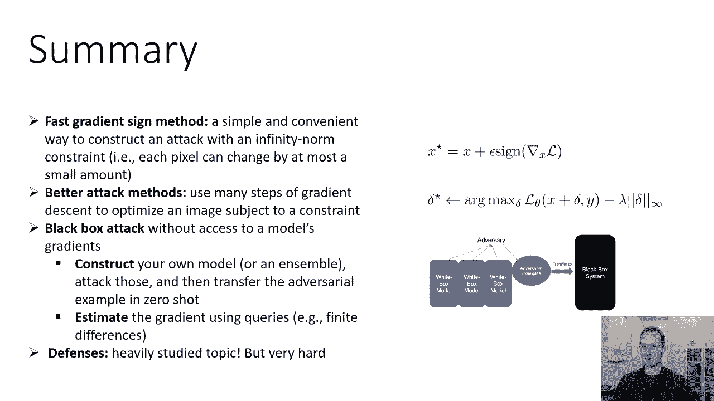

# 【双语字幕】伯克利CS 182《深度学习：深度神经网络设计、可视化与理解》课程(2021) by Sergey Levine - P63：CS 182- Lecture 20- Part 3- Adversarial Examples - 爱可可-爱生活 - BV1PK4y1U751

在今天讲座的最后一部分，我们将实际讨论如何构建对抗性的例子，做一点数学，然后在最后简短地讨论如何防御它们，所以为了开始创建对抗性的例子，我们需要引入一个正式的定义，所以我们不只是想修改图像威利。

无论如何，我们需要以某种方式限制我们的修改，所以我们可以这样做，我们可以引入一个关系r x逗号x素数，它描述了原始图像x与修改后的图像x素数有多接近，R有许多不同的选择，您可以使用。

一个非常简单的选择是x和x素数之间的无穷范数，它基本上说每个像素都随着大多数Epsilon的变化而变化，所以说，无穷大范数被正式定义，作为x和x素数中差异最大的两个元素之间的差。

所以如果x和x素数是向量，你取每个维度的差异，然后在差值的绝对值的维度上取一个最大值，就是说，基本上凭直觉，只是意味着每个像素可以通过大多数Epsilon改变。

所以用Epsilon改变一个像素不会耗尽预算，您最多可以通过Epsilon改变另一个像素，但没有人能改变超过Epsilon，然后呢，对抗性攻击可以定义为一个约束优化问题。

我们的目标是使我们的模型θ的损失函数最大化，受x逗号的r的约束，x素数小于或等于ε，所以如果r是无穷大范数，说着，x和x素数之间的无穷范数应该有epsilon的界。

这就像说把每个像素最多改变一个Epsilon，在损失最大化的同时，所以约束选择接近x的图像x x素数，并最大化你选择的损失，所以损失的一个例子可能是负对数似然，所以如果你最大化负对数可能性。

这意味着你把正确标签的可能性降至最低，为了你不安的形象，您的网络，当然啦，被训练做相反的事情，您的网络被训练以最大限度地减少损失，您还可以为防御对抗性攻击构造一个定义，基于非常相似的原则。

所以防御是作为一个学习目标来制定的，寻找θ以最小化损失函数的问题，但不是最小化x上的损失函数，数据集中的y元组，现在，你要做的是，你要最小化你的损失函数，但是x将被最优摄动的地方。

所以你对数据集中所有的x y元组求和，然后你最小化的是最坏x素数的损失，使损失最大化，注意这里的最大值在最小值内，所以这是建模一个场景，你首先选择模型，然后你的对手可以为你的模型选择最糟糕的图像。

如果你比较底部防御的方程，一个标准的经验风险最小化问题，唯一的区别是最大值，所以在一个标准的经验风险最小化问题中，你会最小化关于x和的θ，lθ的y和d x y，现在你把它最小化在x y的和上。

lθx一撇y的最大值/x一撇的d，这有时被称为稳健损失，我们将在本节结束时回到这个问题，一个警告，虽然我希望你记住，正式定义对抗性攻击，这对数学家很有帮助，它对证明定理很有帮助。

它实际上对设计实用的攻击算法也很有帮助，但它可以隐藏一些重要的现实世界的考虑，因为真正的攻击者，他们不在乎你的定义，这里执行的是哪种关系，什么是Epsilon，我们不知道，但攻击奏效了。

对人类来说似乎很有说服力，它似乎愚弄了机器，所以这些定义很有用，他们可以让我们开始，但请记住，简单地使您的网络对Epsilon健壮，无穷范数扰动，并不能让你对真正的攻击免疫，但这是一个很好的开始。

所以说，构建对抗性例子的最著名和最经典的方法之一，这也可能是最简单的，它被称为快速梯度符号法或FGSN，这是无穷范数关系的一种非常简单的近似方法，所以我们要选r，是x和x素数之间的无穷范数。

所以我们的攻击，就像前面一样，在x素数上找到最大的弧，使损失最大化，x素逗号y受制于x逗号的约束r，x素数小于或等于ε，然后我们要做的是，我们要做一个一阶假设，我们将假设局部损失函数，它是x素数的函数。

y近似于x处的损失，y加x质数减去x转置次数，关于l的x的梯度，这基本上是一个一阶泰勒展开式，现在通常我们可能会认为这会导致非常微弱的攻击，因为你的神经网络不是线性的，和第一个订单。

你的损失函数的泰勒展开可能不是一个非常准确的表示，你的损失函数实际上看起来像在Epsilon球里，但我们以前看到过神经网络是如何在局部线性地表现的，也许考虑到这一点，这实际上可能会很好地工作。

事实上你也可以走另一条路，你可以说这个攻击实际上效果很好，支持神经网络局部线性行为的观点，这次攻击确实效果很好，所以要实施这次攻击，我们所做的就是，我们用这个一阶泰勒展开近似代替损失函数。

进入上面攻击的等式，所以现在我们的目标是找到x素数，受制于，x减去x素数的无穷范数小于，或等于Epsilon，我们最大化的是x素数减去x转置次数，l相对于x的梯度，现在，无穷范数意味着我们可以通过。

最多，我们希望x的每个元素都朝着，l相对于x的梯度，因为无穷范数在不同维度之间没有依赖关系，基本上每个维度在任何一个方向上最多可以改变ε，这意味着没有理由不改变x的每一个维度，按最大允许金额。

所以实际上，我们可以简单地通过扰动x的每一维来解决这个优化问题，在该维度的梯度方向上由Epsilon，所以我们真正需要的是梯度的正弦，所以对于x的每一维，我们计算梯度的正弦，如果那个符号是正的。

然后我们再加上epsilon，如果是阴性，然后我们减去Epsilon，和，这将为我们提供底部约束优化问题的解决方案，所以最优解是将x的每一维向梯度方向移动，x l除以Epsilon。

这可以表示为一个方程，你说你的x星是x加上ε乘以，x梯度的正弦，l关于x的梯度的，这就是为什么这被称为快速梯度符号法，我们取l相对于x的梯度，我们取它的正弦，我们在那个方向上移动得非常快，它很快。

因为计算速度很快，这实际上是一个分级步骤的成本，这实际上对标准的朴素神经网络非常有效，用简单的防御就能打败它，但是更高级的攻击可以更有弹性，所以仅仅因为你的辩护，呃，击败快速梯度符号法。

并不意味着这实际上是一个很好的辩护，所以这不是世界上最强的攻击，但对于不健壮的幼稚模型，它可能相当强大。

以任何方式确定，现在我们可以写下这次攻击的更一般的表述，比如说，我们能做的不是处理这个约束优化问题，这对于深网来说有点难处理，我们可以把它写成一个带有拉格朗日乘数的拉格朗日。

所以不是在x素数上有约束的优化，我们可以用目标lθx素数进行无约束优化，逗号y减λ乘以r x x素数，其中r是拉格朗日乘数，所以说，我们已经把这种约束变成了一种惩罚，这将惩罚我们的优化器偏离x太远。

然后我们可以用任何可微关系r，只是在主观上运行有规律的梯度上升，优化以获得最佳攻击，我们可以启发式地选择拉格朗日乘数，或者我们可以用一些原则性的方法，像双梯度下降来满足约束，虽然在实践中。

启发式地选择它可以很好地工作，然后你优化这个东西来收敛，例如使用Atom，这可能是一个更强的攻击，当你看到文献中描述的这种攻击时，它们实际上不是用x素数来表示的，但就三角洲而言。

也就是x素数和x素数的区别，然后你会经常看到它是这样写的，求x处损失最大化的delta加上delta减去lambda，乘以某德尔塔范数，比如说，如果你用无穷大范数。

然后你会受到类似于上一张幻灯片上的攻击，但是你可以使用其他类型的规范，如果你想要低级别的攻击或类似的东西，你甚至可以用一些知觉上的损失，这实际上量化了一个人区分修改有多容易，用delta表示，一般来说。

构建这种类型的攻击有很大的灵活性，如果做得好，他们可能很难被打败，现在让我们来谈谈对抗攻击的可转移性，如果您为一种类型的模型构造一个对抗性示例，它也会是一个不同类型模型的对抗性例子吗。

通常可转移性只是起作用，这是一篇名为机器学习中的可转移性的论文中的一个情节，从现象到使用对抗性样本的黑匣子攻击，这些矩阵显示的是发生了什么，如果您为一种类型的模型训练一个对抗性示例。

然后在不同类型的模型上评估它，所以上面的模特，不同的行表示示例的对抗性示例训练，不同类型型号的训练，例如，左边情节的第一行，代表了对抗性的例子，这些例子都被训练成对抗性的，对于深度神经网络。

然后在不同的模型上进行测试，所以如果你训练一个深度神经网络的对抗性例子，这将愚弄深度神经网络，在这种情况下，呃，三十八点，两个，百分之七的时间，如果你训练一个深度神经网络的对抗性例子。

然后测试它的逻辑回归，这是最上面一行的第二个条目将愚弄逻辑回归，两个三点零，百分之二的时间，它会愚弄我们，VM 64%的时间以此类推，你可以看到可转移性并不完美，但也绝对不是微不足道的，事实上。

向深度神经网络的可转移性似乎不是很高，如果你用逻辑回归训练对抗性例子，它是第二行或SVM，是第三排，它们实际上很少适用于深度神经网络，而走另一条路确实很成功，如果你训练一个深度神经网络的对抗性例子。

它实际上可能会愚弄逻辑回归或SVMS，因此，对抗性的例子似乎将更强的模型转化为更弱的模型，这将进一步削弱过度装修是问题的概念，在右边的情节中，你可以看到不同神经网络之间的转移。

这是五种不同类型的神经网络，你又可以看到了，实际上有相当高的转移，所以如果你在网络上训练81%的愚弄率，它将带着六十七个转移到网络B，网络c 66%以此类推，绝对不完美，但确实经常工作，特别是。

这意味着，我们通常不需要直接梯度访问神经网络，我们实际上是在攻击，我们可以用另一个神经网络来构建我们的对抗性示例，所以如果你想上传一张图片到Facebook，Facebook会把它错误地归类为其他东西。

你不需要真正访问Facebook正在运行的模型，你可以训练你自己的模型并攻击它。

这就是你如何获得零次黑匣子攻击，比如说，你可以构造自己的模型，你认为代表了其他人正在运行的模型，构建一个对抗性的攻击，然后将对抗性示例部署到模型中，你只能访问黑匣子，而不必真正触摸它。

在这篇名为深入研究可转移的对抗性示例和黑匣子攻击的论文中，卢实际上学习了如何使用合奏，如果你还记得我们在课程开始的时候谈到过合奏，你可以构造一个对抗许多不同神经网络模型的对抗性攻击。

这更有可能转移到一个新的模式，现在你也可以做更花哨的事情，如果你对一个模型有一些有限的访问。

你可以做得更好，你可以做的一件事是，如果你对一个模型的访问有限，可以使用有限差分分级估计，所以有可能估计梯度，对模型的查询次数适中，例如，在Web服务器上，而实际上无法直接访问其渐变。

记住要使用快速梯度符号法，你只需要梯度的正弦，所以你能做的是对每个维度，你的图像x的i基本上每个像素，查询损失函数，你拿着那个像素，对它进行少量的扰动，所以1e-3是一个小数，e i是第i个正则向量。

所以这只是说，在负数的基础上加十分，图像第i个像素的第三个，然后查询模型并将其标签与正确的标签进行比较，所以这给了你一个小扰动的损失，对每个维度都这样做，然后你可以通过取这些扰动值来估计梯度。

减去x y的原始损失，然后除以你的小数，所以这基本上是一种估计梯度的有限差分方法，所以这里需要的查询数等于像素数，如果你真的想这么做，还有一些花哨的技巧可以进一步减少所需的查询数量，估计梯度。

以逃避比图像中像素更少的查询，但是如果您可以进行等于像素数的查询，你可以用这个攻击，您可以使用其他类型的攻击，这些攻击将使用有限数量的查询，例如，如果你不知道模特是在什么训练场上训练的。

您可以查询一些图像来获得这些图像的标签，并构建自己的小训练集，然后你可以用它来训练你自己的模型甚至你自己的模型组合，攻击那个合奏团，然后用它作为对抗性的例子，这也可以工作。

所以你有时可以在零机会中构建对抗性的例子，有时你可以用几个黑匣子查询来构造它们，好的，让我们简单讨论一下防御对抗性攻击，所以我一开始就提到了，我们可以正式地将防御定义为优化稳健损失。

我们怎样才能真正做好这件事，文献中有许多不同的鲁棒方法，对抗对抗性攻击的模型，但是一个非常简单的食谱叫做对抗性训练，对抗性训练是对小批量梯度下降的简单修改，到随机梯度下降，基本上实现了这种鲁棒损失。

它是这样工作的，小批量样品，比如说，利用快速梯度符号法，基本上得到一个对抗性的例子，对于迷你批处理中的每个图像，FGSM是一个很好的选择，因为它可以极快地构造这些对抗性的例子。

然后在损失函数上采取SGD步骤，但是用你的对抗性例子来代替真实的数据脉冲，所以基本上只是构建对抗性的例子并进行训练，在实践中，你还把这和最初的损失结合起来，所以你不只是优化对抗性例子的损失。

您还优化了原始示例上的损失，这往往会在一定程度上提高性能，然后你只需重复多次，所以这个过程和SGD几乎是一样的，唯一的修改是，对于我们迷你批次中的每一个X，比如说，通过使用F json。

这叫做对抗性训练，它可以显著提高模型的健壮性，虽然它不能抵御所有的攻击，而且通常不是免费的，所以它会增加你对对抗性税收的稳健性，这通常被衡量为较低的愚弄率，但与原始网络相比，这将降低测试集的总体准确性。

这很有道理，因为你是，你想让你的模型更健壮，所以你一定为此付出了一些代价，通过变得更加健壮，你的模型通常会变得不那么准确，所以总结一下我们所涵盖的，我们谈到了快速梯度符号法。

这是一种简单方便的构建攻击的方法，具有无穷大范数约束，其中每个像素可以通过，最多少量，我们描述了如何使用许多梯度下降步骤来进行更好的攻击，优化受到约束或惩罚的图像，我们谈到了黑匣子攻击。

可以在不访问模型梯度的情况下执行，例如，通过构建自己的模型或集合并攻击，然后将Z shot中的对抗性示例转移到目标模型中，或者通过估计梯度，例如，使用有限差分，我们还简短地谈到了，呃。

像对抗性训练这样的防御，这是一个在文献中被大量研究的话题。

