# P65：CS 182- Lecture 21- Part 2- Meta-Learning - 爱可可-爱生活 - BV1PK4y1U751

在今天讲座的第二部分，我们将讨论非参数和基于梯度的金属学习方法，作为一个提醒，非参数部分是指方法如何适应新任务，元学习仍然是参数化的，从某种意义上说，他们仍然在一个被学习的深网中，所以非背后的基本思想。

参数化金属学习方法将是这样的，我们将进行一些射击训练，在这里，我把它想象成一个一次性训练集，所以有五个图像，每个对应于不同的标签，但一般来说，每个类可能有多个示例，但这里我们只有一个。

每一个图像都有一些标签，所以我一，我两个，l三，一四一五，所以我们不知道这些标签是什么意思，它们就像整数一样，基本上一二三四五，它们对不同的任务意味着不同的东西。

然后我们有我们的测试图像我们的测试图像有一个未知的标签，所以我们要弄清楚的是这些训练图像中的哪一个，与我们的测试图像相同的标签，那是，这是我们在适应过程中要解决的基本问题，我们要做的是。

我们将有一些神经网络来描述这些图像中的每一个，它基本上将这些图像中的每一个嵌入到一些特征空间中，我们称之为网络PHI，我们还将嵌入测试图像，后来，我们将讨论如何将测试图像嵌入到不同的特征空间中。

在训练图像中，我们实际上会切换到使用f和g，其中f嵌入测试图像，和G嵌入训练图像，但就目前而言，我们只能说它们都在同一个空间里，我们将把这个空间称为罚款，然后我们要做的是，我们要比较PHI。

对每个训练图像嵌入的X测试，直觉上，我们要做的是找到最近的嵌入，所以在这个特写空间里，phi，我们的测试图像最接近x 1 x 2 x 3 x 4 r x i吗，当然就像素而言，呃。

这样的最近邻查询可能没有什么意义，但也许我们可以元学习一个特征空间，在那里这种比较是有意义的，也许我们会发现phi x 3是最近的邻居，PHI X测试，然后我们分配标签的方式是把标签。

无论最接近的图像是什么，那个，在这种情况下是x3，好的，那么为什么这个能起作用呢，为什么，为什么在这个特征空间中的最近邻比较实际上给了我们正确的答案，一般来说，他们不会，如果我们有一些任意的特征空间。

这不一定是一个有效的分类器，那么为什么最近的邻居在这样的方法中有正确的类呢，因为这就是元培训试图做的，所以说，所有这些工作的关键是能够元训练，嵌入函数phi，在元训练集中的那些任务上。

这个特定的最近邻产生正确的答案，那么希望它也能在您的元测试任务中产生正确的答案，这是这种少数镜头元学习的基本思想，您需要确保您的元培训与，在元测试时间要做什么，所以如果一个元测试时间。

您将执行最近邻查询，那么只要你训练你的网络PHI是准确的，执行最近邻查询时，那么您最近的邻居在元测试时的查询将给您正确的答案，这意味着元训练过程可以这样编写，这正是我以前的等式。

只有在我有这个φ等于fθ之前，现在我只是把它替换到优化中，使一个无约束的问题，所以θ星，其中θ星表示嵌入函数的参数，损失的赔偿，你用fθ应用于对应的d训练得到的，尽管我们将使用一种软的最近邻。

所以如果我们用负对数似然损失，这是我们通常用于分类的损失，这可以重写为所有任务的总和的负数，i等于该任务所有测试点之和的1到n，j等于对数的1到m，给定x j检验和d训练的y j检验的概率。

所以你最大化了每个测试点标签的对数概率，给定每个测试点的图像，以及这项任务的整个训练集，你把所有的考点和所有的任务都加起来，并实际定义这个对数概率，这就是我们要做的，我们要定义这个p最近的量。

p最近是训练点x k列最接近测试点的概率，x j检验，它将与指数phi x k列成正比，转置phi x j检验，它不一定是转置，可能是欧几里得距离，也可以是余弦距离，关键是它是PHI x有多相似的度量。

k列和phi x j测试是，所以X K列车是谁的PHI，其特征表示最接近x j检验的特征表示，会有最大的点积，因此指数内的值最大，因为这是训练点的分布，我们把它正常化，除以所有训练点的指数之和。

所以你可以把它看作是应用于phi x k列的软最大值，转置phi x j检验，如果这些点积非常，非常大，那么软最大值最终会接近硬最大值，这意味着在最近的邻居身上会有一个的重量，其他一切都为零。

但对于较小的值，它将被解决，好的，所以这个，这是你能想到的，基本上，j检验，然后你可以定义一个特定标签y的概率，j检验，作为所有标记为y的训练点的总和，j检验它们是最近邻的概率。

所以如果你想知道标签是l的概率是多少，我们总结了所有以L 1为标签的训练点，把它们成为最近邻的概率加起来，所以说，当然啦，如果标签所在的点，这里的第三个最有可能是最近的邻居。

这意味着它的标签是正确标签的概率也是最高的，你可以考虑的另一种方式是你可以把每个标签，以及每个标签，你求和所有有该标签的点是最近邻的概率，然后概率和最高的点，具有高概率和的标签。

是您将分配给该测试点的标签，好的，所以简单回顾一下，我们要计算最近的p，也就是每个训练点与我们的考点最近邻的概率，然后呢，我们会说，标签的概率是每个训练点概率的和，标签是最近的邻居。

所以在我们的软极限变成硬极限的时候，那么它的标签也有可能是正确的标签之一，所以现在我们为这个对数pθy j测试设计了一个公式，给定x j检验，逗号d列，这就给了我们的训练目标，因为这里的一切都是可微的。

我们用的是软的最近邻，我们可以通过它来推动渐变，我们实际上可以优化所有这些，关于我们的嵌入函数phi的参数，所以参数θ，他们唯一影响的是好的，所以这是非参数金属学习的一个非常简单的公式。

现在在实践中使用的实际方法通常更复杂一点，所以这是我们能设计的最简单的基本版本。

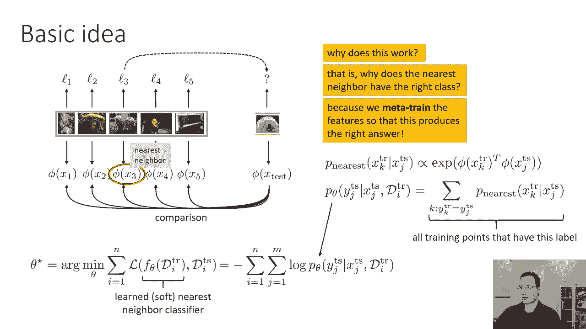

现在我们将讨论一些基于这个想法的实际方法，我们要讨论的第一个问题是为很少的镜头学习匹配网络，匹配网络与我在这张幻灯片上的基本原型非常相似，但是经过几个修改，这些修改与如何计算p最近的概率有关。

所以在匹配网络中，而不是乘坐x k列车的phi，转置phi x j检验，它们有两个不同的函数g和f，所以不是一个函数phi，它们有两个函数g和f，这两个函数都是元训练的。

所以我们有不同的网络来嵌入X训练和X测试，g嵌入x应变和f并嵌入x检验，匹配网络的另一个区别是g和f都是有条件的，不仅仅是X火车和X测试，但他们也以整个训练集为条件，这样做的原因是因为你可能想做。

你知道的，类似于消除的过程，你可能想知道你代表的方式，比如说，的，你知道的，左边的狗可能会改变，取决于所有其他图像是狗还是其他动物，所以如果整个训练集只是狗的照片，你知道你在试图把不同的狗分类。

不同品种的狗，将编码指示读取内容的属性，而不是指示性的属性，例如是狗还是猫，因为你知道你只是想把不同种类的狗分类，但是如果，比如说，你在嵌入一只狗的图像，其他训练图像就像猫一样，长颈鹿和河马。

那么您可以选择不同的功能，你可以选择对区分不同种类动物有用的特征，而不是不同品种的狗，所以这就是为什么g和f都依赖于整个训练集，因为你选择表示x训练和x测试的方式，可能取决于其他图像实际上是什么。

所以这需要我们为g和f选择一个体系结构，可以嵌入相应的x训练k和x测试j，同时也考虑到整个培训集，所以本文对g所做的特别选择是使用双向，lstm，有点复杂，我想也许有些不必要的复杂，但它是这样工作的。

你拿着你的训练集，你跑一个向前的LSTM，所以你挑一些点菜，你向前运行LSTM，你还有另一个lstm，你向后运行，就像我们对埃尔莫做的那样，所以这只是两个独立的lstm。

一个向前的lstm和一个向后的lstm，然后呢，g的输出由正向的隐状态之和形成，LSTM与向后LSTM的隐藏状态，和嵌入的图像，所以有一个小修道院，嵌入了修道院的每个图像。

它的输出用于TO作为前向LSTM的输入，它的输出用于向后的LSTM，它也被添加到整个嵌入整体中，所以你运行向前的LSTM，当战斗输出一个向后的LSTM时，把它们的隐藏状态加在一起。

然后将输出的原始值相加，那是你对那个训练点的表示，因此，因为向前和向后的lstms包含了关于所有其他点的信息，现在您的嵌入可以是上下文的，f函数原则上可以以同样的方式工作，但在这篇论文中。

他们为它选择了一种不同的更复杂的表示，对于f函数，出于某种原因，他们决定使用注意力LSTM嵌入，也许他们只是想把事情搞混一点，所以他们有G的所有嵌入，这些是由双向LSTM形成的。

然后对于D列车中的每个数据点，他们的注意力有不同的时间步长，在每一个步骤中，他们在测试点中喂食，他们很注意每个训练点，所以这里的时间步数等于训练点的数量，然后LSTM的隐藏状态。

在这些步骤之后是测试点的嵌入，他们也可以在这里使用双向LSTM，出于某种原因，他们选择做这种注意力的事情，我想，因为他们发现它更有效，好的，所以说，如果幻灯片右半部分的所有内容对你来说都很困惑，高。

水平的想法只是他们做的事情基本上和标准的非一样，上一张幻灯片上的参数公式，做了两个修改，分别使用不同的函数g和f嵌入测试点的训练点，每一个嵌入函数本身也取决于整个训练集。

所以这只是他们发现效果很好的两个修改，他们可能有点太复杂了，但这是这篇论文的食谱，它是，这是最早的论文之一，来真正证明这个非参数的公式现在可能真的很有效。

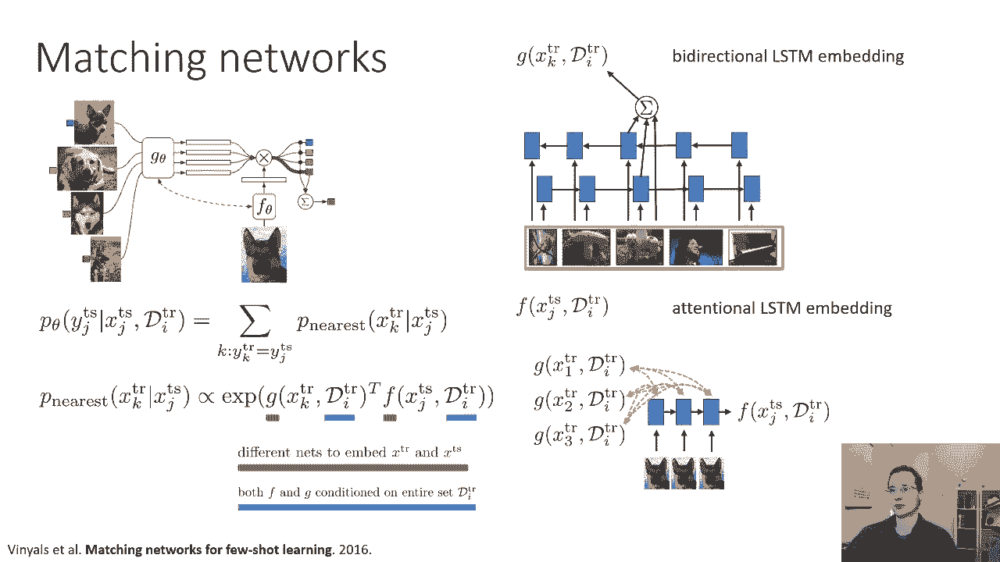

大多数人实际上并不使用这种方法，一种更广泛使用的方法是所谓的原型网络，这实际上简化了公式，因此，原型网络可以被视为匹配网络，只需两个简单的修改，第一个修改是不做软最近邻。

他们所做的是为每个类构建一个原型，所以这个想法是y的p，给定x检验现在由原型向量c上的软最大值给出，所以你仍然用嵌入函数f嵌入x test，但不是用它的点积x的g应变k，对于每x应变k。

你用它的点积和c，其中c只是所有x应变k嵌入的平均值，这就是顶部的图片所显示的，因此，匹配网络将把产品与每个训练点对接，原型网络将嵌入所有培训点，将它们的嵌入平均在一起，然后点与这些平均值的乘积。

所以你可以把它看作是一个逻辑回归分类器，其中分类器权重为，结果是通过将训练点的嵌入平均在一起产生的，和，当然啦，影响f和g的参数θ，然后呢，第二次修改，在原型网络中，就是摆脱所有复杂的垃圾。

所以不再有这些双向的印记或注意力，g和x是a，g和f分别依赖于x检验和x列，所以他们不再以整个训练集为条件，这让我们变得简单了一点，所以x检验的f是修道院，x火车的g是修道院，就是这样。

所以这种方法实际上在许多方面更简单。

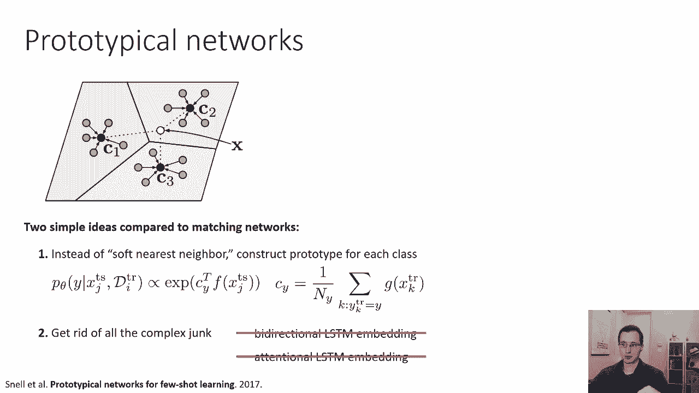

这节课的下一部分是非参数金属学习方法，我要谈谈基于梯度的金属学习方法，这些一开始看起来是在非常不同的原则上运作的，但我们会看到最后，在很多方面，它们其实有很多相似之处，建立基于梯度的金属学习的动机。

让我们回到我们已经学到的东西，让我们回到陈述，我们以前谈过，如果你拿一个像Imagenet这样的非常大的数据集，你在上面训练一个大的神经网络，比如GPU或Resnet，您可以微调该网络以解决其他任务。

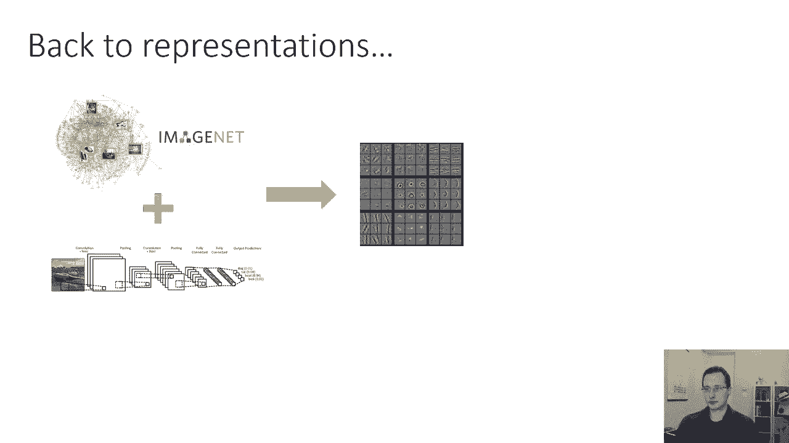

所以你基本上可以提取网络中的功能，您可以用较少数量的数据点进行微调，以解决一些较小的任务，如，比如说，细粒度分类，所以我们可以问的问题是预训练实际上只是一种元学习，它似乎有一个非常相似的公式。

你要用一个非常大的，多样，先验数据集，得到一些东西，然后你可以用它来更有效地解决视觉识别任务，通过预先训练然后微调，预培训为您提供更好的功能，使人们能够更有效地学习新任务。

基于梯度的金属学习的想法是基本上利用这个配方，但是修改训练前阶段，以便它显式优化以更好地微调。

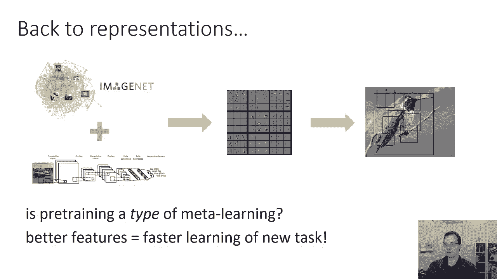

下面是我们如何将元学习框定为一个优化问题，这是我们在第一部分中对元学习的抽象看法，fθd列只是一个微调算法，所以在F theta d训练之前，它是一个类似于RNN的东西，在训练集中读取。

如果我们真的做fθ，火车就像一个梯度下降的梯度台阶，所以如果火车是，也就是神经网络的参数，减去一些学习率，应用于d列车的alpha乘以Gradθl，一般情况下可以是多个梯度台阶。

只要是固定数量的渐变台阶，这是一个可以展开的函数，你可以评估一下，它只是一个定义良好的函数，就像RNN是一个定义良好的函数一样，梯度下降是一个定义良好的函数。

至关重要的是，这可以像任何其他神经网络一样训练，通过实现梯度下降，作为Pytorch张量流中的计算图，然后通过梯度下降反向传播，因此，元训练过程涉及优化theta，因此。

在θ上的这些梯度步骤导致参数向量θ，在D测试中表现良好的。

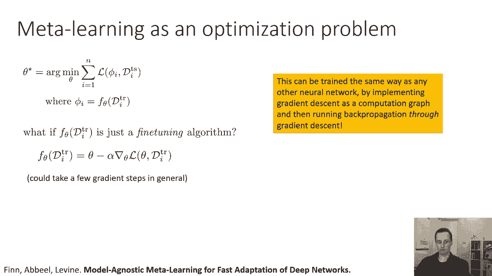

也许用图片来说明这一点会有所帮助，所以这是一种叫做模型不可知论的方法，金属学习或哺乳动物，它是这样工作的，假设你有你的修道院，它有参数θ，所以它只是一个普通的修道院，没什么特别的。

它接收一个图像并输出一个标签，如果要在单个任务上训练此内容，每一个训练步骤都将是一个梯度下降步骤，在训练集上的损失，如果你在做小批量，也许你实际上对训练集进行了子样本，但基本上就是这样。

会是θ变成θ减去学习速率，α乘以格拉德θlθ逗号d列，在那里我的逗号和火车，是负对数D列中所有数据点的和，金属学习的可能性，我们要做的是，我们实际上会，训练网络，以便在每个任务上都有一个梯度步骤。

最大限度地减少这项任务的损失，所以现在每一个元训练步骤都会做θ减去一些元学习速率，贝塔乘以损失梯度的所有任务的总和，在测试集上，用参数θ-alpha-Gradθlθ逗号d列测试i，参数，神经网络参数。

我们把损失塞进去，进入外部损失，是我们在训练集上进行一个梯度步骤得到的参数，然后我们评估测试集上这些更新参数的丢失，为了同样的任务，现在每个任务在更新后都将有一个不同的参数向量，所以在更新之前。

所有的参数都是一样的，但是在任务I的更新之后，你得到一个不同的参数向量，它是特定于那个任务的，这就是我们想要最小化的phi的损失，另一种思考方式，我们试图找到一个参数向量θ，我们可以从中微调。

尽可能地完成我们元训练集中的每一个可能的任务，记得吗？这些画都是我画的，我们采取一个渐变步骤来适应，但总的来说，当然，您可能会在哺乳动物的实际实现中使用更多，采取五到十个渐变步骤是很常见的，仍然。

比你在完全非元训练的微调中所做的要少得多，所以元，所以模型不可知论，元学习实际上为网络适应做好了准备，具有非常少的梯度台阶的，所以你可以把它想象成这样，你可以想象这个粗线θ表示你在参数空间中的路径。

在元训练期间和每一项任务中，在这种情况下，有三个任务你要考虑你得到的参数，在你沿着分级的方向走一个渐变步后，对于由小箭头表示的任务，您希望将这些更新的参数尽可能接近，这些任务的最佳参数。

所以你在空间中移动，这样从θ值开始的一个渐变步骤就能尽可能地将您对齐，到每一个任务的最优θ，所以在高水平上，它所做的是元训练模型来很好地微调，非常好，从某种意义上说，你刚刚微调的相应任务的损失。

使用它的测试集应该很低。

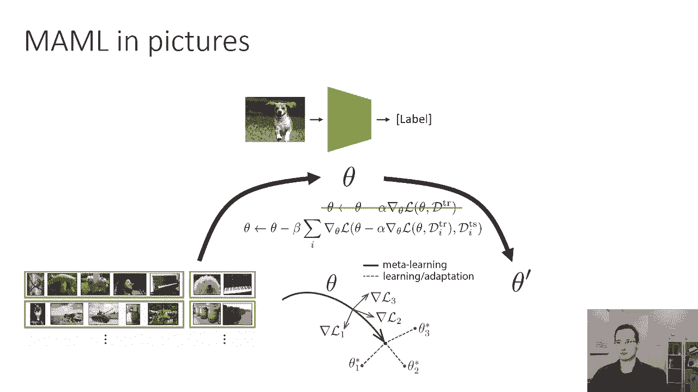

我们刚才做了什么，这种有意义的微调直觉，但这是如何映射到我们所学到的所有其他金属学习方法的，让我们回到基础监督学习，学习x的函数f，它给你y监督金属学习，学习d列逗号x映射到y模型的函数f。

不可知论金属学习只是这个功能的一个特殊选择，这只是一个非常奇特的选择，这是一个选择，如果哺乳动物的D训练，逗号x由x的fθ素数给出，其中θ素数是通过在d列上取梯度步来获得的，但这只是一个函数。

它有梯度下降的事实，为了元学习的目的，实际上并不那么重要，它只是一个函数，这意味着您可以用pi torch或tensorflow对其进行编码，你可以把它看作是另一个计算图，您的autodiv包。

如pytorch或tensorflow，实际上可以通过这个梯度下降过程反向传播，唯一的细节是，它将涉及通过神经网络计算二阶导数，所以说，你需要确保你的听力包可以计算二阶导数，事实上，除了二阶导数。

你不需要任何东西，你可能很容易想象，如果你走三个渐变步，你需要四阶导数，但那不是真的，实际上你只需要二阶导数，现在你们都可以问了，如果它只是另一个计算图，为什么要这样做，嗯，事实证明。

这种方法有一个非常有利的归纳偏差，归纳偏差意味着这种设计非常适合解决学习问题，为什么很好，因为它在做梯度下降，当你真正想适应的任务时，这很重要，与您元训练的任务不完全相同，所以这个想法是。

如果你看到一个与你以前看到的任务相似的任务，这将会，当然工作得很好，但是如果你看到有点不同的测试，这仍然有效。

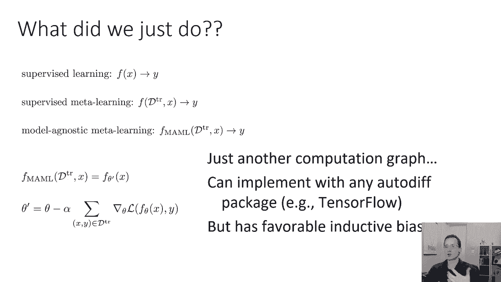

好的，因为最后，当你适应一项新任务时，你所做的就是运行梯度下降，那么为什么这个效果很好呢，如果我们回想一下，就像我们之前说过的黑匣子金属学习方法，我们可以说好，这些算法中的哪一部分实现了学习算法，嗯。

学习算法只是向前运行RNN，所以运行大概在里面的某个地方，它重量内的神经网络，是对如何适应新任务的理解，因此，学习的学习算法只是对应于向前运行您的RNN，但如果我们要说这是一个习得的学习算法。

我们可以开始问关于，可以问，它是不是收敛得很好，因为你把你的RNN向前运行，你得到了答案，它会聚到什么井，我们不知道，因为这将是RNN的结果，如果您的新任务正在分发，它应该概括。

如果您的新任务不在分发中，那么你可能会得到一些意想不到的答案，就像我们之前了解到的那样，如果你得到的答案不够好，你真的没有多少追索权，你不能像运行RNN更长时间，那真的说不通，一旦在训练集中读取RNN。

这就是你得到的一切，与以等级为基础的方法相比，它仍然是一个计算图，只是一个不同的，其中有梯度运算符的，我们可以问同样的问题，我们可以说它是否收敛，它确实收敛，因为它是梯度下降，它会聚到什么井。

它汇聚到你的新城镇的当地最佳选择，训练误差最小，因为它是梯度下降，如果还不够好，如果你得到的结果不够好，然后你可以继续走更多的梯度步骤，因为这只是梯度下降，事实上，哺乳动物。

事实证明这是一个非常有效的策略，通常你可以用哺乳动物得到更好的解决方案，如果您在适应新任务时采取更多的梯度下降步骤，然后你在元训练中采取的梯度下降步数。

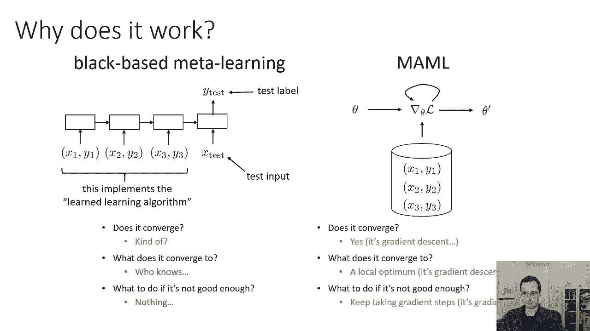

这实际上可以很好地工作，现在我们可以问另一个问题，我们可以问一个关于普遍性的问题，这是一个有点微妙的问题，但基本上归结为这个，你的元学习算法能学习任何算法吗。

所以也许适应这个特定的任务需要一些非常复杂的数学运算，你的元学习算法真的能学习复杂的数学运算吗，更准确地说，这类似于说，它能表示d列和x的任何函数吗，这是一个相当微妙的问题。

这个问题之所以重要是因为如果你的方法是通用的，这意味着如果你给它足够的参数，它基本上可以学习任何学习算法，您希望这样做，因为您希望使用非常大的元训练集，有很多很多的任务来找出最好的适应程序。

黑匣子金属的学习方法是通用的如果你有，超大RNIN原理，它们可以表示任何函数，根本不明显那个模型的哺乳动物，不可知论的金属学习或基于梯度的金属学习实际上是普遍的，因为它受到约束。

使用梯度下降来适应新的任务，但事实证明，黑盒元学习法和梯度下降法都是通用的，这是一个有点令人惊讶的事实，但这其实是真的，本质上，这相当于说，如果你元训练一个深网的初始参数，你实际上可以折磨那个深网。

所以梯度下降更新到深网，做任何你想做的事，你甚至可以折磨它，让它向后，你其实可以折磨它，使渐变更新朝着相反的方向进行，怎么会发生这种事有点疯狂，但关键是你的神经网络有很多，很多层。

这些图层会影响其他图层的渐变。

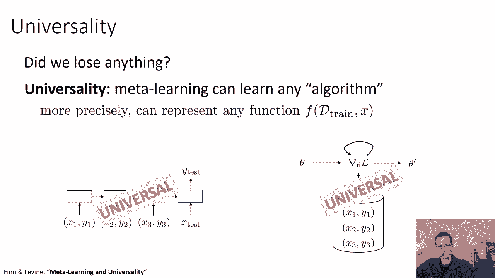

所以总结一下，我们学习了三类金属学习方法，在训练集中使用某种序列模型进行读取的黑匣子金属学习方法，非参数金属学习方法，以某种方式嵌入所有训练点，并做一些软最近邻的变体来匹配它们到测试点。

和基于梯度的金属学习方法，适应微调的新任务，然后在元训练期间，他们训练参数，这样微调过程就可以很好地工作，现在这三类方法有许多权衡，黑匣子金属的学习方法在某种意义上概念上非常简单。

你甚至不需要任何特殊的算法，你所要做的就是在训练集中建立某种序列模型，然后你就把它训练成金属水平的监督学习，所以你基本上运行监督学习，数据点是任务，每个数据点都是训练集和测试点，所以从概念上来说。

设置这个非常简单，这些方法得益于序列模型的进步，所以如果你使用变压器而不是LSTM，它会更好地工作，所以在开发更好的序列模型方面的所有进展都将有助于这些黑匣子方法，但它们也有一些缺点，首先。

他们有最小的归纳偏差，因为一切都必须是元学习的，我们知道很多事情，被这些方法忽略的学习过程，比如说，事先没有关于x和y之间的关系的知识，训练集与x和y与测试集的关系相同，就像本质上的模型，不知道训练。

X和训练智者的数据类型相似，作为测试X和测试明智，就模型而言，它只需要读入一个叫做训练集的东西，得到某种呃，它的数量，然后在测试集上使用它，训练集和测试集都对应于图像。

其中图像和标签之间的映射是相同的函数是完全未知的，到这个模型，它也必须学会这一点，也很难将这些类型的方法扩展到中等镜头，所以如果你有，比如说十射十向分类，你有一百个训练点。

我们可能可以用序列模型读取100个训练点，但是如果你现在有100个镜头100种方式的分类，你试图阅读一万个交易点，你知道的，一万个训练点可能不足以从零开始训练一个神经网络，所以你可能还是想学金属。

但是用黑匣子金属学习方法很难做到这一点，非参数方法有自己的权衡，他们可以通过指挥来很好地工作，通过结合这种最近邻意义上的一些归纳偏差，具有轻松的端到端优化，所以它们通常呈现，你知道的。

相对容易的端到端优化问题，他们用了一些关于学习问题结构的东西，所以他们是一个很好的妥协，一般来说，这类方法，虽然，仅限于分类，很难将它们扩展到其他环境，如回归或强化学习，这使得它们很难更广泛地应用。

但是对于可以很好地工作的分类，它们还需要一些专门的体系结构，所以对这些非，从其他领域的发展中尽可能受益的参数方法，基于梯度的金属学习提供了一些其他的权衡，模型不可知金属学习的一大优点，顾名思义。

它很容易应用于任何体系结构或任何损失函数，基本上它不需要任何特殊的架构变化，您可以使用常规的体系结构，你有一个，您有一个用于常规图像分类的体系结构，就像Vgg，你可以用元学习，这样会很方便。

你可以只拿一个你已经有的架构，对一个非，金属学习问题，然后将这种元学习方法应用于它，你也可以很容易地这样做来加强，学习，回归，其他类型的问题提法，因为适应是用梯度下降完成的，您还可以很好地泛化域外任务。

所以如果任务有一点变化，在最坏的情况下，方法，方法就是做微调，但也有一些缺点，我向你道歉，这些剪掉了一点，但我会读给你听，所以一个缺点是元训练很难，元训练优化问题更难，因为它需要这些二阶导数。

它在数字上可能有点不稳定，那个，在实践中，意味着，为优化器选择适当的超参数更加困难，所以它需要更多的调谐，当然它需要二阶导数，你需要确保你的听力包支持二阶导数，所以这些通常是这些方法的权衡。

就哪种效果最好而言，它测试，好像有点问题依赖，所以说，呃，通常，呃，这几天，像非参数方法或基于梯度的方法倾向于达到，在少数镜头图像识别基准上的最佳性能。

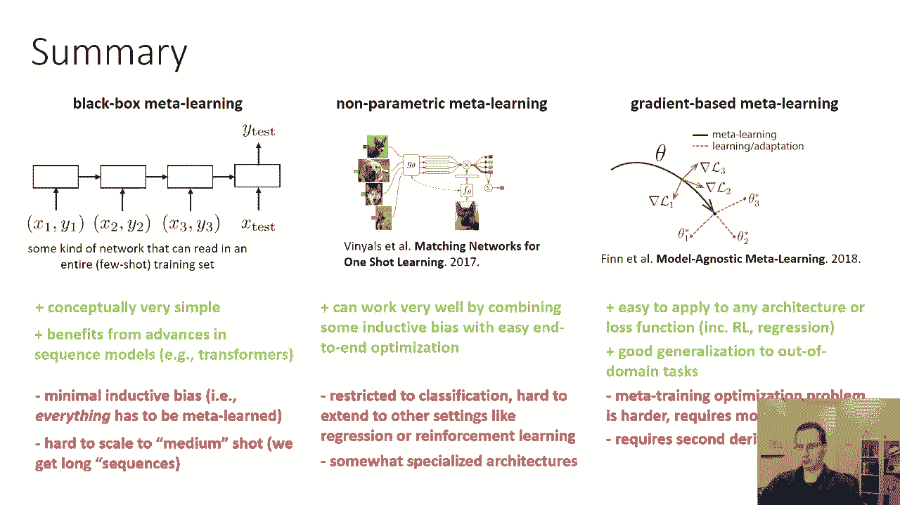