# 【双语字幕】伯克利CS 182《深度学习：深度神经网络设计、可视化与理解》课程(2021) by Sergey Levine - P66：CS 182- Lecture 21- Part 3- Meta-Learning - 爱可可-爱生活 - BV1PK4y1U751

今天讲座的最后一部分，我将讨论元强化学习，我们如何将元学习的概念应用于强化学习任务，所以定义元强化学习问题，我们将通过类比来操作，我们将首先看到泛型学习如何转化为元学习。

然后看看一般强化学习如何变成元强化学习，作为一个提醒，泛型元学习可以写成应用于训练集的某个函数f learn，D训练通用金属学习可以写成最小化损失函数，用一些参数phi在测试集上的损失函数。

通过将学习函数fθ应用于训练集而获得的，所以在基于梯度的金属学习的情况下，fθ只是由θ确定的初始化的梯度下降，在黑匣子的情况下，金属学习fθ涉及在d列车上运行参数θ的rnn，产生一个隐藏的状态。

这就是PHI的内容，我没事，所以让我们试着把同样的想法应用到强化学习中，我们可以这样写强化学习，最优参数θ，星星，您的保单圆周率，是通过在圆周率下取奖励期望值的弧形最大值来获得的，Theta tau。

我们可以说这是f rl应用于m什么是m well，M是MDP，所以F rl可能涉及到与MDP的实际交互，生成一些推出，这与一般学习完全不同，在一般学习中，我们在固定的训练集上操作。

所以这里的mdp是一个由状态组成的元组，行动，过渡，和奖励，元强化学习可以定义如下，我们要找到一些参数，是n个不同元训练MTPS上和的弧形最大值，对于这些元训练MDP中的每一个，我们最大化了π的期望值。

其中phi是通过应用学习算法获得的，fθ到mdp mi，所以它与普通金属学习非常相似，只是在普通金属学习中，你的每一个任务，你有一套训练和一套测试，现在每一项任务，我们有一个MDP MI，在适应过程中。

我们可能会与MDP相互作用，我们的目标将是为新的MDP找到最好的政策，使用最小数量的交互和元训练可以显著减少交互数量，可以从我们需要的数千甚至数百万的深度RL中减少它，到每个MDP的几次推出，元训练后。

元培训过程本身可能仍然需要数万甚至数百万的推出，但适应会很快，所以我们可以这样设置，我们有元训练MDPS的数据集，我们的假设是，我们的元训练MDPS来自某种分布，元测试时间m的p。

我们的测试MDP将来自相同的分布，这就像监督元学习一样，在监督元学习中，我们对任务有一些分配，我们的元测试任务也来自该发行版，对于元rl，我们有同样的假设，我们假设我们的MDP来自M的某个P。

我们的测试MDP将来自同一个，这并不意味着我们以前见过m测试，一点也不，它可能是一个全新的MDP，这个假设只是编码了元之间的结构相似性，结构上的相似性源于它们来自相同的分布，在任务上的相同分配。

所以你可能有一些例子，也许，m的p对应于机器人可能执行的不同家务的分布，所以你尝试了一堆不同的家务，你用它们进行元训练，然后你会希望这可以推广到新的家务，从同一分布，或者在一个更简单的例子中。

也许你有半猎豹的标杆，就像你们在作业中玩的那个，不同的任务可能对应于以不同的速度向不同的方向奔跑，然后在元测试时，猎豹可能会被要求适应一个新的方向，来自相同的分布，所以说，当然啦，上面的例子相当复杂。

下面的例子真的很简单，你的大部分元，强化学习问题将介于这两个极端之间。

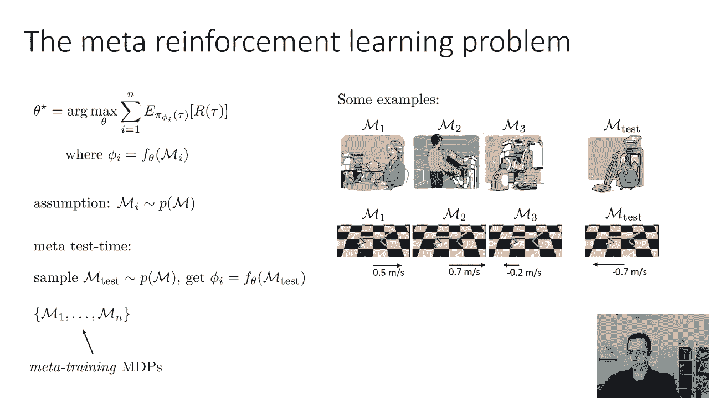

那么让我们来谈谈Matrl的黑匣子元学习的等价物，所以这有点，在某些方面，最简单的一种元rl，你必须回答的主要问题是如何实现MI的fθ，这真的是你必须弄清楚的主要事情，如果西塔米做得好。

它真的需要做两件事，第一个非常类似于我们以前看到的监督元学习，需要用一些数据来完善政策，这些数据将来自与MI的交互，但它还需要做另一件事，它需要，这对RL来说是新的，它需要选择如何交互。

它需要选择如何收集数据，以便改进政策，所以它实际上也需要选择RL交互中的操作，所以在RL中，每一步你都会得到一个奖励，然后你根据你的政策选择一个行动，所以Meta rl基本上也必须选择如何探索。

所以它有两个工作，而不仅仅是一个，所以让我们来谈谈，第一个简单一点的，我们将基本上调整黑匣子，我们以前的金属学习者，让我们说，现在这只是一个lsst，所以我们改进政策的方法。

利用一些经验是通过在经验中阅读，就像我们从训练中读取x y元组一样，设置在监督金属学习案例中，所以我们会有一个RNN，RNN将在每个转换中读取，和我们在与MI互动时看到的奖励。

所以它的读数是s 1 a 1 s 2 r 1 s 2，三三四三等等，等等，这个有很多变体，我是说我在这里画的方式，有点多余，因为下一个状态被读入两次，所以你可以把它简化一点，但关键是。

你需要在所有这些过渡中阅读，你从我身上看到的，这给了你一些隐藏的状态，h并且该隐藏状态用于预测新状态的操作，所以这和我们之前学习的黑匣子金属完全一样，除非不是在由x和y组成的训练集中阅读。

现在你在一个由s组成的训练集中阅读，A的和我们的，好的，这就是我们要做的第一件事，当然，θ星现在对应于这个RNN的参数，你可以把最后一点把h和s看作是圆周率，就像黑匣子金属一样。

了解到最后的一点点可以被视为I上的分类器条件，这里，我们在H I上有一个保单条件，就像以前这些phi只是h i，最后这个小策略头的参数，我们称之为，当然不受任务的影响，但它是元训练的。

而h i受任务影响，这只是隐藏的状态。

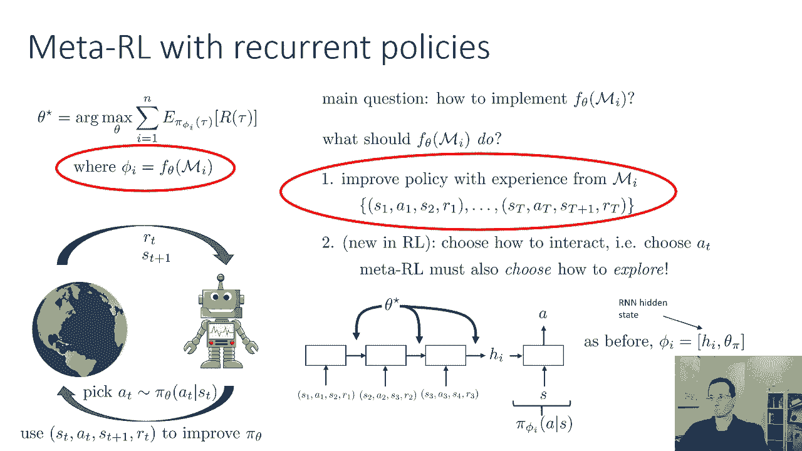

我要说的是，如果我们制定这样的政策，然后我们在每个任务上用RL训练它。

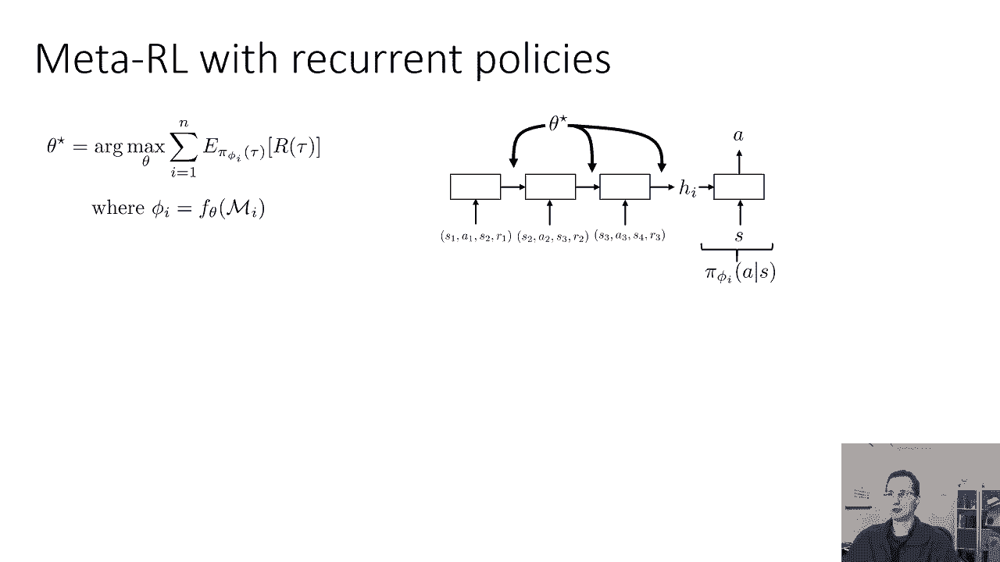

它实际上也会解决第二个问题，学习如何解释的问题。

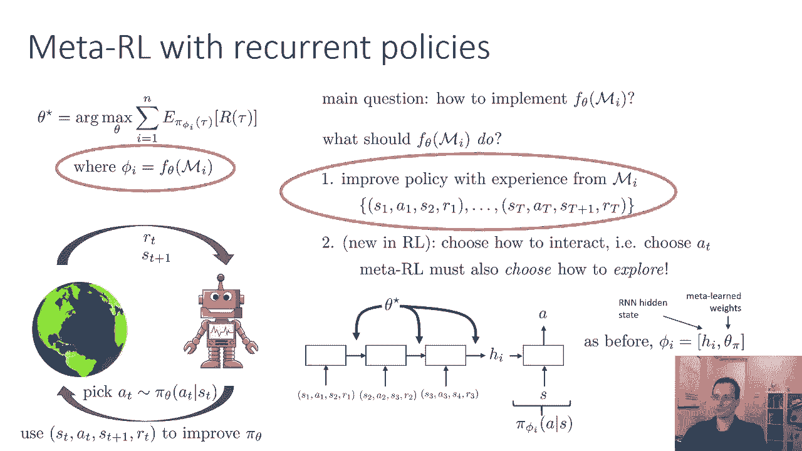

所以我们只是训练一个RNN策略，嗯，基本上是的，所以想法是这样的，假设您有一个非常简单的RL问题，所以这里我们有一只老鼠，它会探索这个迷宫发现奶酪如此不同，MDPS会让奶酪在不同的地方。

对国家来说很简单，mdp，我把它做得很小，只是为了让我能想象一切，假设在第一集里老鼠决定向右走，所以现在我们的RNN将读到你去右边的事实，你得到的奖励是零，然后鼠标会选择其他动作，可能它决定往左边走。

所以现在RNN将读取，动作留下，奖励为零，现在这一集结束了，假设剧集被限制为只有两个时间步，这一集就结束了，但RNN继续前进，所以现在又有一集，鼠标从左下角的同一个地方开始，现在决定上去。

它得到的奖励是零，所以现在RNN又迈出了一步，请注意，RNN没有在插曲边界之间重置，也许它随机决定向右走，现在RNN读到行动是正确的，奖励是加一，所以现在他们在一个场景中，如果你向左，你没有得到奖励。

如果你向上然后向右，你确实得到了奖励，现在这一集重置了，现在鼠标知道它应该上升，因为rnn在内存中有它，所以它会上升，然后再写，得到奖励等等，如此重要的是。

在剧集之间不重置RNN隐藏状态或LSTM隐藏状态，这使得RNN策略能够记住它在哪里获得奖励，然后就元学习过程而言，重新审视这些地方，这三集加在一起是一个很长的元集，所以训练SRNN的实际强化学习算法。

我认为这只是一个很长的插曲，在那里你碰巧被反复传送回开始，当然还有，一旦它意识到这一点，它会发现它应该做的是学会探索，因为这就是它对元插曲的最大回报，所以就像监督案例中的黑匣子元学习一样。

将元学习问题简化为另一个监督学习问题，以同样的方式向上一级，黑匣子金属学习在强化学习案例中的应用，只是涉及到处理相同的RL问题，但是把它提升了一个层次，现在你在剧集中最大化奖励。

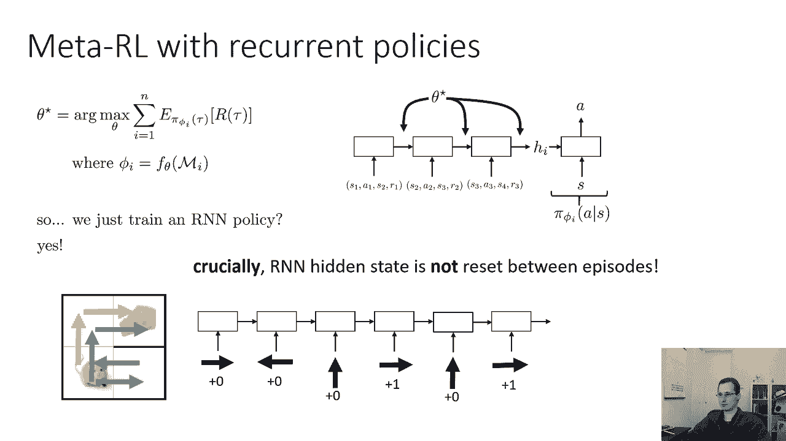

那么经常性政策为什么要学会好好探索，基本上是因为一旦你看到，这些，呃，这些情节及其相应的奖励，你可以找出奖励在哪里，所以有三集，但是一个很长的医学插曲，在元事件中最大化回报需要学会探索。

我们对此没有什么特别的事可做，我会为我们做的，所以因为我们在这几集里最大化了回报，这就是导致这东西学习的原因。

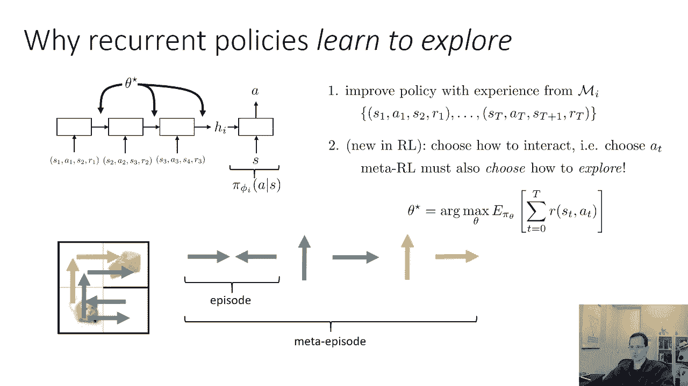

如何探索，所以这个想法在以前的许多作品中都被使用过，很久以前，我所知道的最早的论文之一是这篇论文，叫做基于记忆的控制，从2015年开始使用递归神经网络，有这种傻傻的样子，他们称之为水迷宫任务。

基本上有点像二维导航任务，在那里你可以得到进入红色圆圈的奖励，这里的不同颜色显示了不同的插曲，所以粉色是第一集，你可以看到那种四处游荡，然后蓝色青色和黄色是随后的插曲，更直接地直奔球门。

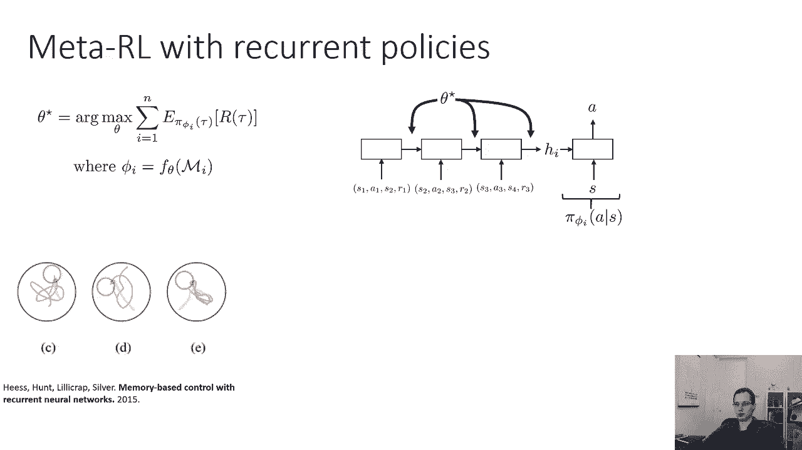

直奔红圈，最近，有几篇论文，就是学习强化，从十六岁开始学习，和rl的平方，也来自地狱和十六岁，他们将这些想法应用于学习在迷宫中导航，所以每一集都有一次穿越迷宫的尝试，每个元插曲都涉及多次穿越迷宫的尝试。

所以如果在其中一集里你找到了出口，你可以以后再去适应，所以这说明得最好，可能在右边的那些照片里，如果你，如果你在第一集有一些好的行为，然后你就会记得目标在哪里。

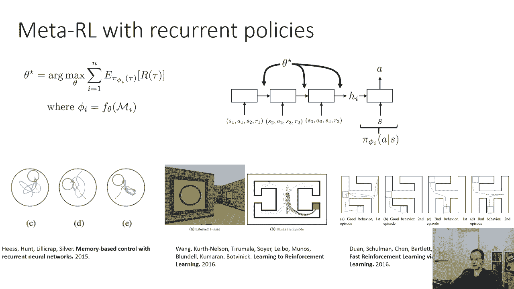

你可以在第二集直接去球门，现在已经在不同的体系结构上做了相当多的工作来做到这一点，呃，其中一些是受序列模型的启发，就像我之前描述的那样，他们中的一些人更受变形金刚之类的东西的启发。

一个特别有效的体系结构，它实际上比标准更简单，序列模型，是一个编码你所看到的所有转变的，对于特定的MDP独立，然后把它们的嵌入加在一起，所以这更像原型网络所做的，这也往往非常非常好。

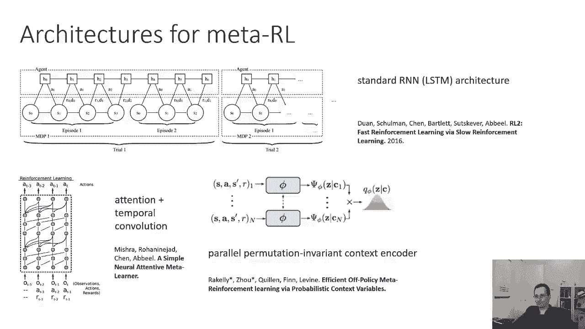

现在我们也可以在RL设置中进行基于分级的金属学习，RL环境中基于分级的金属学习，与监督学习环境中的工作方式基本相同，所以常规的强化学习可能涉及，让我们说，如果你想教他们如何向前跑。

您可能会生成多个向前运行的剧集，并将它们与，比如说，策略渐变以更新参数，用哺乳动物进行基于梯度的金属学习，你有不同方向的剧集，就像在你修改参数之前一样，这样一个渐变步骤，一个政策梯度。

适应步骤在相应任务上的性能提升最大，所以和以前应用于RL的想法完全相同，基本上没有修改，计算需要一点小心，政策梯度的二阶导数，所以有些花哨，所需的微积分和代数，但概念基本上是完全一样的。

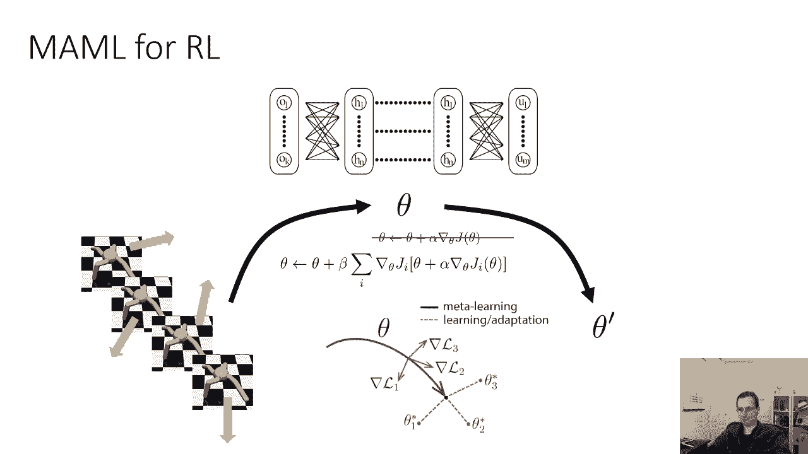

这里有一个很好的视觉插图，在实践中。

如果我们对这个小四足机器人进行哺乳动物的元训练，任务将对应于向不同的方向跑。

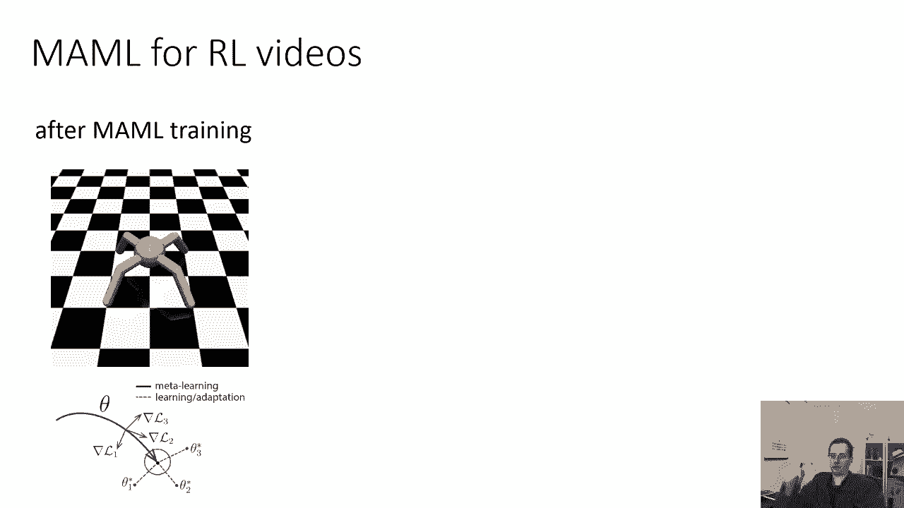

然后在元训练之后，如果我们在实际调整它以适应任务之前运行预更新参数。

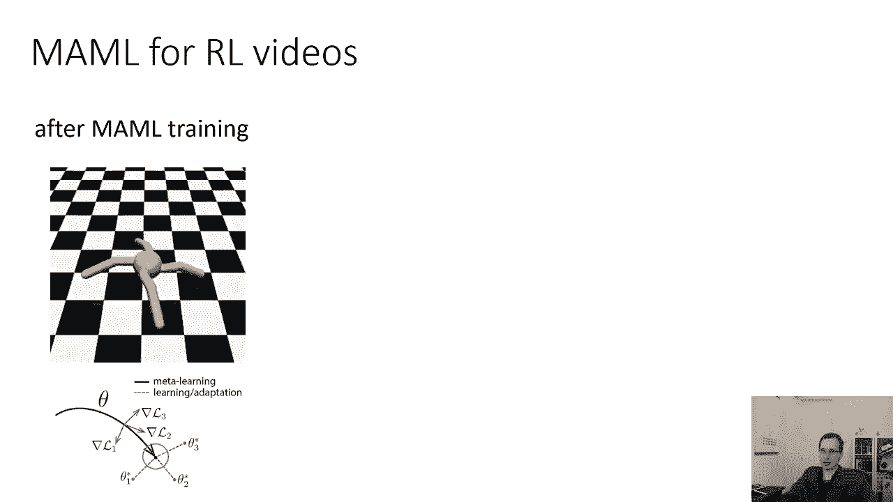

有点像原地奔跑，它基本上是想看看，它这样或那样或那样会得到更多的奖励吗。

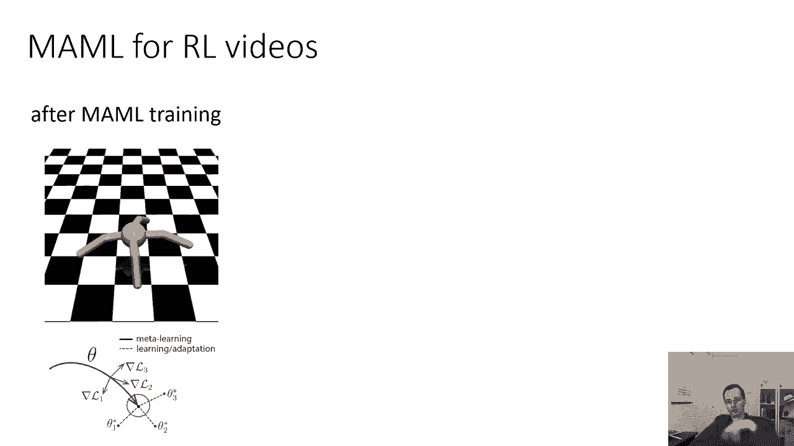

所以它只是在有小扰动的情况下运行，然后在政策梯度的一个梯度步骤之后。

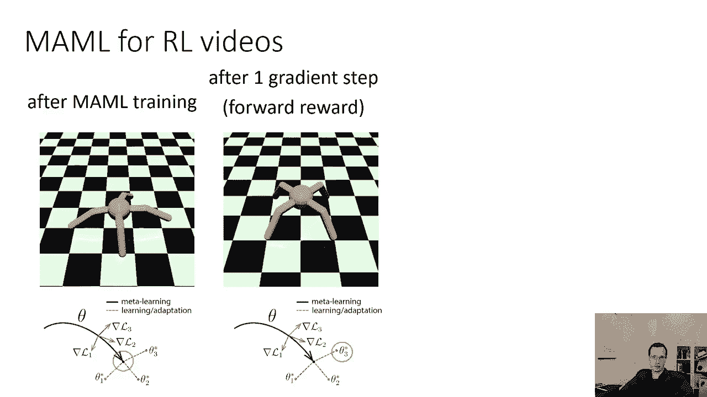

它很快就会发现向前跑和向前跑是否得到了奖励。

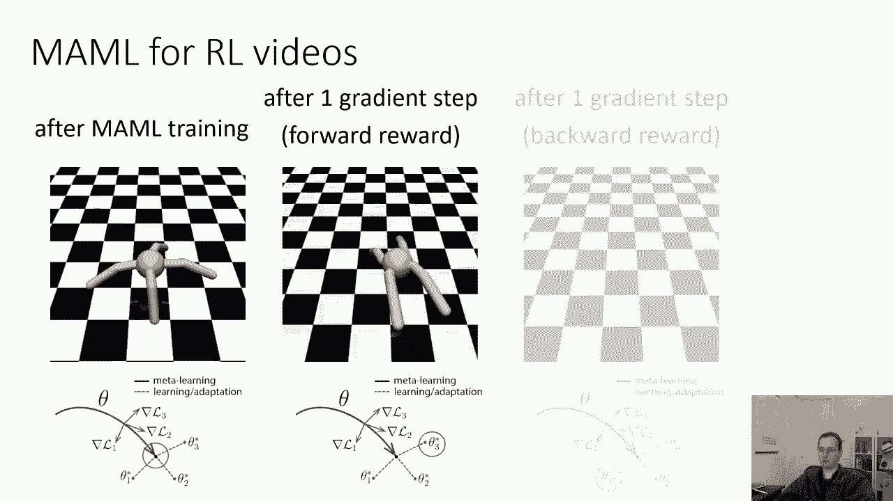

如果奖励是向后跑，那我们就向后跑，所以这是基本的想法。

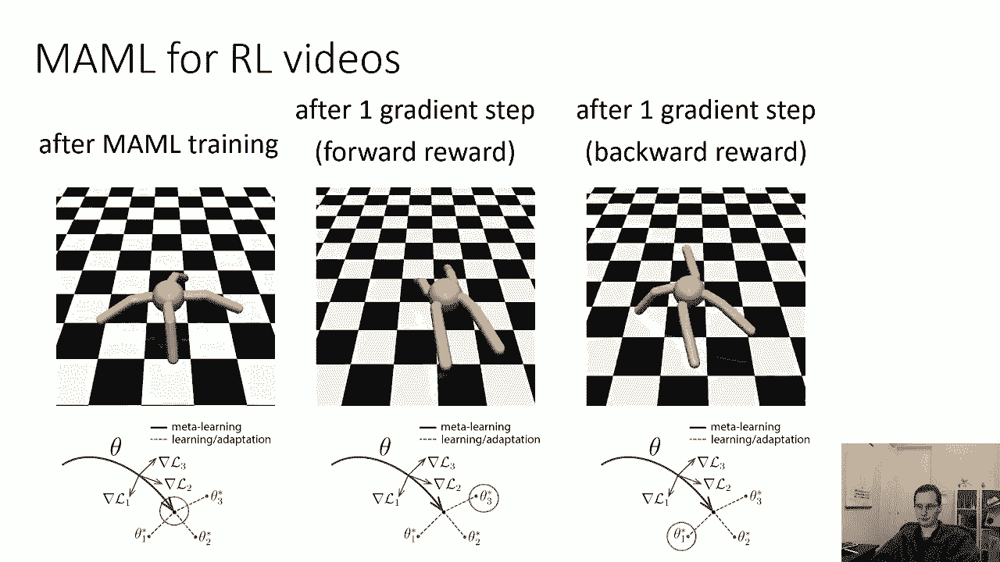

就像监督金属学习一样，有不同的类型。

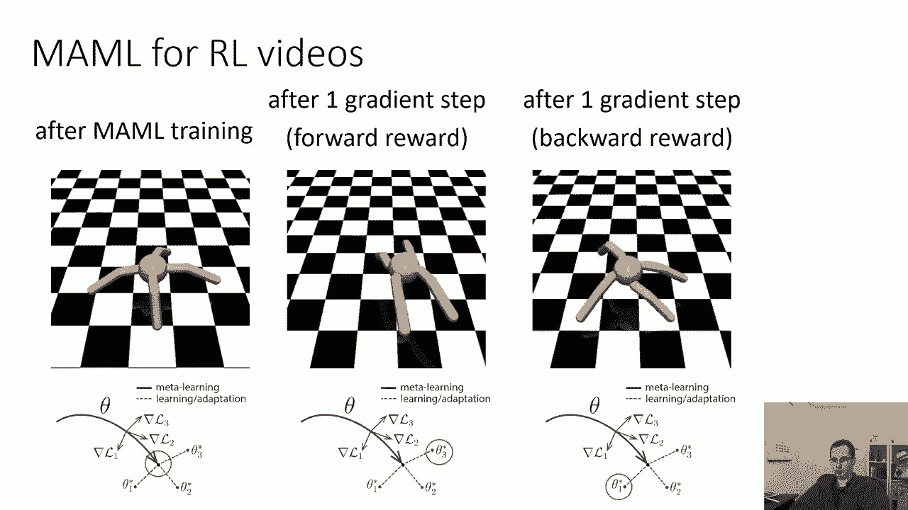

非参数的东西有点难应用于RL，但是有黑匣子或上下文元学习方法。

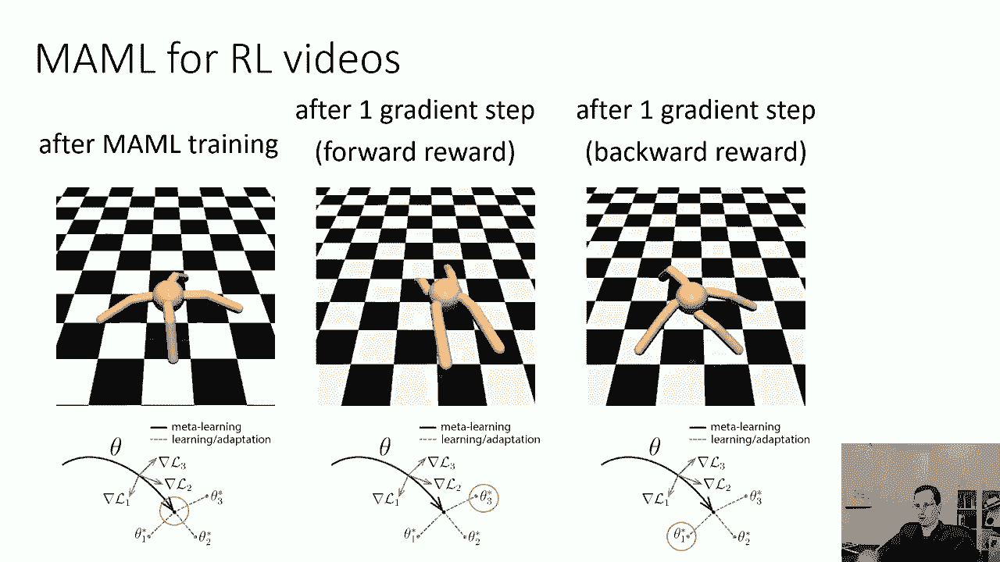

