# 【双语字幕】伯克利CS 182《深度学习：深度神经网络设计、可视化与理解》课程(2021) by Sergey Levine - P8：CS 182 Lecture 3- Part 1- Error Analysis - 爱可可-爱生活 - BV1PK4y1U751

大家好，欢迎来到CS的第三讲，今天我们将讨论偏见。

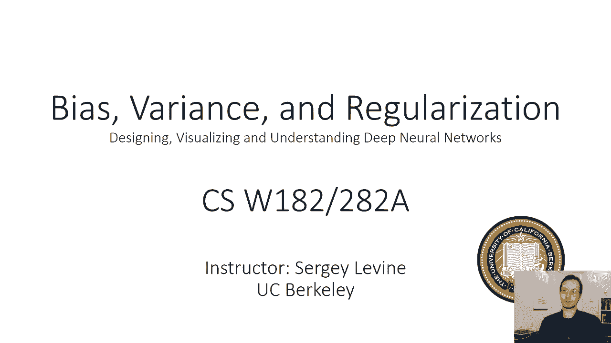

方差与正则化，所以我们要开始的问题是，从上次开始，上次我们学习了如何用梯度下降训练模型来执行分类，今天我们要问，我们会得到正确的答案吗，所以如果我们按照食谱，如果我们遵循概述的机器学习过程，呃。

在上一次讲座中，我们如何知道我们的模型是否会做得很好，我们的模型是否会得到正确的答案，所以要理解这一点，让我们重新审视经验风险和真实风险，我在上一节课结束时简要讨论过，所以我们将与零一损失一起工作。

这次我在幻灯片上写对了，所以它是你是否得到错误答案的一个指标，所以损失是一个，如果你得到了错误的答案，如果你得到了正确的答案为零。

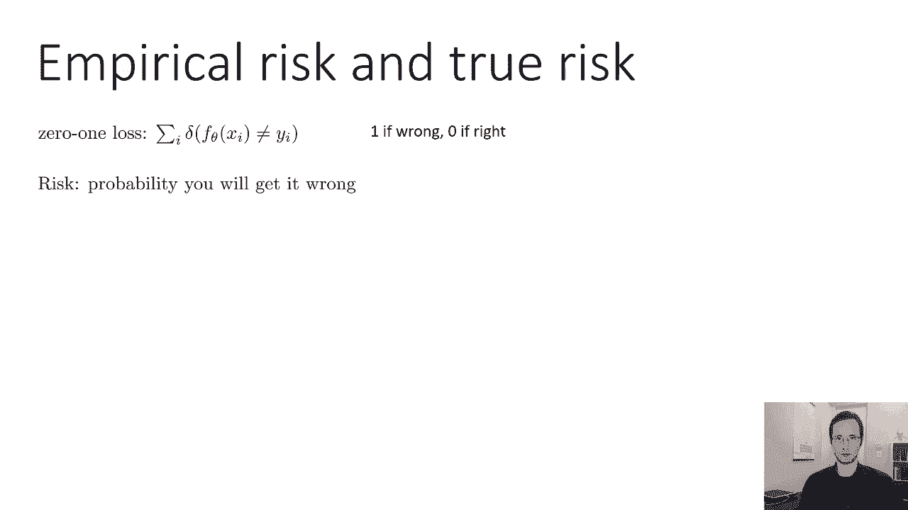

就像我们上次讨论的那样，你弄错的可能性，所以如果我们想象有一个生成过程，产生我们数据的过程，比如说，我们的图像是从图像上的一些分布中采样的，然后我们的标签从标签上的真实分布中取样。

然后我们可以问这个问题，我们所学到的x的fθ是错误的可能性有多大，零一损失的期望值量化了这一点，所以损失的预期价值，这是一个如果错误，如果正确，则为零，基本上是你出错的概率。

这似乎是一种迂回的方式来表达这样一个概念，呃，你想要错误答案的概率，但好处是你可以把它推广到任何其他损失，所以零点，一种损失是风险概念在语义上有意义的损失，但你可以想象一个风险的概念。

即任何其他损失的期望值，如负对数似然，这就是风险定义的来源，风险只是定义为你损失的期望值，在产生数据的分布下，这和你训练集上的损失是不一样的，因为你的训练集是一个样本，对这个期望值的明智估计。

所以在训练过程中，你不会从x的p生成新的样本，你只有你的数据集d，这叫做经验风险，经验风险是数据集损失的平均值，你可以把它看作是真实风险的近似值，现在我们可以问的是经验风险，与真实风险的很好的近似，嗯。

这是一个先验的无偏近似，所以如果我给你一个θ，我请你告诉我这个θ的风险有多大，你评估经验风险，这将是一个无偏见的估计，这意味着如果你有各种不同的数据集，它们都会得到相同的正确值，问题是你。

你实际上将使用经验风险，首先选择θ，因此，θ不是独立于经验风险估计量而选择的，你实际上是在选择θ来最小化这个量，当你这么做的时候，你有责任将经验风险降至最低，而实际上没有将真正的风险降至最低。

这实际上将是大部分讨论的主题，今天的讲座，所以如果这个概念现在对你来说有点不透明，如果这不是很清楚，别担心，我们今天要更多地讨论这个问题。

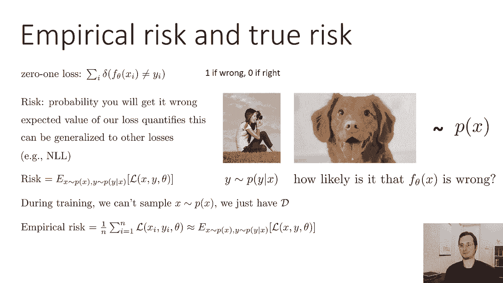

那么经验风险是一个很好的近似值吗，呃，嗯，并不总是，所以在监督学习中，我们通常在做经验性的风险最小化，这意味着我们正在最大限度地减少训练设备的平均损失，这与真正的风险最小化并不完全相同。

当他们不一样的时候，所以过拟合指的是经验风险较低的情况，但真正的风险很高，这意味着您有一个参数为θ的模型，在你的训练集上损失很低，但是整个数据分布下的预期损失，在所有可能得到的图像的分布下。

你可能得到的实际上并不低，用一个简单的一维例子很容易看出这是如何发生的，所以说，这和我在上一节课上举的例子是一样的，假设你有这些黑点代表你的训练集，所以经验风险最小化，会试图拟合一条尽可能接近的曲线。

到那些点，真函数由直线给出，以便数据由真正的函数组成，加上一些附加噪声，大量数据是加性噪声，有一些附加噪音和一切，蓝色曲线的经验风险极低，但它真正的风险其实很高，这是因为你的蓝色曲线很好地拟合了数据。

但它做得有点太好了，因此，如果您的数据集太小，就可能发生这种情况，如果本质上给你的训练点，不要完全指定您应该获得哪个函数，在机器学习中几乎总是这样，尤其是在深度学习中，我们将处理具有。

也许数以百万计的参数，参数往往比训练点多，如果模型太强大就会发生，相对于数据集的大小，它有太多的参数或太多的容量，相反的问题是所谓的拟合下，不足是指经验风险很高，而真正的风险也很高。

所以在不合身的情况下，经验风险代表真实风险，但它们都很糟糕，如果模型太弱，可能会出现这种情况，如果参数太少或容量太小，就像在这个例子中，真正的函数可能是一条曲线，但你试图用一条线来拟合真正的函数。

如果您的优化器没有很好地配置，也可能发生这种情况，比如说，如果你的学习速度不好，如果你本质上做得不好，实际上最小化了经验风险，尽管你可以，这在深度学习中经常发生。

因为深度学习中的优化问题本身就很有挑战性，对于我们上次讨论过的逻辑回归，优化问题其实还不错，但是对于深度神经网络，我们将在接下来的几节课中讨论，优化问题可能非常困难，你实际上可以得到拟合。

即使你有一个非常高容量的模型，仅仅是因为你不能有效地将该模型的损失最小化，可能是因为你选择了错误的学习速度或错误的优化算法类型。

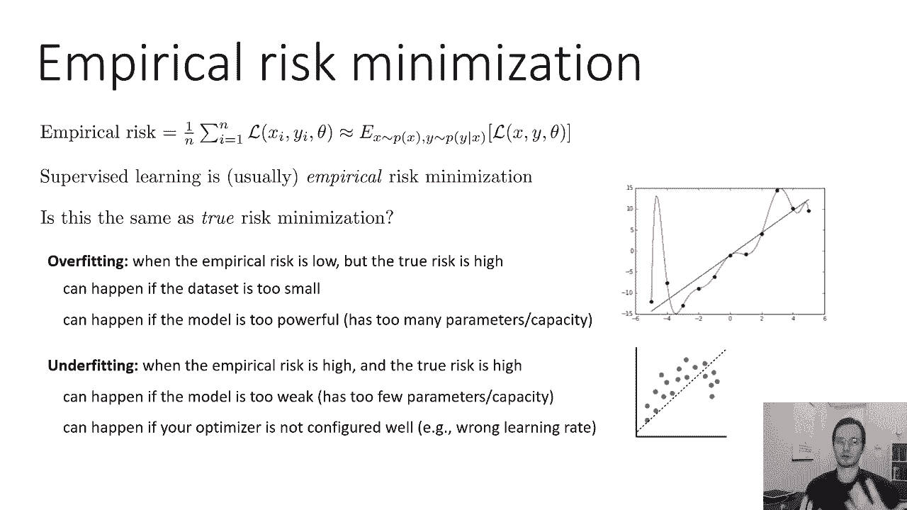

嗯，所以这是一种更高的水平，呃，事物的概念观，但让我们做一点更正式的分析，让我们试着从数学上理解什么是过拟合，什么是不合适的，我们上次能在上面放一些方程吗，在上一次讲座中，我们讨论了分类。

这就是你从输入到，就像图像到标签或者标签上的概率分布，这次我们将转而关注回归问题，回归意味着你在预测一个连续变量或一个连续分布，根据您的输入，我要讨论的所有这些东西也适用于分类，但它只是简单一点推导。

回归设置的数学，所以回归基本上是曲线拟合，就像你有一些连续或离散的输入，你有一个连续的输出，你想预测连续的输出，所以不是预测一个分类标签，猫对狗对大象，你在预测一个真实的数字，比如。

为什么你要预测狗有多大，像这样的东西有多重，这房子有多贵，如果我们想采用我们在上一节课中采用的概率方法，然后为了做回归，我们需要一个连续值的概率分布来输出y，所以Y现在不是一个标签，y是实数。

有许多概率分布，我们可以用来表示实数，但是一个非常简单的选择，希望你们以前在统计学或概率论课上学过，是正态分布还是高斯分布，所以正态分布是由两个参数定义的，均值和方差，但我们当然想解决一个预测问题。

我们想预测y上的分布，给定x对，所以在我们的例子中，我们将有一个条件高斯分布，也就是说，我们将有一个高斯，其平均值和方差本身就是，x的函数，所以它们不仅仅是数字，它们实际上是函数。

所以我在这张幻灯片上写的，是正态分布的对数概率方程，这不是我编造的等式，你可以打开概率教科书或者去维基百科，你会发现这个方程，有时你会看到它被写成密度，这里我把它写成对数密度，它看起来像一个大方程。

但它实际上由三件简单的事情组成，第一件事是负的，x的一半f减去y，x减y的sigma逆f，基本上就是x的f和y的差，但在西格玛定义的特定规范下，所以基本上是x的平均fθ有多接近，到真正的标签Y。

第二项负sigma行列式的一半对数，基本上试图让方差更低，所以它说得很好，如果你能把，呃真的，你很准确，尝试使用较低的方差，第三项是不依赖于x或y的常数，如果我们不费心学习西格玛。

如果我们把sigma固定为单位矩阵，则正态分布减小为f之差的平方，x和y的θ，所以它只是负的一半，θ=x减去y的平方这很简单，加上一些常数，这很简单，所以当我们谈论回归时。

我们选择的特定分布实际上是正态分布，但我们选择西格玛作为身份，然后这个正态分布的对数，正好对应于x和y的fθ之差的平方，这很简单，我们没必要这么做，我们实际上可以学习x的sigmaθ。

但是为了这堂课的推导，我们不会那样做的，我们就用x减去y的平方，但我只想说清楚这不仅仅是编造的，呃客观，这实际上是一个定义良好的分布的对数概率或对数密度。

就像我们在上一节课中使用的softmax分布一样，我们用正态分布进行回归。

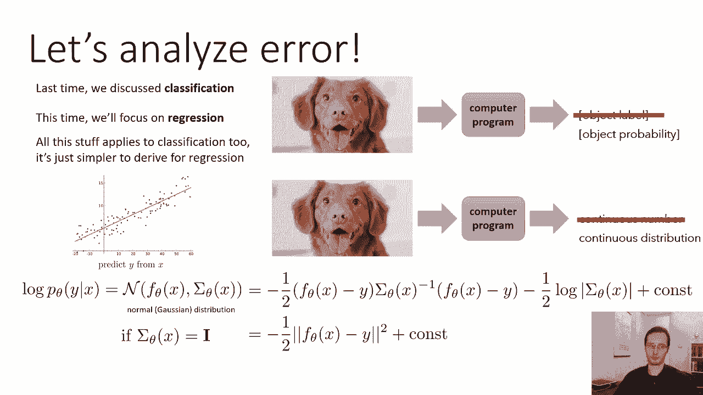

现在，在我们做了这个简化后，我们将x的sigma设置为恒等式，这与均方误差损失相同，因此，如果您重复出现MSC损失或平均平方错误损失，它只是说某一点的损失，x和y是负的，x减去y的平方的一半fθ。

这也是正态分布的对数概率，具有协方差西格玛集恒等式，所以这是相当整洁和平均平方误差损失，当然很简单，希望我们很多人都熟悉这一点，如果你有一个线性模型，然后最小化均方误差损失正好对应于传统的线性回归。

这通常是我们大多数人学习的第一种统计估计方法，在概率论或统计学课上，所以分析均方误差更容易一点，但我们也可以分析任何其他损失函数，所以我将给出的分析将是均方误差，但请记住，它可以扩展到其他损失。

所以这就是我们要做的，我们将处理均方误差，也就是正态分布的对数概率，让我们回忆一下，过拟合是当经验风险较低时，但真正的风险很高，这意味着你的训练集的平均损失很低，但在你的培训分配下。

损失的实际期望值很高，如果数据集太小，就可能发生这种情况，如果模型太强大也会发生，它有太多的参数或太多的容量，就像我之前展示的这个多项式例子，不足，那是经验风险很高的时候，真正的风险很高，就像，呃。

我之前的直线拟合例子，如果模型太弱，就会发生这种情况，如果参数太少或者容量太小，我们接下来要了解的是如何将实际的方程联系起来，对于这两种现象的均方误差损失，顺便说一句，如果优化器配置不当。

也可能发生不合适的情况，比如说，如果你有错误的学习，我们会在以后的课上更多地讨论这个问题，当我们讨论优化方法时。

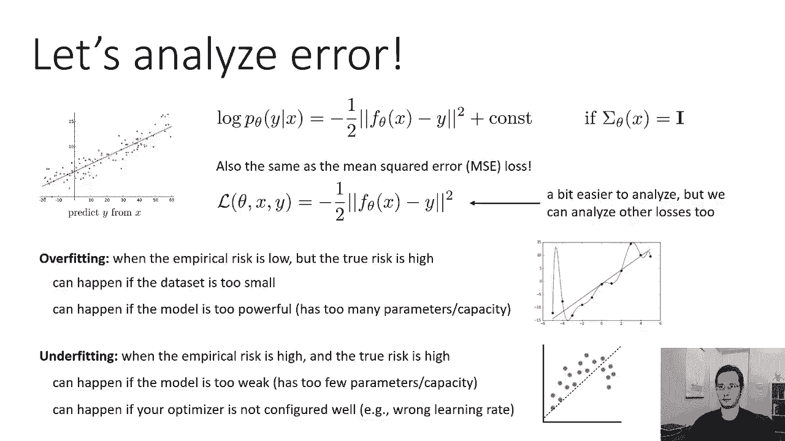

所以让我们试着更正式地理解过拟合和过拟合，这里的问题是，不同训练集的误差如何变化，为什么不同的训练效果很好，我们一会儿就会明白为什么这有意义，但直觉上，我们想以这样的方式进行分析。

我们在某种程度上独立地理解算法的过拟合或过拟合倾向，它训练的特定数据集，因为有了给定的数据集，我们可以幸运地，我们可以，呃，只是，你知道的，运气好，碰巧得到了我们糟糕的学习算法发生的数据集。

得到一个真正好的解决方案，我们想知道从特定数据分布中采样的数据集的平均值，我们的算法会不会产生正确的答案，这就是为什么这个问题很重要，假设这个蓝色，这条黑色曲线是我们真正的函数。

所以这是我们试图适应的函数，这些蓝点代表一个特定的训练集，当我把我的模型和训练集相匹配时，我得到橙色曲线，那么我这里的模型是什么，嗯，也许我的模型是具有多项式特征的线性回归。

就像θ乘以x加上θ2乘以x的平方，加上θ3乘以x的立方，这是一个多项式回归，基本上，所以也许我会得到这个橙色曲线不是一个很好的解决方案，对呀，这是一个非常糟糕的解决方案，解决方案是过拟合还是过拟合。

花点时间想想，记住过拟合是当经验风险较低时，但真正的风险很高，不合适是当他们都很高的时候，经验风险低吗，我想是因为橙色的曲线直接穿过蓝色的圆圈，真正的风险低吗不，真正的风险是相当高的。

因为橙色曲线和黑色曲线很不一样，所以这现在太合适了，想象一下我有一组不同的蓝点，所以我有同样的真正功能，学习问题实际上并没有改变，在x和y上的分布也没有改变，我只是从相同的分布中提取了不同的数据集。

所以如果这些点是Flickr上的图像，也许在第一个图中，我在第二张图中随机拍摄了20张Flickr的图像，我从Flicker那里随机拿了一套不同的二十个，记住，我们的目标是理解我们的算法可能产生的错误。

不管它得到了哪个特定的数据集，所以我们不是想确定，如果我们运气好，有正确的数据，我们正试图确定，如果我们的算法倾向于过拟合或不拟合，所以如果你想象一下这两种情况的多项式回归，对于第二个和第三个数据集。

看到蓝点在不同的地方，但他们还在黑线上，也许这些是你可能得到的一些多项式回归，他们到处都在试穿，他们都是坏人，它们都具有较低的经验风险和较高的真实风险，但关键是，所有的橙色曲线都是不同的。

这是一个非常重要的观察，当我们总体上过度拟合的时候，我们会看到不同的训练集，即使它们来自相同的分布，将导致非常不同的解决方案，如果我们想一想，这实际上是不可避免的，因为我们必须穿得太合适。

我们必须得到低经验风险和高真实风险，低经验风险意味着橙色曲线必须穿过蓝点，高真实风险意味着它不能匹配黑色曲线，所以当我们移动蓝点的时候，如果橙色曲线保持不变，这意味着橙色曲线必须与黑色曲线相匹配。

因为你不能移动那些蓝点，让橙色曲线穿过它们，如果它实际上与黑色曲线不匹配，所以如果我们太合身了，这意味着橙色的东西穿过蓝色的点，这意味着它必须在不同的地方，当蓝点在不同的地方，所以这个问题。

你对不同的训练集有不同的解决方案，如果你知道你穿得太合身了，这实际上是不可避免的，另一方面，如果你穿得不合身，这意味着你的经验风险很高，你的真实风险也很高，你不太合身，所以也许你有一个线性函数。

你要拟合到这条曲线上，线性函数将是一个不好的拟合，但在不同的训练设置之间，它不会有很大的差异，事实上，如果您将所有这些数据集聚合在一起，所以在这里，我只拿了三个例子中所有的蓝点，把它们放在一个图表上。

对这个聚合数据集的线性拟合可能看起来与拟合非常相似，它必须对单个数据集，好像第三个有点偏，但他们大多很相似，在某些方面，这也是不可避免的，如果我们知道我们不合适，因为如果我们不合适。

这意味着我们的模型不够强大，它没有足够的自由参数来准确地拟合我们的函数，所以如果它没有足够的自由参数，就是说，它没有利用训练集中存在的所有信息，所以随着训练集的变化，不会有太大变化。

因为它不会提取所有的信息，它不能利用所有的信息，所以当信息发生变化时，变化不大，所以在过拟合中，训练数据拟合得很好，真正的功能拟合得很差，一般来说，如果你使用不同的训练集，学习的函数每次看起来都不一样。

即使它来自相同的分布在下拟合，训练数据拟合不良，真实函数拟合不良，学习到的函数看起来很相似，即使我们把所有的数据集聚集在一起。

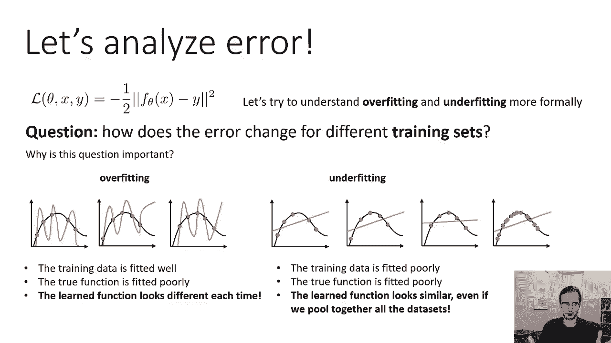

这就是现在的直觉，让我们在数学上更精确，我们要做的是，我们要写下错误的期望值，给定数据集上的分布，这里有一个重要的微妙之处，我们没有取x或y的期望值。

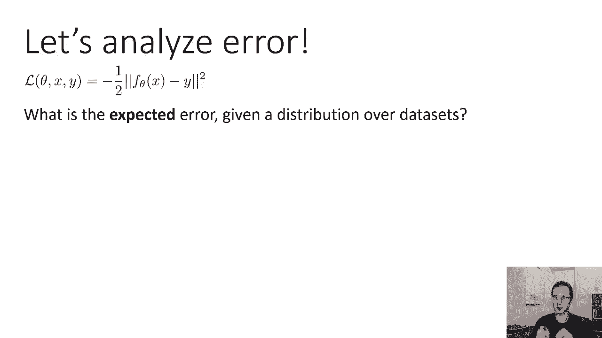

我们将实际取一个关于数据集的期望值，所以我们的数据集是根据一些分布产生的，对呀，我们假设我们根据x的p对图像进行采样，我们根据给定x的y的p对标签进行采样，我们的数据集只是x和y的集合。

这意味着我们可以写下d的概率，所以我们可以说，d的p只是单个数据点概率的乘积，包括D所有权利，所以如果我们能写下d上的概率，这意味着我们可以取d函数的期望值，所以我们可以说好，期望值是多少。

x和y的fθ之间的误差，这里x的fθ训练在d上，但d是随机变量，好的，这有点奇怪，可能需要一秒钟才能把你的头缠起来，这到底是什么意思，所以这不是一个测量特定函数平均误差的表达式，x的fθ。

它实际上是在测量训练算法的预期误差，所以对于d的每一个值，你会得到一个不同的x的fθ，使它更明确一点，我能做的不是把它写成x的fθ，我把它写成x的f d，只是为了强调这实际上是d的函数。

现在D进入你的学习算法，作用于d并产生一个θ，然后我们要看看它的错误，所以它就像一个金属水平的东西，就像我们在期待，如果我给你无限多的数据集，然后分别对这些数据集进行训练，1。你的平均误差是多少？

所以这是试图量化你的学习算法有多好，它不是试图量化你在一个给定的学习问题上做得有多好，顺便说一句，这是一个理论练习，所以在实践中，当我们进行机器学习时，我们只有一套训练器，我们实际上不这么做，在实践中。

这只是分析，这只是我们要做的一些数学，试图理解，我们可以得到很高的经验，低经验风险，但真实风险很高，所以在实践中，当然啦，你实际上并不计算数据集上的期望值，那就太疯狂了，因为你需要大量的数据集。

所以这是一个理论练习，只是为了符号的清晰，我要用x的f来代替y，所以x的f是真函数，x的fd是我在d上训练得到的函数，所以让我们把这个期望值写出来，所以这只是来自期望值的定义，从你的概率论入门课程中。

某个函数的期望值只是随机变量所有值的和，该值乘以的概率，那个函数的值，所以我们的函数是x的f d和x的f之间的差的平方，我在上面定义的d的概率p，这意味着期望值是所有可能数据集的总和。

该数据集时间的概率，x的fd和x的f的平方差，好的，如果这看起来很奇怪，有点奇怪，比如对所有可能的数据集求和，就像哇哦，那是，再这样做太疯狂了，这是一个理论练习，这是机器学习理论。

这不是我们在实践中做的实际事情，但这将真正帮助我们理解为什么我们的算法有时会产生错误的答案，所以这是我们对误差的期望值，就像一个快速的检查，我们为什么关心这个数量，1。我们关心的是这个数量。

因为它量化了我们的算法平均会有多错误，独立于我们平均得到的这个分布的特定数据集，我们的预测会有多错。

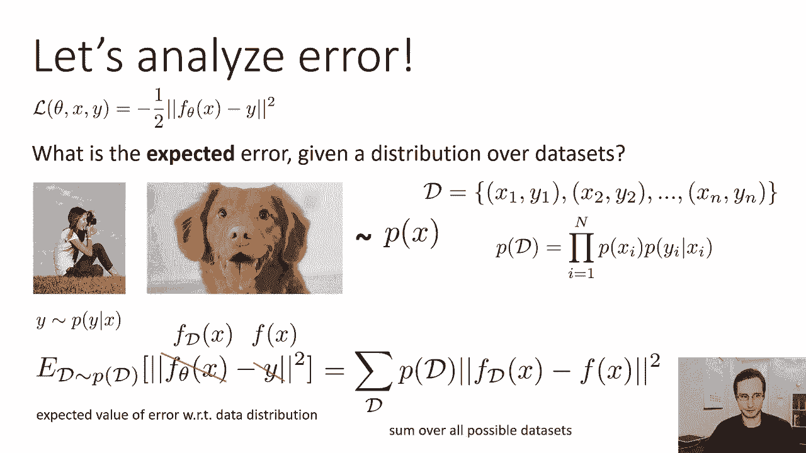

所以让我们进一步分析这个量，1。我们关心的是这个数量，因为我们想了解我们的算法做得有多好，独立于数据集的特定随机选择，如果我们想知道如何改进我们的算法，这是非常重要的，所以过拟合将是当不同的数据集。

我们x的fd会看起来很不一样，对吧，这里所有的数据集都来自相同的分布，同样的真函数，但是橙色曲线区域是不同的，这意味着x对每个d的fd是不同的，拟合不足是指每个数据集的橙色曲线非常相似，不完全相同。

当然啦。

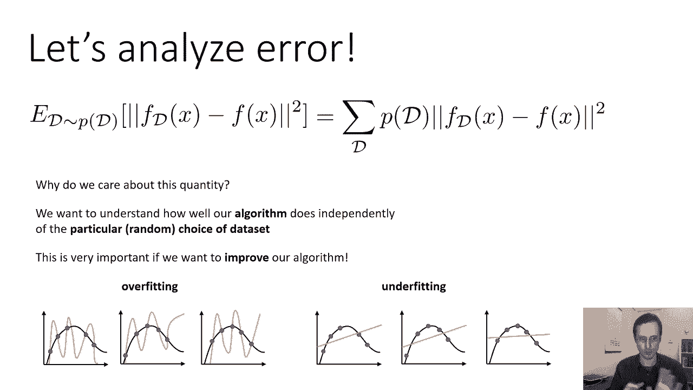

但很相似，也很糟糕，所以我们可以把误差的期望值，我们可以把它分成两个术语，我们实际上可以把责任归咎于这些术语，我们可以责怪他们中的一个，我们可以责怪另一个不合适，所以为了一点符号上的方便。

我将用x的f条来表示f的期望值，x的d，让我们小心理解这意味着什么，x的f条在所有可能的函数上基本上是平均的，你会得到所有可能的数据集，这些数据集的概率加权，这并不是说你会得到x的fd。

如果你有无限的数据，它不是这么说的，因为x的每一个单独的fd仍然适合于一个特定的有限大小的训练集，但你只是把他们的预测平均在一起，所以如果你不知道我为什么要介绍这个，别担心，一会儿就好了。

但是要确保你明白x的f bar实际上是什么意思，如果你不确定你知道，可能会暂停视频或者问一个问题，所以我们下一步可以做的是，我们要做一些代数，我们将用这个方程来计算预期误差，在那个方块里的规范里。

我们要减去f巴再加上f巴，如果你减去一些东西，然后再加回来，那只是零，所以你可以把负f加上，然后我要做的是，我会在前两项加括号，我会在第三和第四学期加括号，所以我基本上重写了我的错误。

也就是x的fd减去x的平方，x的f d减去括号中x的f巴，加f的x减去f的x在括号中，然后整件事就平方了，我什么都没变，我刚引入了一个附加术语，但这两个术语取消了，所以他们达到了零。

我在里面放了一些括号，但现在我要做的是，我要分配广场，所以我要去，我要计算这个量的平方，所以当你有x加y的平方，我们知道结果是x的平方加上y的平方，加两个x y对。

第一项fd为x减去f bar为x的平方，我的第二项是，然后我有交叉项，也就是，呃，x的两个f d减去x转置的f巴，x的f巴减去x的f，转置就是这是多元的，如果这是单变量的，只是乘法，我想我有一个。

我在幻灯片上有一个小字体，实际上应该有加号而不是减号，但这并不重要，好的，没关系，因为第三个学期实际上抵消了，让我们来看看第三个学期，最后一行的那个，它是两件事的产物，x减去f的fd，x的条和f的条。

减去x的f，现在x的f巴，x的负f实际上并不依赖于d，对这两者都不依赖于d，所以我们可以通过预期的线性来使它们超出预期，这就是我们在底部的方程，第一项是x的f d的期望值减去x的f巴。

但是x的f条是它自己，f d的期望值x，所以它也不依赖于T，那么你有x的f d的期望值，减去x的f d的期望值，所以第一部分就变成了零，零乘以任何东西都是零，所以整个第三个学期实际上抵消了。

如果你不清楚为什么会发生这种情况，可以考虑暂停再看一遍，仔细考虑一下，也许在一张纸上解决，或者如果你在看现场直播，请继续问一个问题，所有的权利，所以第三个学期抵消了，只剩下前两个术语。

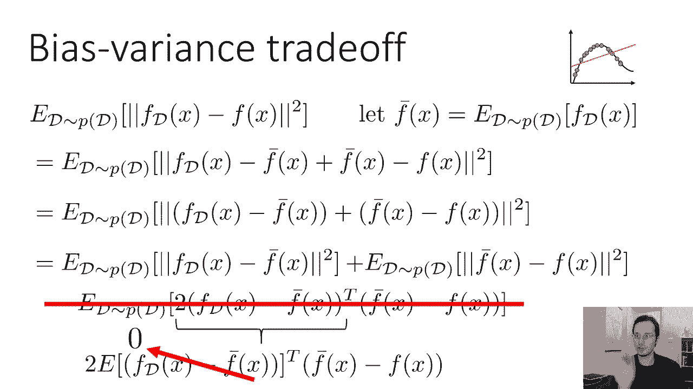

让我们来看看前两个术语，我们有f的d的p下的期望值，x的d减去x的f巴，加上x的f巴d的p下的期望值减去x的f，所以第二件事，期望值内部的东西实际上并不依赖于d，所以我们可以完全摆脱期望，只是区别。

你所有预测的平均值之间的平方差，也就是f巴和真函数f，就像上面的那个东西，幻灯片右边，我们称之为偏见，技术上来说，这是偏差的平方，所以偏差是x的f巴减去x的f，当你把它平方的时候，那是平方偏差。

所以偏差基本上量化了，你得到的平均预测离真实函数有多远，所以在这种情况下，偏差很大，所以偏见有点，那个错误，这个错误不会消失，不管我们有多少数据，偏差只是量化，呃，我们在参数化下有多低，在某种意义上。

第一项是方差，注意第一项实际上没有x的f，所以不管真正的函数是什么，这是量化，我们的预测随着数据集的变化有多大，所以这只是量化了这种可变性，现在，当然啦，你的预测确实取决于真实的函数。

在真函数产生训练数据的意义上，但这不是对真实函数的错误，这就是不同训练集的x的fd变化有多大，它与它的平均值相差多少，所以整个误差就是方差加上偏差的平方，这两个术语实际上解释了过拟合和过拟合。

所以如果方差太高，这是左下角的设置，如果方差太大，那么你就会有太少的数据或者太复杂的函数类之类的东西，这是过合适的，所以过拟合意味着高方差，如果偏差太高，您有一个不够复杂的函数类。

所以问题不是你得到了不同的函数，取决于数据集，只是你不能得到一个准确的功能周期，那是在试穿中。

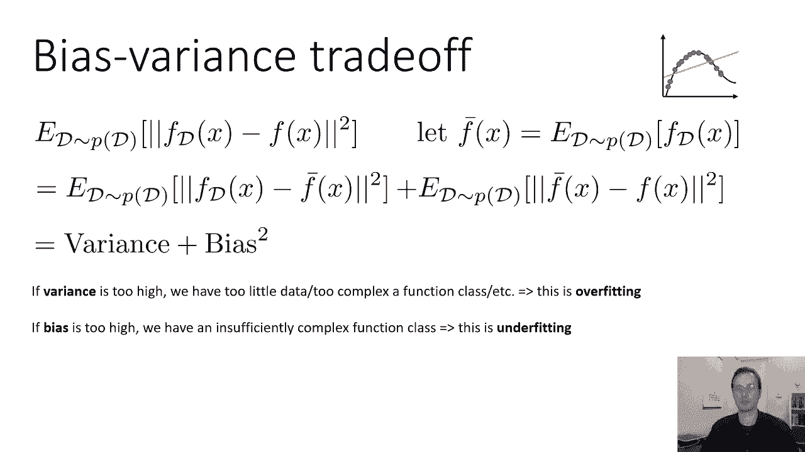

一旦我们认识到我们的错误是由方差和偏差组成的，然后我们就可以认识到得到一个准确的解，获得一个工作良好的算法，需要调节偏差和方差之间的权衡，所以我们的方差太大了，减少方差的方法，也许会增加一点偏见。

如果我们有太多的偏见，那么我们应该减少偏见，这可能会增加一点方差，了解哪个术语是大的，哪个术语是小的是非常重要的，因为我们有许多减少差异的故障排除技术，实际上会增加偏见，反之亦然，我们弄错了。

我们试图修复我们的算法，也许我们认为我们的方差很大，但事实上，我们的偏见很高实际上会加剧问题，所以如果你得到了错误的答案，了解这一点真的很重要。

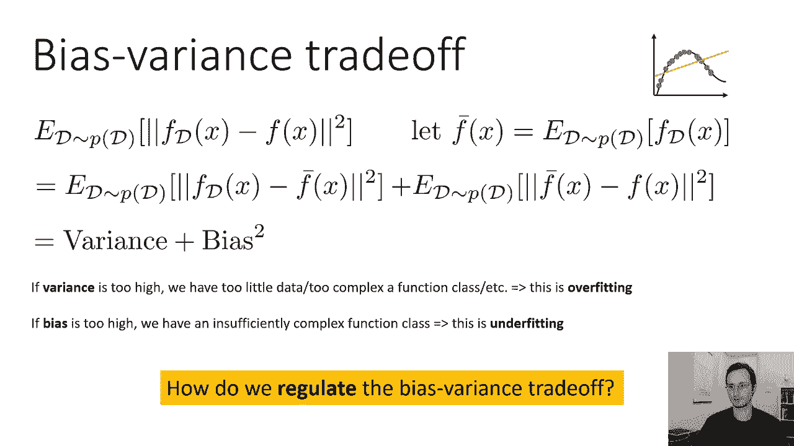