# 【双语字幕】伯克利CS 182《深度学习：深度神经网络设计、可视化与理解》课程(2021) by Sergey Levine - P9：CS 182 Lecture 3- Part 2- Error Analysis - 爱可可-爱生活 - BV1PK4y1U751

那么让我们来谈谈如何权衡偏差和方差，我们如何调节偏差和方差，一种方法是获得更多的数据，获取更多数据解决方差，你拥有的数据越多，你的过度适应就越少，你遭受的差异就越少，所以如果我们只有很少的数据。

如果我们有五个数据点，我们拟合了一个八度多项式，我们很可能适合，如果我们有500万个数据点，我们拟合了一个八度多项式，那我们可能会没事的对吧，所以我们有大量这样的数据。

那么这个复杂的函数类可能会很好地适合真正的函数，获得更多的数据通常不会改善偏见，这是以前的不合适的例子，那条直线不适合真实的曲线，不管我们给它多少数据点，您可以更改模型类。

改变你的模型类基本上意味着改变你的程序，也许你有比θ更多的值，你有一个更大的参数向量，你有一个更复杂的程序，比如说，你可以把你的12次多项式变成一个线性函数，这可能会减少方差，增加偏差。

但这是一个非常离散的选择，我们能更顺利地限制形式吗，像这样的模型类，也许我们真的想要12次多项式，我们只是不想让他们太疯狂，我们不想让它们变得如此尖细、锯齿状和锋利。

我们能不能为复杂性构造一种连续的旋钮。

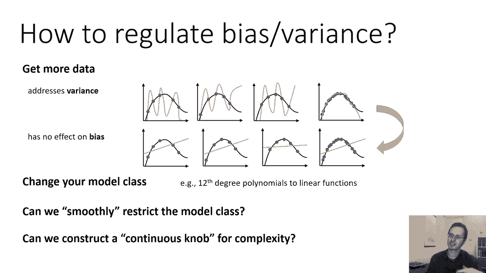

所以这叫做正则化，非正式的正则化是我们添加到损失函数中的东西，通常是为了减少方差，虽然并不总是，也许理解正则化的一个更简单的方法是通过贝叶斯解释，它认为正则化是关于我们参数的先验信念。

我很快就会更详细地解释这一点，但请记住，这不是唯一的解释，还有其他方法来理解正规化，所以贝叶斯透视的高级直觉，当我们有很高的方差时，这是因为数据没有给我们足够的信息来识别参数。

所以如果我们只有这五个数据点，我们有一个十二次多项式，问题是函数只是未确定，有许多不同的十二次多项式，这五个数据点都非常非常吻合，所以在所有的十二次多项式中，我们不知道该选哪个好，他们看起来都一样好。

也许他们中的一些人比其他人好一点，数据中也有噪声，所以我们可能甚至不想要最合适的，你知道的，在内心深处，问题真的是数据中没有足够的信息来选择，许多可能的函数之一，就经验风险而言，这些看起来都一样好。

所以我们需要以某种方式提供更多的知识，所以如果数据中没有足够的信息，我们能不能通过损失函数给算法更多的信息，和，如果我们提供足够的信息来消除歧义，在一群几乎同样好的模特之间。

也许我们可以让算法选择正确的，如果我们在这里有我们的数据集，这些都是相同的数据集，我只是要展示不同的功能，你知道我们有一堆不同的函数，我们可以画，就其经验风险而言，所有这些看起来都同样好，所以第一个。

第二只，第三个，它们都直接穿过蓝点，但即使你不知道数据集是什么，我刚刚给你看了那些曲线，也许你会更喜欢它们中的哪一种看起来更好，他们中哪一个更有可能是对的，就像第二个，可能不是正确的答案，对呀。

有可能这不是另一个问题，但可能不喜欢，你知道的，可能你关心的功能只是看起来不像那样，所以所有这些解决方案都没有训练误差，但是第三个更好的是什么，当然有情况，可能也好不到哪里去，可能你知道一个事实。

你的功能就像超级锯齿状，像这样，从你对这个领域的了解来看，你对这个问题的了解，你可能会猜到第三个函数更好，即使你不知道真正的函数是什么样子的。

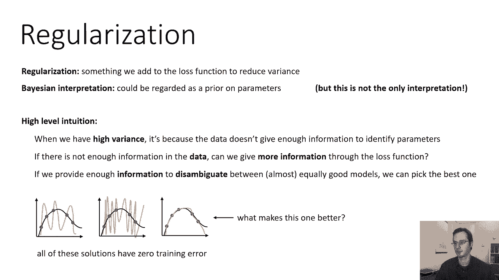

所以贝叶斯透视图可以像这样形式化，你可以问这个问题，给定一个数据集d，最有可能的参数向量θ是什么，这在某种意义上是学习问题，但是我们可以用概率写出整个学习问题，所以在上一节课中，我们写了预测问题。

如何从x中概率地得到y，现在我们要把整个学习问题按概率写出来，如何从D得到θ的问题，所以我记得只是一组x y元组，如果你想要给定d的θ上的分布，你可以应用条件概率的定义，给定d的θ的p等于θ的p。

逗号d除以d的p，在比例常数下，关节非常好，我们总是可以重整化，所以我们暂时忽略分母，就说它与θ逗号d的p成正比，根据概率链式法则，我们可以把它分解为d的p，给定θ乘以θ的p，好的，现在。

我们实际上已经看到了第一部分，在给定某个参数向量的d的概率之前，使用我们在上一节课中讨论过的iID假设，可以分解为所有数据的乘积，所以实际上是我给出的θy的p，对我们来说很重要。

这就是我们在上一节课中看到的最大似然目标，记住，在给定x的情况下，p下标y的θ，只是我用来表示y的p的符号速记，i给定x，i逗号θ，对呀，我们真的在适应西塔，那么第二部分是什么，对呀，一旦我们写出来。

就出现了一种新的东西，用条件概率的定义写出了这个，这就是Pθ，θ的p井是什么，θ是先验的可能性有多大，你以前认为θ的可能性有多大，你甚至看过训练集，这叫做我们的全盛时期，因为这是我们对θ的信仰。

在你看到数据之前的先验，所以在不知道真正功能的情况下，甚至不知道蓝色的圆圈是什么看这两张图，尖尖的和光滑的，如果我问你，你认为哪一个更有可能是真正的函数，如果你相信更平滑的功能更有可能。

你可能会说第二个，如果你相信尖刻的函数更有可能，你可能会说第一个，这本质上是角色，以前的戏剧，当然，到目前为止我所告诉你的也许并不那么有用，因为我还没有告诉你如何建立一个。

就像θ的p是函数可以是任何正确的，我们如何建立选择光滑函数的θ先验函数的p，第二个，相对于那个尖尖的，第一个，所以我们一会儿就会讨论这个问题，但让我们结束这条思路，使用这种贝叶斯公式。

我们有一个新的损失函数，所以在我们有负对数似然之前，现在我们有一个稍微不同的负对数似然，我们有第一个学期，所以我们只要把d的p的对数，θ的p，当我们取一个产品的日志时，我们得到了一个原木的总和。

给定θ的d的对数p只是之前的对数似然，这是一个损失，所以它是负对数似然，所以这只是你所有数据点的总和，这和我们之前在第二课所讲的完全一样，但现在我们也有这个θ项Tecton的对数p在末尾。

那是我们的先驱者，所以你所做的就是，你只要从你的损失中减去你的先验很简单我们必须选择它，我们必须选择θ的对数p是多少，这是我们做出的设计选择它不是来自数据。

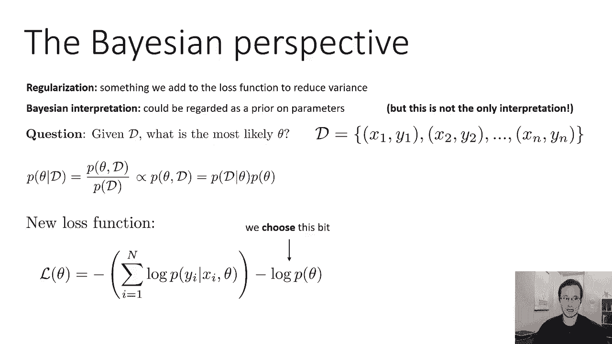

这是我们先前的信念，那么我们是否可以选择一个先验函数，使更平滑的函数看起来更有可能，形成第二条曲线的先验，光滑的曲线，呃，看起来比左边凌乱的曲线更有可能，嗯，什么样的分布给小数分配了更高的概率。

这就是我们想要的，为什么小数字，嗯，考虑幻灯片左下角的示例，这里的例子是具有多项式特征的线性回归，这就是我一直在给你看的，当我展示这些凌乱的过拟合曲线时，具有多项式特征的SO线性回归。

就是说x的fθ是θ，零加θ，1 x+θ，2乘以x的平方加上θ，三次x，立方等等等等，这是一个线性回归模型，对呀，因为函数在θ中是线性的，它在x中不是线性的，那只是因为我们正在引入功能，x立方，等。

看起来像左下角的多项式，一般倾向于有很大的系数，他们需要那些大系数才能使这些，这些大尖刺和大跳跃，如果我们只允许系数很小的多项式，我们会得到更像底部的曲线，小系数右右，你不能有这些大钉子。

所以如果我们想要小系数，我们可以问什么样的分布给小数分配了更高的概率，实际上我们可以选择的分布范围很广，但是一个非常简单的选择是再次使用正态分布，这次均值为零，所以均值为零的正态分布看起来像钟形曲线。

它把大部分的概率质量放在接近于零的小数字上，有多接近，这是由方差决定的，所以西格玛的平方是方差，这决定了您想要声明一个零的接近程度，好的，所以这是一个简单的选择，我们可以选择θ的p为正态分布，均值为零。

方差为我们选择的，我们选择的方差越低，这个优先将惩罚具有大尖峰的函数，所以让我们再多谈谈这件事，下面是均值为零的正态分布的对数概率的表达式，所以它有它的我们在θ的所有维度上求和，对于每一维。

我们有负的一半，θi平方除以sigma，平方减去对数，西格玛减去一半，对数2圆周率，这里唯一依赖于θ的是第一项，它们不影响θ，所以我们可以无视他们，因为不管他们是什么，它们不会影响在θ上的优化。

所以我们可以等价地把这个正规先验写为负lambda，乘以θ的平方，加上一些常数，λ是1/2 sigma的平方，至关重要的是，我们不在乎什么，什么，呃，等于1/2西格玛的平方。

因为我们实际上不会选择西格玛，我们就直接选lambda，所以我们其实并不关心这个，我们就直接选择lambda，但了解它如何与正态分布联系起来是有帮助的，所以在这一切之后，呃，动机，所有这些数学。

我们最终得到的是一个非常简单的前项，范数θ平方，当我们从负对数似然中减去它时，我们最终得到均方误差，这就是为什么，这就是为什么，负对数p给定x等于+λθ平方y+井，因为我们把这个最小化了。

这里的lambda是我们所说的超参数，lambda是我们自己做出的设计决定，lambda不是一个学习的量，选择lambda是为了施加正确的先验，在先，我们相信会给我们正确的答案，所以在这一切之后，呃。

动机，所有这些复杂性，我们最终的目标和以前一样，这些误差的平方和，我们所做的就是，我们加了lambda范数，θ的平方，就是这样，但我们现在知道这对应于贝叶斯方法，在那里我们有一个关于θ的先验分布。

先验是正常的，均值为零，和方差，可以从屏幕左下角的公式推导出来，但你其实不必这么做，你不必推断出西格玛是什么，你可以直接选lambda，当然还有，这就是我们作为同一性的预测的方差的情况。

所以这个术语是我们添加的唯一新东西。

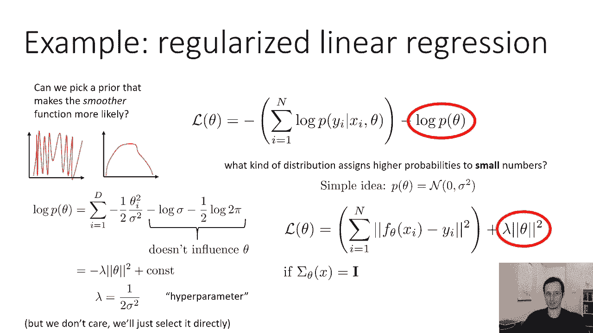

这就是线性回归的正则化，对于回归问题，分类怎么样，让我们来谈谈我们在上一节课上讨论过的逻辑回归。

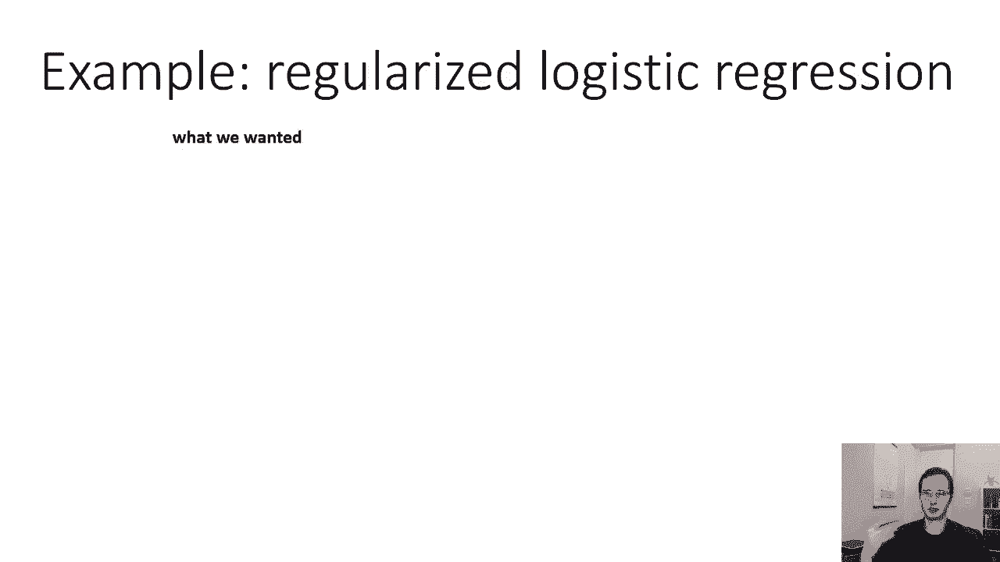

所以在上一节课中，我展示了这张非常吸引人的逻辑回归图，随着SoftMax学习这个可爱的分布，两门课之间的概率是50，然后向红色一侧的红色平滑地增加概率，并在蓝色的一侧向蓝色平滑地增加。

但这正是我们想要的，如果我们得到的更像这样呢，就像绿色的东西给红色100%的概率，蓝色的东西赋予蓝色100%的概率，训练精准度完美，红色和蓝色之间的决定边界的形状是垃圾，这不是正确的决策边界，事实上。

这可能有很高的方差，如果我移动这些点，决策边界可能会发生剧烈的变化，所以就像我们以前的过度装修一样，现在只用于逻辑回归，所以从技术上来说，每一点都被正确地分类，但这太不合适了。

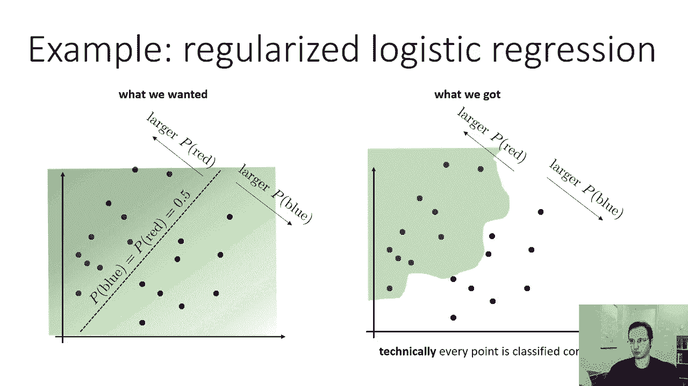

所以我们可以设计逻辑回归正则器的一种方法，就是回想一下我在上一节课上举的例子，当我有一个D的例子，我在解释为什么我们把SoftMax称为SoftMax，我说过如果你把西塔，你把它乘以一个很大的数字。

你得到了一个更清晰的决策边界，你基本上得到了更敏锐的概率，也许如果你把θ乘以一个很大的数，概率会直接跳起来，从百分之百的蓝色到百分之百的红色，如果θ值很小，那么概率就更平滑了。

如此大的θ值意味着尖锐的概率，小θ值表示光滑概率。

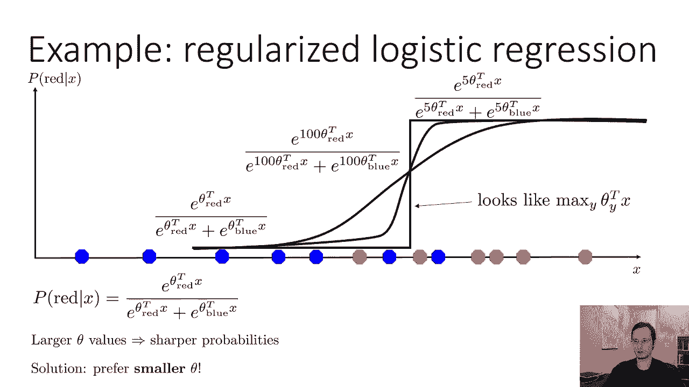

所以如果你想要平滑的概率，如果你想要像左边这张漂亮的照片。

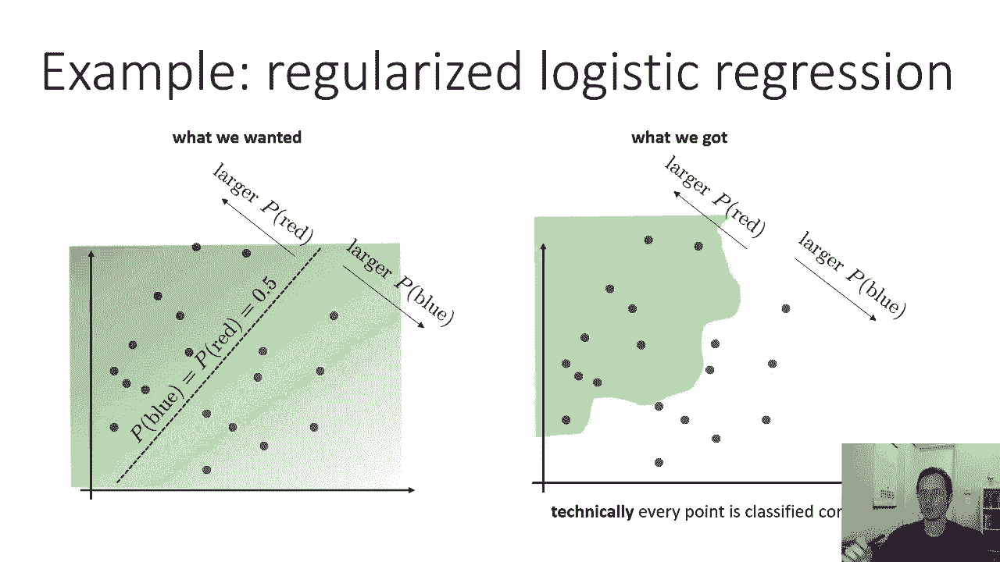

也许你想要的只是更小的θ值，这么简单的想法，我们为什么不在θ上加上一个有利于小数的先验呢？我们可以用好什么样的先验，我们可以用均值为零的正态分布，和一些方差西格玛平方，反映了我们想要多少，那些较小的值。

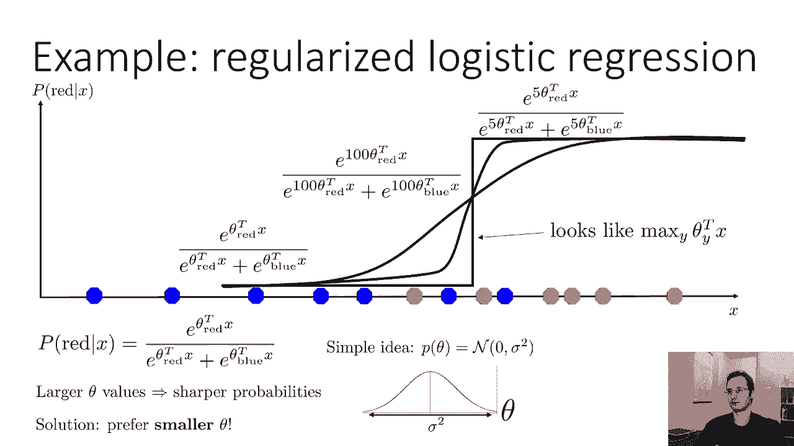

所以实际损失和以前完全一样，我们就把我们的，嗯，对数概率，我向你道歉，少了一个负号，所以这应该是负对数概率，我们将λθ的平方加到，所以这是相同的先前行动，是一样的，不是零，平均正常优先。

但是现在对于一个分类问题，这有时被称为重量衰减，因为在这个最小化问题中，我们正在最小化重量，所以我们在降低重量，我们正在把它们变小，还有许多其他正规化的例子，我们稍后会讨论其中的一些，所以嗯。

我给出了两个例子，它们都碰巧是均值为零的正态分布，这是最常见的规整剂，尤其是在深度学习中，被称为重量衰减，但这不是唯一的选择，常见的替代选择是使用θ的绝对值而不是θ的平方，起初。

这似乎是一个非常相似的选择，它也喜欢小众，但它有一个非常不同的形状对吧所以绝对值函数有恒定的斜率，而平方函数具有递增斜率，这个绝对值正则化器所做的一件事是，它鼓励向量θ中尽可能多的条目为零。

它鼓励所谓的稀疏解决方案，一个是没有使用所有theta的theta维度的地方，这其中的原因一开始有点难以理解，但有一个几何类比可以帮助，所以这里我有两张照片，让我解释一下这些照片的含义，所以那些椭圆。

嗯嗯，一种红紫色的椭圆，表示对数似然的等高线，所以这基本上是损失的第一个术语，这些同心圆表明，呃，增加对数长度的圆，所以如果你没有任何规整剂，你会直接走到最里面椭圆的中间，蓝色的形状，圆圈里的钻石。

这些代表了我们正则化器的轮廓，所以每种颜色对正则化器来说都是不同的值，现在规整者都试图把重量推向零，但当然，这两个术语必须相互权衡，所以直觉上，你会发现参数空间中的一个点，正则化器和可能性平衡。

所以这将是一个交集，正则化器的似然轮廓和轮廓，对于重量的正常正则化器，对于重量衰减，右边那个，等高线是圆的对吧，因为平方范数在空间中追踪圆圈，所以这意味着你实际上会找到的点将是一个。

椭圆与其中一个圆相切的地方，因为那是他们要互相交易的地方，这就是你所看到的，那里的小点代表了你会找到的解决方案，对于正则化器上的不同重量，正如你所料，你只是从，呃，最里面的椭圆。

当你增加钻石形状的常规重量时，允许参数向损失椭圆靠拢，当您清零其中一个值时，所以你在那里看到的本质上是，最不有用的参数先减少，直到它为零，然后另一个参数进一步减小，所以说。

这些菱形的轮廓实际上导致了一个正则化器，促进稀疏，在降低其他值之前，促进归零任何不太有用的值，所以很棒，它创建了归零维度的偏好，通俗地说，这个绝对值正则化有时被称为L一正则化。

它对应于一种叫做拉普拉斯分布的东西，重量衰减，平方正则化器有时叫做l 2正则化，这来自于l 2范数对l 1范数的概念，另一种有时与深度神经网络一起使用的正则化器，就是所谓的辍学。

它是一种特殊的神经网络正则化器，我们以后会更多地讨论这个问题，一些类型的神经网络，如生成对抗网络，呃，生成人脸和动物照片的那种，他们有自己的特殊规则，人们使用像梯度惩罚，当我们谈论甘斯时。

我们会更多地讨论这些，当然还有很多其他的选择，所以你会看到很多，许多算法和许多不同的模型，你只是使用权重衰减，这可能是最常见的规整剂类型，尤其是在深度学习方面，你会看到相当多的方法。

以这样或那样的方式使用l一个正则化，您将看到一些使用dropout的方法，和一些对特定类型的模型使用更专门正则化的方法，如渐变笔。

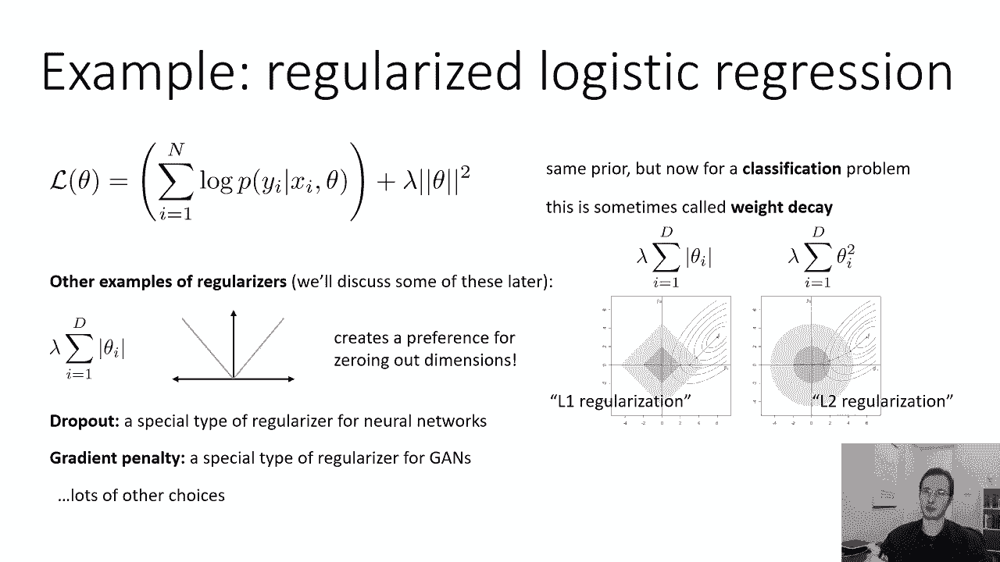

好的，现在我从贝叶斯的角度提出了正则化，其中正则化器对有关参数的先验知识进行编码，但这不是看待正规化的唯一方法，还有其他关于正规化的观点也很重要，这也教会了我们一些关于正规化所扮演的角色，比如说。

你可以从数字的角度来看待它，你可以把正则化器看作是制造一个未确定问题的东西，意志坚定，想象一下你在做线性回归，你有比数据点更多的功能，作为你自己时间的练习，你实际上可以通过线性回归的正态方程。

当x中有更多维并且有数据点时，你会发现你在线性回归中反演的矩阵，变得奇异，变得不可逆，那是个数字问题，原来我描述的L二正则化方法也可以看作，用奇异矩阵来解决这个数值问题，并通过添加其对角线使其非单数。

我不打算在课堂上讲它的推导，因为这只会给你带来更多的数学，但如果你愿意，你可以用自己的时间来试着计算出这些方程，或者问一节中的一个助教，您还可以从优化的角度看待正则化，到目前为止，我们谈到了正规化。

作为一种减少过度拟合的方法，但你也可以认为你也可以，在某些情况下，使用正则化来更容易优化损失景观，所以也许矛盾的是，规整器有时可以减少不适应，如果欠配是由于优化不良造成的，正则化器是非常仔细地选择的。

以减少这些优化挑战，这实际上是深度学习的方式之一，在肤浅的机器学习中，有时会偏离我们的传统智慧，因为在深度学习中，有时规整器实际上是在拟合下减少而不是过拟合，这对于像甘斯这样的模特来说尤其常见。

生成对抗网络，我们会在后面的课上更多地讨论这个问题，我只是想现在提一下，只是为了让你意识到正规可以扮演各种不同的角色，所以在机器学习中，我们在损失中添加的任何启发式术语。

不依赖于数据的通常被称为正则化器，关于规则化者的一件事是，不管你从哪个角度来看，不管他们扮演什么角色，它们通常会引入我们必须选择的超参数，为了使正则化器工作良好，一个超参数可以像lambda一样简单。

所以它可以像正则化器前的乘数一样简单，也可能是更复杂的事情，但不管怎样，必须选择这些超参数，他们不能被选择来最大限度地减少你的训练损失，因为你的训练损失可能已经很严重了，如果你穿得太合适，就很低，例如。

所以你必须以其他方式选择这些类型的参数。

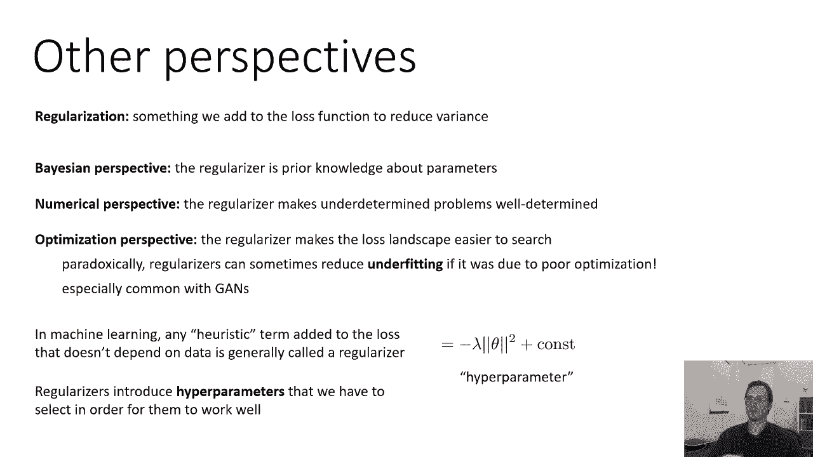