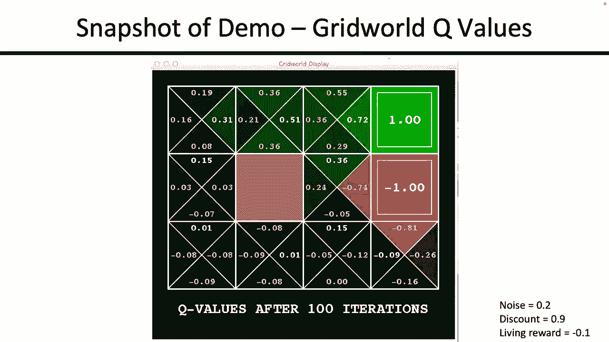
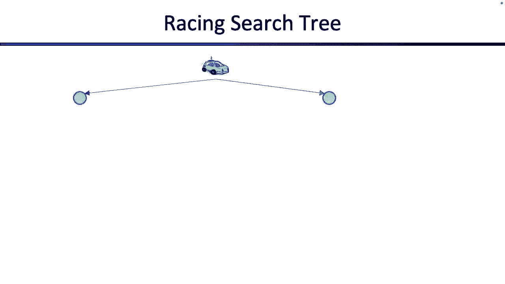
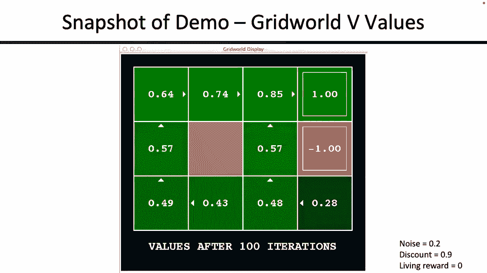
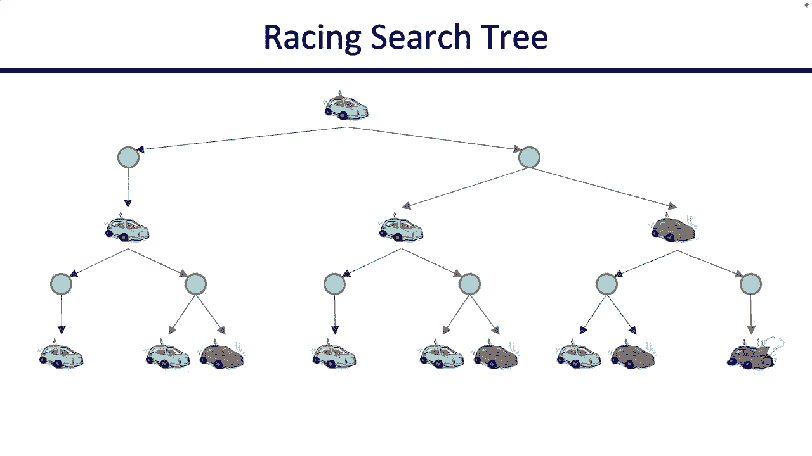

# CS188 伯克利最新AI课程--人工智能入门推荐 - P12：[CS188 SP23] Lecture 11 - Markov Decision Processes_ Intro - 是阿布波多啊 - BV1cc411g7CM

a，现在是五点十分，以下是公告，希望你知道星期五要交作业，还有一个下周二到期的项目，好的，再凉爽一周，另一个激动人心的话题，本周我们将讨论非确定性搜索，所以我们进行了搜索，我们用几种不同的方式打破了它。

我们说好，什么，如果有不止一个代理在搜索，我们花了一个星期的时间讨论这个问题，今天我们要讲的是，我想这整个星期我们都要谈论发生了什么，如果您遇到搜索问题，但你的行动是不确定的，当你采取行动时。

不太清楚发生了什么事，就像，看看这个机器人，它试图得到宝石，它试图喜欢，穿过悬崖，但这个机器人真的不知道它是否试图穿过悬崖，否则岩石会像崩塌一样，会不会掉进火坑里，还是会得到宝石，不太清楚。

所以我们必须找出算法来解决这个问题，好的，所以我们要有一个运行的例子，就像我们谈论CSPS一样，我们有一张地图，我们给它上了色，当我们谈论搜索的时候，我们有罗马尼亚，我们在罗马尼亚旅行。

这是一个运行的示例，但重要的是要记住，并不是所有的MDP都是网格世界，这只是我们的例子，你可以把很多不同的问题制定成MDPS，但这是我们的例子，所以看起来有点眼熟，我们有一个机器人，它在一个小迷宫里。

有它无法跨越的墙，但因为这是非确定性搜索，我们要在拼图上加一点扭曲，到游戏，所以问题是如果这个机器人选择向一个方向移动，百分之八十的时间移动会成功，但有百分之二十的机会，这次行动没有成功。

如果行动不成功，那么代理要么意外地以10%的概率顺时针方向移动，不小心以10%的概率逆时针方向，所以如果你是这里的这个小机器人，你选择向北走，你会成功的，百分之八十的时间是你往北走。

但百分之十的时间你可能会搞砸，去东方，百分之十的时间你可能会搞砸，去西部，在这个特殊的网格世界中很重要，并不适用于所有的网格世界或游戏，但在这个特殊的网格世界里，实际上，你倒退并向南的可能性为零。

你就像，嗯，我想要一个网格，你可以得到，可以往南走，当然你可以自己做，但在我们的网格世界里，往相反方向走的几率为零，好的，然后如果探员撞到墙上，它一直很好，太好了，我们要谈谈。

比如这个代理在这个游戏中得到了什么奖励，所以这个代理有两种方法可以获得奖励，在我们特定的网格世界游戏中，你每走一步就会得到一个奖励，所以我们称之为活的奖励，你活着的每一步都得到了它，可能是积极的。

可能是阴性的，那是你一直得到的奖励，可能会很大，可能很小，在游戏结束时，所以最终你可能想到达这个加一个宝石，或者这个减去一个火坑，一旦你到了游戏的最后，我们会给你更大的奖励，再次，可能会很好，可能不好。

好的，所以这是我们的特殊游戏，我们的提法中有一件重要的事情，同样，你可以制定自己的网格世界游戏，随你喜欢，但在我们的提法中，我们想说，如果你是一个代理，你进入其中一个广场，你不会马上得到加一个。

你得多做一件事，我们会把它叫做出口或结束什么的，为了得到加一个，那是游戏结束的时候，所以除非你搬家，否则你不会得到加人，你没有得到额外的一个，你搬进广场，你退出游戏后得到加一个，为什么会这样。

我们就是这样设计这个游戏的，你就像，我想设计自己的游戏，当然玩得开心，很棒，就像我们以前的大多数游戏和谜题一样，我们的目标是最大限度地增加我们的奖励，但我们会试着更具体地定义，随着我们今天的继续，好的。

但这又是我们运行的示例，并非所有的MDPS都是群治的，但这是我们要用的，比如家庭作业和考试，只是为了让事情保持一致，今天大家准备好玩网格世界了吗，过一段时间你就可以认为自己是这方面的专家了，好的，伟大。

那么这与我们到目前为止看到的所有搜索问题有什么不同呢，让它与众不同的主要原因，在我们的行动中，我们采取这样的行动是不确定的吗，如果你是这个机器人，你选择向北走，如果这是一个确定性的网格世界。

那你就在广场上，往北一个正方形，那太好了，但在我们的MDPS中不是这样，现在我们会有一个网格，你可以选择向北走，但这可能不会真的发生，有时你会去北方，你就在这里，有时你可能会不小心往东走。

有时你可能会不小心往西掉进火坑里，所以真的不清楚会发生什么对吧，当我们计算时，我们必须考虑到它们，伟大，所以这又是一个例子，让我们概括一下，那么这总体上是什么样子的，所以这里就像我们搜索的时候一样。

当我们做CSPS的时候，当我们玩游戏的时候，我们对这个问题有一个数学定义。看起来有点相似，我们只需要在里面添加一些东西，这样我们就可以解释非确定性搜索，所以当你做MDP的时候，你必须有一组状态。

这就像在搜索中一样，或者在游戏中，你必须有一套动作，就像在搜索中一样，交互将有与它们相关联的名称，像北方，东南或西部，好的，这个是新的，我们要有一个过渡函数，这是新的，这告诉我们你什么时候行动。

当你选择一个动作时，有多大的概率，你最终会在一些州，所以如果你回头看这里，当我们在做这个的时候，如果你选择北上，你不是在一个州着陆的，所以如果你在做常规搜索，在这种情况下，你选择向北走，有一个后继函数。

它告诉你你最终会在哪里，如果你选择北上，其实不太清楚，你最终会在这三个中的哪一个，所以你必须有某种概率分布来告诉你，有多大的概率会被扔进火坑，你最终正确的概率是多少。

所以我们必须有某种传递函数来告诉我们，如果你喜欢概率，你可以把这看作是我喜欢我在某个州着陆的概率，鉴于我处于这种原始状态，我选择了一些动作，所以我在三个逗号中，我选择北上，我变成三逗号二的概率有多大。

那就有百分之八十的可能性我用四个逗号着陆，一个是百分之十的概率，我用两个逗号着陆，一个是百分之十的权利，这是转换函数，它给出了，鉴于我处于这种状态，我选择了这个行动，我要在哪里着陆，有一个奖励功能。

它告诉我们一旦你处于一种状态，你采取了行动，你最终会在其他州，2。你做得对，得到了什么奖赏，所以这可能取决于你降落的州或州，但总的来说，我们的一般目的，ndps这可能取决于您采取的状态和操作。

你降落在哪里，所以说，如果你再回到这个例子，对呀，你去北方得到的奖励，并不总是一个固定的常数，如果你选择北上，你知道这件事发生了，你掉进坑里，也许你这样做的回报是相当消极的。

或者如果你选择往北走你真的往北走了，也许这与好的奖励有关，我不知道你必须在你的函数中定义这一点，这些都是有人会递给你的数字，在你解决mdp之前，对呀，也许你有一个开始，状态，也许你有终态。

比如正态和负态，游戏结束的地方，好的，所以它和你看到的搜索表单很相似，我们增加的新东西，我们的过渡函数，它告诉我们当你移动时，你在其他州着陆的可能性有多大，还有一个奖励功能，这告诉我们你走了这一步。

你就会在另一个州着陆，可以是非迷你的，与之相关的奖励是什么，好吧，现在，如果你斜视这个真的很难，这实际上是我们双人游戏的一个特例，从上次开始有一个球员就是你，然后有另一个玩家。

这是一种与采取行动相关的概率或机会，不知道他们在哪里着陆，所以这有点像预期的最大值，如果你斜视得很厉害，你动一下，然后没有机会选择你降落的地方，然后你再走一步，然后选择你着陆的机会，所以如果你真的想。

你可以用期待，嗯X，我们都可以回家了，但正如我们将看到的，这并不是这里最好的工具，所以我们会有一些更好的工具，好的，但这是一般MDP的正式定义，您可以使用非确定性搜索来解决您的问题。

把它们塞进这种特殊的格式，然后我们所有的算法都可以解决它们看起来很好，你想知道的任何事情，好的，酷，这个叫马尔科夫的家伙是谁？我想他在我的决策过程中做了什么，好的。

所以我们以后会在课堂上更多地讨论马尔科夫，抱着这种想法，但如果你以前见过马尔科夫，也许你认识到马尔科夫背后的想法是考虑到你现在所知道的，过去在未来都是独立的，这是一个非常花哨的说法，一旦你处于这种状态。

其实你怎么到三逗号一并不重要，你在哪里着陆的概率分布，或者你下一步的结局是一样的，所以你可以从这里开始绕一个大圈到这里，然后这个分布在你可以降落的不同州仍然是一样的，或者你直接去了这里，分布是一样的。

所以一旦你降落在三一，在这一点上，你是如何到达那里的并不重要，奖励和过渡功能只取决于事实，你现在在三一，所以这就是马尔科夫的原因，这没关系，如果这还没有完全说得通的话，我们将更多地讨论马尔科夫的前进。

好的，谢谢。马可太好了，那么我们怎么解决这个问题呢，记住一个搜索问题，我们可以通过制定一个计划来解决搜索问题，那是一系列把你带到目标状态的动作，但在MDP中，计划并不能真正为你做你的工作。

因为如果你采取一系列行动，你怎么知道这些行动真的成功了，或者你怎么知道在这些动作中发生了什么，所以现在不是这样了，你可以拿着你的MDP，产生一系列的动作，说那是你的金子，或者这就是你的解决方案。

因为谁知道这些行动会做什么，所以你想要更通用的东西，你想要保单，从数学上来说，什么是政策，它是将状态映射到动作，所以我给你一个状态，然后你告诉我从那个状态，最好的行动是什么，这是你的政策对吗，直觉上。

这个小机器人拿着地图，这张地图是机器人的策略，它告诉机器人，你知道，如果你在这个广场上，你应该上去，你在，如果你在这个广场上，你应该上去，你应该避开火坑什么的，但它需要告诉我每一个州。

我能采取的最好的行动，这可能需要一些计算，或者你有一个巨大的查找表，但不知何故，你必须将状态映射到最佳操作，这将使你的回报最大化，这就是我们要找的，当我们解决MDPS时，我们希望得到政策。

它告诉我们每个州，我应该采取的最佳行动是什么，好的，所以让我们来看看，让我们试着解决网格世界，所以还没有算法，试着运用你的直觉，想想发生了什么，好的，所以这是一个解决的MDP，这是政策，这是一张小地图。

告诉我们该做什么，为我们所处的每一个州和这里，我们要做的是，我们将改变游戏的一些参数，所以再一次，你认识的人提供给我们的所有这些参数，那些是被赋予的权利，你不必自己想出来。

您只需要用提供的状态空间解mdp，以及所提供的转换功能和提供者奖励功能，但有趣的是如果你给它不同的过渡功能和不同的奖励功能，你可以得到各种有趣的行为，在这种情况下，活的奖励是负零点一。

这意味着你每走一步，你得为你的分数付一点税点零一，你的分数每次都在一分上下降，那么你是做什么的，如果你在左下角的这个小状态，你选择向上，你选择绕很远的路到右边的加号，你可以选择走这条路，那种短途的。

但是这个代理人的理由是负零点1还不错，我可以付钱，走这条路更安全一点，这样我就不用冒险掉进坑里了，好的，我想在这里指出的另一件有趣的事情是，这个广场到底是怎么回事，就在这里，在负数旁边，这是什么。

他为什么要钻进墙里去，那里发生了什么事？一个有小虫子的地方，这个探员想通了，这是什么，对呀，所以这个探员不想摔倒，记住我们说过，如果你选择采取行动，实际上你向东行动的可能性为零，相反的动作。

所以这位探员发现如果你一直撞到这堵墙，反复，你不会掉进坑里的，但希望在一次又一次地撞上这堵墙后，你会喜欢不小心滑倒，然后可能掉到广场上，也许在广场上，又是一个有趣的黑客，这是网格世界特有的。

你不想走进这个世界谈论NDPS，说我想撞墙，那不是你真正想做的，但在这个特殊的网格世界里，游戏规则说也许在这种情况下，撞到墙上是最好的办法，有点有趣，对呀，也许你没看到，但这个探员看到了，好了，现在。

让我们试着玩一下参数，所以现在让我们把生活奖励调到负零点三，所以现在你每走一步，你得付更大的税点零三，这改变了任何东西，并通过并检查正确，好的，因为零点3有点高，也许我不想玩那个小游戏，在哪里。

我只是不停地跑到墙边，希望我不小心滑进了一个更好的方块，我只是要去争取，我要试着上去，如果我掉进坑里，我认为冒这个险很合理，所以这个特工想了又想，它说你知道吗，我愿意冒着掉进火坑的风险，概率是百分之十。

这个零点三有点痛苦，我有点想结束这一切，所以我要直接去找加号，所以你的行为随着游戏参数的改变而改变，好的，让我们再把它提起来，让我们去负四点，现在很有趣，这个有生命的世界开始变得几乎和加一个一样大。

和游戏结束时的负一，所以现在这个机器人一点也不胡闹了，就像没事一样，我要直奔目标，就像这里，如果你在这个广场上，保单上说你应该绕远路，如果你在这个广场上，政策说要绕远路，但一旦生活奖励开始变得非常消极。

你就像，我忘了，我要直奔目标，我可以冒着火坑的危险，因为现在活着的报酬挺贵的，你觉得会发生什么，如果我把活奖励调到负2，好吧好吧，如果我把它调到负2，现在底片开始看起来很不错，你说什么？把这个负的两个。

所以现在这个探员就像，这个世界很烂，我每次都很消极，我走到任何地方，我只想离开这里，所以我会直接跑进坑里，如果这意味着没有更多的负2对吧，所以这不是任何求解MDPS的算法，它只是给你一种感觉。

取决于你给MVP什么样的问题，给出各种不同行为的解决方案，我所做的只是改变，我传入的问题，我实际上并没有改变，我解决了MDP或游戏规则，我只是改变一些参数，比如奖励功能，你会看到所有这些有趣的小行为。

这有点酷，对此有什么问题吗，伟大，这里有另一个例子，只是为了让你相信不是所有的MDPS都是伟大的世界，有一个很小的，很简单的一个，所以你的小机器人车和你想走得快，你想去很远的地方旅行，那么你能做什么。

好的，下面是各州，冷暖过热，好的，如果你很酷，你能做什么，你可以慢慢来，它成功的可能性为1，它会带你回到凉爽的状态，给你加1的奖励，所以在这张图片中，我试图指定转换函数，那么我的行动成功的概率有多大呢。

或者如果我以什么概率采取行动，我最终在某些州，我也在努力说明我得到的奖励是正确的，如果我在凉爽的状态，我选择以概率点五的速度前进，我最终又处于凉爽的状态，我开得快得2分，概率点五和暖态，我得到加两个。

然后是蠕虫状态，如果我在概率点五的情况下慢下来，我因为走得慢而得到加分，我最终回到了温暖的概率点5，就在这里，所以这种具体说明发生了什么，如果你在蠕虫的事情，你选择快速前进，那么在概率1的情况下。

你会得到负10，并使自己过热，从那以后，就没有更多的行动了，游戏结束了，比如反思你的人生选择，好的，所以这是一个非常简单的MDP，只是表明你可以处理不同类型的问题，并将其制定为MDP。

如果你不喜欢这张照片，这里有一个表格版本，所以我喜欢看桌子，这样我就不用看所有的箭头了，但这取决于你对吧，它向你展示了什么是转换函数，什么是奖励函数，这样你就可以抬头看了，你可以选择一排。

也可以选择几排，也许你说我在这种很酷的状态，我选择快速前进，那么可能会发生什么，如果我在凉爽的状态，我走得很快很好，有两种可能的结果，因为我的行为是不确定的，概率点五，我得到加两个。

我最终处于凉爽的状态，概率点五，我得到加两个，我最终处于温暖的状态，这张桌子就是这么告诉我的，它只是列举了所有可能的行动，我可以接受我最终处于不同状态的可能性，我在那些州得到了什么回报，对呀。

我可以改变这些数字，我想要什么，也许我可以说，如果我在凉爽的状态，我跑得很快，最后处于炎热的状态，也许我想要一个加三个，你肯定能制定游戏，你喜欢什么，只要模特们，你试图解决的问题，你可以用这些参数。

好的，每个人都相信Grirule不是唯一的MDP，所以我们可以解决这个已经不好看了，但我们可以解决它，我们已经说过了，这种看起来像预期的背部斜视，因为有两个探员，这箱子里有你，是车，然后现在有机会。

这决定了你采取行动后会发生什么，所以这是你的车，你可以选择慢慢来，或者你可以走得快，一旦你选择走得慢-快，接下来会发生什么取决于机会，告诉你你在机会节点着陆的状态的注释说，如果你慢慢来。

你最终肯定会处于凉爽的状态，如果你开得快，你最终可能会处于凉爽状态或蠕虫状态，你让这一切继续下去，因为现在轮到谁了现在轮到你采取行动了，所以你的下一个动作可能会在这些状态下更慢更快。

然后有机会告诉你你接下来会处于什么状态，你可以用同样的方法解决这个问题，你已经解决了预期的最大值，它可以告诉你应该采取什么行动来最大化你的回报，你可以这么做，但看起来是不是有点浪费，比如看这棵树。

看这个子树，这些是一样的吗，我为什么要浪费时间参加这两次比赛，如此直观，感觉这很管用，但这可能不是最好的做法，因为我在做所有这些重复的工作，就像有多少个州，有三个州，这棵树已经在指数级爆炸了。

所以我觉得这样做不对，但这是一个开始，所以我们从这个开始，试着让它变得更好，好的，所以我们可以用一种预期的最大方式来看待它，所以如果你喜欢预期的最大值，你就像一个超级期待的麦克斯粉丝。

也许滑梯会对你很好，好的，所以这就像向你展示了这是什么样子，如果我们制定一般的MDPS，预期最大问题，所以我们有最大化代理，那就是你，你想最大化你的回报，伟大，这就是你，你可以选择行动。

所以你可以去这个动作，这个动作，这个动作，它们都呈指数级扩展，我们将向您展示一个特殊的动作，一旦你选择了一个动作，轮到机会节点来决定下一步该做什么了，对呀，所以你降落在这个，弄清楚下一步该做什么的机会。

对呀，弄清楚你在什么州着陆，也许在采取这个行动之后，你可能会在火坑或健身房或其他地方结束，有很多不同的地方你可以降落，然后无论你降落在哪里，下一个就轮到你了，你是最大化的代理人，所以你有另一个行动选择。

还有一层机会节点等等，好的，我要在这里指出两件有用的事情，因为他们稍后会再上来，所以有一件事很有用，如果你看看MDP的定义，你看这东西一次又一次地出现，你会很习惯这件事的，我们为什么喜欢这个。

因为这是对一个时间步内在时间步上发生的事情的总结，发生了什么，你从S开始，你采取了行动a，然后机会节点让你处于最佳状态，所以这种三倍，或者像三个元组，或者它总结的任何东西，一个时间步会发生什么。

告诉你你从哪里开始，告诉你你做了什么，告诉你你在哪里着陆，你可以用它来写你的转换函数，然后说，我从这里开始的概率，采取这个行动，在这里着陆是最重要的，我在这个时候做这件事得到的回报从这里开始。

采取这个行动降落在这里，有一个与之相关的奖励功能，所以你会把这篇文章看作是最好的，很多，它指的是你可以想到它，你可以把它看作是这个游戏的一个时间步骤，当你采取行动时，让我们说某处。

或者你可以把它看作是预期最大树的一层，在那里你转了一圈，最大值是多少，然后轮到它的机会，好的，我一遍又一遍地想到的另一件有用的事情，这可能是MDPS最奇怪的部分，我想说这不是超级直觉。

这个状态到底对应什么，你能描述一下这种状态吗，对它有一个描述，但这有点奇怪，太奇怪了，我们称之为Q态，很奇怪，一个奇怪概念的名字，那么Q状态是什么，一旦你在这里着陆，发生了什么事？你在州里。

你已经承诺采取行动了，所以就像没有回头路，你已经承诺要采取行动了，类似的最终答案，锁在里面，不变，我要采取行动，在这一点上，唯一要确定的就是弄清楚你降落在什么州，就像之后发生的事情。

所以这并不代表你处于一种状态，可以选择行动，这个Q状态表示您处于一种状态，锁定你的行动，不管是好是坏，你锁定了一个动作，现在剩下的就是弄清楚接下来会发生什么，那是Q状态，有点奇怪，但它就在那里，好的。

很好的开始把点和dps联系起来，搜索树，好的，关于MDPS的另一件事，然后我们会告诉你如何解决它们，所以我们要考虑，一直在谈论奖励以及如何最大化它们，让我们更具体地说明最大化奖励意味着什么，好的。

所以我会看到几个问题，告诉我你喜欢什么，好的，让我们来看看，好的，你更喜欢一次一个的奖励吗，然后在下一次步骤中两个，然后在下一次步骤中两个，还是你第一次喜欢两个，然后是三个，然后是四个。

如果这些是美元呢，谁想要一美元，两块钱两块钱一次，二三四美元，好的，希望你们大多数人，如果你想一二二，你应该来和我谈谈，骗局，你没钱了，但希望你想要2 3 4正确，还有更多，所以直觉上是有意义的。

这里有一个更有趣的，你想要哪一个，你现在要零美元，明天也要零美元吗？然后第二天一美元，还是你现在就想要那一块钱，谁想要星期四的一美元，星期四回来上课，我现在给你美元想学，好的，你现在就想要，对呀。

所以直觉上你们都同意我的观点，所以现在得到奖励似乎比以后得到奖励要好，所以我们可以把它放在我们的MDP求解算法中，直觉上这是正确的做法，好的，但事情可能会变得有点模糊，因为就像什么，如果我喜欢，嗯。

你现在想要100美元吗？还是50年后你想要110美元，好吧，现在你想要什么不是超级明显，在那里我每小时100美元，一百年两百元，我不知道对吧，我想有一点，但事实证明，这是一个很好的总结方式。

我们刚才说的所有这些信息，你的直觉偏好，对呀，所以我们已经推断，你肯定想最大化你的奖励之和，越多越好，说你现在想要奖励也是很合理的，你以后不想要他们，所以你可以对所有这些信息进行编码的一种方法是说。

现在的奖励对你有好处，就像现在给你的这颗宝石，它值一颗，但如果你以后得到这个宝石，它的价值少了一点，所以你可以选择一个值伽马，也许不到一个，所以也许伽马就像五点，所以如果你以后再把这个宝石戴上。

一步对你来说只值五分，也许如果你晚一点得到这颗宝石，对你来说只值2。5点，你以后会得到的，它值第一点，两个五什么的，所以你选择你的伽马值，它告诉你你对正在发生的奖项和未来的奖项有多重视。

你每走一步你的奖励就会减少一个伽马因子，对吧，在更远的未来，你的奖励是被一堆伽马击中，它的价值低了一点，所以这是一种编码事实的方法，你现在想要一美元，你星期四不想要，因为如果你现在做得很好。

如果你在周四计算一美元对你来说值多少钱，也许那一块钱只值一分，星期四给你两块五，所以现在你不想要星期四的那个，你现在就想要，这是一种编码的方法，好的，所以我们称之为折扣权，这有点像在未来。

这个奖励打了折，它的价值较低，对不对？所以你每走一步，时间步是多少，这是一个质数，还是一层，如果他们期望最大树，你采取行动，当我在其他地方做的时候，你每走一步就得到奖励，减少伽马的一个因子。

如果你只是这样做，并期待一个最大值，你可以把它编码起来，这样以后的奖励就会被连续的伽马因素击中，是的，我们实际上可以证明这是正确的做法，我们还不会那么做，但事实证明，这是正确的做法，原因有几个。

因为这里首先有一个数值例子，所以我们之前给你看了这个，如果你有一个一二三的奖励序列，但你的折扣是五倍，值得做的第一件事，第二件事是两个，但对你来说只值两个的一半，第三件事值三个。

但它只值3英镑的四分之一，因为太远了，它会编码一些东西比如你更喜欢1 2 3而不是3，二一，或者对不起，你更喜欢三二一而不是一二三，因为你现在就想做大事，3。你现在就要那三块钱，好的。

即使和是一样的权利，那么为什么这是正确的做法呢？有几个原因，这是正确做法的一个原因，是因为你们都举手了，所以这似乎是人类的一种自然偏好，另一个非常有用的东西是这些伽马序列创造了几何级数，我们喜欢这些。

因为它们会聚在一起，没有意义，我们稍后再来看看，但在这两者背后有一种很好的数学性质，好的，这里有一张幻灯片，它正式地向你证明了，打折是正确的做法，今天我们不打算在这上面花太多时间。

是的但是有一些定理说这样做是正确的，不只是我猜的，这都是数学包装的，相信我，好的，快速测验折扣，所以这里有一个小的MDP，这是一个网格世界，对吧，我们怎么解决这个问题，我们必须用政策来解决这个问题。

所以你不会给我一系列的行动，就像你可以说的那样，哦，西部，东西出口，嗯，那可能行不通，这可能不是正确的行动顺序，或者如果你往西走，也许你会在别的地方着陆，所以你不能只给我一系列的行动，你得给我一份保单。

给我一张地图，说明我要在每个州做什么，这就是你对MDP的解决方案，好的，所以我要给你一个MDP，我要给你看地图，我要带你参观美国，我将向你们展示东西向的动作，记住降落在一个，不会给你十个。

你必须从A退出才能得到十，就为了这一个，只是为了让你的生活更轻松，我们会说转换百分之百有效，所以如果你往西走，你百分之百会去西部，如果你往东走，你百分之百会去东方，总是这样吗，否。

但是这个PowerPoint灯还挺小的，所以我们现在就把它变成现实，好的，伽玛等于一，所以没有折扣，如果你把某物乘以一，保持不变，那么最优策略是什么，让我们解决这个mdp，好的。

所以A B C D E州有字母，我想好吧，所以如果你在B州，你想做什么，你想去东方，你想往西走，希望你想去西部，因为那里有一个十，在C西部怎么样，西部，好的，伟大，那是我的政策，这是一张地图。

告诉我从每个州该做什么，就在这里，有趣的是，伽马等于第一点，最优政策是什么，我给你几个简单的，所以在这里你想往西走，十好，中间那个呢，其中的十个相距同样远，所以可能会去十个，现在，有趣的是，D州呢。

最佳政策是什么，我该走了吗，我该往西走吗？我得考虑我的奖励折扣，好吧，如果我在D，十还有多远，我得移动一二三，然后我得出去把104带走，好吧，所以我必须用四伽马打10，所以如果我和医生选择左转。

我在D区左转获得10分的预期回报是，是点1的四次方，我想因为我必须用，实际上，让我确保我做对了，好的，所以我迈出的第一步，没有折扣，我现在得到的一切都不打折，我得到的第二套，那是一伽马的折扣。

这是伽马平方的折扣，那是伽马立方的折扣，所以要非常小心，你迈出的第一步是不打折的，能让这个工作，走开，是三分，我希望，好的，伟大，然后我答对了十个，所以十折了三伽马，因为它让我迈出了第一步，折扣不算。

我花了一伽马，2伽马，三伽马才能到达那里，好的现在让我试试从d开始往东，好的，所以第一步没有伽马，然后我退出，我得到了一个正确的，那么有多远，一个有点像一次，远离现在，所以如果我在最后。

我选择往东走还是往右走，那么我的一个就被一个伽马因子折现了，这些中哪一个更大，突然间这个看起来没那么糟了，因为它更近，折扣系数是这样的，帮助你现在优先考虑事情，而不是以后，所以十个太远了，我不想要它。

是呀，关于在折扣之前或之后申请折扣的问题，还是你的第一步打折了，这也是我经常搞砸的事情，所以你肯定会搞砸几次，那很酷，但你迈出的第一步并没有打折扣，所以你现在采取行动立即得到的奖励不会打折扣。

以及你在那一次折扣后采取的行动，实际上你在伽马平方罐头后，很高兴我能为你澄清这一点，好的，好的，所以这是我的政策，对呀，不是我想做的，好的，小测验三，你可以在家做，带回家，小测验，关于折扣的其他问题。

政策，你们的政策是什么？伟大，所以也许人们现在有一个问题，有时候有人问我这个，我必须回答，我就像谁在滑梯上，但我想还没有人，所以也许你就像，好的，嗯，其中一些游戏看起来可以永远持续下去，就像。

还记得那个赛车游戏吗，让我们回到赛车游戏，对呀，你不觉得你可以，只是，我不知道，保持在凉爽的状态，永远慢下来，永远得到奖励，就像这个游戏不一定要正确地结束，除非你犯了一个错误，你过热了，那个。

希望你不会，这个游戏可能永远不会结束，你现在可能会得到无限的实用程序，从代理人的角度来看，就像，哦，不错嘛，无限效用，但从我们算法的角度来看，这有点不好对吧，比较无穷大和其他无穷大有点奇怪，有点像。

我该如何应对这些游戏永远不会结束的事实，我要怎么用这些做计算，有几种方法可以解决这个问题，当我们解决它的时候，这有点奇怪，但有时存在的是说这个游戏实际上被限制在一定的时间步数内。

也许不喜欢这样的例子游戏，这将是一个生命，我不知道T有多大，但就像我们不会永远在这里，对呀，所以你可以这样说，我不知道，也许这个游戏在P之后结束，所以我只剩下时间去行动了，然后游戏强行结束。

这是解决问题的一个正确方法，另一个解决这个问题的通用方法是正确地使用这个折扣因子，这个方程看起来有点恶心，但也许你以前在，就像你最喜欢的数学课，对呀，也许你知道像这样的几何级数实际上是收敛的，所以说。

如果你得到一些奖励，你一遍又一遍地打折，在未来等于两个对，如果你不确定，也许在我们做对之后去说服你自己，但折扣的另一个好处是，即使你有无限的奖励，你一次又一次地打折的事实，意思是当你把它们加起来的时候。

它们会聚在一起，这是一种很好的，好的，伟大，这就是为什么打折是正确做法的另一个原因，哪里有好事做，因为你的算法会收敛，当你打折的时候，好的，这就是这张幻灯片所说的--太好了，另一种方法是解决您的MDP。

无限效用问题是，也许说有一种状态，就像吸收，呃，你所有的，我该怎么说呢，吸收状态，所以有点像，如果你演的够久，你最终会处于某种晚期的状态，你一直幸运地逃脱的可能性，终端状态开始向零缩小。

所以也许你有一个有点像，最终它变得不可避免，你行动的时间越长，你会在那里结束，但我们要用折扣，至少在今天，我觉得很棒，这就是我想谈的关于公用事业和折扣的一切，好的，所以在这一点上。

我们已经定义了解决我们的MDP意味着什么，或者你想要保单，我们想要什么政策，我们想要一个政策，最大限度地提高我们预期的折扣奖励，这是一个很长的声明，但这个我想一遍又一遍地使用，就在这里就在这里。

所以我想最大化我的预期效用，我的效用是我的折扣奖励总和，所有这些都是一种古老的说法，我想最大化我预期的折扣奖励，所有这些词是什么意思，我想最大化，因为更多的分数对我更好，预期的。

因为我不知道当我采取行动时会发生什么，所以我得取平均数，折扣，因为未来的事情对我来说毫无价值的奖励，好的，所以当我通过MDPS时，我会一直说预期折扣奖励，预期奖励折扣，我会厌倦我说这些的。

但这就是我们解决MTPS的方法，太好了，这就是MDP的定义，这是它预期的最大版本，如果你喜欢的话，这就是我们试图解决的问题，好的，准备解决MDPS，好的，我们还没有解决，但我们即将，好的。

让我们来解决它们，所以说，我怎么才能把这张地图从我的MDP问题中解救出来，好的，所以在我们这么做之前，让我们定义几个更有用的，比如数学量，顺便说一句，事情即将变得有点映射，所以试着和我呆一会儿。

所以让我们开始寻找东西，其中一些看起来很眼熟，他们中的一些人可能不会，所以一个是一个状态的价值，你以前见过这个，我们上周已经花了一整周的时间讨论，国家如何有值，有时人们把这个写成s的u或s的u星。

我想那是为了实用，幻灯片用V，但一旦你见到你，你在V上看起来很相似，希望用，没关系，好的，那么我们上次讨论过的状态的价值是什么呢，一个状态的价值是预期的折扣奖励，让我看看，我得到了它在那里。

在那个州开始的预期折扣奖励，并在剩下的时间里采取最佳行动，好的，那么我是怎么到那种状态的呢，我不知道，但这种状态的价值是预期的折扣奖励，我从那里开始，在剩下的时间里做正确的事情，或者在我手上。

这是一个国家的价值，好的，它是Q状态的值，Q状态是什么，Q是奇怪的东西，你不仅处于一种状态，但你已经承诺了一项行动，最终答案，不收回，我已经选择了行动，A可能很好，可能不好，对呀，但想法是一样的。

它也有价值，所以这也是你在这种状态下开始的预期折扣奖励，锁定此操作，不管发生什么，然后在剩下的时间里采取最佳行动，好的，所以这些是我们要尝试使用的数量，告诉我们最优的政策是什么。

最终你的目标实际上不是得到值，我们将一整天都在谈论价值观，但别忘了价值观不是你想要的，就像我们解决游戏树一样，如果你进入国际象棋特级大师引擎，你说我该怎么办，上面写着十二点，非常糟糕的回答，对呀。

应该告诉你该怎么做，告诉你移动，所以不要忘记我最想要的是行动，我想要一份保单，告诉我动作，通常我们知道政策与PI类型的PU为政策的PI，所以即使我们要把所有的时间都花在谈论州上。

别忘了我想要的政策的最终目标，然后在星期四我们将讨论，你如何调和，事实上，我们花了一整天的时间谈论国家的价值观，你如何调和，事实上，你最终想要政策，那是星期四今天的工作。

我们将考虑价值以及如何在VPS中解决这些问题，猜猜我想简短地提到的最后一件事，如果你以前没见过星星，星星是一个很常见的符号，因为当事情最优的时候，所以我们把船尾放在那里告诉我们我们正在努力采取最佳行动。

好的，这些中的一个开始有意义了，我想在照片里看到他们，好的，这是一张网格世界的图片，这些是这些状态下的值，对呀，所以你很好奇，这个特定网格的规则就在这里，好的，噪音为零，这意味着当你移动的时候。

你百分之百成功，折扣是一个，就是说没有折扣，未来的事情对你来说都是一样的，就像现在的事情一样，活的奖励是零，所以每次你移动，你什么都得不到，除非你退出并得到加1或减1，好的，很容易，网格世界对。

你做的每件事都成功了，没有喜欢，不小心向左或向右移动，没有折扣，没有生活奖励，那么各州的价值观是什么，希望它天衣无缝，各州的价值观都是一体的，这是有道理的，如果有人在这种状态下扔下你说。

尽你所能做最好的事情，预期折扣奖励的总和是多少，嗯，还不需要期望，因为一切都是确定性的，不需要打折，因为什么都不打折，但希望奖励是一个因为你来到这里，基本上所有其他州，这个怎么样。

在这种状态下开始并采取最佳行动的预期折扣奖励是多少，如果你在这里，你已经被困在火坑里了，从火坑里爬出来是不可能的，所以一旦你到了那里，你必须退出并得到负的一个，好的，非常简单，谷歌右，好吧嗯好吧。

这是一张关于Q值的幻灯片，这是奇怪的对吧，所以请记住，真正的值是当你处于一种状态时，你在一个行动中行走而没有采取，没有收回，你必须采取行动，你在剩下的时间里表现得最好，那么为什么每个州有四个。

因为在每个州，你可以采取四种行动，就像，这个对应的是什么，这个对应于有人把你扔在这个特定的广场上，你选择了去东方，你把它锁在里面了，不收回，在那个州开始的预期折扣奖励是多少，选择向东走，没有收回。

然后在剩下的时间里最优地行动，仍然是一个，因为这是一个非常简单的网格世界，但有趣的是，你开始看到Q状态并不总是一个，就像，这个怎么样，这个说你在这种状态，你已经锁定，没有收回，你决定去东方。

你在剩下的时间里表现最佳的预期折扣奖励是多少，是负一，因为你选择了往东走，你会掉进坑里的，你就像，我到底为什么要这么做，也许你不知道，但这仍然是一个值，你可以计算，你仍然可以计算出这样一个事实。

如果你处于这种状态，你承诺去东方，没有收回，你的结局会很糟糕，但你仍然可以计算它们，好的，所以这些是Q值，好的，让我们把它弄得更有趣一点，所以我去找一个更有趣的，好的，这个有点有趣。

所以现在我们引入了一点噪音，我们有折扣的权利，所以现在，按照这里的规则，我们有一个第二点的噪音，与我们之前看到的相对应，你的行动成功的概率是8，然后用概率点1，你向左洗牌，概率点1，你拖着脚步向右。

永不倒退，折扣是九分，所以未来的东西对你来说一文不值，所以现在的那个，对你将来来说值九分，如果你以某种方式计算这些，我还没告诉你怎么做呢，但不知何故，我们要计算这些，这是你得到的值，它们是什么意思。

就像你看到这些数字，它们是什么意思，这样我们就可以正确地检查它们，就像，这个数字是什么意思，这个数字意味着，如果我让你处于这种状态，我告诉你在剩下的时间里要表现得最好，预期的折扣奖励预期的。

因为我不知道会发生什么，当然打折了，因为未来的东西对我来说没有那么值钱，预期的折扣奖励，从这里开始，在剩下的时间里采取最佳行动是第五点，为什么不是一个，它少于一个有几个原因，这次是噪音。

所以也许你是想去找那个，但你喜欢不小心滑倒在这里，然后你又滑倒了，掉进了火坑，也许这不是一个很大的可能性，但它就在那里的某个地方，这是对未来会发生什么的期望，这个比1少的另一个原因是因为折扣。

你不会马上得到那个，你得到了未来的那个对吗，即使你成功了，你要搬到这里来，不打折，然后你退出，那是一个折扣，所以这个对你来说真的值九分，所以这个组合使这不完全是一个，它让它更像8。85，对。

这是有道理的，对呀，就像如果你看这里，我们的起始状态值4。9，为什么它值4。99，嗯，因为你知道我们离得很远，就像当我到达那个，对我来说，它的价值要低得多，也许你知道，在试图到达这一个的过程中。

有一些可能性，我喜欢不小心滑倒掉进坑里，这也必须考虑到，所以在这些数字的某个地方，我必须把所有的可能性都收集起来，抱着很大的期望，也考虑到未来的折扣，要计算的东西很多，但我向你保证它是可计算的，好的。

在我们结束之前再来一次，好的，有一个Q状态，所以再一次，每个状态都有对应于每个动作的四个q状态，你可以看着他们，什么呃，这个对应于，这一个对应于你处于状态的事实，你选择了去东方，你把它锁在里面了。

没有收回，预期效用，从这里开始的预期奖励折扣，并在选择向东二十五后最佳移动，但这里还有另外两个州，你本可以选择南下，你可以把它锁在里面，说我要去南方，没有收回，如果他选择南下，在剩下的时间里表现得最好。

字低一点，因为你不应该去南方，好的看起来不错，是啊，是啊，那么这些是从哪里来的呢，所以你在问，是啊，是啊，所以我们将向你们展示计算这些的算法，但现在重要的是弄清楚，就像他们的意思，就像你知道的。

为什么这不是一种方式，等于一吗，他们会如何改变，如果我喜欢调整参数，对呀，好的，好问题，但我保证你会用几张幻灯片来计算这些，很好还有什么，呃，所以这里还有一个，你可以自己玩这个，你的项目三或四个是这个。

我想是对的，所以你可以玩这个，看看会发生什么，如果你改变活着的奖励，改变噪音，对呀，你可以玩它，试着说服自己这些价值观是有意义的。

好的，现在让我们计算这些，好的，所以再一次，所有这些都是基于预期的最大值，所以如果你喜欢，期待最大搜索，这是给你的讲座，因为我们所做的一切都是简单化的，作为简化，但有点像预期x的变体，好的。

但再一次期望马克斯似乎不是正确的做法，因为我们必须让你知道，查看一遍又一遍地看起来相同的子树，似乎有很多事情要做，上面没有那么多州，对呀，所以让我们看看我们是否能做得更好一点，好吧，又来了。

就像第一组点，只是告诉你记得预期的折扣奖励，我得到了一张期望值支票，我得考虑折扣，好的好的，那么我如何写出状态和其他状态之间的关系，也许得到一些类似于方程组的东西，所以让我们试着让我想计算的。

我想计算S的V星，这就是从国家开始并做最好的事情的价值，我可以在剩下的时间里，对呀，平均来说是我期望的折扣奖励，这就是S的V星可以，我真的不知道怎么写S的V星，从街上看不出来。

但也许我可以用q值写出s的v星，因为我知道Q值，所以说，如果我有一个逗号a的Q星，这是什么意思，这意味着，如果我是一个s，我选择了a，我已经把它锁在里面了，不收回。

这告诉我在剩下的时间里表现最佳的预期折扣奖励，从S开始，选择行动A，让机会去做它的事情，好的，但我应该选择哪一个，如果我试图采取最佳行动，我想要哪一个，我想要最好的一天，那么我该怎么办呢。

我应该在所有的A上拿最大值，所以要弄清楚这一点，我基本上得弄清楚，在这一切中，最好的暗示状态是什么，有很多话要说这里的这个表达，有点像这个上半部分，期望的最大树，我想说的是，有一堆不同的动作。

所有的动作都导致不同的Q E状态，这是在我锁定了一个动作之后，在剩下的时间里最优地行动，我想选择最好的Q E状态来采取最好的行动，拿着，这就是所有这些说的对，但我也不知道Q是什么。

所以让我试着把它写出来，我也是，好的，所以我真的不知道Q是什么，但也许我可以盯着树，就像我现在做的，试着写这个Q状态，涉及我所知道的事情的表达，好的，那么作为一个被指控的国家意味着什么，呃。

那不是我想做的，我想做什么，处于急性状态有什么价值，所以这对应于这个预期最大值树的下半部分，所以一旦我处于Q状态，记得我在国家，我选择了行动A，没有改变它，我已经选好了，现在该轮到谁行动了。

这是一个弄清楚到底发生了什么的机会，他们这样做的机会有多大？我不知道，我不知道机会会有多大，所以我必须对我要做的事情有一个期望，我要总结一堆不同的事情，所以我抱着期望，我必须在跨节点上采取什么期望。

把我降落在不同的节点上，不同的可能状态，所以我得检查所有不同的州，每种状态都有一种概率，所以这有点像，有点像加权总和，或者转换函数告诉你，我有一个你可以降落的所有不同地方的加权总和，所以这是一个期望。

对每一个东西，我要按它的重量来衡量，在那里着陆的概率，好吧你在这些州着陆后会发生什么，一旦你降落在这些州中的一个，我想在剩下的时间里表现得最好，那是什么意思，所以说，当我降落在这里，发生了什么。

有两件事发生对了，有一件事发生了，就是你从这件事中得到奖励我现在得到了奖励，我刚刚做了什么，刚刚发生的时候，如果我想从S Prime开始最优地行动，我如何知道预期的折扣奖励，我从五点开始，表现得很好。

我不知道，但我有一个符号，我有一个符号，它是v星，这就是从s素数开始并以最优方式行动的价值，所以我可以把它加起来，记住，别忘了给你一点折扣，因为未来的东西对你来说一文不值。

现在希望我能让它神奇地出现在美丽的科技中，它看起来是一样的，如果没有，那我就做了可怕的错事，好的这个看起来不错那个也不错，好的很好，这就很好了还有一个有用的东西，如果这不是完全有意义的话，我再做一次。

但这次我要一直内联，所以我就拿着那个提示星，把它插上，得到一个关于发生了什么的完整表达，所以让我再试一次，对呀，这个表达是如此基本，以至于你希望能够喜欢，在睡梦中读，对呀，好的，所以一定要跟着做。

好的希望你能多看几遍，确保这个表达式的每一个部分都有意义，好的，所以我在国家的，我能做的最好的事情是什么，好的，嗯，我知道我可以选择行动，做哪个动作，我想选择，2。我想挑最好的。

为什么这是最大值而不是平均值，因为我可以选择行动，我想要最好的行动，好的好的，一旦我选择了下一个行动，机会到了，机会有多大？我要抓住机会，它会随机地把我放在另一个状态，我不知道哪个州，所以我得取平均数。

为什么这是平均值而不是最大值，因为议长不会选择最好的东西，财政大臣根据某种概率分布来选择，就在那里，现在发生了什么在这个时间步上发生了什么，我选择了一个动作，机会节点，所以这是我选择的行动，机会节点。

让我处于另一种状态，所以有机会不，让我处于另一种状态，一旦我到了那里，当时发生了什么步骤，所以发生了几件事，发生的一件事是，我现在得到奖励，这是对我刚刚做得对的即时奖励，我当时的状态是我采取了行动。

我在壮年结束了，我刚才所做的事立即得到了报应。但这不是唯一的奖励，因为我也有未来的话，我想保持最佳状态，那么在未来采取最优行动意味着什么呢，我不知道那个值是多少，但我有一个符号，所以一旦负质数。

我想在剩下的时间里表现得最好，但未来的事情对我来说一文不值，所以我会在那里加入一点伽马，好的，大表情，但要确保你能分解它的每一个部分，这是Meus在最佳动作中，这是机会节点。

取所有可能状态的期望值或加权平均值，我可以降落一次，我登陆了一个州，我得到了即时奖励，我未来所有的奖励都有折扣，对呀，冷静任何问题，这将是一个很好的时间问，因为这个表达会一遍又一遍地出现，好的。

我想让它看起来很好，那就点个赞吧，你可以把v和队列结合起来，或者你可以取V，然后与其他这些相关，现在很酷，这是一个方程组，对呀，这很有趣，因为你每一个S都会有一个这个，所以在赛车的例子中。

你可以有很酷的V星，或者是什么，是啊，是啊，酷，你可以有温暖的V星，你可以有过热的V星，您可以将一个状态的值与其他状态的值相关联，对呀，所以这是一个方程组，它有一个小的最大值在那里，这有点烦人。

但这仍然是一个方程组，在理论上你可以解，它会告诉你不同状态的值是什么，这里的其他东西都给你了，跃迁概率，奖励，折扣，这些都是已知的量，所以这是一个方程组，将当前状态的值与其他状态的值联系起来。

这是什么没关系，我有时间说服你这是什么样子吗，也许我有，我会很快做的，如果我搞砸了，告诉我或者对我大喊大叫，好的，但这是之前的一张桌子，我可以试着写出所有这些不同状态的值，用我之前的表情。

我意识到不在这里，所以说，好的，我再写一遍，只是为了说服你，好的，那么我该怎么办，我采取了最好的行动，1。我把所有可能的可能性都计算在内，我可以降落在，I重量加权，所有可能性的平均值，然后会发生什么。

我得到奖励，用折扣系数，我从那个新的状态中最佳地行动，你应该能凭记忆写这个，如果我们做对了，好的，所以我们会在你的备忘单上，但我应该能喜欢，晚上把你叫醒，你可以从头开始吐出来，好的很好，所以有很多符号。

有点吓人，但我可以根据特定的MDP写出来，对呀，请注意，转移概率给了我，奖励都给我了，所以我可以把这些东西写出来，所以也许我就像，处于酷的状态有什么价值，那应该是一辆蓝色的小车，对呀，那很酷，好的。

那值多少钱？我不知道，但我可以试着弄清楚，对呀，动作上的最大值，我可能的行动是什么，有两种可能的行动，我可以带，好的，我可以走得慢，也可以走得快，所以我两个都要试试，如果我慢，我会有一些表情。

如果我跑得快，我会有一些其他的表达，最后我要选择最好的动作，使我的奖励最大化，我为什么可以选择，因为我可以选择行动，对呀，如果我走得慢，发生了什么，我取…的加权平均数，当我变慢时会发生什么。

如果我走得慢，发生了什么，只有一件事可能发生，第一行告诉我，告诉我我最终会很酷，好吧，我得到一个奖励，这就是概率，第一行是这么写的，所以我取加权平均数，这不是真正的加权平均数。

因为只有一件事我得到即时奖励，这是一个即时的奖励，在那之后，为了未来，有一些折扣因素，因为未来的东西对我来说更不值钱，有我的伽马，我会试着写一个清洁工，gamma gamma，好的，在未来，嗯。

我在哪里着陆，我着陆了，保持冷静，那么开始并保持冷静意味着什么，并在剩下的时间里采取最佳行动，我不知道，但我有一个符号，这是很酷的V星，所以我控制住了我的笔迹，这是很酷的V星，如果我走得快会怎么样，嗯。

如果我跑得快，有两种可能的结果，这张桌子告诉我，所以用概率点，我得取加权平均利率，所以在概率点五的情况下，我降落在凉爽的地方，我得到的奖励是2分加2分，所以我现在得到了加2，即时奖励，然后再打一些折扣。

我在凉爽中修补，我降落在凉爽的地方，所以有一些折扣，我很冷静，我想在剩下的时间里表现得最好，为了凉快，没关系的，但这不是唯一的可能性，还有其他的，我得把他们都平均一下，所以我还需要增加另一种可能性。

这也是一种概率，点五，我降落在温暖的地方，我得到了两个奖励，温暖之星，好的，给你，所以我们开始了，这是我们的方程组，我可以把所有东西都插上，我将从MDP关闭我的支架，我唯一不知道的是美国的价值观。

所以现在我有一个关于酷的V星的表达，温热的V星和凉爽的V星，所以它把v星和所有其他v星联系起来，我也可以为温暖写一个，我也可以为过热写一个，我可以用三个未知数写出三个方程。

方程组和它们的解是我的状态的值，有点相信你能做些什么，下次我会给你的，是啊，是啊，是啊，是啊，所以问题就像，酷之星会代表你最终得到的奖励吗，或者像是一种期望，这是个好问题，对呀。

所以vstar池并不代表确切的奖励，你在最后得到的，它代表了你在最后得到的预期奖励折扣，这意味着有一个期望，所以平均来说，你得到的，有折扣，因为未来的东西对你来说价值更低，这才是真正的回报，对呀，好的。

但这是你写的表达式，所以你最多得选两个不同的术语，每个项本身都可能是一个期望，为什么有最大值，因为你可以选择最好的动作，为什么会有一种期望，因为你在哪里着陆取决于机会，好的，你想再多看一会儿吗？是啊。

是啊，是啊，是啊，问题是这里似乎仍然有一些无限，对吧，这是一件很自然的事情，无穷大是一种，无限战争会自行解决，事实上，伽马通常会小于1，这将导致事情趋同，所以当我们看到解决这些问题的方法时。

你会看到它们开始收敛，但在这一点上说这绝对是一种自然的反应，好像我可以得到无限的回报，但伽马射线会解决这个问题，它会给我一个收敛的级数，太好了，这就像在方程中一样，如何求解这些值。

好吧，所以我给了你一个网格规则，我想这是神奇的价值，是我们做的那个，我们做了这个，好的，嗯，以下是神奇的值，我怎么得到这些，或者我怎么知道这些是对的，如果我真的去把我刚才写的方程，我用这些数字。

我检查了所有的转换概率，我会看到所有的方程式都检查出来，这就是我如何知道这些是正确的价值观，我怎么知道V星是0。49，因为我写了一个方程，把这个V星和所有其他V星联系起来，我意识到在这里插入点49。

下一个是43以此类推给了我正确的数字，烦人的Max的正确方程组，这使得它们很难解决，但它仍然是一个方程组，每个州都有一个未知的，如果你这样解决它，你可以。

伟大，这些是国家的价值观，你就是这么定义他们的，这个方程是如此重要，你会一遍又一遍地看到它，所以我想确保你把它记下来，盯着这个，会再出现的，我保证好的，但是你怎么解决这个问题，因为就像我们说的。

这是一个方程组，它将s的v星与s素数的所有其他v星联系起来，或者S的其他V星都是，但我真的不清楚你喜欢怎么把它们联系起来，我怎么解决这个问题，如果我有最大值。

我真的没有一个简单的方法来解带有最大值的方程组，所以我需要一个解决它们的方法，所以这就是我们要努力开发的，现在有几种不同的方法来得出这个算法，我会说，我们有两个要给你看，所以你不必两样都要。

说你最喜欢的拿一个，然后你就准备好了，也许会回来，当你有时间考虑第二个，他们对这个问题的看法是一样的，对呀，嗯，但你只需要一个喜欢，记住这一切才有意义，希望，好的，所以我要向你们展示第一种方法。

有人可以用来思考这个问题，这是一种预期的基于最大值的方法，所以如果你喜欢预期的最大值，这是给你的，好的，那么我如何使用期望最大值来派生，我将要推导出的算法。

