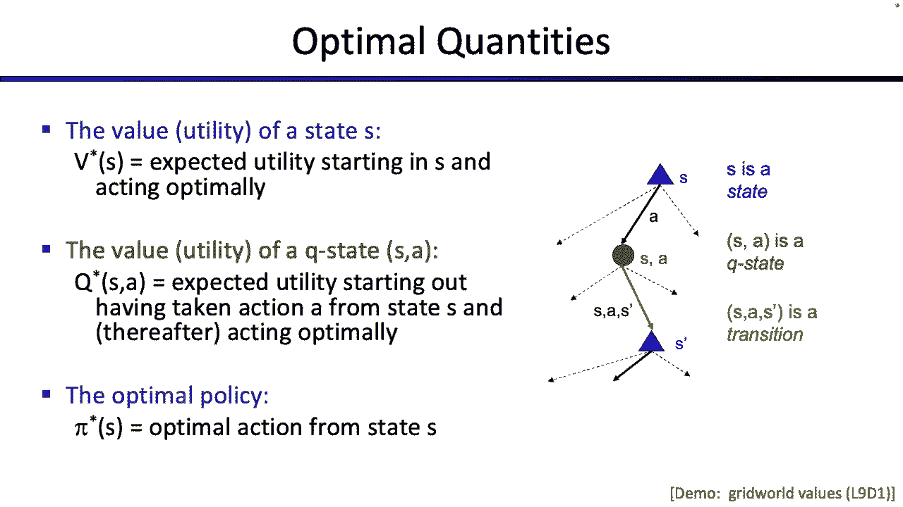
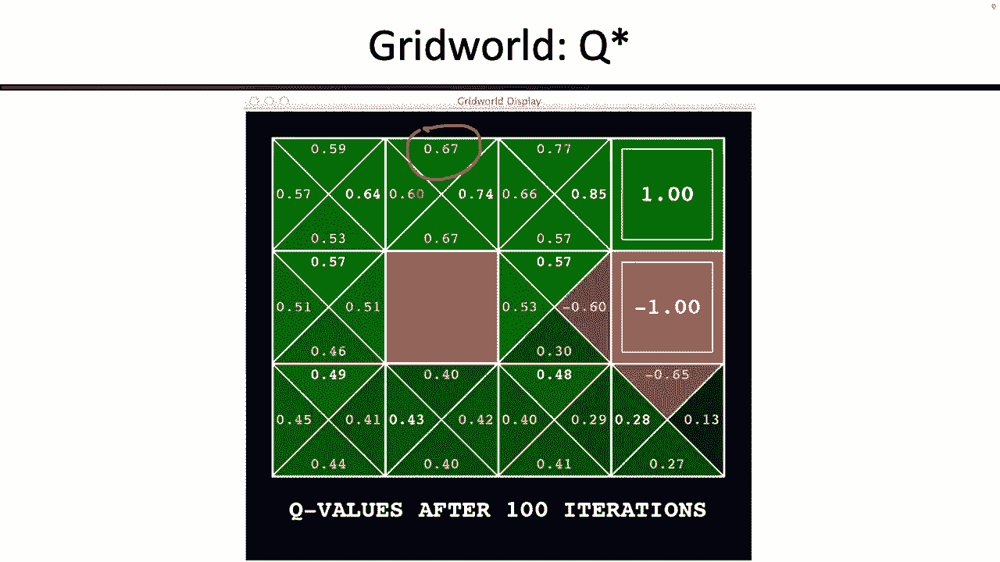
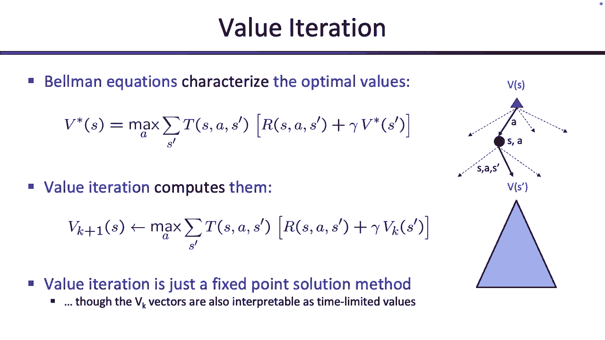
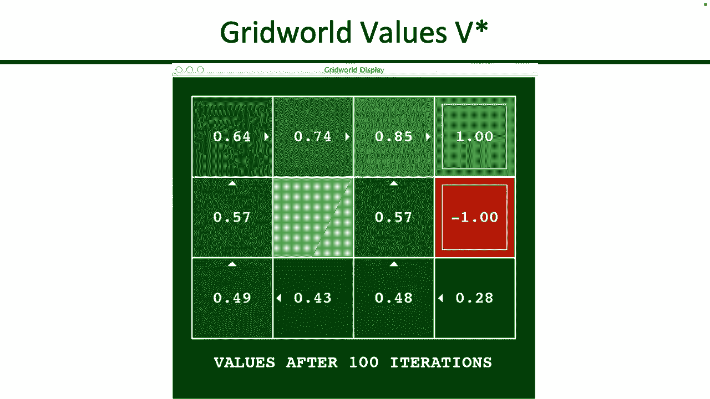
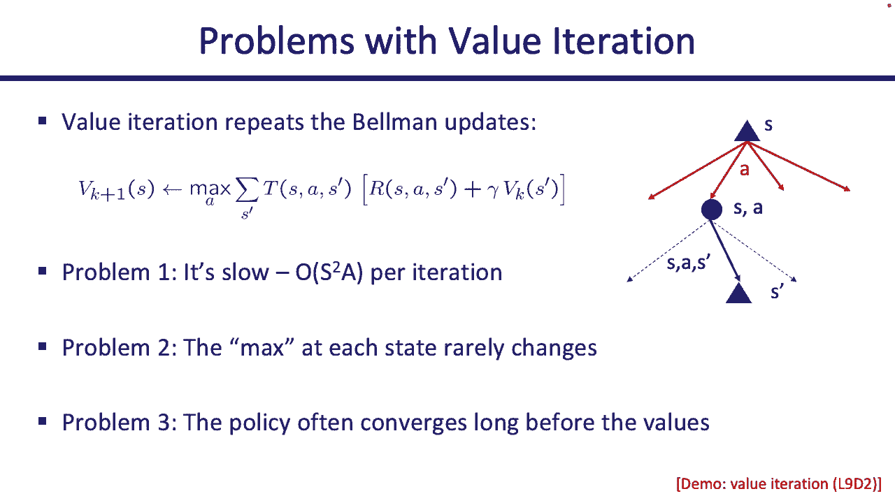
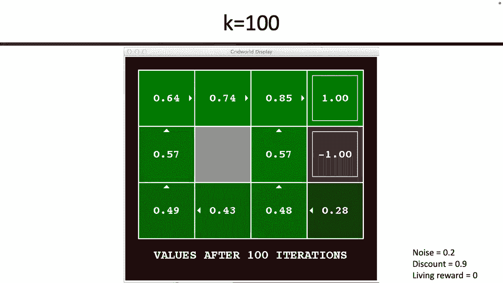
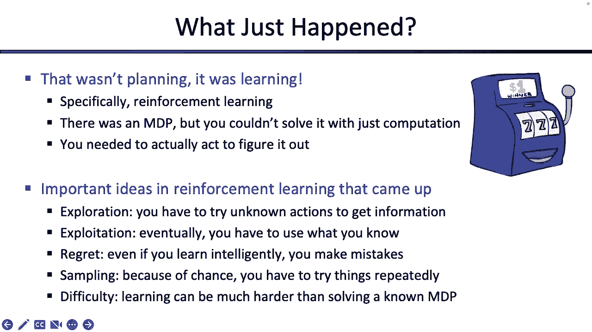

# CS188 伯克利最新AI课程--人工智能入门推荐 - P13：[CS188 SP23] Lecture 12 - MDPs_ Dynamic Programming - 是阿布波多啊 - BV1cc411g7CM

好的，现在是五点十分，让我们开始吧，好的，所以我们要完成马尔可夫决策过程，然后我可以休息一下，而斯图尔特下周会告诉你强化学习，快速回顾一下我们上次讨论的内容，所以我们说这是我们运行的mdp示例。

但一定要记住，这不是唯一的MDP，就像你看到赛车手一样，MDP与机器人、宝石和火坑无关，但这是一个运行的例子，我们在这里谈论的所有这些规则，这些都是网格世界的规则对吧，所以你不想出去想。

就像每个MDP都有火坑、宝石和活生生的奖励，向东南偏北移动，所以西方，这些都是网格世界特有的规则，但它们仍然有用，因为我们将经常使用这个例子，好的，所以希望这个例子很熟悉，网格里有个机器人。

机器人想要移动，但每次机器人试图移动，有一定的概率，机器人可能会顺时针移动90度，还是逆时针90度，所有这些都是网格世界特有的，您可以设计自己的mdp，用网格和左右，好的。

然后我们说你走的每一步都有一个活生生的谣言，一旦你到了其中一个，呃，加1减1平方，你还没做完，这样你就不会因为搬进广场而得到奖励，所以当你搬进来的时候，在那里你只得到你的生活奖励。

就像你每隔一步做的那样，只有当你采取特别行动离开这些州时，你真的得到奖励了吗，所以如果这个机器人移动到加一，机器人没有加一，机器人必须再呼叫一个动作出口，然后直升机进来把机器人。

这时机器人得到了额外的一个，这对项目很重要，你可能会喜欢一些，如果你忘记了，至少在我们特定的网格世界示例中，2。在得到奖赏之前，你必须得离开，很好，这是一个具体的例子，mdps是一类更大的搜索问题。

现在的想法是我们的行动不是确定性的，所以当你采取行动的时候，有一个概率分布告诉你在其他州着陆的概率是多少，对呀，每个时间步都可以这样表征，就像s a s素数一样，值集，就像你在一个。

是你作为Prime采取的行动，是你落地的动作，有与该事件发生有关的概率，那是最好的，与该事件的发生相关的奖励，这是最重要的，我们的总体目标是最大化我们预期的折扣奖励的总和，我们讨论了这些词的意思。

因为你不知道到底会发生什么，因为我们希望未来的东西价值低一点，奖励就像是所有奖励的总和，我们从所有的时间步骤中得到的，好的，希望我能复习上次的内容，记住，目标不是得到一系列的行动，因为这是不确定的。

如果我给你一系列的动作，你不知道会发生什么，所以我们通常需要一个政策一个政策就像我们的地图，告诉我们在每个特定的州该做什么，好吧，到目前为止，我们还没有真正告诉你如何计算策略。

但是我们刚刚告诉了你如何计算值，然后今天我们要连接，价值观和政策是如何相互联系的，但到目前为止，我们只是在谈论价值观，对于一个状态来说，有一个值意味着什么，该值是…的预期折扣奖励，从那个状态开始。

在剩下的时间里最优地行动，还有一个奇怪的东西叫Q值，如果你喜欢预期的最大值，你可以把Q值想象成这里的机会笔记，Q值是多少，Q值表示您处于一种状态，并且您已经选择了一个操作，这可能是一个糟糕的行动。

没关系，你选择了它，没有收回和Q值，就好像你处于这种状态，你选择了这个动作，你把它锁在里面了，预期的折扣奖励是多少，如果你在剩下的时间里表现最佳，所以你可以把它想象成已经选择了一个动作。

然后在剩下的时间里最优地行动，或者你可以把它想象成这些圣歌中的一个知道，当您从一个机会开始构建预期的X树时，虽然有点奇怪，但我们会看看它有什么用，希望我会复习，但阻止我，如果你想知道什么。

然后我们开始讨论如何计算，我想这些就是谈论的价值观，然后说它将把它与如何从这些值中获得策略联系起来。

对呀，好的，所以我们之前给你们看了这些值，对呀，所以如果你在这里看到点49，那是什么意思，这意味着如果你从这里开始，您获得的预期折扣奖励金额，在剩下的时间里最优地行动，应该是四点九很好，你以前见过Q值。

所以如果我喜欢，选一个数字在这里圈起来，我不知道六七，那是什么意思，就是说，如果我从这个州开始，我承诺向北走，没有收回，你得往北走，从国家开始到北方的预期折扣奖励金额，点六七。

好的，你看到了我们讨论过的所有这些不同的方程，它们都有一个特殊的名字，由于某种原因，我们直到今天才介绍，但在这里，你去，它们被称为贝尔曼方程，思考它们的一个非常有用的方法是。

我们如何知道如何采取最佳行动，你可以把最优的动作分开，或者最优分为两步的性质，那么你是做什么的，如果你想达到最佳，你得做正确的第一件事，所以在你接下来的时间里，你必须做最好的事情。

你必须做一些计算才能算出来，然后一旦你迈出第一步，在剩下的时间里，你如何采取最佳的行动，你一直是最佳的，那是什么意思，我们可以插入一些值，表示在剩下的时间里是最优的，所以它有点像这个递归定义。

你如何达到最佳，你做对了第一件事，然后你一直是最佳的，你如何保持最佳状态，你用这些方程，所以它是递归的，对呀，但这很有帮助，你可以这样想，好的，这是我们看到的方程，我再给你写一遍。

今天你会一次又一次地看到它，也许下次和下周会有一点，记住这些方程真的很重要，所以希望当你一遍又一遍地看到它们时，你可以开始从记忆或直觉中把它们写出来，好的，所以我会再做一次，所以我想知道预期是什么。

开始一个S并做最佳事情的折扣奖励总额，那里的星星说，我在做最好的事，好吧好吧，如果我是S，发生的第一件事是什么，我选择一个动作，我应该选择好哪一个动作，希望我能选择最好的，所以这将是所有动作的最大值。

好的，但一旦我选择了一个行动，我还没说完，因为我不知道那个行动会让我陷入什么境地，我不知道我采取那个行动会导致哪个状态，所以我必须取期望值，或者像加权平均数，这是机会节点，所以有机会说，嗯。

你可以在很多不同的州着陆，所以你必须考虑所有这些，按概率权衡每一个，所以这有点像加权平均数，在你可以降落的所有可能的状态中，好的，那么这个时间步长之后呢，所以你采取了行动，你已经选择了你最好的行动。

你随机降落在其他节点或其他状态，现在发生了什么，有几件事先发生，你得到即时奖励，所以因为你刚刚迈出的这一步，你得到了一些奖励，可能会很好，可能会很糟糕，我们不知道，现在你正值壮年。

从S Prime开始你做什么，我想在剩下的时间里保持最佳状态，我不知道该怎么做，但我确实有一个方程，或者我有一个符号，在剩余时间内最佳行动的符号，从s素数是s素数的v星，所以我可以把它加在一起。

我最不需要的就是，我想未来的回报对我来说价值更低了，所以我可能会在里面加一个折扣因子，这是伽玛射线，我会让这一切消失，让更好的版本出现在正确的地方，但这是一个重要的方程，你会一遍又一遍地看到它。

所以希望开始感觉很自然，好的，所以你已经看到了这个方程，我想说两种不同的口味，这就是你见过的人，这几乎就像一个方程组，对呀，就所有其他V星而言，你有V星，所以每个状态有一个方程，每个州有一个未知的。

你可以解方程组，它会给你一些最佳值，这并没有告诉你如何解方程组，它只是告诉你有一个方程组，如果你能找到这些最佳值，他们应该满足方程组，仅此而已，这只是一个方程组，他们告诉你如何知道你的值是否最优。

因为他们满足这个方程，但这里没有告诉你如何找到这些值，对呀，你可能会永远盯着这个，你不知道如何找到值，所以这就是我们引入一个算法的地方，它看起来几乎完全相同，它是完全一样的。

这个迭代器或这个叫做值迭代的算法，这是用来计算这些值的，第一个方程告诉你当你知道你有v星，你怎么知道这些是否是最佳值，比如什么让他们最优，这个方程使它们最优，你如何计算它们。

你得用这个迭代算法来计算它们，我们给了你几种不同的思考方式，我们今天再给你几个，如果你喜欢，好的，所以我们说了一种想法，这有点像展开预期的x树，所以建造所有深度的一棵树然后建造所有深度的两棵树。

使用一棵树的深度作为构建块，然后你用深度2作为构建块来构建所有的深度三棵树，你可以一路向上建造，得到越来越大的预期x树，所以如果你想期待麦克斯，这是一种可能的解释权利，我们今天给你们的另一个新解释是。

如果你熟悉数学中的不动点解，你可以这样想，所以这些V潜艇K，这是我上一次迭代中的，对V有一些估计，这可能是一个非常糟糕的估计，但这是一些估计，我要用这个估计来计算一些更好的估计，所以在时间步中。

每个状态都有一个，我想为每个状态计算一个V，在时间k加一，如果我用这种赋值来计算v k加1，它不会是正确的，因为我最初的DK是错误的，但希望通过使用这个方程，我可以减少错误，为什么我要让它不那么错。

因为我在这里放了伽马射线，所以我不正确的估计开始变得越来越不重要，我也在用方程的这一部分来采取正确的步骤，所以不管我的错误估计是什么，我希望它变得越来越正确，或者更接近真实值，随着我越来越多地申请。

期待下一层，采取越来越正确的步骤，所以如果你喜欢一个数学定义，你也可以这么想，这有点取决于你对吧，我们对值迭代的第三个定义，再说一遍，你不需要这三个，只要选择你最喜欢的对你来说最有意义的。

你实际上可以把v k解释为状态的值，如果你只被限制在K个时间步数，因此，作为一个S的价值和在剩下的时间里采取最佳行动的价值，这只是作为一个s的价值，并为k采取最佳行动，更多时间步长，对呀。

这个方程是什么，说，这个方程说，我想知道，处于s中并对k采取最优行动的价值是什么，加一个时间步数，嗯，我不知道如何计算k加一个时间步长的最优值，但我可以计算出K在一个时间步长下的最优值。

这将是这个时候的一步，我采取了行动，落在别的地方，那是一步，我得到了一个奖励，如果我用完了一步，我还剩多少，我有k加1，我只用一个，我还剩K，我如何表示k个以上时间步长的最优行为，我有一个方程。

我有一个号码，所以我把它插上，但这也是一种思考方式，你从剩下的零时间步数开始，使用您为零计算的数字，计算左一次步的值，使用左一次步的值，应用别人的时间步长，得到剩下的两个时间步长的值，以此类推。

以此类推，这是另一种思考价值迭代的方式，它们都是等价的，你可以选择你最喜欢的，但这是一个重要的算法，好的，好，好的，我想我有点没时间了，上次给大家看的，所以又来了对吧，嗯，所以我给你看几个有用的东西。

所以我再给你看一次，计算是什么样子的，好的，所以我们最后一次在这里，有几种方法可以做到这一点，有时MDPS足够简单，你可以通过看它来得到它，有时你实际上必须研磨出方程，我们在一个小角落里提供了帮助。

所以我们可以两个都试试，好的，所以让我们试着做V0，所以V零是你的起点，就像你的基本情况告诉你，如果你没有时间步骤，在一个州开始的预期折扣奖励金额是多少，喜欢酷和零时间步骤的表演，如果你有零时间步长。

你将得不到任何奖励，希望是对的，所以基本情况只是说在零时间左边的步数，你是否很酷，或者你是否在温暖中，或者你是否过热，你总是会被零卡住，对呀，你无能为力，没有时间留给你，好的，然后有人走到你跟前说。

而不是零时间步长，我给你一个怎么样，这是一个额外的步骤，你想用它做什么，嗯，希望有你的奖金，你想采取最佳正确的行动，所以你可以用方程来计算，基于所有V零的V一，有时你也可以通过，看着MDP看着图片。

所以我们可以在这里试试，希望这行得通，我想那很管用，所以看着这张照片，在那里你可以看着桌子，如果这样对你更好，对吗，最佳做法是什么，什么是最优的，您可以获得的最大预期折扣奖励金额，从酷开始。

一步一个脚印，你还有一个时间步，游戏结束了，你不能做别的，那么你想做什么，你想开慢一点吗？你想快点吗，希望你想快点，因为这给了你更多的回报所以甚至不用磨出方程，我可以算出，酷的一是二，因为如果我看照片。

我就像我是完整的，我能做的最好的事是什么，让我们快点，它给了我两个，总比慢慢来好，它总是会给我一个，我真的不在乎，我降落的地方，因为游戏在这一点上结束了，好的，暖和点怎么样，我想做什么。

如果我在温暖的状态，我可以慢慢来，也可以开快车，如果我跑得快，我会过热，得到负10，那很糟糕，但如果我在温暖中，我采取缓慢的行动，我可以得到一个，所以我能做的最好的温暖和再次，我不必做任何计算。

我只是看着它想了想，我意识到如果我被警告，我一次能做的最好的事，一步是做对一个，有时你可以看看MDP，自己把这些挑出来，有时你不能正确，没关系，你可以用方程式，如果可以的话，好的，如果你过热。

你什么也做不了，你只需要在你过热的状态下坐在那里，现在就被说，这里有点棘手，对吧，如果你还有两个时间步呢，好的，所以现在这看起来有点恶心，好的，你做什么，如果你还有两个时间步，嗯。

从Cool开始的最佳选择是什么，最佳预期是什么，在酷开始的折扣奖励总额，做正确的事情两个时间步，嗯，我不知道，我想慢慢来吗，我现在想快点吗，很难确切地知道该怎么做，或者像什么，如果你很暖和，你想做什么。

你想快点吗，你想慢慢来吗，这次没那么明显了对吧，也许你还可以把它挑出来，但如果你不想把它挑出来，这就是方程式派上用场的地方，所以我就做一个，然后如果你想看更多，你可以告诉我，但过了一段时间。

它们确实开始变得有点重复，好的，所以现在我想弄清楚，V二酷是，换句话说，开始很酷，我还有两个时间步要走，这是我能做的最好的事好吗，那么我该怎么办，我现在只有一步之遥，那是我当前的时间步数。

还是别人给我的奖金，我该怎么处理它，我想采取最好的行动，我可以，所以我必须拿最大值，我可以选择哪些动作，我可以慢慢来，所以我得写一个缓慢的方程，我可以走得很快，所以我应该为快速两个方程写一个方程。

因为有两件事我可以做，如果我慢慢来，它可能会让我陷入很多不同的状态，所以我得取加权平均数，在这种情况下，如果我很酷，我走得很慢，只有一个结果，我又慢下来了，所以我不必做加权平均，所以我得到了即时的奖励。

我得到加一个，那是我的即时奖励，然后我还有多少个时间步数，我只是用一个得到这个奖励，我总共有两个，所以我还剩下一个，我如何最佳地行动，如果我还有最后一步，我有一个方程，我有一个符号来表示这种观点。

一个很酷的，告诉我我能得到多少奖励，因为我开始了，很酷，表现得很好，好的，我之前已经计算过了，所以我不必重新计算，这很好，也许如果我想，我可以在那儿打个折扣。如果我认为这不重要，好吧，如果我现在走得快。

这是一个棘手的问题，因为，如果我跑得快，我有两种可能的结果，我得把两者加权平均，所以第一个发生的概率是5，第二个也发生在概率点五，现在我可以用我的加权平均数，如果我走得快，落地慢，我得到加2的即时奖励。

现在我只剩下一步了，我很冷静，那么我该怎么办，如果我还剩一步，那我就很酷了，我有一个符号，所以我就直接插进去很好，如果我很酷，我走得很快，其他可能性，我不会在凉爽的地方着陆，我在温暖中着陆，就是这一排。

所以再一次，我查过了，好的，我的即时奖励是两个，现在我少了一步行动，我在温暖中，那么我该怎么办，我在温暖中着陆，我还有一步要走，所以我把它写出来，好的，太好了，现在我可以开始插入，我知道。

所以在这种情况下，折扣系数是1，所以我不用担心伽马，有一个折扣系数，你只要把它插进去，但现在我可以插电了，好的，所以这很酷，哇太酷了，那是温暖的，好的，所以让我们去得到值，太酷了两个。

1等于2 1是1现在得到了值，我可以做一些数学，呃，这个怎么了，我漏掉了括号什么的，好的很好，那么一加二，希望是三个，二加二的一半怎么样，二加一的一半，那是什么，我想是三点五，阻止我，如果我错了。

希望这是对的，好吧，我说得对吗，我想我是对的，好的，三点和三点五的最大值是多少，三点五，所以V2的酷是三点五，你可以按照这个确切的过程，当你在虫子里的时候，然后你还剩下两个去插入V1值。

当你看到他们的时候，你会得到另一个号码，这看起来合理吗，我想你已经准备好自己做那件事了，如果我们给你一对很棒的，所以希望过一段时间它会变得有点机械，所以我不想花太多时间一遍又一遍地看。

但这个想法是在每一步，你应该对每个州都这样做，好吧，所以我做了一个，你可以在2。5度变暖，你可以做V3，v四，五，这就是你如何传播得更大更长，和更长的视野，看到更远的未来，好的，这就是价值迭代。

那是我几乎完成的，最后一件事，证据草图，所以人们现在倾向于问的一件事是，即使我这么做了，也许你不太相信这会收敛，你就像，这些值是什么，只是爆炸到无穷大，我只需要一遍又一遍地赚这个。

好像我真的不知道这什么时候停止，我不相信它会完全停止，在这一点上，这是一件很自然的事情，所以我给你一个快速的证据草图，告诉你它确实停止了，这不是正式的证据，但这是一种素描，所以有两种方法可以说服自己。

这些数字实际上在某个时候停止了，它们会收敛到某个值，一种方式有点傻，所以如果你真的很幸运，不知何故，你的树就像期待的那样，嗯x树只到深度m，所以说，换句话说，n次步后，之后就没有奖励了。

然后你就可以在N个时间步后马上走了，没有更多的奖励，所以你的价值观将停止改变，但那有点傻，这并不总是会发生的，更常见的情况或更一般的情况是，如果您的折扣少于1英镑，这是另一个地方。

我们认为折扣低于1是非常好的，好的，那么如果折扣小于1会发生什么，这意味着在未来的时间里，你所有的奖励都会被击中，就像越来越多的伽马因素，它们对你来说开始变得不那么值钱了，对吧。

特别是我可以想到两个时间步，我会考虑时间步骤k和时间步骤k，加一个，所以在这张幻灯片上，我们试图使用预期的最大值，呃，对s的v k so v k的解释，这是期望最大树的值，从s开始，展开k个时间步长。

这就是做对的人的意义，它是期望最大树的值，如果我从s开始，我展开k个时间步长，k的v加1怎么样，这是期望最大树的值，如果我从s开始，展开k加一个时间步长，那是k的v加s的一个的值，这两者有什么区别。

对你可能会注意到的一件事是如果你稍微斜视一下，这个S的V K，我们说这是一个深度为k的预期x树，但你实际上可以把它当成深度为k加1的预期x树，你可以加一个额外的图层，你会在那一层里放什么让它等价。

你只要在里面塞一堆零，这是同一棵树，所以k层树和k加一层树一样，其中整个底层为零，对呀，如果你带着预期的折扣奖励，就像这里的一些路径，你给它加零，但还是一样，所以应该是可以的，好的。

所以现在我看着这些树，现在都是k加1认为这个小把戏，我做了这些树有什么区别，对呀，我知道这里的最终价值将是一些预期的，奖励折扣金额，这意味着我要取树中的所有值，我喜欢取最大值和平均值。

一遍又一遍地重复最大值和平均值，最大值和平均值和最大值之间可能有什么区别，我拿着，唯一的区别可能来自底层，对呀，其他一切都一样，我正在从同一个州扩展同一棵树，唯一不同的是一旦我有时间。

步骤k加一个或左边的层k加一个，我在右边写上所有的零，我实际上把真正的价值观写得很好，这一层的值是什么，我真的不知道，但不管价值是什么，他们可能以某种方式被限制在正确的地方，所以不管最大值是多少。

最低值是多少，他们身上可能有一些束缚，对吧，你可以选择任何你喜欢的界限，这告诉你这两棵树之间的区别，只是底部的值，如果你取最大值和平均值，一遍又一遍地重复最大值和平均值。

它们最大的不同是我们的最大值是多少，这就是这两棵树之间唯一的区别，它们最大的不同是我们的max r max和0，好的，但另一件重要的事情是，在树的深处，东西真的打了很大的折扣，你得到了预期的折扣奖励。

所以上面的没有打折，但当你再往下走，因为我们接受了预期的折扣奖励，这里的东西折扣很大，如何将伽马折现到K，因为你的K层向下，所以这两棵树之间的差是伽马的k倍，不管那一层最大的奖励是什么，如果你看看这个。

你想如果K越来越大，会发生什么，如果γ小于1，k变得越来越大，这个值呈指数级收缩，它非常接近于零，这就是你通常知道这些值收敛的原因，有点像素描，我们不会喜欢测验，2。你压得太紧了。

这就是开始在这里是正确的，但很高兴知道，好的，所以希望，现在你确信这些东西在直觉上确实会聚，如果你喜欢把这个垫底，这些东西会聚的根本原因是因为伽马，事实上伽马射线的倍增，你每次都在用伽马乘以奖励。

最终这里的差异，伽马到k次，无论回报是什么，它只是缩小到零，所以东西真的很远，停止像指数一样重要，所以，最终缩减到零，基本上它是为了值迭代，所以关于它的任何最后的想法或问题，所以现在我们要开始换挡了。

但事情又会看起来很相似，所以你必须被锁在里面思考，我已经看到的Bellman方程之间有什么区别，和我即将看到的行李员方程，我们只是做一些轻微的调整，看看会发生什么，如果我的算法的输入和输出有点不同。

好的，所以也许这也是一个有用的时间来指出，当我们做价值迭代时，我们到底在做什么，我们正在努力，有人给了我们一个MDP，好的，他们没有给我们其他的东西，他们刚刚给了我们MDP。

他们说了最佳行动的价值是什么，来自此MDP中的每个州，就是这样，这是对的，我们甚至有一张照片。

这些是你想要的数字，所以有人递给你一个MDP，他们不会告诉你该怎么做，他们告诉你尽你所能给我最好的数字，好的，那是价值迭代。

现在，假设我们稍微改变一下，所以不是有人递给你MVP然后说，告诉我，你知道如果你采取最佳行动，价值观是什么，假设这个小机器人走到你跟前说，我有一张地图，我想让你告诉我这张地图有多好。

这张地图可能不是最佳的，显然这个小机器人想继续进入，就像厄运之坑或其他什么权利，也许这不是最优的地图，但我还是想知道这个政策是好是坏，别人交给我的，所以这就产生了一些不同的东西，这就是所谓的政策评估。

它看起来会很相似，但这里的主要区别在于，不是每次都试图采取最优的行动，我只是要按照任何政策行事，别人走过来递给我，好的，让我们看看到目前为止是什么样子，到目前为止我们在做什么。

我们的行李员方程涉及几个不同的选择点，对呀，那么我们的选择点是什么，所以如果我写出s的v星，你会再次厌倦看到这个，我的第一选择是我应该采取什么行动，2。我应该挑最好的，最后我有了一些加权平均数。

对但这里的主要选择点是我必须在行动中做出选择，所以当你在州，如果你用预期的最大值来思考，你得选择你喜欢的动作，所以在预期的最大条件下，你必须选择动作，如果你喜欢用贝尔曼方程来思考。

有一个最大值告诉你尝试每一个动作，写出采取该行动的预期回报，并选择最好的价值迭代，那是最好的事情，现在我们在做政策评估，现在我们不是在做最好的事情，我们只是要遵循别人交给我们的任何政策，所以现在。

而不是尝试所有八个不同的动作，然后挑最好的，你只是要过去说，好的，嗯，有人让我这么做的，所以我就这么做，看看有多好，这是个好政策吗，我不知道我们会试着找出，但重要的是，这简单多了，现在。

我不必尝试每一个动作，然后看看结果如何，挑一个最好的，我只需要跟着任何东西，有人叫我这么做，直觉上，从预期的最大值来看，这棵树应该小很多，因为这种分支因素消失了，那看起来像什么好吧。

所以我们也可以试着把这个写出来，对呀，所以让我们试着把它写出来，所以现在它不是S星，我只是改变一个小符号，它创造了不同的意义，现在是S PI的V PI是一项政策，有人交给我们，他们喜欢这样做。

不要挑最好的东西，按我说的做，那有多好，让我们想想办法，我应该采取什么行动，我以前的状态，2。我得说我要挑最好的，然后看看哪个给我最好的，所以我必须尝试所有的动作，选择最好的一个，现在我不必那么做了。

所以最大值消失了，不再最大值，最大值在那里，因为我可以选择行动，我想选择我最好的一个，但现在有人告诉我，你必须按照我的规定去做，所以没有更多的麦克斯走对了，这样我们就可以直接跳到我们已经采取行动的步骤。

我想知道这次行动让我陷入了什么境地，所以我还是不知道这次行动会做什么，所以我仍然需要取期望值，现在而不是s，s，prime，我要插上电源，他们让我在行动中插入的任何东西，五个S圆周率是策略。

它告诉你每个州应该采取什么行动，所以π{\displaystyle\pi}的s{\displaystyle s}告诉我从状态s{\displaystyle s}做什么，我只是在按他们的规矩办事，好吧。

当我着陆的时候会发生什么，就像以前一样，我做了什么就能得到一些即时的奖励，我刚做了，这有点恶心，我做任何事都能得到即时奖励，我只是做得好或坏，然后我想在剩下的时间里继续前进，不是最佳的。

就按他们叫我做的去做，他们叫我做什么，他们叫我做圆周率，或遵循此政策，在剩下的时间里，从s素数开始的圆周率，那口井有多好，我们有了一个新的表达式，所以我们就把它塞进去。

这看起来几乎和你前面看到的方程一模一样，只有一个区别，也就是最大作用量消失了，而不是选择最好的行动，我只是选择政策告诉我的行动，这是唯一的区别，这改变了我的算法，从计算最佳策略或最佳值。

有人交给我的一份特定保单的价值，让我们看看尼斯，呃，很晚了，这是对的，唯一的区别，麦克斯走了，为什么最大值没了，因为我不会选择行动，我让别人替我选择行动，我只是遵循他们的规则，也许这更有帮助。

或者也许这会更有帮助，如果我给你看一个例子，好的，所以这里有一个例子，所以这里有一个机器人，机器人得到了一份保单，机器人不是想弄清楚在这里做什么是最好的，它不是试图计算一堆最大值，说我可以选择行动，2。

我想挑最好的，没有权利，有人来到这个机器人面前，递给他们一份保单，上面写着永远向右走，机器人必须弄清楚这个政策现在有多好，你认为这是好政策还是坏政策？根据这张图片，我会说这是一个相当糟糕的政策。

但我们仍然可以评估它，并认为它是不好的，所以这个机器人会看到这个政策，想想这个政策会导致什么，希望计算出相当低的值，上面说这是一个糟糕的政策，也许你知道在另一个世界里这个机器人得到了不同的政策。

上面写着永远前进再前进，这是规定，对呀，在这种情况下碰巧是最优的，但机器人仍然可以计算它，现在没有更多的最大值，因为机器人只是跟着，纸上写的是什么，弄清楚这个政策有多好，预期的是什么，折扣奖励。

如果我遵循这个政策，总是向右走还是向前走，不再选择行动，他们告诉我行动是什么，我跟着它走，好的，如果你把这些插上，你得到了你所期望的，所以说，如果你总是向右走，价值相当糟糕，正如你所料。

因为你一直想把自己扔进火坑，你能得到100英镑的唯一方法是，如果你一直不小心把自己扔进坑里，然后我就能过桥了，有点奇怪，但是好吧，如果你总是很好地前进，这是最佳政策，所以你还是有可能掉进坑里。

我们不知道对不对，但似乎如果你向前走，你最终试图得到一百个，这不涉及麦克斯，那么我是如何计算这些值的，我们一会儿就给你看，但这些计算不涉及最大值，我只是拿了别人给我的保单。

并发现他们的政策有多好是正确的，这告诉我，向右走是相当糟糕的，向前看是很好的，好的，那么我们如何计算这些东西，对了，有几种计算方法，原来，这个等式看起来与您已经看到的值迭代更新非常相似。

这也意味着我们刚刚做的那些价值迭代更新，你实际上可以在这里做完全相同的事情，但现在唯一不同的是，而不是在每一步都使用最大值，使用我们修改的方程来评估给定的策略，所以这和之前的想法完全一样，我们说过。

好的，嗯，我真的不知道如何计算，你知道这里的vπ或v星，我不知道如何计算s的v pi，没关系，你仍然可以迭代你的方式，靠近，以及以前的所有解释，越来越大，期待最大的树，限时值。

比如v k pi是从状态s开始的值，对k个时间步长起作用，但不是最佳行为，根据圆周率作用，对呀，同样的解释在这里起作用，你也可以认为这就像一个不动点的方法，我们在时间k处进行估计。

然后在时间K的时候让他们变得更好一点，加一个，之前的所有解释，他们还在这里工作，唯一的区别是什么，唯一不同的是最大值不见了，因为我们没有试图遵循政策，最优策略或试图做最优的事情，我们只是按政策办事。

你可以在这里做的另一种有用的事情是，如果你看看前面的方程，所以我会把它拉起来，这样我就不用再写了，这是等式，对吧，它告诉我们如何把V派和其他V派联系起来，就像以前一样，这是一个方程组。

这些告诉我们什么时候我们有这个特定策略的值，如果你看看这个方程组，这个方程组是，我会说比最初的值迭代方程好得多，好多了，因为没有最大值，那个Max真的很烦人，记得我们要写两个案例并检查，都是。

这有点烦人，但在这种情况下，最大值消失了，因为我只是在遵循别人告诉我要遵循的政策，所以因为最大值消失了，这个方程实际上是线性的，只是一堆加法和乘法，对呀，全线性方程，所以说，这实际上只是一个方程组。

都是线性的，他们都和我们的朋友有关，所以如果你真的想，你可以把这些塞进去，matlab，或者任何你喜欢的线性系统求解器，它只是吐出一个解决方案，就像它给出任何其他线性方程组的解一样，最大值让它真的很难。

没有一个很好的方法来解方程组，到处都是麦克斯，但如果最大值消失了，事情变得干净多了，对呀，这里要注意的另一个有用的事情是，因为最大值消失了，计算这也变得更快，所以当我们回到这里，考虑计算价值迭代时。

就像这不好的地方，这有什么烦人的，事实上，每次我写一些值，我不得不考虑多个不同的动作，选择最好的一个，如果你用代码写这个，就像你在某个未来的项目中一样，你必须在所有的动作上写一个for循环。

检查所有动作，挑最好的吧，这有点烦人，但现在我不必再那样做了，对了，动作上的循环消失了，所以这也救了我，a的因数，我是运行时吗，所以最初我的运行时是这样的，我不会在这上面花太多时间，但有一个S的因素。

因为你在所有可能的s质数上都有循环，有一个因素，因为你必须检查所有的动作，并循环这些动作，你必须计算每个状态中的一个V，所以有另一个因子s的总和s的平方，权利，如果我只是在评估一个固定的政策。

我不是在经历和弄清楚什么是最好的行动，我只想弄清楚政策是什么，或者现在政策的价值是什么，我不必绕那么多，我不必重复动作，我还得遍历所有的州，因为我可以在一堆不同的州着陆，我还得计算其中的一个。

所以还有一个s的平方，但再也没有A了，所以它为我节省了一个因素，这是相当好的，好吧，这会给我最优的值吗，否，它只是会给我政策的价值，有人递给我可能会很好，可能不好，都可以像，总是进火坑。

这可能不是最好的政策，但它给了我一些政策的价值，你知道它快多了，所以这很好，好的，那是政策评估权，所以这就像是正则值迭代和正则贝尔曼方程的第一个变分，第一个变体是，如果我去掉最大值，我不再计算最优策略。

因为我不会选择行动，我只是要去做别人交给我的任何行动，这就像是第一个变体，我们有更多的人来，伟大，让我们在行李员更新上做另一个变体，所以这个和你刚才看到的不一样，这是另一种变体，这个叫做策略提取。

这就是我们要开始连接值的地方，这就是我们到目前为止所计算的实际策略，这就是你实际上是做什么的，好的，这就像贝尔曼方程的另一种变体，好的，所以在这个变体中，假设有人给了你最优的值，我不知道你怎么弄到的。

也许你喜欢，问一些像引擎之类的，或者一些非常聪明的电脑，这台电脑告诉你这些是在这些状态下开始的最佳值，并采取最佳行动，好的，那太好了，但这就像在最小化和搜索游戏树的例子中一样，对呀。

如果我问喜欢国际象棋特级大师引擎，比如我应该采取什么行动，引擎说像点五，那不是行动，这是一个数字，这不是一个很好的答案，对吧，那么我如何实际获取这些数字并将其转换为策略。

我如何看到这个数字并找出正确的做法，这是我们必须解决的另一个挑战，事实上，这并不是超级明显的，好吧，就像如果我告诉你好吧，你现在的状态，这个状态下的数字是8。9，你想做什么，我不知道，我该向左走吗？

我应该走右边吗？我该不该走东北偏北偏西？我真的不知道该怎么办，刚刚给出了一个数点89对吧，你可能会看到这个，然后说，我真的很想得到点九八，但这并不意味着北上是正确的做法，就因为你往北走。

并不总是意味着你得到了98分，你可能会落在负极的火坑里，所以只要看看数字，并不真的告诉你该怎么做，就因为你在这个点89，它没有告诉我哪个方向，我应该搬进来，实际实现这一点，不太明显，那么我擅长什么。

我真的不知道在这里该怎么办，但也许我可以写出一些行李员方程，看看我能不能，在那里我可以开始插入对我有意义的值，那么这意味着什么呢，我可以过去检查一下，所以好吧，从现在开始我真的不知道该怎么办，八九。

我有点想知道如何采取最佳行动，我还不知道该怎么做，所以也许我会开始写贝尔曼方程，看看我能不能开始插入有用的东西，贝尔曼方程是什么，贝尔曼方程说，无论我在哪里，都要采取最好的行动，好的，一旦我采取行动。

哎呀走开，好的，一旦我采取行动，我不知道我将降落在哪个州，所以我必须对各州进行加权平均，就像以前一样，一旦我到了那里，我有一些即时奖励，然后我必须在剩下的时间里表现得最好，从状态黄金开始。

在剩下的时间里采取最佳行动的价值是什么，哦等等，我有那些权利，有人在这里给我的，这些是在状态s开始并在其余时间内最佳操作的值，所以如果我需要在状态s中开始的值，在剩下的时间里采取最佳行动。

在这种情况下是最好的，因为我采取了行动，嗯，好消息是现在，我有这个，我不需要计算这个，已经有人递给我了，我还没有告诉你他们是怎么做到的，但如果你假设有人把它递给你，没有更多的猜测这个值是什么。

因为它就在你面前，对很好，好的，哎呀，让我多腾出一点空间，好的很好，所以这个方程现在似乎很有用，因为在这个方程有一个我们不知道的值之前，我们试着喜欢，把它们写出来，但是这个值你现在知道了。

就像从这个图中直接向上，所以你可以直接插进去好好使用，但你如何从中获得保单，不是很明显，好的，假设你真的想要一份保单，对呀，如果我写了这个表达式，你可能会觉得好吧，嗯，这似乎给了我最好的政策。

因为我检查了所有的动作，所有这些都是我知道的价值观，所以我可以直接把它们插进去，我得到了一个号码，它告诉我要采取哪些行动，只是你不想要号码了，我们到底想要什么，我想要最大限度地发挥这种表达的作用。

如果你想想我们之前是如何计算这些值的，还记得我们是怎么拿最大值的吗，然后我们快速检查，慢慢写表达式，写另一个表达式，更多动作，写更多的表达式，你为每个动作写了一个表达式，然后我给了你最好的数字。

我就像你知道的，快速前进，它是怎么变慢的，给了我们三个，速度很快，给了我们三点五，那就三点五吧，好的，但我不想要三点五，因为我不再想要数字了，我想知道是什么动作让我得到了3。5分，或者最佳值。

我们在数学中有一个术语来形容它，也许你以前见过，我们不想最大，因为最大值会给我们数字，这不是我们想要的，在这种情况下，我们想要实际的保单，我们想要一个arg max，arg max只是说给我一个。

导致最大值，Max给你号码，arg max给出了a的值，它给出了最大的数，我们必须纠正的唯一一种微小的差异，但剩下的只是规则的Bellman方程，所以我们就把它写出来了，我们认识到，通常在贝尔曼方程中。

你不知道这个值，你必须计算它，但在这种情况下，有人实际上神奇地给了你这些值，所以通过写这个贝尔曼方程，我可以通过使用PI Store来找出最好的方法，或者使用arg max，得到A的值。

它给了我最大的总数，我会让这一切消失，我会把它弄得很漂亮，所以换句话说，你必须像预期的那样做一步，就这样，你可以深入到树上，插入你已经有的这个小V星，然后你可以从中提取策略，这有点烦人，但它仍然有效。

这叫做策略提取，因为你在拿数字，你从这些数字中提取政策，唯一的区别是你仍然在做与之前相同的计算，唯一的区别是现在不仅仅是把数字拿出来，你会得到价值观或行动，比如最大化这些数字的值或动作，所以你没有禁食。

你做了一次计算，你确实慢了，在我们得到最好的数字之前，你做了一次计算，现在我们要问的是，这些行动中哪一个导致了最好的数字，如果你能把它提取出来，然后您可以从这些值中得到一个策略。

所以这是我们第一次尝试将估值联系起来，给我们数字，但我们知道我们最终不想要数字，我们想要政策，这是我们第一次尝试将这些点联系在一起，所以现在我们知道了，如果我做了值迭代，我可以一遍又一遍地查。

如果我运行策略，你知道吗，呃评估我跑啊跑啊跑，我得到数字，这是我们第一次将数字与实际政策联系起来，这很有用，好的，这还可以，有点烦人，我给你看一个不那么烦人的例子，所以想象一下，如果不是有人给你价值观。

他们给了你最佳的Q值，这些是什么，请记住，这些是在一个状态下开始的值，承诺一项行动，然后在剩下的时间里最优地行动，在做了那个动作之后，好吧，现在如果我问你，你又这样了，我请求你，最好的行动是什么。

现在计算正确是不是更容易一点，这些数字说明了什么，这些数字表明，如果你在这种状态下，你往北走，在剩下的时间里表现得最好，你期望的四个字的折扣和是7。6，如果你在这个州，你向东移动。

那么预期的奖励折扣总额为负，点六二以此类推，等等，现在看起来更明显了吗，这其中哪一个是最好的，我想是的，我可以看看这个，我可以说很好，我有四个选择我真的想要点89，我怎么得到点89。

是盒子里往西走的那个，所以这里最好的行动一定是向西走，因为这就是我在9。89中实现这一点的方法，我之前看到的，所以这容易多了，对，我不需要做任何预期的最大值，我只需要看看给我的数字。

认识到我现在能做的最好的事情就是承诺向西移动，然后在剩下的时间里最优地行动，这比搬到北方去表演或搬到南方要好，或者向东移动，最终在时间上行动，所以我只需要看看Q值。

看看我承诺哪一个行动能给我最好的整体价值，这是我的政策，所以这容易多了，事实上，这就是我们下周将要看到的，我们将开始越来越多地使用Q值，因为事实上，试图从价值观到行动是相当烦人的。

你必须运行一点预期最大值，从Q值到行动是如此容易，我只是看看数字，挑一个最好的，所以这里的课程很短，但所有这些都是在政策提取的想法下进行的，就像第二个变体，这个变体说如果有人给你数字。

不管是它们的值还是Q值，如何将它们转换为实际策略，准备好再来一次变化，然后我会停止抛出一个变体，你没事吧，这是最后的变体，这叫做策略迭代，这是我们的第二个算法，试图找出最好的策略是什么。

那么到目前为止我们在哪里，我只想确定一下，因为事情开始融合在一起了，现在我想对了，到目前为止，你已经看到了三种变化，你已经看到了最初的价值迭代，对呀，那真是糟糕的笔迹，好的，你已经看到了最初的价值迭代。

这个是什么，这是一个我想知道什么是最佳行动的价值，这是用来计算s的v星的这涉及到在作用力上做最大值，对，然后你把所有的状态相加，以此类推，等等，这一个你必须最大限度地超过行动。

你试图弄清楚处于一种状态的价值，并采取最佳行动，实际人数，不是行动，只是数字，好的，然后你看到了第一个变体，我今天给大家看的，那是政策反复，对呀，不是迭代，对不起，政策评价，好的，所以很容易把这些搞混。

什么是政策评估，这是我们的第一个变体，好的，这个变体说不再有S的V星，现在你在做s的v pi，意思是有人递给你一份保单说，跟着这个，告诉我你期望的折扣是多少，奖励的总和是所以现在没有更多的最大值。

你只要直接平均，什么CSU落地了等等对吧，最大值消失了，但你还在计算值，为什么最大值没了，因为有人已经把保单递给你了，你没有选择最好的行动，好的，然后我们看到了第三个变化，也就是策略提取，好的。

所以你看到所有这些名字是如何开始融合在一起的，因为他们也为我做，什么是策略提取，有什么区别，是什么使这成为现在的变体，这是一个变化，因为你不是在寻找数值，而是在寻找圆周率，你在寻找要采取的实际行动。

你是如何适应你在寻找行动的事实的，在操作上使用arg max，而不是动作的最大值等等，这些就是区别对吧，所以你有了最初的风味价值迭代，然后你有了第一个不同的口味，你去掉了最大值，然后说。

让我们继续评估某人给我们的政策，但你还在找数字，然后第二个味道是说如果你想要最好的政策，不是最好的价值，你应该用arg max代替，这些是我们吃过的味道，每一个都有不同的输入和输出，对。

但他们通常都遵循相同的表达，那就是我们现在所处的位置，好的，只是想确定一下，伟大，那么这些实际上是做什么的，我们会回到这些，我想再过一会儿，但请记住这些是我们的口味。

让我们看看我们是否能利用这些不同的变体来想出一些东西，比值迭代更有效一点，所以让我们回到最初的风味价值迭代，让我们想想是什么让价值迭代变得有点笨拙，比如为什么我们，为什么我们想要做得比价值迭代更好。

所以让我们仔细想想，好的，这是原味的，有几个问题，像经典值迭代，好的好的，那么这个有什么问题呢，慢吗，每次我这么做，我不得不考虑最大值，我们已经说过最大值使这个非线性，这很烦人，当我们做计算的时候。

即使是在一个小小的赛车MDP上，我们必须经历和写作，好的，如果我们动作快，然后是这个，那我们就慢了，然后我们必须喜欢这个，每个动作写出一个表达式，然后选择最大值，这有点烦人，你不是说。

如果我们不必那样做不是很好吗？但是为了得到最优的值，我们必须这么做，所以这是一个问题，那很糟糕，这里还有一个问题，那有点糟糕，当你一遍又一遍地这样做的时候，问题2和3有点关系，原来。

即使你检查了所有这些不同的动作并选择了最好的一个，通常情况下发生的是，最好的动作，是同一个吗，每次或大部分时间它很少改变，那么我们这么说是什么意思，让我们看一些图片来演示，好的，这里k等于零。

所以一切都是零，我们在做价值迭代，好的，我想让你注意的是，你以前见过这个，对呀，你看到这个估价了吗，从上次开始，你看到数字向外流血，这是你以前见过的，你以前没见过的，或者你还没注意到的，这些箭头。

这些箭头是什么，这些箭头告诉你政策是什么，好的，他们在那里，我把其中一个圈起来，好的，所以看看这些，看看它们是如何变化的，或者他们如何不变，当你继续前进，这些都是跑步的结果。

比如策略提取或运行arg max从这些数字中获得，你实际要买的保险是什么？好的，所以我们开始更新一开始它们会有一些变化，但像这样是迭代五次左右对吗，看看迭代5和6，八五六五六，你注意到这些了吗。

就像数字在变化，因为值迭代每次都会更新数字，意料之中的一步，但就像看箭头，他们不会改变5和6，无变化对，如果我做六和七呢，无变动，好的，数字变了，但错误没有改变，七和八怎么样，新变化，开始看到一个模式。

好的，无变化对，数字可能需要永远，沉淀到他们的最终价值，但请记住，我们从来没有真正对数字感兴趣，我们总是对实际的政策感兴趣，所以从右边有两个外卖，如果我继续下去，箭头基本上停止变化，像十次迭代，好的。

所以这里有两种重要的收获，第一个要点是动作基本上永远不会改变对吧，那是什么意思，如果你在这种状态下，五点六，你试图做价值迭代，你要做什么你的价值迭代会说，k等于10时我是多少，我要说的是时间等于11。

我该怎么办，我得做一个最大值，猜猜我的最大值是多少，所以我得做，当我往北走，当我往南走时的一些表情，当我往东走时的一些表情，当我往西走的时候的一些表情，你得做四次计算，然后挑一个最好的对。

但你在10到11到9岁之间注意到了什么，在所有这些领域，最大值，从这个计算中得到的值总是北的，就像看k等于九，哪个是从北边出来的，k等于十，这四个数字中哪一个出来得最好，北，k等于十一。

这四个数字中哪一个是北十二，北纬一千三百右，所以换句话说，你为什么要这么努力，计算南方，东部和西部为这个特定的州，比如你为什么要经历所有的动作，当动作看起来基本相同的时候，几乎所有的时间。

所以这就像是浪费的计算，做这一切都没有意义，因为极有可能，似乎北方无论如何都会表现得最好，所以不要浪费你的时间去看南方、东方和西方，在这种特殊的状态下，这有点像我们在这里讨论的第二个问题。

最大值基本上很少变化，最大值对应于你正在采取的行动，以及哪个数字使您的总体预期折扣最大化，奖励它基本上不会改变，所以当你做这个最大值并检查所有动作时，你在浪费很多时间，检查几乎肯定会不好的操作，好的。

这是一个问题，另一个问题是，正如你所看到的，在迭代五六次之后。

数字一直在变化，有点调整，但总体政策完全停止了变化，这些箭基本上是在，像六七次迭代，然而，它花了一百次迭代才使数字开始收敛，所以这似乎是个问题，我也是，比如我们为什么要浪费这么多时间等待数字收敛。

当我真正关心的是让政策趋同，好的，所以价值迭代好，但是出现了一些问题，所以让我们试着建立这些行李员方程的另一种风格，这样做得更好一点，所以这里有一个大致的想法，对呀，我们要做两件不同的事，再说一遍。

有几种不同的方式来看待这一点，所以我会这么说，我所知道的所有方式，你喜欢挑你最喜欢的，好的，所以一种思考的方式是我们有什么，到目前为止，我们有两种不同的口味，或者一堆不同的味道，有几个有用的。

有政策评估，这对政策评估有什么影响，说有人走到你跟前递给你一份保单，你给我数字，告诉我那些政策有多好，这就是政策评估有人给了你一份政策，递给你一张地图，上面写着“总是去把自己扔进坑里什么的”。

你还给了我号码，说着，那真是个坏主意，所以你从政策到价值观，那是第一步，好的，所以如果有人递给你一份保单，你可以给我一堆值回来，我们有一个方程，我们有一个算法，我们还记得什么，我们如何进行策略提取。

什么策略提取，进行策略提取，说我给你一个价值，就像我给了你所有的最佳值，你还给了我一份保单，这就是策略提取的值迭代，好的，所以我们有两种不同的口味，在我们所有不同的口味中，其中一个说，我给你一份保单。

你给了我一堆价值观，另一个说我给你一堆价值观，你给我一份保单，所以这似乎有点不合理，如果我一遍又一遍地交替做这些事情，那么我实际上可以在每一步上提高我的价值观，而不是提高我的价值观。

我可以在每一步都努力改进我的政策，所以我现在有点来回翻转，而不仅仅是在有价值的土地上工作，在那里事情会聚得很慢，而且很贵，我将从事某种政策方面的工作，土地和价值以及类似的交替权利，所以我要给你一个政策。

你会给我最好的价值，那我就给你这些值你再给我一份保单，我们要来回切换，来回切换，因为我们每次都在下面使用贝尔曼方程，我们来回切换，来回切换，我们正在写那些小的预期最大层，每次我们写这些。

政策中的价值观会变得更好，所以这是政策迭代的一个非常高级的思维方式，我有办法把政策转化为价值观，我也有一种将价值转换为政策的方法，所以如果我一个接一个地交替这些。

然后我实际上可以从一个政策到一个更好的政策，我给你的政策是正确的，你给我的值，我把同样的价值还给你，你用你的第二个算法给我一个策略，和，希望，我回到这里得到的政策比以前的好一点，我来到这里。

这是政策迭代的一种思维方式，这是一个非常奇怪的算法，把你的头缠在周围，但这是一种特殊的思维方式，对呀，好的，所以如果你喜欢，你真厉害，你可以坚持下去，如果你不喜欢，我再给你一个选择。

另一种思考政策迭代的方式是说，好的，这次用方程式向大家展示，好的，所以这是两个，和前面一样的两个步骤，所以第一步是政策评估，这是一个没有最大值的，因为我给了你保单你想告诉我它有多好对吧。

没有更多的马克斯伟大，第二个是策略提取，这是我们有Amax的那个，arg max告诉我们要采取什么行动，好的，如果你看对了这些，这基本上与价值迭代是一样的，只需一个小的变化，也就是当你在做评估的时候。

你跳过最大值，基本上，这是我们在这里做的唯一一种微小的改变，大多数时候你都跳过了最大值，这个最大值的跳过，对于与以下事实相对应的大多数评估步骤，然后我们之前看了看那些箭，箭很少变。

所以一个想法是不要浪费所有的时间，比如检查每一个动作，每次你都应该继续回收，不管你上次用了什么动作，不管什么政策，有人给了你，一遍又一遍地回收，然后偶尔政策可能会改变，所以运行一个全值迭代，那种更新。

满预期最大值，选择最佳操作以更新策略，但你只需要偶尔这样做，所以对于你的大部分计算，你要做廉价的事，这是喜欢的O的平方，便宜的东西，不涉及任何行动，只要采取你现在正在考虑的政策并改进它。

或者弄清楚它的价值，越来越接近它的价值，可能不是一个好政策，但从中产生了一些价值，然后偶尔当你想的时候，你去做这个昂贵的，这涉及到一个额外的因素，因为你在检查所有的行动，并得到一份保单。

然后使用新策略不断迭代值，所以另一种思考方式是，这基本上与价值迭代相同，但你要走捷径，而不仅仅是使用普通的经典风味策略，一直评估或评估迭代，你大部分时间，我将使用更便宜的政策评估方法。

它跳过了检查所有的动作，因为你知道行动几乎不会改变，所以你不妨大部分时间都跳过那些，然后偶尔当你想的时候，或者当你认为你准备好了，运行全值迭代，用最大值更新，在这种情况下，一个ARG最大值。

并获得一个策略，好的，所以两种不同的思维方式，我想他们基本上是一样的，但你可以选择对你更有意义的，所以有些人会认为这是政策转化为价值，然后返值到策略，这是一种想法，另一种思考方式是。

你基本上是在做价值迭代，但是大部分的步骤，你只是想跳过最大值，因为你知道最大值真的在变化，好的，这可能是MVP最奇怪的部分，我会说这完全是自然的，如果你必须回来盯着它看几次，你现在想知道的任何事情。

虽然，这是一张比较幻灯片，这有点，我想说在人们开始说，好的，你刚刚向我展示了完全相同的等式的四种不同口味，它们看起来都一样，那么为什么我们要花所有的时间看四个不同的版本，你有这种想法和感觉的原因是。

因为我刚刚向你们展示了完全相同的方程的四个不同版本，它们看起来都一样那是因为它们都一样，感觉到这是一件很自然的事情，你刚刚看到同样的东西四次不同的时间，因为你刚刚看过同一件事四次，唯一的区别是非常小的。

他们只是依赖于一些事情，比如我想要最优的政策还是最优的价值，在这种情况下，你需要一个最大值，还是我不想要最优策略，我只想要一份固定保单的价值，在这种情况下没有最大值，我不必选择最好的动作。

另一个区别是我想要的值，在这种情况下，我使用max，我想要什么操作，我说使用arg max对，但除此之外，一切都一样，所以这是人们开始感觉像你的时候，我只是一遍又一遍地看着同一件事，这很好，感觉很好。

尤其是一旦你开始习惯这个方程，你会开始注意到几乎所有的东西都是一样的，因为一切都植根于相同的预期最大值一层，向前看，我们已经做了一遍又一遍，一切都植根于同样的逻辑，如果我想迈出第一步，做最好的事情。

或者做第一步给我开的处方，然后最优地行动，在剩下的时间里按照政策行事，那都一样，所有这些都是基于完全相同的事情，也就是取你要降落的地方的平均值，当你降落在某个地方，获得即时奖励，然后一直走下去。

所以当你一遍又一遍地看到这个，你会看到不同的变化，你想开始收敛的东西，意识到大部分表达式是完全相同的，它们的加权平均值都是一样的，它们都有相同的折扣系数，加上未来的奖励，它们都有相同的瞬时奖励。

几乎所有的碎片都是一样的，一旦你克服了这个想法，所有的碎片基本上都是一样的，你可以开始放大或缩小，我想我不知道，开始观察差异，注意到差异就像，我用的是max还是arg max对吗，我需要最大值吗。

还是我试图评估一个固定的政策，所以一旦你看到什么是一样的，一旦你开始觉得这都是一样的东西，然后你就可以开始从更大的角度来看，看到不同，但在这一点上看这些东西是很自然的，就像你刚刚给我看了五次一样。

因为我刚刚给你看了五次同样的东西，好的，关于MDPS的任何其他问题或想法，是呀，不，我看到了更多的东西给你看，不要去还很好，所以这张幻灯片给了你两种方法，我们见过所有这些不同的味道。

他们做的事情都略有不同，但其中只有两个能给出最优策略或最优值，这就是价值迭代和策略迭代，是唯一两个真正给你最优策略的最佳值，所有其他的人都在做一些事情，比如评估固定的政策，或者从现有的值集中提取策略。

但这两个实际上给了你最优的政策，解决了你的MDP，如果你想玩得最好，这两者的主要区别在于价值迭代，你在价值地工作，你所做的一切就是更新数字，这就是我们在政策迭代中所做的，你不一定只是在处理价值观。

你也要一直与政策合作，所以你要选择一个政策，把它修好，一遍又一遍的策略迭代，看看有多好，或者一遍又一遍地迭代策略评估，看看这个固定政策有多好，然后试图通过一步看来改进政策，然后一旦你有了改进的政策。

再运行一堆政策评估，看看它有多好，然后再更新一次对吧，所以你既在政策领域工作，也在价值领域工作，希望通过在两者之间切换，你不必每次都检查最大值，浪费所有的时间，你知道没用的计算东西。

问题是你如何知道策略迭代是最优的，这是个好问题，尤其是如果你只是偶尔做一些改进，所以很难让自己相信这个是最佳的，嗯，我想说最干净的方式是正确的，我们没有证据，所以你不必太担心。

但我想说最干净的方式是看到这是可选的，注意到这里的这个基本上是值迭代更新，好的好的，这不完全是价值迭代，更新，因为您正在做一个arg max，所以你试图得到一个政策，而不是实际的价值，但如果你看这里。

我们在行动上采取了最大限度，所以这意味着我们选择了最好的动作，我们也在看各州的所有结果，所以这基本上是预期的一步，max，它是一个值迭代更新，因为在策略迭代中，您仍在运行一堆价值迭代更新。

你只是做得不那么频繁了，这就是你们仍然在正确的政策上趋同的原因，但那是一个非常粗略的草图，所以你不必完全正确，好的，你还有什么想知道的吗，我明白了，看起来完全莫名其妙，这是公平的，是啊，是啊。

绝对公平的感觉，在这一点上，所有这些都开始融合在一起，你可以回来看看这些，试着弄清楚，到底有什么区别，有人给我一份保单的输入是什么，还是有人给我一些价值观，我应该给别人什么回报，我要把数字还给你吗。

还是我把保单还给你，这些都是核心差异，使这些不同的味道，对呀，好的，这里有另一个总结和另一种肯定，他们看起来都一样，这取决于输入是什么，就像，别人递给你的是什么，还是有人什么都不给你，你想归还什么？

所以如果有人给你一个没有政策的MDP，只是说给我最好的东西，我能做的，或者给我最优的价值，那么您需要使用这两种迭代方法中的一种来获得最优策略，或者最佳值，在这种情况下，人们不给你任何东西开始。

告诉我什么是最好的，但如果有人真的走到你面前说这是一项政策，告诉我这有多好，别跟我说最好的政策有多好，只要告诉我这个政策有多好，这将是一种使用策略评估的情况，哪一个是那么好，你可以回头看看方程。

政策评估是最大值消失的评估，为什么最大值没了，因为有人给了你一份保单，然后第三种口味，或者我们上次说的味道，如果有人给你一堆价值观，它们可能是价值观，它们可能是Q值，但有人给了你一堆价值观。

就像数字一样，他们问你这些数字，我该怎么办，最好的办法是什么，这就是策略提取的情况，哪一个是有arg最大值的那个，为什么那个有arg最大值的，因为我实际上想要的是政策而不是数字作为输出。

所以我得向前看一点，但最终我以我以前见过的数量买下了他们，或者有人给我的数字，我可以把这些数字转换成保单，这基本上是MDPS的结束，所以问我最后的问题，否则我就给你们看最后几张幻灯片，好的。

这也是今天最难的部分，所以剩下的就有点走下坡路了，所以坐下来享受一下，呃，赌场小游戏，然后我们都回家，除非你有最后的MVP问题，是啊，是啊，是啊，是啊，这是个好问题，就像，策略提取如何。

这是一个有弧度最大的，你拿出来的地方，取一些值，把保单拿出来，这与政策改进有何关系，这又像是，你是如何从数字中获得政策的，我想说他们基本上是一样的，所以在这两种情况下，都有人给了你价值。

它们可能是最佳的，也可能不是最佳的，但你可以从这些数字中得到一份保单，所以这一步，他们称之为政策改进，它基本上和策略提取是一样的，如果你看方程，他们是一样的，它们都使用arg max。

他们都在检查所有的A，所以政策提取基本上是政策改进的第二步，我会说，呃，否，抓到你了，是啊，是啊，这是个好问题，这就像当你在做策略迭代的时候，或者真的像任何迭代算法一样，你只考虑第一步是对的。

所以这绝对是一件事，这很难把你的头缠在一起，我会说，嗯，但我会说是的，你总是在考虑眼前的第一步，所以当你做这些方程的时候，等式的这一部分总是代表你面前的步骤，你从来没有提前两步思考，因为发生了什么。

领先两步还是领先三步，或者提前四步，或者将来的任何地方，所有这些都已经被捆绑到这个VK中了，所以你看到的只是第一步，然后第一步之后的任何东西都被这个V K捆绑，随你喜欢，在这个迭代中越陷越深。

这个k越来越大，所以更多的未来被封装在K中，大问题，虽然，好的，对哎呀来说绝对是一件常见的事情，绝对是一个常见的绊倒，我们基本上在那里，好的，所以我有十四分钟，我可能一次都不需要。

向你展示一点关于强化学习的知识，所以这是下次的预览，所以我们只是坐以待毙，MDP与强化学习有何不同，我们下次要看什么，好的，这就是你，你是机器人，你走进这里就像走进赌场一样，这是一个很有趣的赌场。

因为只有两台老虎机，有一个蓝色和一个红色，好的，蓝色老虎机，如果你把它拉出来，你得到一美元，我最喜欢的老虎机，我很想玩，又有一台老虎机，就是那个红色的，当你拉这个的时候，有时你得到两美元。

有时你得到零美元，好的，好的老虎机可能不好，我们得看看，但这是我们的类似场景，好的，现在你可以把这个画成一个mdp，因为你是经纪人对吧，你在采取拉蓝色或拉红色的动作，你在。

你想最大化你预期的折扣奖励的总和，所以这可以表述为MDP，看起来有点尴尬，我想说这个mdp比你在这里看到的要简单得多，很多这样的，为什么会有两州一胜一负，它只是在那里喜欢，让MVP有点合身。

但你对这个MDP的直觉是正确的，对呀，这是一个非常简单的MDP，好的，所以cdp想把它画出来，喜欢写所有的概率，你得把它弄得更复杂一点，但真的没那么复杂，对呀。

所以你在这个MDP中唯一的选择点是你拉蓝色，或者你拉红色，这是你唯一的选择点，好的，所以假设我们给你MDP，我们给你所有这些数字，特别是我想说这里看到的最有用的数字，我要挑一种不同的颜色，好的。

这里最有用的数字是，如果你拉红色的杠杆，你以2。5的概率拉动红色机器，你得到零美元，概率为7。5，你得到两美元，那就是红色老虎机的故障，现在我们不会像赌场一样走进来开始拉杠杆，不过，对了。

我们要提前考虑这个问题，假设这是红色的概率分布，你知道蓝色的总是会给你一美元，你认为保单的价值是什么，总是拉蓝色，那么预期的折扣奖励是多少，假设你有一百个时间步数，没有折扣，上面写着，百步不打折。

所以你被拉了一百下，对呀，如果你每次都拉蓝色，你打算带走多少钱，希望是一百美元，每次投票都有一个，拉百倍百元，对呀，如果你把红色的老虎机拉一百遍，你想带走多少钱，我肯定会说一百五十对吧。

因为25%的时间你什么也得不到，百分之七十五的时候你会得到两美元超过一百次拉，你希望得到大约150美元，所以如果你提前计划你在考虑老虎机，你可以提前考虑这些值，最终你意识到玩红色比玩蓝色好。

所以当你走进老虎机，你只会一直拉红色，好的，重要的是，你只需脱机解决这个mdp，我们从来没有走进这个赌场，我们从来没有拉过任何杠杆，我们只是提前想好了，根据给我们的游戏规则，我们意识到玩红色比玩蓝色好。

所以我们知道如果我们玩这个游戏，我们会停下来，但这一切只是我们提前思考的想法，我们在现实世界中从来没有做过任何事情，到目前为止，我们看到的所有搜索算法基本上都是如此，总是我们坐在这里。

思考深入的思考和提前计划思考，最好的办法是什么，但我们从来没有真正走进赌场玩任何平底鞋，对呀，所有这些都是提前思考，没有演奏任何东西，我们刚刚得到了我们的模型，我们想了很久，然后我们输出它。

我们认为最好的政策是什么，现实生活中什么都没发生，所以让我们看看如果你真的进入现实生活开始玩东西会发生什么，好的，所以现在我们要进入这个真正的假赌场，玩真正的假老虎机，好的，所以我们开始了。

我们要拉红色，得到了两元红，两块钱，我们的政策是什么，我们的政策总是闪烁其词，所以让我们玩红色，一些更多的红色红色红色，好的很好，我们玩了很多，所以我们放了十遍，我们带着12美元走了多少钱，好的。

所以我们在离线规划中得到了十二美元，当我们想到这件事的时候，在我们希望得到十五个之前，但请记住15是一个期望值，平均来说，我们以为我们会得到十五，当我们真的去拉，我们有点不走运，我们得到了12个。

事情就是这样，这是比赛的实际结果，以前当我们提前计划的时候，那是我们在想的，所以这是两件不同的事情，你在这里想过你真的去玩了不同的东西，那是MDPS，那就是你提前解决了MDPS和任何其他搜索问题，好的。

我们现在再来一次，假设你走进像新的和改进的CS，有一天，一个赌场，现在就像一个普通的赌场，他们不会告诉你得到这两个的概率是多少，或者得到零井的概率，所以现在你的生活有点困难，你不能提前计划。

在走进赌场之前想出政策，因为你不知道这台红色机器装的是什么，你不知道这是不是一台好机器，坏机器，你不知道对吧，所以现在我们提前做的所有这些想法，我们就像，哦，布鲁会给你一百块，红色平均会给你150。

你不能再那样做了，因为你不知道概率，此MDP未完全定义，所以你不能提前解决，那么我们该怎么办，我们不能提前做任何计划，我们不能提前思考，然后想出一个政策，我们得直接走进赌场玩这个游戏，弄清楚是怎么回事。

所以让我们做吧，我们到赌场里去玩老虎机吧，好的，你没有，你没有提前解决政策，你只是要玩这个东西，从零开始的寒冷，好的，所以让我们一起抽签吧，谁想拉蓝色，谁想拉红色，好的，我看到一对夫妇的手红色。

让我们拉红色，这告诉我们什么，所以说，我们怎么看，我们应该放弃红色吗，也可能这是一个哑弹，这是罕见的零吗，它总是零吗，我不知道我们该做什么，好的，很多红色，让我们再做一次红色，我们不是很确定。

是不是死了，所以我们要继续尝试零，哦好吧，嗯，那可不好，是不幸的机器吗，我们只是运气不好，我还不知道，好的，那么我们做什么蓝色，现在是蓝调，红色，好的，你还是想看到红色，是红色的零，哦。

你现在感觉怎么样，好的，让我们做，你想做什么蓝色，它们是红色的，好的，我们还是想要红色，当然可以，好的，两个，好的，所以也许红人开始，你知道，我们验证了，我不知道对吧，所以我们要多玩一点红色，好的。

让我们去红色红色红色，红红的红红的，好的，十个红色，好的，现在，基于你所看到的，你还没有提前解决这个问题，你只是边走边想，你想做什么蓝色，好的现在来点蓝色红色，好的，如果是红色的，之后你可能想和我谈谈。

但就像在这一点上投票蓝色，似乎是做正确的事情，所以如果我们试着喝几杯红葡萄酒，我们没有从中得到很多钱，这个红色的机器可能是个哑弹，它可能不会给很多两美元，所以也许我会放弃红色，开始拉蓝色。

我再也不会回来看红色了，在剩下的时间里，很好你刚才所做的就是我们下周要讨论的内容，所以当你走对的时候你就会学到东西，这不是提前计划的，这是你真的进了赌场，玩真假插槽，拿出真正的假钱来了解发生了什么。

所以这是强化学习，强化学习不同于我们到目前为止所做的一切，因为你没有提前思考，然后去赌场玩你知道的最好的东西，你真的要马上去赌场，你在边走边玩，你在了解这个世界，当你实际采取行动时，对呀。

你不能提前弄清楚这一点，因为你没有所有的信息，所以这里有几个有用的想法，对呀，让我们一个一个地过一遍，所以当我们走进赌场的时候，你们大多数人都想先拉红，你为什么要先拉红，这是第一个想法，对呀。

你想先拉红，不是因为你认为它是赢家，你不知道红色是不是赢家，你必须走进去才能知道你必须拉它才能知道，所以你想拉右边，因为你不知道，所以通过拉扯，你希望得到一些关于红色是好是坏的信息。

对这就是拉红色背后的想法，我想你不想拉它，因为你认为，你想拉它，因为你想知道它是如何工作的，那就像探索，你在探索红色会发生什么，就在十杆之后，你们大多数人都想要蓝色，那你为什么要在十拉红色后换成蓝色呢。

那是因为最终你认为你已经学会了所有这些，有关于红色的了解，你就像，我很有信心红色是哑弹，我不会把更多的时间浪费在红色上，所以我要换成蓝色，因为我想我现在所知道的，蓝色更好，那就是剥削，对呀。

最终你不再明白，或者你最终你认为我知道什么，我需要知道所有这些未知的参数，我很确定红色不好，所以我打算在剩下的时间里换成蓝色，那就是你爆炸你所知道的来最大化你的回报，也有后悔的权利，就像回到这里，向右。

强化学习中的遗憾，和你在现实生活中所想的后悔并不完全一样，但如果你想想，你知道的，就像你走出赌场，哦伙计，我真希望我不用玩十次红色，我真的很想一直拉蓝色，我会得到更多的回报，如果我尝试红色。

所以就普通的钱而言，玩红色是个失败者，就像你必须损失一些钱才能玩红色，但当你折红色的时候，你确实得到了报酬，对呀，你得到了什么报酬，你没有得到金钱报酬，你在知识上得到了回报，因为你拉了红色。

这不是最好的办法，而是通过拉红，你知道什么该做什么不该做，后来你就能利用这些知识，所以你是为了科学而演奏的，你播放它是为了弄清楚发生了什么，然后最终你发现蓝色是更好的选择，但你还是希望你不必那样做。

所以强化学习的遗憾，在数学上，在一个理想的完美世界里，我就不用拉红色了，永远正确，我本可以直接去蓝色的，但我不得不拉一些红色来弄清楚一些事情，所以遗憾的是，如果我采取最佳行动，我会做什么，就是直奔蓝色。

如果我神奇地知道这样更好，实际发生了什么，我不得不拉一些红色，获取一些信息，然后切换到蓝色，所以这是遗憾对吧，我们还学到了什么，我们学习取样，就像取样一样，即使你认为你会得到一些平均数字。

现实中的结果是这样或那样的，所以我们之前说过，就像你提前想了又想，你说平均来说，我会得到150美元，你可能不会得到确切的150，你可能会得到其他号码，就像在这种情况下，你看到零，零，零，对。

你们中的一些人在这里放弃了红色，那是合情合理的，但你们中的一些人想继续前进，你想继续做什么，因为这些零只是分布中的样本，你想要更多的样品来更自信，那个红色是哑弹，或者红色是赢家，你运气不好。

所以取样的想法是，即使事情发生得有点平均，我们喜欢在期望中计算事物，在现实中，当我们去玩这些老虎机，结果总是两个或零，我们必须考虑，给定这三个零，我们有多自信，这是一个哑弹，我们还想尝试多少对吧。

这些只是样品，它们实际上不是期望值，你不可能得到那些，好的，最后我要说的是我还剩一分钟，就像这可能是最简单的MDP，我们已经给你看了一个星期了，它基本上有一个状态，你只要拉蓝色或红色。

就像有史以来最简单的MDP，你甚至不必知道MDP就能解决这个游戏，如果我给你所有的概率是对的，但当我把概率拿走，这个游戏变得更难了因为你必须好好想想，我还想拉多少才能对红色充满信心，就像。

即使我拉了十次，这可能是一个幸运的任务，我只是很不走运，比如这背后的概率是什么，你知道的，我想什么时候切换到，在我放弃之前，我还想尝试这两个，对呀，像这样的问题很难解决，只是因为它拿走了概率。

所以我们下次要看看怎么处理这个，但是强化学习变得更加困难，当你不知道一切要提前跑的时候，你必须边走边尝试，好的，也是，这都是假钱，所以不要来问我要钱，好的，我只有这些，所以几周后见。

下次你会有斯图尔特在这里。

