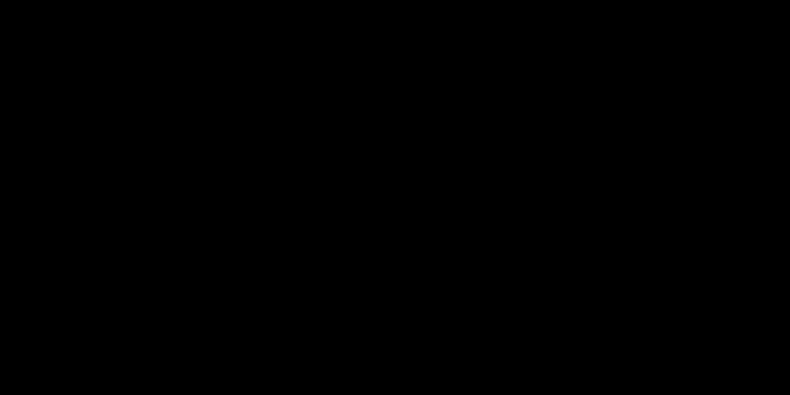
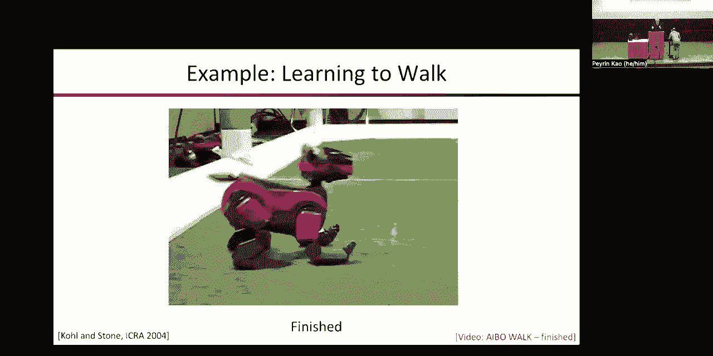
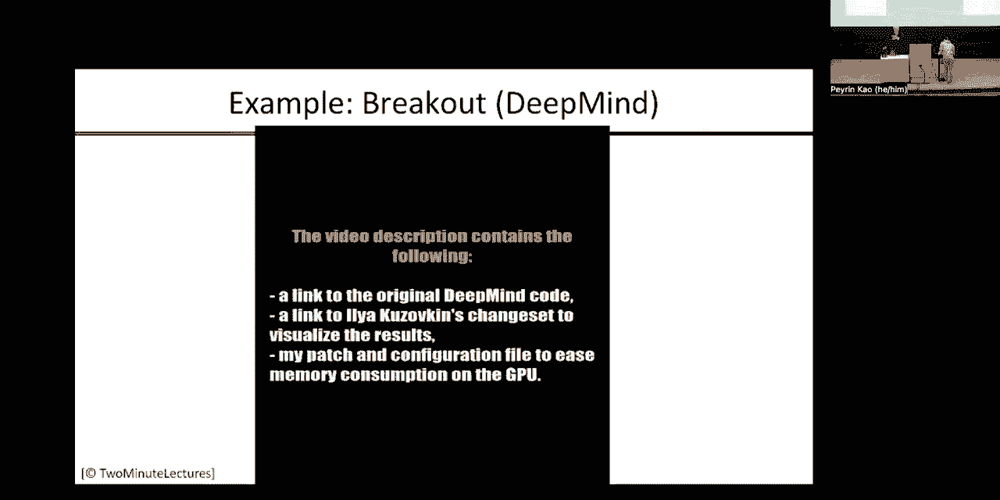
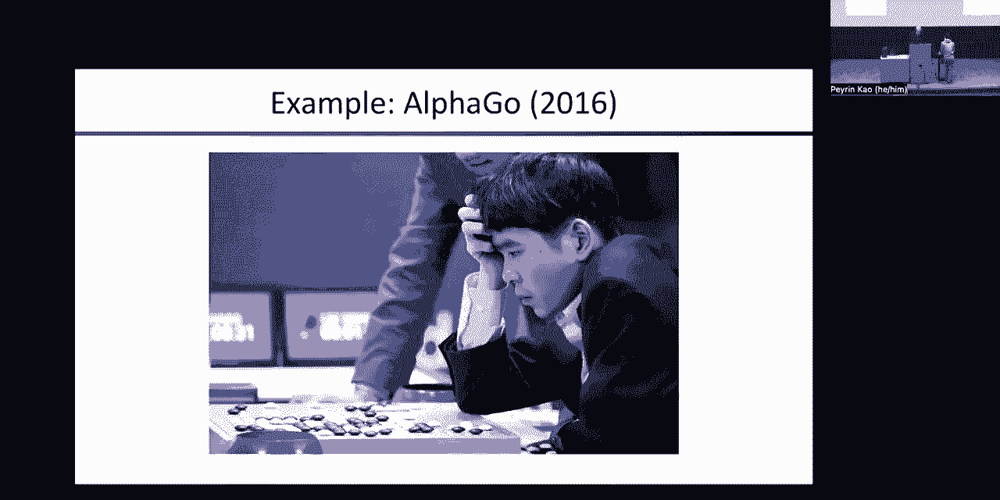
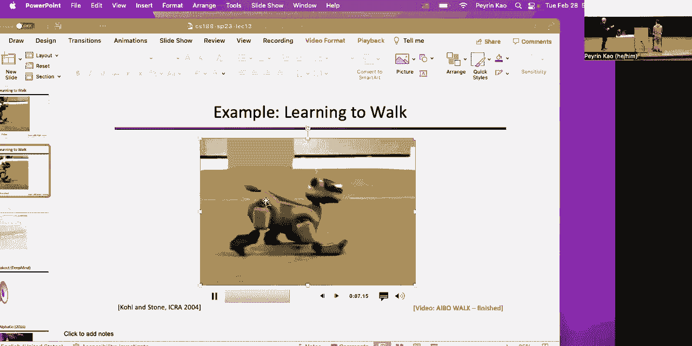
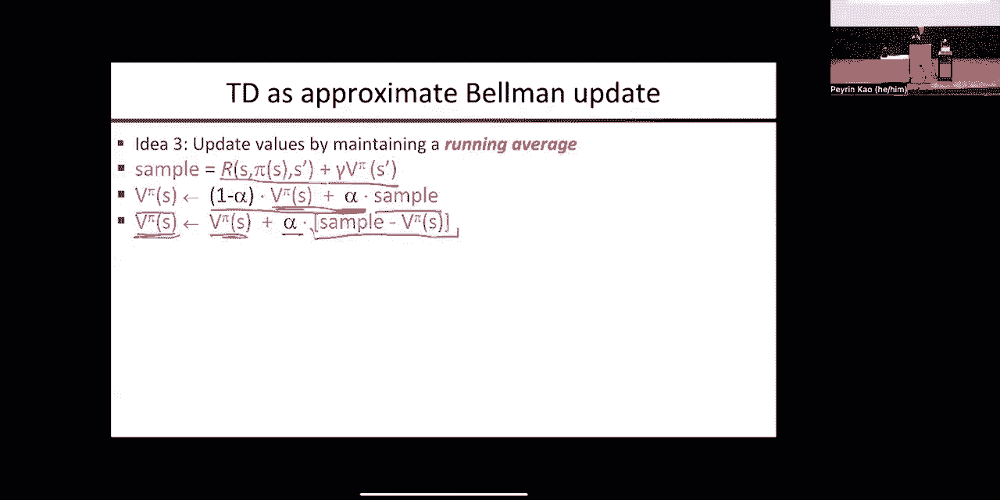

# CS188 伯克利最新AI课程--人工智能入门推荐 - P14：[CS188 SP23] Lecture 13 - Reinforcement Learning I - 是阿布波多啊 - BV1cc411g7CM

所有的权利，伟大，嗯，谢谢你冒着天气来参加面对面的讲座，嗯，所以今天我们要讲强化学习，从父母开始，MDPS讲座，在那之前，几个公告，首先，我上周今晚去了约翰·奥利弗那里。

所以他实际上有一些关于聊天的明智的话要说，gpt，世界上到底发生了什么，当人们吸收所有这些东西，嗯，他说了很多F字，以防你想听这个，在小孩子周围，或者在办公室里，什么的，嗯，从我过去两周的旅行中，嗯。

我很高兴地说拉丁语，美国人，和加勒比国家宣布支持一项条约，至少禁止某些类型的自主武器，那是我的哥斯达黎加之旅，和我的荷兰之旅，美国和中国，和大约50个其他国家，到目前为止。

可能有60个其他国家正在提出一项自愿行为准则，这比荣誉守则有用得多，嗯，负责任地使用自主武器，但根本不提议禁止任何东西，只是希望只有好人才会使用武器，他们只会负责任地使用它们，据我所知。

这在战争史上从未发生过，所以我对此有点不高兴，我是说总比没有强，但我认为这是故意阻止，世界上很多人想做的事情，就是实际上禁止武器，嗯，在一个更平淡无奇的音符上，3。下星期一晚上是期中考试。

关于艾德的细节还有很多，嗯，我们会开始宣布房间，谁应该去哪个房间之类的，呃，我们尽快，好的，呃对，所以强化学习对吧，好吧，是什么，这听起来是对的，你在从强化中学习，加固，意思是积极的或消极的奖励，惩罚。

嗯和嗯，的，我们通常认为，你试图解决一个，mdp，你不知道那是什么，所以我们到目前为止的MDP算法，值迭代，策略迭代作为输入，就像你知道星星把搜索问题作为输入，嗯，但如果你不知道MDP是对的呢。

你的行为如何，这就是强化学习的意义所在，学习发生在，对你所到达的状态的观察，所以当你做事的时候会发生什么，也从你做事时得到的回报中，这带来了许多新的东西，我们到目前为止还没有谈论过。

到目前为止我们所谈论的一切，基本上已经，你知道有个问题，解决它，然后基本上闭着眼睛执行解决方案，对呀，嗯，所以第一件事显然是真的，如果你不知道你所在的MDP，你得尝试一些动作，你不知道他们的结果。

我是说，以为你就在那里，你就在初始状态，你知道你处于初始状态，你知道在那种状态下你可以采取什么行动，但你不知道他们去哪里好，你能做什么，你别无选择，只能做正确的事。

甚至什么都不做实际上是其中一个动作可能会让你回到同样的状态，但当然这可能不对，世界可能会把你推向另一种状态，无论如何，所以你必须尝试未知的动作来了解MDP，呃，找出奖励在哪里，找出过渡模型等等。

你必须平衡这和剥削，利用意味着利用你所知道的试图获得奖励，所以平衡的作用，我们将在下节课中更多地讨论这个问题，嗯和支付，在上一堂课结束时，用那两个强盗重新介绍了它，对呀，这个想法嗯，有时候你最好选择。

呃，一些不太为人所知的事情，呃也许呃，更没有希望，呃，万一它比已知的替代方案更好，嗯，所以不可避免是对的，因为你不知道MDP，你会做出我们可能认为的，对呀，你会采取不同的行动，MDP的最佳政策是。

所以后悔是衡量你失去了多少，相对于最优策略的回报，呃会得到，呃，如果它是在相同的状态下开始的，好的，你不一定要想到这些，我是说我叫他们犯错，但我在它周围加了引号，因为它们仍然可能是最优的行为。

因为它们是最优的，鉴于你所知道的，对呀，最优性总是关于什么，你知道的，把最优性定义为你会做什么是没有意义的，如果你知道一些你不知道的事情，这是一种愚蠢的权利，因为没有，从这个意义上说。

没有一个代理是最佳的，所以我们真的想说什么是最优的，考虑到你对此不太了解，右，嗯，那是，你知道，勘探与开发的最佳平衡，嗯和嗯，我们实际上可以产生这样做的算法，至少对于一些简单的情况，尤其是土匪。

在那里你拉着这些老虎机的手臂，得到，我们实际上知道如何解决勘探开发，最佳权衡，所以我们可以得到相对于完美策略的遗憾最小的算法，嗯，另一个重要的一点是，当你，你在学习MDP的转移概率，但你只有样品可以做。

所以当你采取行动的时候，它没有说，哦，你知道，那个结果的概率不是七分，对呀，就在你得到那个结果的时候，你必须从样本中找出，如何估计MDP中跃迁模型的概率，最后一点我们下节课也会讲到，呃，泛化，嗯。

在小的MDPS中，就像我们四乘三的小世界，是啊，是啊，你可以想象在MVP中访问所有州的许多州，很多次，这样你就可以估计转移概率，在像围棋这样的大MDP中，它有10到172个州，机会不大。

你将能够访问所有这些州，并学习从每个状态到另一个状态的转换概率，对呀，你得一概而论，作为一个人，你可以做到这一点，我可以教你几招，基本上当你下一个去移动时会发生什么，你把一块放在正方形上。

现在这块在广场上，对呀，不是很复杂，然后有关于哪些事情是合法的规则，哪些东西是违法的，当你捕捉碎片时会发生什么，嗯，但你可以从几十个例子中学到围棋的规则对吧，这些规则适用于所有十的一百七十二的次方。

对呀，这就是我所说的泛化，对的是你在少数情况下观察到的，你可以归纳出这些规则，如果您喜欢这些转换模型属性，更普遍地适用于你所见过的州，这真的是，的，这个权利的学习部分不仅仅是，不只是计算发生了什么。

但实际上推广到新的病例，好的那么当你把药剂放在环境中时，这是交互循环，对呀，代理执行操作，不仅仅是观察它处于什么状态，但它也观察到刚刚发生的转变的回报，记住奖励是准备好的，所以当你从s开始。

你采取了一个行动，你得到了s Prime，那你就得到奖励了，所以一次经历是一个S和A和S的黄金，伴随着这种转变而来的回报，好的，所以我们要把代理放在这个环境中，呃，它可以相互作用，然后嗯。

当它相互作用时，它需要学习一些东西，开始表现得越来越好，我们希望它，比如说，学习如何表现最佳，呃，在基础MDP中，这可能需要相当长的时间，在它有足够的经验能够做到这一点之前，但这是一个可能的标准。

对于一个好的强化学习算法，如果你从一个非常抽象的意义上思考它，这类似于你出生时就生活的核心问题，你不知道宇宙的转变模型，对呀，你处于初始状态，婴儿是人类的婴儿比许多动物的情况要糟糕得多。

所以当一只苍蝇从蛋里出来的时候，它可以直接从鸡蛋上飞走，对了，小鸡需要更长的时间才能知道好消息，是的它们会降落在地面上，他们站起来，小跑着走了，人类婴儿躺在那里完全不能做任何正确的事情。

他们需要几个月的时间才能可靠地阻止自己的头掉下来，一年左右直到它们能站起来开始摇摇晃晃地走来走去，所以他们不知道自己的电机控制系统是如何工作的，它们必须从翻来覆去的尝试中学到这一点，通常把它粘在嘴里。

不管是什么，找出世界是如何运作的，所以嗯，强化学习最大的区别是什么，正如我所定义的，生物面临的问题，你知道，出生在这个世界上，你会说，对呀，回报就在那里，对呀，你会感到疼痛，饥饿，快乐，对呀。

所有这些东西，温暖，冷，你可以在现实世界中避免死亡，或者在我们井里的MDP里，嗯，我想我的意思是，如果你有一个，如果MVP有一个终端状态，你可能会陷入，永远无法逃脱，就像我们的四乘三的世界。

它有负一个终端状态，你内心的折磨，或者你在永恒的极乐中的加一个，所以在某种意义上，这些是死亡的方式，嗯是的，所以事实上，如果我要去，这很正常，比如说，如果我要为四分机建立一个仿真模型。

那就是学会正确飞行，四分机有很多死法，撞到墙上，撞到天花板上，撞上了另一个四人组俱乐部，所以多了一个，生物在现实世界中的巨大劣势，有人能发现吗，对呀，是这样的，在现实世界中，你不能观察宇宙的整个状态。

那真的很重要，所以现实世界是部分可观察的，我们不是MVP，我们在舞会上，部分可观察的马尔可夫决策过程，使一切变得更加困难，对呀，我们花了很多时间，我是说，即使我们假设物理学大致正确。

我们花了30万年才了解到宇宙的转变模型，因为我们不观察整个状态，对呀，我们没有观察到宇宙中所有电子的波函数等等，等等，所以花了一段时间才弄清楚，所以这是我们面临的最大区别，所以很不幸，在本课程中。

我们不打算讨论部分可观察到的MDPS，嗯，但下次我可能会触及他们一点，只是为了让你知道你是如何，你怎么想解决一个案子的积极方面，好的，所以强化学习有着悠久的历史，第一个重要的机器学习程序是亚瑟。

塞缪尔的跳棋节目，他在1952年开始写作，嗯是在电视上演示在一九五六年，它学会了自己下棋，只是扮演自己，嗯，然后学习如何选择动作，所以它实际上学会了一个值函数，呃，关于国家，然后呃。

使用一种叫做时差学习的方法，我今天晚些时候会解释，变得很好，所以它不是不是世界冠军，但这是一个很好的业余跳棋运动员，事实上比亚瑟·塞缪尔本人更好，所以在1956年，你可以想象这对人们来说是一个启示。

因为你知道，任何人，你知道谁是一个严肃的知识分子，会告诉你，计算机只能做它们被编程做的事情，他们永远不可能超过，呃，人类的智力，但事实上那是垃圾，因为这是1956年的一次演示。

这个程序可以比它的创建者更好地学会下跳棋，所以这是一件大事，嗯，这里有一个很好的例子，这是索尼Aibo机器人，所以如果你熟悉Robocup，RoboCup是一项全球性的比赛，有点像世界杯。

除了机器人踢足球，其中一个有很多联赛作为模拟器联赛，有一个小型机器人联盟，机器人基本上必须是大约6英寸宽的圆盘，有一个，有一个索尼Aibo机器狗联盟，他们一起踢足球的地方，这现在已经被一个人形所取代。

呃，机器人联盟，这更痛苦，因为基本上人类只是摔倒，嗯，最大的进步之一，实际上，在这个联盟中，团队使用强化学习来提高运动能力，工厂控制系统附带的，所以你买了这个索尼艾博，它通常是父母给孩子买的消费品。

当然它还能走路和摇头，摇着尾巴，要求一个球之类的东西，但它实际上不太擅长走路，所以人们开始使用强化学习来重新编程机器人的行走算法，我们不仅能让它走得快两倍多，还能以更稳定的方式行走。

所以它摔倒的可能性要小得多，当它在球场上与其他球员相撞时，嗯，所以这显示了最初的，好的，继续，当然不能播放媒体，是啊，是啊，今天早上工作，哦好吧，呃，我不知道，如果第二个能奏效，我不能播放媒体。

为此道歉，你只要相信我的话就行了，所以它实际上不是用脚走路，它学会用胳膊肘走路，在前腿上，并以一种你能做到的方式推动他们前进，你能不能，它是，是啊，是啊，它在以前的一些，好的。

解决了这个问题的队伍赢得了世界杯决赛，七比零，因为在那里他们的狗比其他狗更快更稳定。

这是DeepMind的一个例子，这实际上是现代人工智能革命的主要支柱之一，所以DeepMind用强化学习教他们的系统玩雅达利电子游戏，其中一个游戏叫做突破，嗯，这表明，在学习了十分钟后，它开始了。

它有时能把球打对，所以它必须移动桨才能击球，球飞了起来，把砖块从墙上拿出来，但你可以看到它是，你知道的，生命的数量是五个，四，三个，二一，所以它几乎在瞬间失去了生命，大家可以看到。

它现在几乎完美地把桨放在球的前面，回击它，唯一的事情，另一个很酷的事情是，学习系统的输入，只是屏幕，对呀，所以它不知道有一个桨，它不知道有球，没有，你知道这不是，我们没有编码，球的位置。

或者桨的位置只是一个带有像素的屏幕，而现在，这表明它已经学会了在墙的一侧挖洞，然后球在上面弹来弹去自动为你做所有的工作，对呀，所以这再次被认为是一件大事，它实际上学会了在墙上挖隧道的概念。

让球弹来弹去，做所有的工作。

我们去看狗好吗？是啊，是啊，当然可以。

对呀，所以这是最初的一个，所以他们手工修改了它，我想用它的胳膊肘走路，但它远未优化，你看，它很不规则，摇摇晃晃的，这是结束，好的，我不知道这些视频是怎么回事，我也有同样的问题，花了很长时间，然后不玩。

然后它会再次播放，以此类推，我杀死了每一个过程，所以现在注意它是如何平稳地推进的，把它们往前推，几乎不可能把那个机器人撞倒。

好的，呃，强化学习的另一个例子，就像塞缪尔跳棋运动员学会玩跳棋一样，呃，Alphago用几乎相同的技术学会了下围棋，除了那个，塞缪尔的跳棋节目大约有三个，在其值函数中学习的五个参数，阿尔法大概有35亿。

一个巨大的，更多的数字，他们用，学习演奏，比亚瑟·塞缪尔走得更远，嗯，所以你可以问，你知道吗，比跳棋要难上亿倍，我认为从人类的角度来看，否，就像两倍或三倍的硬，对呀，不是亿次。

所以我认为还有很长的路要走，做加固，作为样本学习，像人一样高效，学习，真的是，嗯，所以阿尔法戈击败了世界冠军，这是丽莎娃娃她当时还不是世界冠军，他以前是世界冠军。然后第二年，嗯，也许是中国世界冠军。

我想是发音，就可以，是啊，是啊，然后嗯，我可能错了，然后呃，这被称为中国的人造卫星时刻，所以人造卫星时刻，意味着美国意识到俄罗斯可能在技术上领先，当他们把他们的人造卫星，所以中国的人造卫星时刻看到了。

这被认为是一个巨大的警钟，也就是，我猜是一万亿人民币，人工智能研究计划，和数百万进入人工智能的中国学生，研究计划等，嗯下次，呃好吧，好的，那之后发生了什么，所以就收视率而言，对呀，嗯。

人类世界冠军大约三千八百，在围棋项目的ELO评分表上现在大约有5200个，所以他们远远高于人类，你知道的，世界冠军在上面，也许我，我不知道，我没那么好，其实，我很糟糕，不，不是这样，但是，你知道反对。

比如说一个打了几年球的好业余选手，对嗯，所以说，换句话说，人类甚至已经不在游戏中了，几周前，在那里，我的研究小组的一名成员击败了所有领先的围棋程序，甚至给了他们9英石的障碍，所以下次我会解释得更多。

好的，这是你要在爬行器上工作的一个，嗯，所以爬行者，让我们希望这个视频是正确的，它是一个非常简单的低维，所以这完全是在平面上运动的，对呀，所以它生活在一个二维的世界里，嗯，它移动它有，呃。

它移动这个肢体和这个肢体，所以它有两个旋转的关节，失去它，它的工作是爬行，只用那一条腿，对呀，所以它会伸出来，落地，拖着自己走，伸出援手，落地，拖动，拖着自己走，嗯，所以让我们希望这个视频能成功。

我不确定它是否有声音，但我想我只能发表评论了，好的，所以现在发生的事情是，它处于学习的早期阶段，所以它并不真正理解其领域的转换模型，它尝试了很多东西，所以它在做很多探索，这里的这些参数。

Epsilon参数基本上描述了它所做的探索，现在你可以看到Epsilon被设置为零点八，这意味着它在做大量的探索，不是很多剥削，所以这意味着它的行为相当随机，只是试图探索状态空间，没有取得很大进展。

好的，嗯，这里的奖励信号基本上是你向右进步了多少，所以你知道，当它向右移动时，它得到了奖励，如果它向左移动，它得到了一个点球，嗯，就是这样，所以它必须学会走路，所以现在我们减少了探索的数量。

你可以看到并快进三万步，你可以看到它实际上在走了三万步后就成功地学会了走路，好的，所以这将是你在强化学习项目中的任务，让它学会走进来，也许你可以让它学会走得很快，不用花数万步就很酷，好的，嗯好吧。

所以回到，我们如何进行强化学习，所以我们仍然有一个潜在的MVP，对呀，所以符号都将与MDPS相同，我们假设有一个MVP，我们只是不知道是什么，我们仍在努力寻找一个表现良好的政策，随着时间的推移。

获得高甚至最佳的回报，但重点是，我们不知道过渡，我们不知道奖励函数，所以这意味着问题要困难得多，有多少人知道这是指什么，把手举起来，如果这听起来很熟悉，哇哦，好的，嗯，对于那些没有的人来说。

几乎是你们所有人，这是对原星际迷航系列开场序列的修改，对呀，所以回去看原版星际迷航系列，因为它很棒，星舰进取号的部分任务就是勇敢地前往，这是，当然是在1970年，一些东西，所以他们说，人曾走过。

无论如何，所以那是一个已经从流行文化中消失的常用短语，无论如何，我敢说，嗯，你可以把这看作是离线算法之间的区别，其中整个问题是在算法的前面定义的，在网上，算法可以了解更多关于问题的信息，当它继续计算。

对呀，所以在离线的情况下，你，你有个模特，你被告知MVP的事，你知道火坑在哪里，你只要产生一个不会掉进火坑的解决方案，右在线右，呃，你只需要掉进火坑里，对呀，因为你没有模特，离线算法对吧。

可以简单地想象掉进火坑里说，我不想那样做，所以我不会对，而在在线算法中，你不知道掉进火坑是什么感觉，所以你得不停地掉进火坑里，直到你说服自己这真的很不愉快，好的，如此如此因为这个原因。

这是一个困难得多的问题，使用了许多不同的想法，事实上，有数百种不同的强化学习算法，令人惊讶的是，在你知道的州之外，行动，过渡模式和奖励有这么多不同的方法把所有这些碎片放在一起，制作一个算法。

解决这些强化学习问题，所以我们要覆盖，嗯，首先，基于模型的强化学习，这很简单，对你，你环游世界，观察由此发生的转变，你学习过渡模型，嗯和嗯，然后你可以使用学习过渡模型，计算策略，对呀。

你基本上现在有了MDP，或者至少是它的近似值，你用MDP求解算法来解决它，动态规划方法，嗯，你可以做的另一件事是不学习模型，因为如果你有值和状态，那么呃，做决定相对容易，所以三种不同的方法。

直接评估只是看看当你处于一种状态时会发生什么，看看当你处于那种状态时，你会得到多少奖励，如果你继续表现，嗯，时差学习试图加强相邻状态值之间的局部一致性，基本上就像贝尔曼方程一样。

然后Q学习就是直接学习Q值，所以在一个状态下采取行动的价值，不仅仅是国家本身的价值，第三拍手课，我们不打算在这些讲座中讨论，但你可以看看AIMER中有一整节是关于策略搜索方法的，呃。

所以你在那里学习政策本身，对呀，你没有学到任何价值观，你不是在学模特，你只是通过使用某种梯度方法来学习圆周率本身，正确的一些方法来改善你的政策，以便获得更多的奖励，所以你可以了解这一点，好的，嗯。

所以另一个维度与这些不同的方法是正交的，接近强化学习是被动和主动的区别，在被动强化学习中，已经有政策了，你在看这个政策做对了什么，但你不必选择政策，你只是从政策产生的经验中学习，然后不管你学到什么。

你希望能够用它来做决策，主动强化学习，你实际上必须选择正确的政策，所以你必须选择，比如说，探索你以前没有尝试过的新动作，然后嗯，这两种方法都有意义，对吧，有完全合理的，呃，你不希望系统，呃。

自己尝试很多动作，对所以如果你，如果你，如果你有一辆自动驾驶汽车，你最不想看到的就是自动驾驶汽车必须学会，当你把方向盘一直转到转弯的左边时会发生什么，方向盘的白色或猛踩刹车，在高速公路中间。

当我的时候会发生什么，正如我在哥斯达黎加发现的那样，当你前面的车猛踩刹车，在高速公路中间，情况不妙，嗯，所以说，尤其是当那辆车的司机没有驾驶执照的时候，那就会有各种各样的问题，所以有了自动驾驶汽车。

你想让汽车看着人类正确驾驶，所以人类是固定的政策权利，然后强化学习者是人工智能系统，就是观察人类在做什么并从中学习，学习过渡模型，也许学习一项政策，也许学习一些价值观，不管它想要什么方法。

人是提供政策的人，这样右边，这样我们就不会有灾难性的，好的，所以大多数活跃的东西都是关于选择如何探索，我们将在下节课中看到更多，所以基于模型的RL，我已经解释对了，非常非常非常简单，对呀。

我们将从一项政策中获得一些经验，利用这些经验来学习过渡模型，然后求解那个模型，嗯，为了得到最优的策略，现在缺点是，当然啦，你的学习模式并不精确，它不会完全匹配真正的潜在MDP，因为你只有有限的经验。

所以这就是你真正的模型对吧，你会学到一种不太正确的近似模型，它足够接近，最优的政策，关于近似模型类似于，至少就其获得的奖励金额而言，你知道的，获得几乎与实际MDP的最优策略相同的回报。

那么我们如何学习经验模型，嗯，我们数对了，所以我们想象建立一个计数表，说好，我当时处于这种状态，我做了这个动作，我第一次说第二场，第二次我得了二级，第三次我得了第二级，第四次我得了七级，这次我得说两句。

第六次我得了七分，对呀，所以你只要数一下你到每个州的次数，当你做每一个动作的时候，然后很明显你知道，概率只是分数，在你的数据集中，好的，所以这样就给了你，呃，对转换模型中每个条目的估计估计。

你可以把它想象成一张大桌子，当然你知道奖励本身不是随机的，至少在这个模型中，所以如果你观察到转变的回报，那么这就是过渡的回报，所以你只要把它记录在桌子上，当你把桌子坐满的时候。

每个条目都有合理数量的数据，嗯，那么你就有足够的信心解决这个问题，mdp和执行结果策略，好的，对此有什么问题吗，好的，所以非常非常非常简单，我给你举个例子，我们就用这个，嗯，这个非常非常简单。

这是一个五州的MDP，你可以想到这里的这种状态，我在做作业，我在为，让我们说，比如说在家准备期中考试，现在我正在图书馆为期中考试做准备，在这里我学到了所有的材料，我参加考试，你知道在这里我失败了。

我经过这里，好的，所以是的，即使它看起来像一个网格，你可以把它看作是在为期中考试而学习，好的，所以你收集了一些观察到的插曲，所以大家可以看到，嗯，在这一集里，我们从B开始，我们向东走，嗯和嗯。

所以我们采取行动，对呀，这里的政策是固定的，所以在B中我们往东走，我们往东走我们往北走，a和d是终态，所以我们从B往东走，我们可以看到有一个负一个成本，只是你知道，那是生活费用，嗯，从C我们往东。

我们得到了另一个生活费用，我们从D出口，当你离开的时候，你会进入一种空虚的状态，我们应该称之为X，呃，有加十的奖励，所以D是通行证，你通过了期中考试，取得好成绩，A是嗯-10，所以那是，呃。

在第四集失败了，你开始在图书馆学习，然后你去参加考试，嗯，所以你可以看到你在哪里，你知道材料，来自C的um，你参加考试，不幸的是，即使你去了东方，你最终向北进入了一个，当你以负10退出时。

所以有时它不能正常工作，所以有时候你学习，你知道材料，你出现在期中考试中，这是错误的房间和错误的时间，你已经错过了考试，请不要那样做，请不要那样做，请在适当的时候展示出来，很难告诉别人。

他是个非常好的学生，但来得不是时候，他们必须得零分，嗯好吧，所以如果我，如果我把每次我在B区和去东部的经历都算上，我写了c，这样你就能看到了，你可以在这里看到，嗯，所以至少就这些而言。

当你往东走的时候到达C的概率，从b开始是一，从c向东走，你有四分之三的时间，对呀，所以那是c d c d c是d，但有时你会，那是2点5分，呃，你到达一个，所以这些都是直截了当的计数。

然后数据中的分数直接映射到概率，然后当你看到奖励时，你可以通过填写条目来学习奖励，好的，所以非常，非常简单，所以基于模型的强化学习，嗯，有很多优点，对呀，所以学习那个模型真的很，这是人类一直在做的事情。

对呀，科学是关于学习宇宙的模型，不管是物理学，化学，生物学，社会学，经济学，对呀，这一切都是为了理解世界是如何运作的，然后利用这种理解做出更好的决定，好吧，所以你想想，我谈到了LIGO，对呀。

引力波探测器，那么那口井是什么，这是一个非常非常复杂的，一长串的决定，对呀，所以决定花几十亿美元建造它，然后可能，几千亿个人的决定一直到，你知道的，决定拧上螺丝来真正建造那个东西，然后得到的结果是。

事实上我们可以探测到引力波，好的，但这一切都不可能，如果我们没有宇宙模型，对呀，我们在不懂物理的情况下建造那个东西的机会，对，也许我们只是不停地尝试很多不同的事情，最终将产生引力波探测器，对呀。

不太可能，好的，对此有一个警告，嗯，因为你可以说我可以说我们是，你知道，核反应堆对，如果我们继续尝试正确的事情，核反应不太可能发生，但事实证明，在非洲的加蓬有一个核反应堆，这完全是偶然的，所以有一个。

加蓬有一堆石头，里面有足够的铀当下雨的时候，水进入岩石，水其实，所以当水在那里的时候，然后在这些岩石中开始中子链式反应，使水沸腾，把水煮开，现在水不见了，核反应再次平静下来，雨越下越大，核反应开始。

所以实际上有一个受控的核反应堆，在自然界中完全是偶然发生的，但这是不寻常的，对，我认为引力波探测器，我不认为我们有任何证据表明这些事情是偶然发生的，嗯，好的，所以当我们说话的时候。

如果你和从事强化学习的人交谈，嗯，基于模型的方法是困难的，因为很难，呃，对于一个大的复杂状态空间，很难学习一个精确的模型，人形机器人大约有80个自由度，所以它是一个连续的80维空间。

只是为了描述机器人的配置，是的，物理和机械，机械物理是相当复杂的，嗯，所以很难了解那个系统的准确模型，然后用它来做决策，嗯，从这个意义上说，我们人类可能没有自己身体的准确模型，对呀，我们更多。

我们更可能是在学习，至少在很多任务中，我们直接学习政策，对呀，如果没有这种干预模型，呃，抽象，嗯，所以很难让它在大的状态空间中工作，我们可以解决这个问题，所以我们可以做推广，我们不必学习一张巨大的桌子。

呃，你知道为了，就像我说的围棋规则，你知道你可以用半页纸把它们写出来，你可以从几十个例子中学到它们，如果你知道如何很好地从数据中概括，嗯，但另一个问题是学习了模型，对呀，所以如果你学会了向右走的模式。

我们没有求解器对吧，它有十个到一百七十二个州，你知道每个州有两到三百个行动，如果你没记错的话，价值迭代和策略迭代的复杂度是S的平方，每次迭代a，对呀，这样就平方了，是三百四十四的十，对呀。

然后A是另外两百，所以，十对三百四十六，对呀，所以你不能解决，准确地使用值迭代或任何接近它的东西，所以找到你知道，如果你有一个非常大的状态空间，为mdp找到一个求解器也是一个非常困难的问题。

另一个问题是在现实世界中，正如我所说，部分可观测性是一个巨大的问题，嗯，所以你不能简单地观察状态转换，对呀，状态转换正在发生，但你没有看到状态，你不能看到S，你没有看到它准备好了，你只能看到S的影子。

和S Prime的影子，从阴影中，可能没有足够的信息来正确地学习过渡模型，和，这就是为什么我们花了三十万年才学会物理学的过渡模型，所有的权利，所以现在我们来谈谈不学习模型的方法，相反，学习其他东西。

对呀，因此，为了给你一个直觉，你如何绕过学习模型，还能学到有用的东西，我认为事情的核心是从一组样本中，如果我有兴趣寻找期望，如果你想对了，我们真正感兴趣的是什么是最优策略，期望奖励金额最高的人，对呀。

这就是我们所说的价值，所以我想估计价值或期望，所以如果我想，呃，求某量期望值的近似值，在这种情况下，与分配有关的奖励总和，在这种情况下，分布就是分布，在状态空间中所有可能发生的轨迹上，对呀。

有两种方法可以把它做好，我可以估计分布，就像模型一样，嗯，然后计算量对该分布的期望，或者对，我可以看看每个样本的价值，对呀，我在每个样品中得到了多少奖励，通过取样本的平均值来计算期望值。

而不是试图估计分布，然后计算相对于它的期望值，所以让我举一个非常简单的例子，对呀，我如何计算计算机科学专业学生的期望年龄，年龄的概率分布，如果我知道P，其中A是班上学生的年龄，所以假设你知道我知道三个。

百分之五的学生年龄在20岁左右以此类推，然后我就可以计算出所有不同年龄的预期年龄，所以，二十一，十九，二十二，二十三，以此类推，对那个年龄乘以年龄本身的概率，所以3。5%乘以20%，加。

你知道百分之十八乘以二，一，以此类推，所以这就是，这就是你如何计算期望值，如果你知道分布，但是假设我从你们中随机挑选了三十个，问你多大了，我不会那么做的，因为那是HIPAA保护的信息，所以我不能那样做。

或者嗯，但假设我做了，我挑你们中的三十个，我问你的年龄，嗯，现在我有三十个学生年龄的样本，八十八，对呀，那是第一个人的年龄，第二个人的年龄，直到你知道的年龄，所以在这种情况下，我们有n等于30。

所以基于模型的方法是说，概率分布，让我先近似概率分布，然后计算关于该权利的期望值，所以我的近似概率分布，学生年龄为给定值的概率，一点点，样本中这个年龄在中间的学生人数，a除以学生总数，好的。

所以我的三十五个人中有二十岁，那就是一个，六分之一的概率，你是，你已经二十岁了，所以我估计每个年龄的概率，然后我做同样的计算，对呀，我只是把我的期望，根据我从样本中得到的估计概率，好的，无模型法。

只是说忘掉所有忘掉概率，废话废话对，预期年龄只是你取的30个样本的样本平均值，所以你只要把所有的年龄加起来，除以n，好的，所以这是直接从样本中估计期望，在这个表达式中没有任何概率，为什么没有概率对。

期望是定义的，呃，这是，这就是期望的定义，它有概率在里面，我怎么可能在没有任何概率的情况下计算预期，好吧，好吧，嗯，就是因为这个原因，对呀，因为样本是从分布中提取的，所以样本本身，的。

事实上有六个20岁的人，是类中年龄的潜在概率分布的反映，好的，所以它会自动考虑到这一点，我不需要，你知道，添加特殊重量，你知道，如果一个学生是2岁8岁，我不需要说好，那不太可能，我应该减肥，你知道。

我不应该把它算作一个学生，对呀，只有半个学生，我不需要那么做，因为这些是分布中的样本，如果我取样一个学生，他们是两个八，那是因为有一些二八的学生，发生这种事的可能性是有限的，这是完全合理的做法。

所以很多统计数据，如果你选择统计类，它会告诉你这些均值估计量的性质，差异估计数等，所以我不打算深入讨论这些，只是为了指出取样是为你和你做的工作，你绕过了概率，因为分布已经给了你概率的样本，好的。

这就是为什么我们可以做这些无模型的方法，并且仍然得到强化学习的正确答案，所以让我们来看看第一种方法，呃对，我们只是要看看被动的情况，因此，系统再次监视策略的执行，或者这个系统是由一个政策控制的。

所以它被违背自己的意愿扔进了火坑，但不管怎样，如果它在观看保单的执行，它试图从中学到东西，所以我们可以试着学习的一件事是每个州的价值，给定这是您正在执行的策略PI，好吧嗯，所以你首先想到的可能是。

那很容易，对呀，一个国家的价值是什么，它是当他们执行政策时我们得到的总奖励，所以我们为什么不执行政策，把奖励加起来，这就是国家的价值，或者至少这是状态值的样本，好吧，这就是我们所说的直接评估，对呀。

所以就像嗯，我当然能做到，所以专业术语，预期的总折扣奖励为，呃，就是回报，所以回报是你观察到的，该州的实际折扣奖励，所以每次你去这个州，你说，好的，我现在状态很好，从现在开始我要开始数数了。

你得到的每一个奖励，你把它传回来说，好的，那个奖励属于那个国家，你对每个州都这样做，你，你拜访，你只是四处游荡，和，将这些属性归因于您在，你知道做正确簿记的权利，嗯，做多次试验，直到你有足够的数据。

然后你就得到了每个州的价值估计，好的，这是一个非常非常简单的想法，可能会有点痛，如果你是那个被扔进火坑的人，所以这是我们的，这是我们的五个州，再次MVP，对呀，所以我们的第一集对吧。

我们从B到C再到D到出口，第二集b到c c到d到出口，和第一个一样，然后我们开始第三个，我们开始一个E右，所以现在是因为我们开始了一个E，那么这些奖励都将属于E权利，所以直到最后发生的一切都属于E。

从这里开始发生的一切，所以减一和加十属于c，然后对d来说，只有+10属于d，灾难发生，你出现在错误的房间，在期中考试的错误时间，你失败了，好的，所以如果我看看每个州，我说，好的，嗯。

让我们看看当我处于那种状态时发生的所有奖励序列，嗯，然后平均这些，我们看到我们得到了什么，如果你看看我们在B中开始的所有，我们以+10结束，我们的生活费是2美元所以在这3个城市中，对不起在每一个。

在前两集的每一集，我们从B开始，所以，呃，b有估计价值，加上一个权利，所以当你从B开始的时候，当你在家学习的时候，好事总会发生，我们认为在家学习是一种很好的状态。而当你在图书馆学习的时候。

在第三集里我们得到了，呃，加十，在第四集里我们得到了负10分，然后是每个案例中两个人的生活费，所以看起来当你开始一个E，平均总奖励是负2，从C开始，呃，结果是正四，我们得到了三个十分和一个负十分。

和一堆生活费用，所以加4是C的平均奖励，好吧，嗯，以防万一你没有注意到，呃，我们假设伽玛射线1，只是为了让事情变得简单，比如基于模型的方法，这很容易理解，事实上，这是最早的，呃，亚瑟·塞缪尔斯。

这实际上是一种使用的方法，嗯之前，事实上，给计算机编程是如此困难，在，在40年代末50年代初你必须完全用二进制，当时没有可用的编程语言，大多数机器上的大多数程序都是用二进制的，很多人用英语编写程序。

然后手工执行，所以他们甚至根本不用电脑，所以说，所以这些手工执行的算法中的一些是学习有效的算法，利用积累奖励的原理观察不同的行为，呃，做得不错，请注意，我们不必知道过渡模式或奖励，我们也不必学习它们。

我们什么都不记得了，我们刚刚记录了状态的值，很容易证明它收敛到正确的答案，对呀，所以你在无限经验的极限下学习v pi，它有许多缺点，对了，我们看到了基于模型的方法，学习状态，学习状态的转换模型。

一次一个州的规模不是很好，你得概括一下，你必须找到一些方法来学习一个非常大的过渡模型，从很少的经验，所以同样的事情也发生在这里，而不是积累，为每个州做一张桌子，把珠子放进去，每次你得到奖励的时候。

您可以了解值的函数表示，调整它的参数，更快地学习，推广到更多的状态，但最大的缺点是它扔掉了信息，它完全忽略了状态空间的结构，好的，嗯，通过扔掉这些信息，这就是导致这个算法的原因，所以即使你概括了各州。

对吧，它仍然是一个非常慢的学习算法，就它所需要的经验而言，所以在抽象的意义上，对呀，想想嗯，b和e右，他们都有百分之百的可能性去C，对两个都要花一个人才能看到，所以无论c的值是多少，根据贝尔曼方程。

b和e的值必须相同，对呀，基本上是c减去1的值，因为它需要你一个，你花了一个钱才能看到，好的，但这个算法忽略了这个事实，只是不幸的是你刚开始在图书馆学习，对了，你去看了。

然后在那个特殊的场合你走错了房间错过了期中考试，好的，但这与你是对的事实无关，只是在C中发生了一个偶然的事件，但算法忽略了这一点，说我们看，我在责怪她，因为我在E，我做了这个保单。

我得到了一个糟糕的结果，所以一定是错的对吧，那是个错误，这将需要更多的样本来纠正这个错误，而如果你学会了过渡模型，你会意识到实际上是对的，所以有时C会产生不好的结果，C产生不好的结果不是E的错，好的。

所以不是你，不是因为你在图书馆用功，是因为你去考试的时候，你弄错了它在哪里，所以时差学习是解决这个问题的一种尝试，对呀，我们实际上要使邻国的价值观相互一致，然后嗯，我们可以很直截了当地想到这一点。

就像用样本近似贝尔曼方程一样，所以贝尔曼方程将相邻状态的值直接联系起来，我们将用样本近似贝尔曼方程，好的，这是Vπ的贝尔曼方程，对吧，所以s的值，如果你的策略固定在圆周率，右边是预期的。

所以在所有结果状态下都是预期的，跃迁概率，达到S质数的概率，鉴于我们正在执行这项政策，S的圆周率，你从过渡中得到的奖励，加上折扣系数，S主要权利的价值，这就是贝尔曼方程，记住这是一个有固定政策的。

所以它没有一个最大的动作，因为动作是固定的，对呀，将军，标准的贝尔曼方程有一个最大值，我们这里没有，因为圆周率是固定的，所以这实际上是一个线性方程，这就是我们在政策迭代中所做的，我们解那个线性系统。

好的，但这是一个期望对吧，达到s质数的概率的s上的和，所以它是一个，这是一个期望值，好的，它是什么，对井的期望是什么，这是对这件事的期望对吧，这是一种奖励，加上下一个状态的值，我们可以得到。

所以在这里想象这是我们的小世界，对好的旧四乘三的MDP来说是正确的，所以每个样本，所以我在第一次试验中，我得到了一个准备好的和呃一个准备好的有这个价值，这是样品，对吧，因此，不是估计转换模型。

然后计算期望，我要直接用样品，这会给我，所以我只是计算了所有试验的样本，然后s的值只是样本值之和的1/n倍，清楚了吗，对呀，所以我们就说，当我们处于这种状态时，我们尝试了一堆动作。

我们看到我们得到的地方，我们看到我们到达的地方的价值，然后我们说，好的，嗯，这个状态的值是我们到达的地方的值的平均值，加上去那些地方的奖励，好的，所以这很简单，这绕过了过渡模型。

并直接使用样本来近似期望，好的，所以这就是基本的想法，对呀，我们要把它变成一个自然的算法，我们希望它是一个学习增量正确的算法，如此如此，而不是收集一大堆样本然后计算所有这些平均值。

我们会让它随着时间的推移而自我更新，我们为什么要做其他的事情，它有点可爱和新时代，因为这样我们就可以随时更新了，是啊，是啊，这样我们就可以运行一会儿，去睡觉，再运行一些，它总是随时准备出发。

它总是得到最好的估计，是啊，是啊，所以说，但是有一个，还有一个更具体的原因，更具体的原因是右手边的东西是相同的功能，对呀，所以当我们开始的时候，这对兽医来说是一个非常糟糕的估计，对于S 2素数的Vπ。

所以我们想尽快更新它，好的，所以当我们学习的时候，然后我们把学习的结果放到下一个更新中，这样我们就能得到更好的结果，好的，所以我们实际上想增量地这样做，因为这样我们很快就会有更好的样本，对呀。

而不是只拿一整批糟糕的样本然后更新，然后再拿一批样本，对呀，这就是如何让这些值收敛，尽可能快地把你的更新插入，以便从更新的值计算下一个示例，好吧嗯，废话废话，让我们跳过那个，我不是故意那样做的，好的。

只是展示例子，所以这是第一个想法，对呀，我们要近似这个，通过一堆样本得到Bellman方程，第二个想法，正如我所说，我们将逐步这样做，所以我们想更新值，例如，如果我从这里开始，然后到这里。

我马上要做一个更新，所以当我到这里的时候，我要更新这个状态，所以我会回头说，好的，我们的状态可能比我想象的要好，所以我要回头说，好的，你比你想象的要好，对呀，如果情况更糟，如果我的状态比我想象的更糟。

然后我会回头说，其实没有，你没有你想象的那么好，基于从三一到三二的过渡，然后是三二的折现值，就在我数到三的时候，然后我更新三个两个等等，当我到四三，然后我更新三三，好的，所以对于每一个转变。

你总是在更新你来的地方，基于多少钱是一个好的惊喜还是一个坏的惊喜，然后把它传播回你来自的州，所以第三个想法是我们要，嗯，对呀，那么谁熟悉，你知道谁发现了，他们大致知道这意味着什么，即使你不知道数学公式。

好的，不多，我有点惊讶，不过没关系，嗯，让我们举一个例子，对呀，这里有个数字，对呀，到目前为止所有数字的平均值是多少，有一个号码是对的，我刚看了，这些数字的平均数是多少？一个，好的，这里还有一个。

这些数字的平均数是多少？我把它们加起来5，所以我有一个运行总数，对呀，所以运行总意味着，随着数字的到来，我只是把它们加到以前的总数上，对呀，所以我有一个，我数到四，现在是5，平均数得到平均数。

我除以数字的数目，所以我有一个运行总数，我数着有多少个数字，更新计数，现在我得到了新的平均数，好的，所以两个半，如果我有七个，对呀，所以我说，我说不好，1、4和7是什么？我说好，我已经有五个了。

现在我有七个，那就是十二个，我有两个数字，现在我有三个数字，所以十二除以三等于四，好的，这就是跑步平均值，这是一种计算平均值的方法，随着数字的增加，你可以想象，实际上到处都在用，在那里你有数据流进来。

你想保持一个平均值，嗯，你就是这样做的，而不是每次都回顾所有的数字，对，这是非运行方法，对呀，你只要把所有的数字加起来，除以数字的总数，你保持一个运行的平均值，Mu n和一个连续的计数。

或者你可以保持一个运行总数，无论哪种方式，运行计数都没有区别，你总是从呃开始，没有数字和呃，亩零，然后一个数字进来，也就是x 1，好的MU 1是你之前的运行总数，也就是0乘以u，你没有号码。

那是上一个号码，不管μ0是什么加上x 1，所以这是新的总数除以新的计数，对呀，那是零，零，等等等等，这是一个，好吧，又来了一个号码，所以现在数是二，加上新数字除以新计数，所以这是新的运行完全正确。

除以新计数，也就是一加四除以二等于两点，五进是第三个数字，也就是七对，乘以上一次平均值，加上新数字除以新计数，那是四个，好的，这就是数学公式，对吧，等于n减去1乘以n减去1，所以老伯爵，乘以旧的意思。

加上新数字除以新计数，好的，这是新的运行总数除以新的计数器，嗯，你也可以用稍微不同的方式来写，所以这也可以写成n-1除以n倍于前一个平均值，加上新观察的N倍，对呀，所以从这个意义上说，这是一个重量。

这是旧平均值和新观测值的加权平均值，新观察的权重是n对1，这意味着我们实际上是随着我们得到越来越多的观察，我们在等待新的观察结果，为什么那口井，这是因为我们已经有了一堆观察结果。

所以我们没有那么关注新的观察，对呀，它对平均值的影响较小，是旧样本和新样本的增量加权平均值，好的，现在你可能会问，如果不用这个n-1/n和1/n，作为重量，如果我们只用一个负α和α右固定权重。

那会是什么样子对吧，所以我们现在正在更新平均值，使用固定的重量进行新的观察，你可以立即看到，如果计算运行总数的标准方法正确，它实际上等价于把所有的数字除以n，在数学上是完全一样的，这只是一种渐进的方式。

所以说，如果这种方法有效地将新的观测值加权1，n所以减少的重量，当你走的时候，对呀，如果你用固定重量，那么这意味着在计算这个平均值时，我们实际上给了较新的数字更多的权重，和旧数字的重量更小。

所以让我们看看这是如何工作的，所以如果我们说μn是1-α倍，旧的卑鄙，加上阿尔法乘以新的观测，所以对于一个观察，它是一样的穆一个只是x一个，所以一样，你只是平均值是一个观察，对于第二个案例。

等于1减α乘以1加α乘以2，所以现在如果我们插上，u 1是x 1，我们会看到1-α乘以x 1+α乘以x 2，如果我们重复这个过程，所以我们从mu 2计算mu 3，新的观察x 3，我们把这个公式代入M2。

现在我们有一个负α平方，一加α一减α二加α三，好的，那么发生了什么，当我们得到n等于4时，1-αx立方x 1，α1减去α，平方x2，α1减去α3和α4，发生什么事了？因为我们正在收集更多的观察。

运行的总表达式中的，意思是，早期的观测结果呈指数级下降，好的，因为这里的指数，那是N减1，对呀，所以一般来说是1-α到n-1，是第一次观察的重量，好的，所以随着n的增加，第一个观察是。

所以它的重量呈指数级快速下降，所以你知道，如果阿尔法是第一点，负α是点九，所以经过一百次观察，你完全忘了第一个，现在，我们为什么要这么做，我们想这么做的原因是因为第一个观察，第一个样本，对如果我们回到。

嗯，所有的权利，如果我们回到这些样本，就在第一个样本中，我们用了一个可怕的Vπ近似值，因为我们还没有学到任何东西，所以无论3 2的vπ是多少，这可能是一个非常糟糕的近似，好的。

所以我们想减少对旧样本的关注而更多地关注新样本，所以指数遗忘是这样做的一种方式，而且实现起来非常非常简单，对呀，所以数学都是自动发生的，算法本身极其简单，对呀，你不必计算任何指数，或者你知道。

用这些多项式做这个复杂的表达式，这些权利都没有，只需将新示例按alpha加权一个固定权重，相对于以前的跑步平均水平是你所需要做的，如果你担心这个权利的数学纯洁性，你可能会问，假设我实际上，你知道的。

如果你记得回到CS 70右身份证样本，假设我只是从一个分布中取样，我正在对88年的学生年龄进行抽样调查。比如说，如果我给最近的样本更多的权重，这会给我一个扭曲的估计吗，对呀。

对班上学生平均年龄的有偏见的估计，答案是不对，因为通过期望的线性，这个表达式中的每个项都是x的期望值的样本，我和呃，所以这意味着它是年龄分布的样本，所以它的期望值是年龄分布的平均值。

所以如果我们取任何随机变量的加权组合，其期望值是平均值，那么加权组合的期望值就是平均值，所以这样就可以了，所以这是无偏见的，所有的权利，嗯所以所以现在我们，这是对理解跑步数学的一种转移。

平均值和指数遗忘，所以我们取了样本，我们只更新s的值，所以样本，记住这是奖励吗，加上下一个状态的值，我们采取固定的，重量阿尔法，所以结果不是很固定，但我们将在一分钟内确切地看到它是如何变化的，嗯。

然后是前一个运行平均估计值的1-alpha倍，好的，所以这就是，这是时差或TD算法，对呀，它只是在发生转换时更新状态的值，更新由示例值开始的转换状态，即价值，奖励，加上下一个状态的值。

然后将以前的估计值和新的样本值加权组合，好的，你也可以重写，以稍微不同的方式，你可以说s的vπ是s的vπ加上α。

