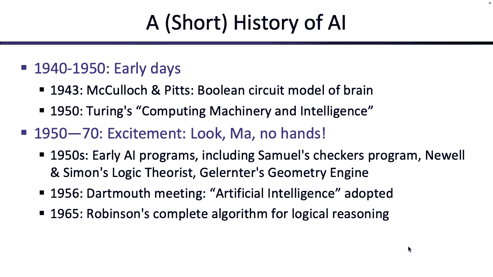
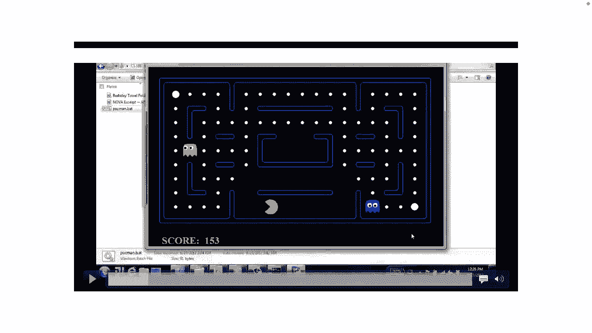
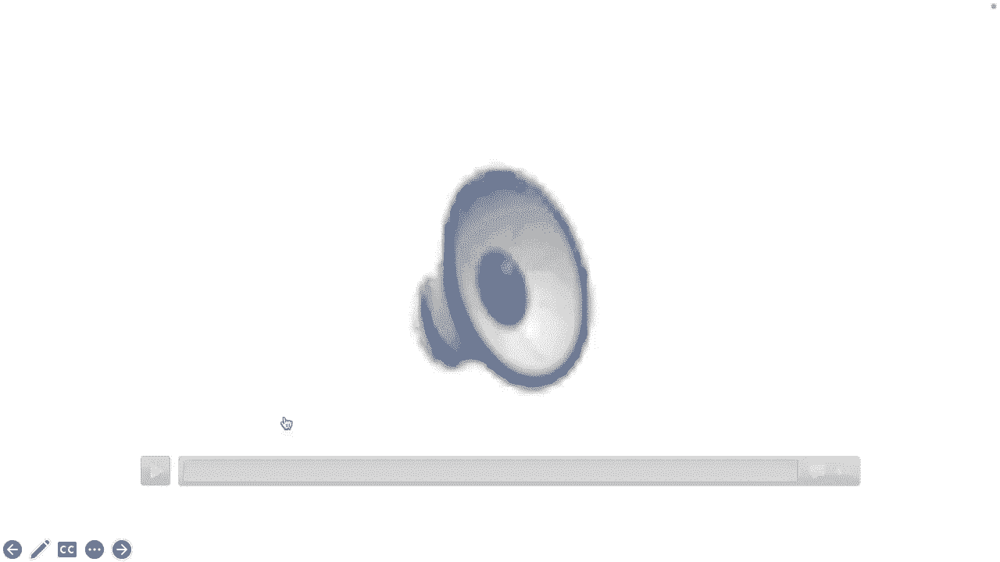
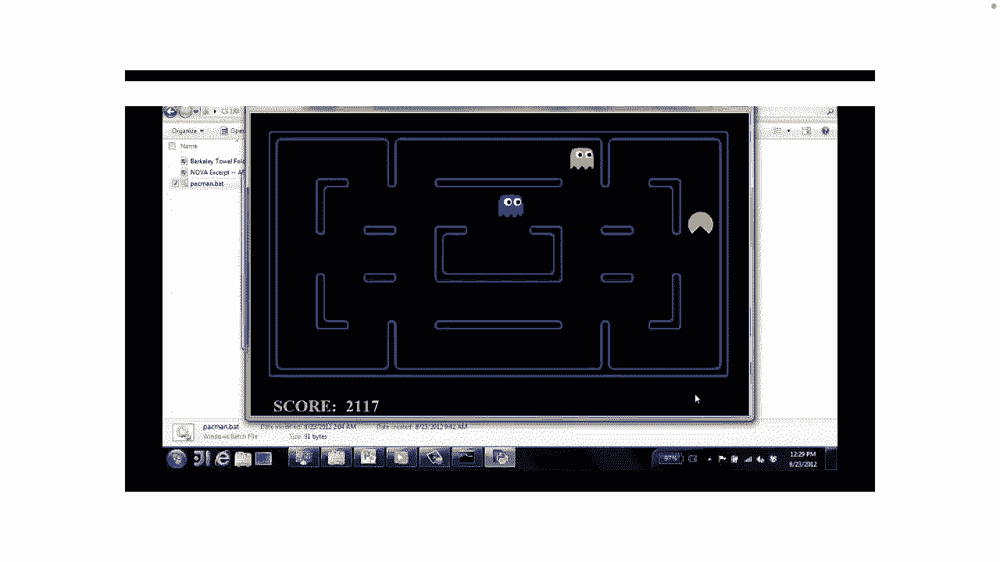
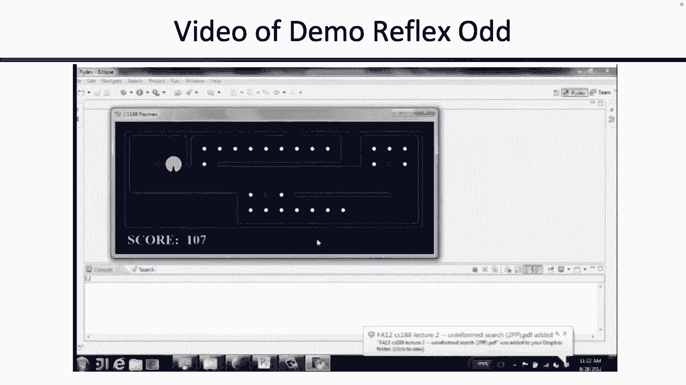
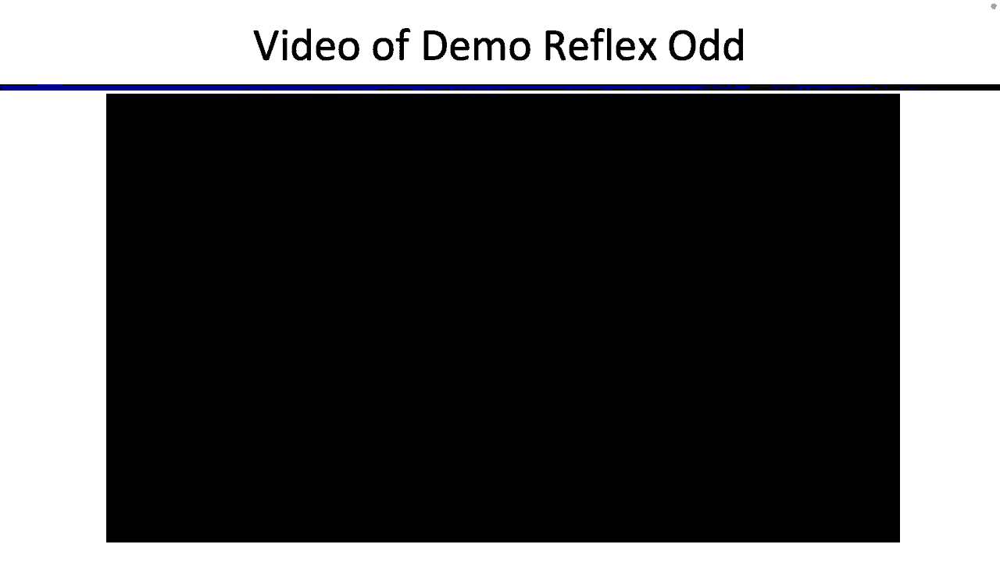
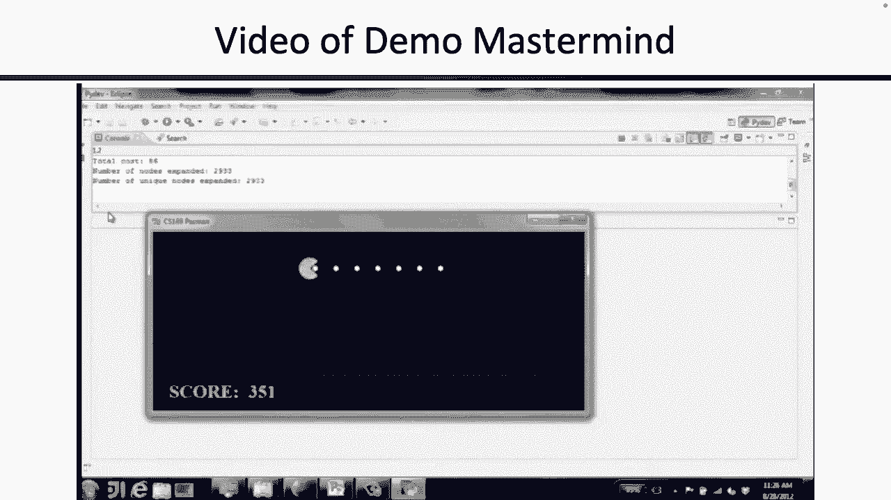
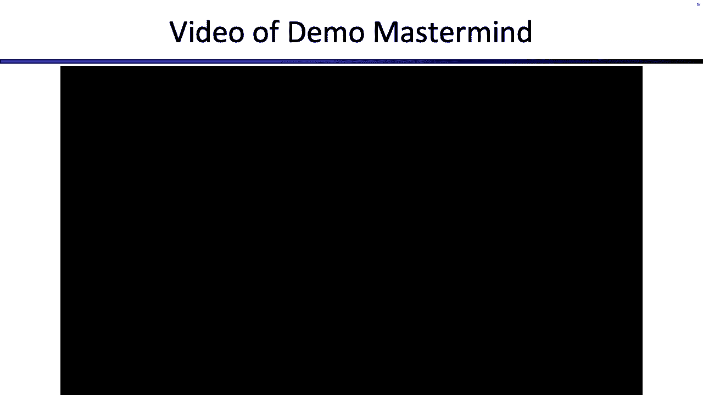
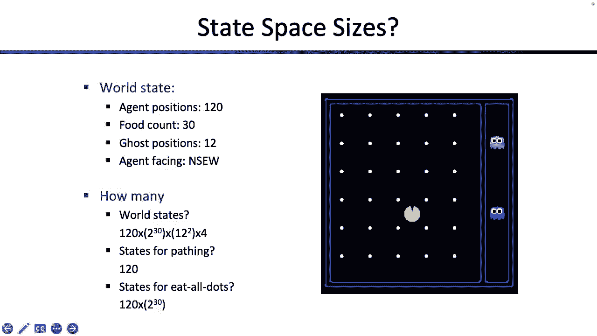

# CS188 伯克利最新AI课程--人工智能入门推荐 - P1：[CS188 SP23] Lecture 1 - Intro to AI, Rational Agents - 是阿布波多啊 - BV1cc411g7CM

好的，每个人都在这里为CS，权利之一，我没走错地方，好的，酷，呃你好，这是一个每个人都很高兴见到你的讲座，希望几周后我能再见到你，虽然也许我不会好吧，酷，第一次讲座激动人心，我们有很多事情要做。

所以我会尽量简短，希望不会太无聊，所以首先我们要快速完成尽可能多的后勤工作，然后我们将向您展示人工智能的一些介绍，今天就到此为止，所以我们就这么做吧，那就是我，我在比较，我在这里做讲师已经一年了。

我也教161，所以也许你明天会在那里见到我，你可以读到，我要说的是，人们总是给我发邮件，叫我教授，我觉得他们给我的报酬不够，所以你可以叫我父母酷，呃，但我不能自己教这个。

我有一个很棒的合作导师叫斯图尔特·拉塞尔教授，谁不在这里，他真的很聪明，做了很多人工智能研究，我想他出去拯救世界了，所以他会加入我们，可能在他拯救世界后的一周左右，所以我会让他自我介绍，每当他出现。

在那之前我们可以守住堡垒，酷，那就是我，呃，我们有一群很棒的助教和读者，你将与谁互动，所以这里有一堆，这里有更多的，他们甚至更多，我可能忘了几个，所以他们有一个占位符，但是是的。

希望整个学期你都能看到他们，或者他们中的任何一个，想来，打个招呼，其他一切都是关于那个的，我想谈谈物流方面的问题，它会出现在课程网站上，所以我会喜欢速度，运行它，如果你有问题，你可以阻止我。

但希望大部分已经在网站上得到了回答，所以招生，我们必须服从部门，所以我们在网站上有更多关于这个的信息，就你能参加什么而言，有一个讲座，你在这里，所以你可能找到了，现在是星期二和星期四的晚上。

我们不接受出席，但参加可能会有一点额外的荣誉，现在有一个变焦呼叫打开，所以如果你不想亲自来，或者你病了什么的，你可以打电话进来，那很酷，我们会报告并张贴这一点，好的，有讨论，网站上有日历。

它几乎完全更新了，可能会有一两个额外的部分，我们就扔在那里，他们下周又开始了，网站上的更多信息，所以只要读一下，有办公时间，收入垃圾邮件我们，呃，希望钥匙不会太长，这就是我要说的，有考试，这是两个日期。

2。我们应该已经基本完成了，我不认为在备用考试方面会有什么变化，会有一个备用考试，只在列出的时间后亲自，如果你生病了什么的，只有在列出的时间才会有远程考试，没有其他的交替时间，如果你来问我们。

就像第二天的考试，不会发生的，有人试了这最后十二个，我想我不能给你第二天的考试，差点挂科，所以尽量不要让那是你，好吗，所以现在就去考试吧，有什么问题吗？因为我走得有点快。

这里有一堆你可以在整个学期使用的东西，有一个网站，它基本上是完全更新的，我们会把所有的东西都上传到那里，这些幻灯片也应该在这一点上，嗯，不再有广场，但有一个ED希望你能加入，如果没有，我们会全天同步。

所以希望它能在第二天左右被添加，如果你想给我们发电子邮件，有一封电子邮件和奥利弗·西蒙斯，在很大的范围内，很简单，这是评分结构，直接从网站上下来，有Python编程项目，每周都有家庭作业，有两次考试。

仅此而已，玩得开心，然而好吧，这有点重要，所以在扩建和住宿方面，嗯，我们会给你一个家庭作业，所以拿出你最好的十之八九，我们会给你几天时间，所以如果你需要一些额外的时间来提交项目，如果您需要扩展。

就像没事一样问，嗯，我真的不在乎，如果你需要额外的一两天来提交一个项目或家庭作业，你感觉就像，哦，2。我得熬夜才能完成这个项目，答案是否定的，你可以直接问我们，我们可以多给你一两天。

所以我们会尽量慷慨一点，只要你和我们保持联系保持沟通，我们可以让它发生，好的，所以不喜欢通宵，不，就像抛弃你的家庭和孩子，呃为其中一个项目，好的，很酷，还有一点重要的是。

有一个叫做DSP的东西代表残疾学生项目，如果你不知道，嗯，它们基本上是确保，每个人都有他们需要的资源来最好地学习，所以如果你觉得你知道，这是你可以从中受益的东西，你觉得有，你知道的，你在学校面临的障碍。

你可以只申请，一点耻辱都没有，他们真的很欢迎，你知道他们可以帮你建立，如果你已经是DSP程序的一部分，那就太好了，你可以把你的DSP信寄给我们，我们将在接下来的一两周内处理它。

所以我们在这里是为了确保每个人都能学得最好，如果这意味着你知道，通过DSP程序获得一些住宿，这太棒了，所以我们完全支持那个伟大的，到目前为止还有什么问题吗？让我们来谈谈，哦哦，恐怖滑梯，学术不诚实。

呃别这么做，我真的不想承担所有这些讨厌的后果，但我们都是来帮忙的，我不喜欢刻薄，所以希望我们不必刻薄，但如果我们这样做了，会有人说，好的，酷，另一张更重要的幻灯片，我想是物流的问题，就是。

我们已经暗示过了，当我们说，扩展在那里提供帮助，我们是来帮忙的，是啊，是啊，如果你曾经觉得，你必须在你自己的健康和你的幸福之间做出权衡，或你的家人在本课程中，你的健康和幸福，不必选这门课。

就像我们会在这里，你知道如果你需要额外的几天，那很酷，如果我们需要锻炼，你知道什么计划来帮助，你被赶上了，那很酷，但又一次，不像是为了这个班抛弃了你的家人和孩子，好的，所以我们有资源，大学有资源。

有一堆很好的链接，你可以查看，所以我们都在这里支持你，好的，酷，这是最快的物流速度，我做过的，有人对此有疑问吗，如果你这么做了，可能在网站上有答案，我也是，是呀，后面的问题，是啊，是啊。

问题是星期二的讨论材料，和星期三一样，应该是一样的，呃，整个星期，好问题，还有人有问题吗，是啊，是啊，你能改变你所在的部分吗？也是一个很好的问题，呃，是在网站上吗，也许是。

但你可以参加任何你想参加的部分，我们不在乎，所以这里，是啊，是啊，你要发送任何部分，你想要个好问题，你可能会喜欢的其他东西，非常咄咄逼人地挥手，因为有很多人喜欢跳千斤顶来找我，好的，有课程不和谐吗，呃。

不是我们支持的，但如果你想做一个，我阻止不了你，好的，酷，让我们谈谈有趣的事情，所以这一切又做了一次，我们有一个网站，你应该回答你的大部分问题，让我们谈谈AI，这就是我们在这里的目的，所以让我们这样做。

所以今天的大部分时间应该只是一个漂亮的，她就会闯进来，我们来谈谈它能做什么，我们来谈谈它不能做什么，我们将讨论这门课程是什么，也可能至关重要的是，这门课不是什么，这样你就知道你是否在正确的地方。

所以通常我们从如果你在想人工智能开始，也许你没有，然后可能永远不会上人工智能课，这可能就是你在这里的原因，也许你的第一个想法就像电影，你知道媒体，所以让我们看看我们能从媒体中学到什么。

关于人工智能是什么或者我们如何看待人工智能，所以跳上我们的时光机，回到很久以前，有人认出这些吗，谁是大金童，大喊一声，我不知道，是啊，是啊，这是星球大战中的，是黄金三C三宝的名字，是啊，是啊。

c三个po是做什么的，这个笑话在这个班上已经有七年了，总是得到笑声，我很高兴我把它偷偷放进去了，那是看穿阿宝，另一个小男孩是谁？r二d或二d二，R2 D2是做什么的，一切，是啊，是啊。

它有点像一个通用的万能助手机器人，有人记得星球大战上映的时候吗，我们现在开始讨论棘手的问题，那是如此古老，所以这有点像七十年代对吧，也许在70年代，人们在想人工智能，因为这种有帮助的，创新。

所以我们有C三波帮我们翻译，我们有两个人在帮忙，呃，你知道吗，它所有的朋友，通常都很有勇气，这有点像七十年代的人，哦酷，AI可以是这个有帮助的东西，然后我们就在时间上前进了，现在我们就像在A的权利。

但现在就像，哦，突然间爱不再那么快乐和友好了，也许我想起来让我们，呜，我们甚至可以快进更多，这就像两千对吧，二千三千二千零四，现在就像，哦，如果不仅仅是，艾是来接我们的，如果这就像，我们在人工智能里面。

哇喔，现在是怎么回事？现在我们甚至可以继续走得更远，现在是20块10，是这个，是啊，是啊，所以这一个是多么正确，也许老一点，然后刚刚弹出来的是什么，嘿，各位，是西部世界，是啊，是啊，这个人以前和你一样。

几年前大家都知道这个，然后就像在过去的几年里，知道的人越来越少，但是是的，现在西部世界就像，哦，如果我们不能区分人类和你知道的，AI不再，如果现在可怕的不是，AIS是喜欢的，追捕我们。

或者我们在人工智能里，如果艾在我们中间，对不起，我得把他们弄进去，嗯好吧，所以是的，所有这些不同的，你知道，电视节目都在谈论人工智能，所以人工智能不是，哇真漂亮，你知道，在我们的文化中，谷物。

似乎随着时间的推移，人们对它有所有这些不同的概念，所以当我们了解人工智能时，也许我们可以记住这一点，但让我们考虑一下，也许在更严格的意义上，所以暂时不要再看电影了，让我们来谈谈，你实际上如何定义，ai。

这是一个很奇怪的术语来定义，代表人工智能，也许你可以把它定义为我怎么说，我不知道这就像，人工智能是我们希望机器人拥有人类智能的东西，但一旦机器人有了人类的智慧，那真的还能叫人类智力吗。

如果机器人知道怎么做，所以这是一个令人毛骨悚然的定义，但这是我们想出的，所以我们要把人工智能说成是制造机器的科学，这里有几个选项你可以选择，我们会仔细考虑的。

所以你可以想到人工智能的一种方式是有机器像人一样思考，所以他们，你知道有一台机器在外面，什么都能做，而且它很擅长，是你的人脑，现在这里有一群人，所以也许人工智能的科学试图创造机器。

它们的思维方式和我们的大脑一样，你知道吗，即使外面有很多大脑，原来逆向工程，比你想象的要难，也许你可以把人工智能想象成一门科学，你脑子里在想什么，我们如何用计算机模拟这一点，这是一种选择。

另一个选择是说，其实，你知道我其实不在乎，艾是怎么想的，也许人工智能不必像我们的人脑那样思考，也许我们所关心的是人工智能的结果与人类的结果相同，所以说，如果你认为你知道像下棋程序这样的东西。

也许下棋程序没有考虑它的移动，就像人脑一样，但也许国际象棋程序产生的棋步仍然和，一个人类能想出什么，所以说，也许没关系，计算机本身的思维方式与我们的大脑不同，但产生与我们大脑相同的动作，所以说。

那是你可以想到的另一种方式，也许你可以把它看作是，或者理性思考的机器，这个词我们在这门课上会经常看到，所以我们会回来的，但也许就像在外面的某个地方，如果你回想一下柏拉图和亚里士多德。

所有那些有雕像的老人，也许你知道他们想出了所有这些逻辑推论的规则，就像嗯，如果这是真的，这是真的，那也许这也是真的，他们对世界的运作有所有这些规则，所以也许我们能做的是。

我们可以用所有这些关于世界如何运作的规则来编程，然后这台计算机可以推理世界是如何运作的，所以与其试图模仿人们来模拟这台计算机，也许我们可以根据我们提出的这些逻辑规则来模拟这台计算机，想出，那是一种选择。

也许你能猜到第四个盒子是什么，如果我们不想让计算机理性思考，也许我们想让计算机理性地行动，那是一个盒子，我们将把大部分时间花在，你知道你可以想象这就像，也许没关系，如果计算机没有思考所有的逻辑规则。

就像人类可能会，但也许没关系，只要电脑最终，你知道的，采取合理的行动或产生合理的产出，根据现有的一些逻辑规则，这是有意义的，所以我们要把所有的时间都花在那里，但正如你所看到的，这是一个模糊的定义。

也许你会在这门课上看到一些东西，他们不觉得，但也许根据一些定义，它们确实适合人工智能，所以例如，我们下周要看搜索，比如搜索算法，也许这些天搜索算法不再像人工智能了，也许这就像，搜索不是聪明的。

c三个PO星球大战，机器人的东西，怎么可能，ai，你知道的，也许搜索是特工理性行事的一种方式，所以也许搜索确实符合人工智能的定义，所以是的，有趣的术语，有很多不同的定义方法，到目前为止。

你有评论、想法或问题，酷，让我们继续前进，所以就像我们说的，基本原理是一个你会经常看到的词，所以让我们试着把它分解，所以也许你听说过理性是一种说法，比如合理，或者你知道逻辑。

但我们有一个非常具体的方法来定义理性，我们要定义的是理性，最大化您预期的效用也是如此，好多词啊，但它们真的很重要，所以让我们看看他们是关于什么的，所以这里是更大的文本中的单词，如果你喜欢，这里有四个字。

这四个词都是我们要分解的词，在这门课的过程中，最大化这意味着我们试图在某种测量上尽最大努力，我们想最大化某种测量，或者某种函数，这是一个很难的问题，我们如何最大化某些函数，有什么算法可以做到这一点。

那是我们要分解的东西，你的似乎是一个很容易的词，这实际上并不是因为你最大化了谁的预期效用，这个机器人是为了谁而建造的它是为了什么目的而建造的，你知道它是为了服务或造福于哪些人而设计的。

所以即使是你这个词也可能有一堆不同的定义，我们要试着挖掘，谁是你的是我吗是我吗，你就是它，人类，我不知道预期，这是一个我们要深入挖掘的词，我也是，和预期意味着嘿，世界不是确定性的。

如果你在这个世界上做了什么，你知道你总是可以预测接下来会发生什么，所以期待是我们尝试的一种方式，和，你知道的，模拟世界的不确定性，所以不管我们给机器人编程做什么，无法预测未来。

它一直不知道世界将如何运作，所以我们必须以某种方式将不确定性建模到我们的函数中，所以这是预期的词，最后一个词是效用，效用是另一个我们会经常看到的词，这是一种很好的说法，是奖励或某种。

这个机器人能有什么好处，或者代理或算法可以有什么好处，所以我们必须以某种方式测量，对我们的算法或机器人来说，我们的代理成功意味着什么，我们如何衡量我们的项目是否做得很好，这就是我们必须弄清楚的效用。

所以是四个字，但有非常重要的，我们会花一整个学期的时间来分解它，所以在这节课结束的时候，如果你想给你的CS一个纹身，我不赞成，但如果你愿意，你可以，也许你可以把这个纹身，所以耶。

关于最大化你的预期效用的任何问题或想法，我们可以叫我们班，最大化您的预期效用，但你可能不会在这里，你们都是为了艾才来的，所以耶，好的，我们还谈到了大脑所以快速重温一下，在很多工程中似乎都很好。

好像有什么东西存在，我们可以对它进行逆向工程，重新建造它，好像还不错，到处都是会思考的机器，这个房间里有五百种不同的思考机器，这一切都在我们的脑海里，所以如果大脑已经存在，有这么多。

希望它们都能正常工作，为什么我们不能进行逆向工程，建造另一个像人造大脑一样的大脑，所以事实证明，这说起来容易做起来难，很多人工智能都在思考大脑是如何工作的，我们能从大脑中学到什么吗。

所以这是一个很好的起点，但它并不完美，你几乎认为大脑太聪明了，就像翅膀飞翔一样，所以就像我们看到飞鸟的最长时间一样，但我们不知道如何反向工程，飞行的关键突破是认识到当我们制造人工飞机时。

我们不想让他们拍打翅膀，我们想做点别的，所以你知道看到这一点是有用的，你知道吗，大脑是我们可以从中吸取教训的东西，但是逆向工程和重建模仿者，人造大脑可能不是我们想要的，但我们可以从中吸取教训，例如。

你的大脑有记忆，你的大脑有模拟，这些都是很好的东西，例如，我看到我旁边的炉子上有一团热火，我在想我应该摸那么好吗，所以我的大脑会开始激活和思考，它会想一些事情，比如，也许嗯，我记得当我还是个孩子的时候。

我碰了一下炉子，真的很痛，所以我有点不想再那样做了，或者我的大脑开始思考像这个炉子有火和火这样的事情，我知道自己很性感，我知道如果我碰到很烫的东西，那有点糟糕，所以我不应该那样做，所以从大脑。

我们可以吸取一些教训，也许这个想法，就像火的逻辑演绎是热的，触摸是热的，事情很糟糕，所以我们不要那样做，那可能是我可以带走的东西，或者从过去的数据中，我知道你知道，当我还是个孩子的时候，我摸了摸炉子。

天气真的很热，这不是一次愉快的经历，所以我不想再做了，这可能是另一个想法，我们可以把它带到我们编写的程序中，所以这是我们再次定义人工智能的最好尝试，这是一种模糊的定义，我们会经历的。

但这在很大程度上是关于最大化你的预期效用，思考我们可以从所有大脑中吸取的教训，以及它们是如何工作的，一切都好，你还有什么想问的吗，让我们来谈谈人工智能的简史，这是一些老屁股视频，他们总是显示，我也不。

你知道吗，我们不妨展示一下，所以停止你的报告，虽然，让我确保我能击中声音，呃，这也是我个人的休息时间，所以当你看这个的时候，我去打个盹什么的，好的，让我们看看这是否有效，有没有一些，好吧。

也许你没看就逃脱了，因为没有声音，好的，好吧，没关系，我不是很喜欢这样，你可以看出它有点无聊。

所以是的，有一群老白人在谈论，哦在未来，人工智能将帮助我们自动翻译程序，这很有趣，因为这是在20世纪50年代制造的，他们就像，哦，也许到1955年，他们会有，你知道的，最先进的翻译程序。

也许在20世纪60年代，他们将学习如何下棋，像处理金钱或其他什么，所以这就是他们在这里得到的，你可以在自己的时间看，如果你喜欢，但它很古老，很硬的，很多喜欢的家伙，那是四十年代的风格，那是五十年代。

有点像我出生的时候，那时人们开始思考，电脑能，有点像人类一样思考，那会是什么样子，然后随着时间的推移，我们进入五十年代，六十年代和七十年代，这是一个时代，人们开始对这个领域感到兴奋并意识到。

如果我们有这些计算机可以为我们高效快速地进行计算，我们可以做的一件事是，我们可以写下世界上所有的规则，我们可以说嘿之类的话，水是湿的，火是热的，摸着热的，事情很糟糕，你知道喝酒，什么事情是你做的事情。

也许你可以写下所有这些关于世界的逻辑推论，以及它们是如何工作的，并把它们扔进计算机，也许现在这台电脑知道如何推理了，像一个人，这是我们能做的一件事，在五六十年代，人们就是这么想的，他们在想。

我能写下这个世界运作的规则清单吗，把它塞进电脑里，突然间这台计算机现在知道如何像人一样思考这可能是一个想法，这就是他们在想的，所以他们尝试了这个，有一些问题我们稍后会向你们展示，但最终他们开始意识到。

写下世界上所有的规则有点难，你可以试试可能要花点时间，也许你会想念一些东西，所以如果写下所有的规则真的很难，那我们暂时做什么，人们有点卡住了，没有多少钱流入人工智能，人们真的不知道如何前进。

这就是人们所说的艾冬，所以我所以，呃在，你知道，所以在八九十年代，我想有人对艾冬真的很兴奋，所以耶，在八九十岁，你知道人们就像，好的，嗯，我真的不知道如何前进，你知道他们有点坚持这些经典方法的想法。

写出所有的规则，看看它们是如何工作的，但你知道，在最近的时间里，人们已经开始思考，让我们不要把事情如何运作的所有规则都写下来，然后处理那些，不如我们把数据，所以让我们来了解一下我们过去的经历。

我碰到了火，对我来说真的很糟糕，或者过去我一小时前喝水，这对我有好处，也许我会把所有这些经验和数据，我会像统计模型一样运行在他们身上，你知道我们掌握的数据越多，也许我们能做的更丰富的模型。

然后用这个数据，也许我们可以用它来适应我们以前从未见过的情况，所以这就是今天很多人工智能的地方，所以现在我认为艾在移动，也许比以往任何时候都快，人们真的采用了这种方法。

让我们把我们拥有的关于过去经历的大量数据，人们过去的所作所为，让我们利用这些信息建立一个统计模型，告诉我们，为了理性地行动或最优地行动，我们应该做什么，这就是我们现在的处境。

在这个统计模型的时代有很多里程碑，也许是过去最著名的一个，是在1986年，1987年，所以加里·卡斯帕罗夫曾经是国际象棋世界冠军，有点聪明的家伙，所以在1996年，IBM制造了这台巨大的计算机。

我想它可能填满了整个叫深蓝色的房间，他们下了一场国际象棋比赛，1986年卡斯帕罗夫击败了深蓝队，就像嗖的一声，好的，人类仍在获胜，然后在1997年深蓝回来复赛，把加里·卡斯帕罗夫踢得屁滚尿流，突然间。

似乎达到了一个里程碑，卡斯帕罗夫描述的方式是，他说我能感觉到我能在桌子对面闻到一种新的智慧，所以这是一个很大的里程碑，也许在过去的几年里，还有一些其他的里程碑，你可能会认识到，所以也许你认识这个人。

任何人，他的名字就在幻灯片上，没有，这是丽莎·多尔，是啊，是啊，你怎么知道那个伟大的，那是丽莎娃娃，他曾经是围棋世界冠军，对呀，也可能是世界上最好的围棋手之一，所以谷歌开发了一个神经网络。

所以就像一种基于数据的模型来击败丽莎·多阿山羊，所以这是人工智能的另一个里程碑，这是一个我们过去认为对机器来说很难的游戏，谷歌似乎想通了，那是二十六，我想这张幻灯片有点向后，那是IBM沃森。

那是在2011年，那是IBM沃森在危险中击败人类冠军的时候，所以这也是事情，所以在过去的十年左右发生了许多人工智能里程碑，所有这些我们过去认为是人类思考的领域，比如用双关语解决这些奇怪的危险线索。

还是打围棋，是一款很像人设的游戏，这对计算机来说真的很难建模，这个，所有这些过去都是我们认为人类可以在所有这些里程碑上做得最好的事情，似乎计算机开始越来越擅长它们，所有这些不同的技术，所以我们就是这样。

我们现在所处的位置，所以也许我们可以评估我们现在的处境，这里有一堆东西，我很想知道，如果你认为我能做到这些，也许所有的，一个真的很容易，我能玩一个像样的危险游戏吗，好的，如果你不举手，呃。

你可能要开始注意，因为就在两秒钟前，我可以玩一个像样的危险游戏，打败它最好的球员，我能在国际象棋中战胜任何人吗，哦是的，你可以，所以现在人类甚至懒得和机器玩，因为它们更好，我能战胜最好的人类吗。

你在注意，这张幻灯片的有趣之处在于我们每学期都用它，这个实际上在几个学期里都是否定的，然后阿尔法戈发生了，所以我们只是把它改成了对勾，这可能会发生在后面的几个，我也是，我能打一场像样的网球吗。

也可能不是，我真的不知道我们在这件事上有什么，我想说如果你不是想喜欢，积极地把球猛击在AI上，也许你只是像一个小友谊赛，也许吧也许是的，它能打败网球世界冠军吗，我不会把钱押在上面。

我能拿一个特定的杯子放在架子上吗，我想我们教这门课的教授之一是Anka。她在这方面做研究，所以如果你去她的实验室，你可以去看她的机器人，它抓住一个特定的杯子放在架子上，所以这就是为什么它在那里。

我可以在任何家里卸下洗碗机吗，好的，我想不是，是啊，是啊，那可能有点太花哨了，这些天，一个人工智能能安全地沿着公路行驶吗？好的，也许在某些条件下，所以我们就在这里提出一个问题。

人工智能能安全地沿着电报大道行驶吗，是啊，是啊，听起来是对的，我想我在电报大街上开车不安全，所以我们会在那里贴一张纸条，我在网上买杂货，我当然可以，嗯，那个可能有点旧了，它永远是一个复选标记。

我能在伯克利买一周的食品杂货吗，你见过机器人到处买杂货吗，因为我还没有，它可能是一个新的，人工智能能发现并证明一个新的数学定理吗，有趣的一个，一些人不是周围的一些人，就像三分之一的人。

我想我们有一个问号，所以我们稍后会在课堂上向你们展示，我能用逻辑推理做些什么，事实证明，在一些设置中，AIS可以证明新的数学定理，唯一的问题是它们是有趣的定理吗，我可以让人工智能向我证明五加三等于八。

但这有趣吗，我也不这么认为，我不认为这是新的，所以也许我可以做手术，举起手来，好的，所以现在大约有一半的人，把手举起来，如果你让人工智能给你做心脏直视手术，好的，现在人们不那么自信了。

所以现在我们确实有机器人做手术，但它们绝对是人类辅助的，我想我不会让机器人，亲自给我做心脏直视手术，但如果你愿意，我想彼得·上诉在这方面做了研究，所以去和他谈谈，人工智能能和一个人合作卸下洗碗机吗。

当然，大多数人都说是的，我想这是，哦真的不，好的，呃很好，所以我想和人合作有点难，这是安科致力于的事情，所以也许你去她的实验室，她可以向你展示她的机器人显然不能卸下洗碗机，也就是说，嗯。

我能实时把中文翻译成英语吗，是啊，是啊，这个以前真的很难，但现在这更常见了，所以我们把它改成对勾，我能读有趣的故事吗，很多人对一个故意搞笑的故事说是，但也许这里的关键字是故意的。

所以我从来没有见过一个人工智能故意搞笑，讲笑话，但我绝对见过AIS开玩笑，不是故意的，所以让我们读一些这些故事，这是1984年的，所以它不像一个超级复杂的系统，但很多教训都是一样的，让你一瞥。

进入人工智能的许多领域之一，所以这取决于谁在教这门课，人工智能有所有这些不同的焦点，这是一个更自然语言处理的焦点，所以让我们一起读，让我们读一些故事，有一天，乔熊饿了，他问他的朋友，欧文鸟。

一些蜂蜜在欧文，告诉他橡树里有个蜂巢，乔向橡树走去，他把蜂箱吃了，所以这里有两种观点，一个有点像玻璃半全视图，这是1984年，这做对了很多事情，所以它得到了一个想法，你知道熊饿了，如果熊饿了。

他们想做什么，他们想找一个蜂巢，如果你知道熊饿了，它吃什么，所以说，这实际上做对了很多事情，但它错过了什么，我错过了一件重要的事，就是你不吃蜂箱，你要做什么，你要喜欢，把蜂蜜从蜂箱里拿出来，先吃再吃。

所以也许这是其中一个案例，如果你真的把世界上所有的规则都写出来，如果你错过了一个，你可能会得到一个非常愚蠢的故事，但实际上很接近，所以说，原来，也许写下规则会让你走得更远。

但肯定会给你一些无意中有趣的后果，让我们读更多，亨利的格雷尔渴了，他走到河岸，他的好朋友比尔·伯德坐在那里，亨利滑了一跤，掉进了河里，重力淹没了有趣的结局，那么这里又出了什么问题，它把很多事情都做对了。

但它搞砸了什么，搞砸了，事实上，嗯，重力不会淹没，所以这可能有点像语言问题，就像重力可能是让你淹死的东西，但溺水的不是那个东西，所以这可能更像是语法或语言问题，但除此之外，它实际上做对了很多事情。

重力让你淹死，只是不是溺水的原因，但很接近让我们继续从前，有一只不诚实的狐狸和一只虚荣的乌鸦，一天，乌鸦坐在树上，嘴里叼着一块奶酪，他注意到他手里拿着那块奶酪，他饿了，把奶酪吞了下去，狐狸走向乌鸦。

有趣的结尾，我会看那部电影，好的，那么这个有什么问题，这似乎是一系列事件的功能序列，我会说，但我不认为这是一个故事，这种就是达不到人类的品质，就像，这不是故事，没有开始、中间或结束。

比如为什么狐狸不诚实，我不知道乌鸦为什么进来，他们为什么用三句话谈论奶酪？如果故事的重点是狐狸走过去，所以这种非常接近，也许没有任何明显的错误，但我不能说这真的像一个故事，所以这可能是一个。

我们如何建模，系统应该做什么，你如何告诉系统产生一个好故事，你如何定义，什么是好故事，你怎么说这不是一个好故事，所以这些都是我们必须定义的棘手的事情，好的，这么有趣的故事。

问题是聊天GPT算不算故意搞笑，嗯，如果你能让聊天GPT，给你讲笑话，我很想看看他们，也许我们将来会把它改成复选标记，如果你这么做了，好的，所以这是人工智能的简史，它能做什么，它不能做的，嗯正常情况下。

这就是无论谁在教书，这堂课将向你展示他们的研究，我相信当罗素教授回来的时候，他也会给你看一点，但我不做人工智能研究，我只是来演讲的，所以我想我应该拿出一些新闻文章，很多这种讲座都有点过时。

我会说就像你知道的，我说的是发生在，像二十六，双十一，很酷的，但也许你们都，当你想到AI的时候，你想想所有这些最近的发展，这些发展还没有出现在这个演讲幻灯片中，所以我想我拉了一些一直困扰着我的。

也许我们会通读它们，想想他们今天告诉我们的关于人工智能的事情，人工智能面临的问题是什么，我们有什么好担心的，我们要担心那些眼睛发红的外星人吗，会杀了我们，还是有其他顾虑，这里有一个我发现的。

它可能有几年的历史了，但它永远伴随着我，所以让我们读，这是从20 20，所以也许你还记得在20世纪20年代，巴拉克奥巴马不是总统，那时出版了一本巨著，有人记得吗是的，有一本很大的自传，大概有两卷什么的。

所以这真的很受欢迎，它成了畅销书，但这篇文章不是关于奥巴马的自传，这篇文章是关于一本名为巴拉克奥巴马书的书，这是一本61页的书，作者是大学出版社，这是一本在亚马逊排行榜上攀升的书。

为什么它会在排行榜上攀升，因为如果你输入巴拉克·奥巴马的书，这是第一个结果，巴拉克奥巴马书的内容是什么，嗯，好像花了两百九十九，由一个叫大学出版社的人写的，他们的其他杰作包括所谓的铸造。

多莉·帕顿简史与自传，这位特别评论家的结论是，我不认为奥巴马的书是人写的，但我确实认为排泄它的人工智能，关于巴拉克奥巴马的一些体面的观点，你想看这本书吗，我想读这本书，所以在我们读之前。

我给你看一点奥巴马的书，所以这是他真正的书，我们所做的，或者这篇文章的作者做了什么，他们在这个程序中运行了它，这个程序试图做的是什么，正试图弄清楚，我们将这些文本输入AI文本生成器或类似GPT的东西。

我们问文本生成器，基于人工智能的发电机，你在这里的下一个词是什么，我们把它和奥巴马实际写的东西进行比较，我们可以看到它是一个预期的词还是一个真正意想不到的词，所以他们经历了。

它看起来像绿色的意思是它是预期的，所以奥巴马写的很多字都匹配，一个人工智能会猜到下一个会是什么，这与你对语法和其他东西的看法相匹配，对呀，所以你知道之后的下一个词通常会是有意义的，对呀。

但如果你注意到这里，有很多红色或紫色的词，这些词真的很少见，所以一个人工智能永远不会猜到这是下一个词，所以说，比如说，对眨眼的攻击，如果你让人工智能填空，人工智能很少说复合这个词，但那是奥巴马选择写的。

所以这是我们加速并注意到，肯定有一些情况是奥巴马选择的，机器人不会选择的词，那是他真正的书了，让我们读巴拉克奥巴马的书，这是巴拉克奥巴马的书，在他的第二个任期内发生的最引人注目的事件之一是奥萨马被杀。

本拉登等等等等，但请注意这里的每个单词都像绿色或黄色，有点危险，大学出版社也是，一个真实的人，他们伸出援手，他们再也没有回音，所以你的猜测和我的一样好，那么这向我们展示了什么，首先，这是一个有趣的故事。

它总是缠着我，但也是我从中得到的，就个人而言你能想到人工智能确实有很多能力，如果你有一个可以生成单词的模型，或者可以生成一种新语言，你可以想到它能做的所有这些令人兴奋的事情。

但你也可以想到所有这些愚蠢的，也许赚钱的东西它可以这样做，至少对我来说，这一直是一个很好的教训，你知道人工智能并不存在于真空中，AI存在于其中，就像我们都生活在的晚期资本主义反乌托邦。

所以有时人工智能被用来赚钱，所有这些新的想法，算法和模型，我们扔在那里，有时它们会被外面的人误用，试图从奥巴马的自传中快速赚钱，所以这就是我从它身上得到的，也许你还有其他的外卖，也许你想去买这本书。

才二百八十九，相当不错的交易，所以如果你读了就告诉我让我知道你的想法，我猜，所以是的，这有点傻，但它背后确实有一点潜在的主题，它确实存在于现实世界中，这意味着有所有这些不同的伦理问题，我们会试着谈谈。

在整个课堂上也是如此，所以这有点傻，这里有一个是几天前最近的，所以让我们来看看这个，嗯，这是11月2日至3日的，所以这是最近的事，这是埃隆在推特上宣布，你知道吗。

疤痕公司特斯拉发布了一个叫做完全自动驾驶测试版的东西，他们都很开心，人们真的很喜欢，那是11月2号和3号，我们看看11月2日和4日发生了什么事，好吗？我们就这么做吧，所以这件事发生在11月2日4日。

高速公路监控录像，发现一辆特斯拉S型车变道，然后呢，在旧金山海湾大桥最左边的车道上突然断裂，导致八辆车相撞，哎呀，那不是很好，嗯，对我来说，外卖权，有一篇很长的文章，很多不同的细节，但对我来说，外卖是。

为什么这叫全自动驾驶，如果它做了像文章这一部分说的那样的事情，你知道特斯拉，这是一家非常有价值的公司，它们为什么这么值钱，因为他们需要一些东西来与众不同或赚钱，尤其是埃隆说完全自动驾驶是一个基本特征。

因为这就是特斯拉值很多钱的区别，或者价值基本为零，所以是的，有时AI被用来赚钱，我们生活的地方，有时它没有用好，也可能是出于好意，效果不太好，或者利润动机占据了上风，它导致了这样荒谬的故事。

所以当你出去的时候，你在想这些人工智能模型和它们的用途，记住它们不仅仅存在于真空中，发明，一些基于数据训练的伟大模型，这很棒，但你想想想它会被用来做什么，或者是什么安全后果，它有权利。

我们是不是像欺骗消费者一样把东西叫满了，自动驾驶测试版，当它决定停在海湾大桥中间时，那很好吗，就是，我们应该做的事情，我会说不，但肯定是你可以考虑的，这是我随机发现的两个故事，我相信外面还有很多其他人。

我们可以在这个学期继续讨论它们，看看还有什么其他的冒险，呃，埃隆或大学幼儿园，好的，所以任何关于AI历史的问题或想法，道德操守，很好，准时做得很好，这就是AI的介绍，但我会试着领先一点。

只是为了让我们有更多的时间，你知道的，不管你有什么问题，所以这是这门课的细分，所以我们不会有时间谈论所有的事情，但我们将从期中考试前的内容开始，我们将讨论来自计算的智能，这意味着。

我们将尝试建立算法来做你知道的事情，理性行事，或者像人一样思考，或者表现得像人，所以我们要考虑如何编写算法，或者你知道，编写逻辑，使程序或机器人，或者一个代理人做一些人类可能会做的事情。

或者我们认为是聪明的，所以这涉及到搜索之类的事情，这涉及到满足约束的问题，这是一个非常花哨的方式来表达问题，就像你知道的，安排或把时间表放在一起，甚至你也知道，寻找可能有敌人挡住我们去路的问题。

或者解决我们与对手比赛的游戏，所以这些都是你可以使用计算或构建算法的情况，希望在另一端做聪明的事情，这是课程的第一部分，我们会谈谈的，期中考试后我们再讨论，而不是试图使用计算或编写程序。

做聪明或理性的事情，也许我们真的可以学得更聪明，来自数据的理性行为，所以让我们把我们收集到的所有数据，让我们把它通过一个模型，让我们看看这个模型能不能上来，用理性的东西。

或者在我们提供的某种世界中发挥最佳作用，这是课程的第二部分，这就是许多现代人工智能的地方，我们通过一个模型传递大量数据，我们看看模型是否能输出一些你知道的东西，理性的行为或像人一样的行为。

所以这是我们的第二部分，然后在整个课堂上，我们将分发一些应用程序，就像我说的我们有很多不同的人在这里工作，AI和你知道的，我相信他们中的许多人会很乐意谈论他们特定的研究领域。

所以我们有从事自然语言处理的人，我们有人在研究我的电脑视觉，如何识别图像，我们有机器人技术，我们有人在工作，你知道解决像阿尔法戈这样的游戏，就像你刚才看到的，所以有很多不同的应用程序，我们会试着给你看。

随着学期的进行，所以是的，这是课程的一种细分，但到目前为止还不太无聊，嗯，这可能是房间里的大象，我还没有提到，很多人总是问，CS是班上的一员吗，如果我想去拿一个巨大的机器学习薪水，我就拿。

这是一个有效的问题，你知道你必须，养活你的家人，我想说如果你真的在寻找最前沿的东西，人工智能研究，我可能会查一下CS 189，这是CS一二中的机器学习班，也就是深度学习，这就是所有现代尖端研究的地方。

我会说，所以我们在这门课上讨论的很多技术都更经典，还有那些仍然非常有用的东西，比如，我会说，我们涵盖的许多技术仍然是我们从中吸取教训的东西，我们将它们应用于深度学习或机器学习，但就更尖端的东西而言。

诚实的回答是，这是现在热门话题的两门课，所以这是我们诚实的评价，用于，你想上这门课来获得丰厚的机器学习薪水吗，不幸的是，答案是否定的，但我的意思是，我仍然认为这是一堂有价值的课，我会说我自己为这门课。

主要有两点，所以一个是，也许你见过人们谈论，尤其是在伯克利，就像数学成熟一样，成为一件事，谈论如何能够思考，从证据和思考的角度来看，你是如何工作的，呃，这些数学问题，或者你如何看待这些数学算法。

也许是一种花哨的说法，如果我给你一个有很多符号的方程，你能解码吗，我认为这是一堂很好的课，所以如果你参加了低级别的课程，像CS七十，你出来的时候感觉，我不知道，也许数学不完全是我的专长。

我觉得我还没准备好，我认为这是一堂很好的课，可以让你在数学上成熟起来，给你很多练习，不是完全成熟的复杂算法和方程，但绝对足够你知道你得到了更多的练习，或者亲身体验，所以我想你知道，更广阔的图景。

甚至不去想人工智能研究，这是你从这门课上得到的一个很好的副作用，另一件我认为很酷的事情，你已经开始看到它了，这门课给了你很多主题的预览，不一定是CS，但仍然是与人工智能互动的话题，很多。

所以你看到机器人技术是一个很大的技术，对呀，这可能不是严格意义上的计算机科学主题，但它和AI有很多互动，校园里的许多研究实验室都有很多重叠，就像认知科学。

所以思考人脑是如何工作的是它自己的场与人工智能相互作用，和计算机科学，甚至像经济学，所以当我们说我们想让这个机器人最大化他的效用时，那是什么意思，你如何最大化你的预期效用，有一点像经济学在起作用。

就是你知道的，我如何定义什么是有价值的东西，最大化价值意味着什么，所以这也借鉴了经济学，所以我认为很多不同的领域都在发挥作用是很酷的，当他吃饭的时候，所以这是一种高音，但那是我的主张。

这也是我的免责声明，所以是的，那只是诚实，我想可以，就这样了，所有的介绍，所以我们基本上完成了，在接下来的半小时里，我实际上有实际的内容要给你看，或者你已经准备好了，关于介绍，你还想知道什么吗，是呀。

否，好的，酷，让我们看看实际的，我们要讨论的前几个话题，那么让我们来谈谈代理，所以到目前为止，我一直在用这些模糊的词，像程序和机器人什么的，这有点傻，我们在这门课上使用的官方词汇，在许多研究中。

指的是程序、机器人或实体，它试图按照我们给出的指示行事，这是一个非常花哨的词，这让你听起来很聪明，所以我喜欢用它，我们已经讨论过一个理性的代理人，作为一个试图最大化其预期效用的人。

我们讨论了所有这些词的含义，我们说过我们也会更详细地讨论，我们经常有这样的模型，所以有很多不同的运动部件，所以这里我们有代理，代理是你要尝试的东西，你知道程序告诉它该做什么，代理将与环境交互。

所以这个特工一定生活在某种世界里，也许它就像物理世界中的物理机器人，四处走动，试图得到一个苹果什么的，或者它就像一个机器人，你知道在软件方面，试图解决一个棋手，试图找出国际象棋中最好的下一步是什么。

所以在某个地方有一个特工，它与环境相互作用，不管是现实世界还是虚拟棋盘什么的，所以接下来会发生的是这个环境会像，我想不是翻译，我在这里要找什么词，我想它会传达一些感知，我想探员会有预感，对不起。

这些话很难，所以特工们会有知觉，观察环境，所以这是一个非常花哨的说法，这个特工将观察它周围的世界发生了什么，这个代理人也会采取同样可能影响世界的行动，所以这个机器人会四处走动。

机器人四处移动可能会影响世界，机器人还可以进行测量，或者以某种方式观察世界上发生的事情，这一切都很好，但我们真正感兴趣的部分是，你如何接受这些知觉的输入，那么你如何看待这些对世界的观察。

并将它们转化为你真正想要采取的行动，所以这个问号，那是我们班居住的地方，所以有人给了你一堆关于世界的观察，你的工作是告诉这个代理人下一步该做什么，它应该采取什么行动，所以那可能是那个人，告诉这个探员。

这是棋盘的样子，以下是已经做出的所有动作，你下一步想做什么，现在你要运行一些代码，你会很难考虑的，你要想出下一步行动，那是你的行动，或者你就是照片里的机器人，这个机器人观察了世界，就像嗯，有一个苹果。

它在树上，在我和树之间有一个像厄运一样的坑，好吧，这就是我站的地方，这些就是所有的感知，现在你得好好想想，我下一步要做什么，比如我的下一步行动是什么，我想最大化什么，我的效用函数是什么，我是想拿苹果吗。

我是想掉进坑里吗，这可能是一个有效的实用程序，即使这不是你想做的事情，所以这些都是要考虑的事情，所以那是我们生活的地方，这就是我们工作的模式，但这同样适用于各种不同的事情，可能是一个物理机器人。

可能是一个在棋盘上工作的机器人，可能是语言模型，输入就像文字，输出是其他单词，这都可能是设计代理的有效方法，好的，但是外面有这么多不同的特工，但在这个班上，有一个代理喜欢统治这个班的所有人，那是吃豆人。

那是我们最喜欢的探员，所以吃豆人很棒，PAC Man是您的项目将主要生活的地方，它很棒，因为它是一个很好的特工的小模拟版，对呀，这是一个有它生活的世界的代理，并在世界上采取行动，试图吃掉点，避开鬼魂。

这是你将在你的项目中建立的东西，你要建造，AI帮助吃豆人征服所有这些板，避开鬼魂，也许吃鬼，所以你想看，工作中的爱吃豆人，让我们看看，工作中的爱吃豆人，好的，让我确保我能，变焦的人可以看到这个。

我想你可以，好的，开始了，也许不在这里。

我们去，你可以考虑，你知道的，吃豆人的计划，并正在思考它应该做什么行动，所以它在观察世界，然后思考它应该采取什么行动，所以它去了，在想他们下一步吃什么下一步想去哪里，好的，所以蛋蛋就做了，好的。

总是一个跳跃的恐惧，好的，所以这就是你要建立的项目，你有很多哈曼的经验，如果你没玩过吃豆人，也许去玩吃豆人，就像你喜欢你的第一个家庭作业一样，我们就在那里，我要跳到讲座，两张幻灯片，因为我有时间。

所以说，如果你想，在我准备下一张幻灯片的时候你们可以休息30秒，他们也在网站上，也许我们会回来讨论状态空间，我们会领先一点，所以说。

好的，呃，大概一分钟左右大家都准备好学习搜索了吗，好的，所以再一次，这些应该已经在网站上了，只是打扰我，如果他们不是，但让我们也许走在前面一点，这给了我一点缓冲空间，如果你有类似的问题。

或者你想再看点东西，这会给我争取一些时间，如果我们成功了，也许你将来可以早点回家，那就太好了，好的，所以我们讨论了理性代理，我们讨论了这个想法，特工们进行观察。

他们采取行动以某种方式最大化他们预期的效用，所以在外面的某个地方，他们试图优化一个功能，他们试图最大化他们得到的回报或快乐，这是我们必须模仿的东西，所以现在我们必须模拟世界的不确定性。

想想我们想让这个探员做什么，所以这些都是我们想要考虑的事情，但所有这些都回到了同一个问题，也就是说，这个代理必须考虑该做什么，并最大限度地发挥其效用，所以这个探员要做一些计划。

所以这是我们首先要考虑的事情，代理人将如何计划，它会怎么想，所以这是你能做的最简单的事情，你可以建立一个代理，根据它现在看到的来计划，所以特工看着这个世界，根据世界的样子做出决定，那叫反射剂。

我们认为这是反射，因为我们看到世界的本来面目，我们不考虑将来会发生什么，或者像我们的行为会造成什么，我们只是看世界的本来面目，我们决定下一步该做什么，那是一种反射剂，所以也许在这种情况下。

机器人现在看着世界，它说我在这里，苹果在上面，我想去拿苹果，所以我要走那条路，这就是这个探员所做的，那是一种反射剂，所以我们思考现在的世界是什么样子的，我们根据我们所看到的采取行动，我们希望它能奏效。

反射因子是理性的吗，反射剂能在一些模型中做我们想做的最好的事情吗，嗯，我们可以看到，所以这里有一个反射剂，我们和吃豆人一起做了这个，你要在项目一二中建立它，所以这个反射剂看着板。

就像它寻找最近的点在哪里一样，它向那个方向移动，反射剂看世界，因为没有提前考虑，想想现在的世界是什么样子，然后做出决定，那么这个反射剂呢，让我们来看看，所以它绕着，寻找最近的点，看看那个。

它做了我们想做的事情，那太好了，所以也许在某些情况下反射剂会做我们想让它做的事情，那太好了，让我们拿同样的反射剂，让我们把它扔在这块板上，让我们再看看这个反射剂是如何做到这一点的，反射剂看着这个词。

找到最近的点并向那个方向移动，就是这样，那么这个反射剂要怎么做，让我们一探究竟，到目前为止似乎做得很好，现在卡住了，这是怎么回事，还有一件事你会注意到这个吃豆人正在失去它的分数。

因为它呆在原地什么也不做，但实际上发生了什么，这个吃豆人想往那边走吗，我做得对吗，我想是的，它想往那边走，为什么要往那边走，因为它看到了一个点或者就在那里，它想消耗那个点，所以它是这样移动的。

但它没有意识到那里有一堵墙，所以当它向右移动时，它不会考虑会发生什么，它只是试图向右移动，因为它看到了那里的点，并试图移动到那里，所以在这种情况下，反射剂并不真正做什么，我们希望。

这里是吃豆人不断失去他的分数，因为它试图向右移动，什么都没发生，你每走一步，你失分了，所以吃豆人将永远被困在这里直到灭亡。

所以不是一个很好的反射剂，也许我们可以做得更好，所以让我们努力做得更好。

也许与其看着世界的现状，然后马上做出决定，我们真正想做的是，我们想考虑一个行动，考虑如果我采取这个行动，我在脑海中向前播放，我采取这个行动后会发生什么，所以这就是我们正在考虑的计划代理。

所以现在不是看着这个世界说，世界是这样的，苹果就在那里，我想走那条路，也许探员的想法是，这是应用程序，这是我，这是苹果，我想走那条路，但是等等，我会想我会想如果我走那条路，发生了什么好事。

如果我走那条路很好，我知道有一种叫重力的东西，它把我拉下来，也许它会把我拉进厄运的深渊，所以也许我不想直接朝那个方向跳，也许我想做点不同的事，所以这个探员提前考虑了，在想一次，我采取行动。

将来到底会发生什么，那对我有什么影响，所以我可能要考虑不同的行动，思考不同的动作序列，希望能拿出一些行动，那确实如此，你知道一些最大化其效用或理性行为的东西，所以这比反射剂好一点。

而不是看着现在的世界选择一个行动，它实际上会好好考虑，当我采取这个行动时，会发生什么，对我有好处吗，还是对我不好，我应该采取这个行动吗，它会考虑未来会发生什么，试着想象未来是什么样子，然后从那里开始。

这就是我们这里所拥有的，所以这里有一个吃豆人试图提前计划的例子，所以我可以玩吗，你在这里好的，吃豆人来了，而不是继续思考最近的点在哪里，我怎么去那儿？现在吃豆人在想最近的点在哪里，如果我采取这个行动。

它会让我更近吗，所以这个后端在想，你知道将来会发生什么，不仅仅是世界的样子，所以吃豆人不会被卡在墙上，因为吃豆人会提前考虑并说好，如果我在这里，我向右移动，我撞到了墙上，这对我不好，我哪儿也不搬。

所以我要四处走走，或者我要做一些更聪明的事情，所以这个吃豆人提前考虑了，事实上，你可以变得更聪明，所以这里有一个吃豆人，提前计算一切，所以它在想，但它真的很难思考，它在思考我想要采取的行动的完整顺序。

为了尽快清除这块板，所以这个后盾不仅在想它的下一个点在哪里，在想，吃掉所有点的最快顺序是什么，所以我在想，如果我上去，这对我有帮助吗，如果我去，如果我向左，对我有什么帮助，如果我向上，向上，向右。

所以当我说话的时候，我不得不想了很长时间，但最终它实际上找到了清除这个词的最快方法，这是一个很聪明的吃豆人。

提前考虑，好的，所以这些是我们的反射剂和提前计划的剂，对此有什么问题或想法吗，是啊，是啊，所以它没有一个，加上它说这是她和，是啊，是啊，问题是，呃，所以如果我有一个算法，计算到下一个点的最短路径。

然后用那种反射走那条路，或者不是，老实说，这是个好问题，我想说这两者的区别可能有点模糊。

有时亲自，我想说如果你有一个代理来计算下一步的路径，我实际上认为这就是这个在做什么，我想说这可能是提前计划，因为它需要考虑，这条路真的行得通吗，所以如果我看看黑板，就像现在这样。

也许我不确定那条路是否行得通，我必须提前考虑并说好，如果我先向右再向左再向右再向右，它实际上会带我去那里，也许Pacman是一个愚蠢的例子，但如果你去现实世界，也许你得提前计划，像这样，是啊，是啊。

这是个好问题，还有什么，酷，这些就是我们现在要研究的特工，让我们来看看我们的第一类算法，它们试图做一些智能的事情，这些是搜索问题，也许你见过这些人，如果你没有，很酷，我们再给你看一次。

所以我们定义的搜索问题是非常具体的，所以我们将对搜索问题有一个非常严格的数学定义，我们这样做是有原因的，我会用一张幻灯片给你看，所以我们将非常具体地定义一个搜索问题，我们要说搜索问题有几个方面。

它有一个状态空间，所以这是一个列表，列出了世界可能看起来像的所有方式，所以说，如果我们想玩吃豆人，这些都是可能的状态，可能会有一个PAC在中间结束的状态，所有的点都没有被吃掉，可能会有一种状态。

角落里的吃豆人，这些点还没有被吃掉，可能是一个停留，吃豆人在中间，所有的点都消失了，所以不知何故，我们会有一个地方，这个巨大的列表列出了所有可能存在的可能世界，所以这些都是可能存在的可能性，好的。

这是我们定义问题所需要的第一件事，我们需要的第二件事是后继函数，这将帮助我们把点联系起来，也许不是点，但是把所有这些状态联系起来，告诉我们你知道，如果我处于某种状态，我采取了行动，接下来会发生什么。

所以我们有一个完整的列表，列出了世界可以看到的所有可能的方式，现在我们要用一个函数来连接它们，这个函数说，如果你在这种状态下，你采取了这个行动，这就是你下一个要结束的地方，而你，如果你在这种状态下。

你采取了这个行动，这就是你下一个要结束的地方，所以这是你要写的一些函数，它会告诉你，如果我在这种状态，在我的Hulist中的某个州，我采取了这个行动，你可以选择，我会在下一个州结束。

这也是你必须从这个巨大的列表中选择的，这就是你的后继函数，您将用代码编写这个函数，它会告诉你，这些状态之间有什么关系，所以在后续函数中，您可以编码如下内容，如果吃豆人移动到一个点上，它要吃掉这个点。

所以如果吃豆人是，我不知道在中间，吃豆人向右移动，你应该移动到点被吃掉的状态，因为步行者搬进了一个有点什么的正方形，所以我们走吧，您将用后续函数编写代码，所以我想这里有一个例子，事实上，在这里。

如果你向北移动，向右，那吃豆人就要来了，那个dois要被吃掉了，所以这是我们将这种状态联系起来的一种方式，这是我对这个州的巨大列表中的一个州，这也是我庞大的州名单中的一个。

我可以有所有这些不同的状态之间的关系，它们有点联系，世界可能的样子，因为我们想做一个搜索问题，我们还需要一个开始状态，上面写着问题何时开始，这就是你所在的地方，那可能是，也许你现在在哪里。

或者可以像步行者队的起始位置，你最不需要的是你需要一个目标测试，它会告诉你，这里有一个州，我做了，或者我给你一个状态，你告诉我，这种状态是我满意的状态吗，我不需要再采取行动了。

还是这是一个我不高兴的状态，我需要采取更多的行动来实现，我希望通过这个目标测试，所以这是我们必须考虑的另一件事，我们定义搜索表单的原因，这特别是因为我们想建立算法，给我们解决方案。

解决方案将是一系列的行动，所以你在状态空间中通过，你给它一个巨大的列表，列出了所有这些不同的州，你给它一个后继功能，你告诉搜索问题，这些状态是如何相互联系的，如果我在这种状态下，我采取了这个行动。

接下来会发生什么，我在哪里着陆，我也告诉你开始状态是什么，我告诉你目标测试是什么，我告诉你，我给你一些代码检查，不管你做不做，如果我把这一切都塞进我的通用算法，我的通用算法应该能吐出解。

这是一系列的动作，所以可能是在这个吃豆人的问题上，比如北北西北，不管会给你一个行动清单，和这个动作列表，如果连续应用后继函数，它会把你从开始状态，它会去另一个州，采取另一个行动，去另一个州。

采取另一个行动，去另一个州，最终你想达到一个通过目标测试的状态，它说你没有更多的行动要采取，所以我们在数学上严格地定义了这一点，我们的目标是，我们想建立通用的算法，可以解决任何问题，可以表述为搜索问题。

不仅仅是吃豆人，好的，对搜索问题结构的任何思考，所以我们说搜索是一种通用算法的原因是，因为我们要做的是，我们将把我们现实世界的问题，我们要用一种方式来模拟他们，这就像与搜索问题兼容一样。

所以也许我会接受一个我想解决的现实世界的问题，我要试着压缩它，或者像建模一样，或者把它表示为一个符合这个非常特定的数学符号的问题，它必须有一个状态空间，世界上所有可能的状态的列表，它必须有一个函数。

告诉我这些状态是如何相互联系的，我如何从一个州到另一个州，它也会告诉我从哪里开始，我怎么知道我是否做完了，如果我能把我的广义真实世界问题，并把它完全像这样表示，那么我能做的就是。

我可以把它输入到我的任何通用搜索算法中，希望这些算法能为我提供一个解决方案，所以这就是我们所处的位置，但同样，这些是模型，那么你可能会发生什么，你现实世界中的大多数问题都不会用这种形式来表达。

你必须做出一些建模决定，你得做一些简化，你必须设计，如何将现实世界中的问题转化为符合这个特定搜索定义的问题，所以这里有一个例子，一种经典的搜索问题，我不知道他们为什么用这个，我想是课本上的。

他们想做的是，他们想在罗马尼亚旅行，有著名的城市名字的国家，谢谢教科书，那么他们想做对什么，他们可能想从一个点，从一个城市到另一个城市，所以在现实世界中，人类英语术语。

你的目标是从这些城市中的一个到另一个，这些城市之一，那是你的目标，但这不是搜索问题，那是你的英语定义，所以我们要做的就是，我们必须把我们现实世界的问题转化为适合这个的东西，搜索问题的非常具体的模型。

所以我们可以试着这样做，会发生什么，你必须做简化，所以让我们通过并尝试设计它，然后想想我们必须做什么简化，我们的模型中不能包括什么，我们如何解决从一个城市到另一个城市的问题。

进入我们的状态空间表示或搜索问题表示，所以stra状态空间，我得有，建立这个世界的所有可能方式的列表，可能会有很多这样的，在这种情况下，我们将选择一个城市列表，这将代表世界存在的所有可能方式。

在这种情况下，可能存在的世界状态可能就像我在这个城市一样，或者我在这个城市，如果你想听我发音，我在阿加拉，还是我在呕吐，或者我在布加勒斯特，这些都是世界如何运作的可能性，所以我会有一个城市的大名单。

他们中的每一个都是这个世界上的一种可能性，我试图模拟，也许你会停下来问我，比如等等，等一下等一下，可能会有一个状态，可能有一个城市不在名单上，如果我在伯克利呢，也是一种简化，你要把你的简化。

你会在这些城市中的一个，你在这些城市之间移动，所以你不能在伯克利，在这个特殊的模型中，这就是你的模型，这是一份城市名单，这里有一个特殊的列表，现在我们要考虑一个后续函数，你有一个列表。

列出了这个世界可能是什么样子的所有可能性，所以这个世界可能就像，你所处的世界，有一个你在布加勒斯特的世界，有一个你身处其中的世界，有所有这些不同的世界，它们是如何联系在一起的，如果我在迷雾中。

因为我采取了这个行动，接下来会发生什么，我最终会处于什么状态，这是你要写的一个函数，您可以编写函数，也许根据这张照片中的道路，所以也许你会说，如果我在码头，我搬到南方，我最后去了布加勒斯特。

或者如果我在迷雾中，我移动，然后我就被制服了，这可能是你继任者职能的一部分，你就像等待，但如果我在迷雾罗斯，我坐飞机降落在伯克利，好的，这不是我们模式的一部分，如果你想写一个模型，你可以做到这一点。

你可以这样做，但这不在我们的模型中，那是我们不得不做的简化，然后我们有一个开始状态，所以在这种情况下，我们假设我们从一根杆子开始，我们要去布加勒斯特，那么我们的目标测试是什么，我们的目标测试，记住。

这是一个函数，告诉我们，不管我们是否这样做了，是否需要采取更多行动，所以也许你的目标测试是，你到底在不在布加勒斯特？所以你可能会注意到，这是一种非常具体的方式来描述这个问题，对呀，你可以直接用英语说。

你可以说我要腐烂了，带我去布加勒斯特，这是地图，但这不是搜索问题能解决的搜索问题，至少我们定义它的方式，我们将向你们展示的搜索问题是搜索算法，我们将要展示的是，你必须以这种特定的形式回答问题。

你得告诉我，我可能的状态是什么在这种情况下是所有的城市，你得告诉我，我如何从一个州到下一个州再到下一个州，给我一个函数，在那里我可以输入一个状态和一个动作，然后输出下一个我结束的地方，所以在这种情况下。

该函数将对这些特定的道路进行编码，然后告诉我我从哪里开始，告诉我我怎么知道，如果我这么做了，3。你能告诉我你有什么问题吗，那我就能解决了，但我不得不做一些简化，例如，这份城市名单上没有伯克利。

这是我不得不做的简化，也许你很好，哦坚持住，你知道如果，我在路上，汽油用完了，我得再加油，这不是搜索问题的一部分，但如果你认为汽油是个问题，你可以做另一个搜索问题，它模拟了你剩下的气体量什么的。

也许你有一个搜索说，我得带着你能模拟的汽油去布加勒斯特，这不是我们这里所拥有的，你可以说，哦，这是什么交通，我去不了布加勒斯特，好的，那是你可以建立的另一个模型，所以在这种情况下，我们必须进行简化。

这个非常具体的模型不是现实世界，我们没有考虑交通问题，我们没有好好考虑，如果你的轮胎没气了怎么办，我们只是在想如何从一个原始的到布加勒斯特，根据搜索问题的具体定义，好的，这就是我们如何处理一个通用问题。

我们把它建模为搜索，在接下来的几节课中，我们会看到不同的问题，我们也可以建模搜索，我听说有些东西需要被列入国家航天史，是啊，是啊，那么历史是否需要包括在状态空间中，这是个好问题，当我们研究搜索算法时。

也许会更有意义，所以在这种情况下，状态空间，你可以设计它，不管你想要什么，在这种情况下，我们设计了搜索或状态空间，以下是世界现在面貌的所有可能性，所以我们将有你目前所在的城市，如果您想构建搜索问题。

会想到你以前去过的地方，你可以这样做，也许你的搜索问题说，我必须访问所有的城市，也许你们的州必须代表，你以前去过的地方，但我们会看看的，所以这是一个很好的问题，也许你持有这种想法，并随时跟进。

如果接下来的几张幻灯片没有澄清它，好的，这就是我们如何制定一个状态空间，把我们的通用问题推到这个非常具体的搜索定义中，所以我想说的是这里最复杂的事情，或者最难建模的是状态空间，到目前为止我们一直在说。

这是一个巨大的列表，列出了所有这些可能的状态，在这些状态下，世界可能会是什么样子，这可能是一个很大的列表，所以也许在这种情况下，它不太大，但也许在吃豆人的案子里，它有点大，所以嗯，我们必须考虑如何建模。

所有这些不同状态空间的大列表，在所有这些不同的方式中，世界可以看到，我们如何建模，所以有几种方法来思考这个问题，所以一种思考的方式是，你可以从思考世界状态开始，它说这里有所有可能的方式，世界可以看。

我会跟踪每一个可能的细节，所以如果你在想罗马尼亚问题，我说州是城市，但你可以说我在布加勒斯特的一个州，但也有一个州，我在布科斯，我的汽油很低，还有一个州，我在布加勒斯特，我的车胎爆了。

我在布加勒斯特也有一个州，我饿了，我在布加勒斯特也有一个州，我在睡觉，你可以有所有这些不同的状态，也许你可以说一个世界国家有每一个细节，现在你可以想象有多少可能的世界国家，嗯，太多了，甚至不能列出。

可能有一个州，我在布加勒斯特，我想睡觉，我在伯克利的一个州，我正在做一个演讲，所有这些不同的状态都是对的，跟踪它们可能太复杂了，所以也许我不必跟踪所有这些事情，我可以像刚才看到的那样做简化。

所以在这个例子中，当我建模我的罗马尼亚搜索问题时，我不用考虑汽油或爆胎，我把那些抽象掉了，我让我的搜索问题变得更简单，所以当你考虑你的搜索问题时，也许你不想让你的搜索问题模型，每一个细节。

比如我有多少食物，我的轮胎瘪了吗，还有多少气体，也许你只想，以下是与我的问题有关的事情，我将使用这些相关的东西来建立我的搜索状态，我要说这是真的，可能会有一种情况，我在布加勒斯特，你知道，呃，我有长发。

有一种情况，我是布加勒斯特人，我有短发，但为了这个搜索问题的目的，没关系，我要把那些抽象出来，这样你就可以把你的世界状态，您可以将其简化为搜索状态，这是一种花哨的说法。

这些只是我解决这个特殊问题所需要的细节，我要简化一下，所以我不必跟踪数量惊人的州，取决于你的问题，这可能看起来不一样，所以我们已经解决了从A点到B点的问题，世界上所有可能的不同配置是什么。

如果我的问题是试图从A点到B点，嗯，那可能就是你的位置，有一个我在布加勒斯特的世界，有一个世界，我在一根棍子里，我身处一个世界，呃，我是说，我是一座城市，有所有这些不同的世界，我把它们列出来。

我做了抽象，我忽略了一些我认为我不需要的细节，所以在这种情况下，如果我在玩吃豆人，我正试图从A点到B点，我就像，我要跟踪位置，但我不打算跟踪比分，否则我不会跟踪鬼魂，因为那不是我关心的事情。

现在还有其他情况，我想你也可以考虑你可以采取的行动，以及后继函数和目标测试，所以一旦你考虑到可能的状态，你也可以想想动作是什么，如何编写后续函数，如果我在这种状态，我向北进攻，我的下一个状态是什么。

我用什么逻辑来计算，我如何从这个州到另一个州，还有其他问题，我们已经看到了另一个问题，它不是试图从A点到B点，这个问题是试图吃掉所有的点，好吧，现在这并不像说一个州是位置那么容易。

现在你得想想我的状态还需要什么，就像，如果我列出世界上所有可能的配置，什么要进去，这些配置中的每一个，我要跟踪什么，还有这个州的名单有多大，那么这里面有什么东西，就像，吃掉所有的点，状态空间。

有什么想法吗，所以有一次我会在剩下的学期之前得到参与，是的是的，所有剩余点的位置，所以我需要知道剩下给我吃的点在哪里，因为我需要知道下一步在哪里吃，所以也许如果我只是想从A点到B点，我不在乎点。

我不必记住点在哪里，但如果我想吃掉所有的点，那么在我的状态下，我必须跟踪，有一种状态，我在角落里，还有成吨的点可以吃，也有一种状态，我在角落里，没有点吃了，这两个都是吃所有点问题的不同状态。

但也许出于路径问题的目的，他们还不如是同一个状态，因为你所关心的是从A点到B点，现在你在角落里，你不在乎那些点，所以也许你需要的是你需要你的位置，因为你想知道你现在在哪里。

你还需要一些列表或者布尔值列表，告诉你这个点是吃了还是假的，也许你有一个清单，你说像角点被吃掉是真的，角点是假的，这个想法甚至是真的，也许你可以跟踪一下，所以这就是你的状态，这就是您的状态空间的样子。

也许你会注意到的一件事是，这个状态空间是一个，比路径那个大很多，这可能是编码的一种方式，这是一个更难解决的问题，弄清楚，如何吃掉所有的点，是一个比试图从A点到B点更难的问题，你可以看到。

因为这个状态空间有点大，你正在采取什么行动，他们在这个问题上差不多，向上向下向左或向右，现在如果你考虑后继函数，你如何从一个州到下一个州，如果我给你一个状态，我告诉你，这就是吃豆人现在所在的地方。

我想去北方，我接下来会处于什么状态，你浏览了世界上所有可能状态的整个列表，你需要挑一个，你想写一些逻辑来告诉你，当我去北方，我最终处于这种新的状态，吃豆人在这个位置，这些都是被吃掉的点。

所以你必须以某种方式建模，你如何从一个州到下一个州，这取决于你的状态是什么样子，好了差不多了，给我三十秒，目标测试对吧，你怎么知道你做完了，你知道如果你做了，如果所有的点都消失了，我们讨论了状态空间。

如何计算它们，我们讨论了一些状态空间如何变得更大，一些状态空间会更小，这就是状态空间是任何最终的决赛，我让你走之前的最后一个问题，我想让你迟到，好的，很酷，今天取得了很大的进步，所以我们星期二再见。

是啊，是啊，我们星期四见。

