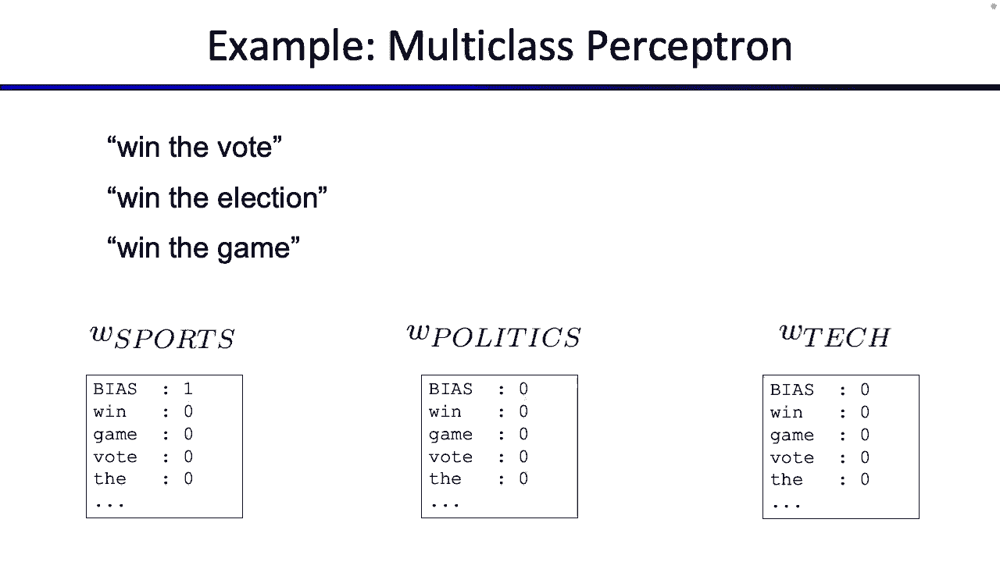

# CS188 伯克利最新AI课程--人工智能入门推荐 - P26：[CS188 SP23] Lecture 25 - Machine Learning_ Perceptrons - 是阿布波多啊 - BV1cc411g7CM

 Okay， I'm going to quickly finish up something from last time， and then we'll talk about。

 our second machine learning algorithm today。 Okay， cool。

 So last time we were talking about generalizing and overfitting， which is a pretty common。

 theme in any machine learning algorithm you'll see， so not just naive phase， but any algorithm。

 you'll see generalizing well and overfitting and not overfitting rather， it's always going。

 to be something that's kind of important。 I talked about the idea of when you're learning and training data。

 you want to make sure you're， learning things about the training data and patterns that generalize well。

 You don't want to learn or memorize patterns about the training data that don't generalize， well。

 So as an example that we showed you from last time， if you're trying to learn spam and。

 ham from features like word counts， in the training data， you might get some example。

 that says something like the word Southwest occurs sometimes in ham。

 So this ratio might say something like it occurs twice in ham emails， but it occurs。

 zero times in spam emails and that's where this whole infinity ratio comes in。

 But that would say something like， well， this Southwest word never appears in spam。

 And so if you were trying to learn something from the training data， you might end up learning。

 something too specific that doesn't generalize。 Like you might say， if I see the word Southwest。

 I know it appears in spam for my training data。 I know that it never appears in spam for my training data。

 So that must mean that when I see the word Southwest， I'm just going to guess ham every。

 single time。 And I must be right。 Right。 So if you're like， I'm going to get my training data。

 that's good。 But that's not going to generalize well， because those the word Southwest never appear。

 in spam ever， probably not。 That might just be some feature of our training data that we don't want to learn or memorize。

 or generalize。 Okay， or over fit to。 That's kind of what went wrong here， right？

 Similarly on this side， you might have something like screens， maybe screens appears like twice。

 in ham， but zero times in ham。 But if you see the word screens。

 you don't want to instantly say it's spam。 That's something that's specific to this piece of training data。

 And it's not something that would generalize well。

 So we talked about we want to somehow do something to correct that， right？

 And the way that you correct or regularize to prevent overfitting is different depending。

 on the machine learning algorithm you're using。 But for naive base。

 which is what we talked about last time， where you build a base net。

 you learn the numbers in the base net based on the training data accounts， there's only。

 we can do it， which is called smoothing。 Okay。 So what kind of two problems happen here？

 So one problem that we saw was overfitting。 You learn patterns that were too specific， right？

 Another problem kind of phrase the same way is that because you were learning things that。

 were too specific， you weren't generalizing well to events that you haven't seen before。

 So for example， back here， we generalize or we didn't generalize， we over fit to the fact。

 that the word Southwest only appears in ham and never in spam。

 We didn't generalize to a case where maybe that word does appear in spam or maybe the。

 word screens does appear in ham。 So we didn't generalize very well。 Right。

 Another way of putting that is we didn't really account for events that we haven't seen before。

 And what's the whole point of machine learning？ The whole point of machine learning is not to get accuracy on our training data set。

 The whole point is to get accuracy on our test data set or the data set that is going。

 to be provided to us when we're ready to unleash this classifier on the world。

 So we want to be able to do well， not only on the training data that we've seen， but also。

 on training data that we've never seen before。 So if you're building your robot and your robot knows how to respond to events。

 right？ You want to make sure that even if the sun doesn't come up one day， the robot knows how。

 to respond to that。 Does your training data， like those are past data。

 have any records of the sun not coming， up？ Probably not。

 but sure our robot be able to respond to that， even though they haven't， seen it before。

 that would be nice。 So that's generalizing。 So there's lots of different ways to do it。

 One way that was suggested by Laplace many hundreds or however many years ago， it's pretty， simple。

 Because let's say we're doing our maximum likelihood estimation from last time， where。

 we said you pull a sample out of some jelly beans and you get two reds and you get one， blue。

 And I want to know how many jelly beans are red or what proportion all the jelly beans， are red。

 If you were just doing maximum likelihood estimation from last time， we showed you mathematically。

 a proof that the best thing you can do to maximize the probability of this sample occurring。

 based on the troop distribution is just to take account and we prove that to you。

 So if you're just using maximum likelihood from last time， you'd say two thirds， right？

 Two thirds red， okay。 Two thirds red， which I wrote in blue。 Okay。

 So that's how you do it with maximum likelihood。 And so what Laplace says is， well。

 this doesn't do well because it doesn't generalize， the events that you haven't seen before。

 So what you can do is you can just pretend that you've seen everything one more time that。

 you've seen it before。 So in this case， what we do is we'd imagine one extra red。

 So I'll make the colors right。 So we're just going to imagine there was one extra red。

 We didn't see it， but we'll pretend there was one extra red。 And then in our sample。

 we'll pretend there was one extra blue。 And if there were more colors。

 we would imagine one more of each， right？ That's it。 It's pretty simple。 So whatever samples we get。

 we'll pretend that we saw one more of everything， even the， ones that we never saw before。

 So that should eliminate some of those weird issues that we had earlier， whether we're。

 like zero counts or there are things that we've never seen before。

 We'll account for that by pretending that we've seen everything once in addition to whatever。

 sample we saw。 And all these equations here， just say what I said in math。 Okay。

 So now if we have these imaginary samples that popped out， what's the estimate if we use， Laplace？

 Well， now there are five samples instead of three。

 Three were real and two were the ones that I imagine。 How many of them are red？

 Now we get something like grief is red。 So that's my new estimate。

 I choose to go with Laplace is smoothing。 Right？ Okay。 And I mean。

 you can also generalize this or do this with more than one example。

 So if you wanted to do more smoothing， you were in satisfied with just seeing every。

 example one extra time and you wanted to smooth out this distribution even further。

 you can see more。 So maybe I could say， actually， I want to see， you know。

 two copies are red and two copies， of blue。 And I want to see two extra copies of everything that I haven't seen before。

 where I could see， five extra copies of things I haven't seen before， right？

 I can see a hundred extra copies of things I haven't seen before。

 So you can generalize this or you can tweak this how you like， right？

 And what you'll generally notice is that the more smoothing you do， so I think this is。

 on the next slide， so let me make some of this go away。 Okay。 So now we have this parameter K。

 K represents the number of times you're going to see things， you haven't seen before。

 So if K equals one， throw in an extra red， throw in an extra blue， K equals 10， throw。

 in 10 extra reds and 10 extra blues。 And what you'll usually notice is that as K cranks up higher。

 you get more of a uniform， distribution and the sample that you get matters a bit less。

 So if we don't do any smoothing at all， we get two thirds one third， there's a bias toward， red。

 That's from our sample。 We do K equals one， we add one red one blue， we get three fifths red。

 So it's starting to kind of get closer to 5050 because we're throwing in more uniform distributions。

 If we imagine the same number of reds and the same numbers of blue， that would be a uniform。

 distribution。 And if we crank this all the way up and we see a hundred reds and a hundred blues。

 one， out of the ratio gets really close to 5050。 So this little knob that you can turn as you're adjusting your algorithm tells you how much。

 do you believe in a prior uniform distribution versus how much do you believe in your sample。 Right？

 And the whole purpose of this is to make sure that when K equals zero， you might have some。

 issues with not seeing things before。 So you can adjust K to pretend like you've seen some unseen events before。

 That's going to help us remove some of those zero probabilities from earlier。

 So if you do this on our spam data set from earlier， what we can do is maybe say you've。

 pretending sorry， what you can do is you can say maybe you've pretended to see every word， once。

 So now some of those zeros have gone away。 And now you get ratios that I think make more sense。

 So here are the words that are most likely to be in hand versus spam。

 So the ratio of appearing in hand versus appearing in Sam is highest and vice versa。 Right。

 And so maybe these words make a bit more sense than those weird infinities that we saw earlier。

 So for example， apparently the word how vetica appears much more commonly in hand than spam。

 or the word seems appears very commonly in hand compared to spam。 Right。 Is there relative ratios？

 And these kind of make sense too。 Like the word money appears a lot in spam compared to hand。

 And the word credit appears a lot in spam compared to ham。 So this kind of makes sense。 Right。

 What the heck are these two？ What is how vetica and whatever Donna is trivia？ What are these two？

 Yes。 They're fonts。 Okay。 So it's kind of interesting。 Why are the fonts bubbling up？

 It seems like somewhere in this data set， maybe we learn something that we didn't even。

 know about from before， which seems to say that if something is formatted in the hell， vetica font。

 maybe we think it's ham。 Something is formatted in verdana font。 We think it's spam。

 So it's a interesting side effect that popped out。 We didn't know this from before。

 but as we did machine learning， some interesting feature， popped out。

 So maybe spammers really like verdana。 I don't know。 Okay。 So that's how you smooth things。

 That's how you solve the overfitting problem that we talked about last time in the context。

 of naive base。 Great。 So no more overfitting。 Okay。

 So even though we don't have overfitting anymore， we do introduce one more thing， which is we've。

 introduced another like little knob or little dial you can turn on your algorithm。 So before。

 all we have to do is learn the parameters from data， but now you have a little， knob you can turn。

 So your naive base algorithm can come in lots of different settings。

 You can have a K equals zero setting。 You can have a K equals 100 setting。

 You can have a K equals 20 setting。 So we have another knob you can turn。

 which is what K do you like？ How much smoothing do you want to do？

 How much smoothing do you not want to do？ And this is not something you can really learn from data。

 right？ It's kind of hard to look at the data and immediately conclude what the best K is。

 So this little knob that you can turn on your algorithm is something we call the hyper parameter。

 Weird name。 Hyper parameter implies that it's not a parameter you're trying to learn from the data itself。

 because this number， the right K to use is not something that comes from the data itself。

 It's something you have to kind of tune。 It's like a little knob that you have to adjust and you have to pick the K that makes。

 your algorithm work best。 Well， which K makes the algorithm work best？ I don't know。

 We have to try a few and figure it out。 So how do we try a K and see if it's good or not？

 Should we just try the K on the training data and see if it works well？ Well。

 it's not going to work because if you think about the training data， what's the best。

 K for the training data？ K equals zero is the best for the training data。

 If you don't do any smoothing， then your classifier can memorize everything there is to know about。

 the training data and get a hundred percent training accuracy and you're happy with K equals， zero。

 But is that going to generalize？ Not really。 So we can't use the training data itself to test for the best K because the training data。

 will always tell you that zero is the best K。 Don't do any smoothing。

 Let me memorize as much as I can and I'll get the highest accuracy。 But that's not what you want。

 You don't want training accuracy。 You want test accuracy。 So what do we do？ Well。

 we don't also want to use the test data。 So remember from last time we said when someone gives you a pile of pre-labeled data。

 you want， to set some aside as the test data and the test data。

 You don't ever want to peek at it because that's what you want to check at the very end。 Steve。

 you're doing well。 So you don't want to peek at the test data just like you can't peek at our final exams。

 which is you want to。 So we can't peek at the test data。

 We can't use the training data because the training data would always tell us that the。

 least amount of smoothing is best so that it can memorize as many patterns as it can and。

 it wouldn't generalize。 So here's what we do。 We have to introduce a third subset of our training data。

 So when we take our training data that's given to us， we're going to split it in three。

 instead of just two。 There's training data。 This is what you get to touch and use to learn the parameters。

 Right？ There's also held out data。 So this is the new set that we haven't talked about before。

 And this held out data， you are allowed to train on it。 So you're allowed to peek at it。

 It's yours to look at。 But you're not going to train on it and learn the parameters from it。

 These held out data is kind of like your simulated test data。

 So you keep this held out data for you so that you can occasionally look at it and check。

 whether or not you're overfitting。 This test data， you're not straining on it。

 but you're using it to check whether your， hyperparameter choice was good or not。

 And then you kind of alternate between training and held out a little bit。

 So maybe you try K equals zero。 You train on it with your training data。

 See how well the held out data was。 Try K equals one。 See how well your held out data did。 Right？

 And you try it over and over again。 And eventually you pick a K that you like and only after you're completely done。

 So you're like final answer。 This is my classifier。 This is my K。

 These are my parameters only when you're completely confident on everything or you're。

 allowed to like present this to the test data and this is data will tell you how well。

 you did the test data。 You have to set aside until the very end when you're confident。

 The held out data is for you to play around with to tweak your hyper parameters。 Okay。

 so there's three different datasets and we have to use all three。

 But all of these come from the same original training data set。 So you get your training data set。

 which doesn't split into three and you make the， split yourself。 You train using the splits。

 Use the test data to see how well you did。 And once you're done。

 you have your test data tells you how well you did and then you。

 can present your classifier to the world。 Okay。 And what is this pattern here was a little chart。

 the little chart shows you some of the， things that we talked about。

 So your training data is always going to prefer lowcase。

 So here's the case where when K equals zero training data gives you the highest accuracy。

 Why is that？ Because if K equals zero， there's no smoothing at all。

 You just use the exact counts that we had before and that would allow your classifier。

 to overfit a lot， which it'll be really happy to do on training data。

 It's going to overfit a lot and memorize lots of patterns。 Right。

 And it's going to get high training accuracy。 But that's not what you want because the held out data and the test data。

 both of which， are pieces of data that you're not training on and you haven't seen before。

 they're going， to have lower accuracy if you do that。 So you don't like that。

 What you would prefer is you prefer a case somewhere in this area。 So we'll switch colors again。

 You'd prefer a case somewhere kind of like in this area right here， right？

 So the training accuracy is a little bit worse， but that's okay because you're not trying。

 to get maximum training accuracy。 You're trying to get maximum test or held out accuracy。

 So you choose a K around here， you realize that the held out numbers are pretty good。

 And that probably means the test numbers are going to be pretty good as well。

 So you pick a number around here， that's a good K because it balances good held out accuracy。

 and good test accuracy。 But also be careful not to go too far because if you crank up K too far like out here。

 what's， going to happen？ Use smooth too much。 And suddenly all the information from your samples is starting to kind of disappear。

 It's kind of like from before where we cranked K up to 100。

 Now the distribution really looks close to 50/50。 And we weren't able to learn anything about the sample showing us that maybe there are。

 more reds than blues。 So if we go too far out here， that's something that's called underfitting。

 It's like you're not learning anything about the data。 So you had the data。

 but you didn't learn anything from it。 That gives you poor training accuracy and poor held out accuracy and poor test accuracy。

 So they don't want to overfit， which would happen over here。 Your training accuracy is great。

 but your test accuracy is bad。 But you also don't want to underfit where you're just cranking K too far up and you're。

 not able to spot any patterns because you crank K too far up。

 It's like dominating any useful information that was in there。 Okay。 So that's naive phase。

 I will quickly speedrun the rest of these slides so we can talk about perceptron。

 But naive phase is good。 It's not perfect。 There are examples of errors that naive phase might get wrong。

 And it's not even really clear what you do if you get these wrong。 So if you look at these。

 is it really obvious which one's spam and which one's ham？ I don't know。 It's kind of weird。

 You can read them on your own time。 But sometimes errors happen。 Sometimes to solve errors。

 you have to introduce better features。 Something we'll talk about next week or on Thursday。

 But for today， we're going to switch gears a little bit and think about is there a way。

 we can take these features， try to minimize errors and build a classifier that way。

 One last general machine learning idea from last time before we move on， machine learning。

 accuracies， there has to be some sort of baseline。

 So if I present to you a classifier and I say this classifier is 70% accurate。 We're like。

 is that good？ Is that bad？ If it's good or bad， 70% good or bad。

 that depends on what the baseline is。 So sometimes what you need to do when you're writing your fancy little research paper is。

 you have to define a baseline， pick a really simple algorithm。

 Your algorithm could be as simple as random guessing or some existing algorithm that someone。

 else came up with。 That's your baseline。 So maybe in the spam。

 ham classification will be a good baseline， maybe like 50% because。

 that's what you get when you guess。 So if you get。

 I have a classifier that can classify with 51% accuracy， well， that's not。

 super impressive because anyone could have guessed 50。

 But if you have a classifier that can do like 80% accuracy， that's pretty good。

 This is a lot better than guessing。 But you need some sort of baseline to tell you what percents are good or bad。

 That's what this slide says。 Okay。 Any final thoughts on naive phase or any of these general machine learning themes before。

 we move on to perceptrons？ Okay。 Let's do perceptrons。 Our second machine learning algorithm。 Okay。

 It's going to look a little bit similar at the beginning and then we'll talk about how。

 it differs from naive phase as we go on。 So we're going to do the same thing as we did last time。

 This is a picture that's really similar to what you saw last time， which is someone gives。

 you an input。 We're going to call it X。 So it could be a spam email， like a piece of text。

 it could be hammer spam， or it could， be like a picture， like in this case， that's a picture。

 You're going to take your X and then you're going to featureize it。 So you're going to take this X。

 run some little piece of code， and then out pops a bunch of， features。

 How do you get these features？ I promise you we'll talk about them on Thursday。 Nowadays。

 most algorithms will learn these features， but for now pretend that somehow， some way。

 someone has taken this X and converted it to features。 So now it's called f of X。

 where if it's some feature function。 So we take this X and you've converted it from like raw text or raw pixels into some。

 feature vector， and you're hoping that these feature and vectors have a bunch of numbers。

 inside of the numbers， give you some clue or some information about this input X。 So you know。

 I have a feature， features like a vector of real numbers， could be positive， they could be negative。

 they could be zero， they could be one。 So you got this feature of a bunch of real numbers。

 And the part we're going to focus on today is what code goes right here。

 So how do you take your feature and convert it to a classification Y？

 Or your classification might be something like spam versus ham， or it could be like a digit。

 zero through nine。 So you want to take this feature， which is a vector of numbers。

 classified into some， Y。 Okay， same process of last time。 Last time。

 what went in this arrow here was a naive based algorithm。 But today。

 what's going to go into this arrow is a perceptron algorithm。 And then next time。

 we'll talk about what the feature arrows look like。 Okay。

 So perceptrons are kind of the place where people like to say things are inspired by， biology。

 And this is kind of where when people talk about like neural networks or deep learning。

 sometimes they think about how artificial intelligence is inspired by human biology。

 So it's really easy to take this analogy too far。 So don't take too much stock in this。

 But if you're kind of curious， the place for perceptrons kind of where it generated from。

 or where people got inspiration for the perceptron was in your neurons。 So somewhere in your brain。

 you have all these little neurons firing。 And the way that your neuron works is you've got this little neuron。

 it corresponds to some， thing you're trying to learn， like。

 am I looking at a human face or am I hungry or do， I want to sneeze？ I don't know。

 something like that。 But over here， you've got this little neuron。

 the neuron's trying to learn something。 And the way that the neuron learned something is it's connected to a bunch of other inputs。

 So there are all these little inputs coming in。 They're like little electrical signals coming in。

 right？ And some of the signals are good and they indicate things in the positive direction。

 And some of the neurons， their inputs are bad and they can things in a negative direction。

 So this neuron is something like， you know， I'm hungry， maybe some of these little inputs。

 correspond to stomach being empty or you needing more energy。 I don't know。

 Maybe some of these inputs are like， you know， my stomach's really full or I got to use the。

 bathroom。 Maybe they correspond to the other direction。

 But somehow your little neurons going to take these inputs and think about them， right？

 And somehow it's going to compute an output and either it fires off a signal saying you。

 are hungry or maybe it doesn't fire off a signal saying you aren't hungry。

 So people kind of thought about this。 They realize it kind of looks like a circuit where your circuit also has a bunch of inputs。

 You take the inputs， you combine them somehow and you see whether or not the result is a。

 positive cross or a negative cross。 Okay。 People thought about neurons。

 They realize that neurons kind of feel like circuits。

 So maybe I can build an artificial neuron and maybe if I change these together， I can。

 get something that resembles a human thinking。 So this is where a lot of like classical inspiration for deep learning comes from。

 It's kind of cool。 But for today， we're not going to think about how you change these together or how you build。

 a like a model human brain。 We'll just think about one lonely little neuron。

 which we'll call the perceptron in， math form and we'll think about what it can do for us。

 So we'll just think about one small little neuron and think about what it can do for， us。 Okay。

 So formally in math， right， what's going on here？ You have all these little inputs。

 You're going to the neuron， some of them indicate positive， some of them indicate negative。

 Your neuron has to combine them， figure out an ultimate activation and choose whether or。

 not to blast the signal indicating your hunger or to not blast the signal。

 So what does that look like in math？ So math， what's going to happen is you're going to get an input。

 The input is the feature vector， which is a list of numbers， right？

 Each feature is going to have a weight associated with it。

 And the way it tells you whether or not this feature corresponds to the positive class or。

 corresponds to the negative class， right？ You're going to take a weighted sum of all the features and the vectors and you get a。

 number out and that numbers your activation。 It's going to make a little bit more sense， I think。

 when you have examples。 Okay。 But what you're going to do is you have a feature vector。

 you have a weight， you take， an element-wise sum， which most of you will know as a dot product。

 And if the dot product is positive， then you blast a positive one symbol。

 If the dot product is negative and you blast a negative one symbol or you don't blast。

 the signal at all。 The really simple circuit that turns out I can do pretty powerful things。 Okay。

 so I'll show you an example， which I think makes this all kind of come together。

 You're not like a brain expert， like unlike me， or like me。 There's an example。

 What does this look like？ So you have some perceptron。 What does the perceptron need？

 A perceptron needs a weight。 The weight tells you how to classify things as positive or negative。

 I haven't told you where these weight numbers come from。 And in fact。

 learning these weight numbers is going to be how you train the perceptron。 But for now。

 assume that someone's already finished training the perceptron and they've。

 presented to you this weight。 So sitting in your perceptron is this weight vector， right？

 I just copied it twice。 But this is the weight vector。

 The weight vector has one number for each of the features。 The numbers again can be real numbers。

 They can be positive。 They can be negative。 So here。

 this one says that the weight corresponding to the feature number of times the word free。

 occurs is positive four。 And the weight corresponding to number of whether your name appears in the email is negative。

 one。 And the weight corresponding to zero word misspelled is positive one。

 And the weight corresponding to the feature is the email from your friend， negative three。 Okay。

 I don't know how I got these， but someone gave them to me。 Now what happens？

 How do you classify the way that you classify as someone walks up to you in the hand you， an email。

 which you vectorize and how you vectorize that。 We'll talk about that in the future。

 But somehow you take this thing， you convert it to a bunch of features。 Here are the features。

 You could have done this kind of in your little piece of code。 So maybe you take your email。

 you count up the number or times the word free occurred。

 You check whether or not it's got your name in it。

 You count the number of words that are misspelled。 You check whether or not it's from your friend。

 And you get these numbers out。 And this number represents the email that was given to you。

 So how do you tell whether this email is ham or spam？

 The way the perceptron says to do it is it says， take a dot product。 So take your feature。

 take your weight， multiply them together element wise， check if it's positive， or negative。

 So let's do that。 Zoot dot product。 You ready？ Okay。

 So what's four times two is eight plus negative one times zero is zero plus one times two is。

 two plus negative three times zero is zero。 So I did the math， I had it together。 I get 10。

 10 is positive because it's positive。 I think this email is spam。 That's it。

 You want to do another one？ Let's do the other one。 So four times zero。

 zero plus negative one plus one plus negative three。 What is that up to？ It's not only negative。

 I think。 So this one is negative， so I think it's ham。 That's it。 Someone gives you an input。

 You convert it to a feature vector。 You take a dot product with the weights。 It's positive。

 You guess the positive class， which here is spam is negative。 You guess the negative class。

 which is ham。 That's it。 So when you want to classify things。

 all you have to do is take a dot product and check， it's sign。 The question is， what is x1 here？

 X1 is just one of the emails。 So we set that x corresponds to the input。 If we say x1， x2。

 those are two different emails。 The f functions as we're converting it to a feature vector。

 which is this list of numbers， then we dot them with the weights。 Right？ Okay。

 So the classification， the math behind it is super simple， but it helps to think about， like。

 what's the intuition behind it？ Right？ So let's look at a picture version and think about what the intuition is。

 Okay。 So here's the question about what if it's zero， that would be a tie。

 So you have to pick your own type breaking mechanism， but it's not super interesting。

 The more interesting thing is whether or not it's positive or negative。 Okay。

 Other interesting things we can look at are like， maybe check out what these weights are。

 So it seems like， you know， number three has a large positive weight。

 So what's going to happen is if there are more instances of the word free and you multiply。

 it by this large positive number， the overall dot product is going to do what it's going， to go up。

 right？ So this number positive four tells us that the more times the word free occurs， the higher。

 your activation is going to go。 That seems to imply that the number of free。

 this feature seems to be positively correlated， with spam， right？

 This positive number says the more time the number of freeze occurs， the more time you。

 see the word free， the higher the weight's going to go because you're going to multiply。

 a higher number by four and that's going to cause the spam has to be more likely。

 But these positive numbers kind of seem to clue us in that these features indicate spam， right？

 And then these negative numbers seem to clue us in that these features mean ham because。

 if these features have higher numbers and you multiply them by a negative number， that's。

 going to cause the overall activation to go down and it's going to push your thinking。

 in a negative direction。 So another way of thinking about these weights is to kind of tell us whether or not these。

 features correspond to spam and they would push our guests in a positive direction if。

 the features are on or high or if the weights are negative， that would tell us that these。

 things should push our guests towards ham， the negative class。

 So the features are on or the features have high value， multiplying them by a negative。

 number will push our activation down。 That's another way of thinking of these weights。

 They tell us whether or not something is correlated spam or they should hint us toward the spam。

 class or whether they should hint us toward this ham class。 And somehow we have to learn these。

 okay？ Those are the weights。 That's how you classify。 No question。 Okay。

 I think the thing that maybe， I don't know if this answers your question， but I think the。

 thing that often trips you develop at this point， these weights do not correspond to， one email。

 right？ These weights are one weight per perceptron。

 So your whole algorithm just has one set of weights that you use over and over again on。

 every email。 So that's why in this case， even though I got two emails back， I dotted them with the。

 same weight vector and that one weight vector is what you have to learn。 Okay。 Other questions？

 Yeah。 Yeah。 There was a question about what if there are more labels？

 Ask me again in like 20 minutes because it will answer your question。 Okay。 Great。

 That's a perceptron。 That's how you classify it。 I haven't told you how to find the weights yet。

 Okay。 Before I can tell you how to train the weights。

 I have to give you a bit of geometric intuition。 So if you don't like geometry， I'm sorry。

 but we'll have to draw some pictures。 So let's draw some pictures。 If you have a vector。

 I can represent it a couple of ways。 So maybe you've seen these before。

 So you've got a little vector， right， or a little list of numbers， like two comma three。

 I can draw it a couple of different ways。 I can take my coordinate grid and I can stick a point on it。

 That's two comma three， right？ The other way I can do it is I can draw a vector in space and that vector or also corresponds。

 to two comma three。 Right。 This vector is not on any grid。

 but it's just some vector sitting in space that points， two to the right and three up。

 Both of these are equal or equivalent ways of representing two comma three， and we're。

 going to use both to give you intuition in two different ways。

 But make sure you're aware that these are two different things。

 So sometimes I'm going to draw the weights and the feature vectors as points。

 Sometimes I'm going to draw them as arrows。 Okay。 It's really easy to get them confused and get lost in all the geometry。

 But the goal here is to give you the intuition。 So when you see points。

 those points might correspond to features。 When you see a feature vectors， when you see an arrow。

 that can also correspond to a feature， vector or some list of numbers。

 But these are two different things。 They're going to see two different interpretations as we get one。

 Okay。 This is where two dimensions。 I can also do more dimensions。

 So imagine if you had like four features or 10 features or 100 features， you can have a。

 list of more numbers too， but I can't draw 4D for you， unfortunately。

 So you're going to have to imagine that somewhere in higher dimensional space。 So for today。

 most pictures are going to use like two dimensional where we have two features， you know。

 and two weight numbers。 But know that this can happen in higher dimensions is just impossible to draw。

 Okay。 Okay。 More vector review。 So maybe this looks familiar。 Maybe it's not。

 but I just want to give it to you just in case。 So this is a formula that we're going to come back to a couple of times today。

 So maybe do some like more flashbacks to your class and maybe remember that dot products。

 are a function of magnitude， how big the vectors are， which is going to be some positive numbers。

 And that's positive。 That's positive。 Right。 Times the angle between the two vectors or the cosine of angle between the two vectors。

 Okay。 What is the consequence of this？ The consequence of this is if you have two vectors that are similar。

 and what I mean by， similar is that their angles are pretty small， like they're close together。

 So like these two， I think would be quite similar， but these are not really similar。

 So what's going to happen is if you have two vectors that are really similar， they're。

 going to have a larger positive dot product。 And you can think about how the angle between them proves that and this formula proves that。

 But what's important for you to know when you're trying to think about the intuition is that。

 if two vectors are close together or they're similar， that's going to cause the dot product。

 to be large and positive， if the two vectors are kind of less similar， then the dot product。

 is going to be lower。 So by show you， you know， these two vectors versus these two vectors。

 the one on the right， is going to have a smaller dot product because they're less similar because they're further。

 away from an angle standpoint。 Right。 And if you go all the way further away such that their former right angle。

 like 90 degrees， dot product is zero because cosine of 90 degrees is zero。

 And if you go even further away， then the dot product starts to become negative。 Okay。

 So if you see two dot products， if you see two vectors， how do you convert the two vectors。

 into a dot product， you can either just multiply their numbers together， which is what we did。

 last time。 But equivalently， you can also geometrically look at them and think about the angle between。

 them and the smaller the angle， the larger the dot product。 The angle is 90 degrees。

 That product drops all the way to zero。 If the angle exceeds 90 degrees。

 they're so far away that the dot product is negative。

 So this is how we're going to measure how close vectors are。 Okay。

 Something about perceptrons on this slide is just to make sure you get the vectors that。

 we're about to show you。 Okay。 Back to perceptrons。 If you're happy with my math review。 All right。

 So here's what we're going to do。 I'm going to draw the vectors for you again。 But this time。

 instead of just showing them to you in numbers， I'm going to draw them all， as vectors。

 So remember how he said there's two interpretations throughout the points and grids for now。

 We're just going to do vectors。 Okay。 So the weight vector， well， that's just a list of numbers。

 So I can draw it as an arrow and it points in some direction， right？ If it's 2D。

 I can draw the direction。 If it's like 3D or 4D， I can't really draw the direction。

 But you can imagine that this vector points off in some direction somewhere。 Okay。

 So that's my weight vector。 And again， this is one weight vector perceptron。

 So when you have your perceptron， it's got a single weight vector。 And when I classify。

 I always classify against the same weight vector。 Okay。 So suppose some input comes in。

 So you got your first email and you want to classify it。 So what do you do？

 You convert it into a feature vector， which is what we've done for you。

 And the feature vector looks like this。 And guess what？

 A feature vector is also a list of numbers so that I can also draw it as a vector and。

 it's also got a direction。 So here it is on this slide。 I've got this feature vector。

 It points off in some other direction， right？ And I'm going to give them the same version。 Okay。

 They're the same starting point。 So both of these are a list of numbers and I've drawn them as vectors。

 And as vectors， they have directions。 And so how do you compute the dot product？ Well。

 if I had the numbers， I could just multiply them together and compute the dot。

 product just like I did earlier。 But if I want some geometric intuition。

 I can also think about the dot product as the， angle between them， like we just said。

 So this little angle between them， if it's a small angle， that means that this feature。

 vector looks really similar to the weight vector。 So it's going to have a high dot product。

 If this angle between them is really large， it means that the dot product is going to。

 be smaller or zero or negative because the two weight vectors are the weight vector and。

 the feature vector are very different from each other。 Okay。

 So one way I can geometrically think about the similarity or the dot product between these。

 two vectors is just to look at the angle between them。 That's what we're going to do。

 So I look at this angle between them and I ask myself， well， what do you think？

 Is that less than 90 degrees？ Is it 90 degrees or is it more than 90 degrees？ Less than 90 degrees？

 Okay。 Good。 You remember your geometry。 This looks less than 90 degrees to me as well。

 That means that these two are pretty close together。 So the dot product is going to be positive。

 And since the dot product is positive， I'm going to guess positive class， which in this。

 case is spam。 So I can reason these out geometrically as well。

 What if another email comes in and it's this email， right？ Again。

 I compare these emails to the same weight vector。 There's just one weight vector the whole time。

 So now I'm looking at this angle right here。 And I think about the same go right here。

 And I think is it less than 90 degrees？ Is it 90 degrees exactly？ Is it more than 90 degrees？ Okay。

 Good。 Remember your geometry。 So it's more than 90 degrees。

 That means the dot product is going to be negative。

 And that means I'm going to predict the negative class， which in this case is him。

 So I can look at the angle， geometrically， and tell myself whether or not it's spam or， him。

 So here's what's going to happen if you do this over and over again， right？

 You might start to notice there's like a boundary sitting here that we can draw， right？

 Like if I draw you arbitrary vectors， you can probably just look at the angles and tell。

 me whether or not it's hammer spam。 So for example， I'll do a speed round。 Okay。 So what is this？

 Spam， spam， spam， right？ I can do speed rounding kind of generally look at the angle and just tell me which one。

 is spam and which one is ham。 And so what it really seems like is when I drop a vector down on this picture。

 you can， tell whether or not it's hammer spam by looking at which direction it's pointing relative to。

 the weight vector。 And where's the kind of separating line that tells you which emails are ham and which emails。

 are spam？ Well， it's going to be something like this。 So I'm going to do my best to draw this。 Okay。

 see it does a kind of dotted line。 Okay。 So what's going to happen is any vector that points in a direction kind of above this line。

 So any of these arrows that I'm going to waste my time drawing， right？

 All of these are going to be spam emails because all of them have angles with W that。

 are less than 90 degrees， right？ Now I realize I have to erase these so I kind of regret that。 Okay。

 I'll do my most of your race。 Okay， right。 But also if I take any feature vector and that feature vector ends up down here in the。

 lower half。 So if I draw a feature vector down here， oh， what did I do？

 If I draw any feature vector down here， I know that it's got an angle with W that's greater。

 than 90 degrees。 So that's going to be classified as ham or the negative class， right？

 And so it really seems like what happened is I can draw this line。

 That's kind of like perpendicular to the weight vector at exactly angle 90 degrees。

 And this separates out all the possible arrows I can draw into two halves。 Top half。

 closer to W is ham or spam， positive class， lower half is further away from W。

 Those are all the ones where dot products going to be negative。 This gets the negative classes。

 Right。 There was a question about how do you draw these in their 4D？ Well。

 4D vectors still have directions is just kind of impossible to draw on a slide。

 They still have directions and they still have angles。

 You can still compute angles between 4D vectors。 Okay。

 Just don't think about it too hard or else your brain is going to like collapse into a， black hole。

 Okay。 Right。 But what you notice here is that with this perceptron。

 I've basically taken this entire， space of vectors and I've kind of split it into two halves。

 One half is closer to W。 That's the positive class half and one half is further away from the W。

 That's the negative half。 Right。 The addition boundary or the place where they split in two is this line that cuts kind of。

 90 degrees from W。 That's where the dot product is zero。 So really if something were to fall here。

 like exactly on the 90 degree line， the answer， would be， I don't know the dot product is zero。

 It's a tie and I have to break the tie as the Marvertray away。 Okay。 That is a geometric intuition。

 You're like， why did you give me this？ I understood the numbers version just fine。

 I promise you when we're training， this version will be helpful。

 But this is the vector version of perceptrons。 Yeah。 So there was a question earlier too。

 What if you want to do multiple classes， you will see this in like 10 minutes。 What did I say？

 I said 20 minutes last time。 Now it's 10 minutes。 Okay。 So it's getting closer。 Okay。

 So this is kind of like perceptrons version two， it's the exact same algorithm and the exact。

 same classification。 I've just drawn it using vectors and angles this time。

 which will be useful when you think， about training。 Okay。

 So there's a third way to draw perceptrons， which is using the points。

 So let's draw out of draw the third way。 This way I think is the most intuitive way to look at it。

 So if you see this， you're going to be like， Oh， duh。

 But this is also unfortunately not the best way to think about training， but it's still。

 useful to think about。 So another way to think about perceptrons that is pretty useful is to think of the feature。

 vectors as points。 Just like we talked about earlier。

 there's different ways to think about feature vectors。 So you can think of them as points as well。

 And for example， we have this 2D again， only two features because I can't draw more dimensions。

 but we have this like little 2D grid here and any email that gets vectorized that comes， in。

 I can draw it on this grid。 So for example， if I get an email that's like， read。

 just the word free appears once， and the word money appears zero times。

 that would be at this point right here。 Or if I get an email that says， free money。

 last expand email， right， that would show， it right here because there's one occurrence of free and one occurrence of money。

 Or if I get an email that's like， money， money， money， money， money， money， well， that would。

 appear like up here， right， because the word money appears a lot and the word free doesn't， appear。

 So anytime you get an email， you can vectorize it， you can do the word counts or whatever。

 features you have， and you can plot them on this grid， right？ Okay。

 so what would the perceptron say to do？ The perceptron would say， well。

 you take your email and you feature it， so you convert it， to this list of numbers。

 and then you take a dot product with the weights。 Again。

 I still haven't told you how to find these weights， but suppose that for this。

 particular perceptron， the weights are four and two。 So four for free and two for money。

 So what would you do？ You would take your feature vector。 So like， suppose you have the email。

 free money， which is right there。 So what would you do？

 You'd take four times the number of times the word free occurs， which here is one， right？

 You'd add it to one times the number of times the word money occurs， which here is one。

 And what would you do？ You'd check if it's greater than or equal to zero。 So you'd ask yourself。

 is this positive or is this negative？ You'd do this comparison， right？ Sweet at this a little bit。

 What is this？ This is a line in 2D， right？ I can actually draw this line。 In fact， sorry。

 this was two， not one。 The feature vector said money had weight two。 This is a line， right？

 I can draw this line。 So in particular， I can draw the line four times three plus two times money is equal to zero。

 This is a linear equation。 So I can bring back my worst flashbacks of algebra one and I can draw this line。

 right？ So I actually don't remember what this line looks like， but I think it's something like。

 maybe it's like this， maybe it's two the other way or one the other way。 I don't know。

 but it's some line， right？ I agree。 So that's some line。

 And then what is the kind of area where things get classified as positive？

 The area where things get classified as positive is where four times three plus two times money。

 The dot product is greater than zero。 Where is that？ That's probably like some half up here。

 So everything up here。 So if any point lands up here。

 you get positive and then if any point lands down here， you， get negative。

 So this is another intuitive way of looking at it， which is you take the equation W dot。

 F equals zero， which is going to be a linear equation because you're just multiplying and。

 adding things together。 You take this linear equation and you plot it and you get a line or in higher dimensions。

 like a plane or even higher dimensions， something called a hyperplane。

 And what's going to happen is your line or your plane or your hyperplane is going to。

 split the grid into two。 Just like we saw earlier with vectors。

 you get this thing that splits the space into two。

 And now everything on one side gets classified positive and everything on the other side gets。

 classified negative。 So anytime you drop a little feature vector as a point on the grid。

 you can see whether， it falls in the positive half or the negative half， right？ So there's the line。

 I think that's the right line， I don't know， but one half of it is where the dot product。

 is negative and the other half is where the dot product is positive。 How did I do this？

 This is just simple algebra， right？ So nothing too complicated。

 I just took my dot products and converted them into something algebraic。 Okay。

 And this gets us kind of a nice interpretation where you have all these points sitting on， the grid。

 right？ And you kind of build a fence like a line or a plane or a hyperplane。

 You build a fence and everything on one side of the fence is one class and everything on。

 the other side of the fence， you guess， is another class， right？

 Very intuitive way of thinking of perceptrons。 So you can think of them as the numbers in the dot product。

 That was the first one that we showed you。 You can think of them as vectors and you can think of there being this 90 degree split。

 where everything less than 90 is the positive class， everything greater than 90 is the。

 negative class， the vector version， where you can think of them as the points version。

 where you plot a bunch of points on a grid and you write the equation w dot f equals， zero。

 which gives you the splitting plane， everything on one side is positive， everything。

 on the other side is negative。 All of this I've shown to you in two dimensions。

 but there's no reason why you can't do it in， higher dimensions。 It would just look really weird。

 Okay。 Sounds good。 Okay。 So now using three different ways of thinking of the same perceptron。

 so I can finally show， you how the weight updates work。

 I'll show it to you a couple of different ways because we have several different interpretations。

 and you just can pick the one you like best。 Okay。 So I'm going to go to the wall three。

 just another one that makes the most sense。 Okay。 So what are we trying to learn？

 So whatever you're doing these algorithms， you sometimes get lost in all these symbols。

 like what's X and what's F of X， we should stop and think， what are we trying to learn？ So remember。

 what are we trying to learn？ It's W。 The only thing here that we don't know and we have to figure out is what numbers go in。

 W。 So in this case， what was the weight or responding to free should it be like a positive number。

 which would imply that free pushes you toward spam class or should be a negative number。

 which means that free pushes you toward the ham class。 Should it be a large number。

 which means that is a strong indicator or should it be a small， number。

 which means it's like a weaker indicator， right？ So what we have to learn is the W weights。

 Things we don't have to learn are the features。 What are the features？ They come from the input。

 the training data。 So if we don't have to learn， that is given to us。 W。

 we do have to learn and we want to learn W using all the feature vectors that are given。

 to us in the training data， right？ So the normal machine learning process is someone gives you a bunch of training data。

 you learn some parameter， which in the naive phase model， it was a bunch of probabilities。

 but here is the weight vector W。 And once you learn it， you can do classification。

 But here's the algorithm to do it and then we'll show you a couple of ways of thinking， of it。 Okay。

 so this is the kind of points on a grid way of thinking of it， right？

 It's our favorite little intuitive way of thinking of it。

 If you follow these points and you draw a line that split them into， here's how you do， it。

 So you start with the weights that equals zero or you pick your favorite starting point， right？

 And here's what you do。 Someone gives you a piece of training data。 What's the training data？

 The training data is a pre-labeled example。 So they give you an email and it tells you this is spam。

 Because your training data is labeled for you。 Or someone gives you a piece of email and says this is ham。

 So it's labeled for you。 So you take this email and it's labeled for you。 What are you going to do？

 You're going to featureize the email， so convert it to a bunch of numbers。

 You're a list of real numbers， right？ You're going to do。

 You're not going to peek at the true answer yet， so you're going to take this。

 You're not going to peek at the answer and you're going to try to classify it based。

 on your current weights。 If you have weights， you can classify it just like we showed you already。

 So you're going to try to classify it based on your current weights。 In this picture。

 what that would look like is someone has this little point for this little。

 training example and they've given it to you and they want you to guess which one it is。

 They're not going to tell you which one it is yet。 They're just going to ask you any guess。

 And so in your 2D example， all you have to do is see which side of the line it's on。

 Is it on the negative side or is it on the positive side？

 So you have this little point that's kind of floating down and you kind of look at it。

 and you're like， this looks like it's on the positive side， so maybe it gets positive。

 So that's your first step。 Someone gives you a point in your training data without telling you what the class is。

 and you figure out what your classification is。 So do adopt product or computer and angle or see which side of the fence it's on。

 Okay， great。 And then only after you make a guess， the real answer is reveal to you。

 Why is the real answer revealed to you because this is your training data and you know what。

 the real answer is。 So the little point comes to you。

 you make a guess at it using your current weights and， then the true answer is revealed to you。

 So they say， this is a plus or this is a minus revealed to you。 So what do you do？ Well。

 if you guessed correctly， that must mean that your weights are doing pretty good。

 Your guess matched what the real answer is。 So you have pretty good weights。

 So you're not going to touch anything。 If the weights are good。

 you're pretty happy with the weights。 They gave you a correct answer on this particular training point。

 So you're going to leave everything as is and move on to the next example。 That's good for you。

 But what if the weights are wrong？ Well， if the weights are wrong。

 we have to do some sort of adjustment。 So what do we adjust？ Well， you can adjust F。

 F is the point that was given to you， right？ You can't change the email and be like， well。

 I'm going to change the email。 You can't do that。 That's the training example。

 But you can change W because W is where you're trying to learn。 So we're not going to change F。

 but we're going to change W。 So if we're wrong， we're going to change W。

 And what's going to happen if you change W is this fence is going to kind of move around。

 a little bit。 And hopefully you're going to move it in a direction that makes it so that the next time。

 you classify it， it's the right answer。 So if you're right， don't do anything。 If you're wrong。

 then move the fence around a little bit so that the next time you classify， this point。

 it falls on the right side。 Right？ You can't change where the point is because the point is the feature vector corresponds to。

 your training data。 You can't change the training data that's given to you。

 But you can change the way so you can move the fence around so that the next time you。

 try to classify this point， hopefully it lands on the right side。 Right？

 So that's the perceptron game。 You're this little robot。 You have this little fence。

 Maybe it's a higher dimensional fence， but whatever。

 And you're just going to move this little fence around so that as the points kind of drop， down。

 they drop in the right places。 Like a really weird version of like robot Tetris。 I don't know。

 Right？ But you have this fence。 You want to move it around so that when the points drop down。

 they drop in the right， place。 Okay。 That's great。 That's the point intuition for it。 It's great。

 But it doesn't really tell us how you change this feature vector。

 So how do I move this fence so that the points drop down in the same place？

 So we haven't talked about that yet。 But is everyone good with kind of the high level idea。

 which is you take your training， data， you look at the points one at a time。

 you cycle through them if you have to。 Right？ And every time a point comes to you， you make a guess。

 you classify using the current weights。 The true classes reveal to you if it's correct。

 then your weights are pretty good。 So leave them as this。 If your weights are wrong。

 then move this boundary around so that the next time you classify it。

 hopefully it falls in the right place。 But I haven't told you how to move it yet。

 The question in the chat about how do you decide which direction to move it yet？

 I haven't told you yet。 Okay。 Good news is this version， I think makes a lot of sense。

 You take your weight vector and you move it， classify as many things red as you can。

 The bad news is using this point intuition， it's not really obvious how you move the weight， vector。

 I haven't really thought of a clean way to do it。 I don't think anyone teaching this has。

 So we're going to move back into feature vector space or vector space。 Okay。

 So it's time to abandon the point interpretation again。

 Remember how there were two interpretations of this， the point version on a grid in the。

 feature vector version， where it's vectors or arrows and directions。

 So we're going to abandon this interpretation one more time。

 And I need you to switch interpretations back to features。 Okay。 So no more points。

 Let's go back to the world of features。 What was the world of features like as a refresher？

 All the vectors had directions。 You had this weight vector， right？

 And what would happen is this weight vector would split the space of vectors into two。

 And that's what this green zone is， right？ Like this is a 90 degree angle。

 And what this tells me is that if I draw any feature vectors up here， where the angle。

 is less than 90 degrees， that means that they are close to W。

 And that tells me that the angle is going to be positive。 The number is going to be positive。

 So therefore I should guess positive。 And if I have vectors that are pointing in this direction。

 they form angles that are greater， than 90 degrees from W， so I guess negative， right？

 And the split is the screen being border thing that I've drawn， right？ That's the boundary， right？

 So no more points。 We're going to draw things and vectors again。 Okay。

 So we do the same thing as we talked about earlier where we said a point is given to you or a。

 training data point is given to you。 But now the training data point isn't a point in space。

 It's an arrow。 So here's the training data point that was given to me。 This is F or F of X。

 Now I haven't told you if this is a positive or a negative class yet。

 I'm just telling you it's F and I'm asking you to do your best to classify it。

 So what would you classify it as？ With this perceptron classifier as positive or negative。

 no hands at all。 The angle between this is less than 90。 If something is less than 90。

 the dot product is positive。 The perceptron would classify this as positive。 Okay， good。

 You remember your angles。 So on this side where things are closer to W， we guess positive。

 So we look at this F and was given to us。 We guess positive。 Are you right？ I don't know。

 We have to get the real answer revealed to us。 The real answer was going to call Y star or star means like optimal or true answer。

 So we make a classification。 We make a guess。 That's why the real answer is revealed to us。

 If it's correct， that means that this weight is pretty good and this boundary must be doing。

 a good job。 So we don't change anything。 But if it's wrong， then we have to adjust。

 What can we adjust？ We can adjust F。 F is the training data that was given to us and we don't have power to change that。

 You can't walk up to your train and be like， actually， I want the team to say this。

 You can't do that。 But what you can do is you can adjust W。 W is the thing we want to learn。

 So we want to move W in a way that this F vector hopefully gets classified correctly the next， time。

 So here's what I want to do。 So suppose that， you know， what was this angle？

 This angle was less than 90。 So I guess the positive class。

 Suppose that the angle or the tree answer is revealed to me and it's the negative class。 Well。

 uh oh， so I guess positive one because it was close to W angle small。 But the real answer。

 which is revealed to me afterwards， was negative one。 So I made a mistake。

 So I'm going to try to correct this mistake。 Here's what I want to do。

 I want this W to look less like F because if W looks less like F， then this angle is going。

 to be bigger and that's going to cause the dot product to go down。

 Hopefully all the way down to negative。 That's my goal， right？ The dot product was positive。

 I want it to be negative。 So I'm going to try to do this。 I'm going to try to rotate W away from F。

 Right。 I can't change where F is pointing， but I can change where W is pointing。

 I'm going to try to rotate it further away so that the next time I try to classify this， point。

 this little angle here， hopefully becomes larger。 That's my goal。 I want to rotate W away from。

 Right。 There's a couple of different ways to do this。

 The way that the perceptron suggests that you do it is to add and subtract copies of。

 F and I'll show you why that works。 So if you have this problem where you tried to guess plus one。

 but the answer was negative， one， you're going to subtract a copy of F。

 So how do you do that in vectors？ Well， if I want to subtract a copy of F。

 does the picture do it for me？ The picture does it for me。 So this is W。 I subtracted a copy of F。

 which means I moved it in this direction。 Right。 So this was positive F。 This is negative F。

 I just changed the arrow。 Right。 And if I change the arrow。

 then it's pointing out in this negative direction。 So this is W minus F。 Okay。 So W minus F。

 That's my new weight vector。 And look at what happened。 The new weight vector。

 which is the one in pink has rotated away from F。 So the next time I come back to try and classify this point。

 look at the angle。 The angle between F has increased。

 The angle between F and the new W has increased compared to the old angle between F and W。

 So by subtracting F， if you look at the picture， it shows you that subtracting F has rotated。

 W away。 There are other ways to do this， but the way that the perceptron suggests you do it is。

 to rotate W away。 Okay。 And what happens if you rotate W away。

 another way of thinking of it or looking at it is， that once you rotate W away。

 the decision boundary will also rotate because the decision， boundary depends on what W is。

 So originally the decision boundary was this， it's kind of a riot angle to W。

 If I rotate W to this new pink thing， then the decision boundary also rotates。

 And now the decision boundary says that all the vectors up here are close to my new weight， vector。

 So they should be classified as positive。 And all the weight vectors down here are kind of away or far away from my new weight vector。

 So they should be classified as negative。 And if you look at what happened when I rotated that weight vector F suddenly now falls in。

 the negative class because I moved the weight vector further away。 And that angle now exceeds 90。

 Okay。 That's the geometric interpretation。 So you usually have this， right？ This at a small angle。

 I would like the angle to be bigger。 So I want to rotate W away。

 The way that I did that was that I subtracted the feature vector away that had the geometric。

 effect of rotating W away。 And when I rotated W away。

 I also rotated the boundary around a little bit。 So now the next time I classify this angle is larger and the angle between F and W is。

 larger。 That means that F can now be classified as negative。 Okay。

 I could have also done this in the other direction。 Oops。 So in the other direction。

 maybe I tried to classify this。 I guess I wouldn't have worked in this example。

 But if you classify something as negative and it should have been positive， then you would， add F。

 You would rotate something closer， right？ So not that you should do it here。

 But if you wanted to do something like W plus F， then you would draw the F arrow again。

 You would get the W plus F is this thing right here。 And you can see that you rotated closer to F。

 So adding copies of F rotates something closer to F， subtracting copies of F rotates something。

 further away from it。 Okay。 That's the future version。 If you like vectors。

 that's one way of thinking of it。 So the way that I adjust is I added subtract copies of F to W in hopes that I can rotate。

 W in the right direction to make it either closer to F or further away from F。

 And hopefully that will correct for the mistake that I made。 Yeah。 Question。 Yeah。 So question was。

 how do you decide if the output is added or subtracted？

 That depends on the direction of the mistake you made， right？ So if you have the case that why。

 which is what you're trying to guess， and this is the， case that we have on the slide。

 So what do we have on the slide？ We have that you guessed plus one。

 but the true answer was negative one。 That's what's drawn the slide。

 Then you want to rotate it away because you want the angle to be larger， right？ You're trying to。

 you guessed this plus one， but you would like to guess minus one。

 So you want the angle to be larger。 So you rotate W away， which involves subtracting F。

 If the mistake was in the other direction where you guessed negative one， but the true。

 answer was plus one， that would be a case where you want to rotate it closer because。

 you want the angle to be smaller and you want W to be more like F。 Okay。

 So the direction that you rotate depends on the true answer and which mistake you made。

 And that's also why when you write this equation， we multiply by Y star， Y star is either plus。

 one or negative one。 That tells us whether or not we either subtract。

 but there are two cases you rotate closer or， you rotate further。 Yeah。 That's a great point。

 which is something I was going to bring up as well， which is when， you do this。

 there's no guarantee that the next time you try to classify， the classification， is correct。

 So in this case， when I rotated W away， it did turn out to be the case that the next time。

 I classify this angle ends up being 90 greater than 90， but that isn't always true， right？

 That's not always true。 Maybe I rotated it away， but I didn't rotate it far enough away。

 So I'm going to make the same mistake next time。 But hopefully the next time I make the mistake。

 I make it by less。 So when I rotate away， I might not fully fix the mistake。

 but at least I will fix the mistake， a little bit or move in the right direction。

 So the next time I make mistake， it's not as bad。 And hopefully when I do this over and over again。

 I can rotate this even further the next， time and eventually I'll get it to the point where things are classified correctly。

 But that's a good point。 This will not guarantee to fix your mistake。

 but it will try and make your weights less， wrong。 The whole problem is that your weights are wrong。

 You want to do some adjustment to them to make them less wrong。

 This is the geometric interpretation。 Okay。 If you're like me， I don't like geometry and pictures。

 I like looking at math。 I know it's kind of weird， but if you're looking at math。

 this is the algebraic interpretation。 So now we're back to numbers and dot products。

 So if you like numbers and dot products and you don't like vectors and angles and rotations。

 this might be the version for you。 But you can pick， right？ Both of them are the same。

 So here's another way of looking at it。 So as we said， there's two cases of misclassification。

 So we'll look at one of them and the other one is symmetric， but already for you。

 So here's the first classification mistake that you can make。

 And this is the one that we had on the previous slide， which is you guessed positive one from。

 your classification from your dot product。 So this dot product is you trying to classify F is given to you。

 W is your current best guess of the weight vectors。 If it was positive， then your guess is plus one。

 But then the answer is revealed to you and it's minus one。 You made a mistake。

 You need to fix your mistake by changing W。 But we want to change W。

 How would you like to change W or what's your goal of changing W to what we'll call W prime？

 It's your new W。 Your goal is to make this thing lower， right？ This thing was positive。

 so you guessed plus one。 You want this number to go down so that the next time you do the dot product with the same。

 F， hopefully it's negative。 So you can guess negative one and get it right。

 So your goal is to get this WF dot product to go down。 Okay。

 How can I get this WF dot product to go down？ This was the way that that was proposed to us。

 which was subtract a copy of F。 And I can prove to you that subtracting a copy to F is going to cost the dot product。

 to go down。 Don't believe me。 Okay， we'll try it。 So what do we know now？

 We know that W times F is positive。 We don't like that。 We would like this number to be negative。

 if possible， or at least get it more negative， it's closer to zero。

 So let's try doing this with the updated weights instead of the old one。

 So the old one was W times F。 It was positive。 We don't like that。 We want to use a different one。

 So let's try using the updated one， which I claim is W minus F。 So I subtracted off a copy of F。

 This is my new weight。 I'm going to try to run the same dot product I'm asking you。

 Is this greater than or less than my old one？ I want it to be less than my old one because I want to get it closer to zero。

 So let's do it。 Let's do some distributive properties。

 So I can distribute the F and I guess something like this。 Okay。

 convinced distributed property works on vectors。 You're just multiplying and anything's together。

 But we take a look at this。 Well， there are two values in here that we know。

 WF was my original classification。 So I know that and F times F。 Well。

 this is really interesting because what's F dot product with F。 That's a positive number。

 If you take a vector and you dot product it with itself， you get a bunch of square numbers。

 which are all positive。 You're at the mall together， you get a square number which is positive。

 Right？ Or you get some positive number which is the sum of squares。

 So another way of writing this you like is writing something like this。 Positive number。

 something square is positive。 That's good because look at what's happened。

 Your original thing was some positive number that you didn't like。

 Your updated dot product is that same number minus a positive number。

 So this must be lower than your original guess。 It's good。

 You wanted your dot product to go lower by subtracting a copy of F from your weights。

 You've proven that the ultimate dot product goes down because you subtract this thing that's。

 a square。 So if you like algebra， this is an algebraic way of showing you that subtracting the weight。

 vector is the right thing to do。 I'm sorry， subtracting the feature vector from the weight vector is the right thing to。

 do。 It's the exact same as the rotation argument that I showed you from earlier。

 But this is the algebraic version。 And here it is in slightly less likely your typeset。

 But somewhere in there because you're subtracting F out pops this little F squared term that's。

 a positive number and you subtract it， your overall thing goes down。

 The exact same argument holds in the other direction where you predict negative one。

 So that means your dot product goes negative。 But the true class was positive。 You made a mistake。

 So what happened here？ Your WF was less than zero。 That's why you predicted negative。

 But you really want this number to go up because you want to get it closer to the positive， class。

 So what are you going to do？ Our claim is that your modification should be to add a copy of F。

 So what's going to happen if you had a copy of F？ Same thing as before。

 which is my new weight is W plus F。 So I took my original W。 I had it a copy of F。 I get W plus F。

 What's going to happen if I dot my new weight with the vector？

 What can do the same distributive property？ WF plus FF。 Great。 What's WF？

 It's the original thing that we had from before。 So that didn't change。 And what's F times F？

 That's F squared。 It's some positive number。 If you take all the numbers in your vector。

 you multiply them by itself。 You get a bunch of squared numbers。 You add them all up。

 You get some really positive number。 So if you compare your old dot product and your new dot product。

 you'll notice that your， new dot product must be strictly higher thanks to this F squared term。

 So the next time you make the classification， well， there's no guarantee it's positive， but。

 it's going to be less than negative from before。 So even if you make an error。

 it's less wrong the last time。 Okay， there it is in nicer text。

 So if you didn't like the geometry version where I rotated the W vector back and forth。

 by adding copies， this is the algebraic version。 But they show you the exact same thing。

 which is when I add and subtract copies of F， they， can help me make the error less often。

 or they can help me make the error by less the， next time around。 And what do I do？

 I cycle through every single time。 All the data points， either if the classification is correct。

 I don't make any changes。 If it's round， then I adjust the weight vector by sliding it around on the coordinate plane。

 or by changing the angles and rotating it on the vector plane， or by adding a subtracting。

 feature vector in the algebraic space， right？ Pick your favorite space。

 Those are the three interpretations of it。 Okay。 But eventually you do this over and over again。

 Actually， you eventually get something that classifies things correctly。

 This is a more compact way of writing out that accounts for both misclassification cases。

 where we just multiply by this Y star。 What is this？

 This is just saying you add in one case and you subtract in the other case。

 I always forget which is which， but multiply by Y star just is a compact way of writing。

 the two classification cases。 Either I rotate closer or away， or I add or subtract。

 the Y star just tells me which direction， to go in， depending on which misclassification I made。

 Okay。 But I'm always adding some and subtracting copies of that。 Okay。 So one more time， right？

 What does this look like in the point space， which is kind of our old classic favorite coordinate。

 grid features or point space。 What was going to happen is you're going to try some classifying boundary。

 It's not very good， right？ As we can see， it doesn't actually separate the two classes。

 And you're going to consider each point one at a time。 So in green here。

 they've highlighted the one point that's being considered。 So they consider this point。

 What happens when you consider this point？ Well， you look at it really hard。

 You try and do a classification and see if you're right or not。 The true class is red。

 Did you predict red？ I don't know。 If you did predict red， you wouldn't make a change。

 If you predict the blue， then you'd have to drag this green line up and down or kind of。

 in different directions trying to get things classified correctly。

 What it's going to look like is you're going to kind of bounce back and forth。 Maybe this was wrong。

 And you kind of drag the line up here。 And then you consider another point over here and check if you're right or wrong。

 And then you drag it in another direction and you drag it again， right？

 And it kind of rashes around back and forth。 And hopefully eventually you get to a point。

 And what's going to happen at this point？ You're going to cycle through all the training data points。

 You're going to be like， well， let me check this one。 Well， it's right。 No change。

 Let me check this one。 It's right。 No change。 Well， that one's right too。

 So I don't have to change my weights。 And that one is right too。 And so is that one。

 And eventually you're going to make a run through all the points where all of them get classified。

 correctly， which means that your weights never change。

 And that means that your algorithm has stopped training。

 Because even if you run this algorithm forever and ever， the weights are never going to update。

 again because you're never going to make another mistake。

 The perceptron runs and runs and runs and changes this weight vector around up and down， rotating。

 adding and subtracting Fs。 And so you get to the point where all the points are classified correctly。

 what happens， you cycle through all the points， none of them make a mistake。

 There's no more adjusting to be done。 And then you're done。 That's the perceptron algorithm。

 That's how you train it。 So we talked about how you classify it。

 Now we talked about how you train it。 And we gave it to you in three different shapes。

 So you like features or points or algebra。 You pick your favorite。 Okay。 Okay。

 Question from earlier that is finally。 Oh， question。 Yeah。 There's a question which is。

 can you hand this algorithm always terminate？ That's a good question。 And stay tuned for that one。

 But I want to answer another question that people foreshadowed earlier， which is how do。

 you do this with three classes or more classes？ You can do it。

 You're just making my life harder because I have to draw a bunch of classes， but you。

 can totally do it。 So here's how you would generalize generalize those two multiple classes。 Right。

 And it's kind of what you might expect。 So here's what you do。

 Instead of having one boundary that splits things into two， you now need kind of multiple。

 different fences to split things into three or four or more vectors or more spaces。 Right。

 So if you're doing this in the point space， now you need more complicated decision about。

 boundaries to split things into multiple spaces。 If you're thinking about this in the vector space。

 now you need multiple weight vectors， so that you can split things into multiple classes。

 If you're thinking about this in the algebraic space， you basically need a weight vector。

 for every class。 So instead of having one weight vector and you just think positive negative。

 you're going， to have one weight vector per class。 And here's how you're going to classify。

 So we'll talk about the classification first， and then we'll think about training。

 So how do you classify？ Well， it's not that bad。 All you do is you take each weight vector of which you have multiple now。

 So if you have 10 classes， you have 10 weight vectors。 If you have five classes。

 you have five weight vectors。 For each weight vector。

 you multiply it with your current feature vector。 So to do a classification。

 you actually need to compute multiple dot products one per class。

 And then you just see which one gives you the highest score。 That's it。

 And I'll show you an example of this in a couple slides。

 And all you have to do is take your current feature vector， which is the point that has。

 been provided to you and featureized， you multiply it by each of the weights that you， have。

 each weight corresponds to a class。 So you have like a W for the reds and a W for the blues and a W for the greens。

 And you see which one gives you the highest score。

 And that's the one that you pick as your classification。 That's it。 Okay。 Just like before。

 I can do this in several different worlds。 So if you don't like the algebraic world。

 you can also think of it in the vector world。 And just like before， in the previous version， right。

 what would happen is when you had， arrows that were close to W， you'd guess positive。

 When you had arrows that were far away from W in different directions， you'd call or you'd。

 guess negative。 Well， now what happens is like you split the vector world into kind of three areas。

 So all this area up here， if you have vectors that are pointing in directions that are close。

 to W one， which is the weight vector corresponding to class one， then what's going to happen。

 is like all the vectors over here are going to have the largest dot products or smallest。

 angles with W one。 So you'd guess W one， right？ And then same for W two and W three。

 So you split these into three spaces now instead of two。 So here's an example。

 I'll take this arrow right here。 What do you do？ You compute three dot products because there are three classes。

 So I check the three angles。 There's one angle over here with W one。 That's a pretty small angle。

 So the dot product will be quite large。 I can also check this angle right here with W two。

 That angle is going to be a bit larger。 So the dot product will be smaller。

 The overall score for this thing will be smaller。 I can also check the angle with this thing in W three。

 Well， that's a huge dot product。 That thing is going to be negative。 Sorry， that's a huge angle。

 So the dot product is going to be negative。 So I check the three angles。

 I realize that it's got the smallest angle with W one。

 So it's going to have the largest dot product with W one because it's closest to W one。

 So I'll classify this W one。 And it turns out that any angle I draw in this yellow zone will have the smallest angle。

 with W one。 Anything I draw here will have the smallest angle with W three。

 And anything I draw in this area will have the smallest angle with W two。

 So I split my space vectors into three， or you can split it into four or five or however。

 many you want。 Okay， small disclaimer that at this point the magnitudes do matter。

 But for intuition， this is kind of how you think about it。 Yeah。 Oh， there's a question over there。

 Okay， I got redirected。 Where am I going？ Here。 Okay。 Yeah。 Great。 Yeah， so the question was。

 how do you pick a weight vector to start with？ Right。

 Turns out that in practice starting with zero just kind of works。 If you really wanted to。

 you could probably pick a better starting vector。 But in general。

 starting at a random point tends to do okay。 I think we'll talk about this next time too when we talk about optimization。

 When you're optimizing turns out that some point starting randomly is okay， we can definitely。

 fix smarter places to start from if you'd like。 Okay。 But the algorithm isn't far enough for that。

 The algorithm that we show， there are lots of different improvements you can make to perceptron。

 but the one that we're showing you is kind of the simplest one out there。 Right。

 You could have chosen an algorithm that do more fancy things than adding and subtracting。

 copies of F， where you could have chosen one that has a smarter starting weight vector。

 There are lots of different optimizations you can make and we'll show you one probably， next time。

 But the most classic perceptron just picks an arbitrary like all weights equal zero。

 And it turns out to work okay。 So I've told you how to classify with multi class。

 but I haven't told you how to learn or， how to train。 So let's figure out how to train these things。

 So before you had one weight vector and you were moving it around based on the classifications。

 Now you have multiple weight vectors and you're still going to move them around based on the。

 classifications。 So you're just going to be algebraic version， or I guess I'll show both versions。

 Okay。 Whatever。 So here's the algebraic version plus the vector version together。

 So here's what we're going to do。 Just like before。

 someone hands you a point and you want to classify it。

 So the hand you F of X is given to you as part of your training data and you want to， classify it。

 How do you classify it？ It's just like we talked about。

 You take a dot part with each of the weights that you have one per class and you pick the。

 one that gives you the highest score。 So if you dot it with W one and W two and W three and the dot part with W two is highest。

 then trying gets class two。 Or if the dot product with W three was highest and trying gets class three。

 Whatever， right？ You make your guess。 If your guess is right。

 that must mean that your weights are all pretty good。 So don't make any changes。

 Just like regular perceptron。 If your weight is wrong， then you have to make an adjustment。

 And here's the adjustment that we make from multi class。

 So before when there was just one weight vector， we just moved the one weight vector。

 But now there's multiple weight vectors。 So here's what we do with them。 So in a vector perspective。

 let's look at the vector perspective。 First， and I'll show you maybe the algebraic one sort of vector perspective。

 I have something like this vector F is given to me。 And I want to guess which class it's in。

 So I want to classify。 So what do I do？ I take dot products， which we remember are like angles。

 And I see that this one is pretty close to all call this class one class two， class three。 Okay。

 great。 So the angle between this vector and class one is quite small。

 So that's going to give us a huge job product with F and class number one up here， right？

 Where's my eraser？ Okay， go。 I can also take an angle with class two。

 So I would then take the angle with class two and I'd get this thing。

 A bit of a larger angle to the dot products where I going to be lower。

 I can also take an angle with this thing in class three。 Well， that's a huge angle。

 It's going to be like negative。 So I look at the three dot products。

 Seems like class one has the highest dot product because it got the smallest angle。

 So I'm going to guess class one。 Am I right？ I don't know if I'm right。

 There are no changes to make。 But suppose that they reveal the class to me and the true classes reveal to be class two。

 That's why there's a star here。 So suppose that the true classes reveal to me and I made a mistake。

 I should have classified F as class two， but I classified it as class one。 So I made a mistake。

 So just like before， I have to do some rotations on the weights and make this all come together。

 And here's how I'm going to rotate them。 I would like F to be closer to the class two。

 I can't rotate F because F was given to me， but I can rotate the W's。

 So what I'm going to do is I'm going to try and rotate class two closer to F。

 So that's going to increase the dot product between F and W two， which is what I want。

 But at the same time， I also want to make F less like class one， because class one is。

 the wrong class。 So I'm going to try to rotate W away from vector F so that the next time I do a dot product。

 with vector F and class one， I get a larger angle。 And so overall， that dot product goes down。

 So I need to adjust to。 I need to adjust the one that I guessed。

 which was wrong by rotating it away to decrease the。

 dot product and the one that I should have guessed， I'm going to rotate it closer so that。

 hopefully that job party gets higher and I can guess it the next time。 Right。

 And I'm still going to add and subtract copies of F just like I was doing before。

 So here is me rotating class one away by subtracting。 We know that when we subtract。

 we rotate things away and the dot party gets lower because I'm。

 subtracting some like F squared away and you can draw the same equations that we did earlier。

 to prove that。 Right。 So now the new class or the new arrow for W one。

 the new weight vector for class one is the， pink one over here。 You see how it rotated away from us。

 So the angle got bigger。 Right。 And then I want it to be more like W two with a second class。

 So I'm going to rotate class two in the direction of F。 So there was me rotating that closer to F。

 The new two is this pink one here。 And now this angle over here with F and W two is closer。 Right。

 And I realized this like super spammy with the arrows。

 But the important thing is I just took the class that I don't like and moved it away。

 And I took the class that I do like her that I do want to classify as and I moved it closer。

 And the way that you move things closer or further is just like before you just add and。

 subtract copies of F。 That's it。 Okay。 And if you like algebraic form。

 you can write the same things that we did earlier where you， were like， well， you know。

 my current guess is W。Y。F of X。 That guess is too far。 Right。 So how do I want to adjust it？

 I want to use this new one。 When I use this new one， I get W。Y。 minus F of X。

 And I dot that with F of X because that's my new weight。 And just like before。

 I can write that this is the original weight， which is what I had， from before。

 minus some square number。 So the overall W。Y。F of X is going to go low。 Right。

 So that's the algebraic interpretation。 The exact same as we saw earlier。

 which proved to us that subtracting copies of F lowers the。

 dot product and adding copies of F increases the dot product。 Okay。 Okay。

 I'm going to quickly show you an example and we'll talk about problems and I'll let you， go。

 It'll probably take like five more minutes。 So hang with me。 Okay。

 The example is not going to be super interesting because it's just a lot of number crunching。

 So I'll try to go through it as fast as I can。 But here's an example of multi class perceptron where I've got text and I want to classify。

 it into what the test is， the text is talking about。

 So I was talking about sports or politics or tech。 Okay。 Here's my training data。 It's got labels。

 which I will pretend that they're already labeled for us， but they're。

 not showing for us right here。 And then we've got the three weight vectors。 Remember。

 we are not changing the feature vectors。 We're just changing the weight vectors。

 So here are our initial weight vectors。 Okay。 Weight vector weight vector weight vector。

 Those are our initial weight vectors。 And we're going to try to adjust them to get all of our training data guesses correct。

 Let's try them one by one。 So we're going to do is we're going to consider each piece of training data one by one。

 do dot， products， pick the one with the highest dot product， and then make an adjustment if we。

 have to。 Okay， you ready？ Let's do it。 So let's take a look at our first training example。

 When the vote， I need to first featureize this。 So let's featureize it。 What's the bias？

 The bias is the way to make linear terms have intercepts。 We're not going to talk too much about it。

 but for now， the bias is always one。 Okay。 And now let's just start counting。

 So how many times does the word win occur once？ How many times does the word game occur zero？

 How many times does the word vote occur one？ How many times does the word the occur one？

 That's my feature vector， right？ I also don't have the answers in front of me。

 So stop me if I'm making a mistake。 Okay。 But I believe that's the feature vector。

 How do you classify the way you classify is you take dot products and see which one's greatest。

 So let's do dot products together。 If you dot this thing with sports and the weight vector for sports。

 what do you get？ One， I think， I think is one。 Check my work。 Okay。

 If you dot this thing with the politics weight vector， what do you get？

 I'm not going to get this one wrong。 Am I？ It's zero。 And then what happens if you dotted with tech？

 It's zero。 Okay。 So which one wins？ What do you think this is？ Or what is the classifier？

 I think this is。 I think this is sports because one had the highest score。

 So if you can take this example， it's going to get sports， then the true answer is revealed， to you。

 Do you think this is a sports email or this is a sports piece of text？ Nah， this is politics。

 So the true answer is revealed to us is politics。 You made a mistake。 You goofed up。

 So you have to adjust。 How do we adjust？ We're going to subtract the feature vector from sports because we want the sports feature。

 vector to move away from this feature vector that we have here。 So I'm going to subtract one， one。

 zero， one， one。 What do I get？ Do some subtraction with me， please。 Zero， negative one， zero。

 negative one， negative one， negative one。 Mr。 Mark， I think that's right。

 That's my new sports vector。 Right？ I want it to be less like sports， so I subtract the copy of F。

 I want it to be more like politics。 I'm going to add a copy of F to the politics vector and check my math。

 I think this is one， one， zero， one， one。 Good。 I think this is zero very well。 Okay。

 That's one down， but then you have to keep cycling through more examples。

 So I'll cycle through one or two more and then we'll probably run out of time。 Okay。

 Let's cycle through another one。 Win the election。 Again， I got to featureize this。

 Why this is always one， and then I count。 There's one win。 There's no game。 There's no vote。

 There's the the。 Did I do that right？ Okay。 Your silence tells me I did。

 So I take more dot products and I do it with the new feature vectors， right？

 So this one's out of play。 I adjusted it。 This one's out of play。 I adjusted it。

 Let's do more dot products。 Okay。 What is the dot product with sports？

 I'm going to have to write this out zero， negative one， zero， zero， negative one。

 Is it negative two？ Convince me that is negative two。 So we can all go home。 Negative two。 Okay。

 I think it's negative two。 And what happens if I dot the sting with politics？ Oh boy。 It is one。

 two， three， right？ It means me it's three。 Okay。 I'm like dying up here and you're all just laughing at my pain。

 Okay。 What happens if we thought it with tech？ Well， that's zero。 Okay。

 So you look at this individual classification， which one is perceptron going to guess？

 It's going to guess politics for this particular example。 Is it right？ The answer is revealed to me。

 It's politics。 I got it right。 That means my weights are pretty good。

 So I don't do any adjustments to the weights at all。 Okay。

 That one do one more and then I'll let you go。 So dot product with me as fast as you can so we can all go home。

 Let's win the game。 So one for the bias， one for win， zero for， nope， one for win， one for game。

 zero for vote， one for the， that's my weight factor， correct？

 Let's do more dot products with the weight factors that we have。

 So what is the top product of this thing with sports？ That's zero negative one and negative one。

 I think it's negative two。 Let's dot this thing with politics。 What's when the game？

 It's probably sports， but I guess politics， I made a mistake。 So I need to adjust。

 So let's do some adjustments really quickly。 I need to subtract from the one that I guessed incorrectly。

 I guess this was politics， but it's not politics。 So I need to subtract this thing off politics。

 And then I need to add this thing， one， one， one， zero， one， one， two sports。 Okay。

 So what's my final sports vector up here？ My final sports vector is one， zero， one， negative one。

 zero， I think。 And then my final politics vector is what is this？ Zero， zero， negative one， one。

 zero， I think。 There are probably some mistakes in there， but I did my best。 Okay。

 Those are the vectors。 And then the one that I guess is over and over。

 So every time an example comes in， you do the dot products， you pick the one that has。

 the highest activation。 That's your class。 You see if your guess was right。 If your guess was right。

 like it was for when the election， no change at all。 If your guess is wrong。

 they need to do a subtraction of F from the one that you guess。

 wrong and then do an addition of F on the one that you should have guessed。

 And do this over and over。 And I believe that this one。

 once you make a certain run or once you run through all the， examples once。

 the next time I'm going to run through all the classifications would be correct。

 And that's how I know I'm done。 Okay。 So， questions after you made me suffer through this example with no help whatsoever。

 Okay。 We'll talk more about the problems with the perceptrons and the properties and how you。

 fix some of the problems next time。 Okay。 Question。 So。

 do you normally start with the vector one for bias？ I believe that's just to prevent ties。 Okay。

 Bye。 See you on Thursday。 Bye。 Bye。 Bye。 [BLANK_AUDIO]。

