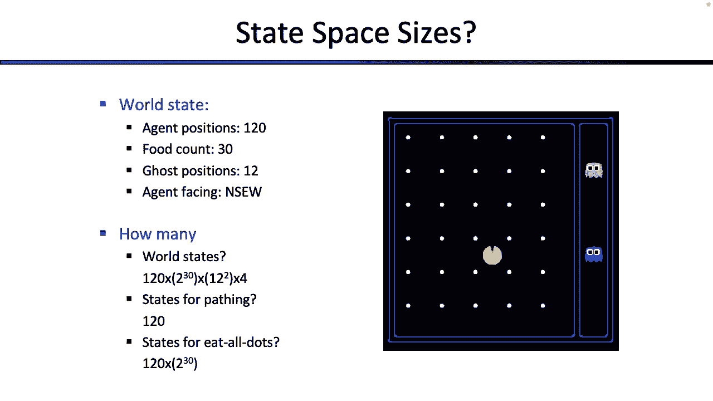
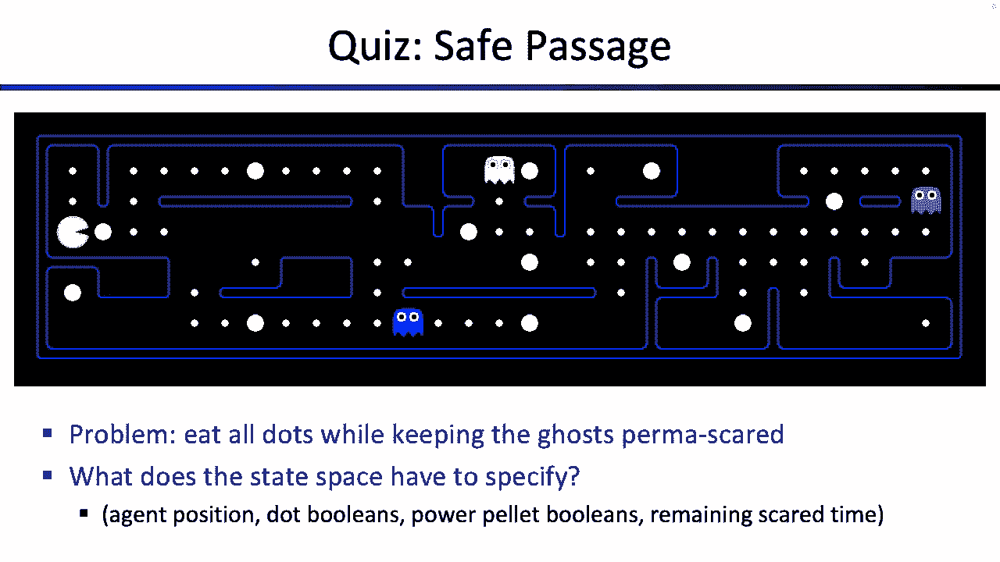
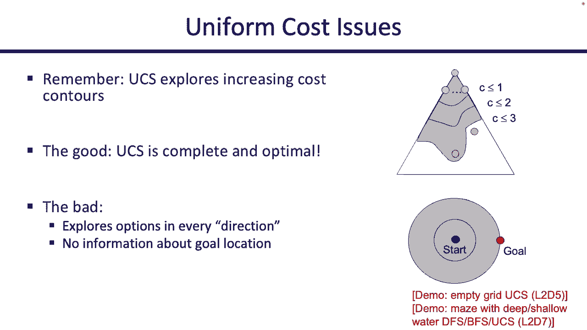
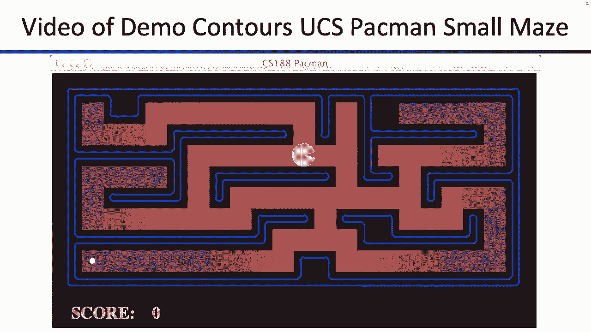
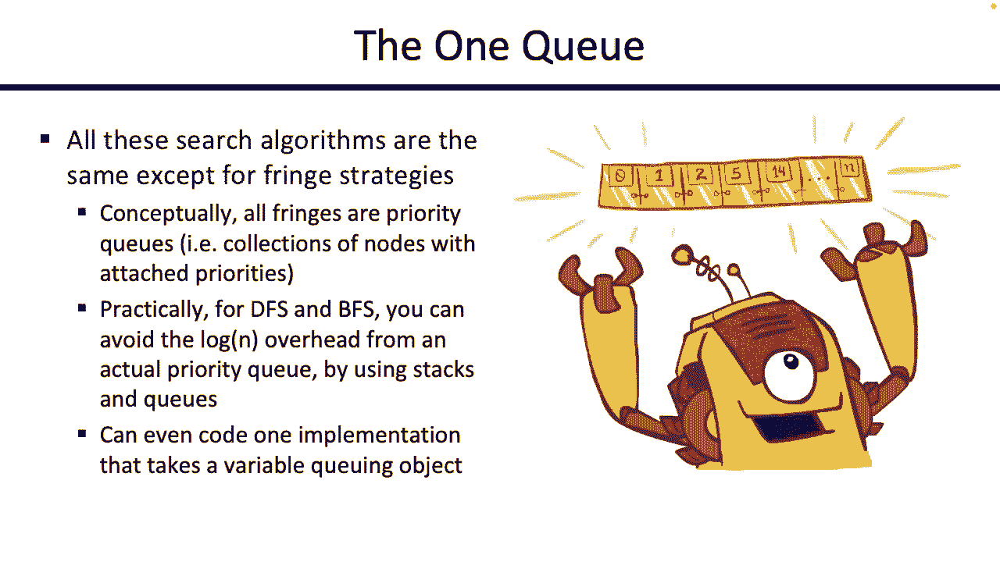

# CS188 伯克利最新AI课程--人工智能入门推荐 - P2：[CS188 SP23] Lecture 2 - State Spaces, Uninformed Search - 是阿布波多啊 - BV1cc411g7CM

好吧嘿嘿，谢谢你再次来访，通常第二讲的人有第一讲的三分之一，所以说，看到人们回来很酷，嗯是的，这里有一堆很快就会用到的作业，我想说两个预产期最快的，我们的零号项目，这是一个很好的让你设置。

比如项目的自动梯度结构，给你一种感觉，如果您有适合该类的Python背景，然后零号作业就要发布了，希望很快下周五到期，我们不是真的要给它打分，但这是你检查的好方法，如果你有数学准备。

比如这堂课的概率背景，所以如果你真的不确定，如果这是你合适的地方，你可以查看这两个作业，希望他们能给你一点澄清，所以是的，作业到此结束，和喜欢的公告，还有什么，你们都想知道，所以上次我有点超前了。

所以我要略过，我们谈论的所有事情，上次，给你一个什么是搜索问题的快速回顾，所以为了本课的目的，搜索问题是一个非常具体的定义，就像数学定义，以及构建搜索问题的方式，它就像Python编程中的一个类。

或者它就像一个数据结构，你要建造它的方式是，您的搜索问题将被定义为一个状态空间，所以这是所有可能的方法的列表，世界可能被配置在其中，为了解决你的问题，它告诉你如何从一个州到另一个州。

所以如果我给你一个状态，后继函数可以告诉你，从当前状态可以到达的其他状态是什么，所以你可以想象一个函数，它接受一个状态，然后给你一个所有未来状态的列表，你可以从国家到达，它也是一个开始状态。

告诉你这就是现在的世界，那是开始状态，那就是你现在所在的地方，然后是目标测试，这告诉你这是一个我满意的状态吗，我的问题解决了吗，所以目标测试告诉你你是否完成了你的问题，给定状态，我们要找的是。

我们在寻找一系列的动作，所以希望你把你的搜索从你身上拿走，通过我们今天要建立的一个算法，你的目标是，您将得到一系列操作，这些操作将使您的起始状态，另一个动作采取一个动作，去另一个州。

采取另一个行动去另一个状态，采取另一个行动去另一个状态，希望在你想出的一系列行动之后，最终以通过目标测试的状态结束，这就像我们对搜索问题的数学定义，我们以这种非常具体的方式定义它，因为我们想做的是。

我们想解决可能看起来不像搜索的通用问题，所以今天我们可能会看到很多图表和迷宫，但也有其他搜索问题，如果你能用我们刚才看到的非常具体的数学方法来表达它们，你可以使用我们的任何一个通用算法来解决它。

这就是我们要采用的结构，所以你要有，你知道你喜欢什么问题，如果你能把它建模为一个搜索问题，然后你就可以把它喂进，我们今天要建立的任何通用算法，所以这是我们上次在的地方。

你想知道的关于搜索问题定义的任何其他信息都可能是好的，把这个放在你的后脑勺里，因为今天我们要建立算法来解决这种非常特殊的问题，所以我们给你看了一个例子，它正在罗马尼亚旅行。

强迫我念所有这些古怪的城市名字，我们讨论了状态空间，所以只是给你一个快速的回顾，状态空间是世界所有可能配置的列表，但也许并不是所有这些细节对你的特定问题都是必要的，所以我们说世界国家是环境的每一个细节。

所以在吃豆人的例子中，就好像，吃豆人就在这里，所有的点都在那里，这是鬼魂的位置，这是能量丸，这是你的分数，可能是每一个细节，但也许是为了你的问题，在你的状态下，你不需要所有这些细节，例如。

如果你试图解决路径问题，也许你不需要所有这些细节，也许你需要的主要细节是x y位置，所以也许有几个州，有一个吃豆人在角落里，还剩下很多点，角落里还有一个吃豆人，只剩下几个点了，但为了您的路径问题。

试图从A点到B点，也许你不在乎这些点，所以你不必对你所在州的点进行任何编码，所以这取决于你在解决什么问题，你可以把这个非常复杂的规则状态建模并简化它，试着保持与你的状态相关的任何东西。

所以有时像考试和家庭作业，我们将问你关于形成状态的问题，所以这是一个很好的练习，如果我们给你一个问题来解决，你到底要怎么想出这些状态空间，我不会说有确切的机械方法来做这件事，但你肯定可以用一些直觉。

有点帮助，所以你知道在你的状态空间中你需要的一件事，是帮助你写目标测试的东西，因为你知道你必须有某种目标测试来告诉你，如果我给你一个状态，你得告诉我，这道题我做完了吗？还是我必须继续寻找。

所以我得给你一个状态，你需要告诉我，不管你是否知道你在目标上，所以你可以利用这一点来思考在你的状态下可能需要什么，所以也许你走上前去，你说，好的，我正试图解决这个问题，吃掉所有的点，我就像。

我想在我的州我不需要这些狗布尔人，我就不能用x y的位置，嗯，如果你只使用x y位置，我给你一个X Y位置，我就像，我说完了吗，我把所有的点都吃了吗，你能说，是或否，可能不是你需要那些点状金条来告诉你。

不管你是否这样做了，有时候，如果你看看目标测试，给你一点直觉，关于您的状态空间中是否需要某些信息，所以如果你有点卡住了，如何计算状态空间中的事物，有时向后工作会有所帮助，想想你的目标测试需要什么。

然后向后工作，找出这种状态下是什么，很好，然后我们讨论了一下尺寸，所以有时我们可能会让你计算有多少可能的状态，所以这有点像CS 70组合学问题，所以我很抱歉为你把它挖出来，但让我们想想。

你知道世界有多少种可能的构型，在这个特殊的吃豆人世界里，所以我们有吃豆人，有一堆不同的点，有两个鬼，但他们碰巧被墙隔开了，有一种呃，监狱什么的，所以我们要说吃豆人有120个可能的不同地点。

黑板上有三十个可能的点，每个鬼都有十二种不同的鬼位，为了图形的目的，我们可以画，吃豆人面朝北，南，东或西，所以如果你试图解决有多少可能的不同方法，你能建立这个世界，比如有多少个可能的世界，2。

有人要给出一些数字吗？你得把一堆东西相乘在一起，你想把什么相乘在一起，任何数字你都可以喊出来，好的，有人说三百六十次，一二，好的，所以让我试着分解一下，所以他说有一个二十。

因为吃豆人可能在20个方块中的任何一个，然后你说有三百六十，我想你是想用幽灵的姿势数食物，对呀，所以是一百二十，我们如何解释幽灵的位置，有两个鬼，所以第一次可以在一个或十二个位置。

第二次也可以在十二个位置中的一个，现在食物呢，食物只有三十种可能的配置吗，是啊，是啊，有三十种二元可能性，因为每个食物颗粒都可能在那里，也可能不在那里，那么有多少不同的可能性，第一个可以打开或关闭。

第二个可能是开的，也可能是关的，第三个可以打开或关闭，所以由于三十对，希望如果你看到这个数字，你有点畏缩，你就像，哦哦，这有点吓人，这是一个很大的数字，所以即使是一个非常愚蠢的小吃豆人问题。

世界上已经有相当多的国家，所以希望我得到了正确的答案，我想那是一回事，但笔迹更干净，但也许并不是所有这些东西都需要，就像你的路径问题，所以说你只是想让吃豆人从A点到B点，你需要一百二十乘以二到三十倍吗。

十二平方乘以四种不同的状态，或者你需要更少的，比如有多少不同的州，如果我试图构造A点到B点的问题，好的，所以肯定会有一个20对吧，这也是一个很好的问题，我们在想你到底要不要转发。

所以这取决于你自己的吃豆人规则，你是怎么玩的，所以为了CS的目的，一个亚太人，我们要说没关系，代理面对像，我们可能会跟踪它画画，但为了我们自己的游戏，我们不会关心吃豆人面对的是什么。

所以对于八分之一的吃豆人来说，我们会说是120，如果你想建立自己的吃豆人，吃豆人面对的方向很重要，你当然可以把它乘以四，但对我们来说是一百二十，所以看起来要检查的州少得多，所以直觉上。

感觉这个问题解决起来有点容易，那么Aldots问题，里面有你必须跟踪吃豆人是什么，我们还必须跟踪食物是否在那里，好畏缩，两点到三十又回来了，这是一个很大的数字，所以不知何故。

似乎有更多的州比吃所有的点问题，也许这种直觉编码，事实上，这有点难弄清楚，如何吃掉所有的点，所以如果我给你一个所有点的问题，这有点难解决，那么A点到B点的问题，这就是编码，好的，所以这是一个快速的提醒。

你如何计算这样的东西，任何。

大家都很累，因为现在是下午五点，我觉得你还好，嗯，这是最后一个观众参与的事情，我必须让你经历，然后你可以在晚上剩下的时间里听我说，所以这里还有一个问题，这和我们见过的有点不同，所以这里我们想要的是。

我们想让吃豆人穿过整个迷宫吃掉所有的点，但有一个特殊的条件，吃豆人想让所有的鬼魂都害怕，所以如果你还记得你就像吃豆人，一零一课，也许你还记得如果你吃了其中一个能量丸，鬼开始害怕，现在鬼不能伤害你。

所以吃豆人想要的是，我们想让吃豆人吃一颗能量丸，这个大点，鬼开始害怕，吃豆人跑来跑去，吃一堆点，在鬼魂变得不害怕之前，还是在吃豆人失去超能力之前，吃豆人应该再吃一颗能量丸来吓唬鬼魂，因为它一直穿过木板。

所以这就是我们要解决的问题，我们想把它表述为一个非常具体的数学搜索问题，这样我们就可以用我们的一个算法来解决它，所以考虑到这一点，在状态空间中必须去什么，呃，尝试点击，好的，那么在状态空间中必须去什么。

鬼到底怕不害怕，对呀，所以这可能就像一个布尔值，你想跟踪，还是有更多的信息，不仅仅是鬼魂是否害怕，还剩多少时间，所以也许鬼魂会害怕，再走十步，或者再走五步，或者再动一下，所以不知何故。

在这种你知道的状态下，你想记录鬼魂还害怕多久，所以有点像，你知道的，受惊计时器，所以你想跟踪你还有多长时间，直到你的超能力失效，是啊，是啊，说它是不是数据，所以你想跟踪，比如食物合适的地方。

然后你还想跟踪动力颗粒在哪里，你想知道，你用完那个大点了吗，还是你没用过，所以也许你想让那些像权力一样的人告诉它，或幂布尔值，你可以把它想象成一个列表或一个，你知道的，1和0的位数组。

你做什么是它在那里，你认为你可能需要的其他东西，还是乖乖的，鬼魂和他们所在的地方，或者是的，所以也许你想把鬼魂的位置留在那里，在某个地方，所以又一次，这取决于你游戏的机制，你在玩这个游戏吗。

在你知道的地方，吃豆人能吃鬼吗，然后他们重生，难道他们不能，所以也许取决于，就像你的游戏规则，也许你想要鬼的位置在那里，其他的都是，我们做完了，有人说，打包了我的位置，所以也许我们也想要那样，所以是的。

看来你需要很多东西，一次又一次，似乎没有机械的方法来弄清楚，里面需要什么，但直觉上感觉这些是与我的游戏相关的东西，也许有些事情是不相关的，所以你知道分数是不相关的，因为我没问你那件事，但似乎你知道。

动力颗粒是相关的，食物是相关的，因为我试着吃所有的点，鬼魂的位置是相关的，如果我在乎吃鬼，我们试着不吃东西，又是山羊，这有点取决于你的吃豆人规则，吃豆人的位置肯定是相关的，因为你想知道你在哪里。

以便您可以使用后续函数构建未来状态，所以说，让我们看看我们是否能得到一个更漂亮的版本，好的，所以我想这个版本并不关心整个，就像你吃了鬼，然后他们重生，但如果你真的在乎，也许你真的想要鬼魂的位置。

所以取决于你的问题，取决于你对世界的看法，这是一个非常简短的测验，对此有什么想法吗。

你们都通过了，让我们继续前进，所以我们讨论了如何处理一个通用的问题，并将其表述为这个非常具体的数学定义搜索问题，现在我们想知道如果有人把这些问题交给你，他们经历了所有的麻烦，把他们的世界简化。

并以这种非常具体的方式对其进行建模，1。你是怎样解决这个问题的，那么我们能建立算法来解决这类问题吗，这就是我们今天的后半段，所以让我们来看看，好的，所以首先要画的是。

可能会引出所有的状态以及它们之间的关系，所以让我们先做那件事，这是一张图表，我现在要停下来警告你，这是五十张不同图表中的第一张，你将在这门课上看到，我们将要展示的所有图表，你有所有这些不同的含义。

有时节点是这个意思，有时节点意味着其他东西，有时候箭头的意思是这样的，有时箭头意味着别的东西，所以当你在这个类中看到一个图表时，你可能想停下来问问自己，我们在哪里画这个图，节点代表什么，箭头代表什么。

因为即使在这节课中，我也会向你们展示两个不同的图表，它们可能意味着完全不同的事情，所以图表很好，但同样重要的是要记住它们的意思，以避免被它们混淆，也许在这节课结束的时候，你会对图表超级厌倦的。

但我想我们会看到的，所以这里有一个图表，让我们定义一下它的意思，所以当你看到这些节点中的一个，这是其中一种状态，记得我们说过我们有状态空间，它就像一个巨大的列表，列出了世界上所有可能的不同配置。

我们将每个状态有一个节点，这就是我们在这个特定的图表中所拥有的，然后我们要画箭头，如果你能用一个动作从一个状态到另一个状态，所以这是我们绘制搜索问题的方式，这里是所有的状态，这里有所有的箭头告诉你。

你如何从一个州到下一个州，那些箭是从哪里来的？它们来自某人交给你的后继函数，所以有人给你一个搜索问题，你可以把它画出来，你可以画出世界上所有不同的配置，你可以画所有这些箭头告诉你嘿。

也许如果你在这种状态下采取行动，你最终可能会处于那种状态，所以如果你在角落里，你采取了向右移动的动作，那么您最终可能会处于吃掉数据的状态，然后记住搜索问题还有另外两件事，它有一个启动状态。

所以它必须告诉你你从哪里开始，所以这里的一个状态是开始状态，在某个地方也有一个目标测试，上面写着给我一个状态，我会告诉你你是否做完了，这是一个状态空间图，这是一个很好的物体。

看来我可以用这个来帮我弄清楚，我如何从开始状态到通过目标测试的另一个状态，所以它有一个很好的，这有什么问题，这对任何人来说都有点奇怪，所以说每个状态都发生一次，这将是非常非常非常大，对呀，记住。

就像二到三十，那是为了一个很小的步行者问题，想象任何现实世界的搜索问题，这将是巨大的，它放不下滑梯，哪里都放不下，真的，这将是巨大的，所以这是个好主意，我们永远不会真正画这个东西。

但有时如果你在考虑搜索，你在想，有人递给我的搜索问题的结构是什么，你可以想到搜索图，那是一堆州，所以我们为所有的状态画一个节点，然后我们使用箭头对后续函数进行编码，它告诉我们如果你在一个州。

以下是你可以到达的所有其他州，所以我们可以画这个，你通常不会，因为这将是巨大的，但这是一个很好的想法，好的，好酷，让我们继续前进，这又是另一个状态空间图，每个节点表示状态，所以在这种情况下。

我们有状态a b、c、d、f、g、h，因为某种原因，所以我们有很多不同的状态，我们有箭头告诉我们后继函数是什么样子的，例如，在这种情况下，它告诉我们如果你在C州，你可以用某种动作来陈述A。

这就是这张图表告诉我们的，好吧，再说一遍，你不能真的在记忆中建立这个，这是一个非常小的玩具例子，但又一次，这是一个很好的想法，好的，这是一个状态空间图，我要让你大吃一惊。

因为我将向你们展示另一个看起来非常相似的图表，很容易把他们搞糊涂，但真的要小心，因为它们是两码事，这是一个状态空间图，节点是状态，箭头告诉你后续函数是什么样子的，是搜索树，它仍然是一个图表。

但在这种情况下，节点和箭头代表了非常不同的东西，所以要小心，所以在这种情况下，我们不再试图画箭头，告诉我们各州是如何相互联系的，这棵树将告诉我们，就像，我能做的所有可能的计划。

这个计划是一系列的行动把我从一个州带到另一个州，所以这棵树将是我们展开图表的一种方式，在这里写下所有可能的计划和我可以采取的行动清单，希望这些行动清单中的一个是你的解决方案，它是一个把你的开始状态。

带您完成一系列操作，并帮助您找到通过目标测试的状态，所以这和搜索图不一样，但它仍然是我们将要使用的有用的东西，试图找到解决办法，所以我觉得这个看起来更容易一点，以身作则，所以你知道这里有一个特别的例子。

我想也许另一个有用的例子是这个，所以再一次，真的要小心，它们看起来都像图表，当你画它们的时候，你要画节点和边，但它们的意思非常不同，左边那个，这是状态空间图，每个节点出现一次，这是一种状态。

这告诉你这些状态是如何相互联系的，或者右边的后继函数是一个搜索树，这告诉你你可以采取的所有可能的计划，它告诉你，让你展开图表，告诉你所有可能的计划是什么，所以我给你们看一个例子，也许会更有意义。

但有一件事我认为在这一点上让人绊倒的是，搜索树中的节点代表什么，所以我们说搜索树被用来考虑，你可以采取的所有可能的计划，这也意味着这些节点中的每一个都代表一个计划，不是一个国家，看到搜索树真的很诱人。

你在那里写了字母D，所以它并不代表一个状态，它没有，它代表了到达D州的计划，在这种情况下，它是从国家的，采取行动并进入D州，你可能会说，等等，我看到字母H，这里，这是否意味着这是状态h，我很容易想到。

我们这样写，真的很误导人，但这个h真正代表的是一个从s开始的计划，去D，去e然后去h，所以我认为把这些节点中的每一个都想起来更有帮助，就像带你去所有这些州的计划，与各州本身相反，这是一个搜索树。

我们再画一个搜索树，这是另一个更小的状态空间图，这是一个图表告诉你状态，比如后续函数是什么样子的，这样我们就可以建立一个搜索树，假设我们的起始状态是S，所以它就在那里，那真是，在这次搜索中。

我们将建立所有可能的计划，从S开始，然后采取一系列的行动，所以从s开始，如果你采取一个行动，你可以在哪些地方着陆，从s开始，你采取一个动作a，好吧，所以有一个a和一个b。

这就是让人很容易想到这两个鼻子的地方，就像状态A和状态B，但他们不是真正的A州和B州，我想起了他们，因为这是从s到a的路径，使用一些操作，这是用一些动作把你从S带到B的路径，所以我们把国家的。

我们思考了从状态中可能发生的所有事情，你能做的所有事情比如你能采取的所有行动，他们在哪里让你着陆，所以现在这些是可能的解决方案或路径，或者搜索问题可能发生的一系列操作，所以有S，然后从S。

你可以采取行动去一个，或者你可以采取行动去B，所以你是一个S你采取了行动，你最终在一个，你能从一个，可以去，转到P，你可以转到哎呀，是的，所以这种喜欢打破自己的规则。

所以现在在第二层我们有所有这些可能的计划，两个有两个动作的，所以你可以从某人那里去什么，然后接下来是什么，S b g，我想就这样了，我想就这样了，这一直在展开，所以你可以继续前进，有人觉得这有问题吗。

如果我继续展开它，所以如果我以B的身份去，我下一步从A B做什么，我下一个可能的计划是什么，从这里我可以做一个b a，我可以做一个B G，有人觉得搜索树有问题吗，如果我继续注册它变得非常大。

他们会变得多大，那会是个问题，这里有一个树变得很大的例子，在这种情况下，问题似乎是循环，这代表你知道这是一个可能的计划，在一个循环中去是一个非常愚蠢的计划，如果你想去G，但这是一个可能的计划。

如果这是一个可能的计划，它会出现在我们的搜索树中，因为搜索树是这种结构，它告诉我们我现在可以采取的所有可能的计划或行动顺序，如果你想去G，你可能不会被困在循环中，但是这个搜索树将对循环进行编码。

所以理论上第一棵树是无限大的，但我不觉得这个问题应该还是可以解决的吗，所以我们接下来会试着调和这一点，但这是表示搜索问题的两种方式，你可以用图来告诉你状态是如何连接的，或者你可以用树。

这就打破了你可以制定的所有可能的计划，从你的开始状态开始，看看你一个动作能做的所有事情，然后看看你可以用两个动作做的所有事情，然后看看你可以用三个动作做的所有事情，以此类推，等等，好的。

对缩放中有人说的有什么想法吗，可以说搜索树是通过运行图遍历来创建的吗，从你目前的职位开始，这是个好问题，我想这可能取决于你在想什么图遍历，但我们也会向你展示一些算法，把你从，也许树的图形。

所以在这个问题上，但这是一个好想法，还有什么，是啊，是啊，所以当你澄清的时候，无论如何，谈论做这件事的人有什么不同，是啊，是啊，大问题，就是试图澄清这两者的区别，这是个好问题，因为随着我们对搜索的深入。

会很诱人的，看到这两个，认为他们是一回事，这个图中的图，每个状态出现一次，箭告诉我们，我如何从树中的一个状态到另一个状态，我们实际上在做的是研究所有可能的计划，所以每个节点代表一个计划。

或者像一系列的动作，这整棵树有点向外，就像我们建造的，就像你一个动作能做的所有事情一样，你可以用两个动作做的所有事情，三步四步，所以看着这个真的很诱人，好好思考，上面写着字母A。

所以它必须是节点A或状态A，但这真正代表的是某种计划把你从国家，s to a，然后这代表了一些计划，把你从S到A再到B，以此类推，我不知道这是否回答了你的问题，还有什么好问题吗，虽然，伟大。

所以有一个搜索图，有一个搜索树，看起来很小的图表可以创建很大的树，因为如果有一个循环，你可能最终会有一个计划，只是带你在一个圆圈里一遍又一遍地，突然间你的树就像无限大，我们如何平方这些。

我们如何尝试解决搜索问题，所以请记住，您的搜索问题是试图从开始状态，想出一系列的动作，把你带到一个通过目标测试的状态，那让你快乐，所以如果你有整个搜索树，它就会完成，您可以在搜索树中查看。

试着找到一条带你去目标的路，通过目标测试的东西，但这次搜索可能是巨大的，图形也可能是巨大的，所以与其试图构建整个搜索树，我们将要看到的所有搜索算法的工作方式，我们要试着建造尽可能少的树。

直到我们找到解决办法，然后我们停下来，然后我们就不继续建设了，这就是将要发生的事情，希望我们所有的搜索算法都更有效，所以这会是什么，我们现在要尝试，好的，这是我们之前看到的例子，你在罗马尼亚。

试图开车或四处走动，或者任何试图去布加勒斯特的东西，我想在这种情况下，这是状态空间图，不是那棵树，因为这向我们展示了所有可能的状态，以及它们是如何通过后继函数连接起来的，但我们实际上可以用这个造一棵树。

所以说你知道我们在困境中，我们想去布加勒斯特，所以这是我们重新建造树的方法，我们不想把整棵树都建起来，因为它可能很大，你可以有周期，你不想处理那个，所以取而代之的是，我们要一点一点地把这棵树。

试着跟踪还需要建造的东西，什么不需要建造，当我们建造的时候，我们将考虑所有这些较小的部分计划，希望在我们正在考虑的计划清单中的某个地方，我们找到一个，如果她是我们想做的。

我们只是再次达到通过目标测试的状态，我想这是一个会更有意义的，举了一个例子，但真正重要的想法是你想建造这棵树，但你不想建造整个东西，你只想根据需求建立，无论你需要什么，一旦你找到有效的东西。

你会停止建造，所以你只从一个节点开始，只是一根棍子，这是搜索树，所以这个节点表示一个序列，从一个杆开始，你什么都不做，然后你就完蛋了，但这不是你唯一能做的，还有其他的计划，所以从一根杆开始。

你也可以采取一些行动，你可以去看你可以去的任何城市，你可以去右边那个城市的任何地方，这些也是可能的一个行动计划，但这不是整个搜索树，因为在这些城市你也可以做其他事情，这个想法是你要一点一点地建造这棵树。

但你不想一次建造整个东西，事实上，您希望尽可能少地构建此树来找到解决方案，这就是我们下一步要做的，当你建造树的时候，你有所有这些不同的部分计划，你正在考虑，希望你考虑的计划之一。

最终让你找到你要找的东西，所以这是一种代码的方式来看待它，如果这没有太多意义，我很快就会给你一张照片，但重要的是你想看到这里有一个循环，所以我们在循环，边走边造这棵树。

所以我们要做的是添加循环的每一个循环，我们要去看看，我们要看看，这棵树是否有我们还没有看过的需要扩展的部分，所以我们有这棵树，我们正在建造它，我们把它建在树的深处，可能有一个音符我们还没有扩展。

下面可能还有更多我们还没有看到的，所以我们要从这些节点中选择一个，我们会把它捡起来，记住这是一棵搜索树，所以节点对应于一个计划，我们看计划，如果这个计划能帮助我们，到达目标或到达目标，我们真的很开心。

我们就像我们结束了一样，我们宣告胜利，大功告成，但如果我们的计划行不通，那我们就得把树再扩大一些，所以我们要把树再扩大一些，看看其他一些节点，我要在一个循环中做到这一点。

所以我们要拿起一个我们还没有看过的节点，我们还没有扩展，我们要检查，这个行得通吗，如果计划成功，你很棒，你就完蛋了，宣告胜利，如果它不是很好，它不起作用，然后你要把树再扩大一点。

在下一个循环中有更多的东西要看，就是这样，我们要去看看，在代码或伪代码中，这是一个非常高级的想法，我想这里有一个图片的例子，这就是图表，让我们把树搭起来，但我们不打算把整棵树都建起来，因为那真的很浪费。

我们可能没有时间，所以我们要按需建造，这是CS一个88搜索算法，好的，我们试图从S到G，你要帮我到那里，我希望如此希望你的指导技巧很好，所以让我们再从s开始，你看到S，你在想，但请记住，这是搜索树。

所以这是一个我从S开始的计划，我什么都不做零行动计划，所以为了这个，我要做的是，我还将维护一个叫做边缘的东西，有时被称为边疆，在聊天中回答问题，所以有些教科书可能会称之为前沿，这个边疆的想法。

边缘是我们的部分计划列表，所以你要么想到，因为这些是我们还需要检查的计划，你也可以把它，因为这些是搜索树中的计划，我仍然需要扩展，因为我还没有检查过，或者他们可能有更多未来更长的计划。

所以我要在这里做那种，这是我的刘海，这是我的搜索树，我们要做CS 108搜索，你要带我从S到G，我希望如此，让我们做吧，所以我们还没有真正探索过它，所以我们要把它放在边缘，我们要去边缘。

我们要去拿一些我们还没有检查的东西，只有一件事，所以我要选S，我要把它捡起来，我要去看看，这个序列，把我带到球门不，所以我还没说完，我得把它扩大，我要扩展的方法是，我要建立搜索树的那一部分，我要看看。

我能从我们这里做什么，所以从S，我能做什么，我可以去阻止我，如果我错了，因为我已经一个学期没看过这个图表了，所以从S，我可以去D，我可以去E，我可以去P，我想现在就很好，我刚刚添加的这三个节点。

它们看起来有点像节点，如果你想正式地把它们看作是路径，你可以写出整个路径，如果你想随心所欲，这些都是我们还没有进一步探索的道路，我们还没有检查它们是否真的有效，所以他们在我们的边缘，所以每次我们扩张。

哦，那不是我的本意，撤消，好的，好，所以我要把这些都加到我的刘海上，这是一个循环，有人问，刘海是什么，边缘是我列出的所有我还没有考虑过的部分计划，或者相当于我的边缘，搜索树中所有节点的列表。

与我还没看过的计划相对应，我还没有扩展，又好了，我想这更有意义，如果你再把它抽出来一些，所以你的下一个工作是，我要再做一次循环，我在边缘发现了一些东西，我检查它是否有效，如果有效的话，我受够了。

如果它不起作用，我把树再扩大一些。所以说，你想拿什么，s d s e或s p，人们想要什么，斯多诺·斯多，好的，每个人都想要一个E，我想是的，我们就这么做吧，所以让我们捡起，看到了，所以我把它捡起来。

我看着序列，Let’让我说到目标吧，所以我还没做完，我要做的是，我要扩大，所以我要看看SSE，下一步我能从SSE做什么，根据我的后继函数，嗯，我可以去R，我想这是正确的，我想就是这样，还有，你是对的。

好的，所以让我们也这样做吧，所以现在我在树上有了更多的路径，我在一点一点地建立它，希望我不必现在就建造整个东西，我刚刚添加的这两个注释也是我还没有探索的注释，所以我也要把这些扔在我的刘海上。

除了其他一些我还没有检查过的，我不知道SD下面藏着什么，我不知道SP下面藏着什么，那里可能会有有趣的东西，但我还没查过，所以他们在我的刘海上，好的，这是另一个循环完成，我们再拿一个，你接下来想接什么。

我可以接SD，如果我想，或者p或者我刚才加了一个c h作为你的，你想拿什么，好的，想要SD的混合反应，谁想要SP，一些想要C H的人，谁想要SCR，好的，那是大多数人想要的，好的，我们就这么做吧。

所以有时候人们试图引诱我把我带到错误的方向，你可以做你的电话，但让我们继续前进，所以我们拿起S e r，我想这就是你们想要的，所以我们把它捡起来，我们就像，可控硅，带我去球门，否，不是这样的。

我还没这么做，我要进一步扩展搜索树，所以我要看看我能从S E R做些什么，那么我能做什么呢，我想这只是事实，我拼写酷这个词，这是另一个我还没有探索过的，所以我要把它放在我的刘海上，有点提醒自己。

在这条部分路径下面可能隐藏着更多，我还没查过，这下面可能藏着更多，也许我想要的东西在那里，但我还不知道，因为我还没有扩张，所以我要把它留在我的刘海上，好的，我的刘海上还有一堆东西，我还没说完。

所以我得继续前进，你下一步想做什么，谁想要SD或SD就呆在那里，永远想要SP，谁想要一个C H，谁想冲浪，好的，每个人都想冲浪，我们去冲浪吧，所以我把冲浪从立方体或刘海上取下来，我把它捡起来，我就像。

这能让我达到目标吗，不是这样的，我还没这么做，我要在海浪下面建造更多的这棵树，看看会发生什么，那么我能从冲浪中做什么，我可以做S E R F G，或者我可以再做一次，在这两个节点下面可能会有更多的标题。

我还不知道，所以这些也要戴在我的刘海上，所以我有很好的，我有冲浪，好的，那是糟糕的评级，我有冲浪发型，那是我的刘海，它开始变得有点机械，但希望这没关系，我还没说完，我仍然没有找到一条可行的道路。

我得再循环一次，好的，你想从边缘拿什么，好的，让我们拿起冲浪G所以我拿起它，它能把我带到目标吗，确实如此我受够了，我宣布胜利，我的搜索问题结束了，它的伟大之处在于，我没必要造一棵完整的树。

这个搜索树可能有更多的节点，就像有一棵大树藏在SP下面，但我永远不会知道，因为它不是我造的，可能有一棵大树藏在SD下面，在SD下可能有一个很好的解决方案，我不知道，因为它不是我建的，但搜索背后的想法是。

我只是要建造我关心的树的部分，希望我能找到解决办法，在这种情况下，我做得很好，那是我们的CS一88引导搜索，你把我带到了正确的地方，就像我说的，有时人们会跟踪我，我们只是坐在这里，会因为某种原因。

我就想你们都在干什么，而是去正确的地方，大问题，我们如何决定边缘中的下一个节点被访问，大问题，决定你下一步在边缘去哪里，这就是每种搜索算法的不同之处，所以如果你看过，或者如果你知道这个刘海是怎么工作的。

你已经知道所有的搜索算法，唯一要做的就是弄清楚，你怎么挑边缘的东西，以及你从边缘中选择什么的决定，会对你的搜索算法的作用产生巨大的影响，它有什么样的运行时，所以我们基本上完成了，我们现在只需要弄清楚。

你知道的，如果你在现实生活中，没有所谓的C一零八搜索，我不能把你拉到一个房间里，告诉你下一步该把刘海剪掉，所以相反，我们必须找出某种算法，从刘海上摘下一些东西，所以是的，我问观众。

当你在现实生活中四处走动时，你可能不会有观众来拉，所以取而代之的是，你得想别的办法，从刘海上摘下一些东西，但这是它在高水平上的工作方式，好的，然后有人说，边缘是我们到目前为止所做的路径的集合。

这是一个很好的描述，特别是，留在边缘的东西，是我们还没有检查的路径吗，所以记得当我从边缘拿起东西的时候，我检查了他们，我把它们扩展了，我走的时候把它们划掉了，这样刘海就可以长出来了，但是刘海也会收缩。

当我把潜在的路径带出边缘，大问题，很棒的评论，还有什么好问题吗，是啊，是啊，对呀，这是Zoom的问题，这就像你如何决定下一个从刘海上下来的是什么，对呀，这个想法取决于你如何从边缘挑出一些东西，那会喜欢。

定义搜索算法的特征，所以这是一个通用搜索，然后我们要具体一点，通过定义拼图的最后一块，接下来你要把刘海拉下来，这将改变搜索的性质，让我们看看有没有更漂亮的版本，也许这是更漂亮的版本，如果你想跨过它。

它在那里，嗯，再次，他们画了搜索树，只需编写节点，我喜欢写整条路，因为这让我真的提醒自己，像这样代表一条路径，不是一个国家，但如果你想写纸条，因为你懒惰，你可以是的，是啊，是啊，问题是，呃。

如果有某种碰撞会发生什么，所以也许有两条路，你说，就像他们在边缘做同样的事情，他们带你去同一个地方，是啊，是啊，所以请记住，边缘只是代表了一系列，你知道动作或可能的动作序列列表，所以其实还可以。

如果边缘有两件事，你知道，带你到同样的状态，他们仍然是不同的道路，所以他们仍然处于边缘，我不知道这是否回答了你的问题，所以像S E H P可能和P同时处于边缘，因为它们代表了两条不同的路径。

有时如果人们只是在写树，就像一个节点，或者只是写状态，那么您可能会看到搜索树上出现两个P，但他们真正的意思是有两种不同的方法来获得P，他们都被考虑，但是是的，这是个好问题，是啊，是啊，呃，我们喜欢。

是啊，是啊，所以我想我们采取了FG，嗯，这个特殊的例子，拿了S D E R F G，所以看起来他们拿了最差的一个，这么好的工作，但外面还有其他的路，对，我们不知道这件事，因为我们没有扩展SD路径。

我们刚刚从SSE扩展，所以再一次，这真的取决于你扩展了什么，在某些情况下，树的某些部分是你没有建造的，那里有解决方案，但你永远不会知道，因为你从来没有建造过树的那一部分，大问题。

你以前想知道的关于搜索的其他事情，我向你展示如何完成它并从流苏上摘下东西，好的，我们基本上完成了，我们只需要向你展示如何把边缘的东西去掉，然后你有所有的搜索算法，所以我想点击下一个，好的。

整个搜索树都在那里，记得你没有看到全部，所有藏在下面的东西，我们从未扩展过的东西，我们从未见过，这个想法是你想建造尽可能少的树，你需要试着得到你的解决方案，好的，伟大，这是第一个，这叫做深度优先搜索。

也许你听说过，这正是我们刚才看到的，它只是增加了一件事，这就是去掉刘海的策略，所以深度优先搜索背后的想法是，当你看着边缘的东西列表，你要去做什么，深度优先搜索是最深的节点，所以换句话说，边缘的项目。

或者是迄今为止最长的小路，这就是深度优先搜索的含义，所以你穿过边缘，而不是要求人们投票，你要走迄今为止最长的路，这是整个搜索树，他们为我们建造了它，他们会在演示中把它圈起来，如果你想看真正的深度搜索。

我可以试着做，希望我不会搞砸，这是我们刚才做的完全相同的事情，但不是问你下一步要脱掉什么刘海，我要问第一个搜索，接下来要把刘海去掉什么，和深度第一将回答我的问题下一步该采取什么，总是拿树上最深的东西。

换句话说，走迄今为止最长的一条路，问题是是否有一个循环，深度优先搜索不是永远都在进行吗，是呀，你走在我前面了，但我会在一秒钟内告诉你，好的，所以让我们再来一次，但现在当我们做的时候，我不会问你，对不起。

我要问第一步搜索，所以我们从s开始，因为它在边缘，我把它捡起来，这不是目标，所以我划掉了，E和S P好了，我们走了，这些都是，我还没查过，所以我现在需要把它们放在我的刘海上，我问深度第一搜索。

我接下来看什么，深度优先搜索说，走最长的路，或者树上最深的东西，这三个都一样深，他们就像一个深，所以第一个要打破平局，我会说让我们按字母顺序做，所以我们就拿那个，我们取SD，我们把它捡起来。

是吗是目标吗，这不是目标，所以我得继续前进，那么我可以从SD做什么，我可以做SDP，我还能做什么，我可以做SD，是它不，我也会做SD，我想就这样了，这些都是我还没有检查的任务，所以他们走在边缘。

所以他们是下一个，我要把刘海上的东西拿掉，我要把它捡起来检查一下，如果这是目标，我选择了什么，第一次搜索说，挑最深的东西，现在有一个选择对吧，我不打算选S，E S P，因为那些太深了。

我要从这些中挑一个，三深，因为第一步搜索说选择最深的，所以再一次，这是一种平局，我要打破它，只是挑一个分贝，按字母顺序排列，我想是的，我把它脱下来，我把它捡起来，这就是目标，这不是目标。

所以我必须继续我的搜索树，我必须建立更多的搜索树，我得看看之后会发生什么，DB必须构建更多，那么我能建造什么，sd，它是SDP，我想就这样了，我还没查过，所以它也在边缘，好的还没做完，我得继续循环。

我走在边缘，边缘最深的东西是什么，spp，那是最深的东西，所以我把它捡起来，是目标吗，这不是目标，所以我还没做完，我得扩大它，我得看看下面是什么，因为也许在那个节点下面有更有趣的东西。

所以我去了SDBA，我想我能从DBA做些什么，我能做什么吗，没有更多的行动，所以我没有在刘海上加任何东西，我没有在搜索中添加任何内容，我注定要失败吗，这次搜索会以失败告终吗，不完全是因为。

即使我没有在边缘添加任何东西，还有更多的东西要我去探索，所以我在搜索树的这一部分遇到了死胡同，但这并不意味着我注定要失败，我可以去继续查，其他一些仍然在我边缘的事情。

所以深度优先搜索在这一点上不会增加任何边缘，所以我回去了，我把下一个最深的东西，我把它展开，然后也许我进一步扩展，以此类推，这就是深度优先搜索的特点，把最深的东西，所以这是你已经看到的精确搜索算法。

而是选择扩展什么或扩展树的哪一部分，是先把最深处的部分展开，让我们用稍微干净一点的图片来看看，也许是这样，在这里，他们向你展示了整个搜索树，有点剧透，但想法是一样的，所以他们去了他们去了他们去了。

我将以快速的时间间隔向你们展示这一点，你可能会注意到def first search所做的是，它一直到树底，可能会走进死胡同，因为没有别的事可做，然后它就到了树的下一个最深处，但它一直向下俯冲。

因为它带走了所有最深的东西，所以在时间流逝中观看这个，这是一种一路走来，就像一路从树上跳下来，它是一种从左到右的条纹，直到找到目标，在这一点上，它有一条路径，它对此很满意，我找到了目标，所以搜索结束了。

我们不建造树的其余部分，所以我们再看一遍，从左到右的条纹，它一直深入到深处，这是第一步搜索的特殊之处，关于这是如何工作的问题或想法，现在让我们来看看是什么让它，还有什么特别之处，角色是什么。

它所具有的属性，已经有人提出来了，所以我们要做的是，这是我要画的搜索树的漫画，所以这些搜索树，你知道他们从一个地方开始，它们会向下生长，所以这是我的点赞，一个搜索树的非常粗糙的漫画，那是我们开始的地方。

然后我会加入一些变量，因为那会让我的生活轻松一点，所以你不知道，不知道特定节点中有多少子节点，我只想说b是分支因子，这是一个上限，任何给定状态有多少可能的操作可用，我要说最多，b。

所以对于许多给定的部分路径，我只能扩展，哦，是呀，是呀，是呀，对不起，你总是可以这样，我应该擦掉我的床，好的，b，这是搜索树中任何节点可能具有的子节点的数量，所以有一个节点，它可能会扩展到B。

然后对于其中的每一个B，它们可能会进一步扩展，所以下一层是b的平方，它有点下降，我们要说m是树的层数，这些都是我编的信，所以有多层，这意味着在底部，我有b到m个可能的节点，所以在每一层。

每个节点最多可以有B个可能的子节点，所以如果我一路深入，我会有B到M个可能的节点，好的，可能还有其他解决办法，所以可能有一个解决办法，可能有多种解决方案对吧，有时有多条路带你去目标。

所以我要用红色来画出可能的解决方案，他们现在有点像我们的卡通片，我们可以开始问自己，时间复杂度是多少，空间复杂度是多少，它会找到解决办法吗，如果它真的找到了解决办法，会不会找到最便宜的。

或者动作次数最少的，这样我们就可以问自己一堆问题，我们可以问的一件事是树中有多少节点，我可以把这些数字加起来，如果你记得你的几何级数，然后你记得它大约是p到m个节点，所以这就像一棵指数树。

最底层支配着其余的，所以你就像在看n个可能的节点的近似p阶，好的，现在我们可以开始问问题了，就像呃，好的，所以让我们开始问问题，这是幻灯片吗，我觉得还可以，所以让我们问问题，就像。

DFS会找到解决方案吗，如果有的话，保证能做到吗，还是不保证，嗯，谁说是，他说，不知道，所以有人已经把这个放大了，如果有一个循环呢，有一个循环，那么Deers就会一直看着最深的东西，所以它可能会像一个。

然后是a b然后是a b，它会一直看下去，也许永远找不到解决办法，所以它总能找到解决办法吗，如果有的话，这取决于你是否有某种针对循环的保护措施，我会找到解决办法的，但如果你有被困在循环中的危险。

那么深度优先搜索可能永远不会结束，可能永远找不到解决办法，它可能会继续扩展搜索树的一个分支，永远不要去别处看，最优性是什么第一个搜索总是找到最便宜的路径，可能不对，所以如果你还记得我们从左到右。

卡通图会一直潜到这里，如果这不起作用，它会一直潜到这里，然后它一直潜到这里然后从左到右，所以它可能找不到最便宜的解决方案，就像你可能会在它找到实际的最佳解决方案之前先找到它一样，所以在这个卡通片里。

这是更好的解决办法，因为它在树上比较浅，在你击中它之前，它的动作更少，这是最糟糕的解决方案，因为它需要更多的行动才能到达它，所以如果我从左到右流，我要先打最坏的解决方案，所以深度优先搜索可能不是最佳的。

让我们看看时间和空间的复杂性，希望在下一张幻灯片上，伟大，好的，这是我刚刚画对的漫画，从左到右的条纹，它一直扩展所有这些节点，直到找到解决方案，它在最坏的情况下处理整个事情，对呀，嗯那么好吧，哎呀。

扰流板，那么它可能查看多少节点，就像，时间复杂度是多少，找到解决办法最糟糕的地方是什么，在这种情况下，你是深度优先搜索，在右下角的这幅漫画中，你最糟糕的解决方案是什么，这对你来说太可怕了。

因为你必须浏览整个免费的，所以如果解决方案就藏在那里，你的尊重搜索是从左到右，在找到解决方案之前，您可能必须扩展整个树，我们在上一张幻灯片上说过，整棵树的大小p到n，所以在最坏的情况下。

第一次搜索可能是指数级的，不是很好，但就是这样，就是这样，流苏需要多少空间，这是一个人们总是问，所以我会尽我最大的努力来说明它，如果我做得很糟糕，你可以晚点再来找我，所以这里有一个可能的搜索树。

我将尝试使用深度优先搜索，并向你展示它，我选b等于3，我会选择像分支因子三，所以我有一个，我把它捡起来，这不是目标，也许我没有后继者，b、c和d，我拿起一个，我选一个B它不起作用，所以我要把。

呃F G在边缘，我接下来拿什么，最深的一个对吧，所以我捡起，它不工作，我该怎么办，我知道，我知道我的字母表吗，我捡起下一个最深的，这是正确的，它不工作abcd，好的，所以这是对的，嗯，我和我继续前进。

这个会一直往下走，当我走的时候，我记得刘海会长得很好，我必须在记忆中记录所有边缘可能发生的事情，所以如果你从记忆效率的角度考虑，在这一点上边缘是什么，嗯，呃BCD在边缘，或者我想也许C和D对不起。

c和d在边缘，因为我还没有检查它们下面藏着什么，f和g在前面，因为我还没有检查F和G下面隐藏着什么，然而i和j在前面，因为我还没有检查它们下面是什么，我和我在边缘，你是否看到了这种模式。

就像你一直往下走一样，你的刘海每一层都有一堆东西，那是一种积累，因为你还没有检查，所以当深度第一次下潜时，加起来是可能的，每一层的东西，所以你知道可能像b减去一，但它在每一层都以B为上界，有多达M层。

所以如果你算算，条纹在每一层所占的总空间都很好，可能有B种可能的事情留在边缘，你还没有检查和可能的层，所以你在看周围的订单P到N，所以这就是为什么他们说，根路径上的兄弟姐妹，有点奇怪的单词序列。

但是如果你画这幅画，你会注意到，当你一直潜下去的时候，你在每一层的边缘都留下了一堆东西，你还剩多少钱？你在边缘留下了一些东西，有多少层层叠叠，这就是你如何运行的面具，是的，所以你说。

你可能想说有确切的是的，问题是当我说，所以我只是假设它的上界是b，我在这里像渐近线一样奔跑，所以我不需要确切的数字，但它大约是b乘以m的数量级，所以也许注意到是有用的，它不是指数级的，对呀。

这是一个指数，这是一种很好的，所以一些空间效率，任何其他问题，是的，哦对不起，有两个人挨着，可能是前面那个，哦，你没有，好的，一个在后面，B应该代表什么，是呀，我应该澄清。

所以B代表一个节点可能有的子节点的数量，或等效地在搜索问题中，如果你处于一种状态，从那个州你能到达多少其他州，有什么好处和用例，大问题，我会回答像6 20，所以说，是啊，是啊，搜索本身的时间复杂度。

是啊，是啊，所以时间复杂度，我们通常根据您必须扩展的节点数来度量，哦，空间复杂性，对不起，是啊，是啊，我想这取决于你想看什么，我想说它的层数可能是线性的，或在分支因子中呈线性，但绝对不是指数级的。

我想说这是主要的好处，这么好的问题，你能说它是二次方的吗？我想这取决于在你特定的搜索问题中B和M是如何联系在一起的，如果你认为BMM和M是相关的，不知何故，你可能会说它是二次的，这是个好问题。

你让我想起，所有16B的东西，我忘了，所以说，谢谢。好的，还有什么，所以是的，这是一种奇怪的计算，但它表明你在看非指数，空间复杂性，这是很好的，我们说过，如果它是完整的，这不是因为你可能会陷入循环。

谈到了，它是最佳的吗，不一定，这里有一个例子，它没有找到最好的解决方案，这些都是DFS的特性，所以现在我们已经完成了dfs，你还想知道什么吗，在我继续前进之前，很酷，那是dfs，记住。

搜索算法之间唯一的区别，是我把东西从边缘上弹出的顺序，所以接下来你要看到的，哪一个是广度优先搜索完全相同，唯一的区别就是，我要开始把边缘的东西按不同的顺序去掉。

但是扩展边缘事物的整体搜索想法是完全相同的，所以我要再做一次，希望你开始厌倦了，呃旧图表，但这可能是最后一次，所以让我们来看看，有一棵树，再来一次刘海，而不是让你投票，或者不是采摘树上最深的东西。

先呼吸是要挑树上最浅的东西，所以这是唯一的区别，我们可以再运行一次，所以我们开始了，这里有，它在边缘，因为我还没看过，我把它捡起来，这是金鼻子，所以我要扩展，我要扩大我们的老朋友。

因为这些节点下面可能隐藏着东西，我们还不知道，我要把它们放在边缘向自己表明，这些是树的一部分，我还没有建造出来，我不知道他们下面藏着什么，我得检查一下，我甚至不知道他们的解决方案，然而，因为我还没查过。

所以现在我要拿起一个，宽度，第一次搜索显示，挑最浅的，他们现在都是一样的深度，深度一，所以我要打破平局，我要去接SD，是目标吗，不，所以我得扩展，那么我要展开什么，我展开SD，又是那些孩子。

这些也可以生更多的孩子，我们不知道这些路是否行得通，或者他们下面的东西，所以我得把它们加到我的刘海上，这是广度第一搜索呼吸，第一次搜索说走最浅的，所以我没有拿我刚才添加的任何一个，我要把刘海去掉。

我把它捡起来，我检查它是目标吗，它不是，所以我有，我有孩子，我不知道那下面藏着什么，所以我要把他们扔在边缘，我也是，对呀，首先搜索的宽度已经选择了下一个较浅的，所以我看了看我的名单，下一个浅层是p。

我忽略了我现在正在建造的所有这些深刻的东西，所以我拿起SP是目标，这不是目标，我想这只是s p q，我还没有检查过，所以接下来我把它放在流苏上，我看着刘海，我捡起下一个最浅的东西。

它们在这一点上都是相同的深度，所以我会拿起一个分贝，它不工作，我把它展开，我去接疾控中心，它不工作，我把它展开，我来接德，它不工作，我会扩展，当我扩展时，我正在给边缘的东西增加越来越多的深度。

这就是呼吸优先搜索的特点，所以它先把最浅的东西拿出来，这就是算法的工作方式，因为你这么做了，这就是你得到的角色，所以如果你运行我们之前看到的时间推移，这是搜索树，我们为你建造了整个东西，但总的来说。

你会继续按需构建这个，所以我们看到我们拿起S，当我圈它的时候，这意味着它已经被探索过了，所以我检查了D E和P，我捡起下一个最浅的东西，也就是D我展开它，我拿起下一个贝壳是，也就是E，我扩展了。

我拿起P，我把它展开对了，然后我拿起B展开，你会看到模式，我有点自上而下的条纹，因为我先取最浅的节点，我们没有做第一次的深度搜索而是一直潜下去，树的宽度首先搜索，在树上建造所有的一层东西。

然后把所有的层都建在树上，然后在树上建造所有的三层，它一路向下都在建造，所以这就是首先搜索深度或广度的味道，对不起，它给你，唯一不同的是我要做的就是让它与众不同，改变我把东西从边缘拿出来的方式。

我得到了一个完全不同的算法，这有点酷，关于这个算法的一切都是一样的，你刘海的样子，你检查的部分平面图，都一样，唯一不同的是当我把东西从边缘拉下来的时候，我先把最浅的东西拉出来，我得到了这种条纹图案。

而是，那是广度优先搜索，以及它是如何工作的，基本上是一样的，我只改变一件事，好的，让我们看看属性是什么，所以我们会问自己同样的问题，和之前一样的漫画，所以再一次，这是我们喜欢的卡通简化搜索树。

我们从一个节点开始，这些节点或状态或部分路径中的每一个都可以向上扩展，所以在任何状态下都有可能的行动你可以采取可能的行动，不同的状态，这意味着你的搜索树呈指数级增长，从一个州到B州。

每一个b状态都可以有另一个b继承p的平方，我们要说它受到M层的限制，所以在这个图中，你可以采取M种可能的行动，p到最底部的m个节点，好的，所以我们已经看到了什么被扩展了，我们看了动画片。

所以你把所有的层都划掉，一件事扩展那些你条纹所有的层，两件事情扩展那些你击中的所有层，三件事扩展你一层一层地扩展，所以你不会一直潜下去，层层膨胀，这是因为你先拿浅薄的东西，现在我们在问，好的，嗯。

你在解决问题的过程中扩展了什么，所以在这种情况下，如果我在扩展那种，然后那种，然后那种，一直到我的解决方案，共计，我向解决方案扩展了多少节点，i展开一加b加b的平方，从B一直到S，假设我的解在深度s。

所以总共，我花的时间大约是，b对s仍是指数，但至少不像一般的DFS那么糟糕，流苏需要多少空间，这里还有一个，你知道的，棘手的算法问题，你思考它的方式又是，试着画一个我们做的小样本图，所以你在一个。

我把它捡起来，它不工作，我将展开b c d，我接下来展开什么，b权利，所以我会扩展什么，e f g，我接下来展开什么，我展开C带我去，你知道嗨，杰伊，我接下来展开什么，下一个mk，l，然后这个展开。

然后这个向右展开，所以说我喜欢停在这里，我的刘海上有什么，我还没有探索过什么，在这棵树上，我还没有探索过这些，我不知道下面是什么，h或i或j或k或l或m，我也没有探索过这些，我刚刚添加的所有这些。

我也不知道他们下面藏着什么，所以如果你先看宽度搜索你停在某个给定的点，你问，边缘还剩下什么，我还有什么要探索的，它通常是第二层到最后一层的一部分加上最后一层的一部分，这里的一切我们已经探索过了。

所以如果你屏住呼吸，首先搜索图或树，对不起，你看看在任何给定的时间你的刘海上还有什么需要扩展的，它通常是一些从第二层到最后一层，再加上最后一层，所以总的来说，你看到的大约是B到S边缘可能剩下的东西。

所以如果这就像，你知道的，b到s减一的阶数，因为它是S减去一层，如果你在看，你知道这是多层的，你把这些加起来，你得到大约b到边缘的可能的东西，你注意到什么是指数，所以与深度优先搜索相比。

你在这里没有得到记忆的好处，好的，所以这有点，你如何粗略地计算边缘上的东西，你想到了那个，因为这是另一种奇怪的计算，但我觉得画这幅画很有帮助，现在让我们问最后两个问题，它是完整的吗，如果有解决办法。

你会找到它吗，任何人说不任何人说是，大部分是的，所以看起来如果你一层一层地剥下来，有一个解决办法，你可能会发现它是对的，所以如果解是有限长的，它应该是，你应该找到解决方案是最优的吗。

你会用最少的行动找到解决方案吗，谁说不，有人答应吗，所以有些是的，对了，所以CS有一点警告，也就是说，你假设所有的行动都付出了一个代价，如果不同的行动有不同的成本，那可能不是真的，但就目前而言。

如果你假设所有的动作都有相同的成本，你会用最少的动作找到解决方案，为什么呢？因为你要先检查所有的一个动作解决方案，然后你摇动下一个所有的两个动作路径，然后检查所有三个动作路径。

然后你动摇了所有的四个行动路径，然后所有的五个动作路径都对了，所以当你找到解决办法的时候，你知道没有比这更好的了，不然你早就找到了，这就是你如何粗略地直觉地证明，它会找到最优或最短的动作数。

解决方案很好，这些都是BFS的特性，所以现在你有了DFS，你有男朋友，你想看看他们比起来怎么样，谁更好，它们曾经被用于DFS，在那之前我们还有什么问题吗？但是是的，所以你是说搜索时间稍微快一点，我猜。

但从技术上来说，在秤上，是啊，是啊，问题就像，哪一个更快，它的规模肯定取决于，我想说的是，总的来说，它们都是指数级的，DFS可能会找到更好的解决方案，如果是，可能会更快，如果解很浅，当我们比较它们时。

我们会看到这一点，这是一个很好的问题，虽然，所以也许要坚持住，创建其他任何东西，好的，让我们来比较一下，所以你看到了dfs，你潜下去，把你看到的最深的东西带走，或者你一层一层，让我们来看看。

让我们看看当他们呃，或者哪个做得更好，所以如果你有你的卡通搜索树，我想创造一个解决方案，BF做得很好的地方，但是dfs是可怕的，你会把你的解决方案放在哪里，让BFS做一些伟大的事情或喜欢，跑得非常快。

dfs运行得很慢，你想把它放在哪里，是啊，是啊，右上方的某个地方，就像这里，对呀，所以如果你这样做，BFS只需要检查那层，那层找到了，但是DFS要检查什么，DF会一直潜下去，什么都找不到，一直潜下去。

找到解决办法不需要很长时间，所以如果你把一个解决方案放在那里，BFS会做得很好，DFS会做得很糟糕，DF会做得更好吗，DFS有更好的一般情况吗，是啊，是啊，是啊，是啊，如果你把它放在这里。

DFS会做得很好，我们的解决方案永远不会像左边一样，这是个奇怪的想法，对，所以一般来说，我会说，当解决方案很浅的时候，BFS做得更好，有一个非常特殊的用例，我认为DFS更好的地方。

如果你所有的解决方案都是超深的，但你知道下面有很多解决方案，BFS会做什么会是什么样的，没有，这里什么都没有，这里什么都没有，这里也没有，这里也没有，BF会浪费所有的时间，穿过所有这些层。

只有在检查了每一层之后，BF将找到一个单一的解决方案，在这种情况下，男朋友会很慢，但是DFS呢，DFS将一路向下，为您找到解决方案，所以如果你有所有解决方案都很深的案例，那么这可能是一个有用的案例。

所以也许你的搜索问题就像，我想尽快把汽油用完，你所有的解决方案都很深刻，因为你要开很长时间的车才会没油，但是有很多不同的解决方案，那么也许你想先潜得很远，关于哪一个表现更好，这是一个粗略的想法。

这有点取决于您的用例，这里有几张其他的照片，它们是如何工作的，这就是你将要看到的，这是个迷宫，迷宫的工作方式是，你就是，或者你在这里穿绿色，你想去红色，我希望是倒过来的，也许你在赤字中，试图获得绿色。

但你们中的一个，其中之一是目标，黑色的是墙，我们要说明的方式是，这是任何时候我们拿起一个节点并探索它，所以每当我们访问一个节点并探索它时，我们喜欢扩展它，我们会喜欢，在上面画一个点，所以现在你要看。

探索的节点种类，你会想这是dfs还是dfs，好准备好了，所以他开始了，因为我想绿色是你开始的地方，所以它在探索，探索，它找到了解决方案，那是DFS吗，还是BFS，这是对的，因为它首先探索了所有的东西。

然后探索两个地方三个地方四个地方，它在向外探索，直到找到解决方案的路径，所以在一个非常粗略的直觉层面上，这是你所想的，当你认为BFS在向外探索的时候，好了，现在，让我们来看看井，你大概能猜到这是什么。

我们来看看吧，DFS去，呃，我们找到了解决办法，这不是一个很好的，但找到了，所以这是DFS，为什么我发现了这个非常疯狂的解决方案，因为它一直在先看最深的东西，对呀，所以它扩大了扩大了，这是这个部分路径。

它会一直看着这条路，尽管这是一条非常糟糕的道路，它会继续沿着这条路走下去，直到它找到解决方案，它一直潜下去，找到了一个，真的很傻，但我们爱你，酷，那是dfs，pfs，这些都是不同之处。

你现在可能会嘲笑DFS，但我向你保证一两周后，它要报仇了，所以请继续关注，好的，酷，非常快的侧记，这在范围上不像超级，但有时你很好，我喜欢PFS，因为它没有给我所有那些奇怪的古怪的解决方案。

它帮助我找到最优解，而且BFS也有，你知道指数记忆，呃约束，如果我想要BFS和它的最优性呢，但我也想要DFS在它的空间优势，我如何得到两者的一种方式你可以得到，两者都是所谓的迭代深化，这是一种聪明。

所以你要做的是，你要用深度限制一运行dfs，所以你只需要运行dfs，但你要停止你的搜索，一旦它试图寻找比深度1更大的地方，如果它找不到解决办法，我们要用Detwo再运行一次，然后用3和4运行dfs。

以此类推，所以你们是乡巴佬，在内存方面很便宜，但你在检查BFS喜欢的口味，所以你检查所有的深度一件事，然后所有的深度两件事，然后所有的开发三件事，你只是使用一种重复运行的dfs来做到这一点，这有点酷。

它在范围上不是超级的，所以不要太担心，因为我们快速通过它，但我觉得这很酷，有一种方法可以将dfs和它的空间结合起来，优点和BFS，事实上，它找到了肤浅的解决方案，有点酷，对此有什么快速的问题吗。

在我们离开这里之前，我想给你看看制服的成本，是啊，是啊，哦对不起，是呀，问题是深度限制在一个宽度的dfs，首先，这是个好问题，我想从某种意义上说，你只看所有的东西，限制了一个人。

你最终会让所有的孩子排队，然后你就完蛋了，但是是的，这有点傻，我想但一旦你深入到更深的地方，比如DFS和演示死亡限制10什么的，然后你就会在树上从左到右，对呀，所以是的，好问题，还有什么。

你想知道迭代深化，是啊，是啊，呃，时间和空间，特别是这件事的复杂性，是啊，是啊，2。我想我一时想不起来。这也取决于解决方案在哪里，但高水平的想法是你喜欢，不管怎样，它仍然是指数级的。

但有用的是你得到了内存效率，如果你担心你在运行DFS，一遍又一遍，记住这棵树是指数的，所以大部分工作都是在最底层完成的，对不起，好怪的手，波浪回答，但如果你想多谈谈，我以后可能有时间，好的。

我想在最后给你看CS，统一费用，好的，到目前为止，我刚才一直在说你的状态，你采取行动，你去了另一个州，采取行动，去另一个州，但有一件事我还没有介绍，但可能相关的是成本，所以这里有一个图表。

所以这次是有代价的我们的想法是如果你采取行动，也许你的行为是有代价的，所以就像，如果你在罗马尼亚开车，你知道十字架，我不知道还有很长的路要走，也许你用了很多汽油，那是成本，也可能花了你很多时间。

这是成本，也许你得付过路费，那是成本，所以也许你的行为有成本，也许你想采取一些行动，因为它们较低的成本和一些你不想采取的行动，因为它们的成本更高，如果你在一个情况下，你有一个图表，这仍然是搜索图。

从前面我们有所有的节点，我们有一个后续功能来中继它们，但如果我真的把成本放在所有这些箭头上呢，我告诉过你如果你想从F到C，这得花你们三个人的钱，但是如果你从f到g，你们两个要付出代价。

现在你得考虑到这一点，所以说，你如何通过这件事找到成本最低的解决方案，好吧，DEF不会这么做的，因为它会跑来跑去，找到最深的东西，呼吸研究是不行的，它会找到动作次数最少的东西，但它从来没有考虑过成本。

所以现在让我们解决这个问题，让我们试着考虑成本，我们要做的就是，它看起来就像所有其他搜索一样，我只需要添加一个功能，这是什么顺序，我把东西从边缘拿起来，所以统一成本搜索的唯一区别是，我不把最深的东西。

我不接受最肤浅的东西，我走成本最低的道路，这就是我所要做的，这将给我尽可能低的成本解决方案，那是统一成本搜索，所以我不知道，我会有时间向你展示这一切，希望你对我很厌烦，在这一点上画流苏。

但我会为你画一个非常快的制服成本搜索边缘，所以我们在S的地方，呃，我把它捡起来，是目标吗，这不是目标，所以我划掉了，我展开，但现在当我扩展的时候，我会非常小心地把成本写下来，当我走的时候。

而不仅仅是在边缘列出可能的路径，我也要记录它们花了多少钱，所以花了我三个钱，It’花了我九块钱，S花了我一个钱，我要跟踪，这不是深度第一，我甚至没有把最深的，这不是呼吸第一，我不走最浅的路。

这是统一成本，所以我要把目前冰箱里最便宜的东西拿下来，这是边缘最便宜的东西是任何活着的人，太棒了，好吧你的生活，所以我把P从刘海上取下来，我把它捡起来，这不是目标，所以我展开，那么我得到了什么。

我得到s p q，我想就是这样，所以我把p q放在边缘，PQ的成本是整个路径正确的，所以我得记住，It’花了我一个钱，然后我去了Q，又花了我15英镑，所以我花了16英镑，所以它就在那里。

然后我回到我的刘海，我拿下一个最便宜的东西，也就是S到D，因为那要三个，我把它捡起来，这不是解决办法，所以我得扩展，我得到了什么SDB和SD，你知道很多空间，但db s d c d e很棒。

这些花了我多少钱，让我做数学，从S到D到B花了我四个钱，It’花了我多少钱，从D到D花了我五英镑，你把图案弄对了，所以我走在边缘，我拿最便宜的东西，我把它捡起来，如果这不是解决办法，我展开。

这和广度第一和深度第一的唯一区别，我在增加成本，当我走的时候，这是照片中的样子，你可以在家看动画，如果你喜欢对，但这个想法不是一层一层地，我还在脱光衣服，但从成本上来说，所以我在检查所有成本为1的东西。

然后我检查所有花费2英镑的路径，然后我检查所有花费3英镑的路径，然后我检查所有花费4英镑的路径，以此类推，等等，统一成本有点像宽度第一，如果你斜视，但唯一的区别是不是一层一层地行动，就成本而言。

你要一层一层地走，这将帮助您找到成本最低的解决方案，是呀，嗯，即使有一个循环，问题是这行得通吗，如果有一个循环，嗯，让我们假设所有的成本都是正的，就目前而言，你应该没事，对呀，所以即使有一个循环。

你可能会陷入循环，但这个循环会增加越来越多的成本，当你绕着循环跑的时候，所以我想这有点取决于你的图表，但一般来说，假设没有负循环，真的很时髦很奇怪，你应该没事，这是个好问题。

虽然我们有更多的时间来经历它，好的，真的很快，又是动画片，让我们来看看ucs扩展了什么，所以这次的不同之处在于，它不会一层一层地变得非常干净，它会查看所有花费一个人的东西，所有花了两个人的东西。

所有花了三英镑的东西，以此类推，对吧，所以这可能有点像在这种奇怪的形状下探索，但它将探索一切低成本的东西，然后探索一切成本较高的东西，所以这就是它探索的方式，因为我们现在有成本，效果有点奇怪。

它有一个奇怪的符号在里面，但我想说它基本上是指数级的，所以就像广度优先搜索是指数级的一样，因为你必须检查所有的层，均匀成本也是指数级的，只是里面有一个奇怪的符号，因为你必须考虑到不同的成本。

条纹所占的空间和宽度是一样的，再来一次，因为你要一层一层地，只是不去做那种动作，一层一层，所以一个动作对三个动作，你要花一个成本去花三个成本，所以这个想法和广度优先搜索是一样的。

你只需要更多的符号来使数学工作，完成了吗，是呀，对呀，如果有解决办法，你要一路向下找，它是最佳的吗，是有证据的，下周我带你去看，好的，我快做完了，给我四分钟，然后我们就离开这里，那是统一成本。

这是我们今天要做的最好的事情，统一成本还有一个问题，这是前面的漫画，对吧，但这里有一个不好的地方，我想看看它可能更有用。

在卡通片或类似动画中，所以让我们看看制服成本，所以你将在这里看到的是吃豆人探索这个位置，它会变成红色，对吃豆人试图吃掉角落里的这个点，所以这里是吃豆人探索，就在这里，吃豆人搜索探索，你注意到了什么。

为什么吃豆人一路在这里探索，当圆点不在这附近的时候，这是因为统一成本搜索不知道目标在哪里，它向四面八方膨胀，所以吃豆人将寻找所有花费1英镑的路径，然后寻找所有花费2英镑的路径。

然后所有的路径都花了三个钱，但它在看这里的所有东西，这甚至不接近解决方案，似乎是一种浪费，不是吗？所以我们下次会试着解决它，但只是让，你知道这是制服成本的缺点之一，正在四处张望。

即使我们真的应该使用一些关于点在那里的信息，为什么它向这些维京人的方向看。

更多动画，我不记得这些都是什么了，所以也许其中一些会让我惊讶，呃，这一个我认为只是统一的成本搜索，没有任何障碍，所以我想如果你已经看过那个有墙的，这不会是超级令人兴奋的，但这里是统一成本搜索，向外扩张。

但再看看所有这些浪费的努力，对呀，我们知道目标就在这里，但我们查看了所有这些离目标很远的地方，感觉有点浪费，让我们看看更多的卡通片，这个我觉得是那种，试着弄清楚哪个是哪个，所以就是这里了。

然后我会让你在这些之后让你走，所以现在唯一的区别，有浅水，浅水穿越很便宜，有很深的水，穿越深水是昂贵的，所以深蓝色是深水，浅蓝色是浅水，我们来看看吧，探险家，那么这是哪一个，或dfs。

我猜你还想再看一遍，你在哪里，播放按钮在哪儿？好的，它看起来像什么，它看起来像害怕黑暗的水吗，还是有点像潜入，这是一种BFS的权利，因为它并不真正知道成本，它在向四面八方看，只是通过行动。

它真的不知道深水更贵，那是好朋友，它在向四面八方探索，你没有考虑成本，这个怎么样，它看起来有点害怕深水，因为它的成本更高，所以这个是你认为我们是对的，因为它首先看的是所有的浅水区。

它是在看更贵的东西之前看更便宜的东西，这并不意味着它根本不看深水，只是意味着它先检查便宜的东西，然后我们一如既往地喜欢看DFS，让我们看着TFS去，它去了，好的，伟大的嗯，好的，所以之前的最后一件事。

我让你走了十秒钟，今天真正有趣的外卖，所有这些算法都使用完全相同的结构，唯一的区别是你如何把东西从边缘拿下来，所以当你编码这个的时候，您实际上可以重用您的代码。

唯一的区别是你需要弄清楚如何把边缘的东西去掉，只要你使用正确的数据结构，你把刘海拿掉了，你已经实现了所有三个算法，基本上一枪，任何决赛，最后的问题，统一成本搜索与Dijkstra相同吗，大问题。

因为这个让人迷惑，Dijkstra是所有可能的地点的最便宜的费用，统一成本在寻找一个位置，为了一个目标，所以有点一样，但不完全是右旋，更像是一个故事，我想是的，但我们下次再谈，所以如果还有其他问题。

你可以来看我，但我会看到你下周，关于幻灯片和动画的最后一个问题，我会试着把那些贴在，提醒我，如果我不这样做，呃，只要打扰我，我想好吧再见。

