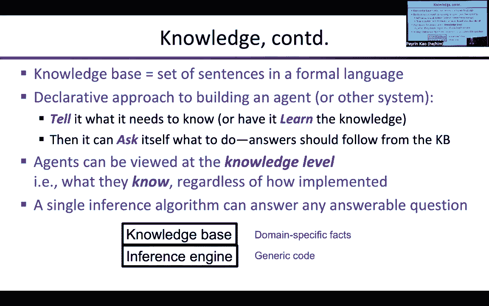
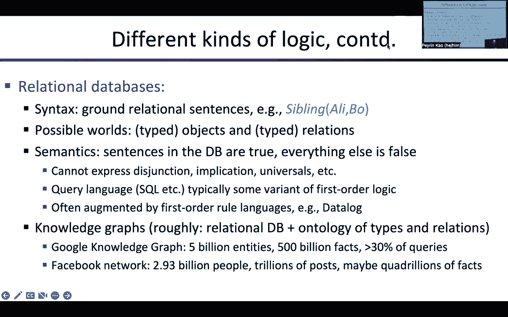

# CS188 伯克利最新AI课程--人工智能入门推荐 - P5：[CS188 SP23] Lecture 5 - Local Search, Propositional Logic and Planning - 是阿布波多啊 - BV1cc411g7CM

最优解作为起始点。

嗯，但我们希望有一个更好的方法来找到最优的解决方案，最有效的方法之一是算法，称为模拟退火，这字面上，来自于金属学家如何使金属达到低点的类比，能量态，所以当金属处于低能量状态时。

这意味着所有的原子都排成一行，晶体结构没有任何断裂或不规则性，骨折和不规则性越少，金属越强，所以这是人们几千年来一直在努力做的事情，甚至可能有八千年，我觉得，从我们第一次冶炼的那一周开始。

人们发展了所有这些复杂的艺术方法，一种如何做到这一点的黑色艺术，然后呃，跪着是一种持续升温和降温的方式，和升温和降温，但逐渐冷却金属非常缓慢，这样所有的原子都有时间排成一行进入低能量状态，在它凝固之前。

所以当你把这个想法，你把它应用到，呃，一种算法，呃，算法要做的是，它会有一个我们所说的温度，随着时间的推移，我们会逐渐降低温度，但在任何给定的温度下，这决定了随机的坏，当温度很低时，算法可以正常工作。

算法只能向提高状态值的方向移动，所以当温度很低的时候，就像爬山或梯度下降一样，取决于我们要走哪条路，当你有高温的时候，算法可以做各种随机的事情，对呀，所以它可以选择一个邻居，发现邻居很糟糕。

但无论如何都要这样做希望这能让它走出局部的最小值，随着温度的降低，算法应该在全局最小值或全局最大值上花费越来越多的时间，而不是局部最小值，局部最大值，嗯，听起来，你知道的。

最初这听起来像是一个非常多毛的，非常启发式，非常手波浪，一种非常新的AGEY算法，嗯，但事实证明，它具有非常精确的可分析性质，听起来很古怪，不是吗？这是算法，所以它基本上是一个爬山算法。

所以它有一个当前的状态，不像爬山，好的，所以嗯，从当前状态随机移动，其中一个好处是它甚至可以在连续空间中工作，所以即使你有无限多个相邻的州，对吧，你仍然可以通过生成一个随机的实数来选择其中的一个。

然后选择一个，这样它就成为你的下一个状态，然后你决定是否接受这个，把它看作是一个提议，所以我们建议我们将从当前转移到下一个，但我们根据两个国家之间的能量差异来决定是否接受这个提议，好的，所以嗯。

如果是阳性，换句话说，所以这里我们用e来表示值，所以如果Δe是正的，这意味着下一个状态比当前状态好，好的，那么我们就必然接受它，好的，所以如果你，那你总是接受那个提议，对的东西，算法所在的地方，对呀。

所以else子句是Δe为零或负值的地方，你以一定的概率接受它，对呀，所以我们要成为一个，这是一个随机算法，将接受这个建议，概率与数值差异的指数成正比，好的，现在你可以看到温度在哪里。

所以它是e到温度的Δe，好的，所以如果温度是，然后呢，事实上，这基本上就是，e到零，也就是，非常接近一个右，所以它是负的负的微量，所以它非常非常接近一个，好的，所以当你有非常非常高的温度。

你接受每一个动作，不管情况有多糟，好的，所以在非常非常高的温度下，算法基本上是在做一个，它总是在那里，永远这样做，好的，当温度非常非常非常低的时候，所以T非常非常小，就得到了e的负无穷大，右边是零。

所以当温度非常高的时候，非常低，它永远不会接受一个糟糕的举动，好的，然后在中间好吧，这将取决于三角洲的相对大小，e，值与温度的差异，好的，所以在某个温度下，这些将大致相当。

所以会有一些合理的概率接受下坡移动，但不是，你知道吗，不是完全疯了，随着温度逐渐降低，算法开始到处都是老鼠，然后逐渐开始平静下来，发现还好，我要留在这里，因为这是很好的状态，我去那边看看。

但现在我回来了，因为我不太喜欢那样，对吧，最终变成了爬山，这样你就可以，你可以想象自己用一个，如果你把，如果你把风景看对了，作为状态函数的值，想象一下建造一个小小的物理景观，然后拿一个橡胶球。

把整个东西包在一个盒子里，现在就像疯了一样摇晃盒子，所以如果你疯狂地摇晃盒子，橡胶球会到处去，你不知道它在哪里是对的，但当你逐渐放慢摇晃的速度时，你希望的是好吧，它会进入全局最大值，也许它会再次弹出来。

但它将保持在全球最大值，超过它将停留在本地最大值的次数，因为它更容易弹出局部最大值，然后这个想法希望是，当事情平静下来，你总是会在最后的全局解决方案中找到它，所以再一次，我在这里听起来还是很有手感。

对呀，但我想让你得到物理直觉，为什么这是有效的，好的，这是个问题，是啊，是啊，哦，什么背，对不起，我们用e作为基础有什么原因吗，其实完全没关系，对呀，因为如果你改变E，您只需对T使用不同的刻度。

就完全一样了，是的，但你知道他在，呃，在物理学中，所以那是，所以我习惯了，是啊，是啊，是啊，是啊，如此如此，那只是你自己的决定，关于你希望事情随着时间的推移如何冷却，好的，所以你可以用任何，任何时间表。

你本可以，嗯，你可以有一个时间表，呃，所以这是时间的一步，对了，小T，这是大T的温度，对呀，所以你可以让它像那样指数级冷却，你可以拥有它，然后下降然后上升然后下降，然后向上，然后向右下降。

这就是黑色艺术的用武之地，对呀，所以时间表决定了给定时间的温度，步进算法对吧，所以如果你知道如果你是，如果你步调一致，七百五十一，对呀，然后你抬起头来，好的，温度应该是多少？应该是这样的。

这是我插入指数的数字，决定是否接受这一举动，好的，所以一般来说你想要，你想让温度降到零度，嗯，但这到底是怎么做到的，那是黑艺术，对呀，所以尽管这看起来很薄，波浪式的启发式的。

我们实际上可以证明这个算法的一个非常简单的性质，也就是说，如果你固定温度以选择一个特定的点，你让算法在那个温度下运行足够长的时间，那么算法占据任何特定状态的概率，与状态的能量除以温度成正比。

所以这意味着如果我们，呃，如果我们看看当t为零时会发生什么，这意味着所有的概率都将处于最佳状态，因为它将有最大的E，所以它将主导这个概率分布，这将是，你知道的，亿亿，万亿次，比能量少一点的状态更有可能。

所以这意味着在T为零的极限下，如果你把温度降低得足够慢，你会以概率1收敛到全局最优，这种分布称为玻尔兹曼分布，玻尔兹曼是一位物理学家，我想十八世纪，嗯，作为一名物理学家。

他能够计算出这实际上是一个一般性质，不仅仅是这个算法，而是各种统计机械系统，所以这是一个分布，你知道的，原子的能量，在气体和其他各种东西中，是啊，是啊，在这里，我们更喜欢更高的能态，所有的权利。

所以我们会给你一个简单的证据来证明为什么这是正确的，就像许多这样的证明一样，当我们开始谈论贝叶斯时，你会习惯的，渔网，比如说，非常相似的想法，对呀，我们希望了解一个系统的平衡性质。

所以平衡意味着我们让它达到平衡，而不是在我们前进的过程中不断改变温度，所以这意味着这个性质在极限内为真，当你让温度非常移动，非常缓慢，向零下降，就在时间表的每一点上，只要你移动得足够慢，这个这个分布。

这个概率分布将保持不变，然后当t为零时，这个概率分布意味着你所有的概率都处于最佳状态，好的，嗯，所以作为一个物理学家，你的思维方式是，你觉得，好的，让我们看看两个相邻的州，好的，它们是x和y。

让我们假设y高于x，所以y是比x更好的状态，对呀，但我们感兴趣的是，系统从x转换到y的概率是多少，从y到x，好的我们希望它们保持平衡，因为在平衡状态下，从y流到x的概率量将被，从x到y的概率量，好的。

我们把方程写下来，这就是平衡方程，然后我们解决它，好的，所以这是一种非常简单的思维方式，为了让事情变得简单，我会假设，x和y的出度是一样的，所以这里的出度是4，对呀，每个州都有四个邻居可以去。

所以我们会对，概率有多大，如果我在X中，我去Y是对的，我必须都选Y，然后我不得不接受这个建议，所以我必须发生两件事才能到达X，从x到y，同样的事情从y到x，然后不得不接受那个提议，好的。

但是因为y比x好，对吧，我应该去X的提议只会被概率地接受，而从x到y的提议总是会被接受，因为这是一种进步，所有的权利，嗯，所以说，让我们让，p x和p y是这两种状态的占有概率，对呀。

所以这是系统发现自己在x中的概率，Look发现自己在Y中，如果i在x中，那么有多少流量，对呀，有多少流向Y，嗯，它是以x为单位的量，也就是x的p，然后乘以跃迁发生的概率，所有的权利，所以那是，嗯，呃。

让我们工作吧，让我们解决这个问题吧，所以我们得到了x的量，然后x变成y的概率，等于y中的量，然后y变成x的概率，好的，现在我们只需要填写我们所知道的，也就是转移概率，因为这是我们在算法中已经说明的。

好的，所以是x的p，从x到y的概率是多少，你必须选择Y，那是d的1，那我们接受这个建议的可能性有多大？嗯，为什么更好，所以我们总是接受这个建议，所以这只是一个，好的，然后是y的p。

a和y再次选择x的概率是多少，1/d，我们接受这个建议的可能性有多大？嗯，这是不同的权利的不同，嗯在能量中，好的，所以我和E试着在这里找到标志，但我可能会犯一个标志错误，但我以后会修好的，嗯，这将是。

差异和差异是负的，所以这是呃，x的能量减去y的能量，全身T，对呀，所以这意味着，如果x的e小于x的e减去e y为负，所以我得到了一个T上的负数，越糟糕，那么它越接近零，所以看起来我把事情弄对了，好的。

所有的权利，嗯，现在我们结束了，好的，所以我们只要划掉这些上面的一个，因为这些抵消并划掉了，我们写，x的p/y的p等于井，是e到e x e到ex减去e y，所以这是E到，x/t的e。

除以e到e的y除以t，和，这意味着你处于一种状态的概率与，状态能量除以t，所以这是非常简单的证明，一旦你掌握了这个基本的物理概念，好的，它处于平衡状态，这意味着一切都必须平衡，写下平衡方程。

解决它完成了，好的，所以好吧，所以我们已经用这个算法神奇地证明了，占据一个状态的概率遵循这个玻尔兹曼分布，然后当T归零时，脉冲分布最终形成尖峰，完全处于最佳状态的delta函数，如果有两个最好的状态。

然后它在它们之间平均分配概率，对呀，所以它完全是你想要的，好的，对此有什么问题吗，好的，好，要么困惑，要么完全理解，所以我假设你完全理解，嗯，所以如果我看看这意味着什么，对呀，所以在t等于无穷大时。

所以非常高的温度，对，概率在任何地方都是一样的，对，所以t等于无穷大，当t等于零时，对呀，只是尖刺，这就是t等于零的概率分布，然后在中间温度下，这取决于比例对吧，这意味着你知道像这样的功能。

就像你知道那么多，um能量差，对呀，如果温度比那大得多，这个功能基本上会被抹去，所以这取决于温度，如果温度是，嗯，假设是这个的三倍，我们叫这个英国吧，对呀，所以如果温度是3K，那就会被抹平。

你知道会有很大的颠簸，所以我们会有一些看起来像这样的东西，所以t等于3k，对呀，然后随着温度的降低，这些特征将在概率分布中更加明显，但它们也会缩小，对呀，所以你会得到一些，然后呢，你知道看起来更像这样。

除了这些特征会比它们的能级小得多，因为他们被全球最大引力淹没了，好的，所以嗯，所以其实，如果你想，你可以用那个权利玩，你可以写一些新的情节代码，当温度下降时，观察概率的分布，你会看到它。

你知道随着温度的升高，加无穷大，都是平的，然后它会逐渐收缩包裹能量表面，除了它会抑制所有的次极大值，所以把它们压下去，直到它们完全消失，你可能会问，嗯，好的，收敛保证有多有价值，对呀。

所以这是极限的收敛，所以我们让温度无限缓慢地衰减，我们在每个温度下等待无限长的时间，算法达到平衡，所以这本身并不是一个有用的保证，因为你想要的是，你知道吗，我们能得到任何有限的时间保证吗。

要做到这一点要困难得多，这就是为什么我模拟跪着，尽管它有这么好的属性，对呀，你不会希望它有这样的属性，如果我让它运行很长时间，它完全收敛到错误的解，对所以嗯，所以转换到正确的解决方案是一件好事，对呀。

嗯，但这并不能保证用任何有限的努力，呃，你会找到全局最优解，对呀，所以嗯，所以这就是为什么它仍然是黑色的心，嗯，但这是每天用来做像这样的事情的东西，超大规模集成电路芯片布局。

这是人类已知的最难的组合问题之一，因为你是，你试图把十亿个矩形物体放在芯片上，尽量把它们都挤进去，同时尊重一系列约束，以确保有空间让电线连接一切，你没有得到直电容之类的，废话，废话。

没有这些算法是难以置信的困难，我们真的不能设计这些芯片，嗯，但有些人真的很擅长看，布局，你想要的，组件的类型，有多少限制，然后弄清楚，你知道吗，模拟跪的冷却时间表，这样你就能很快地得到相当好的答案。

他们是怎么做的让我困惑，所以它是，还剩下一件艺术品来制作这件作品，好的，所以嗯，好好看看另外几个离散的局部搜索算法很快，呃，然后我们很快就会看到连续的州本地搜索，然后我们继续讲逻辑，所以我想我们是对的。

是啊，是啊，我们的进度有点落后了，嗯，但在那里，它是，好的，嗯，所以我们要研究一个更复杂的算法，从一个非常简单的，对呀，所以人们尝试的一个非常简单的想法，即使在六十年代初，呃，局部波束搜索的这个想法。

所以不是一个局部搜索算法，对呀，如果我们有这个算法的k个副本会发生什么，他们都在同时运行，但他们可以互相交流，基本上他们要说的是看，我有，这里的一些配置看起来很好，但你的配置真的很糟糕。

所以我想你应该拿一些我的配置的副本，把你正在做的东西扔掉，对，这就是基本思想，所以在每次迭代中，你从k个状态生成所有的成功，所以通常会给你K乘以D对不起，不是DK乘以B成功。

然后你向下选择那些KB成功的K，从那些KB的成功中，好吧，然后这些K就变成了新的开始状态，然后你就不停地重复这个过程，好的，这是一个非常非常直接的，可以稍微修改一下，所以不要只对最好的k完全僵化。

你可以选择K，偏向更好的一个，所以你可以使用一些偏向于更好成功的抽样，而不是更糟糕的成功，所以有很多不同的名词来旋转，所以让我们用一个非常简单的例子，所以我有四个初始状态，嗯，这些是八八七和六的值。

好的，这里k是4，所以我有四个搜索同时进行，所以和B是两个所以两个成功，我得到了这些成功，七九九八六七七，所以我要从这些中挑出四个最好的，好吧，我要杀了其他人，所有的权利，所以还有其他州，对不起。

伙计们没能成功，所以我们就剩下这四个了，所以我们有一个9-9和一个8，所以这些成为新的开始状态，我们只是重复这个过程，现在我们得到了7 8 9 10 5 3 9，把坏的都杀了，把好的留着，我们有一个九。

一个十，一个十和一个九，好的，所以这些成为新的州，等等，我把颜色保留在这里，所以所有绿色州的后代都是绿色的，对，你可以看到发生了什么对，逐渐地，实际上绿色的家伙正在接管，所有的黄色。

黄色和红色完全消失了，嗯，有一个蓝色挂在那里，好的，是呀，呃，你会如何断绝关系，好问题，我想你可以随意断绝关系，那就没问题了，好的，呃，那边的问题，是啊，是啊，这不是效率极低吗，否，所以这样想吧，对呀。

如果你是，嗯，如果你有一个平行的机器，对吧，我跑一次爬山似乎是完全合理的，搜索每一个，也许我可以让他的速度加快，但这更进一步，上面还说，嗯，我们要让它更有效率。

通过将处理器的工作重新分配到状态空间的各个部分，更有前途的地方，所以它实际上工作得更有效率，而不是通过多次爬山搜索来尴尬地平行加快速度，好的，嗯，实际上我不会讨论数学，但实际上有很多数学用于分析。

这种类型的算法，对，有时被称为赢家算法，因为你基本上是在杀死失败者，和赢家在一起，对吗，事实上，在宫殿里有一篇拉塞尔的论文，他是圣地亚哥的理论教授，我觉得，嗯，提议，事实上。

这是一个通用的多项式时间算法，对于任何可以在多项式时间内解决的问题，让我们用，让我们用，优胜者的算法家族可以在多项式时间内解决那个问题，所以这其实很酷，但这不是目的，我在这里介绍它。

所以第一个问题是对的，为什么不一样，这是不同的，因为我们有一个重新分配努力的过程，如果他们根本不交流，那么搜索就会进入死胡同，不断产生垃圾，因为它卡在一些糟糕的地方最低限度上，在其他地方也做不到。

我们将继续努力进行搜索，但通过让他们交流，我们可以说好吧，别那样做，接受这个状态，并在那个状态下工作，好多了对吧，所以交流给了你很大的速度，对，所以你可以想到，因为这里的草更绿了，过来这边。

这部分状态空间比较有前景对吧，嗯，我介绍的原因，这是因为这是一个非常著名的算法的非常简单的版本，那个算法是，负责你们的算法，进化权，这就是进化的原理，你得到了，它们繁殖后代，我们杀了那些不太好用的。

我们复制那些工作得更好的，这正是进化的原因，有更多的并发症对吧，这并不是说这将是纯粹的进化和突变，对吗，对呀，所以对状态进行一些突变，嗯，但显然有更复杂的过程发生在，呃在进化中，嗯。

但这是基本的想法对吧，这真的是，达尔文的洞察力是，这个过程是一个非常有效的搜索算法，从这个想法，对呀，这是一个简单的步骤说，好的，除了变异，对呀，呃，通过产生继承国，我们可以更多地模仿进化。

把成对的状态混合在一起，然后从这种混合物中取得成功，好的，所以遗传算法是一种类似于局部波束搜索的算法，除了你做这种状态的成对组合，而不是让各州自己创造成功，好的，但同样的基本思想，在遗传算法中对吧。

状态总是必须以某种方式编码为，基本上是一系列的比特或把戏，或者任何它是对的，但类似于DNA序列的东西，所以它是一个数字序列或某个字母表的元素，然后为了取得成功，你拿成对的这些，例如你可能拿。

你可以看看健康状况，然后选择与适应度成正比的对，然后通过这个交叉过程生成新的状态，所以如果你把这些，呃，这里的前两个州你选择一个地方做这样的交叉，那么你要保留一个的前半部分，你要保留，嗯。

另一个的后半部分，所以我们得到了3 2 7然后是4 8 5，五二来自这个的前半部分，那个的后半段，然后其他后代，你从，呃，从这一部分，然后从那个部分开始五二四或一，好的，所以现在我有了两个后代。

我做交叉的地方，你可以在生物学中选择一个或多个交叉点，真实生物学，通常有相当多的交叉点，它更复杂，因为你有多个染色体等等，废话，废话，嗯，加上生物学中可能会发生奇怪的事情，所以在生物学中你可以。

而不是像这样做交叉，有时DNA的整个部分实际上会被向后复制，所以你实际上可以有，呃，完成，你可以完全逆转你染色体的整个部分并产生完全不同的，呃，成果，结果，好的，然后你做一个突变，所以你挑一个。

你知道吗，在字符串中随机选择一些位置，将此时的字母表元素突变为其他元素，其他的选择，然后现在我有了新的个人，我计算他们的健康状况，然后这个过程重复，好的，所以在计算机科学中有一个完整的子社区。

呃有时被称为进化计算，他们一直在研究这些方法，然后嗯，但是一些优化问题，呃还有，奇怪的是，目前最流行的方法之一是设计神经网络体系结构，事实证明，这些遗传算法实际上似乎做得很好，嗯，所以有，你知道的。

有些公司信誓旦旦地使用遗传算法，用于，你知道，设计电路和做其他事情，嗯好吧，这就是遗传算法，对此有什么问题吗，好的，有一个，有很多，如果你有兴趣，课本上有很多参考文献，你可以跟进。

有一整个期刊和会议专门讨论这些算法，嗯，所以我跳过了这个例子，所以让我们看看连续空间，因为这将是我们稍后会使用的东西，尤其是在机器学习方面，最后，如果你想知道为什么，它是计算机科学的学生被要求有微积分。

你终于可以在计算机科学中使用微积分了，好的好的，但不是很多，所以不要太兴奋，好的，嗯好吧，所以很多搜索和优化问题都不是离散的，嗯，他们其实是呃，试图在连续空间中找到解，所以我选择了罗马尼亚。

我们最喜欢的国家，然后呃，把机场放进去的问题，呃，在国内尽量减少旅行，你知道从人口居住的各个城市到机场的旅行费用，我们把这个简化了很多，所以旅行费用将是距离的平方之和。

我们将把正好三个机场有一个真正的优化问题，你还想优化一些机场，不仅仅是他们的位置，但这里我们要把机场的数量固定在三个，然后在这三个机场的给定位置，每个城市都能说出离我最近的机场对吧，那个机场是属于我的。

然后我从那里取平方距离，例如，这个机场，阿加斯和韦斯·路易斯，我发音全错了，我想是雅什，有人罗马尼亚人告诉我是雅什，但是，嗯，然后你把这四个距离，你把这些距离的平方加起来。

这就是把机场放在那个位置的成本，这里的状态，我们试图优化的东西，是三个机场的三个地点，所以我们把它叫做x 1 y 1，x 2 y 2和x 3 y 3，所以球面x是一个状态，它是这个六维空间中的一个点。

好吧嗯，城市的位置是固定的，所以他们不是国家的一部分，但我们要利用这些城市位置，并计算状态的值，好的，最后一点符号，所以如果我有一个像这样的机场，CA将是离机场最近的城市，或者离机场最近的城市，好的。

所以让我们想想属于那个机场的城市，好的，所以现在我们必须写下目标函数，对呀，我们试图优化的东西，所以我们通常称它为x的f，所以它是平方距离的和，所以我们把每个机场的机场加起来。

我们把那个机场的城市加起来，距离的平方和，也就是x坐标平方的差值，加上y坐标平方的差值，这就是我们试图优化的表达式，好的，和，我们要这么做，通过现在摆弄机场的坐标，如果我们在我的笔记本电脑上。

我可以用手指移动这些机场，你会看到，距离变了，一切都变了，不幸的是我做不到，在我的，呃，在我的iPad上，那么我们该怎么做呢，我们实际上如何解决这个问题，鉴于有无限多，你可能会说。

让无限多的状态见鬼去吧，我要把这个问题离散化，这可能是你脑海中浮现的第一件事，因为你已经知道如何在离散空间中搜索，所以让我们把它离散化，所以你把这个连续的空间，你只要在上面放一个网格，当然问题是什么。

问题是，合适的尺寸是多少，如果你把网格做得大一点，所以你得到了一个很大的网格增量增量增量，那么你就不会有很多好的状态，但是你的解决方案的准确性会很糟糕，另一方面，如果你想要一个准确的解决方案。

如果你想的话，你知道准确地在一公里内，然后你会有一个一公里的网格，但是如果你在罗马尼亚大小的六维空间里有一个一公里的网格，对呀，你在说话，你知道在这一点上有成千上万的州，好的，所以这也行不通。

所以离散化是个问题，你知道有些技巧，像自适应网格方法，从一个课程网格开始，你会大致知道好的解决方案在哪里，然后细化该区域的网格，然后你继续这样做，最终你会得到一个最优的解决方案，所以这是一个相当复杂的。

一种算法，很难管理所有这些不同尺度的网格，很难得到保证，因为它在大网格中可能看起来很好，但事实上你错过了一个非常好的解决方案绝对完美，但它邻近的网格点都不是特别好，你能知道一些优化函数吗。

您可以得到保证，如果解决方案在给定的网格大小下看起来很糟糕，那么在那个区域就没有一个真正好的解决方案，但这很难做到，这是一个，一套非常有用的技术，因为很多很多的工程问题都是通过这些自适应网格技术解决的。

处理你有无限成功这一事实的另一种方式，好吧，所以我有什么特别的，如果我在任何特定的状态，我有无限多个继承国，对呀，所以我绝对不能做广度，第一次搜索或类似的事情，然后嗯，接受它，如果是上坡，对呀。

所以作为模拟跪的一个版本，首选爬山只要不断创造成功，直到其中一个看起来更好，然后我接受了，然后我继续前进，好的，所以这实际上是一个，有时是一个实用的算法，我们刚才说的模拟跪，那基本上。

可能是我女儿打来的，你甚至可能不得不，所以模拟跪又起作用了，你可以通过，你知道，向随机方向移动，随机距离，比如说，这很好用，但到目前为止，最大类的解决方案，利用这样一个事实。

我们实际上有一个x的f的解析形式，它允许我们计算梯度，好吧，我会谈谈这个，对吧，所以目标函数的梯度，是梯度向量，关于我要改变的每个变量，所以我有六个变量，所以这是一个六维向量，所以你对目标函数求偏导数。

关于定义状态的每个变量，好的很好，我们得用微积分，就是这样，这就是所有的微积分，可能会有一点点，嗯，所以我们可以为机场这样做，对呀，这是我们的表达方式，如果我们计算关于x 1的导数，比如说。

那就是机场那边的总和，只是属于x 1的城市，对呀，其他城市都不重要，所以只有属于一号机场的城市，然后如果你对这个求导，你会得到x x 1减去x c，这就是梯度的分量，关于移动一号机场的x坐标，对呀。

你实际上可以找到全局最优，简单地求解梯度为零，所以如果你还记得你的微积分课，这是你用渐变做的事情之一，你是不是把渐变设置为零，你说，好的，当梯度为零时，我们要么选择，你知道最好的可能，借口。

最好的解决方案，或者是最糟糕的解决方案，对呀，所以你必须考虑二阶导数，来判断你是最好的还是最坏的解决方案，我们可以用封闭的形式来解决这个问题，所以我们把这个，我们把梯度设为零。

基本上你得到的答案是机场一号的x坐标，是城市x坐标的平均值，哪个机场最近，对，所以它只是重心，对每一组城市来说，你把重心，相对于那组城市来说，这是机场的最佳位置，好的。

所以这是一个我们实际上可以以封闭形式解决的案例，因为这是全球最优的吗，因为在局部最大值处梯度可能为零，嗯，是啊，是啊，其实是这样的，如果这实际上是最优解，这确实使平方和最小化，嗯，如果你这么做了。

如果你算算，这是一个，它是一个最优的，但它真的解决了把机场放在最好的位置的问题吗，好，所以我们还没弄清楚，所以如果我们修复分组，换句话说，如果我们，如果我们只看保持这种关系的机场位置。

这些城市有这个机场作为最近的，只要这一点保持不变，这是最优解，但也许有一个地方可以把机场，它实际上翻转了哪个城市属于哪个机场，总数更好对，所以其实，对于这个问题，优化的连续部分是微不足道的，对呀。

但你也得看看，好的，现在，让我移动这些机场，改变哪个城市离哪个机场最近，然后检查，好的那一套那一套那一套是更好的解决方案，所以这实际上是一个比你想象的更复杂的问题。

因为实际上有很多方法可以把所有的城市分成三个，分成三组附近的城市，然后看看解决方案的成本，好吧，那么这部分，你可能希望他们在连续搜索的基础上进行离散搜索，但它仍然可以通过本地搜索来完成，伟大的嗯。

另一个我们解决不了的案子，呃，梯度等于零，对呀，对于出现的大多数问题来说都是如此，比如说，在机器学习和神经网络中，当梯度等于零时，我们一般不能解，嗯，那我们就得做一些爬山的动作，除了现在。

我们有一个渐变，我们可以沿着这个梯度走到我们想要的程度，但梯度只在特定点上有效，所以如果我在这里，我计算一个梯度，好吧，我上坡试图得到一个更好的解决方案，我能走多远很好，如果我一直走到那边。

我可能处境很糟糕，对，因为这让我到了这个状态，好的，所以即使有梯度的解析公式，不允许你以任何直截了当的方式解决问题，因为你还得弄清楚，好的，我如何取这个渐变，就像我们经常爬山一样，我如何利用这个梯度。

得到一个全局最优，当我能看到的只是我的小邻居，对，我你知道那是上坡，但你知道我可以爬上坡，一次一小步，对吧，或者我可以做一些聪明的事情，就像你知道的，保持两倍的距离，我去直到网站，直到坡度再次开始下坡。

等等等等，对呀，如果你在那里坐一个小时，你可能会想出20种不同的算法来使用这些渐变，试图找到最优解，有一整个，我是说，不仅仅是一个亚社区，一个致力于优化的真正社区，在那里你有分析功能。

但你试图找到全球解决方案，有时受到制约，整个期刊，会议，或者你把它命名为致力于这个问题，所以我不可能涵盖所有这些东西，但我只想让你明白，有一个分析梯度是一个很好的起点，总比没有强，但你还有很多工作要做。

我们通常可以将搜索问题表述为在状态空间中寻找最佳路径，而是简单地找到一个最佳状态，我们不在乎我们为到达那里而走的路，嗯，这包括许多配置问题，设计问题等等，我们讨论了几种爬山算法和它的连续近亲，模拟器跪。

这给这个过程增加了随机化，然后这些光束搜索和遗传算法，它的工作原理是通过多个搜索相互通信，试图尽可能快地覆盖状态空间，好的，嗯，我们稍后会看到，呃，我们拥有的几乎所有机器学习算法实际上都在进行本地搜索。

在某种参数空间中，以提高关于数据集的性能，所以他们就是这样，在我们继续讨论逻辑之前，有什么问题吗，但我们在跟踪这些竞争，像你一样，你有一个更大的，如果我，如果我有这个特殊的问题，就像机场引用问题对吧。

我可以用手算，然后我输入目标函数，然后算法以f和f的导数作为输入权，所以这是你现在通常做的事情，嗯，所以我可以写为数值程序的任何函数，换句话说，输出数字的程序，我能写的任何函数，包括递归函数。

带有FS的函数，然后和其他人的和各种各样的东西可以自动区分，所以这是技术的一部分，所以如果你使用TensorFlow或Pytorch，这项技术的一部分是自动区分，这意味着我可以。

在任何一种排列中的各种元素，你知道，用循环和所有其他的，自动差分只是负责计算网络的梯度，所以这是一项非常重要的技术，这很有趣，因为自动微分可以追溯到计算机科学的早期，你知道。

当人们在五六十年代写Fortran的时候，因为他们想对工程设计进行优化，因此他们发展了自动微分的理论和实践，它们是一个没有人关心的利基领域，他们为自己感到非常难过，然后机器学习出现了，突然间。

自动微分就像是最热门的东西，你知道，因为切片面包，那个社区就像哇哦，五十年后终于，有人在注意我们，所以很酷，好的，所有的权利，所以我们没有那么长的24分钟来讨论逻辑，嗯好吧，所以逻辑是关于逻辑的，呃。

所以如果你想建立人工智能系统了解事物并能正确推理，那你就要学习逻辑了，好的，你可以叫它不同的东西，你可以假装你对逻辑一无所知，但你在做逻辑，因为这就是逻辑的意义，它是知识和推理的数学，好的。

这就是我一开始要讲的，嗯，为了让它具体化，我们必须有一种特殊的语言来书写知识，然后我们可以推导出与特定语言一起工作的推理算法，所以我要用的语言是命题逻辑。

部分是因为你已经从计算机七十级或数学五级对它很熟悉了，嗯，部分原因是它实际上是一个，尽管这是一种非常非常简单的语言，它是计算机科学中一种非常重要的语言，我们已经用了很多很多，呃，重要的计算机科学问题。

如设计和验证我们计算机运行的电路，嗯，检查程序的正确性，检查安全协议的正确性，人们用它来完成的各种任务，嗯，但我们要用它来追鬼和吃点，好的，所以我们要了解吃豆人，我们将就如何在群居世界中表现进行推理。

利用这些知识，好的，这在一定程度上说明了逻辑可以是关于任何正确的东西，这就是为什么它这么酷，你可以写下任何你想要的知识，所以打包世界就是我们要做的，所以这个东西，这种叫做知识的东西，对呀，这是一种。

人类知道事情是正确的，这是常识，你知道的事情，你知道事情真的很重要，因为否则你会很难运作，对呀，你就会，你知道你会忘记你的车在哪里，你，你遇到人却认不出来，当你的钱花光时，你不知道该打电话给谁。

因为你会忘记你的父母是谁，诸如此类的事情对吧，所以就像不言而喻的那样，人们知道一些事情，你所知道的，我们从哪里得到这些知识，其中一些我们直接在世界上感知，有些是更一般的知识，不是特定的事实。

但是对世界如何运作的一般理解，我们从经验中学习，其中一些是通过语言传达给我们的，所以我们看书，人们告诉我们事情是对的，让我们看看，这些都是获得知识的不同方式，嗯，有趣的是对的，有很多心理学实验表明。

我们经常忘记我们是如何获得知识的，对呀，我们只是知道事情，但我们不记得我们是怎么知道他们有的，有人告诉我们，1。我们在电视上看到过，我们在收音机里听到，我们在书上看到了吗？我们不记得了。

我们只是知道这些事情，所以我想，你知道的，我知道维也纳是奥地利的首都，我怎么知道我不知道对，所以呃，所以这真的很重要，我们将要研究的特殊知识，嗯，关于行动效果的知识。

因为我们希望我们的吃豆人特工制定计划并在世界上有效，所以吃豆人需要知道当它移动时会发生什么，你知道它能吃点，它能逃脱山羊吗，鬼魂等等，这就是所谓的过渡模型，这和你的搜索算法中的知识是一样的，对呀。

继承职能权，产生成功，如果我对这个状态做这个动作，我把这个新状态弄对了，除了不是用Python或C++编写的，只有当你，你知道生成一个新的状态，对呀，这不是真正的知识对吧，它是如此，它是一块。

这是一部分，这是关于知识的投射，为了特定的目的进入该程序，但总的来说，我们只是写下关于过渡模型的知识，我们可以用任何方式使用它，我们想要，好的我们会看到实际上有很多不同的方法来使用这些知识。

我们需要知道吃豆人真的会出现在这个世界上，你不是不是你从上面看这个状态，其实吃豆人在世界上，他只有他的小局部感知，所以他得弄清楚，他的传感器信息对世界的实际状态意味着什么，我们称之为传感器模型，对呀。

这是世界如何产生传感器输入，吃豆人在任何给定的状态下都能感觉到，好的，所以过渡模型，传感器模型，还有关于世界状况的知识，所以吃豆人需要知道世界是什么样的，在开始的时候，你知道，问题的初始状态。

如果你喜欢，然后用它来制定计划，嗯，所以说，你可以用这些知识做的最重要的事情之一，你可以跟踪世界的状态，我们会一遍又一遍地看到这个，通过课程，它有时被称为状态估计，对呀。

根据你随时间收集的观察来估计世界的状态，人类往往没有意识到你一直在这样做，对，你这样做是为了你的身体，所以即使你坐在那里，你的身体知道你的手脚在哪里是对的，你可能还记得你把车停在哪里，冰箱里有多少东西。

有时你会去一个新的地方，你只有真正注意到它，当它失败的时候，你去了一个新的地方，你完全倒时差了，你早上四点醒来，你不记得你在哪里是对的，所以你记得当它失败的时候，你注意到了，你甚至不记得是哪个国家。

我是说，或者我应该做什么，我需要起床，我要开会吗，发生什么事了，然后它逐渐回来，但大多数时候你知道你在哪个国家，如果我问你在哪个国家，你们都知道你们在加利福尼亚，这并不难，但你可以看出你在做那件事。

因为有些时候你停止了，当你有时差反应时，它就失败了，你去了外国，然后你就睡着了，你知道在这个过程中有些东西会破裂，你失去了链子，但你其实一直都在做，你的大脑在没有意识到的情况下跟踪着一吨又一吨的东西。

很明显，您还可以使用关于过渡和世界处于什么状态的知识来构建计划，你可以用一些类似于搜索算法的方式来做到这一点，事实证明，它可以，比我们看到的任何搜索算法都高效得多，这些系统可以建立更长的时间。

更有效的计划，比搜索算法效率高得多，好的，然后最终是对的，这可能不是在一个88，也许在研究生课程中，我们会有人工智能系统，做设计之类的事情，引力波探测器，我为什么要举这个例子，就在这里是。

这是我过去几年在科学界最喜欢的事情之一，对呀，所以有一些黑洞，大约12亿光年外，所以不是一直到宇宙的另一边，但相当远的距离，呃，你知道的，走向宇宙的另一边，12亿年前，所以这些黑洞彼此旋转得很近。

对和嗯，试着想象这是什么样子真的很神奇，因为这些黑洞是，嗯，直径可能有几公里，你知道，每一个都和太阳一样重，他们互相飞来飞去，像这样一秒钟对几次，事实上，这是一个如此充满活力的过程，它正在产生引力波。

将能量带走，产生的能量是，宇宙中所有恒星产生的能量，这是任何地方发生的最有活力的过程之一，是黑洞互相盘旋，最终碰撞，这产生了惊人的能量，12亿年后，那些引力波到达这个装置，得心应手的花花公子引力天文台。

LIGO Lointo铁度引力天文台，对呀，所以这些手臂中的每一个，我想有四公里长，或者类似的东西，他们有激光束，他们有镜子，他们有各种不可思议的电子电路来测量这些东西，这是一件难以置信的东西，然后瞧。

看哪，他们根据所有这些物理理论预测，这个到达的引力波会是什么样子，嗯和瞧，看哪，对呀，大家可以看到，你可以看到这些黑洞旋转的频率越来越快，当他们越来越近，正如物理学所预测的那样，然后，然后碰撞发生了。

我举这个例子的原因是，你能那样做是完全不可想象的，如果你什么都不知道，事实上，它的层层叠叠，物理学的，镜子的光，激光的，为了让这件事成功，对呀，嗯，我提出了这个例子，你知道吗。

世界上很多超级深度学习爱好者，他们刚刚张开嘴，因为你知道首先出现在脑海中的是，哦，我会用成千上万个其他引力天文台的设计来训练它，好像没有，但没有任何引力，还没有人发明它，对呀，所以呃，我们不可能希望。

呃，模仿人类的智力，除非我们掌握人类知道事情的事实，我们知道很多东西，我们用这些知识做了难以置信的复杂和惊人的事情，所以逻辑是这样的，我要教你什么，逻辑是朝着这个方向迈出的一小步。

希望你能朝着这个方向迈出更多的步伐，好的，否，来获得更多的技术，好吧，好吧，我经常用知识库这个短语，所以知识库基本上是你把知识放在那里，我们会把知识看作是一组句子，在正式语言中，对呀，这只是一种说法。

它真正意味着的是，机器的内部配置满足某些特性，这意味着您可以将它们添加到，把它们拿出来，或者你知道，然后用推理过程将它们结合起来，但你知道，不一定是，你知道的，写在那里的一个实际的句子。

它可能只是一串位，说明句子中哪些变量是正的，哪些变量是负的，诸如此类的东西，但把它看作是形式语言中的一组句子，这是知识库，对吧，所以我们构建系统的方式，就是简单地告诉基于知识的东西。

所以我们要告诉我们的逻辑推理系统，关于吃豆人的一些东西，当它对吃豆人有足够的了解，我们只是想问你几个问题，你怎么能，我怎么能把所有的点都吃掉，我怎么能在不被任何鬼魂吃掉的情况下做到这一点，我在哪里。

这是另一个好问题，吃豆人，对呀，不知道他最初是对的，地图是什么样子的，我不知道，好的，我四处游荡了一段时间，这些我都见过，我有，我知道地图，但对，所以我们只是问这些问题，很酷的是，嗯。

你不必考虑如何回答这些问题，对，已经处理好了，因为我们已经有了通用推理引擎，对呀，这是另一部分，推理算法或推理引擎，有时被称为是以一种完全不可知论的方式设计的，关于知识是什么，他们不在乎。

所以你可以加入一堆关于吃豆人的知识，然后问我如何在避开鬼魂的同时吃掉所有的点，它会告诉你你可以加入一堆关于物理的东西，说我如何探测引力波，它将提出一个引力天文台的设计，那有点难，但原则上这是可行的。

因为，任何可回答问题的意义，他们最终会给你答案，对于命题逻辑来说，这是相对容易看到的，因为只有有限的可能世界，你可以用命题逻辑构造，具有一阶逻辑，这是一种更强大的语言，有无限多的可能世界，事实上。

找到这些通用的推理算法是相当困难的，但你知道，我们在一九六五年左右成功地做到了这一点，好的，所以我想让你们明白这一点，因为你们要在项目2中做到这一点，我保证今天来演讲的人，或者听讲座的人希望得到它。

你告诉系统你所知道的，你问它一个问题和一个主题，没有来讲课或不听磁带的人，或者没有读过这一章，他们会试着喜欢，编写代码使其，做所有的步骤，做这个，做那个，喜欢，基本上是模仿。

深度优先搜索和诸如此类的东西，让自己完全，不是因为它比那简单得多，对吧，你只要告诉它它需要知道的，你问它一个问题，一切都好，这就是系统的设计，作为知识库，那是你把你知道的东西放在那里的地方。

有一个推理机，那是域独立的，是的原则上它应该能够回答任何可回答的问题。

好的，这里有一个例子，所以我告诉我告诉这个一般的命题逻辑推理机，关于吃豆人的事实，然后我给了它关于这个特殊结构的事实，我说，吃掉所有的点，虽然不是，呃，被鬼吃掉，好的，然后嗯，那个工作，我们开始了。

好的，所以谢谢你，然后他就走了，对，我写了很重要的一点，我没有写任何代码，刚告诉它吃豆人的真相问了一个问题。

所以现在我们要开始变得更具体一点，所以我们必须谈谈一些特殊的逻辑，对呀，所以一个特定的逻辑是由语法定义的，语法说，好的，这些是形式语言中允许的句子，和语义学说，如果我有一个句子，我有一个可能的世界。

我如何判断那句话在那个世界上是真的还是假的，所以这定义了我们所说的真理，语义学告诉你，好的，为了这个可能的世界，这句话是真的，你一直在做正确的事情，我是说，实际上代数是另一种逻辑。

所以如果我有一个代数断言，呃，x比y大，对吧，一个可能的世界将是，你知道，x等于6，y等于7，代数的语义会告诉你，好的，这句话在这里吗，在这个世界上是真的，对呀，答案是否定的，好的，在那个世界上是假的。

这是真的在一个不同的世界，其中x等于8，y等于5，对呀，所以那是假的，那是真的，所以你大半辈子都在形式逻辑中工作，形式逻辑基本上是代数，可能世界是数字对变量的分配，命题逻辑实际上要容易得多。

因为只有两个数字，零和一或真和假，好的，嗯，但除此之外，代数更简单对吧，没有指数和像那样复杂的事情，有正义和或不是这样，这是一种更简单的语言，但你已经这么做了，但把这两件事分开是有帮助的，正确的语法。

句子是什么，然后语义学是关于可能世界中的真理，好吧嗯，例如，你知道的，句子alpha 1在右边的世界中为真，呃，和空白，停靠世界，这就是第一个句子是假的地方，好的，嗯，所以真相基本上是一种说法，好的。

为了这句话，所有这些世界都是可能的，这些其他世界被排除在外，阿尔法二是一个非常强烈的句子，因为它排除了一大堆世界，实际上只有在一个世界里才是真的，好的，然后是阿尔法三，是一个非常弱的句子。

因为它几乎排除了任何正确的东西，但它实际上是阿尔法二的补充，它正好是世界的补集，在那里它是真的和假的，所以阿尔法2和阿尔法3实际上是对立的，他们在真相是什么的问题上互相矛盾，是啊，是啊。

在最后的几分钟里，我们将讨论一些不同的逻辑，所以命题逻辑是你应该已经从数学五五或CS中知道的，七十，所以语法涉及命题变量，像p，q和r或x，一个，或下雨或晴天，然后是逻辑连接词，所以这些是代数。

而不是加、乘、幂，或者不是，而且当且仅当一个暗示，对呀，这些都是将变量连接在一起形成更复杂表达式的方法，命题逻辑的可能世界简单地给每个变量赋真或假，所以如果我，如果我有四个变量，p，q，R和S。

一个可能的世界会说，好的，p为真，q为真，r是假的，这是真的，对呀，所以我们可以把一个可能的世界想象成一个比特矢量，好的，然后对于任何复杂的句子，关于一个可能世界的复杂句子的真理。

是使用逻辑连接词的含义来确定的，对呀，所以你只要把复杂的句子分解，直到你得到变量，查找变量的值，它们要么是一，要么是零，然后你应用定义连接词的规则来获得整个句子的真实性，所以下次我会看一些例子，所以说。

命题逻辑的语义，基本上是关于定义逻辑连接词，所以当α为真的时候α和β为真，贝塔是真的对吧，所以说，等等对吧，所以你应该熟悉一阶逻辑要复杂得多，它对所有人都有量词，并且存在，它的变量范围在对象上。

可能世界实际上被认为包含物体，对呀，所以你可能有一个有三个物体的世界，和这个关系，所以p x y是a是关系或谓词，在这个可能的世界里，这种关系只适用于对象，一二，但不是为了任何人，零三和零三。

零三以此类推，um q是另一个谓词，拿一个，呃，喔，那是不对的，Q是一个关系，所以应该还有另一个争论，所以它能撑住，假设零三，零二f是函数，所以你必须对函数的每个可能参数说，它指向什么，对呀。

这就是一阶逻辑的语义，一个有所有这些复杂表达式的逻辑句子是如何，告诉你一个包含物体的世界，职能和关系，所以这学期我们不讨论第一和逻辑，因为它不符合时间表，嗯，但我强烈建议从第八章学习它，嗯，只是为了。

呃，给你一些更具体的例子，对呀，数据库呢，对呀，我们如何将数据库视为逻辑，数据库是非常简单的逻辑，对吧，像一阶逻辑，它们有关系名称，然后有关系的参数，所以你可以有兄弟姐妹或工作，或拥有。

或任何其他类型的数据库关系，但没有连接词，没有也没有，或者没有暗示，对呀，所以知识库只是一袋，语义是，基本上如果一个句子在数据库中，那是真的，如果不是，那就是假的，好的，所以有一个遗漏。

如果我没告诉你事情是真的，那么根据数据库，它是假的，对呀，所以你不需要否定，因为如果你想否定某件事，你只是不把它放在数据库里，但你不能处理这个交界处，你不能说好，也许他为中情局工作，可能他为克格勃工作。

2。我不太确定是对的，你不能说你要么为一个，或者你可以让他为克格勃工作，也可以什么都没有，在这种情况下，他既不为他们工作，但你不能说他为这两个人中的一个工作，我不确定是哪一个，所以没有分离，没有暗示。

没有普遍的量化等等，只是另一端的一袋事实，当您要进行查询时，这实际上是数据库使用一阶逻辑的地方，所以SQL基本上是一阶逻辑的另一种语法变体，所以你可以有查询，你知道的，每个为约翰工作的人。

也为克格勃工作，对呀，你可以把它作为一个查询来问，但不能将其作为数据库本身的断言，因为数据库不允许普遍量化的断言，所以最常见也是最重要的关系数据库之一是谷歌知识图，所以谷歌知识图是一个关系数据库。

有类型化的对象和类型化的关系，它是可扩展的，因为人们可以向它添加更多的东西，与它的更多关系，更多的事实等等，嗯，截至2020年，它有大约50亿个实体，大约五千亿个事实，它被用来回答超过30%的问题，呃。

在谷歌搜索引擎中，所以非常粗略地，你可以说那个特定的关系数据库价值大约5000亿美元，因为它占公司价值的三分之一，嗯，Facebook几乎什么都不是，只是一个数据库，你的你知道。

当你在你的Facebook页面上创建所有的东西时，你和别人交朋友是对的，你只是在为他们填写Facebook的关系数据库，对呀，你帮了他们一个大忙，然后呃，但事实就是如此，朋友网络是一个关系数据库。

朋友Joe Pete是关系数据库中的一个事实，所以没有什么花哨的，嗯，你知道的，它是，它使用了二十世纪八十年代的关系数据库技术，那是值得的，也许一万亿美元等等，对呀，但这些都是非常非常。

非常简单的基于逻辑的系统，在现实世界中有巨大的影响，好的，嗯，我想我们就到此为止吧，我们没时间了。

