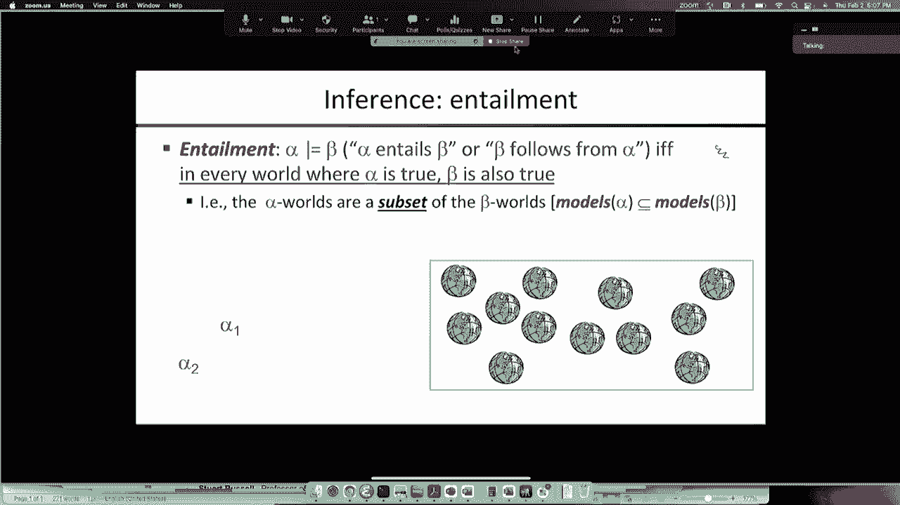
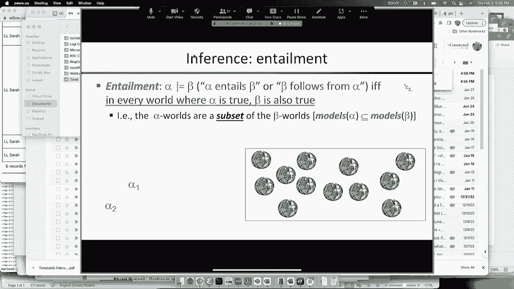
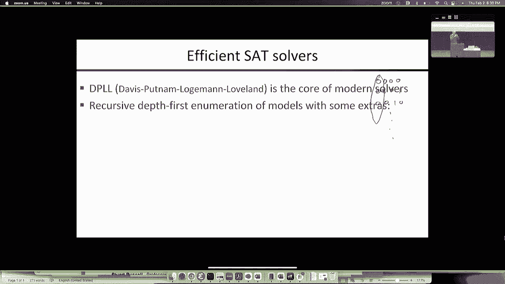

# CS188 伯克利最新AI课程--人工智能入门推荐 - P6：[CS188 SP23] Lecture 6 - Boolean Satisfiability, DPLL - 是阿布波多啊 - BV1cc411g7CM

这是一个很好的观点，是这样吗，否，它不是，哦，这没关系，只是，我们必须重新加入，我只是在测试。

记录在，被记录下来，这样我们就可以上传，所有的权利，嗯，看起来我们有技术，东西通过实时变焦出去了，在我的iPad上，所以我想我们终于开始做生意了，好的，所以我们开始谈论逻辑，特别是命题逻辑。

我们讨论了语法，语义，语义，基本上是对一个句子在一个可能的世界中是真的还是假的定义，嗯，从这个真理的概念，定义我们所说的逻辑蕴涵是很简单的，对呀，一件事必然伴随着另一件事。

或者第二件事从逻辑上来说是从第一件事开始的，蕴涵的定义很简单，对呀，所以符号看起来像这个alpha和尾巴，贝塔，这意味着每当alpha为真，所以在每一个阿尔法为真的世界里，必须是贝塔也是真的。

这正是我们所说的真正跟随的东西，因为如果有一个α为真β为假的世界，这意味着贝塔有可能不是从阿尔法开始的，有一个相反的例子，这正是阿尔法为真而贝塔为假的世界，所以逻辑蕴涵是关于可能世界之间的关系。

阿尔法为真的可能世界和贝塔为真的可能世界，关系是子集关系，这有时会有点违背直觉，因为当我们想到α和β，我们认为α比β更大更强更强大，嗯，但是阿尔法为真的世界的模型，是世界的一个子集。

我们认为子集更小更弱等等，好的，那么为什么，为什么这种明显的违反直觉的关系，因为句子越强烈，你提出的索赔就越多，你就越排除可能的世界，如果你什么都不说，完全空洞的陈述，那么在所有可能的世界里都是如此。

因为你什么都没说，如果你说一些非常强烈的话，那么这只能在少数世界中出现对吧比如，如果你有四个命题符号，你说它们都是真的，A为真，b为真，c为真，d为真，那么你实际上已经把它缩小到了一个世界。

所以有四个符号的十六个可能世界，你把范围缩小到其中一个，好的，所以判决越强，可能世界的集合越小，例如，如果我说好，在那边的8个世界里α1是正确的，那些仍然亮着的只有在右上角的世界里阿尔法2才是正确的。

好的，那么这里的关系是α2需要α1，我们可以通过在世界各地画圈来看到，看到一个是另一个的子集，好的，所以一个例子是，阿尔法2是一个非常强烈的断言，所以这里不是Q、R、S和W对。

它实际上确定了所有四个命题符号的真值，它迫使它们都是真的，对呀，而只说not q要弱得多，因为它没有说任何关于r的东西，s和w，所以如果我们看看阿尔法一是真的世界，那是红色组，那是一个更大的群体。

因为阿尔法一号是一个较弱的断言，阿尔法两个世界在这里，对，他们是阿尔法一号世界的子集，所以这意味着阿尔法2需要阿尔法1，所以如果你只关注阿尔法2是真的世界，在那些世界里，情况必然是这样的。

阿尔法1也是正确的，所以我知道，有时你很难保持头脑清醒，但如果你回到这张照片，记住，更强的断言排除了更多的可能世界，你就会把事情搞清楚，所以从这个右边，你可以看到一个算法来计算一个句子是否需要另一个。

那个算法是什么，非常非常简单，事实上，我已经写下来了，是这个，你只是经历了所有可能的世界，你会发现阿尔法是真的，你会发现贝塔是真的，对，你检查一个是另一个的子集，现在，当然啦。

假设我们可以列举命题逻辑中的可能世界，我们就可以，因为命题逻辑，可能的世界只是对符号的真与假的分配，好的，如果你有n个符号，n个可能的世界有两个，你可以用一阶逻辑来枚举它们，有无限多的可能世界。

因为可能世界中可以有任意数量的对象，事实上，首先呢，逻辑真的是为了推理整数而发明的，在相关领域做数论证明的权利，所以它被设计成有无限多的可能世界，这使得列举这些可能的世界变得更加困难，但事实证明。

实际上一个相当相似的想法，在一定限度内列举可能的世界，足以给你一个蕴涵算法，但它确实意味着，在alpha和beta之间有蕴涵，算法最终将能够证明它，但如果在alpha和beta之间没有蕴涵。

算法将无法反驳它，好的，所以一阶逻辑是所谓的半可判定性，意思是我们可以，如果有天赋，我们可以说是，但是没有一个算法总是正确地说是或不是，好的，这与停机问题直接相关，对呀，图灵机可计算性的基本概念。

但我们不必为了我们的目的而讨论这个问题，存在有限多个可能世界的事实，命题逻辑很酷，因为我们总是可以通过枚举来解决它，事实证明，我们可以做一些更有效的事情，所以当你推理的时候，你最终得到了一个证据。

这证明了阿尔法需要贝塔的事实，或者未能证明，它的意思是，嗯好吧，相反的证明，证明阿尔法不需要贝塔，所以一个反例，所以当我们考虑推理算法时，我们关心两件事，我们关心算法是健全的。

这意味着无论何时它说alpha需要beta都是正确的，所以我们肯定想要稳健，好的，但这里有一个非常简单的算法，好吧，如果你只是说不，它不是附带的，对呀，然后你有一个健全的算法，对呀，而是一个非常。

非常保守的，只是拒绝相信任何事情，所以我们也想要完整性，所以所包含的一切都可以被证明，所以对于任何alpha-beta，阿尔法不需要贝塔，算法应该说是，所以如果它是健全和完整的。

这意味着它会捕捉所有可能的，逻辑推理，对呀，一切能证明的都会被证明，没有什么不应该被证明的就会被证明，所以Godel所做的基本上是说，没有声音和完整，为了数学权利，所以当他，所以数学比一阶逻辑更强大。

它还有归纳模式，对呀，所以数学归纳法的证明超出了直线法的范围，一阶逻辑证明，所以他表明，如果你想要归纳模式，那么你就不可能有一个健全而完整的数学算法，这意味着有些真实的东西是必然的。

在任何给定的数学系统中都没有证明，所以这对数学家来说是一个巨大的冲击，因为数学家们已经假设了两千多年，一切都是真的，每个真定理都有一个证明，事实证明这不是真的，所以有两个基本的算法。

或者人们在逻辑系统中使用的算法的基本类，第一个是模型检查，这只是算法的名称，我刚给你检查了所有可能的世界，如果阿尔法在一个可能的世界中为真，确保测试版在那个世界中也是真的，如果这一直持续下去。

那我们就大功告成了，我们有一个我们有一个证据对事实上第二个，第二课其实大家都熟悉得多，因为这就是你一生在数学中所做的，一开始你知道，你一开始学代数，你知道，把东西从方程的一边移动到另一边。

你在做逻辑推理步骤，他们没告诉你，但这是对的，但你就是这么做的，所以你更熟悉一个证明，通过一系列保持真理的推理步骤，对呀，推理步骤是合理的，所以如果你从真正的前提出发，如果你正确地设置了问题。

然后你就会知道真相，所以我们把这些叫做，算法可以采取推理规则的允许步骤，可能最著名的一个叫做肯定论，这是拉丁语中放置方法的意思，但它实际上是古希腊人所知道的，如果我知道p，我有一个句子，p意味着q。

那么我可以推断Q也是真的，所以如果你还记得所有的人都是凡人，苏格拉底是个男人，所以苏格拉底是凡人，对呀，这是一个著名的例子，实际上来自，这是肯定方式的一个例子，除了一阶逻辑，因为它有一个好的。

因为所有的人都是凡人，然后对这些句子应用前件，所以结束了，在过去的六十年左右，有很多来来回回，在模型检查器和定理证明器之间，谁有吹牛的权利，关于最强大的工具等等，对现实世界中许多实际证明的静态定理改进。

比如证明芯片设计是正确的，证明安全协议实际上是安全的，等等，目前获胜的模型跳棋，但这随时可能改变，所以我们将主要讨论模型检查，呃，事实上，我想今天我们可能没有时间去改进定理了，如果我们不。

然后只是为了好看地出现在，这样他就不用盖了，下次我可能会录一点额外的视频，只是说定理改进方法，所以我现在要做的是非常快，提醒你命题逻辑的语法和语义，然后我们看看如何让吃豆人做他的事，好的，所以语法，呃。

你从一组命题符号开始，有有限的符号，我会叫他们x 1到xn，但你可以叫他们abc或big，小烟熏，你想要什么都可以，你可以作为一个符号，嗯，有两个显著的符号，呃，真与假，我们不需要在语言中有这些符号。

但它们在那里很方便，以防，所以真的总是真的，假的总是假的，所以他们，他们只是太，如果你喜欢常数，与变量相反，好的，然后从符号中你可以造句，所以一个符号本身就是一个句子，你可以对一个句子进行否定。

这是一个句子，你可以有一个句子的连词，这是一个句子，你可以有分离，这是一个句子，你可以有暗示，你可以有当且仅当或双重暗示的句子，这就是我们将使用的所有逻辑连接词，还有一堆其他的。

nand and nor，或者电路设计人员使用的等等，而是为了在一个，在一个，以一种既好又可读的方式，这些都是很好的收藏，我们还有一件事要说，就是没有其他句子，所以当你定义一种语言时。

光说好话是没有用的，这里，以下是造句的方法，你不得不说，没有其他造句的方法，对呀，否则你实际上已经说出了语言中的内容，你对语言中的内容给出了一个下限，但你没有给出上限，所以你需要说除了这些没有其他句子。

有人对这种语言的语法有什么问题吗，我们将用括号来分组，所以我们知道哪些东西是一起的，好的，嗯，语义学，你们也应该都很熟悉，所以当我们谈论语义学时，记住，这是一个关于可能世界或模型的句子的真理。

所以如果M是一个模型，它为每一个命题符号分配真或假，然后我们想知道一个给定的句子，在那个模型中是真的还是假的，I’我没事，规则很简单，所以如果它是一个符号，然后你只要查一下，就会发现显而易见的真值，嗯。

如果是否定句，那么在模型中是真的，当且仅当模型中alpha本身为假，如果是连词，那么在模型中是真的，如果模型中alpha为真，在模型中是真的，如果是分离，在模型中是真的，如果模型中alpha为真。

或者在模型中为真的，这个或者这个是，这是英国人，或者那是英国人和英国人，或者和英国人，或者这里是包容的意思，它可以是阿尔法可以是真的也可以是打败的，它可以是真的，也可以两者兼而有之。

这是这个词的正常用法，或者用英语，和，这是一个棘手的，所以α意味着β为真当且仅当任一α为假，或者贝塔是真的，好的，所以α意味着β等价于不是α或者，所以暗示并不意味着alpha导致beta为真。

α意味着β是正确的，如果alpha是假的，对呀，为什么那口井，我只能说好，这就是它的定义，但你真正想要的是，如果你有这个暗示，前提是假的，那么你就不想说任何关于贝塔的事情，好的。

所以你只是满足了阿尔法为假的暗示，这并没有告诉你任何关于测试版为真的价值，还是假的，好的，所以这就是，这就是你想要的，然后最后一个就很容易了，对的当且仅当它只是双向的暗示，好的，所以说。

所以当且仅当在每个方向上归结为一个的两个蕴涵，好的，所以让我们来看看一个快速的例子，好了，这是我们的模型，我们有四个命题符号，a b，c，他们是真的，真，假的，假的，这是我们的判决。

我们将机械地应用这些规则，所以α在m中为真当且仅当主合为真，对不起，这里的主要连接词是一个析取词，或者当且仅当alpha是真的，n，a和b为真，或者c而不是d为真。

所以现在让我们看看A和B在M中是否为真，a和b在m中为真，如果a在m中为真，b在m中为真，这是递归的基本情况，所以我们查他们，这里有一个这是真的，这里是B，这是真的，所以这意味着a和b在m中为真。

现在我们实际上已经满足了分离，因为我们满足了两个析取中的第一个，所以我们知道α是2和m，好的，所以这是一种自上而下的方法，你也可以你也可以认为它是好的，所以我拿，我在这里取这个表达式，我替换了所有的。

命题符号的价值对吗，所以这就成了真的，假与真，其实我应该想成为，所以我应该说假而不是假，对呀，所以不是D不是假的，现在我可以从里到外简化，对呀，如此真实，真实是真实，所以这是真的，所以不假是真的。

假的和真的都是假的，所以这是真的还是假的，然后真的或假就是真的，你可以做任何一种方式，你可以想象这是一个非常简单的递归算法，我做了一个表情，我拿一个模型，分解表情，根据它的主要连接词，递归地调用自己。

把结果拿出来，做把结果放在一起的事情，给我答案，对呀，所以很简单，五行代码，嗯，所以我们有，你知道热身的事，也许在期中考试的时候，在那种事情上，我们可能会给你更多的脑力锻炼，有这样的问题。

所以我有一句话，现在我问，这句话在多少个模型中是真的，对呀，那么有多少个模特，一共四个人，十六，我听到很多所以是的，十六，好的，所以如果其他一切都失败了，你可以通过构造一个真值表来回答这个问题，对呀。

这样你就可以写对b c d了，然后你就开始填写，假冒伪劣假冒伪劣，右边十六行，对于其中的每一个，我都计算出答案，等等，我想明白了，那是最坏的情况，一般权利，我不希望你那样做，如果你发现自己这么做。

你可能错过了，你知道一些简单的技巧，好的，所以你可以做一件事，你可以简单地想想这里是好的，有多少型号，A和B有多少个模型是真的，好吧，好吧，a和b确定a在true的值，没有提到C和D，好的。

有四种方法为C和D赋真假，所以有四个模型，对于A和B右，同样地，有四个型号，c而不是d，因为c而不是d将c的值固定为true，这意味着d本身被固定为，一共有八个型号，有多少个模型是正确的。

所以这里有重复计算吗，对呀，在这两种情况下的重复计算，他们有多少个模型都是真的，对他们来说都是真的，意思是你得了B，C，而不是D，所以我固定了所有四个的值，这意味着只有一个可能的世界，他们都是真的。

好的，所以我们有四加四减一，所以您不必枚举所有16行，做所有正确的事情，只要用一些小技巧，好的，在家庭作业中也会有大量的练习，所有的权利，对此有什么问题吗，好的，所以我现在要做的是。

我们要告诉我们的吃豆人吃豆物理学，然后基本上问吃豆人或吃豆人，可以问他自己什么是真的，什么时候什么动作必须是真的，为了目标，是真的，在未来的某个特定时间，好的，所以我们要制定这个，这些，这类规划问题。

现在的逻辑推理问题，我们为什么要这么做，因为这样我们就不用写任何代码了，我们不必写星星，或者你知道，恒星或IBFS，或者任何其他算法，我们只要告诉吃豆人真相，然后逻辑推理就解决了一切，如果你仔细想想。

这实际上是一种方式，我们希望AI成为，我们不想走过来说，嗯，每个好的吃豆人，现在我想让你，嗯，我要你找到有金子的房间，但在你这么做之前，我要对你的大脑进行手术，给你一个新的算法，人类不是这样工作的。

感谢上帝，这不应该是AI的工作方式，所以如果你有一个通用的推理算法，然后它就可以为你做所有这些事情，你当然要告诉，或者吃豆人必须了解世界的真相，因为没有算法能在现实世界中成功规划。

除非它对这个世界有所了解，但是算法，你就越能使算法完全通用，所以它对任何事情都更好，这是一个例子，命题逻辑在各个方面都很弱，不太有表现力，不允许不确定性，但这是第一个例子。

我们实际上给了你一个通用的工具，可以解决任何问题，我们能用语言表达的任何东西，嗯，所以我们要做一些物理，实际上我们要为，呃，部分可观察到，吃豆人，所以你必须为此，你得想不，好的，我低头看着吃豆人游戏。

我能看到一切，从吃豆人的角度想想吧，好吧，吃豆人不能看不起自己，在这个世界上游荡，他实际上他所能做的就是看到他周围的东西，好的，所以我们要给他非常非常简单的感知能力，他所能做的就是感觉。

西、东北、南是否有一堵墙，好的，所以它有四个，把它们想象成四个布尔传感器告诉他目前的状态，四个方向各有一堵墙吗，当你开始用任何逻辑写下知识时，尤其是在命题逻辑中，好的，我的变量是什么，很明显。

我们想要墙壁的变量，呃，我们需要他感知到的变量，我们需要动作的变量，我们需要变量来判断他是对的，地点，也许最终，鬼和食物，还有其他类似的东西，所以墙的位置，对呀，我就，我就用，表示在平方零点处有一堵墙。

所以零是这里的这个吗，嗯，所以墙是零下的对吧，这是算法，推理算法不能读取变量，只是为了，就算法而言，只是个名字，名字的唯一属性是他们要么和自己一样，他们和其他名字不一样，好的，所以这只是一个信物。

我们用的是零零和墙这个词，让我们更容易记住我们写下句子时的意思，确保所有东西都正确地连接在一起，所以这只是句法糖，如果你喜欢，好的，所以羊毛，零一意味着有一堵零一的墙，依此类推，所以他们会有N个地点。

所以这意味着会有N个墙上的符号，重要的是要记住，至少在我们所知的吃豆人中，墙不会动，所以我们不需要对壁变量有任何时间依赖性，对于其他事情，比如吃豆人的位置，显然吃豆人可以移动。

所以我们需要对变量有一些时间依赖性，指地点和食物等等，感知呢，所以再次感知，布尔变量，我的西边有一堵墙吗，所以我们说封锁在西边，如果西边的墙有一堵墙，好的，感知会随着时间的推移而改变吗。

随时间的感知变化，对呀，如果他搬到那里，那里可能不再有一堵墙了，所以我们不能只说W块，因为这不是指世界的固定属性，是的，我们实际上必须按时间索引它，所以我将再次使用更多的语法糖，算法不知道这些是时间。

但我们只是用，嗯，你知道的，这个绿色下标零，指给出该知觉的时间步长，好的，所以挡住了W零意味着我的西边，在时间零，有一场战争，或者至少我感觉到了一场战争，嗯，所以我们将建立涵盖固定时间步数的知识库。

我们实际上不能，我们不能写下，你知道的，宇宙永恒的真理，因为我们没有无限多的符号，所以我们必须确定一些时间范围，然后我们描述物理学到那个时间范围，所以如果t是我们要推理的时间步数。

那么我们就会有这些感知符号的四倍T，现在我们将有动作的变量，一次又一次，呃，有一次他可能会去北方，下次他可能会去南方，所以我们必须按时间索引动作变量，所以w为零，所以再一次，绿色的下标。

W零意味着吃豆人向西移动，零点你可以走了，或者你可以去东方，也可能往北走，或任何权利，所以这又是，其中四个动作符号，又是这样，这随着时间的推移而变化，所以在零，时间为零意味着吃豆人在地点为零，时间为零。

这意味着他在零，一个在时间零，以此类推，所以我们每一步都有一个集合，你可能在N个地方，所以我们有NNT符号指的是他可能的位置，然后我们可以补充说，我们不打算谈论食物，但我们可以为食物添加符号。

我们可以添加鬼魂的符号等等，但它们的工作方式和吃豆人的位置一样，好的，所以有什么问题吗，所以这是建立词汇表四，然后我们要写下物理的公理，用这些用这些词，所以我认为这很有用，可能会有点吓人。

但保持一点对这里有多大的事情的控制是有用的，所以如果我们把我们定义的变量的数量加起来，我们有，如果在t个时间步中有n个位置，对呀，我们有，我们有墙，我们有知觉，我们有行动，我们已经得到了吃豆人的位置。

所以就大O而言，那是不对的顺序，事实上，位置变量将是，我们表示中的大部分变量，所以这意味着不可能世界的幂有两个数量级，所以如果我们选择一些合理的数字，所以对于我们标准的吃豆人世界来说，现在是二十乘十。

呃，所以n是两百，对于吃豆人来说，你知道的，去每一个广场两次，我认为这是相当慷慨的，那是四百个时间步数，所以我们说的大概是一万到两万四千，世界，好的，情不自禁，这是刚打包好的，这就是吃豆人的真相。

这就是有多少个可能的世界，如果你看四百次，二十乘十的步数，我们要用一点的引擎，这是一个集合求解器，可以很容易地处理这么多，完全没问题，因为它确实如此，有些人做事情比仅仅列举所有这些可能的世界更有效。

事实上，它可以经常处理，你知道的，所以工业强度求解器可以处理一亿个变量的问题，所以谜题世界的数量是两亿分之一，它是天文数字般的巨大，但它仍然可以处理得很好，现在从这些可能的世界中。

所以每个可能的世界都告诉你一切是真的，每一步都是假的，所以这是历史对吧，所以把它想象成宇宙历史的录像带，好的，这里有一盘这样的录像带，所以如果我们有四个时间步，这是一部可能的世界历史。

第一个里面有九个吃豆人，他们都走了，然后其中两个出现了，和一些食物，然后是一个所有的食物现在宇宙充满了食物，对呀，所以这是一个可能的历史，只是很奇怪，它自然不符合我们的物理理论，好的。

所以通过编写包物理公理，我们将排除，几乎所有的历史，好的，我们只剩下与群体物理一致的历史，好的，所以这就是我们要进行的，所以要写下一些知识，让我们从吃豆人对地图的了解开始。

所以吃豆人在这个版本的吃豆人中，它是部分可观察到的，他没有位置传感器，他只是有一个接近传感器，但在这种情况下，他会假设他知道地图，但他不知道自己在哪里，那么我们如何把地图写好呢，我们要写下一些羊毛变量。

他们就在那里，所以我说，墙零零，就是那个，墙零一，就是那个，零二，所有零三等等，不太确定，为什么，我得了零分，也许我不需要那个，好的，嗯，哦，你知道吗不，我错了，呃，这是零战零战，那是零一战，那是零二。

那是第三场战争，那是零四战争，是啊，是啊，所以在一个三乘三包的世界里，实际上是五乘五，因为外面有一整层墙，好的，我看完地图了吗，少了什么吗？少了很多，少了什么，不坐在前排的人，你能大声一点吗？哦对不起。

我们还不是在谈论感知，我只是在画地图，好的，不是食物，只是，只有墙壁，好的，所以说，少了什么，我还有什么没有说呢？在没有围墙的地方，他们只是说这些广场上有墙，所以说到这里，从逻辑上讲。

其他广场也可能有墙，或者不对，我所做的就是把外面的墙的值修好，我没说中间是什么，好的，所以这是一个非常重要的教训，它适用于各种知识的表示，英文，如果有人问我有几个孩子，我说我现在有四个孩子了。

从逻辑上讲，如果我说我有四个孩子，这与我有十七个孩子是一致的，因为一个有十七个孩子的人肯定有四个，他们还有一些，但当我说我有四个孩子的时候，我只是一个谈话惯例，在括号中，不超过四个对吧。

但我们通常不这么说，但为了逻辑，对呀，逻辑不能填补所有你没说的话，数据库，如果你还记得，做那个，所以如果在数据库中显示你有四个孩子，那你就没有五个，好吧，如果你有，你知道，四个孩子的名单，然后你说好。

这个人有多少孩子，他们正好有四个，因为在数据库中，数据库中任何不正确的内容都被假定为错误，从与人类互动的角度，这就是我们彼此交谈的方式，但它实际上会引起各种各样的噩梦，根据数据库的形式语义。

以及它们在命题逻辑中是如何工作的，如果你什么都不说，那可能是好吧，所以我们不得不说，吃豆人也知道墙不在其他广场上，所以不是一墙一不是战争一二，不是一战三，如此如此，记住那节课。

在你真正涵盖了所有变量之前，你还没有完成，以及如何组织它们，现在让我们开始考虑位置，所以吃豆人不知道他在哪里，所以我们能不能停下来说好吧，嗯，那么我们就不需要对知识库说什么了，对呀，没什么好说的。

所以说，我们不需要说什么，是啊，是啊，我是说，没关系，有一组他不知道的地点，我们回去吧，甚至比那更简单的东西，对呀，他知道他在某个地方，这真的很重要，因为就逻辑而言。

一个可能的世界是所有的位置变量都是假的，其实吃豆人是不存在的，好的，但吃豆人知道他的存在，他在某个地方，他只是不知道在哪里，好的，所以呃，我们做了一个分离，说他可能在零点出现在这些地方，所有的权利。

所以他可以在一个，一个，二一，三个，对呀，让我们说他知道他不在，因为他对地图了如指掌，所以我们知道他不在墙里，所以他必须在其中一个广场上，所以我们可以列举出这九个可能的位置作为一个disjun，好的。

我们谈完了吗，他只在一个地方，分离使他可以在所有九个地方，对，因为当这九个变量都为真时，它就为真，所以它考虑到了这种可能性，但这与Paphysics不一致，所以他知道他只在一个地方。

这在命题逻辑中有点烦人，但一种方法是说，对于每一对位置，像一一一二，他并不是同时在这两个地方，所以如果你写下，这将是这些的n平方，所以n对位置的平方，它们不可能都是真的，这就够了，第一个说他在一个地方。

他只是不知道是哪一个，现在让我们来谈谈他的传感器模型，所以传感器模型，基本上说，变量的意义如何得到它们的值，对呀，所以我认为思考因果关系是有帮助的，对呀，认为世界的状态导致价值感得到变量感。

获取它们的值，就像你在物理学中知道的那样，你写，你知道f=m a之类的，或者你知道，许多物理方程，你用一个方程定义一个变量，这个方程由一堆其他变量组成，好的，所以我们要做同样的事情，除了不是方程。

我们将有一个当且仅当，但这对布尔值起着同样的作用，就像写方程一样，所以我们要说T处的感知变量，当且仅当世界上某些条件在时间上成立，所以说，右边的条件是一个复杂的表达式，就世界的性质而言。

然后左边是传感器变量，它的值是由世界上的这些其他变量，这是第一篇真正的论文，那么perset变量是什么，你知道是我的，我的西边有堵塞物吗，我的西边有一堵墙吗，北面有一堵墙吗？墙在南墙在东墙，好的，嗯。

英文，我的西边有一堵墙，如果我在一个特定的位置，西边的位置有一堵墙，当我在那个位置时，我感觉到了一堵墙，我刚才就是这么说的，所以帕特曼在时间T的时候感觉到了西边的墙，当且仅当他在某个位置。

在x-1y处有一堵墙，所以这就是我们想写下来的，事实上，如果我们用一阶逻辑，我们几乎可以说对于所有x y，不幸的是，我们已经结束了，我们不在一阶逻辑中，所以我们不能使用通用量词。

我们要把每一个方块都写出来，你知道，你得到了一些东西，一切都是有限的，表现得很好，或者你失去了什么，真的很没有表现力，好的，所以这就是它看起来的样子，所以在零点时它被挡在西边，当且仅当。

然后把这个断开的地方，好吧，如果他在一个，有一堵墙，零一或，他在一二，零二有一堵墙，或者他在一三，在零点三有一堵墙，或者这样做，你只需要为所有可能的位置构造这个句子，所以不用担心，你不必打那些句子。

我们要做的是，您只需编写一些Python代码来吐出这些，事实上，Python代码将在x和y上循环，一个一个吐出来，好的，所以它是，Python代码基本上扮演着一阶逻辑的角色，实际上，如果你。

如果你对函数式编程有所了解，函数式编程实际上只是一阶逻辑的一个特例，所以说，所以你去那里，如果你对此感到困惑，事后问我，关于这项权利有什么问题吗，所以这是群体世界中感知的物理学。

这就是阻止变量获得其真值的方式，取决于当时世界的性质，所以为了保持正确的跟踪，我们每一步都要这样做，我们必须对每个方向都这样做，所以有四个命题符号表示知觉，他们每一个人，每个句子的大小都是n阶。

因为你必须在所有的位置上有一个分离，所以他们是相当重的判决，但那很好，你的程序可以生成它们，推理机可以很容易地处理它们，这些有一个好处，对吧，这就是他的传感器的工作原理。

所以这一系列句子对任何PA都是正确的，所以这是感知能力的物理学，在任何你想要的背包世界里都是真的，所以这很好，他的运动能力也是如此，对呀，他的移动能力，这是我们将要处理的最复杂的句子。

但这是相同的基本思想，取一些特定的位置变量，就像呃，他在三三，有时十七岁，你说好，这怎么可能是真的，有两种可能是真的，要么他在前一个时间步骤已经在那里了，他在前一个时间台阶上是某个邻近的正方形。

他确实动了，所以这是我们如何写这些句子的一般模板，来描述随着时间的推移而变化的事情，所以这通常被称为转换模型，我们会一路看到过渡模型，通过你已经在搜索算法中看到的课程，对呀，后续职能。

产生继承状态的东西是一个过渡模型，它只是用Python写的，对吧，但现在我们实际上是用一种形式语言写下来的，这意味着推理机可以和它一起工作，做各种很酷的事情，好的，因此。

这种编写过渡模型的方式的专业术语被称为继承状态，公理，所以它谈到了变量在时间上是如何得到它们的值的，给定时间t减1的变量，这就是为什么它被称为继承国，所以一个变量，时间t时的状态变量。

当且仅当状态变量在时间t减去1时为真，你当时采取的一些行动并不是，减去一个使它为假，好的，所以以前是真的，你没有撤销它，好的，或者它以前是假的，你采取了一些行动来使它成为真的。

就是这样这对吃豆人来说很有用，吃东西，射鬼，做任何正确的事情，各种物理的各种跃迁模型都可以用这个简单的，直接的方式，如果我们真的填写，它开始看起来有点毛茸茸的，好的，但我会去，我会经历这一切。

你可以看到所有的碎片是如何组合在一起的，对呀，所以让我们把这个特定的变量，他3岁3岁17岁，好的，所以这是真的，所以他3岁3岁16岁，他没有采取行动使它成为假的，嗯，他可以向北移动而不被挡住。

他可以向西移动而不被挡住，他可以向南移动而不被挡住，他可以向东移动而不被挡住对吧，他可以留在原地的方法是向东移动，被挡住，向北移动，被挡住了，所有这些行为都会导致他呆在原地。

所以我们是说他没有采取会让他离开的行动，所以他不是在十六岁的时候去北方的，没有墙阻止它，他十六岁时向东去了，没有墙挡住他，好的，所以四个动作点，现在你说，好的，他已经在那里了，他没有搬走。

现在我们不得不说，好的，他以前不在那里，但他做了一些行动让它很好地成为现实，所以他以前不在那里，他能做些什么来使它很好地实现呢，他可能在3点2分，三点就没有墙了，他向北去了，我想我犯了个错误。

或者他可能在两三岁，所以他必须去，好的，那是，那应该是东方，好的，没有墙，他就往东去，所以这些就是，这就是他三岁的方式，一次三个，十七，说他在某个正确的地方，他就在一个地方，但如果我们只知道这些。

我们就知道这些，所以物理就是物理，物理学仍然是正确的，如果你不知道他在零点的位置，那么你就不会知道他在第一时间在哪里，如果他去北方，好的，但这很好，你知道一件事，所以如果这是网格，好的。

所以如果他在零点在这里，他向北走得很好，其实他在哪里并不重要，如果他在任何一个广场上向北走，他现在已经不在最底层了，所以如果他在零点的某个地方，他向北去了，那他就不在那三个格子里了，他可能在其他六个里。

如果他在第二个时间再往北走，然后在时间二结束时，你知道他不在那里，然后如果你去东方和东方，所以如果你去东北东北，那么即使你在第四次时不知道他在哪里，你知道他在这里，事实上，推理机会处理这个问题。

所以如果你说我不知道他在哪里，但我知道他去了东北偏北，1。他现在在哪儿，事实上，这是吃豆人找到自己的一种方式，就是向北走，东北，东部，现在他知道他在右上角，好的，推理机会很容易地处理好所有这些，事实上。

嗯，你会在你的，我想我会举例说明的，好的，我们准时到了吗？有很多句子是对的，事实上，其中绝大多数可能是这些过渡模型句，因为你必须在每个位置和每个时间步骤上都有一个，这些句子的大小可能很大。

因为你必须列举所有可能的动作，和所有可能的相邻方块，你可能在，所以如果你，如果你再拿两百，t等于四百，你说的是两万页，这就是包装物理手册，好吧，再一次，如果我们能用一阶逻辑来写这个，那就是，你知道的。

少于一页，所以我们付出了代价，我们得到这个是因为它没有表现力，我们得到了这个大爆炸，但事实证明，推理机可以非常非常有效，可以很容易地处理秤上的事情，正如我所说，你不必用手把两万页都写完。

你要编写程序吐出那些句子，对呀，只要在正确的变量上循环，在动作上循环，随地吐痰，所以别担心，这是相对简单和快速的，如果你想对了，所以我们在这里做一个形式语言，我们承诺的地方。

世界的状态是由比特组成的想法，好的，所以状态是由位值的向量定义的，嗯，在搜索算法中，我们甚至没有，我们甚至不愿意做出正确的承诺，就搜索算法而言，每个状态只是一个单独的令牌，好的，它没有任何内部结构对吧。

这只是状态一，状态，两个，状态，三态四，好的，所以说，如果是这样的话，我们如何为搜索算法编写转换模型，如果我们从字面上看，我们必须写一个大矩阵，就是你知道，你开始的状态和结束的状态，有可能过渡吗，使用。

你知道每个可能的动作都有一个，它会告诉你当你这样做的时候你会进入哪个状态，所以你会有一个所谓的自动机表示，你知道那张桌子会完全消失，是啊，是啊，KB是知识库对吧，那是，这基本上是你把所有的句子。

所以我们避免在搜索算法中有这个大的转移矩阵的方法，就是用Python，我们利用Python的表达能力来折叠庞大的转换矩阵，好吧，只是为了给你一个感觉，对呀，国际象棋有多大，在国际象棋中。

大约有十到四十种不同的位置，所以你需要一个大约10到80个条目的矩阵，你需要大约50个这样的东西，好的，所以绝对是可怕的，但我们把它分解成很小的东西，通过使用Python或一阶逻辑，一些有表现力的语言。

好的，所以这对智力绝对至关重要，我们有这些表达语言来代表我们所知道的，因为否则就对了，学习巨大的转换矩阵需要多长时间，对呀，你必须，你必须看十到八十盘国际象棋才能填满它，那就太可怕了，但事实上。

国际象棋的规则很小，一个聪明的人可以从大约20个碎片如何移动的例子中学习它们，互相捕捉，互相检查交配，等等，所以这种表达能力是让事物变得智能的关键，所以有很多事情我们可以做对，一旦我们写下了物理。

我们可以做各种很酷的事情，所以我们已经讨论过吃豆人的这个想法，弄清楚他在哪里，那叫本地化，所以如果我有一张地图，我有某种本地感知，我四处走动，从我四处走动时观察到的情况来看。

我能在地图上找到我现在的位置。好的所以这是机器人必须做的一件大事，如果你把它们放在一栋楼里，如果他们有那栋建筑的地图可能会由另一个机器人提供，他们要做的第一件事就是弄清楚他们在哪里。

很多房间看起来都一样，所以如果一切都停留在一个，你知道一个办公室可以环顾那个办公室，现在它还不知道自己在哪里，因为他们中的任何一个都可能有20个相同的办公室，所以它就在走廊里。

然后开始走向走廊的一端或另一端，很快它就会知道它在大楼里的确切位置，因为最终你的感知历史是明确的，只有一个可能的位置，同样，我们不必编写任何代码来做到这一点，我们有我们的推理机，我们只是问我在哪里。

它告诉我们答案，机器人实际上编写了大量的代码来做到这一点，那是因为他们不明白，嗯好吧，你也可以建立一个地图，好吧，如果你没有大楼的地图，但你知道你确实有，比如说GPS，所以你知道你在物理空间中的位置。

然后你可以四处游荡你的感知告诉你墙在哪里，你的位置传感器告诉你你在哪里，你把这两者结合起来，你可以在四处游荡的时候构建地图，这是机器人和巡航导弹做的另一件事，和侦察无人机在乌克兰飞来飞去。

他们开始绘制他们所看到的地图，嗯，如果你两者都没有呢，如果你没有位置传感器怎么办，所以你不知道你在哪里，你没有地图，然后呢，好吧，那么你必须做所谓的同时定位和映射，或者猛击。

所以你会看到如果你去机器人会议，人们写关于SLAM的论文已经有三十年了，你知道的，每年他们都会让它变得更好更有效率，更好地处理更复杂的环境，但它仍在继续，这仍然是一个现实而重要的问题。

所以所有那些在旧金山行驶的自动驾驶汽车，他们开始开车前做的第一件事就是猛击，所以必须绘制所有的环境地图，从每一个可能的位置看它是什么样子，同样，我们不必编写算法来做到这一点，如果感知史上有足够的信息。

以及代理所采取的行动，然后推理机会告诉你地图是什么告诉你你在哪里，如果没有足够的信息，那么地球上没有算法能回答这个问题，因为它仍然模棱两可，考虑到传感器的信息和你所采取的行动。

所以SLAM可以通过运行推理算法来完成，然后正确地规划，所以你还记得吃豆人吃掉所有点的例子，一边躲避鬼怪，嗯，这是通过使用逻辑推理引擎创建计划来完成的，对呀，所以就我所知，所以给定物理，我只是指定。

好的，我希望目标是真的，在未来的这样一个时刻，有解决办法吗，是否有一系列的行动来确保目标是真实的，一次又一次，那是个逻辑推理问题，我们将确切地看到如何制定这一点，这很简单，我们不必写代码。

推理机只是构造计划，如果这样的计划是可能的，否则它会说不，没有解决办法，所以我想你可以做一些，也许我不确定我们是否做了项目中的所有这些，但是是的，至少当我刚开始建造这个项目的时候，这就是目标。

我们会做这四个，它们都使用相同的包物理和相同的算法，好的，你只要问稍微不同的问题就能得到正确的答案，所以我想我们会挺过去的，上一节课到此结束，但我把一堆东西塞进了这个部分。

所以我们对背包有一个很好的独立描述，物理学，所以我们谈到了基于知识的代理的想法，知道事情的东西，然后用推理来弄清楚该怎么做，逻辑是在系统中编码知识的一种方式，如果人们想出其他方法。

他们可以想出其他的方法，所以这种逻辑从公元前450年开始，它大部分是在1873年左右被固定下来的，嗯，在正式语言方面，逻辑的一部分，我们实际上并没有弄清楚如何进行推理，直到二十世纪六十年代，从那以后。

我们实际上已经极大地扩张了，现在我们可以处理逻辑不能处理的大事情是不确定性，但我们可以扩展逻辑，包括概率论，所以现在我们可以拥有我们喜欢的逻辑表达能力，我们可以处理不确定性，这意味着我们可以学习。

我们可以有嘈杂的推断，不完全知觉，剩下的一切，所以我们的想法是通过提供一个知识库来建立我们的包装代理，然后必须问自己正确的问题，最后一部分是我们如何进行逻辑推理，这就是我要谈的，我要谈谈模型检查。

不是定理证明，我会做的，我会单独做定理改进，我们希望算法是健全和完整的，为了理解模型检查以及我们如何使用，模型检验算法，为了做蕴涵，我们需要一个额外的概念，可满足性，好的，所以如果你。

如果你知道NP完备性和三个SAT，正是这样，它指的是逻辑句子的可满足性，所以呃，可满足性是一个非常简单的属性，对呀，一个句子是可以满足的，如果至少有一个可能的世界，在那里是真的，好的，仅此而已。

所以这有点像，嗯，同义反复，同义反复是一个在每一个可能的世界中都是正确的句子，在这里它也弱得多，它只需要在至少一个可能的世界中是真的，矛盾在任何可能的世界中都不是真的，所以满足感基本上是要求。

这个句子矛盾吗？或者这不是矛盾吗，仅此而已，这是一个非常简单的概念，基本上人们所发展的是非常，在索尔瓦斯非常有效，所以这些算法给出一个句子会告诉你是的，那是可以满足的，这是一个真真假假的世界。

这一点都不能满足，然后我们建立我们的，我们的代理通过用正确的知识库和正确的查询调用这个，所以如果你对复杂性有所了解，你当然知道这很难，对呀，事实上，这是NP完全的，这是典型的。

史蒂夫·库克在伯克利任教时的第一个问题，是导致NP完备性的整个想法的问题，以及复杂性理论的基础，不幸的是，数学系一点也不懂，所以他们没有给他终身职位，回想起来，可能是大学有史以来最糟糕的终身教职决定。

反正一定离它很近，所以史蒂夫去了多伦多，并因创造复杂性理论而赢得了你能想象到的每一个可能的奖项，但事实证明，尽管如此，对许多人来说，许多实际问题，我们有非常，在求解器方面非常有效。

我们想用这个集合来测试一件事是否会导致另一件事，所以特别是，对呀，如果你在构建地图，我想知道，我能证明这个地方有一堵墙吗，如果我试图本地化自己，我能证明我在这个广场上吗，所以这个位置是由我所知道的。

那么我如何从一个集合中得到蕴涵，它实际上是相当简单的，所以我们想知道我们有阿尔法，我们想知道阿尔法是否需要贝塔，所以阿尔法是我们的知识库，测试版是我们想要证明的东西，就像我在哪里，还是这里有一堵墙。

还是有一个，我可以采取什么行动来实现这个目标吗，我们有一套，所以要做这件事，所以我们只是做一些合乎逻辑的柔术，所以记住阿尔法需要贝塔，如果在每个阿尔法为真的世界里，测试版是真的，所以如果α需要β。

那么句子alpha意味着beta在每个世界都是真的，因为在所有阿尔法是假的世界里，阿尔法意味着贝塔已经是真的了，如果在所有阿尔法为真的世界里，贝塔也是真的对吧，这就是蕴涵的意思。

那么在所有阿尔法为真的世界里，贝塔也是真的，所以alpha意味着beta是真的，所以现在我们已经覆盖了所有的世界，对呀，所以这意味着alpha意味着beta在所有世界中都是正确的。

这里的这个联系叫做演绎定理，或者有时逻辑的基本定理，古希腊人知道这一点，而且很方便，因为现在我可以说好了，阿尔法意味着贝塔在所有世界都是真的，当且仅当它是否定的。

不是alpha意味着beta在所有世界中都是假的，好吧不是α意味着β是α不是β，我要证明这在所有世界都是假的，这意味着无法满足，所以如果我有一个SAT求解器，我想知道，α需要β吗，我接受阿尔法。

我可以加入不是测试版，我展示，好的，所以如果你上过数学课，你已经做了很多次了，这是一种叫做还原法和苏打法的证明方法，所以为了证明一些事情，我想这是假的，我表明这导致了与什么的矛盾，我已经知道了，好的。

所以这就是我们所做的，我已经知道阿尔法了，我想证明贝塔，我假设测试版是假的，我可以和阿尔法一起加入，我表明这导致了矛盾，因为我有一个矛盾测试仪，即我的SAT求解器，然后我可以用它来做到这一点。

所以每当我想要暗示的时候，我只是构造alpha而不是beta，然后我把它传给我的布景，如果SAT求解器说不，那就意味着它是不可满足的，这意味着实际上beta是蕴涵的。

因为我会通过假设是假的来证明这个矛盾，大家清场，嗯所以嗯，很快，我们将讨论这样的求解器如何工作两部分，第一部分合取范式，没有人喜欢合取范式，所以我会很快地复习一下，你得看一次。

你必须知道每个逻辑句子都可以转换成合取范式，然后我很高兴你忘记了怎么做，好的，但我得告诉你怎么做，这样至少你知道这是可行的，你知道如果我们，如果我们在考试上做点什么，将提醒您需要进行的步骤，进行转换。

好的，所以首先，什么是合取范式，连词形式是每一个命题逻辑句子都可以写成的标准形式，因为它是标准形式的，它使编写高效的算法变得更加容易，以一种良好的方式处理它，所以每个逻辑句子都可以表示为连词子句，好的。

你已经知道的连词，所以这只是一个结束，什么是条款，子句是文字的析取，析取你已经知道它是一个或什么是字面意思，字面是符号或否定符号，所以它是文字析取的连接词，所以这是CNF，每个句子都可以转换。

所以我会给你们一个如何做到这一点的例子，所以这是我的，这是我的一个感知句子，实际上，如果这是AT变量，这是羊毛变量，这是阻塞变量，好的，但他们的意思并不重要，所以如果这是我的判决，a暗示wif。

且仅当b，好的，我如何将其转换为合取范式，就在它的表面上没有任何手，没有矿石，它没有任何结，好的，但我们要让它看起来一模一样，所以你要做的第一件事就是去掉如果，并且只有当BI条件用两个蕴涵代替它时。

好的，所以这很容易，所以a意味着w意味着b，b意味着w，所以现在我已经去掉了所有的条件，现在我要摆脱所有的暗示，我们用一个事实，即A暗示B等价于不是什么，对不起，α意味着β等价于不是α或β。

所以我们知道这不是部分，对呀，所以这不是一个或，然后这个w意味着b不是w或b，B意味着W不是B或W好，所以现在我们已经摆脱了所有这些暗示，看东西，我们只剩下一些有和的东西，矿石和结，好的。

但我们需要它是一个分离的连接，字面数，现在最外层的连接点是这个，或者它应该是一个和权利，它是一个连词，所以我们得申请，对，所以逻辑的分布规律是有效的，就像在加法和乘法的算术中一样，好吧，所以如果我有。

普通数学中的a乘以b加c，对，那是a b加ac，好的，所以这是分配一个东西，另一个基本的东西也适用于这里然后你会得到这个，所以你在这里没有一个或东西，也没有一个，所以不是A或这个，也不是A或那个。

所以不是A或这个，有一个不是A或那个，现在主要的连接词是连词，所以我有一个文字析取的连接词，好的，还有几条规则，如果我有一个更复杂的句子，我将不得不做比我做的更多的事情，但正如我所说，我不打算坚持。

您还记得如何进行此转换的所有步骤，只是为了知道它的存在，这是一个非常简单的机械过程吗，事实上，我们的SAT求解器是，我们将为您提供代码，好的，你必须注意的一件事是，有时当你应用这些转换时。

你的刑期会变得更大，那真是，那是什么东西，那是很重要的事情要知道，事实上，如果你不小心，它会变得指数级大，所以如果你发现自己，如果你发现你的句子太多了，你可能要考虑一下，好的。

也许如果我一开始就用不同的方式写，转换会产生简单得多的东西，所以对于我们在项目中的所有案例，用这样的方式写句子是可能的，你不会得到指数级的爆炸，对很好，那么我们如何得到一个有效的集合，嗯。

我们基本上要列举可能的模型，好的，所以如果你把可能的模型看作是位字符串，如何枚举位字符串，对呀，我怎么做，我如何列举，这样我就像零一样，零，零，零，零，零，零，一个，第一个位，然后枚举剩余的位。

所以很简单，这是它只是一个深度第一递归，为第一位选择一个值，然后枚举剩余的位，这就是我们如何正确地枚举所有的位，然后，当您没有任何位可以枚举时，您就停止了，所以算法基本上是这样做的。

基本上构造了一个大的二叉树，上面有所有可能的赋值，它将对那棵大二叉树进行深度优先搜索，但它会用一些技巧，因此，它实际上比进行完整的枚举效率高得多，嗯，基本的算法实际上来自60年代初的几篇论文。

在很长一段时间里，人们认为，那是，你知道的，这是一个很好的算法，但必须有更有效的方法来做到这一点，在，在90年代和2000年初，人们尝试了大量的随机行走，各种方法，有点像模拟器，跪着。

其他类型的随机局部搜索算法，并展示了实际上，如果你用心去做，你可以解决一些相当大的树液问题，但接下来是系统算法卷土重来，人们想出了如何实现这个DPLL算法。

