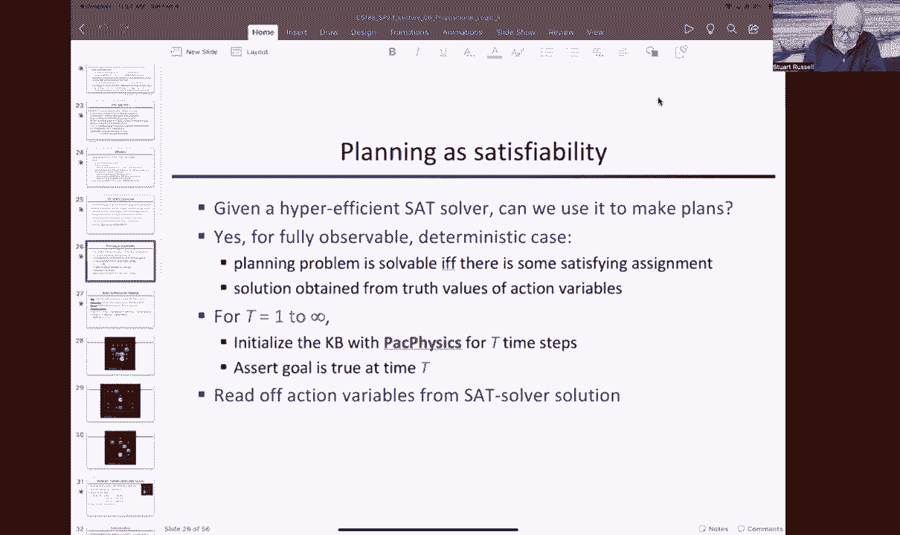
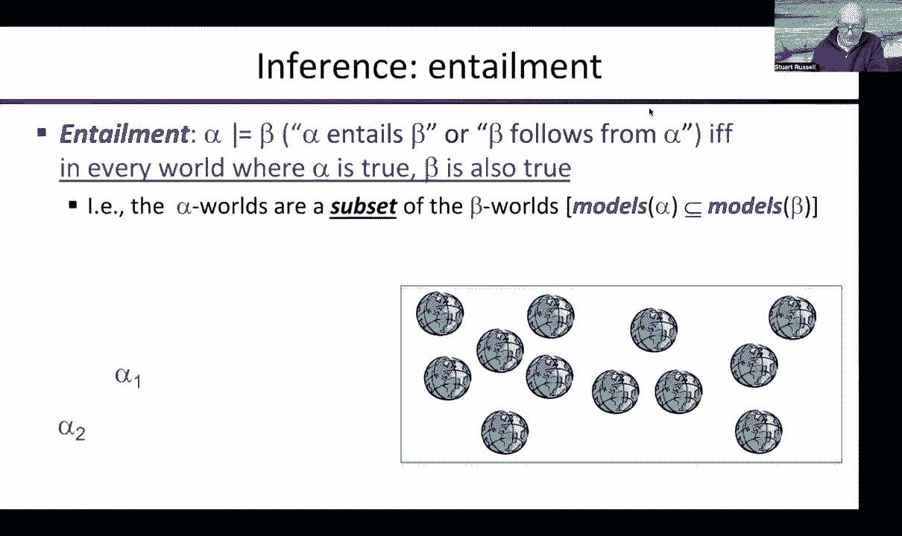
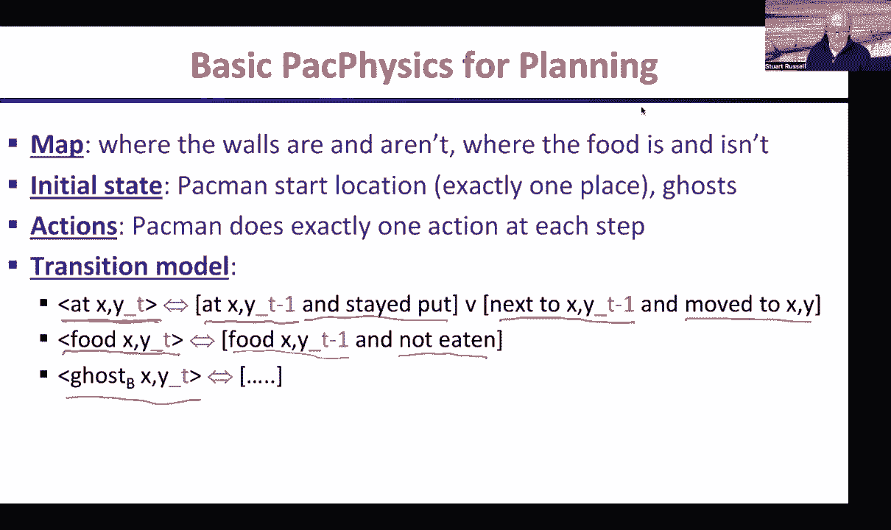
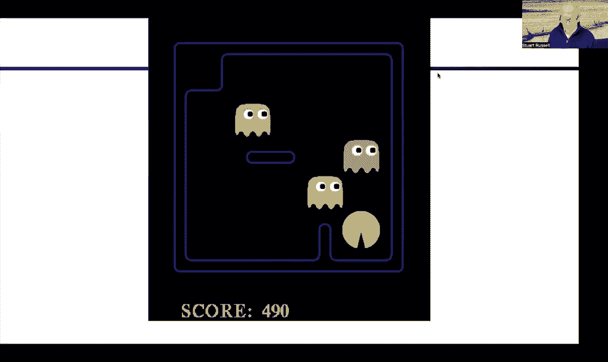
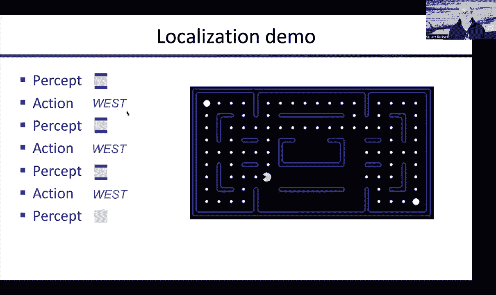
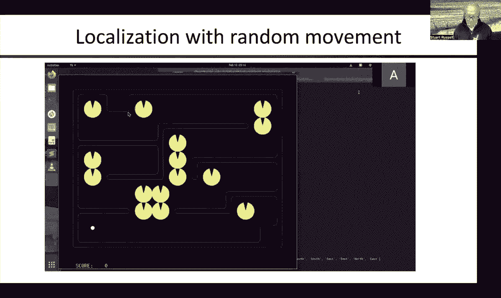
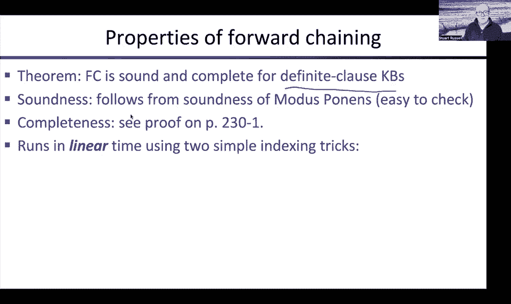

# CS188 伯克利最新AI课程--人工智能入门推荐 - P7：[CS188 SP23] Lecture 6 Supplement - 是阿布波多啊 - BV1cc411g7CM

好的，所以这有点呃，讲座的补充，部分原因是为了让我们回到正轨，与日历同步，因为我们有几节课偏离了轨道，还要确保你有这些，呃，材料，呃，这将有助于你进行项目二，好的，我们讨论过命题逻辑。

我们已经讨论过如何表示，呃，关于呃的知识，包装物理，在命题逻辑中，嗯，我们讨论了如何使用可满足性求解器进行推理，呃，现在我要经历，如何使用这些机器来实际制定计划的基本知识，呃和呃，跟踪你所处的位置。

构建地图和各种其他类型的推理任务，呃在群居的世界里，所以说。

我不是故意那样做的。

抱歉，打扰一下。

好的，所以让我们来谈谈一个节日，我们如何做计划，怎么样呃，PAC，人使用求解器提供的逻辑推理能力来构造计划，基本的想法是，呃，我们写下所有的物理包，然后我们问，有没有可能考虑到背包的物理特性。

有某种方法可以在给定的时间步数内实现目标，这真的是在问，你知道的，在这种情况下，我们会发现一个矛盾吗，还是有可能，在这种情况下，我们将能够看到令人满意的任务，嗯，这使得这整个句子集合是真的，嗯。

然后我们可以从中读出，呃，那个呃，通过查看操作变量的值来制定计划，所以更详细地说，嗯，我们不知道要花多少时间，解决这个问题，所以我们从，呃，说好吧，也许我们可以一步解决它，如果我们不能。

那么也许我们可以用两个时间步来解决它，如果我们不能，我们可以用三个时间步来解决它，以此类推，所以T从1到无穷大的循环，就是设定不同的视野，说，好的，让我们非常乐观，视野很短，看看我们能不能解决这个问题。

然后逐渐增加允许的时间步数，直到我们得到一个解决方案，这个解决方案实际上是最短的解决方案，嗯，因为它是T的第一个值，事实上有一个解决办法，所以给定t的值，然后你写下，或者你的程序生成所有必要的物理句子。

呃，第一次T步，嗯然后嗯，我们取得了进球，我们简单地断言目标在时间t是真的，如果那不可能，那么我们就会得到一个矛盾，如果可能的话，那么这整个句子的集合就可以满足了，我们会找到解决办法的。

然后我们简单地读出解决方案是什么，呃，从集合over返回的解决方案，通过查看满足这整件事的操作变量的值，使目标在时间t为真的对，给定初始状态，给定描述动作所做的物理过程。

我们规划所需的基本包物理由地图组成，那个，正如我们所知，哪里有墙，哪里没有墙，那么什么是空的，正方形，嗯，上面还写着哪些方块有食物，呃，哪些方块没有食物，因为目标实际上是吃掉所有的食物，嗯，上面写着。

呃，初始状态是什么，呃，就吃豆人的位置而言，一次又一次，我们必须通过说，嗯，那个吃豆人在这个特定的位置，而不是在任何其他地方，呃，鬼也一样，然后是动作，呃，帕潘人被允许在北方做四个行动中的一个，南。

每一步都是东西向的，然后我们写下过渡模型，所以在这个版本的问题中，鬼魂移动，但他们按照一种固定的政策行动，所以他们没有选择做哪个动作，呃，我们可以简单地描述，呃，通过幽灵的过渡模型。

所以转换模型记住定义了时间t时所有位置变量的真值，就呃而言，上一个时间步长的位置变量，所以吃豆人在时间t的x y，当且仅当吃豆人在时间t减去1时在相同的x y处，嗯，呆在原地的意思是，没有做一个动作。

呃搬走，呃在XY旁边的某个广场，在时间t减1，呃，做了一个行动搬到X Y，在之前的一张幻灯片中，我向你们展示了一个特定的正方形是什么样子的，嗯，食物的过渡模型实际上更简单，因为呃，食物从真的开始。

在某些地方是真的，然后变成假的，但它永远不会成为现实，在包装的世界里，没有办法给一个正方形添加食物，所以食物在时间t的x y，如果食物在，时间t减去一，没有被吃掉，好吧，这意味着，如果它被吃掉了。

然后呃，到时候不会是真的，呃，时间t，然后鬼魂的位置将取决于鬼魂之前在哪里，一步和任何你想让鬼魂做的政策，呃，你可以通过写适当的句子来实现这一点。

好的，这就是过渡模型，然后我们可以看到这个工作，呃，所以计算计划需要一点时间，只要几秒钟，呃，然后他就走了，有点难，计算计划需要稍微长一点的时间，就吃一个，也许多一秒钟，你看，这是一个相当复杂的计划。

因为它在吃所有的点的同时要避开鬼魂，呃，然后这可能是四个鬼最难避免的，这是一个非常精心的计划，有完美的时机来避免被那里所有的鬼魂吃掉，他走了，好的，所以对我来说，这就是一种计划，正如你所看到的。

只花了几秒钟，尽管事实上有几十个呃，时间步长，所以它可能比任何搜索算法都更有效。

所以现在我们来看看，稍微复杂一点的案子，我猜吃豆人在哪里啊不知道他在哪里，所以它一开始没有已知的位置，有局部感知，呃，墙是否存在，呃，在四个方向中的每一个，所以你的路是否向北被挡住了，东南和西部，嗯。

然后尝试一下，我们会试着利用部分信息，这种部分感知，为了弄清楚他在哪里，地图是什么等等，所以这是部分可以观察到的，吃豆人，所以吃豆人感觉到一堵墙，或者四个方向都没有墙，然后呃。

这些是由阻塞变量表示的感知，所以这个变量说我往西的路被挡住了，作为西边的一堵墙，呃，在时间零，呃，这个应该是，在零点以北有一堵墙，以此类推，和您的传感器模型，或者简称M。

um基本上定义了每个集合中的每个变量如何获得其真值，所以嗯，在零点时，它向西被封锁了，当且仅当，呃，吃豆人是，呃，在这个广场上，一，一，在时间零，在零点西边有一堵墙，或者吃豆人在一二，在02点有一堵墙。

或者吃豆人在1 3，在零点三处有一堵墙，以此类推，以此类推，好的，所以有一个这样的，所有这些都是分离的，因为这些都是不同的可能方式来产生对西方的封锁感，你必须在每个位置都有一个这样的分离。

那个吃豆人可能在，这就是传感器模型，每一步都必须重复，呃，和所有四个方向，然后有了这个信息，所以我已经给你的计划的基本知识基础，加上这个传感器模型，你可以回答问题，就像我在哪里，所以。

即使吃豆人可能一开始，呃，不知道他在哪里，呃，当他四处走动时，然后感觉到呃，不同位置的墙壁，他可以开始弄清楚，他假设他有一张地图，所以吃豆人回答的这个一般性问题，呃叫做状态估计。

所以状态估计意味着跟踪什么必须是真的，目前关于世界，给出你所做的所有观察的历史，以及你所采取的所有行动，如果你想对了，这是一个非常普遍的问题，所有的智能系统，呃原则上必须解决，嗯，你知道我们解决它，呃。

你对你现在的状态很了解，呃，你知道，你知道你的笔记本电脑在哪里，嗯，你知道你住在哪里，如果你有车，希望你知道你的车在哪里，呃，你知道你的钥匙在哪里，呃，等等，等等，还有一堆你不知道的东西，所以嗯。

你知道你小学的朋友，嗯，他住在这个国家的另一边，嗯，你不知道他们到底在哪里，他们是，你可能会想，他们是，你知道，他们可能在马萨诸塞州的某个地方，嗯，但到底在哪里，你知道，也许他们在度假，你不会知道的。

世界上总有很多你不知道的东西，嗯，但你可以猜到，稍后我们将看到如何进行概率状态估计，在那里你真的可以合理地猜测，你小学朋友的位置，好的，但在逻辑上，呃，或者你能证明，一件给定的事情在目前是正确的。

或者你不知道它是真的还是假的，这是唯一的两种可能性，嗯，我猜第三个是，你可以证明那不是真的，嗯好吧，所以要做状态估计，呃再次，我们不必有新的算法，对呀，我们有一个推理算法，所以我们就用它。

代理人可以问自己，呃，什么是，现在的世界状况，失陪一下，我把狗放出来，好的，狗出去了，嗯，所以说，比如说，如果探员想知道我在哪里，它可以问自己，你知道，是时候了，第六步，现在，我现在是2点2分吗？嗯。

我可以简单地问，我的知识库，所有打包的物理材料和传感器模型，加上我所采取的所有行动，加上我收到的所有感知，可以把所有的人聚集在一起，我知道那是真的，然后问，这是否意味着在任何特定的地点。

所以我们可以问自己所有可能的位置，该位置是否意味着，嗯和嗯，它也可能会问，呃，你知道的，我们能证明我不是，嗯，所以你可以问自己这两个问题，然后要么你会发现你到底在哪里。

或者至少你会发现某些方块是不可能的，呃，这意味着剩下的方块仍然是可能的，我来举例说明，呃，一秒钟，所以这很简单，所以这是进行状态估计的一种方法，嗯它，这可能不是最有效的方法，呃。

这就是我们所说的惰性状态估计，因为它不费心做任何推断，直到它需要回答这个问题，然后它回去回顾它的整个生活史，所有知觉所接受的所有动作，然后试着回答这些问题，嗯，总的来说，我们做得不对。

我们实际上在前进的过程中不断更新东西，呃，所以我们真的只是指回到，可能是之前的时间步骤，以便推断关于，呃，关于现在，所以一个更有效的方法，呃，您可以将此称为热切状态估计，就是不断地。

在每一步都尽可能多地计算现在的情况，嗯，然后在下一个时间步骤，你可以利用你在上一个时间步中所学到的，呃，使您的推断更加有效，每次行动后都是这样，所以这个动作是在时间t减去1的时候发生的。

然后你在时间T收到一个新的知觉，你问自己每个状态变量，呃x分T，这样就会，呃，在吃豆人试图找出他在哪里的情况下，那将是，呃，这些位置变量，AT变量，但这对任何状态变量都有效，那么对于每个州。

每个状态变量，你只要问问自己，好的，知识库，嗯，这将包括你以前推断的所有东西，最近的行动和新的观念是否意味着，是真的，如果是这样，那么您将其添加到知识库中，现在因为你已经把它添加到知识库中了。

这将使未来的推断更加有效，因为你，你有点，你知道吗，建造了垫脚石，呃，并将其放入知识库，同样，你也试图证明不是，呃x分T，如果你能证明这一点，那么你就在知识库中添加不x subt，所以这样。

你总是尽可能多地推断，至少在，呃，单个变量的值，为了使将来的推断更加有效，嗯，所以实际上有一个相当发达和相当复杂的状态估计理论，逻辑系统和概率系统，当我们谈论概率时，我们会看到更多，建模与推理。

这就是我们如何应用本地化的基本思想，所以知识库最初是包物理，加上传感器模型，呃，不管我们要运行多久，假设为首都T时间步长，每次行动之后，知觉，我们要，呃，询问每个位置变量，哪个才是我们关心的。

我们能证明位置变量为真吗，如果是这样，我们将其添加到知识库中，我们能证明它是假的吗，如果是这样，我们将其添加到知识库中，这就给了你最好的猜测，呃，你现在是什么状态？从最好的猜测，呃。

吃豆人必须选择一个行动，嗯，在任何给定的时间点，对呀，呃你，你可能已经证明了有些地方是不可能的，嗯，可能还有不止一种剩余的可能性，所以呃，或者第三种情况是，呃，你实际上能够证明只有一个位置变量是真的。

你永远无法证明两个位置变量都为真，因为那就意味着吃豆人，事实上，同时在这两个地点，物理学不允许，所以在任何给定的时间，所有可能的位置都是你不能证明是假的，如果只剩下一个可能的位置，呃。

那么你应该能够证明那个位置是真的，呃，所以让我们举例说明，嗯，这是我们的标准包，呃，包装世界和，呃，我把一个吃豆人放在可能的位置上，呃，在每个方块中，所以最初吃豆人不知道自己在哪里。

所以每个方块都是可能的，呃，然后我们将看到当我们开始添加感知和行动时会发生什么，呃，我们会在前进的过程中筛选出可能的位置好的，所以让我们从一个简单的开始，所以第一个感觉，呃，基本上说北面有一堵墙。

向西和向南，所以周围有三面墙，这种配置中的PAC人，呃，所以如果我们仔细看地图，我们意识到事实上这只与一个位置一致，所以有了这个单一的感知，一个吃豆人知道他到底在哪里，他能够立即证明，呃。

这个位置变量实际上是真的，其他的都是假的，好的，所以这太容易了，让我们回到过去，让它变得更困难一点，假设我们看到北面和西面有一堵墙，好的，那么吃豆人在哪里呢，呃，如果这是一种感觉，所以我们很小心。

你很清楚，推理算法，跑来跑去问每个方块的问题，我有没有可能察觉到这一点，呃，在这个广场上，我们发现只有四个地方你可以看到两堵墙，在那些方向上，所以在这一点上，除了这四个之外，所有的都被证明是假的，嗯。

但我们没有，呃，对于这四个，我们没有一个被证明是真的，因为它们都是可能的，但没有一个是确定的，好的，所以现在，嗯，吃豆人将不得不采取行动，假设吃豆人南下，所以吃豆人走后，我们对地点了解多少，嗯。

我们只知道他可能在这四个地方之一，然后他去了南方，所以这意味着他现在在这四个地方之一，推理机会再次正确地回答这个问题，但这四个位置是可能的，呃，所有其他位置都是不可能的，呃，然后我们得到另一个知觉。

所以让我们假设这个人，西边有一堵墙，东边有一堵墙，所以如果你看看这四个地方，你看，这实际上是，呃，所有四个地点的案件，所以当我们在推理机运行时，它实际上并不，呃，改变信仰，这四个地点仍然是可能的，然后。

嗯，其他所有的位置都是不可能的，所以什么都没变，那么，呃，吃豆人又南下了，有什么新鲜事吗？呃，关于吃豆人在哪里好的信念，这四个地方都可以向南移动，所以他是对的，所以再一次，有四个可能的地点。

移动自己后可能在哪里，然后一个新的预置又进来了，东边有一堵墙，西边有一堵墙，如果我们看看这四个地方，我们看到，事实上，只有一种可能性是真的，所以现在吃豆人在三次感知和两次行动后，吃豆人很清楚自己在哪里。

好的，嗯，所以现在让我们做一个真正困难的，一个，好的，呃，所以现在让我们做一个很难的，第一条戒律只是北面的一堵墙南面的一堵墙，所以推理机运行并发现实际上，关于吃豆人可能在哪里有很多可能性，嗯所有这些。

然后吃豆人去了西方，所以每一个可能的吃豆人地点，呃然后移动，因为推理引擎计算出这些现在是可能的位置，如果他察觉到北方和南方的狼，然后向西移动，这些是他可能去的地方，呃，然后我们在南北得到另一个感知墙。

嗯，这实际上并不排除很多，所有这些都是可能的，但不是吃豆人撞到墙上的那些，因为那样他在西边也会有一堵墙，所以那些，嗯，那些被排除在这个概念之外，嗯，然后他又向西移动，他们都搬到西方去了。

然后他又得到了一个南北的感知墙，吃豆人撞到墙上的那些，呃消失，因为他们没有南北墙，呃，他们在西边也有一堵墙，呃，所以他们走开了，这些是剩下的可能位置，然后吃豆人又往西走了，这些是吃豆人可能在的新地点。

然后他的感知四个方向都没有墙，如果你看看这些，只有一个地方可能是，就是那个，所以现在呃，四觉三行，吃豆人已经找到了他的确切位置，嗯，所以这实际上是一个有趣的属性，呃。

你知道这在一定程度上是这张地图的作用，因为它有很多不同形状和配置的屏障，这意味着在公平之后，经过合理数量的行动和感知，吃豆人很可能已经知道他的确切位置了。

所以我们实际上做了一个小实验，是一张略有不同的地图，但是让吃豆人随意移动，所以他们从这些最初可能的位置开始，只是让吃豆人随机移动，当他四处走动并获得知觉时，我们会看到可能的位置的数量，呃，只是在减少。

事实上它永远不会增加，因为，呃，因为运动模型是确定性的，它永远不能增加可能位置的数量，每个感知要么保持可能位置的数量相同，或者排除其中一些，呃，所以可能的位置的数量，单调减少或不增加，呃，然后嗯。

最终你会到达一个可能的位置，好的，所以这是一个例子，这叫做本地化，嗯和嗯，它的东西，呃，真正的机器人必须一直做。

好的，他们可能要做的另一件事是绘制一张地图，所以那是，呃，本地化是你有地图的地方，但你不知道你在哪里映射是呃，你必须建立那张地图，从某种意义上说我们可以说吃豆人知道他在哪里，将他的初始位置定义为零，对。

这完全是武断的，所以你知道我们称之为初始位置，但我们就叫它零零，呃，然后我们将围绕它建立一张地图，在这个，呃，在这个版本的Paphysics中，他在哪里得到了这个，这些被阻断的知觉。

这些条件反射告诉他哪些行动是可行的，哪些会，呃会失败，所以无论他做什么动作，你总是可以预测，基于他的块知觉，他的新相对位置会是什么，如果他往北走，它被挡住了，他知道他会呆在原地，如果他往北走。

而它没有被封锁，然后他知道他会把他的y坐标增加一个，嗯，所以这意味着他总是知道自己相对于最初位置的位置，所以我们称这种推理方法为死推算，呃，所以航位推算是人们使用的东西，你知道的。

当他们拿着指南针到处走的时候，嗯，它们可以计算出它们相对于初始位置的位置，他们走了多远，他们往哪个方向去了，很抱歉背景中的小吠叫，所以吃豆人是，因此，呃能够知道他在哪里。

所以从知道他的位置和他看到的感知的结合来看，你可以建立一张相对于他每个位置的墙位置的地图，嗯，那么我们该怎么做呢，这是完全相同的基本思想，所以我们用包物理初始化KB，呃，我应该说，加上传感器模型。

所以基本的包装物理不包括传感器模型，如果我们加上传感器模型，那他就有了完整的知识库，呃，另外，我们将初始位置固定为零，然后我们就跑T个时间步数，您可以使用操作更新知识库，呃。

你所接受的和你所得到的新的看法，然后你简单地对墙变量进行推理，如果你能证明，呃，在x y处有一堵墙，因为你知道你在哪里，你知道你在你周围看到过狼，您可以将其添加到知识库中，如果你能证明没有墙。

所以如果有一个，如果它没有被挡住在一个特定的方向上，那里没有墙，那你就可以证明，呃，没有战争，呃，并将其添加到知识库中，根据你目前的推断，你可以选择一些动作去一个不被阻止的方向，呃，然后你继续这个过程。

所以这个会，呃，比如说，如果你选择一个随机可行的动作，呃，那么你最终将能够探索整个可到达的地图，你就建立了一张完整的世界地图，好吧，再来一次，所以这里没有算法，对呀，你只是随意移动，嗯，你在做推断。

以便建立地图，所以当你完成墙变量，嗯会告诉你地图是什么，然后你可以使用这些墙变量来进行有效的导航，或者四处追鬼，或者你想要的任何东西，好的，这就是定位和映射，我给你们演示一下地图是如何工作的。

所以这是零点零点的吃豆人，但什么都不知道，我只是在零点，我只知道这些，然后呃，然后我们就会感觉到西边和南边有城墙，嗯，所以吃豆人进行了推断，并推断，嗯，你瞧，西面一定有墙，减去一个零，以及南面的位置。

也就是零减一，那么吃豆人选择了一个可行的行动，让我们说，吃豆人北上，所以现在吃豆人知道他，呃，一个正方形，还没有看到一个知觉，凯撒，感知说西边和北边都有墙，所以现在推断出这些墙一定在那些实际的位置。

呃再次向东移动，所以现在他穿着皮草，北面和东面的城墙，所以他们就在那里，现在他向南移动，所以他知道他在那里，他推断出东边和南边的墙，所以把这些填进去，现在他已经建立了他的完整地图，在这种情况下。

非常小的世界对吧，他不知道这些地方的墙，嗯，因为他实际上并没有意识到，呃没能到达那些附近的广场，事实上，他永远无法推断，那些地方是否有墙，好的，呃，这就是映射，然后机器人最不需要做的就是，呃。

同时定位和映射，嗯，为什么它必须这样做，因为在许多现实世界的情况下，呃，推算航位是行不通的，所以嗯，对于一个真正的机器人来说，比如说，虽然它能数出轮子转动的次数，这并不能告诉它到底移动了多远。

因为通常如果它试图去，呃，它试图走直线，像这样，它通常会逐渐漂移到一边，因为轮子的大小略有不同，或者其中一个轮子有点打滑，嗯，所以死亡计算非常快，呃，它是，呃，它在真正的机器人上失败了，呃。

尤其是如果有，你知道的，地毯、混凝土瓷砖、里诺和其他种类的地板，所有这些对轮子和机器人的运动都有不同的影响，所以在我们的背包世界里，呃，我们本可以，呃，不允许吃豆人做航位计算的传感器，比如说。

假设传感器只是告诉吃豆人相邻墙的数量，所以不是他们在北方的地方，南方等等，但到底有多少是对的，所以好的回报感，呃，基本上零一，两三面墙，所以我们可以用两个感觉位在命题逻辑中实现这一点。

它只是编码相邻墙的数量，呃，所以在这种情况下，嗯，让我们说，吃豆人察觉到有两堵相邻的墙，但它不知道他们在哪个方向，如果吃豆人北上，吃豆人不知道北迁行动是否成功，或者它只是撞到了墙上。

所以它不知道它是否还在零，零或现在在零一，所以立刻，呃，吃豆人迷路了，所以如果事实人迷失了，如果那个人在任何给定的时间都不知道自己的位置，台阶嗯，他将如何绘制地图。

因为我们所做的地图基本上是推断墙壁的实际位置，根据吃豆人的位置和邻近墙壁的存在，在知觉中，所以这是一个鸡和蛋的问题，对呀，他不会绘制地图，因为他不知道自己在哪里，他不知道自己在哪里，因为他没有地图。

嗯和嗯，你知道，令人惊讶的是，你解决了这个鸡和蛋的问题，嗯，只是通过推理，对呀，所以我们就，抱最好的希望，对呀，所以我们做完全一样的交易，呃，我们填满嗯，基于包物理的知识，加上传感器模型。

可能是相邻墙的数量，传感器模型，嗯，我们总是可以再次将初始位置设置为零，根据定义，他就在那里，嗯，然后我们像往常一样运行吃豆人代理T时间步长，我们用动作和感知事实更新知识库，现在我们试图推断，嗯。

墙和位置变量，所以对于呃，对于每x y，我们试图弄清楚，你知道的，我们能证明在x y处有一堵墙吗，或者我们能证明在x y没有墙吗，呃，我们能证明我们在时间t的位置吗。

或者我们能证明我们当时不在某个特定的位置吗，然后嗯，就是这样，如果我们不能证明这些事情，那么这意味着物理学，呃，你知道的，传感器模型根本不允许吃豆人推断足够的，要么构建一张地图，或者推断出他的位置。

但事实证明，嗯，只是随意地移动，它通常会给足够的，呃，感知信息，嗯，基于，呃，有多少狼，呃，吃豆人在每个点观察，例如，如果相邻墙的数量发生变化，如果前一步有两面墙，现在有三堵墙或一堵墙对吧。

那说明吃豆人的位置一定改变了，因为如果它没有改变，然后呢，吃豆人看到的墙和他之前看到的一样多，所以每次感知到的墙的数量发生变化，吃豆人知道他的举动，不管是北方，南，东或西，成功了，因此可以推断。

假设他搬到了北方，墙的数量发生了变化，这意味着北向没有墙，阿曼可以通过南下回到那个广场并且知道这将会成功，因为他知道这两个广场之间没有墙，嗯其实让我画一幅画吧，所以这里是吃豆人，对呀，如果他往北走。

墙的数量改变了，然后他就在这里，然后他就可以再回到南方去了，现在他回来了，对呀，呃，现在我们又可以往南走了，如果墙的数量发生变化，现在有两堵墙，他知道墙一定在那里，他可以开始建造它们，所以大家可以看到。

嗯，从这个非常部分的信息中收集信息，做所有必要的交叉推断，从他收集的所有部分信息中，呃那么，呃，除了在病态的世界里，他实际上能够，呃，最终两者都构建了一张地图并计算出他相对于地图的确切位置。

所以这真的很酷，我没有我没有做它的演示，但我想你可以用项目代码试试这个，好的，所以在这个小讲座中，我想讲的最后一件事是，定理证明算法，只是为了你的，呃，你的博学你应该知道，做逻辑推理的这些方法。

所以我们记得我们说过有两种基本的推理，有模型检查，和，呃，我们查看DPLL的算法，呃，对可能模型的二元二叉树的基本深度首次探索，uh是一个模型检查算法，对满意度非常非常有效，检查。

另一族算法是定理证明算法，它使用推理规则来获取知识库中现有的句子，并在知识库中推断新句子，也是最著名的，呃，正如我之前向你们展示的，是肯定前件规则，所以肯定前件采用了这种形式的蕴涵句。

符号的结合意味着另一个符号，如果左边的每个符号都是已知的，然后你可以推断出含义右手边的符号，对呀，所以很直截了当，所以如果我有暗示，我知道所有的前提，然后我可以加上那个暗示的结论，然后呃。

前向链接推理算法只是尽可能多地应用该规则，所以每当规则的左手边满足时，把它涂上，把右手边，现在也许一些新的规则会被满足，它可以应用那些，所以这就是为什么它被称为链子，因为通过添加结论，然后触发新的规则。

其中增加了结论，触发了新的规则，其中有结论，然后呃，最终你做了所有的推断，你可以，呃，任何不能满足的剩余规则，嗯，他们不能满足，你无法推断他们的结论，所以它停止了一个非常简单的，呃，算法和嗯。

关于这个算法有几件事需要注意，所以首先它只起作用，呃，用这种含蓄的句子，对呀，在那里，符号的结合暗示了，呃，一个符号，呃，这些叫做定子句，所以作为定冠词，它们被写成符号的连词，暗示了一个符号，实际上有。

作为特例，一个普通的符号本身，因为一个普通符号x等价于蕴涵句，true意味着x，true基本上是一个空的连词，呃，那为什么，因为呃，空连词，所以任何连词都是真的，如果它的所有连接词都是真的，呃。

空连词没有任何连词，如此琐碎，它们都是真的，呃，所以一个空的连词，呃等于真，所以这意味着，符号x等价于，呃，呃，左手边为空的定冠词，好的，所以呃，确定子句并不是指不包括所有可能的子句，可能会有条款，嗯。

你有一种暗示，右手边不是一个符号，但它实际上是符号的分离，我们稍后会看到如何处理这个问题，嗯，但这确实意味着前向链接不适用于一般命题逻辑，但仅限于可以编写的知识库，呃，因为这些明确的条款。

它是所有可能的知识库的子集，但是如果，你可以把你的知识库写成明确的子句，啊，那么事情就会非常好，非常有效，所以让我们来说明一下这里有一个知识库，它只包含定冠词，我们想弄清楚，如果q为真，这些是，嗯。

这些是我们掌握的事实，我们有这五个，呃，顶部的蕴涵句，然后我们有一个符号，它的真值，我们知道哪个是好的，那么它是如何工作的呢，呃，我们从符号开始，我们知道一个，我们看看现在满足了哪些条款，对呀，所以呃。

这个满意，这个满意，我们现在可以加b和c，所以我们推断出了新的符号B和C，所以现在我们可以去看看新条款是否满意，而且确实嗯，如果我们同时有B和C，那么呃，那么这里的这个子句bnc暗示d是满足的。

所以我们可以推断d，d和e意味着q不满足，但我们有A和D，所以这只就满足了，现在我们加q，呃，Q是我们想问的问题，所以现在我们推断Q确实是真的，所以你可以看到它非常，非常，非常简单的算法，嗯，事实证明。

诀窍是让它变得高效，我们需要两样东西，一个是当我们添加这些符号时，我们想知道哪些条款，变成现实，所以我们需要知道每个符号出现在哪个子句中，所以我们会，呃会有一个与B相关的索引，说这是b出现的从句。

我们将有一个与D相关的索引，说这两个从句以d为前提，因此，该索引允许您立即检查规则，这些规则的真实性可能，呃谁谁谁的满足感可能改变了，呃，因为你加了，另一件有帮助的事情是跟踪，规则的前提有多少已经满足。

所以一旦知道A是真的，嗯那么嗯，本条款立即得到满足，因为它没有任何其他前提，下面这个，a和d其一个房地得到满足，但还有一个要去，嗯，所以你要跟踪有多少前提，最初，这将有两个前提，一旦知道A是真的。

然后还有一个，然后一旦D为真，那就没有剩下的需要满足了，一旦没有剩余的满足，那表示我们已经满足了规则，我们可以立即添加Q，所以这两个简单的技巧为每个符号索引它出现在哪个规则中，然后对于每个规则。

还有多少未满足的前提，有了这两样东西，我们实际上可以得到，一个非常有效的算法，因此，它的基本性质是对于确定子句的知识库，因为链子既是声音，因为这只是应用方法，波嫩斯，结果也是完整的，呃。

所以健康是很容易的，呃，如果你对完整性感兴趣，证明，呃，这也相当容易，嗯，你可以在书的第230页看到，所以我推荐呃，看看那个，使用我提到的索引技巧。

