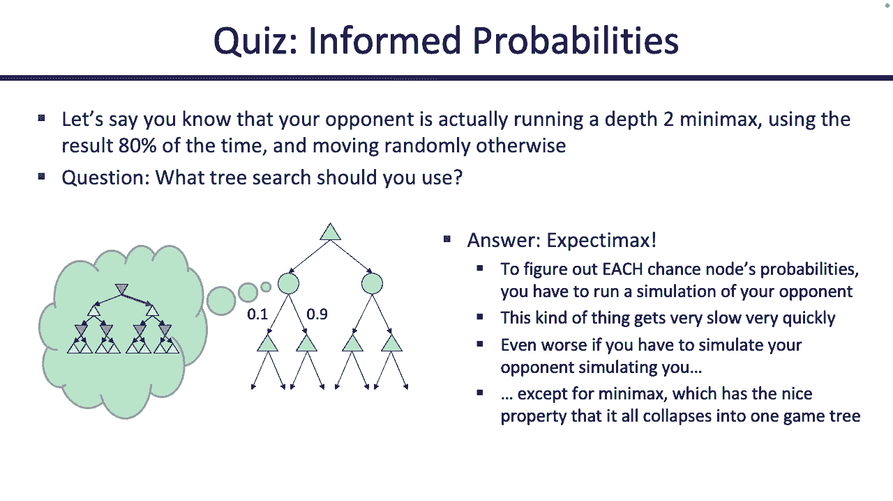

# P11：[CS188 SP23] Lecture 10 - Games_ Expectimax, Monte Carlo Tree Search - 是阿布波多啊 - BV1cc411g7CM

是啊，是啊，在我们开始之前，我会尽快通知你们，这其中的大部分应该很熟悉，所以第三项目几天前就出来了，后天星期二做，所以尽量早点开始，如果可以的话，嗯，有家庭作业，我们发布得有点晚。

所以我们会给你到星期一的时间，我们意识到这是一个假期，所以我们会给你到星期二的时间，嗯，在同一个星期里有两个家庭作业是真的，但是这个比较短，所以希望没事，你可以告诉我们，下周一放假，所以不要来上课。

好的，非常好，切换回，我会把上次讲的内容简短地讲完，然后我们将进入今天的新内容，虽然都是关于游戏的，所以在我们被粗鲁地打断之前，我们上次谈论的最后一件事是，是阿尔法贝塔搜索，和。

我想这可能是你将要遇到的最棘手的事情，在这个单元，所以想，不妨再给你看几个例子，所以你掌握了诀窍，所以这里有一棵树，嗯，记住，当你看到这些东西时，你得问自己，就像，它们是什么意思，任何人都能想出数字。

但有趣的是试图弄清楚这些数字意味着什么，它们代表什么，所以在这种情况下，这棵树代表了我们最大化代理三角形向上指向三角形，试图想象我们应该采取什么行动，如果我们想玩一个最小化代理的游戏。

那是红色向下的三角形，所以所有这些都是我们在想象中向前发展，每个箭头代表什么，箭头表示，我们可以采取的行动，a和d表示我们可以采取的最大化代理的动作，然后b c。

e f表示另一个人可以采取的最小化剂的动作，我们无法控制那些，我们说，α-β剪枝，我们实际上不必探索整棵树，因为那将是指数时间，而且很糟糕，所以也许我们可以做得更好一点。

这棵树有什么地方是我们不必探索的吗，所以我已经等了十分钟了，如果你在这里，所以嗯，希望有时间考虑一下，但如果不是为了时间，我要开始了，看看，如果你能跟随并预测我接下来要说什么，好的，所以这支笔能用。

不是很好，好的，嗯很好，所以你知道在alpha-beta修剪或一般的极小最大值中，你看不到整棵树，所以我们很幸运，整棵树都在滑梯上，但是当你用代码写这个的时候，你在看每个节点，一次一个。

你在深度上扩展它们，先从左到右搜索，所以你不能真正看到所有这些节点，但是现在在幻灯片上你可以看到他们，当我与科技搏斗时，好的，管他呢好吧，所以我们开始了，我们去最左边的树枝，左大部分树枝。

我们看到一个10，记住如果你用代码写这个，你看不到其他号码，所以你不知道下面藏着什么，任何其他数字，但你能看到的只是一个十，一旦你看到十个，你现在可以开始思考，好的，嗯，知道这个值是十。

这告诉了我这些最小化器的什么，最大化值，如果我看到这十个，我知道这个最大值，对不起，这里的这个最小值，它必须小于或等于十，想想极小值是如何计算最小值的，它们从正无穷大开始。

然后他们就会降低他们的估计越来越低，直到找到杜鲁门，然后它就停了，所以我们知道这不到十个，但到目前为止，我们只知道这些，所以我们必须继续前进，我们还没有真正想出任何我们可以使用的东西。

所以我们看下一个节点，看到八个就在这一点上我们完成了，我们已经看到了所有的节点，所以我们可以说这个节点的值正好是8，但我们到达那里的方法不仅仅是看十个，和八个一起，看到八个，一个接一个。

直到我们看到八个，这很重要，因为如果你用代码来做这件事，不会是这样的小玩具树，它可能是有几十万个节点的树，你实际上必须检查它们，一个一个来看看最小是对的，所以在这种情况下，我们通过计算得出这是八个。

但我们不仅知道这是八个，我们还得到了一个很有趣的保证，看看这里的最大化节点，这个最大化节点从负无穷大开始，它在向上工作，当它看到越来越好的事情时，它可以这样做，这个最大化节点c是8，它知道，嗯。

我还不知道真正的价值是什么，但我知道我至少可以得到八个，我知道我至少可以得到八个，因为它备份了，就像我能得到八个的证据是因为我可以采取行动，然后我假设我的对手会采取行动，这将给我八个。

所以这个数字8不是不知从哪里冒出来的，它是由一系列行动支持的，在这种情况下是A和C，到目前为止，八大在哪里，八大在哪里，还没有修剪，但我们要通过，我们在考虑保证，所以现在我们可以去下一个分店了，好的。

所以我们再看一下这个最小化音符，我们一次看一个，我们看到四个，好的，一旦我们看到四个，我们知道这个最小值是从一个非常高的值开始的，最小值的最坏可能值，它是正无穷大，它在下降，下降，下降。

因为它看到了更好的估计，看到四个，就像没事一样，嗯，我还不知道这里的真正价值是什么，但我知道，因为这是最小化节点，必须少于四个，不会比四个更糟，如果下一个节点大于4，我们还不知道它是什么。

就像一个惊喜的谜，不管是什么，即使它比最小化器更糟糕，也会在之前对吧，可能这个节点低于4，在这种情况下，您的值的最小值将发生变化，但不会比大于四更糟，但我们还不知道价值是多少，在这一点上，你可以停下来。

你可以说好，看一下这个最小化节点，这个最小化节点已经表示它是四个或更少，并查看最大化节点，最大化节点已经说得很好了，我在努力最大化，我已经有了一条路，AC后浴缸告诉我至少可以得到八个。

所以上面写的是可以的，我还不知道这里有什么，因为我还没有看过这个节点下面，但不管有什么，我已经知道D已经出局了，不可能是我想在这里做的，如果我想去最好的，我可能会做一个最大化是四个。

也许我总是比四个更糟，小于四，但四个是最好的，我可以通过去D来做最大化，如果我知道四个是最好的，我能做的，我还不如去一个无论如何，认领八个，所以在这一点上，你实际上可以剪掉后面的值，那不重要。

因为你已经知道d是一个可能的动作，所以这个最小化节点，小于或等于4的那个，你永远不会知道真正的价值是什么，不过没关系，因为那不是行动，你要拿的，好的，所以这就是我们如何发现我们证明了。

我想我们上次也提到过这个，另一种让自己相信节点可以谨慎的方法，如果我们在考试什么的时候把这个扔给你，另一种让自己相信这个节点可以被修剪的方法，你还不知道下面有什么价值，所以你可以开始编造一些值。

这将是真的，如果这个值可以承受任何东西，也不会改变答案，你能修剪它是个好兆头，所以让我们希望这支铅笔现在能用，铅笔还是不行，这让我很伤心，总有一天我会想出来的，好，我们看这个节点f，我们就像。

我还不知道那里有什么，但我能想象那里有什么，如果它是一个非常非常非常负的值呢，所以就像消极的，一件大事，可能是非常大的东西，像这样又大又负，好吧，我可以看看这个，我可以说很好。

这将使这个最小值也非常大和负，好的，但这不会改变我的答案，我还是要用一个，因为最大化器不会选择这个大的负值，所以如果这是一个巨大的负值，不会改变我们的答案，我们还是会用一个，真正的最大值仍然是8。

如果这是一个非常好的价值，现在你就像，哦好吧，如果最大值换成一千呢，嗯，不会发生的，因为这个最小化节点已经有了一个4，所以它不会去一千，这个最小化噪声正在寻找尽可能低的值，它会看到四个。

它会忽略这一千个，所以这个最小值最终会是4，最大值最终仍然是8，所以因为你可以看到，不管我把什么值，不管我说得多消极或多积极，根的最终价值，无论哪种方式，最大化节点都是8，我最终的动作顺序是A和C。

其实并不重要，f处的值是多少，还有另一种方法可以让我相信f是可能的，所以说，我就是这么想的，那个，我可以证明，我可以用界限来向自己展示这小于，或等于四，所以它永远不会被最大化者选择，至少可以得到八个。

或者我可以说服自己F可以在两者之间有任何价值，比如负的巨大数字和正的巨大数字，这不会有什么不同，这是另一种让我相信f是残酷的方法，思想，你可以在某个时候自己做一个问题，我想我的铅笔又能用了。

所以现在你已经准备好迎接大的了，所以希望它能出现，我会把这些都处理掉，给你看那个大的，好的，哦，吓人，很多节点，好的，所以现在我们又有了另一个极大极小树，但现在有了更多的层次，对呀，最大化器采取行动。

最小化器采取行动，最大化器采取另一个动作，然后游戏就结束了，你得到一些分数，你仍然可以在这个上做alpha-beta修剪，有点复杂，但这个想法有点坚持，所以我会教你怎么做。

如果你在看回放或其他暂停的东西，花点时间看看，或者试着预测我要做什么，但让我们一个一个来，所以我们从左到右检查，深度优先搜索，所以我们一直往下走，我们看到的第一个终端节点是十个，好的，这说明了什么。

一旦你看到数字开始思考界限，所以我看到了十个，我很好，它告诉我这个最大值节点可以是十，也可以大于十，也许我以后会看到一千个，那就太好了，但我知道至少有十个，仅此而已，我现在可以说，所以我可以继续前进。

我看到六个，我不打算选六个，因为十个更好，我看完了这个节点的所有子节点，所以我可以自信地说，也许我会用等号来表示我知道一个事实，这是十个，我很好，至少在这里，我很好，很好，通过计算这是十个。

也许我会把它弄得干净一点，好吧，通过计算这是十个，这也给了我另一个保证，它告诉我这必须小于或等于10，对呀，这是一个最小化的音符，所以它从无穷远开始，随着它看到越来越低的值，它就会向下移动。

它在十点看到，所以它的价值可能是十可能低于十，但不会超过十个，因为这个最小值，看到十五、二十或一百，不管怎样，它都会和10一起去，好的，伟大，让我们继续前进，所以我们往下看E分支，好的。

我们对这个最大化器一无所知，所以我们什么都说不出来，现在，我们看到一百个，一旦你看到一百个，你可以开始写保证，你知道什么，你知道这大于或等于一百，在路上可能是一千，可能是负千，但我们知道至少有一百个。

好的，在这一点上，你可以开始看边界，同样，你可以使用不同的推理路线，你可以看着界限说好，这将是不到10，这将大于或等于100，所以我们已经到了这个有FNG的最大化节点，这大于或等于一百。

最小值总是和b在一起，它永远不会选择E作为一个动作，所以E作为一个可能的动作有点过时了，这是一个好兆头，你不必真正检查G，这样我们就可以修剪掉，我们不知道它下面隐藏着什么价值，它不一定是终端值。

它可能是一个巨大的指数子树，我们完全可以跳过它，因为我们不在乎价值，我们已经知道这个最大化节点至少可以得到，我们知道最小值节点可以得到10或更低，所以最小化节点不会选择这个最大化节点，好的。

所以g不起作用，一次又一次，你可以说服自己这一点，通过试图插入不同的假设，就像你一生中从未见过这种价值一样，你不知道是8还是别的什么，你可以向自己证明这个价值一开始并不重要，通过在那里放一个负一千。

把一千放在那里，你会看到，无论你把什么放在那里，它不会改变极小化器选择b而不是e的事实，这是你做得对的另一个好兆头，好的很好，所以我们已经完成了左半部分，当你走的时候，你必须始终确保你意识到不同的界限。

这些界限是你在伪代码中看到的alpha和beta值，但我喜欢把它们写成界限，因为它比可怕的希腊字母更容易思考，所以一路回到顶端，我们对这个最大化器了解多少，这个最大化器，我想在我们看最大化之前。

我们知道这个最小值小于或等于10，好的，我们已经看过了，我们知道下面的这个最大化节点，我会被选中，所以我们已经完成了这个左边的分支，现在我们准备说我们可以找到一块橡皮擦。

现在我们可以说这个最小化节点的值为，对，因为我们已经完成了这个F，我们已经知道这永远不会被选中，我们知道这个最小值，如果我们从这里开始，不管出于什么原因，你可能采取的最好的行动顺序是通过B和C，到十个。

E中的任何东西都不会被选中，所以这个值正好是十，然后我们可以把它传播回来，我们知道这最大化了，它必须做得比十个更好，因为它有一个十可用，不管藏在下面的是什么，H可能比十个更糟，可能比十个好，我不知道。

但至少要十分钟，好的，所以现在我们可以继续，第一次搜索是从左到右扫描，所以我们在这里检查，我们沿着这个树枝走下去，我们看到一个，好的，我们看到了一个，这告诉我们什么告诉我们这个最大化节点。

它必须大于或等于1，我慢慢地没有空间了，所以我尽量挤进去，可能大于或等于一个优秀，我不知道真正的价值是什么，我只知道总比一个好，不确定，如果我能打印任何东西，所以我会继续查，我检查了箱子里的K。

我最后要检查的是，所以在这一点上，我确信这个节点的最小值正好是2，我能把它传播回来吗，我当然可以，它告诉我这将小于或等于两个伟大的现在，停下来再看看，每次你看到某种界限开始交叉，你可以开始思考。

好吧好吧，上面这个最大化节点，它必须在a和h之间做出选择，它有选择，如果它选择A，我们知道它肯定会得到十个，我们已经发现了一系列的动作，支持十的a b c，所以我知道选A会给我十个，或者我可以选择H。

如果我选择h，会发生什么，我还不知道会发生什么，如果我选择h，但我知道如果我选择H，我能得到的最好的是两个，这个最小化节点已经找到了2的值，它只会变得更低，所以我已经知道如果我要和H一起去。

它充其量会让我，会给我比两个更糟的，可以给我正好两个，我不知道，但两个是最好的，我可能会在那里做，所以说，如果你是这里的最大化节点，为什么你会选择h，如果你知道h会给你小于或等于2，你会一路走下去。

得到十，所以在这一点上，你已经知道这个h动作不起作用了，你不可能选择它，这样你就不用再看H树下面了，这有点酷，因为这意味着你可以剪掉L的整个分支，这意味着现在，在这种情况下，隐藏的不仅仅是一个数字。

所以你很好，它有多有用，跳过一个数字，但看看这个案子，如果你修剪掉l下面的整个子树，你可以忽略，它可能是指数级的大，这里只有两个值，但它可能是指数级的大，你可以完全忽略它，那真是太好了。

它给你节省了很多钱，好的，所以现在你意识到好吧，H永远不会被带走，你肯定会采取A行动，现在你知道在，如果这件事消失了正好是十点，好的，所以你发现这正好是十个，你在顶部的最大值是正确的，你可以走了。

就像我们上次说的，有时你关心的不仅仅是顶部的价值，如果你问你的国际象棋引擎，我该怎么做，上面写着十，这不是一个很好的答案，真正的答案是十个，您应该立即采取的下一个行动是，把它包起来。

开始把你的头缠在上面，肯定是通过练习变得更容易的东西，所以希望我们能给你一些练习，你可以自己试试，但如果你从来没有不确定，希望这有点帮助，没有更多的问题，让我们继续前进，有问题，好的。

所以让我们来谈谈效率，这些事情需要多长时间，我们怎样才能让他们更快，所以我们已经提到过，这些树可以得到指数级的大树，当它们分支时，事情变得指数级，我们已经说过，如果你在做最小化，你一般要检查所有的叶子。

或者至少很多，即使你有很好的alpha-beta修剪，就像我们在上一张幻灯片中看到的那样，还有很多树叶要检查，你可以想象如果这棵树真的很深，就像国际象棋一样，你知道的，百招深井，这可能是个坏消息。

所以总的来说，你将无法进行完整的极大极小搜索，弄清楚游戏的真正价值，除非你像超级计算机一样，90年代的跳棋什么的，这可能花了很多年的时间来处理数字，你可能无法做一个完整的最小化搜索。

在国际象棋和更复杂的问题上肯定做不到，只是不会发生，那么你做什么，因此，我们不能完美地计算出真正的最小x值，所以我们要尽我们最大的努力，我们尽可能深入到树上，这是我们必须停止的事情，然后说。

我知道这下面隐藏着更多的最小和最大节点，我还有更多的动作可以做，在这个游戏中，我只是没有时间去探索，这场比赛可能会以指数级的方式结束，我得在某个地方叫它一英镑，所以在某个时候，一旦你准备好放弃并说。

我知道有更多的隐藏在下面，我想在这种情况下，这层最大节点是对的，你知道你有更多的行动，但你已经完成了，你没有时间，你能做什么，就是，你可以说，我不知道下面发生了什么，所以我就猜一猜。

我要用终端节点代替这些，它们实际上是终端节点吗，否，因为游戏还没有结束，你仍然可以继续前进，但我会用终端节点代替它们，然后用深度极限计算极大极小，那么现在你的下一个问题，希望没问题，好吧好吧，你怎么能。

只需将非终端节点替换为终端节点，把数字塞在他们身上，你不应该那样做，是的，是的，一般来说，你不应该，这将打破极大极小搜索的最优性保证，这至少让他们的最小化搜索变得可行，并消除了一些指数爆炸，好的。

那么我的其他要点在哪里，好的，所以没有更多的最佳发挥，因为你要玩到最后，想象着所有的可能性，你只是在限制深度，你说，我无法超越这一点，你用终端值替换这些节点，但现在你可能会有的下一个问题是。

这些值代表什么，所以回过头来想想节点的价值是什么，所以当我一路回去，我不知道，让我们看看这个搜索，我把所有这些值都写出来了，所以你知道，我就像，哦，这是十，这是一百个，这个是，你知道的，十。

比如这些数字代表了什么你要回去问问自己，这些数字代表，你知道的，这个游戏的众神扑通一声把我推到这个位置说，去做你能做的最好的事，你的对手会尽其所能，你玩最优策略的最佳或预期结果。

你的对手玩他们的最佳策略是十，这是给你的分数，如果你的对手是下一个移动的，你在这个位置上，你玩游戏，这就是节点值的含义，对呀，这是你发挥最佳状态所得到的预期回报，假设你的对手也发挥最佳。

这就是节点上有数字的含义，所以我们把这棵树砍下来，我们给它分配一些任意的数字，我们想说的是这些数字是我们最好的猜测，这个节点的最大值是多少，它们是实际值吗，知道如何得到实际值，你会运行Minimax。

你检查整棵树，这将给你这些节点的真正价值，但如果你没有时间，你只需要取这个节点或状态，猜一猜，如果我在这个州，我认为这个州的得分是多少，考虑到我玩得最好，我的对手发挥最佳，这些是我最好的猜测。

我和他们一起去，然后播放我的树的其余部分，然后我不打算看下面的任何东西，因为我没有时间，好的，我们会更多地讨论这个问题，但在我们做之前，我想给你一个快速的想法，所以也许你还记得我们谈论搜索的时候。

我们谈到了迭代深化，然后我们看了第二个深度，然后我们看了三号深度，我们可以在这里做同样的事情，所以这个想法是你可以把你的最小化搜索，你可以做一个深度的，有限极大极小搜索，意思是一个动作后你就把它剪掉。

不再扩张，你用数字替换所有的状态，那是你的猜测，这不会是一个很好的搜索，因为你只是在检查一个动作，但它给了你一些可能不是很好的动作，但它给了你一个行动，然后如果你有剩下的时间，你现在可以做深度二搜索。

所以检查深度2切断它，用数字替换所有深度两个节点，然后再次用极大极小将它们传播回来，给你一些行动，或者一些分数，号码对吗，可能不是比深度的好吗，可能是因为您检查了更多的节点，您现在向前看了两步。

如果这不起作用，然后向前看三步，然后向前看四步，所以只要你有时间，或者如果你还有计算能力，看得越来越深，一遍又一遍地重做搜索，每次都有更多的节点，当你用完时间，就像某人就像。

我再也没有任何计算能力给你了，或者你就像在玩计算机象棋，你的时间到了，然后你拿走你所拥有的一切，你做出那个举动，所以你可以使用迭代深化，如果你有一些有限的时间，你想尽可能多地嘎吱嘎吱。

你从处理简单的事情开始，得到粗略的估计，然后随着你有更多的时间，你可以做越来越深的搜索，展望未来，比如想象你和你的对手在做更多的动作，然后在某个时候，当你在，或者你没有计算能力了，你停下来做决定。

看起来不错，准备好弄清楚我们如何得到这些数字，好的，有一件事我还没告诉你这些数字是从哪里来的，所以我会很快做的，我有点越界了，但我会回来的，好的，所以这些数字来自一个叫做求值函数的东西。

这些对你来说可能很熟悉，因为它们有点类似于启发式或搜索，那么当我们谈到搜索时，什么是启发式的，启发式是一种估计，你离目标有多远，这就是启发式的正确之处，就像这里有一个估计，你可以得到一个真正的值。

你离目标有多远，你只要运行实际的搜索，你就会知道你在多远的地方，但你没有时间，所以你想出了一个启发式的，启发式就像这个数学函数，它接受一个状态和输出，你最好的猜测，至于你有多远，评估函数非常相似。

你必须眯着眼睛才能看到差异，但想法是完全一样的，所以你在状态下，你不会运行最小化搜索，因为这是你想避免的昂贵的事情，但相反，你只是要把这个州，你会喜欢的，根据它本身的优点来评估它。

想想在这种状态下有多好或多坏，你要拿出你最好的，猜猜看，在这一点上，最大最小值会是多少，所以也许如果你在下棋，有人把国家交给你，我们不是要你玩最小化，我们不是要你喜欢，想象你对手的动作。

想想未来会发生什么，我们只是想让你看看这个州，并立即告诉我们，这是一个好状态吗，这是一个糟糕的状态吗，正式，什么最小最大数，我希望出来吗，如果我在这个状态下，从这个状态开始运行一个极大极小。

比如我希望哪个数字是对的，这就是评估函数，评估函数总体上是正确的吗，不，这永远不会是正确的，也许有时候，但不能保证它有多准确，你肯定希望让它尽可能准确，所以你知道，在国际象棋的一个例子中。

也许所有的终态都有一个值，如果你赢了负1，如果你失去零，如果你画，但是如果你把这个状态，你必须给它你最好的猜测，关于最小值是多少，也许你不确定这是赢家还是输家还是平局，但你觉得为什么稍微好一点。

你觉得你会赢吗，所以也许你给它一个值，比如第三点什么的，我想我会赢，但我不太确定，也许我会画，也许我会失去权利，或者你看到这种状态就像，好吧黑方赢了，所以也许我会给它一个负值，七点什么的，这很糟糕。

这些只是我的估计，对呀，我不知道它是否真的会是负面的，一个，零或一，我只是想尽可能靠近，对冲我的赌注，所以这是求值函数在一个状态下所采取的，输出最佳猜测，至于最大最小值会是多少，如果我真的拿着这个。

运行我的巨大指数极小，现在你如何设计这些东西，所以这些有点像搜索中的启发式，恒星搜索，你必须设计它们，每个问题，所以一个在国际象棋上正常工作的评估功能可能会很没用，围棋或任何你喜欢的棋盘游戏。

你必须为每个游戏或每个问题定制设计这些，人们想出这些的一种很常见的方式，他们是否想到了类似的特征，那么这意味着什么呢，这意味着你把这个州，就是一些图片或者一些数据，你想把它压缩成你认为有意义的东西。

所以如果你会下棋，这可能有道理，如果你不会下棋，没关系，只是有点忍受我，所以皇后是很好的棋子和国际象棋，他们很强大，好的，所以你知道，如果我有王后，而我的对手没有王后，那可能对我有好处。

如果我没有王后而我的对手有王后，对我来说可能是个坏消息，所以我有这样的信息，我可以从这个州提取出来，我可以这样做，我通常称之为功能，所以我会有一堆这些不同的功能。

他们每个人都会提取一些我认为有信息的东西，从这张照片或数据中，这可能是我有多少块，我的对手有多少个棋子，你知道吗，比如我控制这块板的哪些部分，就像我的国王处于危险之中，我的王后有危险吗。

你知道主教能移动多少地方吗，你可以想到所有这些不同的功能，然后你能做的就是，你可以拿一些加权的，所以你可以说好，我认为这个东西这个功能就像，我有一个对手的女王，不会，这对我来说是一个很好的功能。

所以也许我会给它一个很高的权重，我会说如果这是真的，那么我的评价函数就会上升给我一个很高的分数，所以我会给它一个很大的积极因素，如乘数，或者F2就像，我没有女王，但我的对手做得很好，那是个坏消息。

所以如果那个特性有很高的价值，也许我希望我的评估分数下降，所以也许我会给它一个负重，所以当这个功能打开时，或者那个特性有很高的价值，我的评估分数下降了很多，所以设计这个有点难。

我们将讨论如何自动化设计这个，或者让算法为你设计，这是机器学习的全部基础，这是你对现代人工智能的第一次探索，但这个想法会一遍又一遍地出现，所以要确保你开始内化它的含义，所以这是你第一次看到它。

这不会是你最后一次看到它，但这个想法是你把你的州，就是一些任意的数据，您试图从中提取一些有用的特性，在本例中，特性可能与您类似，关于你和你的对手的信息，关于黑板上内容的信息。

您试图提取这些您希望有意义的特征，这代表了好的或坏的东西，然后你给它们分配权重，权重告诉你，你知道的，这个功能有更高的价值是好的吗，那么也许你的体重应该是正的，如果功能有更高的值是不好的。

那么也许你的体重应该是负的，如果这个特性真的很重要，对整体状态有很大影响，那么也许你应该给它一个很高的权重，一个非常大的正数，真的很大的负数，如果你认为这个功能不是超级重要的，但仍然有点有用。

也许给它一个更低的重量，比如低正数或低负数，最终你把所有这些不同特征的加权和，弹出一个数字，这个数字至少告诉你一个估计，状态有多好，还有一些你要做的事情，就像你的吃豆人项目，你可以设计自己的特征和重量。

试着弄清楚，你想从你的吃豆人板上提取什么特征，这是一个好的吃豆人的位置还是一个坏的吃豆人的位置，你想分配什么权重，你还没见过机器学习，所以你现在得自己做，说好，我想这真的很重要。

所以我会给它一个很高的重量，我想这不是那么重要，所以我会给它一个低重量，我认为这个特性的价值越高，对我来说就越糟糕，所以我给它一个负的权重，或者我认为这个特性值越高，对我越好，所以我会给它一个正的权重。

你可以调整所有这些东西，并希望设计一个运行良好的评估函数，如果你有点卡住了，你可能会被困在这个上面，在你的项目中有点像项目中的启发式，一个可能会花你几次尝试才能得到它，我喜欢这样想。

或者如果你来问一个军官，可能会告诉你思考它的方式，只是试着举出一些例子，就像这里的一个例子，你问自己，这个状态好吗，这个状态不好吗，如果我是吃豆人，我想处于这种状态吗，你知道我会给它分配多少吗。

也许仅仅用一个州做这件事有点难，所以也许我可以给你们举几个例子，我想说你宁愿呆在这里，还是你宁愿呆在这里，也许你可以选择，你就像，如果我宁愿在这里，我为什么宁愿在这里，是什么让这种状态变得更好。

我如何在特性中编码它，我应该用什么方式给出那个功能，你可以做对，我们就像，这样更好吗，还是这样更好，我不知道对吧，你可以考虑一下，想想发生了什么变化，如果我宁愿处于这种状态，比如什么数字编码。

我应该如何将其融入我的特征中，我应该给那些特征什么，你是不是一直像，我宁愿在这里，还是我宁愿在这里，还是这个人的坏消息，那么我如何在我的特性中编码它，但我宁愿在这里，我宁愿在这里，好的，好吧。

现在事情会有点厄运和黑暗，对呀，那么我如何对此进行编码，所以我们把这个留给你，你可以玩它，自己设计，但这就是评估功能背后的想法，好的，这太令人沮丧了，我会回到一个更好的州，伟大，接下来我想谈什么。

我想我会很快地谈谈，um深度，所以我会谈谈你要走多远，在你放弃并开始使用求值函数而不是实际的极小极大计算之前，对呀，所以这些函数总是估计值，我们已经说过它不会给你一个完美的值。

获得完美值的唯一方法是运行真正的极大极小，你没有时间做正确的事情，但事实证明，如果这些评估函数真的在树的深处，所以也许你喜欢深度30搜索，所以你检查了三十个动作，你试图与你的对手进行30步的最佳比赛。

然后在三个第一个动作，你放弃了，试着使用树中很深的评估函数，你期望的最大或最小树的这三十层应该给你足够的信息，2。你的总体估计是相当不错的，所以有时候，即使这些评估函数不好，没关系。

只要你把它们埋得很深，用它们做很多有趣的极大极小计算，这里有一种权衡，这有点类似于你在搜索中看到的权衡，你就像，我可以有一个非常好的启发式，这是非常昂贵的计算，但节省了我在整体搜索中扩展的许多节点。

或者我可以有一个启发式的，有点蹩脚，计算速度真的很快，但估计相当糟糕，这仍然会导致我扩展和很多节点，但也许我没意见，因为Hest的计算真的很便宜，所以这里出现了同样的权衡，你可以有一个非常好的。

非常复杂的评估函数，做各种疯狂的事情，它可以给你一个非常好的估计，但那可能真的很贵，这将使你有更少的时间探索树的更深处，或者你可以说你知道什么，我就穿我的破衣服，足够好的评价函数，评估起来真的很便宜。

这将给我更多的时间来探索更多的音符，你喜欢哪一种，这取决于您的评估功能，你的计算能力，在树里有多深才能让你走对，但有一种权衡，你没有无限的计算，所以在某个时候你必须放弃，你得想想。

我想把我的资源用于做好评估功能吗，所以估计是相当不错的，还是我想把我的资源给最小化，这样他们就可以走得更深，看得更远，直接，你想知道的是什么好东西吗，那个，好的很好，所以我们讨论了资源限制。

谈到评价职能，我给你们看一个例子，有一个糟糕的评估功能可能是个坏消息，所以让我们在这种情况下看吃豆人，这是一个吃豆人试图运行Minimax，在这种情况下不是极大极小，因为没有鬼。

所以这只是吃豆人试图用最大值运行搜索树，我要把这两个点，这里我们要做一些深度有限的事情，所以你看d等于2，y等于d等于2，因为这意味着我们要搜索两层，然后放弃并使用一个评估函数，好的。

这就是d等于2的意思，所以我们要扩展搜索树的两层，放弃然后使用一个评估函数，剩下的路，我还想告诉你什么评估，我用的是什么评估功能，所以在这种情况下，我将使用一种最简单的东西，我可以，这就是比分。

这些状态中的每一个都有一个与之相关的分数，所以我可以用这个分数作为我的评估函数，我们看看有多好，那就是一旦你看到行为，好的，所以我可以做一点计算，我想好吧，所以这里回到了，男人往西走看起来很好。

所以很远，那不是很好，你往西，好的，所以这是个非常坏的消息，对吧，那么它为什么这样做是对的，我不知道，让我们试着弄清楚，所以让我们画出吃豆人搜索树是什么样的，来来回回，像这样，好的，吃豆人找你。

当他开始，所以看左边，先忽略右边，就目前而言，这就是吃豆人开始的地方，会给你一个更简单的板，这次就像一个D，所以现在是吃豆人，吃豆人将进行两层最大限度搜索，然后底部出来，使用一个评估函数，剩下的路。

吃豆人在这里，好的，这是在一个动作之后，你可以在那里或那里，好吧，然后他扩大了这些，在两个动作后说，我可能在这三个州中的一个，在这一点上极小，或者在这种情况下，Max应该继续前进，扩展更多的状态。

但我们说过我们把自己限制在第二个深度，所以我们就在这里放弃，用我们的评估函数给我们一个估计，我们认为这些状态的真正最大值是，我们要说，我们的评估函数是分数，所以我得回去想想你的吃豆人规则。

希望你还记得他们，但如果你还记得你的吃豆人规则，吃一个点，给你十个，每部电影，你可以给你一个负一，所以你在这里吃了一个点，然后走了两步，那是八，你走了两步，八步都没有，所以这是一个负2。

然后这里又是一个8，因为你吃了一个点，嘿，那不是太重要，那只是旧手册，好的，那么一旦你一直走到谷底，你该怎么办，你已经使用了你的评估函数，你已经跌入谷底，您现在可以使用Minimax将您的分数传播回来。

在这种情况下没有鬼，所以没有分钟，我们就做一些斧头，所以这是一个属性恢复，这是一个属性恢复，现在是时候从根源上选择一个行动了，根是值八，你应该选择哪个动作，你想去左边拿八个吗，还是你想右转买八个。

它们在我看来是一样的，对吃豆人来说也是一样的，所以也许我们可以随意输入break然后选择向左，好的，所以现在吃豆人就在这里，这里有另一个非常重要的区别，所以当我们做这个最小化游戏的时候，经常发生的是。

我们重新计划，因为一旦我们到了州，我们不知道对手会怎么做，也许我们的对手做了我们认为他们会做的事情，他们表现最佳，可能对手是我们没有想到的，我们必须重新计划，所以当我们做这些的时候经常发生的是。

我们实际上每次移动运行一个极大极小树展开，根据我们对手的做法，如果你像你的主谋，国际象棋经纪人，也许你能做到，你设计了巨大的极大极小树评估函数，把它泡泡起来，你动一下，然后你的对手就出招了。

也许这不是你所期望的，也可能是你所期望的，你把对手的所作所为，你把它作为你的新开始状态，然后你为每一次移动扩展另一个巨大的X树，这是运行这些算法的一种很常见的方式，那些被称为重新规划剂。

你也可以在搜索中做到这一点，对，你可以重新计划每一步，所以让我们试着重播，假设你就在这里，或者我想在这种情况下你可以去那里，或者你可以去右边，所以说，我猜，在这种情况下，决胜局任意选择了向右。

决胜局可以为所欲为，所以你现在在这里，现在我们要重新计划，所以在这种情况下，你真的不必重新计划，因为只有你，但如果真的有鬼，也许你会重新计划，所以我们拿着这个，这成为我们新的开始状态。

我们将对规划算法进行另一个深度的研究，从这里开始，这就是为什么T等于一，好的，所以我们开始了，我们把它展开一个动作，我们可以再来一次，得到两个动作，然后我们用求值函数对所有的结束状态进行评分。

所以让我们给他们打分，原来你在这里，好的，所以如果我去这里，我吃了一个点，这里有八个，我什么也没吃，所以我失去了两个，然后这里我有一个点，所以我得到了八个，好的，我可以把这些传播回来。

做一堆最大值8 8 8，好的，我知道值是八，我该怎么做才能得到八个我走左边，我可以走右边，我有领带，也许是我的任意类型断路器选择了我来这里，好的，伟大，所以现在我在这里，我现在要重新计划。

如果你用这个重新计划会发生什么，当起始状态带你回到这棵树，然后再运行这个，把它带回另一棵树，对呀，那么这里出了什么问题，有几件事出了问题，实际上有几种不同的方法来解决这个问题。

所以你可能会想到的第一件事是，哦，我们就选一个更好的决胜局，对呀，但是用打字机不是很奇怪吗，使您的算法工作，所以是的，我们在这里选择了一个复杂的断路器示例，但只是用一个更好的打字机。

可能不是一个非常健壮的解决方案，这是一个非常通用的用途，所以我有两个更好的解决方案，所以一个更好的解决办法是深入右边，也许向前看两步是不够的，如果你有时间，也许你应该计算得更远一点，以看到更远的未来。

事实上，如果你在街上走得够远，也许你可以看到你面前的整个解决方案，然后你肯定会很好地去，好的，所以你可以做的一件事就是看得更深，所以这里的一个问题是深度2不够，这是另一个问题，另一个问题很好。

看看这个评估函数，一定不是很好对吧，因为这个评估函数是怎么说的，我会去掉其中的一些数字，评估部门说这个是8这个是负2这个是8，换句话说，评价职能认为，这里的极大极小值与这里的极大极小值完全相同。

你同意吗？你们中有多少人宁愿在这里处于左状态，你们中有多少人宁愿在这里处于正确的状态，我不知道，也许你更愿意在这个权利，为什么呢，也许是因为你离点更近，我不知道对吧，但也许这不是这么热的真正原因。

是因为这些评估函数给出了不准确的答案，以获得准确的估计，对呀，这里有另一个例子让它更清楚一点，所以如果你取a和负2，我们把这些传播回来，这说明它有一个理想的八状态，或者值为八。

所以你从那里能做的最好的是八个，这个也有8的值，上面是这么写的对吧，但现在如果你看看这些，你们中有多少人更愿意待在这里有多少人更愿意待在这里，看起来很奇怪，这两个值都是八，所以再一次。

这是一个你可以通过深入工业来解决的问题，探索更多，或通过使用更好的评价功能，或者像魔法一样去，我们想出如何让领带休息起作用，但我的建议是要么让评估功能更好，或者看得更深，如果你有足够的资源。

所以我们会解决这个问题，我认为这是一个我们使用更好的评估函数的例子，它实际上是看被吃掉的点的数量，这可能是你能做的事情，你可以说好，多点就好，在这个糟糕的地方更少的点，你可以把它变成一个功能。

你可以给它分配一些权重，现在即使我们还在看d等于2，我们只是向前看了两步，至少知道吃点而不是来来回回，所以这里有一个案例，使一个更好的评估功能，保存这个，我想看更多的演示来娱乐，好的。

所以这里有另一个演示，嗯，这是另一个我们谈论有限深度的问题，为什么它可能不太好，所以这个我觉得有点有趣，因为它展示了从这个极大极小搜索中可以产生多么有趣的行为，所以这是非常精心设计的，那么我们在做什么。

我们有一个点想吃，有两个鬼魂，两个鬼魂在玩Minimax，所以他们会试着来找我们，所以如果我们提前两步计划我们的深度是两口井，如果我们向前看两步，我们思考可能会发生什么，鬼魂似乎在两步内没有任何危险。

对呀，如果我继续我们的喜欢向下和向右，我不认为会有鬼魂来找我，否则他们两个就抓不到我了，所以你知道，如果我在这里然后在这里用黑色是个错误，如果我去这里，然后我去这里，我真的不认为会有鬼来抓我。

所以也许你的深度搜索会说，即使鬼魂在和我作对，我应该过去，所以事情是这样的，如果你去深度二，好的回来，那你就想了很久，好的，它会去去，好的，所以一切都很顺利，我能再去一次吗，拜托了，好的，去吧，去吧。

这不是好消息，对呀，所以吃豆人有点，游戏结束了，好的，不是很好，但如果那个人能看得更远呢，所以现在吃豆人要看看深度10，它会寻找十个不同的动作，吃豆人对鬼十招，那么我的播放按钮在哪里，好的。

所以现在帕曼又要想很长时间了，最终吃豆人会，有点酷，所以看看吃豆人的第一步，吃豆人向鬼魂走去，白人吃豆人走向鬼魂，因为这为吃豆人赢得了一些时间，这个蓝色的要去哪里，如果蓝色的向左，Thman要走右边。

如果蓝色的走对了，吃豆人走左边，这对吃豆人来说是一个很好的方法来避免，两边都是鬼，所以蓝色是正确的，蟒蛇会向左，所以没关系，我们并不完全遵循这一点，就像我们不需要你理解吃豆人的工作一样，对呀。

但这是一个更深入地观察的很酷的例子，实际上可以创造一些非常有趣的行为，比如这里，吃豆人学会了拖延时间，等着弄清楚鬼魂之前在做什么，让他的动作有点酷，与其他一些东西相比，这并不太重要，但如果你跟着这个。

也许你可以看到更大的深度如何帮助你看到更远的未来，也许它们能帮你发现很酷的策略，所以这就是我们所拥有的，好的，呃这个，我要跳过时间，但如果你感兴趣，你可以读，因为我想向你们展示一些关于不确定性的知识。

关于alpha beta Minimax有什么问题吗，在我们继续之前的评估函数，是呀，否，好的，好的，所以让我们以预期的最大值结束，然后我们将讨论蒙特卡洛树搜索，如果我们有时间，因为它很酷。

然后我会让你走，好的，所以让我们回到过去，想想我想给你看另一件事，好的，我再换一次幻灯片，对不起，好的，我想再给你看样东西，因为我们上次谈过这个，我其实是在暗示，为了你，给它一个小小的预览。

今天我们要正式，那么我的预览在哪里，我在这里的视野在哪里，好的，我们上次谈过这个，对呀，我们说所有的数据访问都是假设，你在做最大化你的效用的最佳事情，你的对手正在做最佳的事情，最大化他们的效用。

在零和游戏中最小化你的，但记住我们上次说过的话，我们说过，好的，嗯，如果你用真正的极小来玩这个，你会得到十个，你得到九个，你得到十个，你选择走这条路，得到十，因为你不想要九，假设你和最佳对手比赛。

但我们说好，如果你和这个小家伙比赛呢，好吧，好吧，也许这个小家伙会犯错误，在这种情况下，也许即使最大限度的规则告诉你去十个，也许你想选择这里希望你的对手犯错，给你那甜蜜甜蜜的一百对吧。

也许你可以把九点定在十点，或者冒着把九定在十的风险，如果100是你真正想要的，对吧，所以这是一个我们的模型不匹配的情况，嗯，我们认为实际发生的事情，所以我们的模型是一个极大极小。

说我们的对手总是会做最好的事情，可以对抗我们，这是我们的模型，但我们在想的时候，我们希望这个小家伙犯了一个错误，那是一种不同的模式，极大极小不再适用于，我们需要另一个算法来尝试形式化这个想法。

如果我是个小人物，他就会犯错，也许我宁愿在这里采取正确的行动，是的，是的，我将冒着得到9分的风险，但也许我会得到一百个，那会让我很高兴，所以也许我想修改一下我的假设，这就是我们今天要做的。

我们将尝试修改这些假设，所以这里又是树，所以我想我可以回到这里，好的，所以我们谈到了大坏机器人，这个小家伙，对，我们说，好的，所以我们的假设并不完全正确，所以也许我们需要修改我们的假设，事实上。

我们可以通过说，你知道吗，我真的不知道这个小机器人会做什么，我不知道他们是否会采取正确的行动，否则就会出错，所以我必须建模，我必须特别建模不确定性，对呀，我真的不知道会发生什么。

这里发生的事情有随机性或偶然性，因此，与其将对手建模为最小化节点，不如将其建模为最小化节点，上面说他们要采取行动，最大化他们的效用，最小化我的效用，也许我应该把对手建模成一个机会节点。

所以在这种情况下我不知道对手在做什么，而不是把他们塑造成一个，对我和他们来说都是最坏的事情，也许我应该给他们做模特，你知道的，具有某种概率分布，以某种概率做这件事，以某种概率做这件事。

所以这就产生了与极大极小极其相似的东西，它的数学是完全一样的，但重要的不是如何计算它，但它所代表的是对的，所以我们称之为预期最大值，这样最小的部分就没了，因为我们不再假设我们的对手是最优的。

现在我们称之为期望最大值，因为我们会假设我们的对手在做一些随机正确的事情，当我们在这里说随机的时候，你想停下来想想，你知道的，随机是什么意思，对，有些游戏是随机的，所以双陆棋显然是经典的例子。

因为显然在双陆棋中你必须掷骰子，这会影响你比赛的结果，我从来没玩过双陆棋，但人们告诉我那是真的，所以在你的游戏中可能会有实际的随机性，就像你必须掷骰子才能进行游戏一样，这将是一个实际的随机性案例。

你必须在你的树中建模，但实际上还有其他种类的事情最初看起来并不随机，但他们是对的，就像这里的这个案子，我们不知道对手是否会犯错，那也是一种随机性，对呀，这不是随机性，从某种意义上说，对手实际上会喜欢。

这个小家伙不会像，好的，坚持住，我要去掷骰子，然后选择，我要做最好的事或最坏的事，更像是这个对手致力于做某事，你只是不知道他们会做什么，所以说，也可以用随机性建模，对呀，所以这不是一个案子。

我的对手实际上是出去掷骰子来选择做什么，但我要把它模拟成那样，因为我实际上不知道我的对手会做什么，他们会做最好的事情吗，他们会犯错吗，那件事我不是很确定，所以我也可以用概率和期望值来建模，对。

这也一次又一次地出现，当我们继续前进，既然我们已经介绍了它，也可能有你在现实世界中做事的情况，就像你在建造你的小机器人，你告诉你的机器人向前走，但也许你的机器人会滑倒或绊倒，它实际上并没有前进。

那不是随机性，对呀，那不是机器人会喜欢的，抛硬币，哦，这是尾巴，所以我会喜欢跌倒，这不是机器人做得对的地方，机器人会试着前进，但就像世界物理学的规则一样可能会导致机器人失败，我不太确定，如果这会发生。

所以我可以模拟一些随机性，所以随机性并不一定意味着，我得走了，我的对手要抛硬币了，这只是意味着有些事情我不确定，我要用一些随机性来模拟它，对呀，好的，所以一旦你有了这个方法。

预期的最大值和最小值基本上是一样的，但不是选择最糟糕的可能行动，或者假设你的对手会选择最糟糕的行动，你会假设你的对手随机选择一些分布，你要取的期望值，你的对手会怎么做，这里有一个伪代码。

我们只是取了最小值，然后用期望值代替它，它是，不是很有趣，但请随时回来为您的项目，对呀，我给你举个简单的例子，希望你们以前见过期望值，在这种情况下，我不知道我的计划要做什么，我不知道这是不是因为抛硬币。

就像我在掷骰子，或者这是因为，我只是不太确定我的对手会怎么做，但不知何故，我模拟了这一点，我的对手要向左打一半，从中间的树枝下来，用三分之一的树枝做那个动作，然后用六分之一往右边走。

我应该给这个节点分配多少，节点有值意味着什么，对呀，任何人都可以把数字写在圆圈里，但这到底意味着什么，记住值是，我们该说什么，如果你在这里着陆，它是你得到的预期分数，轮到你的对手向右移动。

所以这是在这里着陆然后玩游戏的预期分数，那么我希望得到什么分数呢？如果我在这种状态，轮到我的对手好好移动了，我真的不知道会发生什么，可能是年龄，可能是两个四个，可能是负12，我真的不知道所以。

我必须取预期平均值或期望值或加权平均值，对呀，所以概率是一半，我要去拿八，概率三分之一，我会得到2个4，概率是1 6，我去拿底片，好的，希望你以前在课堂上看到过期望值，好吧，如果我诅咒这一切。

希望我不会犯任何错误，你告诉我，如果我有，呃，这是8，这是负二，我们可以把这个加起来，我想我答对了十个，所以这告诉我这是十个，我在这里写了值10是什么意思，意思是如果有人走过来对我说你处于这种状态。

去玩游戏，我可以说我真的不知道结果会是什么，结果可能是我8分我2分4分或者负12分，但平均来说，我想我会得到十个，这就是为什么，这是，太好了，所以哦，它在数量上，因为我想我做对了，对我有好处，好的。

这里有另一个例子，很多数学，我不会这么做的，但你可以得到这个想法，对呀，当你看到一个机会节点取平均值，那么12到3到9之间的平均数是多少呢？带着八个拿走了我的工作，好的，呃二四六，我希望是四个。

五六和零，我希望是七个，好的在飞行卡上做这个，但又一次，这不会改变最大节点对吧，所以这些是平均数，因为他们代表了一个我们可以控制的对手，但它们代表了掷骰子或某种偶然因素，这就是为什么我们取平均值。

但是如果你看顶部的这个节点，这仍然代表着我们，或者我们试图模仿的球员，我们仍然可以选择一个动作，所以这仍然是一个最大值，我还是要去八号，我不打算在这里取平均数，因为我不是随便选的。

我仍然可以控制自己的行为，所以记住一个预期的最大值，仍然可以有机会节点的混合，你不知道会发生什么，并最大化您的节点，在那里你知道会发生什么，如果你是，你确实对将要发生的事情有一个想法或控制。

如果你有控制权，然后去追求让你的效用最大化的东西，对呀，这就是你解决问题的方法，关于修剪的快速说明，所以你很好，alpha-beta剪枝在这里起作用吗，因为我还是不想经历，探索所有节点的麻烦。

所以字母表燃烧有点分崩离析，在这种情况下对吧，因为我做贝塔修剪的重点是这里有一些音符，我不知道那是什么，但我不在乎是什么，因为这并没有影响我的结果，但现在我们取的是期望值，这些结果中的每一个都有可能。

我不能就这么走开说好，我真的不知道那里会发生什么，但我真的不在乎，会发生什么对吗，这个值是一千或类似负，一千个可以对什么产生巨大的影响，这个值是这样的，我确实得检查一下所以阿尔法贝塔修剪坏消息是。

它有点分崩离析，期待下一个，好消息是，这样我们就不用问你考题了，所以我想这有点平衡，好的，所以没有用预期最大值修剪，但一定要知道为什么，是因为，修剪背后的想法是一些节点不影响结果。

但是当我们在很多节点上取期望值或平均值时，我们确实需要检查所有的权利，他们可以有所作为，深度有限搜索的思想，我们20分钟前才说过的在这里仍然适用，对呀，如果你在玩双陆棋，仍然可能有指数级的许多不同的。

您必须检查的节点，如果玩吃豆人和吃豆人，你知道的，在随机移动的鬼魂身上，您仍然可能有大量的节点需要检查，所以你可以做和我们以前一样的事情，说，把它剪掉，使用您的评估函数进行猜测，至于他们的期望。

下一个分数就是，现在你又知道了，你必须重新构建你的评估功能，因为现在你的评估函数应该知道，我能做的最好的事情是什么，假设我玩得最好，我的对手现在按照某种分布打球，你可以建模，我希望你不需要这个。

但如果你这样做，可能是一个很好的时间回去回顾你最喜欢的概率资源，对呀，但请记住，有一种叫做概率分布的东西，这告诉我们不同结果发生的概率是多少，你的分布应该希望加起来是一个对的，因为这些事情发生的概率。

加起来应该是一个，希望是对的，概率不应该是负的，如果你得到负概率，可能出了可怕的问题，对，概率会随着你获得证据而改变，随着我们的前进，我们将更多地讨论这一点，但如果你需要，它就在这里。

希望这看起来有点眼熟，那么我们这里有什么，我想在这里，我们遇到了交通堵塞，所以也许在概率点二五的情况下，没有交通概率，点五，有一些交通，点二五的概率，交通很拥挤，然后希望你能记住期望和期望值。

所以也许你喜欢，我真的不知道交通是怎样的，但我知道这是分配，我想我到机场要多长时间，没有交通，也许它很快，交通很拥挤，也许它很慢，我可以取加权平均数，一些数字现在弹出三五分钟，在这里要小心。

因为这是否意味着当我跳上车去机场的时候，我正好需要3到5分钟，不是这个意思对吧，这只是意味着从长远来看，如果我一遍又一遍地这样做，我的平均分会开始接近三五，但这并不意味着，如果我去启动秒表去机场。

我会得到35分钟，准确地说，我可能会得到二、三、六十，但从长远来看，它将开始接近三五，对呀，所以一种微妙的区别，但最后一件事一定要确保你做对了，我之前会提到概率，我们从复习部分继续前进。

所以我们将讨论很多关于概率的问题，我们会一遍又一遍地看到他们，我们实际上要讨论你从哪里得到这些概率，就像我怎么知道是，不堵车的概率是2。5堵车的概率是0。5，对呀，所以我们还不知道这些数字是从哪里来的。

对吧，他们可以代表骰子卷，他们可以代表，嗯，对手，我们不知道的这些概率一定来自某个地方，我们要谈谈他们来自哪里，但今天我们只假设这些是已知的，我们已经对它们进行了建模，所以你几乎可以想到。

就像概率论给我们带来了一些数字，然后它就离开了，我猜，对呀，好的，它给了我们一些数字，我们将使用这些概率数和分布，好像我们已经认识他们了，但要知道他们不是不知从哪里冒出来的，现实生活中没有这样的仙女。

我们得晚点再回去，想想这些数字是从哪里来的，但今天，我们将假设这些机会节点带有烘焙的概率，我想我应该提到的是当我解决这个问题的时候，我只是做了一下，假设概率是三分之一，所以也许我是概率论。

我来告诉自己这些是三分之一，但是每当你看到一个机会节点，它们应该内置一些概率分布，告诉你每个结果的可能性有多大，这些是从哪里来的，我们以后再告诉你，但就今天而言，你可以假设它们出现在某个时候。

你知道这张纸条的最后一个提醒，仅仅因为你看到了概率并不意味着你的对手会继续下去，抛硬币，它可能只是代表了一些你不确定的东西，好的，伟大的嗯，在我没时间之前的一个快速测验对吧。

有时会想出是使用最小值还是期望最大值的模型，其实有点棘手，就像这里有一个案例，我真的不知道我的对手会怎么做，我得给它建模，但也许你知道我做了一些思考，我发现，我认为百分之八十的时候我的对手做了聪明的事。

运行第二步Minimax并使用结果，所以对手在他们的头脑中打出两招，选择移动，从不还给我，然后另外20%的时间对手只是随机选择一些事情来做，所以说，我们如何在搜索中建模，这不是最大限度的。

因为我们的对手并不总是表现最佳，这也是一个预期的最大值，正是因为我们的对手并不总是随机移动，根据一定的分布，对呀，所以我必须仔细检查并仔细建模，所以我还是要用期望最大值，因为有一些不确定性的概念。

这个机会并不代表不确定性，对呀，但我得更小心一点，因为在这个机会发生的事情，这位议长代表，轮到我的对手了，我的对手要采取行动了，他们打算怎么做，他们用左边树枝的概率有多大。

他们有多大的概率会选择正确的分支，所以现在我们必须正确地思考，所以现在我们得想想好吧，嗯，根据这个机会节点，如果我在这里，我的对手可能会这么想，现在你必须去模拟你的对手做最小化。

所以现在它就像一个最大限度的搜索在里面，并期待最大搜索怪异，但这就是我们在这里做的，所以我们要模拟我们的对手在我们自己的搜索中做一个极大极小搜索，所以这是我们在想象对手会做什么。

也许我们意识到对手这样做是有深度的，两人想出一个动作，也许搬家是，我不知道，呃，往右边走，所以有百分之八十的机会，他们有百分之二十的机会这样做，他们会随机选择，还剩10%，百分之十正确，把这些加起来。

我得到了这个分布，但我得做一点计算才能弄清楚，分布是什么，所以这是这样的情况，随着我对对手的假设越来越复杂，我的计算也变得更加复杂，对呀，我得想想我的对手之前在做什么，我甚至能想出这些概率。

这是一种预演，你从哪里得到这些概率，有时需要思考一下你的对手在想什么，这可能真的很奇怪，因为如果我的对手想的和我想的一样，这种思想泡沫可以越来越深，它可能会变得非常复杂，对呀，嗯。

但一个很好的例子是Minimax，你知道你的对手打得很好，他们知道你玩得很好，那么这个条目上的一切都起作用了，但这可能并不总是真的。

