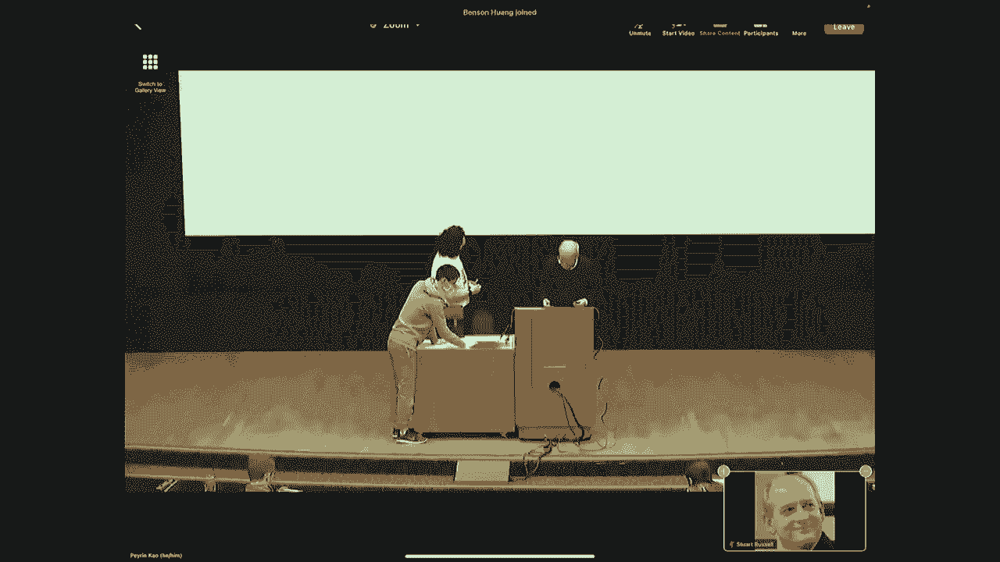
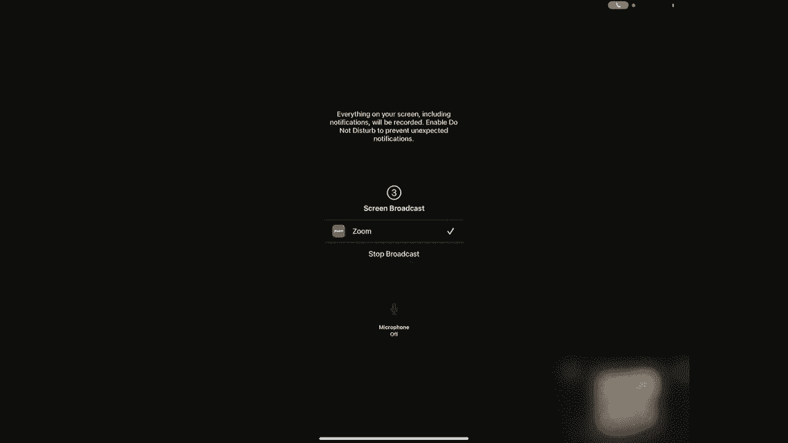
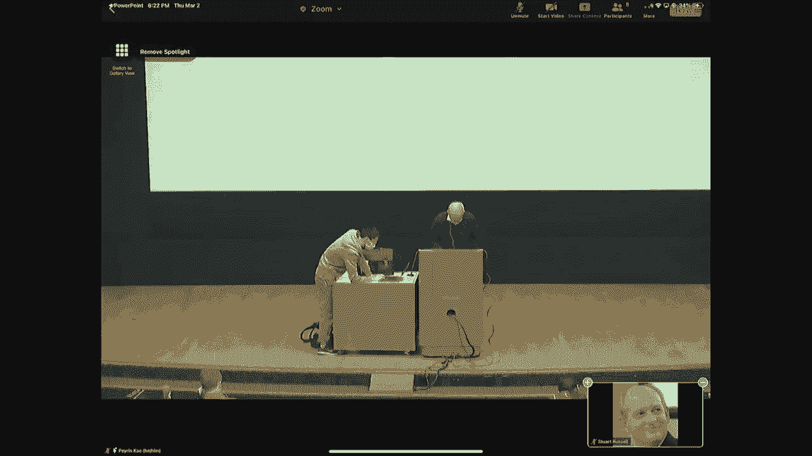
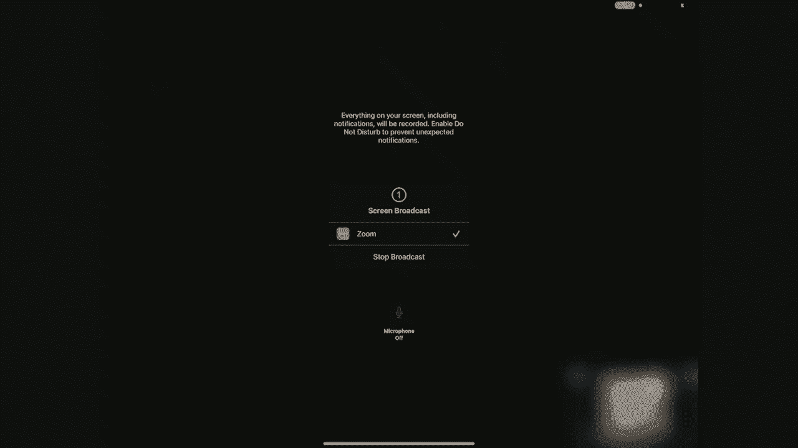

# P15：[CS188 SP23] Lecture 14 - Reinforcement Learning II - 是阿布波多啊 - BV1cc411g7CM

好的，好的，所有的权利，所有的权利，所有的权利，所有的权利，对对对，所以我想，我以为我陷害了他，非常抱歉，对不起，只是几个宣布宣布宣布，首先呢，首先呢，平均平均平均超级超级超级超级围棋专家。

专业的金融专业的金融专业的我会在视频中展示给你看，在视频里，彼此彼此，你当然知道，所以有有有有很长的路要走，等等，等等，等等，就像耶，我知道耶，我知道耶，我知道，现在我们只是要去，我们只是要去。

我们只是要去，我们只是要去，好的好的好的，所有的权利，所有的权利，所有的权利，所有的权利，所以在我们的研究中有一个人，他是个相当不错的围棋手，业余爱好者好几年没打球了，他的评分是2分左右，三百。

啊人类世界冠军，他估计大约有三十岁，八百，所以艾伦的方式甚至不接近存在，在专业的专业丹，它是关于我们大约四个，如果你知道，知道一个业余爱好者，嗯，嗯，嗯，我们和JBX打了零零五五。

类别类别的版本大约是两百，这是目前排名第一的，一气呵成，在公斤级围棋上排名第一，我们做了这些实验，所以凯伦连续赢了十四次，然后他为此感到难过，所以我说，好的，我们会给你一个障碍。

所以我们给了它一个9英石的障碍，这是在围棋中，这就像你对待一个五年的AVI的权利，他只是在玩，你，给他们一双残疾的眼睛，所以他们至少有一些游戏，对呀，所以我们在这里，我们是，我们是普通人。

这个超人程序员，给它一个漂亮的手，所以这是一个，这是游戏的一个版本，所以程序是黑色的，人类是白色的，是白色的，你可以看着会发生什么，即使你不明白这很美，这很容易，你知道的，你只是试图包围领土，包围石头。

那么底部发生了什么，对对，所以白色在中间形成了一小群，然后黑色的周围几乎总是，现在周围是什么，喜欢什么，喜欢什么，白色继续我使用，我用，并继续，黑色抓住了所有的，是啊，是啊，是啊，是啊，是啊，是啊。

就一秒钟，约翰和布莱克，像黑一样黑一样好，所以超人程序实际上真的真的真的很好，好的，好的，那么发生了什么，其实，我们一点也不知道，什么什么在做什么，我们所知道的是，现在人类与这些程序，定期调节。

所有的程序员，他们都有同样的基本弱点，这个啊，什么时候，你看到了什么，井是什么，我猜，我猜，我不想在这上面花太多时间，我很乐意更多地谈论更多，我们认为正在发生的事情是，那就是神经网络，表示为。

围棋项目的评估，所以它基本上是一个树搜索加，叶子的附加功能，就像你喜欢你按字母顺序排列，诸如此类的东西，对，相同的基本想法，它更有可能有一个MT或嗯，所以评估函数实际上学习，正确地学习，什么是群的定义。

什么是活的，什么是完全正确的，为什么那口井，这是因为群体权利的定义是，你知道吗，我连接到另一块石头上了吗，嗯，如果我连接到邻近的石头上，那块石头和另一块石头相连，然后我连接到黄石公园，对呀。

这是连通性的递归定义，递归定义很容易用Python编写，就在那里有一行蟒蛇，一阶逻辑的一行，但正如我们在命题逻辑中看到的，当你有一个电路语言，这就是命题逻辑，神经网络是什么，它真的很难你不能使用。

你知道颠倒，作为和向后的D，和功能符号，你所有的语言都很难表达，你不能在电路中编写递归，所以它不会学习群中连接的定义，它很少零碎地学好，我知道像这样的团体，那是一群人，就像这样，那是一群人，像这样。

那是一群人，如果这是一种它以前从未见过的群体，它根本没有意识到自己是一个群体，我们认为这个圆形三明治，我学会了识别的东西，根本认不出来，所以它不知道发生了什么，也不知道在这一轮中发生了什么，加起来。

开放多少自由，有多少自由，他得到了错误的答案，错误的答案错误的跟踪它在哪里，是不是，它在哪里，它在哪里，什么的，但这是一个失败的，电路的，电路，电路，这意味着它不，以及正确进行的基本概念，阶段，阶段。

案件，可能还有很多，比许多其他方法和其他我们还没有弄清楚的方法要多得多，所以我们拭目以待，这是一个正在进行的故事，只有几个星期，几周大的实验和，鉴于十七军的失败被称为中国人，中文。

在他们看到他们碰巧看到的东西之前，他们有什么他们有什么好吧，所以我们将尝试展示另一个基本的强化学习算法，叫做Q学习，Q学习，然后谈谈如何扩大加固规模，从微小的增强，微小的，从小到大，大大小小，好的。

好的，所以首先，所以学习是，你可能已经猜到了，可能是的，是呀，强制学习，那只是一个提醒，为什么Q值右，所以q的s a s a a，如果你做了一个a a a的动作，你状态很好，在状态下做A，然后呢，好的。

Q值之间的联系，常规值价值权，值值值只是所有动作动作中最高的q值，好的，状态状态下的策略是Q值最高的那个，那是那个状态的最优动作，好的，所以有些感觉，q值其中的值，价值函数和最优政策权。

所以它们包含了信息这很重要，对对，下一个下一个Q学习和性是看贝尔曼方程，我们做什么，我们这样做，我有是的，是呀，我们做了是的，好的，好，所以这是q值的值，它看起来很像v的方程，对吧，有一个重要的区别。

最大值是在右边，因为q值值没有选择a，um的键值，所以这是期望，歌曲m Prime，减，过渡加的加权平均值，加上状态的值和下一个状态的值，就像我在这里一样，对对，是Q值值值动作的面，除了这是x素数。

所以这就是为什么这就是为什么我准备，Q索S S点，所以这是最好的发展，不过没关系，好的，好的，一旦你有了行李员，行李员，我们已经看到你是怎么得到V行李员的，我们不这样做，做这个求和。

一直到概率而不是埃德我们可以用那首歌来代替，所以好吧，所以我们用q值而不是v值说同样的话，所以这给了你一个Q的更新，看起来像这样，就像之前说的1减去α和α，所以我们有以前的键值，加上阿尔法乘以，对呀。

所以样本Q值是奖励，加上下一个的最大值，好的，就是这样，所以这是一个非常非常简单的，类似于我们已经为时差学习更新所做的，就是学习，除了这里我们在学习，我们在Q Q上，好的，好的。

那么Pixel有什么酷的地方呢，是的，当我们了解到没有模型就不能用V来做决定时，v只是告诉你处于一种状态的价值，并告诉你该做哪个动作，然后你要做一个步骤，向前看，选择价值最高的状态，对呀。

而如果你有功能，你和你不需要做一个外观来做这件事，只需选择Q值最高的动作，就是这样，好的，所以一旦你学会了Q函数，你不需要学习或拥有它们，呃，您可以从Q函数中自动提取最优策略，所以你只要学会一件事。

它做到了这一切，好了，现在，当然啦，当然，这不是一个真正的权利，因为q函数比v函数大得多，对吧，它是a乘a乘b，所以A是每个州和州权利中的操作数，所以q的表比v的表大一倍，所以你还有很多东西要学。

但从概念上讲，只学习一个函数CU要精简得多，也简单得多，好的，好的，所以让我们看看，作为一种算法，是啊，是啊，哎呀，有人试图，回到缩放一秒钟，对不起，我们再试一次，然后我们就放弃，试着从这里继续前进。

好的，好的，所以看看这是如何作为一个算法进行的，对呀，所以我们保持Q函数，我们从，假设到处都是零，嗯，这是四乘三世界的最后一个Q函数，就在一千集之后，你可以看到每个州，有四个值。

因为有四个动作你可以上上下下，左右，这样你就可以看到右边，如果我在这里，我往上走，我有负八九，所以这是一个非常糟糕的主意，你可以跟着颜色走，穿上最绿色的，最绿色的方向，所以从这里你从这里向左。

你会从这里向左向右你会从这里向上等等，这样你就可以进入，好的结果，对呀，这就是Q值，我们将努力从我们的经验中学习这一点，好的，所以每一次体验都是这四重体验中的一次，因此，作为准备和观察到的回报。

这一转变，你拿着你以前的估计，你得到你的新样本，哪一个是观察到的奖励，加上下一个状态的最大q值，按gamma折现，然后根据Q学习规则更新Q函数，好的，所以你只要运行它，你可以看到这就像三行半的蟒蛇。

非常简单的算法，你可以运行它，它会为你解决你的MDP，希望我们能从视频中得到声音，这些是丹·克莱因几年前录制的视频，我们只是不停地回收它们，因为这比我们自己做更容易，丹是个很好的解说员。

所以希望这真的能玩得很好，哦华而不实，我们可以得到更大的音量，尽力而为好吧，所以它在这里做什么本质上是它有两个角度，那是它的动作空间，这是一个状态空间，在这里太多了，我将跳过一系列步骤。

现在你可以看到绿色意味着右边的高Q值，在左边有很高的价值，蓝色的小线是每个州当前的优化操作，所以如果我关闭所有的随机性，你会看到它学到的是执行策略，这显示在Q值中，这就产生了一个小循环。

这给了它很高的回报，因为看看那东西，卡车向右行驶，好的，他去了那里，他这样，希望，当你在爬行器上工作时，你会看到这种情况发生，它就像魔法一样出现了，它学会了走路，这是一项离散的权利。

虽然它看起来像一个连续的状态空间，它只是离散成足够少的状态，即使有桌子，即使没有任何概括，它实际上学得相当快，所以说，Q学习的另一个很酷的事情是，它并不那么重要，正在执行什么策略，比如说。

你可以随便逛逛，Q值开始学习正确的数字，Q值正在积累表中正确的Q Q数，一旦你准备好不再到处乱逛，您可以开始使用Q值，你会表现得很完美，好的，所以这被称为政策学习，所以政策实际上是，政策是什么并不重要。

你仍然会学到正确的价值观，所以对于这个收敛证明，我们需要几个警告，我是说证据本身有点长，但是基本的要求，所以说，首先呢，如果你是保单，从来没有访问过一些州和一些行动，那么你当然永远也学不会Q值。

所以你必须访问所有的东西，并保证收敛，对呀，为了避免你可能会倒霉，看到你的行为没有代表性的结果，你必须在极限内，无限频繁地尝试每个状态动作对，好的，但那很容易，你可以这样做，比如说，只是通过随机的行为。

这足以保证你无限频繁地尝试每件事，好的，第二个重要的一点是你必须降低学习率，好的，因为记住学习率是怎么回事，学习率，alpha基本上是告诉你要注意多少，你刚刚的新体验，以及更新规则的指数遗忘性质。

意思是那种已经结束了的东西，阿尔法时间步数之前基本上被遗忘了，所以这意味着即使你有无限多的经验，对呀，所以你得到了这个，长期经验，但你唯一注意的是最近记忆中的这个小故事，尾巴的大小大约是α的1倍。

或者类似的东西，所以这意味着如果你保持alpha不变，你永远不会收敛，因为你只有从有限的经验中真正受益，对吧，这批货，你忘记了之前发生的一切，所以你不能转换到正确的值，所以你必须减少阿尔法，呃。

当你走的时候，好的，嗯，你如何做到这一点涉及到美丽的数学，这叫做罗宾门罗定理，但这两个条件首先是，在这个无限的alpha值序列上所有alpha值的总和，阿尔法的和必须是无穷大，为什么那口井。

因为它是任何有限的数量，这意味着你将无法移动你的价值估计，从它开始的地方到它应该在的地方，如果它应该在的地方很远，就像，说一千个，你从零开始，你应该在一千，但是阿尔法的总和只有两百，对呀。

那意味着你永远也到不了那里，好的，所以你希望阿尔法的一些是无界的，但是你希望阿尔法的平方和是有界的，这基本上意味着你的估计方差将为零，在极限中，好的，但你知道这背后的数学有点复杂，但这些都是关键点。

满足这些条件是非常容易的，比如说，α是t的1，很好地满足了这些条件，我不建议在实践中使用一个而不是T，因为你知道要学会一个像样的政策可能需要一万步，但如果你等1万步阿尔法只有1/1万，那你只做了很小的。

微小的，微小的学习步骤，通常我会用k除以k加上t，其中k，你知道可能是一千或类似的东西，这仍然满足要求，但这意味着最初几千步的学习率相当高，这很好，因为在最初的几千步中，你想学到很多东西。

因为你一开始知道的不多，好的，所以这些都是一些实用的小贴士，但该理论保证，任何满足这些条件的东西，会收敛到正确的答案，好的，所以总结一下我们的强化学习算法的基本集，我们有基于模型的方法。

所以你只需要通过观察过渡来学习模型，然后你解决它，然后使用策略，你可以直接通过时差学习规则来学习值函数，对吧，它试图让嗯，每个州都与其邻国一致，根据连接两者的贝尔曼方程，这是第一个强化学习算法。

这是亚瑟·塞缪尔在20世纪50年代发明的对吧，所以这是TD时差局部调整，或者您可以不尝试强制本地一致性，把你得到的所有奖励加起来，然后将它们归因于序列中出现的每个状态。

但是这两种方法中的任何一种都不足以获得行为，你也得有一些模型来做决定，通过向前看使用V，然后我们看到Q学习不需要这个，你只要直接学Q，所以这被称为无模型方法，因为它不需要学习模型，它只是学习Q函数。

这就够了，正如我周二提到的，我说过有一百种其他的变体，可能有一百多种变体，这个看似简单的问题真的很神奇，呃，学习如何在MDP中表现，对呀，我是说有行动也有回报，呃，我不知道还有什么，有权利，但不知何故。

有很多方法可以将这些东西结合起来，呃产生强化学习算法，这些核心思想可能有一百多个不同的变体，好的很好，所以我们今天剩下的时间要讨论的两件事，我们如何特别探索，我们如何在没有太多遗憾的情况下探索。

你可以想象，如果你大半辈子都在随机行动，你会经历很多遗憾，对呀，你会掉进下水道，你会从悬崖上摔下来，你会撞车的，你会吃砾石、铁丝网和各种各样的东西，所以乱来真的不是一个好生活。

第二件事是我们如何扩大规模，对呀，如果我想，你知道俄罗斯方块对吧，所以我不知道谁以前玩过俄罗斯方块，我总是有这种文化上的不确定性，你知道我用了所有这些例子，你们中的一些人对他们是什么完全一无所知，是啊。

是啊，所以你们中的一些人玩过俄罗斯方块，俄罗斯方块是一个有不同形状瓷砖的游戏，它们出现在顶部，你去移动它们，把它们插进去，当你完成一排瓷砖时，然后排消失了，一切都向下移动，所以如果你没有完成行。

然后它就充满了，一旦它充满了，你说得太对了，所以它是一个，这是一个相当棘手的游戏，这是一个很好的方式浪费时间在你的，在你的手机上，嗯，但你知道这是一个十乘二十的木板，对呀，所以状态的数量是，基本上。

你知道这些方块中的每一个都可以是满的或空的，对呀，那就是两百元，也就是两到两到两百个州，大约是十的六分之一，所以试图了解作为一张桌子是完全不可行的，从10到172星际争霸，我甚至不知道状态空间的大小。

只是动作空间，所以每次的动作次数，星际争霸中的一步大约是二六的10次方，而且很有趣，写阿尔法星论文的人，也就是为玩星际争霸建立系统的DeepMind小组，在自然界中有一个小小的总结，对呀，它是一个。

你知道的，世界排名第一的科学杂志，动作的数量为一千零二十六，因为他们无法理解，事实上有二十六的次方，所以编辑把它改成了一千二百二十六，因为他认为这是正确的答案，但没有，它的分支因子是10的2 6的次方。

因为你有很多很多的单元，在每一个时间步骤，你可以在四个方向中的任何一个方向上移动任何单位的子集，对呀，所以你知道，如果你有五百台的话，这将是你可以选择的400到500个动作，好吧。

让我们来谈谈探索和开发，嗯，我只能让你尝尝，这个美丽的主题真的必须提供，这真的是最有趣的问题之一，从表面上看真的真的很简单，但事实证明，所以我给你讲一个小故事，对呀，所以最基本的问题叫做强盗问题。

这就是佩林上周描述的事情，我想我可以给你看一个，如果我能找到是的，我们到了，所以这里有一个强盗问题，对呀，我有四台老虎机，我见过这个，我试了一千次，赢了九百美元，这个我已经试过上百次了，我赢了九十美元。

这个我已经试过五次了，我赢了四块钱，我试了一百次，我什么也没赢，好的，问题是我下一个应该尝试哪一个，对呀，他们看起来能有多难，好的，那么发生了什么，所以数学家们在二战前就开始研究这个问题了。

他们试了又试，试了又试，他们试图证明所有这些定理，他们认为明显正确但无法证明的定理，然后偶尔有人会证明这些明显为真的定理实际上不是真的，所以你无法证明，因为这不是真的，他们在战争中非常沮丧。

他们实际上建议，我们应该打印出强盗问题的定义，在数以百万计的纸上，然后把它扔给德国，浪费他们数学家的时间，并将他们从战争努力中转移出来，是啊，是啊，例如，他们试图证明的一个定理。

在极限中玩强盗问题的最佳策略是，会永远拉着最好的手臂，这似乎是显而易见的，对呀，我是说，你能有多蠢，坐在那里永远拉错胳膊，这怎么可能是最优的，但事实证明它是，正确的说法是，在有限概率的情况下。

强盗问题的最优策略可以选择次优臂，永远坚持下去，这是非常违反直觉的，但它基本上来自转换的成本，如果你运气不好，你发挥了最好的水平，但它不会给你最好的结果，因为你知道这是老虎机，毕竟，所以这是概率的。

对呀，所以你可能会倒霉几次最好的手臂，然后第二好的手臂几乎一样好，对，实际上确实给了你正确的结果，你说太好了，好的，我很确定现在第二好的手臂，所以你可以很好地想象，好的，也许我该回去试试另一个。

但对我来说改变主意，我得再做五十次，我可能会为此感到非常遗憾，可能的收获比我可能经历的遗憾要少，所以我要坚持我正确的地方，所以这并不总是发生，当然啦，但如果你运气不好，最好的手臂的前几池。

你再也回不去的可能性是有限的，你永远不会发现它实际上是最好的，这就是他们不能证明这个定理的原因，他们试图证明，因为这不是真的，好的，下一件事是解决这个问题有多复杂，如果我把这当成一个MDP，对呀。

州的数量是巨大的，因为这些权利中的每一个，这些土匪中的每一个，我可以拉任意次数，我可以去那个州，我把它汇集在一起的地方，三万一千，三百十六次，我有一万二千四百一的成功，对呀。

所以它们每个都有一个无限的状态空间，然后你有四个，那么它是无穷大的四次方，如果你有一百个，它是无穷大的100次方，所以它是一个极其无限的状态空间，你到底要怎么找到最优的政策。

所以这些都是非常有趣和非常重要的问题，已经被证明是在医学试验中，对呀，所以不是老虎机，你在给病人分配一种特定的药物，对呀，假设你在尝试三种不同的药物，患上某种绝症，你在给病人分配不同的药物。

所以拉手臂意味着给病人药物，胜利意味着治愈病人，失败意味着杀死病人对吧，所以你在分配病人的方式上是最优的还是接近最优的真的很重要，如果一种药物，你知道的，经过几次试验。

一种药物正在杀死你试药的每一个病人，那么继续给病人分配这种药物就很糟糕了，对呀，所以你想开始让病人参加试验，事情进展得更好的地方，好的，这就是为什么，这就是现实世界中事情的运作方式。

但我们仍在努力说服FDA允许进行试验，根据最优强盗算法，对，他们非常非常抗拒，非常非常保守，所以他们在杀人，因为他们认为带状算法太复杂了，对呀，他们只想进行试验，在那里我们确定病人的数量。

他们将提前进入每只手臂，就是这样，探索意味着你必须尝试新事物，剥削意味着你到目前为止所学到的一切，根据这一点选择看起来最好的动作，为什么这种权衡如此重要的关键是如果你只是利用，所以就算你说好。

我会做一定的探索，我会停下来，我会利用权利，你可能会被卡住，你其实可以，你知道的，即使你在继续学习，当你在利用权利的时候，你还在执行一项政策，你还在跑Q学习，基本上可以阻止你发现状态空间的其他部分。

所以你陷入了墨守成规，你永远不会真正了解这个MDP中什么是真正好的，你没有转换到最优策略，所以这就是为什么对，如果你总是去老地方，你永远不会知道这家新餐馆是，事实上。

比你在过去25年里吃的糟糕的食物要好得多，就像我说的，确保探索的一个方法就是随机应变，所以有时它被称为Epsilon，贪婪或Epsilon随机探索，好的，所以你只需要设置一定程度的随机性或探索程度。

你抛一个有偏差的硬币，所以用概率ε，你随机行动，概率为1减去Epsilon，你只要利用权利，你，随便啦，您当前的最佳策略是，你就这么做，好的还有，财产权，对固定的epsilon有好处，对于任何有限ε权。

这将最终无限频繁地尝试每一个状态动作对，所以它满足了我们的要求，它会收敛，如果我在学习一个模型，它会学习模型，如果我在学习Q函数，它会探索一切，只要我也减少阿尔法，但它做了很多愚蠢的事情，就像你知道的。

就像保持，你知道，一直给你致命的药物给病人，以防万一，也许有些病人会活下来，不断从悬崖上跳下很多次，以确保它的伤害是正确的，这不是一个好的行为方式，一旦你开始了解到一些行为看起来真的很糟糕。

你可能应该少做一次，好的，但是Epsilon贪婪的探索并没有做到这一点，它也永远继续随机行为，所以即使你可能在学习模型，拥有这种随机探索策略会阻止你真正受益，你已经完美地学会了模型。

如果你能有一个最优的策略，但你一直表现得有点随意，这并不奏效，所以你想把你的alpha衰变到零，只要再一次，衰变应该是什么的一些数学条件，以确保你满足这个标准对吧，只要你满意了，那你很好，所以呃。

这里有一个“对不起”的小演示，这是爬行器，现在你终于可以看到这个Epsilon控制，这里是，这意味着80%的时间，我们采取随机的行动，这是一个很大的探索，它不是，然而，进步很大，所以耶，所以行为随意。

你正在学习的这项工作对许多随机的工作都很有效，只是意味着它不一定很快起作用，所以我跳过了一些步骤，我们有一些模糊的线索，我要跳一百万步，所以我们计算啊计算，我们计算，我们现在计算，事实证明。

这个机器人在这里有很多经验，即使我把它快进，大概它应该学到了一些东西，为什么一点进展都没有，嗯，我们在强迫它随机行动，百分之八十的时间是对的，当你走左腿的时候，80%的时间是以随机的角度飞出来的。

你不会进步很快，好的，如果我把Epsilon调低会发生什么，让我们把它关掉，让它去最佳好，没那么糟，对呀，所以Q学习学到了正确的东西，但探索阻止了你这样做，所以有几个问题，让我们看看它们是什么。

所有的权利，所以现在，让我们看看这个强盗问题，说好吧，我们应该做哪一个，好的，谁投票给，谁投票给，我们那里有一些剥削者，我明白了，好的，谁投B票，1。没人投你的票，哇真令人吃惊，非常有趣，好的。

谁投C票，我认为C赢了，好的，谁投谁的票好吧，好，我很高兴没有人投D的票，好的，所以说，我想我们可以这么说，这两个都有道理，九返，对每一美元，你投资，你回到，到目前为止，这场表演是意料之中的。

你拿回九毛钱，好的，它们都有相同的回报，但我在这里想做什么，我不只是投资，我也在努力找出这些东西中哪一个是最好的，因为我想找到最好的，然后把我的钱放在最好的，所以如果我有一美元可以花。

我希望从他们中的任何一个那里拿回90美分，那么在我看来，这个严格来说更好，因为我更有可能从强盗那里学到东西，我只试了一百次，与我已经试了一千次的相比，所以在我看来B比A好，好吧，现在这个有八倍的退货率。

所以这比其他两个少一点，但我只试了五次，所以我有很多东西可以学，我可以在这上面投资两美元，两次都赢，现在我有120%的回报，也许我已经发现，事实上，这是我唯一盈利的机器，好的，所以看起来实际上。

虽然这是一个数量上的权衡，是的，因为预期回报少了一点，但要获得的金额似乎至少要多得多，但有一个权衡，但我认为这个权衡的答案是C更好，当然这些都比D好，所以我认为这是正确的顺序，但定量正确的阵列。

计算出C相对于A和B的位置，你实际上必须做数学，并证明这实际上是正确的顺序，上面写着，是啊，是啊，大多数人会选择CB A D，但事实上，你们大多数人都没有选C，b，a和a和d，所以我可能会改变这一点。

但不管怎样，好的，但我希望你能得到这两个直觉，对呀，很明显，在其他条件相同的情况下，给你更好结果的是你应该选择的，而且如果他们有相同的结果，那么不确定性比较大的就比较好，因为再试一次会获得更多的信息。

好的，所以这两件事都是你想鼓励的，所以我们可以想象某种公式存在，在那里我和一些事情有关，我试过多少次了，我有多少成功，在这些数字中，我计算出一个索引，这个拉起来有多好，好的，这完全是逃避。

世界数学家五十年左右，直到1979年约翰·吉丁斯，提出了一个关于如何计算这个索引的漂亮论点，特别是他证明了最优解可以是，你知道的，它只包括分别计算每个臂的索引，然后挑右手食指最高的手臂。

所以最优解这个问题的成本是线性的，在武器的数量上，而不是武器数量的指数级，所以这是一个巨大的进步，我觉得，整个决策理论中最美丽的结果之一，Gittins索引的实际定义是A有点难读。

它涉及一些随机变量和所谓的停止时间等等，如果你有兴趣，你可以阅读第十七章中描述Gitten索引的部分，它是如何派生的，如何计算等等，你可以为一些土匪，你可以精确地计算它，对一些人来说。

你可以相当有效地得到一个非常好的近似值，但我不打算深入讨论，欢迎你读那些东西，但是我们利用这种洞察力的方式，某种函数，具有大致正确的数学形状和大小，这大致看起来像索引应该是什么样子，好的，嗯。

所以通常它们看起来像这样，所以我们有价值估计的权利，也就是，你知道第八点，点九什么的，然后我们有访问次数，我们试过这只手臂多少次了，然后我们取效用估计u的一些函数，访问计数n，一个典型的表单如下所示。

所以你得到了实用程序，然后你就得到了奖金，这与你访问该州的频率成反比，你知道我们试着，你可以试试平方根，因为嗯，平方根出现在许多关于估计均值之类的统计公式中，所以让我们试试平方根，为什么不呢？

平方根是正确的，有些定理有时被称为UCB定理，你可能会觉得，哇哦，加州大学伯克利分校有以它命名的定理，它们代表置信度上限定理对吧，这表明看起来有点像的公式，它们有点复杂和烦躁。

但它们实际上最大限度地减少了遗憾，至少在渐近的大O右中，你可以证明有一个下界对数下界，因此，审判次数的日志是任何保单后悔的下限，这些UCB方法使用的函数有点像这样，达到对数下限。

所以你知道恒定因素之间的差异实际上是显著的，但在很大程度上，我们觉得我们已经很好地处理了如何正确地进行交易，好的，结果很简单，对呀，所以你所要做的就是不用q值来表示下一个状态，对呀，你只要，呃。

使用这种增强的Q值，在那里你给自己一个探索奖金，因为你选择了一个导致一个州的行动，你没有去过很好的地方，就是这样，所以这很简单，但简单的修改就足以让你的Q学习算法高效地探索，不要浪费很多时间。

从悬崖上跳下去毒死病人之类的，以适当的方式平衡价值和信息收益，还在做一个小小的，通过随机性进行微小的探索，但它在实现探索功能，所以这个点是在实现一个探索功能，随着时间的推移，勘探功能的贡献会越来越小。

这意味着，即使在开始的时候，它很快就尝试了各种各样的东西，它发现它实际上知道这些动作是做什么的，现在占主导地位的行为是剥削，你知道的，这是一个有点奇怪的政策，但他跑得很远，不像另一个要跑数百万步。

然后我不得不关掉它的探索，经过很少的迭代，这个已经在移动了，对，所以这有点酷，对，我是说这有点像，我是说，如果你有了孩子，对他们做了很多探索，但渐渐地他们开始弄清楚胳膊和腿是用来做什么的。

当你把东西放进嘴里时会发生什么，它们很快就会转变为非随机行为，开始以一种更有目的的方式行事，所以也许它们有探索功能，我不知道，好的，所以只是为了给这种更多的，你知道数学严谨的光芒。

是的所以如果你一开始就有最佳策略，那么你每次试验的总奖励将是不变的，因为你会在每次审判中，你会期望为此得到最大的回报，mdp，好的，所以嗯所以最佳，你开始最佳，你什么也学不到，但你总是得到最好的回报。

如果你运行epsilon，或者我只是随机地与概率ε作用，每一步，如果你修好了epsilon，然后你就会学到，但你永远无法达到最优，因为你继续随机行动，所以你会后悔，即使你学会了模型或Q函数，好的。

所以如果我们衰变ε，然后随机行为逐渐消失，它最终会开始最佳行为，具有勘探功能权，你实际上收敛得更快，因为你在做，你不只是为了它而随意行事，你做得很明智，你有时选择行动是因为你需要更多地了解它们。

但你在避免选择已经很糟糕的行动，而Epsilon只是选择他们，即使他们很可怕，这样你就少了很多遗憾，所以他们后悔的基本上是奖励的总差异，在你学习的政策之间，如果你已经知道答案，你会得到什么，好的。

我们只是想尽量减少遗憾，这就是u加方k除以n的平方根对吧，这个功能很好地减少了遗憾，所以这并不是说你从一开始就表现得很好，但你正在最佳地学习，你的探索行为，以一种任何系统都能达到的最好的方式，好的。

所以我想展示这张幻灯片，仅仅因为我们的艺术家画了一幅关于遗憾的美丽的画，经验丰富的特工回顾年轻时的自己，他正忙着跳进火坑，现在他有烧伤的痕迹和创可贴，还有各种各样的东西，所以这很酷，所有的权利。

所以在过去的三十分钟里，我们将讨论如何让这些算法扩大规模，从你知道的，几十只，或者一百个州，你知道，十亿，万亿，千兆个国家，他们可以很容易地做到这一点，所以说，我们必须摆脱这种想法。

Q函数将用一个表表示，你可能从未见过数学表格，谁见过数学表格或拿过表格书，你甚至不知道那是什么意思，什么是表册对吧，嗯，每一页都是一本书，那边有张桌子，在x上有对数正弦cos tan e所以。

每一页都是一个大数字表，对呀，你知道一度的正弦是多少吗？两次的正弦是多少？三度是什么意思？你知道的，然后是三点一，三点二，全页三点三，为什么我们有那些井，因为我们没有，没有计算器。

计算尺对一些事情来说是可以的，但对先验功能等不太好，所以当你想做计算的时候，你买了一大本数学表格，对呀，这就是你如何表示函数，但我们当然知道，你知道，我们知道，对数函数和tan函数的数学公式。

以此类推对吧，你可以把它们写一个系列，和一些可怜的人，你知道吗，可能在19世纪必须手工计算这些表，呃，通过做所有的数学，你知道吗，手把手地做算术，嗯，然后我们用这些来做我们的实际工作。

工程师们带着它们到处走，用它们做一切，但那是一种可怕的方式，对呀，如果那张桌子必须，你知道，十亿页，这将是一个非常糟糕的方式来表示函数，对呀，您希望尽可能紧凑地表示函数，所以要做到这一点。

所以我们想避免这个十亿页的表库，对呀，我们试图为函数找到一些参数形式，对呀，想象一下正弦函数，你可以把它写成A作为多项式，我忘了确切的，但它有x和x，和x的五次乘三次阶乘，五个阶乘废话废话。

你可以写出第一个，你知道吗，六个任期，这是一个很好的近似值，只是带着它到处走，也许可以从一些例子中了解系数是什么，好吧，这将是一个更有效的，六个系数而不是十亿页的表格，所以这是基本的想法，对呀。

我们使用的工具，学习这些函数表示的参数或系数，这些是从机器学习或统计学习中借来的，或曲线拟合，或者其他什么，你想叫它，你知道吗，线性回归，所有这些都是关于拟合函数的参数，到某些数据以最小化错误，好的。

还有这个，你知道的，直到您看到基于表的方法有多愚蠢，你意识到，我们当然不想用桌子，因为这很可笑，他是个吃豆人对吧，所以吃豆人就要被鬼魂吃掉了，所以我猜，对吃豆人来说，这是一个相当糟糕的状态。

对基本上是没有机会的，嗯，发现这个日期没有希望了，为什么我要一次又一次地经历它，在略有不同的配置中，意识到这些都是无望的对吧，我应该从一个例子中吸取教训，是啊，是啊，当鬼魂真的很近的时候，我没有出口。

这是不好的权利，那是因为我想在这里学什么，我不想一遍又一遍地学，对于每一个微小的变化，所以有人能发现，保持在右边，状态在左边，有一个点，是啊，是啊，这里少了一个点，所以这使得它成为一个不同的状态。

所以这是一个不同的表条目，你也要学这个，对呀，事实上，你知道的，如果有十乘十的世界，那是一百个点态，对呀，那是百分之二，同一神的变体，你可能处于的可怕状态，你必须经历所有这些，直到你正确地学会这一点。

对呀，至少使用表方法，所以很明显我们需要概括，人类做得非常好，我们通常从很少的经验中学到，嗯，所以无论如何，我想丹会解释的，这将是一个非常小的步行者板，你将看到的是，你会看到一堆州飞过每个州。

每个动作都有一个Q值，我们要慢慢学习，所以我们开始了，小鲍尔死了，我们死了，哦，我们赢了，你死了，我们死了，你大多会死，为什么？因为你不知道发生了什么，你就像，我从未见过这个州，我们向左走。

同时鬼魂就像百胜，你时不时会不小心吃到点，你这样失去了很多吃豆人，遗憾很高，所以这就是我们要避免的对吧，他应该从前面几个例子中学到远离鬼魂，但他没有，因为各州每次都略有不同，所以每次都要重新学习。

所以现在我们要做我要做的，我要让它运行两千次在我们看到任何东西之前，在你见过所有这些州两千次之后，你很清楚哪些是好的或坏的，现在你可以做一些惊人的体操和躲闪鬼魂，事实上，这是一场胜利，所以你赢了。

你赢了，但请注意，这是一个三乘二的世界，使用表格法需要两千次经验才能变得很好，好的，关于这个，这块板子并不大多少，但在你找到那个点之前，你需要很长时间，鬼魂就是不让你这么做，你在学什么？你就像。

哦在方块二逗号三，碰到鬼有点不好，哦，在方块一逗号二，也许我不该碰到鬼，我不知道那里发生了什么事，我想鬼魂，鬼太笨找不到你，对耶，所以这基本上是行不通的，对呀。

所以你在三乘二的世界里学到的东西没有什么可以继承的，没有什么能带走他们，因为在这个更复杂的世界里，这些都是不同的状态，它有11个州和11个地点，我应该说，它需要，你知道的，如果需要两千人才能学会三乘二。

在11个地点的世界里学习可能需要200万人，对呀，在10乘10的世界里，你知道的，你说的是十到五十次的经历什么的，如果你也数点，如此绝望，所以取而代之的是对的。

我们将做一些与我们在游戏中所做的非常相似的事情，对呀，我们将学习值函数的表示，就国家的特点而言，而不仅仅是国家的直接功能，所以一个特征，就像在我们的，我想我们有国际象棋评估函数的例子。

棋子的数量和骑士的数量，皇后的数量等等，每一个都是一个特性，你有系数，一三，九，以此类推，你乘加，这就是全部材料，这是胸部状态价值的重要组成部分，好的，所以我们会为吃豆人做类似的事情。

所以最重要的特征可能是离最近的鬼魂的距离，你可以想象，这可能会有一个负面的，负系数，无正系数，我希望它很大，对呀，所以一个正系数，嗯，然后它，然后它就会学会更喜欢离最近的鬼的距离很大的状态，到最近的点。

鬼的数量，也许你想加入一些有趣的额外功能，就像一个到最近点的距离，在隧道里是零1，以此类推，这样你就可以，你可以用自己的专业知识，就像几个世纪以来棋手所做的那样。

对一些似乎与在吃豆人中做出好决定相关的功能进行编码，然后我们将学习用这些特征表示的Q函数，表示是取特征值的线性组合，所以我们得到了一个重量，W二，w n，特征值f 1，f 2到fn。

然后V现在由权重向量参数化，w，所以说，而不是v的大小与状态空间的大小成正比，可能是十的五十分之一，对呀，V的大小只是参数的数量，向量w的长度可能只有6或者类似的值，好处是如果你把木板做两倍大。

v不需要改变对吗，因为你知道这些参数值可能仍然很好，对于一个更大的板可能需要发一点推特，在表格的情况下，什么都不适用，你不能从一块板的大小概括到另一块板的大小，因为那样你就根本不是同一个状态空间了。

好的，所以从某种意义上说，你正在学习，你知道如何在吃豆人中表现得很好，Q函数也是如此，只是功能现在取决于特性，现在取决于状态和动作，他们必须依赖两者，因为他们必须区分你正在采取的行动，所以。

而不仅仅是与鬼魂的距离，你会说是这个动作让我更接近鬼魂，或者离鬼魂更远，对然后这就是特征，好的，嗯现在，当然你还是可以搞砸的，你可以做一堆完全不相关的功能，就像你知道的是点的数量，质数，是或否，对呀。

这是一个非常糟糕的功能，它可能会导致你以荒谬的病态方式行事，所以你仍然可以搞砸，这不是一个，呃，你知道的，它不是包治百病的灵丹妙药，你必须在这些功能上投入一些专业知识，你只能这么做，因为你玩过吃豆人。

或者你明白规则，或者你基本上明白发生了什么，但这才是真正重要的，您可以处理具有大量状态的状态空间，使用相对较少的参数，玩得很好，那么我们如何学习这些参数，对呀，这是关键，所以我可以给你们一个定性的解释。

然后我可以给你一个非常简单的数学解释，这和这两个实际上给了你同样的，如果你看看最初的Q学习角色或最初的TD规则，我们试图使相邻状态的值彼此一致，根据贝尔曼方程，所以在不一致的程度上。

我们认为这是一个错误，我们试图减少误差，使方程变得更真实，对呀，所以如果等式非常不正确，那是个大错误，如果你把误差变小，等式变得更加真实，好的，所以我在这里用错误形式写它，对呀。

基本上是我按阿尔法时间更新Q，误差和误差是预测的q值，我们希望它等于的东西，除了这只是一个样本，而不是期望，记住，所以有点不同，然后状态本身的q值，好的，所以这里的这个东西是错误的。

然后我们试图通过更新来减少这种情况，所以我们要用砝码做同样的事情，好的，减少误差的方法就是采取梯度步，记得我们讨论过在连续空间中进行搜索时，如果你还记得这个例子，我们试图把机场搬来搬去。

最小化到城市的平方和，减少平方距离之和，我们计算那个平方和的梯度向量，然后我们向一个与梯度相反的方向移动，这将误差减少到零，好的，所以我们在做同样的事情，我们接受这个错误，我们要在这里更新重量，因此。

与其更新表项，我们按alpha更新权重，学习速率次数，这就是错误，然后这是q函数相对于单个权重的梯度，Q函数相对于该个体权重的梯度，因为Q函数是线性的，对呀，梯度正好是系数对，就像，你知道的。

3 x井的导数是多少，是三个好的，和wi well相比，wi times fi的派生词是什么？这只是菲，所以这个导数是fi，如果你现在回过头来看看它在做什么，波浪形右井，如果你有一个惊喜，如果。

如果你做一个过渡，你得到的状态比你预测的要高，基于你的价值和过渡的回报，如果它有一个惊喜，然后你增加正面特征的权重对吧，所以这意味着这个错误，这种区别是积极的，这是一个惊喜。

那么你就会增加有积极价值的特征的权重，您将减少具有负值的功能的权重，这就是你想要的对吧，我们只是说，哦，这实际上比我想象的要好得多，所以这意味着这个州来自，我需要增加它的价值。

我通过增加积极特征的权重来做到这一点，减少负面特征的权重，反之亦然，如果我得到一个不愉快的惊喜，然后我想减少A来自的状态的值，所以我减少了积极特征的权重，我增加负数的权重。

所以这个学习规则以一种非常简单的方式完成了所有这些，你可以测量大脑中发生的这种情况，所以多巴胺系统是人脑的奖赏系统，你可以测量什么时候有一个不愉快的惊喜，你可以看到基本上代表值函数的神经元。

由于消极的惊喜，如果你没有得到一个惊喜，所以即使你得到了积极的奖励，如果这正是你所期望的，神经元对此没有正确的反应，所以这和那真的很有趣，所以当你在学习的时候，你不知道该期待这种回报，你得到的奖励就像。

你知道，对于那些不得不忍受这些实验的猴子来说，他们喝了一小口橙汁，当他们没想到的时候，他们说，哦哦，然后神经元开始，哦耶，我们得到了一些积极的回报，一旦猴子知道什么时候该喝橙汁。

那些神经元对橙汁不再有反应了，所以同样的奖励，但因为它被预测没有学习发生，神经元不再兴奋，所以很明显多巴胺和喧嚣，所谓的多巴胺能系统在做什么，看起来很像Q学习，用神经网络表示值函数，所以很酷。

我已经停止屏幕共享，好的，我要回去，很抱歉，主持人结束了这次会议。好的，现在才6点20分，会回来解决这个问题的，我不知道你是否遇到了变焦的其他时间限制，我想如果你重新打开它，那我就再加入，它重新打开。

你回来了，好的，所以我会加入，提醒我号码，是啊，是啊，我要了，九六，两个，四，一，两个，三个，四，九，四，两个。

所以我应该可以分享内容屏幕。

好的好的，好的，所以让我们来看看其中的一个，哦好吧，事情就是这样，我们只剩下几分钟了，嗯，所以一个例子，所以在痛苦的细节中，对所以，嗯，所以我有这两个功能，所以q函数用f点表示，也就是到最近点的距离。

F是到最近的鬼魂的距离，目前定罪超过4减去1，这就是我所处的状态，我即将死去的地方，大家可以看到，和，所以如果你看看这个公式，f点是零，点五，因为我离最近的点只有两个，所以超过一点不是五点，和鬼魂。

我与鬼的距离，如果我往北走，我离鬼只有一步之遥，所以F鬼是一个，所以如果我去北方，然后我死了，获得负五百元的奖励对吧，这是新的状态，我死了，这可能没有我预期的那么好，那个状态的q值为零，奖励是负五百元。

然后我们进行操作，所以说，Q函数的公式，4乘以f点减去1乘以f鬼，所以那是四次，点是2减1乘以1是1，所以原始状态的q是正一，样本值，r加γ，乘以下一个状态的q值的最大值是负500，加一个零。

所以误差是负501，好的，所以这比我预想的要糟糕得多，所以我必须应用点特征的公式和权重，嗯是原来的重量，四点O加阿尔法乘以错误时间，的，特征权的值，导数是特征本身的值，那是零点，五个是f点一个是f鬼。

好的然后我有两个关于w点和w幽灵的更新规则，这就是一些新的价值，我想这里的阿尔法很小，超过二百五十或类似的东西，我想这些都是W的新值，然后你就不停地重复，好的，然后现在我们有了扩展到大状态空间的方法。

这样我们就可以对付吃豆人了，我们有一种探索的方法，所以我们可以你知道不只是要一直随机行动，我们可以集中精力探索，快速学习，我们能让它学会玩吃豆人吗，嗯，问题是够了吗，还是我们需要做，我们还需要添加更多。

让它学习得足够快，嗯，那真是太酷了，这样做的好处是，你从一次经历中学习得如此之快，你可以知道鬼魂是坏的，那么你将要看到的，你要去看吃豆人游戏吗？和一个有鬼魂的合理的木板。

你应该意识到的是你第一次吃一个点，你会得到一个反馈，让你知道也许点是好的，你第一次打鬼，你有机会了解鬼魂是坏的，所以不是那种错误，错误，错误，最后经过两千次尝试，我们掌握了一个二乘二的板。

让我们看看会发生什么，所以说，嗯哼，点是好的，鬼是坏的，好的，点是好的，鬼是坏的，你看到一个试图逃跑的人，而现在，非常好的三次试验，相当惊人，对，我们没有写任何代码，对呀，记得你写的所有。

你必须定义的启发式，如果它吃了它们，我想要一个，你就有机会知道他们很好，如果特征函数允许表示，在这种情况下，这些功能是不存在的，所以很快就有一点关于收敛的知识，当你使用q函数的近似表示时。

右边而不是桌子，在那里很容易考虑收敛，就像如果我访问了表中的每个州，我经常无限地做所有的过渡，我当然会正确地学习这张桌子，这不难推理，但如果你知道我有一个10到50的状态空间呢，我有六个参数。

你知道会发生什么，它学会了吗，它会收敛吗，它收敛到什么，是一组困难得多的问题，有完整的，你知道的，书籍和书籍，数百万篇关于这一点的期刊论文，我甚至写了其中的一些，嗯，但我只想告诉你几个基本事实。

所以有一点是v星是正确的值函数，可能无法表达使用六个特征的线性组合，我是说，毕竟它有10到50个数字在里面，那就很幸运了，如果能将其压缩成6到6个特征及其系数，所以总的来说对吧，你想到的，呃，你知道的。

价值函数的巨大空间，对，你知道，在这里这些是你可以用这六个特征的线性组合来表示的，这里是真值函数，对，所以你可能不能代表，它不在可表示值函数的子空间中，好的，一个问题就好了。

它会收敛到存在的最佳近似值吗，所以让我们把这条线向右延伸一点，所以如果我们放下一个垂直线，说，好吧，看，这是我能得到的最接近真值函数的近似值，它至少会收敛到那样的东西吗，答案其实是肯定的，它还可以。

这是一个，这是对强化学习理解的重大突破，它表明时间差异学习一个非常简单的规则，会收敛到接近最佳线性近似，如果你有一个线性值函数表示，好的，所以这真的很好，Q学习，另一方面，不收敛，所以相对容易找到例子。

其中线性表示的Q学习发散，这意味着重量可以变成正负无穷大，你离你想要表示的值函数越来越远，而不是越来越近，好的，这是一个很大的失望，因为Q学习是一个很好的算法，嗯现在，所以这些结果是在90年代末，嗯。

但现在我们已经能够证明，即使你不仅有线性的，而且有非线性的函数表示，比如说，具有百万参数的神经网络，呃，现在，如果使用正确的更新规则，它比TD规则或Q学习规则复杂得多，但有办法跟踪这一切，并更新东西。

以便保证收敛，所以我们现在有一个漂亮的，不同学习规则的收敛行为。

