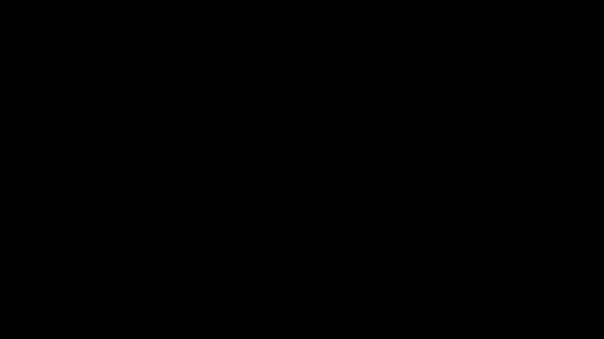
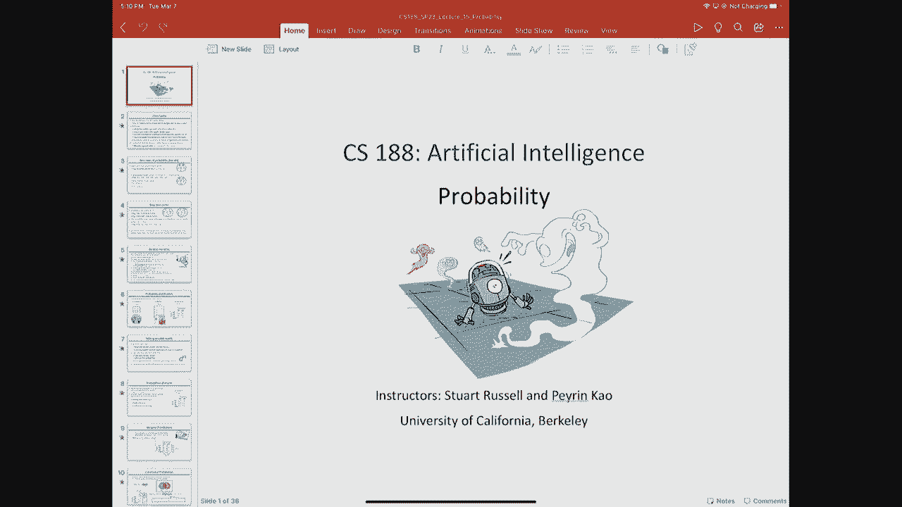
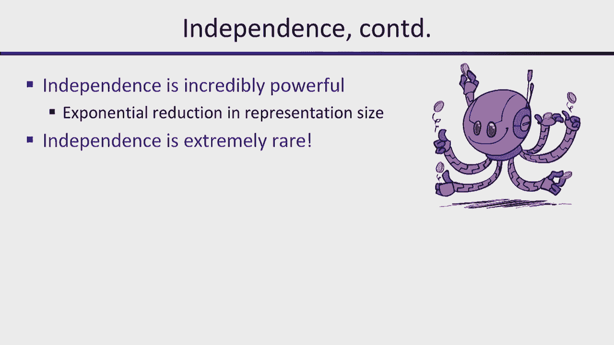

# P16：[CS188 SP23] Lecture 15 - Probability Review, Bayesian Networks - 是阿布波多啊 - BV1cc411g7CM

好的，嗯，我们今天有点力不从心，我希望期中考试没有，呃，使人筋疲力尽，所以在我们开始之前，我会给你一个小问题，让你在业余时间考虑一下，启发式H5，所以要记住，这是正方形问题中的着色。

这实际上是一个非常少伪装的吃点问题，嗯，非常非常少地伪装，好的，假设我们有H5，等于，距离，好的，因为工资单，我来来回回，在这个上面，我们最初在这个问题上有一个启发式，他，他想，事实上。

我想也许参加测试的GSI是对的，大家一致认为这不是，这是可以受理的，但不一致，对呀，为什么它不一致的论点是当你，你知道的，如果你在这里的某个正方形上色，那碰巧是，给你最大的曼哈顿的一部分。

未完成正方形之间的距离，所以如果你给它上色，现在，未完成的正方形之间最大的区别是非常小的，是的，所以这可能会急剧下降，假设是，哦，如此寓言，不一致，因为如果启发式能降低超过采取行动的成本。

那么它就不一致，因为它不满足三角形，但当然当它下降很多的时候，现在到最近的正方形的距离是过去的，两个进一步的正方形之间的距离，所以启发式的成分增加了很多，所以我回信说，好的，你能给我举个例子吗。

实际上不一致的地方，我想你努力了一段时间，我试了一会儿，我提出的所有案例似乎都是一致的，所以在你的业余时间，你可以证明它是一致的，或者找个柜台，例子，因为这样我们就可以在明年的期中考试中使用它。

所以人们想提出的关于期中考试的任何其他问题，让我们看看星期一，没有，还有人在考期中考试，我觉得，直到七点，m，今天，不能抱歉，那我就不该问那个问题，但谢谢你指出这一点，是啊，是啊，我忘在那里了。

有一些学生因为后勤原因不能在晚上上课，所以他们有，他们今天必须这么做，嗯，所以我，但我想明天是好的，好的，所以现在我们要，所以我们谈到的搜索算法根本没有考虑不确定性，对呀，他们都假设确定性转移模型。

结果函数，或后续职能，我们看起来有点不确定，千年发展目标与强化学习，有更多的不确定性，但我们在教你，概率前的MDPS与强化学习，这已经成为这门课的一些供品中的一种传统，这不是我最喜欢的方法。

但自从我不在，佩龙做他喜欢的事情更有意义，这就是我们做这件事的顺序，通常当我教它的时候，我先做概率，然后随着时间的推移做概率，然后是MDPS，随着时间的推移，它增加了决策的可能性，所以说，但不管怎样。

所以我们要真正地做不确定性，你知道的，在人工智能中，这有点有趣和奇怪，对于第一个权利的大部分时间，从田野开始的三十年，不确定性在很大程度上被忽视了，人们对马尔可夫决策过程一无所知，他们研究了搜索算法。

他们研究了游戏算法，他们研究了基于逻辑的规划算法等等，重点主要是，就可以，我们实际上捕捉了关于现实世界的基本知识，并开发了可以处理这些知识的算法，知识和不确定性被认为是的，在现实世界中有点讨厌。

你知道的，如果计划不成功，然后从你到达的任何状态重新计划，这通常会有所帮助，在许多实际领域，那其实是，嗯，这样做是非常成功的，如果你，如果你有一辆优步，或者你使用Waze或谷歌地图。

或者这些应用程序中的任何一个，他们在做一个确定性的假设，即道路是开放的，你想去的地方，如果你走到一半，你发现实际上没有，那座桥关闭了，或者你知道有意外，你得去别的地方，然后它就重新计划好了。

所以方法会告诉你，哦，你知道的，在这条路上意外的耽搁，你知道重新计算路线，你知道走这边，对呀，所以它没有预料到堵塞的可能性，想出一条很坚固的路线，它很可能会选择一条路线，如果是，如果桥被堵住了。

那你就得做一个，你转身回到起点走另一条路，所以它不一定会选择一条坚固的路线，因为它没有，它没有真正考虑到额外的不确定性，但出于大多数实际目的，就在我们谈论高层计划的时候，就像我要教我的课程一样。

我要去吃早饭，我要去睡觉了，我们通常可以以相当高的概率做这些事情，对我是说，是啊，是啊，可能会有地震，但据我所知，没有人对，早上没有人起床，我最好多带条睡衣，以防今天有地震，所有的权利。

我们只是不这样工作，也许有些人会，但你可能不想认识那些人，好的，但如果你想去机场，这就是为什么我们选择这个例子，就在，尤其是在海湾地区，或者如果你想去洛杉矶国际机场，或者如果你在纽约试图去拉瓜迪亚。

或者纽瓦克，就那件事而言，有很多不确定性，所以如果我离开，如果我今晚有航班离开SFO，我离开了伯克利，飞机起飞前60分钟，对呀，我能及时赶到那里吗？对呀，那很不确定，当我的闹钟没响的时候，我就这么做了。

或者更确切地说，当我把闹钟调错时间时，我应该说，但这是相当危险的，对呀，当然，如果是高峰时间，可能接近绝望，为什么很难准确地预测它是否行得通，所以我们说这是相当困难的，在交通高峰期非常危险。

这是极不可能的，等等，因为有一堆东西，我们不知道对不对，所以存在着真正的部分可观测性，嗯，为了世界的现状，我们一次又一次地，到目前为止我们看到的所有算法，包括MDP算法对吧，他们都认为你对国家了如指掌。

它被称为初始状态，就是这样，你在里面，你知道的，但当然在现实世界中我们没有，我们不知道我们处于什么状态，我们处于某种状态，但我们不知道什么是对的，我不知道现在的道路状况。

我不知道路上的其他司机打算做什么，我不知道他们的轮胎是不是很薄，所以他们会有一个井喷，或者在路上的某个地方有一颗钉子，会戳到别人的轮胎，他们可以井喷，等等，等等，等等，地震，你说对了。

所以有很多事情可能会发生，仅仅因为我们根本不了解这个国家，我们所知道的，或者至少是我们认为我们知道的东西，比如，你知道交通报告和天气预报，对呀，它本身就很吵，你经常知道你在听收音机，上面写着，哦。

你知道，在某某上有一个可怕的备份，然后你到了那里，根本没有后援，因为他们犯了个错误，还是放晴了，即使你知道所有这些，所以即使你能完美地观察到状态，你知道路上每个司机的计划，对呀，只是复杂性，对呀。

我要预测谁将到达机场，每时每刻车会在哪里，会有多少人排队，他们的包里会有一瓶水吗，这会减缓安全线，废话废话，对呀，你可以想象，即使你有一个完全详细的模型来准确预测，你要花多长时间才能通过安全线。

你知道在哪里可以找到停车场，你到停车场要多长时间，完全不切实际，当然，我们对过渡模型了解不够，对呀，我们已经在MDPS中看到了这一点，但我们只是在弥补不确定性，对呀，我们只是说好，你知道如果你往前走。

你知道你成功的概率点是八，概率点是一，你向左和向右，所有的权利，所以这是一种虚构的不可预测性，但在现实世界中，过渡模型本身存在巨大的不确定性，所以这些都是现实世界中不可避免的。

我们必须能够考虑到不确定性，如果你看看所有这些来源，归根结底有两件事是对的，一个是无知，我们根本不知道初始状态，我们不知道过渡模型，另一个是懒惰对吧，所以即使我们做了，做所有的计算都太贵太难了。

预测将要发生什么，所以要对付我们的无知和懒惰，我们用概率论，我们希望概率，我们表达的不确定性实际上会，呃，在某种意义上正确地捕捉到我们的无知和懒惰，好的，现在可能有神秘的星体耦合，你知道的。

高速公路上有钉子，在我八十岁，会导致穿刺，在某人的轮胎里，这会减缓交通，以及在安全线上的人是否，你知道的，在他们的包里藏了一瓶水，引起了备份，对吧，也许那里有一些星体耦合，嗯。

这将导致我们的世界概率模型无法捕捉到，实际将正确发生的事情的统计数据，嗯，所以概率模型实际上只是反映了你认为世界可能，世界可能会变得正确，这项权利并不是没有客观的真实性，所以一个不同的人。

一个知道更多的人会有不同的概率模型，嗯，你知道，除非我们能达到量子水平，但即使在量子水平上，对呀，关于这是否是真的有很大的争论，概率不确定性，对呀，因为实际上，如果你，我不知道你有没有学过量子力学。

但量子力学中的波函数实际上是确定性地演化的，所以如果你知道宇宙的初始波函数，那么你就知道宇宙的最终波函数，没有人，量子力学中没有不确定性，除测量点外，对呀，所以这就是它的用武之地，所以我想我们会。

我会给你一些论据，为什么概率论是处理不确定性的合理方法，嗯，为了做出决策，概率论必须与效用论相结合，我们会在几节课上讲到，以便做出理性的决定，所以有一个完整的学科叫做决策理论，嗯。

另一个完整的学科叫做效用理论，嗯，我们对未来的偏好是如何表达的，偏好必须有什么数学属性，概率论研究不确定信念的数学性质，效用理论，偏好的数学性质，这两者结合在一起给你决策理论。

我们在MDP中看到了MDP中的MDP，我们刚才说，好的，我们要最大化预期的折扣奖励，也没有解释为什么这是一件合理的事情，这个折扣系数是多少，我们为什么要加奖励，我们为什么不把它们成倍增加呢？

但我们可以解释为什么会这样，事实上，一旦我们开始谈论效用理论，这是一件合理的事情，但底线是，我们已经看到了，代理人选择行动是合理的，在所有预期的动作上最大化八月最大值的星，所以你能到达的州的总和。

你达到那种状态的概率，考虑到你做的动作次数，你达到的状态的效用，所以这是向前看的一步，我们现在要改用u而不是v，这在经济学上是历史正确的，效用理论发展的地方，他们在动态编程中利用你。

它与经济学是分开发展的，和像贝尔曼这样的人在一起，他们用v表示值，他们只是假设V被定义为奖励的总和，而不是理解实际上这是一个，它是对历史的效用，这种效用必须具有特定的奖励属性才能有意义。

它也值得一个历史笔记，事实上，所以所有的动态规划都被制定出来了，呃，在1953年，嗯，作者：沙普利，谁是经济学家？他实际上不是在单一特工的背景下解决的，但实际上是多个代理，所以他做到了。

他发明了多智能体顺序游戏的动态编程，嗯，这是MDPS的推广，呃，他在53年完成了所有这些，贝尔曼在五十七年发表了他的论文，但却因为MDPS和动态编程而获得了所有的荣誉，所以它只是表明。

希望我今天要说的大部分是一篇评论，因为你选了数学五科，五或七十，你知道，呃，概率定律是关于什么的，但我们其实不是，我们的目标不是，你知道，做出界或类似的事情，我们实际上是想用概率，嗯，为了创建推理系统。

所以我们朝着不同的方向前进，但我们从同一个地方开始，所以用离散概率对，你只是有一组可能的世界，欧米茄，所以我就用滚动一个骰子，作为一个例子，所以有六个可能的世界，当你滚动染料时，染料可能会有不同的结果。

这就是六个可能的世界，在这个例子中，概率模型说对于每一个元素，这一套的小欧米茄，大欧米茄，它给那个小欧米茄世界分配了一个实数，所以对于我们的例子，我们可以说它是均匀分布的，不一定是。

你可能有一个有偏见的骰子，有不同的概率，但是任何特定的概率模型都会给你每个世界的特定数字，嗯，所以我们的概率模型，这些是概率定律，对呀，概率必须在零到一之间，如果你把它们加起来，然后它们加起来就是一个。

那是概率论，我们都做得很好，我们就可以回家了，好的，所以我们现在要做的大部分是，呃，只要详细说明这个基本思想，调出一些符号，你如何操纵概率的某种代数规则，这是一个基本的工具包，就像你在高中学代数一样。

所以你可以操纵像2 x加5这样的代数表达式，你可以拿走五个，你有两个X对，所以我们要做类似的事情，除了用概率表达式，好的，嗯，所以另一个术语，对呀，所以一个事件只是一组可能世界的子集。

所以你可以有一个活动，比如角色少于四个，这将是一组可能的世界，一二三，角色很奇怪，就是一三五套，好的，一个事件的概率是世界上概率的总和，属于那个的，角色的概率小于四，就是1的p加上2的p，三加b。

在我们的模型中，这正好是一半，这一切真的很容易，对呀，它得到了更多的一点，稍微难一点，所以这就是为什么，为什么概率是处理不确定性的合理方法，因为如果你有其他处理不确定性的方法，不符合概率定律的，对呀。

所以如果你，比如说，如果你的概率加起来小于1，嗯，你根据这些数字下注，对呀，那些伪概率，然后我们就可以把事情安排好了，让你每次都输，对呀，这样我们就可以安排金额，以及骰子滚动的每一个结果的输赢。

或者赛马，或者不管是什么，所以不管谁赢了这场赛马，你赔钱，不管骰子是什么，你赔钱，这就是为什么，如果你看，教科书上有更多关于如何做到这一点的细节，好的，另一个术语，所以一个随机变量，嗯是。

如果你喜欢一个可能世界的一个方面，从技术上讲，它只是一个以世界为输入的函数，你是你日志吗，您正在登录缩放，好的，没有你我无法登录缩放，嗯，好的，所以从技术上来说，随机变量实际上既不是随机的，也不是变量。

这是非常令人困惑的，它是确定性的，这是一个函数，对呀，所以它只是说，好的，它将一个世界作为输入，并从某个范围返回一个值，好的，所以嗯，所以如果我们有随机变量奇数右，这是一个布尔随机变量。

因为范围是真的和假的，如果你，如果我把可能的世界一个权利，那么从一个中出来是真的，对呀，如果我把可能的世界六，那么六分之一是假的，所以对于布尔随机变量，它们实际上非常好地对应于命题逻辑中的命题符号，嗯。

我们有一个小速记，所以不要把事件写成奇数等于真，对呀，那将是一个事件，1。三五奇数为真，好的，我们可以把它写成小写的奇数和奇数等于假，我们会写得不奇怪，好的，这使我们能够使用基于逻辑的表示法来定义事件。

对，所以你知道我赢得了选举，没有人相信我，那是个事件，我可以用一个逻辑表达式来描述它，所以这很方便，我们将看到，所以有很多不同种类的随机变量，所以我可能，这是温度，对呀，是热还是冷，他们会忽冷忽热。

作为值，对呀，你可以有一个实值变量，所以有一段时间，到机场要多长时间？是介于零到无穷大之间的实数，对嗯，你可以有随机变量，其值是坐标对，所以如果你在找吃豆人的鬼魂，你不知道他们在哪里，他们可能在零。

可能在零一，那么幽灵的位置就会有坐标作为它的可能值，好的，所以你可以像在约束满足中一样，同样的基本思想你可以定义变量的范围为你想要的任何东西，只要你能通过将一个函数应用于可能的世界来生成输出值。

所以一旦我定义了一个随机变量，变量的概率分布就是它的每个输出值的概率，好的，每个输出值对应于一个事件，对呀，例如，奇数等于真，是一个事件，这是事件一，三，五，所以奇数等于真的概率。

是1、3、5的概率之和，也就是一半，所以对于有值的变量x的概率分布，小x是所有世界的和，使得欧米茄中变量x的值是小x对，所以变量具有该值的所有世界的总和乘以，这些世界的概率之和，好的。

所以对于奇数的p等于true是一半，对于b r等于false，它将是一半，所以奇数的分布是半半，好的，所以这个，这是事件的标准符号，其中随机变量具有特定的值，简称，对呀，我们通常只用小x的p对吧。

所以如果不是模棱两可的话，小x的p意味着大x等于小x的概率，大x的p本身只是指整个分布，所以你可以把它想象成一个向量，大x的p指的是整个分布，然后我们会有代数运算来操纵整个分布，好的，对此有什么问题吗。

呃，正确，他们不必，我们在这里不太使用期望，嗯，所以在卷轴上做的问题是，然后你就会遇到测度理论的问题，因为，比如说，对呀，你可以有一个分布，你知道在任何无穷小范围内，DX正常右，如果是连续分布。

在那个范围内的概率为零，但是你可以有分布，在那里你有增量函数，现在当你问概率问题等等时，你会得到一个混乱的问题，因为现在你混合了有限数量的可变性，从无限小量的delta，你需要做测量理论，并正确地做。

那是一整块脂肪，所以我们一般在教这个的时候，我们坚持离散的情况，如果你仔细想想，对呀，嗯，完全有理由这么说，你知道我得了什么病，我得了癌症吗，还是我得了感冒、流感或Covid。

或者这些都是完全合理的问题，说这是没有意义的，我预期的疾病是什么，对呀，你知道什么是平均超过癌症和新冠病毒，并得到其他正确的东西，这根本说不通，所以说，所以这实际上比坚持真正有价值的东西更普遍。

但真正有价值的东西变得更加复杂，当你做得很好，我想以后当我们开始做贝叶斯网时，我可以给你看一些贝叶斯网络算法会出错的例子，因为它没有正确地做测度理论，有办法修复它，但它变得非常复杂，好的好的。

所以我会给你一些例子，我们要谈谈温度和天气，这将是一组典型的例子，所以温度可以是热的，也可以是冷的，每一个概率点5，天气可以晴朗，雨天，雾或流星，我不知道，事实上，我们的艺术家，我想我们下雪了。

出于某种原因，艺术家画了流星，我们喜欢流星的照片，所以我们把它改成了流星，但它们并不经常发生，所以我们要说流星的概率为零，所以这些将是温度和天气的概率分布，我们今天要做的是，很多是联合配送，所以它是。

一组变量的所有可能的值组合的概率，所以这里的温度和天气温度有两个值，其中有四个值，所以有八个值的组合，所以联合发行必须指定八个数字，好的，它们实际上必须加起来，所以真的，你指定了七个数字。

我们在这里指定了多少个数字，两个人的预付款，好的，它必须加起来是一个，所以一旦你指定了一个数字，然后给另一个，好的，所以我们只需要指定一个数字，对呀，所以在这个概率模型中有一个自由参数，好的。

那里有三个，这个里面的七个，好的，所以这告诉你什么，你应该知道这已经是，我不能从每个变量的分布导出联合分布，个别地，这些变量被称为边际分布，联合分布比边际分布包含更多的信息。

因为它讨论了这些变量是如何相互关联的，很明显，温度和天气之间是有关联的，对呀，你知道，通常在阳光明媚的时候，它往往更多地与温暖的天气联系在一起，而不是与寒冷的天气等联系在一起，但是从联合分布中。

我可以得到边际分布，所以从右边的桌子，我可以通过把合适的值相加来提取左边的那些表，好吧，我们看看怎么做，好的，所以关于这个有什么问题吗，所以在AI的大部分时间里，我们从概率论中的方法向后做事情。

概率论中的权利，你从一系列可能的世界开始，然后你得到你定义的随机变量，所以你把随机变量定义为世界的函数，实际上通常，在概率的几乎所有实际应用中，就会反过来，对呀，你计算出你的随机变量是什么。

然后可能的世界只是所有价值组合的叉积，随机变量的，好的，所以情况正好相反，我们经常会想到，好的，我们如何定义这个问题，随机变量是什么，写下来，一旦你写下你关心的随机变量，你已经定义了概率空间，对呀。

你定义了一组可能的遗嘱，就像所有值的组合一样，所以说，比如说，如果我掷两个骰子是对的，第一个变量是滚动1第二个变量是滚动2，可能的世界是什么，调整一号角色和二号角色可以出来的所有方式，所以会有三十个。

所以这意味着我有一个三六入口联合分销，我得加起来一个，所以我需要三个五个数字，好的，我从哪里得到三个五的数字，关于这件事我知道得更多，关于这个特别的，生成过程，就是角色是独立的，所以当我掷骰子的时候。

不影响其他骰子的分布，反之亦然，所以你可以把概率乘以，所以每个人都有，你知道，所以说，如果我取这对值，你知道二和五，或者六加一，他们都有概率，三六一，所以这里我们用随机变量构造了一组可能的世界。

及其价值观，所以你马上就知道了，如果你只举这个例子，你推断得很好，四个骰子，五个骰子，对呀，你们每个人都可能有一百种疾病中的任何一种，还有很好的，当你们都在这里的时候，你大概有六百五十八个人，所以那是。

嗯，这是一个可怕的很多，对呀，那是100的六百五十八条项的次方，对呀，所以你知道我们的想法，我们简单地定义了一组可能的世界，然后我们把概率附加到每一个可能的世界，理论上这很好。

但是可能世界的集合将是指数级的大，在随机变量的数量中，所以，推理问题在实际案例中尝试写出并填写该分布，所以实际上有一个非常著名的例子是这样做的，它是第一个概率医学推理系统，它建于60年代初的英国。

因为我们有国民健康服务体系，所以他们能够从英国的每个全科医生那里收集数据，他们用它来建立一个胃痛诊断系统，对呀，所以有很多不同的，你可能会有各种各样的肠道问题，很明显你可能得了癌症，你可能会有溃疡。

你可以有一些其他对医疗服务非常重要的东西，他们想有一个标准，你知道的，在某种意义上，最佳诊断，你知道他们会问更多的问题，你知道，你抽烟吗，你喝酒吗，你吃吗，很多很多的胡椒，其他各种问题。

他们有足够的人建一张桌子，我想有20个布尔变量，也就是百万分录表，他们可能有一千五百万张唱片，他们可以为成年人访问，所以他们可以估计其中的一些概率，通过在这个巨大的桌子上填满一百万个条目，对。

但如果你知道如果你真的是内科医生，20个变量太少了，对呀，还有很多其他的事情可能会出错，有很多很多相关的症状，有许多相关的因果因素，所以这是你能做的最大的，建立我们所说的列联表，对呀。

内容表是精算师使用的一个词，谁能预测你能活多久，除其他外，人寿保险，精算表或意外开支表只是联合分配，你有计数的地方，对呀，你已经得到了表中每一个条目的实际经验数据，你不能建造超过一百万的，所以我们需要。

就像我们在逻辑上所做的那样，正确逻辑，你可以建立巨大的真值表，回答真值表中的每一个问题，但是齿表的变量数是指数级的，所以你需要某种代表，对呀，一些简洁的表示，这正是逻辑，是对。

由真值表表示的可能世界集的大块，所以我们对概率论也有同样的认识，所以让我用这个联合分发来说明我们如何回答问题，就像嗯，某一特定事件发生的可能性有多大？所以这是我们的，这是我们的大概率模型。

现在我们可以简单地通过加起来来回答问题，所以概率事件，记住是世界上事件真实的总和，该集合中每个世界的概率，好的，所以如果我想，天气又热又晴的可能性有多大，有人能告诉我，零点，四五个，对呀。

所以只有一个入口既热又有阳光，好的，热的概率是多少，零点六，零点六的任何进展，零点五，是啊，是啊，所以它是所有这些权利的总和，四五二三等于五十，所以它是，呃，零点五。

所以这就是你可以看到为什么这被称为边际概率，对呀，因为它写在大桌子的空白处，这就是为什么它被称为边际概率，对呀，所以这是第六点，阳光明媚的概率，这是第一点，这是第三点，那还是零，好的。

这些是这个关节的边缘，好的，天气热或不起雾的可能性有多大？所以如果我们用逻辑来写，或者对我来说不是，非常好，所以这个事件在任何地方都是真的，除了这里，对呀，所以其他七个地方都是，事件满意。

所以我们去掉点2 7，我们得到了点七三，什么想法，这一切都很容易很清楚，好的，所以我已经解释了什么是边际分布，所以你是这样计算的，如果我在变量x和y上有一个联合分布，我想要x上的边缘。

我刚刚求和了y变量，这就是所谓的求和或边缘化，去掉一个你不想有的变量，并减少变量的数量，就像我之前给你看的，这些是边际分布，下一个条件概率，实际上有很多方法更有用，也是我们思考概率推理方式的核心，好的。

所以这只是，条件概率的数学定义，所以这是给定b的概率，这正好等于a和b的联合概率，除以b为真的概率，所以记住这段关系很好，如果它在右边，如果你在调理杆的右手边调理，那你除以那个，你为什么除以这个。

因为基本上你所做的是你把整个，整个宇宙对吧，也就是所有这些可能的世界，你说得很好，我对B有条件反射，所以给定B意味着我想专注于B为真的世界，所以现在我们只是在看这些世界，所以这意味着我们想。

为了让它加起来仍然是一个，我们必须将这些世界的所有概率乘以B，现在里面的世界将加在一起，好的，所以这只是一个缩放因子，以确保B世界内的概率加起来仍然是1，那么给定b的概率是。

是b世界中a为真的概率质量的分数，所以这是这里的这个区域，所以现在我们只看那个区域的比例，B自身概率质量的交集区域，所以这就是为什么，我们就是这么想的，条件反射本质上只是投射到世界的一个子集。

在子集中问概率问题，只是所有发生的事，你只是在衡量这些概率，然后在这一系列世界中寻找，所以这是一个非常，非常简单自然的概念，一旦你掌握了条件概率推理的诀窍，你就能这么想了，就像你说的2 x减去5对。

你对这个就像对普通代数表达式一样舒服，所以让我们来定义，让我们从我们的联合分布中提取一些条件概率，所以我想知道天气晴朗的可能性，考虑到温度很冷，根据定义，这只是阳光明媚和寒冷的可能性，除以天气冷的概率。

这是晴冷的概率，所以一点五，天气冷的可能性有多大？那只是边缘，这是所有这些条目的总和，所以这是第五点，所以现在条件概率是点五除以点五，所以是三点，你可以看到这里，我们只是说好，有多少，如果我把B世界。

对呀，你在做什么，看看那些世界，你试图找出的东西占了多少概率，A世界的概率，所以那个带一点的长方形和那个交点正好是这个圆，有了那个交点，在那里，但这是一个特定事件的特定条件概率，给定另一个特定事件。

当然还有，就像我们对变量所做的那样，我们可以谈谈整个分布，所以整个条件分布，比如说，这是天气的条件分布，因为天气很热，好的，所以如果我修复性感，然后我的八入口矩阵被折叠成一个四入口向量。

这是天气给定热度的条件分布，好的，嗯，唯一不同的是我必须，它必须正常化，所以基本上我是在天气热的时候拍的，我正在扩大规模，使其正常化，必须加起来一个的迷你阁楼，这是暂时气温寒冷的天气。

这就是这个专栏的缩放，所以加起来是一个对，这是给定温度的天气分布，所以天气很热，考虑到温度，天气很冷，所以它是一双，注意这张桌子，整件事都是对的，它不等于一个，因为它实际上是两个分布，对呀。

这是一个分布的情况下，它是热的，这是冷的情况下的另一种分布，所以它实际上加起来是两个，而不是一个，所以这种正常化的想法非常方便，嗯，所以正常化意味着恢复正常状态，这意味着取一个非正态分布。

加起来不等于1，然后将其缩放，使其加起来为一个，好的，我们用，作为比条目之和高1的缩放因子，好的，所以有些条目已经是一个已经正常化了，那么你需要的缩放因子是1，对呀，如果条目之和为二，我是说它太大了。

比例因子是1比2，所以是一半，然后把所有东西都乘以一半，现在加起来就是一个，好的，所以alpha只是统计力学中的一个标度因子，而且肯定，你知道的，一些概率书，你会看到它被写成1/z大写。

有时被称为配分函数，对呀，所以这就是，这是未归一化概率值的和，在某些分布中，对所以，让我们做一个快速的例子，对所以，如果我，如果我看天气给冷，然后呢，我把它拿出来，那是不正常的，所以我想让它正常化。

得到一个适当的条件分布，所以我可以拿着这个，这是联合分布的一部分，所以它是天气具有特定值的概率，和寒冷的温度，对呀，这不是有条件的，然后如果我想得到条件，我把它乘以α，所以它是常态化的，然后就这样了。

好的，所以规范化因子实际上只是一种符号上的方便，我可以写对，所以α等于，天气等于废话的概率，废话，废话，嗯，温度等于冷，右加，另外还有四个天气值，所以会是所有这些，所以我们可以把它看作是天气值的总和。

w等于w，t等于c的概率是对的，但是写alpha更容易，因为你不想把这个大的求和表达式通过所有的数学，无论如何，你最终会把它正常化，所以只要把它保存为alpha并保持数学，好的。

乘积规则基本上是写条件概率定义的另一种方式，所以如果我用这个规则，我把两边乘以b的p，然后我得到产品规则，所以产品规则，你可以把它看作是从条件分布构造联合分布的一种方法，所以a b的p等于a的p。

给定b乘以b的p，并再次注意，对呀，只是这是让你的代数直觉，向右奔跑，你会经常看到这种东西，就在条件栏的右手边有一个B的地方，然后有一个边际概率，你就在它旁边，如果你看到不同的东西，对呀。

所以如果你看到给定b的p，你会看到的，你觉得，嗯哼，有点不对劲，我在某个地方犯了个错误，因为这通常不是你期望在概率表达式中看到的，有时可能是合适的，但大多数时候你希望看到右边的东西。

然后基本上b中的p是b中的p，所以左边是一个B，期望看到一个在右边，左边是一只蜜蜂，当你把东西相乘在一起的时候，好的，这就是产品规则，我不知道这个例子有什么直截了当的，我们已经看过很多次了。

但只想说对了，我可以接受这个联合分配，并将其表示为给定温度的天气条件分布的乘积，而不是温度的先验概率或边际概率，所以这个表等于这两个表的乘积，好的，当我说产品的时候，我不是说矩阵乘积。

我是指点明智的产品，所以这是一件重要的事情要记住，经典线性代数矩阵运算，当我们谈论概率分布时，对呀，我们通常做的是逐点乘法，好的，所以你只需从矩阵中提取相应的条目，把它们相乘，把它们放在属于它们的地方。

因此，乘积规则可以扩展为一个更一般的规则，称为链规则，你可以通过说好来看到这一点，这里有三个变量，所以让我保持x 1和x 2，假装它们是一个单一的变量，然后将产品规则应用于这个组。

把它分成x 1然后x 2 x 3，所以如果我把乘积规则应用到x 1 x 2 x 3，我得到x 3给定x 1 x 2，然后是x 1 x 2的概率，我再次将乘积规则应用于x 1 x 2。

所以现在我得到x 2给定x 1和x 1，所以我可以对任意数量的变量这样做，好的，所以总的来说，如果我有一个n个变量的联合分布，这正好等于产品，在这些变量上，每个变量的概率，给定顺序中的所有前面的变量。

我可以用任何方式订购这个，所以这是你所知道的，无论您选择什么点菜，你会得到一个不同的数学表达式，但他们都是，它们在数学上都相等，嗯，所以我们总是可以分解任意数量变量上的任何联合分布，变成条件分布的乘积。

好的，这是一个非常重要的工具，我们将处理大概率模型，好的，关于那批货物有什么问题吗？这一切都很简单，我向你道歉，如果你们都在打哈欠和无聊，但把所有的东西都集中在你的脑海里是很好的，去吧，所有的权利。

所以现在我们要谈谈，你知道的，我们要用这个做什么，因为我们要用这个来进行概率推断，我们将用它来回答，然后智能代理可以使用这些答案来做出决定，对，所以通常我们有一个查询变量，其值。

我们想知道查询变量的概率分布，到目前为止，我们已经收集了一些证据，我们想知道变量的分布是什么，然后你可以做一些事情，比如，好的，我该怎么办，还是我应该得到更多的证据，这样我就能做出更好的决定等等。

所以说，比如说，我起床了，我得去机场，我打开收音机，交通报告说是的，一切都在自由流动，桥上没有事故，你知道的，把灯关了，我想是的，好的，所以我去机场的概率，时间可能是百分之九十，好的。

所以百分之九十的证据是正确的，它不是绝对值，你十有八九会去机场，对吧，这只是意味着考虑到你目前所知道的，我想我十有八九会说到点子上，好吧，嗯，这是可以改变的权利，所以如果我也加上好的，嗯，“好吧。

现在几点？”，现在是早上五点，那很好，对吧，这意味着交通很少，希望起床的人大多知道他们在做什么，所以我可以预计可能不会有任何事故，不会有交通堵塞，所以现在上升到九点五，然后我向窗外望去，下着倾盆大雨。

你知道在湾区，每个人都表现得好像从未见过雨，他们忘记了怎么开车，所以你可能会有更多的交通堵塞，所以可能会下降到80，对呀，所以你可以看到它没有随着你增加更多的证据，它并不总是上升，并不总是下去。

取决于证据对你信仰的影响，好的，嗯，所以我们要做的一件事是看看，如何计算这些条件分布中的一个，条件概率分布，嗯，对于查询变量，然后当新的证据到来时，你如何更新它，所以最简单的方法假设你有一个联合分布。

我想计算其中一个条件概率，嗯基本上是我们要做的，我们要去，我们想要查询，我们有证据，然后在我们的联合分布中有一堆其他变量，我们要把另一个变量求和，这样我们就只对查询和证据进行联合分发。

然后我们基本上可以直接从中提取答案，这里有一些符号，所以我们在联合分布中的变量，x 1到xn，所以在胃痛的情况下，那就是二十个布尔变量，他们能够记录所有这些病人，我们称证据变量为大写E。

我们观察到它们的价值很小，我在这里用粗体表示变量的集合，它可以是一个单一的变量，但它可能是十五个变量或一千个变量，它只是变量的集合，好的，查询变量将是Q用于查询，隐藏变量将是h表示隐藏，非常助记的符号。

好的，所以我们想知道查询变量的概率分布是多少，给定证据变量，我们首先要做的是，只是看看分布的部分，证据有正确的价值，所以我们只是根据证据，有我们看到的证据，减少了可能世界的集合。

去掉所有证据不具备这些价值的，所以现在我们在看一组可能世界的一个子部分，然后从这个子部分我们求和隐变量，所以我们只剩下查询了，这是我们求和所有隐变量的简化分布。

我们基本上通过将隐变量的每个可能值相加来获得它，查询的概率分布，具有这些值的隐藏变量，证据具有我们观察到的价值，所以这给了我们一个查询和证据的联合分布，然后得到正确的条件分布，我们只是正常化，所以我们。

查询变量的分布，给定证据只是正常化因素，alpha乘以查询和证据的联合分布，这里的关键是查询变量的表达式p，隐藏变量和证据变量对吧，这些都是变量，所以这些数字是对的，这和x 1到xn是一样的。

所以所有这些数字都可以在联合分发中获得，所以我们在这里假设我们开始，用联合分配给它，现在我们求和隐变量，正常化，我们完成了，这是非常，非常，非常直接，有人能发现这里明显的计算缺点吗，有多少。

有多少个术语，在这次总结中，我们对隐变量的所有值组合求和，是啊，是啊，所以隐变量的数量将是指数级的，对呀，所以在你知道的情况下，如果我得到20回胃痛，对，我想知道，假设溃疡是一种可能的解释，溃疡的概率。

我观察到Zim Tom的五个变量，我有一个查询变量，所以我得到了14个隐变量，所以我把这十四个加起来，对呀，这就是你知道的，那是超过一万六千个术语的东西，所以加一万六千个术语，对呀。

所以它随着模型中隐变量的数量呈指数增长，所以我们会发现，事实上，我们可以做出更高效的算法，但我们希望至少有一个计算的数学定义，我们以后要有效地做的，好的，所以让我们举例说明。

所以让我们从一个简单的案例开始，我们没有任何证据，我们已经知道怎么做了，这只是边缘化，所以我有，我在这里又加了一个变量，呃，哪个季节，可能是夏天也可能是冬天，所以现在我有，嗯，有一个有四个值。

一个有两个值，一个有两个值，我这里有16个可能的世界，如果我想知道天气的概率分布的概率是多少，从这个联合分配中，那我就求和其他变量，把其他变量加起来，意思是好的，假设我想知道晴天的概率，好的。

然后我就看着所有阳光明媚的情况，所以我有一个三五，等于四五，和五五，使第七点，它在等7点，然后雨是一个，五是六，一个是七，然后是一个二十块，所以这是第二点，七，然后雾是一个1和一个9，那是十个，二。

十一，那就是十二个，十八就是三十，那是，呃，那是雾，然后我们有流星，零，零，零，零，所以那是零，我数学算错了吗？某处不不，我想没问题，所以我会把它正常化，这将给我天气分布，好的，如果我让他。

如果我犯了心律失常的错误，我向你道歉，现在来一个真正的查询，对呀，所以我想知道天气，考虑到现在是冬天，对吧，隐藏变量是什么，隐变量是温度，所以我要对可能的温度进行求和。

我要总结一下冬天可能的温度是如何调节的，所以我只看桌子上冬天的部分，所以把右边划掉，我会假装这是我的联合分销，它不是一个归一化的联合分布，但这是我缩小的世界，那里实际上是冬天，然后我做同样的事情。

所以如果我想知道桑尼，2。我要总结一下这个热案和这个冷案，所以我会得到一分一分一五分，那是点二十五，以此类推，所以你明白了，对此有什么问题吗，好的，好，所有的权利，所以我们应该，嗯，所以我已经说对了。

在最坏的情况下，这种枚举算法的复杂度是指数级的，许多隐藏变量，所以这很糟糕，实际上更糟的是什么，我们记得我们看到了一颗星星，事实上，空间总是比时间受约束得多，对呀，我的进程以，你知道5千兆赫。

或者如果我有GPU，我可能会得到一个Terra翻牌，很容易从笔记本电脑里拿出来，嗯，但我的笔记本电脑通常没有PB的内存，这意味着我耗尽空间的速度远远快于我耗尽时间的速度，更糟糕的是。

如果你要把你的概率分布表示为这个大的联合表，现在你必须分别估计该表的每个条目，你必须开始收集数据，看看你有多少次得到属于那个特定条目的案例，对呀，我们需要一个指数，估计这个概率模型的指数数据量，好的。

那真的会要了你的命，计算机中的一个存储单元大约花费，假设你知道，十亿分之一美元，一个关于真实医疗案例的数据点可能会花费你一千美元来收集对吗，所以有一万亿，折叠内存成本之间的差异，以及收集数据权的成本。

所以你不惜一切代价想做的，如果你要用概率论，试图找到用相对较少的参数来表示复杂概率分布的方法，这样你就可以从真实数据中估计它们，宇宙只是没有足够的数据来了解巨型联合概率分布。

所以我想我们差不多有时间讨论贝叶斯规则了，然后应用独立性的概念来进行推理，或者至少概率分布的表示是合理有效的，所以贝叶斯规则你应该已经知道了，我们只是把产品规则，嗯，这是我在给定b的p之前给你的方法。

b的p，你也可以把它写成b的p给定一个对称的p，现在我只拿这两样东西，我一个一个地，我除以这些东西中的任何一个，所以我们得到了，比如说，给定b的p是给定b的p，注意到右手边有一个，然后左手边有一个。

除以b的p，所以这是贝叶斯规则，这是呃，这是一张照片，那通常被认为是牧师湾的照片，但我们最近了解到可能不是他，我们其实不知道是谁，我们真的没有先生的照片，我们有真正的证据事实上是贝叶斯先生。

但就目前而言，这是我们用来给贝叶斯先生的照片，当然这是他的规矩，所以人们实际上去他的坟墓，对呀，来自世界各地的统计学家都去他的坟墓前致敬，在英国，好的，所以你可能会问你知道，什么，好是一个规则。

它需要一个非常简单的表达，然后用一堆，你知道的，就像三件事看起来和你试图解决的事情一样复杂，通常是对的，你所要求的，对呀，换句话说，你问的是，考虑到效果，原因的概率是多少，你从一个表达式计算它。

这是物理学的方向，在物理学中，我们写，你知道物理定律告诉你发生了什么，如果发生这样那样的事情，那么结果是什么呢，所以物理学在时间上从原因到结果，所以在一般意义上，给定的原因是物理学的自然方向。

所以这些概率往往是稳定的，相对独立于上下文的，他们很强壮，如果你对该领域有很好的了解，它们通常很容易估计，而一个原因给定的结果实际上是非常不稳定的，对所以，比如说，对呀，我们现在有很大的可能性。

你发烧的可能性有多大？如果你有Covid，假设85%的Covid患者发烧，可能是百分之九十，你得Covid的可能性有多大，如果你发烧，那要看你是否知道秘密正在进行，五年前，答案是零，对呀。

从来没有人感染过Covid，所以概率为零，现在可能是30%，所以我有一个奇怪的经历，实际上我第一次得Covid，我打了求助热线给医生，医生说，好的，嗯，你知道的，填写这份自动问卷，上面写着，你知道。

你发烧了吗？你头痛吗？你发冷吗，你有这个，你知道是的，是呀，是呀，是呀，我已经检测出Covid呈阳性，没有地方放，是呀，我的新冠病毒检测呈阳性，所以在我完成问卷后，上面说，哦，你可能得了流感，你知道。

去睡觉，喝热饮，我说好，那有点蠢，对呀，我们正处于Covid疫情之中，我刚从瑞士乘飞机来，感觉很糟糕，所以我打了电话，实际上和一个真人说话，对他们大喊大叫，因为他们没有包括，你知道吗。

你有Covid检测阳性作为症状之一吗，因为这是一个荒谬的，他们说无论如何更有可能得流感，我想我用了一个不好的词，其实，这就是这两个原因，但另一种思考贝叶斯规则的方式是作为一个非常自然的更新过程。

因为如果你这样想，我们把这个分成两块，这就是你一开始所相信的，好的，这是你认为A为真的先验概率，现在你观察到B，你想知道我如何更新我对一个，考虑到我观察到了b，答案是你把它乘以这个，有时被称为B因子。

所以它说更新你的信仰，当你观察到某事时，你把你的先验值乘以某物，然后你有了一个新的信念，你会得到另一个更新，你再把它相乘，另一个更新，你再把它相乘，所以它给了你这个非常。

非常简单和自然的方法将新的证据纳入你的信仰，如果你的假设空间，如果你的物理学理论是可能的，比如说，你开始得到观察，那么你就把你先前对这些物理理论的信念乘以，按这个基数。

然后你只需以适当的方式通过乘法来更新，这就是机器学习，就是这样，没有别的了，对呀，这就是学习中所发生的一切--从一个先前的开始，在假设空间中获取数据更新先前的，按照这个乘法过程，我们做得很好。

你可以看到如果，如果假设说你不可能，如果你知道，如果这个假设是真的，你不可能观察到这些数据，因为B是证据，对呀，那个项就是零，如果A有一个特定的值，看到B的概率为零，所以一旦你看到与假设相矛盾的证据。

排除了归零的可能性，永远不会回到零度以上，因为你不能一直繁殖，没有什么会发生在零，它只是停留在零，所以它完全可以做你想做的事情，所以计算部分可能会更难，对呀，关于物理学的假设空间是巨大的。

所以当你去的时候，你会带着很多乘法，但原则上，这就是我们如何学习如何做科学等等，所有的权利，六二五，我想我们有时间谈谈独立，但也许不做包，当然我们还没有吃豆人的演示，但我们要，我们今天没有时间了。

所有的权利，所以说，我们要降低分布复杂性的第一种方法，就是看看独立的概念，嗯，所以你应该记住，从CS七十，两个变量是独立的，如果联合分布p x y是边线的乘积，正如你所记得的。

联合分布比边缘分布有更多的自由参数，你可以从关节上提取边缘，但你不能总是从边缘提取关节，或者从边缘处构造关节，因为它只是有更多的东西，它有相关性，但如果它是独立的，那就没有任何相关性了，事实上。

你可以通过将模块相乘来直接从模块中构建关节，只要领域有独立性，嗯，所以这真的很好，嗯，还有其他方式来表达绝对独立，对嗯，因为如果你看看产品规则，我们知道pxy等于，如果它等于x的p乘以y的p，然后向右。

所以我们可以拿着那个，你可以取消Y的P，现在你得到x的p=x的p给定y，或者通过对称性，给定x等于y的p，所以这意味着再次将此视为更新，对呀，如果有独立性，那么了解Y并不能改变我对X的信念。

所以我对给定y的x的信念和我先前对x的信念是一样的，所以如果它是独立的，了解Y并不改变我的信念，好的，这可能是一个更有用的方法来记住独立的真正含义，对呀，在想，变量是否提供任何信息。

它是否改变了我对另一个变量的信念，好的，如果没有，那他们就独立了，所以很容易看出骰子是正确的，我们相信根据物理学掷骰子是独立的，好的，所以我们愿意写第一条规则的概率是五。

第二条规则是3是这两个概率的乘积，三十六分之一，所以它是一个，这不是骰子的数学性质，概率都是1比3 6，对呀，它是一种物理性质，这是我必须带到这个领域的东西，并说这不仅仅是一个任意的联合分配。

但它有一个特殊的性质，因为某件事，我知道生成过程，所以如果你有独立性就太好了，然后你就会得到指数级的减少，你必须提供的数字数量，所以如果我有N个独立的硬币投掷，比如说，然后每一个都是一个点5。

5的正反面分布，然后是所有这些的联合分配，n个硬币翻转只是单个硬币翻转分布的乘积，把这个写下来，个人硬币发行，好的，所以我可能还有一些对称知识，嗯，所有这些硬币都来自完全相同的制造过程。

所以如果他们有偏见，他们都有同样的偏见，现在我已经从n个参数降到了一个参数，但这将是关于这个过程的物理的额外知识，所有的硬币都是一样分布的，所以独立只是说不管每枚硬币是什么，他们可能都有不同的偏见。

比如说，但联合分配是单个分配的产物，因为我要独立地把它们卷起来，但他们不是，如果它们不是独立制造的，它们是以相同的方式制造的，那么你可以使用的参数数量就会减少得更多，好的，那太好了，复杂度的指数级降低。

我们所需要的是独立，所以这真的很好，不幸的是。

