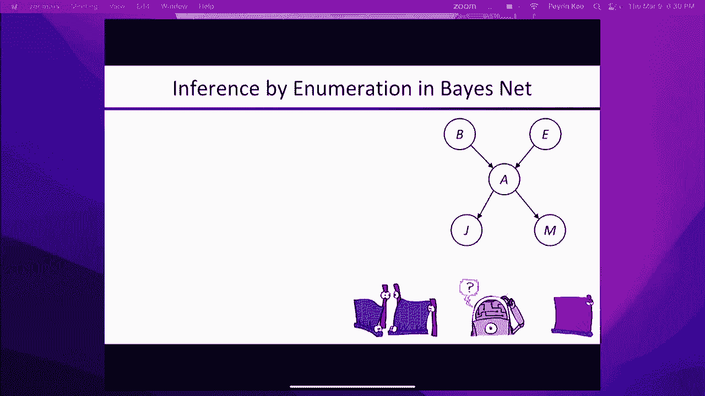

# P17：[CS188 SP23] Lecture 16 - Bayes Nets_ Syntax and Semantics - 是阿布波多啊 - BV1cc411g7CM

不需要在这里，所以我只是，哦耶，我不知道。

好的，我不知道罗素教授在哪里，可能他被雨淋湿了，我完全没准备好，但既然我们都在这里，也许我只想谈谈事情，然后如果我搞砸了，我先向你道歉，好的，开始了，是有回声还是有人在开玩笑，好的，我不知道，好的。

我在录音，我想我们可以看到这个，好的，所以我想，上次你们都学过概率，我又想了想，这一切就像完全即兴表演一样，所以阻止我，如果有什么不对劲，但希望这些都是看起来很熟悉的东西。

我们将在接下来的几个星期里使用它们，所以事件的概率分布告诉你概率是多少，有些事情发生的权利，这个分布的所有概率之和应该是1，因为这些事情发生的可能性都是百分之百的，随机变量。

我们通常用大写字母表示随机变量，所以我们把它写成大写字母X，这意味着x表示某个随机事件或某个随机变量，它可以具有很多不同的价值，所以也许这个大写的X可以得到像1、2或3这样的值，或者像轻、重、中。

或者类似的东西，哦嗨，好的，完美的时机，我就像，我不知道还要多久，我还能坚持下去，好的，但我帮你看完了第一张幻灯片，如果你需要一秒钟来设置，慢慢来，然后我可以为你完成这张幻灯片，如果你想的话，好的。

当然是的，所以如果你有，多重随机变量，所以你有一个随机变量x，它表示在某个事件上的分布，那么你有一个随机变量y，它表示不同的分布，或者对于其他事件，您可以转换联合发行版，这告诉你x和y的每一个组合。

这种特定组合发生的可能性有多大，所以这是联合分布，也应该和为1，因为所有常见的概率，这些组合中的一个应该是，如果在两个或多个变量上有一个联合分布，你几乎可以把它想象成一张二D图，像一个矩阵。

告诉你x的每一个可能值，对于y的每一个可能值，有什么可能性，你可以把你的二维，或者三维，更高维的关节分布，你可以通过求和或边缘化来降低它们的维度，上面写着好，嗯，我有这两个轴。

一个轴告诉我x的结果是什么，另一个轴告诉我Y的结果是什么，如果我想对所有可能的x值求和，然后我得到y上的分布，所以这是一个我想你看到的例子，我们已经讨论过条件概率，希望看起来很眼熟，给定y已经发生。

发生x的概率是多少？我们对此有一个定义，乘积规则只是稍微重新安排了一下条件概率，所以希望它看起来一样，如果你把它推广到越来越多的变量，你得到了链式法则，所以我想就是这样，我们能把这个连接到，到那里。

然后我们可以分享，然后你就可以，把这个吃完，可能好吧，是啊，是啊，所以我把它插上，然后我们可以通过电缆共享，我认为这是我们做过的最可靠的事，它也是最快的，我们可以从你那里得到力量，我们可以我们可以试试。

我想会的，好的，是啊，是啊，我应该，它有力量，好的，那么我该怎么办，好的，所以我睡觉分享我的，我退出了，我想这东西给了力量，会意识到录音中的每个人，并观看我们播放一会儿文本，那就是你，是啊，是啊。

所以我想从伯克利走过来，往西走，我的办公室在哪里，就像，在夏塔克，然后我看着雨，我想，好的，我最好开车上去，但道路是，相当混乱，是啊，是啊，好的，嗯，谢谢大家冒雨赶来，好的。

上次我们讲到如何建立一个概率模型，用一组随机变量，代表你可能想知道的一切的联合分布，从联合分发中我们可以回答任何问题，我们可以得到特定变量的边际概率，我们可以得到一些变量的条件概率。

通过求和所有隐变量给别人，关节分布呈指数大，这意味着我们都有一个，你知道的，空间问题，我们到底要把10到50个条目放在一个联合发行版上，嗯，我们将如何进行计算，如果我们要把大部分变量求和，你说的就像。

按十到五十的数量级计算求和，然后你从哪里得到数据来估计所有10到50个表格条目，对呀，应急表，就像它所说的那样，所以我指出，独立性是简化巨大的联合分配的一种方式，事实上，如果所有变量都是独立的。

那么联合分布就是单个边际分布的乘积，对于每个变量本身，因此，变量的数量不是指数级的，那只是线性的，在许多变量中，所以我们举了一个扔n个硬币的例子，这些硬币是独立的，独立随机变量，所以它所有的因素。

但独立很少存在，事实上，我们必须开发特殊的机器，如骰子和轮盘赌，轮子和洗牌，为了产生独立的随机变量，因为否则，大多数变量直接或间接地依赖于其他随机变量，正确地认为两个变量是独立的。

如果你知道其他变量集的值，这可能是第三个单一变量，可能是另一组变量，但有条件的独立实际上要普遍得多，我们拭目以待，怎么，条件独立性还允许你将大的联合分布分解为许多小的部分，小局部条件分布。

在表示大小上得到相同的指数到线性的约简，尽管并不总是在计算成本中，我们将看到，嗯，为了说明条件独立性，嗯，我们将使用这个捉鬼敢死队的例子，所以捉鬼敢死队是个游戏，本质上，你必须在网格中找到鬼魂。

我们不知道鬼在哪里，我们可以探测网格上的方块，当你探测一个正方形时，它给你一种颜色，颜色告诉你鬼魂离广场有多远，你探测的，所以说，如果你直接在鬼身上探测，换句话说，距离为零，然后一般都是红色的。

但这是一个非常嘈杂的传感器，所以有时候它会给你黄色，有时它会给你一个橘子等等，通常如果你在一两个格子之外，你会得到一个橘子，通常如果你三四个人在外面，你会得到一个黄色的，通常如果你在五个或更多的地方。

你会得到一个绿色的，好的，但这些都是记得的，这些是有噪声的测量，它们不是完美的尺寸，所以你的工作是弄清楚，鬼魂在点击次数最少的地方，如果你变得足够自信，然后你就可以，如果你胸围正确，换句话说。

如果那真的是鬼在的地方，那你就赢了，如果你错了，那你就输了，好的，所以本质上，我们会看到的是，如果我们正确理解这个概率模型的条件独立结构，我们可以推断，我们可以从任何给定的探针中找出。

鬼魂位置的后验概率是多少，鉴于所有这些证据，当后部分布达到足够的峰值时，换句话说，我们几乎可以肯定，鬼在哪里，然后我们可以做一个半身像，所以我有一个小演示，我想彼得·比尔正在做这个演示。

我想我们需要一个笔记本电脑的声音，好的，我们可能无法通过这个复杂的间接设置获得声音，但我无论如何都能做旁白，所以有60个正方形，这是先验概率分布，四舍五入到小数点后第二位，所以应该是点，哦。

点零一六六六六，但实际上我们把它四舍五入到零点二，好的，这是先验概率分布，我们认为鬼魂可能在哪里，我希望彼得很快就会点击一些方块，好的，还在玩，我想彼得，是啊，是啊，在视频的这一点上。

彼得正在解释感觉模型，颜色作为距离的函数，很快我想他会在某个地方点击，然后我们应该看到概率的变化，好的，所以他点击了那个方块，他得到了一个绿色的，那么绿色是什么意思呢，它的意思是，大多数情况下。

你认为鬼魂在五个或更多的格子之外，所以绿色方块周围的概率瞬间消失了，并集中在离绿色广场更远的地方，好的，所以现在你可以看到这个，例如那里的三角形，上面和那边的这个三角形，这些都比以前有更高的概率。

而中间地区现在都低得多，好的，然后他在右上角得到了一个黄色，所以现在你看到了，实际上所有的概率都集中在那条带上，然后他得到一个橙色，然后是红色，所以现在我们得到了点9。7，然后再做一次，只是为了确定。

得到另一个红色，所以连续两个红色，到九点九了，然后基本上是四舍五入接近一，然后他做了一个半身像，事实上，这就是，鬼就在那里，所以你可以看到那是，你知道吗，实时发生的概率推理，对呀，最初你可能不会。

如果我只是描述传感器模型并说，好的，你知道这里有一个红色的，这里有一个绿色的，这里有一个黄色的，你可能需要一段时间才能弄清楚，嗯，什么是，你知道什么是，把所有证据都考虑进去并找出地点的正确方法。

但当你看到它发生的时候，对呀，当你首先看到这有点，这是曼哈顿的距离，对呀，所以这是一个曼哈顿球体，随着第一个绿色而清空，然后当你得到右上角的黄色，对呀，你基本上是在看，一种，你知道的。

一条与绿色等距的正方形线，从黄色开始，除了它们可能更接近黄色而不是绿色，这就是为什么你会得到黄色和绿色之间的概率岭，然后它基本上从那里把它钉下来，好的，所以这实际上是一个反复出现的主题，在概率推理中。

大脑在这方面做得很好，我也是，通过结合大量极其嘈杂的证据，你可以得到极其精确的结论，好吧，因为你知道概率就是这样工作的，所有的证据都积累起来，并逐渐缩小了可能性的范围，直到你有一个非常精确的解释。

所以这就是为什么你可以在很暗的光线下看到，如果我如果我拍了一张弱光照片，所以在弱光下的单个静止图像，你通常不可能在那个图像中辨认出任何东西，你可能，如果我在黑暗中拍下这个房间的照片。

我可能感觉到这里有某种斜坡，对，但这可能是他们从图像中得到的全部，你的大脑所做的是，它整合了那张可怕图像的证据，几毫秒后又出现了一个可怕的图像，几毫秒后又出现了一个可怕的图像。

即使这些图像中没有任何可识别的物体，从看着同一个场景的半秒或一秒钟，随着时间的推移，你的大脑正在整合所有的证据，你会开始看到有椅子，后面有一堵墙等等，这真的很了不起，呃，当你这么做的时候。

当你当你这样做的时候，你可以，你也可以做同样的事情，如果你只是在光线不好的情况下拍摄视频，看它的一帧，你不知道有什么，但是如果你看了视频，有一辆沃尔沃240 DL，你知道的，从车道上倒车，对。

你可以很清楚地看到发生了什么，因为随着时间的推移，你的大脑正在整合所有这些非常非常嘈杂的证据，好的，所以让我们写下捉鬼敢死队的概率模型，好的，首先我们计算出随机变量是什么，好的。

很明显我们会知道鬼魂的位置，然后我们会有证据变量，所以证据变量是位置x y的颜色是什么，最初你没有任何证据变量的值，所以我们就是不知道是什么颜色，嗯，所以变量的范围，鬼魂可以在任何一个位置。

所以如果我们有一个三乘三的世界，有九个地点，颜色总是红色的，橙色，黄色和绿色，但就像我说的，你可能不知道它的价值，直到你真正尝试它，好的，所以这些都是变量，现在我们写下概率模型。

我们只是把我们所知道的这个世界的物理编码，所以首先我们有一个关于幽灵位置的制服，所以对g的p，那是g的p，基本上是九个方块中的九个方块中的一个，然后我们写下传感器模型，所以传感器模型意味着。

鉴于世界的现状，我们期望价值观是好的，所以它总是在那个方向，它不是，如果我观察到这个，那么关于世界的状况我能推断出什么呢，那是概率推理的工作，传感器模型告诉你物理和物理从原因到结果，世界的状态是原因。

传感器的值是效果，所以我们这样写，所以传感器变量的概率分布，比如说，我一杆进洞就得黄球的概率有多大？如果鬼在一个里面，对呀，然后是物理对，我只需要知道这些传感器的物理原理以及它们是如何工作的。

尤其是你有10%的机会得到黄色，如果你触摸已经包含鬼魂的正方形，所以它也不是一个完美的传感器，然后嗯，你得到的可能值就越多，如果你，如果你直接碰到鬼，所以如果我写下这个联合分布，我们有九个变量，对。

我们有四个对不起，九个值，四个，变量的感觉，所以我们得到了九乘以四，九的次方，这是两百万和一些条目，好的，所以我不想写下联合发行，所以如果我想避免那样做，我必须利用联合分销的一些额外结构，在这种情况下。

这种结构是有条件的独立性，它不是独立的，所以如果我问这个问题，右一个C一和C一两个独立的，好的，好好记住，x和y独立性的一个定义是什么，给定y的x的p等于x的p，换句话说，如果我知道Y是真的。

这与我对X的信念无关，我能问这个问题吗？对呀，那c一的概率是多少？这和先前的概率是一样的吗？所以我们总是会问自己这些问题，对呀，这个概率等于那个，如果是，那么可能有一些独立性或有条件的独立性，如果没有。

那么有条件的独立是不正确的，那么有人想回答这个问题吗，对呀，这两个概率也是，是啊，是啊，完全正确，所以如果我碰到一个正方形，它给了我一个接近的颜色，比如红色或橙色，那就说明鬼就在附近。

所以它可能离邻近的广场也很近，对，尤其不是，这意味着鬼魂可能不在几英里之外，所以我可能不会得到绿色，所以如果我可能得不到绿色，这意味着黄色更有可能，橙色更有可能，以此类推，所以答案是不对的。

他们不是独立的，所以，即使它们并不直接影响对方，它们间接地相互影响，因为其中一个告诉你鬼魂在哪里鬼魂在哪里，告诉你关于另一个的信息，所以它们通过鬼魂的位置间接地相互影响，这个条件分布的物理定义。

那么传感器型号是什么，对呀，传感器模型，特定颜色的概率，给定鬼魂的位置只取决于到鬼魂的距离，好吧考虑到鬼魂的位置，对呀，如果我观察到黄色，这并不能改变我的信念，我是否会在邻近的广场上看到橙色，比如说。

好吧，因为我的条件对鬼的价值，橙色的右边，所以这个不受黄色的影响，不会改变我对橘子的信仰，如果我看到黄色，只要我已经知道鬼魂在哪里，因为如果我知道鬼在哪里，看到橙色的概率只是，那只是物理学。

鬼魂导致橙色出现是因为鬼魂离得很远，黄色并不能改变鬼魂的距离，所以有条件的独立性确实成立，对呀，所以黄色的概率，假设鬼魂在二三和黄色的概率是一样的，考虑到鬼魂在二三，即使我加上一个额外的观察。

在一个两个中有一个橙色，所以这是真的对吧，所以总的来说，橙色也是如此，黄绿不重要对吧，所以在一般情况下，1是条件独立于2的，鉴于鬼魂的位置，好的，所以条件独立性既是这个领域如何工作的一种定性性质，对呀。

它的定量性质，某些条件概率之间的等式实际上成立，我们相信他们持有，因为我们理解了域权的因果结构，我们了解物理学，所以考虑到这种有条件的独立性，事实证明，写下联合概率模型要容易得多，好的。

我们可以通过写出链式法则来做到这一点，然后利用这些有条件的独立性，它们是不同概率之间的等式，以简化表达式，然后我们会看到简化的表达式有办法，参数比原联合分布少，好的。

所以如果我们把幽灵和所有颜色变量的联合分布，对呀，只是链式法则，所以这是一个数学恒等式，它适用于具有任何域的任何变量，所以这只是数学，那么它等于，给出g和，c的p 1 3给定g，一一一二。

所以每个变量给定所有前面的变量，然后你一直这样做到最后，给定前面所有变量的最后一个颜色变量，基本上是所有其他变量，这就是链式法则，对呀，那只是一种身份，然后我们可以通过使用这些条件独立性信念来简化它。

对呀，所以g中的p仍然是g中的p，剩余为，而是因为有条件的独立，颜色只取决于鬼魂，好吧，考虑到鬼魂，其他颜色都不相关，所以这里的这个表达式，我有一个C-1-1的权利，它消失了，我们只得到1-2给定g。

我们得到C一，3个给定的g，一直到p，c，3个给定的g，所以调理栏右手边的所有额外颜色，只是因为域的条件独立性属性而消失，所以现在这个有200万个条目的联合分布等于这些分布的乘积，都要小得多，简单得多。

好的，事实上，这是这些的大小对吧，这基本上是一个四乘九，对呀，因为你有一个，你有九个鬼的位置，你有四个山谷作为颜色，然后有九个是对的，所以基本上是4乘以9的平方，是啊，是啊，我想是4乘以9的平方。

所以它最终是平方数的二次方，而不是平方数的指数，所以这是一个很大的减少，然后可能会有进一步的降价，因为事实上每个正方形的传感器模型基本上是相同的，所以我们只需要知道，传感器的颜色如何取决于到鬼魂的距离。

然后在所有不同的方块上都是一样的，所以这是一种非常特殊的概率模型，一遍又一遍地出现，在各种领域一遍又一遍地，事实上，这是如此普遍，在许多应用概率的领域，所以在不是统计数据的地方，教授写下模型，但它是。

你知道，地质学家或，或者像其他人一样，你知道他们会倾向于认为，事实上他们有，这是正确的型号，就在那个，比如说，而不是鬼的位置，你得了病，而不是颜色，你有症状，它变得如此普遍。

甚至在不应该正确使用它的地方，即使条件依赖不成立，统计学家开始称之为天真贝叶斯模型，因为人们天真地认为，他们可以做出所有这些有条件的独立性假设，事实上它们是无效的，它有时也被称为白痴贝叶斯模型。

但我们通常不会把它写下来，所以，但我们称之为天真贝叶斯模型，对于这个应用程序来说，这是完全正确的，一点都不幼稚，因为我们设计传感器的方式，他们真的是有条件的，在给定幽灵位置的情况下相互独立。

我们用下面的方式来绘制，我们有一个根本原因变量，在这种情况下，幽灵的位置，然后基本上是一个一级树，其中树叶是证据变量的测量变量，好的，所以这是一个非常非常常见的结构，它有一个非常低维的参数化含义。

不需要很多参数，在这种类型的模型中进行精确推理是非常有效的，它实际上对许多人来说非常非常好，很多，许多应用程序，即使有条件的独立并不完全成立，所以我想这是，这部分讲座的主要收获是。

独立在现实世界中通常是不存在的，但有条件的独立确实存在，正是因为这个因果关系的局部性，我们可以，我们可以写下条件独立结构，而且无处不在，这就是我们要用的，让我们构造这些概率模型并把它们写下来。

使用合理数量的参数而不是指数数，好的，所以这只是一个提醒，有条件的独立就像独立一样，除非你对某件事情有条件反射，所以在右手边有一个额外的东西，所以在它是x的p之前，给定y等于x的p。

现在我们只考虑一些额外的变量z，意思是x有条件地独立于y给定z，好的，这就是条件独立性的等式，您可以使用产品规则以各种其他方式重写它，所以一种方法是，如果你想要以z为条件的联合分布。

它是z对x的边际分布条件的乘积，Y的边际分布，条件为z，好的，所以让我们做一点，一些小练习来锻炼那些有条件的独立肌肉，好的，我们上次讲到交通和雨水会相互影响，它们也会影响雨伞，对嗯，所以事实上。

这意味着交通和雨伞不是相互独立的，又对了，没有直接的因果关系，你知道的，交通不会导致雨伞和雨伞不会导致交通对，但有一个间接的联系，通过雨的存在，两个交通，我可以证明，在来这里的路上遇到了交通堵塞。

还有雨伞的存在，好的，所以如果我们想思考因果结构，雨是根变量，但它们有条件地相互独立，有条件地相互独立，对因为考虑到下雨，更多交通的存在，不会，你知道的，如果碰巧是这样是的，雨确实造成了交通拥挤。

这不会改变我看到有人拿着伞的可能性，反之亦然，现在这个怎么样，所以我们都知道火灾和吸烟者有关，我们都知道呃，警报器不知何故与火灾和烟雾有关，但是域的因果结构是什么，对了，这里有条件的独立是什么。

这里有一点，这里有个小提示，想冒险猜测是的，报警器，所以警报引起了火灾，火灾引起警报，那么根变量是什么，烟雾真的探测到警报杂草，是啊，是啊，好的，所以说，但是什么，这里的因果流是什么，什么原因，什么。

是啊，是啊，烟导致手臂，这是烟雾探测器，对呀，不是火灾探测器，你可以有一个火灾探测器，一定是某种红外线的东西，但没有火，火灾探测器，火灾警报都是基于烟雾探测，嗯，这是这里的提示，好吧。

所以如果我如果我有火，我挡住了烟雾，那么警报就不响了，好的，所以这就是暗示，对呀，所以这里的因果结构是火，又是这样，什么是有条件的独立性，嗯，它基本上是在说，你看，没有，那里没有链接，那个链接不存在。

所以考虑到烟雾报警器有条件地独立于火灾，等于，这样我就可以让闹钟响了，即使没有火，也要向它吹烟，对，如果我挡住烟雾，没关系，如果有火，警报器，警报还是不响，对耶，所以这是，这是一套特定的思维过程。

我们已经习惯了好吧，我们推理我们探测到警报，然后我们从警报到火灾的存在，权利，你必须在脑海中分离，世界上因果关系的过程和你头脑中推理的过程，我不是问你头脑中的推理过程是怎样的。

我在问世界上因果关系的过程是什么，然后我们用它来写概率模型，然后概率推理过程是，是你脑海中的过程，它向另一个方向走去，对，因为它观察到警报，它必须弄清楚我能从警报中推断出什么，我可以推断有烟。

从烟中我推断有火，所以你的推理过程往往会朝着相反的方向发展，从世界上的因果过程，你只需要学会放下推理过程，算法会帮你处理的，表示域的条件独立性质的一种方法，以系统优雅自然的方式，所以它们是一种图形符号。

如果你想描述一个大联合分布的条件独立结构，以这样的方式，你把它分解成一个小的条件分布的乘积，所以他们被发明了，第一个贝叶斯网实际上可能出现在20世纪20年代，嗯。

当时人们在思考生物学和基因遗传等方面的各种问题，但那时候，它们只是用来和其他人交流的符号，基因是如何流动的，什么是，你知道的过程，一些后代从他们的祖先那里继承了一个基因，等等，嗯，计算机科学和统计学。

它们是在1980年左右开始开发的，到20世纪80年代中期完全发展起来的技术，人们开始用它们来解决各种各样的问题，就像我刚才说的，一种以非常简洁和自然的方式描述这些非常复杂的概率模型的技术，嗯。

他们利用当地的因果关系来做到这一点，它诱导变量之间的条件独立性，只要在你的世界里，每件事情都有几个直接的起因，这意味着你的贝叶斯网将相对稀疏，就所有节点的连接程度而言，因此相对容易参数化。

所以我要在这节课里讲，我们将讨论贝叶斯网实际上是如何代表，那么语法是什么，贝叶斯网的语义是什么，然后在接下来的两节课中，我们将讨论如何准确地进行推理，然后我们如何近似地推理，因为事实证明。

贝叶斯网中的精确推理是NP难的，很容易看出，因为我们可以把任何集合问题编码成贝叶斯网，然后在贝叶斯网络中进行推理将回答SAT问题，所以它至少要和，但是，当然啦，贝叶斯，篮网做的远不止这些，对呀。

他们做概率推理，不仅仅是，所以我们将从语法开始，对呀，贝叶斯网到底是什么，它是怎么做的，贝叶斯网本质上有节点，所以你有网络中的每个节点，对应于域中的一个随机变量，节点可以附上证据，有些通常不会附上证据。

这样未观察到的变量，然后这些节点由ox连接，ox，对呀，直觉上他们是对的，所以它是一支箭，对呀，所以直觉上我们认为这意味着父母直接导致，或对儿童的价值有直接影响，好的，如果你建造你的贝叶斯。

考虑到直觉语义的网，一切都很顺利，我们会看到实际上什么，从技术上讲，贝叶斯网中的拓扑是什么意思，通过连接节点的弧线集，当一个弧线缺失时，失踪是对有条件独立的断言，好的，所以如果你还记得，这个就在这里。

火灾和警报之间缺失的一环对吧，主张火灾和警报之间有条件的独立，因为有烟，但那是一个，那是一个更难的，我是说，这在技术上是正确的，但这是一种更难思考的方式，所以我们通常认为写弧线是存在的直接影响。

鬼魂的位置对你将观察到的东西有直接影响，你在每个方块中观察到的颜色，此外，对呀，我想我应该把它放在滑梯上对吧，加上我们有节点和弧，然后我们有加号，对于变量，所以基本上变量p给定父级。

所以对于网络中有一些父变量的每个变量，你写下变量的条件概率分布，给定它的父级，所以这三件事加在一起，节点，弧线，条件分布定义贝叶斯网，一旦你有了这三块，您可以导出所有变量的联合分布。

从那里你可以回答任何你想回答的问题，好的，所以让我们写下n个独立硬币向右翻转的贝叶斯网，很容易看出他们都是独立的，所以根本不应该有任何链接，所以没有弧线连接这些变量，所以这是一个非常，非常。

非常简单的图表，根本没有任何链接，这表达了绝对独立的想法，因为我们不需要，我们甚至不需要有表达条件依赖的链接，好的，找出什么是正确的网络拓扑的一种方法，就是问自己有条件的独立性问题。

假设我把流量变量和伞形变量放在右边，然后我问好，我需要有一个链接连接这两个，如果我没有链接，这意味着他们是绝对独立的，对，所以我说，嗯哼，到雨伞的交通，雨伞对交通，我应该有这些链接吗，嗯。

他们不是绝对独立的，因为，就像我们看到的那样，如果我看到大量的交通增加了下雨的可能性，增加了有人拿着伞的概率，如果我看到一把增加下雨概率的伞，增加了流量的概率，所以交通和雨伞并不是绝对独立的。

所以如果我有这两个变量，我得用链接把他们连接起来，不幸的是，这种联系并不意味着直接影响权利，这只是意味着这两个变量之间缺乏独立性，其实很难对吧，所以如果我试着写下，给定流量，伞的P是多少。

很难把它写下来，对呀，写下来容易多了，在下雨的情况下打伞的可能性有多大？因为那是直接原因，我们在这里遇到麻烦的原因是因为我们没有添加核心，你知道根本原因是模型的变量，好的。

所以如果我们想表达这个域中存在的条件依赖，我们必须在模型中加入雨变量，对吧，我们一把雨变量放进去，然后我们看到是的，当然啦，交通和雨伞有条件地独立，如果下雨，所以这是模型的因果结构。

所以这不是另一个天真的贝叶斯模型，好吧，烟雾和报警器也一样，对呀，我们只要加上烟雾和警报器，或者对不起，如果我们只是加上火和烟，他们互相导致，如果我们只是增加火警，有一些，他们之间有某种联系。

很明显如果有如果有火灾，警报可能会响，如果有警报，很可能发生火灾，所以火灾和报警不是相互独立的，但他们有条件地独立，有烟，所以这是一个不同的因果结构，我们通常称之为因果链，原因显而易见。

所以这个域的工作方式不同于嗯，从上一个，这是一个Ibayes模型，所以这里有一个更真实的模型，呃，这是一个模型呃，从某人提交的汽车保险申请表中估计，我们想估计我们要支付多少索赔，所以如果我是保险公司。

我要在索赔中支付多少钱，你知道在，假设这个司机有十二个月的时间，好的，所以这些是我想预测的事情，对呀，医疗费用，负债成本，物业成本，好的，你可以测量的变量是蓝色的，所以你可以问某人多大了。

那是允许的变量，我没有把性别放在这里，但我认为在一些州和国家你可以要求性别，他们确实有性别歧视，因为年轻的男司机尤其容易出事故，可能是因为他们经常出去喝醉，这只是统计观察，所以在一些州，在一些国家。

收费是合法的，你知道一个相同的人在所有其他变量方面，但如果他们是雄性而不是雌性，你可以多收一点，钱有那么公平吗，我不知道，但它肯定反映了统计数据，嗯好吧，你可以问某人是否是个好学生。

所以我想这意味着你的平均成绩是B或更好，所以如果你在高中或大学，平均成绩在B或以上，我认为你是个好学生，这可以让你得到更低的保险费率，现在你可能会问，做一个好学生有什么影响，穿上，我撞车的可能性对吧。

你知道所以，如果如果我，你知道的，如果我，如果我在期中考试中考砸了一道选择题，你知道，我是不是突然更有可能撞车，嗯，不，可能不对，他们真正想问的是，你的社会经济类别是什么，对呀，你是从一个，你知道。

富有，建立良好，高收入，双职工，家庭，还是你来自，你知道，贫穷的家庭，或者不管是什么，因为这会影响很多东西，但他们不允许问那个问题，所以他们会问很多代理问题来了解你，该人，你是否，比如说。

你是否更有可能厌恶风险，以及所有其他的事情，所以你有的车的类型，你可能会想，车越贵，我要付的修理费就越多，我可能要付出更多，如果它被偷了，车越贵，这个人来自高净值家庭的可能性就越大。

也许这将表明他们会有不同的行为，所以这里的因果结构真的很有趣，我不打算把所有的事情都说一遍，但有很多问题可以帮助我们了解这些潜在的变量，因果关系相关的，但你不能问对，我是说你想问风险规避。

你是个谨慎的人吗？如果保险申请表上有个方框你觉得人们会怎么写，说着，你是个谨慎的人吗？是呀，否，我想大多数人都会接受是的，好的，所以他们不能直接问，你是个谨慎的人吗？但他们可以试图获得证据。

就像你知道的那样，你把车停在车库里吗？对呀，你买了防盗器吗？是啊，是啊，防盗装置确实有助于减少那里的盗窃，但也有证据表明如果你买了防盗装置，那证明你是个谨慎的人，他们想知道因为谨慎的人开车更小心。

等等对吧，他们不会出去喝得酩酊大醉，然后开车回家，等等，等等，所以建立这些模型有很多微妙之处，但有趣的是，所以这是一个模型，我是我的博士后之一，所以我们开发了贝叶斯网的早期学习算法。

我们开发了这个保险模型，作为一种说明，如何使用贝叶斯网络学习，它将数据与贝叶斯网的结构相结合，从相对较少的数据中给你非常好的预测，然后我们把这个带到保险公司，他们说，你从哪儿弄来的？你就是这样知道的。

这正是我们保险预测的内部模型的工作原理，我说，哦，我们只是把它写下来，这很有道理，所以大家都非常，非常善于理解领域的因果结构，即使他们没有很多专业知识，他们不知道足够的量化所有的条件概率，在这个模型中。

我当然不知道如何量化概率，但是模型的因果结构是非常自然的，因为人们就是这样看待世界的，我们就是这么理解的，再说一遍，即使你不是机械师，你可以理解当你的车不能正常工作时诊断它的模型。

所以你观察到的第一件事是你的车早上发动不了，这种权利有很多直接原因，你的电池可能没电了，你可能没有油，所以这意味着你的引擎实际上不会转动，因为它卡住了，所以让我们开始一个表情符号预算，你可能没有汽油。

你可以有汽油，但是你的油管被堵住了，或者你的启动马达可能会坏，还有其他一些事情，但这可能占了你95%的，你没有把它留在公园里，好吧，如果你昨晚不知何故上床睡觉了，你把车停在空挡或倒车什么的。

当你回去启动它的时候，它不会启动，除非它在公园里，所以总是先检查一下，嗯，但是好吧，所以橙色变量是你可以出去的东西，对不起，绿色变量是额外的东西，你可以出去检查，这样你就可以检查你的灯是否工作正常。

所以只要把灯打开和关闭，如果他们来了，那么这意味着电池没电是假的，好的所以这会增加其他原因的可能性，然后消除电池没电的概率，然后你就可以检查油灯了，所以如果你知道电池在工作，那么你希望油灯能正常工作。

所以你看着油灯，如果开了，那就说明你没有足够的油，嗯，煤气表应该能用，这样就可以告诉你是否有汽油，嗯，如果你不确定没有油，因为也许你的电池，可能你的灯坏了，你可以拿着圆盘去看看有没有油。

所以绿色变量是额外的观察，你可以试着缩小范围，可能的原因是什么，橙色的东西是，一旦你发现了你可以尝试修复的事情，哪个是正确的路线，对此有什么问题吗，所有的权利，所以现在让我们精确而正式地，好吧。

如果我们得到了传达的直觉，什么是贝叶斯网，你如何建造它，现在让我们把语法和语义写下来，并正确地做这件事，所以我们有一组节点，我们有有向无环图，我们有每个节点的条件分布，给定它在图中的父变量。

通常至少对于我们将要讨论的例子来说，就目前而言，条件分布只是用一个表表示，对呀，所以我们在上一节课中看到了很多桌子，因此，对于父值的每个组合，表，写下子值的每个值的条件概率。

这就是我们所说的CPT或条件概率表，还有许多其他方法来表示条件分布，比如说，如果你有一个连续变量对吧，你不能写表格，但你可能会说，好的，它是高斯的，高斯的均值和方差取决于，父母的。

所以你有一个基本的均值和方差表，对于连续子函数的所有不同分布，这一章，不管是十三，我猜，在书中，有很多很多不同类型的条件分布表示的例子，但在桌子上对吧，所以你可以用g中的p来注释g，这只是均匀分布。

您可以注释每个颜色变量，那个正方形的颜色概率，鉴于鬼魂的位置，所以这里是鬼魂的位置，因此，父值的每个组合都有一行，父母只有一个，所以每个位置一行，然后对于每一个绿色，黄色，橙色和红色。

这些是这些颜色的条件概率，考虑到距离，一切正常，因此节点为每个变量绘制条件概率图，这就是语法，然后语义学说，好的，对于给定的语法，给定贝叶斯网，这代表的联合分布是什么，好的，所以我们将经常使用这个例子。

它被称为报警网络，它是由或作为一个说明性的例子开发的，作者：朱迪亚·珀尔，他是加州大学洛杉矶分校的教授，图灵奖和其他一系列奖项的获奖者，他是真正开发贝叶斯的人，网络作为一种技术，他住在洛杉矶。

所以他总是担心地震，所以这就是他开发这个例子的原因，所以这个想法是教授有一个警报，珍珠的房子，他总是在工作，所以当警报响起时，他的邻居应该给他打电话说嘿，你的警报器响了，所以邻居是约翰和玛丽，所以警报。

闹钟一响，约翰或玛丽就会打电话来。警报可能是由入室盗窃或地震引起的，好的，这就是因果结构，非常非常简单，嗯，然后我们附加条件概率，所以入室盗窃时有发生，让我们说，千里挑一，所以一个点。

盗窃案发生在某一天的一种可能性，um地震，千日两遇，所以零点零点二，然后我们要写下警报的条件分布，考虑到入室盗窃和地震的真实价值，所以窃贼和父母的地震，因此，我们为父值的每个组合提供一行。

所以它就像一个真相表，真真假假真真假假，然后你写下警报，这可能是真的，也可能是假的，如果入室盗窃和地震同时发生，那么有95%的可能性警报会响，如果只是入室行窃，然后百分之九十四，只是地震。

然后百分之二十九，如果两者都不是，那么是零点零一，换句话说，你可能会有假警报，或者老鼠爬进了报警器什么的，所以这是一个罕见得多的事件，然后我们要写下约翰和玛丽的发行版，百分之九十的可能性如果警报响起。

约翰会打电话来，但约翰也有百分之五的机会听到别的东西，像一只鸟，或者你知道，电视上响起的声音，所以这里有一个五种错误的警报指示器，玛丽有点聋，所以只有70%的时间当警报响起时她会打电话，但她更可靠。

所以只有百分之一的机会虚惊一场，一切都清楚这是如何工作的，让我们开始计算这个模型中的参数，看起来很多，但一个重要的事实是，尽管这看起来像两个参数，其实只有一个，因为条件分布中的每一行加起来都被限制为。

好吧，一旦我指定了点9。5，零点五就在那里，使它加起来是一，所以真的，这只是一个，每一个都是一个自由参数，那里有一个，那里有一个，一个在那里，一个在那里，一个在那里，好的，所以有十个，有十个参数在一起。

所以总的来说，对，如果你有父母，他们的范围有d到dk值，孩子有一个大小D的范围，那么每一行都需要d减去一个参数，你有这么多行，DI的产物，好吧那么，然后你把每个变量加起来，它给出网络中空闲参数的总数。

好吧，这个有十个，哦，好的，所以这是十个，对呀，但请注意，如果我们有联合分销，有五个布尔变量，那就是三个，两个条目，它们加起来就是一个，所以我们需要三个1自由参数，对呀，所以10对31，好的。

所以即使对于这个非常小的例子，我们得到的参数数量显著减少，我想是为了，嗯，对于车险网络，如果我没记错的话，我必须，这是在书里，嗯，我想整个网络需要大约800个参数，相对于五六万，或者类似的东西，如果你。

如果你有一个条件表，所以它是一个，你知道的，降低两个数量级，所以如果我们把这个大致地写下来，对呀，所以我们有n个变量，范围大小是D级，我们绑定了父母的数量，所以这是至关重要的，对，这将是一个稀疏的网络。

每个变量只有有限数量的直接原因，所以我们把它限制在k，那么完全联合分配权是d到n，但是贝叶斯网参数化，你有N个条件概率表，它们中的每一个都是D到K的顺序，因为你只有父母。

所以n乘以d到k的右边在n中是线性的，所以你知道n可以是一百万，仍然没有太多的参数，而D的百万次方是完全偏离规模的，所以一旦人们明白了如何建造这些贝叶斯网，他们开始用几十个或数百个变量建立贝叶斯网。

我记得有一个是用来诊断喷气发动机的，它有成百上千的组件，很多都是可以打破的，所以我想这是为罗克韦尔开发的，我有435英镑，在诊断喷气发动机的问题上做得非常好，然而，只花了大约一天的时间就弄清楚了。

你知道的，并写下该网络的所有条件概率，这就是语法，语义非常简单，所有变量上的联合分布是条件分布的乘积，就是这样，所以我们直接考虑这个大的，指数大表变成小条件分布的乘积，好吧，这是明确的，我想做什么。

我想通过，所以我要去，我将举一个例子，对呀，巨型表是条件句的产物是什么意思，这真的意味着，巨表中的每一个条目都可以获得，通过将每个条件分布中的适当条目相乘，并且，就是这样，联合分配就是这样建立的。

让我们来看看这个例子，对呀，所以这里又是同一个网络，我们想知道联合分布中一个特定条目的价值，所以有五个变量，b，e，a，j，m，我们想知道一个特定任务的概率，所以发生入室盗窃而没有地震的可能性。

警报响了，玛丽和约翰都不叫对，这是联合分发中的一个条目，进入的可能性有多大？它是表格中五个条件概率的乘积，好的，嗯，所以我们看这组作业，所以b为真对吧，所以我们将在b等于true列中，E是假的。

所以我们在e等于假列中，等等，记住每个变量的概率，给定它的父级b没有任何父级，所以这只是B的先验，B等于真的先验是什么，现在是零点，零一，所以我只是用橙色标记那些，E给它的父母，他没有父母。

所以我想要e为假的概率，那是九点九八，给定其父级，所以这是给定的B是真的，e是假的，这是这里的条目，九点四，j鉴于其父母，所以这是约翰的电话，这是假的，所以我们想要不是约翰打电话的概率，如果警报是真的。

因为警报是真的，所以这是第一点，然后玛丽不打电话给警报的可能性，那是三点，好的，所以我们把所有这些相乘在一起，答案是零点零点零二点八，所以请注意，如果我问你，好的，让我们开始填写联合分配。

这种可能性有多大？我说好吧，我需要一个号码，你可能完全无法写下零点，零，零二八对，我们不能直接填写联合分销条目，我们真正理解如何创建联合分配的唯一方法，就是把它分解成局部条件分布。

估计那些主要来自常识或实验数据的，然后从条件句重建联合分布，嗯，所以，所以现在我给你的语法，我已经给了你语义，换句话说，联合分布等于条件的乘积，嗯，思考贝叶斯网的语义。

就是把它想象成一堆有条件的独立断言，好吧，如果你看看语义，我刚告诉你联合分布是条件的乘积，然后你把它和链式法则进行比较，这总是正确的，对吧，嗯，联合分布是每个变量的乘积，不以父母为条件。

但是条件在所有前面的变量上，以你选择的任何顺序写下变量，然后我们可以看到贝叶斯网语义所说的，就是，嗯，这里的概率等于那里的概率，这是一个有条件的独立性断言，它在说，嗯，给定列表中所有前项的变量的概率。

等于给定其父变量的概率，换句话说，该变量独立于给定父级的所有其他前级，好的，所以这是条件独立性假设，是由给定的，贝叶斯网拓扑，对呀，上面写着，给定所有前辈的变量等于给定其父变量的变量。

所以它有条件地独立于其他一切，因为父母，好的，我想说其他的一切，我是说，序列中的每一个其他前任，好的，所以，我们将看到如何使用它来构造贝叶斯网络拓扑，只要问问自己。

关于这些条件独立断言是否真的成立的一系列问题，有人来错地方了，好的，嗯，在我这么做之前，我只想提到一个实际上加强了这一声明的问题，这是我们通常表达我刚才所说的话的方式，从我刚才说的，但证据有点复杂。

所以我不会给你证据，但这些是条件独立性断言，贝叶斯网络使每个变量，IS独立于它的非后代，所以不仅仅是序列中的其他前辈，但是任何不是变量后代的东西，鉴于你的父母，你有条件地独立于此。

所以这是一个有问题的变量，x，这些是X的父母，U变量，所以基本上如果你画一条毯子，x右，所以X和它的父母现在在一起，对呀，除此之外的一切，所以这里所有的z变量或任何东西，右x有条件地独立于那些右。

因为它的父母，它不是有条件地独立于它的后代，所以只有非子代变量是有条件独立的，所以这是一个啊，你可以从贝叶斯网上读出的属性，对呀，如果我问，如果我给你一个贝叶斯网，并要求，嗯，这是独立的吗？

如果你可以从这个断言中读出它，所有的权利，所以让我们来看看这个，当我们构建网络时，问问自己这些有条件的独立性问题，我们将看到，实际上获得序列顺序是很重要的，对呀，如果你把序列弄错了，特别是。

如果你有一个非因果序列，如果你不按因果顺序排列，那么问自己条件独立性问题就变得更加困难，你会得到一个网络，它有比实际需要的更多的链接，所以我要一次添加一个变量，所以我会加上入室盗窃，没有前辈。

所以我不用担心添加任何链接，然后我加上地震，我说好，我有入室盗窃的前科，我加上地震，地震，作为父母需要入室盗窃，所以我们要问的问题是地震，有条件地独立于其他一切，因为入室盗窃，没有别的了。

所以我真的在问地震，独立于入室盗窃，绝对意义上，很可能是的，对呀，这只是在任何一天发生的两个随机事件，不是特别有可能是地震或入室盗窃，其中一个发生在，并不告诉你另一种情况或多或少会发生。

所以我们现在不需要在这些之间添加链接，所以我们不需要那个链接，现在我们可以添加警报，现在我们要问，好的，闹钟作为父母需要吃汉堡吗，好吧，所以，呃，入室盗窃案的存在或多或少会告诉你关于警报的一些事情。

很明显是的，所以它不是独立于入室盗窃的，所以在那个链接需要在那里，对呀，地震怎么样？所以现在我在问，给了另一个家长所以警觉对吧，我们是说作为父母，警报已经有入室盗窃了，我们是否应该加上地震作为父母。

那么我们需要问什么问题呢，我想我写下来了，否，我不知道，我想我没有写下来，好的，所以我应该抱歉，我应该写下来的，所以我需要问的问题是，这是否等于给定的报警概率，入室盗窃和地震，所以这就是问题所在，答案。

你觉得怎么样，在我看来是对的，假设入室盗窃是假的，现在地震的发生是否改变了我对警报的信念，很明显是的，因为这是能触发警报的两件事之一，如果没有盗窃案，那么地震的发生显然会改变，警报发生的概率。

所以我们需要这两个作为父母，对呀，我们可以通过说不来判断这一点，这不等于它，那个条件不成立，所以我需要加入地震作为父母很长一段时间，一旦你建立了那个小网络，然后你可以开始添加条件概率，一切都很好。

如果我们按另一个顺序做会发生什么，对，我们先加警报，然后是入室盗窃，然后是地震，好的，所以我们只是按照同样的食谱，我们有警报，没有别的条件了，所以我们不需要任何链接，2。入室盗窃与报警无关。

所以换句话说，警报器响还是不响，改变我对是否发生了入室盗窃的信念，或者不是明显的警报响起，既然是入室行窃，是引起警报的两件事之一，警报响了，这增加了我对入室盗窃的信心，如果警报没有响。

那么这就降低了我对入室盗窃发生得如此明显的信念，我需要那个链接，所有的权利，所以现在让我们加上地震，我们问的第一个问题是，作为地震的父母，我们需要警报吗，他们有同样的推理，对，如果我，如果警报响起。

增加了发生地震的可能性，如果警报不响，地震发生的可能性就会降低，所以我们需要我们需要这种联系，但我们也要问好，作为家长，我们需要增加入室盗窃吗，问号，所以你问，现在你在问，好的，假设我们知道警报的状态。

对呀，比如说，假设警报是正确的，所以嘘嘘，好的，现在我在想，发生地震的可能性有多大？相当高，但现在我说，哦，发生了一起盗窃案，你对地震的信仰发生了什么，对吗？又下降了，我们称之为解释。

如果某事有两个原因，然后最初在事情发生的时候，在这种情况下，警报最初你可能会认为，哦好吧，这个原因现在更有可能，但如果你知道另一个原因真的发生了，这就解释了警报的原因，现在你对地震的信念又下降了。

实际上非常接近以前的地方，事实上，作为父母，我们确实需要入室盗窃，如果我们按照这个顺序构造网络，现在我们实际上有了一个完全连接的网络，所以每个节点都连接到其他所有的东西。

在这个结构中根本没有条件的独立性，我们需要更多的参数，事实上，我们需要，你知道对于三个变量，我们需要七个参数，这与联合分配相同，所以如果你以错误的顺序写下变量，非因果顺序。

然后你开始以适当的方式添加链接，你最终会得到一个比你需要的复杂得多的网络，对变量进行因果排序从根源一直到，你知道的，你能做的直接观察不会引起其他任何事情，是做这件事的正确方法，好的，另一件事是。

如果你按非因果顺序写下这个，很难估计条件概率实际上是什么，所以说，如果我只是说手臂的概率是多少，好吧，好吧，你好好考虑一下，这取决于，你知道的，入室盗窃和地震多久发生一次，我的闹钟检测到它们有多好。

所以你实际上必须回到因果模型，然后总结出一堆东西，然后计算出你预计警报响起的频率，它会有所不同，你知道的，如果你的闹钟更可靠，那就会改变，警报在任何一天响起的概率，所以真的很尴尬，它不是基于物理学。

它是基于警报器本身的特性，对于其他条件分布也是如此，如果你把它们写在非因果的方向上，它们就很难评估，嗯，最后一点，因为我们已经看到了，你可以通过枚举来推断，对呀，您可以将所有隐藏变量求和以回答任何查询。

如果你有联合分销，观察到我们有联合分布是微不足道的，只是以贝叶斯网的形式，好的，所以说，而不是去大桌子，查找这些值，并将它们相加和相乘，做所有你应该做的总结，而不是去一张大桌子，我们得去贝叶斯网。

并将适当的条件分布概率相乘以得到条目，枚举算法需要做它的工作，好的，所以通过枚举推断是一种，3。我已经告诉过你在桌子上怎么做了，现在我只想告诉你，贝叶斯网是表的隐式表示。

您可以在任何需要的时候通过乘法提取表条目。

