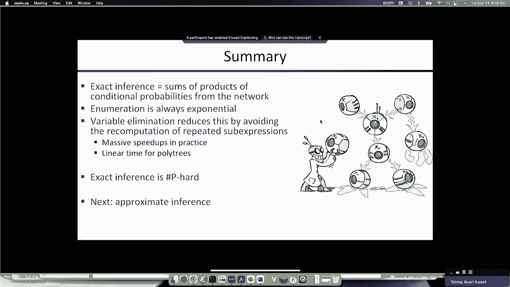

# P18：[CS188 SP23] Lecture 17 - Bayes Nets_ Variable Elimination - 是阿布波多啊 - BV1cc411g7CM

我们有技术，好的，上次我们讨论了Bayes的语法和语义，渔网，以及它们如何被用来，用相对较少的参数以非常自然的方式写出非常复杂的概率分布，即使不是专家也能生成贝叶斯网络结构来描述相当复杂的问题，嗯。

我们还研究了概率推理的一般思想，它包括从联合分布中求和隐藏变量，如果你这么做了，呃，天真地，呃，你需要指数级的时间来做这件事，那么我们能让这更有效率吗，所以今天我要做两件事，我将描述变量消除算法。

这是一个非常简单和简单的算法来实现，它基本上捕捉到了这样一个想法，即在巨大的，我们试图计算的乘积的指数大总和，有很多很多多余的表达式，我们可以消除重复的子表达式，使它变得简单得多，然后。

我将只是最后一部分将是一个简单的证明，事实上，在最坏的情况下，它仍然是指数级的，因为贝叶斯网推理是NP难的，事实上，它甚至比NP硬D更难，所以，这就激发了周四的讲座。

在这里我们将讨论贝叶斯网中的近似推理，使用蒙特卡洛算法，好吧，只是提醒你一下，通过枚举推断的思想是求和隐变量，好的，所以如果我们试图计算某个查询变量的概率，鉴于证据，然后我们求和所有其他变量，变量h。

这是每一个不是查询或证据的变量，我们称这些为联合分布中的隐变量，它有所有的变量，贝叶斯网给你的第一个重要步骤是这种联合分配，而不是用一个巨大的指数级表格来表示，你知道的。

直接列联表可以用条件的乘积隐式表示，你可以从关节中拔出任何入口，只需将联合分布中适当的条件概率项相乘，好吧，如果我想计算入室盗窃的概率，考虑到约翰·科尔斯和玛丽打电话来，然后我总结了地震和报警。

这是联合分布中的两个隐变量，就是全部，然后我将结果归一化，这给了我入室盗窃的后验概率，希望没有问题，因为这就是我们上两节课讲的内容，好的，然后联合分布是相应条件分布的乘积，所以每个变量都有一个。

条件是它的父变量，所有这些数字都直接用贝叶斯网的语法表示，所以它们可以从贝叶斯网的表示中拉出来，这就是我们所说的枚举，而且效率很低，我们会看到一些例子，比如汽车保险网络，如果我记得在车险网做推断。

用这种方法，你最终要做2。27亿次算术运算，对，现在实际上并不多，嗯，它是，你知道几分之一秒，但那是一个相当小的网络，它只有二十多个节点，对呀，喷气发动机诊断，罗克韦尔在90年代建立的模型。

有430多个节点，所以如果你试着对它进行枚举，你会说227次，十对十对六十或七十，将枚举应用于工业规模模型是完全不可行的，嗯，哦，只是为了比较，我的小组为在糟糕的一天监测禁止核试验条约而建立的系统。

地球上有大量地震活动的地方，它产生了超过一百万个随机变量，所以你说的是做推断，这相当于三十五万次推理的10次方，在那个模型中用枚举进行精确的推断，我们如何绕过这个指数乘积和，我们举了一个简单的例子。

如果我有一个像这样的算术表达式，它需要16个乘法和7个广告，但是这里面有很多很多重复的子表达式，比如说，这里有一个x y，那里有一个x y，嗯，如果你聪明，你意识到，事实上。

这个表达式等于一个简单得多的表达式，这非常类似于向后和向前映射，CNF与DNF之间，在布尔表达式中，你也可以这样做，所以如果你这样写，然后你有两个乘法和三个广告和所有重复的子表达式。

IS嵌入到这个更大的表达式中，当你把它相乘的时候，它最终出现了多次，所以如果我们看看我们刚刚写下的表达式，在约翰呼叫和玛丽呼叫正确的情况下，入室盗窃的后验概率，条件概率的乘积之和，如果我们真的实例化了。

这次地震可以是真的也可以是假的，可以是真的也可以是假的，所以这个求和中有四项，好的，所以让我们写出这四个术语，这是一个后退，这对算法设计和研究来说是一个很好的启发式，把简单的具体问题写出来。

然后看着它们说，好的，我怎样才能比暴力方法更聪明地做到这一点，所以当你看这里的实际子表达式时，对呀，你可以看到有很多常见的子表达式，所以黄色的右边，黄色和黄色相配，橙色和橙色很配，蓝色和蓝色相配。

绿色和绿色相配，所以你没有理由做蓝色的事情，蓝色乘法两次或绿色乘法两次，以此类推，所以这里有很多节省计算的机会，所以你可以这样想，嗯，我为什么不嗯，我第一次要做计算，我只是保存结果。

下一次我必须这么做的时候，我已经有结果了，说的方式，所以我不需要做计算，这就是我们要做的，所以说，它实际上只是一个简单的系统实现，缓存子表达式结果的基本思想，然后当您需要重新计算子表达式时，已经有了。

让这种不平凡的东西，你必须写那个算法，它必须适用于任何贝叶斯网，对呀，一个有435个变量和无数连接的贝叶斯网，他们中的一些人有十五个父母，他们中的一些人有八个孩子对吧。

它必须适用于任何贝叶斯网的任何拓扑，这就是事情变得有点难以遵循的地方，但我想如果你，如果你记住我们真正做的只是缓存，重复子表达式的结果，那就不要太吓人了，嗯，所以我们首先要做的是实现这个缓存。

如果你看这个嵌套的求和，对呀，你知道吗，你可能会注意到的第一件事是，哦快看，这里有一个b的p，但b的p不依赖于地震和警报，这样我们就可以把它移到外面，然后我们不必把它加四倍。

我们只需要编辑一次或乘以一次，所以所以实际上，我们要做的是把这些总结中的每一个，尽可能向内，所以所有不依赖于地震变量或警报变量的东西，他搬到外面去了，相应的总和，好的，所以我们可以把地震移到这里。

我们可以把总结移到警报上，因为v的p不依赖于警报，好的，现在我们实际上已经实现了一些简化，然后基本上我们要做的是从，由内而外，对呀，所以我们要做最里面的总结，我们将缓存所有的结果。

然后我们将使用它的缓存结果来进行最外层的求和，然后一直回到外面，所以我们先对a求和，然后再对e求和，现在我们可以把这些按另一个顺序移动对吧，我们本可以尽可能地把E推进去，然后在e上的求和后面推了一个。

事实上，你可以按任何顺序这样做，对吗，总会有结果的，它总是给你正确的答案，但是不同的求和顺序会在计算中给你不同的节省量，所以这里的一个诀窍是弄清楚，什么是总结的好顺序，我们会做对的，你可以，正如我所说。

它们可以按照你想要的任何顺序排列，但这会影响这样做的计算量，在本例中，我们会尽可能地把A搬进去，然后我们把E移进去，所以这意味着我们对第一个求和，然后对e求和，接下来要注意的是，在这个表达式中。

所以我们要先计算这个表达式，然后求和表达式中的A变量，其中一些是数字，事实上，给定a的j的p只是一个数，给a的m的p只是一个数，给定a但p的值，给定b和e实际上是一个向量，因为它的两个值都是b。

所以当我们做这个总结的时候，我们不只是把数字加起来，我们实际上要把向量加起来，或者一般情况下，任意维矩阵，或任意维度的数组，但这并没有让事情变得更复杂，它只是意味着它不是添加它，而不是打电话，另外。

您必须调用一些数组，另外，适当地将数组相加，适当地将数组相乘，所以我们将详细了解它是如何工作的，所以这些数字数组，我们从，然后我们收集，然后我们在乘法和加法的过程中创造新的，一般来说，这些被称为因素。

所以变量消除算法，做运算，我们求和变量和因素，或者我们把因素叠加在一起创造新的因素这些是基本操作，有很多不同种类的因素被创造出来，我可以用两种方法来描述算法，对呀，我可以说，看，忘记因素代表什么。

把它们想象成数字数组，和变量的求和运算，数字数组，或者将这些数组相乘形成新的数组，但实际上在变量消除过程的每一个阶段，它创建的数组实际上具有存在的意义，某些变量的条件概率，给定其他变量，好的。

所以动物园的事实只是向你展示了不同种类的，运行算法时可以创建的不同类型的数组，好的，所以我们已经看到的最简单的一种是联合分布，例如，这是警报和约翰·科尔斯的联合分发，这些是正确的数字。

实际上来自原始贝叶斯网，因为这是一个联合分布，总概率，如果你把数组中的所有数字加起来，他们必须和为一，因为它是一个，它是在这些变量的联合值上的适当概率分布，好的，很明显，变量越多，所以如果你有。

你知道的，a b m的p，比如说，那将是一个三维数组，那将有八个数字，如果你有八个变量，你会有二对八，也就是六十，四个数字等等，所以嗯，因此，随着算法的运行，有时变量集和这些因素变得更大。

随着时间的推移，因素会呈指数级增长，你可能会看到的另一件事是我们所说的投影联合分布，所以其中一个变量有一个特定的值，所以x可能是真的，然后是另一个变量的其他值，你想要这两个值，所以，比如说。

如果我们想到这个分布，警报是真的，那么John调用正确的值是什么，这只是原始联合分布的一个子集，对呀，所以我们基本上只是采取一个，我们正在进行一次大规模的联合分销，然后我们把它投射到一个较低的维度。

只需切开一个特定的案例，所以我们在这里切开，报警属实的情况，所以我们有零点九和零点一，所以这不是一个完全的联合分配权，它不一定要加起来是一个，好的，它的大小是没有特定值的变量的乘积。

所以这里的y仍然是一个自由变量，所以大小是变量的数量，y有x已经有固定值的值数，所以它不会影响数组的大小，好吧，如果你说好，什么是，这个矩阵中的条目的和是多少，嗯，是x和y的y p和，好的，事实上。

直接等于，在数学上总是等价于x的p，所以条目的总和，就会有变量的概率，这些变量确实有值，接下来你可能会看到的是变量的条件分布，给定另一个变量的固定值右，所以约翰报警的概率是真的，这是变量的正确分布。

在调理栏的左边，所以它必须加起来是一个，而一个变量或一组变量的条件分布，给定一些其他变量，那么你就得到了x分布的一个完整条件，对于y的每个可能值，所以如果我们看j的p，那么A的分布为真。

有一个分布给定A是假的，它们中的每一个都是完全条件分布，所以每一个加起来就是一个，这意味着表中条目的总和实际上是，右手边的东西的值数，好的，所以如果这里是布尔值，这意味着这个矩阵中的条目的和是。

所以这些是一些可以在算法运行时显示出来的东西，嗯，但它们都可以表示为数字数组，所以考虑到一些因素，我们需要的第一个运算是一种乘法，但这不是矩阵乘法，它被称为点积，本质上，您正在创建一个新的数组。

其索引是所有变量，你正在倍增的两件事，然后条目只是，两个矩阵对应项的乘积，好的，所以我会在一秒钟内说明这一点，对呀，结果数组或结果因子的变量，或者两个原始因子的变量的并集。

然后每个条目都是相应条目的乘积，假设我有一个因子是这样的，另一个看起来像那样的因素，好的，那么这里有两个变量，有j，有a，那是变量的并集，因此，它的点乘积将是a和j上的一个因子，它是什么因素。

它是什么因素，如果你看这个，这只是产品规则，所以因子实际上是A和J的联合概率，但这里的重点是它是一个数组，其指数是两个因素中的所有变量，你在倍增，好的，所以如果p是这个，如果a的p是第一点，九点。

然后给出a的j的p是对的，这两对条件分布，现在我想知道A和J里有什么，让我们看看是什么促成了，真正真正的入口，好吧，我只是找到了a是a的条目，在这个条目中是真的，我找到a为真的条目，g和j在这里为真。

我把它们相乘，所以我得了零分，九，所以这非常非常简单，但这不是矩阵乘法，对呀，这是一个创建矩阵乘法的点积，如果我拿嗯，如果我取两个矩阵做矩阵乘法，然后我做条目的乘积和，所以这里没有求和。

每个条目都只是两个矩阵中相应条目的乘积，让我们看一个更大的案子，所以如果我用一个j点的p和m的p乘积，那是警报，约翰打电话来，警报和玛丽呼叫，那么得到的产品将有所有三个变量，所以它将是一个三维数组。

它是什么数组，这是一个j m um的p，我如何把这些条目做好，让我们看看这里的这个，所以JM的p是一个二乘二乘二，所以它是一个八入口数组，这里是j为假的情况，所以约翰不打电话，玛丽不打电话。

但警报是真的，所以要得到它，我说，好的，约翰是假的，萨拉姆是真的，所以是零点零一，警报是真的，玛丽是假的，所以是零点三，所以我把零点1乘以零点3，我得到了零点零点三。

它实际上就像三行Python来实现它，非常直接，只是在数组上操作并产生，通常很好，至少与输入数组一样大，有时更大的数组，对此有什么问题吗，这个操作的缺点是它可以生成非常大的数组。

所以如果我用这三个的点积，这三个数组，每个变量都有十个值，所以它们每个都是一个十乘十的数组，那么如果我看这里变量的并集，然后是UV W X，我在这里是紫外线，所以这意味着一个10乘10乘10的数组。

好的，所以我从三百个数字开始，现在我产生一个有一万个数字的数组，好的，所以这里的关键是，我们能不能对总和进行排序，这样这些因素就不会增长得很厉害，非常大，因为如果它们长得太大，我们的空间就要用完了。

对呀，我们要，我们将开始制作数万亿条目的因子，或数以千亿计的条目，算法就会失败，第二个操作是从因子中求和变量，对呀，所以我有一个因素，为了做到这一点，记得最初的表达有地震和警报，嗯。

我们必须将求和运算应用于一个因子，或者做点积的任何因素，当你这么做的时候，因子收缩，所以有点积，可以让它们变得更大，有总结，可以让它们变小，所以如果我把，J约翰从一个J权利的联合发行P打电话。

那么它是a的p，j等于真，带j等于假的a的p，这正好等于a的p，所以现在我已经从二维数组变成了一维数组，或者矢量，这只是显示这些数字，你只要把它们加起来，所以我把数字加起来为真，我把数字加起来是假的。

这就是结果，所以再一次，这就像，甚至两行蟒蛇，基本上是沿着一维折叠数组，把其中的所有数字加起来，然后你把这两件事放在一起，我们得到了向量求和的点积，现在，我们如何从因子的乘积中求和，嗯。

所以它的效率稍微高一点，而不仅仅是做点沼泽产品，然后求和变量，实际上是反过来把这些因素投射到他们的每个人身上，你要求和的东西的每一个值，然后求和得到的乘积，因为这样就没有必要做一个巨大的阵列。

然后再把它折叠起来，最好先折叠单个数组，然后把它们相乘在一起，因为这样你就永远不会得到一个像其他情况下那样大的数组，好的，所以如果我想从这个因子的乘积中总结出一个，我会先把它写成小因素的两个乘积。

A为真的右一个，对呀，就是这些，好的，现在比以前小了，然后这些是A为假的，我做每一个点状产品，然后我对两个大小相同的结果矩阵求和，然后我把它们加在一起，得到一个新的矩阵。

所以这比首先做逐点乘积然后加起来要有效率得多，把结果相加，好的，那么整个算法是如何正确地组合在一起的，所以我们有一个带有查询变量的查询，我们有证据变量，初始因子只是网络中所有的条件分布，对呀。

所以我们只是列出所有条件分布，这些是我们开始的因素，所以只要还有隐藏变量对吧，我们选择一个隐藏变量，h j，我们从所有提到h j的因素的乘积中求出h j，好的，我们不触及根本没有提到H J的因素。

所有权利，我已经告诉过你们如何从因子的乘积中求和一个变量，所以我们只是反复应用这个操作，选择隐变量，从提到它的因素中总结出来，最后，你只需将所有剩余的因素相乘，您将结果规范化，这就是查询的答案。

所以你有三行点明智的产品，两行用来求和，大约四行来实现这个算法，所以大概十十一行蟒蛇，你有贝叶斯网的精确推理算法，好的，所以我将很快地在这个例子中说明它是如何工作的，所以再一次。

我们已经得到了我们的查询入室盗窃，给约翰打电话和玛丽打电话，我们首先列出所有的因素，这些只是网络中的条件分布，它们与证据一起实例化，所以我们只看约翰在的案子，约翰呼叫是真的，玛丽呼叫是真的，对呀。

所以我们得到了那是真的，那是真的，然后我们选择一个变量，假设我们选择求和一个，我们有一个选择，或e，我们选择了第一个，嗯，所以这是提到权利的三个因素，所以这里的这个和这里的这个，别提，所以我们就把它们。

我们要把这三个，我们要总结一下，这些变量的乘积，这就给了我们这个结果表，约翰和玛丽都是真的，但窃贼和地震都是变量，所以这是一个二乘二的数组，这就是我们所拥有的因素列表，我们摆脱了，我们乘以的三个因素。

我们用结果代替它，所以这就是结果，我们已经有了，然后我们重复，现在我们将求和另一个隐藏的变量，也就是地震，既然我们别无选择，我们选择它，现在我们求和这些是条款，这个和这个提到地震的。

所以我们要从这两个因素的乘积中求和出e，这就给了我们这个东西，它现在只是一个双元素向量，因为它又来了，j和m固定于它们的真值，b是变量，所以现在我们只剩下这两个因素了，所以我们把它们相乘并归一化，好的。

所以我们把它们相乘，然后我们正常化，这给了我们答案，我们想要的对，给定m的j的p，好的，所以如果我如果我要这么做，把所有的数字加起来，从所有的矩阵中，并向您展示所有的数字结果，但这让滑梯太乱了。

但你可以用手做看看这实际上给了你正确的开始，所以有什么问题吗，我想这一切都非常非常简单，我觉得很直截了当，好的，嗯，所以正如我提到的，您可以选择任何订单，你想求和隐藏变量，如果你选择了一个好的订单。

那么事情可能会很有效率，如果你选择了一个糟糕的订单，他们可能效率很低，所以如果我们看对了，这又是一个很常见的情况，这是那些天真的贝叶斯模型之一，你有的地方，例如一种疾病和一系列症状，或者你有一类文件。

然后一堆可能出现在这些文件中的词，所以这是一种很常见的贝叶斯网结构，如果你这样点，然后按相反的顺序求和，然后你先把叶子求和，然后再把根求和，你最后做根部，好的，和一般情况下，这对网络来说是个好主意。

具有这种结构的，所以如果你真的做对了数学，那么假设我们试图找到D的P，所以这是查询变量，然后你得把z a b和c求和，好的，所以如果我们把它们，呃在那个在那个顺序，那么z就留在这里。

因为它出现在你可以移动的所有东西中，B你可以搬得更远，C你可以一路移动，好吧，当你跑的时候，然后你要用这种方式进行变量消去，所以我们先求和c然后求和b，然后b然后a然后z，事实证明。

你生成的最大因子永远不会有两个以上的变量，如果你用另一种方式做，如果你给他们点一份B C DZ，现在我们得到了求和表达式，看起来像一个b c z对吧，我们还在计算d的p，所以现在你要结束了，对呀。

如果我在这里对z求和，我将以一个术语结束，对呀，如果我把z求和，我得到了一个包含所有四个变量的因子，a、b、c和d，如果你仔细想想，那么当你对变量z求和时会发生什么，那你就看得很好。

我如何表示ABCD上的联合分布，如果你仔细想想，所有的a b，c和d是通过这样一个事实耦合在一起的，它们将有一个共同的父Z，所以如果我试着画一张CD的贝叶斯网，对呀，然后我添加这些变量的任何顺序。

我最终将不得不把所有的变量完全连接在一起，对呀，所以我最终会有一个完全连接的网络，如果我把z从贝叶斯网中求和，为abcd做一个贝叶斯网，对吧，所以这就是为什么你最终得到了一个包含所有四个变量的因子。

是因为事实上所有四个变量都是相互依赖的，在剩下的四个变量中不再有任何条件独立性，如果你有，如果你有一个天真的贝叶斯模型，有N片叶子，如果你求根，你最终会得到一个大小为2到n的因子，好的。

而如果你把叶子加起来，你的因素永远不会超过两个，所以我们一会儿就会看到，这是一大类网络的一个非常重要的一般性质，所以我说，枚举给了你2。27亿次操作，汽车，保险贝叶斯净额，嗯，我想这是你的要求。

给定所有的蓝色变量，对呀，申请表中提供的所有变量，负债成本是多少，预期，此应用程序的责任费用，当你做变量消除时，只要合理的命令，基本上是自下而上的，那就是二十二万一千，所以你得到了千倍的速度。

即使在这个相当简单的网络上，当你运行变量消除时，当你进行精确推理时，几乎所有存在的精确推理算法都是如此，你可以描述十几种不同的精确推理算法，嗯那个，问题是，如果你想消除重复的计算，通过缓存这些计算结果。

缓存大小将变得非常大，如果你做了很多计算，和很多不同的计算，所以，缓存由您正在积累的这些因素的大小表示，当算法运行时，所以，这真的是对的，你会被最大因素的大小杀死，因为它是空间，通常那会杀了你。

而不是这些算法中的时间，嗯，所以我们已经看到了这一点，我们就可以，我们可以得到，嗯，取决于订购，如果我们做了错误的排序，我们可以得到指数时间算法，或者线性时间算法，如果我们对基网上的那些做了正确的排序。

所以下一个问题是，好，所以让我们找到最优的顺序，订购，这将在最少的计算量中给我们最小的因子，然后这肯定会给我们一个高效的算法，即使有最好的点菜，最坏的情况，运行变量的复杂性。

消除仍然可以在网络表示的大小上呈指数级，好的，这就发生了，你知道通常导致这种复杂性的原因是在很多网络中，有多条路径，它可以让你从一个变量到另一个变量，对呀，以及这些多条路径的存在，不同的因果序列。

其中两个因果序列都影响一些下游变量，当你试图从这种结构中做一些变量时，不可避免地，因素变得非常大，所以为了证明事实上，精确推理没有有效的算法，嗯，我们做所谓的减少。

那么有多少人以前见过证明NP硬度的降低，一些好的，所以你通常会在70分钟内看到它们，然后任何其他理论算法，那么什么是减少呢，对呀，减少是在说，如果我有，解决这个问题的算法，在这种情况下。

如果我有一个求解贝叶斯网推理的算法，我可以用它来解决其他类型的问题，在这种情况下，我们将解决SAT问题，不是用SAT求解器，但是用贝叶斯网推理机，我可以使用集求解器，对不起。

如果我能用贝叶斯网推理算法来解决SAT问题，我们已经知道SAT问题是NP难或NP完全的，这意味着贝叶斯网络推理必须至少和设置的一样难，因为如果不是，那么我就会有一个比现有的更有效的算法来解决这个问题。

这没有任何意义，好的，所以把一个问题减少到另一个问题意味着你正在减少的问题，在这种情况下，我们将set简化为Bayes net推断，这意味着贝叶斯净推断是，至少和你正在减少的问题一样难，那么清楚。

所以现在的问题是好的，我们如何使用贝叶斯网络推理算法来解决SAT问题，这实际上是非常，很容易，这是最简单的，你能找到的NP硬度证明，是因为，事实上，贝叶斯网实际上是布尔表达式的推广，我们是布尔表达式。

一切都是零或一，没有不确定性，所以这些都是确定性的关系，贝叶斯网可以容纳确定性关系，它们还可以容纳概率关系，所以我们所做的就是利用这样一个事实，概率零和概率一表示布尔布尔关系，而且很简单。

所以现在我给你看看建筑对吧，我们如何基本上我们将采取一个固定的表达式，然后我们要做一个贝叶斯网，然后当我们在贝叶斯网上进行推断时，它解决了那个表达式，换句话说，它发现这个表达是否可以满足。

假设我们有一个布尔表达式，变量是w，x，y，z，他们就在那里，好的，所以我们把变量变成网络的根变量，好的，我们给他们每个人分配一个点五的先验概率，好的，我们稍后会看到为什么要这样做。

现在我们有了CNF表达式的子句，所以这里有三个条款，好的，我们将为这些子句中的每一个做一个变量，他们就在那里，c二，c三，然后是条件分布，那么条件概率表是什么，让我们说，和父级是出现在C3中的变量。

所以C3依赖于x，y和z，但不是W，所以它有父母x，y和z，C3的条件分布只是代表了子句权利的定义，所以C3等于x或者y或者不等于z，所以这里的条件表简单地表达了这个函数，所以说，上面写着，比如说。

假设x为真，y为假，z为真，所以如果z=真，也就是说不是，z也是假的，所以我有真或假或假，等于真，所以我简单地把，然后在相应的条目中有一个1，在另一个条目中有一个零，所以说在这种情况下答案是真的。

所以我对每个可能的任务都有一行，所以在那个cp里有八条路，每一行，在相应的条目中会有一个1或一个零，所以基本上只是真值表，现在我们还需要一样东西，也就是句子本身，所以我弄得一团糟。

所以中心本身就是子句的连接词，这是合取范式，毕竟，所以我们又多了一个，呃，哎呀，哦，现在我把我的手指变成了钢笔，那不是我想做的，好的，我想做什么，我想那就是我想做的，是的嗯好吧。

所以现在我们又多了一个变量，它代表句子，CPT总是一样的，这只是从句的连接词，所以它有一个，它有一个权利，s为真的概率，当三个分句都为真时是一个，否则就是零，好的，所以这是另一个，在这种情况下。

会有八个条目，对呀，所以cp中的八行，最后一排有一个，有一个，否则就是零，所以它只是说S是真的，当C，c二，C三个都是真的，所以这些都是确定性条件概率表，但那很好，因为这只是一般条件概率的一个特例。

好的，嗯，所有的权利，所以现在我们已经建立了网络，我们如何使用概率推理算法来计算，如果这个，我们只是问，好的，是s的概率，大于零，为什么这样做是正确的，好的，因为如果不能满足。

那么这意味着我们为w赋值的任何值，x，y和z，如果不能满足，那么这意味着s在所有这些情况下都是假的，对呀，这就是不满足的意思，意思是在每一个可能的世界里，句子都是假的，所以如果反过来，如果s的p大于零。

这意味着必须对根变量进行一些赋值，使s，好的，这正是满足的意思，好的，所以现在只需检查，我用推理算法计算s的p，然后我问s的p是否大于零，如果是，那就可以满足了，好的，这意味着概率推理是NP难的，好的。

因为它至少和NP完全问题一样难，哦，好的，所以是的，所以NP难的定义是，它的意思是，这个问题至少和NP完全问题一样难，好的，什么是NP完全意味着基本上SAT是NP完全的，所以，这是一类问题。

我们预计需要指数时间算法，所以没有，我是说，我们没有证明NP完全需要指数时间算法，但尽管尝试了，从来没有人发现过NP完全问题，对于一个多边形存在亚指数算法，存在一个多项式时间算法。

所以我们已经证明了概率推断是，至少和坐在右边一样难决定，CNF表达式的可满足性，这就是典型的NP完全问题，和NP完全意味着几乎肯定是指数，在最坏的情况下，最有效的算法是指数时间算法，还有更坏的消息。

因为实际上概率推理可以做得更多，对吧，不仅仅是检查，如果大于零，如果你仔细想想，如：It’一切都好的可能性有多大，使根变量为真的每个赋值，这将有助于分配权的概率，不是向右N点5。

它将对n的概率贡献零点五，这是真的，所以如果有k个赋值使s为真，这意味着s的概率正好是k，乘以零点五的n，因为我可以用推理算法计算s的p，我可以很容易地除以零点五的n，那么概率推断告诉我k。

CNF表达式的满意赋值数，所以计算满意作业的数量就更难了，这就是所谓的数p完全问题，严格来说，它是一个比坐着更复杂的类，所以我们期望，事实上，做概率推理会比解决SAT问题更难，不是，我们不指望它同样难。

我们预计它会更难，因为这是一个严格意义上更难的问题，特别是，这类数字，P难问题比NP问题更难近似，再说一遍，我们没有这些事情的严格证据，但这是复杂性理论家根据他们的工作所相信的，幸运的是，有一些好消息。

有一个相当大的算法类，为此抱歉，相当大的一类贝叶斯网，对它的推理是线性的，那么多，许多网络，虽然他们不是这个班的，用少量的计算量就可以变成满足这一点的网络，所以这些网络被称为多树，和一棵聚树。

最简单的描述方式是，它是一个有向图，没有无向循环，所以如果你把图表上的箭头都去掉，图中会有循环吗，那么其中哪一个不是聚树，右下角，好，是啊，是啊，所以这是一个，那是一个循环，如果我拿了钩子，箭掉了。

那么我将在这四个节点之间有一个循环，好的，所以这不是一棵聚树，我们看起来很困惑，为什么，嗯，这是一个循环，因为如果我把箭取下来，我可以绕着圆圈走，这将是一个循环，好的，如此无方向意味着。

如果你把箭取下来，你只是让他们成为非定向链接，那么这里就会有一个循环，但当你看到那个，你会说好，嗯，假设我知道这里这个变量的值，然后考虑到下面的这两个变量，那两个就独立了，这样循环就会消失。

所以如果我有那个变量的值，循环就会消失，所以这意味着，我可以简单地执行以下算法，我在那个变量为真的情况下解它，一旦这个变量为真，然后它就变成了一棵聚树，所以是线性时间，然后我解决了变量为假的情况。

这让它道歉，所以再一次，这是线性时间，所以现在我有一个简单的算法，我花的钱是解决子网络的两倍，但我已经减少了，对，所以如果它几乎是一棵聚树，对，如果它有少量的循环，然后我可以实例化少量的变量，称为割集。

它切断了所有这些循环，然后总的解决时间正好是，所以在割集中变量的数量是指数级的，但在剩余变量的数量上是线性的，所以这比指数和变量的总数要好得多，好的，如此如此，如果它几乎是一个多树。

然后有一个几乎是线性的算法，好的，那真是太好了，是的，所以即使多树可能相当罕见，有很多，很多，现实世界中的许多真实网络，几乎是多聚树，就在你能去的地方，通过实例化少量变量的值，你可以切断这些循环。

然后使用多树推理算法，这是另一种精确推断的方法，就是所谓的切集调理，在那里你切断循环，然后解决剩余的结果多边形树，哦，我们提前结束了，那很好，所有的权利，所以总结一下我所说的话。

精确推理就是计算网络中参数的乘积之和，如果您进行枚举，这总是一个指数大的乘积总和，那很贵，试图减少这种情况，通过缓存大量乘积中重复子表达式的值，当你知道，即使对于小网络来说，我告诉过你那是千倍的速度。

对于车险网络，对于更大的网络，这样做通常还是很实际的，你知道与枚举相比，速度加快了，你知道可以，你知道，十到二十，比做枚举快十倍到三十倍，在聚树上，变量消除总是线性时间，如果你自下而上。

但在最坏的情况下，精确推理是数p硬，顺便说一句，如果你是理论教授告诉你这个发音是尖锐的p hard，他其实错了，我不知道它发生在哪里，但你可以回去看看早期的报纸，事实上，加里·约翰逊是复杂性理论的圣经。

从二十世纪七十年代这种东西被发明的时候，加里·约翰逊说发音为P，但出于某种原因，在理论界，他们没有读这本书，他们在某个地方的屏幕上看到了，他们说，哦，那是个明显的迹象，所以他们叫它尖梨。

但实际上他们错了，它真的叫数字皮哈德，还行，所以复杂性的结果表明我们可能需要开发，近似推理算法，所以下次我们会看到基于蒙特卡洛采样的算法，它可以处理算法，所以说，比如说，是监测世界核爆炸的算法。

正如我说的，它可以，它可以生成具有一百万个变量的模型，但它使用蒙特卡洛采样，实际上在没有GPU的笔记本电脑上运行，它在整个星球上实时运行，因为这些蒙特卡洛采样算法可能非常，非常高效。

我们还将看到有一个非常实际的，a，非常接近，蒙特卡洛采样算法之间的联系，以及我们在本学期早些时候看到的模拟退火算法，事实上，类似于跪是一个马尔可夫链蒙特卡罗算法的例子，对我今天所说的话有什么问题吗。

我想一切都很清楚，好，今天有两条有趣的消息，GPT 4发布，它在大约18个月前发布时引起了巨大的愤怒，我觉得，嗯，他们声称它比聊天GPT更可靠，很容易说完全是垃圾，嗯，但我们走着瞧，事实证明。

chi BT是基于GPT 4的，这是另一个有趣的事实，我们了解到，真正有GBT是GPT已经，所以他们没有告诉别人就把它放了，这是，这真的是DPD，嗯，第二件事是微软解雇了人工智能对社会团队的全部影响。

所以你去那里，所以说，我想这意味着坏人赢了。

好的，所有的权利，星期四见，他会取代程序员之类的人。

