# P22：[CS188 SP23] Lecture 21 - Dynamic Bayes Nets and Particle Filters - 是阿布波多啊 - BV1cc411g7CM

我想是的，好的，我想我们不妨开始，我希望你们都有一个愉快的春假，嗯，我花了我的飞行到新加坡和回来，用于，呃，实际上是一个很有趣的伯克利筹款活动，和所有来自东南亚的校友，这是我第一次来新加坡。

所以不管怎样都很酷，嗯，上次我们讲到马尔可夫模型和隐马尔可夫模型，向前和向后推理，维特比算法，所有这些都是各种精确推断的方法，你可以在隐马尔可夫模型中做到这一点，今天，我们要扩大一点规模。

开始谈论更大的系统，这些系统非常困难，甚至不可能在隐马尔可夫模型中表示，然后当我们这样做的时候，我们会发现那些精确的推理算法是难以解决的，我们必须想出一些近似算法，就像我们开发贝叶斯网时所做的那样。

但是我们将有一个不同的算法，叫做粒子过滤器，这实际上引入了一个全新的想法，叫做重采样，我们以前没见过的。

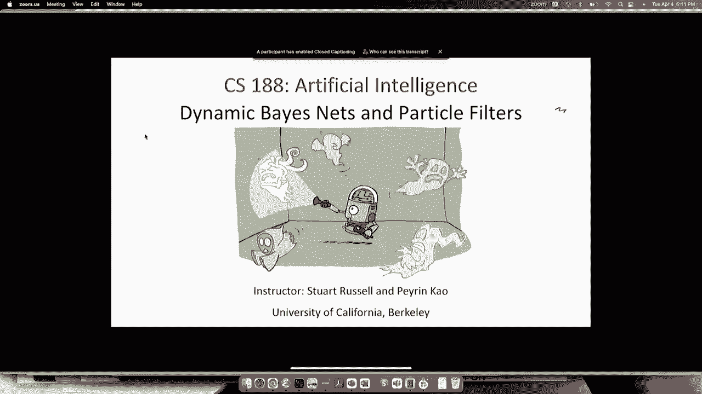

所有的权利，所以说，让我们从思考如何。

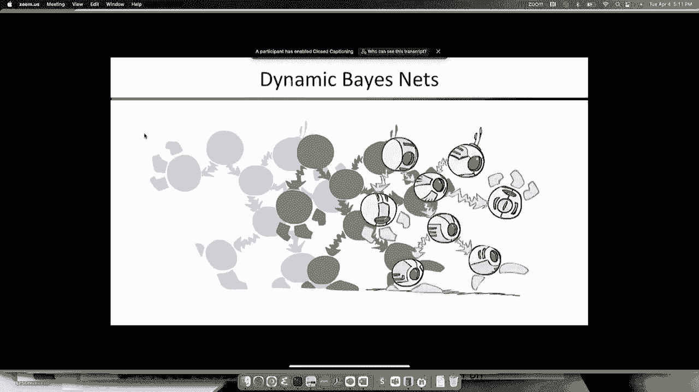

我们要建立模型，它代表了一个随着时间的推移而演变的系统，除了与我们之前看到的隐马尔可夫模型和马尔可夫模型不同，其中只有一个状态变量，如果我们想有多个状态变量，也许还有多个证据来源，好的。

所以不需要火箭科学家，鉴于你已经知道的权利，你可能会明白这一点，你知道，嗯是每一步一次一个状态变量，那么为什么我们不在每个时间步长中有几个状态变量呢，并将它们连接成一个小贝叶斯网。

然后对所有的时间戳复制它，所以这就是我们要做的，嗯，就像在嗯，其中状态变量的父变量是，动态贝叶斯网中上一个时间步长的状态变量，任何状态变量都可以有任何其他状态变量，在同一时间步长或上一个时间步长中。

所以我应该说在时间t减去一个和t，只是给你们一个例子，你们应该在上一节课中已经熟悉了，也来自项目权，如果我们试图跟踪多个鬼魂，我们有声纳测量，这给了你到每个鬼魂的估计距离，所以我们有鬼魂a和b。

在时间一，我们有测量这些鬼魂离我们有多远，如果你记得嘈杂的测量，它们不是精确的尺寸，所以它们基本上给出了你在位置上的后部分布，给定的距离测量是在那个大致方向上的云，嗯，你有，如果我们有两个鬼。

我们会有两个状态变量，每个鬼位一个，好的，我们不能观察鬼魂的位置，所以这些都是隐变量，但我们得到了鬼魂大致在哪里的测量，那么我们下一步，我们只是把变量复制到，所以我们现在有了幽灵A在时间二的位置。

B在时间二的位置，然后我们必须添加父变量，所以很明显，鬼魂在时间二的位置取决于它在时间一的位置，这里的条件分布，对呀，条件概率表描述了那个特定幽灵的运动，所以如果那个鬼魂均匀地随机移动。

那么这将是一个均匀随机的CPT，如果在示例中，我们会看到鬼魂顺时针绕着世界旋转，所以这往往会，它会根据CPT顺时针移动，好的，您可以有任何额外的依赖项，所以在这个特殊的模型中，鬼，鬼A在时间二的位置。

也取决于幽灵B在时间1的位置，所以，比如说，a可能远离b，然后你知道Go B可能会试着跟随Go Day，比如说，然后你会得到一个看起来有点像这样的结构，然后嗯，你再把它复制到第三个时间和第四个时间。

以此类推，所以你基本上有这个半无限隐式贝叶斯，永远延伸的网，但是嗯，你不需要永远建造，对呀，您只需要构造到时间步长，你有证据之后就没有证据了，所以我们不需要构建网络的其余部分，除非我们在预测未来，嗯。

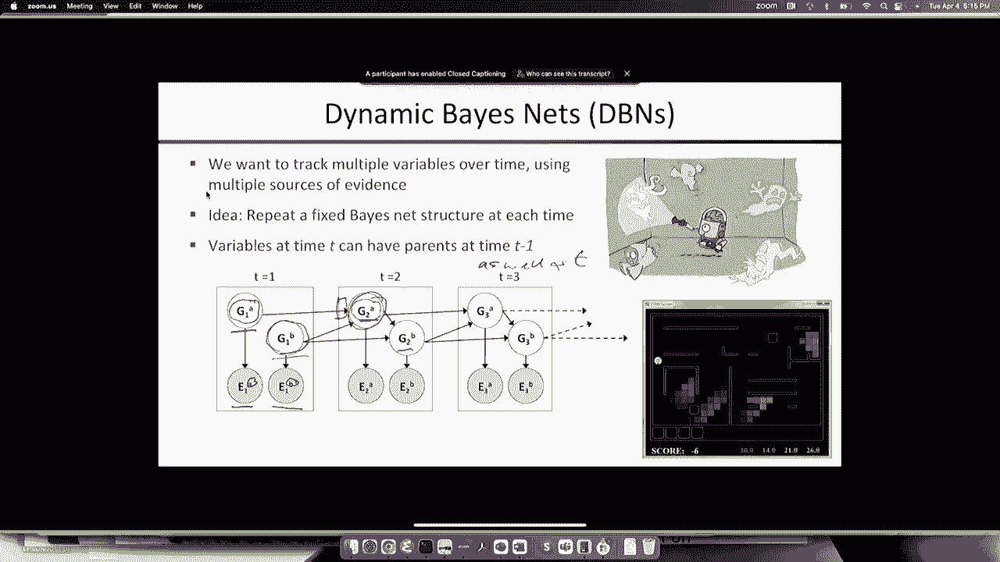

所以说，如果那是你的网络，对呀，嗯，你可以做的一件事是，问问自己，好的，我可以转换这个吗，你知道我已经有了嗯机器，你知道吗，我能把这个转换成嗯吗，或者如果我有动态贝叶斯网机械。

我可以把HMMS转换成动态贝叶斯网吗，并使用动态贝叶斯网机械，所以很明显是对的，每个隐马尔可夫模型都是一个动态贝叶斯网，只是一个只有一个状态变量的动态贝叶斯网，好的，所以这很好，但也是这样。

每个离散动态贝叶斯网络都可以转换为完全等效的隐马尔可夫模型，对呀，所以你只要取动态网络贝叶斯网络的状态变量，例如两个幽灵位置，你只要把它们折叠成一个变量，它的范围是正确的。

那个变量的可能值只是两个幽灵的位置对，对呀，所以现在的范围，是…的笛卡尔积，动态贝叶斯网的各个状态变量的范围，所以让我来说明一下，所以假设我有，一些布尔状态变量，这里我有一个动态贝叶斯网。

有三个布尔状态变量，x y和z，所以它们对XT有一个条件分布，加上一个给定的xt，由这个表示，条件概率表，Y通过这个，Z在那个旁边，请注意，在这个动态贝叶斯网右，这三个变量是相互独立发展的，对呀。

所以你知道可能会有一个，你知道吗，在Y城，在Z城，这些是相互独立的，你知道的，去拿三明治，去和某人说话他的状态改变了，但这与另一个可能在做什么无关，所以现在如果我有那些布尔变量，我想构造嗯。

那么我的状态变量嗯基本上是三个，对呀，所以现在这三个布尔变量，所以嗯，值可能是，你知道的，零零零零，零一零一零，等等，所以每个状态变量有八个值，好的，然后转移矩阵会是什么样子。

现在我有一个8值的变量和一个8值的父变量，所以我会得到一个八乘八的条件概率表，对呀，所以这是，你知道的，64个条目，而在这里，我们只有12个，对如果我们，如果我们记住归一化约束，它们必须和为1。

这将是63个条目，因为一旦你认识了其中的63个，你知道64是1减去所有其他的，对呀，这些表中的每一个都是A是两个概率，对呀，所以实际上下降到六个，所以我们有十倍或十倍以上，在代表的大小上爆炸。

当我们从动态贝叶斯网到马尔可夫模型时，特别是，好吧，如果你是，如果你想学这个，您正在观察的系统的转换模型，系统具有结构权，系统实际上是由多个状态变量组成的，如果你用的是嗯算法，你会得到大量的参数。

你要花很长时间才能学会所有这些参数，而如果你实际上表示了系统的结构，然后你只是学习相对较小的条件概率表，就你需要学习的数据而言，你会更有效率，所以这是一个财产，也适用于，你知道的，贝叶斯网。

如果你还记得，只要贝叶斯网中的每个变量都有一定数量的父级，贝叶斯网的表示大小在状态变量的数量上是线性的，而如果你建立了列联表，老式的统计做事方式，你会看到一个指数级的大表示，所以给你一些数字。

如果我有20个布尔状态变量，这是一个相当小的系统，好吧，我们走着瞧，我会在一些例子中给出一些大致如此大小的系统，但有很多更大的，我想火星探测器上的健康监测系统，有410个状态变量，对呀，代表，你知道的。

整个系统的状况，发动机，电池，传感器，太阳能电池板，这个系统的所有不同部分，船上有一个动态贝叶斯网，可以跟踪一切，并能弄清楚是否有什么事情看起来很奇怪，对呀，什么必须什么是错的，对呀。

所以它基本上通过在贝叶斯网络中进行推断来诊断自己，所以如果我们限制这个，所以每人最多三个父母，然后你会有大约二十次，八个或一百六十个参数，你的隐马尔可夫模型将是状态空间的平方。

所以状态空间是二的二十分之一，然后是它的平方来制作转移矩阵，所以你有两到四十，大约是一万亿个参数，对呀，所以万亿参数是GBT4的大小，对呀，它的成本，嗯，你知道的。

谁知道有多少数千万或数亿美元来训练这个系统，而在这里你知道一百六十个参数，这会让你付出代价的，你知道十分之一便士，对呀，这将需要，你知道几百个例子而不是几千亿个例子来训练，所以这真的很重要。

你试图捕捉你所做的事情的子结构，您正在用您的系统建模，所以如果你，如果你斜视得很远，如果你站得离GPT 4这样的系统足够远对吧，它们是用一层神经网络节点来表示状态的。

我们将在后面的课程中更多地解释这到底是什么意思，但你可以想到每一个神经网络节点，在大变压器模型的一层中，万亿参数模型就像分离的状态变量，所以，它在某种程度上分解了文本的过渡模型，转换成一组状态变量。

这些状态变量表示一种隐藏状态，就像我们到底在说什么，哦，你知道的，我们在谈论一场棒球比赛，一个人在击球，另一个人在投球，我们在第三局，对呀，这些都是单独的状态变量，对于文本中描述的一些过程。

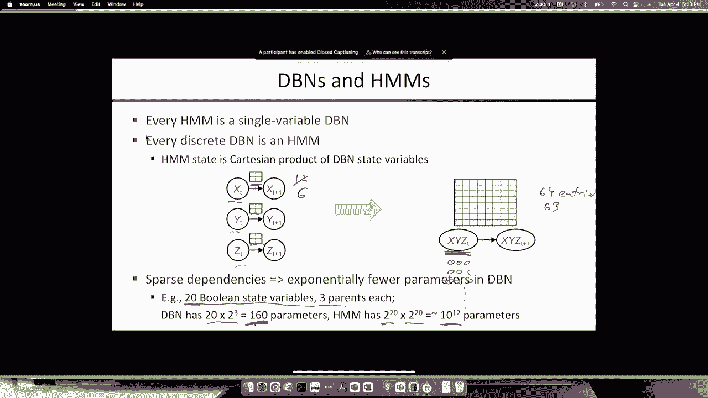

所以下一个问题DBN非常适合表示复杂的过程，我们怎样才能做好推理，你可能首先想到的是好的，我们就创造那个大贝叶斯网，通过复制每个时间步长，现在我们有了，你知道一个贝叶斯网，有八个、十二个或一百五十个。

一次步，那是贝叶斯网，所以我们就在上面运行我们的贝叶斯网络推理算法，所以你可以做变量消除，比如说，所以我刚才描述的是一种离线方法，所以你在修复你拥有的数据量，然后创建这个展开的副本。

所以你复制了很多时间步长，来搭建这个大贝叶斯网，然后你跑，然后运行变量消除，或任何其他精确算法，或者实际上网络上的任何近似算法，通常你对过滤感兴趣，记住，这是状态估计或滤波，计算最后一个时间步长的分布。

鉴于到目前为止的所有证据，好的，所以那很好，你觉得怎么样，它的时间复杂度是观察序列长度的函数，所以记住我刚才告诉你的事实，每个DBN都是一个嗯，记住嗯推理的时间复杂度是长度的函数，对呀，它是线性的。

所以我可以把它转换成嗯，不管那个状态空间有多大，所以它会放大状态空间的大小，但就资本而言，这是这个算法是正确的顺序，所以它在序列的长度上是线性的，所以这似乎是对的，好的。

但如果我现在得到另一个时间步长呢，现在我的序列是长度t，加上一个，我把另一个时间步长的副本添加到贝叶斯网，我再次运行变量消除算法，那要花多长时间，好吧，那就需要，呜呜，我不是故意那样做的，那会很好的。

我是，我是T加一的顺序，然后T加二的顺序，好吧，如果我不得不再做一次，每次一个新的观察到达，总共要做多少工作？如果我做对了，从t等于零开始，然后把每一个时间步加起来，这将是正确的。

所以如果我把所有这些加起来，它将是T的平方的顺序，所以离线的方法也可以，如果我要得到的所有数据都已经在这里了，对呀，所以我在看，你知道，昨天的测量，比如说，我只是把昨天的所有数据，我知道发生了什么。

好的，那是一个，这是一个非常好的方法，但如果我试图在新数据进来的情况下这样做，我不能让网络越做越大，并重新运行精确的推理，每次一个新的观察到达，因为随着时间的推移，它只是变得越来越贵。

所以这是没有希望的，所以在线的方法，嗯，我们对HMMS过滤算法所做的一个版本，换句话说，1。我们有这个数量的记录，我们用它来计算t加1右的量，所以我们基本上做一个递归更新，嗯，从筛选器消息，对呀。

时间t的状态估计分布，我们得到了新的观察，所以我们做一个预测，我们对观察进行更新，现在，我们有新的，时间t加一的新分布，所以你可以这么做，您可以制作一个这样工作的变量消除版本，你基本上消除了。

您运行变量消除，所以你消除了旧的时间步骤，然后在新的时间步长中留下所有的概率，现在你拿着，然后再加上一个时间步长，你去掉旧的，现在你把新的弄对了，所以在概念上很简单，问题是当你做对的时候。

因子最终增长到包括给定时间步长中的所有状态变量，所以当你运行消除过程时，什么是一个很好的稀疏贝叶斯网，所有变量都分开，最终，所有的东西都被关联到一个巨大的因子中，这个因子包含了所有的状态变量，和。

事实上，前一个时间步长的一些状态变量，如此如此，事实上，在贝叶斯网中使用变量消除的精确推理最终是指数的，在每次更新的每个时间步中状态变量的数量中，所以这最终已经很绝望了，其实你，如果你要那样做。

效率还是比较高的，对呀，实际上是2除以um n加k对吧，所以如果在给定的时间步长中有n个状态变量，K是前一个时间步的最大父母数，那么你最终会得到一个大小因子，n加k个变量。

所以这个因子的大小是2的n加k，而隐马尔可夫模型，是n的二次方加n对，因为你得到了一个很大的方阵，它的大小，那个正方形的边是n的2，因为那是个数字，抱歉，打扰一下，那是州的数目。

所以你得到了推理成本的指数级提高，在嗯，但当你开始转向大型系统时，它仍然不能很好地扩展，对于410个状态变量，你不可能做到这一点。

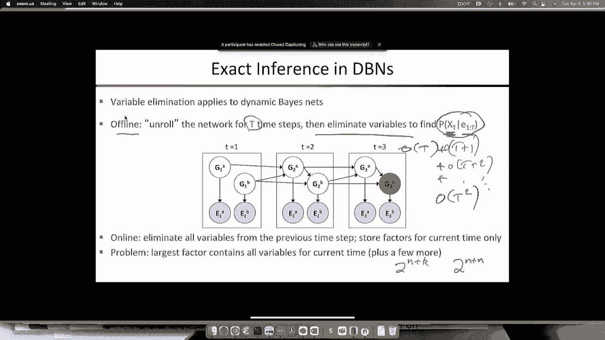

在火星探测器上，所以我就举例说明，嗯，应用程序那么这是什么，有人知道那是什么吗，有人坐过这种车吗？嗯，你可能在其中一个，但你可能不记得了，好的，这是儿科重症监护室，好的，那里有个婴儿。

我就在婴儿周围画一个圈，这是一个身体不太好的婴儿，所以这个重症监护室是为了让婴儿活着而设计的，基本上你在重症监护室，如果你病得这么厉害，你的身体不能在适当的价值范围内维持自己，可能是呼吸频率，心率。

体温，血液氧合，一大堆必须保持在正确范围内的东西，否则你就死定了，好的，当你的身体不能做到这一点，重症监护室正在为你做这件事，好的，所以嗯，这现在是一个非常非常成熟的做法，你知道，非常早产的婴儿。

谁会有一个，你知道，百分之九十九的死亡率，50年前现在有5%的死亡率，所以它非常有效，嗯，与婴儿相连，或者所有这些所有这些盒子对吧，这些盒子中的每一个都是连接到婴儿的传感器的显示器。

在某种程度上他们中的一些人在测量血氧，他们中的一些人正在测量心率，其中一些测量空气的体积，婴儿在呼吸机上吸气和呼气，等等等等等等，就在那里，一直在进行大量的测量，对呀，所以这些是证据变量。

通常大约有三四十个，然后状态变量基本上是婴儿的状态，其中包括好的，婴儿的实际心率是多少，不是测量的心率是多少，实际心率是多少，对呀，实际血压是多少，实际的血氧合是多少，颅内压，颅内压。

所以如果有时候婴儿头部受伤，其实对成年人来说也是如此，很多人头部受伤，你死于头部受伤的方式，通常你会受到颅压的影响，你头盖骨内的压力上升，因为你的大脑在擦伤时会肿胀，这种压力阻止氧气到达脑组织。

当你撞到头的时候，你就是这样死的，你做了很多工作来测量压力，看看你能不能把它放在安全的地方，安全范围，有时你得把头盖骨里的液体排出，在人们的头上钻孔，所以这有点复杂，这里正在进行的管道。

但这真的真的很重要，我实际上花了三年时间在神经外科做兼职教授，做这个，这张照片是我的一个同事拍的，所以这只是总结了我刚才说的话，所以系统的状态是描述病人生理状态的变量，我们会看到，我们还必须有描述。

测量设备本身的状态，因为测量设备实际上也有自己的状态，你必须建模，所以证据将是你从所有不同的监控设备中获得的所有值，我一会儿就给你看一些，嗯，过渡模式是什么，嗯。

生理动力学是你身体的状态变量如何随着时间的推移而进化，如果你现在的心率是62，那么在一秒钟的时间里，它将非常接近62，如果你突然开始锻炼，它会开始上升，所以它可能会达到63或64，在一分钟的时间里。

它可能会达到150，对呀，所以过渡模型描述了，这可能取决于，你知道的，你当时在锻炼吗，可能取决于其他事情，比如什么样的，所以有一些药物可以改变人们的心率，但也不是立即，但它会随着时间的推移而变化，嗯。

然后传感器动力学，你知道的就是心电图导联对吧，所以测量心脏电活动的东西，右边是粘在你胸前的，有时那些东西会掉下来，如果你咳嗽，或者如果你翻身，你把引线扯掉，所以你想知道铅实际上是连接到你的身体上的。

对呀，这是传感器设备本身的状态变量，传感器不会告诉你它粘在身体上了，或者不对，你必须从测量和其他测量中找出，从其他传感器设备，一个给定的传感器是否脱落了给你完全虚假的答案，什么的，好的。

你关心的基本上是病理生理学的状态变量，对呀，意思是坏事发生了，嗯，你知道的，你的颅内压很高，你有内出血，你得了败血症，意味着一种全身细菌感染，对呼吸机造成的肺损伤的反应，等等等等。

所以在重症监护室里很多不同的事情都出了问题，你甚至可以在重症监护室患上糖尿病，只是因为他们一直在喂你糖，所以各种事情都出了问题。

所以这里有一个非常，一个非常简单的例子，动态贝叶斯网在这种情况下会是什么样子，它实际上过于简化了，因为我们实际上错过了，我们漏掉了一些重要的弧线，也许你可以找出这个模型中缺少的弧线，嗯，所以状态变量是。

嗯，比如病人的真实心率，当时病人的实际跳动率是多少，um还将包括，你知道的，病人的运动将是另一个状态变量，然后我们有传感器变量，对呀，所以这些是被测量的东西，所以说，e c，g，HR是心电图，HR。

那是粘在你身上的引线，测量心脏电活动，还有心跳过速，所以Plath或plethis mogram是粘在手指上的一个小东西，它测量血氧合，它还通过血液的脉动来测量心率，它通过将光线反射到你的皮肤中来观察。

所以你可以从这两种不同的设备中得到两种不同的心率测量，嗯，SPO二是血液的氧合，基本上，然后你有传感器状态变量，所以解放军可能会从你的手指上掉下来，否则心电图导线可能会从你的身体上脱落，好的。

耐心的移动导致，你知道这对铅脱落的概率有影响，或者平台掉了，好的，这些是传感器的状态变量，然后这个特定的病人可能有一个潜在的属性，对呀，这个病人的静息心率是多少？这些实际上差异很大。

如果你是马拉松运动员，你的静息心率可能低至50，对呀，大多数人，在六十岁到七十岁之间，我们会看到我们的实验对象实际上有80的心率，静息心率80，他不知道，尽管他是个医生，所以他然后他去看了看。

为什么我的静息心率是80，所以好吧，所以基本的想法是我们要正确地观察这些东西，这些都是衡量的东西，然后我们要对其他东西进行推断，所以我们想从这些字面上的数字中找出，你知道的，有一根导线掉了吗。

抗辩失败了吗，真实的心率是多少，根据我们得到的测量，静息心率是多少，所以这显示了推理的结果，哦，顺便说一句，对呀，什么，这个图中缺少什么弧，有人能弄明白吗，所以其中一个状态变量缺少它的一个父变量。

完全正确是的，完全正确，我不知道为什么我们忘了把它放进去，但是是的，所以心率，如果病人开始四处走动，那就会提高病人的心率，这也使你更有可能敲掉引线等等。

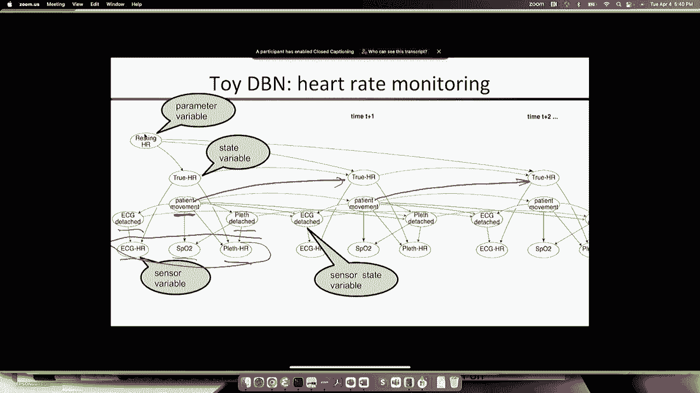

嗯好吧。

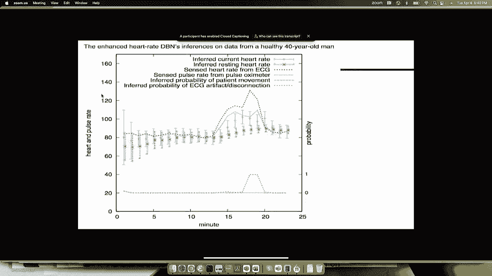

所以这是病人，他的名字叫诺姆，他当时是我的研究生，他也是一名执业麻醉师，所以他实际上我们不需要人类受试者，因为他这样对自己，所以这显示了发生了什么，对呀，所以我们在这里绘制后验分布，对呀，所以那是。

你知道，表示为范围，但基本上是正态分布，但那是置信区间，推断当前心率是红色条，推断的静息心率是点缀的绿色条，所以你可以看到我们从一个信念开始，这个病人的静息心率大多在5，二八十四，对呀。

这对人们来说是正常的范围，嗯，但是我们还没有从心率测量中得到任何数据，所以目前的心率可能是，你知道的，在更宽的地方，可能在50到110之间，如果你只是随机选择一个病人，并在他们身上贴上测量值，就在那时。

你会期望数字出来，然后我们开始获得测量数据两个心率设备的测量数据，的，我们有蓝色的，也就是心电图心率，这就是这里的东西，然后是上面的粉红色虚线，是脉搏血氧仪，是情节的另一个名称，这是另一个心率测量。

所以你可以在早期阶段看到，两个心率测量装置对吧，他们意见一致，准确地说，好的，当我们开始得到这些测量，我们的信仰分布在井中，真实的心率开始大大缩小，我们所观察到的，好的。

我们也开始认为正常静息心率高于平均水平，好的，所以我们，我们已经准备好了，绿色分布上升到平均80左右，好的，然后我们让诺姆开始，你知道吗，基本上是在床上跳霹雳舞，然后他的心率上升，我想心电图掉了。

它开始发出更高的频率，心率数字比它应该的要多，它仍然，即使它掉下来，它还在探测一些，一些电活动非常不准确，它不能正确地将它分解成不同的心跳，所以你会得到错误的数字，所以它从粉红色的线发散，所以在这里。

我们看到，心电图断开的概率有多大，你看到了，就像那是17分钟，或者它认为实际上心电图可能已经脱落了，然后它停止注意恰到好处，我们不必写一个特殊的算法来停止关注，仅仅通过做概率推断，如果你觉得它掉了。

那么你不认为读数代表了真实的心率，所以从平台上读数会自动被注意到，心电图的读数将被自动忽略，所以我们可以建立一个非常强大的系统，因为它有多个传感器，它可以找出哪一个是错的，并注意哪一个是对的。

因为我们忽略了从病人运动到心率的联系，对呀，底部的绿线是病人移动的概率，就是这个对，你可以看到它没有改变，而我们应该推断，因为心率很高，病人可能在移动，因为心电图是分离的，或者至少看起来是分离的。

然后病人几乎可以肯定地移动了很多对，因为我们没有把那个链接放进去，我们实际上对病人的运动没有很强的推断。

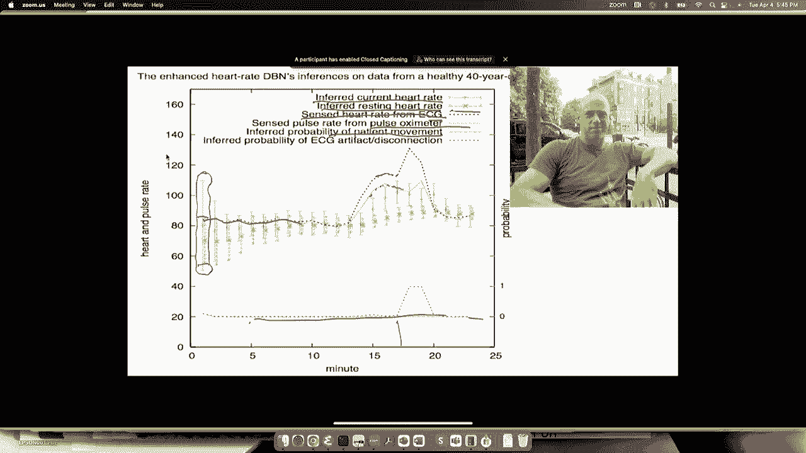

这是真实的数据，是玩具数据，就这三个测量值，这是重症监护室的真实数据，这显示了16个小时的数据和大约40个不同的变量，最上面的是心率和血压，中间的是各种类型的血氧测量，动脉和腔静脉。

也就是将所有血液倒入心脏的大静脉，um和颅内压，底部所有的都是呼吸机的测量结果，所以你知道，你呼出多少二氧化碳，音量是多少？把空气抽进肺里有多难，那么你的肺在抵抗时有多僵硬，被充气等等，嗯。

所以有趣的是，你在这个尺度上看到的几乎所有东西，对呀，所有这些大起大落，还有那些大尖刺，诸如此类的事情，那都是人工制品，这些都不是发生在病人身上的真实生理事件，对呀，所以所以这里，比如说，对呀。

根据这个，病人的血压正在飙升，右边是两百，有些是对的，在你知道的地方，你会是那种明亮的紫色和，在这种情况下开始膨胀这种血压，嗯，但那是人工制品，对呀，重症监护室里还有别的事，这导致这些测量不能反映。

生理学上到底发生了什么，所以如果你不了解这些文物以及它们是如何发生的，你看看这个数据，你会对发生的事情完全困惑，好的，所以我们需要对测量过程进行适当的建模，以及这些测量是如何被发生的各种事情破坏的。

比如下面，对了，这条橙色的线是肺顺应性，这就是你的肺有多僵硬，当你试图把空气抽进去的时候，如果你认真对待这一点，你的肺突然变得非常僵硬，这表明你有非常严重的肺损伤，这确实发生在重症监护室，但一旦发生。

你的肺保持僵硬对吧，我不会僵硬五分钟后就不再僵硬了，好的，所以这几乎可以肯定是一件艺术品，可能是病人在咳嗽，和所谓的颠簸呼吸机，意思是你，自主神经系统不喜欢，一根巨大的管子插进你的肺里。

所以它不断地试图摆脱它，通过试图复制它，所以这可能就是那里发生的事情，这导致了测量的怪异。

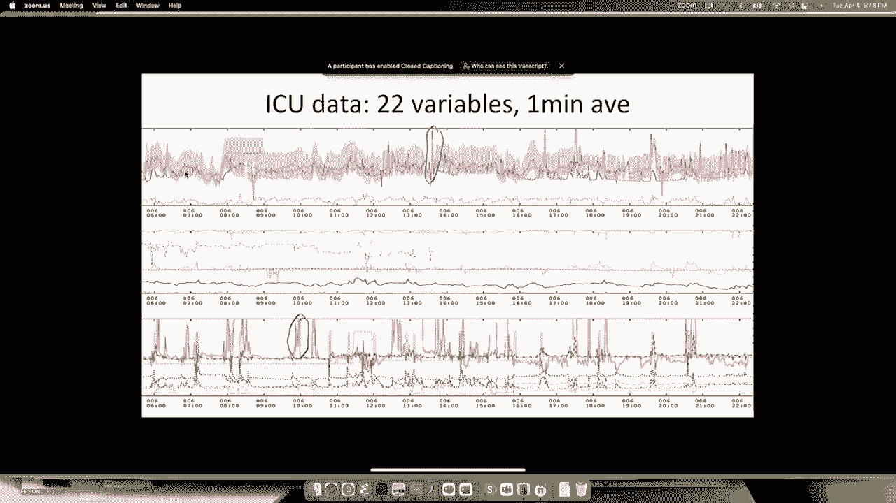

嗯，只是出于兴趣，对呀，这些是病人在重症监护室期间对他们进行的药物管理，所以有连续的药品管理局，这里的这些东西是通过点滴，然后是药品管理局，每一个都是在某个时间点注射了某种药物。

所以这个病人有大约30种不同的药物，在重症监护室给他们注射的药物，重症监护室里实际上有一千多种不同的药物来维持人们的生命，嗯还有这个，这个特殊的情节，其实，就是，ICU第一次。

医生们看到了他们给病人服用的所有药物的完整展示，所以奇怪的是，没有软件可以做到这一点，医生不知道如何使用独木舟地块，所以我们只是写了一堆新的情节脚本来创建这个，这是他们第一次看到一个病人的所有药物管理。

他们一看到这个，他们去了，我的天啊，这对你来说有点难，他们为什么去，我的天啊，对呀，但他们立刻看到，因为他们服用了越来越多的药物，使病人瘫痪，为了阻止病人咳出呼吸机，防止病人拔掉导线或伤害自己。

因为他们都是无意识的，但他们经常打来打去，所以你让病人瘫痪，当病人时，病人的动作和面部表情不再表现出疼痛，因为护士们没有看到任何疼痛的迹象，他们停下来，所以你在麻痹病人，但他们会遭受强烈的疼痛，我是说。

它是，你知道这很痛苦，他们在重症监护室对你做了什么，你的头也受了重伤，所以他们一看到这个展示，他们说，我的天啊，我们必须改变方式，我们在重症监护室做疼痛管理，因为我们是，我们没有使用疼痛管理。

一旦我们使病人瘫痪，如此如此，即使病人大多昏迷，这种经历的痛苦程度仍然会导致，你知道吗，你所有的肌肉都僵硬起来，最后让你有点精神创伤，即使你不记得，为什么连续几周处于极度痛苦中是极其糟糕的，无论如何。

所以这只是一个有趣的题外话，好的，所以让我们来看看这些，这些文物，他们来自哪里，只是为了得到一种，这是一个非常下流和肮脏的手在建立模型，然后看到它们真的起作用了，所以说，当你测量血压时，对呀，嗯。

你有一个，你有一条线，插在你手腕的动脉里，好的，所以这个管子里装满了你的血液，通常血会一直流到这里，然后这是测量压力的测量装置，好的，在另一边，你有一个大袋子里的盐水点滴，挂在你床上的东西。

它连接到动脉，通常你只需通过压力测量装置连接它，然后让你的，也有助于维持血压，如果你需要，所以通常你知道你的血压可能有点，你知道一百二十，这应该保持在三百，虽然事实证明它通常不是，我们发现，嗯。

那么发生了什么，如果你想，比如说，做一个抽血抽屉，对呀，所以我想，2。我要采集病人的血样，我走开做一些分析，你可以把这个小警察转过来然后你可以抽点血，我想你把血弄出来了，然后你把它放回去。

一切都恢复正常，但当你转弯的时候，旋塞，测量的压力反映的是袋子的压力，而不是病人的压力，嗯，所以这导致观察到的压力变得很高，所以所有这些大尖刺可能是在护士抽血的时候，做血液分析，你也可以做归零。

你把它转到另一个，把股票转向另一个方向，这将血压测量装置重置为重新归零，你说，好的，基本上大气压为零，所以我把监测器暴露在大气压下，然后你按下一个按钮说零所以当这种情况发生时。

测量到的压力为零或非常接近于零，所以看起来你是完全正确的，因为当你死了，你的血压会和大气压一样，好的，这两个事件，对呀，血压三百或血压零，引起重症监护室的警报响起。

所以重症监护室里不断有血压和其他问题的警报，原来人们做了一个非常仔细的研究，重症监护室里94%的警报都是假警报，百分之九十四所以十六个中只有一个真正有意义，所以如果你是重症监护室的护士。

闹钟响了你怎么办，你把它关掉，因为这真的很烦人，对呀，他们不允许把它关掉，但他们这样做了，事实上警报是，你知道，完全没用，如果不比没用更糟的话，因为他们制造。

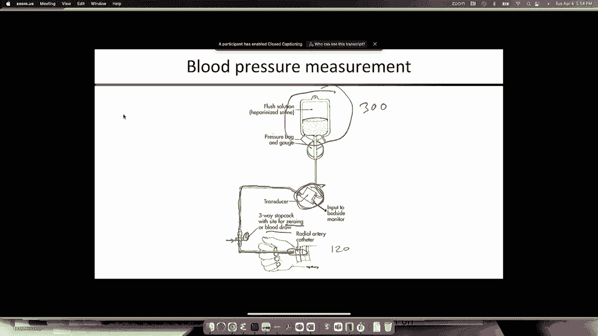

你认为有什么东西能帮助你发现真实的事件，但实际上没有好的，所以好吧，现在我们真的很沮丧，很脏，所以如果我，如果我抽血，我从袋子里得到压力，而不是病人，病人的压力，这是最大的，这是心跳周期中的最小值。

这是心跳周期的平均值，所以你有三种血压测量，这是一秒钟的分辨率，好的，然后你一抽血，开始抽血，当液体从袋子里进来时，压力开始增加，在这里它上升到，你可以看到大约二百六十个，所以260可能是袋子的压力。

然后你把它转回来，你恢复了正常的心跳，好的然后我们做到了，这个，B是一种不同类型的抽血器，我们不需要谈论，然后这是归零，就在你零岁的时候，压力立刻下降，在这里下降到10左右，嗯，然后你按下一个零按钮。

然后你重新启动，一切都恢复正常，好吧嗯，我们通常要处理的数据，在重症监护室平均一分钟，所以如果我把这些细粒，一秒数据，一分钟刻度是什么样子的对吧，实际上看起来没有包事件，对。

在每一分钟仍然有最小最大平均，对了，还有三个数字，所以我们没有看到崩溃，但从一分钟的平均时间来看，它确实更接近，归零看起来就像一个小凹陷，像这样，所以这些可能是生理事件，对呀，可能是在那一分钟。

你知道的，病人的心脏可能会停止跳动，或者动脉系统的某个部分放松了一点压力下降了，然后又上去了，而是因为我们了解了这些人工制品如何产生测量的实际机制，我们实际上可以区分真正的血压下降和血压下降。

由其中一个事件引起的。

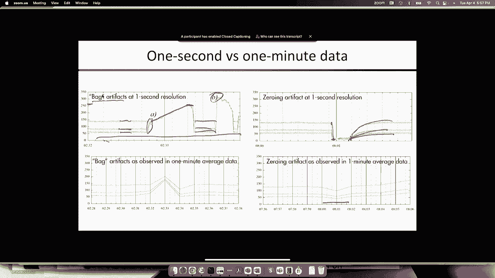

所以这是，这是贝叶斯网，动态贝叶斯网，我们开发来做到这一点，我不打算详述，但是，这是关键变量，对呀，那个阀门是什么状态，这正常吗，是抽血抽屉吗，它在归零吗，这就是推断出来的东西，你实际上推断。

你知道在那一分钟里，它在这三个州中的每一个州都花了多少时间，所以它是一个，这是一个相当复杂的隐变量，但那是，这是模型中的核心变量，所以系统得到测量，以一分钟平均为基础的原始血压测量。

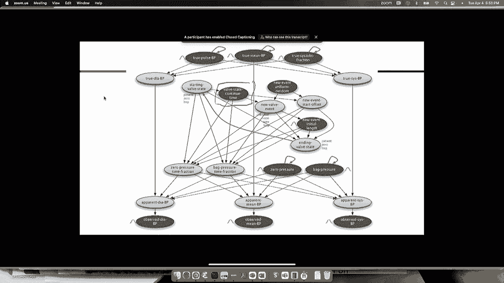

然后做概率推理，所以在这里你可以看到，这是一个更典型的抽血抽屉，在这中间，所以这里有三分钟的时间，在中间，这三个血压都达到了一个数字，那是二百四十个左右，这是一个死气沉沉的赠品，有人在抽血。

系统正确地推断出这件事，这是抽血的概率，那一分钟里有多少是抽血，根据我们正在做的推断，它做得完全正确，它还可以让你在抽血时推断真实的血压，这也是永远不会，以前从来没有这样做过，对呀。

所以即使你关闭了血压测量，从包里拿东西，你还能推理，这是不对的，仍然有一个概率分布，向右扩大了一点，这才是最重要的，橙色的条纹，但你可以看到在那段时间里，血压在慢慢下降，我们还可以推断袋子的压力。

在我们抽血之前，你认为袋子的压力在两三百之间，你真的不知道一旦抽血器发生，你可以非常准确地推断出袋子的压力大约是240，五个，如此如此，这是对ICU测量的一个洞察水平，这是永远无法获得的。

在我们能够开发这些概率建模系统之前，只是非常短暂的权利，如果你这样检测到高血压，意味着，你是否正确地检测到血压已经超过了安全水平，嗯，还是神器，这叫做ROC曲线，我不会解释到底是什么。

而是一个ROC曲线，其中ROC曲线正好在y轴上，然后沿着顶部，意味着你对真实和奇怪的事实事件有绝对完美的区分，所以你可以看到这几乎是完美的，大约是九十九点，8%的准确率，并将两者区分开来。

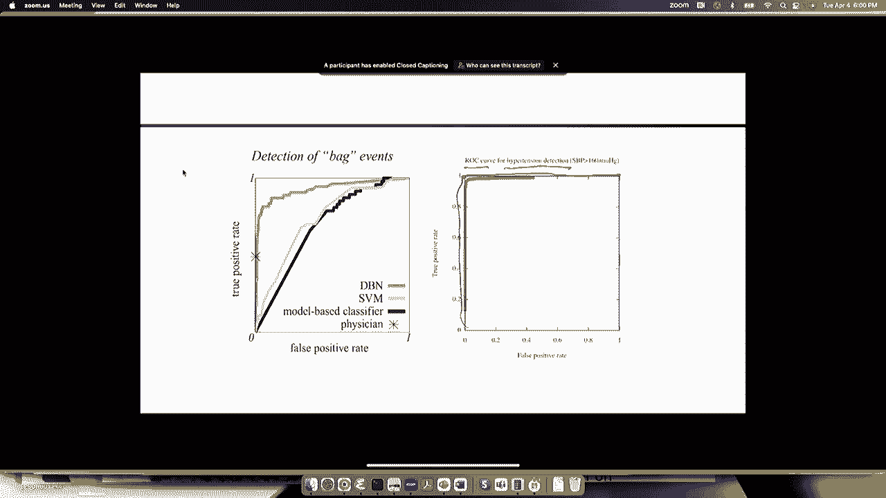

这是一个病人的两天，以及所有血压进入黄色区域的漂移，会导致警报响起，我想这里有两个七级警报，如果当我们推理的时候，我们可以发现其中大多数实际上是假的，这是测量的血压，这是对真实血压的估计。

你可以看到大多数尖刺都消失了，在他的逗留快结束时仍有一些警报发生，结果那些，我们非常仔细地看了那些，他们证明是真的，警报那是真实的血压，而不是人工制品。

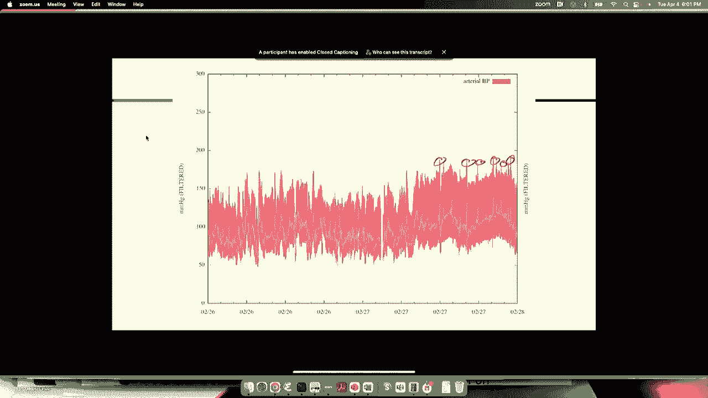

所以这很酷，现在我要告诉你们我们如何在这个模型中进行推理，对呀，它太大了，无法进行精确的推断，其中一些状态变量，呃，你知道的，一百个值，每一个都是因为它们测量的是一分钟内时间的分数，瓣膜处于抽血状态。

比如说，所以我们不能推理，我们使用一种叫做粒子滤波的算法，一些在英国被称为皇家信号研究机构，这是一个军事数据，那是在93年，九十五个在九十七，它是在牛津大学独立发明的，在计算机视觉组。

然后有些人认为它也是在俄罗斯发明的，在七十年代的某个时候，但据我们所知，没有官方出版物，所以粒子过滤是为了让你了解它的应用有多广泛，我想有，二十多万篇论文发表了粒子滤波算法及其应用。

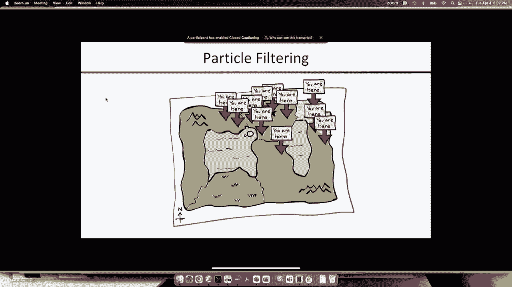

所以我们需要一个算法，如果我们有一个状态空间，嗯，它是用所有状态变量的笛卡尔积运行，对，如果这超过一百万个州，那么精确的推断就会开始变得非常昂贵，不需要太多的权利，如果你有三个鬼魂。

你在一个十乘二十的世界里，对吧，那你已经有一百万了，数以百万计的州实际上看到10乘20是200，所以两百次，两百次，二是八百万，所以做一个非常大的状态空间不需要太多，当你有了结构，嗯，所以你可能会认为。

好的，嗯，让我们试试我们最喜欢的算法之一，我们已经知道做近似推理，嗯，所以你可能会想好吧，嗯，现在让我们试试可能性加权，呃，经验正确，我们在一个非常简单的模型上做了一些测量，事实上和雨伞很相似的东西。

嗯哼，对呀，所以一个状态变量，一个观测变量，然后随着时间的推移收集数据，你可以比较似然加权比精确推断做得有多好，对，因为它足够小，我们可以做精确的推断，所以这显示了随着时间的推移的错误，对呀。

所以当你得到越来越多的数据，你在这个上运行可能性加权，你知道的，展开，嗯，所以如果你有两个5个样本的可能性加权，您可以看到错误几乎立即开始攀升，对，所以当你要计时20的时候，你完全失去了对系统的跟踪。

你的错误接近一个，换句话说，你不知道发生了什么，好吧，你的估计完全错了，好的，所以让我们尝试更多的粒子，也许对不起，更多样本，嗯如果如果如果我们做一百个好，将不可避免的事情推迟了大约五到十步对吧。

一千个井怎么样，再走五到十步是不可避免的，所以你明白了，你把样本数乘以十，你只是用恒定的时间步数来推迟不可避免的事情，好的，所以即使我去了十亿，然后到了第60步或第80步之类的时候。

我还是会失去系统的跟踪，那么为什么可能会如此可怕地等待这个问题，对，我是说这是贝叶斯网，对，我们只是展开它并运行推理，为什么这么可怕，和一个1 C，所以记住，什么是，呃，贝叶斯网的性质是什么。

使似然加权，效果不是很好，证据必须在哪里才能让它很好地工作，证据在哪里使它不能很好地工作，并不介意的采样算法，网络的拓扑结构是什么，所以证据变量在哪里如此有可能很重要，加权效果很好，所以你，是啊，是啊。

所以当证据在底部时，它就不好用了，就在网络的左边，好的，所以就在这里，所有的证据都在树叶里，好的，随着时间的推移，证据的数量越来越多，事实上，你生成与所有证据一致的样本的概率，右实际上是指数级下降。

因为让我们说，你生成的样本与一个证据一致的概率是，你知道的，七点，也许嗯，你同意一百步的几率是七分，百的幂，所以概率，对呀，样品上的重量将呈指数级小，就像我们一样，如果你还记得上次发生的事情是，嗯。

不是上次当我们谈到像等待，发生的事情是有一两个样本运气好，他们只是碰巧同意，你知道的，假设一百个中的十八个大多数人都同意，你知道的，五个，三个或类似的东西，所以这些幸运的样本最终得到了所有的重量。

只是其中的一两个，然后你的估计绝对是可怕的，换个角度想吧，对呀，如果我想想当似然加权算法生成样本时，它在想象一系列的状态，完全无视证据，对呀，所以有点，你知道，幻觉一段完全从零开始的历史。

根本不注意证据，然后说，哦，这段历史与证据一致吗，没有权利，重复十亿次，你永远找不到一个历史能很好地解释所有的证据，因为你没有注意到，直到你生成了历史记录，有点疯狂，所以似然加权作为一种算法完全失败。

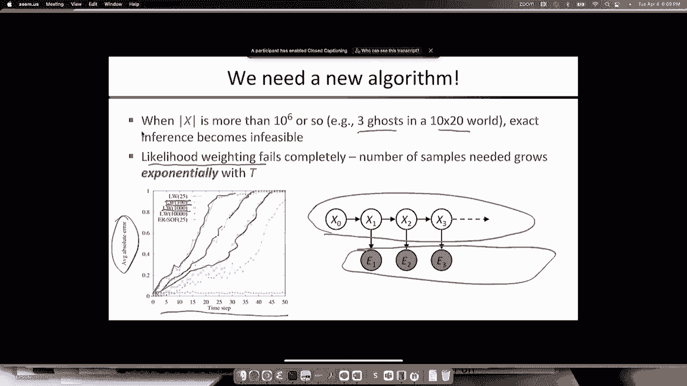

这里有一张图片，它可以帮助你理解发生了什么，所以我在这里展示的是一个过程，所以状态只是这两个D磁盘上的位置，所以系统本身是根据一些随机的随机行走来进化的，对吧，随机游动是这条黑线，现在是红线，嗯。

我显示的点，是通过对状态进行采样而产生的模拟，所以似然加权是对一系列状态进行采样，所以到了第二步的时候，你拿到了所有的样品，它们开始在圆盘上随机扩散，因为他们忽视了证据，对呀。

所以我们从这个移动的物体上得到了测量，但样本只是忽略了它们，当你走到第七步的时候，没有接近系统实际状态的样本，所以这是系统的实际状态，x在那里，所以你知道这一点，这个样本相当接近。

所以它可能会有最高的重量，嗯，也许那个是对的，嗯，也许那个，所以这三个样本都有相当大的分量，其余的就完全没有重量了，所以这三个都很好，你知道它们都在真正位置的左边，所以你的估计会有很大的头寸误差。

随着时间的推移，情况变得越来越糟，所以当你看到那个的时候，你想得很好，多么愚蠢的算法，对呀，我是说尺寸对，轨迹上的这些X，对呀，我得到了X告诉我它在哪里，我只想说，我不在乎，我就在这里模拟一下。

所以真的很傻，所以我们为什么不做对呢。

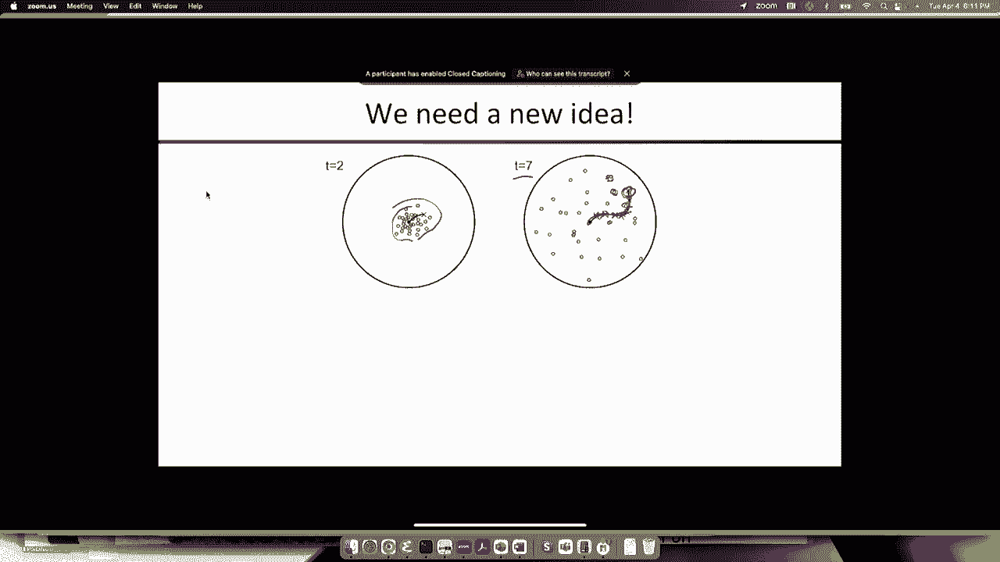