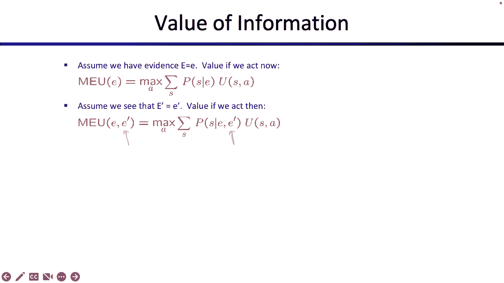

# P24：[CS188 SP23] Lecture 23 - Decision Networks and VPI - 是阿布波多啊 - BV1cc411g7CM

好的，我们开始吧回来真好，好的，所以我想斯图尔特上次开始了，但我们今天要更详细地完成它，所以这个话题很酷，我是你的超级粉丝，这叫做信息的价值，所以还记得在上半节课上我们一直在谈论。

在搜索问题中采取的操作，或者你知道就像在游戏树上，我们谈到了公用事业，你能得到的分数，更高的公用事业是好的，所以这是上半场，然后在课程的后半部分，我们一直在讨论概率推理，所以如果我给你。

你知道这些随机变量，你如何对这些随机变量进行推理，如何查询发行版，在这些我感兴趣的随机变量上，所以今天是我们把这两个话题联系在一起的时候，所以我们要看看，你可以把概率推理的这个想法结合起来。

在贝叶斯中有所有这些不同的节点，你想把他们联系起来，试着说服他们，你想对不确定性进行推理，你要把它与采取行动和最大化你的效用的想法结合起来，所以有点酷，这就像是两个话题的相遇。

到目前为止我们已经讨论过了，所以要做到这一点，我们将首先讨论决策网络，然后我们要考虑，如何运行推理算法和决策网络，在决策网络中运行推理意味着什么，然后我们可以继续推理信息的价值到底是什么，好的。

这就是我想你上次看到的网络，所以在我们深入研究这个网络是什么之前，就像这里的故事一样，有了这个小机器人，我们应该先调查一下，就像，这是怎么回事，所以每当我们看到这个图表，我们要问自己，就像。

这些形状都是什么，这些箭头是什么意思，那么这些箭头，意思是，好的，好的，我想我要先提一下，所以说，什么是木，这是你以前看过一遍又一遍的东西，在上半节课的时候，你在最大化你预期的效用。

这个术语你们在第一课上已经听过很多次了，你总是试图最大化，你想采取最好的行动，你想最大限度地提高你的敏捷性，总是有某种期望，因为世界并不总是像我们期望的那样，所以说，就像以前一样。

我们正在努力使我们的预期效用最大化，但现在我们要在这个决策网络中这样做，所以这是一种不同的结构，但最终目标还是一样，那么这个决策网络是什么，它看起来很像贝叶斯网，它有点像贝叶斯网。

所以这里的很多东西都很像贝叶斯网，所以说，我们要添加一些东西，我们可能没见过，所以让我们通过并喜欢调查，这是怎么回事，所以我们有这些圆节点，那里有一个天气预报，那里有一个预测。

这些和你在贝叶斯网中看到的机会完全一样，那么这代表了什么，它表示一个随机变量，不管是你不知道的事情，但是你有一个概率分布，预测也是如此，那是一个你不知道的变量，但你有一个超过预测的分布。

这些就像贝叶斯网中的贝叶斯网，每个圆圈就像一个机会节点，或者一些事件或一些随机变量，你不知道，但是你有一些分布，隐藏在这些变量下面，如果你把它打开看看里面，你会有某种概率分布告诉你天气，告诉你预测。

给定天气，所以这就像正常的一样，和贝叶斯网没什么不同，但是这个长方形是什么，所以这是新的，所以这个长方形，这将代表一个动作，所以在本例中，我们将讨论示例中的操作，但动作可能就像，你要带雨伞吗？

还是把伞留在家里，这个动作有点不同，因为与随机变量或机会节点不同，你可以控制行动，所以在随机变量中，你无法控制天气，那是随机的结果，你可以推理概率，但你不能控制天气的结果，伞是不一样的，这是一个行动。

所以你可以选择你想采取什么行动，你要拿雨伞吗？你想把伞留在家里吗？这是你必须做出的选择，而不是在这里隐藏一些概率，哦，我拿着伞的可能性有多大？你不必解释这有多大可能，我去拿伞，您可以选择这样的矩形。

这是一个行动，这是你的选择，最后这是钻石，那么钻石是什么，钻石，这是实用程序，所以这个节点将代表，你得到的最终效用或最终分数是什么，实用程序可以依赖于几个不同的东西，这就是这个特殊的贝叶斯网所显示的。

所以这个实用笔记有点受雨伞的影响，哪一个是你选择的动作，也许还有其他机会，就像天气一样，这是对所有这些形状的调查，它们的意思是什么，箭头表示条件依赖关系，或者它们编码条件依赖项。

就像他们在贝叶斯网里做的那样，你几乎可以把它们想象成因果关系，就像天气导致预报，雨伞和天气使我的效用上升或下降，嘿嘿，这就是整体结构，希望上次看起来有点眼熟，好的，现在，让我们告诉你这个故事。

所以这只是一个例子，所以不要以为决策网络只适合雨中的机器人，但这只是我们今天要用的例子，有一个故事，故事是你有选择，所以这是你的行动，是你的选择，你可以选择把伞留在家里，也可以随身携带。

这些都是你的选择，你做出选择，又不是有人给你做的，或者你在抛硬币，这是你的选择，你想做出最好的选择来最大化你的效用或你期望的效用，还有哪些活动，有天气，所以天气我们要保持简单，不是晴天就是雨天。

可能会有预报，可能没有预测，天气预报会告诉你，可能是晴天，可能下雨了，预测可能不是超级准确，但也许它会告诉你工作是否阳光明媚，也许你知道你更矮，如果它告诉你下雨了，那就是晴天，也许你更矮，下雨了。

但有点吵，他们知道天气如何，这不是一个完美的指标，然后结果是什么，结果是公用事业权，那么这里可能的结果是什么，所以我们会告诉你这张桌子的数字是什么样子的，但就目前而言，故事是这样的，如果你带着伞。

第一个是什么，好的，如果你把伞留在家里，天气晴朗，这是最好的一天，你出去像机器人一样玩，排球，你不必随身带伞，今天对你来说是个好日子，好的，效用好，还有什么其他选择，如果很好笑呢，但是你带着雨伞，嗯。

今天对你来说不是个好日子，因为你得去拖你的伞，你可以看着所有其他机器人打机器人排球，但你不能参加，因为你一直拖着伞，所以今天不是个好日子，还有什么日子，有一天你把伞留在家里，但是下雨了。

这是最糟糕的一天，因为现在你被雨淋了，你就像生锈了，今天对你来说真的很糟糕，对呀，也许你的短路，然后又有一天下雨了，但你带着雨伞，所以你知道这不是最糟糕的，至少你在雨中保持干燥，所以你有点高兴。

这些是这个特殊故事的可能结果，现在我们可以看看这在决策网络中是什么样子的，但要确保你知道什么让机器人快乐什么让机器人快乐，这样我们就可以推理了，你就像，这些在哪里，你知道的，这个故事从何而来。

我想我们会告诉你，在一点点好，所以又来了，这是同样的决策网络，稍微简单一点，我们不打算谈论天气预报，我们只是要考虑一下雨伞，我们要考虑天气，所以也许你还记得在贝叶斯网里，隐藏在这些节点下面的是什么。

我们的概率分布，也许这听起来很耳熟，希望这听起来很熟悉贝叶斯网，所以如果你拿这个节点天气来说，你喜欢，看看下面，看看里面是什么，你应该在里面达到顶峰，你会看到一个概率分布。

这种特殊的分布告诉我70%的时间是晴天，百分之三十的时间是下雨，我知道它在我的贝叶斯网里，我可以查一下，你就像，等等，如果我打开，伞我不应该也看到一个分布吗，但请记住，雨伞是你可以选择的行动。

不管你是拿还是不留伞，没有可能把你离开的可能性，你不必猜测你是否要离开雨伞，你要自己做决定，但这个动作笔记下面没有隐藏的概率，它和贝叶斯网不同，如果我偷看这把伞里面，我看到上面写着什么，自己选择。

它没有说拿走的概率有多大，或者离开的概率有多大，那么这个实用程序节点呢，就像在贝叶斯网里一样，像这样的节点是以它的父级为条件的，所以这次你需要某种概率或不概率，但你需要在它的父母身上有某种效用条件。

下面是父级的每个设置的样子，这就像在贝叶斯网里一样，所以对于父母双方的每一个可能的设置，哪些是你的动作和天气，我们必须指定实用程序，这不再是概率分布，这就像是一个可能的实用程序列表，您可以获得，记住。

我们上节课讲到了实用工具，就像你得到的分数一样，越高越好，这些是我们讨论过的场景，如果你喜欢，你离开你的伞，天气晴朗，你玩你的，你知道机器人运动，你得到一百分，对你有好处，你离开了伞，你被雨淋了。

真是糟糕的一天，你就像短路生锈，拿着伞得零分，你知道，但是阳光明媚，这是你在这里，你就像卡住了，看着你的朋友玩机器人球，你不能参加，你得了20分，如果你带着伞，雨下得很好，对你来说这不是最糟的一天。

七点八，所以这些是每一个可能的雨伞和天气规格的结果，我得告诉你效用是什么，这就是实用程序节点下面发生的事情，它不是概率分布，这是我可以得到的可能的实用程序或点的列表，我已经决定了。

我计算出随机变量的可能结果，或者它是以它的父母为条件的，2。我得列出所有可能出现的情况，建立它的父母，你就像，2。我从哪儿弄到这些号码？所以这取决于你的目标是什么，所以说，也许在这种情况下。

我的目标是做运动，机器人运动权，但如果你的目标是制造一个尽可能快地喜欢生锈的机器人，你可以这样做，数字会有点不同，所以这些数字必须来自，设计这个机器人的人，不管他们的目标是什么。

但今天我们的目标要么是玩机器人足球，这是很好的，或者站在雨中，这也很好，好的，这就是我们的故事，那些是隐藏在里面的数字，记住伞里面没有数字，因为这是我们可以选择的行动，所以现在我们可以开始推理了。

那么我们想推理什么呢，就像上半节课一样，我们总是想讲道理，我如何最大化我的预期效用，那么我能选择什么呢，我没有权利选择，但我可以选择，我是拿伞还是留下伞，所以让我们看看会发生什么，如果我拿着伞。

让我们看看当我离开伞时会发生什么，让我们看看我们是否能找出采取哪种行动最好，考虑到有人提供给我的这些数字，所以我们两个都试试，所以我们开始了，让我们看看如果我离开雨伞会发生什么，所以我选择把伞留下。

这意味着这里的这个节点，我知道我要把伞留下，就像没有更多的变化，你选择了离开雨伞，好的，那太好了，但一旦你选择离开雨伞，仍然有不同的结果可能发生，我想知道预期的效用是什么，如果我离开我的伞。

所以这会让数字弹出，好的，不完全是，我不知道的是，所以我要写的是，在这节课中你们会看到很多字母和符号，保持它们的清晰是非常重要的，所以这就是假期的预期效用，这意味着，我选择了行动假。

我想知道平均预期效用是多少，我要得多少分，如果我选择把伞留在身边还是把伞留在家里，我要得多少分，如果我做得好，我其实不知道，因为我不知道天气会怎么样，但我可以取平均值，所以我知道如果我把伞留在家里。

这是可能发生的唯一两种可能性，要么，我要得一百分，否则我就得零分，我多久得100分，我多久得一次零分，那要看天气，我也有，所以现在我可以做一个期望值平均值，那么如果天气晴朗会发生什么呢？嗯。

多长时间有一次晴天？阳光明媚，百分之七十的时间和百分之七十的时间，我会得一百分，因为阳光明媚，我可以玩机器人运动，但另外30%的时间在下雨，所以今天对我来说很糟糕，如果下雨了怎么办？我把伞忘在家里了。

当我得到零分时，我休息，我拿我预期的公用事业，它是对公用事业加权的加权平均数，每个随机变量结果的可能性有多大，为什么我要等天气，因为我不知道天气，所以我必须取一个期望效用或期望值，对呀，好的。

然后我做数学，它出来是七十什么的，所以这是我的计算，因为我选择了离开，我选择了行动，我必须考虑随机变量，总的来说，它告诉我平均，如果我把伞留在家里，我会得七十分，我不会真的得70分。

但平均来说我会得七十分，我可以做完全相同的计算，希望这看起来有点眼熟，所以如果我再带着伞，我真的不知道会发生什么，但我可以用期望值来衡量可能发生的事情，所以我要么得20分要么得70分。

我不知道哪一个我必须取期望值，就像我以前做的那样，百分之七十的时间是晴天，那么当阳光明媚的时候会发生什么呢？我拿着伞，我得二十分，我不得不一个人看着我的朋友们打球，然后其他30%的时间会发生什么。

所以我独自站在雨中，我喜欢下雨，这给了我70分，所以我用计算器计算这个，我算算，我应该得到三五，三五是什么意思，这个数字实际上是什么意思，它的意思是，如果我平均随身带着伞，我希望得三分五分。

这是我的平均期望效用，那么我应该做哪一个呢，或者我该怎么处理这两个数字，我应该把它们平均一下吗，我应该把它们加在一起吗，我应该减去它们吗，我该怎么处理这些数字，七十五，想想它们代表了什么。

七十代表选择行动假的预期效用，三十五代表所采取行动的预期效用，但我们对行动的了解是你的选择，所以这并不像有人告诉你把伞留下或拿走，你可以选择，那么我们如何处理这些数字，我们应该最大限度的。

因为我们想做最大化预期效用的动作，所以在这两个动作之间，因为我推断离开会给我70分，平均给我35分，我真的宁愿得到七十个，所以这告诉我，我应该采取的最好的行动是离开我的伞，一次又一次。

这是一种奇怪的语法，感觉有点直观，但请确保您有语法，因为它会一遍又一遍地出现，所以具体地说，我们要写的语法是meu最大期望效用，这里的这个小是什么，这意味着这就像你的知识，这就是你目前所知道的。

考虑到你对天气一无所知，好像没人告诉你天气怎么样，你只需要对不确定的天气进行推理，因为你现在什么都不知道，你不知道天气，你不知道任何其他随机变量，你能得到的最高分是你能采取的所有可能行动的最高分。

所以在这种情况下我选择了70到35之间的最大值，我得到了七十，好的，所以希望，计算毡的那种标准，但又一次，有点奇怪的事情，这是我们使用的符号，所以当我说最大期望效用时，到目前为止没有证据，我是说。

我给你一个选择，你要选择最好的动作，一旦你选择了最好的动作，天气可能会发生一些随机的事情，总的来说，你会得到平均70分，这是你能做的最好的了，这就是这个等式所说的，到目前为止。

关于这个的任何问题看起来都很好，好的，这是最后一个符号，万一你需要，所以只是说好，我只是大声说，但在文字中，所以记住，这节课会很奇怪的一点是，我也花了一点时间来适应，你在放什么，这些括号会有所不同。

取决于我们使用的符号，所以很容易迷失在什么，我在括号里加上，所以一定要留意，当我编写预期的实用程序时，我在括号里写的是一个动作，我是说我要把伞留下，离开我的伞有什么预期的效用，当我写最大期望效用时。

这是不同的，这是我想写在括号里的情况，在这种情况下我所知道的事情，我对天气一无所知，所以我说，考虑到我对天气一无所知，最大预期效用，我能得到的最好的行动是七十，它来自于采取行动，离开是那么清楚。

确保你把这两件事分开，括号里的东西是不同的，这很奇怪，但这对以后很重要，所以不要把类似的动作放在meu里，对吧，括号内没有操作的原因，是因为你可以选择行动，这是动作的最大值。

所以把动作放在这个括号里是没有意义的，但在这里，当你计算预期效用时，你可以选择，或者动作是为你选择的，你在假设性地问，如果我离开我的伞，我的预期效用是什么，所以当我写EU期望效用的时候。

我确实把动作放在括号里，当我写最大期望效用时，我不把动作写在括号里。我写我知道的信息很好，我要擤鼻涕，所以我要把这个麦克风静音，你可以盯着这个看一会儿，好，好的，就是这个，就是那个，好的，还有一个办法。

你可以通过这个来推理，所以如果你仔细看，它可能看起来有点像预期的最大值，那是因为它是预期的最大值，所以我可以画的一个方法是，这是，我其实可以画三个，看起来有点像预期的最大值，所以你现在就在这里。

这就是你，你是最大化节点，因为你可以选择行动，你可以选择最好的动作来最大化你的效用，你得选择离开，所以这是你的两个选择，所以你在这里看到的，这现在不再是一个，这不再是一个决策网络，所以你不再看贝叶斯网。

这不是贝叶斯网，这是一个决策树，或者结果树，就像之前的Max树一样，所以如果你真的不喜欢期待最大，你可能不想盯着这个太用力，但如果预期的最大值对你来说很有意义，这可能是连接预期的最大树的一种方式。

我们以前已经见过和爱过的，我们刚刚介绍的决策网络，但这不是一个决策网络，别以为这些箭头代表因果关系，他们不会，这不是一个决策网络，这是一个预期的X树，在期望的x树中，箭头表示动作，所以在这种情况下。

你可以在接受和离开之间做出选择，当你选择在这个机会节点着陆时会发生什么，机会节点说好，我不知道天气如何，所以你没有选择的权利，这就是为什么这是一个机会，但天气可能是晴天，也可能是雨天。

它让你选择这两个选项中的一个，你要么拖着雨伞，或者你在晾干雨水，这里也是一样的，如果你选择离开，你被困在这个机会节点上，你不知道天气如何的地方，但有人告诉你天气晴朗或下雨，你想知道你是否能打球。

否则你就坐在那里休息，这些都是你的选择，所以这有点像期待X MDPS，如果你靠得很近，你们之间有一些互动，最大化代理，你总是对你的行为采取最大限度的行动，因为你可以选择，有某种不确定性。

在这种情况下是天气，好的，这里其他有趣的事情，就像这个小支架是什么，这代表了你的知识，或者你目前所知道的，所以在这种情况下，你对天气一无所知，我还没告诉你天气怎么样，你知道它的分布。

但是我还没有告诉你实际的天气是怎样的，所以你必须在不知道天气的情况下进行所有这些推断，这和正常预期的有什么不同，嗯麦克斯那我为什么要介绍这个当我可以有意想不到的行为，像正常人一样，嗯，这有点奇怪，对呀。

看起来这只是与预期的最大值一一对应，在这个非常简单的例子中，这是真的，但这并不是决策网络的唯一例子，如果我的决策网络是这样的呢，所以我突然有了这样的节点和这样的节点，好的，嗯，你现在做什么。

我不知道这是什么，那是很多节点，如果你的决策网络看起来像这样呢，现在你的决策网络并不像预期的那么简单，max，那么是什么做出了不同于预期的决定呢，Max是这样的事实，这里的概率，就像。

出太阳或下雨的可能性有多大？太阳或下雨的概率，在没有证据的情况下，这不是有人走到你面前给你的东西，就像我们在预期的最大值中所做的那样，有人告诉你，这是掷骰子，所以所有的概率都是相等的。

或者我告诉你今天是星期天，70%的时候你可能不知道这些概率，它们可能不会给你，您可能实际上必须运行变量消除，或者其他类型的推理算法在你的迷你贝叶斯网络决策网络中，弄清楚概率是多少。

决策网络比常规预期的最大值更强大，从某种意义上说，如果你的决定号更复杂，你可能需要做推断来得到这些概率中的一些，今天我们不会太担心这个，因为你已经花了两周时间学习如何推理，但很多时候。

我们将从贝叶斯网中提取概率，不仅仅坐在贝叶斯网里，我怎么才能得到这些你必须进行推理，所以我们花了两周时间说服你如果我给你一个贝叶斯网，你能告诉我某个变量的概率，给定一堆其他变量，这就是你花两周时间做的。

今天，我们要依靠，事实上，这是我们已经知道如何做的事情，我们会叫它几次不同的时间，这样我们就可以从地下室里找出我们想要的任何可能性，预期最大值之间的主要区别，常规期望最大值，如果决策网络变得更加复杂。

我们可能需要进行更多的推断来从贝叶斯中提取概率，净额，而不是有人向我们走来，告诉我们晴天或雨天的频率，但在这个非常小的例子中，这是意料之中的麦克斯，反应最大，天气有一个期望值，我们不知道。

所以如果你喜欢树，对你来说是一个很好的幻灯片，如果没有，我们会继续前进，好的，所以这里有一个不同的例子，现在我们要介绍预报，现在设置有了一点变化，所以现在作为机器人，你早上醒来。

你听着你的小机器人收音机，收音机告诉你预报有雨，或者这是一个糟糕的预测，所以期待下雨，嗯，这会稍微改变你的决定，因为你现在得到了一些你以前不知道的证据，所以以前你只知道有时阳光明媚，有时下雨。

你不知道你现在的处境，会有人向你走来，告诉你天气预报不好，他们告诉你可能在下雨，这可能会改变你的概率，它会改变你想采取的行动，那么在你的决策网络中，这是什么样子的呢，我们过去看看。

这和前面的决策网络是一样的，除了现在我介绍了一个预测节点预测，不取决于天气，所以如果你认为这个箭头是因果关系，有点像，但不是真的天气导致预报，所以如果天气不好，这有点导致预报不好，似乎很合理。

但这并不是一个完美的一对一的相关性，天气预报并不能完美地预测，它是一个嘈杂的天气预报器，所以现在就像以前一样，我需要一个天气的概率分布，这样我就可以推理了，如果是晴天还是雨天，我需要水电。

公用事业对我来说是一样的，这些都是相同的可能结果和我可以得到的相同的可能分数，但这次不一样，看看这张桌子，仔细地盯着它，这是天气的概率，因为有人告诉你天气预报不好，所以不像以前。

我只是做了概率是否给出任何信息，这现在是一个天气表还是一个关于是否，鉴于你已经醒来，听你的机器人收音机听到天气预报不好，这是一个不同分布的不同表，数字也不一样，2。我从哪儿弄到这些号码的。

这些数字直接在贝叶斯网中吗，想想基网里有什么，在这种情况下，记得在贝叶斯网，总是这个节点的概率，在这种情况下，它的父母坐在地下室里，如果我偷看里面，喜欢打开，我往里面看，这是W的P，如果我往里面看。

这个音符是f的p给定w，这些都不是我在这张幻灯片上给你们看的桌子，这一层上的表是给定f的w的p，这是一个不在贝叶斯网中的不同表，所以你就像，我怎么可能得到这个，记得我们花了两周时间说服你。

如果我给你一个贝叶斯网，你可以给我贝叶斯网中的任意概率分布，我是怎么得到这个的，我不得不做一些推断，它可能就像通过枚举推断一样，可能是变量消除，你在那里做了一堆连接和照明，在这种情况下。

它甚至可能只是贝叶斯规则，但不知何故，我不得不在这个贝叶斯网中进行计算，把这些数字拉出来，现在我已经在这里为你做了，因为没有必要再做一次，当你只花两周时间做的时候，但请记住，这张桌子不是什么。

你只要直接从贝叶斯网上读出来，唯一的桌子，你可以读出底座，是呀，把这两个网络，这张桌子不一样，所以你得自己推导出来，考虑到天气预报不好，这是一张天气表，因为你知道天气预报不好。

太阳或下雨的概率发生了变化，它们以一种你只能通过地下室的计算来计算的方式发生了变化，好的，有很多话要说，当你听到天气预报不好的时候，以前是七点，现在是三点四，1。下雨的可能性增加了，以前是三点。

现在是三点，现在是六点六，2。我是怎样得到这些精确数字的，我不得不在我的贝叶斯网中运行计算，可以肯定的是，但是在我的贝叶斯网中运行计算后，整体结构又变得一样了，所以我做了和以前一样的事情。

我想的是两种可能的行动，为什么我要两者兼而有之，因为我有选择，我想想想哪一个最好，所以我需要考虑如果我把伞留下会发生什么做一些计算，如果我拿着伞想想会发生什么，但我两个都要检查，因为我不知道哪一个最好。

如果我离开会发生什么，这和前面的计算是一样的，但我插入了不同的概率，如果我离开，要么得100分，要么得0分，所以34%的时间我得分，阳光明媚，所以我得了一百分，我很高兴，而另外66%的时间我得了零分。

我有点倒霉，相同的计算更早，我会让它出现，不错嘛，在那里，它是，我在做天气方面的预期平均值，但我不再计算期望平均值或期望值，不管是自己，我在看是否有可能，据我目前所知，就是天气预报不好。

所以这是不一样的，它曾经是W的P，现在是P的W考虑到增加的证据，但除此之外都一样，当我写的时候，我写什么，我写了采取行动假的预期效用，鉴于我知道天气预报不好，所以现在有额外的证据，我用符号写出来。

如果我带着伞怎么办，相同计算，希望现在看起来有点无聊，如果你拿着伞，你要么得20分，或者你得了七十分，你多久得20分？嗯，百分之三四的时间，阳光明媚，当阳光明媚的时候，你得20分，另外66%的时间下雨。

下雨的时候，你得了70分，你坐在雨里，你很快乐，这就是你的两种可能性，你把它们的加权平均值，你又一次在等待，根据证据，所以你总是把你知道的证据，就是天气预报不好。

证据显示在你重新计算贝叶斯中的值的事实中，净额，下雨的概率上升了，就像以前你有两个数字，你有三四，你有五三，你想怎么处理这些数字，嗯，三十四个代表你得到的，如果你离开伞，53代表如果你拿着伞会发生什么。

谁在告诉你该做什么，你选择让她离开，所以如果你可以选择是拿伞还是留下伞，你想选择做最好的事情，在这种情况下，拿着伞，和以前不一样了，所以因为你了解了关于预报的信息，你的行动选择也改变了。

如果你回想一下我们之前所做的，我们把伞忘在家里了，我们买了点东西，现在的决定不同了，现在我们要选择拿着伞，现在我们得了53分，一次又一次，我们写作的方式，这是我们写的最大期望效用。

我们把什么放在括号里是不同的，每次我们把我们知道的信息放在括号里，就是天气预报不好，所以如果我告诉你天气预报不好，你平均能做的最好的是所有动作的最大值，你可以选择一个期望，天气可能会怎么样，总的来说。

你做计算，你得到五个三个，所以如果我告诉你预测平均来说很糟糕，你平均得五分三分，我说在每一个选择上，有人记得前面那个号码吗？另一个号码是多少？是七十，你注意到什么数字下降了，但这是有道理的。

因为有人告诉你天气预报不好，所以今天很可能是个糟糕的日子，如果今天是个糟糕的日子，这是一个下雨天，你的总体最大预期效用可能会下降，那是意料之中的，你的行为也可能会改变，如果你听到天气预报不好。

你现在想拿伞是有道理的，这就像数学，备份它，非常小的例子，但这就是你如何研磨数字，关于这件事你还想知道什么吗，我给你看符号，所以你可以从我刚才说的开始，但又是用语言，对我来说，这节课的奇怪之处在于。

你在这些括号里放了什么？别被它们绊倒了，示例本身并不超级复杂，但有时符号会让你超级迷失，那么括号里是什么，在这种情况下，我总是把某些动作的预期效用，所以我假设，如果我离开我的伞，我会得多少分。

但我也加了这个调理条告诉我，或者提醒自己我知道天气预报不好，所以如果我知道天气预报不好，我离开我的伞，我希望平均得多少分，那是欧盟给坏的假期，我知道天气预报不好，我平均选择离开我的伞，我得多少分。

这就是这个表达式所说的，如果我把一堆不同期望效用的最大值，所以我检查休假，我检查收入，我检查我所有的行为，我采取了最好的行动得到了不同的表达或不同的名字，这是这里的最大期望效用，我只是要把我知道的信息。

就是天气预报不好，为什么我不在这里采取行动，因为这已经在行动上最大化了，在你身上采取行动是没有意义的，所以说，我应该在菜单信息中添加什么，到目前为止我知道什么，我在欧盟放什么，动作，目前正在考虑的行动。

这两者是如何联系在一起的，MEU是超出预期的最大实用程序，所以最大期望效用，我能做的最好的，此信息是操作上的最大值，每个动作都有自己的预期效用，上面是这么写的，一定要把这个说清楚。

因为我要介绍第三个符号，这将会变得非常混乱，如果你有问题，这是时候了，或者如果你想盯着这个，现在是时候了，我再在树上给你看，就像我以前做的那样，所以现在你知道，决策网络变得更加复杂，但这仍然是一个信条。

就像以前一样，这不是右边的决策网络，这是一个预期的最大值树，所以动作，箭头表示行动或结果，他们不代表，像因果关系或相关性，但这是一个预期的最大值树，这里的区别在于国家有点不同。

所以你之前的开始状态是我什么都不知道，现在开始的状态是你知道天气不好，但就像以前你是最大化代理一样，你想选择，告辞，你想选择最好的，你想在街上讲道理，一旦你进入蜱虫场景，一旦你选择了。

你在这个机会节点上，上面写着天气，因为天气预报不好，可能是好的或坏的，也可能是晴天或雨天，太阳的概率是多少，因为天气预报不好，下雨的概率有多大，因为天气预报不好，我不知道，我得在地下室里磨来磨去。

可以肯定的是，这里也是一样的，…的可能性有多大？考虑到天气预报不好，我不知道我必须在我的贝叶斯上做推理，网确定，然后这两个有一些结果，所以要么是太阳，要么有可能下雨，你从地下室得到的。

你得用一些计算把它拉出来，然后你会出现在这些实用笔记中，它告诉你比分是多少，最后的结果是什么？你在家吗，你阳光吗，你在做运动吗？你被雨淋了吗，随便啦，好的，和以前一样的树，区别在于，我已经介绍了信息。

并通过介绍信息，什么变化，动作不变，结果不会改变，但是概率会改变，这就是改变的地方，好的，所以这只是众多例子中的一个，你知道你不是整天玩机器人运动，这里有一个可能看起来有点熟悉的项目五，我觉得很好。

所以在项目五中，你扮演捉鬼敢死队，或者我希望你在玩捉鬼敢死队，不是我，如果你不是，我可以简单地解释一下这个游戏，但这是捉鬼敢死队，那么捉鬼敢死队在这门课上是如何工作的呢，你有这个网格。

有一个单独的鬼藏在这个网格的某个地方，你想抓鬼，你想知道鬼魂在哪里，那么你是做什么的，你拿传感器读数，每个传感器读数都会给你一些噪声信号，至于鬼魂在哪里，你的传感器不完美，你的传感器很吵。

所以当你拿传感器读数，它告诉你接近鬼魂的概率，或者你远离鬼魂的概率，对呀，这些是传感器读数，我也可以在工作中做出决定，所以这是决定的样子，有一个行动，我可以选择行动是，你在哪里抓，所以在这种情况下。

我们说你不能再做任何感知，我想让你去某个地方，所以我想让你告诉我鬼魂在哪里，选择一个地点进行半身像，那是你的行动，所以你的行动是你可以选择的，我想在这里崩溃吗，我想在这里破产吗，我想在这里破产吗。

这是你可以做出的选择，这种选择用半身像来代表，如果我打开胸围，我会看到概率分布吗，否，为什么，因为Buz是我可以选择的行动，不是有人告诉我，我在正确的地方胸围或胸围，我不知道在这里，那不是说我可以选择。

所有这些随机变量是什么，现在还有更多，所以不像以前，那里只有天气，有很多随机变量，每个随机变量代表一件我不知道的事情，就像在普通的地下室一样，所以我不知道什么，我不知道鬼在哪里，所以它是一个随机变量。

也许我观察到了，也许我不知道，在这种情况下，我不知道你有很多传感器读数，每个传感器读数都会受到鬼魂所在位置的影响，所以幽灵的位置和每个传感器读数之间有一定的相关性。

有很多这样的人其中一些你可能知道所以也许，你知道我点击了这个是什么，我不知道，我点击了这个，所以我知道自从读了，所以我知道它的价值，也许我知道这个值，但也许我不知道剩下的或类似的事情，好的。

也许我也知道这个，那么我该如何解决这个特殊的决策网络，整个过程还是一样的对吧，我得考虑我所有的行为，但现在不仅仅是采取了两个行动然后离开，我需要对每一个可能的动作做一次计算，这是每个可能的公共汽车位置。

所以我需要做一个计算，在这里爆破的预期效用是什么，好的，在这里爆破的预期效用是什么，在这里爆破的预期效用是什么，你得一遍又一遍地做，每个地点一个，最后你会怎么做，你拿最好的，最大的一个。

给你最大的效用来破坏每一个，如果你放大说，在这里破灭的预期效用是什么，当我放大计算时，上面写了什么，它说预期效用是加权平均数，加权平均数和加权平均数是多少，取决于它取决于幽灵位置的结果是什么。

因为你不知道，所以你需要一个鬼魂位置的概率，鉴于你知道的证据，为了进行预期效用计算，所以如果我问你，在这里破灭的预期效用是什么，你也要告诉我，鬼定位的概率分布是什么，考虑到我所知道的所有传感器。

我知道传感器2 1，我也知道传感器一三，我想在这种情况下，我知道传感器一个逗号n，这个分布是什么，它不在贝叶斯网里，你不能在某个地方读出来，这不是地下室的桌子，你必须运行推理来解决这个问题。

所以如果我告诉你我在这个节点上阴影，我知道这个节点，我知道这个节点，我知道这个节点，告诉我鬼的位置分布，给定这些节点，你需要计算这个，用你两周前的贝叶斯网络推断告诉我，几周前，但那不在基网里。

你需要自己计算，概率会根据你所掌握的证据而改变，这可能会改变你采取的行动，那是捉鬼敢死队版本的决策网络，但整体原理是一样的，关于决策网络的任何其他最后问题，以及它们是如何工作的。

以及如何计算最大预期效用，因为现在我们要介绍最后一个主题，就是把所有这些都聚集在一起，给你信息的价值，太好了，又来了，这是一个即将把一切联系在一起的话题，所以我们开始谈论，你知道的。

不确定性与不确定性推理，我们已经讨论了效用，并采取行动使您的效用最大化，所以这有点奇怪，一切都会联系在一起，我们将讨论一种叫做信息价值的东西，所以凭直觉，你在这里想的是好的，知道天气预报有多有价值。

所以似乎知道天气预报真的能帮助你做出更好的决定，在这个决策网络中，如果你知道天气预报，看来你最好做一个决定，或者你的决定会给你一个更好的分数，如果有人告诉你天气预报，你会做得更好吗，或者另一种说法是。

也许有人走到你跟前说你想知道天气预报吗，但他说我不会免费给你天气预报，它是有价格的，问题是你愿意付多少钱，如实用程序或积分以了解预测，这就是信息的价值所在，现在我们要试着把它正式化，但直觉上。

这个想法是，如果有人告诉你这些信息，你能做得更好，或者另一种说法是如果有人提出向你出售这些信息，你会支付多少积分或多少实用积分来了解这些信息，所以我们将用另一个决策网络来形式化它，这个又很小很简单。

但它很好地说明了信息的价值，所以这里有另一个设置，这是设置，好的，你是钻井机器人，你想钻探石油，好的，我们不支持，呃，这一类的化石燃料，但你在钻探石油，好的，所以有两个地方你可以钻。

但我们会说从中间劈开，好的，我会把它分得更干净一点，好的，作为分裂，所以我们把这叫做钻井场，我们就叫这个钻井场B，你可以选择你可以选择钻和一个，或者你可以选择在B中钻孔，所以这些是你的选择。

那是你在这里的行动，所以在这个节点中，您可以选择在A中钻孔或在B中钻孔，好的，那是你的选择，没有任何可能性，您可以选择，关键是，你实际上不知道油在哪里，所以我的意思是我们可以在图片中看到它。

但你不知道油在哪里，因为机器人，所以这是由一个随机变量的油位置表示的，我们必须告诉你概率是多少，但你不知道石油的位置在哪里，然后有一些效用，效用将取决于你在哪里钻探石油的实际位置。

但我们必须给你这些数字，让你用它们来推断，所以让我们给你数字，有两个街区，有a和b，好的，一个是油，这是实用程序的实用程序是，如果你在发现石油的地方钻探，对你来说值K，所以k点k是一个数。

如果你在没有油的地方钻探，对你来说一文不值，无积分，好的，所以这是在桌子上，在某个地方，桌子在哪儿，好的，桌子在那儿，桌子就在那儿，这是你所期望的，如果你钻A，油是A，你得到k分，如果你钻a，油在b。

你得零分，你的想法是对的，好的，和石油的概率，我有，我还得告诉你每个地方都有石油的可能性有多大，如果我不知道这里给你的任何其他信息，告诉你有50%的可能性石油在很多，石油有50%的可能性在B号地段。

这是一个非常非常简单的网络，它是如此简单，你可能可以在你的脑海中做很多事情，但我们会告诉你你想要什么，将信息在这个网络或这个决策网络中的价值形式化，但这是网络的规则，好的，所以每个人都得到了。

你在钻探石油，你要么钻a，要么钻b，如果你在真正有石油的地方钻探，你得K分，如果你在圆形的地方钻，你得零分，这样我们就可以像对天气一样进行完全相同的计算，事实上，这个网络看起来几乎和天气一模一样。

但我们也可以用我们的直觉试着弄清楚，所以让我们试着找出这里的直觉，所以如果你选择钻探石油，我不告诉你油在哪里，你只需要利用你可用的概率，我不会告诉你这实际上是一个A，这是一个假设，但如果我统治。

我有50%的概率康复的分数的期望值是多少，我有百分之五十的概率得零分，我平均得K分，我要得K/2分，如果我选择钻一个，如果我选择钻和B，以百分之五十的概率会发生什么，我找到了石油。

我有50%的概率得K分，我得了零分，我觉得不太好，因为这是一个很大的，所以我平均得分为K超过2分，这两种结果的可能性相同，所以你可能会明白，或者希望你能弄清楚，只是用你的直觉说，如果我不知道油在哪里。

我只是想平均来说，我要在两分以上得K分，不管我做什么，这两个动作对我来说是一样的，我要得K/2分，那是没有信息的，现在我希望下一个要点会破坏它，好的，我想我不这么做，现在，假设有人向你走来。

所以有人向你走来，他们就像石油和魔术师，他们告诉你我会告诉你石油在哪里，所以说，我将向你透露这种油是A级还是B级，这是一个随机变量，你不知道，有人走到你跟前，主动告诉你，是a还是b，现在的问题是多少分。

或者你会付给这个魔术师多少效用点让他告诉你，不管油是不是空气，B中的油或等效的油，如果这个你知道，油魔术师告诉你油是A或B，知道你平均还要得多少分的价值是什么，如果有人告诉你油在哪里。

我们可以通过并直观地做到这一点，然后我们可以思考它在数学中是什么样子的，对呀，但凭直觉你平均还要得多少分，这取决于你的MEU有多高，MEU和U的最大期望效用是什么，上面写着，如果你做了最好的事。

这是你平均要滚动多少点，最大期望效用是信息的函数，所以欧盟不知道，换句话说，如果你不知道油在哪里，你在这个游戏中的最大期望效用是k/2，如果石油推销员走到你面前告诉你石油在哪里，你的最大预期效用有多好。

我们也可以做那个数学，希望数学看起来像你所期望的，所以如果石油推销员告诉你石油是一个A，你打算怎么办，你要钻一个A，你会得到什么，你会得到K，你打算怎么办，你要钻B，你要得到K。

所以不管石油推销员让你钻什么，你只要在那里钻，你就会得到K，无论你做什么，所以最大期望效用，如果有人告诉你石油的位置，如果有人告诉你油在哪里，你平均得K分，那似乎很合理，如果他们告诉你它在哪里。

你就在那个位置钻探，你总是得到K，所以比较这两个值，当你不知道信息时会发生什么，你在猜，你平均得K超过两分，如果有人走到你面前告诉你油是什么，或者油在哪里你得了K那么你又得到了多少实用分。

因为有人向你透露了这些信息，这就是K的区别，这就是你之后得到的，在有人告诉你减去k/2之后，这是你在别人告诉你之前得到的，总的来说，知道油在哪里对你的价值是k/2，如果你不知道你的平均得分会超过2分。

如果你知道你的平均分会是K，所以所以，如果有人告诉你，你应该期望平均得分超过两个，所以总的来说，这个计算，如果你喜欢另一种说法，你应该支付给这个石油魔术师的预期公平价格是K/2，如果这对你来说更有意义。

你可以这样做，你没事吧，好的，用他们的手，是啊，是啊，是啊，是啊，好的，这是不准确的，好的，如果石油魔术师是这样的呢，像个骗子什么的，他们想告诉我不好的信息，他们想好好撒谎，在这个网络中没有表示的。

所以如果你想这么做，您可以在此网络中添加更多节点，也许我们以后再做，但现在我们假设有人向你透露了完美的信息，他们告诉你在哪里可以找到它，你知道他们给你的信息是准确的，但你绝对是对的，你可以有不同的型号。

只是需要重新粉刷地下室，其他问题，当然，另一个问题是什么，如果你不知道概率分布，你可以用不同的贝叶斯网建模，但通常当我们想到这些问题时，我们认为我们知道贝叶斯网中的概率，然后我们可以对它们进行推理。

我们不知道石油在哪里，但我们知道它们所在位置的概率分布，如果我们甚至不知道我们必须以不同的方式画盆地，我也是，然后另一个随机变量就像，石油是A或B的可能性有多大，这必须是基中的另一个随机变量。

那会变得更复杂，但是这个非常简单的贝叶斯网我们不用担心，也许我再给你看一个例子，因为你们都很奇怪地盯着我看，这里有另一个例子，我将跳过一点，先不要担心前两个，所以呃，别担心那些，看最后一个。

这是另一个VPI的例子，你可以在脑海中计算，它给你一点关于它是如何工作的直觉，好的，所以我们开始了，我们在玩彩票，所以有一百个不同的号码你必须选择中奖号码，相当经典的彩票，好的，如果你选错了号码。

你得了零美元或零实用分，记住功利不是金钱，我们上次谈过这个，但就目前而言，我们将假装效用就是金钱，所以价格是零或一百美元，如果你选错了号码，有九十九个错误的号码，如果你选错了号码，你得零分。

如果你选择了正确的号码，你得一百分，或者你得到一百元，你的问题是，有人走过来告诉你中奖号码的价值是什么，在你做决定之前，那么有人告诉你中奖号码的价值是什么，我们可以再做一次和以前一样的计算。

也许你已经在脑子里感觉到了，比如试着思考，你认为答案是什么，答案会超过一百个，会少于一百吗，会像零一样吗，会是负数吗，阳性，试图找出答案是什么，然后我们会向你展示整个计算是什么样的，因此。

总体计算总是预期效用或最大预期效用的差异，所以如果我什么都不告诉你，所以你说不，谢谢。我不想知道电话号码，我只是想在没有任何信息的情况下玩彩票，我的平均最大期望效用是多少，我希望得多少分，我得零分。

这在99%的时间里发生，因为我打错了电话，或者我得一百分，有百分之一的时间会发生这种情况，当我选对号码时，所以如果没有人告诉我任何信息，我不得不呆在那里猜测，我平均会得到一美元，对呀。

百分之九十九的时间，我一分也没得，百分之一的时间，我得了一百美元，所以总的来说，我会得到一美元，如果没有人告诉我，从这个案子到第二个案子如果有人向我走来，我该把这个箱子放在哪儿呢？

如果有人走到我面前说我会告诉你中奖号码，现在，你知道的，好的，这是数字的哈希符号，对呀，好的，所以中奖号码，有人告诉我中奖号码是多少，最大的尊重是什么，现在我手里有中奖号码了，我可以再次选择它。

你可以选择行动，所以是的，仍然有你选错号码的情况，但你永远不会做那些，你要选对号码，这就是最大期望效用所说的对效用的最大尊重，说你选择了最好的动作，这将是，什么选择号码，这个人告诉你。

因为他们告诉你号码，如果他们告诉你号码，你的平均分是多少？一百元，你总是会得到它，你会成为一个非常非常好的彩票玩家，你会得到100美元，每一次，那么信息的总体收益是多少呢，或获得学习中奖号码的实用积分。

如果你什么都不知道，你平均得了一美元，如果你知道中奖号码，你平均得一百元，所以我们写这个的方式是，我们写信息的价值，我们以后再担心P，某人告诉你中奖号码的信息的价值，它是一个减法。

因为你想想想价值是什么，或者我对这些信息的预期效用是什么，在这种情况下没有，如果我有信息，我会得一百分，如果我没有信息，我会得一分，所以了解这些信息对我来说价值是99美元，换句话说。

如果你想从付款方式上考虑，你应该付给这个人告诉你的钱，这些信息以公平的价格是99美元，但另一种想法是有人告诉你这些信息，对你来说它值99美元，另一个你不需要做计算的案例，但希望你开始感觉到信息的价值。

我们计算的方式，这总是会是一个不同的MEU，你已经知道如何计算了，所以我在这里介绍的唯一一件事，这是事实，你采取了不同的U，好的，这是两个例子，他们不是唯一的两个例子。

但它们给了你一个关于MU即将是什么样子的想法，或者VPI会是什么样子，它是期望效用的差异或最大期望效用的差异，你能做得更好吗，如果我揭示一个随机变量的值，我们再来一次，但随着天气的变化。

我会变得更复杂一点，所以请原谅我，好了现在我们要用真正的符号来做，看看是否还有意义，我们可以把这种直觉和所有这些奇怪的时髦符号联系起来，所以就像以前一样，我如何计算信息的价值，我需要做一个比较。

如果有人不告诉我这些信息，我没有可用的信息，我能得的最高分是多少，然后我必须用我可用的信息做同样的计算，并说什么是最好的我可以得分，所以我会在这些之间做一些不同的事情，这是我对信息的价值。

所以让我们做一个案例，有人不告诉我信息，这个计算我们在十张幻灯片前就已经做了，所以如果你不知道70是从哪里来的，它是在十张幻灯片前或三十分钟前出现的，如果你在看回放，好的，所以这是70号。

我们已经知道我们是怎么得到它的，如果你没有任何信息，你超车还是离开，你在天气上做一个期望值，你计算出你平均得70分，在没有资料的情况下，你以前已经做过这个计算了，如果有人走到，你提出告诉你天气预报。

你知道这是不好的，所以你知道天气预报不好，现在这个计算，我们以前也做过，这些数字应该很眼熟，因为我们已经做了，我们仔细地计算了一下，天气变化的概率，因为我有关于预报的额外信息，我了解到我平均得5个三分。

如果我做了最好的事，当天气预报不好的时候，我们已经做了这个计算，天气预报并不总是坏的，如果天气预报是好的呢，我可以再做一次计算，使用我们已经使用过的完全相同的公式，上面写着如果天气预报再次好。

我做了一个最大值，因为我可以选择解脱，我对天气做了一个期望值，它是否会改变的概率，因为有人告诉我天气预报很好，如果天气预报好，嗯，你知道今天对我来说可能是个好日子，我的总分是95分，这意味着平均来说。

如果有人告诉我天气预报很好，那我平均得95分，有三个数字，我怎么把它们放在一起，你刚才不是说我把两个数字，在我看来，这就是VPI具有挑战性的地方，所以一定要听听这个，如果你喜欢和其他东西一起睡觉。

这是你想保持清醒的部分，所以当我提出透露信息时，这是最奇怪的事情，就像预报给你一样，在这种情况下，我想告诉你的是，是在它是石油位置之前的预测，或者彩票号码，这是天气预报，我不是要让预报变得好。

我不是想让天气预报变坏，我只是想告诉你，不管是好是坏，所以我不是告诉你喜欢，哦，我要买第二张彩票，或者我要在一个，我要把天气预报做得很好，这是一个随机变量，你不能控制，我是否不能控制。

我想告诉你的是不是，天气预报是什么，它是否坏，或者它是否好，你不知道，我不知道，我只是告诉你，我可以告诉你，所以喜欢，我想给你这个礼物，在现在，它就像一个盒子，盒子里是天气预报。

我不会让盒子里装好天气或坏天气，我要把总统交给你，你可以用它做你想做的事，打开看看里面是什么，那么这意味着什么呢，这意味着你实际上可以使用这两个数字中的任何一个，因为我不能保证我把预报做得不好。

或者我把预报做得很好，那么你怎么知道总的预期效用是什么呢，如果有人告诉你天气预报，有人告诉你天气预报是好是坏，你得多做一个期望，我们一整天都没有做到这个期望，但我们就要做了，你还有一个期望要做。

那就是你必须看看你的基本网络，问问自己，天气预报好的频率是多少，天气预报多久坏一次，1。你从哪儿弄来的这张桌子？通过你的篮子计算，这是你必须做的额外计算，就在这里，你如何结合第五个，九十五名和五十三名。

你做一个期望值，为什么要做这个期望值，因为我不保证会让预报变坏，我不保证预报会好，我只想告诉你天气预报是好是坏，因为我还没有告诉你天气预报是什么，你不知道我是否会透露一个不好的预测，还是一个好的预报。

所以你必须取一个期望值，天气预报是好是坏，我还要再说几次，因为这是VPI计算中最奇怪的部分，我可以计算出一个值，如果天气预报不好，告诉我如果天气预报平均不好，我得了53分，2。天气预报一般都很好。

我得了95分，但我不保证把你放在五十三世界，我也不保证把你放在95岁的世界里，我只是要告诉你天气预报是什么，如果我告诉你天气预报不好，对你来说太糟糕了，你平均得53分，如果我告诉你天气预报很好。

那对你有好处，你平均得95分，但我不保证让你陷入这两种情况中的任何一种，我只是想告诉你你现在的处境，因为你不确定你是否会在五三世界，或者九十五世界，你必须对它们取一个期望值，取期望值。

你得看看你的贝叶里，上网，看看这个天气魔术师多久会告诉我天气不好，或者天气预报会告诉我，很糟糕，天气预报多久会告诉我一次天气很好，因为我不知道，我必须取这个期望值。

所以我把这些数字组合起来的方法是首先对什么进行期望，我不知道，这就是将要向我揭示的，然后剩下的和以前一样，也就是说，我拿走了差额，所以就像以前一样，如果有人告诉我天气预报，他们没告诉我，是好是坏。

他们只是告诉我天气预报是什么，我要得七十七分八分，平均，这个数字来自预期的五的权重，三百九十五，然后我像前面一样做了这个减法，如果我什么都不知道，我平均得70分，我做减法，这告诉我知道预报员是七点。

给我八分，为什么我不必做一个超过70的期望值，嗯，那是因为根本没有任何信息，这样，将来要向我显明的事，就没有不确定的了，这个证据我已经知道了。在这种情况下，根本没有证据，所以我不必做期望值。

但有人向我透露的变量，他们没告诉我，天气预报是好是坏，他们只会告诉我，我会告诉你是好是坏，因为他们不会向我确认是哪一个，直到我同意接受，我需要取一个期望值，而不是他们能取的，假设提供，明白了。

这是另一个期望，它不是预期的效用，我们已经做过了，它不是最大期望效用，我们已经做过了，这是对最大预期效用的加权，我们从未做过的新期望，直到这个幻灯片，我们甚至没有在石油或彩票的例子中看到它。

这些几乎是如此简单，我们不必这样做，但我们也含蓄地做了，你们都看着我，好笑，好的，我们会继续前进，但一定要阻止我，好的，这里是方程，我以后再给你演示一遍方程式，所以先别太担心，但你已经可以看到。

完美信息的价值是不同的，你在做两件事，有区别的，有一个加权平均数或期望，区别，它介于，我会用不同的颜色，我想，好的，区别就在这两个术语之间，这是术语，这是术语，不同的是你得到了多少期望奖励。

或者你的预期效用是多少，得知消息后，所以这就像不知道信息，这是了解信息，所以这就是区别，对呀，你要减去两项，它告诉你你平均得分要多多少，当有人向你透露信息时，如果他们不把消息透露给你。

这就是你在这里看到的不同术语，我们将仔细研究所有字母的确切含义，但你看到了和出现在这里的区别，你看到的另一件事是当有人向你透露信息时，就是这里的这个术语，他们没有提供让信息以某种方式进行。

或者他们不会告诉你，彩票号码是2，他们只会告诉你，不管数字是多少，他们不会主动提出让天气好起来，他们只会告诉你天气如何，或者天气预报是这样的，因为你不知道，他们会告诉你，这就是你必须做这个期望值的地方。

每个可能的结果都有自己的最大预期效用，如果天气预报不好，这是你的最高分，如果你的预测是好的，这是你的最高预期分数，你需要对这些分数做一个期望，来解释他们实际上并没有向你承诺，你在哪种情况下着陆。

他们只会告诉你哪个，或者他们会告诉你，你知道你在哪一个，不管哪一个实际上是，好的，我想我们很好，我再给你看一次，这次我们要用完整的符号给你，所以你可以解决任意的问题，没有比天气更好的了，石油或彩票。

所以这里有完整的符号，好吧，有很多符号，但它们都代表了你以前见过的东西，但我们只是用符号来做，给你一个通用的目的，vpa算法，好的，到目前为止，你有证据e等于e，这是你已经知道的事情，e大写e。

那是一些随机变量，我告诉你你已经知道了，所以在前面的例子中，我们并没有真正做到这一点，但总的来说，你可以把这个做得太对了，所以，也许在天气案例中，有人提前把天气预报告诉你了。或者你知道。

也许它就像一个交通节点，你已经知道交通是如此，一般来说，当你在做信息价值计算时，有可能你事先已经知道了信息，在前面的例子中，我们事先没有任何信息，但在通用方程中，有可能你事先有消息。

我们可以利用这些信息，所以也许你已经知道了一些，e等于z，这将代表你已经知道的证据，鉴于你已经知道E，现在行动的最大预期效用是什么，所以有人提出告诉你其他信息，你拒绝了他们的提议，你就像不，谢谢。

我只想用我现在知道的东西做手术，您的总体预期效用是什么，这是最大的期望效用，括号里的是什么，这是你的知识，这是你目前所知道的，你只知道E，你肯定知道，所以这是最大的预期效用，你到目前为止所知道的知识。

这是怎么回事，以下是亮点，有一个最大期限，它是最大的行动，为什么，因为你可以选择行动，你尝试所有的动作，取最大值的那个，有一个期望值，这个期望值代表了这样一个事实，即还有其他你不知道的结果，比如说。

你必须把天气的平均值，记住我们需要70%的阳光，百分之三十的雨，所以他们在公用事业上有一个平均值，这就是这个术语，这里是，你选择最好的动作，但一旦你选择了一个动作，仍有一些不确定性。

所以你必须取一个期望值，而不是不确定性，取公用设施的加权平均数，你以前见过这个，这只是给你和你的信，所以这是第一个案例，在这种情况下，你没有任何额外的信息透露给你，现在魔术师走过来对你说。

我将提供给你额外的信息，在我们要给它贴上标签之前你不知道的，e素数，为什么我们给它贴上E Prime的标签，我不知道，但框架是某人提出向其揭示的变量，好的，假设他们揭示它是E素数，小写e素数。

因为这是实际的结果，所以这可能像前面的例子一样，预测等于坏，如果有人告诉你预报是你上床睡觉，现在你可以对MEU进行另一次计算，告诉你发生了什么，如果天气预报不好，但现在您可以使用附加信息来完成。

所以在你有信息之前，但现在如果有人告诉你天气不好，你可以把它纳入你的信息或证据，你的概率会改变，你将得到一个更准确的估计，你的最大期望效用是什么，但就像以前一样，在操作上有一个最大值。

在实用程序上有一个期望值，唯一不同的是有人向你透露了v素数的值，告诉你天气预报不好，这就是这个要点所说的，如果有人告诉你某个随机变量的结果，像预报等于坏，或者预测等于好，你可以像以前一样做另一个U计算。

