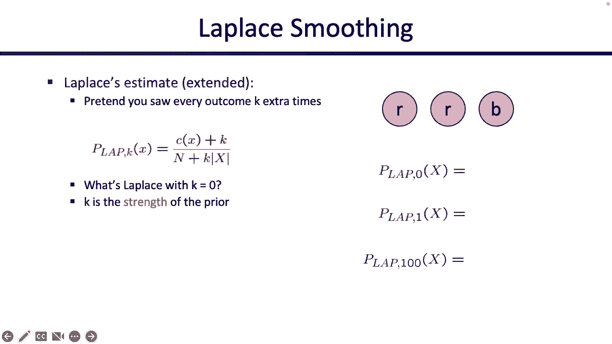

# P25：[CS188 SP23] Lecture 24 - Machine Learning_ Naive Bayes - 是阿布波多啊 - BV1cc411g7CM

 Okay， cool。 Let's get started。 So it is the start of the machine learning unit。 Oh， fancy。

 So you have to write a lot of the modern state of the art and see things that you see in。

 the news like the GPT models and the image generating models come from。 And we'll talk。

 about kind of the mathematics behind it。 We're not going to be able to give you a huge overview。

 of it。 There's a whole class here for that， but we can kind of give you the basics。 So。

 what is all this hypermimension learning anyway？ And how does it differ from what we've seen。

 so far？ So so far in this entire class， someone has always walked up to you and handed you， a model。

 For example， they'd say like， here's a search problem， give me an algorithm to solve， it。

 Or here's a base net with the probabilities filled in。 Tell me how to do inference in it。

 Someone would always walk up to you and give you a model and you would somehow， you know。

 take that model and compute from that model and learn something from the model。 But the machine。

 learning， the parameters are a little bit different。 So now instead of someone walking up to you。

 and handing you the model and telling you what to do with it， you're actually going to build。

 the model yourself。 So we're going to start seeing this today and more next time， instead。

 of someone walking up to you and telling you， here's the base that here， please solve it for me。

 We're going to think about what does this base net come from anyway？ So how do I build this。

 base net before I solve it？ Or if I were to use more complicated machine learning algorithms。

 how do I take the data that I have available to me and build a model out of it？ So that's kind。

 of what makes machine learning special and different from everything we've talked about so far。

 But today we'll see a small example of it with like a base net based machine learning algorithm。

 and then we'll expand from there over the next two weeks or however long I have left up here。 Okay。

 sounds good。 Okay， let's quickly talk about the kind of general task that's going to。

 underlie a lot of the machine learning we're doing。 So just like how when we talked about search。

 we have like our classic search problem examples。 And when we talked about， MDPs。

 we had like our grid world example available to us。 We're going to have a running example too for。

 machine learning and our running example， which is not the only example of machine learning。

 but it's the one that we're going to use called classification。 So this is kind of the goal of。

 what our algorithms are going to do。 I'm not going to tell you how to design an algorithm to do this。

 yet， but I'm going to tell you what the goal is。 So here's the goal。 We have some world in which。

 there are a lot of different data points。 I'm going to call these data point X。 And each data。

 point has a label Y。 What are the labels or what are the classes？ We'll show you some examples。

 And the goal is I want an algorithm that takes in an input X and it has an unknown label Y。 So I。

 don't know what the label of this input is。 And I want an algorithm that can predict a label for me。

 So that's the model that we're looking for。 We want an algorithm that can do this for you。

 So someone walks up to me， hands me an input and says， what class or what label is associated with。

 this input？ I don't know。 So I need to run some algorithm to figure it out。 And a common way that。

 people do this and again， it's not the only way， but it's the way that we'll see today。

 is they're first going to take this example or take this input X， they're going to extract some。

 features out of it。 What are the features？ The features are something useful about this input X。

 that maybe gives me some clues as to what the output Y might be。 So I'll take these inputs。

 I'll run them through some machine learning algorithm， we'll show you just one today。

 And then somehow I'm going to output a predicted label。 So that's the general goal of what we want。

 to design。 Okay， I haven't told you how to do any of this yet。 And I haven't shown you any examples。

 just telling you that this is the general case of what's going to happen。 And then let me make a。

 bit more sense when we see examples。 Okay。 And well， how is the machine learning algorithm going to。

 work？ And this is the key that makes machine learning algorithms different from everything。

 else you've seen so far。 So so far， what we've done is we've often taken numbers that someone。

 handed to us and then we kind of crunch all those numbers and figure something out。 So when hands。

 with the probabilities， we turn on those probabilities and we figure something out interesting。

 But in， machine learning， the difference is that we're not going to come， we're not going to like。

 generate intelligence or figure out something useful based on algorithms that we write or our。

 own knowledge， we're going to take data and try to figure out something intelligent directly from。

 the data。 So we're not going to reason about the data ourselves， we could reason about the data。

 ourselves and we'll talk a bit about what the difference might be。 But instead， what we really。

 want is we want someone to give us a pile of training data。 And the training data might be。

 lots of example data points in telling us what their labels are。 And then using that training data。

 we want to be able to try and make predictions or learn some patterns that can help us make predictions。

 later。 But I think there's all kind of a lot more in place when we show you an example。

 So I'll show， you some examples and then come back here and talk a bit more about this。

 So here's the most， classic example that you'll see。

 it's been used for like 20 years and it's still pretty common。 It's the spam filter。

 So when you're using your email， you don't see a lot of spam。 Why is that？

 Because there's some spam filter working to sort out the spam emails。 So in this case。

 the input x is an email。 So someone hands you an email and they ask you to classify it as one of。

 two labels or classes。 Is that a spam or it's not spam and in the world of spam classification。

 people call that ham。 So ham just means not spam。 Right。 And so this is the kind of goal。 So you're。

 going to take an email and somehow you're going to extract some features out of that email， which。

 might tell you some useful things about that email that might give you some clues about whether it's。

 hammer spam。 And then somehow we're going to pass through this machine learning algorithm that's。

 going to tell me if it's hammer spam。 But what makes this machine learning algorithm different。

 from the ones we've seen so far is that what you could do theoretically， as you could say。

 I am an expert in spam detection。 I know exactly what corresponds to spam and what it corresponds。

 to ham。 So I'm going to use all of my human knowledge。

 I'm going to write down all the rules of like， this is ham and this is spam on and write it down。

 I'm going to generate my expert algorithm for， ham spam detection。

 And that's my algorithm to detect。 That's great。 But that's not machine learning。

 You did learning yourself in that case to learn about what makes spam and ham different。 So what。

 makes machine learning special is that you are not doing the learning。

 You are actually going to make， the algorithm learn the patterns behind ham and spam for you。

 So you're going to take all this， training data was the training data。

 The training data is a bunch of example emails。 And maybe it。

 tells you like this email is spam and this email is ham。

 You're going to take all these sample emails， that someone has provided to you somehow。

 How did they provide it？ That's another question we have， to answer。

 But somehow someone has provided a lot of information to you and you call that training， data。

 And what you're going to do is you're going to try and learn patterns about spam and ham。

 based off that training data。 So you can almost think of this as like you studying for your exam。

 Someone walks up to you and hands you a lot of training data like practice questions that are。

 already solved for you so you know the answers。 You look through them， you study them， you try and。

 figure out the patterns of what's going on。 That's you studying。 That's you taking project exams to。

 make sure you know what you're doing。 And then eventually when you think you're ready to go。

 you think you've learned all the patterns， you walk in and you take the final exam。

 Someone presents， to you a new question that you haven't seen before。

 Here's a new email that you haven't seen before。 Is it ham？ Is it spam？

 And it's your job now to use all those patterns that you learned from before。

 to determine if it's hammer spam。 So that's the setting。 Okay， the goal is classification。 The way。

 that we're going to implement this algorithm is not by writing down the rules ourselves of what's。

 ham and what's spam， but actually taking data that someone provides to us and trying to automatically。

 learn or induce the patterns about ham and spam out of that data。 So this pattern of study， we want。

 to somehow implement that in code so that when it's time for the final exam and someone walks up to。

 us and gives us an email， we can classify it as hammer spam without actually doing the learning。

 ourselves。 That's the goal。 Okay， that's the framing of what we're going to do。 We haven't told you。

 how to do it yet。 Okay， but we kind of think about how would you do it yourself？ So CS100。

 it's spam detector。 Let's detect some spam together。 So let's read these。 Dear sir， first。

 I'm a solicitor confidence in this transaction。 This is by virtue of its nature as being utterly。

 confidential and top secret。 What do you think？ Spam？ Ham？ But it looks so important。

 It's top secret。 It's spam。 What about the next one？ To be removed from future mailing。

 simply replied to this message， and put remove in the subject 99 million email addresses for only 99 dollars。

 Ham？ Spam？ But it's such a good deal。 It's them。 So the question is， how did you know this was spam？

 How did you know， that it wasn't ham？ Somehow you took this email and you extracted some useful features out of it。

 and some patterns that told you whether or not it was hammer spam。 So maybe these features are like。

 you saw the word free and you feel like that's some sort of advertising。 It's spam。

 or maybe you saw the all caps and that told you something was suspicious or you saw the dollar signs。

 and it felt like someone was selling you something。 So somewhere in this email， you were able to。

 extract some features that give you clues as to whether it was hammer spam。 And you did that kind。

 of automatically in your head。 But somehow we would like to also automate that and induce that somehow。

 Right？ Okay。 So today is the process of automating what you just did， right？ Into algorithms。

 You're not going to write down the rules of what you know are hammer spam。

 but you'd like to take a bunch of training data， feed it to some machine learning algorithm。

 Somehow it's going to train on that data， learn some patterns about well， this is indicating spam。

 and this is indicating ham and then eventually maybe you can take the final exam and classify。

 things as hammer spam。 Okay， that's one example。 There are other examples like digit recognition。

 So someone gives you a picture like a bunch of pixels。 So they tell you which pixels are colored。

 in in a grid and they ask you what digit did this person write zero through nine。 So again。

 there's training data。 You're not going to learn the patterns of like a one looks like this and a。

 two looks like this。 You could write that down， but that's not what you want。 Instead。

 what you want is you want to take this data that someone has provided to you again。

 how you get this data is more of a data science problem。 We're not going to be able to talk about。

 it in detail， but somehow someone has provided to you all this data of like hand labeled digits。

 and you'd like to take these digits and somehow learn the patterns of like， well。

 if you see this is kind of like a two and you see this is kind of like a three。

 but you want to do that automatically。 You don't want to do it and you don't want to write down the。

 rules manually。 And so that way， unless someone comes up to you and gives you a new digit that。

 you haven't seen before a new picture， you can somehow figure out what digit it is。 That's the。

 pattern。 Someone gives you a bunch of data， you train on the data to learn the patterns automatically。

 and then when it's time to take the test， someone gives you a new piece of data that you haven't seen。

 before， and you should be able to classify it。 Right。 And somewhere in the process of training。

 what often happens is instead of turning on the data itself， we extract features out of the data。

 and then we train on the features。 Okay， so instead of looking at the pixels one by one。

 maybe we can look at interesting features like， is there a loop in the picture or， you know， is it。

 round or is it like a line， right？ Those are things we can look at in features we can extract。 So。

 there's a lot of classification tasks， but hopefully you're kind of convinced this is important。

 useful。 It's the example we're going to go with。 Sounds good。 Yeah。 Yeah， great question。

 which is where do the features come from？ So this really depends on， your algorithm。

 So some algorithms， and we'll see you some next week as well， the features actually。

 come directly from the algorithm itself。 The algorithm might be able to learn the features。

 themselves and figure out what's important and what's not。 But for the algorithms that we're。

 going to see today， I guess next week next Tuesday。

 we're going to start with ones where the features， are given to us。

 So somebody else is going to figure out this part for us。 Somebody else is going to。

 figure out this first part for us， where they extract the features out for us， they're going to。

 write that code for us。 So we're going to get the features already given to us。 And then our job is。

 to figure out the second half where we take the features and predict something useful out of them。

 Yes， that's a great question。 I was just about to mention it。 Okay。 So yes。

 how the features come out， kind of depends on what algorithm you're using。 But for today。

 we're going to see some algorithms， with features are kind of done for us。

 Someone else has done them。 So we just have to take our， input， look at the features。

 and then predict some input or output。 Okay。 So our features or our。

 algorithm for today is called naive base。 It's based on a base net。 So it's going to look kind。

 of familiar in that sense。 And here's the idea。 We're going to build a model。 So we're going to。

 build some sort of base net， right？ And in the base that we're going to have some information。

 about what are the features and what are the outputs， right？ And then somehow we're going to use。

 this base net to make predictions about what we think the future or what the output is， given。

 the evidence that someone has given to us where the evidence is the input that someone provides to us。

 But there are some questions like how should I draw this base net？ And we know that base nets have。

 numbers hiding inside like those probability tables。 So where are these coming from？ These。

 are all questions we have to kind of answer as we build this。 So I'll walk you through the whole。

 naive base model front to back， and then we'll try to break it down and see what's going on。 Okay。

 so here is the model。 This is most likely what you're going to be doing mechanically。 You've。

 been trying to do naive base， so you're looking at homework or something。 Okay。 Remember， what is。

 a base net？ A base net is a lot of random variables。 When there's something you don't know。

 or you have， a probability distribution over， you make it a random variable。

 What are some things that could， be random variables in our classification problem？

 The label is a random variable。 So let's draw that， we'll call it y。

 It's a random variable because we don't know its value。 It could be spam， it could， be ham。

 We don't know。 What are some other random variables？ The other random variables are the， features。

 So these are the features that come out of the data set， right？ So like we said before。

 someone provides to us some input x for some training data x， we extract the features。

 how are the features extracted？ Someone has done that for us already。 So someone else has。

 already picked the interesting features and extracted them for us。

 So we're just going to feed those， features in as evidence or as nodes。

 So we don't know what the features are， or maybe we do， but we're。

 going to instantiate them as nodes as random variables。 Maybe we don't know the features。

 maybe we do， know the features， we'll instantiate them as evidence or nodes here。 Okay。

 so look at this base net。 We， know that base nets have probability tables inside。

 What probability tables have to hide inside this， base net？ Let's think about that。

 We know that base nets always have tables telling us about the， random variable given its parent。

 So if you look inside the y node， you're going to see P of y。 What is P of y？

 P of y is a distribution over how many emails are spam or how many emails are ham。

 It's like a distribution over how often an email is spam or ham。 That's what that says， right？ You。

 have P of spam P of ham， or whatever variables you are。 P of zero， P of one， P of two， P of three。

 make you the digits。 So given no information at all， there's no parents of y。 So given no。

 information at all， how common is each of the labels？ That's P of y。 In order to solve naive base。

 we have to figure out P of y somehow。 We haven't told you how， but we're going to figure it out。

 What else is in this table？ So there was P of y。 What else is in here？ There's P of f one given y。

 This is just straight from the base net， the node given its parent。 What is this？

 P of f one given y。 Well， there's also P of f two given y。 What are these？

 These are tables that tell us something about， how does the feature change？ Given the label。

 That's what this says。 So if you know the label， what is the distribution of the features？

 Does this feature become more likely if it's spam？

 Does this feature become less likely if it's spam？ Somehow this tells us the relationship between。

 the label and the features。 And we'll see an example of this too。 But these are the tables。

 that are hiding inside the base that we don't actually know their numbers yet， but somehow we'll。

 train them to figure them out from the data。 Okay。 So this is a structure， right？

 I haven't told you， how we're going to learn the numbers yet。

 I'm just telling you that if you choose to use the， naive base algorithm。

 you're going to start out with this structure and then move on from here。 Okay。

 So as we said before， machine learning is always kind of a game of two steps。 So the first。

 step is you have to train， which means we need to like study for the exam。 We need to get the data。

 that someone has given to us。 So they give us a lot of features to labels mappings。 So they give us。

 like this feature corresponds to spam or like， you know， this input has these features in that spam。

 this input has these features in its hand and so on and so forth。 But we need to study these。 So。

 we're going to take the data that someone has given to us。 We're going to study them really hard。

 and somehow extracts and patterns from them。 What does actually mean in the naive base model？

 It means that we're going to use the data that someone has given to us to fill in those probability。

 tables。 Without any knowledge at all， we don't know what was in the probability tables。 But if。

 someone gives us data， we can use the data to estimate what the probability tables might be。

 And those estimates， we hope encode some interesting patterns about the features and how they relate to。

 the label。 Okay。 So we take the data set， we study it really hard。 We figure out the best。

 probabilities that they can put in this table based on the data。 So we're going to estimate P of y。

 and we're going to estimate P of F given y， which tells us how does the label affect the features。

 That's the training portion。 So that's you studying studying studying。 Eventually you're done。

 studying on your data set and you're happy with your studying and you're saying， I think I know。

 the pattern。 I think I understand the spam in hand。 And so somehow my like automated algorithm。

 has learned something about spam or ham and it's hiding in this basement。 What did it learn？

 I don't， know。 Did it learn something useful？ I hope so。

 But you didn't tell this algorithm anything about， spam or ham。

 So it's not like you telling this algorithm like， hey， if you see the work free， try and get spam。

 This algorithm has to figure it out for itself based on the training data that， has been given。

 So eventually you're done studying and you think you're ready to take the final exam。

 That means that you're ready to publish your classifier to the world。 So what happens when you。

 publish your classifier to the world， someone walks up to you and gives you a brand new email。

 that you've never seen before。 You take this brand new email， you extract the features out of it。

 which someone has done for us。 And we take those features as evidence。 So someone tells you， here's。

 the email， you convert the email to features。 That's great。 Those are your evidence。

 Now all we have to do is base that inference。 So it's base that inference， base that inference。

 which says， given this base that I can extract probability distribution from it， you've seen this。

 a couple of weeks ago， we even used the yesterday。

 So hopefully you're convinced that we can do base， that inference。 In particular。

 the thing that we want to inference for a query for is this distribution。

 What does this distribution say？ It says， what is the probability of the label given the evidence？

 That sounds like a pretty reasonable thing to ask and we can use it to classify it。 So using this。

 model， someone gives us the evidence， we fill in all the features as evidence， and then we ask this。

 model， how likely is it that it was spam given this evidence or how likely it was it that the email。

 was ham given this evidence。 And by using that query， we've somehow figured out a classification。

 for this unknown data。 And we hope it's a good classification， but we don't know。

 That's the overall， structure of what's about to happen。

 So now we can show you kind of all the steps。 Okay， but that's。

 the high level model of what we want to do。 We want to train。 And then once we're done training。

 we want to classify it。 All right， let's just have a training。 Ready？ So first， we're going to say。

 we're using naive base。 So we've thrown out all the other machine learning algorithms out there。

 and we've chosen to use naive base。 Good for us。 That means that because we're using naive， base。

 we are going to draw a base net that looks just like this。 There's a label， and there's a。

 bunch of features and all the features are effects of the label。 So that's why we have the arrows。

 pointing from the labels to all the features。 In this case， we're just going to choose two features。

 And again， how did I choose these features？ I haven't told you that yet。 We'll do that like a。

 week from now。 But for now， assume that someone has told us what the features are。 And so they tell。

 us that the features that you should use， we're not telling you how these features relate to him or。

 Stan， we're just telling you that these are the features that might be clues that are useful。

 Let's have two features。 So one feature is， do I know the sender？ Yes or no？

 I can look at the email， I can write some little piece of code that extracts the feature out of that email。

 Okay， there's another feature that says how many times did you see the word free in the email？

 And that's a number。 And again， I can take my email， I can write some little piece of code that。

 calculates how many times the word free occurs， and I can extract the features。 So when someone。

 hands me a piece of input X， whether they want me to classify it or whether they want me to train。

 on it， I can always extract the features from it。 And someone has done that for us。 We're not going。

 to worry about that today。 But somehow someone has extracted these features。 And then we need to。

 automatically learn patterns out of these features。

 That's the part that we're going to automate today。 Okay， great。

 So these are the tables hiding inside the basement， just like we saw before。 This is P of， Y。

 P of Y tells us given no evidence at all， what's the probability of him？ What's the probability of。

 spam？ Do you know？ I don't know， we're gonna have to learn it from data。 This is P of F one given Y。

 So is the table hiding inside the F one node？ And it looks just like you would expect in a basement。

 right？ It tells you for every setting of F one and Y， gives you some probability of F one given， Y。

 What's in here？ I don't know， we have to learn it。 And then same thing for here。 This is P of F。

 two given Y， right？ We have to learn that。 Okay。 So how do we learn these？ I don't know。

 Do you know？ I don't know。 So it's like， if we were to learn these from experts。

 that would be great。 Maybe like， I use all my knowledge of spam to tell you that like， you know。

 if I know the sender， the probability of， or if I know that it's ham。

 the probability that I know the sender is high or， whatever， right？

 You can write these numbers yourselves， but that wouldn't be training。 Training。

 would be someone hands you the data and you learn these patterns and these numbers from data。 So。

 let's try and learn from data。 This is us doing machine learning training。 Okay， we're gonna train。

 from data。 Someone hands us this data。 This is labeled emails。 So someone tells me。

 these are some emails and they tell us the labels。 So like， what is this one？ This is。

 real limited credit cards， exclamation point， and they tell us this is spam。 That's an example。

 email that someone has handed to us。 So using this training data。

 we should be able to give our best， estimates of this probability table and let's try to fill it in if we can't。

 Let's try it。 What do， we want？ We want the P of so what is this one？ This is P of zero freeze。

 given that the label is ham。 How do I know this number？ I can estimate it from the data。

 So given that my email is ham， that would be these two。

 How often do I see zero instances of the word free？ Well。

 there's two ham emails and one of them has zero instances of the word free。

 So my best estimate for this probability is 0。5。 How do I do this？ I just counted up my data。

 So according to this data， if I know that something is ham， 50% of the time， the word free。

 occurs zero times。 Is that a good estimate？ It depends on my data， but that's what I estimated。

 I keep doing this， right？ So I could say， well， you know， given that the email is ham。

 how often does， the word free appear exactly once that happens in email number two？ So that's 0。5。

 That's really， ugly。 I'm sorry。 How often does the word free appear twice if the email is ham？

 According to this data set， zero。 I never actually see a case where the email is ham。

 and there's two instances of the word free。 I keep doing this， right？ So I can look like a one。

 email is spam。 How often do I see the word free zero times？ There's one email like that out of。

 four。 So that would be one fourth。 How often do I see the word free once？ I see it twice。

 Email is number three and five。 So there you go。 And then how often do I see the word free。

 twice in the spam emails？ 0。25。 How did I get these numbers？ I just did some counting。 There was。

 nothing super complicated here。 Okay， I'll give it to you in nice， clean numbers。 There you go。

 Okay。 How did I get these numbers？ I just counted。 But by counting， I just did some training。

 So these， numbers now encode information about the patterns of spam and how they affect the feature。

 of number of occurrences， the word free。 And I didn't have to specify it myself。 I never had to。

 say something like when you see free， you should start thinking spam。

 All I had to do was look at the， data， calculate some numbers from the data。

 and hope the data automatically gave me some patterns。

 about how the label affects how often you see the word free。 Okay。 That was really small data set。

 It was like six emails。 You can imagine training on more。 And so I've pretended like I train。

 another bunch more data and giving you some more accurate numbers。 Question。 Yeah。

 So the question was， does the training process differ depending on what model I'm using？ Yes。

 So in this case， I'm using a naive base。 So I need to train by filling in the parameters of。

 the base net。 If I were training based on a different algorithm， maybe the different algorithm。

 doesn't use a base net at all， like the one we'll see next time， then you don't have to estimate。

 parameters in the base net。 So the training algorithm does depend on what model you're using。

 But generally， the idea is always going to be the same， which is you take some unknown parameters。

 and you estimate them based on data。 Another way of putting it is。

 another way of putting training is like someone hands you a， bunch of data using the data。

 you try and estimate or fill in the parameters of the model。 And hopefully。

 a big good one so that the classification comes out accurate。 Okay， so here we go。 We've got the。

 model train on the larger data set。 And again， all of these numbers came straight from data。

 disencounting and the counting gave me some interesting patterns。 And you can see that， for example。

 here， this is telling me that， you know， given that the email is ham， it's pretty likely that I。

 know the sender。 So if the email is ham， I know the sender 70% of the time。 And if the email is。

 spam， I know the sender only 10% of the time。 That feels pretty normal， right？ If the email is。

 spam， I probably don't know the sender。 If the email is ham， I probably do know the sender。

 Did I have to write that down in English and be like， Hey， model， when you see the sender。

 it's probably ham。 I didn't have to write that。 I learned it from data。 That's kind of the magic。

 of machine learning。 Someone gives you the data。 And without having to think about this specific。

 problem， you were able to infer a bunch of interesting patterns from the data， hopefully。 Okay。

 Great。 So here are all the patterns， right？ And then the one up here， how did I get this？ I。

 just counted 60% of my emails were ham， 40% of my emails in the training data set were spam。

 So in the absence of any other information， I think the email is spam with probability 40%。 Okay。

 Great。 So now we've trained it。 And because we finished training， we are now ready to walk。

 into the exam and classify something we haven't seen before。

 So someone walks up to you and gives you， this brand new， shiny email， refood and soda for 30 today。

 Don't actually go to soda for 30。 I don't， think this refood。

 But suppose that there was free food or you just got this email， you want to know。

 is it's spammers at ham。 So what do you do first？ First， you extract the features from it。 Again。

 we're not going to talk about how that happens today。 But someone has told you what the features。

 are。 You write a little bit of code to extract the features。 So you look at the email， you figure。

 out that you do know the sender。 Okay。 And you count the number of times for your occurs， this one。

 So you extracted the features。 From the email。 Okay。 Great。

 These are the tables that we saw from earlier。 So nothing new here。

 Now all we have to do is perform inference。 So I suppose I should redraw on the base and。

 I hear that I'll draw it for you one more time because it's small。 Okay。 So now all you have to do。

 is estimate the probability of ham given the evidence and the probability of spam given the。

 evidence。 Everything on this slide is based on that inference from two weeks ago。 So it's about。

 to be really long and really mathy， but don't get too scared。 All of it is stuff you've seen before。

 I'm just writing it out for you in case you're wondering。 So what do you do？ You instantiate。

 the features just like we do in the past， you color in the features and you say， sorry， that。

 was probably too much coloring。 Okay。 You color in the features and you say。

 I know F1 and I know F2。 Why do I know them？ Because someone gave me the features and gave me the input。

 So I instantiate， the features just like I always do in basement inference。

 Then I want to figure out what I want， to know。 I want to know the probability of spam given the features。

 That would be great。 I guess I'll make them lowercase because you know the features。

 So I really want to know the， probability of spam given the two features。

 I also want to know the probability of ham given the， two features。

 This way I can classify it as more likely to be spam or more likely to be ham。 How do I do this？

 This is a pure basement inference problem。 There's no more machine learning here。

 You're just doing pure basement inference。 And if you remember basement inference。

 all you have to do is calculate the joint probability。 This is like inference by enumeration。

 How do you calculate the joint probability？ You multiply all the pieces of the basement together。

 So what are the pieces of the basement？ The pieces of the basement are F1 given Y， F2 given Y。

 and Y。 If I multiply these three pieces of the basement together。

 I get the entire joint distribution， back。 I want the joint distribution and multiply the pieces of the basement together。

 How do I， know the values？ I look them up in the tables based on my evidence and I get these numbers。

 So this tells me that in the world of all possible emails， the probability that I get a spam email。

 with a sender that I know and the word free occurring once is that thing。 And the probability。

 that I get a ham email with a sender that I know and the word free occurring once is that thing。

 This is pure basement inference。 We don't get too scared with the numbers。 Okay。

 but this is then what I want。 I don't want the joint。 I want the conditional probability。

 of spam given the evidence and ham given the evidence。 And remember the little normalizing。

 trick that we talked about？ You can perform that trick and that tells you that the probability。

 of spam given this evidence is 14% probability of ham 86%。 And so your classifier can now tell you。

 I am 86% chance confident this is not spam and I'm 14% confident this is spam。

 Or if you just need a guess like hammer spam， tell me they could say 86% greater than 14% so。

 let me just say I think it's ham depends on what you need。 So based on that could give you some。

 probabilities or if you just want to guess， just look at the numbers and say yeah。

 more likely to be， ham。 This is really cool， right？

 Even though I never actually thought about these features myself， I never asked you like。

 do you think that free indicates spam or ham？ You never had to think about， that。

 All you had to do was take the data， learn the numbers from the data， and then someone could。

 give you this new email that you've never ever seen before。 This wasn't in the training data。

 this is a brand new email that you've never seen before。 And somehow this model， which was really。

 small and simple， was able to give us a pretty good guess， which was that this email is ham。

 Is it actually ham？ I don't know， but it seems like it made it pretty good or pretty confident guess。

 That's good。 I get this email all the time， so maybe it's ham。 I don't know。 Okay。 Great。

 Questions on how naive base works？ You actually seen the whole algorithm。 And for the。

 rest of the day， we'll just think about other properties of machine learning or how the overarching。

 ideas of machine learning kind of show up over and over again in our little naive base example。

 But this is like your number one or your first ever machine learning algorithm。 And you've just。

 seen it front to back。 We took data， we trained on the data， and then we classified things we。

 haven't seen before using the patterns that we learned from the data。 That's it。 Okay。

 This is just one machine or one naive base model。 You can also use it for other problems。

 So you can， do it for something like digit recognition。 So in digit recognition， again。

 the model is the， same， which is that you have a label， which could be something you don't know。

 So in this case， it's not hammer spam， it's zero through nine， they're digit。

 And just like before you have a， bunch of features。

 what are the features that depends on someone who's going to extract them， for you for today。

 And those features， like we saw before， they could be interesting features， or like possibly。

 you know， intuitive features like how often this free occur， or do I know the， sender。

 they could also be really stupid features。 And sometimes naive base works really well， even。

 if the features are super basic。 So a really basic feature that takes no computation at all to do。

 could be like， is this pixel on or off？ Is this pixel on or off？ Is this pixel on or off？

 Those features are not they don't have intuitive meaning。

 but you can still use them to learn patterns。 So in this case of digit recognition。

 we've just chosen to take the features， as the pixels being on or off。

 So I take this number that someone wrote， this is a picture， right？ Really blurry picture。

 And I extract a bunch of features from it， and the features are like。

 the pixel on zero zero is off and the pixel on zero one is off and the pixel at zero two is on。

 so on and so forth。 I extract the features。 Each of these little feature nodes corresponds to a。

 feature which I may or may not know。 Right， so if two could correspond to， is the pixel at zero。

 comma one on or something like that。 Okay， what is this equation？ It's so complicated。 There's so。

 many letters。 What are you doing to me？ This equation is just what you saw from before。

 It's just regular， old base in that inference。 So don't get too scared by it。

 Let's try and break it down。 What does it say？ It just says， the thing I want。

 the thing I always want to query for is the probability of the class， given the features。

 What this means is， if someone gives me the evidence， which means they， supply to me a picture。

 I extract the features from the picture， and I tell you what the features are。

 what is the probability that the number was zero based on all my features？ What's the probability。

 that the number was one based on all my features？ What's the probability that the number was two。

 based on all my features？ So this term here just tells me a probability distribution over what the。

 number might be or what the classification might be given all of my features。

 How do I calculate that？ I do inference by enumeration， classic based inference。

 How do you do based on that inference？ You multiply， all the terms of the base and that together。

 you get the joint distribution， and then you normalize。 You've seen this before。

 How do I multiply all the terms together？ What are the terms？

 There's a p of y term that corresponds to the table hiding underneath here。

 And then there are a bunch of f1 given y， f2 given y， all the way up to fn given y。

 There's one term， per feature。 That's this product term over here。

 So I take all the f given y's and I multiply them， together。 I blow it up。 I get a joint。

 I do some normalization， which is why you see this little， proportional symbol over here。

 And once I normalize， I get my distribution。 What was all of that？ If it， didn't sound familiar。

 we spent two hours talking about base and inference。 So it's something you've。

 seen before and hopefully you're familiar with。 Okay。 So this is how you classify things in your。

 digit base。 And again， the question is where was the training？ So how did I learn information from。

 the data？ The training came from the fact that you didn't actually know what was in these tables。

 So like， how did you know this table that's maybe hiding underneath f1， which is like f1 given y。

 What's in this table？ This table might have things like， what's the probability that， you know。

 pixels zero comma one is off， even that the digit is three？ I don't know。 You have to。

 compute this from data。 Or what's the probability that pixel zero one is on given that the digit is。

 for？ I don't know。 That could be that from data。 So these tables， these conditional probability。

 tables contain numbers that I learned from the data。 And then I solved the base and。

 her performance and I got classifications out。 So the training was someone gave me a bunch of。

 numbers labeled。 I extracted the features out， which in this case， which is the most basic pixel。

 like a think of。 They don't really have intuitive meaning， but they can still be features。 The。

 features don't always have to be intuitive。 I extract the features。 I learn all the numbers in。

 the tables。 And then I do classification。 I do regular all base and inference。 Okay。

 One another example。 Okay， let's do a general one。 So in general， business are always going to look。

 like this。 There's going to be a label at the top。 And it's going to point to all the possible。

 features that are out there。 This basement is not the only base that you can use。 In fact。

 it's called naive base。 Naive means like， you don't know anything or is that the dictionary。

 definition of naive？ I don't know。 But the definition of naive is like。

 you're not the smartest cookie， in the room， right？ So like。

 this is called naive base because it makes a lot of assumptions， that maybe you shouldn't make。

 So it's not a very smart model or it's not a very hard thinking model。

 But it turns out that in practice， it actually works pretty well。 So this naive base model makes a。

 lot of assumptions。 For example， it assumes that feature one and feature two are not correlated。

 with each other， given the class。 Normally， we'd say something like they're conditionally independent。

 given the label。 But you can think of it as like， there's no relationship between feature one and。

 feature two。 Is that actually true？ I think back to our intuitive span example， where are you。

 spam example？ Okay。 Is it true that if I know the sender。

 or whether I know the sender and how often， the word free acres are these two like actually always independent given the label？

 I don't know。 Maybe one is correlated with the other。

 So maybe people that I know tend to use free less or people。

 that I don't know tend to use free more， there might be correlations that I'm not capturing here。

 And if I wanted to capture them， I might have to add more arrows in my base net。 More arrows。 Okay。

 This would be a different model。 This would not be naive base。 Now。

 you face says that all the features are independent given the label。

 That is a strong assumption to make。 But it turns out that in practice。

 it often produces good results。 Dissequagional is another equation， but it's the same one you。

 see over and over again。 Right。 Just like we said before。

 if you want to know the joint distribution， which you can then normalize to get the conditional distribution of label given features。

 which is， what you're after， you all you have to do is multiply the terms of the base net together。

 The base is always going to have one term p of y。 That's the term corresponding to the node up here。

 And then it's going to have a product of a bunch of smaller terms， which kind of correspond to the。

 things down here。 Okay。 That's a really awkward line that I drew， but that's okay。 Okay。

 So you take the terms of your base net， which is always going to be a p of y， and then a lot of p。

 of f given y's， you multiply them together， you get a joint， you normalize。

 you get the distribution， you're after， which is probability of class given labels。

 You always want class given labels。 You， want probability of scan given features。

 the probability of digit given features。 Okay。 Just to give it to you one more time。 Okay。

 I guess this is the size of this thing。 So it's not very big。 You can think about that if you want。

 then I'm going to skim over it for， time， but you can calculate how big these tables are。

 That's what this is。 Okay。 It's very simple， but turns out it actually works pretty well。

 And it's the first thing that a lot of people try。 So here's another case of。

 or here's another way of drawing out the inference， if you're still。

 not really convinced that the inference works。 So I want this joint， but this joint is actually a。

 lot of numbers， like in a big vector。 So， for example， just like before， what did I want？ I want。

 a p of spam given labels， and I want a p or spam given features。 I want a p of hand given， features。

 So I want a one for each label， or I want a p of zero given that these are the features。

 and p of one given that these are the features。 p of the digit is two given these features。 So I。

 want like kind of a vector and each value in the vector corresponds to the probability of one of。

 the labels， one of the digits or one of the classified or one of the classifications given。

 the evidence or with the evidence。 This is the joint。 How do I get the joint？ I expand out the。

 basement and I multiply every term of the basin together， classic basement inference。

 but I don't want the joint。 I want the conditional。

 I don't want to know what's the probability that， it's spam and all of these featuring the way that they are。

 I want to know the probability of spam， given that the features are the way they are。

 So I do a normalization trick down here。 This normalization。

 trick is another thing you've seen over and over again in basement inference， and that out pops the。

 distribution you want， which is probability of label given all the features。 Okay， so the general。

 strategy is the same。 It's just classic basement inference。 There's nothing new。 The only new thing。

 that we just talked about in the last like 38 minutes is just the fact that the numbers in the。

 basin are no longer handed to you。 They are now estimated from the data。

 That is the brand new thing。 So we train by actually estimating those numbers。

 And then when we classify， it's just regular， all-basement inference。 Looks good。

 I want to see one more。 Okay， so we'll do one more。 This one's。

 for spam again or spam at hand or some other like word classification trick。 So it turns out that。

 if you think about taking features that are maybe the words。

 so maybe your feature is just what word， is that position one or what word is that position two？

 That's a feature you could use。 So your feature would be like position zero was the word free and the position one was the word。

 food and the position two was the word at and so on and so forth。 Those are also features you could。

 extract。 You can extract whatever features you want that you think are informative。 So maybe those。

 are the features。 If those are the features， then what are the probability tables that we have to。

 estimate？ We would have to estimate the words on non-using w instead of f because the features are。

 the words。 I would need the probability of the word given the class。

 So this might be something like， maybe it's like word one。

 So this might be something like probability that the word one。

 the first word in the email is free given that it was spam。 And I want the probability that the。

 word one was was another word at given that the email was spam。 And I also want the probability。

 that the word one was free given that it's ham。 And you kind of get the idea， right？ You have a。

 table， it would have all the words and all the spam ham labels pairwise。 It would be a very。

 big table。 And it kind of have like one entry per dictionary。 Okay， don't make me write any more。

 Big table。 Okay， it's for word one。 Then you would have another one for word two and another one for。

 word three and another one for word four。 But do we really need a table for all of these？ So think。

 about the distribution here。 The probability for the distribution of the word and position one and。

 the distribution of the word and position two， is it really that different？ And you put another way。

 If you see the word free and you think it's spam， doesn't really matter if the word free was the。

 first word or the second word or the third word or the fourth word， maybe not。

 And if you don't think， that the position of the word matters。

 you can maybe be a little bit more efficient with how you're， building these tables。

 And maybe you can say， actually， forget doing this， where I have to give you a。

 table of distribution over word one， and I need a table over the distribution of word two。 What if。

 these were equal to each other？ They were the same distribution。 And the probability distribution。

 over word three is the same distribution。 Now， instead of building three different tables or。

 n different tables and learning all of them， maybe you can just build one and reuse it over and over。

 for all the words。 And this is another assumption you made。 So you changed your model。 This is no。

 longer just regular naive phase。 This is called something like bag of words naive phase。 So it's a。

 little bit different。 The difference here is that each f given y table is the same。

 So we just learn， one big table。 And why do we learn the big table instead of a lot of little separate tables？

 That's， because we think that the distribution of word given class is extremely similar。

 whether you're in， position one or position time or whatever。

 But that's another assumption you made。 So your model changed。 Okay。 Question。 Yeah。

 that's a great question， which is， doesn't the position give some context？ It sure does， right？

 And maybe you think that the position of the word has some effect on the label。 So then your model。

 would be different。 But this is just one particular assumption that people have made， which is that。

 maybe if I think that the position of the word doesn't matter and just the word itself is enough。

 to make a pretty good prediction， then maybe I can do this in safe space or some computation。

 So you're right。 This is an assumption。 You can definitely make your own model that says the。

 position of the word matters。 But for a lot of people， they think， well， if the word free occurs。

 it's probably spam no matter where it occurs。 But they use that assumption to change their model。

 If you don't like the assumption， you can make a different model。 Okay。 This is just one particular。

 assumption you can make。 Okay。 So what would this model look like？ It would have a label Y。

 and then it would have a bunch of words。 So before we were calling them F for feature。

 because we're dealing with words， we just chose to rename them W。 So here we go。 There's a lot of。

 W's and they go on and on and on。 Right。 If this were a regular naive phase， what would I have to。

 learn？ I would have to learn P of Y that's hiding in here。 I would have to learn P of W one given Y。

 P of W two given Y， P of W three given Y。 I would need a distribution for the first word and the。

 second word and the third word。 What does bag of words say？ The bag of words simplification that we。

 made says that actually the table and here on the table and here on the table and here。

 they're the same table。 Is that a good assumption？ I don't know， but it's an assumption。

 It turns out， to work pretty well in practice。 So instead of learning N different tables one per word。

 you just， have to learn three tables。 How nice is that？ And these two tables here。

 W given hand and W given， spam， or maybe you can think of as one big table W given Y。

 you can reuse this table at every position， it's the same table hiding underneath every node。

 Let's actually see what this looks like if you， trainings。 This is cool。

 I'm going to actually pull out real data from a real hand spam training， data set。

 I'm going to see what the results are in my data set two thirds of email were ham。

 one third of email was spam。 So using that， I estimate a P of Y。 P of W given spam， I'm sorry。

 I don't want to spoil it yet。 Okay， these are words given spam， right？ I guess I'll spoil it。

 since I already showed you。 So let's check it out。 The probability what's the most common word。

 given that your email is spam is the， hmm， does that make sense？ I thought it was going to be free。

 I thought it was going to be money。 Well， turns out that we're not asking about what's the most。

 common spam word or what's the strongest indicator of spam。 We're just asking for a distribution of。

 words or how often the words occur。 And it turns out that in both hands and spam， the word the。

 occurs pretty often。 And I guess the word 2002 occurs pretty often。 So any guesses when they。

 collect this data？ Okay， so these are my tables。 How do I get these numbers？ I looked at the。

 I looked at my database or I looked at my training data and I estimated that given that my email is。

 spam， the word the occurs 1% of the time and the word two occurs 1% of the time when the word with。

 occurs 0。8% of the time and so on and so forth。 I just estimated how often these words occur。 Okay。

 using these， I can then do basement inference。 So here's an example where you do。

 basement inference in bag of words。 How did I get these from data？ Okay， so one way you can do。

 basement inference in like this bag of words model or another way you can think of it is that you。

 have a bunch of different classes。 In this case， there's two， there's spam and there's ham。 You can。

 think of spam and ham is kind of like in a race。 You want the probability of email given spam and。

 the probability of， sorry， the probability of spam given email and the probability of ham given email。

 So I guess I'll write this out really quickly。 So you would like the probability of spam given。

 all the different words and you want the probability of ham given all the different words。

 Which one， are you going to classify？ You're going to classify the one with a higher probability。

 So if the， probability of spam is greater， you're going to get spam。

 If the probability of ham is greater， you're going to get ham。

 But how are you going to calculate these probabilities？ These probabilities。

 are not sitting in your basement。 You need to use the basement formula that we just talked about。

 where you have to take the probability of the label itself。 So that would be， spam or p of ham。

 I'm all those little nodes in the basement， you multiply them together to get， the joint。

 So you do some big old product over the word in position I given spam and the word in。

 position I given ham。 And these two products， you're going to compare them and see which one is greater。

 That's the one you're going to get to spam for him。 So if spam is greater， you're going to get spam。

 If ham is greater， you're going to get ham。 So really， all we really need to do is kind of like。

 play a racing game between these two products and see which of these two products ends up being。

 the lower number， the higher number。 So let's do that。 So in this column， I've got p of spam given。

 w1w2。 It's this big product I'm going to compute every term one by one。 In this column。

 I've got p of， ham given w1w2 and so on。 And it's got to be a product of a lot of these numbers together。

 These numbers can get really low because what's the probability of spam and w1 and w2 so on？

 It's a very low number because the odds of these words occurring is all can be pretty low。 So the。

 odds of all of these words together occurring is going to be quite low， but we can still compare。

 the numbers。 Okay， ready？ So let's do this。 Let's do some comparisons。

 Before we have any words at all， I have no evidence so far。

 So I'm just going to multiply in the p of spam term and the p of， ham term。

 That's what I've done here。 So p of spam p of ham straight from the data。 You recognize， them。

 Right？ And on this column， I'm going to keep a running total of what I think p of spam given。

 labels is and a running total of what I think p of ham given labels is。 So these are my running。

 totals of the probability that I think this is spam and the probability that I think this is ham。

 And I want to see which one's greater。 These are negative。 That's because these are kind of like。

 log probabilities。 So if you want to think of them as each of them something， sure。

 this is either the negative one that's either the negative point where。 Okay。 So with no evidence。

 at all， if you didn't give me any evidence and you said time to guess， is this spam or ham。

 I'm going to guess ham just because there are more ham emails than my data said。 So with no。

 evidence at all， I will guess ham。 Here comes the word。 You ready？ Gary。 Okay。 Interesting word。

 So what do I do with this word？ I added to my product。 So in my p of in my spam product， I'm going。

 to add the probability p of Gary given spam or multiply in the probability of p of Gary given， spam。

 And I'm also going to multiply in for my ham product the probability of p of Gary given， ham。

 So I'm going to see how common is the word Gary in spam， how common is the word Gary in ham。

 I'm going to multiply them。 Okay。 It seems like in this case， Gary is pretty uncommon in spam。

 but Gary is quite common in spin or ham relatively speaking。 So what's probably going to happen is。

 the spam number is going to get multiplied with point zero zero zero two， which is going to go。

 down a lot。 And then the ham number is going to get multiplied with point zero zero two one。

 which is a relatively larger number。 So it's going to go down a little bit less。

 So between these two， numbers， e to the negative 11， e to the negative eight。

 e to the negative eight wins。 So if you see， the word Gary。

 you are more likely to think this is ham。 Let's see another word。 Ready？ The suspense。

 would interesting word。 Both of these words are pretty common in ham or spam。 It seems like。

 it's slightly more common in ham。 But in any case， I'm going to take these probabilities and。

 multiply them into my total。 This is the same as running the joint and regular base that inference。

 I'm just doing it step by step for the suspense。 Okay。 Or because this is what people do often when。

 they classify。 So now spam is at e to the negative 19， ham is at eight， the negative 16。 So still。

 p of ham is greater。 I will guess this is ham。 If my email says Gary would be ready for another word。

 Let's go you。 Okay。 What is this word？ Seems like the word you is pretty common in both。

 but it's more common in spam than ham。 So what's going to happen is I'm going to multiply the。

 spam probability by 。8 or 。008。 I'm going to multiply by the ham probability by a smaller number， 。

003。 Now， probability of spam is 。23。 Probability of ham is 。21。 Between these two numbers， I still。

 think it's ham， but it's getting closer。 The probabilities are getting closer。 I can normalize。

 these numbers and get real probabilities。 But as I'm calculating。

 I can just multiply them in one by， one。 Okay。 So Gary would you like to lose away while you sleep？

 Okay。 So multiply all these in。 And at the end， we see that again。

 all of these are log probabilities。 We see that the probability。

 of this sequence of words and spam is e to the negative 76。 The probability of this sequence of。

 words in ham is e to the negative 80。 Both of these are very small numbers。 Why is that？

 Because the probability of getting the email Gary， which would like to lose away while you。

 sleep is very small in general。 It's a very rare email。 There are lots of different emails。

 I would guess if you open your inbox， it's not like 50% of your emails are Gary， which would like。

 lose away while you sleep。 It's a very rare email。 But still， you can look at the relative。

 probabilities and see how often is it that an email is spam and has this sequence of words。

 how often is it that the email is ham and has the sequence of words？ You can check。 And it seems。

 like in this case， the spam number is a little bit greater。 So I think this is spam。 If I want to。

 I can normalize and I would get that the probability that this email is spam 98%。 Okay。

 This is just the base that inference。 I just did it word by word to show you that if the。

 probabilities of all the words are equal， sometimes you can watch the words stream in like this。

 and do classification on the fly。 Kind of cool。 Okay。 And you can see all these red words， like。

 word weight was very common in spam， but very less common in ham or the word sleep appears to be。

 quite common in spam as well。 So all of these are from data。 And like I told you that weight is a。

 spammy word and how the data figured it out。 Okay。 Great。 More naive base。 Okay。 So what do we need。

 to use naive phase？ It's kind of a review of what you've already seen。 We need to do inference。

 to classify we've already seen this。 So we take the probabilities that have been given to us。

 We use， inference is all classic naive phase for classic Bayes net inference from earlier。

 So nothing new。 The new thing is that the numbers in the base net， the conditional probabilities。

 are not handed to you by magic。 You had to estimate them。 Right。

 And we chose to estimate them by using， training data accounts。 Was that a good choice？

 I don't know。 Let's see。 So it seemed like no one。

 really stopped and questioned me and asked me like。

 why is it good or why was it the right thing to do。

 to just count up the number of examples and use that as the probability？ Mostly we just kind of。

 believe me when I told you it was the thing to do。 But if you're questioning me， I can prove to you。

 that that's the right thing to do。 So here's kind of what you just did in the naive phase models。

 but， in a much simpler example， what you really wanted to do is you really wanted to know。

 what the distribution of the random variable was， right？

 Someone gave you a random variable like P of， was it P of feature given class？

 And I wanted to know what was the distribution in this table。

 So I wanted to know the distribution over words or features given that the email was hand or something。

 like that。 So I wanted to know the distribution。 How can I get this distribution？ You could ask a。

 human。 So maybe if you're doing some like medical naive phase diagnosis， you could walk up to。

 you human and say， my label is like， are you sick or are you not sick？ And I want to know。

 how common is it that someone， you know， off given that they're sick or how often is it that。

 someone， you know， sneezes given that they're sick and they can give you numbers。 That's an。

 option you could walk up to an expert asking to give you a number， but you would have to do this。

 kind of once per problem。 And we want to learn from data。 So let's try and learn from data instead。

 Someone gives you training data and you want to estimate a distribution of a random variable。

 This is really just what you were doing when you were training a naive base， but let's do a much。

 simpler example。 Okay， jar of jelly beans， a classic game。 I want to know how many jelly beans。

 in this jar are read or what percentage of the jelly beans in the jar are read。 You can't count。

 them。 There's a lot of jelly beans in there。 But maybe what you can do， so you don't know。

 I'm going to call it theta。 I'll call it theta because that's what people use in literature。

 So theta is the percentage of red beans in the jar。 I don't know。 If I stare at this。

 kind of looks like half， I don't really know。 So I have to guess it。 I don't really have an。

 accurate answer。 Just like how when we did naive base training， the numbers in your probability。

 tables were not the correct exact numbers。 It's not like someone looked at all the spam。

 emails in the world and the almighty spam that were told you that the probability of。

 the known sender given spam was 0。7 or something。 Like they didn't know that。

 There's no true answer。 You just have to give your best guess based on the data that you're given。

 Okay， so I don't actually know the true answer。 That's why I'm going to call it theta because they。

 don't know。 But I can guess theta just like I did from before。 So the way that I'm going to guess。

 theta is I'm going to get training data。 So in this case， the training is going to be， I'm going to。

 pull out three jelly beans from the jar。 Okay， the suspense。 What are the colors？ Red， red， blue。

 So I pull them out。 They're red， red， blue。 Then I ask you based on the sample that I'm providing。

 to you， what is your best guess as to how many jelly beans in the jar are read or what's the。

 proportion of red jelly beans？ And you would say two thirds， because you counted and you said in my。

 sample to our red out of three in total。 So my best guess for how many jelly beans are read in this。

 big old jar is two thirds。 You use the counts to estimate that that a good estimate is that the。

 right estimate to use， I don't know。 But we can maybe prove that this is the best estimate to use。

 And so that's what we're going to do in this little section here。 So if you already get naive， days。

 like we're kind of done with naive days for now， we're just zooming into the training section。

 and trying to convince you that using those counts was the right thing to do。 And this will。

 inform a lot of the optimization that we're about to do in the next couple weeks。 Okay。

 so you got two thirds。 Is that the right answer？ Let's try and prove that it's the right answer。

 Okay， the way that we're going to prove it is something called maximum likelihood estimation。

 It's something you might have seen in like a stats class or something。

 I hear they talk about this a， lot。 But somehow I want to prove that the counts is the right way to estimate theta。

 And so formally， what I'm going to do is I would like to formulate this as a problem like an optimization problem。

 So I want to maximize the probability of the observation occurring。 So theta， maybe one way of。

 thinking of it is like there are a lot of worlds out there。 There's a world in which two thirds of。

 the jelly beans are actually red。 There's a world in which all the jelly beans are red in the jar。

 There's a world in which like 20% of the jelly beans are red。 There are all these different。

 worlds in it。 Every world， there's a different true theta。 You never know it。 You don't know。

 which world you're in。 But you know that there are a lot of different worlds out there。 And so the。

 question is if someone walks up to you and says this is the sample that you received。

 which is the most likely world for you to be in。 If I get this sample， am I likely in the world。

 where they're all red？ Am I likely to be in the world where they're all blue？ Am I likely to be。

 in the world where they're 20% red， 80% red？ Which world is the most likely world that I'm in？

 That's， maximum likelihood estimation。 When I write that in symbols。

 I write that I want to maximize the， probability of observation given the world that I'm in。

 Observation is not something you can change。 It's something that was pulled out and given to you。

 Theta is the one thing you can change because， you don't know which world you're in and you want to guess which world you're in。

 So what does that， mean？ That means I want to optimize this term over theta。

 And we're about to see that。 Okay， but， first for this example。

 let's actually grind it out and see if this makes sense。 So what is the。

 probability that I observed two reds and one blue given that the true parameter， which I don't know。

 is theta。 What is the probability that I drew red and I drew another red and I drew blue？

 That's approximately theta of drawing red times theta for drawing red times one minus theta for。

 drawing blue。 Classic probability。 Okay， and here's what we want to compute。 We want to compute an。

 argmax over theta because I want to know which theta is the most likely world for me to be in。

 And I want to argmax over this term right here， which I simplified down。 So I want to know which。

 theta maximizes the probability of the observation。 In other words。

 if I know that this is the observation， which world is the most likely world that I'm currently in right now？

 Am I in the 20% red world or， am I in the 80% red world or am I in the 30% red world？

 Which world is the one that I am most likely， to be in？ This argmax will tell me。

 how do I solve this？ Classic calculus。 I realize there's a lot of。

 like classic old mathematics in here or like things that you've seen before， right？

 So the things we're， introducing， they do rely on a lot of math。

 But here's another case where if you need to know how to do， this。

 you're right to your classic calculus class。 And remember that all you have to do is hit the。

 derivative zero and solve， get a relative maximum。 Okay， we can do that。

 but I'm going to do a little， trick here that you're going to see a lot。

 which is that this is a product of like three terms， right， or maybe two terms。

 You can imagine what if my sample was like， I don't know。

 what if my sample was like 1000 jelly beans， and what if I had like 20 classes instead of two？

 You'd have a really， really， really big product here of a lot of different terms。 And that happens。

 a lot in probability。 We saw that when we were calculating spam， we saw them in the naive base。

 from that where you had to multiply a bunch of feature given the Y probabilities together。

 So what often happens when you're doing maximum likelihood estimation， for in general， that you。

 have this really， really long list of probabilities that you're multiplying together。 And what does。

 that mean if you take the derivative？ Product rule。

 Who wants to do a product rule with 20 different， terms multiplied together？ Not me。

 So what I'm going to do instead is use a little trick， which says to maximize F of theta。

 I can also maximize the log of F of theta。 If that doesn't， sound convincing to you。

 or I think about how F of theta is like increasing function， maybe that， helps。

 But it's kind of out of scope。 But the important thing is that this is always true。

 It's a useful trick you can use。 If you want to maximize some function and that function is really。

 annoying to derive， perhaps you can maximize the log of the function instead and get the same result。

 for the same Archimax result。 So the same theta that maximizes F of theta will also maximize log F of theta。

 A useful map trick。 You don't have to know exactly why， but it's useful。 Okay， great。

 Do you want to， do calculus？ I don't want to do calculus。 So I will do it for you。

 There's a lot of math。 You can stare at it， but it's just regular calculus。 I want to argmax this。

 but argmaxing， with a bunch of product rules is hard， and I don't like the product rule。

 So I'm going to， argmax the log instead。 I know that the answer is not going to change。

 What do I do？ I set the， derivative to zero。 I drive， right？ The derivative to zero。 I drive， right？

 But the useful thing about， logs is that all those products that I had to multiply together with the product rule。

 they turn， into sums because of logarithm rules， which is super nice。

 And all those like exponents that， were super annoying in the product rule。

 they turn into coefficients， which is super nice。 Then I derive， I do some math。

 I set it equal to zero and look at what I've got。 This tells me that。

 the world that I am most likely to be in is the world in which two thirds of the jellybeans are red。

 That's good。 That matches my intuition。 So all of this calculus just to match the intuition that。

 says， if you get two reds and one blue and you guess that you're in the two third jellybean red。

 world， two thirds red jellybean world， that is a good guess。 That guess maximizes the probability。

 of your observation。 In other words， that is the most likely world for you to be in。 Nice。

 And it didn't have to be two and three。 If you're supposed to do any arbitrary numbers， R and B。

 you get like R over R plus B， that's the count that's the minute。 You don't have to be two。

 and three。 Okay。 Great。 That's maximum likelihood。 So that is one way of guessing theta。 Remember。

 theta is the thing you don't know and you're trying to guess like a naive phase。 Theta is。

 the values in the probability table。 You have to guess it and you don't know。 This is one way of。

 guessing theta。 It's not the only way of guessing theta。 If you use theta to guess this way。

 the result is going to be the count， which is kind of nice。 But it's not the only way to guess。

 theta。 There are some other ways。 We're not going to spend too much time talking about them。

 but maybe you want a way of estimating the other direction， which says， you know， instead of saying。

 the probability of the observation given the data that I have， sorry， the observation given。

 the actual value of theta， the world that I'm in。 Maybe I want to say， I want to maximize the。

 probability that of the world that I'm in given the observation。 This is kind of weird。 You're not。

 going to have too much time to talk about it， but it's another statistical estimate you can use。

 This estimate， thanks to Bayes rule， ends up being basically the same， except you wait。

 for the probability of theta being the right answer in the first place。 Okay。 This one doesn't。

 really have a closed form solution either。 If you derive it， kind of weird， you have to have。

 more information to get a clean answer。 So we're not going to talk too much about it。 But it's。

 another option。 So know that maximizing the likelihood is not the only option。

 If you're interested in， more， there are lots of statistical methods you can use to estimate theta。

 But usually what's， happening on machine learning is there are some true answer to theta。

 which you don't know。 But， hopefully you're training data gives you some estimate。 Okay。 Thoughts？

 This was our detour。 So we talked about naive Bayes， and then we took a little detour just。

 to convince you that using those counts to fill in those probability tables was the right thing to。

 do。 There was a mathematical justification for it。 And I wrote a lot of math to convince you。 Great。

 That's actually good for naive Bayes。 So now we're going to zoom out a bit and think more。

 about this whole machine learning experimentation cycle。 So you've seen this before。 This is the。

 training。 This is the testing。 And so the question is， you know， how does naive Bayes maybe show us。

 some of the common things that are going to come up over and over again in algorithms that we're。

 going to see here， and maybe even algorithms that you see on your own after you're done here。

 But these are general concepts that are not naive Bayes specific。 We're done with that。 You saw the。

 example， you know how it works。 These are just general concepts that are coming up over and over。

 again in machine learning。 There's one that's really important that you're about to see。 And。

 let's talk about that。 So what is the general goal of machine learning？ General goal of machine。

 learning， not just in the naive Bayes model， but general training and classifying algorithms is。

 what do I want to do？ What's my goal？ My goal is to be a good classifier。 What do I want to be。

 a good classifier on？ I want to be a good classifier on the test distribution。 What that means is。

 I want to classify it。 That this really good on the emails that someone gives to me in real life。

 So I can build and this is a really key distinction that we have to make sure we have， right？

 I can build， a classifier that does really good on the training data。

 So this is like someone who is an expert at， solving practice exams for this class。

 But that's not what I want。 My goal is to have someone who's， really good at solving the real exam。

 which is the classifying that someone gives to me in real life， in production。

 This is the difference， right？ You can be an expert at practice exams， but be terrible。

 at the real exam， or you can be really good at the real exam and not so good at the practice exam。

 These are two completely different things。 There's a real difference between are you good at the。

 training data set and classifying those， which you already know the labels of and you're just。

 using it to train， or are you good at the test distribution， which is the values that are streaming。

 in that you don't know and you want to classify it。 There's a difference， right？ And you would like。

 to pick the model that does the best on the things that you're about to see in the test distribution。

 And what does it mean to pick a model？ The pick a model means pick the best data。 So in the naive。

 phase version， pick the best numbers to fill in the table。 So what numbers， what data is can I fill。

 in with a naive base table so that my classifier does best on the emails that I've never seen before？

 That's what I want。 Okay， and this is kind of like an optimization problem。 So if you really。

 squint at this， you can see that it's kind of an optimization problem。 You want to max over。

 theta because you don't know theta。 And what do you want to max over？ You want to max over the。

 you know， number of examples you get right when you're testing or something。 It's like kind of like。

 an optimization problem。 But you have to be careful with optimization because again。

 there's a really， key difference between studying for the practice exam and studying for the real exam。

 or doing good， on the practice exam and doing good on the real exam。

 There's a really key difference。 So I'll show， it to you with something you might have actually seen before。

 It's called overfitting。 But here's an， example where I would like to fit some sort of curve or line to this data。

 Right。 So this data is， pulled from some data set。 This is my training data。 It's given to me。

 So I know the input is x， and the output is a real number y。 So far we've been classifying discrete。

 but you can also classify， real numbers y。 Right。 And so I want to build a classifier。

 which is kind of like a， x to y relationship， a curve that tells me the relationship between x and y。

 And I want it to be， really good at identifying new x that I've never seen before from the same distribution。

 This is， just some sample from the distribution is my training data set。 Not all the data。

 it's just some data。 Okay， I can draw some lines。 So suppose I want to draw a zero degree polynomial。

 That's a constant。 So that's a flat line。 What is the best flat line I could draw？ I don't know。

 This seems like a pretty， good flat line。 That estimates the data。

 Does it learn a lot of the patterns in the data？ Not really。 Not a very smart classifier。

 You just always guess is zero or something。 Right。 So if you get new data that comes in。

 your classifier is going to always get zero。 Not the best classifier in the world。

 but it's a classifier。 It didn't learn a lot of interesting， things， but it learned something。

 What about a degree one polynomial？ So now it's still a line。

 but I'm going to let you tilt the line and give it a slope。 But what's a good line？

 Is that a good line？ Can have a nice line。 Now you've learned a little bit more about the data。

 So when you get some new unknown point from the classifier， some new unknown point， like someone。

 says， I have a new point。 It's X equals 16。 Please tell me what you think the Y is。 You're。

 going to guess somewhere there。 Maybe you're close。 I don't know。

 But maybe this captures a little bit， more information。 What about second degree polynomial？

 Grab a line。 Can I draw a curve？ It's okay。 Okay。 Now I captured a little bit more information。

 Like there was a little dip in the， beginning。 This could be a good classifier。 I don't really know。

 But this might be a good classifier。 Okay。 I can do degree three。 I can do degree four。 In fact。

 it turns out that the more degrees of， freedom I have， so the more complicated I can make my line。

 the better I can fit this particular set， of points。 This was really bad。

 but this was a little bit better。 This was even better。 So the。

 more degrees of freedom that I have to draw my curve， so the more it kind of ups and downs I can。

 have in my curve， the better I can estimate this data。 In fact， I can crank this all the way up。

 You're like， great。 If the more degrees of freedom I have and the more I can fit my curve。

 let's go crazy。 Let's go degree 15 polynomial。 Look at this。 This is a beautiful set way to fit。

 my training data。 So this is like an expert at classifying my training data。 So like this training。

 data is so close to the classification。 And this one is right exactly correct on the classification。

 And this one is exactly correct。 And that one's exactly correct， too。 This is a great classifier。

 So， why don't I just use this and go in the real world？ Probably not good because someone says。

 okay， X equals one point， whatever。 Please tell me what you think the Y is。

 Your degree 15 classifier is， going to guess this。 Is that really where the point is？ I don't know。

 But it doesn't seem like， a very good guess。 It doesn't really match the other patterns I've seen。

 So this is what we call， overfitting。 There's a lot of different ways to think about this。

 but this polynomial is a nice way， to think about it。

 Overfitting means you have done an excellent job fitting to your training， data set。

 But you did a really bad job generalizing the things you haven't seen before。 And remember。

 the ultimate goal of these learning algorithms is not to be good at the training data set。

 You can be an expert at the practice exams， and it doesn't matter。 You want to be good at the。

 things you're about to classify that you haven't seen before。 So this is overkill。 But we couldn't。

 tell that it's overkill just by looking at the training data。 Okay， so you overfit。 There are。

 other examples of overfitting。 So if you think back to over here。

 I'll give you like an exam version， of overfitting。

 So what are you trying to do when you learn practice exams， or when you try to solve。

 exams and you see these like solved questions？ What are you trying to do？ You're trying to learn。

 patterns about like， what are the concepts that come up？ How do I solve these problems？ And when。

 I see this input， how should I think about the output？ You're trying to learn general patterns。

 right？ And you want these patterns to generalize well。 But here's a way that you might think of。

 studying for the final exam that I don't recommend。 Okay， so here's what you do。

 You print out every， single exam that we've ever published for the past 10 years。

 And what do you do？ You memorize， every single word of the question of the solution to every single question。

 Okay， you can do that。 That's a classifier， right？ And when you see the question， well。

 you know the exact solution。 So your， accuracy on the practice exam is 100%。

 Because if someone shows you a practice exam question， what do you do？

 You go into your memory and you're like， Oh， I know exactly what this is。 And I spit。

 out the answer for you 100% accuracy。 You were an expert， right？ Except when you walk into the。

 final exam， what happens？ You see a question that's different。 And you're like， wait a minute。

 this is not any of the things that I just memorized。 I have no idea what to do。 This is the case。

 where you did really good on your training data set， because you memorized everything there is。

 to know about the training data set。 But you didn't generalize。 So when someone gives you a。

 data set that's a little bit different or something that you haven't seen before， you have no idea。

 how to apply the patterns of what you've seen before。 That's what overfitting is。 You were too。

 specific on your training data set。 And you've learned all the little weird features and， you know。

 exceptions or whatever to your training data set。 And you get this really accurate mapping of your。

 training data set。 But when you go into test time， your accuracy drops a lot because you didn't。

 learn any of the patterns， you can't generalize。 That's what overfitting is。

 It's a really important， concept and it's something that happens all the time in machine learning。

 And we want to avoid it。 We do not want to overfit。

 So here's one way that you can experiment and avoid overfitting。 Okay。

 So we already saw that if I just give you training data， there's no way for you to know that you're。

 overfitting。 This is another key thing to realize in machine learning， which is if I show you the。

 practice exams only and you memorize them and you score 100% on every single practice exam you。

 ever take because you memorize the answers， there's no way for you to know that you're overfitting。

 From your perspective， you're doing great 100% accuracy。 The only way to know that you've done a。

 bad job is for someone to give you something you haven't seen before and realize， uh， I can't。

 generalize。 But you don't really want to wait until the real world to figure out that you've。

 made a mistake。 So here's what we do。 You take your training data， which is just a big blob of。

 examples and you split your training data up。 So you split it into a couple of different sets。

 We'll talk about the held out data probably next， but you split your data into a couple sets。

 Here we're going to call them training data and test data。 Remember， this is all training data for。

 you。 So all of this is labeled data。 You are just going to arbitrarily set aside some of the data as。

 your test data。 This is data you haven't。 But it's given to you， you know the answers， but you're。

 going to promise to yourself， I'm not going to peek at these。 These are my test data。 So what are。

 you going to do？ You're going to take your training data and this is the data you get to play with。

 this。 These are your practice exams。 You can look at these and you can study them and learn patterns。

 from them as much as you like。 So you study， study， study， look at the training data over and over。

 again， right？ And you learn all the patterns you can from it。 Did you learn the patterns well？

 I don't， know。 Did you overfit the patterns and just start memorizing things？ I don't know。

 But somehow you， learned the data and the training set or you learned the data from the training data。

 you learned， patterns。 And you have no idea whether you did well or not。

 You can always get better at the training， data just by memorizing more patterns。

 But at some point you're going to overfit。 So how do you tell， if you overfit？

 That's where this test data comes in。 So once you think you're ready to go， you're like。

 I think I know what I'm doing。 I'm ready to go。 And I want to see how well I did。 This is the only。

 time that you pull back your test data and say， okay， here are some data I've never seen before。

 Why have I never seen it before？ Because I forcibly hid it from myself when I was training。

 Let's see how well I do on test data。 If I also do well on test data， that's a good sign that my。

 machine learning model generalizes。 Because it did well on training data and it still does well。

 on test data that I've never seen before。 I can tell how well I do because this data is still。

 labeled。 It will still give into me for training。 So I can see how well I did。

 But if my training data is really high and then I go to my test data and it suddenly。

 tanks a lot and the accuracy becomes super bad， that's a indicator that I overfit。

 Because I did really well on my training data so I memorized everything there is to know about it。

 And then I went to my test data and the accuracy was horrible。 That's a case of overfitting。

 But the key here is that all of this is the original training data that someone gave to you。

 So all of this is labeled things that you can practice on， but you forcibly。

 tell yourself I'm not going to practice on this part of the data because I'm going to hold it back。

 and use it for my overfitting check。 Without this you would have no idea that you're。

 overfitting until you go into the real world and start failing at spam classification。

 But if you keep this with you while you're training， you can train once you think you're。

 done training， you take a look at the test data， realize I did a bad job。

 Let me go back and tweak some things。 Okay， so you take your training data， you split it。

 You very important， do not look at the test set。 Because you want the test set to be something you've never seen before。

 to see if you can generalize well。 So even though it's sitting there with the answers， you're like。

 oh， there's another practice exam and it's got the answers。 You don't want to look at it。

 You want to save it for the very end。 And it's your very last check to make sure that your model is working properly and it generalizes。

 Okay， a little bit more about overfitting and then I think we're done for the day。

 So here's another example of overfitting。 It's a case where you're memorizing too much。

 and you're not generalizing well。 So we're going to do an image classification。

 And just like before we're going to do naive phase where the probabilities kind of multiply。

 with each other， right？ So I'm not going to go through all the gory details。

 But before you know any information， you think the numbers two and three are equally likely。 Okay。

 and then you start seeing digits or you start seeing pixels。 So for each feature。

 each feature is a pixel and you have to multiply in the probability of feature given label。

 This is just like everything we saw before。 We have to multiply together all the F given wise。

 So all the word given span， word given ham， here it's pixel given。

 C equals two or pixel equal given C equals three。 But this digit here。

 it's equally likely to be on for digits two and three。 Okay， I need to do this for all the digits。

 but I'm just showing you a couple。 This digit or this pixel in the middle here。

 it's very likely to be on for three， but it's not very likely to be on for two。 Okay， great。

 And you keep going， right？ And this digit here， it's pretty， what is it？

 It's pretty likely to be off for two， or it's very unlikely to be off for two because two usually。

 is going to have like crossed that pixel and turn it on。 But for three， it's pretty likely。

 to be off。 And you keep doing this， right？ And then eventually you get to this pixel。

 And you're looking at your training data set and you say， this pixel in the corner。

 given all my examples where the digit is two， it's on 1% of the time。 And given all my examples。

 where the digit is three， this pixel was on zero percent of the time。 You multiply these together。

 this number becomes something really small。 So you multiply these together。

 you multiply these together and what do you get？ You get zero because there was a zero turn inside。

 The small number is greater than zero。 So you guess too， because this number， whatever the product。

 this is， is greater than the product of this， which is zero。 You did naive base， and naive base。

 told you to。 Why did naive base tell you to？ That's because somewhere down here in this last pixel。

 I overfit。 Somehow this data point is telling me that the probability that this is on。

 given that C equals three is zero。 So in other words。

 it's never going to be on when the digit is three。 Is that always true？

 Or is that something that I just kind of memorized from my data， like a。

 little cheat or a little hack？ That's too specific。 It doesn't generalize。

 That's one example of overfitting。 Here's another example。 So just like before。

 remember how we multiplied together all the， probabilities of spam and ham。

 see which ones are more common than the others， right？ Here are。

 some example of words with probability zero in one of the tables。

 These are all pretty obscure words， right？ Like what's Southwest？ So what is this saying？

 This says that this ratio here is infinity， so what that means is it's dividing by zero。

 So the probability of Southwest， this very specific word， given spam， according to this table here。

 is zero。 You're dividing by zero somewhere。 That's why that's， infinity。

 Or this word over here screens the probability of the word screens given ham is zero。

 That's what this says。 Now think about what do you think these probabilities are in real life？

 Is it the case that when you see the word Southwest。

 the probability that the word Southwest appears in， spam is zero。

 So you should immediately guess ham。 Or when you see the word screens， you know the。

 screens never appeared in ham。 So you immediately guess spam。 That feels a little extreme。

 That feels， like you're kind of memorizing tricks of your training data and you're not generalizing。

 So maybe， yeah， in your training data， maybe you have a little hack and you're like。

 when I see the word， screens， I know that screens never appears in ham。

 so I'm just gonna guess them and I know I'm right。 That's good for you in the training data。

 but it doesn't generalize well。 So you're memorizing， things about the training data。

 you're not generalizing。 Well， that's what this slide says。 Right， so what went wrong？

 It's the fact that these words are too obscure。 And some of them you， never saw before。

 And so because you never saw them in your training set， you learned little hacks。

 where you probably shouldn't have to be overfit。 Right。 Here it isn't a bunch of words。 So here's a。

 case where the word minute only appears in spam and it never appears in ham。 If you're just doing。

 training on your training data set， then maybe you can implement or your machine learning might。

 learn a little hack that says like when you see the word minute， you know that the word minute only。

 appears in spam and your training data set。 So just guess spam and you know you're gonna be right。

 That's good for training。 But when you go in the real world， do you want to take this with you？

 Like， is this a useful thing to learn that when you see the word minute。

 you should automatically guess， spam？ That's probably not always true。

 That's probably like a artifact of your training data set。 And same thing for like。

 if you see the word seriously， according to your training data set， it only appears in ham。

 So maybe you can learn a little cheat and say， when you see the word， seriously。

 just always guess ham， you're gonna get it right。 That's great for your training data set。

 But when you go in real life， then you know， you're learning or you've learned the fact that the。

 word seriously only appears in ham。 These are not good things to learn。 They're too specific。 So。

 somehow I want to generalize and I'm at 630。 So I will have to tell you about smoothing and how we。

 generalize this next time。 But it's pretty short。 Any final questions on machine learning and naive。

 phase and overfitting and generalizing before we go home？ Yeah。

 How much data do you set aside for testing？ That's a good question。 I would say it depends on like。

 maybe your model and how much accuracy you need。 But I think probably like around 10-20% is reasonable。

 That's a good question。 Okay。 Okay， let's all go home。 If you have questions， you can talk。

 And I will see you on Tuesday。 See you。

